**基础一：玩起来！ 通过 AI，10 分钟发布你的第一款网站产品！**

喽，大家好！我是刘小排。欢迎来到我的 Idea to Business 课程！

现在你看到的是本课程的第一集。

接下来的 10 分钟，对于没有接触过 AI 编程的人来说，可能就像是魔法一样。你会看到，我们不需要任何编程基础或者技术功底，只需要用语言文字跟 AI 沟通，AI 就能够自动帮你写好代码。

我们试试看吧。

请先看视频课程，然后结合本课程的文字讲义进行实操。

**1.1 课前准备**

1.

配置好网络环境（科学上网、能打开谷歌浏览器、拥有谷歌账号）

2.

GitHub 账号。通过 GitHub 账号登录 bolt.new

**1.2 随便准备一个产品 idea**

这个产品 idea 最好来自你自己或者你身边的朋友遇到的问题，这样的话，你最了解你的用户。

我给你 3 分钟，思考一个你遇到的、也许可以做个软件产品来解决的问题。

……

也许是，你最近有点 emo，希望有个软件可以每天给自己灌正能量鸡汤和打气？

……

也许是，MBTI 测试很火，你有朋友想要测试，但他被长长的问题列表劝退了，你想要做一个只有 10 道题的简单版 MBTI 测试产品？

……

也许是，你已经有门生意，比如“优势教练”，你想做一个看着非常专业的官网，从而降低获客成本？

……

也许是，你已经有门生意，比如大学生付费自习室，你想做一个看着非常专业的官网，从而降低获客成本？

……

也许是，你每天中午点外卖都有选择困难症，想要做一个产品帮你决定每天中午吃什么？

……

也许是，你喜欢在群里和人吵架，却经常吵完后感到后悔，后悔的内容是“刚才我好像没有发挥好”，从而你想要做一个叫“吵架包赢”的应用，帮助你在微信群立于不败之地？

……

3 分钟到了。想到你要做啥产品了吗？

如果没有的话，我们不妨假设你正在后悔刚才你在微信群的吵架发挥情况，我们来做个“吵架包赢”解决你的问题。

苦于构思 idea 的朋友，可以先学习我在生财有术的分享

《如何获得产品 idea》https://t.zsxq.com/KAQB9

《什么产品好做？三个一》https://t.zsxq.com/f3nTK

它们后续也会被集成到本课程当中。

**1.3 构思完整的 Prompt**

要点 1：没有歧义

说人话就好。核心追求是：没有歧义。

“没有歧义”的意思是，任何人看着你这一段话，都不会有不同的理解。

如果你跟人说“我要一个吵架包赢神器”，这是一次有很大歧义的沟通。人家可能会问，界面长啥样？具体有哪些按钮？是怎么吵架的、打字吵还是电话吵还是当面吵？ 等等等等。

同样，“我想要界面设计高端大气上档次”，也是一个非常有歧义的沟通，每个人都会有不同的理解，我们应该避免这样的沟通。 当然，也有例外： 在某些场景下，你需要 AI 发挥创造力，那么你可以故意使用有一定歧义的话。

总的来说，我们可以分不同的角度，从多方面去降低歧义。

例如：

我想做一个「xxxx」，它是一个 xxx 形态的产品。

我们的技术栈要求：

...

....

xxx

我们的界面设计要求是：

....

....

产品的具体功能是：

...用户将会输入...

当用户点击...，用户会看到...

我们使用的大模型是 deepseek.. 如果你需要的话

我还需要调用....API，给你一段 API 文档你自己看

此外，我还附上了一个图，你可以参考图上的功能布局

要点 2：请强调使用的技术栈用到 NextJS + TypeScript

为了避免做得太重，也可以强调一句“暂时不需要用数据库”。

这是为了后续我们继续打磨的方便。

以下是我的 Prompt，供参考。（请把里面红色的 API key 换成你自己的）

特别提醒： 虽然我的示例里用了 DeepSeek API。但是，bolt.new 并不适合做涉及复杂 API 的产品！

如果你没有调通 API，不要着急，不是你的问题。后面的课程（第二课和第三课），我们会用更好的流程来做。 在本节课中，如果你集成 API 觉得吃力，可以先专做做一些不需要依赖外界 API 的小产品。

prompt 可复制版本 prompt可复制版本

我想做一个「吵架包赢」，它是一个网站。

\#技术栈

NextJS

Typescript

不需要使用数据库，如果需要存储，先存到 localStorage 里

\#界面

考虑到用户主要是手机用户，请保证手机访问和电脑访问，都一样美观

考虑到我们到用户是微信用户，你的配色可以参考微信的配色

\#功能

用户输入“对方的话”

用户选择“语气强烈程度”，是一个从 1 到 10 可以拖动的小玩意儿

用户点击“开始吵架“，回复 3 条牛逼的吵架内容。

回复内容你需要使用大模型。我们使用 openrouter 上面的 DeepSeek V3 模型吧。这是它的 API 文档 https://openrouter.ai/deepseek/deepseek-chat/API

这个 API 我的 Key 是：（改成你的 key）sk-or-v1-XXXXXXXXXXXXXXb296cbbd7b54ea70dd89f72a634fca8

这个 API 的示例代码如下：

from openai import OpenAI

client = OpenAI(

base_url="https://openrouter.ai/API/v1",

API_key="＜OPENROUTER_API_KEY＞",

)

completion = client.chat.completions.create(

extra_headers={

"HTTP-Referer": "＜YOUR_SITE_URL＞", \# Optional. Site URL for rankings on openrouter.ai.

"X-Title": "＜YOUR_SITE_NAME＞", \# Optional. Site title for rankings on openrouter.ai.

},

extra_body={},

model="deepseek/deepseek-chat",

messages=[

{

"role": "user",

"content": "What is the meaning of life?"

}

]

)

print(completion.choices[0].message.content)

当你写好 Prompt，你可以发给程序员朋友（如果你有的话），让他帮你看看你写得是否有歧义。

如果没有程序员朋友，那你可以发给 AI（比如 ChatGPT），问它的意见。直到修改得没有歧义。就简单问它“以下这段 prompt，有没有歧义？是否足以让程序员开工？“ 就可以了。

具体操作步骤，上文的视频课程里有演示

**1.4 让 Bolt.new 实现**

网址：https://bolt.new/

把做好的 Prompt 放到 Bolt.new 里，不一会儿功夫，就能看到效果了！

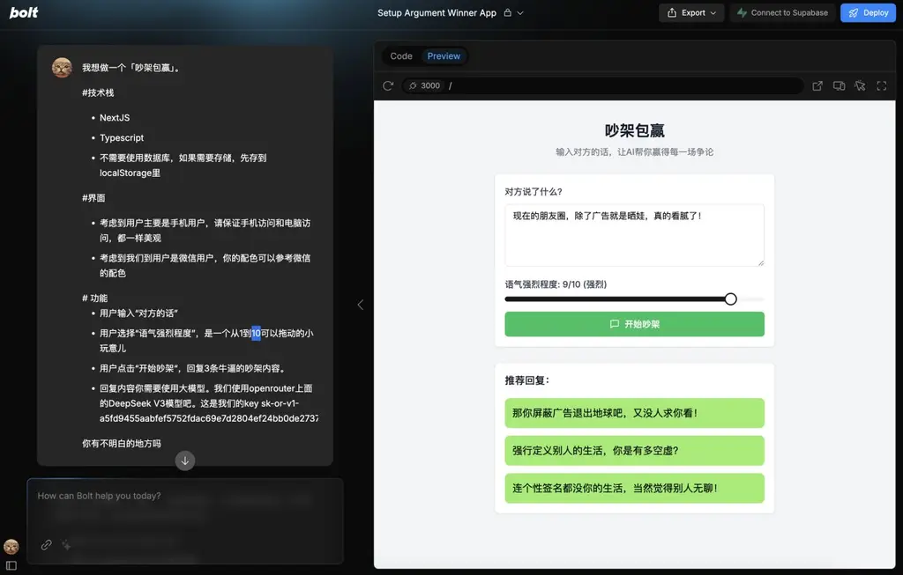

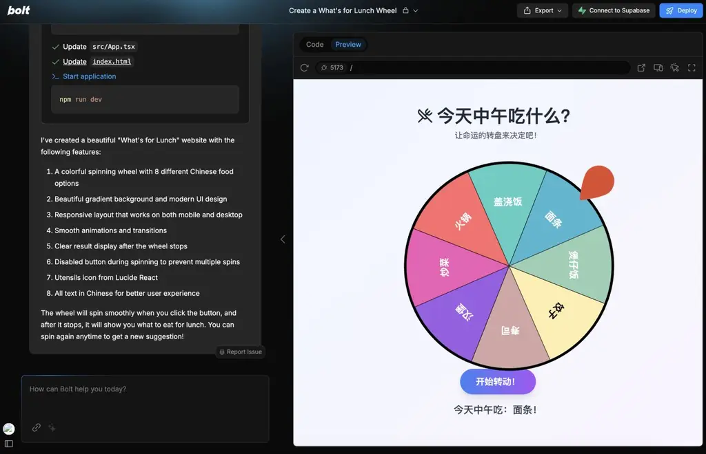

除了Bolt以外，这一步你还可以选择

1.

Firebase Studio

网址：https://firebase.studio/

介绍：Firebase Studio 是谷歌于 2025 年 4 月 9 日发布的 IDE，暂时免费，操作逻辑和 bolt 基本一致，可根据场景效果选择特定工具。

注意：截止到5月底，它的效果仍然没有bolt.new 好。

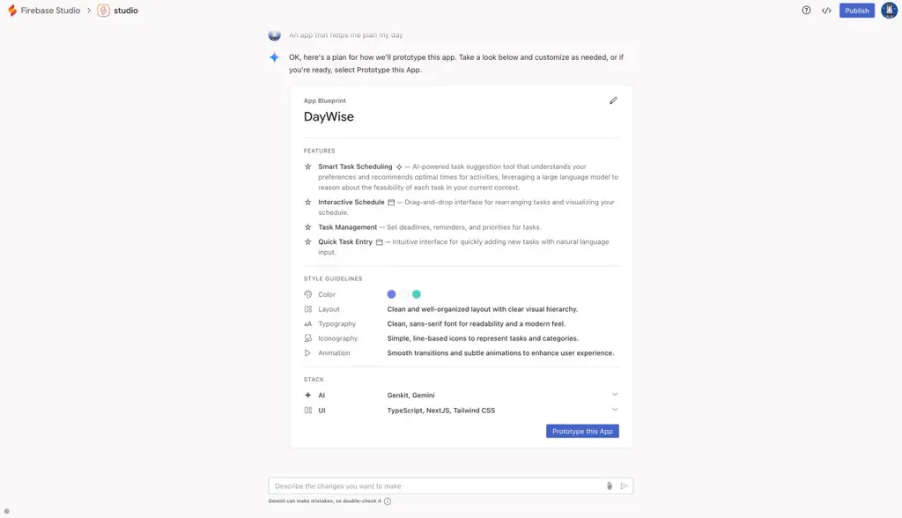

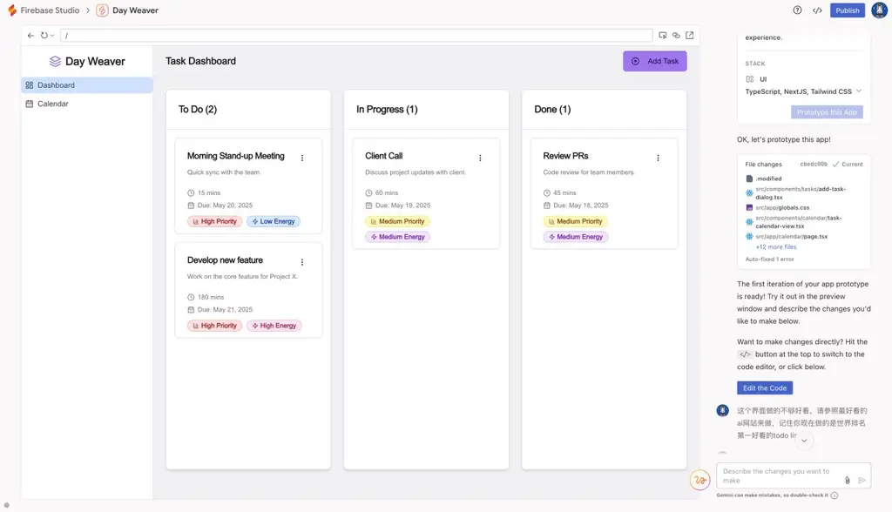

2.

V0.dev

网址：https://v0.dev/

介绍： V0、NextJS、Vercel(后面会用到），都是同一家公司的产品。从考虑后续兼容出发，V0是个很不错的选择。

Cursor内部支持调用V0模型

首先需要成为付费用户，才能在Cursor 中使用 V0

1.打开V0，找到 api

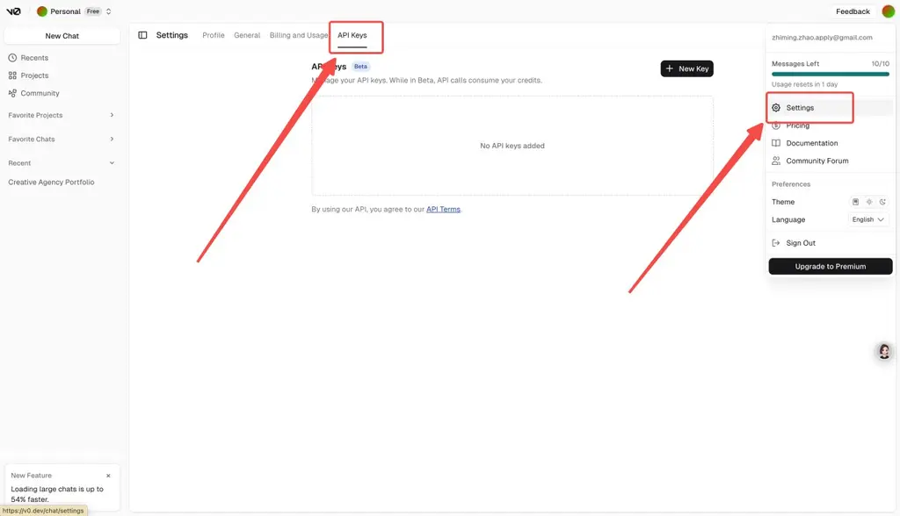

2.创建一个 key 并粘贴

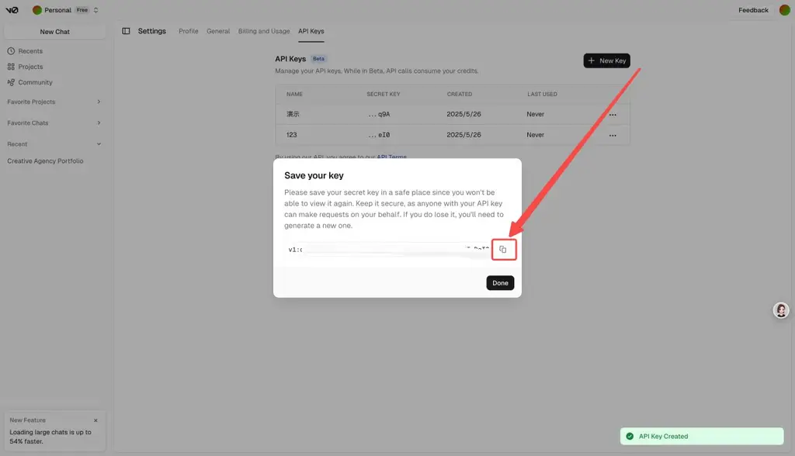

3.打开 Cursor 设置-model

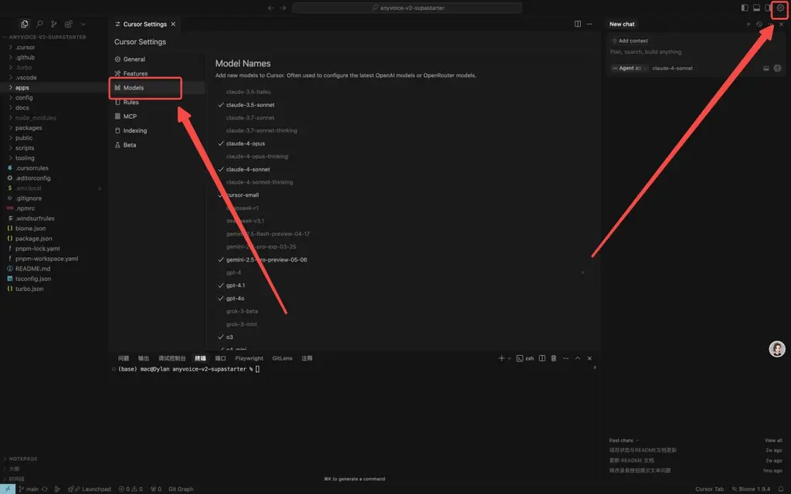

4.下滑至open ai key,并粘贴

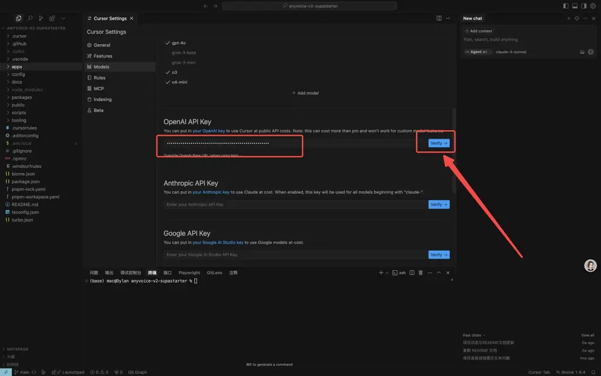

5.展开Override OpenAI Base URL

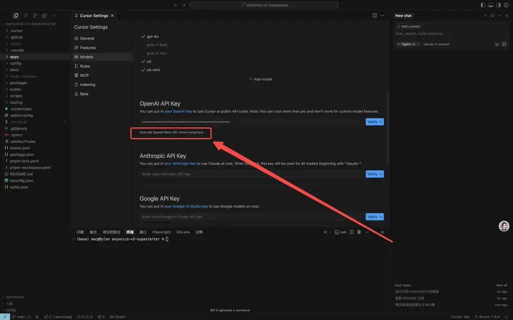

6.输入https://api.v0.dev/v1，保存

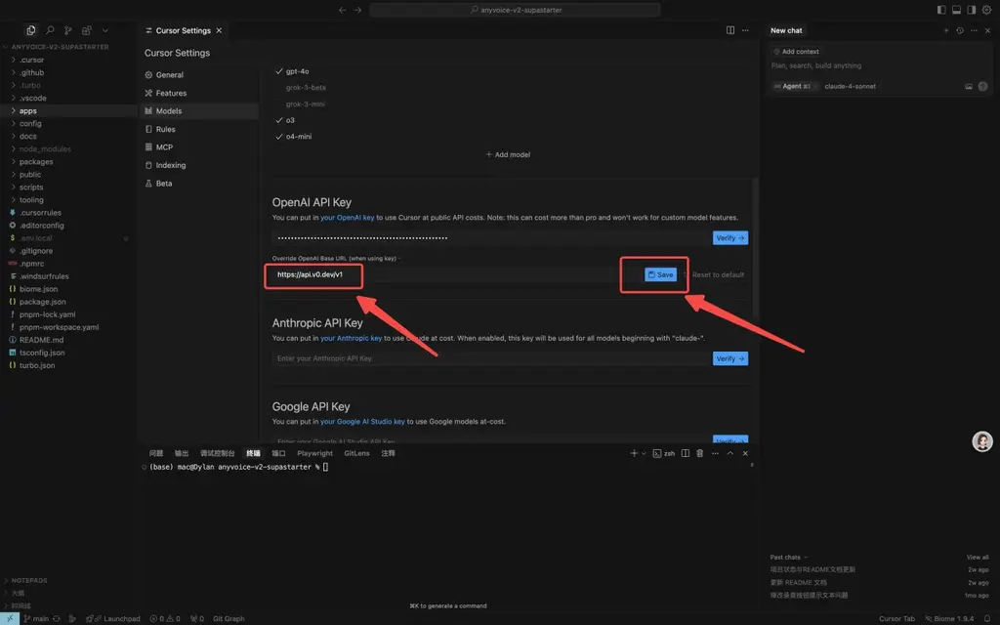

7.点击verify 确认连接

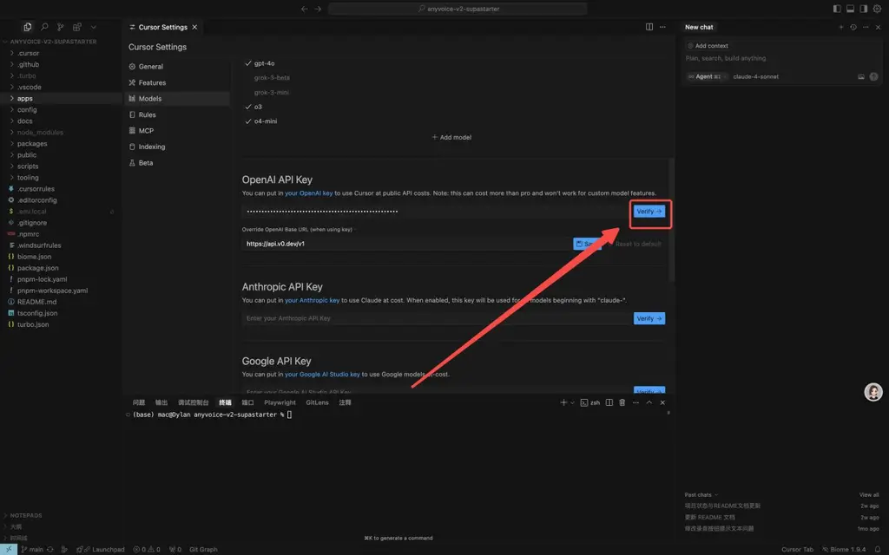

8.二次确定

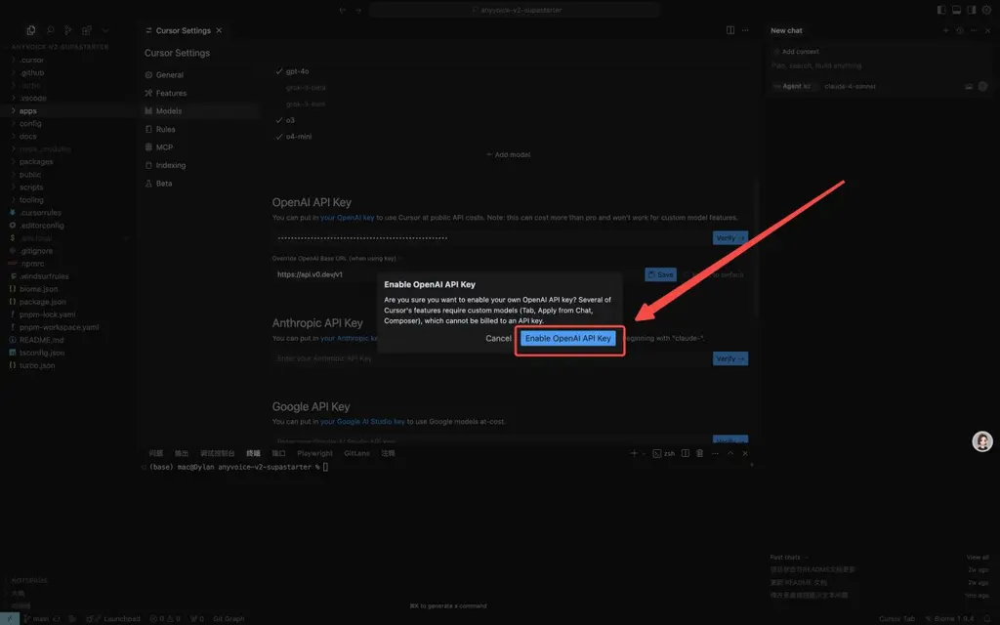

要在 Cursor 的代理模式下使用 v0-1.0-md ，请按照以下步骤操作：

打开一个新的聊天，选择Mode: Agent 模式：Agent

模型：选择任何标有 OpenAI 标签的选项（ gpt-4o 、 gpt-4-turbo 等）

光标将独立于所选模型内部使用 v0-1.0-md 。

开始聊天。光标将每条调用路由到 v0-1.0-md

3.

Lovable

网址：https://lovable.dev/

介绍：我很看好Lovable，我认为未来它可能会超过bolt。

如果你在完成本节课作业的时候，被bolt卡住了，不妨也去试试Lovable和V0

**1.5 一键部署**

在本课中，我们先采用最简单的部署方式： 用语言告诉 bolt“我想要部署我的网站产品，把链接发给我的朋友，请帮我操作”就可以了。视频里有演示。

具体操作步骤，上文的视频课程里有演示

**1.6 继续和 AI 协作**

你可以通过视频电话的方式，和 ChatGPT 讨论产品。视频能够传达的信息大于图片，图片能够传达的信息大于文字。使用 ChatGPT 的视频通话功能 ，可以最大化地让 AI 理解你、和你拉齐认知，达到非常近似于与人面对面交流的效果。

注：ChatGPT 需要安装官方客户端，在手机上才能视频通话。官方网页版本不可以。需要搞定网络环境。这一步如果实在不行，你可以先靠截图和打字。

ChatGPT 对我而言，已经远胜于普通的工具，它更像是我的朋友、甚至导师。

补充：如果你的网络情况不允许，也可以使用国内的豆包，豆包也有“打视频电话”功能。

具体操作步骤，上文的视频课程里有演示

**1.7 课后作业**

将你的产品发给至少 5 个目标用户，收集他们的反馈。

根据用户的反馈，你尽可能和 Bolt.net 对话、修改产品，让它更好。

下载和安装好 Cursor，为下节课做准备。

网址：https://www.Cursor.com/cn

附加作业：

请探索 https://lovable.dev/ ，总结它和 bolt.new 的优劣势

请探索 https://v0.dev/ ，总结它和 bolt.new 的优劣势

**1.8 彩蛋**

试试看，你能否掌握本课的办法，做一个“实时工资计算器”呢？如下面的视频

我也放了一个阉割版到线上，地址是 https://moyu.raphael.app

**1.9 加餐：让产品原型更精美**

如果你和我一样，没有太多审美能力和设计能力，可以在原型阶段，让其他AI工具来帮助我们设计。

我比较喜欢用的是 Stitch， Google家的产品

stitch.withgoogle.com

请看下面的简短截图和视频介绍，然后动手试试看。 拿到Stitch给我们的设计效果图后，我们可以发给Bolt或者Cursor, 让它们参考效果图。这样就能做出更漂亮、更专业的产品了！

第一步：打开 Stitch，选择Experimental Mode， 输入你的要求。

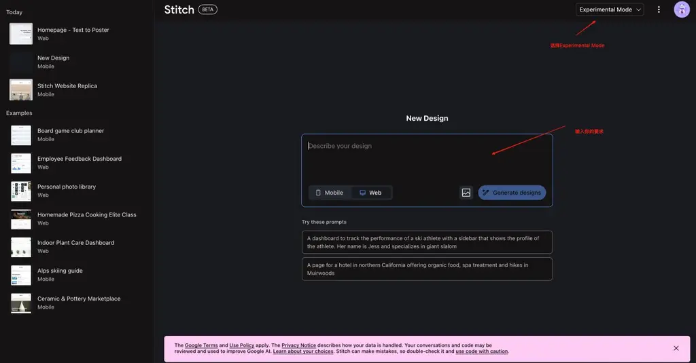

我输入的是

帮我设计一个Web产品。

产品定义：

1.

我们的产品叫做“AI海报生成器”。用户只需要输入海报的想法，产品就可以结合AI，设计出来非常厉害的商用级别海报。

设计要求：

2.

我需要苹果公司的风格

3.

功能和布局，你可以参考canva —— 这是另一家做海报的产品。不过我们的产品更加智能，要减少用户的选择，把更多的事情让AI完成

4.

产品所有文案用英文。包括产品的英文名，你也帮我想一个

我需要所有页面的设计

在得到我的请求后，Stitch返回了它的构思。你可以和它详细讨论。

不过，我一般更相信AI。我会回复“全都听你的”。如下图所示。

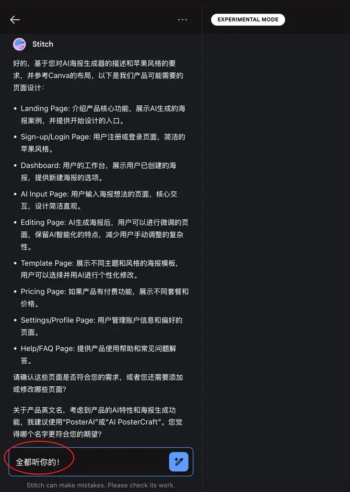

不一会儿，就全部出来了。

|                                                                                               |                                                                                            |                                                                                               |
|-----------------------------------------------------------------------------------------------|--------------------------------------------------------------------------------------------|-----------------------------------------------------------------------------------------------|
| 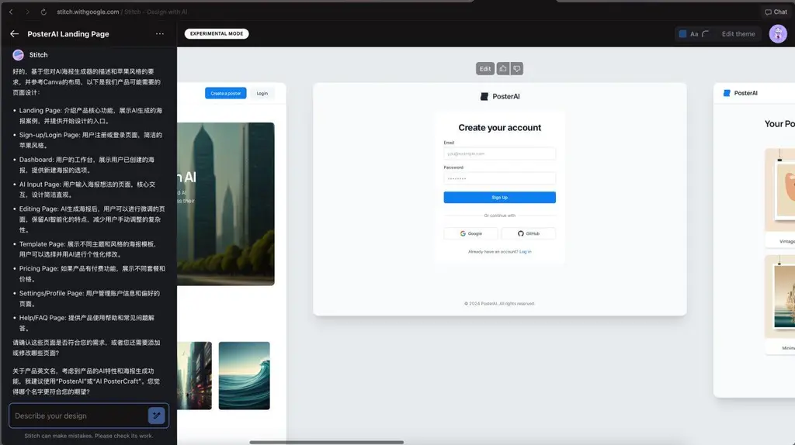 | 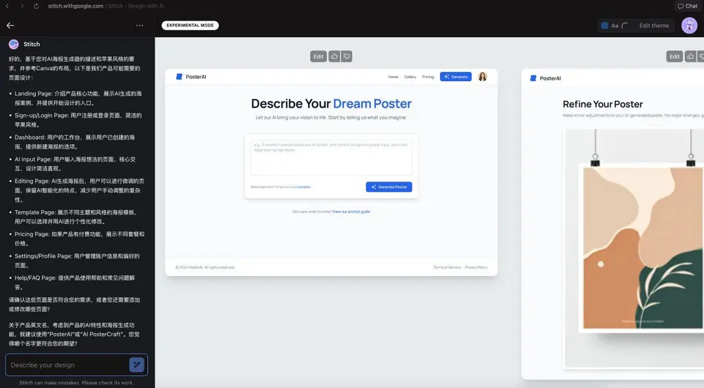 | 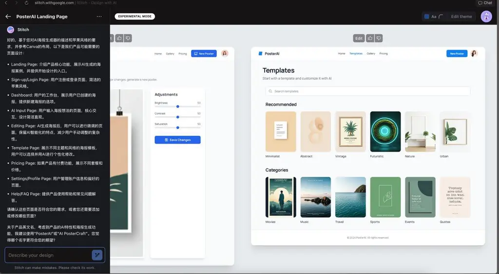 |

对于具体的图，你还可以点击Edit，继续口喷做修改。

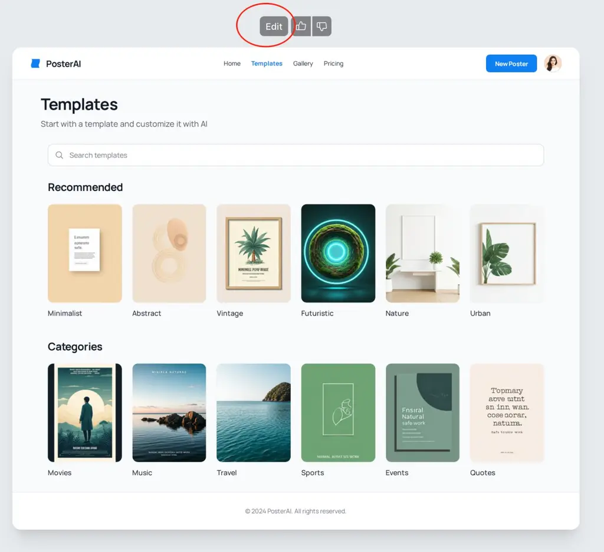

点击Edit后，我对它说

这个templates目录页面，我希望更专业，更像canva 给人琳琅满目的感觉

一会儿就改好了

第三步：获取前端代码

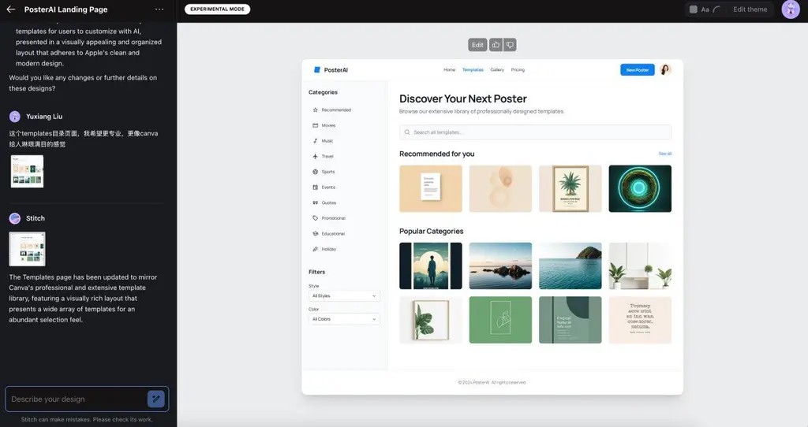

点击任何一张设计好的图，点击Code，可以获取前端代码

第三步：获取前端代码

点击任何一张设计好的图，点击Code，可以获取前端代码

|                                                                                                |                                                                                                |
|------------------------------------------------------------------------------------------------|------------------------------------------------------------------------------------------------|
| 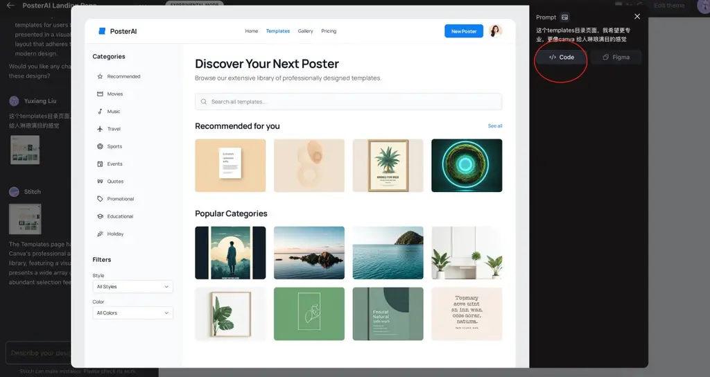 | 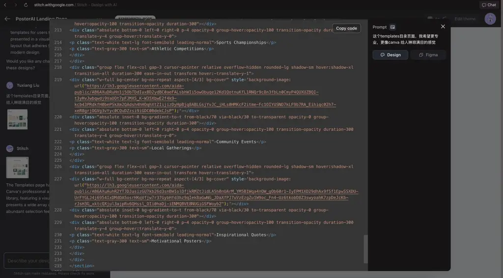 |

例如，这个的链接，就是我上面示例里的代码

https://play.tailwindcss.com/zriV9Op1Xh

你可以试试点击不同的图标（如下图所示），感受它在不同设备上的效果

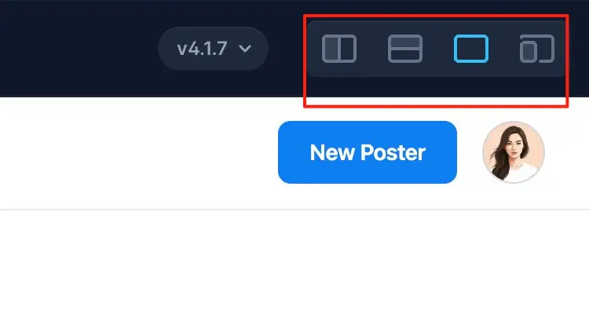

提醒：Slitch并没有完整的代码能力、只能做出界面布局的前端代码。

当你让Slitch完成原型图后，记得把图片（或者前端代码）给到Bolt/V0等其他可以写代码的工具，给它们参考。
