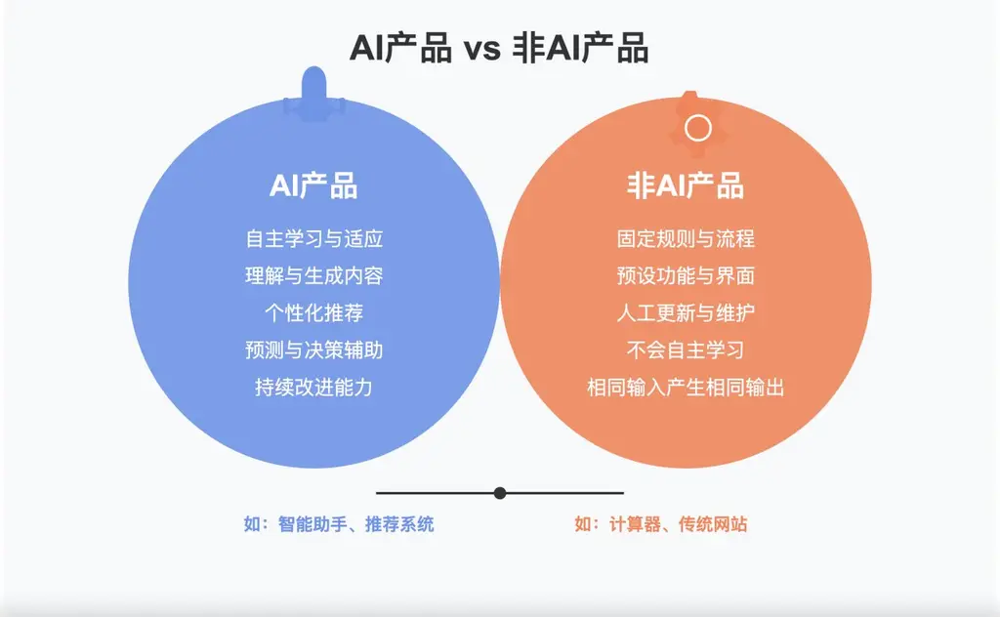
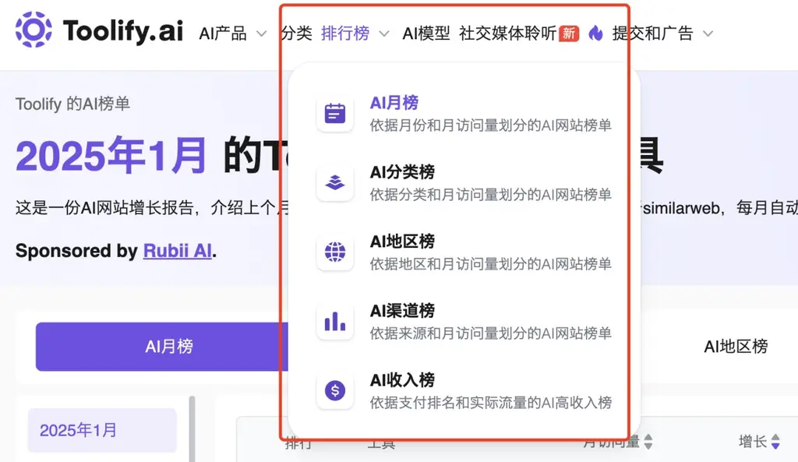
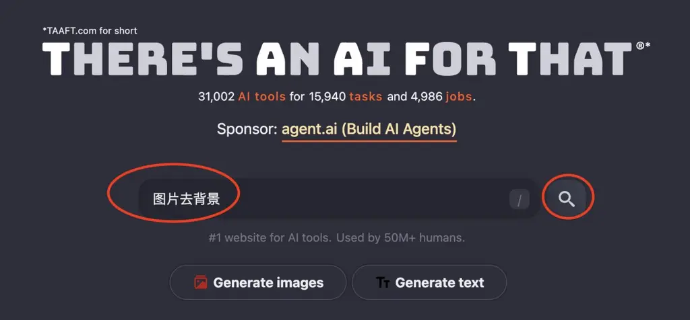
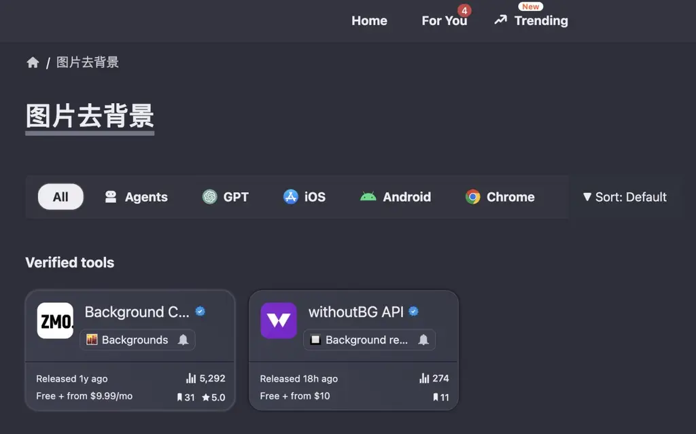
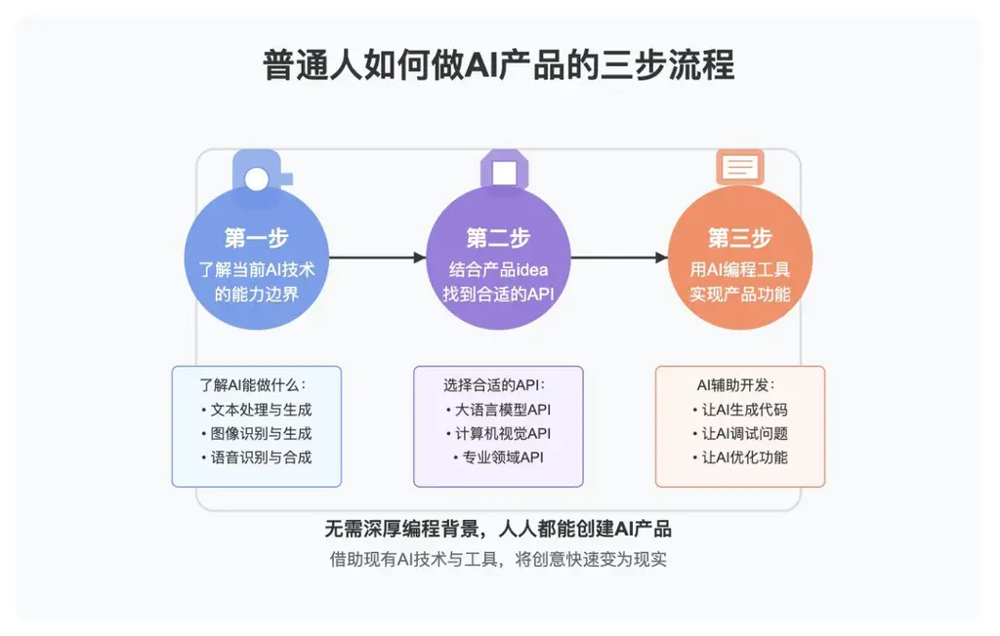
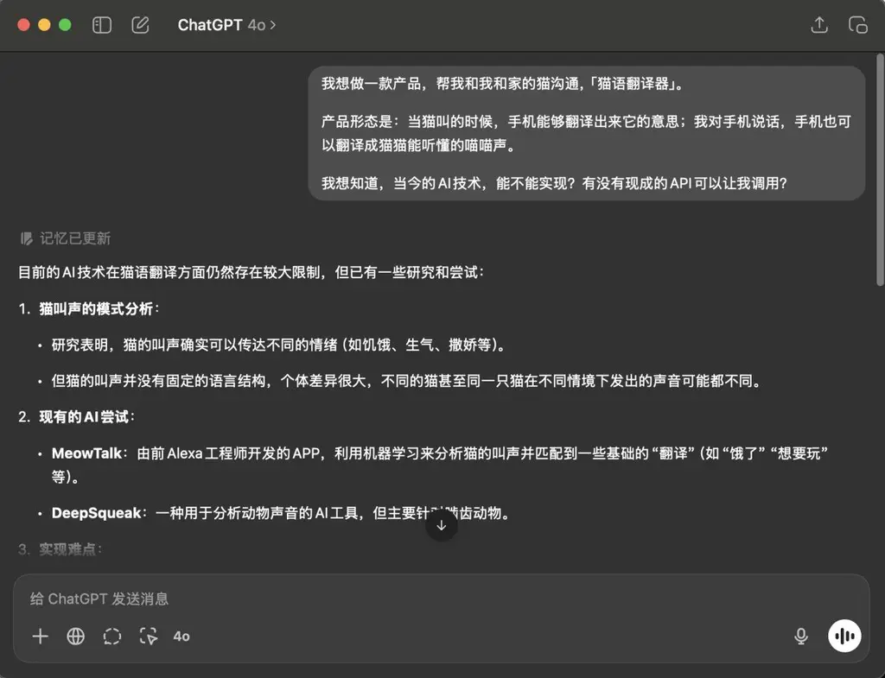
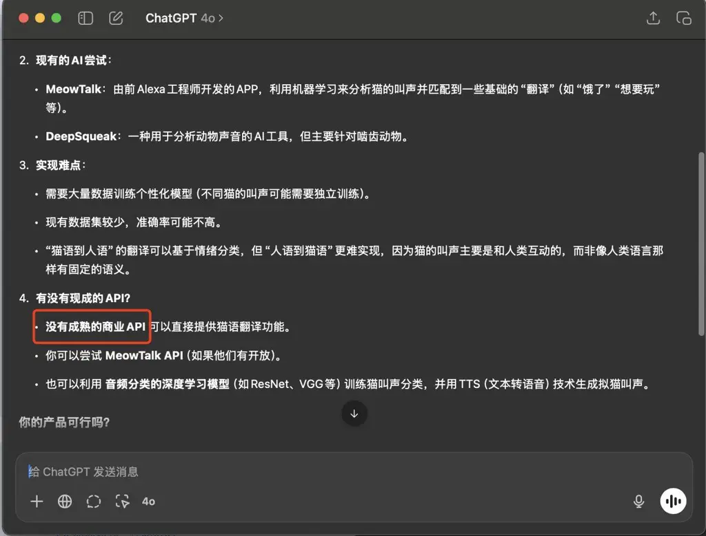
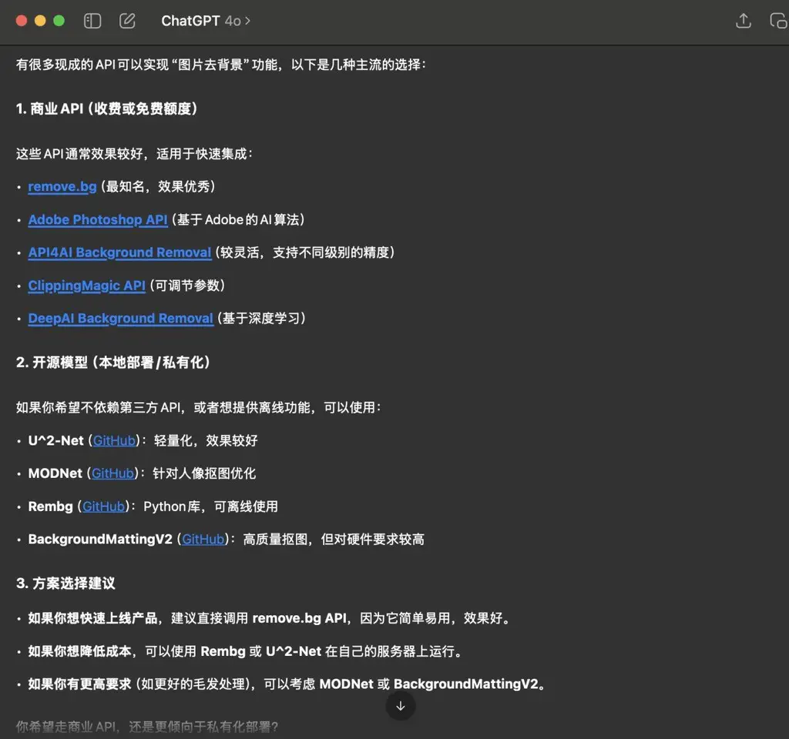

**基础二、怎么做「AI 产品」？**

**2.1 什么是「AI 产品」？**

「AI 产品」「AI 应用」「AIGC 产品」这些词最近真的很火，也有很多人通过做 AI 产品赚到钱。

到底什么是 AI 产品呢？

从文本是理解，使用 AI 技术（人工智能技术）的产品就是 AI 产品，不使用 AI 技术产品的就不是 AI 产品。

比如说，10 年前，你拨打 10086，它会先告诉你“中文，请按 1，英文，请按 2……”，当你按 1 之后，它会接着说“话费查询，请按 1；开通漫游，请按 2……转人工，请按 0”。 那个时候我们没有人工智能技术，产品只能按照机械化、公式化的方式执行任务，它们的基本运行方式是死板的规则逻辑。

我们来看个视频，先了解“什么不是 AI 产品”。

https://www.bilibili.com/video/BV16s41187Kt/

今天你拨打很多语音呼叫台，发现它们会像人一样和你沟通了，不再需要你按 1、2、3。它们不再依赖死板的规则逻辑，而是能够像人一样理解和思考、发挥创造力。比如，最近爆火的豆包、DeepSeek，相信大家已经能够熟练地使用它们了。

**2.2 赚钱的 AI 产品长什么样？**

AI 产品，（或者叫 AI 应用），最近几年呈现井喷爆发。有人说，所有的产品，都可以用 AI 重新做一遍，我深以为然。

也许你会好奇，赚钱的 AI 产品到底长什么样？ 我推荐两个信息源，大家可以花些时间多翻翻，让自己沉浸到里面，得到更加切实的感受。

第一个信息源： Toolify

网址： https://www.toolify.ai/zh/

我推荐它有以下理由

1、它在源源不断地收集市面上新出现的 AI 产品，无论是国内的还是国外的。

2、全中文界面，阅读起来更轻松。

3、每个产品的信息都收录得很完整，包括截图、用户数、用户趋势等等。

4、它每个月都提供排行榜，可以从总流量、地区流量、流量趋势、预估收入等多个方面进行排行，让你知道世界上正在发生什么、什么 AI 产品有用户、什么国家的用户喜欢什么样的产品、什么 AI 产品赚钱。 https://www.toolify.ai/zh/Best-trending-AI-Tools

对了，Toolify 这款产品是咱们生财有术的圈友阳光杉木的作品。

第二个信息源： TAAFT

网址：https://theresanaiforthat.com/

我推荐它的理由如下

1、它是全世界最大的 AI 应用导航产品，收录的产品比 Toolify 更全。

2、支持自然语言搜索。你不需要知道产品名字，只需要描述功能，就能搜索到提供相关功能的 AI 产品。如下图所示。

|                                                                                             |                                                                                             |
|---------------------------------------------------------------------------------------------|---------------------------------------------------------------------------------------------|
|  |  |

**2.3 普通人怎么做出 AI 产品？**

不知道你是否注意到，我们在第一课里演示的“吵架包赢”已经是一款 AI 产品了。由于它接入了 DeepSeek 的 API，所以在帮助用户构思吵架话术的时候，它可以借助于 DeepSeek 模型都能力，像人一样思考。

普通人做 AI 产品分为三步

1、了解当前 AI 技术的能力边界

2、结合你的产品 idea，找到对应的 API

3、把 API 文档交给 AI 编程工具，让它们帮我们实现。

第 1 步和第 2 步可以合并起来讲，因为如果你对哪些提供 AI 技术 API 的平台保持日常的关注，你既可以了解当前 AI 技术的能力边界、又可以轻易找到 API。

我们今天介绍 5 个常用的提供 AI 技术的 API 平台。

1、https://openrouter.ai/ 语言类模型 API 的综合平台

2、https://www.together.ai/ 语言类模型 API 的综合平台，同时也提供少量图片和视频处理模型

3、https://fal.ai/ 更专注提供图片和视频类 API

4、https://replicate.com/ 最全的 API 平台，缺点是相对其它家比较贵

5、https://siliconflow.cn/ 国内产品！适合小白，提供的 API 少而精A

**2.4 如何找到合适的 API？**

2.4.1 确定技术上是否可行

对初学者来说，如果你关注 AI 技术比较少，会遇到的一个问题是——不知道自己想做的产品，是否技术上可行？

除了刚才提到的，要多保持关注以外，你也可以和 ChatGPT/DeekSeek 等 AI 助手进行讨论、向它们请教。

比如，如果我想做一个“猫语翻译器”，不确定是否当今技术可以做到，可以问 ChatGPT。

我想做一款产品，帮我和我和家的猫沟通，「猫语翻译器」。

产品形态是：当猫叫的时候，手机能够翻译出来它的意思；我对手机说话，手机也可以翻译成猫猫能听懂的喵喵声。

我想知道，当今的 AI 技术，能不能实现？有没有现成的 API 可以让我调用？

很快可以发现两点结论：

1、当今技术可以做到，但是比较前沿，掌握在少数人手里；

2、没有现成 API

对于普通的应用开发者尤其是初学者，看到这两条结论，可以先行放弃，毕竟门槛有点高。

而对于有科学家或算法背景的人团队来说，这会让他们兴奋 ，因为他们知道，一旦自己做出来，就有壁垒。

|                                                                                          |                                                                                           |
|------------------------------------------------------------------------------------------|-------------------------------------------------------------------------------------------|
|  |  |

再来。继续问 AI，

我想做一个“图片去背景产品”，不知道是否有现成的 API 可以做到？

很快得到了答复，答案是肯定的。结论如下图所示

不仅如此，我们还了解到：

1、有很多平台都提供了成熟的 API。

2、甚至有一些开源的方案，可以自行部署 API，从而节省成本

3、同样是“去除图片背景”的能力，不同的 API 有不同的优势

总的来说，我会建议初学者优先选择 replicate 平台上的 API。

如果你要做的功能、在 replicate 平台上找不到现成的 API，那么可能它暂时不适合现阶段的你来实现。

**2.5 怎么做厉害的 AI 产品？**

心法：用积木的眼光看待 API

API 是可以像积木一样玩起来的！

我们举个例子，

HeyGen 在 2023 年爆火的一个功能是 AI 视频翻译 。用户上传一个原始视频（如英语讲话），HeyGen 自动翻译 成其他语言（如中文、法语、西班牙语等）并且调整口型，让说话人的嘴巴与翻译后语音保持一致，看起来就像原本是用该语言录制的一样。

我们从“API 积木”的视角来理解，HeyGen 需要串起来的是文字翻译、文字转语音、视频对口型这三类 API。

所以，不要小看这些 API 哦！

如果只调用一个 API，那么你的产品往往没什么价值，看起来会比较稀疏平常。

但是，如果你创造性地把多种 API 串联起来，想象空间是无限的！

没错，做产品，首先是个创意生意！

厉害的产品 = 厉害的创意！

有人会说，市面上所有的产品看起来都千篇一律，似乎没有什么可做的。

他错了！ 我们假设世界上有 100 种 AI 能力（显然不止）， 如果一个产品串起来其中两种 AI 能力，那么至少 100x100=1 万种产品形态。如果串起来三种 AI 能力，那么将会有 100x100x100 = 100 万种可能的产品形态！ 如果你串起来 4 种呢？5 种呢？

当你用搭积木的眼光去看待 AI 能力，你会有一种“海阔凭鱼鱼，天高任鸟飞“的爽感！

快去发挥自己的创造力吧！

**2.6 课后作业**

请结合你的产品 idea，到课程提到的平台，找到能够结合的 API。

重新构思你的产品 idea，发挥你的创意，找找“搭积木”的机会。

脑暴题：

1.

你能否做一个「分析你和对象聊天记录」的 AI 产品呢？

有哪些功能比较有创意？

通过组装哪些「积木」可以实现？

2.

能做否做一个「生成海报」的AI产品呢？

有哪些功能比较有创意？

通过组装哪些「积木」可以实现？
