**基础三、如何使用 Cursor 打磨产品？**

**3.1 使用 AI 工具开发产品的流程**

在第一课里面，我们是让大家玩起来用 Bolt.new 快速的实现一个小产品。

当时我们提到过，这个开发方式并不够好。也许你在尝试的的过程当中，也已经发现 bolt.new 没有那么听话。这不是你的问题，这是 Bolt 的问题。 Bolt 只适合做产品原型，尤其是做界面。而对于复杂的逻辑，Bolt 是比较难应付的。对产品精细化的打磨，我们需要用到 Cursor。

在介绍 Cursor 之前，我们先完整介绍真正的使用 AI 开发应用的流程应该是怎么样的。

0:48 大致来说有以下四步。

1.

找到一个待解决的问题

2.

与 AI 协作，完成产品需求文档

3.

让 Bolt 完成产品原型（界面和交互）

4.

使用 Cursor 持续打磨产品

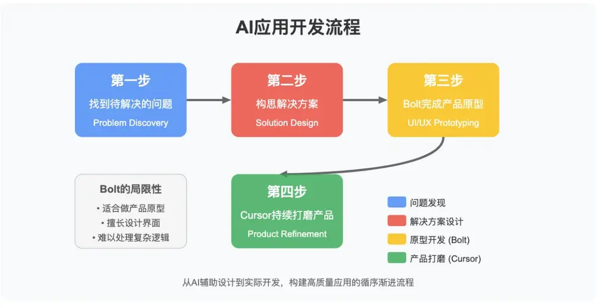

在这四步里，我们先假设第一步“待解决的问题”是 —— “完全不懂中文的外国人，想要起一个与自己匹配的中文名”。

接下来我们逐一演示后面的步骤。

**3.2 与 AI 协作，完成产品需求文档**

我们推荐使用带有推理功能的 AI 助手，例如 DeepSeek-R1、ChatGPT-O3、Claude 3.7-Thinking 等等。

使用语音对话或者文字都可以。

你可以持续和 AI 沟通很多很多轮。不必着急，这是你和 AI 互相启发的过程。

最终产出的应该是 “MVP 版本的需求文档”

|                                                                                                |                                                                                                |
|------------------------------------------------------------------------------------------------|------------------------------------------------------------------------------------------------|
| 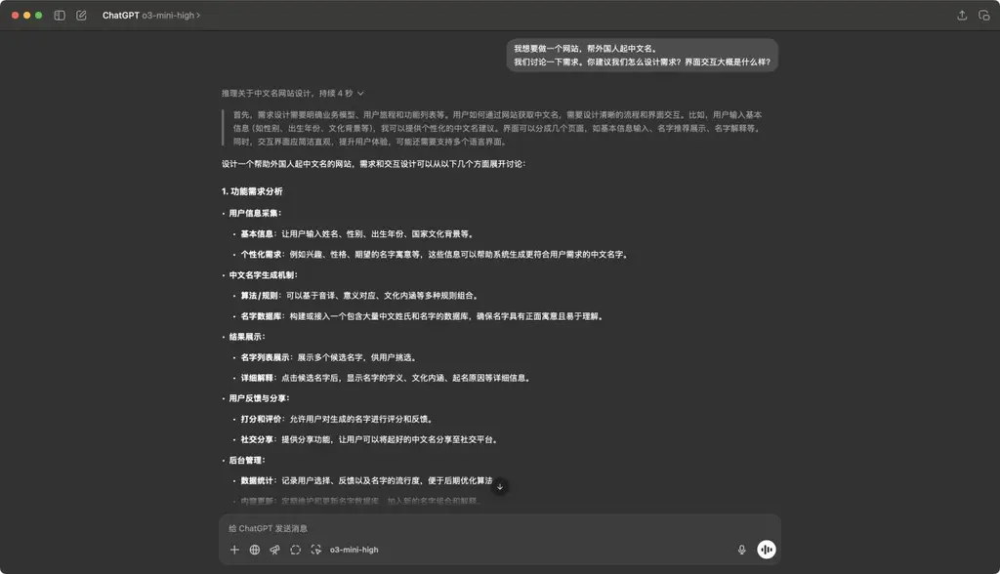 | 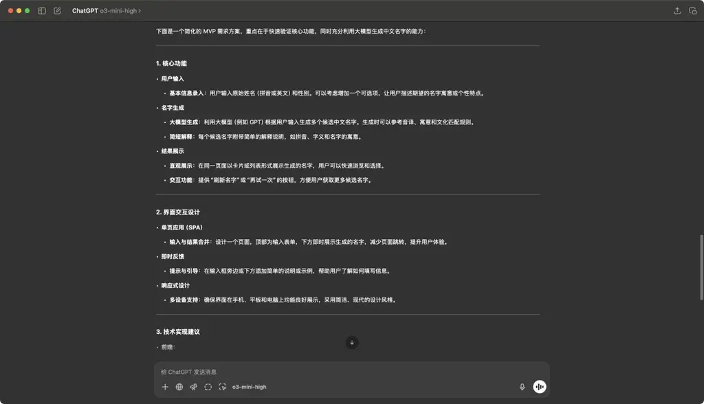 |

如果你使用的是 Claude（可用Poe），还可以让它生成图文并茂的需求文档，更加没有歧义，如下图所示

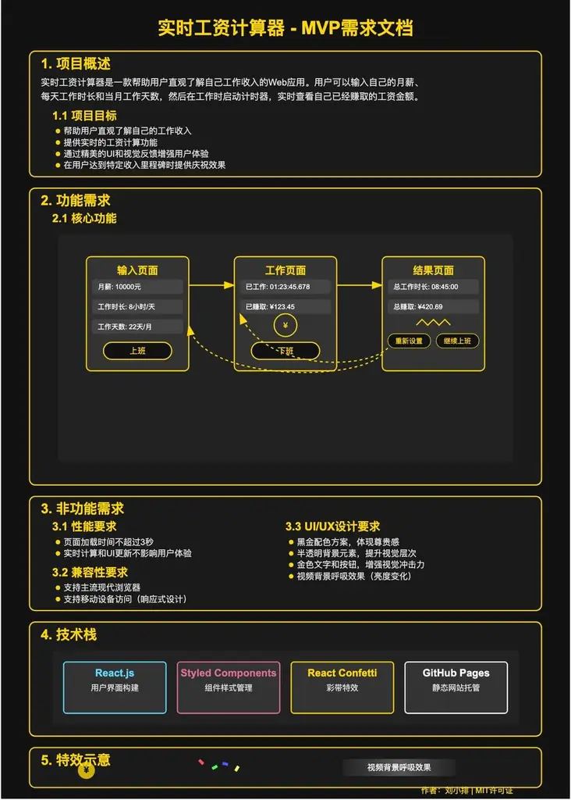

**3.3 使用 Bolt 制作产品原型**

什么是产品原型？

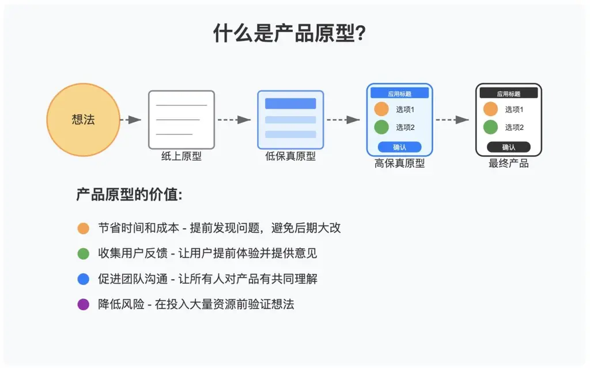

纸上原型、低保真原型、高保真原型，我给大家看一个例子：

https://idyllic-licorice-e2843b.netlify.app/

得益于 Bolt 的原型构建能力，我们可以很快地做出来同样精美的首页以及交互原型。

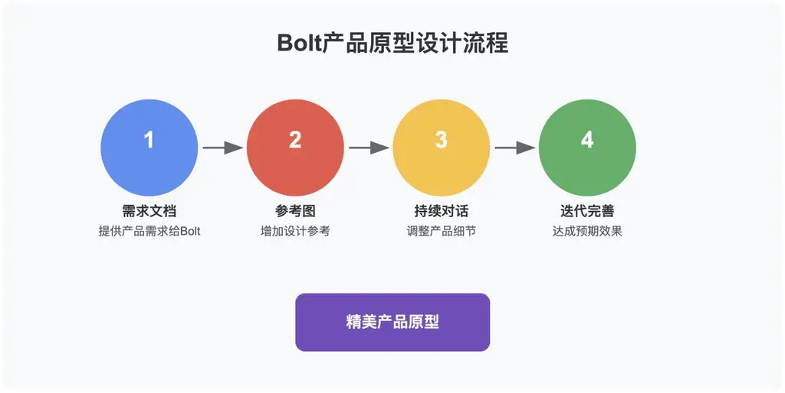

步骤

1.

把「需求文档」给到 Bolt，让 Bolt 完成「产品原型」（界面和交互）。

2.

可以增加参考图，进一步消除你与 AI 沟通的歧义。

3.

与 Bolt 持续对话，让 Bolt 根据你的产品功能设计，调整产品原型的「细节」。

4.

反复迭代，直到「产品原型」完全符合你的预期

**3.4 在电脑上安装开发环境**

之前我们在 Bolt 开发是不需要安装环境的。其实这也是为什么我总给新手用户推荐 Bolt，因为它自带了一套云端的开发环境，让你节省了大量的时间。

现在我们要转到自己的电脑做开发，因此需要在电脑上安装开发环境。

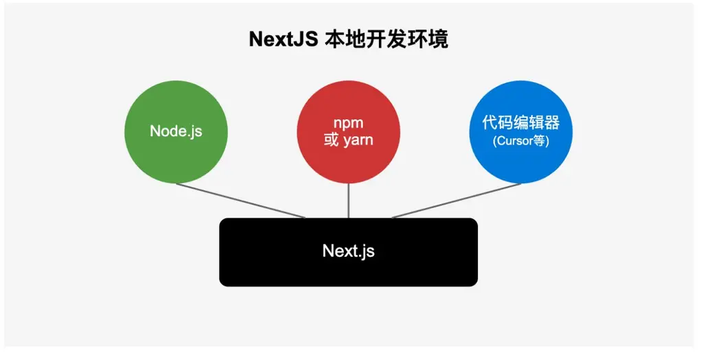

NextJS 开发环境的搭建相对来说还比较容易，主要是安装 Node 和 NPM 这两项。具体怎么安装你可以上网查询，而我的习惯呢，一般是询问 ChatGPT 即可。

当然，我们还需要安装 Cursor。 请注意，一定要给 Cursor 付费喔～价格是$20 美元/月。

https://www.cursor.com/cn

在本课程录制的时候（2025 年 2 月 26 日），Cursor 的最新版本是 0.46.5。Cursor 版本更新很快，很快就有新的版本，它们界面可能有所差异。不过请不用担心，原理都是相似的。

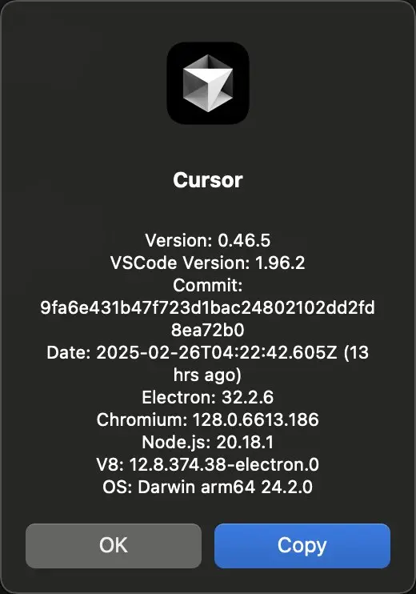

**3.5 Cursor 的简单介绍**

使用 Cursor 开发 NextJS 应用，我们快速认识四个区域：

代码目录结构区域

代码编辑器区域

和 AI 沟通的区域

控制台区域

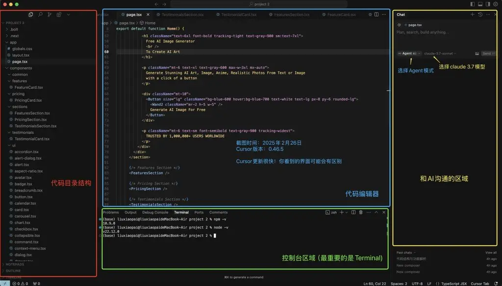

设置区域，可以打开一些高级功能。

规则 （Cursor Rule）

https://Cursor.directory/

我们的项目基于 NextJS/Typescript/Shadcn，可以先填入以下规则

打开设置

点击 rule，填入以下规则

|                                                                                                |                                                                                                 |
|------------------------------------------------------------------------------------------------|-------------------------------------------------------------------------------------------------|
| 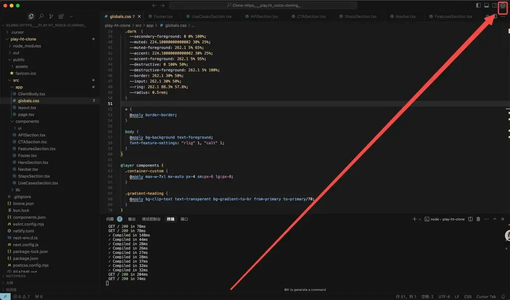 | 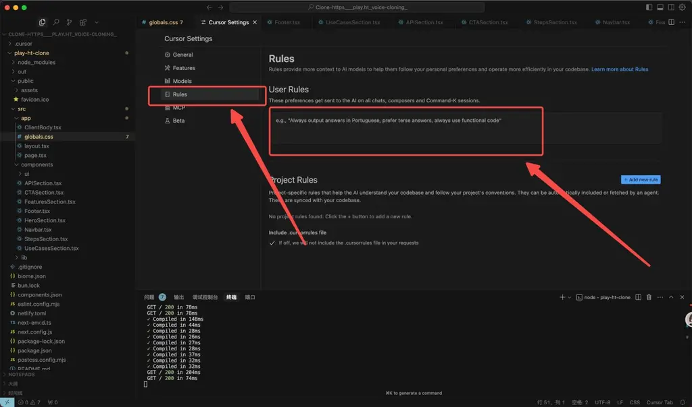 |

可复制版本：

You are an expert in TypeScript, Node.JS, Next.JS App Router, React, Shadcn UI, Radix UI and Tailwind.

Code Style and Structure

Write concise, technical TypeScript code with accurate examples.

Use functional and declarative programming patterns; avoid classes.

Prefer iteration and modularization over code duplication.

Use descriptive variable names with auxiliary verbs (e.g., isLoading, hasError).

Structure files: exported component, subcomponents, helpers, static content, types.

Naming Conventions

Use lowercase with dashes for directories (e.g., components/auth-wizard).

Favor named exports for components.

TypeScript Usage

Use TypeScript for all code; prefer interfaces over types.

Avoid enums; use maps instead.

Use functional components with TypeScript interfaces.

Syntax and Formatting

Use the "function" keyword for pure functions.

Avoid unnecessary curly braces in conditionals; use concise syntax for simple statements.

Use declarative JSX.

UI and Styling

Use Shadcn UI, Radix, and Tailwind for components and styling.

Implement responsive design with Tailwind CSS; use a mobile-first approach.

Performance Optimization

Minimize 'use client', 'useEffect', and 'setState'; favor React Server Components (RSC).

Wrap client components in Suspense with fallback.

Use dynamic loading for non-critical components.

Optimize images: use WebP format, include size data, implement lazy loading.

Key Conventions

Use 'nuqs' for URL search parameter state management.

Optimize Web Vitals (LCP, CLS, FID).

Limit 'use client':

Favor server components and Next.JS SSR.

Use only for Web API access in small components.

Avoid for data fetching or state management.

Follow Next.JS docs for Data Fetching, Rendering, and Routing.

在这里填

**3.5 让 Cursor 理解和运行代码**

使用 Cursor 打开 Bolt 的代码，我们会优先干三件事

1.

让 Cursor 理解现有代码

2.

在 Cursor 的帮助下，在本机运行代码

3.

使用 Cursor 重构代码结构 （Bolt 代码结构有可能不合理，让 Cursor 帮忙检查和微调）

**3.6 完成产品实际功能**

好的，我们现在看到的是一个比较标准的 NextJS 项目，我们开始添加 API 给他添加实际功能。

我们继续以「给外人起中文名」为例。

考虑到一些学员没有海外的信用卡，本次我们使用硅基流动提供的 API。

https://cloud.siliconflow.cn/

当然，如果条件允许，我还会更加建议你使用 OpenRouter，它可以选择的 API 更多、速度更快、更稳定。 在本次演示的代码中，我使用 OpenRouter 上 Gemini-Flash 模型， 对比硅基流动的 DeepSeek V3 模型，运行速度快了至少 5 倍。

请查看视频。

**3.7 持续打磨产品细节**

可以试试：

1.

添加新的页面

2.

添加新的功能

3.

修改已有功能

4.

更换

**3.8 API 讲解**

1.

API 是什么？

API（Application Programming Interface，应用程序编程接口）就像是“软件之间的桥梁”。它规定了一套“规则”，让你的程序可以向别人的程序“提问”或“请求服务”，对方会按照规则返回数据或结果。

比如，你的网站想要显示天气信息，可以通过天气 API 获取实时天气数据；

比如，你的网站想实现专业的文档编辑，可以调用文档类成熟的 API，而不需要自己从 0-1 写

比如，你的网站想实现自由对话，可以调用大模型 API

以上都是调用 API 的形式和场景

2.

为什么在做产品中需要 API

为了快速集成外部能力、获取实时和权威数据、降低开发和维护成本等目的

API 就像是“功能积木”，让开发者可以像搭积木一样，快速拼出强大、丰富的产品。这也是现代互联网产品开发的主流方式

3.

如何调用 API

通常流程：阅读 API 文档 ➡️ 获取 API 的 url 和 key ➡️ 让 AI 学习 API 文档 ➡️ 描述 API 使用需求 ➡️ 配置存在 env 文件

以 DeepSeek 的 API 为例

阅读 API 文档

在正式使用一个 API 之前，首先要仔细阅读官方提供的 API 文档。文档中会详细介绍 API 的功能、可用的接口、请求方式、参数说明、返回数据格式、错误码等内容。通过阅读文档，你可以了解这个 API 能做什么、怎么用、有哪些注意事项。

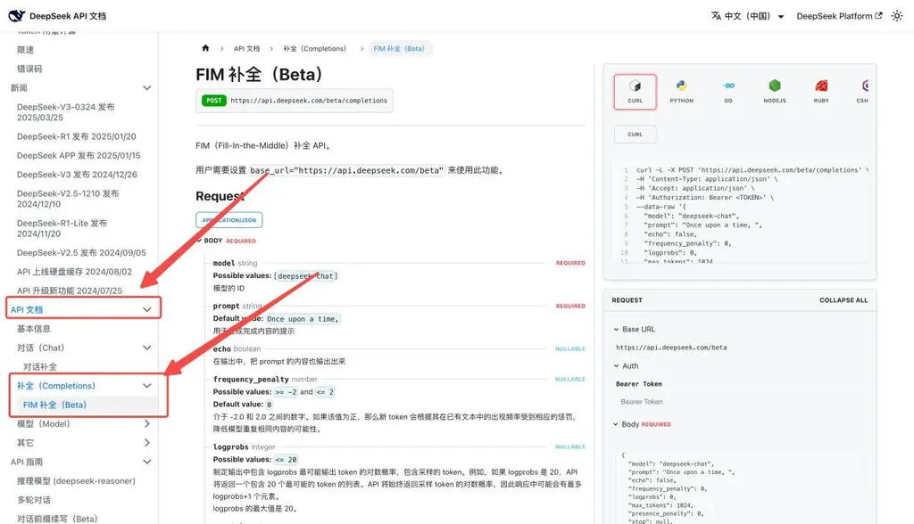

定位到 API 文档

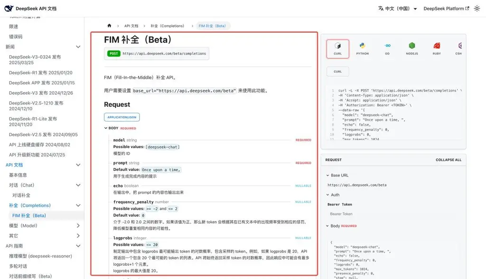

阅读 API 的整体内容

获取 API 的 URL 和 Key

大多数 API 都需要你注册账号，申请并获取专属的 API Key（密钥），有些还会提供不同的环境（如测试环境和正式环境）的 URL。API Key 相当于你的“通行证”，用来标识和保护你的请求。没有 Key 或者 Key 错误，API 通常不会返回数据。

创建 key

复制 key

让 AI 学习 API 文档

如果你在用 AI 辅助开发（比如用 ChatGPT、Copilot 等），可以把 API 文档的内容输入给 AI，让 AI 理解 API 的用法和规则。这样，AI 可以帮助你自动生成调用 API 的代码、解释参数含义，甚至帮你排查错误。

描述 API 使用需求

明确你要用 API 实现什么功能，比如“我要用这个 API 获取某个城市的天气信息”或者“我要用 AI 接口生成一段文本”。把你的需求用自然语言或伪代码描述清楚，有助于 AI 或开发工具帮你生成更准确的代码。

**任务目标**

描述你要做什么

**任务背景**

说明一些需要让AI知道的背景信息，越详细越好

**可能需要的信息**

放API信息、说明文档等

配置在 env 文件

为了安全和方便管理，API Key、API URL 等敏感信息通常不会直接写在代码里，而是放在项目根目录下的.env环境变量文件中。这样做可以防止密钥泄露，也方便在不同环境（开发、测试、生产）切换配置。代码中通过读取环境变量来获取这些信息。

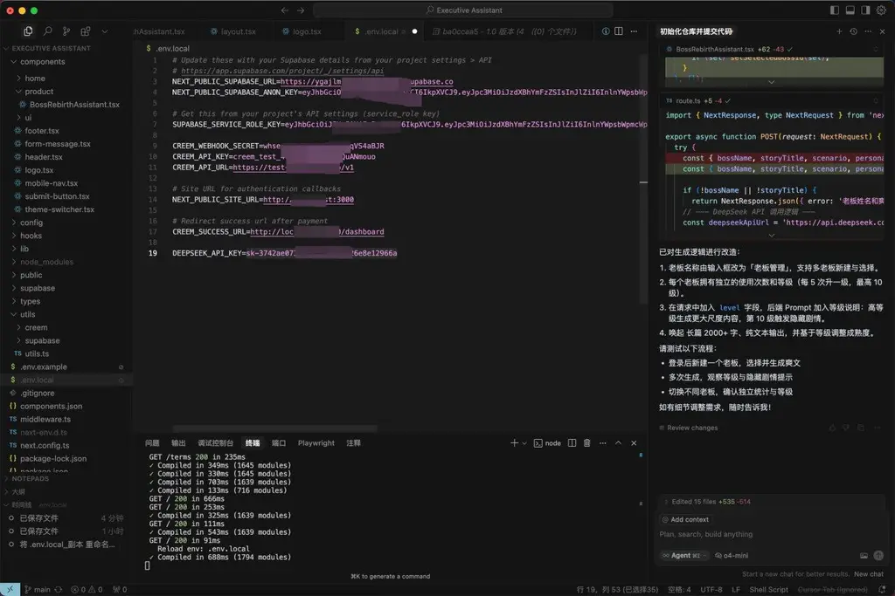

实际调用与调试

配置好环境变量后，就可以在代码中调用 API 了。可以先用 Postman 等工具测试 API 是否能正常返回数据，再在项目中集成。遇到问题时，回头查阅文档、检查参数和 Key 是否正确。

安全与合规

注意保护好 API Key，存在 env 文件中，不要上传到公开的代码仓库。部分 API 有调用频率限制或付费要求，开发时要关注这些限制，避免超额调用导致服务中断或额外费用。

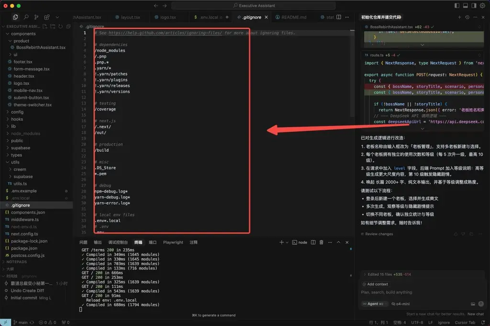

通过以上流程，你可以高效、安全地集成和使用各种 API，为你的 AI 产品或网站赋能。

**3.9小白调用方式推荐**

推荐小白使用的硅基流动：https://siliconflow.cn/zh-cn/

**3.10 加餐：不懂代码，如何快速且精准的让Cursor修改界面？**

答案是使用stagewise，这是一款Cursor插件。

可以实现如下效果：（请看录屏，1分钟）

1.

使用鼠标，哪里不爽点哪里

2.

点完之后，Cursor会精确修改。

怎么做到的？ 你需要借助Cursor里的stagewise插件。

第一步，打开Cursor，搜索stagewise

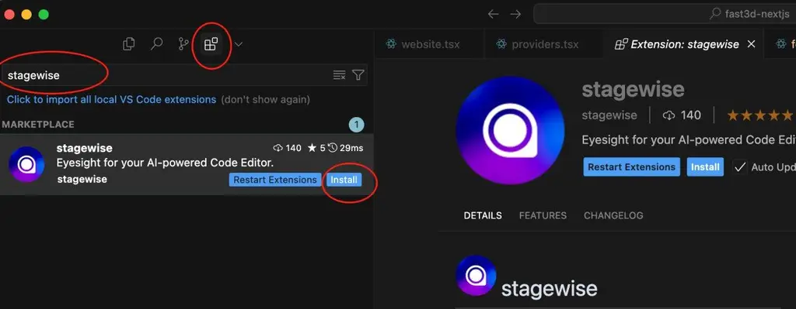

第二步，

在Cursor界面中使用快捷键 Command + Shift + P （如果是Windows电脑，使用 Ctrl + Shift + P ），会看到如下图所示的小弹窗。

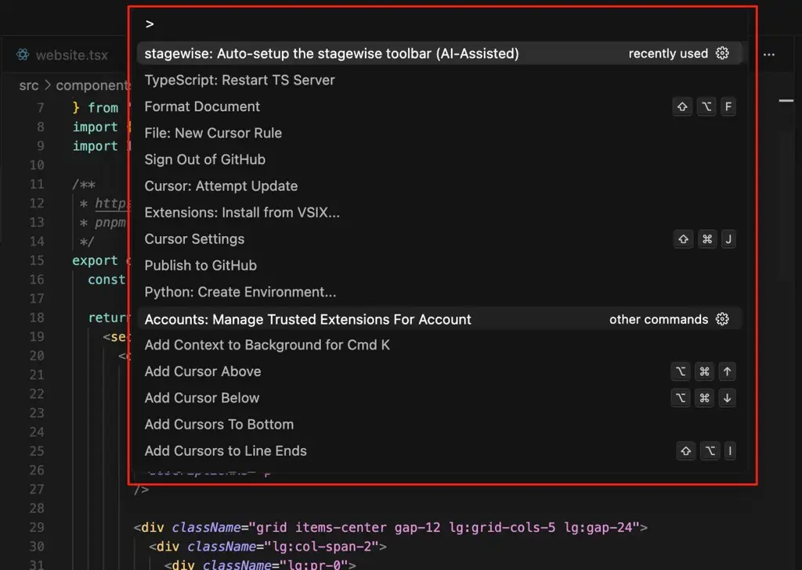

在这个小弹窗里输入stagewise，可以搜索到stagewise的自动安装脚本。点击他

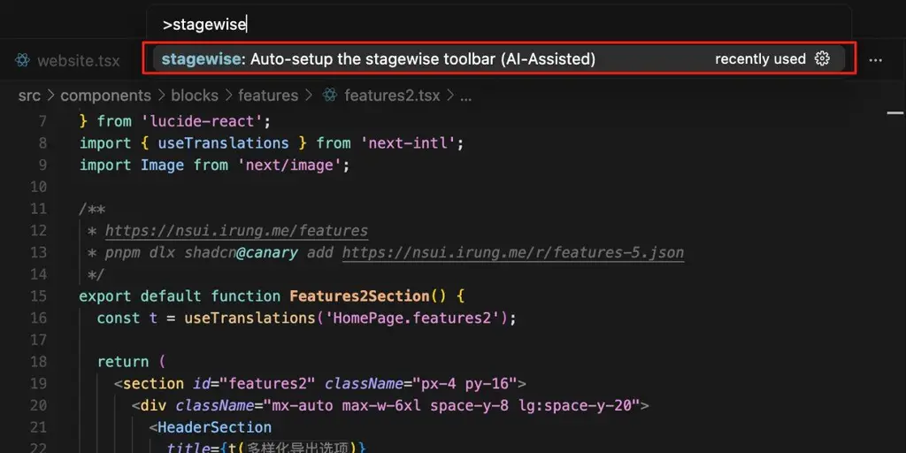

点击后，会发现Cursor自动开始工作，已经在安装了

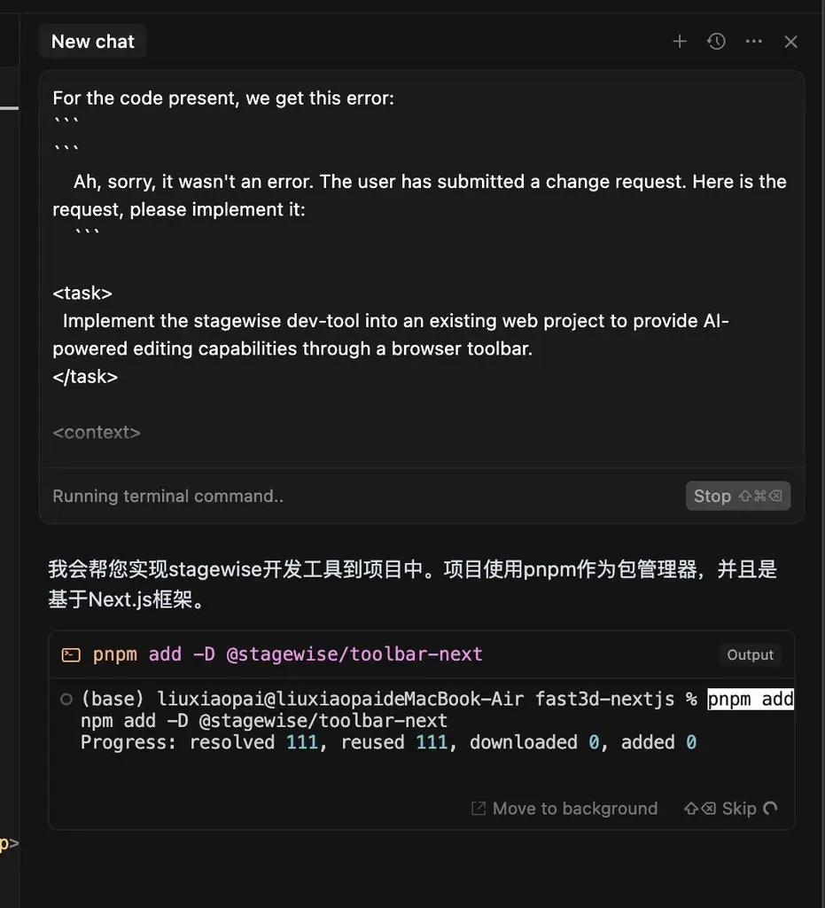

然后，在你正常的NextJS项目中启动 pnpm run dev 或者 npm run dev ，在 https://localhost:3000 中，就会出现这个插件。正如上文的录屏所示

特别提醒

1、stagewise和claude 3.7配合得最好。和其他模型配合得一般。

2、stagewise和cursor虽然好用，但是它们不能直接替代你的学习过程。

**3.11 课后作业**

请做出第一 MVP 产品，不需要非常完美，但能实现一定的功能，且满足用户交互体验。 Have Fun!
