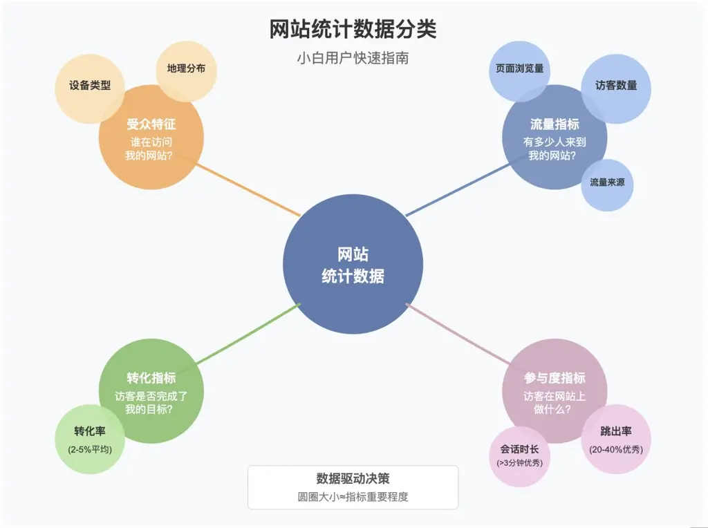
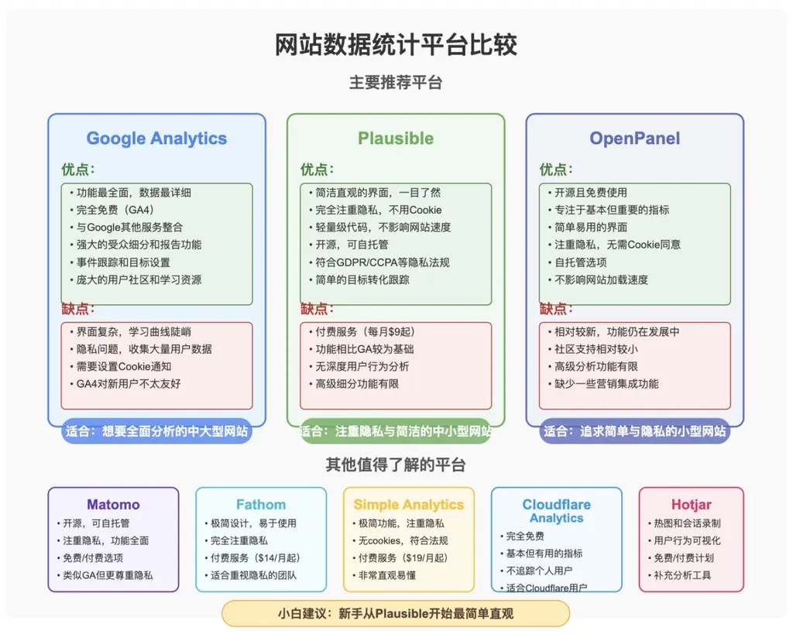
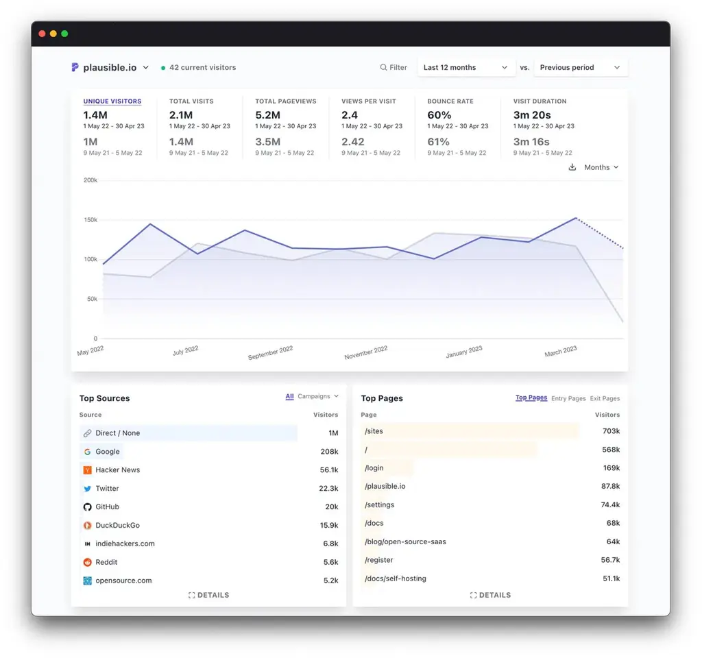
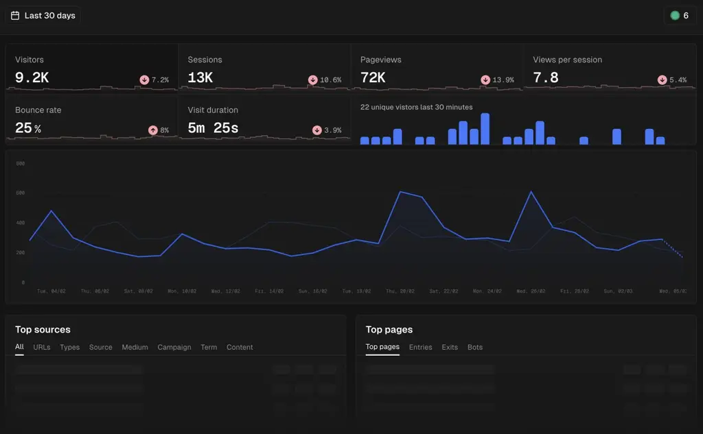
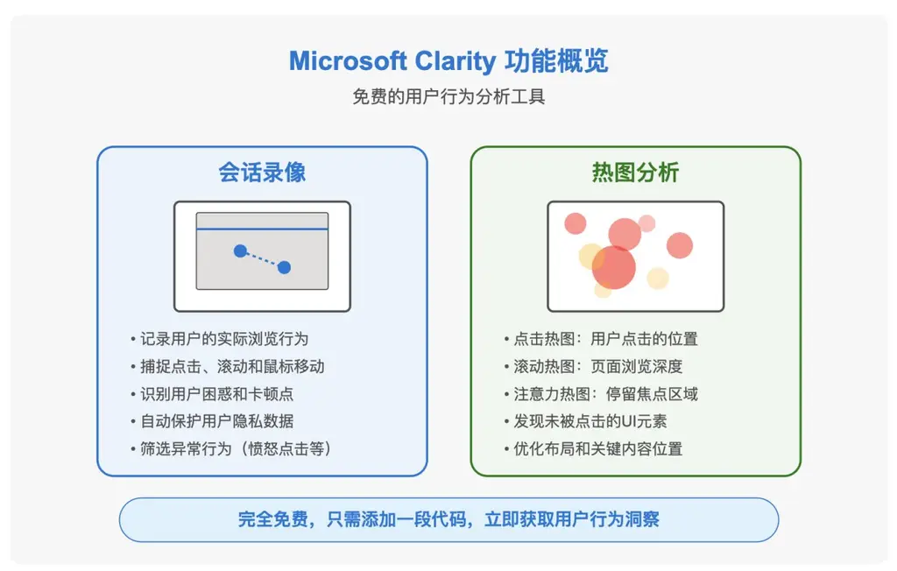
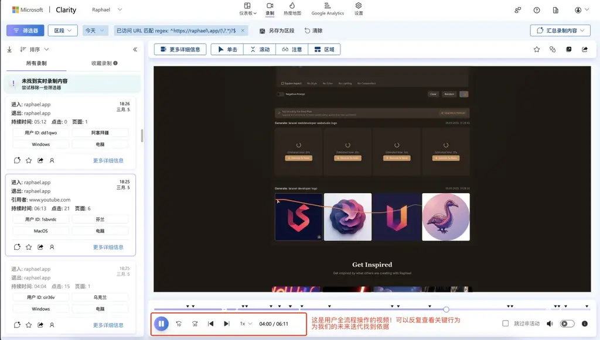
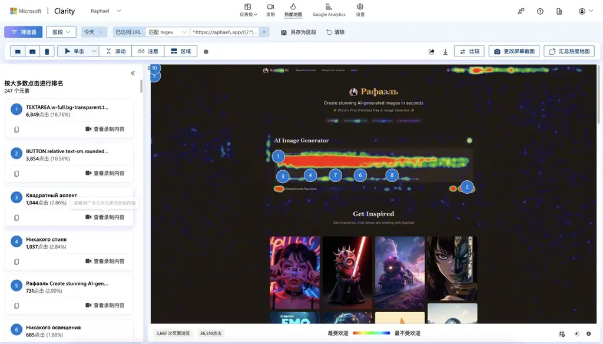
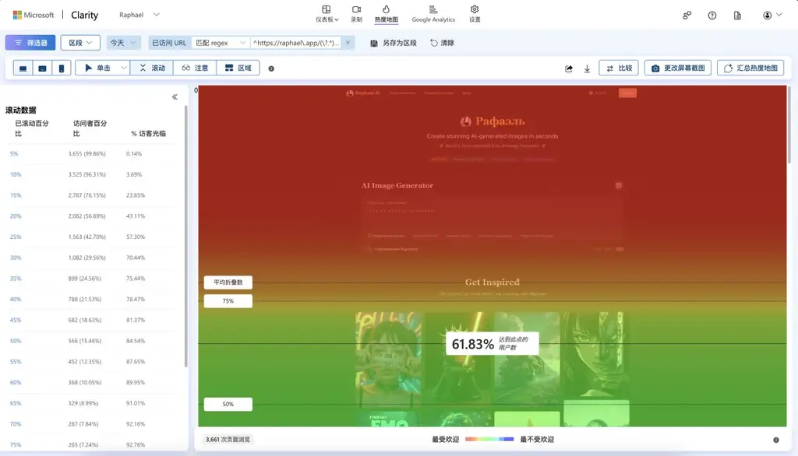

**六、如何分析用户行为？**

好的产品是迭代出来的。迭代产品，依赖于用户反馈。

除了面对面收集以外，还有哪些方法可以收集到远在千里之外的陌生用户的反馈呢？

💡

了解用户行为 = 掌握迭代产品的依据

**视频**

第六课·如何分析用户行为.mp4【在线播放】

**6.1 网站统计数据指南：小白必读**

作为网站产品拥有者，了解你的用户如何与网站互动至关重要。请熟练掌握以下概念。

视频里我会讲解

你可以点击这里——这是 plausible 官方网站的统计数据。数据是公开的。你可以点击链接，熟悉这些统计数据。

https://plausible.io/plausible.io

1.

访客数量（Unique Visitors）

**含义**：在特定时间段内访问您网站的不同用户数量。一个用户无论访问多少次，都只被计为一个独立访客。

**为什么重要**：这是最基础的指标，直接反映了您网站的受众规模和吸引力。

**行业基准**：

可以只靠 Adsense 广告挣到每月 1 万美元：每月 100 万访客左右

靠订阅挣到美元 1 万美元：每月 10 万～30 万访客（发达国家访客为主）

可以上牌桌的 AI 产品：每月 100 万访客以上

腰部 AI 产品：每月 300～500 万访客

细分品类的头部 AI 产品：每月 1000 万以上访客

**建议**：关注访客数的增长趋势比单一数字更有意义。稳定增长的曲线通常比短期飙升更健康。

2.

跳出率（Bounce Rate）

**含义**：只浏览一个页面就离开网站的访客百分比。

**注意**：搜索引擎很喜欢这个数据！搜索引擎喜欢把流量优先给优质网站。如果某个网站用户总是看了一页就走了，搜索引擎会倾向于认为它不是一个优秀网站。

**为什么重要**：高跳出率通常表明访客没有找到他们想要的内容，或网站体验不佳。

**行业基准**：

优秀：20-40%

平均：40-60%

需改进：70%以上

**例外情况**：对于单页网站、博客文章或查询特定信息的页面，高跳出率是正常的。

**建议**：改善导航、内容相关性和页面加载速度可降低跳出率。

3.

平均会话时长（Average Session Duration）

**含义**：访客在您网站上停留的平均时间。

**注意**：搜索引擎很喜欢这个数据！因为用户平均时长越久，越证明你是一个优质网站。搜索引擎喜欢把流量优先给优质网站。

**为什么重要**：较长的会话时间通常意味着用户对内容感兴趣，参与度高。

**行业基准**：

优秀：5 分钟以上。个别特殊类别网站甚至可以做到 8 分钟以上（如游戏网站）

平均：3 分钟

垃圾站：不到 1 分钟

**建议**：有吸引力的内容、易于导航的设计和内部链接可以延长会话时间。

4.

页面浏览量（Pageviews）

**含义**：网站所有页面被浏览的总次数。

**为什么重要**：反映网站整体流量和内容吸引力。

**建议**：结合其他指标分析，单纯的高页面浏览量可能是由少数访客频繁刷新或浏览造成的。

5.

每次会话页面数（Pages Per Session）

**含义**：访客在一次访问中平均浏览的页面数量。

**为什么重要**：高数值表明访客深入探索了您的网站，对多个页面感兴趣。

**行业基准**：

优秀：3 页以上

平均：2-3 页

需改进：低于 2 页

**建议**：优化内部链接、相关内容推荐可以提高此指标。

6.

流量来源（Traffic Sources）

**含义**：访客如何找到您的网站，例如搜索引擎、社交媒体、直接访问等。

**注意**：优秀的网站，来自自然搜索流量往往会超过 30%，来自社交媒体的流量往往会稳定超过 20%。

**为什么重要**：帮助您了解哪些渠道为网站带来最多的访客，从而优化营销策略。

**常见来源类型**：

自然搜索：通过搜索引擎找到您网站的访客

付费搜索：通过付费广告点击进入

社交媒体：从 Facebook、Twitter 等平台来的流量

直接访问：直接在浏览器中输入您的网址

引荐流量：从其他网站链接点击进入

**建议**：不要过于依赖单一流量来源，分散流量渠道可以降低风险。

7.

转化率（Conversion Rate）

目前我们不涉及，进阶课程再讲。但是你先记住：它很重要。我们可以为每个行为，建立转化率分析。依次优化每个重要行为的转化率。

**含义**：完成特定目标（如购买、注册、下载）的访客百分比。

**为什么重要**：直接反映网站的商业效果和用户行为目标达成情况。

**行业基准**：

订阅付费率：

如果是自然流量，中位数 0.5%，超过 2%为优秀。

如果是投放流量，可以做到 2%～ 8%，视广告精准程度、产品力决定。

邮件列表收集率：

2%\~ 5%

电商网站购买率

2%左右

**建议**：即使小幅提高转化率也能带来显著的收益增长。关注用户体验和清晰的行动号召。

8.

退出率（Exit Rate）

**含义**：特定页面作为访问的最后一个页面的百分比。

**为什么重要**：高退出率的页面可能存在问题，或者是自然的离开点。

**建议**：分析高退出率页面是否属于购买确认页、联系页等自然结束点，或是存在问题需要优化。

9.

新访客与回访者比例

**含义**：首次访问与再次访问网站的用户比例。

**为什么重要**：帮助了解网站吸引新访客和留住老访客的能力。

**行业基准**：

新访客：40-60%

回访者：40-60%

**建议**：健康的网站应该既能吸引新访客，又能保持回访者的忠诚度。

10.

设备类型分布

**含义**：访客使用的设备类型（手机、平板、电脑）百分比。

**为什么重要**：帮助确保网站在所有设备上都能良好显示。

**行业趋势**：

移动设备：50-70%

桌面设备：25-45%

平板电脑：5-10%

**建议**：确保您的网站采用响应式设计，在所有设备上都有良好体验。

11.

热门页面（Top Pages）

**含义**：访问量最高的网页。

**为什么重要**：帮助识别最受欢迎的内容，指导未来内容创作方向。

**建议**：分析这些页面的共同点，了解哪些内容最吸引访客。

12.

地理分布

**含义**：访客来自的国家/地区。

**为什么重要**：帮助了解目标受众的地理位置，优化本地化策略。

**建议**：根据主要访客地区调整内容、语言和促销活动。

**经验分享**

13.

定期查看：

a.

每天分析数据。 遇到异常数据及时处理。

b.

每周或每月复盘，寻找异常、寻找机会。

14.

多维度分析：单一指标可能具有误导性，请综合多个指标进行分析。

15.

设定基准：记录你的基础数据，以便随时间比较进步。

16.

行动导向：数据收集的目的是指导行动。

记住，即使是小幅持续改进也能随着时间推移带来显著成果。保持耐心。

**6.2 如何统计用户数据**

常见的网站数据统计平台

**Google Analytics**

https://analytics.google.com/

免费

**Plausible**

https://plausible.io/

前两个月免费，整体而言是收费的

不过，Plausbile 是一个开源产品，你也可以用自己的服务器部署它，从而就完全免费了。

**OpenPanel**

对用户很少的情况，提供免费版本。整体而言是收费的

不过，OpenPanel 也是一个开源产品，你也可以用自己的服务器部署它，从而就完全免费了。

**6.3 查看用户行为录像**

Clarity 是微软提供的免费用户行为分析工具，它不仅告诉您"发生了什么"（如 Google Analytics），还能展示"如何发生的"。

集成 Microsoft Clarity

https://clarity.microsoft.com/

**观看录像**

全流程观看用户操作

查看个体样本，找到改进依据。

**6.4 分析网站热力图**

集成 Microsoft Clarity

https://clarity.microsoft.com/

**分析热力图**

得到统计意义上的数据，找到改进依据。

**6.4 其他方式**

产品早期：线下调研

用户较少：在线聊天

用户开始变多：Discord 社区

用户超多：邮件

**6.5 课后作业**  
为你的网站集成 Plausible（或 GA/OpenPanel）和 Clarity

熟练掌握本课提到的用户行为分析方法
