**第七课·如何让产品变得高端大气上档次.mp4【在线播放】**

**7.1 标准的网站产品首页（Landing Page）**

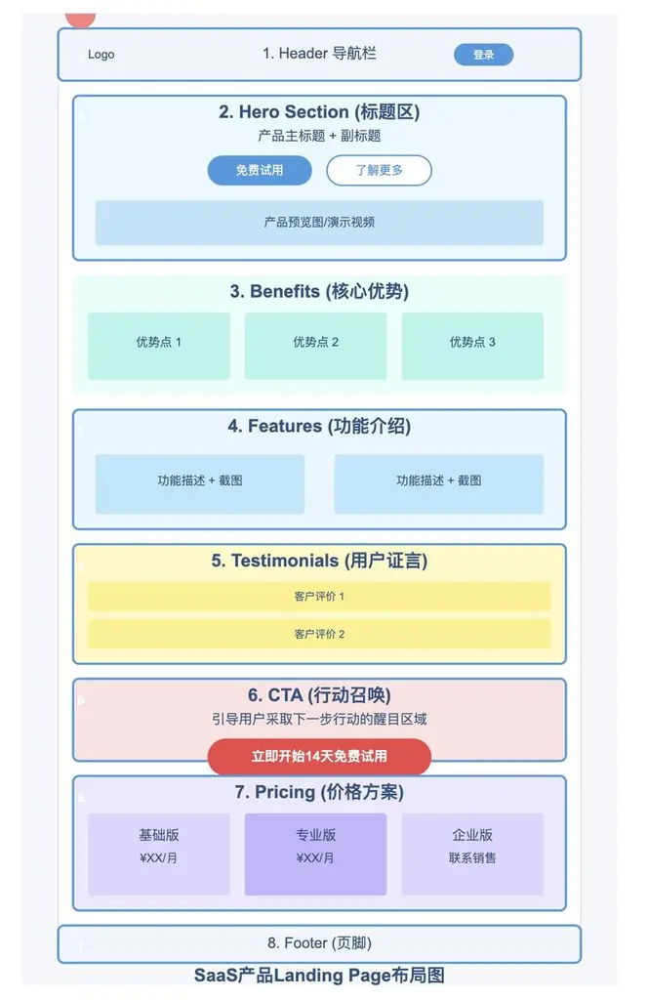

1.

顶部导航栏（Header）

公司 logo

主要功能/产品导航链接

登录/注册入口

语言切换选项

2.

标题区（Hero Section）

简洁有力的主标题

副标题

产品展示图/视频

3.

产品特色功能（Features）

主要功能详细介绍

功能截图或演示

技术特点说明

4.

CTA （行动召唤）

a.

明确引导用户采取下一步行动的区域，如"立即开始免费试用"、"联系销售顾问"等。有效的 CTA 能显著提高转化率，应当视觉突出且文案有说服力。

5.

社会证明/用户证言（Social Proof/Testimonials）

客户评价和使用感受（确实，这也叫用户证言）

案例研究（Case Studies）

知名客户 logo 墙

使用数据和统计成果

媒体报道和第三方评价

6.

价格方案（Pricing）

不同套餐详情和对比

计费周期选择

自定义方案选项

企业版咨询入口

7.

常见问题（FAQ）

分类整理的常见问题答疑

8.

产品核心优势（Benefits）

解决的核心问题

提供的主要价值

用户能获得的具体收益

9.

产品演示（Product Demo）

互动式产品体验

产品使用视频

功能演示动画

10.

如何使用（How It Works）

步骤式使用流程说明

上手指南

常见使用场景

11.

联系我们（Contact Us）

联系表单

办公地址信息

客服热线

12.

信任标志（Trust Badges）

安全认证标志

行业认证标志

支付安全保障图标

13.

底部导航（Footer）

站点地图

使用条款与隐私政策

版权信息

社交媒体链接

合作伙伴信息

上图中的布局，和代码也是一一对应的。看视频感受一下。

**7.2 快速制作专业产品首页**

**1、打开现有项目**

**2、找到你想要借鉴的部分（以 Section 的眼光看待）**，截图复制整个 Section，发给 Cursor

a、如果是付费版，往往可以直接复制代码！

b、如果是免费版，可以截图让 Cursor 复刻，能够还原 90%以上。

**3、告诉 Cursor 你想插入到哪里**

视频里用到的网站

https://tailwindcss.com/plus/ui-blocks/marketing

https://shipixen.com/demo/landing-page-component-examples

**7.3 制作更专业的产品首页**

请看视频里的演示。

选中 react 版本

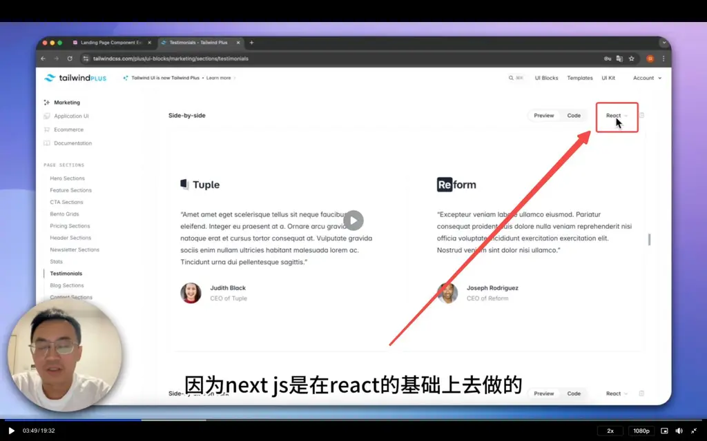

点击代码，选择复制

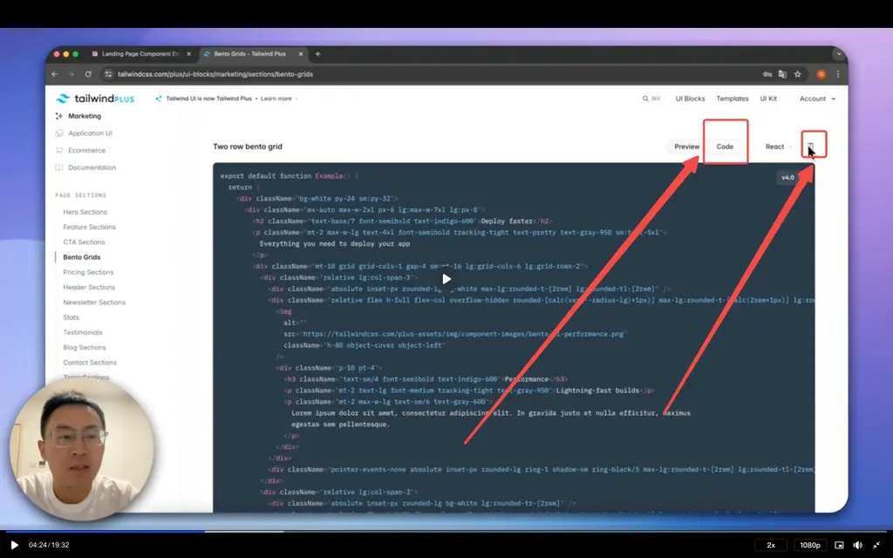

代码给到 Cursor，描述修改预期

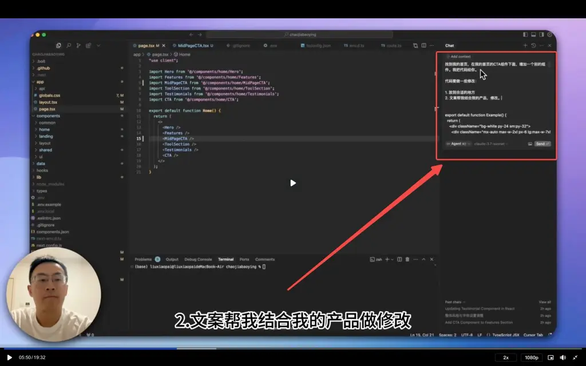

使用专业的 LandingPage 模板，重构项目。

选项一：

https://www.launchuicomponents.com/

有免费版和收费版。收费版$99。

【强烈推荐】这里是作者根据免费版制作的视频教程，10 分钟 https://youtu.be/tn0DHBCi6kg

选项二：

https://github.com/nobruf/shadcn-landing-page

选项三： （不是基于 shadcn 的，但是原理类似）

https://tailus.io/templates/ 这里可以买一些模板，比较白菜价，最便宜的只要十几美元

https://ui.tailus.io/examples/marketing/

https://html.tailus.io/blocks/hero-section/

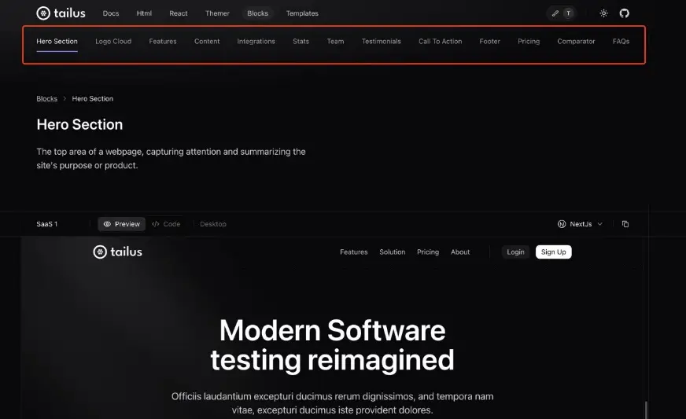

使用 Shadcn 换主题颜色

https://zippystarter.com/tools/shadcn-ui-theme-generator

配置界面颜色

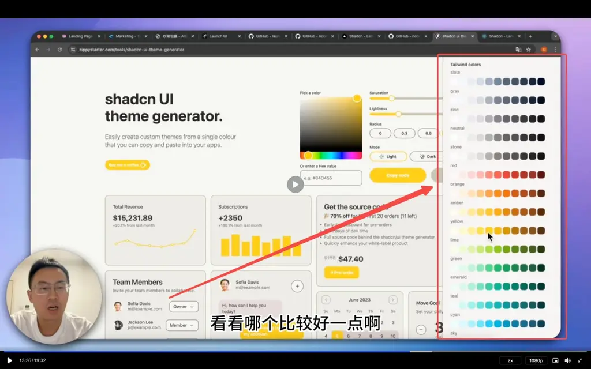

复制代码

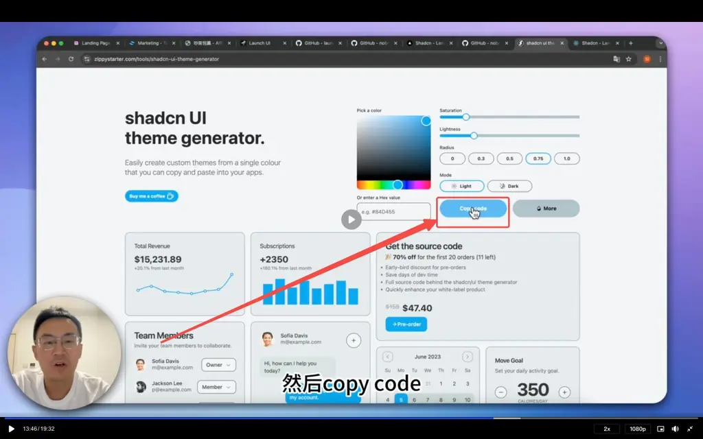

到 globals.css 中替换代码

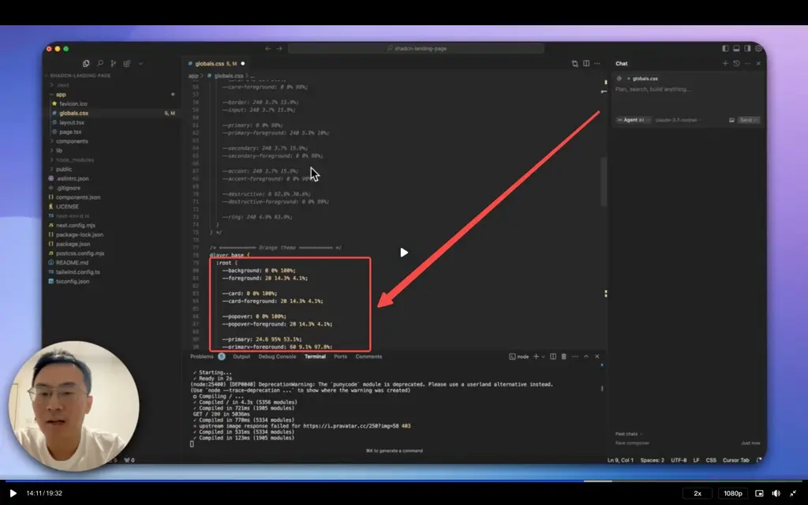

**7.5 标准 SaaS 网站产品的其他页面**

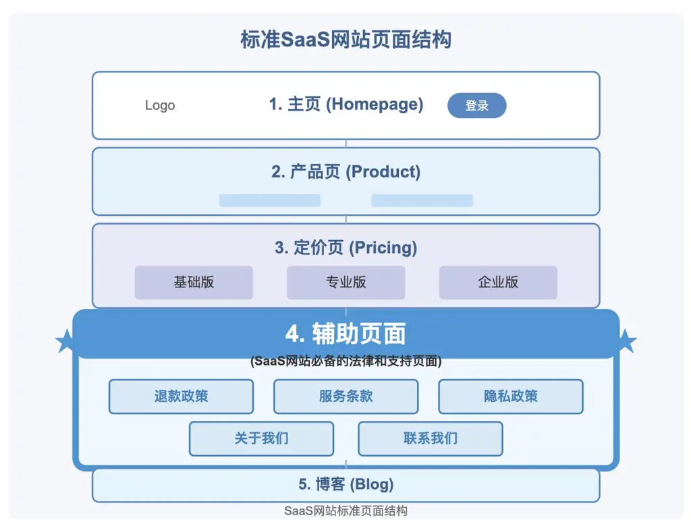

除了主页、定价页和注册页面外，一个专业的 SaaS 网站还需要包含以下几个重要页面，它们虽然不直接产生转化，但对建立信任和满足法律要求至关重要：

1.

服务条款（Terms of Service）页面

**作用**：明确用户与平台之间的权利和义务关系

**内容建议**：

使用简明易懂的语言描述双方责任

说明服务使用限制和禁止行为

解释账户终止条件和争议解决方式

2.

隐私政策（Privacy Policy）页面

**作用**：说明如何收集、使用和保护用户数据，符合各地数据保护法规

**内容建议**：

列出收集的数据类型及用途

说明用户的数据控制权（查看、修改、删除等）

解释数据共享政策和安全措施

3.

退款政策页面

**作用**：清晰说明如何处理用户退款请求，增加购买信心

**内容建议**：

详细说明退款条件和时间限制（如"14 天无理由退款"）

解释退款流程和所需步骤

提供常见问题解答，减少客服压力

4.

关于我们（About）页面

**作用**：展示公司背景和团队，建立信任感

**内容建议**：

分享创立故事和企业使命

介绍核心团队成员和专业背景

展示成就和里程碑（如用户数量、获得的投资等）

5.

联系我们（Contact）页面

**作用**：提供多种联系方式，增强客户支持体验

**内容建议**：

设置简单的联系表单

提供客服邮箱和工作时间

考虑添加实时聊天支持

若有实体办公室，可提供地址和地图

6.

博客（Blog）页面

**作用**：分享行业知识，提高 SEO 排名和用户粘性

**内容建议**：

发布与产品相关的教程和最佳实践

分享行业趋势和见解

定期更新保持活跃度

这些页面共同构成了一个完整、专业的 SaaS 网站结构，不仅满足法律要求，还能有效建立品牌信任和提升用户体验。

对于刚起步的 SaaS 产品，建议优先完成法律必需的页面（服务条款、隐私政策），再逐步完善其他内容。

**7.6 用 Cursor 快速制作辅助页面**

看视频

描述新增页面的信息

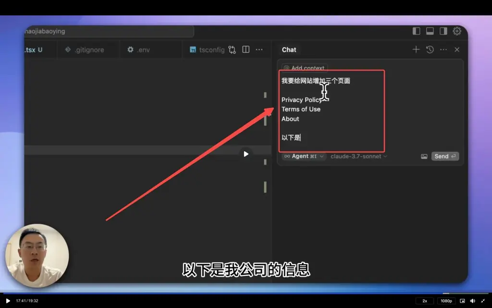

校验生成的文字

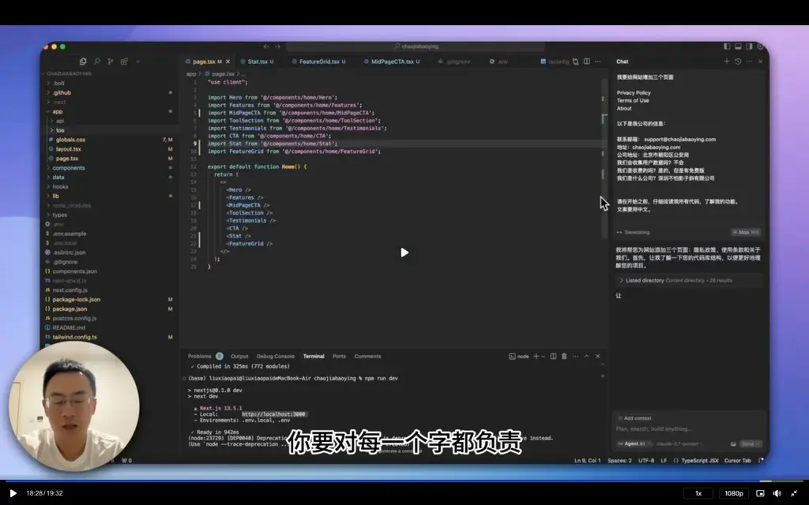

**7.7 课后作业**

按照本课内容，让你的产品显得更加专业。

**7.8 【加餐】有没有更快的方式？**

有的。再传授一招：**先大后小，分而治之。**

1.

找一个美观又简单、符合你产品调性的 SaaS 网站。我们不妨假设你找到的是 https://cleanup.pictures/

2.

打开 https://same.new/ ， 在输入框里告诉它：请用NextJS/Shadcn/TailwindCSS框架复刻 https://cleanup.pictures/

3.

去玩，等待 20 分钟再回来。

4.

从 same.new 下载代码。此时你就得到了一个和目标一模一样、基于 NextJS 框架的网站。用 Cursor 打开它

5.

在 Cursor 里，以 section/component 为单位，逐一替换为你心中更理想的样子。

6.

替换界面样式完成后，在 Cursor 里，让它阅读所有代码后、围绕你的产品核心功能重写文案。

7.

在此基础上，再去做你的核心功能。

8.

Optional: 接下来你可以跳转到进阶篇第一课、第二课，快速补上用户登录、订阅支付功能。

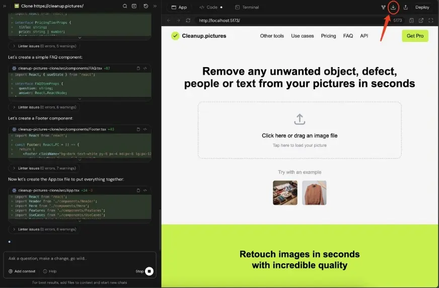

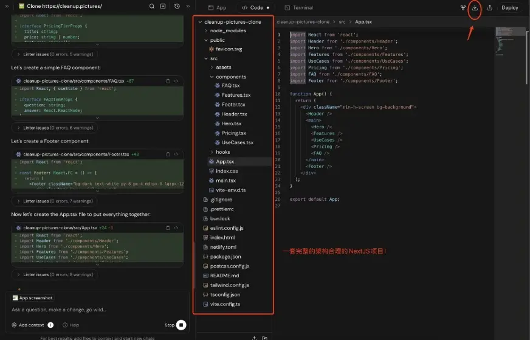

