**八、如何借助开源软件加快开发过程？**

**视频**

第八课.mp4【在线播放】

**8.1 开源项目有多厉害？**

以 https://github.com/Nutlope 为例，大量优质的开源项目，甚至可以一键部署。

关注链接查看开源项目效果

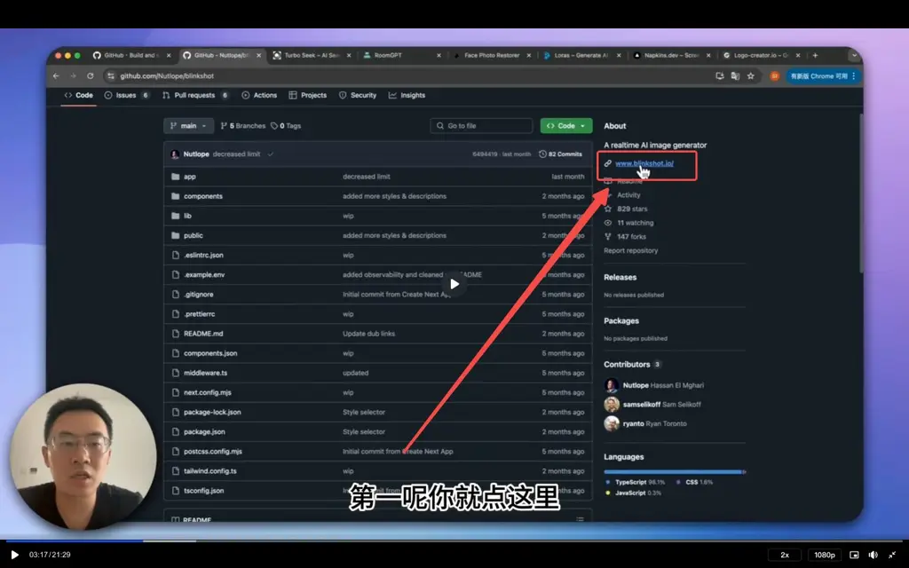

关注 readme 文档查看项目介绍

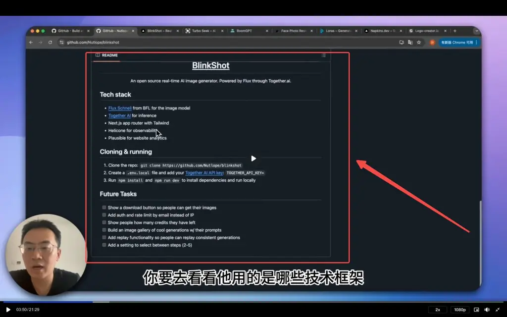

关注费用成本

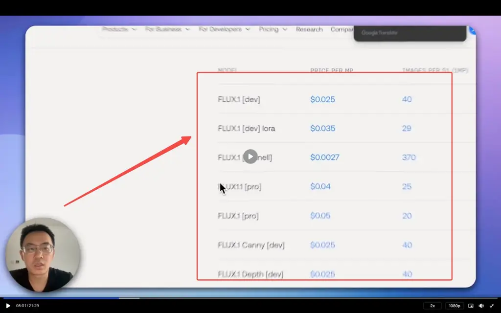

那么炫酷的功能，一键就可以部署了。借此，再次提醒学员： 编程能力，从来都不是门槛！门槛是找到用户、找到真需求！

拿 Nutlop 这个大牛来说，他一个人，就做了十几个可以一键部署的开源项目！全都很优质！！

下面的产品，全是他一个人的开源项目

NoteGPT

开源代码：https://github.com/Nutlope/notesGPT

在线体验：https://usenotesgpt.com/

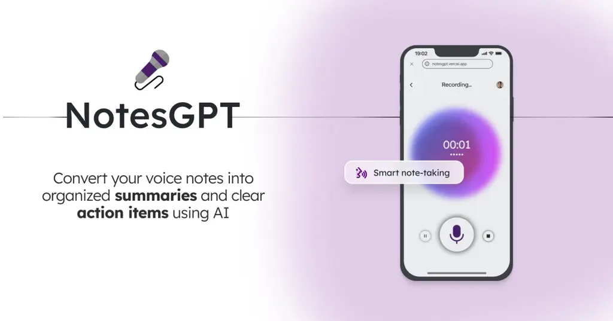

Blinkshot

开源代码：https://github.com/Nutlope/blinkshot

在线体验：https://www.blinkshot.io/

补充：如果使用的多需要注册 together ai 获得 1 美元密钥，能用个几分钟。

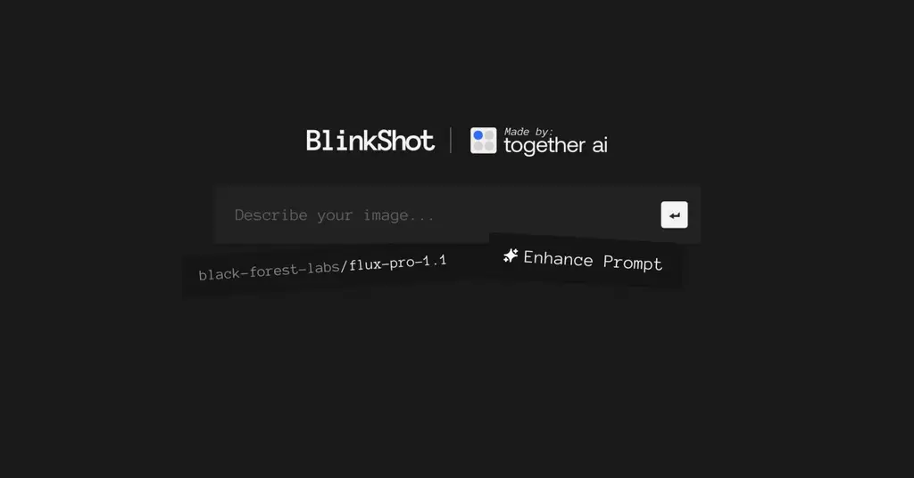

Loras.dev

开源代码：https://github.com/Nutlope/loras-dev

在线体验：https://loras.dev

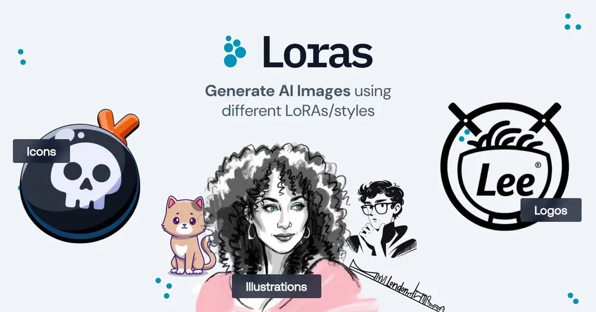

Napkins

开源代码：https://github.com/Nutlope/napkins

在线体验：www.napkins.dev

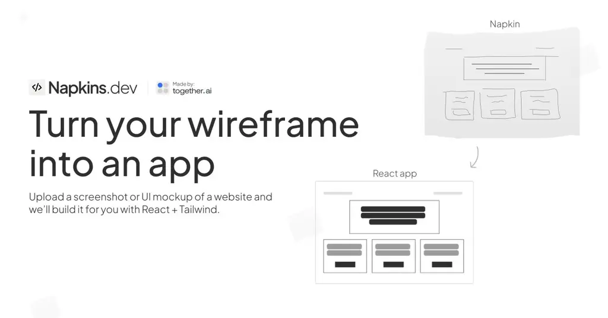

LogoCreator

开源代码：https://github.com/Nutlope/logocreator

在线体验：https://www.logo-creator.io/

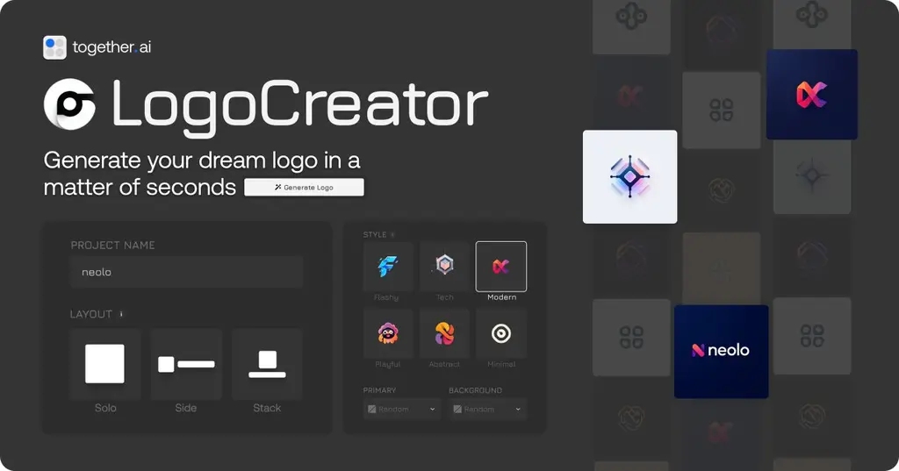

RestorePhotos

开源地址：https://github.com/Nutlope/restorePhotos

在线体验：https://www.restorephotos.io/

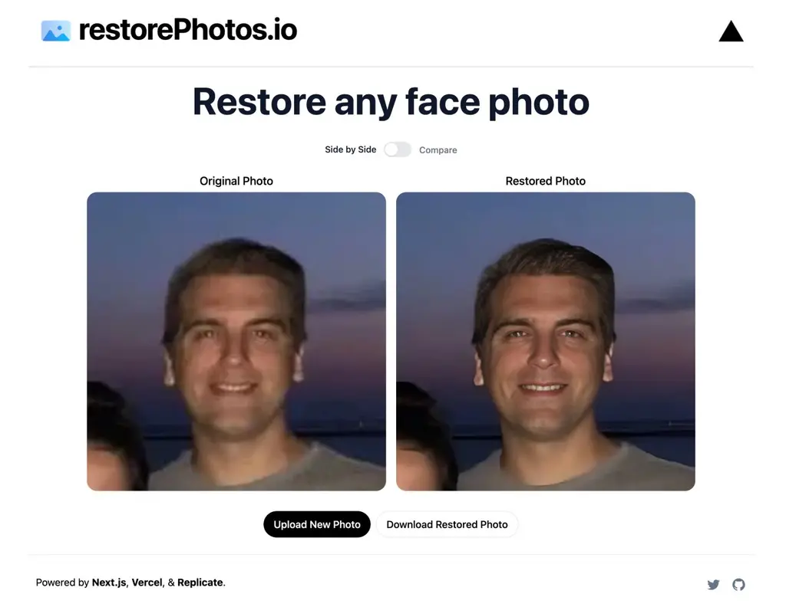

RoomGPT

开源代码：https://github.com/Nutlope/roomGPT

在线体验：https://www.roomgpt.io/

不再列举了，大家可以到他的主页自行翻阅。

**8.2 三个找开源项目的办法**

GitHub Trending

GitHub 搜索和高级搜索

https://vercel.com/templates?framework=Next.JS

**8.3 用开源项目加速开发的流程和演示**

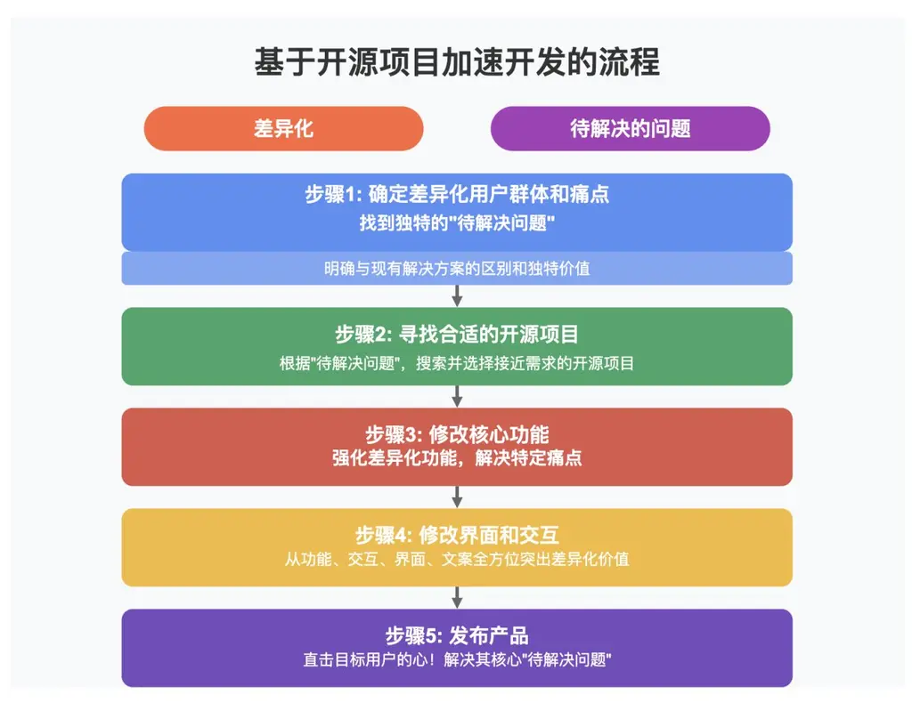

直接修改开源项目，举一个例子。

步骤：

1.

找到你的差异化的用户人群、差异化的痛点，一个独特的“待解决的问题”（详见认知篇）。

2.

根据“待解决的问题”，寻找到可以帮助到你的开源项目

3.

在开源项目基础上，修改核心功能，使之能够解决你的“待解决的问题”

4.

修改界面和交互

5.

发布

比如，我们找到一个“待解决的问题”是 —— 有一群独立开发者，上线大量的 App，他们没有设计师，因此，“为 App 做 Logo”，是一个痛点。我们可以做一个“专门为独立开发者设计的、App Logo 制作工具”。

我们可以到 GitHub 搜索"logo maker"，找到一个比较类似的。

找到以后，发现开源的"logo maker"有很多和我们想要的不同的地方，如：它们往往是通用的 logo maker、不是专门针对 App 的 logo。我们参考共性代码，补齐差异功能、强化差异功能。

无论是从功能、交互、界面、文案，都要去强化差异，直击目标用户的心！

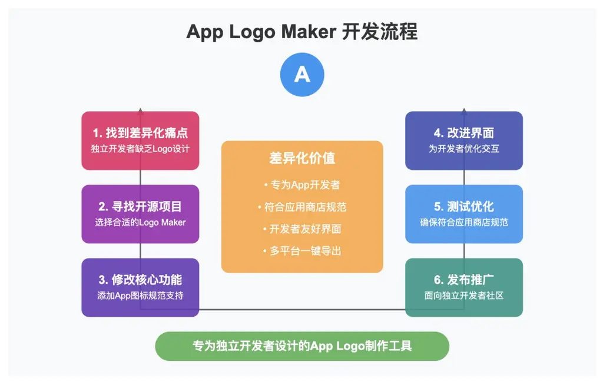

