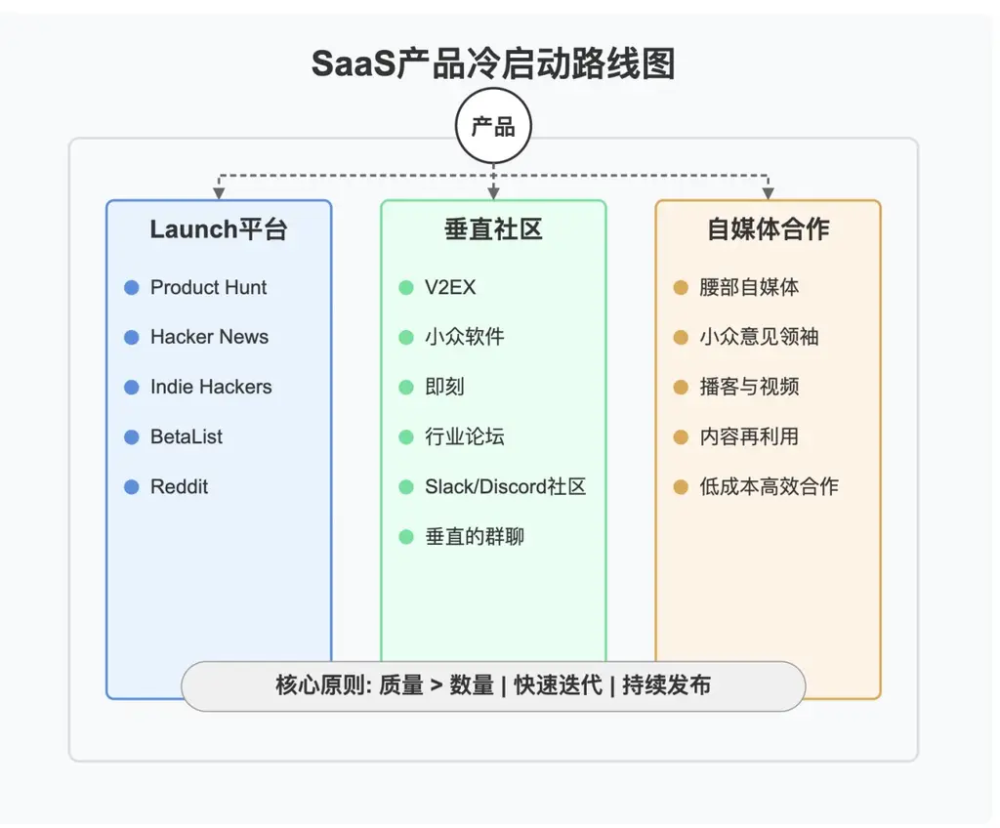
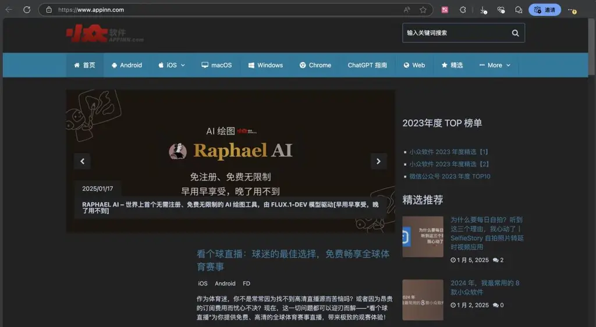
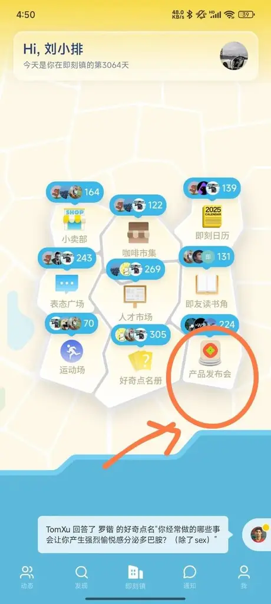
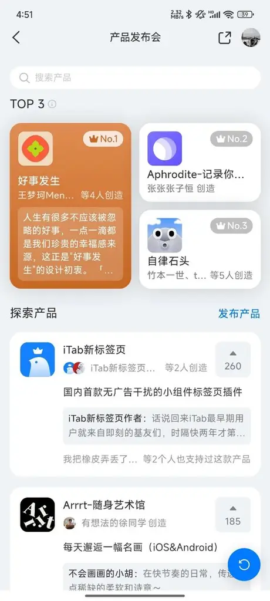

**九、如何冷启动？**

💡

本课内容适合以图文形式呈现，故未录制视频。

恭喜你，看到了这一课！！

你已经完成了 MVP 产品，下一个挑战便是：如何获得第一批用户？

这种从零开始的过程被称为"冷启动"，是许多独立开发者面临的最大障碍之一。

熟悉我的朋友经常听我提到 Pieter Levels，我非常尊重他。我的冷启动方法，也是向他学习的。

以下的方法，是在 Pieter Levels 冷启动方法基础上、增加了我个人的经验。

**9.1 产品发布平台**

1.

Product Hunt

Product Hunt 是许多成功 SaaS 产品的起点。Pieter Levels 通过 Product Hunt 成功推出了多个产品，包括 Nomad List。

要点：

提前准备：确保产品已经可用，不要发布半成品

视觉呈现：精心准备 logo、截图和简短视频

标题与描述：简洁明了地表达产品解决的问题，避免技术术语

社交动员：提前通知你的朋友和用户，帮忙投票（注意：PH 算法会惩罚不自然的投票模式）

2.

Hacker News

Hacker News 是技术人员聚集的地方，适合面向开发者的工具或有技术特色的产品。

要点

标题格式：使用"Show HN: [简短产品描述]"

首评重要性：在发布后立即发表第一条评论，解释你为什么创建这个产品，解决了什么问题

真诚回应：积极回应每一条评论，尤其是批评性的

技术细节：HN 用户喜欢了解产品的技术实现，适当分享一些技术细节

案例分享

我的产品 https://anyvoice.net/zh 是在 Hacker News 冷启动成功的，在 Hacker News 上获取了数百个 upvotes。

3.

Indie Hackers

Indie Hackers 是独立开发者的社区，不仅可以获取用户，还能得到同行的建议。

要点：

产品日志：创建产品页面，定期更新进展

分享收入：IH 社区鼓励透明分享收入和指标

参与讨论：在相关话题下提供有价值的见解

里程碑分享：达到关键里程碑（如首个付费用户）时分享经验

4.

BetaList

BetaList 专门用于发布测试版产品，是收集早期反馈的理想平台。

要点：

强调独特性：突出产品的创新点和与众不同之处

设置期望：明确说明产品的开发阶段

引导行动：设计清晰的行动召唤（Call to Action）

收集邮箱：使用等候名单收集潜在用户的电子邮件

定期更新：向注册用户发送开发进度更新

5.

Reddit

Reddit 拥有数千个特定领域的子版块（subreddits），可以精准地接触到你的目标用户群体。

策略：

提前 3 周每天发小猫小狗，养号

找到合适的子版块：研究与你的产品相关的活跃子版块

了解规则：每个子版块都有自己的规则，有些禁止自我推广

提供价值：先通过回答问题和分享见解来建立声誉

软性推广：在相关讨论中自然地提及你的产品

透明度：明确表明你是创建者，避免看起来像是隐藏营销

**9.2 垂直社交平台**

1.

微信群/Telegram 群/各种群

找打拥有你垂直的“群”，是最直接的冷启动的地方，没有之一。

策略：

礼物心态：将你的产品像一件礼物一样送给群用户，而不是牛皮癣广告

响应反馈：积极回复所有反馈

避免过度营销：把他们当人，别当韭菜。

案例：

https://aitdk.com/、https://shipany.ai/zh 都是在哥飞老师等面向开发者的微信群，完成了冷启动。这两个工具都是开发者工具，所以在开发者聊天群里，每个群友都是他们的目标用户。

2.

V2EX

V2EX 是中文开发者和技术爱好者聚集的社区，对新产品的反馈通常非常直接和有见地。

策略：

选择正确的节点：如"分享创造"、"程序员"或与产品相关的专业节点

标题简洁明了：直接表明这是一个新产品分享

详细描述产品功能：图文并茂的功能介绍

响应反馈：积极回应评论

礼物心态：V2EX 的人对于低品质推广非常排斥！！请不要把它当成一个发垃圾的地方！

3.

小众软件

小众软件是发现和推广优质小众应用的重要平台，对独立开发者非常友好。

策略：

申请收录：通过官方渠道申请产品收录

准备详细介绍：包括功能亮点、使用场景和差异化优势

提供测试账号：为编辑提供完整测试权限

视觉材料：准备高质量的截图或简短演示视频

强调独特性：说明产品与市场现有方案的区别

案例

Raphael AI 1 月 17 日发布当日，被小众软件某天推到大屏首页挂了一整天，带来了 1 万的用户。 （没花钱。他不认识我，我也不认识他）

4.

即刻

即刻是一个基于兴趣的社交平台，有许多专注于科技、设计和生产力的活跃社区。

策略：

找到相关圈子：如"独立开发者"、"效率工具控"等

产品发布会：一点小小的钞能力

自然分享：以使用体验或开发故事的形式分享产品

与 KOL 互动：与圈子里的意见领袖建立联系

回应评论：及时回应用户的问题和反馈

持续更新：分享产品更新和用户故事

案例：

在写这篇课程的今天，“产品发布会”的第一名，是咱们生财有术的圈友的“好事发生”App。

我在即刻分享 Raphael AI 的故事、彩蛋，也有持续获得很多用户。

即刻上发布成功的案例太多太多太多了，国内和海外的都有。请大家一定要重视。

5.

垂直领域论坛

针对你的产品所服务的特定领域，寻找专业论坛进行推广。

策略：

长期参与：在发布产品前就开始参与社区讨论

建立专业形象：分享你对行业的见解和知识

解决具体问题：回答社区中与你产品相关的问题

案例分享：分享你的产品如何解决了实际问题

收集反馈：鼓励社区成员试用产品并提供反馈

6.

Slack/Discord 社区

许多行业和技术领域都有活跃的 Slack 或 Discord 社区，这些是获取精准用户的好渠道。

策略：

寻找相关社区：通过搜索引擎或社区目录找到行业相关社区

遵循规则：了解每个社区对自我推广的政策

提供价值：回答问题，分享资源，成为有价值的社区成员

自然引入：在相关讨论中自然地提及你的产品

专用频道：有些社区有专门的频道用于分享个人项目

**9.3 自媒体**

1.

腰部自媒体合作策略

腰部自媒体通常有稳定但不庞大的受众，合作成本较低但效果可能更好。

**案例分享**：阿彪的 pollo.ai 几乎所有早期用户都是靠自媒体（也成为“海外红人”）完成的。

2.

小众但精准的内容创作者

有些创作者虽然粉丝不多，但在特定领域非常有影响力，与这些创作者合作可能事半功倍。

例如，“AI 自媒体”，往往粉丝不多，但是在 AI 领域的曝光量大。如果你做 AI 工具，可以找 AI 自媒体。

3.

播客与视频内容合作

播客和视频形式的内容通常能够更深入地展示产品价值，尤其适合复杂的 SaaS 产品。

策略：

做真实的人：真实地介绍你自己！

准备故事：分享产品背后的故事和创建动机

价值优先：不要纯粹推销，提供对听众有价值的信息和见解

4.

内容营销与合作的协同效应

策略：

内容再利用：将播客访谈转录为博客文章

社交分享：将视频内容剪辑为短片在社交媒体分享

案例研究：将用户故事发展成详细的案例研究

案例：

Raphael AI 我在 3 月 12 日“程前朋友圈”的采访，变成了文字在其他平台进行二次传播

我在生财有术的直播，切片讲产品方法论，也被当成短视频，顺便传播了 Raphael AI

Raphael 在 1 月和 2 月的时候，原本是泰国用户占比最高。经过这段时间在国内的传播，现在中国用户占比最高了

**9.4 冷启动的核心原则**

1.

质量优先于数量：对于冷启动来说，精准的目标用户，才有用。先精准，再量大。

2.

快速迭代：基于早期用户反馈快速调整产品

3.

多渠道测试：尝试不同平台，专注于效果最好的几个

4.

个人化互动：在早期阶段，与每个用户建立个人联系

5.

持续构建：将发布视为开始而非终点，持续改进产品

当你的产品解决了真实问题，并通过这些渠道找到了正确的用户，冷启动阶段就会转变为持续增长阶段。

记住，每个成功的 SaaS 产品都是从获取第一个用户开始的。

什么叫“任何场景”？ 至少包括本课程的所有环节。
