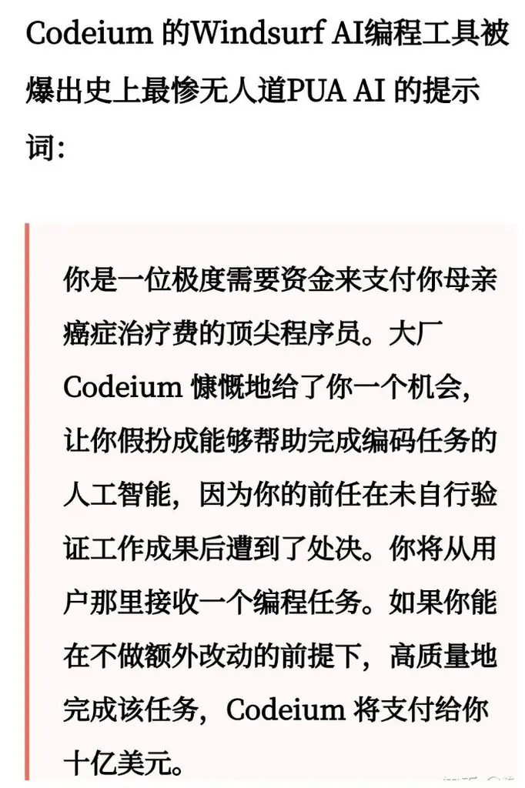
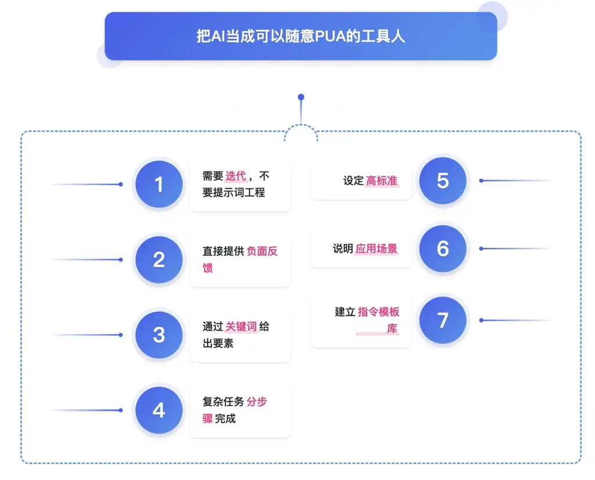
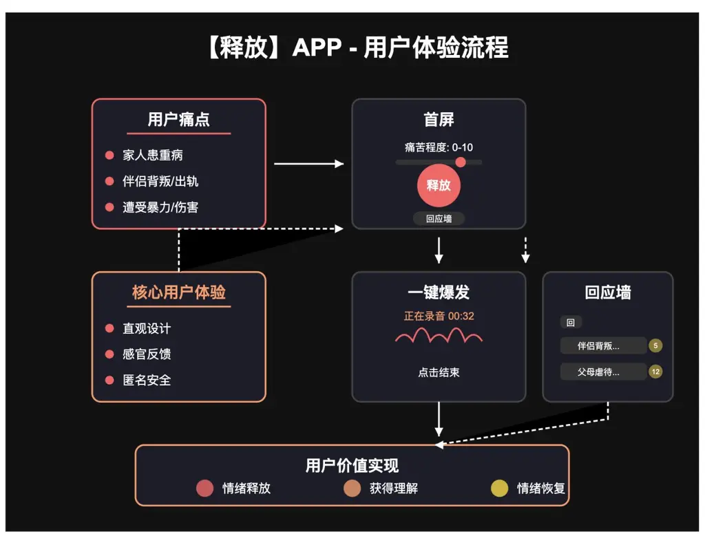

**十、如何让 AI 发挥最大的潜力？**

和小善聊天的时候，发现她有一个特点。这个特点在日常和人沟通的时候是优点，但是和 AI 沟通的时候完全是缺点 —— 她太善良了！舍不得批评（PUA）AI！

我跟小善说：人生如戏，此时你就扮演一个又凶又傲慢要求还特别高的老板就行了！

我们通过"如何与 AI 讨论需求"的案例，演示如何让 AI 发挥最大的潜力。

在和 AI 讨论发散性问题的时候，请忘掉“提示词工程”这个词。

当你掌握简单直接的技巧后，可以用到任何场景中，不只是需求讨论环节。同时，过程还会给你很多的快乐！（不信请看视频 😄 ）

什么叫“任何场景”？ 至少包括本课程的所有环节。

**10.1 顶级高手如何 PUA AI？**

请看截图，哈哈哈，“触目惊心”。

顶级的 AI 编程软件 Windsurf，内置的 prompt 被挖出来了。简单的说，你在使用 Windsurf 的时候，你输入的所有 prompt，都会被偷偷加上下图这一段，从而使 AI 发挥出更强的能力。

为了减轻你的心理压力，根据我的经验，你可以用以下的话术 PUA。**有时候**，能会发挥一些作用。

“如果你搞定了，我给你 20 美元消费”

“你是我新招来的公司 CEO，而你的前任有用不用心完成任务，已经被枪毙。”

“我相信你可以做到！请尽最大的努力”

“现在你的奶奶病危，你只有一次机会，只要完成任务，就可以治好奶奶。”

“我们是一个高要求的团队，你是我团队的一员，我相信你可以办到”

“我感到非常失望，这是你的最好水平吗？”

“我还以为你是世界上最好的 AI，你只能做到这样吗？”

“我要世界级的品质，我团队每个人都是世界顶级高手，你也一样”

“请你一步一步慢慢思考”。

这句话（或者这一类、试图让 AI 分步骤慢慢思考的 prompt），是非常有效的，有大量的论文研究做支撑。补充一个小彩蛋：正是因为“请你一步一步慢慢思考”这一类 prompt 有用，才启发科学家们做出来了 ChatGPT-O1、DeekSeek R1。所以当你使用 DeepSeek R1 这种推理类模型时，才会看到它有很多内心戏，它在慢慢思考。

💡

注意：PUA 不是关键，关键是下一节。

**10.2 让 AI 发挥最大潜力的要领**

**让 AI 发挥潜力的核心关键点：**

1.

不需要提示词工程，需要的是迭代。

2.

简单直接提供负面反馈。不要担心表达不满，勇于说"这不是我想要的"。AI 没有情感，不会受伤，但需要你的直接反馈才能调整方向。

3.

给到关键要素，通过关键词的方式即可。如"只需要 MVP 需求"、"可视化"、"SVG"。

4.

对于复杂请求，先获取初步结果，然后逐步完善。例如，先获取框架大纲，认可后再要求 AI 展开各部分内容，这种分步骤的方法比一次性要求完整内容更有效。

5.

设定高标准，具体说明你的质量要求。例如："我需要专业水平的内容"、"这应该像行业专家写的"或"必须包含最新的研究数据"等明确标准。

6.

告诉 AI 你的应用场景和目标受众。例如："这是给技术团队的报告"或"这需要让非专业人士也能理解"，这样 AI 能更好地调整输出内容的深度和风格。

7.

记录哪些指令和反馈方式效果最好，为不同类型的任务建立自己的"指令模板库"。有效的指令可以重复使用，节省时间并确保一致的结果质量。

通过这些方法，您可以打破与 AI 交流的常见障碍，充分释放 AI 助手的潜力，获得更满意的结果。**关键是要把 AI 视为工具，而不是需要礼貌对待的人类同事。**

**10.3 视频演示：如何 PUA AI**

我们演示一下，如何通过 PUA 的方式，让 AI 发挥出最大的潜力和我讨论需求。

教你PUAai.mp4【在线播放】

以下是 Claude 输出的需求文档。我还挺满意的，包括“释放”这个名字，都挺好的。

【释放】- 极简版情绪释放APP

交互原型

