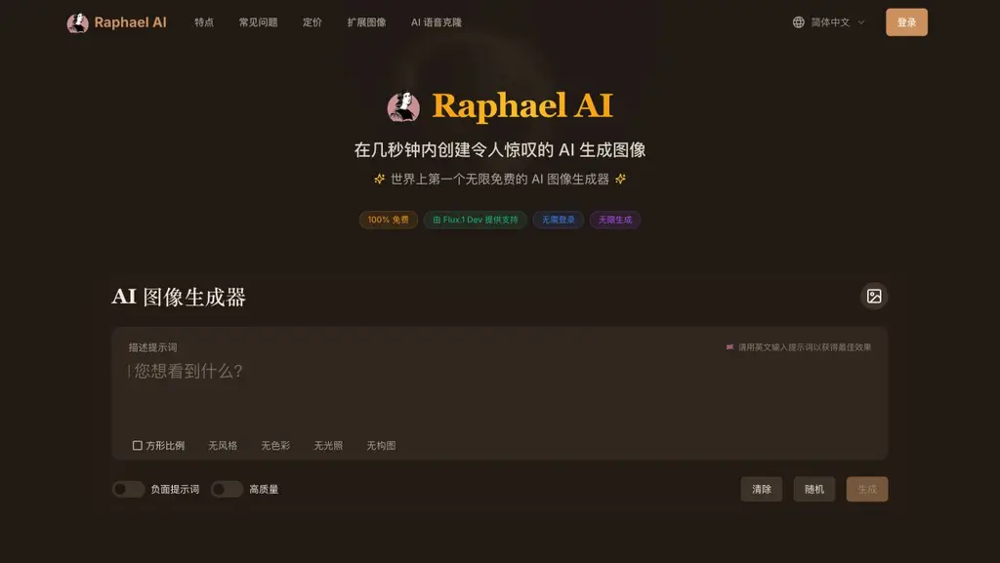
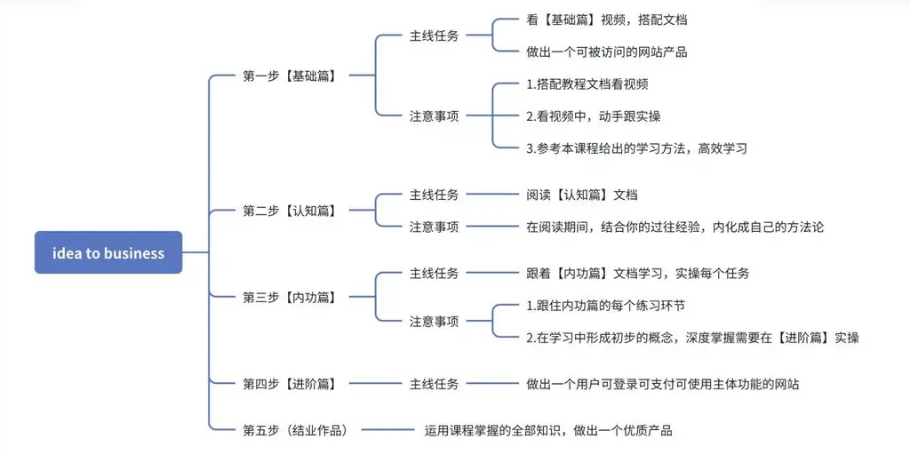
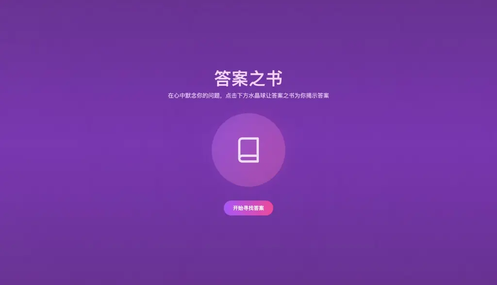
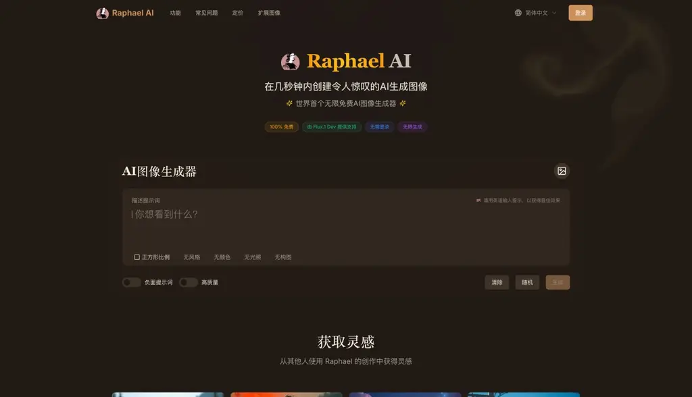
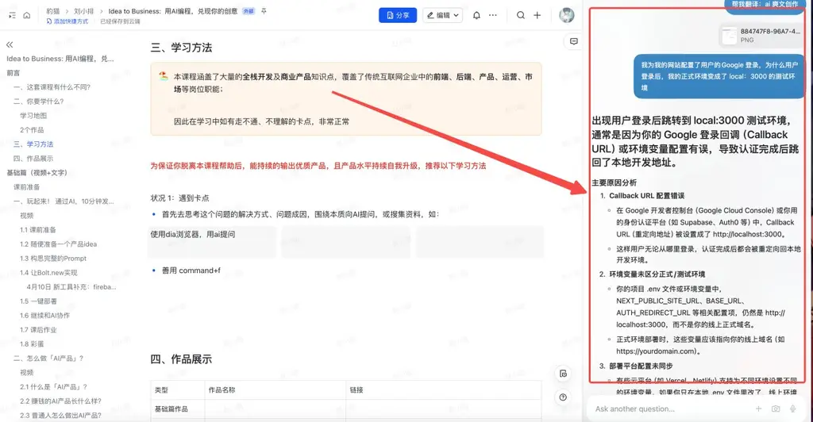
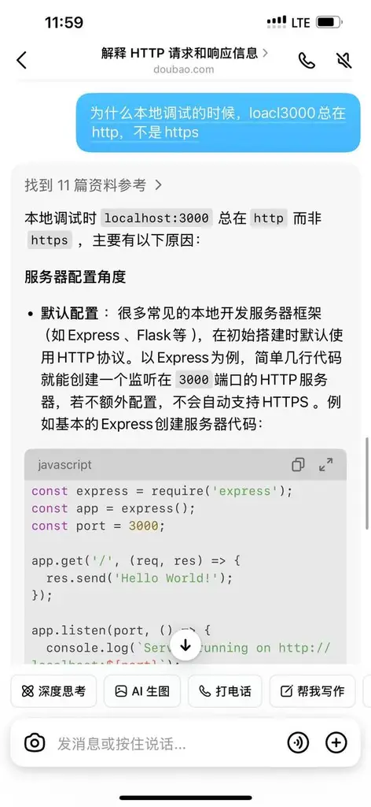
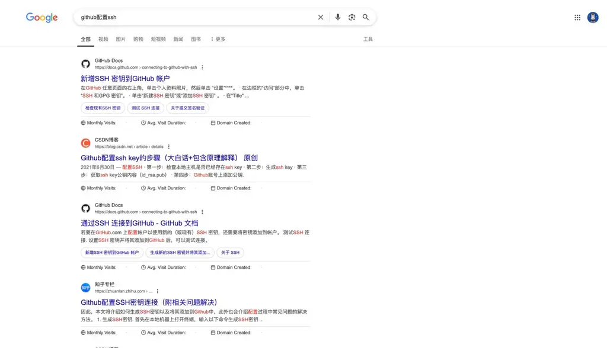
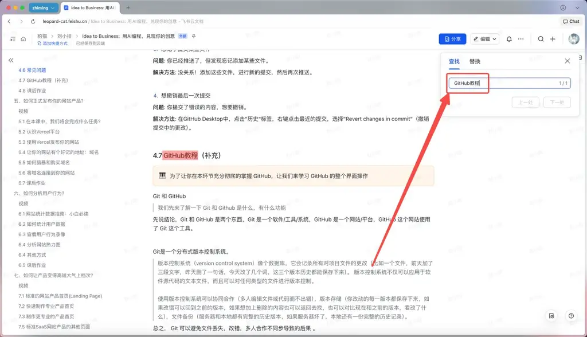
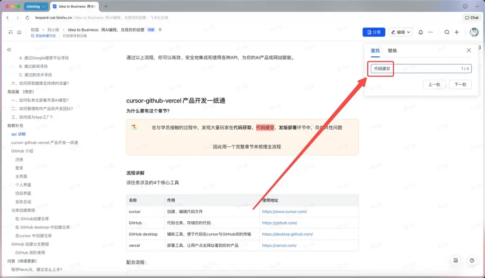

**航海前言**

课程出品人：@刘小排 出品时间：2025 年 5 月

课程内容

你将会学习到「从产品 idea、到使用 AI 编程做出软件产品、到变现、到成为一门可持续生意」 的全流程。

特别备注： 得益于 AI 编程的飞速进步，在参与课程之前，你不需要有编程的基础。

课程形式

视频 + 文档 + 微信群答疑和交流

1.

课程以视频和文档的方式作为主交付。 暂定使用飞书文档作为交付工具，未来可能更改。

2.

课程内容将会持续更新（至少一年）。 AI 编程的发展日新月异，我们对它的使用方式保持与时俱进。

3.

课程专属微信交流群的权益为一年期，群内有助教答疑和经验交流。

特别提醒

本课程专注于落地实践技能，不承诺你学完能赚到钱。

学习门槛

不需要

❌ 你不需要有编程基础。

❌ 你不需要曾经从事过互联网行业。

需要

必备项

✅ 一定的预算，至少$100 美元/月。用于购买海外工具、域名、服务器、API 等基础设施。如果你想要加快进度，建议准备$1000 美元/月，可以更从容地购买高级的效率工具、对外合作、付费推广。

✅ 你能够配置好网络环境，访问外国网站没有障碍。

✅ 你有一定的英文阅读基础，建议不低于高中英语水平。

✅ 你已经有一个或多个产品 idea 想要尝试。

加分项

✅ 有坚持学习 1 个月以上的毅力和韧性

✅ 针对遇到的问题及时复盘

**前言**

**这套课程有什么不同？**

第 1 个不同： 通过 AI 做软件产品生意，我是一个拿过结果的人。

过去两年市场上出现过很多种 AI 课程，江湖传言说“做 AI 产品的没赚钱，做 AI 课程的赚钱了”，在一定程度上是真的，因为大部分人还没有能力使用 AI 做出产品并靠产品赚到钱。

我和他们不同。我的产品长期出现在各类“AIGC 出海产品排行榜”Top 100 里，偶尔还有 Top 50 和 Top 30。 我想，仅凭这一点，我就已经击败了 99.9%的同行了吧。

也许你想了解我拿到的结果是什么规模？ 我先展示一个最近的案例吧。

在 2025 年 1 月 17 日上线、我上线了一款新产品 —— Raphael 这是一款典型的 MicroSaaS https://raphael.app

它的全部开发周期是 1 周，就我一个人。

在上线的第一个月，它已经累计 100 万的月活跃用户，每天有 3～4 万用户使用它。

网站产品的数据毫无秘密可言。你可以通过微信、Youtube、Twitter、Facebook 等任何一个社交平台搜索"raphael.app"这个关键词，看看这款产品的用户来自哪里、它是如何受到全世界用户欢迎的。

赚了多少钱？ 对于 MicroSaaS 产品来说，付费率范围较大，0.1%～6%之间都是合理的。你不妨先按照最低的 0.1%来估算。

第 2 个不同：全面使用 AI，直接从实战开始，而不是从编程基础开始。

我们一切流程，都全面使用 AI，直接实战。

得益于 AI 编程工具的日新月异，学员可以在第一周甚至第一天就发布自己的产品，而不需要从最基础的 HTML/CSS/JAVASCRIPT 开始。

此外，正是由于 AI 编程发展日新月异，这是<u>一门必须持续更新的课程</u>。

第 3 个不同：我们探讨用 AI 做软件产品生意的全流程，而不只是讲 AI 编程

对于一门生意而言，编程（无论是否有 AI）都不是最重要的一环。 我们的课程会涉及到需求挖掘、需求打磨、产品设计、产品实现、用户获取、产品迭代等等，关于 MicroSaaS 软件生意的一切。

**你要学什么？**

请先学习完「基础篇」，再一边持续迭代你在基础篇里发布的产品、一边学习后续内容

在「基础篇」中，我会尽量跳过理论和基础知识，让你直接实操，找到手感。课程以视频为主。课程视频本身只有短短两小时， 但是你可能需要使用不少于 40 小时的时间，才能够真正上手。上手后，你可以反复把自己的产品打磨精细、或者多实操几个回合。AI 编程工具是一把利剑，你需要大量的练习和探索，才能人剑合一。

第二部分是「认知篇」，我们会涉及到海外软件生意（Micro SaaS）的产品和商业形态探讨

主要以文字内容为主。推荐学习时间为 3 小时。

第三部分是「内功篇」，我们会尽可能补齐你已经使用过的技术工具背后的原理，以及推荐一些扩展阅读

虽然我们已经熟练了招式，但招式只不过是“方便法门”，补齐内功，才能让我们走得更远。推荐使用 60 小时以上的时间来完成内功篇。

第四部分是「进阶篇」，在内功篇完成的基础上，我们把 MVP 变成完成产品，跑通商业闭环。

本课程的学习思路，为【四步学习】+【2 个作品】

四步学习会按照章节顺序，一步步教你相关知识

2 个作品会让你掌握学到的知识，做出能赚钱的产品

2 个作品

整体来看，课程分为了两个阶段

第一阶段以【基础篇】部分完成为节点，你能够用一系列工具快速做出一个可被访问、有 MVP 功能的网站产品

如：  
https://answer-book-two.vercel.app/ （需要魔法打开）  
https://screensharing.net/

第二阶段以全部课程【基础篇】【认知篇】【内功篇】【进阶篇】完成为节点，你能做出能变现的成熟商业产品

如：

https://raphael.app/

**学习方法**

本课程涵盖了大量的全栈开发及商业产品知识点，覆盖了传统互联网企业中的前端、后端、产品、运营、市场等岗位职能；

因此在学习中如有走不通、不理解的卡点，非常正常，需要常用AI工具或信息查询

为保证你脱离本课程帮助后，能持续的输出优质产品，且产品水平持续自我升级，推荐以下学习方法

状况 1：遇到卡点

首先去思考这个问题的解决方式、问题成因，围绕本质向 AI 提问，或搜集资料，如：

使用 Dia 浏览器，用 AI 提问

（Dia浏览器仅支持Macbook。如果你是Windows电脑，可以先用新版QQ浏览器平替）

和 AI 打电话，反复练习知识点。

推荐使用ChatGPT打电话功能，详见基础篇第一课；也可以用豆包平替。

配置 GitHub 的 ssh

现在就可以发动你的聪明才智，尝试去利用 edu 邮箱，使用 Dia 浏览器

善用 command + F，搜索文档中的相关答案，如

GitHub 看不懂，搜索 GitHub 教程

代码提交遇到问题，搜索代码提交

持续关注课程群

我们会持续的更新课程文档，当市面上出现了更为优质的工具或更高效便捷的手段，我们会及时对内容进行更新

**课前准备**

请配置好网络环境

谷歌邮箱账号

GitHub 账号

官网：https://github.com/

注册地址： https://github.com/signup

注意：GitHub 账号，是你在本课程中最重要的账号！AI 编程需要用到的工具（如 Cursor、Bolt、V0），大部分都可以通过 GitHub 账号登录！

海外信用卡

我们需要用到的很多 AI 工具都是付费的，它们往往需要海外信用卡。你可以在国内各大银行去注册 VISA 或 MASTERCARD 的信用卡（不要银联）。

如果你没有信用卡，可用一些提供虚拟信用卡的平台，比如 https://yeka.ai/ 。会产生一些手续费，但是方便。

Cursor

下载地址：https://www.Cursor.com/

安装后，软件会引导你注册和付费。 同样，你可以使用刚才注册的 GitHub 账号进行登陆。

要不要付费？ 要！ （$20/月）。

一个通用的 AI 助手，因为我们要和它讨论需求

推荐：

ChatGPT Plus （$20/月） ，强烈推荐。网址：https://openai.com/chatgpt/pricing/

Claude （$20/月），强烈推荐。 网址：https://www.anthropic.com/

我使用的官方版本。不过官方版本比较难注册。如果你使用官方版本有困难，可考虑用相对比较稳定的国内套壳版。https://2233.ai/i/ONEDOLLAR

Grok，推荐。网址：https://grok.com/

Deepseek R1 ，不是特别推荐，保底的选择。网址：https://chat.deepseek.com/

Bolt.new 账号

a.

前面我们已经注册了 GitHub 账号，可使用 GitHub 账号登录 Bolt.new

b.

网址： https://bolt.new/ ，点击右上角 Sign In，选择使用 GitHub 登录

c.

可根据自身使用需求，选择付费或免费模式 。另外，推荐一款同类型工具 same.new。

常用 API 平台

a.

我们做的产品，很可能会用到大模型的能力，也就是传统说的“大模型应用”。因此，我们需要提前找好一个大模型的 API。

b.

常用 API 平台推荐

https://openrouter.ai/

https://www.together.ai/

https://fal.ai/

https://replicate.com/

https://siliconflow.cn/ （国内产品！适合小白）
