## 一、如何让用户登录？

💡

我推荐大家从使用 Supabase 方案开始。

我推荐新手从 Supabase 方案开始，它可以省去我们很多麻烦。

它的上限也足够高，在生财有术的优秀独立开发者当中，有朋友已经月入超 10 万美元了，仍然还在使用 Supabase。

除了 Supabase 以外，此处我也顺便介绍一些我用过的其他方案，各有优劣，供学有余力的同学们参考。

### 1.1 新手推荐方案：Supabase

网址：

**1. 创建项目**

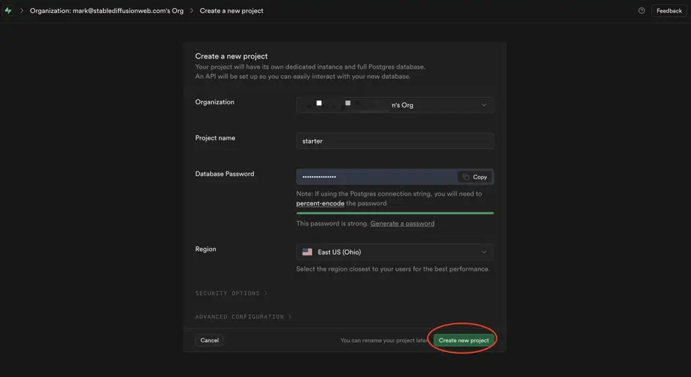

**2. 打开 GitHub 登录或 Google 登录（或其他你想要集成的社交登录）**

一般我只打开 Google 账号登录和 GitHub 登录。可以在 Supabase 里启用开关，如下图。

我们先以“GitHub 账号登录为示例”。请在 Supabase 后台打开 GitHub 登录，然后参考这个文档， https://supabase.com/docs/guides/auth/social-login/auth-GitHub

其他的社交登录方式同理。（超过 90%的 SaaS 都会打开 Google 账号登录功能，你可以后面自行研究它）

登陆 Supabase 官网 Supabase.com

选择【Authentication】目录中的【Sign In/Up】

进行 Google 与 GitHub 的登录配置

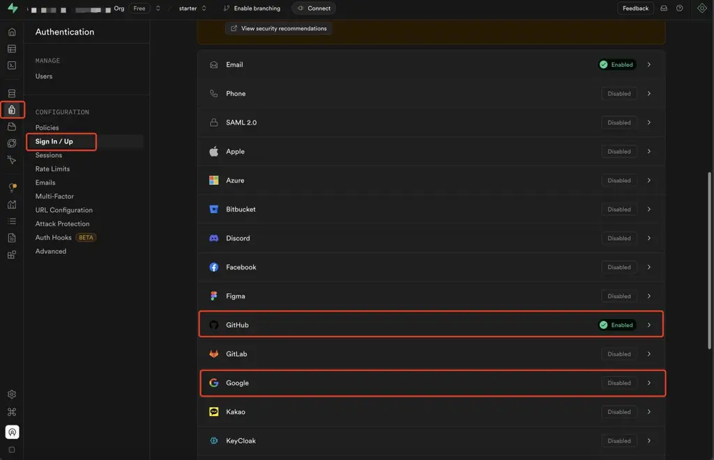

首先获取谷歌 Client IDs

进入 Google 开发者控制台，点击 “新建项目”

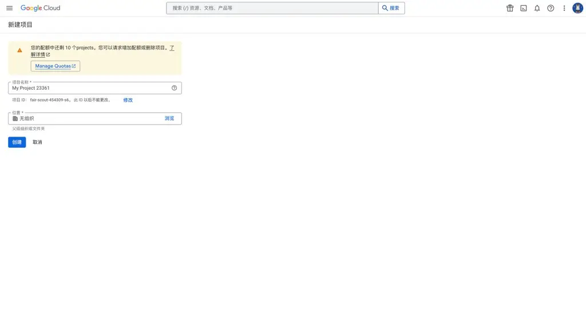

【凭据】-【创建凭据】-点击【OAuth 客户端 ID】

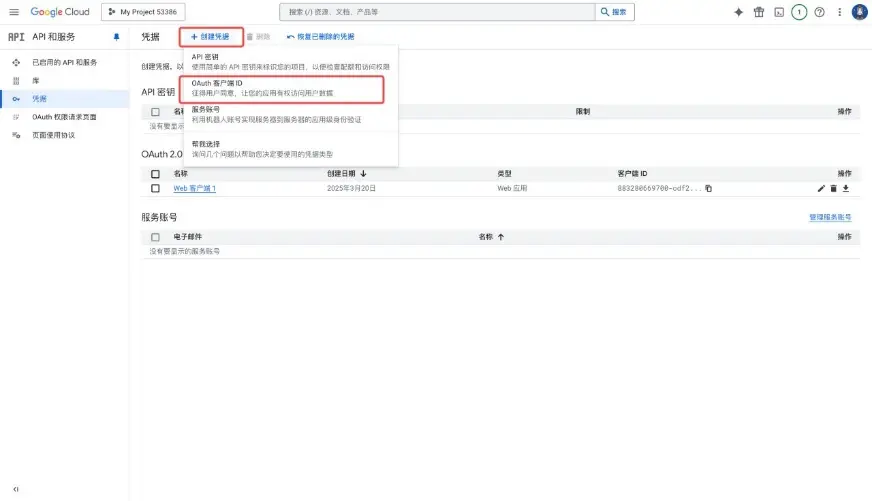

点击创建，即可获得 ID

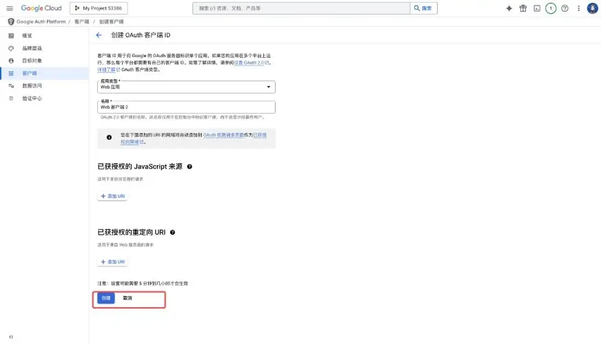

填写 OAuth 客户端 ID 及密钥，完成 Google 登陆配置

复制【Callback URL （for OAuth）】中的链接

打开【GitHub】，点击右上角头像-选择【setting】-点击【Developer Settings】-选择【OAuth Apps】

新建项目，即可到达截图页面

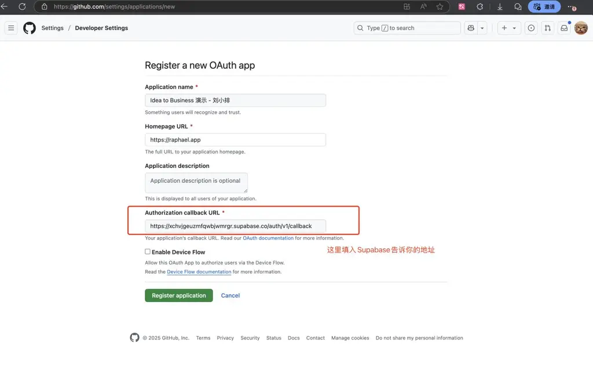

GitHub 完成配置后，将 Client ID 填入 Supabase 中

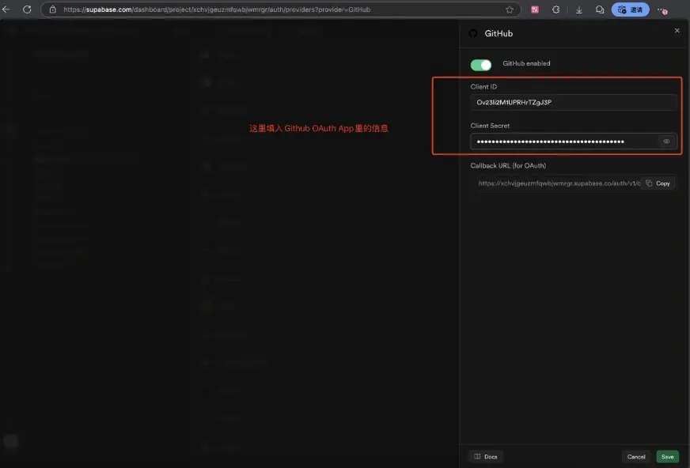

让 Cursor 在现有项目里添加 Supabase 登录，基本上可以一气呵成。（如果你的 Cursor 没有一气呵成，也别着急，把报错信息反馈给它，让它修改）。

注意：建议跟 Cursor 说，“Supabase 官方推荐使用 @Supabase/ssr 包进行服务器端认证，请不要写成了客户端认证”。（我截图里没体现这一点，但是，建议你补充这一句。)

这里，我们演示让 Cursor 先帮我们做“使用 GitHub 账号登录”功能。

不过，你需要认真阅读 Cursor 给你的反馈，有一些关键配置，是需要咱们自己动手的。

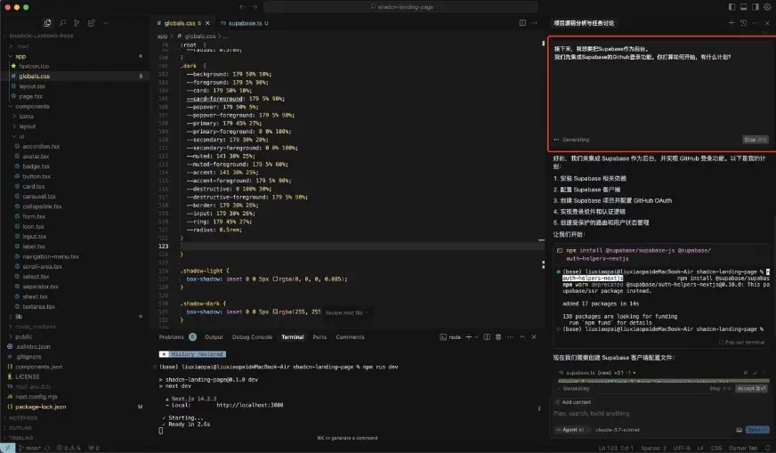

Cursor 让我自己动手干这些配置，我一个一个干完它们

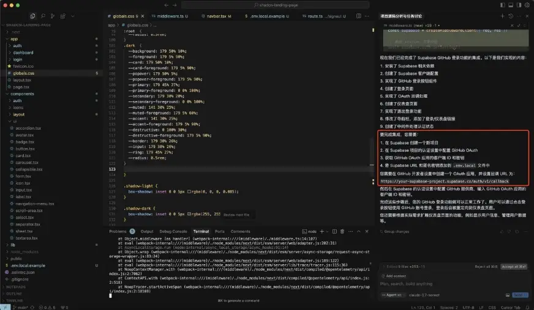

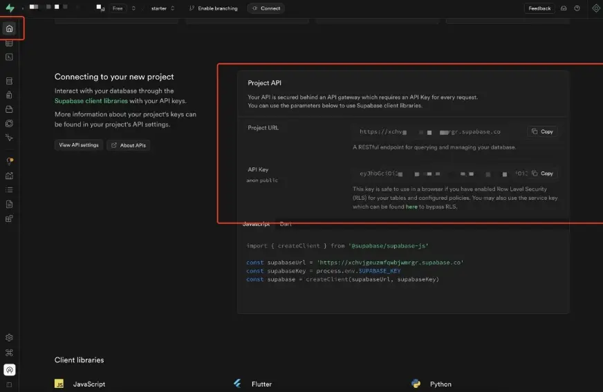

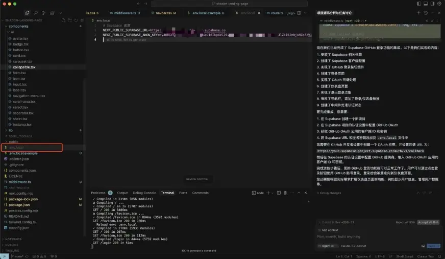

配置完成后，使用 npm run dev 运行项目，发现已经做好了

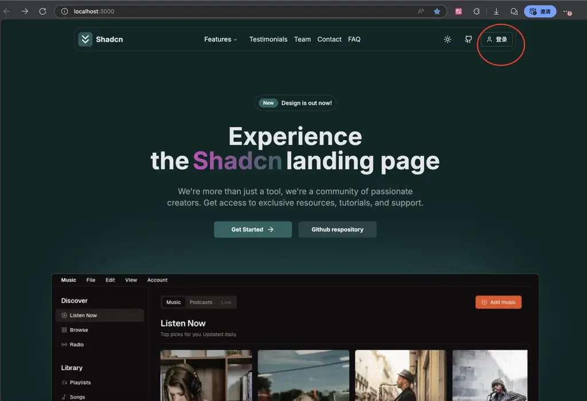

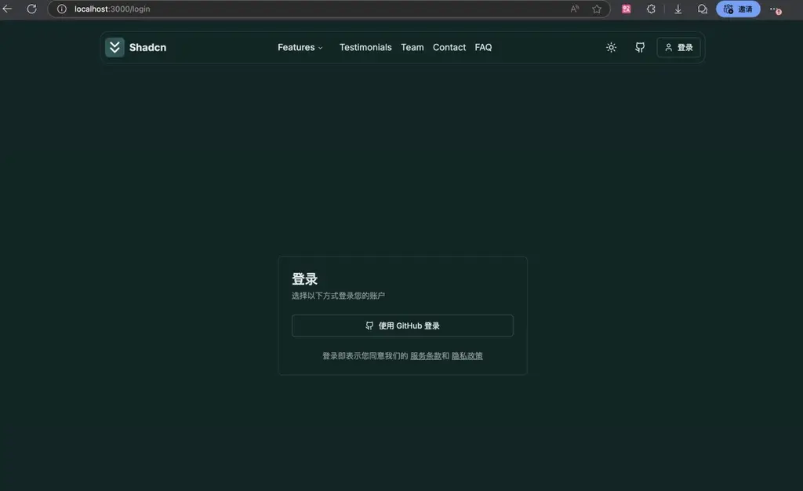

用户登录成功后，会跳转到 dashboard （刚才 Cursor 已经告诉我们了）

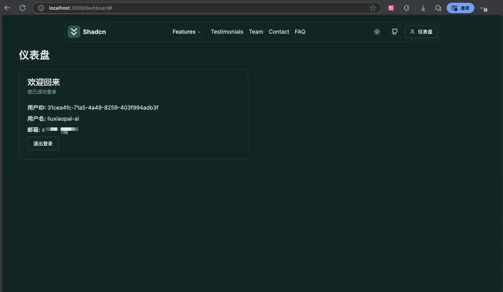

当用户用他的 GitHub 账号登录后，我们就可以在 Supabase 后台的数据库里，看到这个用户的记录了

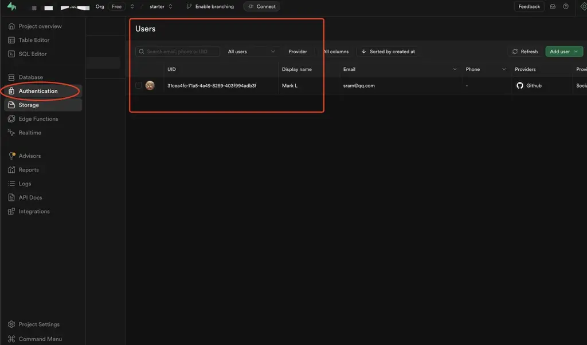

连贯的录屏是这样的，下面是视频

（视频演示：7032_1742210099_raw.mp4，在线播放）

同样的方法，再打开 Google 登录

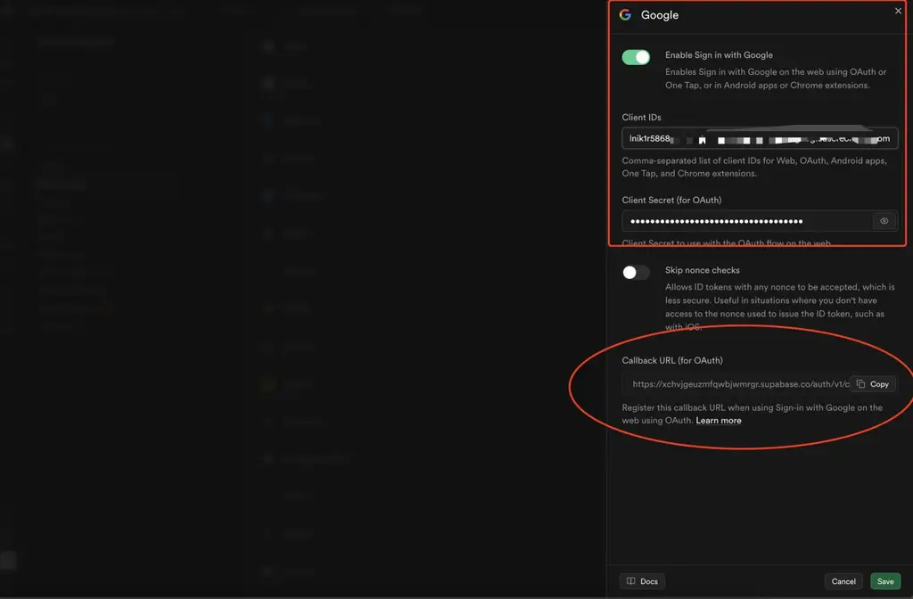

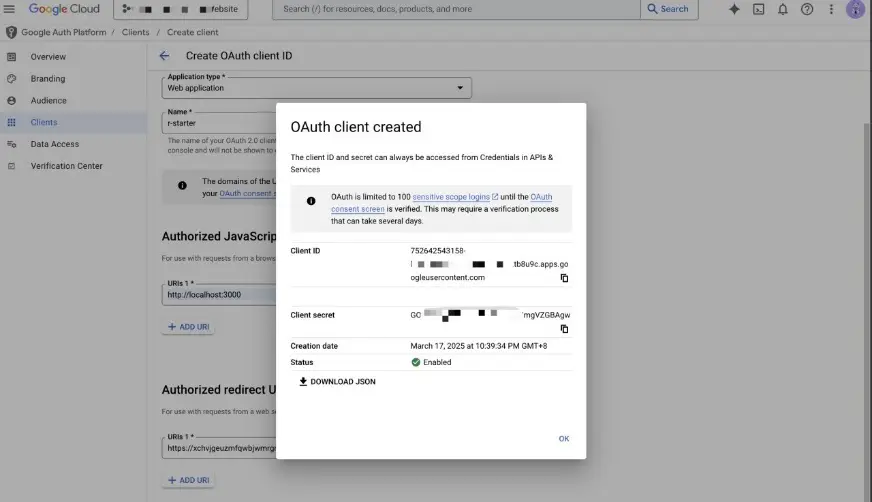

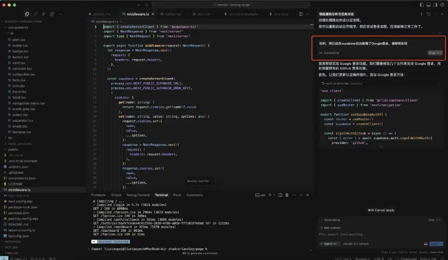

同时加上 Google 登录和 GitHub 登录后，连贯的效果大约是这样，下面是视频。（网速有点慢，所以点击登录后卡了 5 秒。上线到海外的服务器后，不会卡）

（视频演示：20250317225807_rec.mp4，在线播放）

**3. 关于邮箱登录？**

邮箱登录在 Supabase 里是默认打开的。

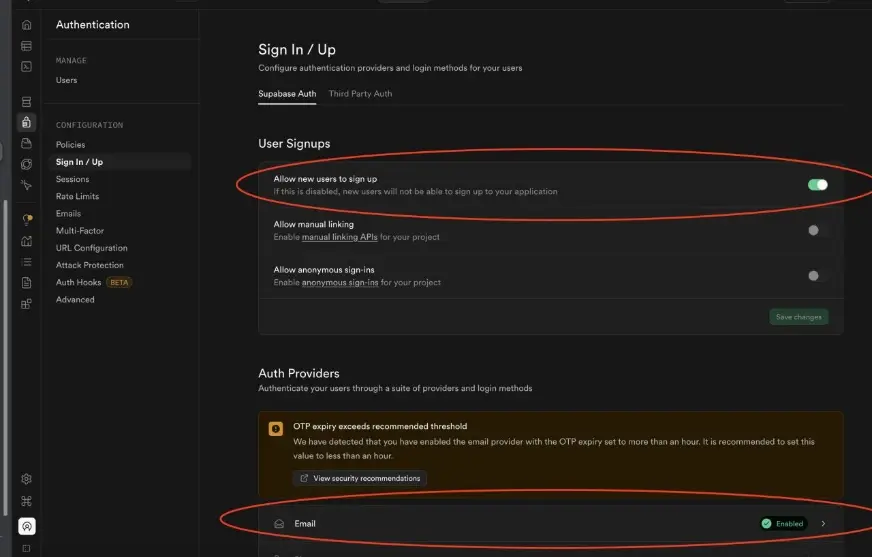

我推荐：刚开始的 SaaS，不要启用邮箱注册登录。有两个原因

如果打开邮箱登录，就要额外做用户注册、忘记密码、修改密码、修改用户资料、发送激活邮件等等一大堆页面和功能，太麻烦。初期连用户都很少，没必要，只要有 Google 登录，绝大部分海外用户都已经可以登录了。

如果打开邮箱登录，我们提供的免费限额容易被刷。因为有很多提供临时邮箱的服务。如果我们要提供“新用户免费 xxx credits”，会被人使用无限邮箱地址进行薅羊毛。

我一般会确定某个产品赚钱后，再去补邮箱登录的功能。

你可以这么想：如果提供了邮箱登录，你的产品会增加 10%的收益；但是对于初期来说，这 10%收益对应的工作量是比较大的，如果初期把这部分工作投入放到更重要的事情上，不止增收 10%

如果你要做邮箱登录的话，操作方式和刚才差不多。不过，邮箱登录涉及的功能和页面比较多，Cursor 比较难“一气呵成”，往往需要你和 Cursor 多切磋几轮，并且调整一些页面样式。

### 1.2 新手可选方案：Clerk

Clerk 是一个专为现代 Web 应用程序设计的完整身份验证和用户管理解决方案，与 Next.JS 框架的集成，非常好用。

Clerk 官网是：https://clerk.com/

主要特点

完整的身份验证系统（登录、注册、密码重置等）

社交登录（Google、GitHub、Twitter 等）

用户管理和配置文件

多因素认证

组织和角色管理

开箱即用的 UI 组件

这是 Clerk 官方提供的 demo，你可以进去点一下 Sign In，自己试试看

https://clerk-nextJS-app-router.vercel.app/

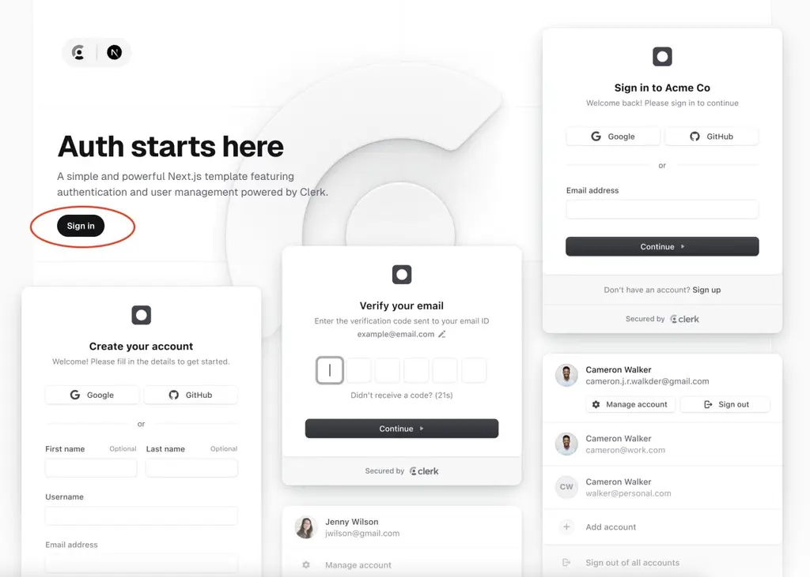

如果只是从“登录”功能讲，我认为 Clerk 比 Supabase 更好用。为什么我更加推荐 Supabse 呢？

因为 Supabase 不仅仅有登录，还有其他一整套开发者需要的后端服务，而 Clerk 几乎只有登录相关的功能。

你可以跟着 Clerk 官方文档，做一遍，就学会了

https://clerk.com/docs/quickstarts/nextJS

### 1.3 其他成熟方案：BetterAuth、NextAuth 等等

NextAuth.JS（现在也被称为 Auth.JS），相信你从名字也能看出来，NextAuth.JS 是 Next.JS 应用程序中最受欢迎的身份验证解决方案之一。它提供了一个简单但功能强大的身份验证系统，支持多种身份验证方式。

官方网站：https://next-auth.JS.org/

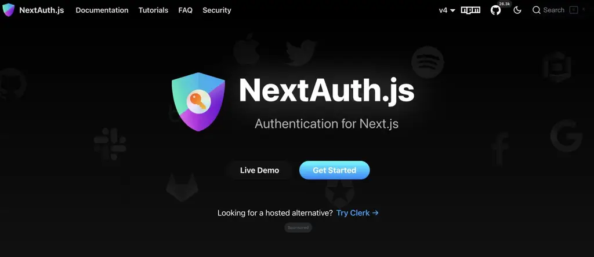

主要特点

对 NextJS 特别友好

支持多种身份验证提供商（OAuth、邮箱/密码、魔法链接等）

会话管理

JWT 或数据库会话

支持多种数据库适配器

开源且社区活跃

BetterAuth 是后起之秀，我是在最近（2025 年 1 月后）才刚刚开始使用它。

官方网站在这里 https://www.better-auth.com/

主要特点：

框架无关性：兼容多种框架。

设计优雅。

多租户支持：提供成员、组织、团队和邀请功能，支持多租户环境下的访问控制，满足复杂业务需求。

插件生态系统：拥有丰富的官方插件和社区创建的插件，增强应用功能，提升开发体验。

虽然 Better-Auth 比较新，但是开发者对 Better Auth 给予了高度评价，称其为“最好的认证体验”，并赞扬其全类型安全和简单的 API 设计。

最后顺便一提，Raphael AI （ https://raphael.app ） 是 2025 年 1 月后才做的网站，当时我为了尝鲜，使用的是 Better-Auth 登录。
