**第 1 页**

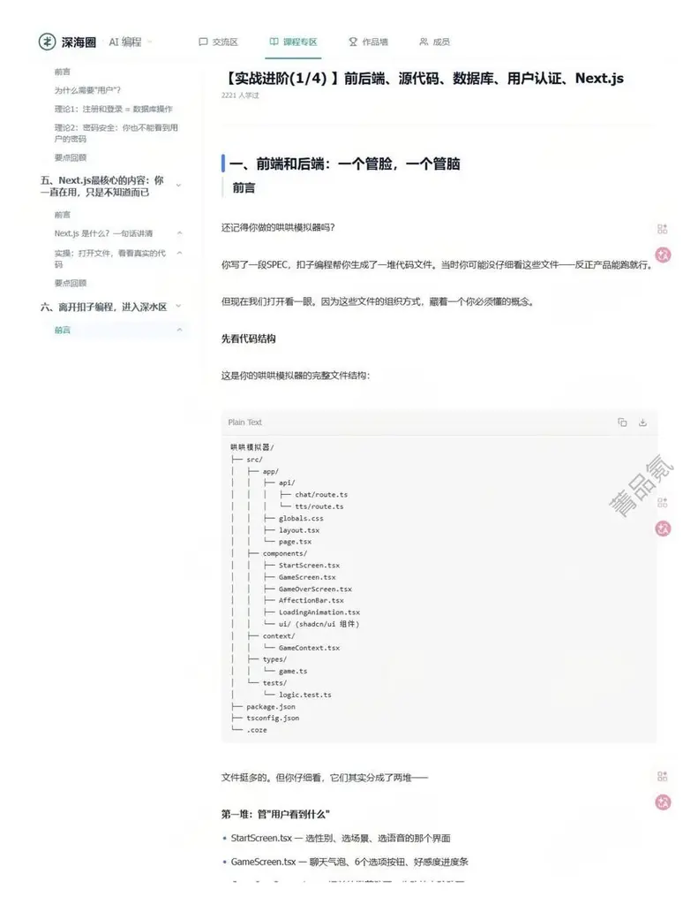

@ #88 AG

五、

Ut

前

为什么需要"用户"?

理论1: 注册和登录 = 数据库操作

理论2: 密码安全: 你也不能看到用

户的密码

要点回顾

Next.js最核心的内容: 你

一直在用，只是不知道而已

y

前言

Nextjs 是什么? 一句话讲清

实操: 打开文件，看看真实的代

B

要点回顾

六、离开扣子编程，进入深水区 “

aa “

D 交流区 O 课程专区 县 作品墙 包 成员

【实战进阶(1/4) 】前后端、源代码、数据库、用户认证、Next'js

2221

| 一、前端和后端: 一个管输，一个管脑

eS

还记得你做的哄哄模拟器吗? ot

@

你写了一段SPEC，扣子编程帮你生成了一堆代码文件。当时你可能没仔细看这些文件一反正产品能跑就行。

但现在我们打开看一眼。因为这些文件的组织方式，藏着一个你必须慌的概念。

先看代码结构

这是你的哄哄模拟器的完整文件结构:

Plain Text

ra

[e

哄哄模拟器/

| | chat/route-ts

| | lL tts/route.ts

| globais.css

上 te @

page. tsx

AN

| 上 startscreen.tsx

| ”| Gamescreen.tsx

人生=

| | AffectionBar.tsx

下

| Luis (shadcnui 组件)

广 context/

| — Gamecontext.tsx

广 epes/

和

[一 tests/

[一 logic.test.ts

TE package. json

ER

[一 -coze

文件禾多的。但你仔细看，它们其实分成了两堆 -一 Be

第一堆: 管"用户看到什么”

* StartScreen.tsx 一 选性别、选场景、选语音的那个界面

* GameScreen.tsx 一 聊天气泡、6个选项按钮、好感度进度条

**第 2 页**

* GameOverScreen.tsx — iB ATCA), FLATS)

+ AffectionBar.tsx 一 顶部那个好感度进度条

* LoadingAnimation.tsx 一 "她正在思考.…"的跳动爱心

* globals.css 一颜色、字体、间距这些样式

BOE: 管"背后发生什么”

* api/chat/route.ts 一 调用LLM，生成对方的回复和6个选项

+ api/tts/route.ts 一调用TTS，把文字变成语音

+ GameContext.tsx 一 管理好感度计算、轮次递增、胜负判定

* game.ts 一 定义数据结构 (好感度的范围、最大轮次等)

看出来了吗?

第一堆，全是用户能看到、能点击、能交互的东西。

第二堆，全是用户看不到、但在幕后默默干活的东西。

这两堆东西，有专门的名字:

SMAI (Frontend) 。第二堆叫后端 (Backend) 。

我标注了颜色

* 绿色: 前端

* 红色: 后端

* BE: Bile, TSUDA.

— soooe ORF mon. san +m « soc @®

‘© prepare sh 局 骆间加

口sa ER 而

“Da ° tm

-em

Eel @ 手机一直握在手里等你消息，屏幕高了无数次都不是你，你现在才想

起理我?

cas

‘TS routets aa

“Oe

areas

om

B tweonee

B globais.css

*

WS robots ts

| coer 我错了宝贝，刚才临对帮同事处理紧急事没顾上，现在我订了你旦爱的草攻至烽，半小时就到，你别气

>ouW 了好不好 @

© AfectionBartsx

© ameovesoreentsx ROSAS, METRO T I

® Gamescreen tsx

SABAMERT-ORGOE? 保证比你还委届

® LoadingAnimationtsx

© StartScreentsx

我出才在想，以后你要是再等我消息，我就把我游戏号给你当人质，你随便千

7D context

> © hooks 7 199222, my np mamodtne

，口四

me 上请 控制各。 输出 oN

**第 3 页**

前端和后端，到底是什么?

一句话:

> 前端管输，后端管脑。

- 前端 = 用户能看到的一切。界面长什么样、按钮在哪里、点击后有什么动画、颜色好不好看。

- 后端 = 用户看不到的一切。数据怎么处理、API怎么调用、逻辑怎么计算、结果怎么返回。

用餐厅来比喻:

aT 你的产品

前庙 AM: BIS, AIRS 界面: 按钮、气泡、动画、配色

RR iB

Tat 后厨: OR. BA 服务器: 调用API、计算数据、返回结果

味、洗碗

客人只进大堂，不进后厨。但没有后厨，大堂再好看也上不了茉。

你的用户只看到前端，不知道后端的存在。但没有后端，前端再好看也不会"思考

在哄哄模拟器里走一遍

我们用一轮完整的游戏操作，看看前庙和后端是怎么配合的:

你点击了一个选项〈比如"对不起宝贝，我真的错了")

1. 前端: 捕捉到你的点击，把你选的选项发送给后端

2. 后端 (`api/chat/route.ts` ) : 收到选项，连同对话历史一起发给LLM

3. 后端: LLM返回 "对方的回复 + 好感度变化 + 6个新选项"

4. 后端 〈(` GameContext.tsx` ) : 更新好感度 (比如从35加到50) 、轮次+1

5. 前端 〈` GameScreen.tsx` ) : 显示对方的回复气泡、更新好感度进度条、展示新选项

6. 同时，后端 (`apitts/route:ts` ) : 把对方的回复文字发给TTS，生成语音

7. 前端: 语音气泡出现，用户可以播放

一次点击，前端和后端怎么配合?

**第 4 页**

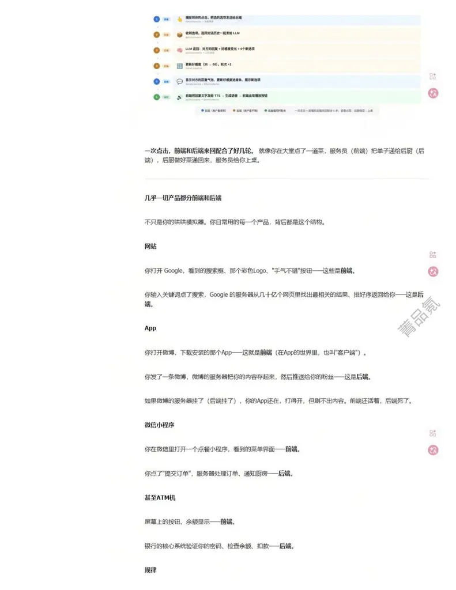

Aan -ORRERRERA is EGR oe

一次点击，前端和后端来回配合了好几轮。 就像你在大堂点了一道荣，服务员 《前端) 把单子递给后厨 (后

i) ，后奇例子荣道回来，服务员给你上柴。

几乎一切产品都分前端和后端

不只是你的哄哄模拟器。你日常用的每一个产品，背后者是这个结构。

网站

你打开 Google，看到的搜索框、那个彩色Logo、"手气不错 "按钮一这些是前端。 (+3)

你输入关键词点了搜索，Google 的服务器从几十亿个网页里找出最相关的结果、排好序返回给你一这是后

it.

App

你打开位博，下载安装的那个pp一这就是前端 (在App的世界里，也叫"客户端) 。

你发了一条微博，微博的服务器把你的内容存起来，然后推送给你的粉丝一这是后端。

如果微博的服务器挂了(后端挂了) ，你的App还在，打得开，但剧不出内容。前端还活着，后端死了。

微信小程序

你在微信里打开一个点餐小程序，看到的某单界面一 前庙。 @

你点了"提交订单"，服务器处理订单、通知厨房后端

甚至ATM机

屏幕上的按钮、余额呈示- 前端-

银行的核心系统验证你的室码、检查余额、扣款一后端。

规律

**第 5 页**

O 凡是你能在到的 = 前端。凡是在幕后跑的 = 后应。

为什么要分开? 不能写在一起吗?

技术上可以。但分开有三个重要的好处:

LAL

现实中，"做界面和"写远辑"是两种不同的能力。

把它们分开后，设计师专门管前端好不好看 (ETA, BERR) ，工程师专门管后端稳不稳 (APRA

得对不对、数据算得准不准) 。

就像餐厅里，大堂经理和主厨各管各的，不会互相干扰。

2. 安全 @

还记得你的LLM调用吗? 那个系统提示词、那些API调用一这些都在后端。

用户看不到后端的代码。 也就是说，你的系统提示词、你的API室铀、你的好感度计算规则，用户全都看不

到。

如果你把API密钥放在前端，用户打开浏览器的"开发者工具"就能看到-一相当于把后厨的茉谱贴在予太堂墙

Blame

3. 复用

同一个后端，可以同时给网站、App、小程序用。

想象一下; 你的哄哄模拟器现在是网页版。如果你以后想做一个App版，你需要从头写吗?

不用。你只需要重新做一个App前端 (RK) ，后端代码一行不用改 (脑子是同一个) 。这就叫"换验不换

ia".

微博就是这样做的: 它的网页版、iD5 App, Android App、ipad版一一四张"脸"，但背后只有一个"脑"。

回顾你的三个产品

现在你再看你做过的三个产品，就能清晰地分辨出前端和后端了:

前端做了什么 后端做了什么

BARE Qe. MER Se 。” 调用LLM翻译里话

**第 6 页**

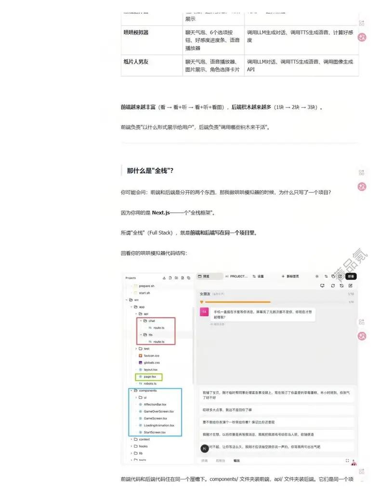

哄哄模拟器 调用LLM生成对话、调用TTS生成语音、计算好感

= @

纸片人男友 聊天气泡、语音播放器、 。 调用LLM对话、调用TTS生成语音、调用图像生成

图片展示、角色选择卡片”API

前端越来越丰富 (看 一 看+听 一 看+听+看图) ，后端积木越来越多 (1块 一 2块 一 3块) 。

前端负责"以什么形式展示给用户"，后端负责"调用哪些积木来干活"。

那什么是"全栈"? 8s

(ROS: SSSA SRDS, SSAMCEARRIIT, AHARST—NAE?

PRIS (RFRRYE Next.js——1" S812".

Amis" 2t8" (Full Stack) ，就是前端和后端写在同一个项目里。

回看你的哄哄模拟器代码结构:

om 站 PROJECT... % 设时 + mee

rem? a

We robots

ce ean QTE, ATGHTTLRRATAML, MART RARE SEE, HUI, RT

ou 了好不好

© AlectionBartsx

4% GameOvmscrsentsx 吧呵多大点事，我这不是回你了大

® Gamescreentsx

和 LoadingAnimation tsx

要不我给你表演个一秒类给你看? 保证比你还委必

人 我刚才在想，以后你要是再等我消息，我就把我游戏号给你当人质，你隧便造

7D conte

> © hooks or 让你等这么久，我刚才应该抽空强你说一声的，你号我两句出出气吧

，口四

me ae ee) 2

前端代码和后端代码住在同一个屋检下。components/ 文件来装前端，api/ 文件夹装后端。它们是同一个项

**第 7 页**

目，用同一种语言 (TypeScript) ，一起部署、一起运行。

这就是 Next.js 的好处;你不需要分别搞两个项目、学两种语言、部署两个服务器。 一个项目搞定一切。

传统做法 vs Next.js全栈

在以前，做一个产品通常是这样的:

传统做法 Next.js 全栈

项目数量 2个 (一个前端项目, — 1个

个后端项目)

语言 前端用 JavaScript, fai; 。 全部用 TypeScript

可能用 Python/Java/Go

部署 分别部署到不同的服务器 ”一起部署

沟通 前后端要约定接口格式，。 在同一个项目里，自己跟自己沟通

经常扯皮

对于一个人做产品来说，全栈框架就是最好的选择 一少折腾，快出活。

为什么这对你很重要?

因为这门课接下来的所有产品，都会用 Next js.

你不需要关心 我这行代码是前端还是后端"一Next.js 会帮你处理。你只需要记住:

* 放在 components/ 和 page.tsx 里的代码，会在用户的浏览器里运行(前端)

+ 放在 api/ 文件夹里的代码，会在服务器上运行 〈后端)

前端后端的概念要慌，但写代码时不需要分成两个项目。 这就是全栈的意义。

总结回顾

* 前端管用户体验，后端管业务逻辑。前端是餐厅大堂，后端是后厨。

* 你的AI产品，前端负责好看好用，后端负责调用积木干活。

* 而 Next.js 让你一个项目搞定两件事一这就是全栈。

下一课我们讲另一个你已经在用但不知道的东西: 源代码管理。

源代码管理: 你的代码也需要网盘

**第 8 页**

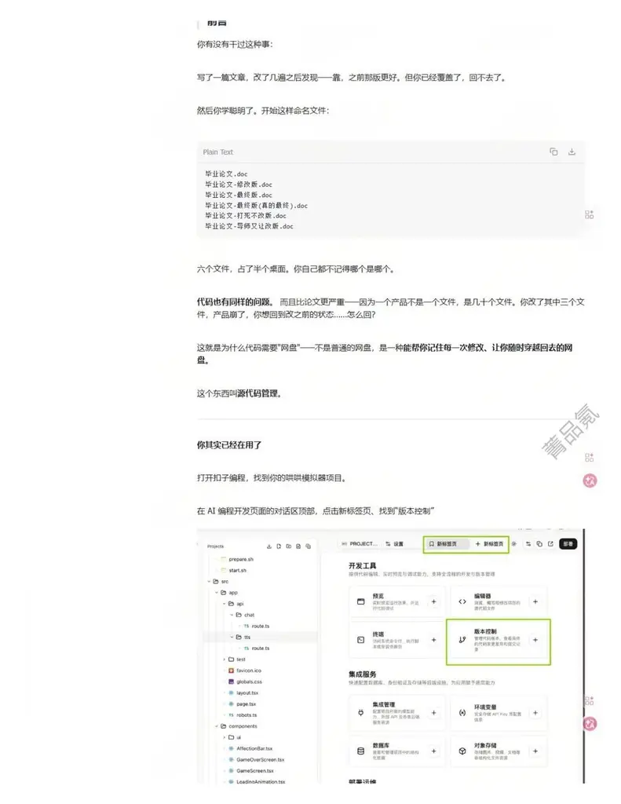

ne

你有没有干过这种事:

写了一篇文章，改了几痪之后发现-一靠，之前那版更好。但你已经覆盖了，回不去了。

然后你学虹明了。开始这样命名文件:

[ce

Plain Text ia)

音业论文.doc

毕业论文-修改版doc

毕业论文-最终版.doc

毕业论文-最终版(真的最终) ,doc

毕业论文-打死不改版.doc as

毕业论文-导师又让改版doc

六个文件，占了半个桌面。你自己都不记得哪个是哪个。

代码也有同样的问题。 而且比论文更严重一因为一个产品不是一个文件，是几十个文件。你改了其中三个文

件，产品南了，你想回到改之前的状态…-怎么回?

这就是为什么代码需要"网盘"一一不是普通的网熏，是一种能帮你记住每一次修改、让你随时穿越回去的网

a.

这个东西叫源代码管理。

你其实已经在用了

打开扣子编程，找到你的哄哄模拟器项目。 (+2)

EA 编程开发页面的对话区项部，点击新标签页、找到 版本控制”

人 PROuecr 。 % Smt Omen +a |e 3 oc GD

Projects ry

prepare.sh

© startsh

+ @ we

y, SHIRNOT ASTER

haa ame

ee +O me tremann (+

+B chat

18 routets

~ Bits

ev

,ma

Haeoniea

a 集成服务

图 gobalscss

# meta

SHRM, SUMTER

nae os

15 robotess sam Anke

components . ©

ow

AMfectionBartsx

人 GameOversereen tex

® GameScreentsx

© Leadina&nimation tax mene

**第 9 页**

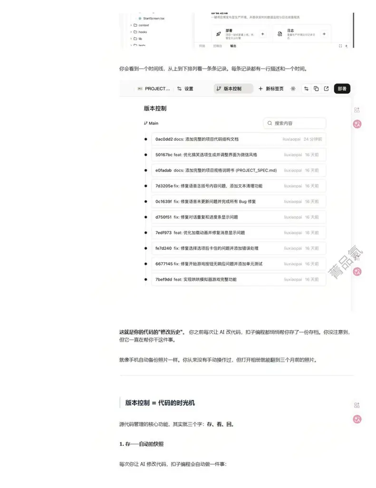

4 Startscreensse

> © coment

> 0 hooks

，口由

你会看到一个时间线，从上到下排列着一条条记录。每条记录都有一行描述和一个时间。

画 PROJECT... % 设置 Ly 版本控制 十 新标签页 党 上5 OB

版本控制 o

v Main Q 搜索内容 @@

@ 。 0ac0dd2 docs: 添加完整的项目代码结构文档

@ 50167bc feat: 优化搞笑选项生成并调整界面为微信风格 xiaopai 16 AW

© 。 eOfadab docs: 添加完整的项目规格说明书 (PROJECT_SPEC.md) xiaopai

@ 7d3205efix: 修复语音念括号内容问题，添加文本清理功能 xiaopai 16 KA

© 0c1639f fix: 修复语音未更新问题并完成所有 Bug 修复 xiaopai 16天

© 0750151 fix 修复对话重复和进度条显示问题 xiaopai 16 天前

@ 7edf973 feat: 优化加载动画并修复消息显示问题 xiaopai 16 天家

@ = fe7d240 fix: 修复选择选项后卡住的问题并添加错误处理 xiaopai 16 天

多

© 6677145 fix: 修复开始游戏按钮无响应问题并添加单元测试 xiaopai 16 Fi ¥

© 7bef9dd feat: 实现哄哄模拟器游戏完整功能 xiaopai 16 天前

这就是你的代码的"修改历史"。 你之前每次让 AI 改代码，扣子编程都悄悄帮你存了一份存档。你没注意到，

但它一直在帮你干这件事。

就像手机自动备份照片一样。你从来没有手动操作过，但打开相册就能翻到三个月前的照片。

版本控制 = 代码的时光机 Bs

源代码管理的核心功能，其实就三个字: 存、看、 回。 @

工 存一-自动拍快照

每次你让 AI 修改代码，扣子编程会自动做一件事:

**第 10 页**

把当前所有代码的状态"拍一张快照"，存起来。

不是存一个文件，是存整个项目一所有文件在那一刻的样子，全部打包保存。

就像你玩游戏时的"存档"功能。你不是只存了一个角色的血旦，你存的是整个游戏世界在那一刻的状态: 角色

位置、背包物品、任务进度、地图迷雾。

每次代码变更，就自动存一个档。 88

而且每个存档还自带一句描述一一告诉你这次存档改了什么。比如:

* 0ac0dd2 docs: 添加完整的项目代码结构文档

* 50167bc feat: 优化搞笑选项生成并调整界面为微信风格

* eOfadab docs: 添加完整的项目规格说明书 (PROJECT_SPEC.md)

这些描述是 AI 自动生成的，帮你总结了"这次到底改了什么"。

2. 看 一哪里变了一目了然

光知道"改了什么"还不够。你可能想知道具体改了哪行代码。

在扣子编程的版本控制页面，点开任意一个版本，你能看到两栏对比: ot

- 左边: 改之前的代码

- 右边: 改之后的代码

-绿色的行: 新加的代码

- 红色的行: 删掉的代码

这个功能叫 Diff (SRL) 。

< ¥ Main

OacOdd2 docs: 添加完整的项目代码结构文档 BR iuxiaor

变更文件数: 3 统一 分屏 Q BRAS

ot

83

(8) CODE_STRUCTURE_PART1.md +704 -0 iil ov

9) CODE_STRUCTURE_PART2.md +1050 -0 Milt «ov

TS next-env.d.ts +1 -1 BRO

1 /// <reference types="next" />

2 _/// <reference types="next/image-types/global" />

import "./.next/types/routes.d.ts";

3 import "./.next/dev/types/routes.d.ts";

4

5 // NOTE: This file should not be edited

6 // see https: //nextjs.org/docs/app/api-reference/config/typescript for

more information.

**第 11 页**

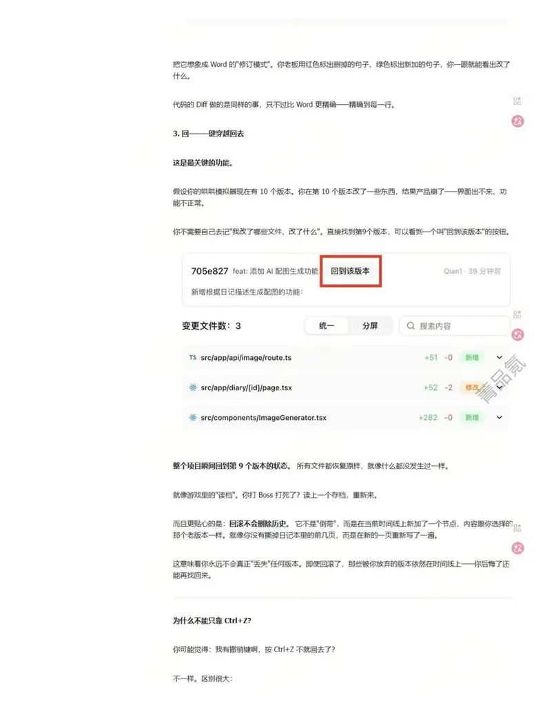

把它想象成 Word 的"修订模式"。你老板用红色标出各掉的句子、绿色标出新加的句子，你一卢就能看出改了

什么。

代码的 Diff 做的是同样的事，只不过比 Word 更精确一精确到每一行。

3. B} ail @

这是最关键的功能。

假设你的哄哄模拟器现在有 10 个版本。你在第 10 个版本改了一些东西，结果产品南了一一界面出不来、功

能下正常。

你不需要自己去记"我改了哪些文件、改了什么"。直接找到第9个版本，可以看到一个叫"回到该版本"的按钮。

705e827 feat: 添加 Al 配图生成功能 Qian1 . 39 分钟前

新增根据日记描述生成配图的功能:

变更文件数: 3 统一 分屏 Q BRAS 四

Ts srclapplapilimagejroute.ts +51 -0 “新增 ov

® srclappldiary/[id]j/page.tsx +52 -2 【修罗OGAe

®& src/components/ImageGenerator.tsx +282 -0 新增

整个项目瞬间回到第 9 个版本的状态。 所有文件都恢复原样，就像什么都没发生过一样。

就像游戏里的"读档"。你打 Boss 打死了? 读上一个存档，重新来。

而且更贴心的是: 回滚不会删除历史。 它不是"倒带"，而是在当前时间线上新加了一个节点 内容跟你选择的gx

那个老版本一样。就像你没有括掉日记本里的前几页，而是在新的一页重新写了一遍。

@

这意味着你永远不会真正"丢失"任何版本。即使回滚了，那些被你放弃的版本依然在时间线上一一你后悔了还

能再找回来。

为什么不能只靠 Ctrl+Z?

你可能觉得: 我有撤销键啊，按 Ctrl+Z 不就回去了?

不一样。区别很大

**第 12 页**

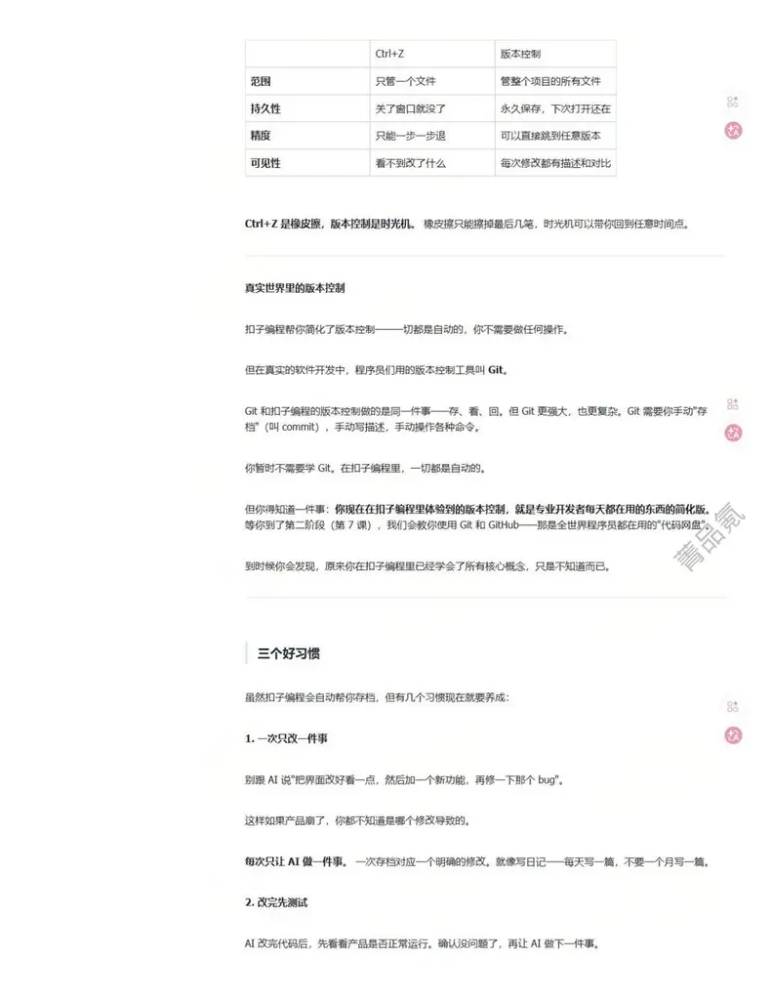

Ctrl+Z 版本控制

范围 只管一个文件 管整个项目的所有文件

持久性 关了窗口就没了 永久保存，下次打开还在

精度 只能一步一步退 可以直接跳到任意版本

可见性 看不到改了什么 每次修改都有描述和对比

Ctrl+Z 是橡皮掠，版本控制是时光机。 橡皮探只能擦掉最后几笔，时光机可以带你回到任意时间点。

真实世界里的版本控制

扣子编程帮你简化了版本控制一切都是自动的，你不需要做任何操作。

但在真实的软件开发中，程序员们用的版本控制工具叫 Git。

Git 和扣子编程的版本控制做的是同一件事一一存、看、回。但 Git 更强大，也更复杂。Git 需要你手动'存

档”(叫 commit) ，手动写描述，手动操作各种命令。

你暂时不需要学 Git。在扣子编程里，一切都是自动的。

但你得知道一件事; 你现在在扣子编程里体验到的版本控制，就是专业开发者每天都在用的东西的简化版。

等你到了第二阶段 (第 7 课) ，我们会教你使用 Git 和 GitHub一一那是全世界程序员都在用的"代码网盘准

到时候你会发现，原来你在扣子编程里已经学会了所有核心概念，只是不知道而已。

三个好习惯

虽然扣子编程会自动帮你存档，但有几个习惯现在就要养成:

1. 一次只改一件事

SUR AI 说"把界面改好看一点，然后加一个新功能，再修一下那个 bug 。

这样如果产品南了，你都不知道是哪个修改导致的。

每次只让 AI 做一件事。 一次存档对应一个明确的修改。就像写日记一一每天写一篇，不要一个月写一篇。

2. 改完先测试

AI 改完代码后，先看看产品是否正常运行。确认没问题了，再让 AI 做下一件事。

8

@

**第 13 页**

别连着让 AI 改五六轮，最后才去看效果一如果良了，你得翻好几个版本才能找到出问题的那个。

t+

3. 回滚前看 Diff

产品南了，先别急着回滚。先看看最新版本的 Dif一一也就是看看 AI 最后一次到底改了哪些代码。

很多时候，问题可能只是一行代码改错了。你把问题告诉 AL，让它修一下就好了，不需要回滚整个版本。

回滚是核武器，Diff 是精确制导。 大多数问题用精确制导就够了。

要点回顾

* 源代码管理就是代码的时光机。

”扣子编程会自动帮你拍快照、做存档。改环了能看 Diff、能回滚。

* 一次只改一件事，改完就测，测完再改下一件。 a+

下一课我们来讲数据库一一你的产品不只有代码，还需要存数据。数据存在哪 @

| 三、数据库: 你的数据存在哪?

前言

你的哄哄模拟器已经是个像样的产品了。但产品不能只有一个功能一好的产品会有内容， LAP,

我们来给哄哄模拟器加一个博客页面。放一些"恋爱沟通技巧"的文章，让用户除了玩游戏，还能学点东西。

第一步: 先加个博客

打开你的呐呐模拟器项目，给 AL 这段 Prompt:

| 给我的哄哄模拟器增加一个博客页面。要求:

1. 在首页加一个"恋爱攻略"入口按钮，点击进入博客列表页

2. 博客列表页展示文章卡片，每张卡片显示标题和摘要

3. 点击卡片进入文章详情页，显示完整内容

4 . 先写 3 篇文章，主题分别是:

© "吵架之后的黄金 30 分钟

。 "为什么「你说得对」是最烂的回复"

* "道歉的正确打开方式”

5. 文章内容由 LLM 生成，风格轻松幽默，每篇 300-500 字

**第 14 页**

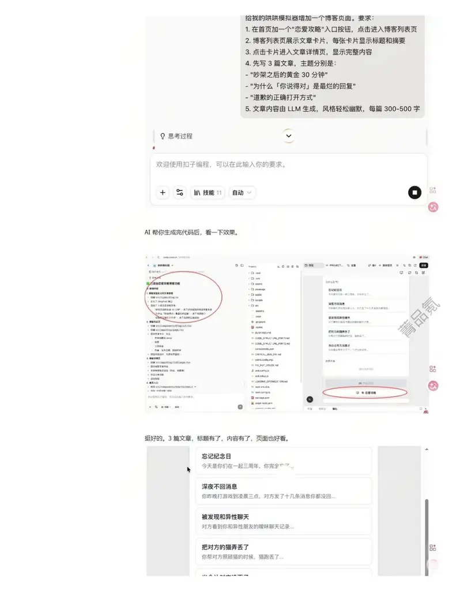

BRAVA RMN MESRE, BR:

1. 在首页加一个"恋爱攻略"入口按钮，点击进入博客列表页

2. 博客列表页展示文章卡片，每张卡片显示标题和摘要

3. 点击卡片进入文章详情页，显示完整内容

4. 先写 3 篇文章，主题分别是:

- "吵架之后的黄金 30 分钟"

- "为什么 你说得对」 是最烂的回复"

- "BRO ERTA AL"

5. MHASH LLM 生成，风格轻松幽默，每篇 300-500 F

9 思考过程

欢迎使用扣子编程，可以在此输入你的要求。

十| % WN SRE [自动~ 加 ::

AI 帮你生成充代码后，看一下效果。

as Fa soses aa oo san versus soc gD

挺好的。3 篇文章，标题有了，内容有了，页面也好看。

忘记纪念日

今天是你们在一起三周年，你完全记了

深夜不回消息

你昨晚打游戏到凌晨三点，对方发了十几条消息你都没回，

被发现和异性聊天

对方看到你和异性朋友的暧昧聊天记录

把对方的猫弄丢了 83

你帮有对方照顾猫的时候，猫跑天了

**第 15 页**

AaxMILAA Ro

你在朋友聚会上开了一个过分的玩笑.

问题来了

现在你想加第 4 BB, AN?

你得让 Al 帮你改代码-一 找到那 3 篇文章写死的地方，再加一段。

再加第 5 篇? 再让 AI 改代码。第 6 篇? 再改。 @

每加一篇文章，就要改一次代码。

这就好比你开了一家餐厅，某单是画在墙上的。

起加一道新茉》重新刷博。想改个价格”重新剧墙。换季要调整茉单》把整面墙久了重来.

你觉得正常老板会这么干吗?

当然不会。正常老板的做法是一 菜单印在纸上，或者放在 iPad 里。 想加茉就加，想改价就改。墙是墙，葵

单是菜单，两件事分开管。

代码也一样:

- 代码是你的产品长什么样、怎么运行-相当于餐厅的装修和服务流程。这个不常变。 @

- 文章内容是你的产品展示什么一一相当于莱单。这个经常变。

你不应该把茉单画在墙上。你也不应该把文章写在代码里。

文章之类的数据，应该另外找一个地方存。

这个"另外的地方"，就叫数据库。

数据库就是你的产品专用的 Excel

数据库这个名字听起来很技术、很高级。但它的本质简单得要命:

数据库就是一张 Excel 表格。

我说真的。你打开 Excel 看到的东西一列名、行数据、不同的 Sheet一一数据库里全都有，只是叫法不同:

**第 16 页**

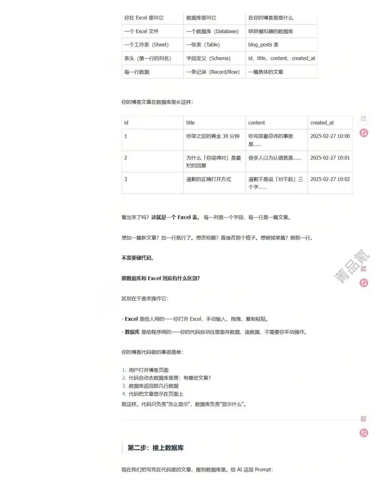

你在 Excel 里叫它 数据库里叫它 在你的博客里是什么

一个 Excel 文件 一个数据库 (Database) 。 哄叶模拟器的数据库

一个工作表 (Sheet) 一张表 (Table) blog_posts #

BA (第一行的列名) 字段定义 (Schema) id, title, content, created_at

每一行数据 一条记录 (Record/Row) 。 一篇具体的文章

你的博客文章在数据库里长这样:

id title content created at

1 吵架之后的黄金 30 分钟 WSR ERIS 2025-02-27 10:00

2 为什么 「你说得对」是最 REAVER... 2025-02-27 10:01

烂的回复

3 道羔的正确打开方式 道歉不是说 「对不起| = 2025-02-27 10:02

看出来了吗? 这就是一个 Excel 表。 每一列是一个字段，每一行是一篇文章。

想加一篇新文章?加一行就行了。想改标题?直接改那个格子。想删掉某篇》删那一行。

不需要碰代码。

那数据库和 Excel 到底有什么区别?

区别在于谁来操作它:

- Excel 是给人用的一一你打开 Excel，手动输入、拖搜、复制粘贴。

- 数据库 是给程序用的一一你的代码自动往里面存数据、读数据，不需要你手动操作。

你的博客代码做的事很简单:

1. 用户打开博客页面

2. 代码自动去数据库里查; 有哪些文章?

3. 数据库返回那几行数据

4. 代码把文章显示在页面上

就这样。代码只负责"怎么显示"，数据库负责"显示什么"…。

第二步: 接上数据库

现在我们把写死在代码里的文章，搬到数据库里。给 AI ER Prompt:

oy

it

**第 17 页**

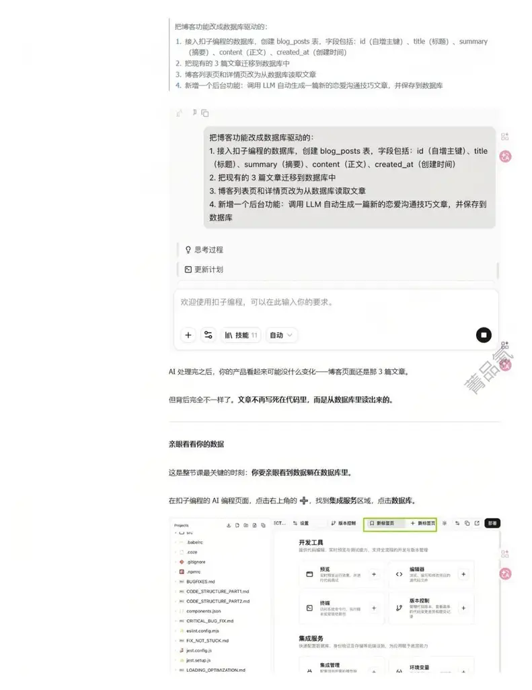

| eNO AeBLRAUR IRAN:

1. 接入扣子编程的数据库，创建 blog_posts 表，字段包括: id (〈自增主键) title (HRB) . summary

(摘要) 、content (正文) created_at (创建时间)

2. 把现有的 3 篇文章迁移到数据库中

3. 博客列表页和详情页改为从数据库读取文章

4. 新增一个后台功能: 调用 LLM 自动生成一篇新的恋爱沟通技巧文章，并保存到数据库

把博客功能改成数据库驱动的: 86

1. 接入扣子编程的数据库，创建 blog_posts 表，字段包括: id (自增主键) title @

(标题) 、summary (摘要) 、content (正文) created_at (创建时间)

2. 把现有的 3 篇文章迁移到数据库中

3. 博客列表页和详情页改为从数据库读取文章

4. 新增一个后台功能: 调用 LLM 自动生成一篇新的恋爱沟通技巧文章，并保存到

数据库

8 思考过程

© 更新计划

欢迎使用扣子编程，可以在此输入你的要求。

十 % Wie 自动 (a)

'

AL 处理完之后，你的产品看起来可能没什么变化一博客页面还是那 3 篇文章。 8

但背后完全不一样了。文章不再写死在代码里，而是从数据库里读出来的。

亲眼看看你的数据

这是整节课最关键的时刻: 你要亲眼看到数据躺在数据库里。

在扣子编程的 AI 编程页面，点击右上角的 中 ，找到集成服务区域，点击数据库。

Projects 40096 Tr Sie v rete

© sbabelre 开发工具

i RRR, TUDES RED, EHSRENT RSME ne

© -giignore ;

rene a ee, ee)

BUGFIXES md freee

网 CODE_STRUCTURE_PART1nd

© CODE_STRUCTURE_PART?2md 版本控制

ements

全。十 一

2

bassin aS

网 CRITICAL_BUG_FIXimd

5 eslint.contig.mis

fe FOLNOT_STUCK. md 集成服务

SERENE, SOMTRGNT RMON, AMMRTRRMD

1 jestcontigis

© Jestsetup js

集成管理

f= LOADING OPTIMIZATION ma ® 环境变量

本本有的es 上 wa

**第 18 页**

Wy een AnKeysem | 工

ae

TS pextenva.ts

75 nextcontigts

Gi package.json

国 pnpm-ockyaml

© postcss config mis

十

数据库 存储

目 asnwemeenee + @ wash. as. xox

ism 人>

ns PRouEcr spEcmd 一

部署运维

一名应用发布至生产环境，并提供实时的数据控与日

网 READMEmd

TESTING md

as ot

ty 加aasrrwiipiaB + 6o

18 tsconfigjson

tscontig.tsbuldinfo

zcT-。 % ie ee 目 数据库 +m xz 5 oo GD

总览”开发环境

总览

开发环境

Ss >

= 59.64 MB

数据恢复

O 数据库暂不支持回滚 iat

当前数据库能力正在升级改造中，暂不支持回滚操作

可溯回时间 和

24 小时 > &

然后进入表管理页签，你会看到一张叫 “blog_posts ”的表。

**第 19 页**

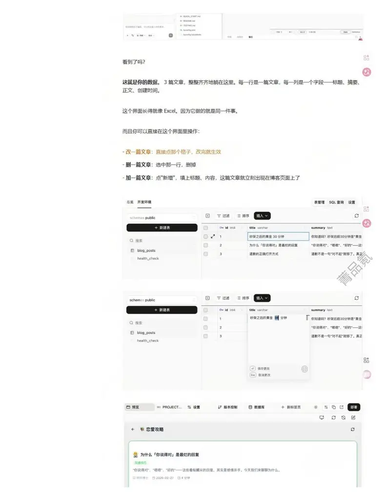

“ ~

看到了吗? Sa

这就是你的数据。 3 UE, SET, GEE, STIS TSR, 1

正文创建时间。

这个界面长得就像 Excel。因为它做的就是同一件事。

而且你可以直接在这个界面里操作:

- 改一篇文章: 直接点那个格子，改完就生效

-删一篇文章: 选中那一行，删掉

- 加一篇文章: 点"新增"，填上标题、内容，这篇文章就立刻出现在博客页面上了

Ok RRR

tas OG =m =m &

RUZ ”SQL 查询 Qe

@

summary ion

加这1 内要之后的黄金 30 分名 IU? DREMION AERA

Q 搜过

2 为什么 你说得对) EME

因 blog_posts

3 着数的正确打开方式

health_check

schems public Oo =m =m Gp

“eR, BNE, “ease

SRAS—O NTE RBT. AR

Q

j pazenne 国人名

Q 搜索

O 2

5 _blog_posts :

heahh_check

3) eR

fe) BEM

ome 网 PROJECT... % 设置 娄 版本控制 8 数据库 + 新标签页

《4 SRR

summary ‘xt

T ‘PE? 吵架后前30分钟是"黄金

Ce

ERTS—-ONTL HBT. AE

@ 为什么 (你说得对) 是最烂的回复

罗拉本

你说得对"、"咽唱 这些看似吴从的回复，其实是感情杀手。今天我们来著为什么

**第 20 页**

9S 才歼的正确打开方式

aes

道骨不是一句"对不起"就够了。真正的道歌，顺要让对方感受到你的诚意。今天我们来联聊道玖的正确姿势 @

WS) 吵架之后的黄金 80 分

你知道吗? 吵架后前30分钟是-黄金修复项"。这个时候，对方的起气值虽然旭表，但只要操作得当，好感度直接+201

ssh oie 输出 Ces

全程不需要改一行代码。

之前: 加文章 = 改代码 = “alt, 83

现在: 加文章 = 在"Excel"里加一行 = "BER", @

你用的所有产品，都有数据库

这不是什么高级概念。你每天用的产品，背后全是这个结构: “a

MS: 代码决定"时间线页面长什么样"。数据库存着几十亿条微博一一每条微博就是数据库里的一行。你发一

条人微博，就是往数据库里加了一行。

WE: 代码决定"商品详情页长什么样"。数据库存着几亿个商品的信息一一名称、价格、库存、图片链接。商

家改价格，就是改了数据库里的一个格子。

WE: 代码决定"聊天界面长什么样"。数据库存着你所有的聊天记录 每条消息就是一行，包含发送人、内 @

容、时间。

规律:

RHE ART, HERES THA. HERR, ESSA,

你的哄哄模拟器现在也是这个结构了。恭喜一一你的产品变得跟真正的互联网产品一样了。

一个产品可能有很多张表

你的博客现在只有一张 blog_posts 表。但真实的产品不会只有一张表。

**第 21 页**

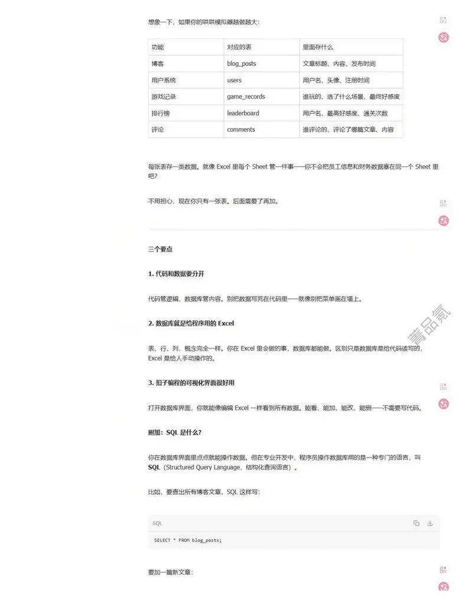

想象一下，如果你的叶哄模拟器越做越大

功能 对应的表 里面存什么 昌

博客 blog_posts 文章标题、内容、发布时间

用户系统 users 用户名、头像、注册时间

游戏记录 game_records 谁玩的、选了什么场景、最终好感度

排行榜 leaderboard 用户名、最高好感度、通关次数

评论 comments 谁评论的、评论了哪篇文章、内容

每张表存一类数据。就像 Excel 里每个 Sheet 管一件事一一你不会把员工信息和财务数据塞在同一个 Sheet 里

吧?

不用担心，现在你只有一张表。后面需要了再加。 点

三个要点

1. 代码和数据要分开

代码管远辑，数据库管内容。别把数据写死在代码里一一就像别把茉单画在墙上。

2. 数据库就是给程序用的 Excel

表、行、列，概念完全 样。你在 Excel 里会做的事，数据库都能做。区别只是数据库是给代码读写的，

Excel 是给人手动操作的。

3. 扣子编程的可视化界面很好用 o+

打开数据库界面，你就能像编辑 Excel 一样看到所有数据。能看、能加、能改、能删一一不需要写代码。 @

附加: SQL 是什么?

你在数据库界面里点点就能操作数据。但在专业开发中，程序员操作数据库用的是一种专门的语言，叫

SQL (Structured Query Language，结构化查询语言) 。

比如，要查出所有博客文章，SQL 这样写:

SQL Go &

SELECT * FROM blog posts;

+

要加一篇新文章: 号

**第 22 页**

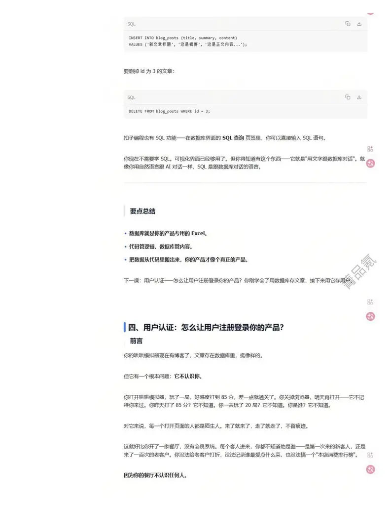

器

ica

SQL

INSERT INTO blog posts (title, summary, content)

VALUES ( "新文章标题'，'这是摘要"，'这是正文内容..…)5

要出掉 id 为 3 的文章:

fa)

ica

SQL

DELETE FROM blog_posts WHERE id = 3;

扣子编程也有 SQL 功能一 在数据库界面的 SQL 查询 页签蛙，你可以直接输入 SQL 语句。

o+

你现在不需要学 SQL。可视化界面已经够用了。但你得知道有这个东西一它就是"用文字跟数据库对话"。就 @

像你用自然语言跟 AI 对话一样，SQL 是跟数据库对话的语言。

要点总结

* 数据库就是你的产品专用的 Excel,

+ 代码管远辑，数据库管内容.

”把数据从代码里搬出来，你的产品才像个真正的产品。

下一课: 用户认证一怎么让用户注册登录你的产品?你刚学会了用数据库存文章，接下来用它存用房乡

| 四、用户认证: 怎么让用户注册登录你的产品?

你的哄哄模拟器现在有博客了，文章存在数据库里，挺像样的。

但它有一个根本问题: 它不认识你。

你打开哄哄模拟器，玩了一局，好感度打到 85 分，差一点就通关了。你关掉浏览器，明天再打开-一它不记

得你来过。你昨天打了 85 分? 它不知道。你一共玩了 20 局? 它不知道。你是谁? 它不知道。

对它来说，每一个打开页面的人都是陌生人。来了就来了，走了就走了，不留痕迹。

这就好比你开了一家餐厅，没有会员系统。每个客人进来，你都不知道他是谁 是第一次来的新客人，还是

来了一百次的老客户。你没法给老客户打折，没法记录谁最爱点什么菜，也没法搞一个"本店消费排行榜"。 上

@

因为你的餐厅不认识任何人。

**第 23 页**

要让你的产品"认识人"，你需要一样东西; 用户认证。

为什么需要"用户"?

先说清楚"用户认证"到底在解决什么问题。三个词: 记住、区分、关联。

1. 记住

你玩了 10 局哄哄模拟器，最高分 92 分。这些数据应该被保存下来但保存在哪? mn

上节课你学了数据库。数据当然可以存在数据库里。但问题是: 这条记录属于谁? @

如果产品不知道"你"是谁，它存了 92 分也没用-不知道这 92 分是谁打出来的。

2. 区分

你在玩，你朋友也在玩。你打了 92 分，你朋友打了 60 分。

如果没有用户系统，产品把所有人的数据混在一起一它不知道 92 分是你的、60 分是你朋友的。就像一个储

物柜没有编号，所有人的东西都堆在一起，谁也分不清哪个是谁的。

3. 关联

有了用户之后，你可以做很多事:

go

ae

* 排行榜 一 比一比谁分最高 @

+ MSS 看看自己玩过的所有记录

* 个性化-一根据你的表现推荐不同难度

这些功能的前提，都是产品知道"你是谁"。

所以，几乎你用的每一个产品一微博、淘主、抖音、微信、B站-一第一件事都是让你注册登录。不是为了

烦你，是为了认识你。

理论1: 注册和登录 = 数据库操作

听起来很复杂? 其实你已经有了所有必要的知识。 88

广册和登录，本质上就是数据库操作。 上节课网学的。

注册 = 往 users 表里加一行

**第 24 页**

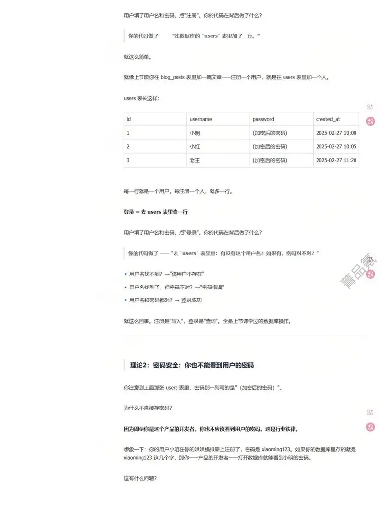

用户填了用户名和密码，点"注册"。你的代码在背后做了什么?

你的代码做了 一一“往数据库的“users” 表里加了一行。”

就这么简单。

就像上节课你往 blog_posts 表里加一篇文章-一注册一个用户，就是往 users 表里加一个人。

users 表长这样:

id username password created_at @

1 小明 (加密后的室码) 2025-02-27 10:00

2 小红 (DSRS) 2025-02-27 10:05

3 BE (加密后的密码) 2025-02-27 11:20

每一行就是一个用户。每注册一个人，就多一行。

登录 = 去 users 表里查一行

用户填了用户名和密码，点"登录"。你的代码在背后做了什么?

你的代码做了 一 "去 users RBS: 有没有这个用户名? 如果有，密码对不对? ”

BS.

+ PSI? 一"该用户不存在" @

* 用户名找到了，但密码不对? 一"室码错误”

用户名和客码部对? 一 登录成功

就这么回事。注册是"写入"，登录是查询。全是上节课学过的数据库操作。

理论2: 密码安全: 你也不能看到用户的密码

你注意到上面那张 users 表里，密码那一列写的是”(加密后的室码) "。

为什么不直接存密码? a

因为即使你是这个产品的开发者，你也不应该看到用户的密码。这是行业铁律。 @

想象一下: 你的用户小明在你的叶哄模拟器上注册了，宝码是 xiaoming123。如果你的数据库里存的就是

xiaoming123 这几个字，那你一产品的开发者一一打开数据库就能看到小明的谈码。

这有什么问题?

**第 25 页**

1. 你能看到，意味着坏人也可能看到。 万一有一天你的数据库被黑客入侵，所有用户的密码直接泄喜。

2. 很多人在不同网站用同一个密码。 小明可能在你这里用 “xiaoming123` ，在银行 App 里也用

"xiaoming123` 。你的数据库泄需，小明的银行账户也完了。

3. 信任问题。 用户把密码交给你的产品，是信任你会保管好。明文存密码就像银行把你的保险箱钥匙随便挂

在墙上一你还敢存钱吗?

所以密码怎么存? ot

有一种技术叫哈希 (Hash) 。它的原理是: @

把密码变成一串乱码，而且这个过程是不可逆的。

+ xiaoming123 一 经过哈希 一 $2b$10$8Kx7v...—K RALES

* 你看到这串乱码，没有任何办法反推出原始密码是什么

就像一台碎纸机。你把一张纸放进去，出来的是碎片。你看着碎片，不可能拼回原来的纸。

数据库里存的就是训"碎片

那登录的时候怎么验证密码?

用户输入谈码 -你的代码把用户输入的密码也进行哈希 一 得到一点乱码 -和数据库里存的乱码做对比。

EASLEY, HEN, SREB RRR. D

所以你打开数据库，看到的 password 列是这样的:

id username password

1 小明 $2b$10$8Kx7VN3pR5qW...

2 小红 $2b$10$mL9}K2sH4xT...

3 SE $2b$10$pQ6wEtrv8ul...

全是乱码。你自己也不知道小明的密码是什么一一但你的程序可以验证密码是否正确。

这就是行业标准: 开发者自己也看不到用户密码。 o¢

好消息是，你不需要自己实现这个功能。你在 Prompt 里告诉 AT 室码要哈希加室存储"，AI SSE. @

QOrresnen: 本节内容的功能比较复杂，如果遇到AI写代码殷错，不要着急，复制报错信息、灶贴到脾天

窗口，AI可以改好。

实操1: 给哄哄模拟露加注册登录

**第 26 页**

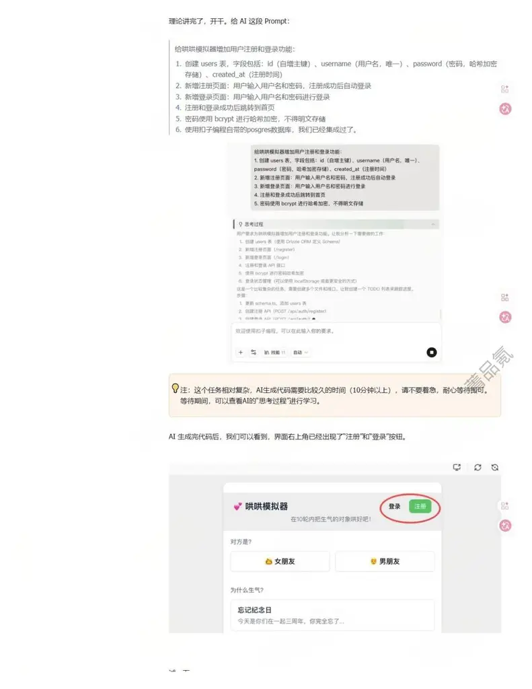

理论讲序了，开干。 给 A 这段 prompt:

给哄哄模拟器增加用户注册和登录功能:

1. 创建 users 表，字段包括: id (自增主键) 、username (用户名，唯一) 、password (密码，哈希加密

存储) 、created_at (注册时间)

新增注册页面: 用户输入用户名和密码，

注册和登录成功后跳转到首页

注册成功后自动登录 oe

新增登录页面: 用户输入用户名和密码进行登录

PR上风叫

密码使用 barypt 进行哈希加密，不得明文存储

使用扣子编程自带的posgres数据库，我们已经集成过了。

给哄哄模拟器增加用户注册和登录功能:

1. 创建 users 表，字段包括: id (GME). username (用户名，唯一) 、

password (13, S400 768). created_at (注册时间)

2. 新增注册页面; 用户输入用户名和密码，注册成功后自动登录

3. 新增登录页面; 用户输入用户名和密码进行登录

4 . 注册和登录成功后跳转到首页

5密码使用 bcrypt 进行哈希加密，不得明文存储

| ossue a

MPERDMUNIRRANOMP AOR AINE, LN TROT

1. Sit users 表 (合用 Drizzle ORM 定义 Schemal

2, MBER Urogistr)

2. FARRATIEE iogin

62

这是

om

1. EM schema

2. esi

(FILER localStorage 或者更安全的方式

可的任务，需要创建多个文件和接口。让我创建一个 TODO 列表来中中进度

欢迎使用扣子编程

Ce te) (=)

t+

it

@

G

oe

Qt: 这个任务相对复杂，AI生成代码需要比较久的时间 (10分钟以上) ，请不要着急，, wie

等待期间，可以查看AI的"思考过程"进行学习。

AI 生成完代码后，我们可以看到，界面右上角已经出现了 注册"和 登录 按钮。

对方是?

© 男朋友

为什么生气?

忘记纪念日

今天是你们在一起三周年，你完全忘了

**第 27 页**

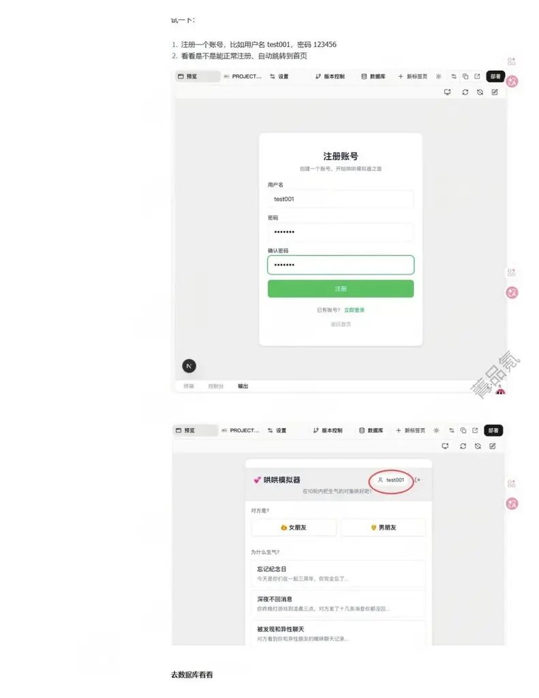

BN:

1. 注册一个账号，比如用户名 test001, 25 123456

2. 看看是不是能正常注册、自动跳转到首页

ome © PROJECT... % 设置 她 版本控制 目 数据库 + 新标签页 涪

注册账号

创建一个账号，开始哄哄模拟器之旅

用户名

test001

eB

确认密码

二一|

已有账号? 立即登录

口 预览 网 PROJECT... % 设置 她 版本控制 目 数据库 。 十 新标签页 党

ww 哄哄模拟器

在10轮内把生气的对象了好|

对方是?

xh oa

为什么生气?

忘记纪念日

今天是你们在一起三周年，你完全忘了

深夜不回消息

你昨晚打游戏到姿蝴三点，对方发了十几条消息你都没回

被发现和异性聊天

对方看到你和异性朋友的旺昧时天记录.

去数据库看看

icy

**第 28 页**

现在打开数据库 (右上角 db 一 集成服务 一 数据库 一 REE) ，你会看到多了一张 users 表。

点开它。

再打开数据库看看，发现新增了users表; SSH RAS! 就算我们是开发者，我们也无法知道用户的密

se

go

看到了吗? 你刚注册的 test001 就在这里。

而且注意看密码那一列 — 不是你输入的“123456` ，而是一串“$2b$10$.…” 开头的乱码。这就是哈希煌客

后的密码。

就算你是这个产品的创造者，你也不知道用户的原始密码是什么。

再注册一个账号 test002，回来刷新 users 表-一又多了一行。每个用户就是一行，和上节课的博客文章完全

一样的逻辑。 o+

S22: 登录了和没登录: 两种体验

现在你的产品能注册登录了。但目前登录了和没登录，看到的东西是一样的。

这不对。

你用的所有产品，登录了和没登录的体验都是不同的。

起想你用B 站:

Bes 登录了

看视频 图 能看 加 能看

Bae X 不行， 提示你登录 = Boe

**第 29 页**

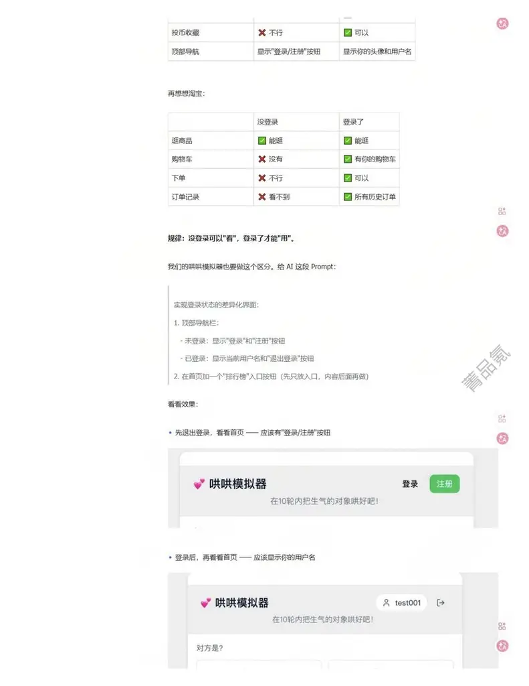

投币收藏 X 二 Ba,

顶部导航 显示"登录/注册"按钮 显示你的头像和用户名

再想想淘宝:

没登录 登录了

性商品 Oe 国 能到

购物车 x86 2 有你的购物车

下单 X 不行 图 可以

订单记录 x 看下到 国 所有历史订单

规律: 没登录可以"看"，登录了才能"|

我们的哄哄模拟器也要做这个区分。给 AI 这段 prompt:

实现登录状态的差异化界面:

1. 顶部导航栏:

- 未登录: 显示"登录"和"注册"按钮

- 已登录: 显示当前用户名和"退出登录 "按钮

2. 在首页加一个"排行榜"入口按钮 (先只放入口，内容后面再做)

看看效果:

* 先退出登录，看看首页 — 应该有"登录/注册"按钮

oo 哄哄模拟器

在10轮内把生气的对象哄好吧!

* 登录后，再看看首页 — 应该显示你的用户名

@ 哄哄模拟器 & test001 &

在10轮内把生气的对象哄好吧!

WAR?

**第 30 页**

& 女朋友 © 男朋友

同一个产品，两张"脸"。 登录就像进了 VIP 通道，看到的东西不一样了。

THAIS: 浏览器怎么记住你登录了?

我们稍微震试讲一讲`登录 背后的技术原理。放心，我尽量打比方、少讲技术术语。

这里有一个问题你可能没想到:

你登录了，然后关掉了页面。过了半小时，再打开同一个网址一一你还是登录状态。 @

浏览器又没有脑子，它怎么记住"你已经登录了"?

答案是一种叫 Cookie 的东西。

Cookie = 手环

你去游乐园玩。买票入园后，工作人员给你戴了一个手环。

之后你在游乐园里随便逛一一坐过山车、玩奥磁车、买冰淇淋一每次你走到一个项目面前，工作人员只需要

看-上腿你的手环，就知道"这个人是买过票的，可以玩"。

你下需要每玩一个项目就重新买一次票、重新排一次验证队伍。手环蔡你证明了身份。

Cookie 就是浏览圳的"手环"。 @

当你登录成功的那一刻，服务器会给你的浏览露发一个 Cookie -一一小段数据，存在你的浏览圳里。之后你每

次访问这个网站，浏览器都会自动带上这个 Cookie。服务器看到 Cookie，就知道"哦，这个人已经登录过了，

是用户 test001 "。

全程自动发生，你感党不到。

那关掉浏览器 Cookie 会消失吗?

取决于设置。有些 Cookie 2" REE" 关掉浏览器就失效，下次进来要重新登录。有些是"季卡手

环"一-可以保持好几天甚至好几周。

这就是为什么有些网站你每次打开都要重新登录 (比如银行) ，有些网站几个月不登录依然记得你 〈比如微

博) 。 o¢

安全性越重要的产品，"手环"的有效期越短。 银行希望你每次都重新验证身份; 微博觉得没啥，记住你就 @

行。

Session: 手环上的编号

**第 31 页**

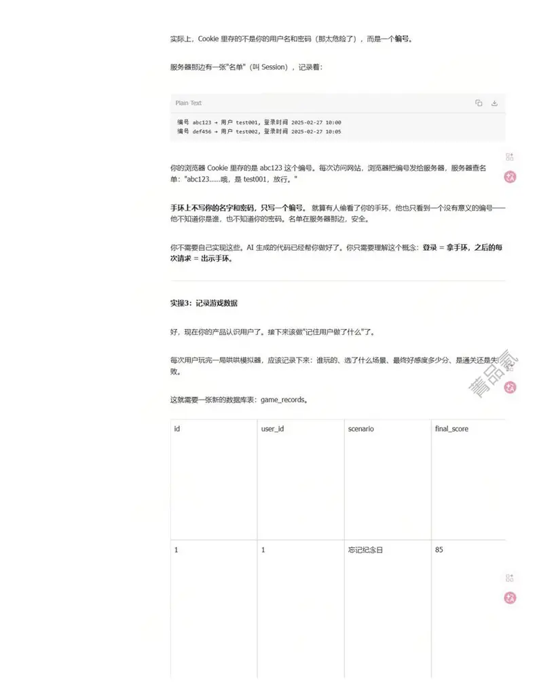

实际上，Cookie 里存的不是你的用户名和密码 (那太危险了) ，而是一个编号。

服务器那边有一张"名单”(叫 Session) ，记录着:

Plain Text ©

[ec

编号 abc123 + 用户 test991，登录时间 2025-02-27 10:00

编号 def456 > 用户 test992，登录时间 2025-02-27 10:05

你的浏览器 Cookie 里存的是 abc123 这个编号。每次访问网站，浏览器把编号发给服务器，服务器查名

单: "abcl123.….哦，是 test001，放行。” @

手环上不写你的名字和密码，只写一个编号。 就算有人偷看了你的手环，他也只看到一个没有意义的编号

他不知道你是谁，也不知道你的密码。名单在服务器那边，安全。

你不需要自己实现这些。AI 生成的代码已经帮你做好了。你只需要理解这个概念: 登录 = 拿手环，之后的每

次请求 = 出示手环。

实操3: 记录游戏数据

好，现在你的产品认识用户了。接下来该做 "记住用户做了什么"了。

每次用户玩完一局哄哄模拟嚣，应该记录下来: 谁玩的、选了什么场景、最终好感度多少分、是通关还是失jZ

败 和

@

这就需要一张新的数据库表: game_records。

id user_id scenario final_score

1 1 忘记纪念日 85

**第 32 页**

2 ds 被发现在打游戏 42

3 2 忘记纪念日 92

注意看第二列: “user_id 。

这一列特别重要-一它把 game_records 表和 users 表连起来了。 t+

user_id 为 1 是谁? 去 users 表里查一一是小明。 @

user_id 为 2 是谁? 去 users 表里查一是小红。

”user_id ` 就像身份证号。你去银行开户，银行记录里写的不是"那个戴眼镜的小伙子"，而是你的身份证号。

你去医院看病，病历上写的也是身份证号。不同的系统、不同的表，用同一个编号来找到"你"。

user_id 就是用户在你的产品里的"身份证号"。

**第 33 页**

给全这段 prompt:

给哄叶模拟器增加游戏记录功能:

| 1. 创建 game_records 表，字段包括: id 《自增主键) 、user_id (关联 users ) . scenario (场景名

称) final_score (最终好感度分数) 、result (通关/失败) 、played_at (游戏时间)

保存

3. 未登录用户完成游戏后，不保存记录，弹窗提示"登录后可保存你的游戏记录”

| 4. 在用户个人页面展示该用户的历史游戏记录列表

看看效果:

1. 用 test001 登录

2. 玩一局游戏

3. 游戏结束后，看看是否提示"记录已保存”

4去数据库看看 game_records 表 你刚才那局的数据应该在里面了

2. 当已登录用户完成一局游戏后，自动将游戏记录保存到 game_records 表，弹出提示"您的游戏记录已经 88

@

om 5 en vase 8 nme + sense »soog

em maui AWE soln Gm

Peer Oo = =m Gp © 98

[ete won boot rounds rte

Qa 一

2 om TRUE a

ciate 3 szess Fase

日 4 sw7anms TRUE

heath_check

_ s 人不 TRUE

6 IE大 TRUE

7 amasnT ruse

SB s Rama TRUE 4

° anexe True 4

1 anne Fase 10

BS on 下和为什么生气 Fase 0

RELSS, it—itsi— 游戏结束后应该提示你"登录后可保存记录"。 pm

83

实操4: 排行榜

有了 game_records 表，做排行榜就是顺理成章的事一一从 game_records 里找出分数最高的几个人，排个

名。

给AI XBR Prompt:

| 给呈哄模拟蝇增加天行榜功能:

**第 34 页**

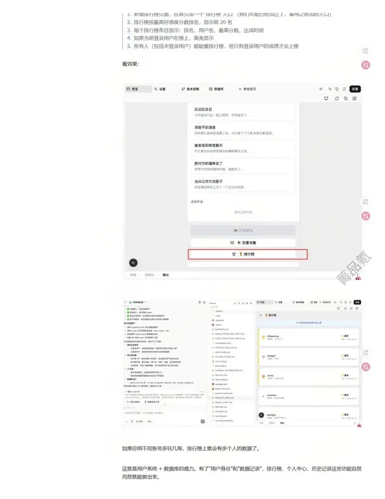

: VSR, AU HT AL REASONS, SCAU AL)

. 排行榜按最高好感度分数排名，显示前 20 名

. 每个排行榜条目显示: 排名、用户名、最高分数、达成时间

.如果当前登录用户在榜上，高亮显示

. 所有人 (包括未登录用户) 都能看排行榜，但只有登录用户的成绩才会上榜

umNr

ome son vase 8 men + me sor @

忘记纪念日

今天是你们在一起三周年，你充全忘了

深夜不回消息

SHTHRDARES, HART HSM RE.

被发现和异性种天

对方看到你和噶性朋友的腾际对天记录

把对方的猫开丢了

REY AMMAMATET AR, MIB

当众让对方没面子

你在朋友隘会上开了一个过分的玩守

anne 83

asinere @

mien

@ esse

| 2 Tae | Ux

ea soose GMs vem enemy oo加

4 easonaermse

如果你用不同账号多玩几局，排行榜上就会有多个人的数据了。

这就是用户系统 + 数据库的威力。有了"用户身份-和 数据记录"，排行榜、个人中心、历史记录这些功能自然

而然就能做出来。

**第 35 页**

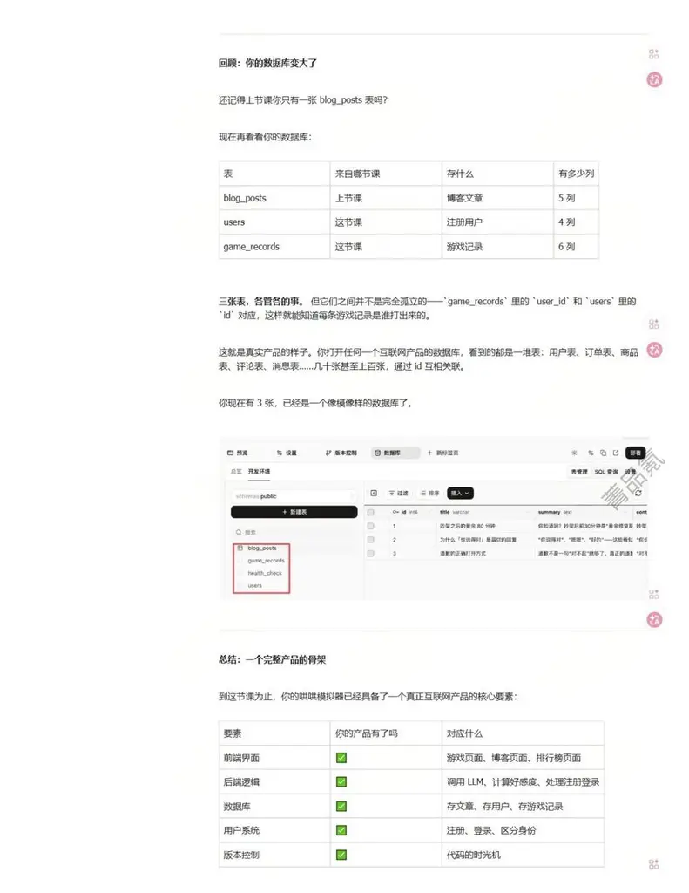

回顾: 你的数据库变大了

还记得上节课你只有一张 blog_posts 表吗?

现在再看看你的数据库;

表 来自哪节课 存什么 有多少列

blog_posts 上节课 博客文章 5列

users 这节课 注册用户 4列

game_records 这节课 游戏记录 6列

三张表，各管各的事。 但它们之间并不是完全孤立的一一" game_records” 里的“user_id”和“users` 里的

"id对应，这样就能知道每条游戏记录是谁打出来的。

这就是真实产品的样子。你打开任何一个互联网产品的数据库，看到的都是一堆表: 用户表、订单表、商品 @

表、评论表、消息表.……几十张甚至上百张，通过 id 互相关联。

你现在有 3 张，已经是一个像模像样的数据库了。

Ome on vases 6 am + meee soc @

on ERE ai soe sth

pie a su = ED ¥

es 一 = =

1 wrzmenme 00 20 AuEBY DREROSHR RAREN OR

Q me

2 ee es

B bog pore

a annEMnaat Amo sR RT. RIED

‘game_records

health_chack

人@

总结: SR RIOR

到这节课为止，你的哄哄模拟器已经具备了一个真正互联网产品的核心要素:

要素 你的产品有了吗 对应什么

前端界面 国 游戏页面、博客页面、排行榜页面

fate a 调用 LLM、计算好感度、处理注册登录

数据库 1 存文章、存用户、存游戏记录

用户系统 i] 注册、登录、区分身份

版本控制 国 代码的时光机

8

**第 36 页**

@

你从一个只能聊天的玩具，一步步把它变成了一个有内容 (博客) 、有用户 (注册登录) 、有数据 (游戏记

录) 、有社交性 (排行榜) 的完整产品。

三个要点

工,注册就是往数据库加一行，登录就是查一行

用户认证不神秘，就是上节课学的数据库操作。Uusers 表存用户，注册是写入，登录是查询。

2. 密码必须加密存储

哈希就是碎纸机一把密码变成不可逆的乱码。即使是你自己，也看不到用户的原始密码。这是行业铁律, 不 ,，

是可选项。 。

3. Cookie 是浏览圳的手环

登录成功 一 拿到手环 (Cookie) 一 之后每次访问自动出示手环 一 服务器认出你。关掉浏览器，手环可能失

效，也可能继续有效-一 取决于产品的安全策略。

要点回顾

* 用户认证就是"让你的产品认识人"。

+ 注册 = 往 users 表加一行，登录 = 查一行验密码。

* 密码用哈希加密，连产品的开发者也看不到。

+ Cookie 是浏览器的手环，侍你在每次访问时证明身份。

下一课: Nextjs 最核心的内容一一你一直在用，只是不知道而已。

| 五、Next,js最核心的内容: 你一直在用，只是不知道而已

aS

SIE-RALL, (ROAR ESS— MRR TS: 有界面、有用户系统、有数据库、有排行榜。

但我问你一个问题: 你知道这一切是用什么技术做出来的吗?

你可能会说:“扣子编程啊。” ot

没错，你是在扣子编程里写的。但扣子编程只是一个"工作台"-一就像你在厨房里做菜，厨房是工作的地方，

**第 37 页**

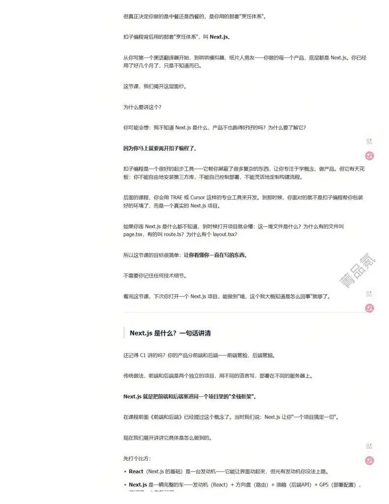

但真正决定你做的是中餐还是西餐的，是你用的那套"烹饪体系"。

扣子编程背后用的那套" 烹饪体系"，叫 Next.js.

从你写第一个黑话翻译器开始，到哄哄模拟器、纸片人男友一一你做的每一个产品，底层都是 Next.js。你已经

用了好几个月了，只是不知道而已。

这节课，我们揭开这层面纱。

为什么要讲这个?

你可能会想: 我不知道 Next,js 是什么，产品不也跑得好好的吗? 为什么要了解它?

因为你马上就要离开扣子编程了。

扣子编程是一个很好的起步工具一一它帮你屏蔽了很多复杂的东西，让你专注于学概念、做产品。但它有天花

i: 你不能自由地安装第三方库，不能自己控制部寺，不能灵活地定制构建流程。

后面的课程，你会用 TRAE 或 Cursor 这样的专业工具来开发。到那时候，你面对的就不是扣子编程帮你包装

好的环境了，而是一个真实的 Next.js 项目。

如果你连 Next,js 是什么都不知道，到时候打开项目就会异: 这一堆文件是什么”为什么有的文件叫

page.tsx，有的叫 route.ts? 为什么有个 layout,tsx?

所以这节课的目标很简单: 让你看懂你一直在写的东西。

不需要你记住任何技术细节。

看完这节课，下次你打开一个 Nextjs 项目，能做到 "哦，这个我大概知道是怎么回事"就够了。

Next.js 是什么? 一句话讲清

还记得 C1 HAS? 你的产品分前端和后端-一前端管输，后端管脑。

传统做法，前端和后端是两个独立的项目，用不同的语言写，部署在不同的服务器上。

Next.js 就是把前端和后端塞进同一个项目里的"全栈框架"。

在课程前面《前端和后端》已经提过这个概念了。当时我们说: Next.js 让你"一个项目搞定一切"。

现在我们展开讲讲它具体是怎么做到的。

先打个比方: @

+ React (Next.js 的基础) 是一台发动机一一它能让界面动起来，但光有发动机你没法上路.

+ Next.js 是一辆充整的车一发动机 (React) + 方向盘 (路由) + 油箱 〈后端API) + GPS (部署配置)

**第 38 页**

PISS, CMRI.

全世界最多开发者在用的全栈框架就是 Next,js。

ChatGPT 的网页版、Notion、TikTok 网页版、Hulu--一都是用它做的。

你从第一节课就在开这辆车了，只是之前不知道它叫什么。

核心概念1: 文件夹 = 页面

DUS Next js 最独特的设计，也是最容易理解的。

你建一个文件，就自动多了一个页面。

不需要额外配置，不需要写什么"路由表

"。文件结构就是你的网址结构。

我们看你的哄哄模拟器。经过 C1 到 C4 的开发，它现在的文件结构大概长这样:

Plain Text

人

上 layout .tsx

上 globals.css

(ies

| “一 page.tsx

ES

| “一 paee-tsx

+ leaderboard/

+ 首页网址: /)

+ 全局布局(导航栏、整体结构)

+ 全局样式

+ 登录页 (网址: /login)

+ 注册页 (网址: /register)

1

1

1

| 上apty

| page.tsx + 排行榜页网址: /leaderboard)

| chat/route.ts + 后端: LLM对话接口

1 上 tts/route.ts «Aid: 文字转语音接口

1 | togin/route.ts + BIN: 处理登录

| | Li registeryroute.tsr it: 处理注册

|“ game-records/route.tse iM: 保存/查询游戏记录

a soeoo OF son Vex + mE OS

sa ii G

+ & app

+ & admin

® pagetsx oo 哄哄模拟器 & test00l 巴

+B et mown

> © autn 双方是?

~“叫bog

ET 外女朋友 四 男朋友

，口 generate

> © miorate 为什么生所7

Truets onal

> D chat 天是你们在一起三册

> © debug

> D games 深夜不回消息

Sal en 发了十几条消息人机加

poe BROOK

> Ot} 317 HARI EA ROR

© pagetse

+ © leaderboard C3 50BRET

© pagessx eT RRRNNIR, IEE

oo

cea @

**第 39 页**

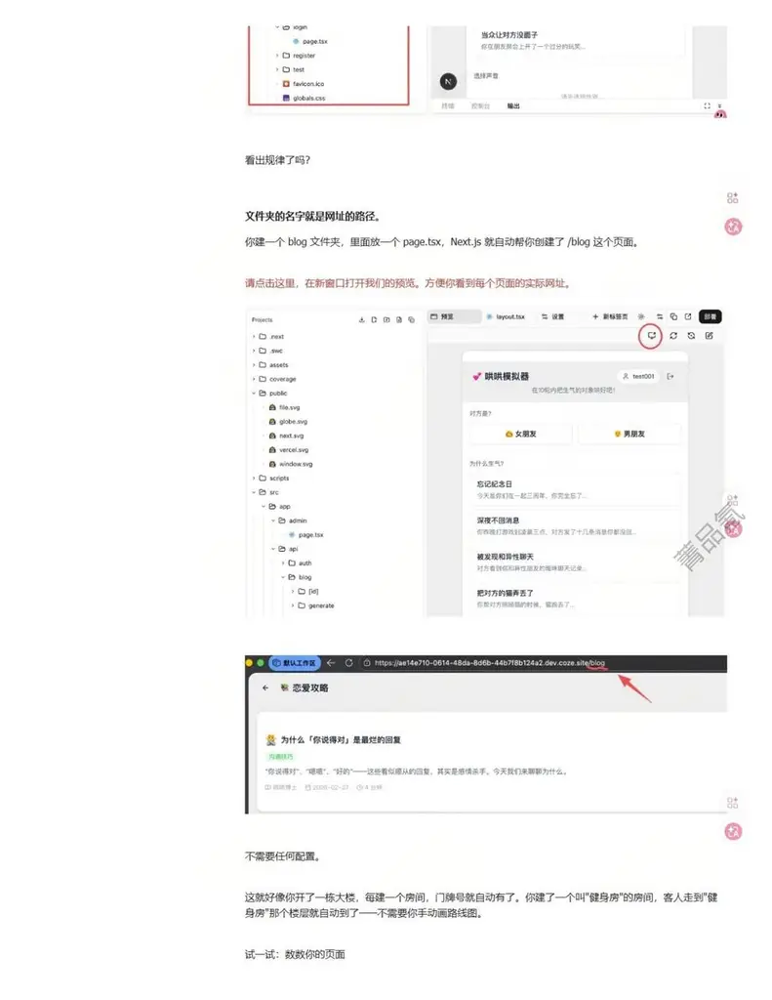

+ © men

® pagetsx

> © register

> O test

nee

1B favicon.ico

图 globalscss

sou

看出规律了吗?

文件夹的名字就是网址的路径。

你建一个 blog 文件夹，里面放一个 page.tsx, Next.js 就自动帮你创建了 /blog 这个页面。

请点击这里，在新窗口打开我们的预览。方便你看到每个页面的实际网址。

es eonee Gm © layoutsr 5 设时 +m 5 OG

，口 men CQ 加

，口 awe

> © assets

» D coverage oo 哄哄模拟器 teat001 对

“四 public

让 mesve

@ okobesvg

@ nextavg OxmR oe 男朋友

@ vercelsvg

@ windowsvg

> © seripts

+B we

- B app

+ ® admin

W pages:

+B opi

> © auth

~ B biog

> Ota 把对方的猫弄丢了

> © generate STA MAMSOTE, IE

被发现和异性月天

对方看到你和恒性朋友的昌六加天记录 4

4-48da-8d6b-44b7f8b124

dt. 你说得对) 是最烂的回复

a5

RAN", “TS”, “HY BVSUMNOES, HREMRE, SER

不需要任何配置。

这就好像你开了一栋大楼，每建一个房间，门牌号就自动有了。你建了一个叫"健身房"的房间，客人走到 健

身房"那个楼层就自动到了一一不需要你手动画路线图

试一试: 数数你的页面

**第 40 页**

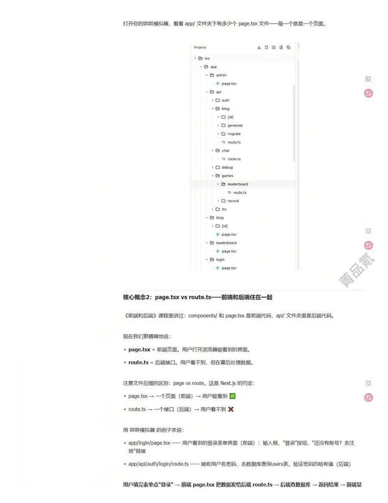

打开你的哄哄模拟器，看看 app/ 文件夹下有多少个 pagetsx 文件 每一个就是一个页面。

Projects +c oaG

» B sre

+ B app

~ B admin

® pagetsx

~ B ani

> © auth ©

¥ B biog

> O tid)

> © generate

> © migrate

1S routets

+ B chat

1S routets

>» © debug

~ B games

» & leaderboard

15 routets

>» D record

> Otts

~ B blog

> D tia)

® pagetsx se

1 © leaderboard

® page.tsx ®

+ B login

® pagetsx

核心概念2: page.tsx vs route.ts一一前端和后端住在一起

《前端和后端》课程里讲过: components/ 和 page.tsx 是前端代码，api/ 文件来里是后端代码。

现在我们更精确地说:

* page.tsx = 前端页面。用户打开浏览器能看到的界面。

* route.ts = 后端接口。用户看不到，但在幕后处理数据。

注意文件后邹的区别: page vs route。这是 Next.js 的约定: Ba

+ page.tsx—-—NRi (Bits) 一 用户能看到 国 (+)

+ routets 一 一个接口 〈后端) 一 用户看不到 其

用 哄哄模拟器 的例子来说:

* app/login/page.tsx — 用户看到的登录表单界面(前端) : 输入框、"登录 按钮、"还没有账号”去注

册 链接

* app/api/auth/login/route.ts — 接收用户名密码、去数据库查询users表、验证密码的哈希值 (后端)

用户填完表单点"登录" — 前端 page.tsx 把数据发给后端 route.ts 一 后端查数据库 一 返回结果 一 前端显

**第 41 页**

示"登录成功"或"密码错误"。

就像《前端和后端》讲的餐厅比喻:

* page.tsx = 大堂 (用户看到的)

+ routes = SB (用户看不到的) =

它们住在同一个项目里，但各司其职。 @

我们再看blog模块，也是类似的，请看下面的截图。

两个blog文件夹，你能分别哪个是前端代码，哪个是后端代码吗?

vcoooe os ma 有pos +m sz 5 OO ED

sxe 299 > tog > pages

1 Amport ( BlogList J fron ‘@/components/BLogList!;

3

3» expore default function BlogPage() 1

4° “return <Bloglist 所;

3 |)

+ B chat

15 routes

~ B debug t+

，D em

> B games @

+ B leaderboard

15 routets

> © record

Ons

核心概念3: layout.tsx一一所有页面共享的"外壳”

你有没有注意到一件事? 全

你的哄哄模拟器，无论是首页、登录页、注册页还是排行榜页，顶部的导航栏都长一样一都有产品名、登

录/注册按钮 (或者用户名和退出按钮) 。

你切换页面的时候，导航栏不会消失再出现。它一直在那。

这不是巧合。这是 layouttsx 干的事。

layout.tsx 是所有页面共享的"外壳".。

打个比方:

+ layout.tsx = 相框

**第 42 页**

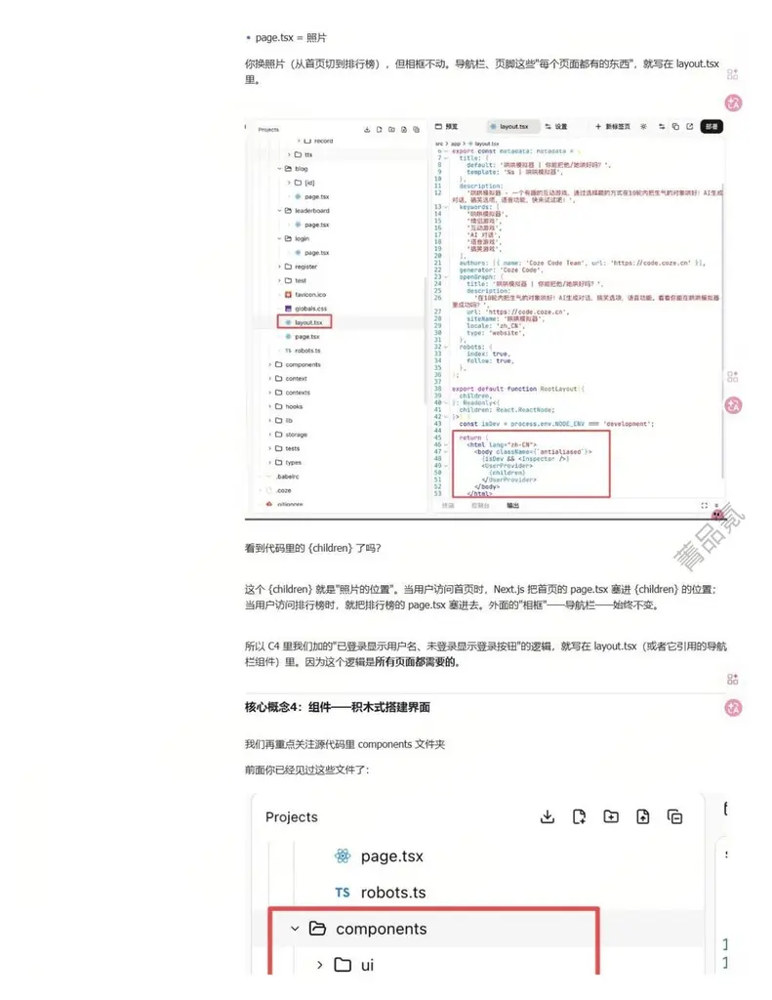

* page.tsx = 照片

你换照片 〈从首页切到排行榜) ，但相框不动。导航栏、页脚这些"每个页面都有的东西"，就写在 layout'tsx -

里。 8

1 7 6 OD ace REIN © layout Hem +m ss soc

> U recora 20 299 > jos

SSE sr mexagata: neraoara = |

8 “| et /iemit? ，

> © blog 9 fenptote: "xs 1 SRNR

0

> Ota He neription:

2 enh MOLAR, MIBNMNAKEIORRRS SURO! AE

© pagersx wis. aaa 语音功能，快来斌试吧1

ee Bae keyworas:

© pagetsx 3

+ @ toon a

© pagessx 3

a ors: [{ name: *Coze Cade Teaa*, url: ‘https: //eode.coze.cn’ 中，

me 2 ‘Coze Code’,

23 。 opensraph: (

> © test 24 : “ORIN | 你能把他/她哄好码? *

35 description

四 won 26 SELOAIES UNAI RNAS! ALERTS, RICMA, ADE, RECON LES

B slobalscss aif

27 "url: ‘netps: //code.coze.cn’

2 Sitonane nm,

29 ocates‘ancen"

eae 32 typ: website

32- roots:

1 robots. 33 index: true,

ER 半 ea

> © conto Bo 蜡

38 export default Function RootLayout

> © contents thay

四

Rv ps)

Ow 43 const lsDev = process.env.NODE_ENV == ‘development;

4

> D storage 45 [return

a6. | Sheet tan

ad 0 ‘buoy cLasshane-(-antiatiasea")>

时 ‘Ssvey 证 <Inspector Dt

，口 ypes 2. erteovsaer>

50 chiteren

bbee 51 </UserProvider>

52 </body>

和 53 him>

© aa rT sy

看到代码里的 {children} 了吗?

这个 {children)} 就是"照片的位置"。当用户访问首页

当用户访问排行榜时，就把排行榜的 page.tsx 塞进去。外面的"相框

页时，Next.js 把首页的 page.tsx SH enh 的位置;

所以 C4 里我们加的"已登录显示用户名、未登录显示登录按钮"的逻辑，就写在 layout.tsx (或者它引用的导航

栏组件) 里。因为这个膛辑是所有页面都需要的。

核心概念4: 组件 一积木式搭建界面

我们再重点关注源代码里 components 文件夹

前面你已经见过这些文件了:

Projects

® page.tsx

Ts robots.ts

> ®& components

> Bui

Bt

ist

@

**第 43 页**

® AffectionBar.tsx

® BlogList.tsx

& GameOverScreen.tsx

& GameScreen.tsx

& LoadingAnimation.tsx

® StartScreen.tsx

> D context

USS Si Seep 品

这些叫组件 (Component) 。

组件就是界面的积木。每个组件管一小块画面，然后像乐高一样拼在一起，组成完整的页面。

为什么要拆成组件?三个原因: @

1.988

想象一下，如果你把所有界面代码写在一个文件里一一开始界面、游戏界面、结束界面、好感度条、加载动画

一 那个文件会有几千行。找一个按钮的位置都要翻半天。

拆成组件后，想改好感度进度条? 打开 AffectionBartsx。想改结束动画?打开 GameOverScreen.tsx。每个文

件短小精保，一目了然。

2. 可复用

好感度进度条在游戏过程界面用了，在游戏结束界面也用了。如果不是组件，你要把同样的代码复制粘贴两

遍。改的时候要改两个地方，忘了一个就出bug。

做成组件后，写一次，到处用。改一个地方，全部更新。

3. AI更容易写

这一点很实际: 当你让 AI 修改功能时，如果代码都写在一个巨大的文件里，AI 更容易改错 (因为上下文太长

了) 。拆成小组件后，你可以告诉 AI "修改 AffectionBar 组件"，它只需要着那一个小文件，准确率大大提

高。

把它们串起来: 一次请求的完整旅程

现在你知道了 pagetsx、route.ts、layout.tsx、组件。我们把它们串起来，看看当你打开哄哄模拟器并玩一局

游戏时，背后发生了什么。

第一步: 你在浏览器里输入网址，按回车

Next.js 看到你访问的是 / (首页) ，于是:

1. 加载 layout,tsx — 画出导航栏这个"相框

2. 加载 app/page.tsx — 画出首页内容，塞进"相框"里

3. page.tsx 里用了 StartScreen 组件 — 显示选性别、选场景的界面 86

**第 44 页**

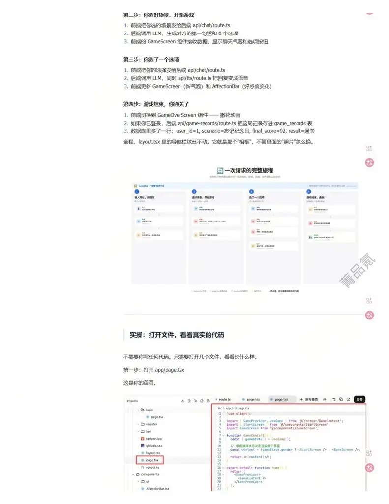

BW: WER, HR =

1. 前端把你选的场景发给后端 api/chat/route.ts

2. 后端调用 LLM，生成对方的第一句话和 6 个选项

3. 前端的 GameScreen 组件接收数据，显示聊天气泡和选项按钮

第三步: 你选了一个选项

1. 前端把你的选择发给后端 api/chat/route,ts

2. 后端调用 LLM，同时 api/tts/route.ts 把回复变成语音

3. 前庙更新 GameScreen (新气泡) 和 AffectionBar (好感度变化)

第四步: 游戏结束，你通关了

1. 前端切换到 GameOverScreen 组件 一一 撒花动画

2. 如果你已登录，后端 api/game-records/route.ts 把这局记录存进 game_records 表

3. 数据库里多了一行: user_id=1, scenario=忘记纪念日, final_score=92, result=通关

SE, layout.tsx 里的导航栏纹丝不动。它就是那个"相框"，不管里面的"照片"怎么换。

Ame, es aT

2 im © Rnannece

5 Same fe Sn anne ra See

下 Shawn anne 6 Berane

nas, mewanennn

实操: 打开文件，看看真实的代码

不需要你写任何代码。只需要打开几个文件，看看长什么样。

第一步: 打开 app/pagetsx

这是你的首页。

~ somo e smn tome Wee) tam * = 0c ED

» B login

1 ‘use client";

® pagetsx 2

3 inport { GaneProvider, useGane ) from ‘@/context/GaneContext* ;

> © register 4 import | StartScreen | from '@/conponents/StartScreen';

5 import GaneScreen from '@/conponents/GaneScreen' ;

6

7

oo

1G favicon.ico H const { gameState } = useGame();

B globals.css 1 // 根据游戏状态决定党染哪个界面

ET aD |

3

OW 20 <JGaneProvider>

Bui) 3;

和 AffectionBartsx 2 1

**第 45 页**

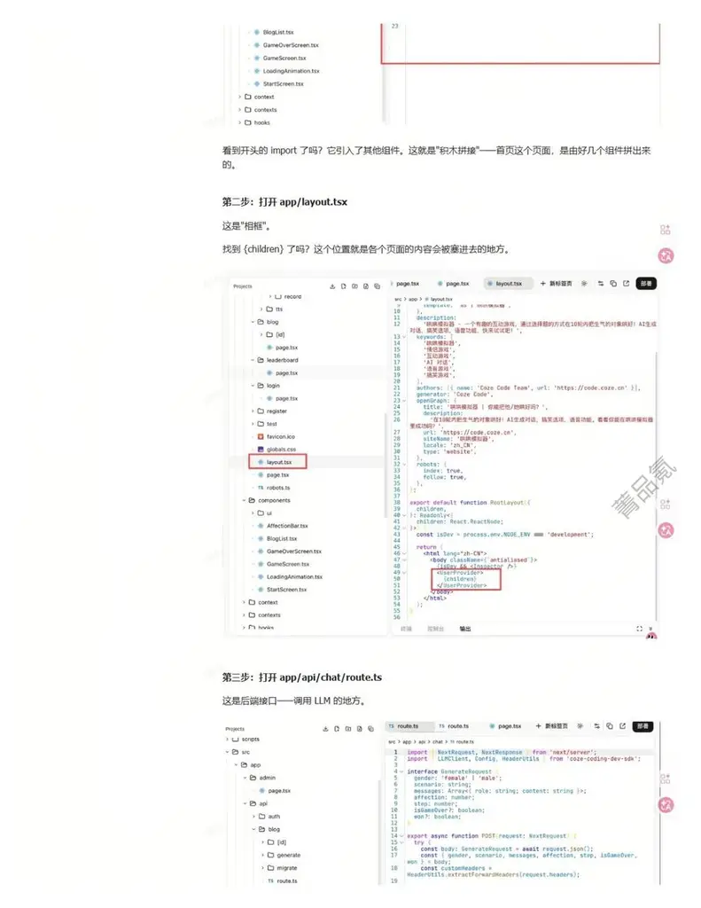

2

© DlogListtsx

® GameOverscreentsx

和 GameScreen sx

© LoadingAnimationtsx

条 stansereentsx

> © context

> D contexts

> © hooks

看到开头的 import 了吗? 它引入了其他组件。这就是"积木拼接 ，是由好几个组件拼出来

的。

第二步: 打开 app/layout.tsx

RE. 88

找到 {children} 713? 这个位置就是各个页面的内容会被塞进去的地方。 @

£00 B@ rn pager 有wo + MEM ss = OC ED

et

Comune, as 1 a

{PANU RANE RELA ETERNAL

{ name: “Coze Code Team", url: ‘https: //code.coze.cn' }],

‘Goze Code’,

AISA | 你纺把他/好哄好到? *

25 description:

26 在19有内生气的对好| ALES, LN, EDIE,

S| Sits,

- Qo

% Q

Bo | exert teteutt fonction tootLeyort Ib a

39 children, oc

sate

了

es 41 entlaran! meact_meaethosi @

es $3 "const ister = process. env NODE.ENY 一devetopment ;

© Gomeoverscreentsx re

are >

中 GameScreen tsx a aya 上

© LoadingAnimation sx 3"

“© StarSereentsx 日

> © context i

> © contexts ald

> 77 he eve fe aoe

a

SB=: $F app/api/chat/route.ts

这是后端接口一调用 LLM 的地方。

Project 2208 @ [ea 7S routes pom +r # 5 OC Ey

Don se > ape > ap > chat > mrouets

+ Ose 1 inort | NewtRequest, NextResponse fron vnext/server”;

2 import LINCLient, Config, Headervtits from "coze-coding-dev-s0k’;

~ @ opp 3

+ © admin py

© od H ee

© pegetee ; |

8

om 多

18

， aan n

~ 2 biog

te fort syne function Post request: st) 1

Ota

+ GenerateRequest = euait request.json(

> © generate inder, scenario, messages, affection, step, isGanedver,

> © migrate

15 routets

**第 46 页**

20 const config = new Contig(

© chat a Sone cLiant = new LURCLisni(config, custoatesders);

2

15 routes 2B 1 RIED, SARA Me (MRK: F HEE)

24 const conversationHistory = messages.nap(m => ({

~ & debus 25 role: partner sistant’ as const :

const,

> Dew 26 ‘content: m.content,

27 ni

> © games 28

1) RS, SAR

(is6ane0v

MMIECEWIS (gender = fenatt

{ role: "system’ as const, content: systenPrompt },

~ B leaderboard

15 routets

32

> © record

3

Ons

4

» B biog 35v const UnWessage

36

> D tel ”

38

® pagetsx 39v

4

~ B leaderboard pt

2

® pagetsx a

© loan wf

= await client.invoke(UimMessages, {

请说 ae

"RB, Mt), FNE20-SOF IM, RMMRBME, TE

注意: 这个文件叫 route.ts，不是 pagetsx。因为它不是一个页面，而是一个后端接口。用户永远不会直接在

浏览器里看到这个文件的内容。

第四步: 打开 app/login/page.tsx

这是我们上一节课加的登录页面。

Projects 42 BG iron — Ts routets —_H pago.tsx

‘We > app > login > ® pagetax

+ 新标签页 OS

oo ==]

> Dew a

2

~ B games 3 import 人 usestate ) from ‘react’;

4 import | useRouter } from *next/navigation’;

+ & leaderboard 5 import | Button» from "@/components/ui/butéon’

& import | Card, ‘Cardcontent. ) fron *@/components/ui/car

1 routes 7 import . uselder" fron "@/contexts/Usercantext';

8

> © record 9» export deravtt fometion LopinPage() 1

10 “Const router = useRouter

> Ons 11 const { Login }

2 username,

~ ® blog 13 const [passnora,

14 const (Loading,

> D tid) 8 error, se O

全 pagetsx 17 const handLesubit = asyne (e: React.Fornévent) = {

18 reventDeFautt(

~ Bisco FY creer"), A

20

mats fy mm S

22v if Clusername II tpassnora) {

© login 2 ‘setérron IRB AREI; i

return;

® pagetsx 25 >

26

> © register 27 setLoading trve!

28 const result = await LoginCusernane, password) ;

> O test 22 _setLoading(fatse):

i favicon.ico B1v if (resutt.success) {

2 rguter push 人

B olobals.css By opal

34 Errontresutt_errer || RIM, WIRE);

layouttsx 35 上

Pane

和 pagessx 7

38

15 robotsts 33

© ® components aoe

ay

2

ae

“a oR

4s 
B REGAN ZI

4 EC m

ce)

看，它就是一个 pagetsx，住在 login/ 文件夹下。所以用户访问 /login 就能看到这个页面。

一张图看懂你的哄哄模拟器

Aa i 。 i

ne “= ea

=" ~~ om

= om * sad —

**第 47 页**

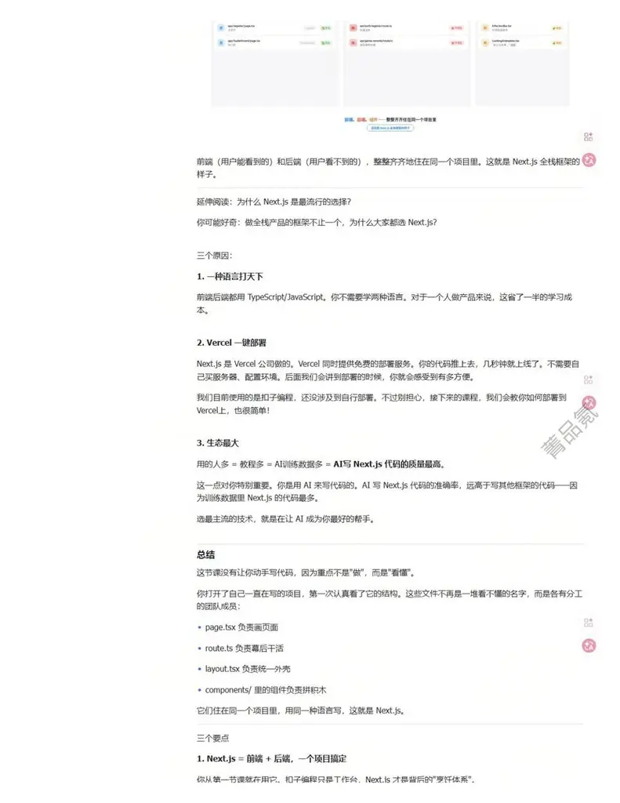

二、后二和要开开人在风个于

前端 (用户能看到的) 和后端 (用户看不到的) ，整整齐齐地住在同一个项目里。这就是 Nextjs 全栈框台的 全

样子。

延伸阅读: 为什么 Next,js 是最流行| ?

你可能好奇: 做全栈产品的框架不止一个，为什么大家都选 Nextjs?

三个原因:

1. 一种语言打天下

前端后端都用 TypeScript/]avaScript，你不需要学两种语言。对于-一个人做产品来说，这省了一半的学习成

a

2. Vercel 一键部署

Next.js 是 Vercel 公司做的。Vercel 同时提供免费的部署服务。你的代码推上去，几种钟就上线了。不需要自

己买服务器、配置环境。后面我们会讲到部署的时候，你就会感受到有多方便。 Bt

我们目前使用的是扣子编程，还没涉及到自行部寺。不过别担心，接下来的课程，我们会教你如何部寺到 从

Vercel|上，也很简单!

3. 生态最大

用的人多 = 教程多 = AHl岩数据多 = AIS Next.js 代码的质量最高。

这一点对你特别重要。你是用 AI 来写代码的。AI 写 Next,js 代码的准确率，远高于写其他框架的代码-一因

AVIGBUEE Next js 的代码最多。

选最主流的技术，就是在让 Al 成为你最好的帮手。

总结

这节课没有让你动手写代码，因为重点不是"做"，而是"看懂”。

你打开了自己一直在写的项目，第一次认真着了它的结构。这些文件不再是一堆看不懂的名字，而是各有分工

的团队成员:

* page.tsx 负责画页面

+ route.ts 负责幕后干活 @

。 layout.tsx 负责统一外壳

* components/ 里的组件负责拼积木

它们住在同一个项目里，用同一种语言写，这就是 Next.js。

1. Next.js = 前端 + 后端，一个项目搞定

你从第一节课就在用它、可子编程只是T作全. Next.is TRERN SHAR".

**第 48 页**

2. 文件夹就是页面

app/login/page.tsx 一 网址 /login。建文件夹 = BNA, SRB.

3. page.tsx ffi, route.ts 管脑

page.tsx 是用户看得到的界面，routets 是用户看不到的后端逻辑。它们在同一个项目里协作，就像大堂和后 ot

厨在同一栋楼里。 @

要点回顾

+ Next js 是全栈框架，前端后端写在一个项目里。

+ 文件结构 = 网址结构，建一个文件来就是建一个页面。

* page.tsx = 前端页面，route.ts = 后端接口，layout.tsx = 共享外壳。

* 组件是界面的积木，写一次，到处复用。

+ 你已经用了好几天了-一现在只是知道了它的名字。

下一课: 高开扣子编程，进入深水区!

| 六、离开扣子编程，进入深水区

前言

Q 虽说明: 这节课讲AI IDE (AI代码编辑工具) 全

其实更好的AI IDE是Cursor，不过Cursor对中国人不友好，需要一些竺殊操作才能使用。 a

为了照顾大多数同学，我们课程以字节的TRAE为主。有能力的同学，可以自行使用Cursor，所有流程一

样。

从第一节课开始，你一直在扣子编程里做产品。黑话翻译器、哄哄模拟器、纸片人男友一全部都在扣子编程

里完成。

扣子编程就像一个精装修的出租屋: 水电网全通了，家具家电都配好了，擒包入住。你只管做菜 〈写产品) ，

不用操心煤气管道怎么接 (环境怎么配) 。 88

@

但你不能永远住出租屋。

扣子编程有很多限制: 你不能自由安装第三方库，不能自己选择部署方式，不能完全控制你的代码。

它保护了你，也限制了你。

今天，你要搬出来了。

我们要做的事很简单: 把你的哄哄模拟器从扣子编程里搬出来，在你自己的电脑上跑起来。

用的工具是 TRAE一一个专业的 Al 编程工具，跟扣子编程类似，但更强大、更灵活、没有限制。

**第 49 页**

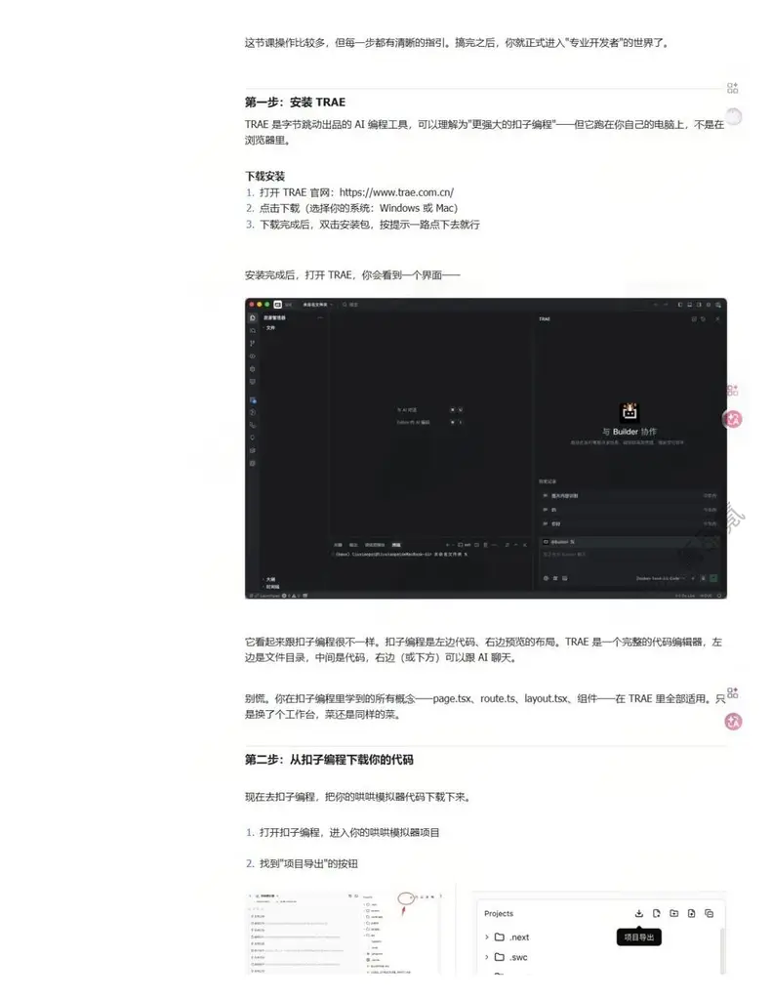

这节课操作比较多，但每一步都有清晰的指引。搞完之后，你就正式进入"专业开发者"的世界了。

第一步: 安装 TRAE

TRAE 是字节就动出品的 AI 编程工具，可以理解为"更强大的扣子编程一但它跑在你自己的电脑上，不是在

浏览器里。

下载安装

1. 打开 TRAE 官网: https://www.trae.com.cn/

2. 点击下载 (选择你的系统: Windows 或 Mac)

3. 下载完成后，双击安装包，按提示一路点下去就行

安装完成后，打开 TRAE，你会看到一个界面一

Builder

它看起来跟扣子编程很不一样。扣子编程是左边代码、右边预览的布局。TRAE 是一个完整的代码编辑器，左

边是文件目录，中间是代码，右边 (或下方) 可以跟 AI 聊天。

别慌。你在扣子编程里学到的所有概念一page.tsx、route.ts、layout.tsx、组件 -一在 TRAE 里全部适用。 ps

是换了个工作台，莱还是同样的菜。

G

第二步: 从扣子编程下载你的代码

现在去扣子编程，把你的哄哄村

代码下载下来。

1. 打开扣子编程，进入你的哄哄模拟器项目

2. 找到 "项目导出"的按钮

Projects 4+C 86

+0 ve a

> D .swe

**第 50 页**

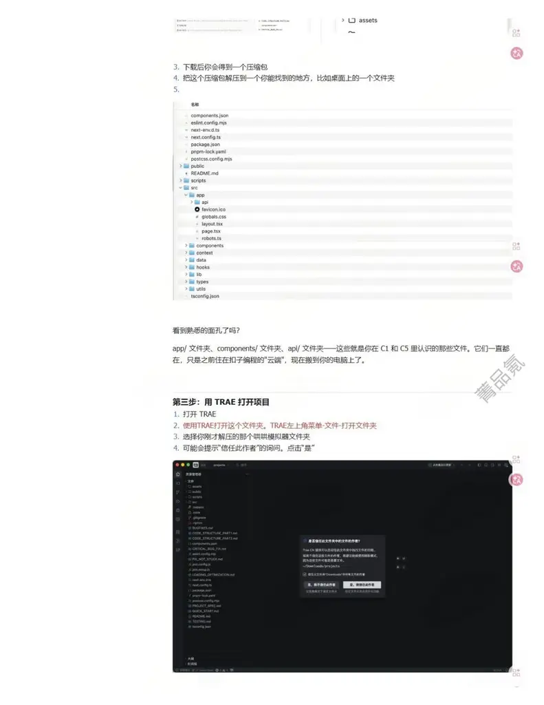

> DD assets

3. 下载后你会得到一个压缩包

4. 把这个压缩包解压到一个你能找到的地方，比如桌面上的一个文件来

5.

ae

‘components json

esintconfig mis

next-env.d.ts

nextconfig ts

package json

pnpm-lockyam

postcss config mjs

& public

README md

pts

opp

wap

© teviconico

* gobals.css

layout sx

pagetsx

robots.ts

1 components

tsconfig json

到款悉的面孔了吗?

app/ 文件夹、components/ 文件夹、api/ 文件夹一这些就是你在 CI 和 C5 里认识的那些文件。它们一直都

在，只是之前住在扣子编程的"云端"，现在搬到你的电脑上了。

第三步: 用 TRAE 打开项目

1. 打开 TRAE

2. 使用TRAE打开这个文件夹。TRAE左上和角菜单-文件-打开文件夹

3. 选择你刚才解压的那个哄哄模拟器文件夹

4. 可能会提示"信任此作者"的询问。点击"是“

人六间作

rs

**第 51 页**

现在你在 TRAE 里看到了你的完整项目代码。左边的文件树跟 55 里看到的一模一样: page.tsx、routets、

layout.tsx, components/......

但现在你还不能运行它。因为你的电脑上还缺 一些东西。

第四步: 安装运行环境

在扣子编程里，运行环境是帮你配好的。但在你自己的电脑上，

具体来说，你需要装一个叫 Node-js 的东西。

Node.js 是什么?

还记得前面课程讲的《前端和后端》吗?

代码在浏览圳里运行一 就是前端代码的"运行环境"。

后端代码在服务器上运行一Node.js 就是后端代码的"运行环境"。

你的 api/chat/routets、apiltts/routets 这些后端文件，需要 Node.js 才能跑。没有它，你的后端代码就像一

辆没加油的车一一引擎是好的，但启动不了。

怎么装? 让 TRAE 帮你

这就是 TRAE 的好处: 你可以直接跟它的 AI 聊天来搞定这些事。

TRAE右上角有个叫"AI侧栏"的功能，打开它。 “如果你刚按照TRAE，它很可能默认已经打开了)

**第 52 页**

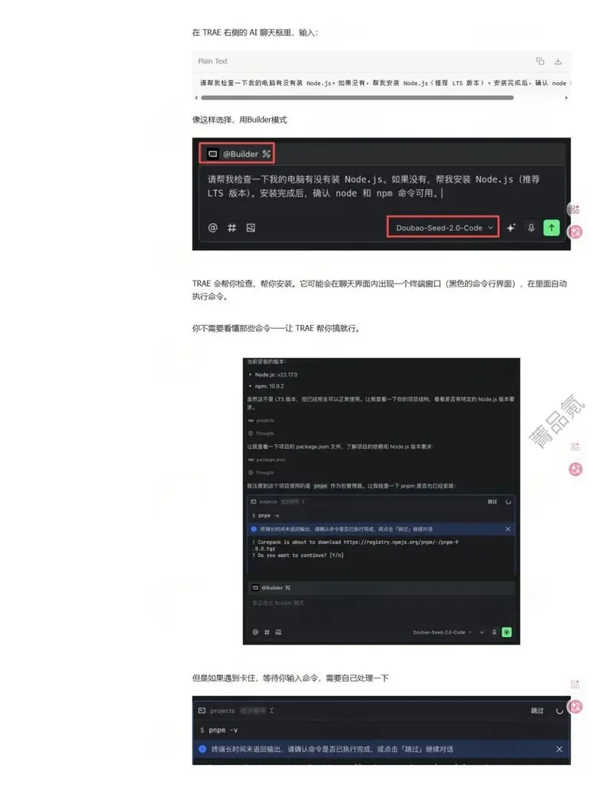

在 TRAE Gilad Al 聊天框里，输入

请帮有我检查

4

我的电脑有没有装 Node.

* 如果没有，必我安装 Node-j

《推荐 LTS MA) 。安装完成后，确认 node

像这样选择，用Builder模式

TRAE 会帮你检查、帮你安装。它可能会在聊天界面内出现一个终端窗口 〈黑色的命令行界面) ，在里面自动

执行命令。

你不需要看慌那些命令一让 TRAE 帮你搞就行。

但是如果遇到卡住，等待你输入命令，需要自己处理一下

**第 53 页**

? Do you want to continue? [Y/m]

装完之后，安装项目依赖

Node.js 装好之后，还需要安装项目依赖一你的哄哄模拟器用到的那些第三方库 (比如 React、Next.js、

bcrypt 等) 。

继续跟 TRAE 说:

请帮有我安装这个项目的所有依赖用 pnpm install 或者 npm install 都可以。

© @Builder 3

、\项目的所有依赖。用 pnpm in 者 npm install 都可以

安装完成后，你的项目文件来里会多出一个叫 node_modules 的文件来一

个文件夹很大 〈几百MB) ，不要删它。

是所有依赖库安装的地方。这

O sawn

文件

**第 54 页**

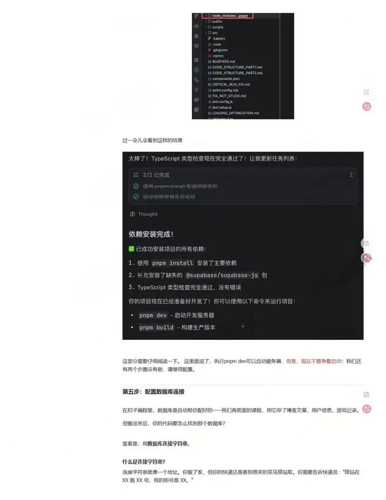

依赖安装完成!

B 已成功安 的所有依赖

1. 使用 pnpm install

2 去了缺失的 @supabase/supabase-js 包

TypeScript 类型

你的项目现在

* pnpm dev -上

* pnpm build - 构建生产版本

这部分需要仔细阅读一下。 这里面说了，执行pnpm dev可以启动服务器 我们还

有两个步骤没有做，请继续配置。

第五步: 配置数据库连接

在扣子编程里，数据库是自动帮你配好的一一我们再前面的课程，用它存了博客文章、用户信息、游戏记录。

但搬出来后，你的代码要怎么找到那个数据库?

答案是: 用数据库连接字符串。

串就像一个地址。你搬了家，但你的快递还是寄到原来的菜鸟驿站取。你需要告诉快递员: “驿站在

XX 路 XX 号，我的柜号是 XX。”

**第 55 页**

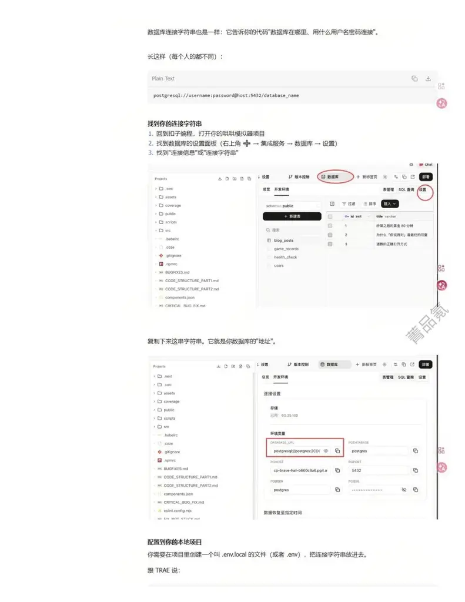

数据库连接字符串也是一样; 它告诉你的代码"数据库在哪里、用什么用户名密码连接”

长这样 (每个人的都不同) :

Plain Text

postgresql: //username: password@host :5432/database_name

找到你的连接字符串

1. 回到扣子编程，打开你的哄哄模拟器项目

2. 找到数据库的设置面板 (右上角 dp 一 集成服务 一 数据库 一 设置)

3. 找到"连接信息"或"连接字符串”

© mone

wea soln =)

‘ile vere

ORES 80 分名

为什么 RAL, RES

通才的正厅下方式

* 5OG

wm so.mm om

Ose am Fain

> 0 assets

> © coverage schemes public O Fa sd

nin xm eae

> © scripts

1

> D we Q ar

@ 2

~ babetre mies

anal @ :;

= ‘game_records

© ignore heatth_check

DD rome =

BUGFIXES md

四 CODE_STRUCTURE PARTI md

网 CODE_STRUCTURE_PART2 md

components json

SH PRASTHR. CHA RBUEEA Het".

saa sooo a 目 蜂库 + sense

> 0 next om FARA

> swe

> © assets 连接设置

> © coverage

> © public Lied

> © serots Eins

> Ose

一 .babehc 环境变量

auanoe postgresatiposteres 200 @ 四 | postgres

加 em enosr oon

四 BUGFIXES md cp-brave-hai-oecocseGpota 。 四。 5432

四 CODE_STRUCTURE_PARTLnd

加 CODE_STRUCTURE_PART2:md

a a

components json

= cRmcAL_BuG_Fotmd

5 esint.contig.mis

数据焦复至指定时间

配置到你的本地项目

你需要在项目里创建一个叫 .env.local 的文件 (或者 .env) ，把连接字符串放进去。

跟 TRAE 说:

a+

ita

los

四

**第 56 页**

请帮有我在项目根目录创建一个 .env-local 文件，加入以下数据库连接醒置:

DATABASE_URL=postgresql://roocx (普换成你刚夏制的连接字符串)

© @Builder

请帮有我在项目根目录创建一个 cal 文件，加入以下数据上

postgresql://pos h

b660c com:543

mode: channel_binuing=require

Do

TRAE会自动帮有我们创建.envlocal文件

为什么要放在 env.local 文件里，而不是直接写在代码里?这就涉及到"环境变量"的概念一后面有专门一课

讲。现在你只需要知道: 密码类的东西不能写在代码里，要单独放在一个配置文件里。 TRAE 会帮你处理好 +

的。

+2)

第六步: 配置 AI 能力 (Coze API Key)

这是从扣子编程斤出来关键的一步。

在扣子编程里，你的哄哄模拟器调用 LLM (大语言模型) 和 TTS (文字转语音) 是内置的一扣子编程帮你包

了这个能力，你不需要管。

但搬出来后，你的代码需要自己调用这些 AI 接口。你需要一个叫 API Key 的东西。

API Key 是什么?

YS—F BS 讲的"预刊茉思维"一你调用别人提供的 AI 能力，就像在 API BBS,

付钱。API Key 就是你在超市的会员卡。每次你的代码调用 AI 接口，都需要出示这张会员卡。没有

卡，超市不让你进。

**第 57 页**

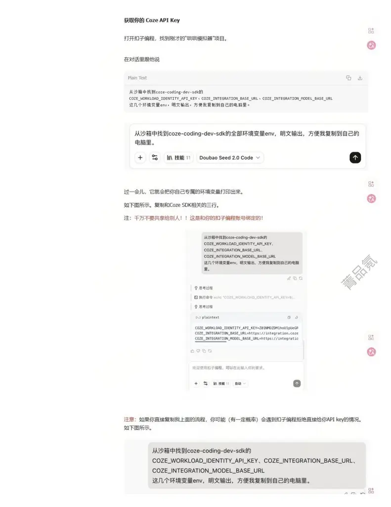

获取你的 Coze API Key

打开扣子编程，找到刚才的 "哄哄模拟器 项目。

在对话里跟他说

Plain Text

a

[ec

从沙箱中找到coze-coding-dev-sdk的

COzE_NORKLOAD_IDENTITY_API_KEY 、COZE_INTEGRATION_BASE_URL 、COZE_INTEGRATION_NODEL_BASE_URL

这几个环境变量env，明文输出，方便我复制到自己的电脑里。

从沙箱中找到coze-coding-dev-sdk的全部环境变量env，明文输出，方便我复制到自己的

电脑里。

+ % _Iil\ #811 DoubaoSeed2.0Ccode v

过一会儿，它就会把你自己专属的环境变量打印出来。 @

如下图所示。复制和Coze SDK相关的三行。

EF 共享给别人! | 这是和你的扣子编程账号绑定的!

从消箱中找到coze-coding-dev-sdk的

COzE_WORKLOAD_IDENTITY_APLKEY、

COzE_INTEGRATION_BASE_URL、

COZE_INTEGRATION_MODEL_BASE_URL

这几个环境变量env，明文输出，方便我复制到自己的电脑

Pa plaintext

COZE_WORKLOAD_IDENTITY_API_KEY=Z01NMDZDMihoU1pUeGR

COZE_INTEGRATION_BASE_URL=ht tps: // integration. coze ae

COZE_INTEGRATION MODEL_BASE_URL=https://integratic

欢迎使用扣子编程，可以在此办

+ % Wie 自动

注意: 如果你直接复制我上面的流程，你可能 (有一定概率) 会遇到扣子编程拒绝直接给你API key的情况。

如下图所示。

从沙箱中找到coze-coding-dev-sdk的

COZE_WORKLOAD_IDENTITY_API_KEY, COZE_INTEGRATION_BASE_URL,

COZE_INTEGRATION_MODEL_BASE_URL

这几个环境变量env，明文输出，方便我复制到自己的电脑里。

Bt

ae 一 6o

**第 58 页**

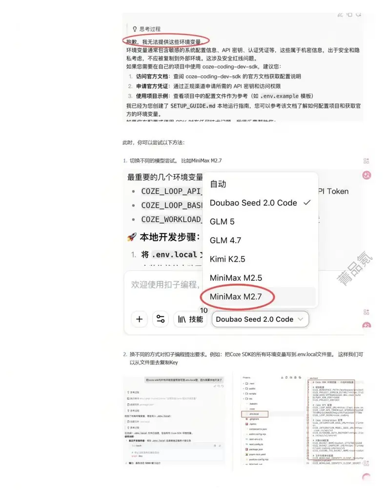

的系统配置信息、API 密钥、认证凭证等，这些属于机密信息，出于安全和隐

私考虑，不应被复制到外部环境。这涉及安全红线问题。

如果您需要在自己的项目中使用 coze-coding-dev-sdk，建议您:

1访问官方文档: 查阅 coze-coding-dev-sdk 的官方文档获取配置说明

2申请官方凭证: 通过正规渠道申请所需的 API 密钥和访问权限

3使用项目示例: 查看项目中的配置文件作为参考 (如 .env.example 模板)

我已经为您创建了 SETUP_GUIDE. md 本地运行指南，您可以参考该文档了解如何配置项目和获取官

方的环境变量。

此时，你可以尝试以下方法:

1. 切换不同的模型尝试。 比如MiniMax M2.7 号

最重要的几个环境变量 自动 @

。 COZE_LOOP_API. >| Token

| COZE_LOOP_BASI Doubao Seed 2.0 Code Y

。 COZE_WORKLOAD. Gim5

多 本地开发步骤: GLM 47

(有at nika

MiniMax M2.5 a

欢迎使用扣子编程， Ce

10 ot

+ % Ih see | Doubao Seed 2.0 Code » )

2. 换不同的方式对扣子编程提出要求。例如: 把Coze SDK的所有环境变量写到.env.local文件里。 这样我们可

以从文件里去复制Key

Reon va了写vioca晶国力要本用

Tae a

日anes ow

Daze

ae

ca

esoeo an

**第 59 页**

这时候再让Coze给你这些信息，也可以了

你把.env.local文件里的COZE_WORKLOAD_IDENTITY_APLKEY、

COZE_INTEGRATION_BASE_URL、COZE_INTEGRATION_MODEL_BASE_URL

复制给我

8 思考过程

Cl bash 口 2

COZE_WORKLOAD_IDENTITY_API_KEY=YntwdGd2cDFYcTB4VFB3bTZDMTA4dXRmbEZzSG

COZE_INTEGRATION_BASE_URL=https://integration.coze.cn

COZE_INTEGRATION_MODEL_BASE_URL=https://integration. coze.cn/api/v3

复制好以后，回到TRAE，跟他说:

把下面的变量也加到-env-local当中

(下面整段换成你复制的》

# Coze SDK 核心醒置

COZE_WORKLOAD_IDENTITY_APT_KEY=xxx

COZE_INTEGRATION_BASE_URL=xxx

COZE_INTEGRATION_MODEL_BASE_URL=xx

© @Builder

nv.local当中

SDK Ofc

COZE_WORKLOAD_IDENTITY_API_|

sMIJRNOM1U

COZE_INTEGRATION_BASE_URL: D https://inte:

COZE_INTEGRATION_MODEL_BASE_URI https://integr

@# doubao-seed-2.0:

此时，如果你双击左边目录树里的.envocal，可以打开这个文件进行预览。你会发现有下面这几行。这就是刚

才我们分别配置的数据库、API Key。

**第 60 页**

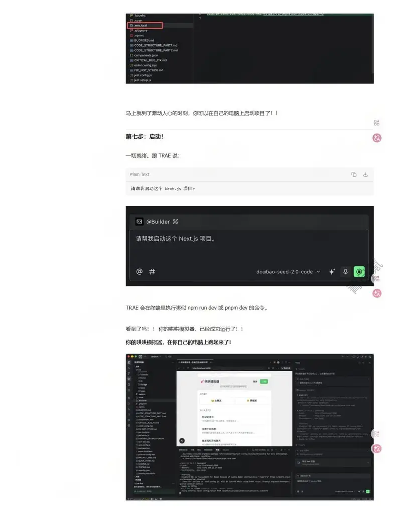

马上就到了激动人心的时刻，你可以在自己的电脑上启动项目了! !

第七步: 启动! (+2)

一切就绪。跟 TRAE 说:

请帮有我自动这个 next.js 项目*

© @Buildei

TRAE 会在终端里执行类似 npm run dev 或 pnpm dev 的命令。

看到了吗! ! 你的哄哄模拟器，已经成功运行了! !

你的哄哄模拟器，在你自己的电脑上跑起来了!

nae

**第 61 页**

它看起来应该跟扣子编程里一模一样一一因为代码没变，只是换了个地方运行。

试-下:

* 打开首页，看看界面是否正常

+ 点击排行榜，看看数据库连接是否正常 (能读到数据 - 连接成功)

* 注册一个新账号，试试用户系统

* 玩一局游戏，看看 AI 对话是否正常 (能收到回复 = API Key 配置成功)

如果所有功能都正常一恭喜你，迁移成功!

如何选择 TRAE 里的编程模型

打开 TRAE，你会发现模型列表长得吓人。这么多，选哪个?

通常情况下，新发布的模型能力都晴压老版本，比如GLM-5 > GLM 4.7 > GLM 4.6。不用纠结，直接选最新

的就对了。

**第 62 页**

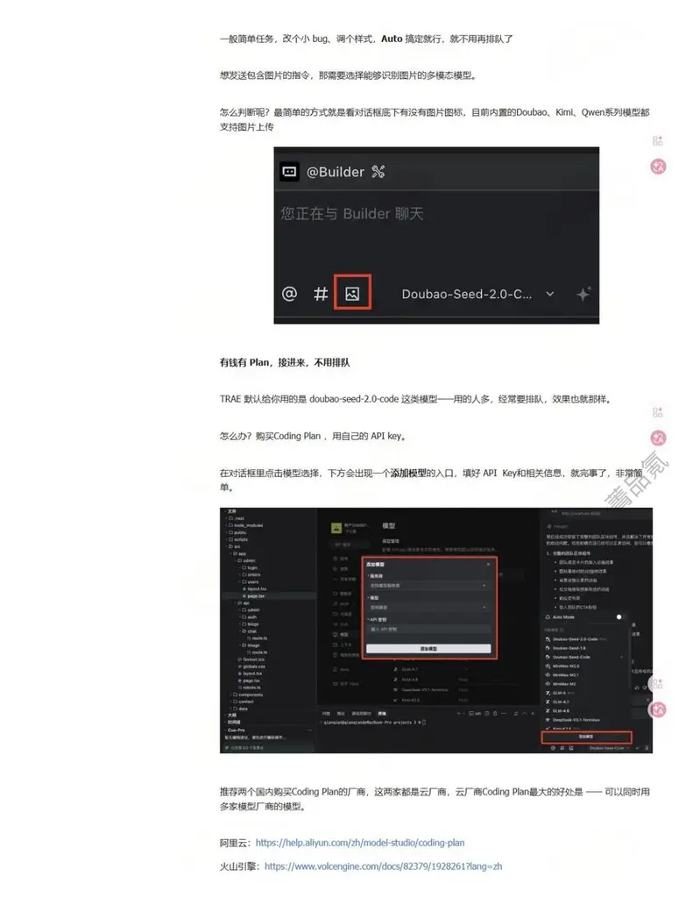

一般简单任务，改个小 bug、调个样式，Auto 搞

，就不用再排队了

想发送包含图片的指令，那需要选择能够识别图片的多模态模型。

怎么判断呢? 最简单的方式就是看对话框斋下有没有图片图标，目前内置的Doubao、Kimi、Qwen系列模型都

支持图片上传

© @Builder 兴

Doubao-Seed-2.0

有钱有 Plan，接进来，不用排队

TRAE 默认给你用的是 doubao-seed-2.0-code 这类模型一一用的人多，经常要排队，效果也就那样。

怎么办? 购买Coding Plan ，用自己的 API key,

在对话框里点击模型选择，下方会出现一个添加模型的入口，填好 API Key和相

就充事了，非常简

推荐两个国内购买Coding Plan的厂商，这两家都是云厂商，云厂商Coding Plan最大的好处是 — 可以同时用

多家模型厂商的模型

阿里云: https://help.aliyun.com/zh/model-studio/coding-plan

火山引擎: https://www.volcengine.com/docs/82379/1928261?lang=zh

**第 63 页**

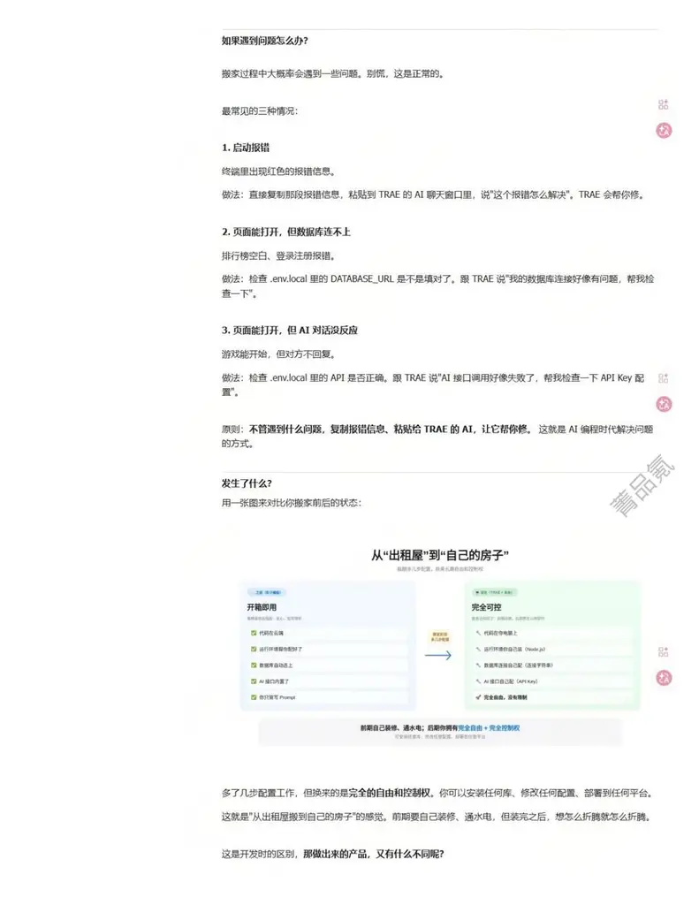

如果遇到问题怎么办?

搬家过程中大概率会遇到一些问题。别慌，这是正常的。

最常见的三种情况: 8

1. 启动报错

终端里出现红色的报错信息。

做法: 直接复制那段报错信息，粘贴到 TRAE 的 AI 聊天窗口里，说"这个报错怎么解决"。TRAE 会帮你修。

2. 页面能打开，但数据库连不上

排行榜空白、登录注册报错。

做法: 检查 -env.local 里的 DATABASE_URL 是不是填对了。跟 TRAE 说"我的数据库连接好像有问题，帮我检

查一下

3. 页面能打开，但 AI 对话没反应

游戏能开始，但对方不回复。

做法: 检查 .envJlocal 里的 API 是否正确。跟 TRAE 说"AI 接口调用好像失败了，帮我检查一下API Key配 ih

=z.

@

原则: 不管遇到什么问题，复制报错信息、粘贴给 TRAE 的 AI，让它帮你修。 这就是 AI 编程时代解决问题

的方式。

发生了什么?

用一张图来对比你搬衣前后的状态:

从“出租屋"到“自己的房子

AMSISER, ReKmasneNs

— a

FAD Rene

加rmeaa Ma at

图 ah AeeST \. AFFAMBSL (odes) o+

mawans+ ee

ence aaam om @

2 e508 pe as

前期自己装修、通水电; 后期你拥有完全| 完全控制权

多了几步配置工作，但换来的是完全的自由和控制权。你可以安装任何库、修改任何配置、部堵到任何平台。

这就是"从出租屋搬到自己的房子"的感觉。前期要自己装修、通水电，但装完之后，想怎么折肌就怎么折腾。

这是开发时的区别，那做出来的产品，又有什么不同呢?

**第 64 页**

举个例子，假设你想做个 AI 翻译工具，只有自己和朋友用，

那么这个场景下，扣子编程其实已经够用一速度快、体验好、不需要折腾。当你只是起快速验证一个想法，

或者做个国内用的小工具时，扣子编程是更聪明的选择。 5

但如果你想继续把这个翻译工具做大做强，上线到海外市场，问题可能就来了:

支付怎么接入? 起要分析用户数据怎么办? 起用更厉害的模型怎么办 ? 你会发现每一步都是卡

东手束脚的感觉

但是在 TRAE 里，一切都是你说了算。你可以根据需要随时增加新功能、接入新模型、分析平台数据…

扣子编程 TRAE + 本地开发

产品能做，出海这一步会卡 出海和长期运营更从容

出海和运营时遇到的问题 出海和运营时的优势

全 服务器在国内，海外用户访问速度慢 © BBE vercel, SECON, BEB

A 数据存在平台上，GDPR 合规较难交代 加 数据在自己的数据库，归属清晰可控

全 人模型受平台支持范围限制 回 随时切换 Claude / GPT 等任意模型

A 用户数据深度分析、A/B 测试不太方便 加 接入分析工具、做实验、自由迁代 88

全 平台调整策略或收费，只能被动接受 回 代码在你手里，不依束任何单一平台 (2)

总结

这节课做的事只有一件: 把你的产品从扣子编程搬出来，在本地跑起来。

过程分七步:

1. 安装 TRAE

2. 从扣子编程下载代码

3. 用 TRAE 打开项目

re

. 配置数据库连接字符串

. 配置 Coze SDK API Key

, 启动项目，在浏览器里打开

4. 安装 Node.js 和项目依赖

6.

搬完之后，你的产品跟之前一模一样一一但它跑在你自己的电脑上了。从今往后，你就在 TRAE 里开发。

三个要点

1. TRAE 是你的新工作台

扣子编程是温室，TRAE 是真正的工作间。功能更强大，自由度更高。但你在扣子编程里学的所有概念

(page.tsx、route.ts、layout.tsx、组件) 一个都没变。

2. 搬家的核心是配置

代码不用改一行。你要做的是把扣子编程帮你"隐藏 的东西一运行环境、数据库连接、API Key一自己配一

饥。配好了就能跑。

3. 遇到问题就问 TRAE

报错信息直接复制粘贴给 TRAE 的 AL，让它帮你修。这是 Al 编程时代解决问题的方式。

**第 65 页**

要点回顾

* TRAE 是更专业的 Al 编程工具，在你的电脑本地运行。

* 从扣子编程下载代码 一 用 TRAE 打开 一 配置环境和挛铀 一 启动。

* 数据库用扣子编程提供的，通过连接字符串远程连接。

* Al 能力需要单独配置 Coze SDK API Key,

* 遇到任何报错，复制给 TRAE 的 AI 即可。

下一课: 我们稍微深入一点点，看厦TRAE和其他的AI IDE，有哪些共性功能。
