## 【实战进阶(4/4) 】Claude Code、MCP、Skills、产品迭代、开源生态

## 二十二、Claude Code：TRAE/Cursor 已经够好了，为什么还要用这个黑窗口？

### 前言

你已经用 TRAE（或 Cursor）做了好几个项目了。

AI 帮你写代码，你在界面里点点点，改改改，挺顺手的。

那为什么还要学一个黑乎乎的命令行工具？

原因很简单：Claude Code 能做到 TRAE/Cursor 做不到的事。

TRAE 和 Cursor 是 AI 住在编辑器里——它帮你改代码，但它不能替你"动手"。你还是要自己跑命

令、自己处理终端报错、自己部署。

Claude Code 不一样。它是 AI 直接住在你的终端里——它不只是写代码，它还能帮你执行命令、安

装依赖、提交 Git、甚至部署上线。你只管说"我要什么"，它负责从头做到尾。

这节课，我们就来搞懂这个黑窗口。

### CLI类AI编程工具速通

CLI 是 Command Line Interface 的缩写,中文叫命令行界面。

简单理解: CLI 就像是程序员的"打字对话框",没有花里胡哨的按钮和界面,纯靠键盘打命令来工作。

形象比喻:

• IDE 就像带触摸屏的iPad，很方便，但是功能很少。

• CLI 就像你在电影里看到黑客用的那种电脑，操作者总是在打字，没有触摸屏，甚至没有界面。

文科生不容易看懂他们在干什么，只是觉得很酷。

用界面不好吗，为啥要用黑乎乎的CLI？

## 1. 完全控制权 、自由度无限

• IDE只给你"常用按钮",CLI让你控制计算机的一切

• 就像:IDE是"自动挡汽车",CLI是"手动挡跑车"——你想怎么开就怎么开

## 2. 效率高

• 不需要鼠标点来点去,纯键盘操作

• 命令明确,不会误操作

• 轻量级,不吃内存,秒开

## 3. 专业必备

• 很多高级操作(服务器部署、Docker、Git高级功能),只有CLI能做

• 在过去50年，所有的程序员高手都必须精通CLI

CLI不是"老土",而是"专业工具"。新手可以先用IDE入门,但想成为高手,CLI是必经之路!

我们看到一些黑客类型的电影，里面的黑客，使用的肯定是CLI界面 😄

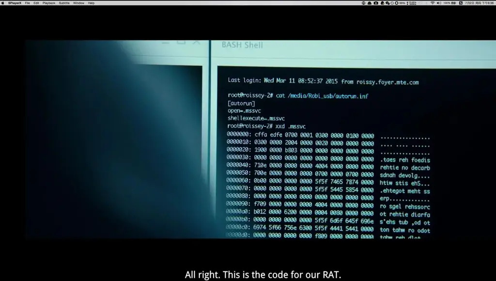

常见CLI类AI编程工具

我们看看常见的CLI类AI编程工具。

它们都是黑乎乎的一团，请暂时按捺住你内心的恐惧，马上我跟你讲清楚。

Claude Code

Codex CLI

Cursor CLI

Gemini CLI

你发现了吗? 其实它们本质上也是一回事。

打开CLI的不同方式

方法一：系统终端打开

快捷键菜单栏检索

• 按 Command + 空格

• 打开“应用程序”

Mac

• 输入 Terminal

• 进入“实用工具”

• 回车打开

• 点开“终端”

• 按 Win • 右键任务栏左下角开始按钮

Windows

• 输入 PowerShell 或 Terminal

• 选 终端 或 Windows PowerShell

• 点击打开

打开后你会看到一个黑色或白色窗口，里面可以输入命令。

方法二：编辑器内打开

在 Cursor、VS Code、TRAE 这些编辑器里面，直接打开一个内嵌的 terminal 面板。

通常方式是：

• 菜单栏点 Terminal → 选 New Terminal

• 或快捷键 `Ctrl + ``

打开后，它会出现在编辑器下方，看起来像代码编辑区下面多了一块黑窗口。

这两种方式有什么区别呢？

最关键的差异就是默认路径不同。

系统终端刚打开时，通常在你的用户主目录。编辑器内终端刚打开时，通常直接在当前项目目录

这点特别重要。

比如你在 Cursor 里打开了一个项目 my-app，然后打开内置终端，它大概率已经在：

Plain Text

.../my-app

但你如果是自己开系统终端，它可能在：

Plain Text

/Users/你的用户名

这时候你需要手动 cd 到项目目录。

对新手来说，先从编辑器内终端用起，更顺手。

大白话，CLI工具的核心五区域

无论是 Claude Code 、Codex CLI、Cursor CLI、Gemini CLI还是其他工具

五个区域

输入区

在什么都还没干的时候，这是唯一区域

AI思考区/执行区/权限区

当我们输入需求后，才可能会出现其他区域

当我授予权限后，它会开始继续执行

结果区

执行成功，它会通知你。

注意：结果区显示，需要我们执行命令运行起来。

以下是运行的结果，非常完美，我很满意。

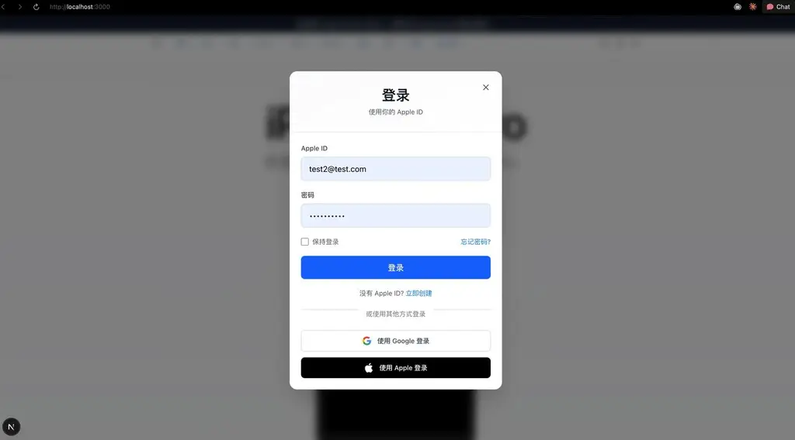

简要实战工作流

Claude Code(或者其他CLI类编程工具)的 工作方式是: 对话式协作

公式

### 💡CLI工作流 = 启动工具 + 对话需求 + AI自动执行 + 你审核把关 + 持续迭代

完整工作流

下面以Claude Code为例，我们展示一下完整工作流

第1步:启动工具

bash

Bash

$ cd /你的项目文件夹

$ claude

出现界面:

Plain Text

┌────────────────────────────────────────┐

│  Claude Code (Sonnet 4.5)              │

│  Project: /Users/you/my-app            │

│  Context: 100% remaining               │

└────────────────────────────────────────┘

> _  ← 光标在这里,等你说话

第2步:对话需求(不是命令!是对话!)

新手常见误区:

Plain Text

❌ 错误: > create component navbar

(这是传统命令思维)

✅ 正确: > 帮我在我的网页上创建一个导航栏组件,要响应式设计，无论是手机屏幕看还是电脑屏幕看，都很协

调。导航栏包括：首页、价格页、博客、关于我们和登录

(像和人类程序员说话一样)

Claude的真实回应:

Plain Text

⏺ 好的,我会创建一个响应式导航栏组件。

⏺ 我会创建以下文件:

- src/components/Navbar.jsx (组件)

- src/components/Navbar.css (样式)

⏺ 准备开始...

第3步:AI自动执行 (你只需要看着)

Claude会自己完成所有操作:

Plain Text

📝 Create(src/components/Navbar.jsx)

[实时显示正在写入的代码...]

✅ File created

📝 Create(src/components/Navbar.css)

[实时显示CSS代码...]

✅ File created

📝 Edit(src/App.js)

[自动在App.js里引入Navbar组件]

❓ Can I edit src/App.js? [Press Enter to approve]

注意这里: AI可能会:

• 创建多个文件

• 修改现有文件

• 安装依赖包

• 运行测试

• 提交git

在你授权的前提下，可以全都是自动的!

• 如果你信任Claude,可以启动时用 claude --dangerously-skip-permissions 自动批准所有操作

• 但新手建议保留权限检查,直到你熟悉工作流

第4步:你审核把关(重要）

对于每次AI的结果，你都需要审核把关两件事

• 是否已经完整实现了你要求的功能？

• 代码是否符合规范 （需要你学习完内功篇，才能判断）。你需要阅读和理解AI写的每一行代码。

第5步:持续迭代(这才是精髓!)

Claude完成后,你可以继续对话:

Plain Text

> 导航栏创建好了,现在帮我:

## 1. 添加一个搜索框

## 2. 把logo放在左边

## 3. 用户头像放在右边

⏺ 收到,我来修改...

📝 Edit(src/components/Navbar.jsx)

...

> 搜索框的图标能换成放大镜吗?

⏺ 当然,我来调整...

> 完美!现在运行一下看看效果

⏺ 好的,我来启动开发服务器

🔧 Bash(npm run dev)

✅ Server running on http://localhost:3000

这就是Agentic Coding的核心:

• 不是"一个命令完成一件事"

• 而是"持续对话,迭代优化"

自带命令(Built-in Slash Commands)

CLI 工具里,输入斜杠 / ,会出现系统自带的一些命令。

如何学习自带命令

### 💡结合官方说明书，每个命令都试试！

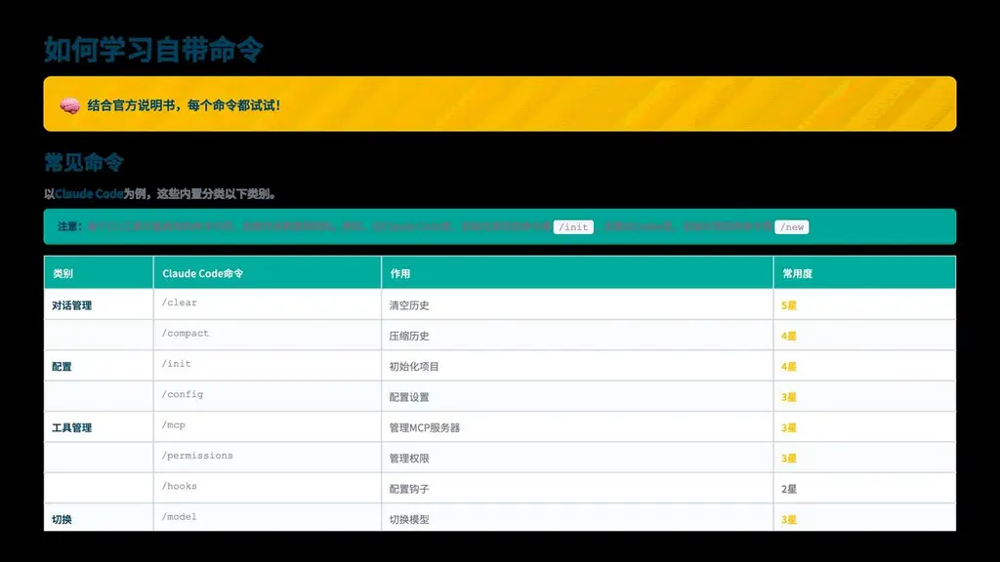

常见命令

以Claude Code为例, 这些内置分类以下类别。

注意： 每个CLI工具可能具体的命令不同，但是作用都是相同的。 例如，在Claude Code里，初始

化项目的命令是 /init ， 但是在Codex里，初始化项目的命令是 /new

重点命令讲解

查看所有命令的命令

/help

Bash

> /help

作用: 显示所有可用的斜杠命令列表(包括内置命令和你的自定义命令)

适用场景:

• 忘记命令名称时

• 想查看项目有哪些自定义命令

• 新手熟悉工具

对话管理命令

/clear — 清空对话历史

Bash

> /clear

作用: 完全清空当前对话历史,从零开始

什么时候用:

• 开始全新任务(比如从开发登录功能切换到开发支付功能)

• 对话太长太乱,Claude开始"糊涂"了

• 想节省token,不需要保留历史

注意: 清空后就找不回来了!重要内容先保存。

压缩对话历史

/compact

Bash

> /compact

# 或者指定保留什么内容

> /compact 保留当前的认证实现和数据库设计决策

作用: 把长对话历史"总结压缩",保留重要信息,删掉不重要的

什么时候用:

• 对话很长,但还需要继续这个任务

• 看到"Context: 15% remaining"(上下文快满了)

• 不想完全清空,但需要腾出空间

对比:

配置和初始化命令

/init — 初始化项目配置

Bash

> /init

作用:

• 扫描你的项目

• 自动生成 CLAUDE.md 文件(项目说明书)

• 识别项目类型、技术栈、常用命令

什么时候用:

• 第一次在项目里使用Claude Code

• 让Claude快速了解项目结构

生成的CLAUDE.md示例:

markdown

Markdown

# 项目概述

这是一个React + TypeScript的个人财务追踪应用

# 技术栈

- 前端: React 18, TypeScript, Tailwind CSS

- 后端: Node.js, Express

- 数据库: PostgreSQL

# 常用命令

- 启动开发服务器: npm run dev

- 运行测试: npm test

- 构建生产版本: npm run build

MCP服务器管理命令

/mcp — 管理MCP服务器

Bash

> /mcp

作用: 查看和管理已连接的MCP服务器状态

显示内容:

Plain Text

⎿ MCP Server Status ⎿

⎿ • github: connected      ⎿

⎿ • puppeteer: connected   ⎿

⎿ • database: disconnected ⎿

什么是MCP服务器?

MCP(Model Context Protocol)= 让Claude Code连接外部工具和服务

比如:

• github MCP → Claude可以读取/创建GitHub issues和PR

• puppeteer MCP → Claude可以控制浏览器截图

• database MCP → Claude可以查询数据库

使用开源框架学习使用 Claude Code

仓库地址：https://github.com/luongnv89/claude-howto?tab=readme-ov-file

这个仓库解决的问题很简单——Claude Code 的官方文档告诉你"有什么功能"，但从来不告诉你"怎

么把这些功能串起来用"。

你装好了 Claude Code，跑了几个 prompt，然后呢？

然后就不知道干啥了。

这个仓库不一样。它提供的是带流程图、可以直接复制到你项目里的模板、以及一条从入门到进阶

的完整学习路径。10个模块，从斜杠命令一路讲到自定义代理团队，有图有示例有练习。

执行下面的命令，先把仓库克隆下来

Plain Text

git clone https://github.com/luongnv89/claude-howto.git

cd claude-howto

强烈建议在你已有的真实项目里跟着做。不要新建一个空项目来学，我这里用纸片人男友来做演

示。

进入Claude Code，先让它扫一遍这个仓库：

Plain Text

请用中文概括这个仓库的作用、目录结构、10个模块和推荐学习顺序

对了，这个仓库有中文翻译，在 zh/ 目录下。英文看着累的话，可以直接看中文版的 README。

它还有一个 LEARNING-ROADMAP.md 文件，给你画好了完整的学习路线，每个模块大概要花多

长时间都标好了。

甚至还有自评测试——在 Claude Code 里输入 /self-assessment，它会帮你判断你现在的水平，

推荐你从哪个模块开始。

好了，下面进入正题。我挑了每个模块的典型案例来演示，更多内容可以跟着仓库文档继续学习。

模块一：Slash Commands（斜杠命令）

斜杠命令是什么？

你可以把它理解成给 Claude Code 加了一个"快捷指令"。你写好一个模板，以后只要输入 /指令名

称，Claude 就会按照这个模板的流程去执行。

本质就是：把重复性的提示词，变成一个可以反复调用的命令。

仓库里坐着提供了8个自定义斜杠命令

来，动手。先在你的项目里创建命令目录，然后把仓库里现成的 optimize 模板复制过去：

Plain Text

cd '/你的项目路径'

mkdir -p .claude/commands

（在当前项目里创建 Claude Code 的自定义命令目录）

cp ~/claude-howto/01-slash-commands/optimize.md .claude/commands/

（把教材仓库里现成的 optimize.md 文件，复制到你项目的命令文件夹里。）

执行完你可以看到这样的文件，说明就引入成功了

这个 /optimize 命令是干什么的呢？它可以让 Claude Code 按照预设的模板来给你的项目做"体

检"——具体来说，它会检查5类问题：

• 性能瓶颈（比如 O(n²) 的操作、低效循环）

• 内存泄漏（未释放的资源、循环引用）

• 算法改进（有没有更好的数据结构可以用）

• 缓存机会（哪些计算在重复做）

• 并发问题（有没有竞态条件、线程安全隐患）

然后它会按严重程度排序，指出问题在哪个文件什么位置，给出修复方向。

### 💡/optimize = 项目优化体检命令

执行完 = 得到一份结构化的优化报告

仓库里不只有 optimize 这一个模板。它还提供了 pr（提PR前自检）、commit（生成规范提交信

息）、push-all（一键推送）、generate-api-docs（生成API文档）等等，总共8个现成的命令模板。

你可以一键全部复制过去：

Plain Text

find ~/claude-howto/01-slash-commands -name '*.md' ! -name 'README.md' -exec cp {}

.claude/commands/ \;

模块二：CLAUDE.md 模板

CLAUDE.md 是 Claude Code 的项目记忆文件。

你有没有这种体验——每次打开 Claude Code，都要重新跟它解释一遍"这个项目是干什么的""用了

什么技术栈""哪些目录重要"……

有了 CLAUDE.md，这些信息写一次就行了。Claude Code 每次启动时会自动读取这个文件，相当

于它自己"记住了"你的项目。

用下面这个提示词，让 Claude Code 帮你生成一份专属的 CLAUDE.md：

Markdown

请基于本地claude-howto仓库中的 memory 模板，为当前项目迁移并生成项目根目录的 CLAUDE.md。

要求你必须先读取这个模板文件：

~/claude-howto/02-memory/project-CLAUDE.md

然后再读取并理解当前项目的 README、package.json、src 目录结构以及你认为必要的关键文件。

任务目标：

1. 以 ~/claude-howto/02-memory/project-CLAUDE.md 的结构和写法风格为基础

## 2. 不要机械照抄模板内容

## 3. 必须根据当前项目的真实情况，重写成“这个项目专属”的 CLAUDE.md

## 4. 直接在当前项目根目录创建或更新 CLAUDE.md

## 5. 如果已有内容，优先合并，不要粗暴覆盖

CLAUDE.md 至少要包含这些部分：

- 项目简介：这个项目是做什么的

- 技术栈：框架、语言、UI、数据库、认证、部署等

- 核心目录结构：哪些目录最重要，各自负责什么

- 常用命令：安装、开发、构建、检查、测试等

- 开发规范：你建议 Claude 在这个项目中如何工作

- 修改代码时的注意事项：哪些地方要谨慎，哪些文件先读

- 输出风格要求：以后 Claude 在这个项目里回答和改代码时应遵守什么规则

额外要求：

- 内容必须贴合当前项目，不要写空泛模板话术

- 对不确定的内容要明确标注“待确认”，不要编造

- 尽量写得适合长期复用，像团队项目说明书

- 生成完成后，先告诉我：

## 1. 你参考了模板仓库中的哪些结构

2你根据当前项目补充了哪些专属信息

以后你在这个项目里再次打开 Claude Code 时，它会自动读这份 CLAUDE.md，以后会更容易知

道：

• 这是个什么项目

• 技术栈是什么

• 哪些目录重要

• 常用命令是什么

• 开发时该注意什么

你可以用这个指令来验证——让它只根据项目记忆来回答，不要重新扫描：

请先不要重新扫描整个项目，只根据当前已加载的项目记忆，概括这个项目的定位、核心技术栈、

最重要的目录和你接下来修改代码时会遵守的规则。

模块三：Checkpoints

这个功能很好理解——Claude Code 在编辑你的文件之前，会自动基于 git 记录一个"当前状态"。

如果改坏了，你可以退回去。

注意，这是自动发生的，不需要你手动触发。Claude Code 会在每次你提交 prompt 时自动跟踪文

件状态。

你需要做的只是：当你想回退的时候，在 Claude Code 里输入：

/rewind 或者 /checkpoint

就这么简单。改代码之后有了后悔药。

模块四：CLI Basics

你前面一直在用的方式是这样的：

输入：claude，然后进入一个对话界面，在里面继续聊、继续改、继续问。

这叫：交互式使用。Claude 能保持上下文，适合持续协作。

但还有另一种用法——直接在终端里一句话搞定，不用进入对话：

Plain Text

claude -p "帮我总结这个项目"

执行完就结束，不会进入对话模式。适合快速任务、脚本、自动化。

更深入的内容，比如：

• pipe 管道

• JSON 输出

• 会话恢复

• 批处理

• ……

可以跟着仓库的 cli/ 目录继续学。

模块五：Skill

Skill 是在某类任务下可复用的一套“专业做事方法”，你可以把它安装到 Claude Code 里，让它在

遇到某类任务时，按照这套方法更系统地工作。

这个开源框架提供了6个现成的 Skill 示例：

• code-review（代码审查）

• blog-draft（博客草稿）

• brand-voice（品牌声音）

• claude-md（项目记忆生成）

• doc-generator（文档生成）

• refactor（重构）

以代码审查 code-review 为例，可以用下面这个命令来安装：

Plain Text

mkdir -p ~/.claude/skills

cp -r ~/claude-howto/03-skills/code-review ~/.claude/skills/code-review-specialist

验证：

Bash

ls ~/.claude/skills/code-review-specialist/SKILL.md

看到文件就说明装好了。

安装完成后，就可以直接调用了。

Skill 这一节，我们先简单说一下最核心的部分：什么是 Skill、怎么安装、怎么调用。

仓库作者还补充了更深入的内容，比如 Skill 目录结构、触发控制、参数传递等等，这些属于进阶能

力，我们后面的课程会讲一部分，也可以在这个仓库里继续学。

模块六：Hooks

用 Claude Code 的时候你可能想过一件事：我不想每次都手动提醒 Claude 做某件事，能不能自动

触发？

这就是Hooks。

Hooks = 自动触发的动作

比如：

• 如果 Claude 准备写文件，就先检查一下

• 如果 Claude 刚写完文件，就自动格式化

• 如果 Claude 要运行 Bash，就先提醒一下

• 如果 Claude 结束任务，就自动记录日志

Hooks 的核心不是“让 Claude 多一个能力”，而是：让 Claude 的工作流程自动化。

Hook 有 4 种类型

Command Hook

最常见的。执行一个本地脚本或 shell 命令。Hook 从标准输入接收 JSON，通过退出码和输出来决

定放行、阻止还是补充上下文。

HTTP Hook

把数据发到远程 webhook，让外部服务处理，适合接企业审计平台或通知系统。

Prompt Hook

把一段提示词交给模型来判断，常用于"任务是否真正完成了"这种智能判定。

Agent Hook

启动一个子代理来做更复杂的检查。相比 Prompt Hook，它不只是单轮判断，还可以调用工具、做

多步分析。

以 pre-tool-check.sh 为例，它的作用是：当 Claude Code 准备执行 Bash 命令时，先检查一下这

条命令是不是危险的。

Hook 的安装分两步——复制脚本 + 配置触发规则。

第一步，复制脚本（命令就行）：

Bash

mkdir -p ~/.claude/hooks

cp ~/claude-howto/06-hooks/pre-tool-check.sh ~/.claude/hooks/

chmod +x ~/.claude/hooks/pre-tool-check.sh

第二步，配置 settings.json：

直接在终端输入：

Bash

cat > ~/.claude/settings.json << 'EOF'

{

"hooks": {

"PreToolUse": [

{

"matcher": "Bash",

"hooks": [

{

"type": "command",

"command": "~/.claude/hooks/pre-tool-check.sh"

}

]

}

]

}

}

EOF

复制粘贴到终端，回车，完事。

验证一下：

Bash

cat ~/.claude/settings.json

看到刚才那段 JSON 输出就说明写入成功了。

你可以查看审计日志确认 Hook 确实在工作：

Bash

cat .claude/hooks/audit.log

会看到类似这样的记录：

除了 pre-tool-check.sh，仓库还提供了这些现成的 Hook 示例：

• pre-commit.sh：提交前自动跑测试（支持 npm test、pytest、go test、cargo test）

• format-code.sh：写完文件后自动格式化（支持 JS/TS、Python、Go、Rust、Java）

• security-scan.sh：文件写入后扫描硬编码密码、API Key、私钥

• dependency-check.sh：依赖变更后做漏洞扫描

• validate-prompt.sh：在用户提交 prompt 时拦截危险操作

• log-bash.sh：记录 Bash 命令审计日志

• notify-team.sh：事件通知模板（Slack / Discord / 邮件）

• context-tracker.py：统计上下文和 token 消耗

• context-tracker-tiktoken.py：上面那个的高精度版

模块七：MCP

MCP 全称是 Model Context Protocol。

你就理解把它成 Claude Code 和外部工具之间的“标准接口”、“通用插座”。通过 MCP，Claude

可以访问 GitHub、数据库、文件系统、Slack 这类外部服务。

以 GitHub MCP 为例，它可以用来连接 GitHub，查 PR、Issue、仓库文件、代码内容等。

第一步，创建 GitHub Token：https://github.com/settings/personal-access-tokens

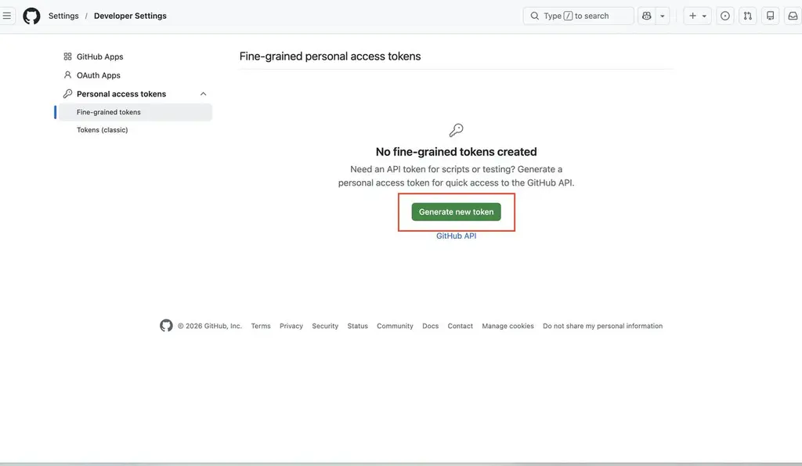

第二步，把 Token 写进环境变量：

在终端执行：nano ~/.zshrc

在最后加一行：

Plain Text

export GITHUB_TOKEN="你的新token"

再执行： source ~/.zshrc确保以后你每次打开终端，GITHUB_TOKEN 都自动存在

第三步，接入 GitHub MCP：

Plain Text

claude mcp add --transport stdio --scope user github -- npx -y

@modelcontextprotocol/server-github

第四步，验证。启动 Claude Code，输入 /mcp，看到 github 出现了就说明成功。

除了 GitHub MCP 之外，作者还提供了其他 MCP 的接入，比如：

Database MCP：用来连接数据库，做实时查询，比如查用户、订单、业务数据。

Filesystem MCP：用来连接文件系统，对指定目录做读写、搜索、创建文件等操作。

等等

MCP 这一块，今天先把"是什么、怎么装、怎么接"搞明白就行。仓库作者在这一节里还介绍了

Slack、Google Docs、Asana、Stripe、Notion 等更多 MCP 生态服务，以及 HTTP、OAuth、多

作用域配置等进阶内容。后面我们会有专门的课程来讲 MCP。

模块八：Subagents

你可以把 Subagent 理解成Claude 里的“专门分工的小助手”。

主 Claude 负责总控，子代理负责某一类任务——代码审查、写测试、排查 bug、写文档等等。它

们各自有单独的上下文，不会把主对话搞得越来越乱。

以 code-reviewer 为例，安装一个 Subagent

执行命令如下：

Plain Text

mkdir -p .claude/agents

cp "/你的claude-howto本地路径/04-subagents/code-reviewer.md" .claude/agents/

完成后可以使用ls .claude/agents来检查是否安装成功

看到code-reviewer.md，说明装好了。

在 Claude Code 里输出/agents，就能看到它。

除了 code-reviewer，仓库还提供了这些 Subagent 示例：

test-engineer：负责写测试、补测试、做覆盖率思路分析

documentation-writer：负责写文档、API 文档、说明文档

secure-reviewer：偏安全审查，权限更保守，适合做安全检查

implementation-agent：偏功能实现，可以读、写、改代码，也能跑命令

debugger：偏排错，适合查 bug、错误、测试失败

data-scientist：偏数据分析、SQL、数据处理

你可能会问：这个 Subagent 和前面的 Skill 不是差不多吗？

不一样。

Skill = 给 Claude 一套"遇到某类任务应该怎么做"的规则。

它不是一个单独的助手，更像一份操作指南。

Subagent = 一个真的会被单独调起来的"子助手"。

它有独立上下文，任务完成后就退场，不会污染主对话。

如果把 Claude 看成一个团队：

• Skill = 岗位 SOP / 操作手册

• Subagent = 专职员工

仓库作者还补充了 /agents 交互式创建、项目级与用户级安装、CLI 临时定义等进阶内容，可以继

续深入学。

模块九：Advanced Features

这一节不是新功能模块，而是教你怎么把 Claude Code 用得更稳、更深、更自动。

前面几节你在学：Claude 有哪些能力。 这一节你学的是：怎么把这些能力组合起来，用在更复杂的

场景。

这里挑两个例子来说。

## 1. Planning Mode

Planning Mode 就是：让 Claude Code 先不要急着动手，先出一个计划给你看。

先规划，再执行。

避免 Claude Code 一上来就乱改代码。

适合这些场景：

• 新功能开发

• 多文件修改

• 架构调整

• 数据库迁移

• 大型重构

不太适合的场景：

• 改一个小 bug

• 调一句文案

• 改一个样式

使用方式很简单，直接在 Claude Code 里输出/plan即可

## 2. Permission Modes

Permission Modes 控制的是：你允许 Claude 做事时，到底要不要每一步都问你。

你可以把它理解成“授权模式”：

• default：正常模式，该问就问

• acceptEdits：改文件可以自动做，其他危险操作还会问你

• plan：只做规划，不直接改

• dontAsk：尽量不打断你

• auto：更自动，但背后有安全分类器在判断

• bypassPermissions：基本不拦，风险最高

可以在启动时直接指定：

Plain Text

claude --permission-mode plan

这个模块实际上还包含了很多其他高级功能，比如 Extended Thinking（深度思考模式）、

Background Tasks（后台运行长任务）、Auto Mode、Session Management 等等。感兴趣的可以

去仓库的 09-advanced-features/ 目录继续探索。

模块十：Plugins

前面九个示例，你已经学会了斜杠命令、项目记忆、Skill、Hook、Subagent 这些能力。

每个都好用，但有个问题——它们是散装的。

你给这个项目装了 code-review 的 Skill，给那个项目配了 pre-tool-check 的 Hook，还装了几个

Subagent……每个单独都要单独用，很麻烦

Plugin 就是解决这个问题的。

Plugin = 把 Slash Commands + Skills + Hooks + Subagents + MCP 打包成一个整体，一次安

装，全部到位。

如果前面的模块像是一个个零件，Plugin 就是组装好的成品。

这个仓库提供了3个完整的 Plugin 示例：

• pr-review：PR 审查工作流（包含安全检查、测试覆盖率分析、性能评估）

• devops-automation：DevOps 自动化

• documentation：文档生成

以 pr-review 为例，看看一个 Plugin 里面到底装了什么：

Plain Text

pr-review/

├── .claude-plugin/

│   └── plugin.json         ← 插件清单（名称、版本、描述）

├── commands/               ← 3个斜杠命令

│   ├── review-pr.md            /review-pr 综合审查

│   ├── check-security.md       /check-security 安全检查

│   └── check-tests.md          /check-tests 测试覆盖率

├── agents/                 ← 3个子代理

│   ├── security-reviewer.md    安全漏洞检测

│   ├── test-checker.md         测试分析

│   └── performance-analyzer.md 性能评估

├── hooks/                  ← 1个钩子

│   └── pre-review.js           审查前自动检查是否是 git 仓库

└── mcp/                    ← 1个 MCP 配置

└── github-config.json      连接 GitHub 拉取 PR 数据

看到了吗？一个 Plugin 把命令、代理、钩子、MCP 全部打包在一起。这就是前面九节学的东西

的"组合技"。

怎么安装？

本地安装有两种方式：

方式一：启动时加载（临时）

Bash

claude --plugin-dir ~/claude-howto/07-plugins/pr-review

这次会话里插件会自动生效，关掉就没了。适合先试试看好不好用。

方式二：手动拆包安装（永久）

把插件里的组件分别复制到你项目对应的目录：

Bash

# 斜杠命令

cp ~/claude-howto/07-plugins/pr-review/commands/*.md .claude/commands/

# 子代理

cp ~/claude-howto/07-plugins/pr-review/agents/*.md .claude/agents/

装完之后，你在 Claude Code 里就能直接用 /review-pr 来做 PR 审查了

那 Plugin 和前面学的 Skill、Subagent 到底是什么关系？

一句话：Plugin 是容器，Skill 和 Subagent 是内容。

Plugin 本身不是新能力，它只是把你已经会用的那些能力打包在一起，方便安装、分享、复用。

对了，如果你想装真正能从 marketplace 一键安装的官方 Plugin，可以试试：

Bash

# 先添加官方 marketplace

/plugin marketplace add anthropics/claude-code

# 安装官方插件（比如 feature-dev）

/plugin install feature-dev

### 作业

使用任何一款CLI工具，阅读官方说明书，尝试用它迭代你的项目。

推荐：

• Claude Code - 如果有条件，优先用它。不过新手容易被封号。目前这是我的主力工具。【首推】

• Codex - 如果你已经付费过ChatGPT Plus($20/月)，可以免费使用它。 【首推】

• Cursor CLI - 如果你已经付费过了Cursor， 不用重复付费了。 https://cursor.com/cli

• Qoder CLI - 国产平替，免费额度高

## 二十三、MCP：AI的万能插头 — 让AI连上一切工具【重要】

### TRAE 已经很强了，但它有一堵墙

在前面的课程里，你用 TRAE 做了很多事情。你把哄哄模拟器从扣子编程搬了出来，在自己的电脑

上跑起来了。你配了数据库连接，配了 API Key，甚至可以让 AI 帮你改代码、修 Bug。你已经不是

当初那个只会在扣子编程里拖拖拽拽的人了。

但有一件事，你可能隐约感觉到过，只是没说出口：

TRAE 很聪明，但它的世界有点小。

你打开浏览器，页面崩了，控制台报了一堆红色的错误。你截图给 TRAE，它分析得头头是道，但给

出的方案试了三个都不对。为什么？因为它看到的不是"真实的报错"，而是你截图里的报错。它没有

办法直接读你浏览器的控制台。

你的哄哄模拟器跑了一段时间，你想知道用户都在聊什么、哪条对话最受欢迎。你只能自己打开数

据库工具，写 SQL，查出来，再贴给 TRAE 分析。为什么不能让它直接查？因为它进不了你的数据

库。

你在用 Next.js 开发，问 TRAE 某个新特性怎么写，它给了你一段代码，你一跑，直接报错：API

根本不存在。为什么？因为 Next.js 更新太快，TRAE 学的那版文档早就过期了，它不知道最新的写

法。

这些问题，都指向同一个根源：TRAE 的"感知边界"，只到代码文件为止。 浏览器里发生了什么，

数据库里存了什么，某个框架最新版本改了什么——这些它全都看不到。

这节课，我们要打破这堵墙。

### MCP 是什么？从一个生活中的类比说起

MCP 的全名是 Model Context Protocol，翻译过来叫"模型上下文协议"。这个名字听起来很技术，

但你完全不需要理解它的字面意思。我用一个更好懂的类比来解释它。

你想想 USB 接口出现之前的世界是什么样的。键盘有键盘的接口，鼠标有鼠标的接口，打印机有打

印机的接口，U 盘那时候还不存在。每接一个新设备，你都要搞清楚它用什么接口，买对应的线，

还不一定能用。整个世界一团乱。

后来有了 USB。一个标准接口，所有设备都往上靠。你不用再关心"这个设备用什么接口"，你只需

要知道"它支不支持 USB"。插上就能用，不支持就换一个，就这么简单。

MCP 对 AI 来说，就是 USB。

在 MCP 出现之前，AI 工具想接入外部能力，每家都要自己造轮子。TRAE 想支持浏览器操作，就

要自己开发；想支持数据库查询，就要自己开发；想支持文档读取，还是要自己开发。而且你用的

是 TRAE，他用的是 Cursor，用的工具不同，配置方式完全不一样，学了 TRAE 的用法，换个工具

又要从头来。

有了 MCP 之后，整个生态就不一样了。任何人都可以按照 MCP 标准，做一个"工具插件"——比

如"读浏览器 DevTools 的插件"、"查 PostgreSQL 数据库的插件"、"拉最新 Next.js 文档的插件"。

而所有支持 MCP 的 AI 工具，包括 TRAE、Claude Code、Cursor，都可以直接用这些插件，配置

方式大同小异。

这就是 MCP 的本质：一套让 AI 和外部工具"对话"的通用标准。

### MCP 里有三个角色，你需要知道

理解 MCP 的工作方式，你需要认识三个角色。

第一个角色是 MCP Client，也就是客户端，就是你正在用的 AI 工具，比如 TRAE。它的角色是"提

需求的人"。它知道自己想要什么，但它不直接干活，它通过 MCP 协议去找能干活的工具。

第二个角色是 MCP Server，也就是服务端，是真正干活的工具。比如"读浏览器 DevTools 的

MCP Server"、"查 PostgreSQL 的 MCP Server"。它们各自有自己的专长，按照 MCP 标准对外提

供服务。

第三个角色是 MCP Tool，也就是具体的能力。每个 MCP Server 里，有若干个具体的工具，比

如"截图"、"读控制台日志"、"执行 SQL 查询"等等。TRAE 在需要的时候，会调用对应的工具来完

成任务。

这三个角色的协作方式，用一个场景来理解最直观：你对 TRAE 说"帮我看看浏览器控制台现在报了

什么错"。TRAE（客户端）就会去找 DevTools MCP Server（服务端），调用它的"读取控制台日

志"工具（MCP Tool），拿到结果，再告诉你。你完全感知不到这个过程，你就只看到 TRAE 给了你

答案。

### 怎么给 TRAE 装 MCP？

这里有一个好消息：TRAE 国内版已经把 MCP 的安装做成了图形界面，完全不需要你手动改配置文

件。

整个流程非常简单。打开 TRAE，点击右上角的设置图标进入设置中心，在左侧导航栏找

到"MCP"，点进去之后你会看到一个 MCP 市场入口。点击"从市场添加"，就可以浏览和搜索所有可

用的 MCP Server。找到你想要的，点加号，填入必要的配置信息（有些 MCP 需要填 API Key 或

者数据库连接字符串），确认就完成了。

TRAE的用户体验非常好： 自带的MCP市场，已经内置了市面上大部分主流MCP。

需要什么MCP，我们先到这里搜索。搜索到的内容，可以直接安装

后面我们要安装的每一个 MCP，都走这个流程，不会有太大区别。学会一次，后面都一样。

### 重点 MCP 一：DevTools MCP — 让 AI 看见你的浏览器

为什么开发者需要这个？

做网站开发，有一件事情你会反复遇到：页面出了问题，但你不知道为什么。

这时候你通常会打开浏览器的开发者工具（DevTools），看 Console 里的报错，看 Network 里的请

求，看 Elements 里的 DOM 结构。这是每个前端开发者每天都在做的事情。

但是 AI 看不到这些。你只能把报错截图或者复制文字贴给它，它再根据你贴的内容来分析。这中间

有信息损耗——你贴的不一定完整，你可能漏掉了关键的堆栈信息，或者不知道哪条报错才是真正

重要的那条。

DevTools MCP 解决的就是这个问题。它把你浏览器的 DevTools 直接共享给 AI，让 AI 能看到你正

在调试的那个真实页面，读取真实的控制台日志、真实的 DOM 结构、真实的网络请求。

DevTools MCP 和 Playwright MCP 有什么不一样？

你可能听说过 Playwright MCP，这也是一个很主流的浏览器 MCP。它们的区别在于：Playwright

MCP 会在后台另起一个浏览器进程，专门用来执行自动化操作，比如自动点击按钮、自动填表、跑

端到端测试。它更适合自动化测试场景。

而 DevTools MCP 是直接连接你正在使用的那个 Chrome 浏览器，读取它的调试信息。对于我们日

常开发调试来说，这个方式更直接、更自然——你不需要另开一个浏览器，AI 看到的就是你自己在

看的那个页面。

所以：做网站开发、日常调试，用 DevTools MCP；做自动化测试、跑流程脚本，用 Playwright

MCP。

安装 DevTools MCP

在 TRAE 的 MCP 市场里搜索"DevTools"，找到 Chrome DevTools MCP Server，按照通用流程添

加即可。添加完成后，你需要用带有远程调试参数的方式启动 Chrome，让 DevTools MCP 能连上

你的浏览器。

点击加号

回到TRAE的AI聊天，把类型选择成为 Builder with MCP

可以看到，Chrome DevTools MCP已经启用了

演示

我们试试看，在TRAE AI窗口里输入一些浏览器自动化的工作。

你也可以自己试试打开小红书、其他网站、或者让它打开我们自己开始的产品哄哄模拟器

Plain Text

使用devtools mcp，

打开生财有术官网 scys.com

看最新的精华帖子，总结给我

可能会弹出提示，一般来说，对于靠谱的MCP，我选择自动运行。

勾选“下次开始自动运行MCP工具”，然后点击“运行”

接下来我们可以观察MCP工具的思考过程

发现它就和人一样在工作

此时它遇到了问题：需要登录。

我选择：由我人工介入，帮它登录；登录后，告诉它：我已经登录了，请你继续。

它继续工作了

浏览器类MCP （比如我们正在用的DevTools MCP）的实际用途有两类

• 浏览器自动化操作。比如理论上，可以用它自动发公众号、自动发小红书、自动阅读大量网页分

析内容，等等。

• 用TRAE等AI编程工具开发网页类产品的时候，浏览器MCP就是给AI增加眼睛，让AI自己测试功

能、发现问题。

高级技巧：使用Devtools MCP优化我们的网页性能

### 💡这一部分你现在不一定用得上，但我想让你知道：

AI 是可以帮你做性能分析这件事的。

请移步到： https://mp.weixin.qq.com/s/6wGinqiS0pdwZqesg3poAg

### 重点 MCP 二：Context7 — 让 AI 永远用最新文档

AI 为什么会给你过时的代码？

这个问题值得认真解释一下，因为很多人不理解为什么 AI 会犯这种错误。

AI 的知识来自训练数据。训练是有截止日期的，比如某个 AI 的训练数据截止到 2024 年初，那它

对 2024 年初之后发生的事情，就完全不知道。这不是 AI 的错，这是它的工作原理决定的。

问题在于，很多技术框架更新非常频繁。Next.js 就是最典型的例子。它从 Pages Router 切换到

App Router，引入了 Server Components、Server Actions、新的数据获取方式……这些变化发生

得很快，而且旧写法和新写法之间差异很大。如果你用的是新版 Next.js，但 AI 给你的是旧版的写

法，代码直接就跑不起来。

更麻烦的是，AI 不会告诉你"我给的可能是旧写法"，它会非常自信地给你答案，因为它确实"学过"那

个知识，只是那个知识已经过期了。

Context7 是怎么解决这个问题的？

Context7 的做法很直接：在 AI 回答你之前，先去官方文档里查一遍最新内容，把最新文档注入到

AI 的上下文里，然后再让 AI 回答。

这样 AI 回答的依据，就不再是它训练时学到的过期知识，而是刚刚从官方文档里拉来的最新内容。

Context7 是由 Upstash 团队开发的开源项目，它维护了大量主流库和框架的最新文档索引，包括

Next.js、React、Tailwind、Prisma 等等。每次你问相关问题，它会自动匹配对应的库，拉取最新

版本的文档片段，再交给 AI 来回答你。

安装 Context7 MCP

同样在 TRAE 的 MCP 市场里搜索"Context7"，按通用流程添加。Context7 不需要填写任何 API

Key，添加完成即可使用。

演示：同一个问题，两种答案

我们用 Next.js 来做对比演示。

问题是："Next.js 16有什么新功能"

没有 Context7 的时候，AI 很可能并不知道最新的知识；（图1，答案有很多错误）

有Context7的时候，AI一定会找到准确的信息！ 我们可以试一试，显式指定“使用context7回答”

（图2）

这个对比非常直观。Next.js 更新越频繁，Context7 的价值就越大。

其他的库也一样。

我们的代码中，往往依赖很多开源的类库，因此，使用AI写代码的时候，Context7可以说是必装

MCP

### 重点 MCP 三：PostgreSQL MCP — 用中文查你的数据库

回到你的哄哄模拟器

在 C6《离开扣子编程，进入深水区》里，你已经给哄哄模拟器配好了 PostgreSQL 数据库，也填写

过数据库连接字符串。这节课我们不需要任何新的环境，直接用那个数据库来演示。

想象一下这个场景：你的哄哄模拟器上线了一段时间，你想了解用户的使用情况。比如说，用户最

常说的一句话是什么？哪条对话记录最长？今天新增了多少条对话？

以前你要怎么做？你得打开数据库管理工具，回忆一下表结构，写 SQL 查询，跑出来，再把结果贴

给 AI 分析。对于不熟悉 SQL 的同学来说，这一套流程就已经是个障碍了。

有了 PostgreSQL MCP，这个流程变成了：你直接用中文问 TRAE，它帮你查，然后告诉你答案。

PostgreSQL MCP 能做什么？

它可以让 AI 直接连上你的 PostgreSQL 数据库，读取表结构，执行查询语句，返回真实数据。整个

过程你完全不需要写 SQL——你只需要用自然语言描述你想知道什么，AI 会自己生成查询语句，执

行，再把结果用人话解释给你。

安装 PostgreSQL MCP

在 TRAE MCP 市场搜索"PostgreSQL"，找到对应的 Server 并添加。配置的时候，你需要填入数据

库连接信息——这就是你在 C6 里用过的那个连接字符串，格式大概是 postgresql://用户名:密码@

主机地址:端口/数据库名。

如果遇到多个，我们优先选择有绿色勾勾的，代表官方认证

添加数据库MCP的时候，需我们填入数据库连接字符串。

还记得在哪儿？

不记得的可以回顾下前面的课程。 我们是从扣子编程的环境里找到了数据库连接字符串，并且作为

环境变量设置到了 .env.local 文件里

演示：用中文查哄哄模拟器的数据

配置完成后，你可以直接在 TRAE 里问：

"哄哄模拟器的数据库里，目前一共有多少条对话记录？"

或者：

"最近 7 天，每天新增的对话数量是多少？"

TRAE 会自动去查数据库，返回真实数字给你。你一句 SQL 都不用写。

### 其他开发者常用的 MCP

### 💡你不需要现在全部用，遇到问题再找插头， 先做一个大概的了解

除了上面三个重点讲的，还有一些 MCP 你应该知道它们的存在。你不需要现在就全部装上，但等你

遇到对应的需求时，你知道有这个东西可以用。

Filesystem MCP 让 AI 可以读写你本地的文件系统，不局限于当前项目目录。如果你需要让 AI 批

量处理一批文件、生成一批配置、或者读取某个特定路径下的内容，这个 MCP 就能派上用场。

GitHub MCP 让 AI 可以直接操作你的 GitHub 仓库，包括创建 Issue、读取 PR 内容、查看提交记

录等等。如果你的项目在 GitHub 上，这个 MCP 可以让 AI 真正参与到你的开发流程里，而不只是

写代码。

Figma MCP 让 AI 可以读取你的 Figma 设计稿，直接理解设计意图，然后生成对应的前端代码。如

果你同时负责设计和开发，或者你需要把设计师的稿子转成代码，这个 MCP 能省掉大量的"翻译"工

作。

高德地图 MCP 让 AI 可以调用高德地图的 API，做路线规划、地点搜索、距离计算等。如果你在做

任何和地理位置相关的产品，这个 MCP 可以让 AI 直接帮你处理地图逻辑，而不只是写代码框架。

Slack MCP 让 AI 可以读取和发送 Slack 消息。如果你的团队在用 Slack 协作，这个 MCP 可以让

AI 帮你整理频道里的讨论内容、自动发送通知，甚至参与到团队的工作流里。

Rube MCP 这个值得你好好了解。在使用OpenClaw之前，我实际工作中的很多自动化工作，都是

靠他完成的。参考 https://mp.weixin.qq.com/s/j4G4GiNoJVFHK4rQFSIN6w

这些 MCP 的安装方式，和前面三个完全一样。在 TRAE 的 MCP 市场里搜索对应名称，按通用流

程添加就好。

### 不止 TRAE：Claude Code、Cursor、Codex 都能用 MCP

最后说一件重要的事。

MCP 是一个开放的通用标准，不是 TRAE 独家的东西。Claude Code、Cursor、OpenAI 的

Codex CLI，这些工具都支持 MCP，用的是同一套协议。你在 TRAE 里学会的那些 MCP——

DevTools、Context7、PostgreSQL——在这些工具里同样可以用。

区别只在于"配置入口"不同。TRAE 国内版做了图形界面，你在界面里点几下就好。其他工具通常需

要手动编辑一个 JSON 配置文件，把 MCP Server 的信息填进去。格式大同小异，换个地方粘贴就

行。

但这里有一个更有意思的玩法，很多人没想到：

你可以直接让 Claude Code 或者 Codex 帮你把 MCP 装好。

比如你打开 Claude Code，直接对它说：

> "帮我安装 DevTools MCP，配置好，并且测试通过。"

它会自己去查怎么安装，自动生成配置文件，写入正确的路径，然后跑一遍测试，告诉你是否成

功。整个过程你不需要查文档，不需要手动改 JSON，就是一句话的事。

这件事本身就很能说明 MCP 的价值——你用一个 AI 工具，去帮你给另一个 AI 工具装插件，让它

变得更强。有点套娃，但非常实用。

Cursor 同理，你也可以在它的 AI 对话框里说同样的话，它会帮你找到配置文件的位置，写入正确

的内容。Codex CLI 也是一样的逻辑。

所以这一节课学到的东西，你不用担心"只能在 TRAE 里用"。工具换了，知识不浪费。 而且越是熟

悉 MCP 这套思路，你就越能快速上手任何一个新的 AI 编程工具，因为底层逻辑都是一样的。

### 这节课真正想让你记住的三件事

MCP 这个概念，初学者很容易觉得"太技术了"，但其实它要解决的问题非常直白。

第一件事：AI 不该只靠"猜"，它应该能看到真实世界。 你让它分析页面报错，它就应该能看到真实

的报错，而不是靠你截图描述。你让它查数据，它就应该能直接连上数据库，而不是靠你复制粘

贴。MCP 就是让 AI 能看到真实世界的那双眼睛。

第二件事：MCP 是 AI 从"代码助手"变成"开发伙伴"的关键。 没有 MCP 的 AI，只能帮你写代码。

有了 MCP 的 AI，可以帮你调试、查数据、读文档、操作浏览器——它真正参与到了你的整个开发

流程里。

第三件事：MCP 是通用标准，学会了不会浪费。 不管你以后用什么 AI 工具，只要它支持 MCP

（现在主流工具都支持），你学过的那些 MCP Server 都可以继续用。这是一个值得投资时间去学的

知识点。

### 作业

第一步，在 TRAE 里安装 Context7 MCP，然后用它问一个你在开发中真实遇到过的问题——最好

是你之前问过 AI 但答案不对或者过期的那种问题。看看有了 Context7 之后，答案有没有变化。

第二步，在 TRAE 里安装 PostgreSQL MCP，连上你的哄哄模拟器数据库，用自然语言问它三个问

题，不限内容，随便问。感受一下"不写 SQL 也能查数据库"是什么体验。

第三步，玩起来！ 用Devtools MCP，尝试做各种浏览器自动化工作，欢迎分享你的玩法！

把你的体验发到群里，说说：没 MCP 之前是什么感觉，有了之后又是什么感觉。

## 二十四、Skill：给AI写一份上岗SOP【重要】

### 你是不是每天都在重新教 AI 做人？

从你第一次打开 TRAE 开始，你就一直在做一件事：

教 AI。

告诉它你想要什么，告诉它你的项目是什么技术栈，告诉它你喜欢什么风格，告诉它不要这么写、

要那么写，告诉它我们团队有这个规范、那个限制。你花了大量时间，一遍又一遍地跟它解释你是

谁、你在做什么、你希望它怎么配合你。

然后，对话一结束，它就全忘了。

下次打开，你得重新说一遍。

你可能已经习惯了这件事，觉得这就是用 AI 的正常方式。你可能已经攒了一个"常用 Prompt 文

档"，每次开始新任务之前，先把那段话复制进去。你可能已经把这个动作内化成了肌肉记忆，就像

开工前先泡杯咖啡一样，感觉是正常流程的一部分。

但我想让你停下来想一想：

这件事，真的应该这样吗？

你雇了一个助理，每天早上他来上班，你要从头给他讲一遍公司的规矩、你的工作习惯、今天项目

的背景。他听完，帮你干了一天活，下班走了。第二天他来，你再从头讲一遍。第三天，再讲一

遍。

这个助理，不是在帮你，是在消耗你。

AI 不应该是这样的。

问题不在 AI 本身，AI 其实很聪明。问题在于你一直在用一种"临时交代"的方式跟它沟通——说一

次，管一次，下次从头说。这种方式有个名字，叫 Prompt。

Prompt 很好用，但它有一个天生的局限：

它是一次性的。

### TRAE和一年前用ChatGPT，有什么不同？

在我们继续之前，我想先讲一件事，这件事很多人没有意识到，但它非常重要。

你现在用 TRAE 的方式，跟你一年前用 ChatGPT 的方式，其实没有本质区别。

你打开对话框，输入一段话，AI 回复你，你再输入，AI 再回复。整个过程是"你说一句，它做一

句"。Prompt 就是你说的那句话，它决定了 AI 这一次的行为。

这种模式非常适合探索性的工作：你不确定想要什么，你在跟 AI 头脑风暴，你在试错，你在一步步

把想法变清晰。这种场景下，Prompt 是完美的工具。

但开发这件事，有大量的部分不是探索性的。

你已经知道你的项目用 React，不用 Vue。你已经知道你的团队用 TypeScript，不用 JavaScript。

你已经知道你们的 API 要遵循 RESTful 规范。你已经知道数据库里的表结构是什么样的。你已经知

道命名规范、代码风格、注释要求、测试要求……

这些东西，你每次都要重新告诉 AI 吗？

如果你每次都要说，那你就是在用"探索性工具"做"规范性工作"。这就像你每次去超市买同样的东

西，都要重新查一遍哪个货架在哪里，不是因为你不记得，而是因为你没有一个固定的购物清单。

你需要的不是更好的 Prompt。

你需要的是一种让 AI 记住规则、记住上岗SOP的机制。

这个机制，就是今天这节课的主题：

Skill。

### Skill 是什么？

在讲怎么用之前，我先用一句话告诉你 Skill 是什么，然后我会用好几个角度反复解释这句话，直到

你真的理解它为止。

Skill 是一份写给 AI 的长期工作说明书。

注意这里有两个关键词：长期，和工作说明书。

先说"工作说明书"。你入职一家公司，HR 会给你一份文件，上面写着你的岗位职责、工作流程、行

为规范、禁止事项。这份文件不是给你临时布置一个任务的，它是告诉你"以后在这家公司工作，你

就按这套来"。Skill 对 AI 来说，就是这个东西。

再说"长期"。Prompt 是一次性的，说完这次就没了。Skill 不是。Skill 写好之后，只要你启用它，

它就一直在那里，AI 每次遇到相关任务，都会自动参考它。你不需要每次都重新说，因为它已经记

住了。

所以合在一起：Skill 是一份你写一次、AI 永久记住的工作说明书，告诉 AI 在特定类型的任务里，

应该按照什么方式、什么标准、什么流程来工作。

Skill 和 Prompt 的区别

我们换个方式打个比方。

想象你是一个餐厅老板，你雇了一个厨师。

第一种方式：每天早上你跟他说，"今天做这道菜，用这些食材，按这个步骤做，注意火候"。他做

完，明天你再重新说一遍。这是 Prompt 的方式——每次临时交代，每次从头开始。

第二种方式：你给他一本菜谱，上面写着你餐厅所有菜的做法、标准、要求。他来上班，直接看菜

谱，按照菜谱做，不需要你每天重复解释。这是 Skill 的方式——一次写清楚，永久有效。

当然，你还是可以每天跟他说"今天的特别要求是……"，这是 Prompt。但菜谱是基础，是底层，是

不变的部分。

Skill 就是那本菜谱。

Skill 和 MCP 的区别

你在上一节课里刚学了 MCP，我知道你现在脑子里可能有点乱，搞不清楚 Skill 和 MCP 是什么关

系。

### 💡MCP 是给 AI 装工具。

Skill 是教 AI 用工具的方法。

比如你给 AI 装了 Playwright MCP，它现在有了"控制浏览器、模拟用户操作"的能力。这是工具。

但光有工具不够，你还需要告诉 AI：当你用 Playwright 做测试的时候，应该按照什么结构来组织测

试文件？应该遵循什么命名规范？应该先测什么、后测什么？遇到失败应该怎么处理？这些是方

法，是规范，是流程。这就是 Skill 的工作。

TRAE 官方文档里有一句话，我觉得说得非常准确：

技能用于向 TRAE 描述如何完成任务，而 MCP Server 负责向 TRAE 提供可以调用的工具。

一个给能力，一个给方法。两者不是竞争关系，而是配合关系。

你可以只用 MCP，没有 Skill——AI 有工具，但没有规范，每次发挥都不稳定。

你可以只用 Skill，没有 MCP——AI 有方法，但没有工具，有些事情做不到。

最好的状态是两者配合：工具 + 方法，能力 + 规范。

Skill 和规则（Rules）的区别

TRAE 里还有一个东西叫"规则"（Rules），你可能也见过。我顺便把这个区别也讲清楚，省得你以后

混淆。

规则是全量加载的。你设置了规则，不管 AI 在做什么任务，那条规则都会被注入到上下文里，一直

占着位置。规则适合那种"任何时候都必须遵守"的事情，比如"永远不要修改生产数据库"、"回答时

永远用中文"。

Skill 是按需加载的。AI 不会在一开始就把所有 Skill 的内容全部读进来，它会先扫一眼每个 Skill 的

名字和简介，判断当前任务跟哪个 Skill 相关，然后才加载那个 Skill 的详细内容。这样可以节省上

下文空间，避免不相关的信息干扰 AI 的判断。

所以：

• 规则适合"永远有效的铁律"

• Skill 适合"特定场景下的专业规范"

举个例子：

"所有代码注释必须用中文"——这是规则，任何时候写代码都要遵守。

"写前端页面时，遵循这套设计规范，注重排版、留白、色彩搭配"——这是 Skill，只在做前端设计

的时候才需要。

### Skill精选库

我们推荐使用 https://skills.sh ，这是由Vercel公司维护的Skills精选库。

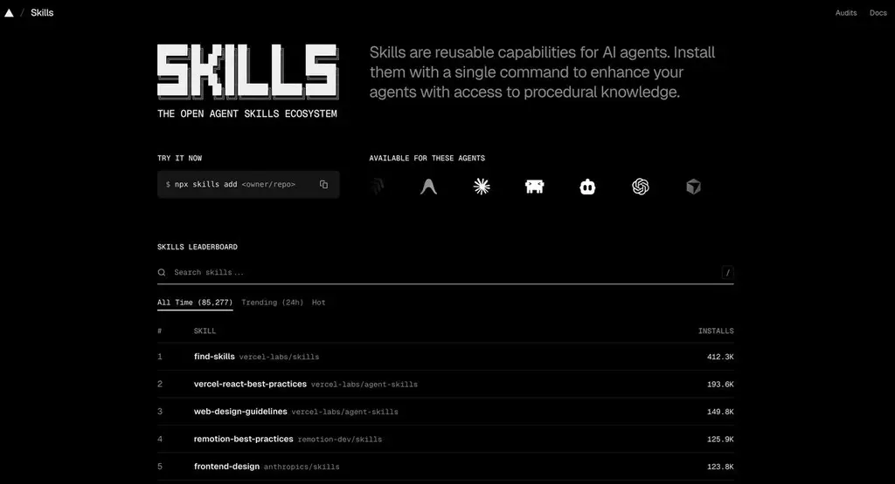

我们可以随便点击一个Skill看看。

点击这个叫 frontend-design 的Skill，查看详情

https://skills.sh/anthropics/skills/frontend-design

如果英文不好，我们可以直接问AI浏览器

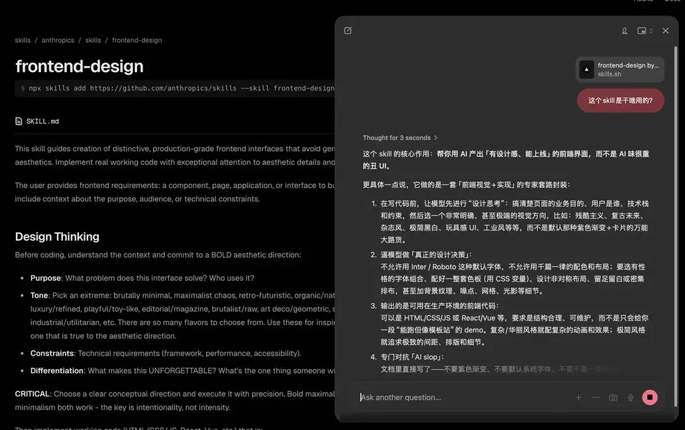

### 在 TRAE 里安装Skill

就用https://skills.sh/anthropics/skills/frontend-design 吧。

在TRAE里安装Skill非常容易， 尤其是当你学习了上一课、会使用浏览器MCP了。

我们直接告诉TRAE的AI即可

Plain Text

帮我全局安装这个Skill

https://skills.sh/anthropics/skills/frontend-design

就安装好了。

注意看AI的思考过程：TRAE其实有可能使用到我们的DevTools MCP，打开浏览器，查看安装方

式。

### 先爽一把

我们做一个非常简单的对比实验。

同一个问题，问两次。第一次，不用任何 Skill。第二次，启用 frontend-design Skill 之后再问。

### 💡注意：下面每次测试，请都用TRAE新建项目，在全新项目里测试！！

不要在已有项目里做无关测试。

实验一：没有 Skill 的时候

在 TRAE 里，打开一个新对话，什么 Skill 都不启用，然后输入：

不要使用skill，直接设计。

帮我写一个个人博客的首页，用 CDN版本 的 Tailwind CSS 做出单页面HTML

AI 会给你写出来一个页面。功能上没问题：有导航栏、有文章列表、有底部信息。代码也是对的，

能跑起来。

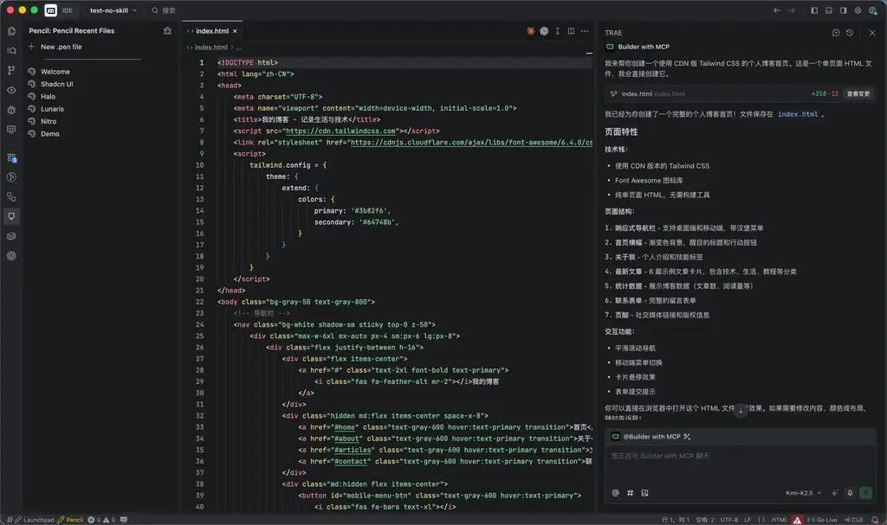

但你看着这个页面，心里会有一种说不清楚的感觉：它太"AI"了。

这不是 AI 不努力，也不是你的 Prompt 写得不够好。这是因为 AI 在没有任何设计指导的情况下，

会选择最"安全"的方案——也就是最普通、最不会出错、最没有个性的方案。

实验二：启用 frontend-design Skill 之后

同样的项目，同样的对话框，同样的问题，除了指定使用Skill，其他一字不差：

使用frontend-design Skill

帮我写一个个人博客的首页，用 CDN版本 的 Tailwind CSS 做出单页面HTML

这一次，你会看到明显不同的结果。

字体的选择变了。不再是默认的系统字体，而是有了明确的字体搭配——标题用一种更有个性的字

体，正文用易读性更好的字体。

行距和留白变了。元素之间的间距更合理，页面不再那么"挤"，有了呼吸感。

颜色变了。不再是默认的蓝白灰，而是有了一个明确的色彩方向，整体更有视觉风格。

布局变了。不再是最普通的上中下三段式，可能会有更有趣的排版方式。

整体看下来，你会觉得：这个页面像是一个有品味的人做的，而不是 AI 随手生成的。

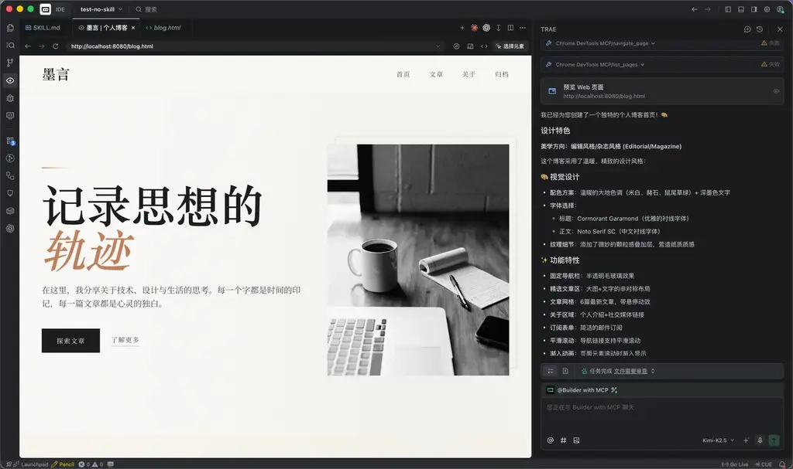

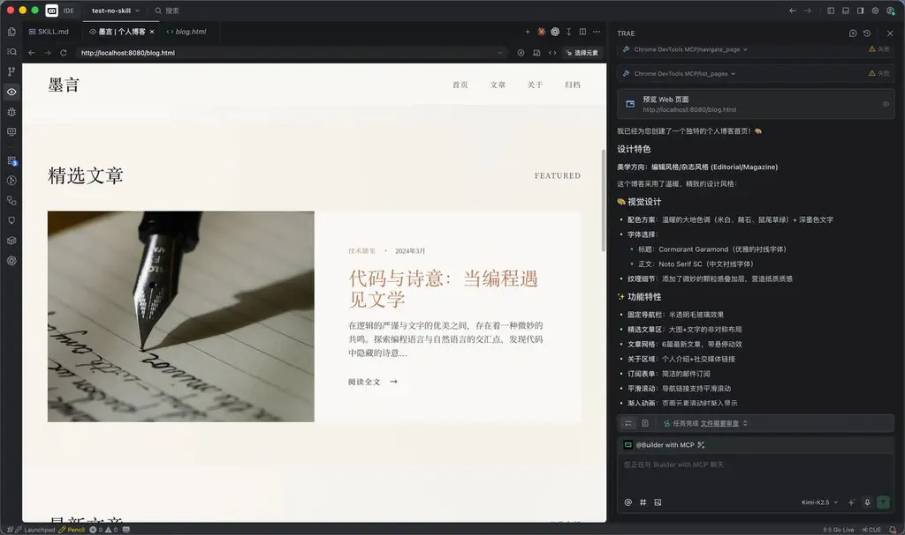

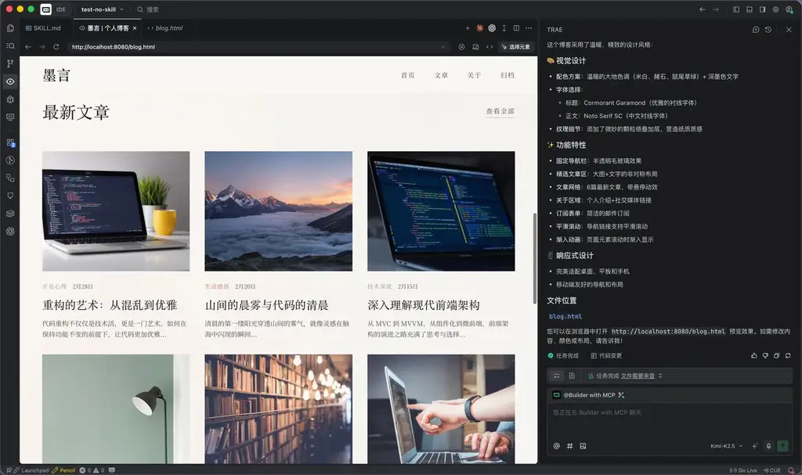

唯一的区别，是你启用了一个 Skill。

第三幕：发生了什么？

我们来解释一下刚才发生的事情。

frontend-design 这个 Skill，里面写的不是代码，不是什么技术配置，而是一份设计理念文档。

它告诉 AI：

• 什么叫好的前端设计（不是"能用"，是"好看"）

• 什么是视觉层级，什么是排版节奏

• 什么是留白，为什么留白很重要

• 怎么选字体，怎么搭配颜色

• 什么是"AI 味道"，为什么要避免它

• 在设计上应该有明确的美学立场，而不是什么都选最安全的

当你给 AI 一个前端相关的任务，它发现 frontend-design Skill 和这个任务相关，就会把这份文档

加载进来，然后在这套设计理念的指导下工作。

Skill 没有让 AI 更聪明，它只是给了 AI 一套明确的审美标准。

这就是 Skill 的本质：不是给 AI 更多能力，而是给 AI 更明确的方向。

### Skill 真正的价值，比好看更重要

frontend-design 的演示很直观，但我不希望你把 Skill 理解成"让页面好看的工具"。那太窄了。

### 💡Skill 真正的价值，是稳定性。

你现在用 AI 写代码，最大的痛点是什么？不是 AI 不会写，而是 AI 写得不稳定。

有时候它写得很好，有时候它随便发挥，有时候它用了你不想用的方式，有时候它绕过了你的规

范，有时候你觉得它昨天还挺懂你，今天突然不懂了。

这种不稳定，根本原因是 AI 在没有明确约束的情况下，有太多自由度。每次它都在"猜"你想要什

么，而猜的结果是不稳定的。

Skill 解决的正是这个问题。

你把你的规范、你的偏好、你的方法论写进 Skill，AI 就不用猜了。它有了明确的参考，行为就变得

可预测，输出就变得稳定。

这就是为什么那些真正在用 AI 做项目的团队，都会花时间写 Skill。不是为了让 AI 更聪明，而是为

了让 AI 更可靠。

### TRAE 官方推荐的十个 Skill，都在解决什么问题

我不打算逐一深讲每个 Skill，那会让这节课变成产品说明书。

但我想给你一张"地图"，让你知道这个生态里有什么，以后遇到问题知道去哪里找。

除了上面提到的https://skills.sh 以外，我们还可以关注TRAE 官方整理了十个研发场景里最常用的

Skill，见这里 https://docs.trae.cn/ide/top-10-recommended-skills-for-development-

scenarios

• frontend-design（Anthropic）专注于生成有独特美学风格的前端界面，避免千篇一律的"AI 风

格"，适合从零构建 UI 组件、完整 Web 应用，或对现有界面进行视觉重塑。 —— 这就是刚才我

们示例的那个。

• cache-components（Vercel）面向 Next.js 项目，自动将 PPR 和缓存组件最佳实践融入开发流

程，能智能决策渲染策略、自动注入缓存失效逻辑，让页面加载性能最优。

• fullstack-developer（Shubhamsaboo）扮演全栈专家角色，覆盖 React/Next.js 前端、

Node.js 后端、数据库设计、用户认证、第三方服务集成到部署上线的全链路开发任务。

• frontend-code-review（langgenius）专门审查前端代码（.tsx/.ts/.js），从代码质量、性能、

业务逻辑三个维度分析，输出分级报告（紧急问题 vs 改进建议），并精确标注文件路径和行号。

• code-reviewer（Google Gemini）通用代码审查工具，既能审查本地 git 变更，也能直接

Review 远程 PR，从正确性、可维护性、安全性、测试完整性等多维度给出结构化反馈，最终给

出"批准合并"或"要求修改"的明确结论。

• webapp-testing（Anthropic）基于 Playwright 的 Web 应用自动化测试工具集，能验证前端功

能、截图调试 UI 行为、采集控制台日志，支持前后端分离架构下的多服务联动测试。

• pr-creator（Google Gemini）自动化创建规范 PR，能检查分支状态、套用 PR 模板、运行预检

脚本（构建/测试/lint），确保每次提交符合项目标准，对新贡献者尤其友好。

• fix（Facebook）专门修复代码格式和 lint 错误。

• update-docs（Vercel）用于保持 Next.js 项目代码与文档同步，能分析代码变更影响哪些文

档、更新现有 API 文档，也能为新功能按规范模板快速生成脚手架文档。

• find-skills（Vercel Labs）帮你从 Agent Skill 生态中搜索和安装其他技能包，当你不确定有没

有合适的 Skill 可用时，用它来探索和发现，并直接输出一键安装命令。

你不需要现在把这十个 Skill 全部装上。

我一直有一个观点，在 MCP 那节课里我也说过：工具不是越多越好，遇到问题再找插头。

Skill 也是一样。现在你知道这些 Skill 存在，知道它们解决什么问题，等你在实际开发中遇到对应的

痛点，再去装对应的 Skill。

这才是正确的使用姿势。

### 在 TRAE 里使用 Skill 的方式

第一种：让 AI 自动判断

这是最常用的方式，也是 Skill 设计的初衷。你正常给 AI 下指令，它会自己判断当前任务和哪些

Skill 相关，自动加载并使用。你什么都不用做，Skill 就在后台默默工作。

比如你说"帮我写一个登录页面"，AI 发现 frontend-design Skill 和这个任务相关，就会自动加载

它，按照设计规范来生成页面。

第二种：手动指定 Skill （推荐）

虽然看上去麻烦一点，但这是推荐的方式。

当你明确知道要用某个 Skill，可以直接在对话里说：

"用 frontend-design Skill 帮我重新设计这个组件。"

或者：

"用 webapp-testing Skill 帮我给登录流程写测试。"

这种方式更精准，适合你已经很清楚任务类型、想确保 AI 一定用上某个 Skill 的场景。

### 全局 Skill 和项目 Skill，到底选哪个？

这是很多人装完 Skill 之后会卡住的问题。

答案其实很简单，你只需要问自己一个问题：

### 💡这个 Skill 是"我这个人的习惯"，还是"当前这个项目的规矩"？

如果是"我这个人的习惯"——比如你喜欢写有设计感的前端、你习惯用某种命名方式、你偏好某种代

码风格——那就装成全局 Skill。这样不管你打开哪个项目，AI 都会按照你的习惯来。

如果是"当前这个项目的规矩"——比如这个项目用了特定的技术栈、有特定的业务逻辑约束、有特定

的数据库结构——那就装成项目 Skill。这样只有在这个项目里，AI 才会按照这套规矩来，不会污染

到其他项目。

拿 frontend-design 来说：如果你所有项目都希望有好的设计感，那就装成全局的。如果你只有某

个特定项目需要这套设计规范，那就装成项目级的。

没有绝对的对错，根据你的实际情况判断就行。

### 不止 TRAE：Skill 是一个开放标准

讲完了怎么在 TRAE 里用 Skill，我想花一点时间说一件更大的事。

Skill 不是 TRAE 独家发明的功能。

它背后有一套开放标准，叫 Agent Skills，是 Anthropic 在 2025 年推出的。这套标准定义了

SKILL.md 文件的格式和规范，目的是让 Skill 可以在不同的 AI 工具之间通用。

这意味着什么？

意味着你今天在 TRAE 里装的 frontend-design Skill，同样可以用在 Claude Code 里。如果你在

用 Cursor，它也支持这套标准。Codex CLI 支持。Gemini CLI 支持。

这就像 USB 接口的统一——你买了一个 USB 设备，不用担心这台电脑能不能用，因为大家都遵守

同一套标准。

对你来说，这个信息有两层意义：

第一层，你在社区里找到的 Skill，大概率可以直接在 TRAE 里用，不需要做任何改造。因为大家写

Skill 都遵循同一套格式。

第二层，你以后如果自己写了一个 Skill，它不只是"你的 TRAE 专属配置"，而是可以分享给任何

人、用在任何支持 Agent Skills 标准的工具上的东西。你在给整个 AI 开发生态做贡献。

### 如果你想自己写一个 Skill，在 TRAE 里就能做

讲完了"用 Skill"，我们来看看"写 Skill"。

最快的方式：直接跟 AI 说

TRAE 支持一种最懒的写法：你直接在对话框里告诉 AI，你想要一个什么样的 Skill，它帮你生成。

比如你可以这样说：

创建一个新的Skill，项目级的Skill

技能名字： 文案去掉AI味儿

技能作用： 每次我们写文案的时候，都要尽可能去掉AI味儿，使用适合00后的语言风格。

AI 会根据你的描述，自动生成一个 SKILL.md 文件，放到对应的目录里。你不需要自己动手写任何

东西。

这是最适合入门的方式。你先把想法说出来，让 AI 帮你把它变成 Skill，然后再慢慢打磨。

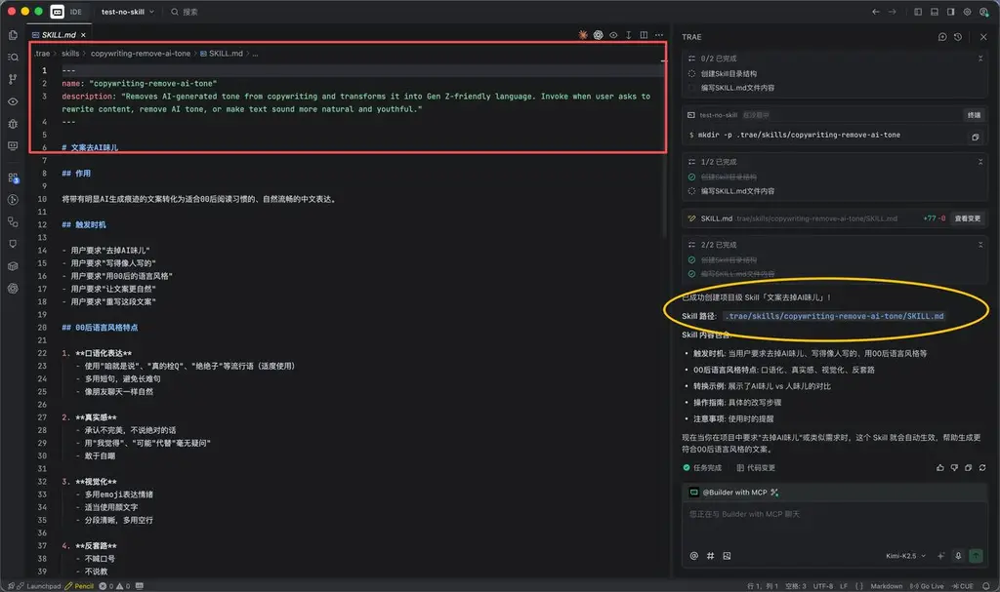

稍微正式一点：在设置里手动填

### 💡注：我并不推荐新手使用这个方式，有点麻烦，不自由

如果你想更清楚地控制 Skill 的内容，也可以走图形界面：

进入 设置 → 规则和技能 → 技能，点击"创建"，选择"手动填写"。

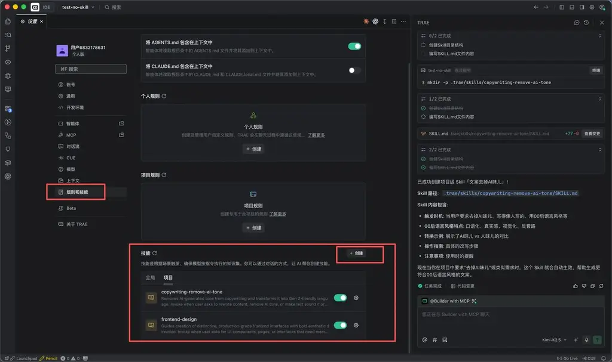

你需要填三个东西：

技能名称——给这个 Skill 起个名字，简短、有辨识度就行。比如 honghong-reply-style。

描述——这一栏非常关键，很多人填得太随意，结果 Skill 根本不触发。描述要写清楚两件事：这个

Skill 是干什么的，以及什么情况下应该用它。不要只写"帮助写回复"，要写"当用户需要为哄哄模拟

器生成对话回复内容时，按照温柔、口语化的风格输出"。AI 就是靠这段描述来判断要不要加载这

个 Skill 的。

指令——这是 Skill 的核心内容，告诉 AI 遇到这类任务时，具体要怎么做。可以写风格要求，可以

写禁止事项，可以写步骤，可以写示例。

填完点确认，Skill 就创建好了。对于项目技能，TRAE 会自动在你的项目里创建 .trae/skills/你的技

能名/SKILL.md 文件。

写 Skill 最容易踩的一个坑

官方文档里有一句话，我觉得说得很准，值得单独拿出来讲：

Skill 越复杂越强大，这是误区。

很多人第一次写 Skill，恨不得把所有要求都塞进去——风格要求、禁止事项、处理流程、边界条

件、异常情况……结果写了一大段，Skill 反而不好使了。

原因很简单：AI 的上下文窗口是有限的，每个被加载的 Skill 都在占用这个空间。Skill 写得太复

杂，AI 在理解它本身上就要花很多力气，反而容易搞混，或者在不该触发的时候触发，在该触发的

时候又没触发。

正确的做法是：一个 Skill 只做一件事。

如果你有三个不同类型的规范，就写三个 Skill，每个 Skill 只管自己那一块。职责单一、边界清晰

的 Skill，才是真正好用的 Skill。

这一点，等你开始自己写 Skill 之后，会越来越有体会。

写 Skill 不是一次就能写好的

最后强调一件事：

### 💡写Skill不是一次就能写好的！ 需要反复调试。

你第一次写的 Skill，大概率不会完美。它可能触发得不够准，可能指令写得太模糊，可能在某些情

况下 AI 理解错了你的意思。这很正常。

Skill 的开发是一个迭代的过程。你写出来，用一用，发现哪里不对，改一改，再用，再改。每次改

完，你对"怎么跟 AI 沟通规范"这件事的理解就深一层。

TRAE 官方给出的建议是：先不用 Skill，让 AI 直接做任务，观察它哪里发挥不稳定、哪里总是跑

偏。那些反复出问题的地方，才是真正值得写 Skill 的地方。

不要在没有真实痛点的情况下提前写 Skill。先用，遇到问题，再写。

这和我们学 MCP 的逻辑是一样的：遇到问题，再找插头。

### 这节课真正想让你记住的三件事

第一件事：Skill 是写给 AI 的长期工作说明书，不是一次性的 Prompt。

Prompt 解决"这次任务怎么做"，Skill 解决"这类任务永远怎么做"。两者不是替代关系，而是分工关

系。

第二件事：Skill 的核心价值是稳定性，不是能力。

AI 已经很有能力了，它缺的是方向感和一致性。Skill 给了 AI 明确的方向，让它的输出从"随机发

挥"变成"按规矩来"。这对真正做项目来说，比任何新功能都重要。

第三件事：先用，再写。

在你自己写 Skill 之前，你需要先用几个现成的 Skill，感受一下它是怎么工作的，感受一下有 Skill

和没有 Skill 的区别。等你真的感受到"这个 Skill 不够用，我需要一个更符合我项目的版本"的时

候，你就有了写 Skill 的真实需求，写出来的东西才会真正有用。

### 作业

## 1. 在 TRAE 里安装 frontend-design Skill，完成对比实验。

用同一个 Prompt，先不启用 Skill 生成一次，再启用 Skill 生成一次，感受一下区别。不用是博客首

页，任何一个前端页面都行，用你自己的哄哄模拟器的某个界面也可以。

## 2. 尝试安装和使用其他的Skill

3. 在你现有的工作流程里，找一条你最想让 AI 永远记住的SOP，改写成Skill，并完成测试。

## 二十五、期中考试：使用TRAE和外部API，重做"纸片人男友"

### 这次和之前的版本有什么不同？

恭喜你，所有的积木已经凑齐！

我们来一次期中考试吧！重做“纸片人男友”！

在"难度再次升级！从零打造纸片人男友"那节课里，你做出了第一个版本。它能聊天、能说话、能发

照片，三块积木全部到齐。但那个版本是在扣子编程的保护下完成的——API是内置的，部署是托管

的，你不需要操心任何基础设施，拎包入住就能开始做产品。

更重要的是，那个版本做得很粗糙。对话逻辑是随手设计的，角色没有记忆，每次生成的照片风格

飘忽不定，用户甚至不需要登录。它更像一个能跑起来的原型，而不是一个真正的产品。当时的目

标是"学会用三块积木"，所以产品本身的质量不是重点。

这次不一样。你要从零开始，在自己的本地环境里，用外部API，重新做一个更完整、更认真的版

本。技术上更复杂，但产品上也要更用心——这两件事，这次都要同时做到。

### 期中考试要求

必须实现的功能

到外部市场寻找API

### 1.0版本我们使用扣子编程内置的API，这次需要改成全部使用外部API。

用户登录系统

用户需要注册账号才能使用产品。这个需求你在前面的课程里已经做过了：用数据库记录用户信

息，支持邮箱注册和登录。实现逻辑你已经熟悉，这次直接复用就好，不需要重新发明轮子。

如果你有余力，可以用BetterAuth接入Google或其他社交媒体登录。

BetterAuth是一个现代化的Auth库，配置比自己手写要简单很多，而且接入社交登录之后，用户注

册的摩擦感会大幅降低——这在真实产品里是非常重要的转化率优化。有余力的同学可以把这个作

为进阶挑战。

认真设计的对话逻辑

这是这次最需要你花心思的地方，也是这次和1.0版本最本质的区别。

### 1.0版本的系统Prompt是随手写的，角色没有真实的性格，对话没有层次感，用户聊几句就会觉得无

聊。

这次，在动手写代码之前，先认真坐下来想清楚这几个问题：

• 你的角色是什么样的人？

• 他的成长背景是什么？

• 他说话的语气是温柔体贴，还是带点傲娇？

• 他有什么口头禅？

• 他会在什么情况下主动关心用户，又会在什么情况下表现出小情绪？

• 他对用户说"我爱你"的门槛是高还是低？

这些细节，决定了产品有没有灵魂。一个让用户真正愿意每天打开的陪伴产品，靠的不是技术，靠

的是角色设计。技术只是载体。

建议你在写代码之前，先花半个小时，把角色的人设文档写出来，就像给一个虚构人物写小传一

样。然后再把这份人设转化成系统Prompt。这个顺序不要颠倒。

角色一致性的照片

### 1.0版本里，可能每次生成的照片角色长相都不一样。这不是你的问题，这是"文生图"模式的天然局

限——你每次给模型一段文字描述，它每次都会重新理解、重新生成，结果自然不稳定。

这次你要换一种思路。核心逻辑是：用图生图，而不是文生图。

具体做法是：先生成（或上传）一张角色的"基准照片"，作为角色的视觉锚点存在数据库里。之后每

次生图，都把这张基准照片作为参考图传给模型，让模型在这张图的基础上，生成角色在新场景下

的照片。这样，角色的外貌、气质、风格都会以基准图为参照，一致性会大幅提升。

seedream-5和nano banana 2都原生支持图生图模式，是推荐的首选。

在Postman里先把图生图的API调通，确认参数格式，再接入代码。我们前面课程实验“虚拟试衣”的

时候，已经向你展示过做法了。

记忆功能

这是让产品从"聊天机器人"变成"真正的陪伴"的关键功能。

角色需要记住用户告诉他的关键信息：生日、爱好、喜欢的食物、最近在经历什么、重要的纪念

日。下次用户打开对话，角色能自然地提起这些事情，而不是每次都像第一次见面。

实现思路是：在数据库里设计一张专门的"用户画像表"，字段可以很简单，就是一个键值对的结构

（比如key: "生日", value: "3月15日"）。在每次对话结束后，让LLM分析这段对话，判断用户是否透

露了新的关键信息，如果有，就写入这张表。下次对话开始时，把这张表里的内容拼接进系统

Prompt，让角色"记得"这些事情。

AI产品如何解决记忆问题，Github上已经有了相当多成熟的开源类库。有余力的同学可以借助AI的帮

助，找到它们、使用它们。

部署上线

代码托管在GitHub，产品部署到Vercel。这是这次毕业项目的硬性要求——你必须有一个真实可访

问的链接，而不只是在本地跑起来了。

本地能跑和真正上线，是两件完全不同的事。上线之后你才会遇到真实的问题：环境变量怎么在

Vercel里配置，数据库连接字符串怎么处理，构建失败了怎么看日志。这些问题在本地永远不会出

现，但在真实产品里是家常便饭。

进阶项

完成了必须项，还有时间和精力，可以挑战以下方向：

1. 语音功能。 接入外部TTS API，让角色用声音回复，而不只是文字。回顾一下"难度再次升级"那

节课里TTS的实现逻辑，这次换成外部API来做，流程和"去API超市进货"那节课里讲的完全一

样：先在Postman验货，再接入代码。

2. 对话历史回顾。 用户可以翻看和角色的完整聊天记录，像微信一样按时间线排列。这个功能本身

不难，但会让你练习分页查询和时间线UI的实现。

3. 购买独立域名。 Vercel给你的默认域名能用，但不够有产品感。在Namecheap或阿里云买一个

域名，在Vercel的项目设置里绑定，改几条DNS记录，十分钟搞定。.xyz或.app后缀比.com便宜

很多，适合练习项目。给自己的产品配一个真正属于自己的地址，是从"我在练习"到"我在做产

品"的心理分水岭。

4. BetterAuth社交登录。 接入Google或微信等社交媒体登录，让用户一键注册，大幅降低注册门

槛。

挑战项

1. 角色主动发消息。 这个功能在网页端有一个根本性的障碍：浏览器的连接是被动的，用户不开网

页，服务器就没有办法主动推消息过去。但有一个很好的替代方案：用Cron Job定时触发，通过

Resend的邮件API给用户发一封邮件(或者给用户通过手机号发短信），说"你的男友想你了，快来

聊聊"，用户点击链接进入对话。这个方案技术上非常成熟，而且让你第一次接触到"触达用户"这

个概念——在真实产品里，如何让用户想起你、回来用你，是一个和技术同等重要的产品问题。

2. 角色情绪系统。 在数据库里维护一个隐藏的"好感度"数值，根据用户的聊天内容动态变化，影响

角色的回复语气和发照片的频率。好感度高的时候，角色更主动、更温柔；好感度低的时候，角

色会表现出疏离感。这需要你设计LLM的Prompt来感知情绪变化，并实时更新数据库里的状态

值。

3. 分享卡片功能。 把和角色的某段对话或某张照片，生成一张可以发朋友圈的图片卡片。这和课程

标题完美呼应——让你的闺蜜看到，才算真正做出来了。这个功能还有一个隐藏价值：它是产品

自传播的入口，做得好的话，用户会自发帮你拉新。

## 4. 微信登录。如果你想要尝试微信登录，那也可以试试，不过要求你需要部署到国内、并且域名备

案，无法使用Vercel部署了。

### 开始之前，再次强调

在你打开TRAE、写第一行代码之前，先做这三件事，会让后面的开发顺很多。

第一，在GitHub建好仓库，再开始写代码。 不要先写代码再想着去管理，这个顺序很重要。用

GitHub管理代码那节课里学的习惯，从第一个commit就开始执行。

第二，给这个项目写一个专属Skill。 把技术栈、角色的基本人设、图像生成时固定使用的角色描述

词模板、你的代码风格约定，全部写进去。这是"给AI写一份上岗SOP"那节课的真正毕业考——不是

安装别人写好的Skill，而是为自己的项目从头写一份。写完之后，TRAE每次帮你写代码，都会自动

遵循这份约定，你不需要每次重新交代。

第三，在Postman里把每一个外部API验通，再接入代码。 图像生成API、TTS API，每一个都先单

独跑通，确认入参出参符合预期，构造好API四要素，保存下来。再开始写集成代码。这个顺序能帮

你把"API本身的问题"和"代码集成的问题"分开，出错的时候更容易定位。

### 时间安排

建议你抽一整个周末，把它当成一次黑客松来做。

不要把这件事分散在零碎的时间里，那样你永远进入不了状态。周五晚上把环境配好、仓库建好、

Skill写好。周六周日全力开发，给自己一个硬性deadline：周日晚上必须部署上线，哪怕功能还不完

整。一个上线了的残缺产品，比一个本地完美运行的产品更有价值——因为前者是真实的，后者只

是练习。

遇到卡壳的地方，先让TRAE帮你分析。前端报错看不懂，用DevTools MCP直接读浏览器控制台，

让TRAE看到真实的报错而不是截图。某个框架的新特性不知道怎么写，用Context7拉最新文档，避

免TRAE给你过期的代码。数据库查询逻辑想验证，用PostgreSQL MCP直接用中文查。这些工具你

都学过了，现在是真正用起来的时候。

### 作业

完成纸片人男友2.0，部署到Vercel，代码托管在GitHub。在课程群里发出你的Vercel链接，把产品

发给你身边的朋友用，让真实的用户告诉你这个产品好不好玩。

对了，这个题材的产品，是比较容易商业化的。陪伴类AI产品在全球范围内都有非常强的付费意愿

和续费意愿（都谈上恋爱了，如果不续费，那可就就分手了……），已经有很多独立开发者靠这类

产品实现了盈利。你现在做的这个毕业项目，和市面上真实在跑的产品，差距没有你想象的那么

大。技术上你已经具备了，产品上你认真设计了，剩下的就是真正做出来，发出去，让人用。

加油！

## 二十六、上线后，如何根据用户行为迭代产品？

### 前言

产品上线了。你在朋友圈发了一条"我的第一个独立产品上线了！"，收获了一堆点赞。

然后呢？

然后你打开后台，看着一片空白，不知道接下来该干什么。

大多数人在这个阶段会做同一件事：等。等用户来，等反馈来，等着看有没有人付款。

但有一类人不一样——他们在产品上线的第一天，就开始像侦探一样盯着用户的每一个动作。用户

从哪里来？在哪个页面停了最久？在哪里皱了眉头、关掉了标签页？

这两种人，三个月后的产品，会是完全不同的结果。

好的产品不是设计出来的，是迭代出来的。而迭代的依据，是用户的真实行为数据——不是你的猜

测，不是你朋友的感觉，是数据。

这一节，我们就来讲清楚：产品上线之后，你应该看哪些数据，用什么工具，怎么看。

### 💡了解用户行为 = 掌握迭代产品的依据

### 一、网站统计数据指南：小白必读

作为网站产品拥有者，了解你的用户如何与网站互动至关重要。

先说一个很多人都有的误区：流量大 = 产品好。

不对。

流量大只说明你的推广做得不错，或者你运气好被某个大号转发了。但用户进来之后，有没有留下

来？有没有真的用你的产品？有没有完成你希望他们完成的动作？这才是关键。

所以，在你打开任何统计工具之前，你需要先搞懂几个核心指标的含义。

访客数量（Unique Visitors）​，是在特定时间段内访问你网站的不同用户数量。一个用户无论访问

多少次，都只算一个独立访客。这是最基础的指标，直接反映你的受众规模。

但这个数字本身意义不大，真正有意义的是它的增长趋势。稳定增长的曲线，比短期飙升更健康。

短期飙升可能只是一次推广活动的效果，曲线回落之后一切归零；而稳定增长，说明你的产品有真

实的口碑在传播。

这里有一组行业参考数字，帮你建立坐标系：

• 靠 AdSense 广告挣到每月 1 万美元：需要约 100 万月访客

• 靠订阅模式挣到每月 1 万美元：需要 10 万～30 万月访客（且以发达国家用户为主）

• 能"上牌桌"的 AI 产品：月访客 100 万以上

• 腰部 AI 产品：月访客 300～500 万

• 细分品类头部 AI 产品：月访客 1000 万以上

你现在在哪里？离目标还有多远？这组数字不是用来打击你的，是用来帮你校准预期的。

网站产品重要指标

跳出率（Bounce Rate）​，是只浏览一个页面就离开网站的访客百分比。这个数据有一个很多人不

知道的秘密：搜索引擎非常在意它。如果你的用户总是看了一页就走，Google 会认为你的网站没能

满足用户需求，然后悄悄减少分配给你的自然流量。

行业基准是：优秀在 20%~40%，平均在 40%~60%，超过 70% 就需要认真反思了。当然，单页

网站或博客文章例外——用户看完就走本来就是正常的。

平均会话时长（Average Session Duration）​，是用户在你网站上停留的平均时间。搜索引擎同样

非常在意这个数字，因为用户停留越久，越证明你的内容有价值。优秀的网站平均会话时长在 5 分

钟以上，游戏类网站甚至可以做到 8 分钟以上；平均水平是 3 分钟；不到 1 分钟，基本可以判定内

容或体验出了问题。

页面浏览量（Pageviews）​ 和 每次会话页面数（Pages Per Session）​，前者是总量，后者是质

量。每次会话页面数超过 3 页算优秀，低于 2 页需要改进。这两个数字结合来看，能帮你判断用户

有没有深入探索你的产品，还是进来转了一圈就出去了。

试一试

了解完上面的基本术语之后，我们来一个实操，试试：

请你点击这里——这是 plausible 官方网站的统计数据。数据是公开的。

https://plausible.io/plausible.io

请在这个链接里，熟悉刚才我们提到的指标术语，找找感觉。

除了上面提到的这些指标外，

以下还有一些网站产品统计上的术语，我也列出来：

其他指标

## 1. 访客数量（Unique Visitors）

含义：在特定时间段内访问您网站的不同用户数量。一个用户无论访问多少次，都只被计为一个独

立访客。

为什么重要：这是最基础的指标，直接反映了您网站的受众规模和吸引力。

行业基准：

• 可以只靠 Adsense 广告挣到每月 1 万美元：每月 100 万访客左右

• 靠订阅挣到美元 1 万美元：每月 10 万～30 万访客（发达国家访客为主）

• 可以上牌桌的 AI 产品：每月 100 万访客以上

• 腰部 AI 产品：每月 300～500 万访客

• 细分品类的头部 AI 产品：每月 1000 万以上访客

建议：关注访客数的增长趋势比单一数字更有意义。稳定增长的曲线通常比短期飙升更健康。

## 2. 跳出率（Bounce Rate）

含义：只浏览一个页面就离开网站的访客百分比。

注意：搜索引擎很喜欢这个数据！搜索引擎喜欢把流量优先给优质网站。如果某个网站用户总是看

了一页就走了，搜索引擎会倾向于认为它不是一个优秀网站。

为什么重要：高跳出率通常表明访客没有找到他们想要的内容，或网站体验不佳。

行业基准：

• 优秀：20-40%

• 平均：40-60%

• 需改进：70%以上

例外情况：对于单页网站、博客文章或查询特定信息的页面，高跳出率是正常的。

建议：改善导航、内容相关性和页面加载速度可降低跳出率。

## 3. 平均会话时长（Average Session Duration）

含义：访客在您网站上停留的平均时间。

注意：搜索引擎很喜欢这个数据！因为用户平均时长越久，越证明你是一个优质网站。搜索引擎喜

欢把流量优先给优质网站。

为什么重要：较长的会话时间通常意味着用户对内容感兴趣，参与度高。

行业基准：

• 优秀：5 分钟以上。个别特殊类别网站甚至可以做到 8 分钟以上（如游戏网站）

• 平均：3 分钟

• 垃圾站：不到 1 分钟

建议：有吸引力的内容、易于导航的设计和内部链接可以延长会话时间。

## 4. 页面浏览量（Pageviews）

含义：网站所有页面被浏览的总次数。

为什么重要：反映网站整体流量和内容吸引力。

建议：结合其他指标分析，单纯的高页面浏览量可能是由少数访客频繁刷新或浏览造成的。

## 5. 每次会话页面数（Pages Per Session）

含义：访客在一次访问中平均浏览的页面数量。

为什么重要：高数值表明访客深入探索了您的网站，对多个页面感兴趣。

行业基准：

• 优秀：3 页以上

• 平均：2-3 页

• 需改进：低于 2 页

建议：优化内部链接、相关内容推荐可以提高此指标。

## 6. 流量来源（Traffic Sources）

含义：访客如何找到您的网站，例如搜索引擎、社交媒体、直接访问等。

注意：优秀的网站，来自自然搜索流量往往会超过 30%，来自社交媒体的流量往往会稳定超过

20%。

为什么重要：帮助您了解哪些渠道为网站带来最多的访客，从而优化营销策略。

常见来源类型：

• 自然搜索：通过搜索引擎找到您网站的访客

• 付费搜索：通过付费广告点击进入

• 社交媒体：从 Facebook、Twitter 等平台来的流量

• 直接访问：直接在浏览器中输入您的网址

• 引荐流量：从其他网站链接点击进入

建议：不要过于依赖单一流量来源，分散流量渠道可以降低风险。

## 7. 转化率（Conversion Rate）

目前我们不涉及，进阶课程再讲。但是你先记住：它很重要。我们可以为每个行为，建立转化率分

析。依次优化每个重要行为的转化率。

含义：完成特定目标（如购买、注册、下载）的访客百分比。

为什么重要：直接反映网站的商业效果和用户行为目标达成情况。

行业基准：

• 订阅付费率：

◦如果是自然流量，中位数 0.5%，超过 2%为优秀。

◦如果是投放流量，可以做到 2%～ 8%，视广告精准程度、产品力决定。

• 邮件列表收集率：

◦2%~ 5%

• 电商网站购买率

◦2%左右

建议：即使小幅提高转化率也能带来显著的收益增长。关注用户体验和清晰的行动号召。

## 8. 退出率（Exit Rate）

含义：特定页面作为访问的最后一个页面的百分比。

为什么重要：高退出率的页面可能存在问题，或者是自然的离开点。

建议：分析高退出率页面是否属于购买确认页、联系页等自然结束点，或是存在问题需要优化。

## 9. 新访客与回访者比例

含义：首次访问与再次访问网站的用户比例。

为什么重要：帮助了解网站吸引新访客和留住老访客的能力。

行业基准：

• 新访客：40-60%

• 回访者：40-60%

建议：健康的网站应该既能吸引新访客，又能保持回访者的忠诚度。

## 10. 设备类型分布

含义：访客使用的设备类型（手机、平板、电脑）百分比。

为什么重要：帮助确保网站在所有设备上都能良好显示。

行业趋势：

• 移动设备：50-70%

• 桌面设备：25-45%

• 平板电脑：5-10%

建议：确保您的网站采用响应式设计，在所有设备上都有良好体验。

## 11. 热门页面（Top Pages）

含义：访问量最高的网页。

为什么重要：帮助识别最受欢迎的内容，指导未来内容创作方向。

建议：分析这些页面的共同点，了解哪些内容最吸引访客。

## 12. 地理分布

含义：访客来自的国家/地区。

为什么重要：帮助了解目标受众的地理位置，优化本地化策略。

建议：根据主要访客地区调整内容、语言和促销活动。

### 二、如何统计用户数据

数据要有地方收集，才能有地方看。

常见的网站数据统计平台

### 💡下面所有平台，只选1个就好。

Google Analytics

• https://analytics.google.com/

• 免费

Google Analytics发布了Google Analytics V4，简称为GA4或GAv4，正在取代 Universal

Analytics。

访问 https://analytics.google.com/analytics，创建用户

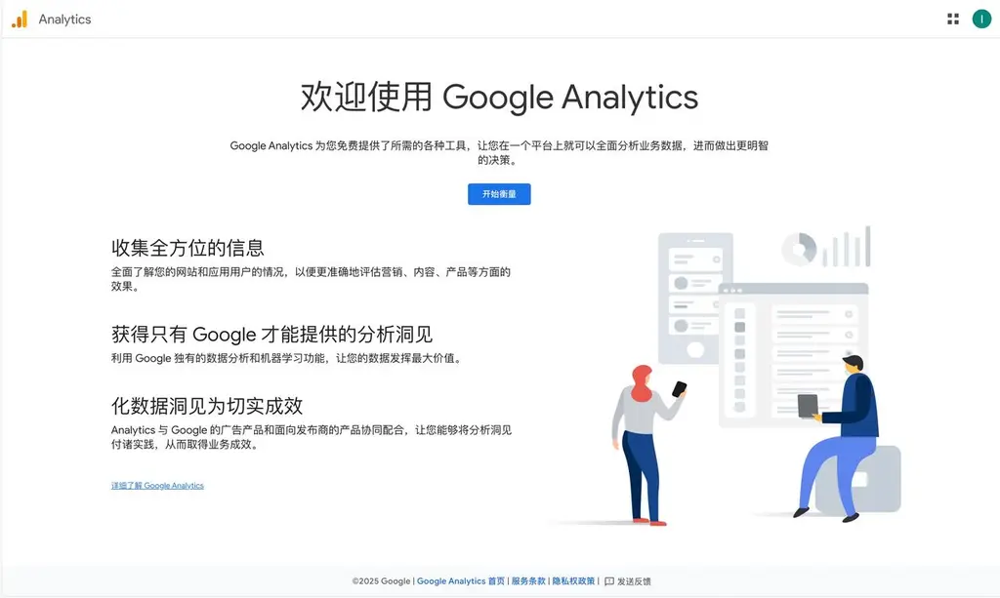

填写账号名称填写埋点名称，币种可选人民币

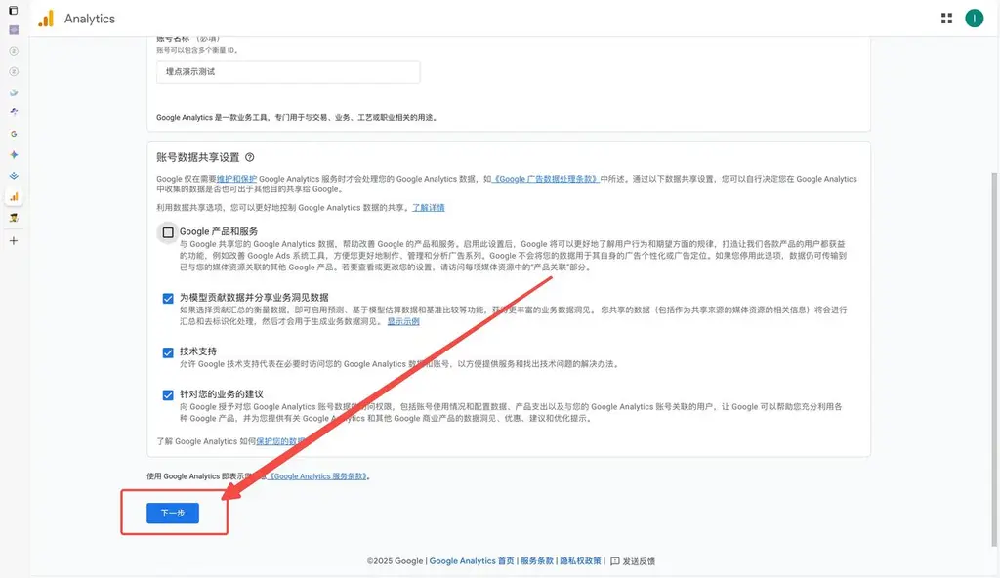

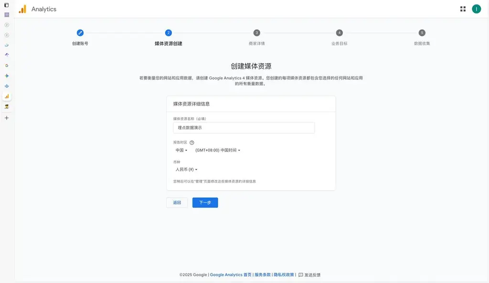

选择类别选择业务目标

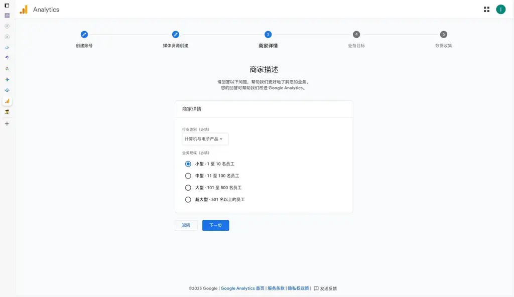

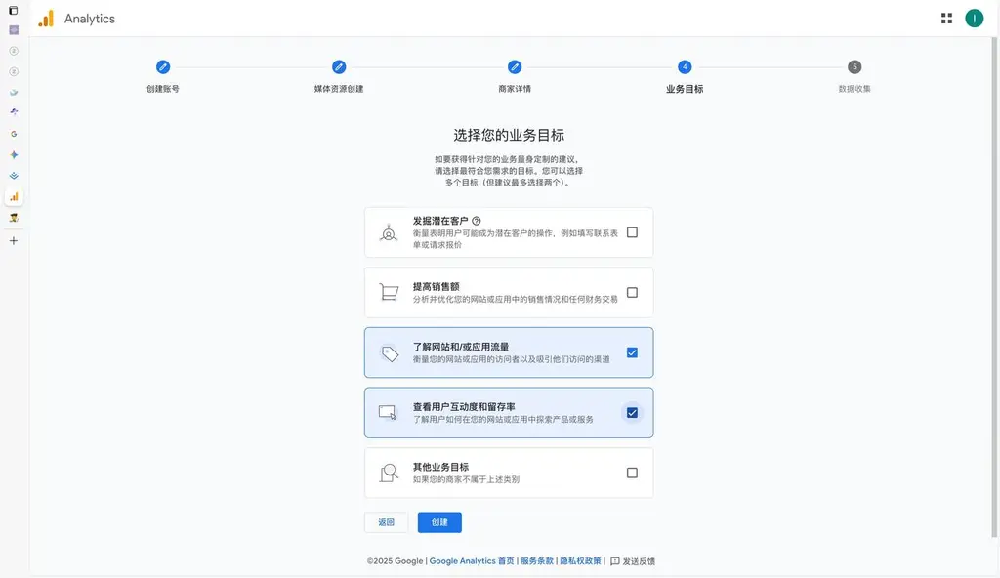

选择平台填写网站链接方法

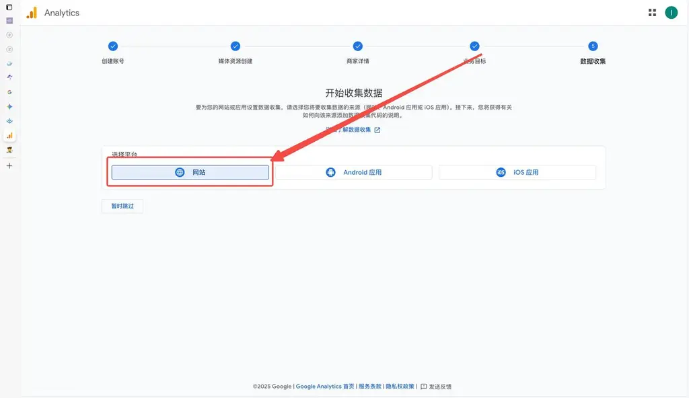

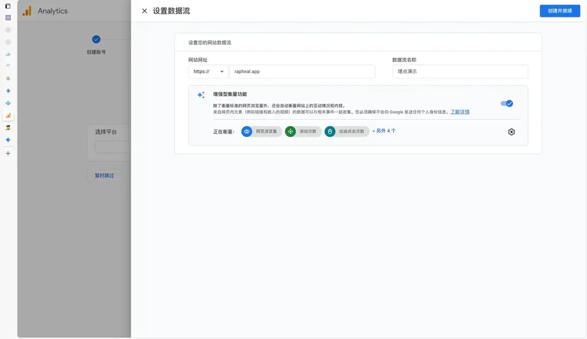

点击下一步在项目中添加代码

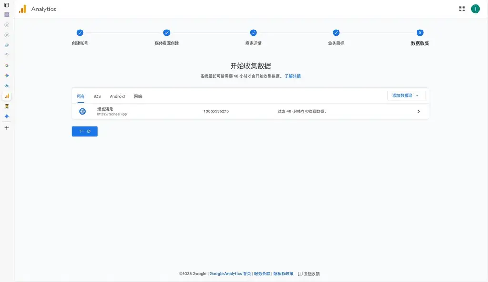

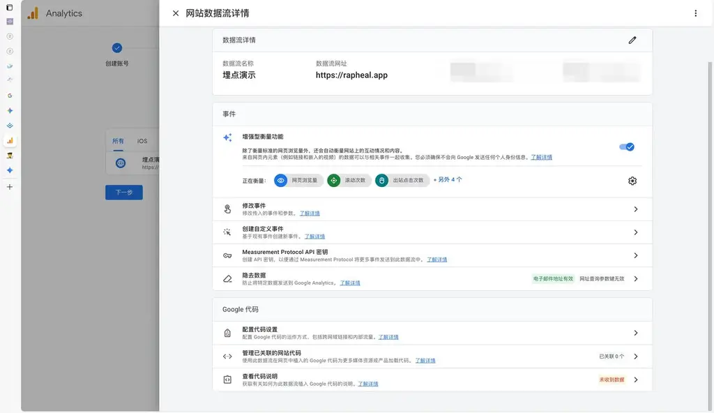

复制代码到网站中，即可接入

二十分钟之后实时数据生效，次日对首页的分析生效。

Plausible

https://plausible.io/

前两个月免费，整体而言是收费的

不过，Plausbile 是一个开源产品，你也可以用自己的服务器部署它，从而就完全免费了。

GA4 当然强大，但对于刚上线的独立产品来说，它有两个问题：一是配置复杂，学习曲线陡峭；二

是它要把你的用户数据共享给 Google，用于广告系统，隐私上存在争议，在欧洲很多国家甚至有合

规风险。

Plausible 是一个轻量级的替代方案。它的统计脚本只有 1KB，比 GA 的脚本小 45 倍，对网站加载

速度几乎没有影响。它不使用 Cookie，不收集任何个人身份信息，完全符合 GDPR、CCPA 等隐私

法规。最重要的是，它的界面极其简洁，打开就能看懂，不需要花一周时间学怎么用。

Plausible 的仪表盘会展示你需要的所有核心指标：独立访客数、页面浏览量、跳出率、会话时长，

以及流量来源（用户从哪里来）、热门页面（用户最多看哪些页面）、地理分布（用户在哪个国家）、

设备类型（手机还是电脑）。

它还有一个很好用的功能：公开统计数据。你可以把你的 Plausible 数据面板设置为公开，让所有人

都能看到你的真实流量数字。

OpenPanel

• https://openpanel.dev/

• •对用户很少的情况，提供免费版本。整体而言是收费的

• 不过，OpenPanel 也是一个开源产品，你也可以用自己的服务器部署它，从而就完全免费了。

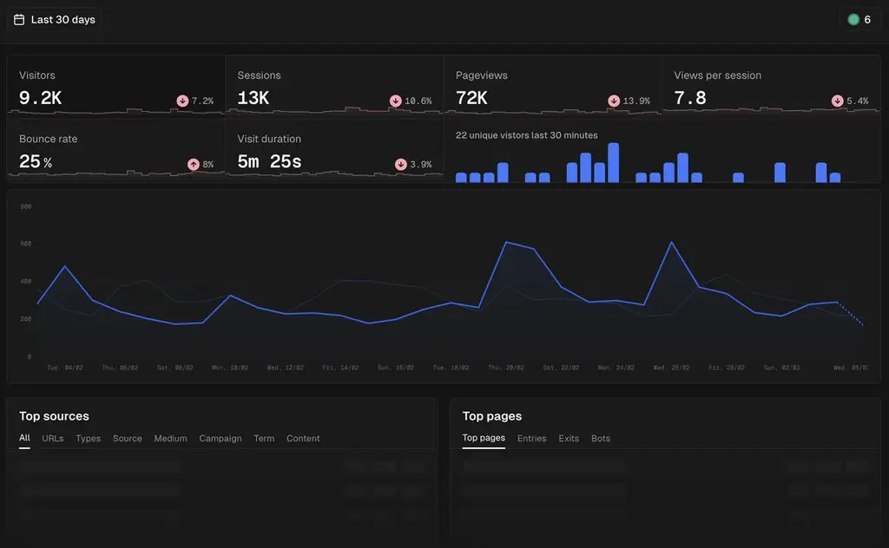

### 三、查看用户行为录像

数字告诉你"发生了什么"，录像告诉你"为什么会这样"。

这是两件完全不同的事。

假设你的 Plausible 数据显示，有一个页面的跳出率高达 80%。数字本身不会告诉你原因——是页

面加载太慢？是按钮找不到？是文案让用户看不懂？是手机端布局乱掉了？你不知道。

但如果你能回放一个真实用户在这个页面上的操作录像，三分钟之内你就会知道答案。

这就是 Microsoft Clarity 的用武之地。

Clarity 是微软推出的免费用户行为分析工具，永久免费，无流量上限——不管你的网站每月有一千

次访问还是一百万次，都能完整记录，不需要付费升级。这一点比市面上大多数竞品（比如

Hotjar，免费版每天只能记录有限数量的录像）要慷慨得多。

Clarity 的录像功能会完整记录每一个用户在你网站上的操作：鼠标移动轨迹、点击位置、页面滚动

行为、表单填写过程。你可以像看视频一样，完整回放一个真实用户的访问过程。当然，用户输入

的密码、信用卡号等敏感信息会被自动屏蔽，不会被记录。

集成 Microsoft Clarity

https://clarity.microsoft.com/

登录后，

新建项目

选择手动安装

复制代码，粘贴给任何一个AI编程工具，告诉它：

Plain Text

请帮我整站我安装Microsoft Clarity

{粘贴刚才复制的打码}

安装好以后，记得部署。

部署上线后，一旦有用户开始访问你的网站，

稍等一会儿，就能看到数据了。

观看录像

你可以在 Clarity 的筛选器里专门调出包含这些行为的录像，集中观看，效率极高。一个下午看完二

十个"愤怒点击"录像，你对产品问题的理解，可能比做十次用户访谈还要深。

。

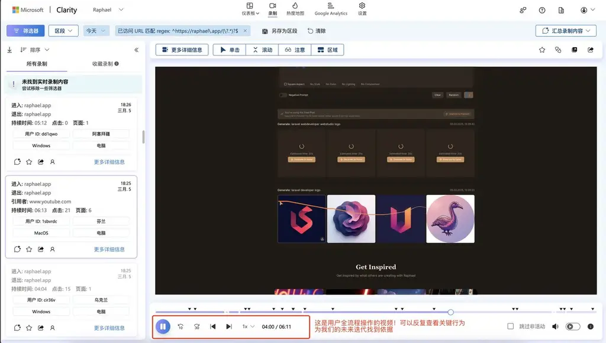

分析热力图

录像是"看个例"，热力图是"看整体"。

热力图把成百上千个用户的行为叠加在一起，用颜色深浅来表示热度——红色区域是用户最常点击

或停留的地方，蓝色区域是用户几乎没有注意到的地方。一张热力图，相当于同时观察了所有用户

的行为，给你一个全局视角。

Clarity 同样提供热力图功能，而且是三种维度：

点击热力图，显示用户在页面上点击的位置分布。你可以直观地看到，用户最常点击的是什么——

是你精心设计的 CTA 按钮，还是某个你完全没想到的地方？有时候你会发现，用户在疯狂点击一张

图片，而那张图片根本不是链接，这就是一个明确的产品改进信号：要么把那张图做成链接，要么

改变它的视觉设计，让用户不再误解。

滚动热力图，展示用户滚动到页面各区段的比例。这个数据能帮你回答一个关键问题：你精心写的

那段产品介绍、那个定价方案、那个用户评价，用户到底有没有看到？如果滚动热力图显示 80% 的

用户在页面三分之一处就停止滚动了，那么放在页面底部的内容，对大多数用户来说根本不存在。

区域热力图，以页面区块为单位，统计各区域的点击占比。特别适合分析导航栏、侧边栏、页脚等

结构性元素的实际使用情况。

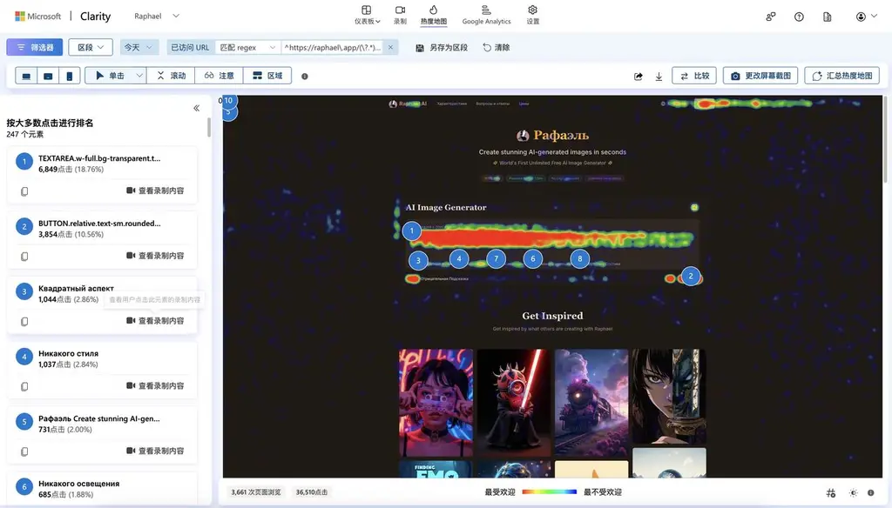

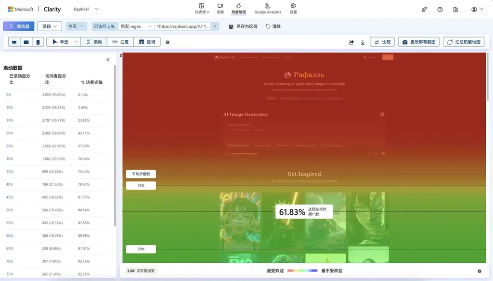

### 四、其他方式

工具之外，还有一些成本更低、反馈更直接的方式。

直接问用户。在产品页面里嵌入一个简单的问题，比如"你今天来这里是想做什么？"或者"有什么让

你感到困惑的地方？"。工具可以用 Typeform、Tally，或者直接用一个 Google 表单。很多时候，

用户愿意告诉你答案，只是你没有问。

看用户在哪里流失。如果你的产品有注册流程或付款流程，每一步都是一个漏斗节点。用 Plausible

的目标追踪功能，或者直接在 Clarity 里看录像，找到用户最常在哪一步放弃——那里就是你最需要

优化的地方。

### 五、干中学

说了这么多工具，最后要说一件最重要的事：数据只有在你开始行动之后才有意义。

很多人把数据分析当成一种"了解用户"的仪式，看完数据，点点头，说"嗯，我知道了"，然后继续做

原来的事。这不是迭代，这是自我安慰。

真正的迭代是这样的：你看到某个页面跳出率很高，你改了文案，第二周再看，跳出率降了 10%。

你看到用户在某个按钮上愤怒点击，你把那个按钮改大了、改颜色了，然后看点击率有没有提升。

你看到用户在注册第三步大量流失，你把第三步简化了，然后看注册完成率有没有变化。

每一次改动，都是一个假设。每一次看数据，都是在验证这个假设。这个循环，就是产品迭代的本

质。

工具装好，数据跑起来。然后开始改，开始看，开始再改。

这件事没有捷径，但它是有方法的。方法就在这里，现在轮到你去用了。

作业

• 给你的产品，安装数据统计工具（任意一个）

• 给你的产品，增加Microsoft Clarity，并且尝试看用户录像、分析热力图。从用户行为中，找到改

进产品的思路。

## 二十七、利用开源生态，加速产品开发

### 前言

学到这里，你已经会用 AI 工具写代码，会调 API，会搭数据库了。

但你可能也发现了一个问题：很多功能，从零开始做真的很费时费力。

其实，你不需要什么都自己造。

全世界有无数开发者，每天都在把自己的劳动成果免费开放出来——这就是开源生态。

学会用好它，你的开发速度可以直接翻倍，甚至更多。

### 开源项目有多厉害？

以 https://github.com/Nutlope 为例，有大量优质的开源项目，甚至可以一键部署。

关注链接查看开源项目效果关注 readme 文档查看项目

关注费用成本

介绍

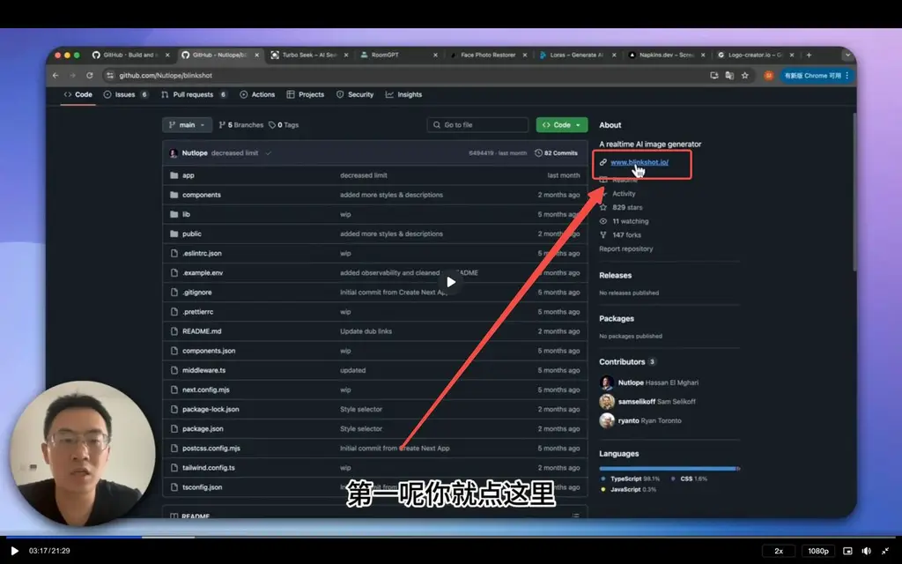

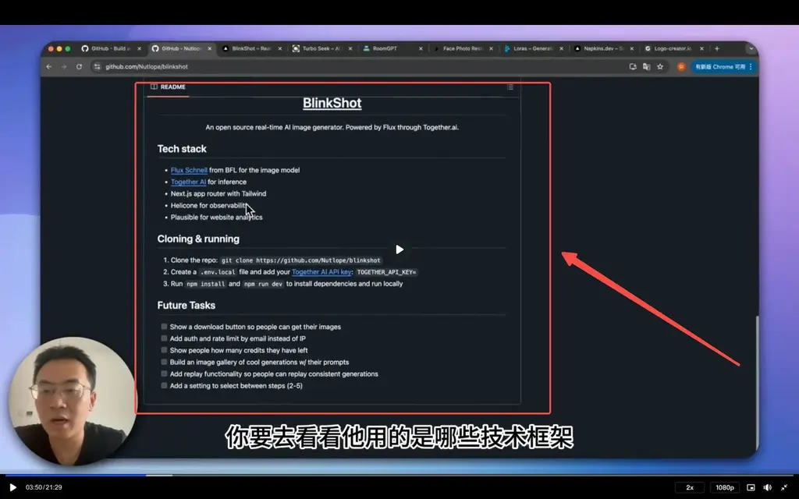

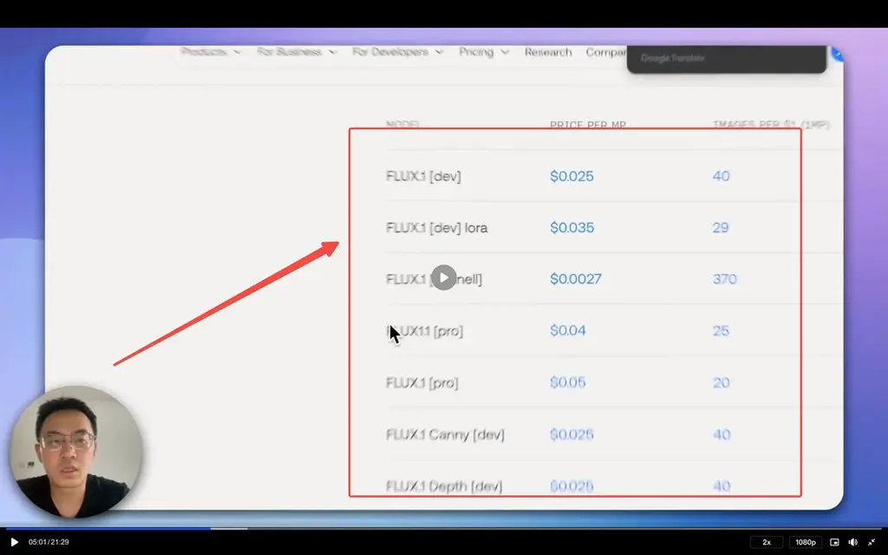

那么炫酷的功能，一键就可以部署了。借此，再次提醒学员：  编程能力，从来都不是门槛！门槛是

找到用户、找到真需求！

拿 Nutlop 这个大牛来说，他一个人，就做了十几个可以一键部署的开源项目！全都很优质！！

下面的产品，全是他一个人的开源项目

NoteGPT

开源代码：https://github.com/Nutlope/notesGPT

在线体验：https://usenotesgpt.com/

Blinkshot

开源代码：https://github.com/Nutlope/blinkshot

在线体验：https://www.blinkshot.io/

补充：如果使用的多需要注册 together ai 获得 1 美元密钥，能用个几分钟。

Loras.dev

开源代码：https://github.com/Nutlope/loras-dev

在线体验：https://loras.dev

Napkins

开源代码：https://github.com/Nutlope/napkins

在线体验：www.napkins.dev

LogoCreator

开源代码：https://github.com/Nutlope/logocreator

在线体验：https://www.logo-creator.io/

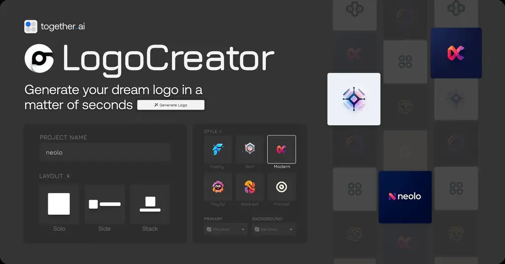

RestorePhotos

开源地址：https://github.com/Nutlope/restorePhotos

在线体验：https://www.restorephotos.io/

RoomGPT

开源代码：https://github.com/Nutlope/roomGPT

在线体验：https://www.roomgpt.io/

不再列举了，大家可以到他的主页自行翻阅。

在看别人Demo的过程当中，你就可以去构思，哪些功能可以为你所用。一边看一边思考，可以帮助

我们的产品做得更快

可能你在看之前并没有什么成型的想法，但你在看在玩这个产品的过程中，有可能就会得到启发

比如这个项目

https://github.com/browser-use/browser-use

就是之前爆火的 Manus 最核心依赖的一个开源项目

它可以让 AI 自动操作你的浏览器，这也是为什么 Manus 里很多功能是打开了一个浏览器来自动操

作完成任务

比如这个，就是自动把商品加入购物车

### 三个找开源项目的办法

GitHub Trending

https://github.com/trending

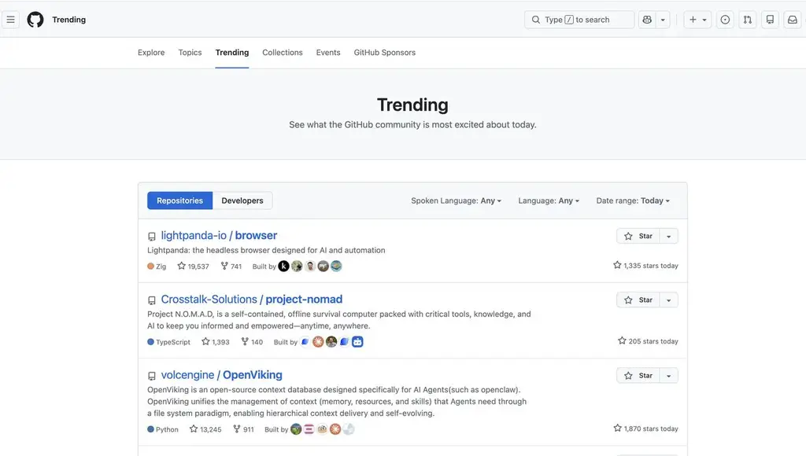

可以利用页面里的筛选条件看不同地区和时间的热度排行。

点进仓库后，不要只看 star 数，重点看三件事：

• README 是否写清楚——看使用的是哪些技术框架，部署方式

• 是否有在线 demo——方便测试

• API 的价格——开源项目大部分使用外部 API 接入的方式，需要思考你的商业模式能不能把钱赚

回来

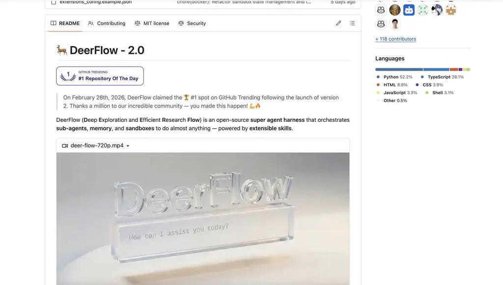

再判断这个仓库适不适合“拿来改”：

• 功能是否接近你的需求

• 技术栈你能不能驾驭

• 是否方便二次开发

看到合适的项目后，把它收藏起来，进入下一步精搜

GitHub 搜索和高级搜索

入口链接

• GitHub 搜索：https://github.com/search

• GitHub 高级搜索：https://github.com/search/advanced

• GitHub 官方搜索学习资源（社区汇总了官方文档入口）：

https://github.com/orgs/community/discussions/159014

具体步骤

• 先把需求拆成关键词。 不要只搜 "AI app" 这种大词，搜不到好东西的。要拆细，比如你想做一个

AI 写作工具，就拆成：

◦ai editor

◦ai writing saas

◦nextjs ai chatbot

◦open source ai editor

◦notion style ai editor

你还可以根据需求选择检索的维度，相关性、热度、关注度等等

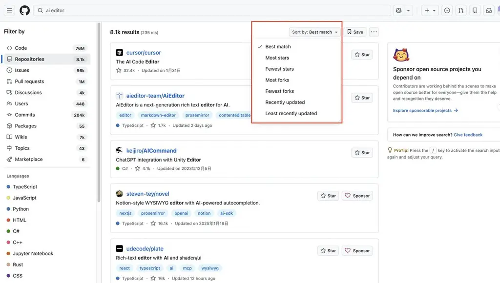

• 在 GitHub 搜索框里组合关键词。 例如：

◦nextjs saas starter

◦ai chatbot typescript

◦rag app nextjs

◦admin dashboard shadcn

• 加筛选条件，缩小范围。 GitHub 搜索支持很多限定语法，例如：

◦language:TypeScript

◦stars:>500

◦pushed:>2025-01-01

◦NOT is:archived

很多 star 数很高的仓库，其实早就停更了，作者把它归档挂在那里，看着光鲜，实际上是个空壳。

用 NOT is:archived 直接排掉，可以节省时间

不知道这些限定语法也没关系，我们可以借助 AI。使用下面这个指令：

Plain Text

我要在GitHub搜索和AI editor相关的内容，要求start大于50，2024年12月以后有更新的代码，告诉我搜索指

令

你就能得到非常完整的指令

再回到GitHub，就能得到你想找的目标项目了

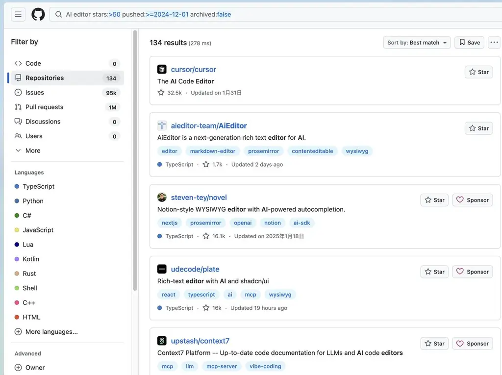

使用语法太麻烦？直接用高级搜索。

高级检索（GitHub Advanced Search） 将检索对象拆分为多个独立的结构化模块，每个模块都有

专属的筛选条件：

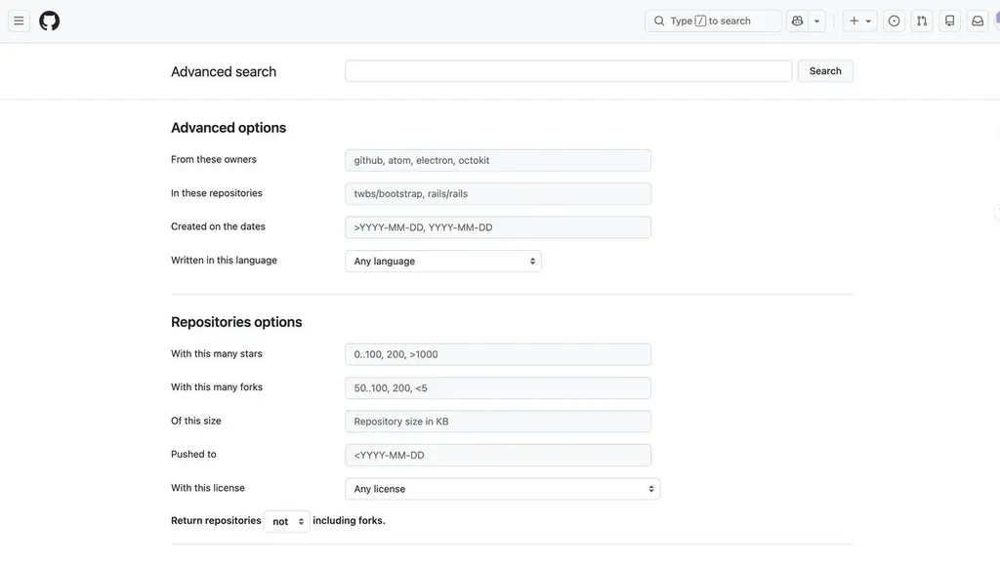

与 GitHub 普通搜索框相比，Advanced Search 的最大优势在于无需记忆搜索语法。普通搜索依赖

stars:>1000、language:Python、pushed:>2024-01-01 等限定符语法，有一定学习门槛

而 Advanced Search 将这些条件全部图形化为表单，填写即可自动生成对应的查询语法，条件越

多，结果越精准。

Vercel官方模版

https://vercel.com/templates

Vercel 官方提供了大量模板，覆盖 AI、SaaS、Blog、Portfolio、后台、认证、文档站等场景，很多

模版直接带一键部署功能，可以直接部署到 Vercel 平台上，快速验证产品功能

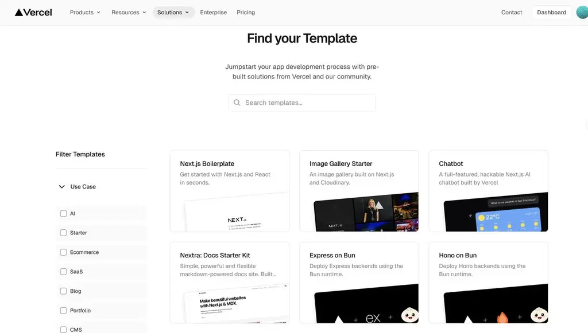

任意打开一个项目，三个可以关注的信息。如果项目本身需要调用 API，那每个 API 都需要自己准

备

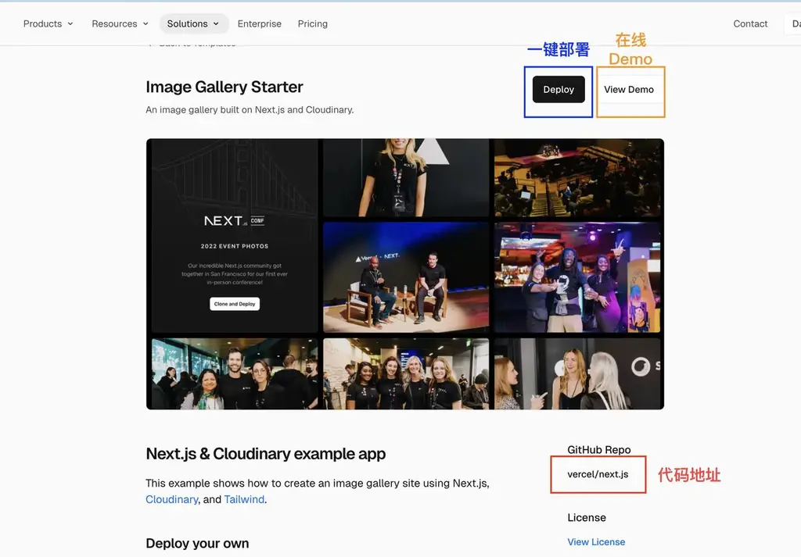

如果你是个新手，那我推荐你把项目都看一遍。如果你有一定基础，我一般会这么看的

• Framework 里我会选择Next.js

• Use Case 里选择Starter（看漂亮的首页和登录功能）、AI

### 用开源项目加速开发的流程和演示

开源项目你可以一键部署，别人也可以一键部署，那你靠什么赚钱呢？

差异化和待解决问题

直接修改开源项目，举一个例子。

步骤：

## 1. 找到你的差异化的用户人群、差异化的痛点，一个独特的“待解决的问题”（详见认知篇）。

## 2. 根据“待解决的问题”，寻找到可以帮助到你的开源项目

## 3. 在开源项目基础上，修改核心功能，使之能够解决你的“待解决的问题”

## 4. 修改界面和交互

## 5. 发布

比如，我们找到一个“待解决的问题”是 —— 有一群独立开发者，上线大量的 App，他们没有设计

师，因此，“为 App 做 Logo”，是一个痛点。我们可以做一个“专门为独立开发者设计的、App

Logo 制作工具”。

我们可以到 GitHub 搜索"logo maker"，找到一个比较类似的。

找到以后，发现开源的"logo maker"有很多和我们想要的不同的地方，比如这个，它是通用的 logo

maker、不是专门针对 App 的 logo。

我们可以参考共性代码，补齐差异功能、强化差异功能。

无论是从功能、交互、界面、文案，都要去强化差异，直击目标用户的心！

### 延展：购买付费源码加速开发流程

除了使用开源项目以外，还可以使用付费源码，采用类似的流行

可以试试 https://codecanyon.net/ 和 https://themeforest.net/ 搜索你想要的关键词。

例如，如果你想要做Video Generator，可以到codecanyon.net搜索 video genrator试试。 可以看

到如下的结果

https://codecanyon.net/search/video%20generator

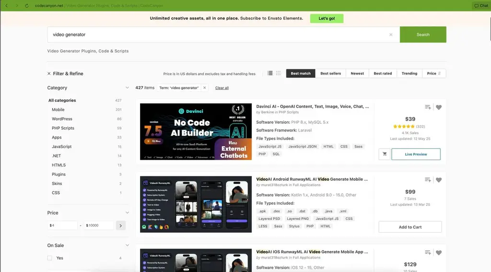

每一个评分高的源码，无论是功能还是界面都非常完整。

源码一般几十美元，但是可以省你好几天的时间。

我们完全可以找个喜欢的，直接完成了90%，再用Cursor加上本课程的内容，快速修改剩下的

10%。

切记：

## 1. 买到的90%，是基建。剩下的10%，主要是你的差异化价值点。他山之石，可以攻玉。

2. 请放弃“不想做差异化价值点，只想买个成熟的直接上线”的妄念。我们一再强调，软件生意是个

创意生意。 我们为世界创造的价值，来自于最后的也是最宝贵的10%。

### 延展：使用小龙虾，自动监控好玩的开源项目

GitHub Trending是公开的，我自己有每天打开看的习惯。

此外，为了防止我看漏，我还配置了OpenClaw，让它每天向我汇报GitHub Trending有什么好玩的

新东西。

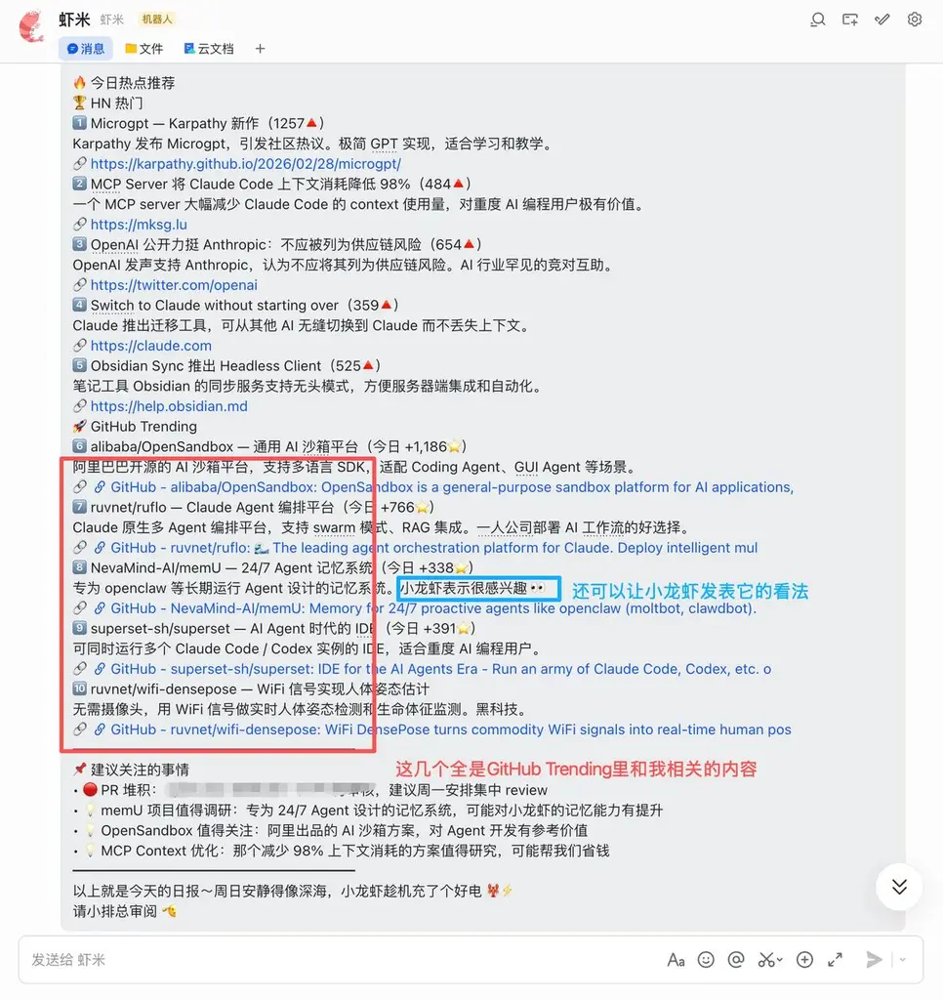

学习进度确认

你可以点击下方按钮，一键将整门课程标记为学完。

一键标记已学完

下一篇

【商业化】什么产品能赚钱？
