**  
1.1 Cursor 介绍**

📌

Cursor 是一款集成了先进 AI 技术的创新型代码编辑器，兼容并扩展了 VS Code 的强大功能。我们将带你完成 Cursor 的账号注册、安装与配置，并详细介绍其核心功能和实用技巧，帮助你高效入门并灵活使用这一强大的开发工具。

**注册 Cursor 账号**

访问 Cursor 官网：https://www.Cursor.com/cn

点击 "Sign in" 按钮，进行登录，可以选择从 Google 或者 Github 进行登录

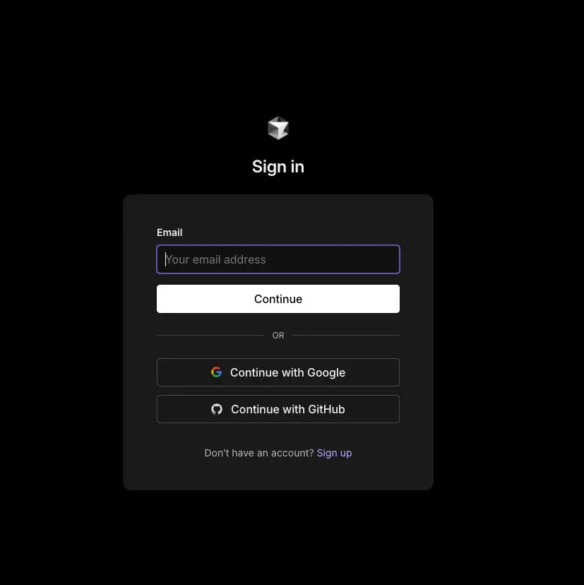

也可以选择 "Sign up" 按钮，进行注册，邮箱可以用国内邮箱，比如 QQ 邮箱，163 邮箱，126 邮箱等

注册完成后，会自动登录到 Cursor 个人设置页面，该页面会显示您的账号信息和额度信息

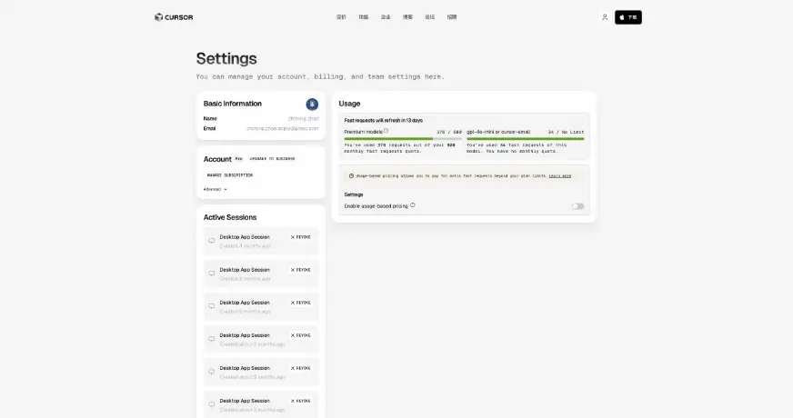

**Cursor 收费计划**

Cursor 提供三种不同的订阅计划，可以选择按月付费或按年付费（年付可节省 20%）：

注：快速高级请求是指使用 AI 进行代码补全、代码生成等功能时的请求，响应速度更快。

以上所有版本都可以访问 Cursor 的核心功能，个人开发者推荐使用 Pro 版本。

Cursor 付费目前支持支付宝付款，或者使用 Visa 信用卡

以上规则可能会随时变化，请以官网最新内容为准，参考 Pricing \| Cursor - The AI Code Editor

**安装指南**

1\.

访问 Cursor 官网：https://www.Cursor.com/cn

2\.

点击 "Download" 按钮下载安装包，Cursor 会根据您的操作系统自动选择合适的安装包

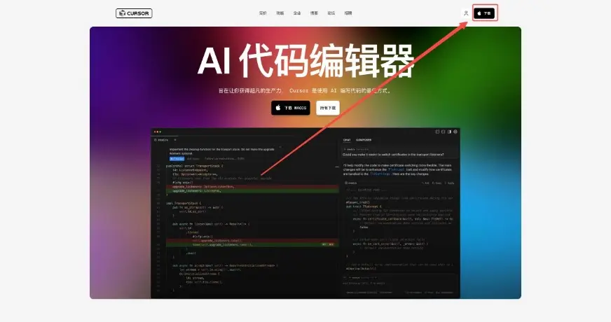

3\.

运行下载的安装文件（Windows 是 。exe 文件，macOS 是 。dmg 文件）

4\.

按照安装向导提示完成安装

💡

在首次安装时，Cursor 会自动检测你的系统是否已安装 VS Code。

如果检测到，会提示你是否导入 VS Code 的配置。选择导入后，Cursor 会自动应用 VS Code 的主题、字体、缩进设置，并支持迁移部分插件等配置。

Cursor 是基于 VS Code 开源版本进行开发的，如果是从 VS Code 切换到 Cursor 可以很快的适应。

**1.2 界面讲解**

Cursor 界面主要分为以下几个区域：

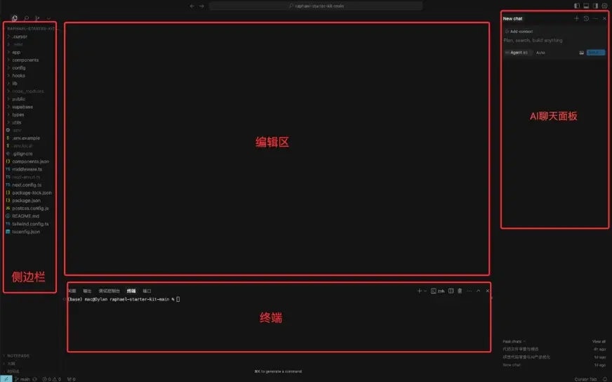

1\.

侧边栏：文件资源管理器、搜索、Git 控制等

2\.

编辑区：编写代码的主要区域

3\.

终端：在编辑器底部可以运行命令

4\.

AI 聊天面板：与 AI 交互的专用区域

💡

作为编程小白，第一次打开代码编辑器可能会被各种面板和按钮吓到。别担心！下面我会用最通俗易懂的方式，带你彻底掌握 Cursor 的四大核心区域，让你像专业人士一样高效使用

**1. 侧边栏：你的项目控制中心**

📌 位置：编辑器最左侧的竖条区域（如果看不到，按 **Ctrl+B** / **⌘+B** 显示）

**（1） 文件资源管理器（Explorer）**

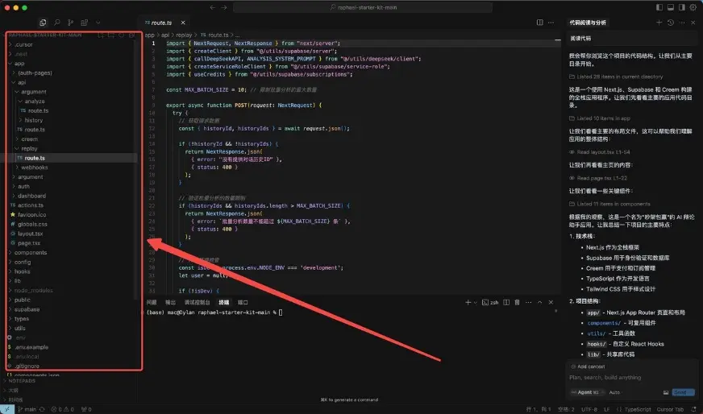

**功能**：就像电脑上的文件夹，这里展示你项目的所有文件

**必学操作**：

点击📁图标展开/折叠文件夹

右键文件 → 可进行新建/删除/重命名

双击文件在编辑区打开

**小白技巧**：

项目一定要有清晰结构（如：**src/** 放代码，**images/** 放图片）

使用 **New File** 按钮创建文件时，要带上后缀（如 **.JS** 、**.py** ）

**（2） 搜索（Search）**

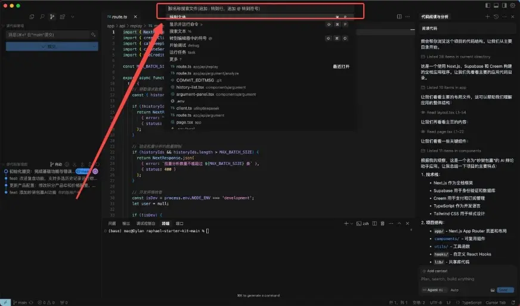

**功能**：快速找到项目中的特定内容

**实战案例**：

想修改"登录按钮"的代码但不知道在哪？

点击🔍图标 → 输入"登录" → 立即找到所有相关文件

**高级技巧**：

使用 \* 通配符（如 **\*.css** 只搜 CSS 文件）

**Ctrl+Shift+F**（Win）/ **⌘+Shift+F**（Mac）全局搜索

**（3） Git 版本控制**

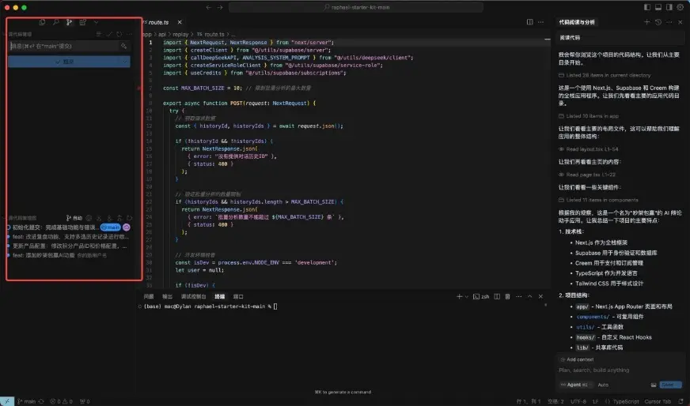

**  
功能**：记录代码的每次改动（像游戏存档）

**新手必会**：

看到文件旁的 **M** 表示已修改，**U** 表示新文件

点击✔️图标 → 输入备注 → 提交更改

**避坑指南**：

提交前一定检查"Changes"里改动了什么

每天至少提交一次，避免代码丢失

**2. 编辑区：你的代码画布**

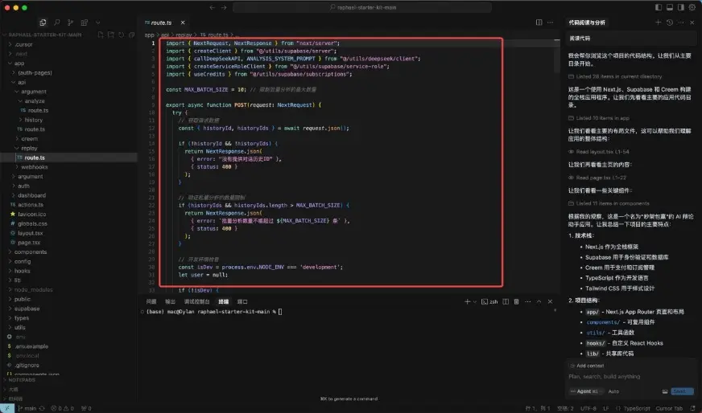

**行号**：出错时会显示"第 X 行有错误"

**语法高亮**：不同颜色区分代码类型

**代码折叠**：点击 **-** 号可折叠函数/循环

**小白必学操作**

**基础编辑**：

鼠标点击任意位置开始输入

**Ctrl+/** （Win）/ **⌘+/** （Mac）快速注释代码

**多光标编辑**（神技！) :

a\.

按住 Alt +鼠标点击（Win）/ ⌥ + 鼠标点击（Mac）

b\.

在多个位置同时输入相同内容

**代码补全**：

输入时自动出现提示 → 按 **Tab** 键确认

遇到不懂的 API，悬停鼠标看说明

**3. 终端：你的命令行助手**

📌 位置：编辑器底部面板（按 **Ctrl+\`** / **⌘+\`** 快速开关）

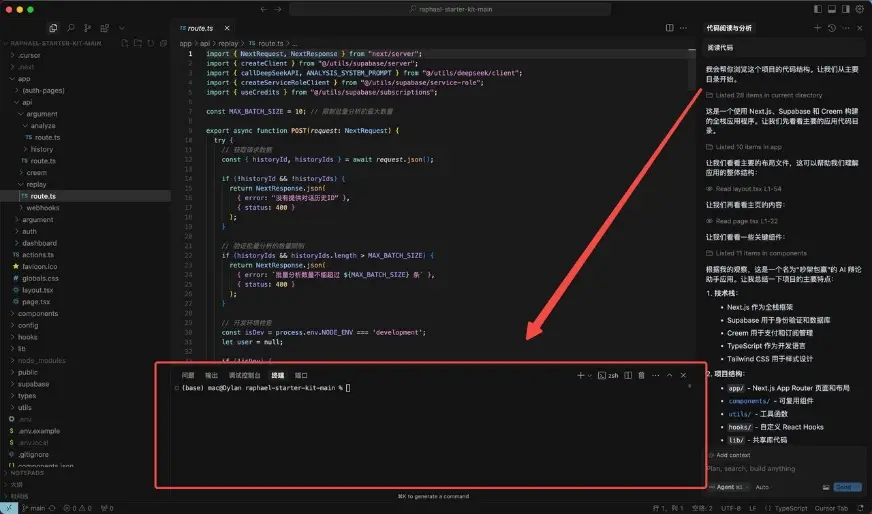

**为什么要用终端？**

运行程序（如 **python app.py** ）

安装依赖包（如 **npm install axios** ）

使用 Git 命令（如 **git push** ）

**1.3 基础设置**

Cursor 设置界面（Settings）包含四个主要部分：

1\.

General（通用设置）：主要用于基础编辑器配置，在这里可以导入 VS Code 配置、管理账号登陆信息、快捷键设置等；

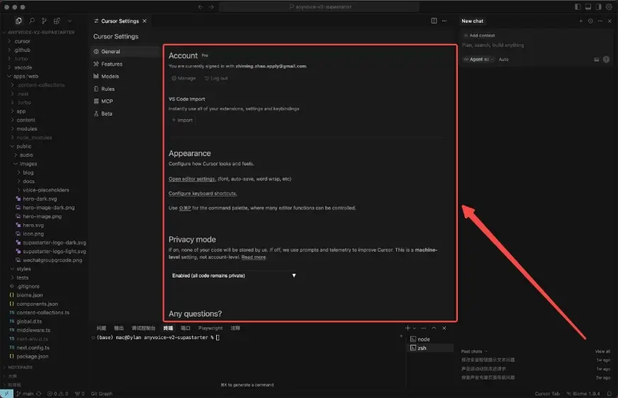

**Account（账号管理）**

显示当前登录的邮箱账号。

提供管理账号和退出登录的选项。

**VS Code Import（导入 VS Code 配置）**

支持从 VS Code 导入扩展、设置和快捷键，方便用户无缝迁移开发环境。

**Appearance（外观设置）**

可以调整编辑器的外观，比如主题、字体等。

提供入口快速打开编辑器设置和配置键盘快捷键。

**Privacy Mode（隐私模式）**

允许用户开启隐私模式，确保所有代码都保持私有，提升数据安全性。

**Any Questions?（有疑问？)**

页面底部有提问入口，方便用户获取帮助或反馈问题。

2\.

Features（功能特性）：管理 Cursor 的核心功能，如代码补全和智能提示等

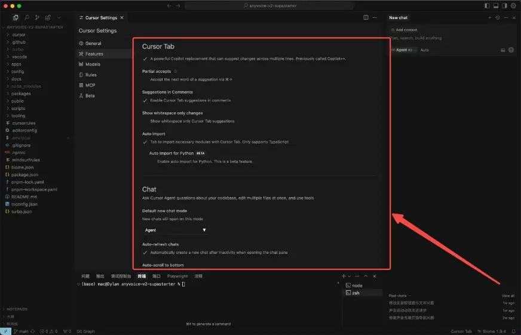

**Cursor Tab**

**Cursor Tab** 是 自动补全代码工具，可以替代 Copilot，帮助你高效编写代码。

主要选项包括：

**Partial accepts**：允许你通过特定快捷键只接受建议的一部分内容。

**  
Suggestions in Comments**：在注释中也能获得智能补全建议。

**Show whitespace only changes**：只高亮显示空白字符的变动，便于代码审查。

**Auto Import**：自动导入所需模块（目前对 Python 支持为 Beta 测试）。

**Chat（聊天相关设置）**

**Default chat mode**：设置新建聊天窗口的默认模式（如 Agent 模式）。

**Auto-refresh chats**：长时间未操作后自动新建聊天，保持对话流畅。

**Auto-scroll to bottom**：聊天窗口自动滚动到最新消息，方便查看最新对话。

3\.

Models（模型设置）：负责 AI 相关的配置，包括模型选择和 API 密钥管理

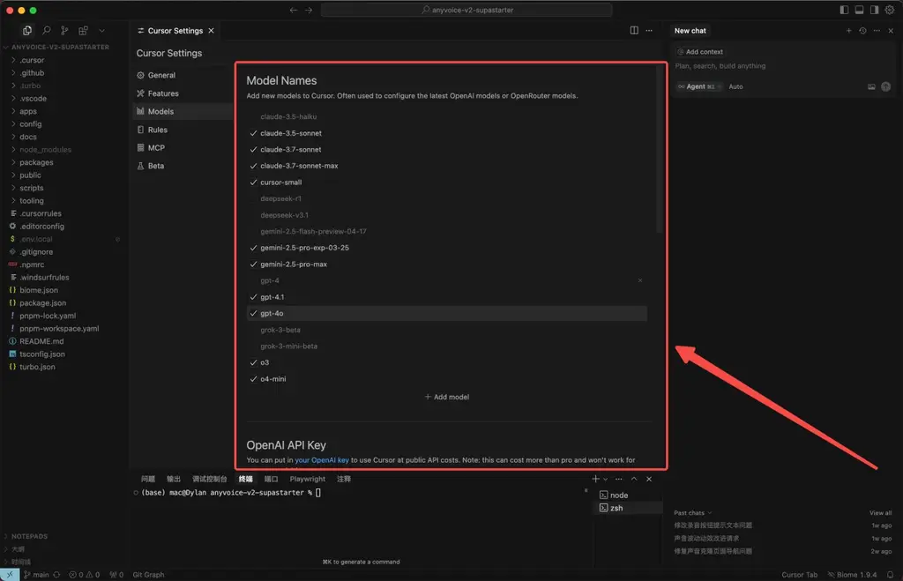

**启用或禁用模型**

你会看到一系列可用的 AI 模型（如 claude-3.5-onnx、claude-3.7-sonnet、gpt-4.1、gemini-2.5-pro 等），每个模型旁边有一个勾选框。

通过勾选或取消勾选，可以灵活选择哪些模型在 Cursor 中可用，适应不同的开发和智能需求。

**添加新模型**

页面底部有“添加新模型”选项，支持你接入更多第三方或自定义的 AI 模型，扩展编辑器的智能能力。

**配置 OpenAI API Key**

在下方的“OpenAI API Key”区域，你可以输入自己的 OpenAI API 密钥。

这样可以直接调用 OpenAI 的模型（如 GPT-4），并按 OpenAI 的官方计费标准计费，适合有自有 API 额度的用户。

4\.

Rules（规则设置）：管理项目规则文件，之前是在 Features 功能特性中，0.46 版本后单独出来了

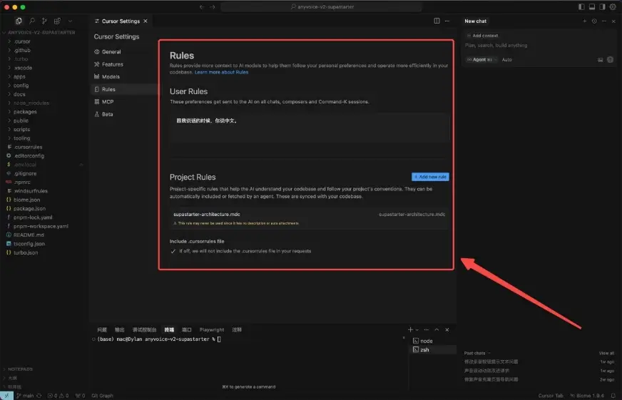

**User Rules（用户规则）**

填写你的个人偏好或工作习惯，这些信息会在你与 AI 聊天或使用智能功能时传递给 AI，帮助 AI 更贴合你的使用风格。

**Project Rules（项目规则）**

你可以指定项目的开发规范、架构说明等，让 AI 理解你的代码库结构和团队约定。

支持关联项目文档（如 supastarter-architecture.mdc），让 AI 在回答问题或生成代码时参考这些规则。

有“Include 。Cursorrules file”选项，勾选后会将 。Cursorrules 文件内容包含在 AI 请求中，未勾选则不会包含。

5\.

MCP（模型上下文协议）：这个可能会让很多朋友感觉难以理解，后续会有一章节进行讲解

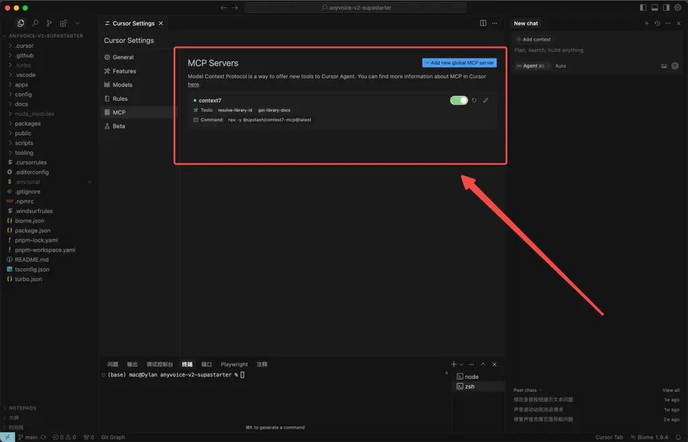

**  
查看和管理 MCP 服务器** 显示已添加的 MCP 服务器（如 context7），每个服务器都可以单独启用或禁用。

**工具集成** 每个 MCP 服务器下会列出可用的工具（如 resolve-library-docs），这些工具可以为 AI Agent 提供额外的能力，比如自动解析库文档、增强代码理解等。

**命令行接入** 提供一键复制的命令（如 npx @pushai/context7-mcp@latest），方便你在本地或服务器上快速部署 MCP 服务。

**添加新 MCP 服务器** 通过 “+ Add new global MCP server” 按钮，可以接入更多第三方或自定义的 MCP 服务，进一步扩展 Cursor 的智能能力。

6\.

Beta（测试功能）：提供最新的实验性功能和测试特性

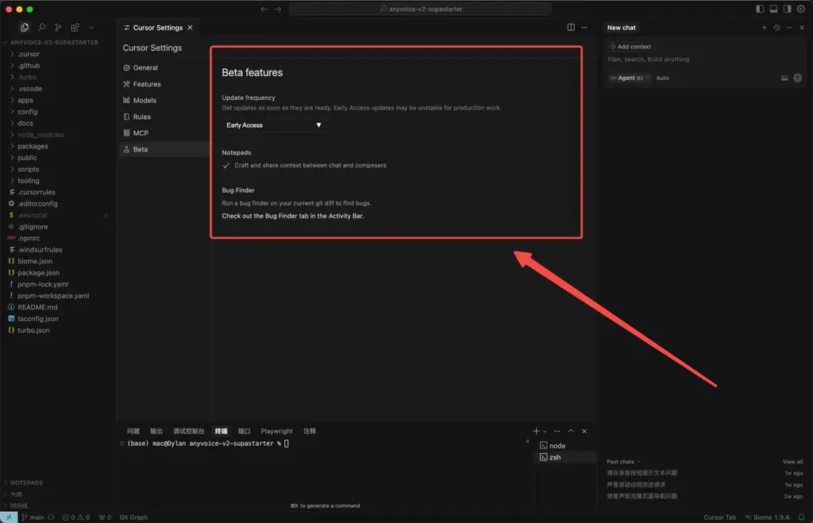

**Update frequency（更新频率）** 可以选择“Early Access（抢先体验）”，这样会第一时间收到最新功能更新，但这些功能可能不够稳定，不建议在生产环境中使用。

**Notepads** 启用后，可以在聊天和代码编辑器之间灵活创建和共享上下文，方便整理思路和协作。

**Bug Finder** 启用后，可以在当前 git 目录下运行自动化的 Bug 检查工具，帮助你快速发现代码中的潜在问题。相关功能可在 Activity Bar 的 Bug Finder 标签页中查看和操作。

💡

刚开始使用时，大家可以先使用默认配置，在后续课程会根据实际的场景，分别介绍不同的配置

**PS：隐私问题**

Cursor 提供了隐私模式（Privacy Mode）来保护用户数据，默认是禁用状态，需要手动开启隐私保护。

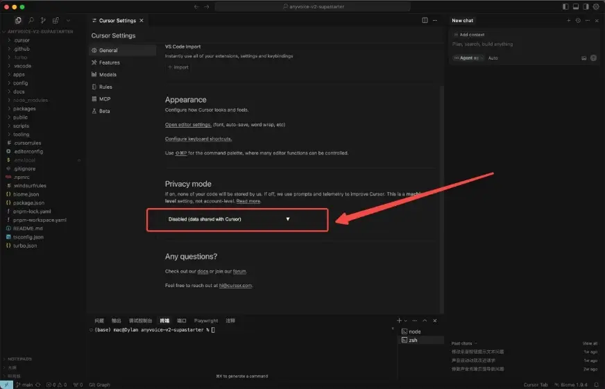

**1.4 必要安装及配置**

1\.

node 安装

💡

后续我们会使用 Next.JS 框架开发，Next.JS 依赖 Node.JS 作为运行和构建环境，所以开发 Next.JS 项目必须先安装 Node.JS

**访问 Node.JS 官网：**https://nodeJS.org/en/download**，下载安装包：**

Windows 系统选择 **.msi** 安装包

macOS 系统选择 **.pkg** 安装包

Linux 系统选择 **.tar.gz** 包

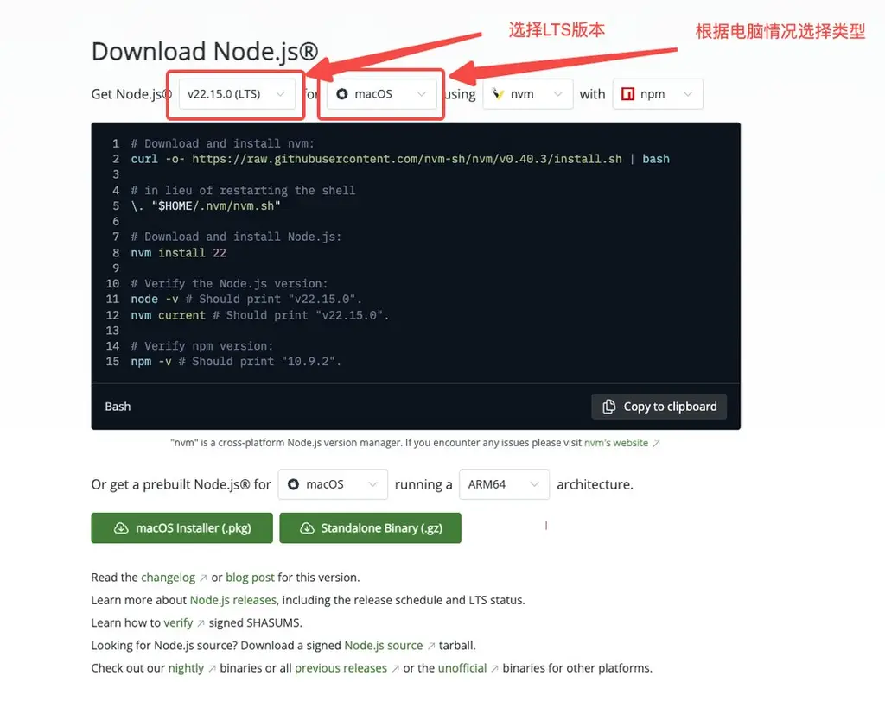

**下载后，按照提示进行安装**

**验证安装：**

打开 Cursor 终端，输入以下命令：

node -v

如果能看到版本号，说明安装成功

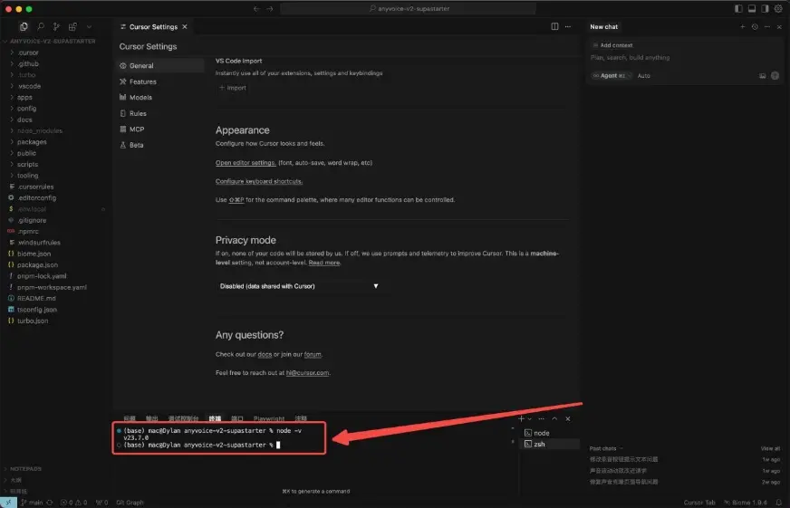

2\.

git 安装

💡

为实现代码的协作与版本管理，你需要安装 git，实现对不同代码版本的灵活管理

安装网址：https://git-scm.com/downloads

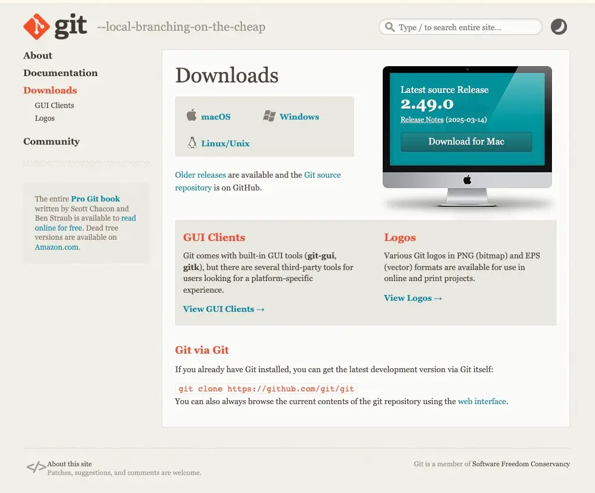

验证安装，在终端输入以下命令

git --version

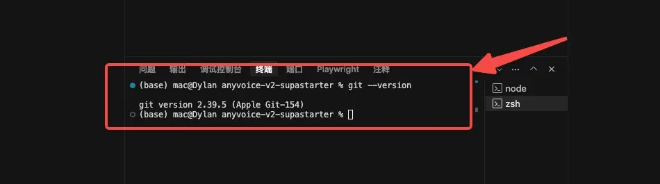

初始配置，设置你的用户名称

\# 配置用户名和邮箱 git config --global user.name "替换为你的名字" git config --global user.email "替换为你的邮箱" \# 查看配置 git config --list

**1.5 AI 对话**

**对话模式**

💡

在 AI 聊天区域，存在 3 种模式：Agent、Ask、manual

**Agent（最常用）**

**用途**：自动化代码修改、批量重构、直接应用 AI 建议

**特点**：

可以自动将生成的内容直接写入文件

可以自动创建代码文件

适合需要自动化处理、批量修改、快速实现功能的场景

更高效，但更改会直接生效

**典型场景**：让 AI 自动修复 bug、重构代码、批量替换内容等

**Ask**

**用途**：提问、代码解释、搜索、理解项目内容

**特点**：

只提供建议、解答或代码片段

不会自动修改或写入文件

适合日常问答、代码理解、查找用法等

**典型场景**：想让 AI 解释一段代码、帮忙写一小段代码、查找项目结构等

**Manual**

**用途**：手动审核和应用 AI 生成的内容

**特点**：

AI 生成建议后，不会自动写入文件

你需要手动确认、编辑或应用这些更改

适合需要人工把关、逐步采纳建议的场景

**典型场景**：对 AI 生成的代码进行人工审核、只采纳部分建议、需要逐步修改时

**总结对比表**

模型选择

💡

2025 年 5 月模型情况

**Claude 系列（Anthropic）**

**claude-3.5-sonnet**

**claude-3.7-sonnet**

**claude-3.7-sonnet-max**

**claude-3.5-haiku**

**Cursor Small**

**Cursor-small**

**Gemini 系列（Google）**

**gemini-2.5-pro-exp-03-25**

**gemini-2.5-pro-max**

**gemini-2.5-flash-preview-04-17**

**GPT 系列（OpenAI）**

**gpt-4**

**gpt-4.1**

**gpt-4o**

**o3**

**o4-mini**

**DeepSeek 系列（国产）**

**deepseek-r1**

**deepseek-v3.1**

**Grok 系列（xAI）**

**grok-3-beta**

**grok-3-mini-beta**

**选择推荐**

**最强代码生成模型**：gemini-2.5-pro-exp-03-25

目前最适合做代码生成的大模型

**画图审美最稳定的模型**：claude-3.7-sonnet

目前生成页面审美风格最稳定的产品

**最佳平替模型**：o4-mini

非常聪明，其他模型卡顿时考虑这个

**是否要选择单次按量付费模型**

答：不必要，懂代码结构、文件作用后，描述任务即可

**如何使用 AI 对话**

**方法 1 需求描述格式**

优质的段落格式，会帮助 AI 更精准理解你的需求

\### 任务目标 这里描述你本次对话后要实现的目标 \### 任务背景 描述本次人物会涉及到的背景情况 \### 可能用到的材料 这里@可能用到的知识文档/API

**方法 2 一个对话窗口做一个任务**

每个对话窗口只处理一个具体任务。

比如，这个窗口只用来写登录页，另一个窗口用来优化接口。

这样可以避免上下文混乱，任务拆分更清晰，后续查找和回溯也更方便。

**方法 3 AI 生成内容回滚**

reject：取消本次生成的代码，取消后生成的代码不应用到项目中

accept：接受本次生成的代码，接受后代码文件更改内容保存

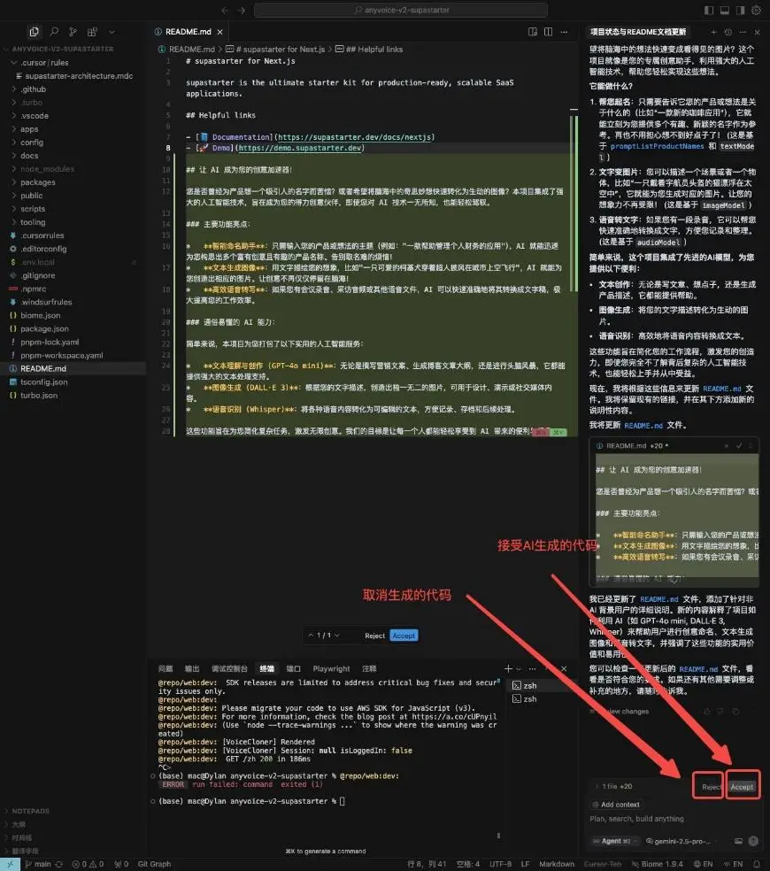

Restore checkpoint：把项目或代码恢复到该对话前的状态，点击后，当前的内容会被回滚到当时的样子

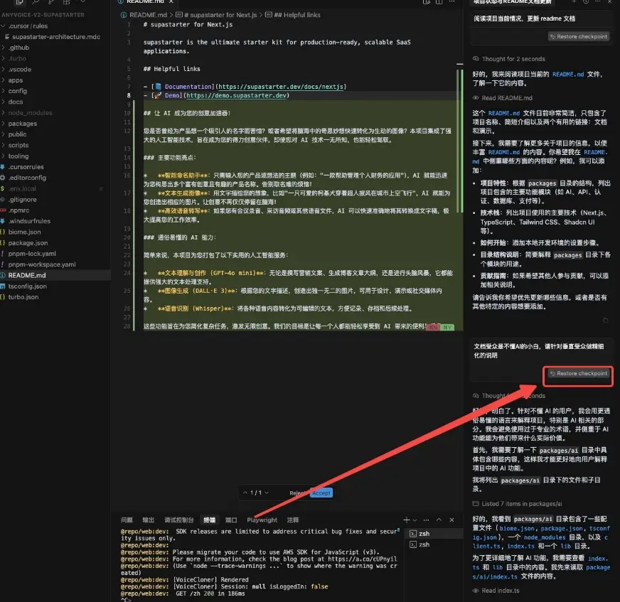

**1.6 基本技巧**

智能补全

💡

在写文档、注释或说明时，Cursor 会根据你已输入的内容，自动预测并补全后续文本。

只需按下 Tab 键，即可快速接受建议，让写作更流畅。

光标位置后出现补全内容

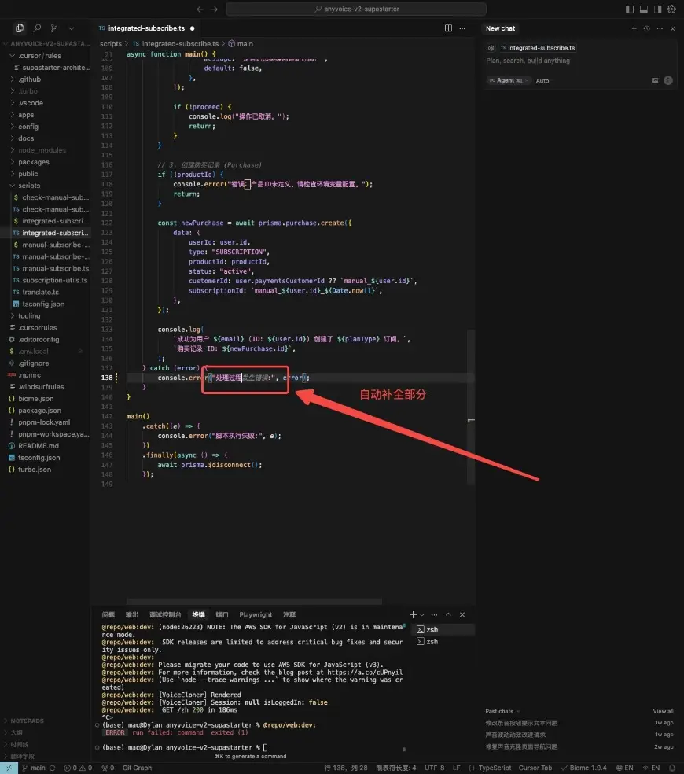

按住 tab 后，补全内容出现

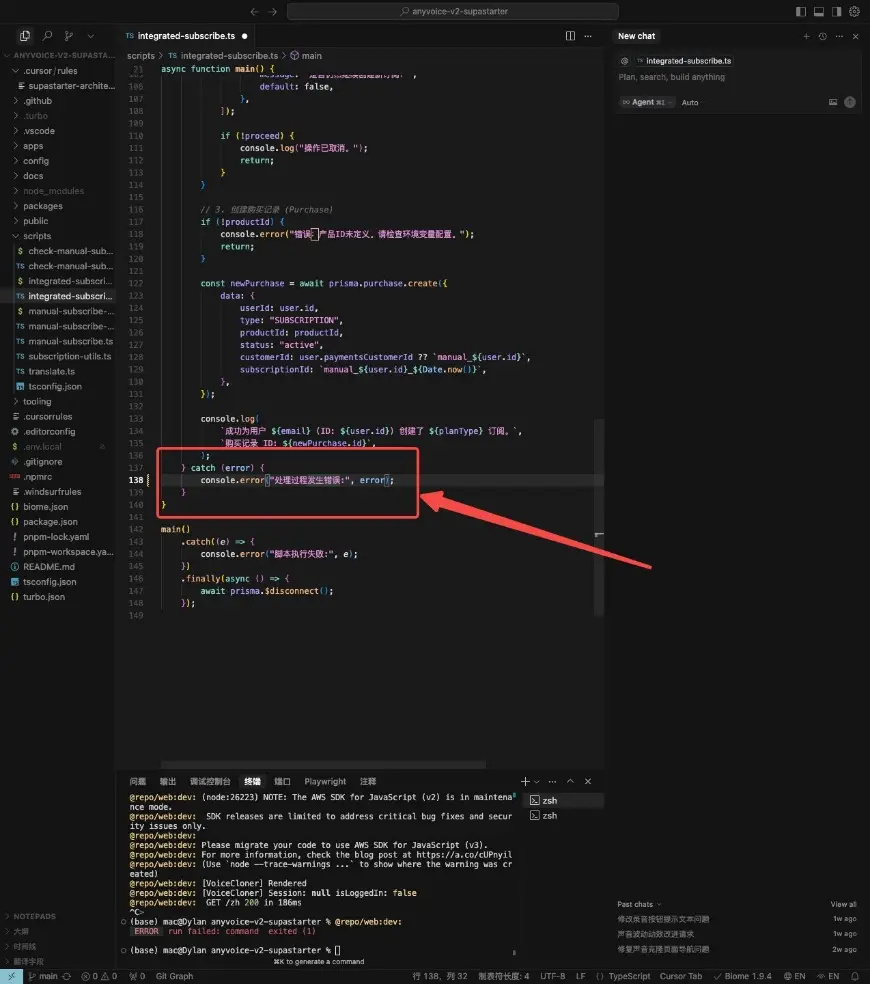

**部分补全（Partial Accepts）**

支持逐词接受建议（如按 Ctrl/Cmd + →），可以灵活采纳补全内容的一部分，适合精细编辑。

**智能光标预测**

Cursor 会预测你下一个可能编辑的位置，按 Tab 可以直接跳转到下一个编辑点，提升多处修改的效率。

**使用技巧**

**Tab 键**：接受当前补全建议

**Esc 键**：关闭补全窗口

**Ctrl/Cmd + →**：逐词接受建议（需开启 Partial Accepts）

@命令技巧

💡

在 Cursor 编辑器中，@技巧指的是在 Chat 窗口输入 @ 符号后，快速引用文件、代码、文档、历史等内容，极大提升 AI 辅助开发的效率和精准度

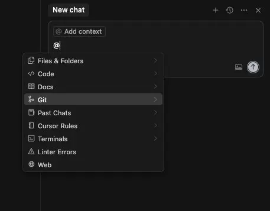

**@Files 和 @Folder —— 引用文件和文件夹**

输入 @，选择 @Files 或 @Folder，可以把项目中的特定文件或文件夹作为上下文发给 AI。

支持直接拖拽文件/文件夹到 Chat 窗口，自动生成引用。

使用场景 ：让 Cursor 明确的修改某一个文件

**@Docs —— 访问文档**

输入 @Docs，可以引用项目内或自定义的第三方文档（如 Next.JS、React 官方文档）。

**@Git —— 访问 Git 历史**

输入 @Git，可以引用项目的 Git 历史记录或某次提交。

使用场景：让 AI 分析历史变更、定位 bug 或生成变更说明。

**@Cursor Rules —— 引用项目规则**

输入 @Cursor Rules，可以让 AI 按照项目自定义的规则和指南进行操作。

使用场景：适合团队协作、规范代码风格。

**@Web —— 引用互联网资源**

输入 @Web，AI 会自动搜索互联网，获取最新的相关信息作为上下文。

使用场景：AI 联网，获取资料或外部知识。

AI 总结提交内容

点击 AI 描述按钮后，Cursor 会根据修改内容，描述本次修改的内容

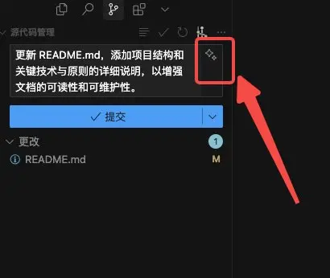

规则配置

💡

Cursor 支持两种规则设置方式：**项目级规则（推荐）、全局规则，**优先级依次递减，规则用于控制 AI 助手的行为，帮助其更好地理解和适应你的开发需求

在全局 rule 中配置 Cursor 的宽泛的整体规则；

在项目 rule 中配置精细化的具体规则；

**项目级规则（推荐配置）**

**优先级最高**，适用于特定项目，每个项目间相互独立。

配置方法：在项目根目录下的 \`。Cursor/rules\` 文件夹中创建 \`。mdc\` 文件（基于 Markdown 格式）。

支持四种规则类型：

**Always**：自动附加到所有对话和命令请求，适合全局规则。

**Auto Attached**：根据文件类型自动触发（如 . tsx、.JSon) 。

**Agent Requested**：针对特定任务场景，需提供任务描述，帮助 AI 更好地理解任务。

**Manual**：需手动提及才会生效，适合临时规则。

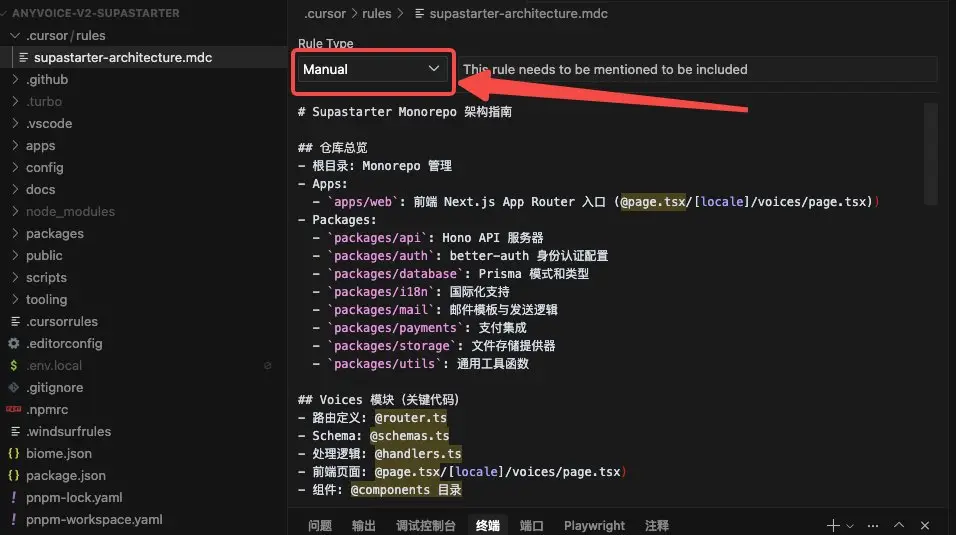

**全局规则** **（必要配置）**

对所有项目生效，适合通用性要求（如统一语言、编码风格）。

配置方法：在 Cursor 设置中进入 “Rules” → “User Rules”，添加全局规则。

例如，可以设置所有响应都使用中文。

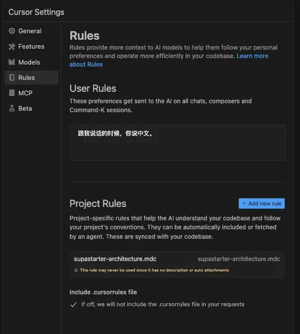

**自动执行指令**

💡

当你使用 Cursor 到一定程度，通常一个对话就会让 Cursor 工作 5 分钟以上，为了在这 5 分钟里解放你的双手，你可以让 Cursor 自动执行指令

1.进入 features

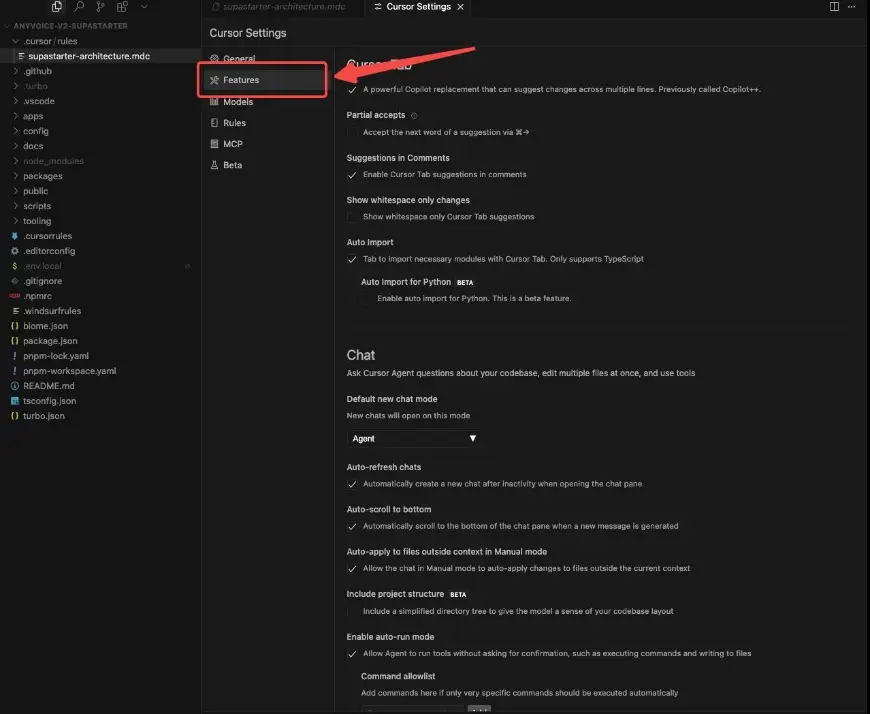

2.勾选以下选项

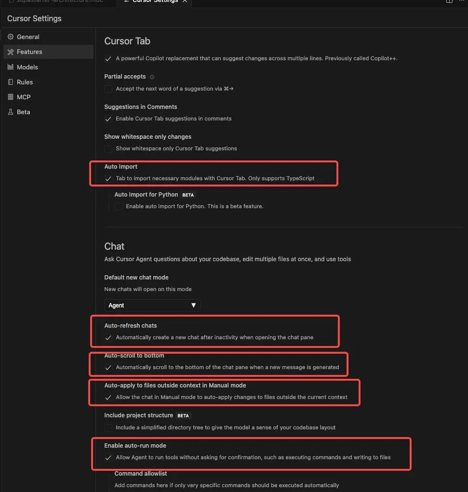

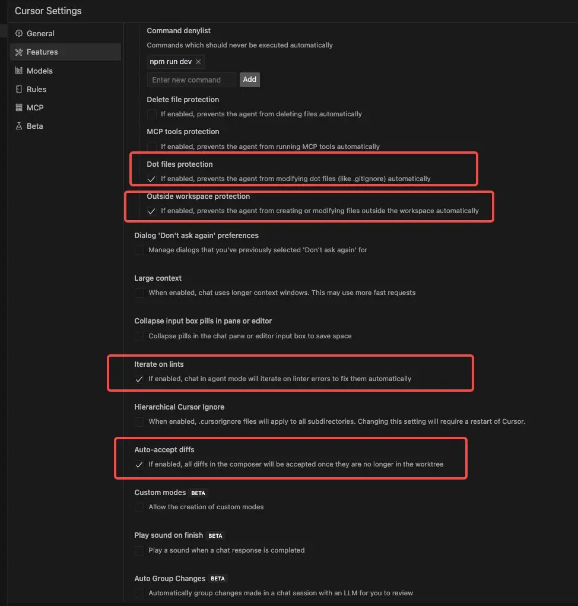

💡

注意：需要在【enable auto-run mode】-【command denylist】中添加 npm run dev，禁止 Cursor 运行这条指令，否则你将会有 3001、3002、3003 等 N 个开发端口

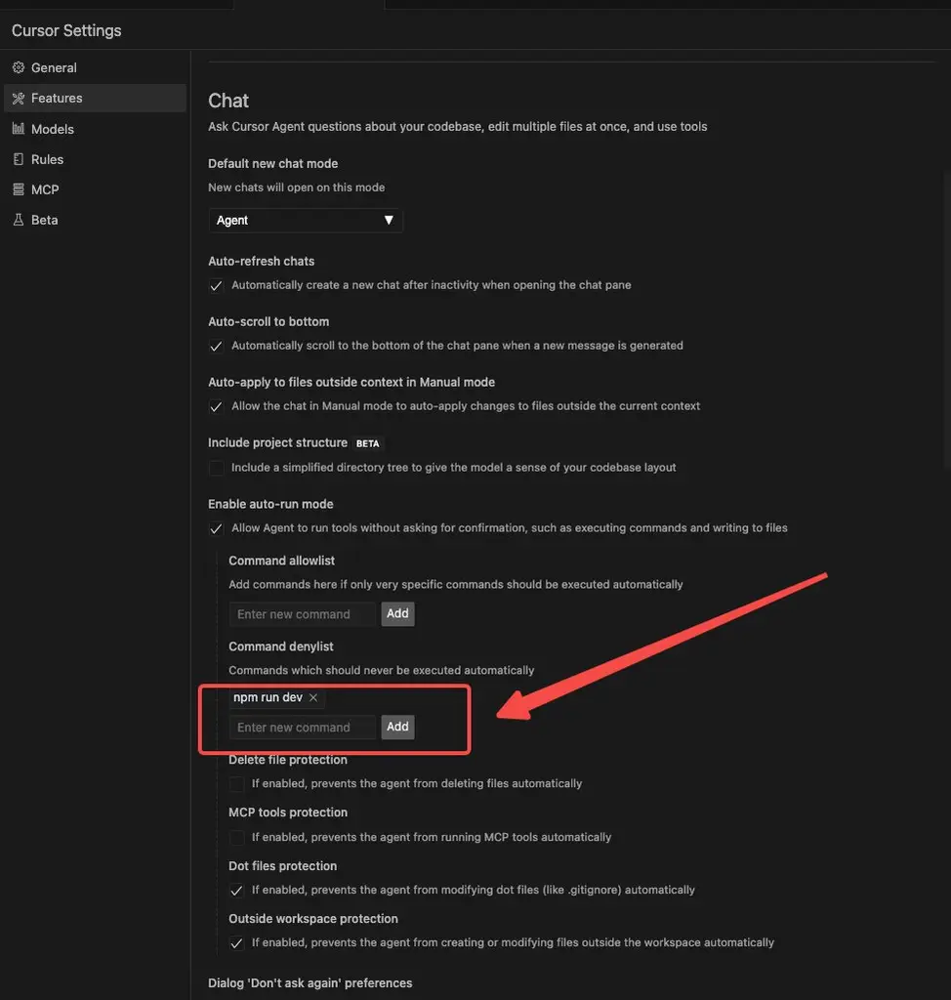

**mcp 技巧**

💡

Cursor 中的 MCP（模型上下文协议，Model Context Protocol）是一种让 AI 助手能够安全地访问本地和远程数据、运行命令、使用工具的开放协议，极大扩展了 AI 在编程环境中的能力

MCP 就像 AI 的“万能接口”，让 AI 助手能安全、灵活地访问和操作你的开发环境资源，极大提升了自动化和智能化水平。如果你想让 AI 更懂你的项目、帮你做更多事，MCP 是核心工具之一

**MCP 在 Cursor 里的作用**

MCP 让 Cursor 里的 AI 助手不仅能“看懂”你的代码，还能直接操作你的电脑和网络资源，比如：

读写本地文件

搜索网络信息

运行命令行指令

使用数据库

调用各种开发工具

这让 AI 助手变得像“超级助手”，能帮你自动化很多开发任务。

**MCP 的基本结构框图**

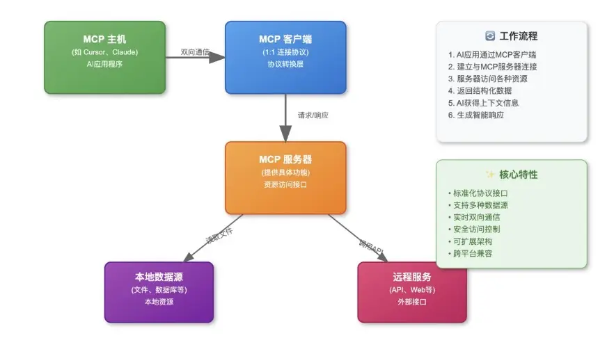

**  
MCP 主机**：比如 Cursor，负责发起请求。

**MCP 客户端**：负责和 MCP 服务器通信。

**MCP 服务器**：实现具体功能，比如文件操作、命令执行等。

**本地数据源/远程服务**：MCP 服务器可以访问的资源，比如本地文件、数据库，或外部 API。

**MCP 的配置方式**

Cursor 设置-MCP

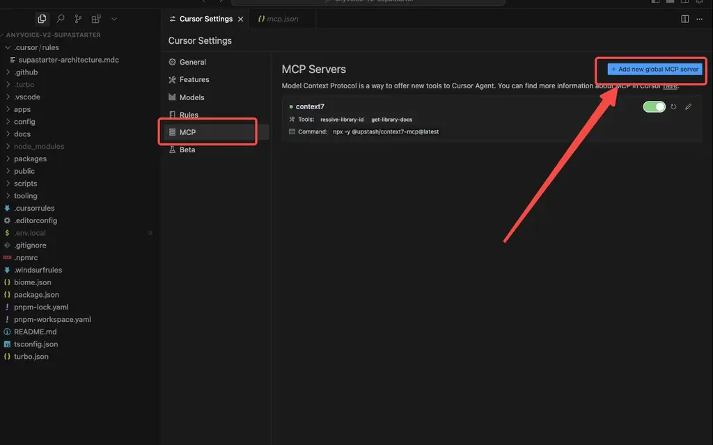

配置示例（JSON）：

{ "mcpServers": { "context7": { "command": "npx", "args": \["-y", "@upstash/context7-mcp@latest"\] } } }

**1.7 新手插件推荐**

1\. **Chinese (Simplified) Language Pack**

**简介**：官方中文语言包，将 Cursor 界面汉化，降低英语门槛。

**链接**：VS Code 市场

2\. **Material Icon Theme**

**简介**：美化文件图标，让项目结构更直观。

**链接**：VS Code 市场

3\. **Prettier - Code Formatter**

**简介**：一键格式化代码，保持代码风格统一，避免缩进混乱等问题。

**链接**：VS Code 市场

4\. **Live Server**

**简介**：实时预览 HTML/CSS/JS 文件，保存后自动刷新浏览器，适合前端初学者。

**链接**：VS Code 市场

5\. **Bracket Pair Colorizer**

**简介**：为匹配的括号着色，帮助小白快速识别代码块范围。

**链接**：VS Code 市场

6\. **Code Spell Checker**

**简介**：检查变量名拼写错误，支持驼峰命名，避免低级错误。

**链接**：VS Code 市场

7\. **Path Intellisense**

**简介**：自动补全文件路径，减少手动输入错误。

**链接**：VS Code 市场

**1.8 快捷键大全**

以下是 **Cursor 编辑器** 的快捷键大全，分别针对 **Mac** 和 **Windows** 用户整理，方便编程小白快速上手：

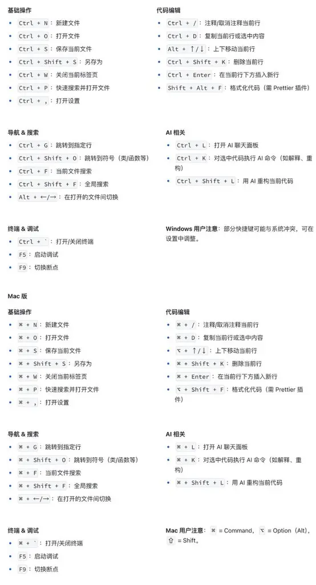

**1.9 使用技巧**

**技巧 1 新项目建空文件夹**

**为什么重要？**

避免文件散乱，保持项目结构清晰

方便 Git 版本控制管理

**操作步骤**

1、在本地创建一个空文件夹（如 my_project）

2、在 Cursor 中点击 File → Open Folder 选择该文件夹

3、后续所有代码、配置文件都放在这里

**技巧 2 AI 生成代码一步步来**

**为什么重要？**

避免一次性生成复杂代码导致难以理解

便于调试和迭代优化

**操作步骤**

1、先让 AI 生成核心功能（例如："用 Python 写一个计算器函数"）

2、逐步扩展需求（例如："添加异常处理" → "支持更多运算符"）

3、通过 Ctrl+K（Win）或 ⌘+K（Mac）分段生成

**技巧 3 善用 readme 文档**

**为什么重要？**

记录项目目标、依赖和运行方式

方便他人（或未来的你）快速上手

方便 AI 了解项目进程

**操作步骤**

1、直接让 AI 生成

**技巧 4 让 AI 写清楚代码块注释**

**为什么重要？**

提高代码可读性，方便后续维护

帮助理解 AI 生成的复杂逻辑

**操作步骤**

1、生成代码后，选中代码块

2、输入指令：

"为这段代码添加详细注释"

"用中文解释每一行的作用"

**技巧 5 适时的 git 提交**

**为什么重要？**

避免代码丢失，保留历史版本

适合新手练习版本控制

**操作步骤**

1、关键节点提交代码

**技巧 6 新建 AI 聊天窗口**

**为什么重要？**

分离不同问题的讨论上下文

避免 AI 混淆多个任务

**操作步骤**

1、点击左侧边栏的 Chat 图标

2、选择 New Chat 创建独立会话

3、命名会话（例如："前端问题"、"数据库优化"）

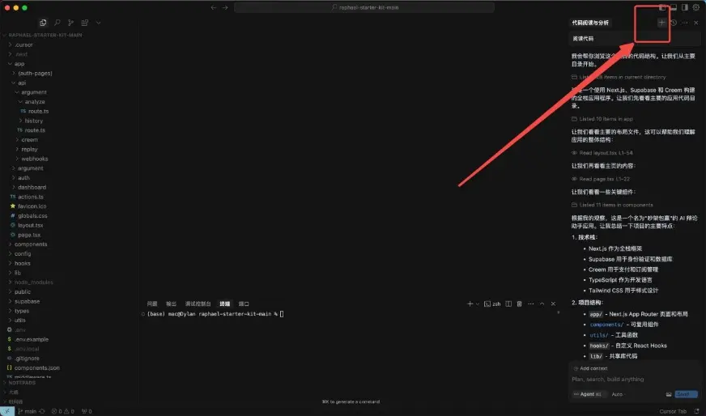

**技巧 7 AI 生成内容回退**

**为什么重要？**

AI 可能生成错误或不理想的代码

快速恢复到之前的版本

**操作方式**

快捷键撤销：Ctrl+Z（Win） / ⌘+Z（Mac）

选中历史对话节点，点击回退

如果已保存，通过 Git 回退（ git checkout -- file.JS ）

**技巧 8 善用@功能**

**为什么重要**

模型能力不稳定无法正确调用工具

**操作方式**

在 AI 对话框中使用@功能

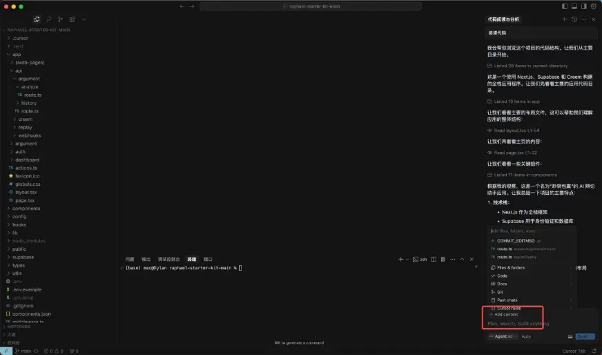

**技巧 9 添加查用文档 docs**

**为什么重要？**

集中存放 API 文档、技术规范

方便 AI 参考后生成更准确的代码

**操作建议**

在@- docs 中添加文档

在使用环节中@相关文档

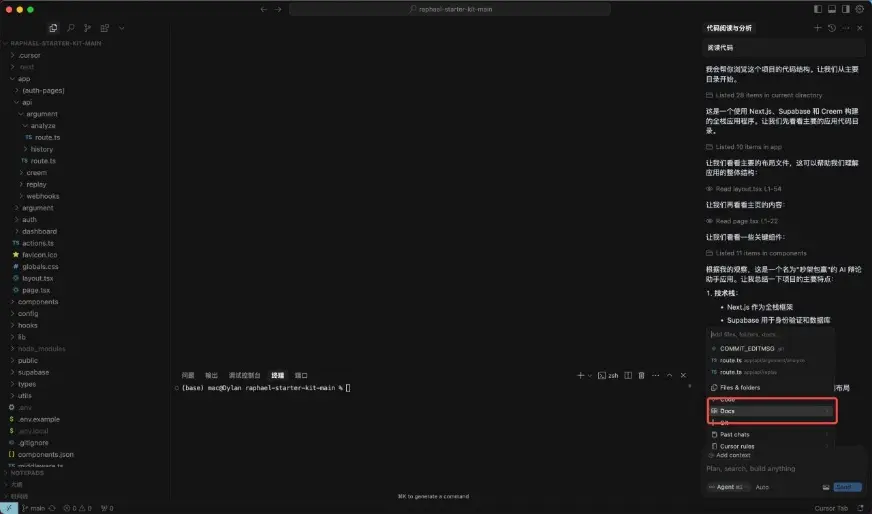

💡

怎样让 Cursor 更听话？

1\.

在 Cursor 里设置 context7 的 MCP

context 7 的作用是让 Cursor 永远可以查询到最新的开源框架的开发文档。

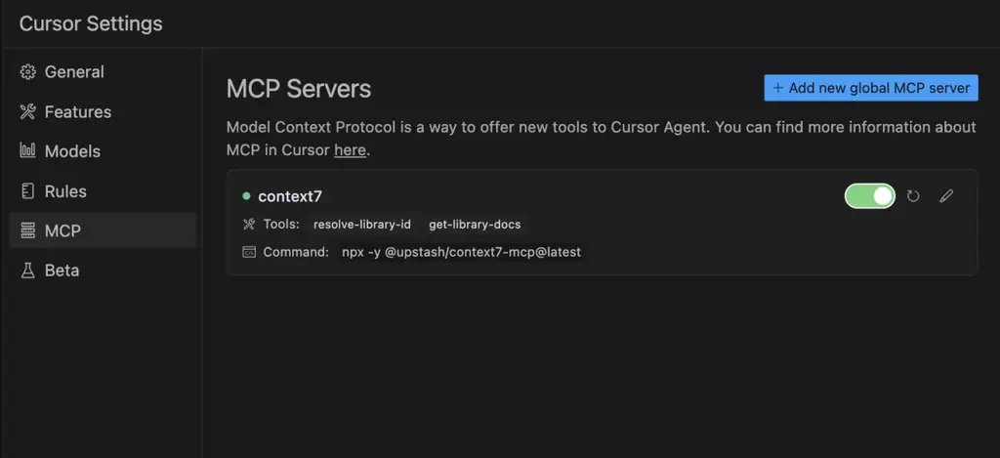

方法：在 Cursor 的「设置」界面，点击 Add new global MCP server， 改成以下内容

{ "mcpServers": { "context7": { "command": "npx", "args": \["-y", "@upstash/context7-mcp@latest"\] } } }

2\.

每次任务描述时，按照以下结构化格式 （可以不严格按照格式，但是要完整表达对应的意思）

\### 任务目标 1.xxx 2.xxx \### 任务背景 1.xxx 2.xxx 3.xxx \### 可能用到的资源 （这里可以@一些可能会用到的代码文件，以及截图标注、以及开发文档）

以下是一个例子，我们让 Cursor 帮忙做「支付成功后，跳转到特定页面」的功能。通过这样的模板，一次通过。

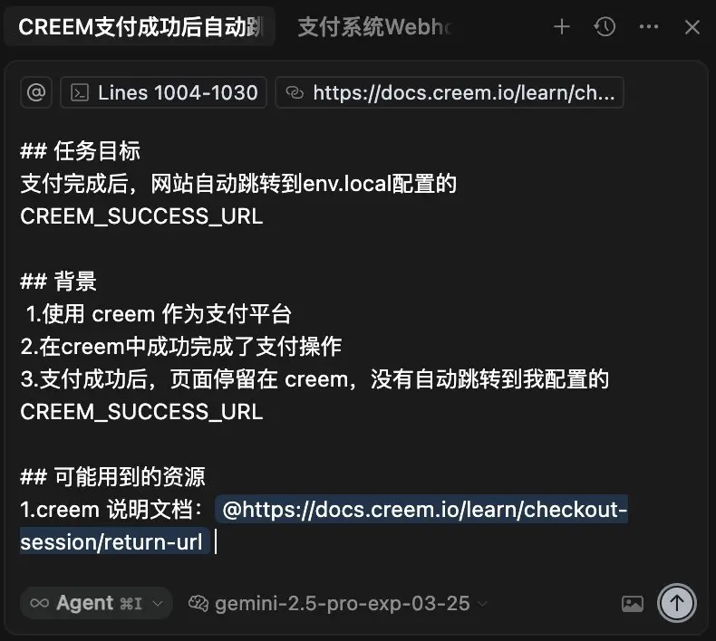

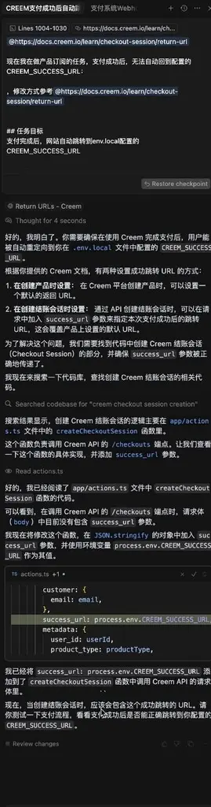

💡

Cursor 仍然乱改我代码，还有其他方法吗？

还可以试试 AugmentCode。 AugmentCode 做了很重的 Agent，结合了 Claude 和 O1 的优势，在编程比赛中击败了 Cursor。

咱们生财圈友里有几位同学，饱受 Cursor 的摧残，改用 AugmentCode 后，抑郁症都好了。

官网：https://www.augmentcode.com/

平时我是 AugmentCode 和 Cursor 两个工具结合起来用的。比较宏观的功能用 AugmentCode 做，微调用 Cursor 进行。也建议你多试试，找到适合自己的方式

tips：记得也给配置是 Context7 的 MCP。

以下是我的使用界面

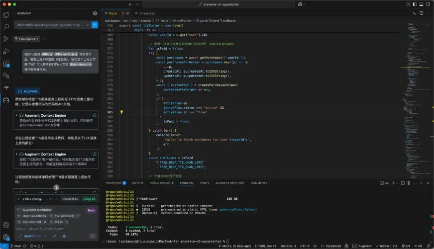

以下是我的配置界面

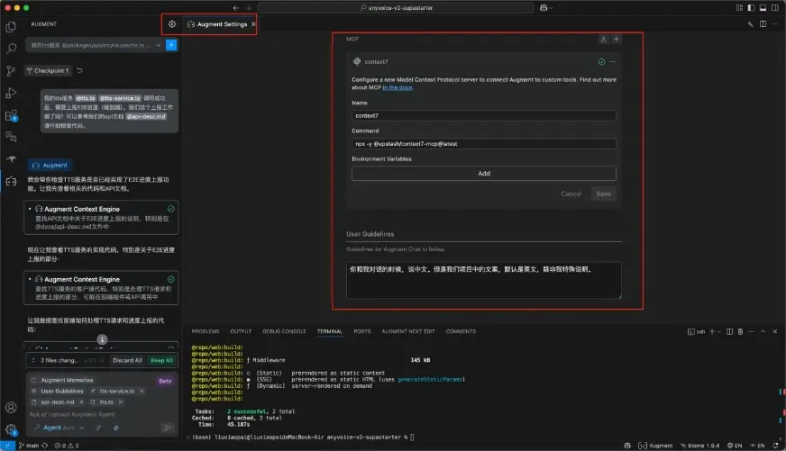

**Claude Code（慎重选择）**

💡

贵，但是好。

Claude Code 是 Anthropic 推出的终端 AI 编程助手。它最大的优势在于**可一次性理解和操作整个代码库**，而不是像 Cursor 那样受限于单次 200 行的 token 限制。

这意味着 Claude Code 能够跨文件、跨模块地理解你的项目结构、依赖关系和业务逻辑，并支持复杂的批量修改、重构、自动 PR、测试等一站式开发流程。

**Claude Code 安装与使用教程（图文详解）**

**注意：Claude Code 需付费会员账号或 API Key，未开通无法体验全部功能。下述流程基于官方文档与公开教程整理，截图为模拟示意。**

**1. 安装 Claude Code**

**前提条件：**

已安装 Node.js 18+ 和 npm

已注册 Anthropic 账号并获取 API Key

**命令行安装：npm install -g @anthropic-ai/claude-code**

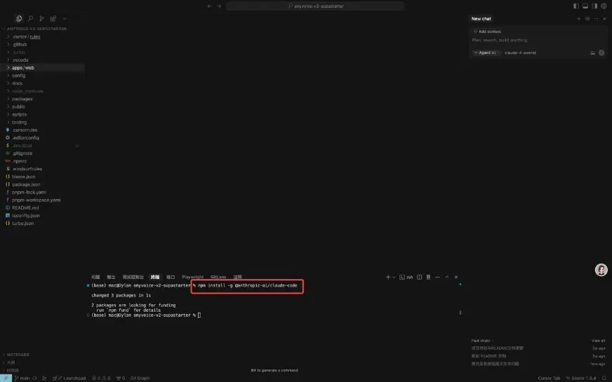

输入 claude code ，运行：claude code

选择颜色模式

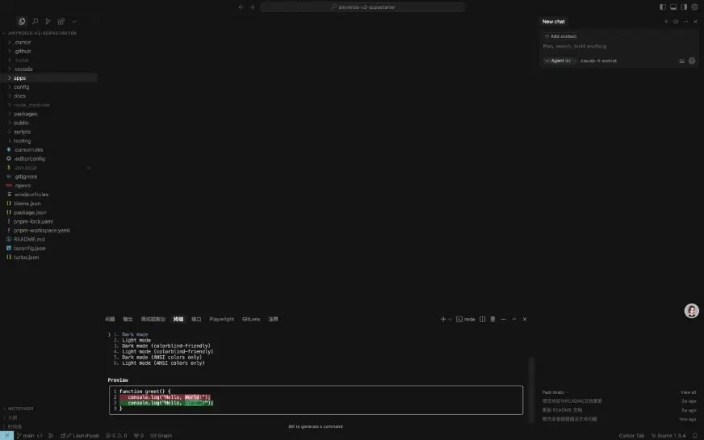

选择调用方式

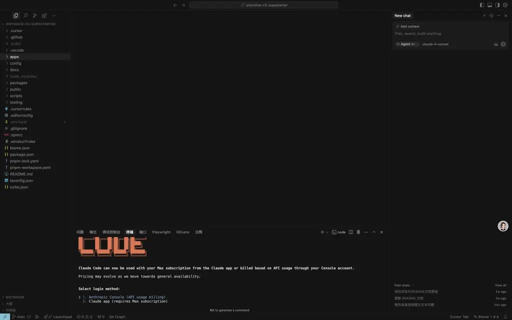

选择使用模式后，你就可以在终端进行对话，让 claude 来帮你修改文件了，

💡

**注意 ⚠️⚠️⚠️** **Claude 费用非常高，相比于 Cursor 的AI助手，优势是不受单次阅读 200 行代码限制。初期非常不推荐使用 Claude code 来做，因为成本过高**

**1.10 常见疑问**

**Q1：如何更改主题颜色？**

A1：Ctrl+, 打开设置，搜索 "Color Theme" 进行更改

**Q2：AI 功能需要付费吗？**

A2：基础 AI 功能免费，高级功能、次数需要订阅

**Q3：如何安装扩展？**

A3：Cursor 目前不支持像 VS Code 那样的扩展系统，但内置了大多数常用功能

**Q4：代码自动保存吗？**

A4：默认不自动保存，建议养成 Ctrl+S 的习惯

**Q5：提交代码时，网页端 GitHub 的验证码如何获取**

A5：在 Cursor 弹出的提示中出现
