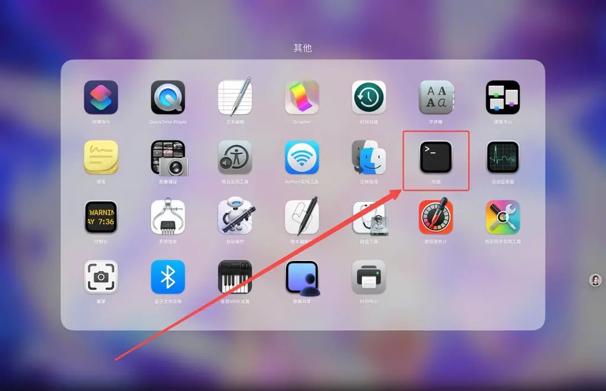
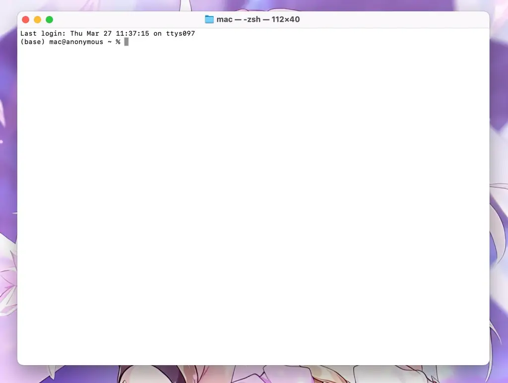
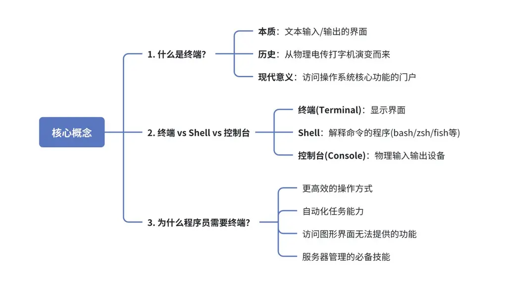
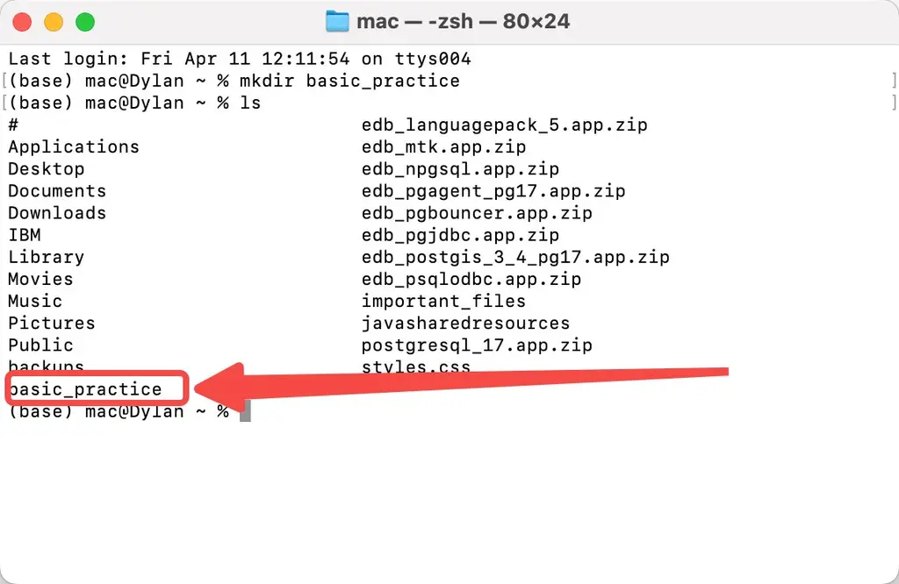
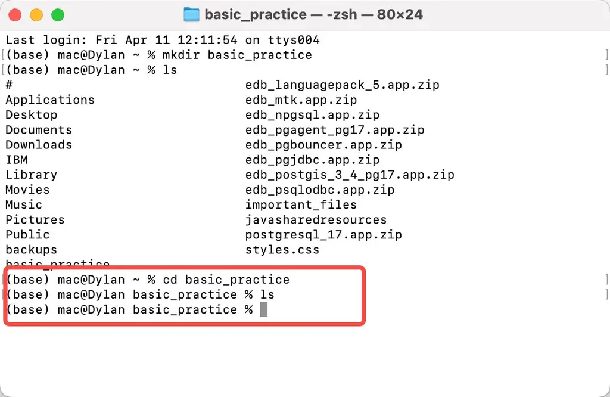
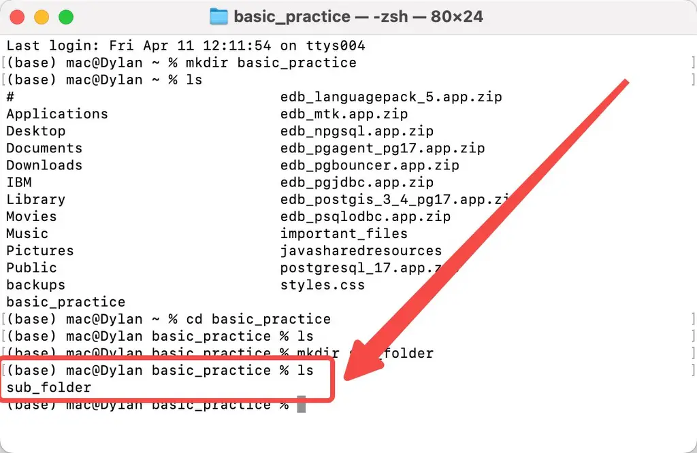
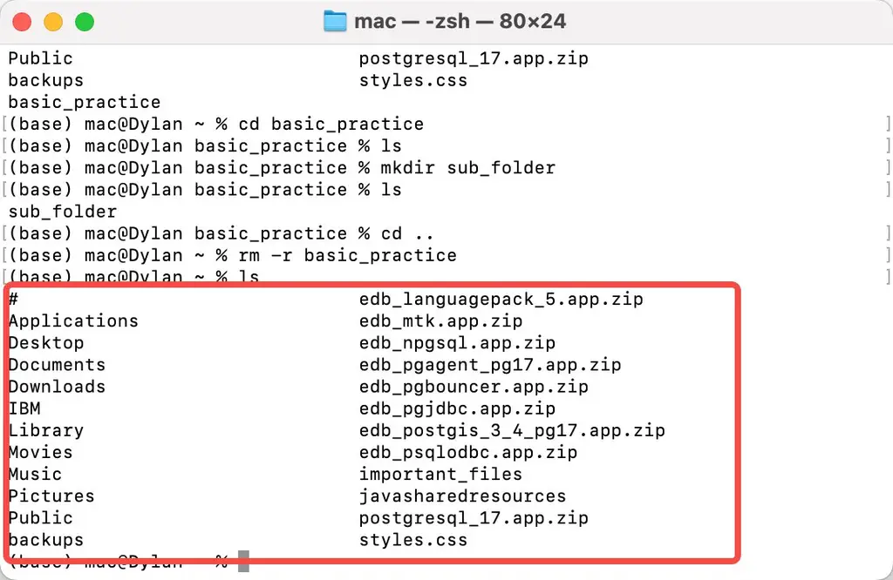

**二、Terminal（终端）**

💡

终端是程序员最重要的工具之一，让我们系统地学习这个强大的界面。

**Mac 打开方式**

**windows 打开方式**

**快捷键**：Win + R，输入 cmd 或 powershell，回车。

**搜索**：按 Win + S，输入“cmd”或“终端”，选择打开。

**右键菜单**：在文件夹中按住 Shift + 右键，选“在此处打开终端”。

**终端界面**

**2.1 概念介绍**

**基本指令**

基本命令结构

命令 \[选项\] \[参数\]

**选项**：通常以 **-** 或 **--** 开头，修改命令行为

**参数**：命令操作的对象

文件系统导航

pwd \# 显示当前目录(Print Working Directory) ls \# 列出目录内容(List) cd \[目录\] \# 切换目录(Change Directory) mkdir \# 创建目录(Make Directory) rmdir \# 删除空目录(Remove Directory)

文件操作

touch 文件名 \# 创建空文件 cat 文件名 \# 查看文件内容 cp 源 目标 \# 复制文件(Copy) mv 源 目标 \# 移动/重命名文件(Move) rm 文件名 \# 删除文件(Remove)

实用命令

grep '模式' 文件 \# 文本搜索 find 目录 -name "模式" \# 文件查找 ps \# 显示进程(Process Status) top \# 动态显示进程(类似任务管理器) chmod \# 修改文件权限(Change Mode)

快捷键

Ctrl+C：终止当前命令

Ctrl+D：结束输入/退出会话

Ctrl+Z：暂停当前进程

Ctrl+R：反向搜索命令历史

Tab：自动补全

**2.2 实战项目**

**2.2.1 入门项目**

1\.

创建一个名为 basic_practice 的目录。

mkdir basic_practice

2\.

查看当前文件结构

ls

发现文件已成功新增

3\.

进入 basic_practice 目录。

cd basic_practice

4\.

查看当前文件结构

ls

当前文件为空

5\.

在 basic_practice 目录下创建一个子目录 sub_folder。

mkdir sub_folder

6\.

查看当前文件结构

ls

新增的文件出现

7\.

回到上一级目录。

cd ..

8\.

删除 basic_practice 目录及其子目录。

rm -r basic_practice

9\.

查看当前文件结构

ls

文件已删除

**2.2.2 常见疑问**

Q1：这些奇怪的符号是什么意思？

A1：

\#!/bin/bash：告诉系统这是 bash 脚本

$HOME：你的用户主目录路径

$(date +%Y%m%d)：获取当前日期，格式如 20230815

$?：上一条命令是否成功（0 表示成功）

Q2：如何知道哪些命令可用？

A2：试试这些基础命令：

ls \# 查看文件夹内容 cd \# 切换目录 mkdir \# 创建文件夹 cp \# 复制文件 man 命令 \# 查看命令帮助，如man ls

