作为完全的新手，我会用最简单的方式教你 HTML，就像我们之前学习终端一样，通过实际操作来学习。

**3.1 概念介绍**

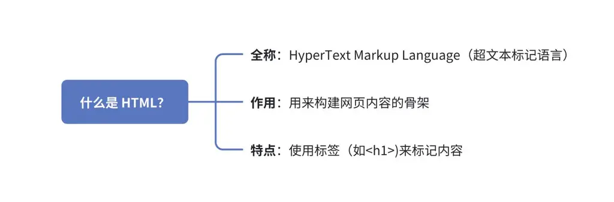

**2. 基本结构**

每个 HTML 文档都有这样的基本结构：

＜!DOCTYPE HTML＞

＜HTML＞

＜head＞

＜title＞我的第一个网页＜/title＞

＜/head＞

＜body＞

＜!-- 这里放网页内容 --＞

＜/body＞

＜/HTML＞

HTML 根据内容性质，将被分为两个部分，即＜head＞＜/head＞ 和 ＜body＞＜/body＞标签

1\.

＜head＞＜/head＞：头部的内容不会显示在网页当中，主要是存放一些后台资料，像是文件的字符编码、关键字和程式脚本等

2\.

＜body＞＜/body＞：身体的内容则显示在网页当中，即用户所看到的内容，包含网页文字、图片、按钮等

**3. 常用标签**

元素类型

标签

用法

示例

区块元素

Heading

标题

共分为 6 个层级＜h1＞—＜h6＞

＜h1＞等级最高，通常用于网页的主题。其他层级等级依次顺延

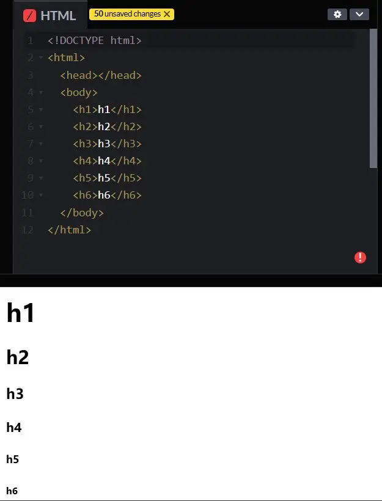

区块元素

＜p＞

正文

每一对＜p＞＜/p＞都代表一个独立的段落

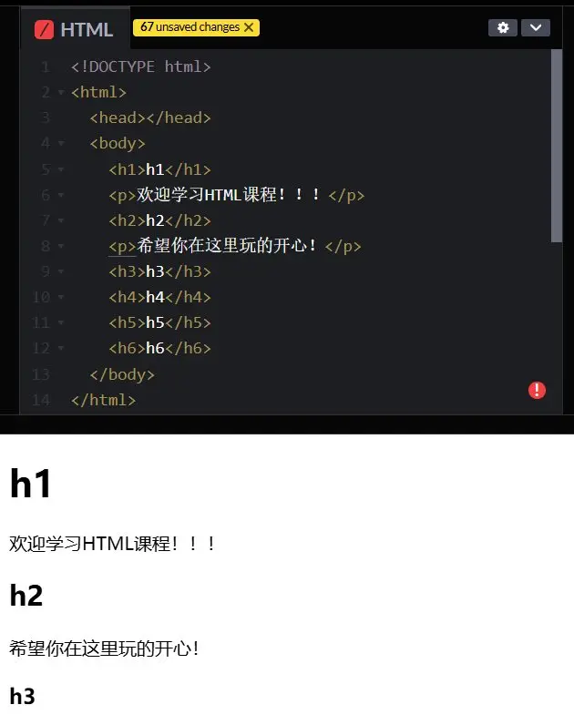

行内元素

＜strong＞

粗体

用法示例：＜p＞＜strong＞这里是需要加粗的文字哦＜/strong＞＜/p＞

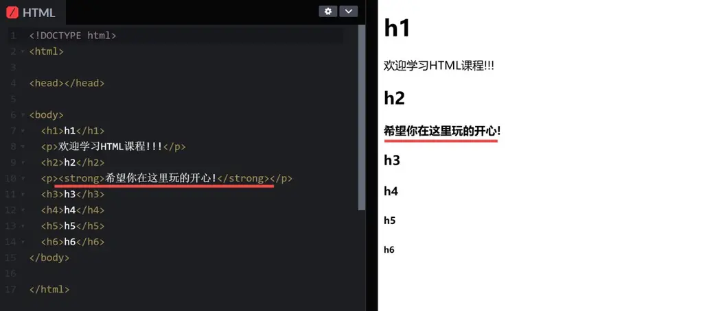

行内元素

＜em＞

斜体

用法示例：＜p＞＜em＞这里是变成斜体的文字哦＜/em＞＜/p＞

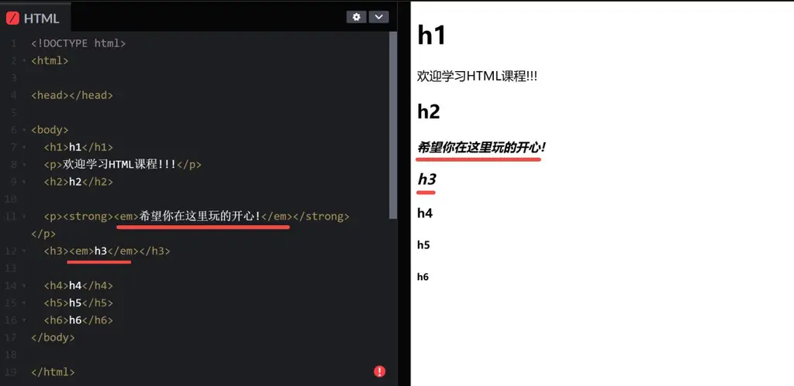

行内元素

＜a＞

建立网页链接

使用时，加上 href 的**属性，**指定目标的网址或当前目录中的某个网页

（由于目前还没有建立其他的页面，所以这里暂时先输入一个#字号

＜a href="#"＞＜/a＞

或在这里随意增加一个网址，如我们当前的 codepen 页面。如图，就会出现“套娃”的情景：

＜a href="https://codepen.io/pianmaa/pen/LEYQYOr?editors=1010"＞＜/a＞

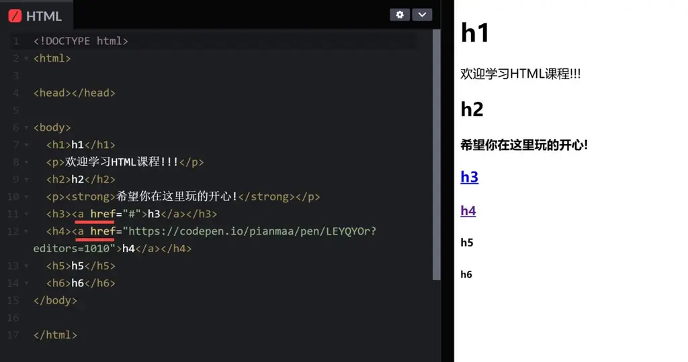

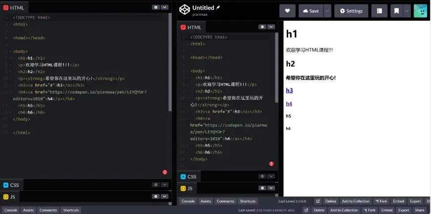

区块元素

清单

开头：

＜ol＞有序

＜ul＞无序

内容：

＜li＞

＜ol＞开头：（有序）/＜ul＞（无序）

＜li＞内容：每一组＜li＞在浏览器都会显示为清单中的一个项目

清单——常用做网站的导览列（做导览列的每个项目都会链接不同的网页，可以组合＜a＞使用）：

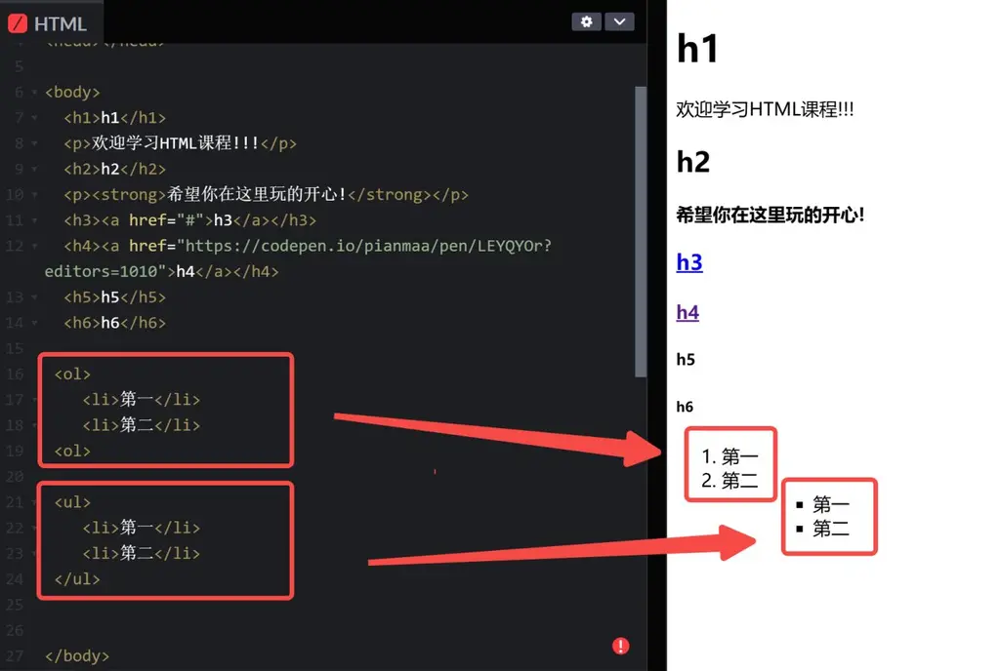

区块元素

＜blockquote＞标注/引用

使用时，加上cite的**属性**，用来标示引用的来源网址 ＜blockquote cite="https://codepen.io/pen"＞"引用一下" ＜/blockquote＞

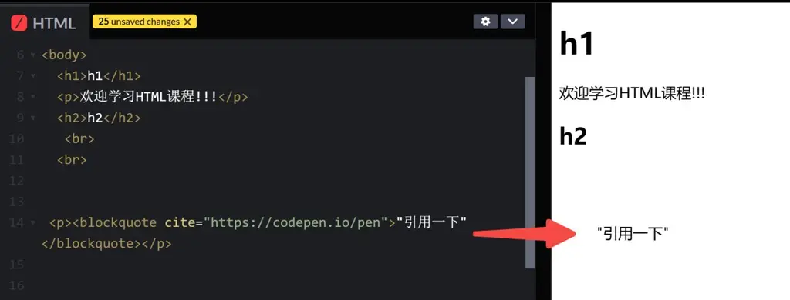

行内元素

＜br＞换行

是一个**空元素**，用于在 HTML 中插入换行。

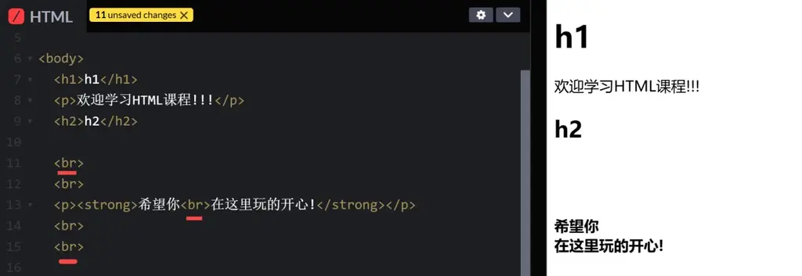

区块元素

＜img＞插入图片

＜img src="images/path.png" alt="一张图片"＞

1\.

src 标注图片的网址或路径 src="images/path.png"，

2\.

alt 以一段文字描述这张图片，该段文字在图片无法正常显示时出现

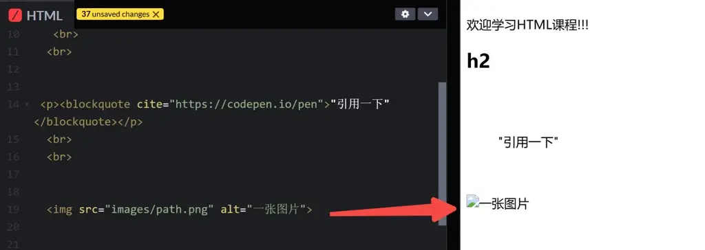

**4.构建内容展示结构的标签**

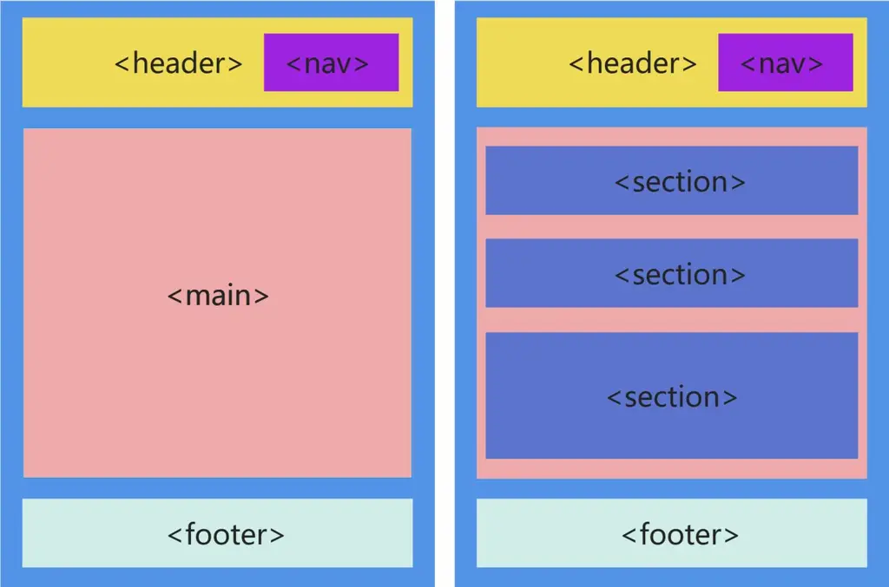

＜div＞:一个辅助标签，可用于划分或组织 HTML 的元素，例如：可以将原本的两个区块合并为一个，＜h2＞和＜p＞

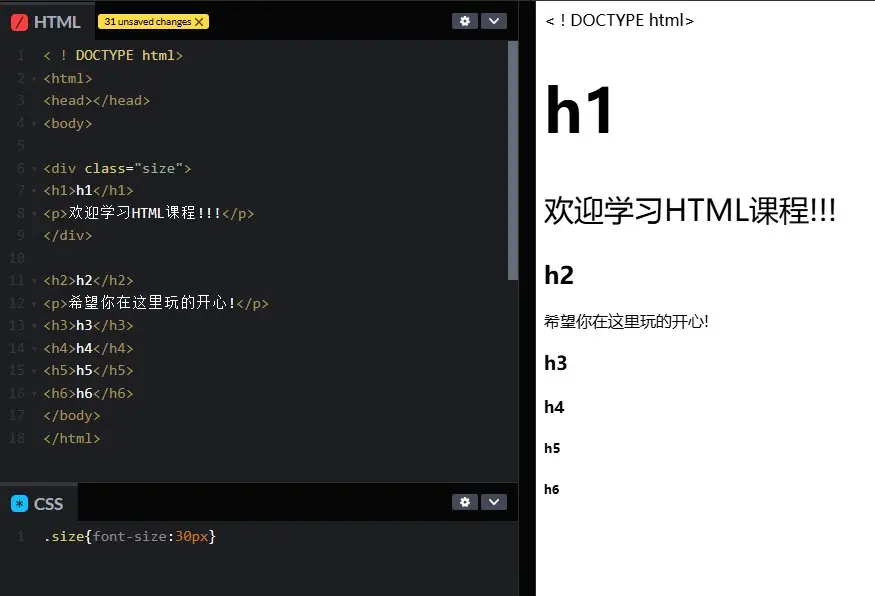

＜header＞：包含网站 LOGO 等页首的内容

＜nav＞：放置网站的导览列或菜单

＜main＞：包含网页的主要内容

＜section＞：组织页面内容，使其更具结构性。每个＜section＞都会围绕一个主题，并可以包含标题（如 ＜h1＞ 到 ＜h6＞）、段落、列表等。

对不同的＜section＞进行分组：可使用 class 属性随意取一个组别名称，例：＜section class="news"＞；然后在。css 样式表内对 class 属性进行定义即可。

class 可重复使用，不同的＜section＞也可以用同一个 class

＜footer＞：用来标注网站的版权声明等内容

**3.2 实战项目**

**在实战学习中，你可以用这个网址工具进行快速预览尝试：**https://codepen.io/pianmaa/pen/LEYQYOr

**3.2.1 入门项目**

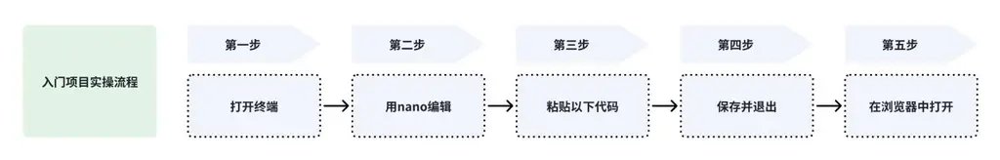

1\.

打开终端，创建一个新文件：

touch my_first_page.HTML

2\.

用 nano 编辑：

nano my_first_page.HTML

3\.

粘贴以下代码：

＜!DOCTYPE HTML＞ ＜HTML＞ ＜head＞ ＜title＞我的学习笔记＜/title＞ ＜/head＞ ＜body＞ ＜h1＞欢迎来到我的网页！＜/h1＞ ＜p＞这是我学习HTML的第一天。＜/p＞ ＜p＞我喜欢：＜/p＞ ＜ul＞ ＜li＞编程＜/li＞ ＜li＞音乐＜/li＞ ＜li＞旅行＜/li＞ ＜/ul＞ ＜/body＞ ＜/HTML＞

4\.

保存并退出：

按 Ctrl+O → 回车

按 Ctrl+X

5\.

在浏览器中打开：

在终端输入（Mac）：

open my_first_page.HTML

或直接双击文件

效果展示

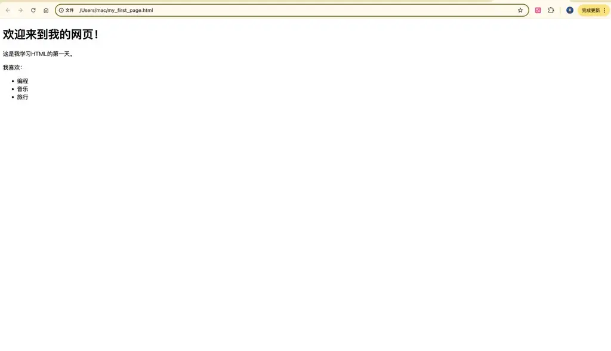

**3.2.2 项目升级：个人简介页面**

让我们创建一个更复杂的页面：

1\.

创建新文件：

touch profile.HTML nano profile.HTML

2\.

使用这个模板：

可复制版本：复制版本

＜!DOCTYPE HTML＞ ＜HTML＞ ＜head＞ ＜title＞我的个人简介＜/title＞ ＜style＞ body { font-family: Arial; max-width: 800px; margin: 0 auto; } .header { background-color: \#f0f0f0; padding: 20px; text-align: center; } .section { margin: 20px 0; border-bottom: 1px solid \#ddd; padding-bottom: 20px; } ＜/style＞ ＜/head＞ ＜body＞ ＜div class="header"＞ ＜h1＞张三的个人主页＜/h1＞ ＜img src="https://via.placeholder.com/150" alt="头像"＞ ＜/div＞ ＜div class="section"＞ ＜h2＞关于我＜/h2＞ ＜p＞我是一名编程初学者，正在学习HTML和Web开发。＜/p＞ ＜/div＞ ＜div class="section"＞ ＜h2＞联系方式＜/h2＞ ＜ul＞ ＜li＞Email: me@example.com＜/li＞ ＜li＞GitHub: ＜a href="https://github.com"＞我的GitHub＜/a＞＜/li＞ ＜/ul＞ ＜/div＞ ＜/body＞ ＜/HTML＞

3\.

尝试修改：

替换名字和联系方式

更改颜色（修改 style 中的颜色代码）

添加新的章节

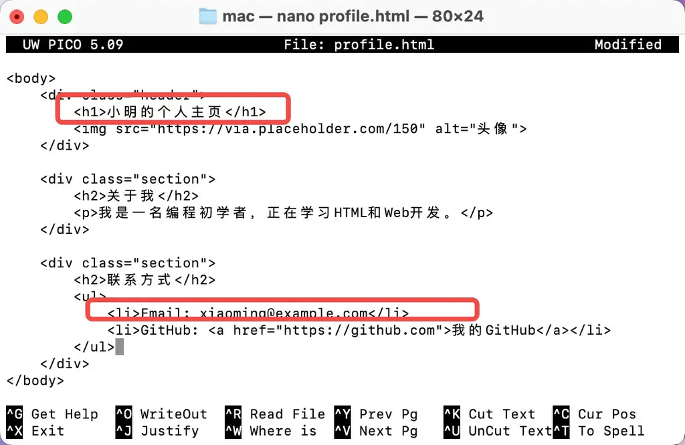

4\.

效果展示

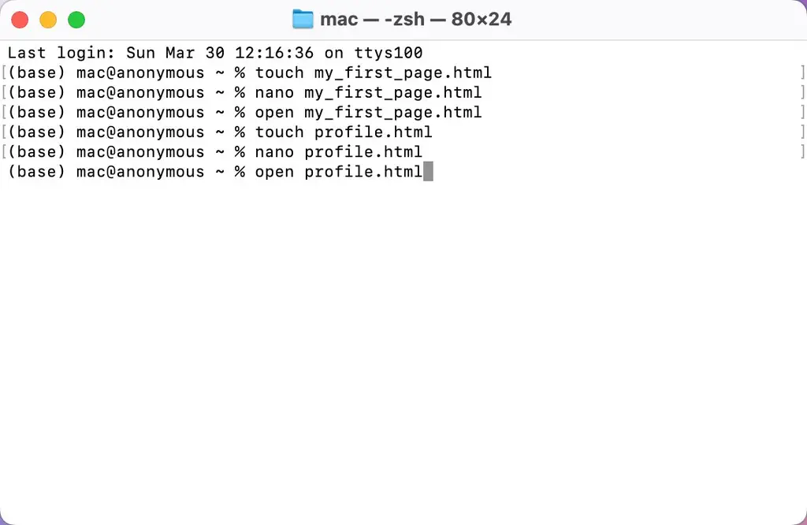

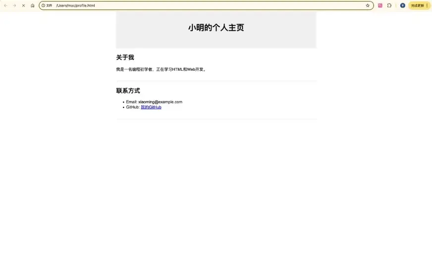

**3.3 常见疑问**

问题

答案

**如何添加图片？**

1\.

把图片放在同一文件夹

2\.

使用：

＜img src="你的图片.jpg" alt="描述"＞

**如何改变文字颜色？**

在＜style＞部分添加：

p { color: blue; } /\* 或者 \*/ .special { color: red; }

然后在 HTML 中使用：

＜p class="special"＞这段文字会变红＜/p＞

**如何添加背景色？**

＜body style="background-color: lightgray;"＞

**为什么我的修改没显示？**

1\.

保存文件了吗？

2\.

在浏览器中刷新页面（Command/Ctrl+R）

3\.

检查是否有拼写错误

期待你的提问，可在此直接评论

