**四、CSS**

💡

作为 HTML 的完美搭档，CSS 能让你的网页从"黑白电视"变成"彩色电影"。我会用最简单的方式教你 CSS，就像之前学习 HTML 一样

**4.1 概念介绍**

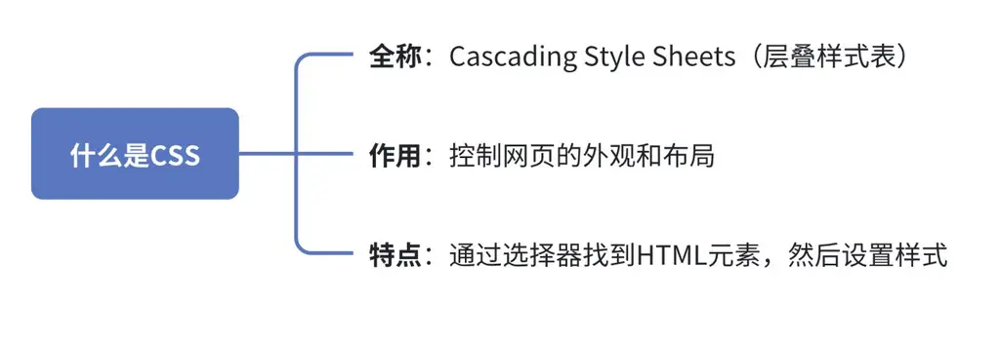

**1. 三种添加 CSS 的方式**

序号

用法

局限/特点

例子

1、

**内联样式**（直接写在 HTML 标签里）

如果在页面内插入第二个没有设定 css 的＜h2＞标题，对应的 red 不会应用，如图

＜h2 style="color: red"＞红色二级标题＜/h2＞

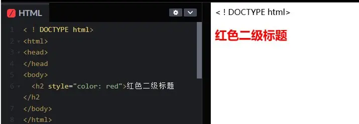

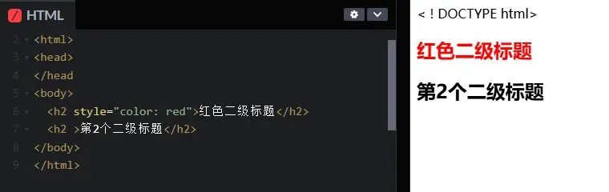

2、

**内部样式表**（放在＜style＞标签中）

只能对单独一个网页做外观样式处理

＜style＞ h2{ color: Red; } p{ color: blue; font-size：36px; } ＜/style＞

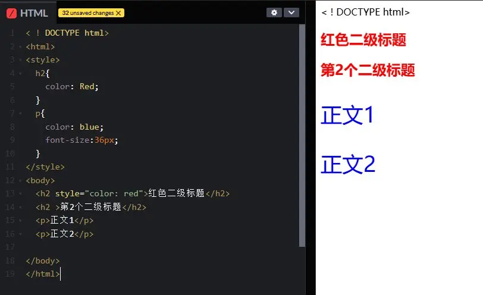

3、

**外部样式表**（最推荐的方式）

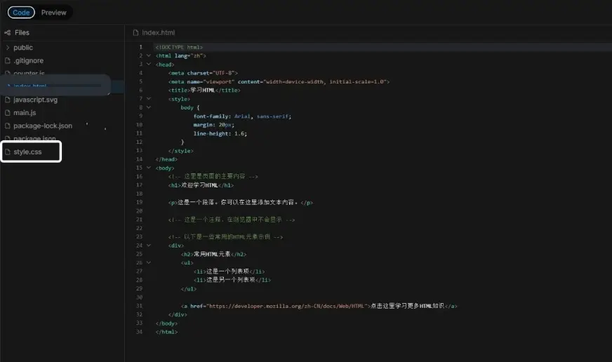

1\.

可以同时控制多个网页的外观

2\.

可以同时控制每一组 class 的外观

**可以同时控制多个网页的外观**

**style.css:**

h2{ color: Red; } p{ color: blue; font-size:36px; }

**HTML 网页内：**

＜head＞ ＜link rel="stylesheet" href="style.css"＞ ＜/head＞

**可以同时控制每一组**

**style.css:**

.size{ color:red; font-size:30px }

**HTML 网页内：**

＜section class="news"

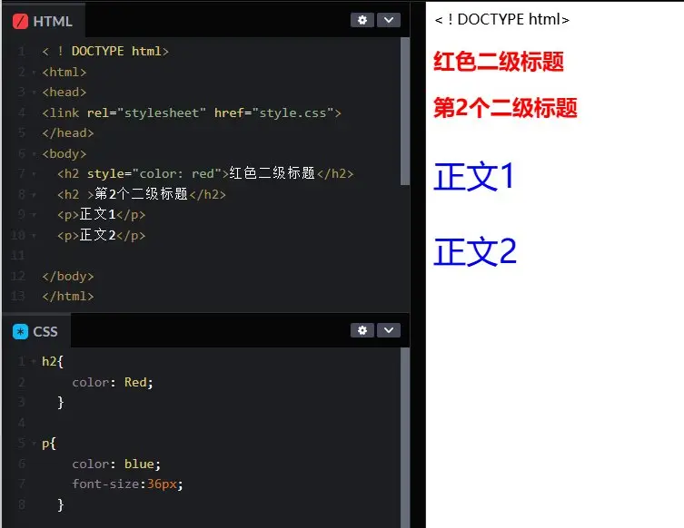

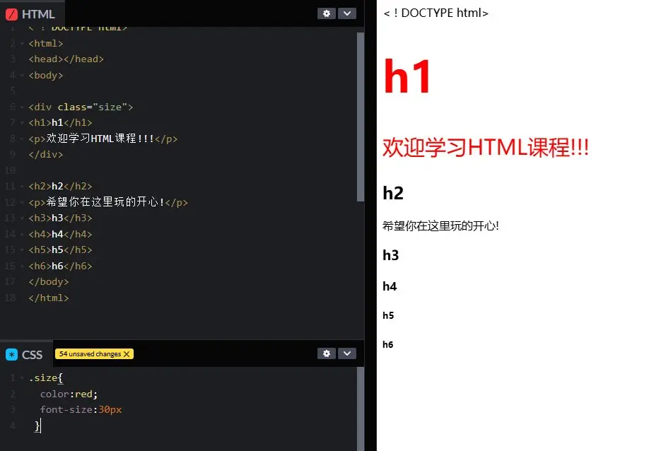

**2.选择器类型**

选择器

示例

说明

元素选择器

p { }

选择所有＜p＞标签

类选择器

.intro { }

选择class="intro"的元素

ID 选择器

\#special { }

选择id="special"的元素

后代选择器

div p { }

选择＜div＞内的所有＜p＞

**3.** **常用 CSS 属性**

类别

属性

示例

文字

color, font-size, font-family

color: red;

背景

background-color, background-image

background-color: \#fff;

盒子模型

width, height, padding, margin, border

padding: 10px;

布局

display, flex-direction, justify-content

display: flex;

1\.

CSS 的 3 个重要属性

A. border（边框）

B. padding（内边距）

C. margin（外边距）

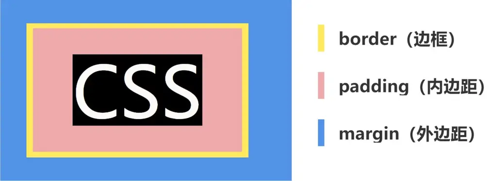

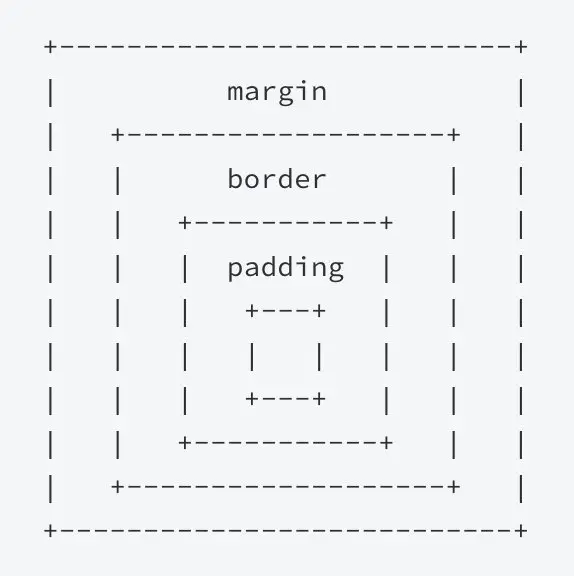

他们负责控制不同网页元素之间的距离，距离书写规则：

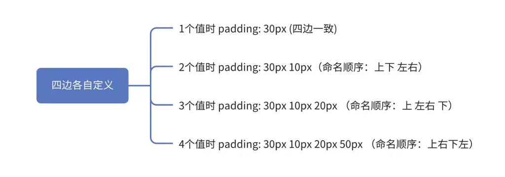

**4.2 实战项目**

**在实战学习中，你可以用这个网址工具进行快速预览尝试：**https://www.w3schools.com/css/css_editor.asp

💡

可复制代码版本：可复制代码版本

**4.2.1 入门项目**

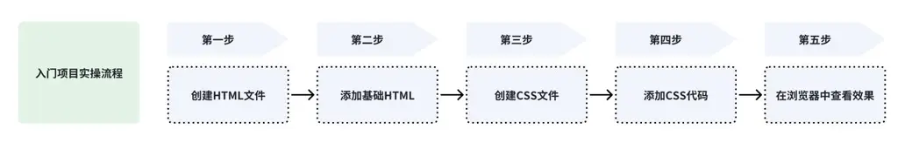

1\.

创建 HTML 文件：

touch css_demo.HTML nano css_demo.HTML

2\.

添加基础 HTML：

＜!DOCTYPE HTML＞ ＜HTML＞ ＜head＞ ＜title＞CSS学习＜/title＞ ＜link rel="stylesheet" href="styles.css"＞ ＜/head＞ ＜body＞ ＜h1＞欢迎学习CSS＜/h1＞ ＜p class="intro"＞这是第一个段落＜/p＞ ＜p id="special"＞这是特殊段落＜/p＞ ＜div class="box"＞这是一个盒子＜/div＞ ＜/body＞ ＜/HTML＞

3\.

创建 CSS 文件：

touch styles.css nano styles.css

4\.

添加 CSS 代码：

/\* 改变整个页面的字体 \*/ body { font-family: Arial, sans-serif; background-color: \#f5f5f5; margin: 0; padding: 20px; } /\* 标题样式 \*/ h1 { color: \#333; text-align: center; } /\* 类选择器 \*/ .intro { color: blue; font-size: 18px; } /\* ID选择器 \*/ \#special { background-color: yellow; padding: 10px; } /\* 盒子样式 \*/ .box { width: 200px; height: 200px; background-color: lightgreen; margin: 20px auto; border: 2px solid darkgreen; border-radius: 10px; }

5\.

在浏览器中查看效果：

open css_demo.HTML

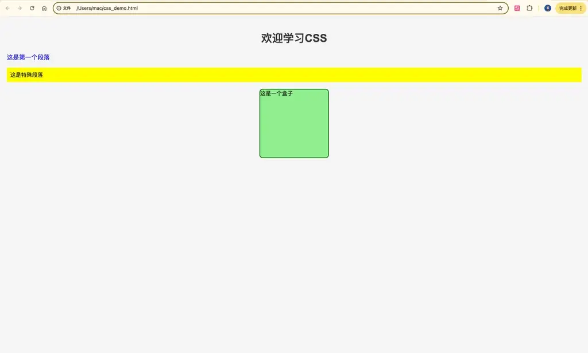

**4.2.2 项目升级：制作个人名片**

1\.

创建新文件：

touch business_card.HTML touch card_styles.css

2\.

HTML 代码 （business_card.HTML）：

＜!DOCTYPE HTML＞ ＜HTML＞ ＜head＞ ＜title＞我的名片＜/title＞ ＜link rel="stylesheet" href="card_styles.css"＞ ＜/head＞ ＜body＞ ＜div class="card"＞ ＜img src="https://via.placeholder.com/150" alt="头像"＞ ＜h2＞张三＜/h2＞ ＜p class="title"＞前端开发初学者＜/p＞ ＜p class="contact"＞电话: 123-456-7890＜/p＞ ＜p class="contact"＞邮箱: zhang@example.com＜/p＞ ＜/div＞ ＜/body＞ ＜/HTML＞

3\.

CSS 代码 （card_styles.css）：

body { display: flex; justify-content: center; align-items: center; height: 100vh; background-color: \#f0f0f0; margin: 0; } .card { width: 300px; background: white; padding: 20px; border-radius: 10px; box-shadow: 0 4px 8px rgba(0,0,0,0.1); text-align: center; } .card img { width: 150px; height: 150px; border-radius: 50%; object-fit: cover; margin-bottom: 15px; } .card h2 { margin: 0; color: \#333; } .title { color: \#666; font-style: italic; margin: 10px 0; } .contact { color: \#444; margin: 5px 0; }

4\.

查看效果

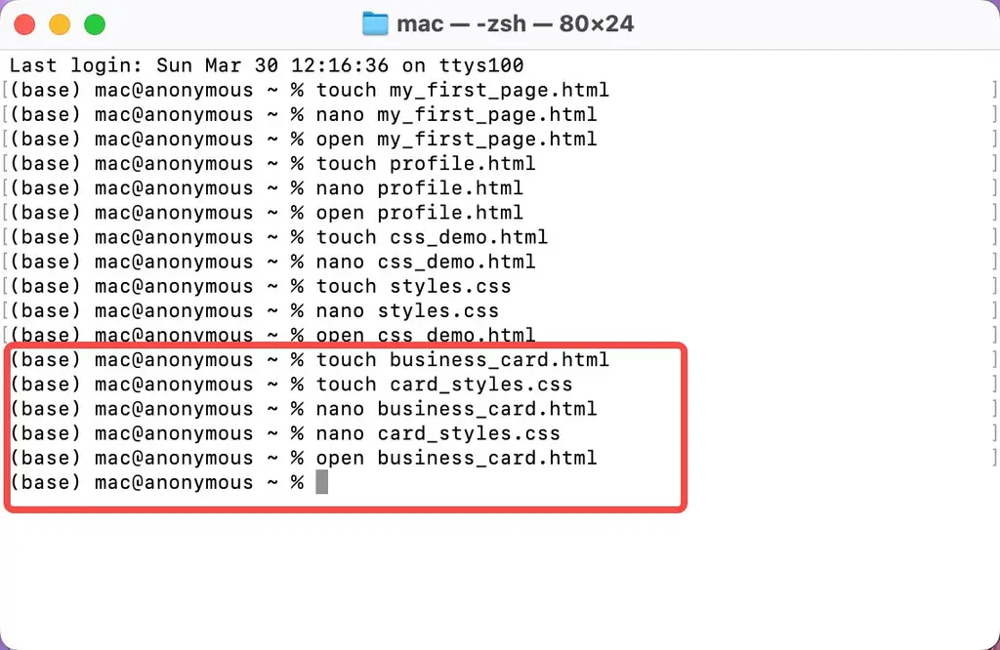

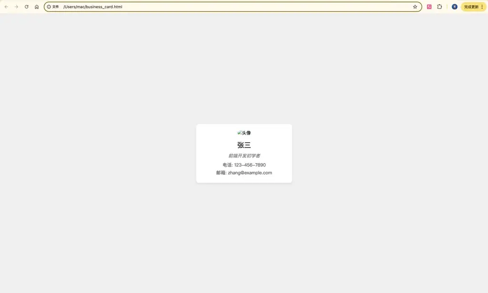

**4.3 常见疑问**

问题

答案

**为什么我的 CSS 样式没有生效？**

1\.

可能原因及解决方案：

2\.

选择器错误：

检查 HTML 和 CSS 中的类名/ID 是否一致（注意大小写）

示例：HTML 中是class="myClass"，CSS 应该是.myClass而不是.Myclass

3\.

优先级问题：

内联样式 ＞ ID 选择器 ＞ 类选择器 ＞ 元素选择器

使用!important强制覆盖（但不推荐滥用）：

p { color: red !important; }

4\.

文件路径错误：

检查＜link＞的 href 路径是否正确

推荐使用相对路径：

＜link rel="stylesheet" href="css/styles.css"＞

**如何居中一个 div？**

.container { display: flex; justify-content: center; /\* 水平居中 \*/ align-items: center; /\* 垂直居中 \*/ height: 100vh; /\* 视口高度 \*/ }

**如何实现两栏布局？**

.container { display: flex; } .left-column { width: 30%; } .right-column { flex: 1; /\* 占据剩余空间 \*/ }

**如何让元素并排显示？**

\* 方法1：使用flexbox \*/ .container { display: flex; } /\* 方法2：使用inline-block \*/ .item { display: inline-block; width: 30%; }

**如何去掉列表前的圆点？**

ul { list-style-type: none; padding-left: 0; /\* 同时去掉缩进 \*/ }

**如何添加文字阴影？**

h1 { text-shadow: 2px 2px 4px rgba(0,0,0,0.5); /\* 水平偏移 垂直偏移 模糊度 颜色 \*/ }

**如何制作圆形头像？**

.avatar { width: 100px; height: 100px; border-radius: 50%; /\* 关键属性 \*/ object-fit: cover; /\* 保持图片比例 \*/ }

**如何查看元素实际应用的 CSS？**

1\.

右键点击元素 → "检查"（Chrome/Firefox）

2\.

在开发者工具的"Styles"面板中：

可以看到所有应用的样式

被覆盖的样式会有删除线

可以实时修改测试效果

**为什么 margin-top 不生效？**

**可能原因**：

父元素没有边框（border）或内边距（padding）

存在外边距折叠（margin collapse）

**解决方案**：

.parent { overflow: auto; /\* 创建新的BFC \*/ /\* 或 \*/ padding: 1px; /\* 最小化影响 \*/ }

期待你的提问，可在此直接评论
