💡

**TypeScript 是 JavaScript 的亲哥，比 JavaScript 更严格但更靠谱**。

名称

**JavaScript**

**TypeScript**

特性

像是一个**随意写作业**的学生，写错了也能运行（比如把 数字 和 字符串 乱加在一起）。

灵活，但容易写出隐藏的 bug。

像是**强迫症老师**，要求你**先声明类型**才能写代码：

let age: number = 25; // 必须明确说这是数字 age = "25岁"; // ❌ 直接报错！（JavaScript 里却不会）

**最终会变成 JavaScript**（浏览器只认识 JS），但写代码时能提前发现错误。

**5.1 概念介绍**

**1. JavaScript 基础三要素**

**变量 - 数据的存储盒子**

let message = "你好世界"; // 创建一个名为message的盒子，放入"你好世界" const PI = 3.14; // 创建一个锁定的盒子，放入3.14且不能再改

let：普通盒子，可以随时换内容

const：上锁的盒子，内容固定不变

建议优先使用 const，需要改变时才用 let

**函数 - 可重复使用的工具包**

function makeJuice(fruit) { // 定义一个榨汁机 return fruit + "汁"; // 返回加工结果 } const myJuice = makeJuice("苹果"); // 使用榨汁机

function：创建工具包的模具

fruit：原料入口（参数）

return：成品出口（返回值）

**对象 - 属性收纳盒**

const person = { // 创建一个个人信息盒 name: "小明", // 名字抽屉 age: 20, // 年龄抽屉 hobbies: \["编程", "音乐"\] // 爱好抽屉（数组） }; console.log(person.name); // 取出名字

用 {} 创建对象

属性名: 值 的形式存储数据

用 . 访问属性

**2. TypeScript 类型安全**

**类型注解 - 给盒子贴标签**

let username: string = "小明"; // 这个盒子只能放文字 let age: number = 20; // 这个盒子只能放数字 let isStudent: boolean = true;// 这个盒子只能放true/false

在变量名后加 : 类型 来限制内容类型

错误示例：age = "20岁" 会报错（不能把文字放入数字盒子）

**接口 - 对象属性检查表**

interface Student { // 定义学生表格模板 name: string; // 必须有名字栏（文字） age: number; // 必须有年龄栏（数字） major?: string; // 可选专业栏（可能有也可能没有） } const stu1: Student = { name: "小红", age: 19 }; // 正确 const stu2: Student = { name: "小刚" }; // 错误：缺少age

**3.** **JavaScript (.JS)、JSX (.JSx)、TypeScript (.ts)、TSX (.tsx)**

.**JS、.ts、.JSx、.tsx 是什么？怎么用？**

1\.

JavaScript (.JS） —— 基础电路和自动化系统

就像房子里最基本的电路和自动化系统，JavaScript 提供了核心的运行功能，但缺少详细的说明书和严格的安全保障，容易出现接线不规范的问题。

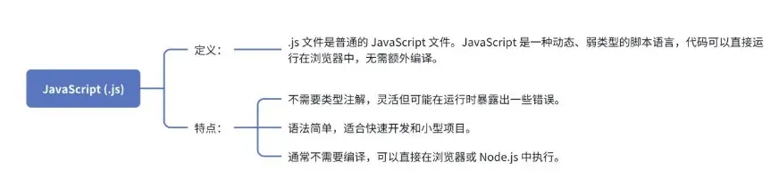

2\.

TypeScript (.ts） —— 升级版的电路系统

TypeScript 就像在原有电路系统基础上增加了详细蓝图和智能检测装置：每根线路、每个开关都有明确标识和安全规范，如果安装错误，系统会提前报警，让整个房子更安全、更易维护。

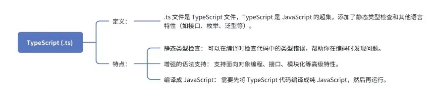

学员果果补充：

不知道怎么将 ts 转变为 JS，我问了 AI。

在 macOS 系统上安装

验证安装：

bash 重击

node -v

npm -v

显示版本号，则安装成功。

然后我按照 AI 推荐的代码运行，终端一直显示安装中，用了挺长时间，最后让重新输入 cd 什么的，输入完就安装好了。

分享给大家，仅做补充

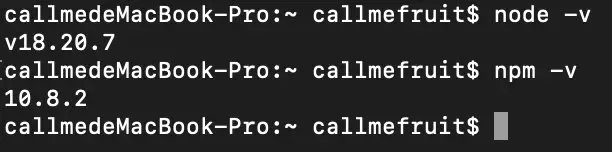

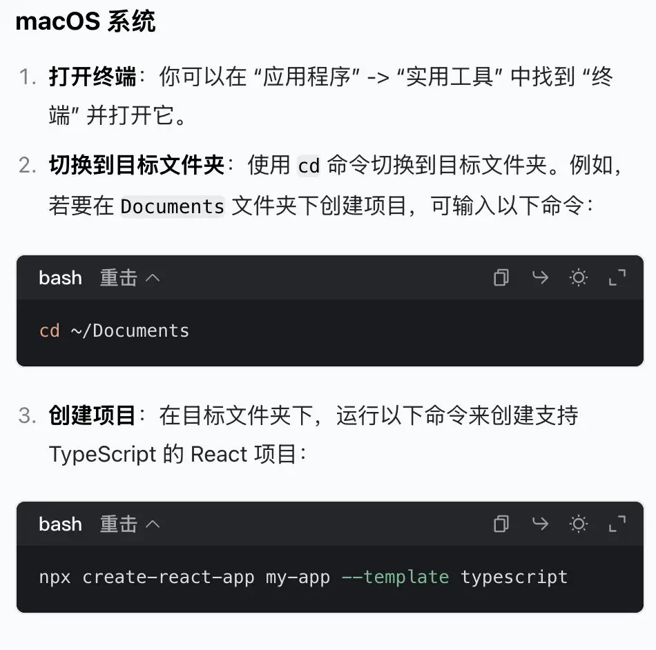

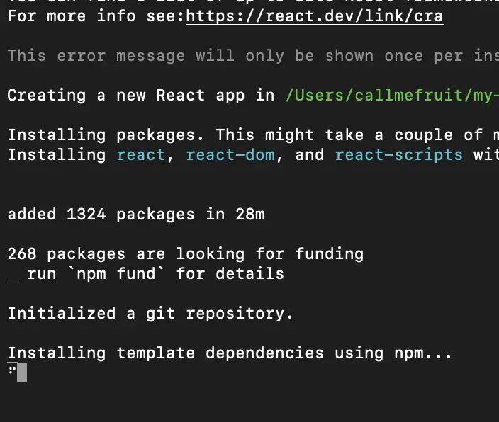

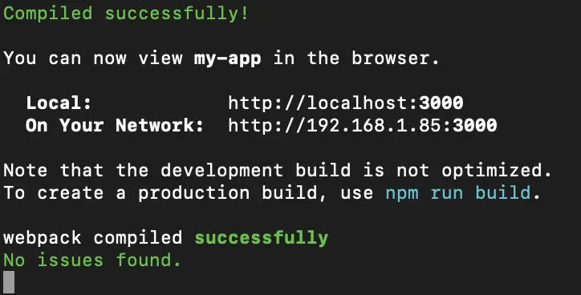

3\.

JSX (.JSx） —— 图形化控制界面

JSX 类似于给电路系统加上了一个直观的显示屏和控制面板，虽然底层依然是电路（JavaScript），但通过友好的图形界面，你可以更直观地看到和控制每个设备（UI 组件）。

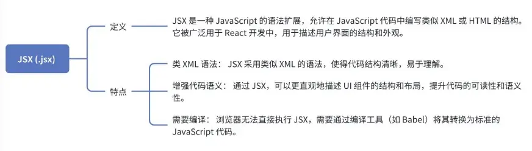

举个例子，我们可以将 XML 文档比作一本书籍，每个部分都有特定的角色和规则：

文档声明： 就像书籍的封面，标明了书名、作者和版本信息。XML 的文档声明位于文件的开头，指定了 XML 的版本和编码方式，例如：＜?xml version="1.0" encoding="UTF-8"?＞。

元素和结束标签： 类似于书中的章节标题和内容，每个元素都有一个开始标签和一个结束标签，内容位于两者之间。例如：＜chapter＞内容＜/chapter＞。

4\.

TSX (.tsx） —— 安全电路系统+智能家居控制面板

TSX 就是在升级版电路系统（TypeScript）的基础上，再加上了智能化、直观的控制界面（JSX），既保证了系统的安全性和规范性，又能以直观的方式管理和展示系统状态，非常适合现代的 React 开发。

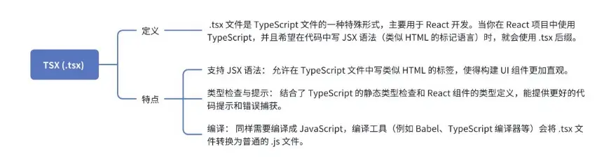

**JS、JSx、ts、tsx 代码示例（让我们用做菜来理解这部分代码）**

1\.

.JS：就像随手写下一段简单的做饭步骤：

// example.JS function greet(name) { console.log("Hello, " + name + "!"); } greet("Alice");

这里你直接告诉程序“当见到名字时，就打招呼”，不做任何类型检查。

2\.

.JSx:现在你需要写一个带有漂亮摆盘（用户界面）的菜谱：

// ExampleComponent.JSx import React from 'react'; // 定义组件属性的类型 const ExampleComponent = ({ name }) =＞ { return ＜div＞Hello, {name}!＜/div＞; }; export default ExampleComponent;

JSX 只是简单地假设你已经用对了食材，然后为你呈现漂亮的装盘。

3\.

.ts：在写菜谱时，你规定了每种食材的量（类型），确保出错前就被提醒：

// example.ts function greet(name: string): void { console.log(\`Hello, ${name}!\`); } greet("Alice");

如果你错误地传入了数字，比如 greet(123)，编译器会报错，提醒你应该传字符串。这就是类型检查的作用。

4\.

.tsx：现在你需要写一个带有漂亮摆盘（用户界面）的智能菜谱（有类型检查）：

// ExampleComponent.tsx import React from 'react'; // 定义组件属性的类型（就像明确菜谱里每种食材的用量） interface Props { name: string; } // 这里写的是一个 React 组件，用 JSX 来描述界面 const ExampleComponent: React.FC＜Props＞ = ({ name }) =＞ { return ＜div＞Hello, {name}!＜/div＞; }; export default ExampleComponent;

这段代码既有 TypeScript 的类型检查（确保 name 是字符串），又使用了 JSX 语法来写出类似 HTML 的界面代码。

**5.2 实战项目**

在本实战环节中，推荐使用 Cursor 来完成任务

**5.2.1 入门项目**

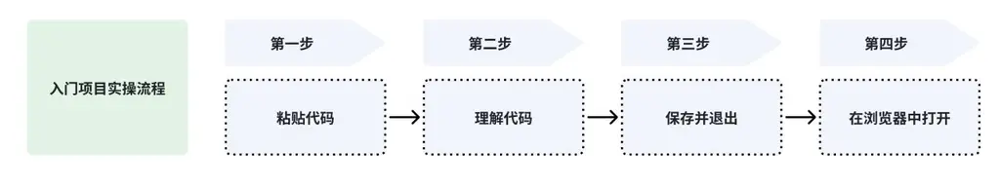

**目标说明**

\[+\] 按钮：数字 +1

\[-\] 按钮：数字 -1

显示当前数值

**阅读代码，复制到 HTML 文件中**

可复制版本：可复制版本

＜!-- HTML结构 - 可视化界面 --＞ ＜div＞ ＜button id="btn-minus"＞-＜/button＞ ＜!-- 减号按钮 --＞ ＜span id="display"＞0＜/span＞ ＜!-- 显示数字的区域 --＞ ＜button id="btn-plus"＞+＜/button＞ ＜!-- 加号按钮 --＞ ＜/div＞ ＜script＞ // 1. 准备变量（记忆当前数值） let count = 0; // 2. 获取页面元素（找到操作对象） const display = document.getElementById("display"); const plusBtn = document.getElementById("btn-plus"); const minusBtn = document.getElementById("btn-minus"); // 3. 给加号按钮添加"耳朵" plusBtn.addEventListener("click", () =＞ { count++; // 数值+1 display.textContent = count; // 更新显示 }); // 4. 给减号按钮添加"耳朵" minusBtn.addEventListener("click", () =＞ { count--; // 数值-1 display.textContent = count; // 更新显示 }); ＜/script＞

**详细讲解**

HTML 部分

＜div＞ ＜button id="btn-minus"＞-＜/button＞ ＜!-- 减号按钮 --＞ ＜span id="display"＞0＜/span＞ ＜!-- 显示数字的区域 --＞ ＜button id="btn-plus"＞+＜/button＞ ＜!-- 加号按钮 --＞ ＜/div＞

＜div＞：作为一个容器元素，用于将减号按钮、显示区域和加号按钮组合在一起。

＜button id="btn - minus"＞-＜/button＞：创建一个减号按钮，id 属性为 btn - minus，方便后续通过 JavaScript 来选中该按钮。

＜span id="display"＞0＜/span＞：创建一个用于显示数字的区域，初始显示数字为 0，id 属性为 display，便于后续更新显示内容。

＜button id="btn - plus"＞+＜/button＞：创建一个加号按钮，id 属性为 btn - plus，后续可通过 JavaScript 选中该按钮。

JavaScript 部分

// 1. 准备变量（记忆当前数值） let count = 0; // 2. 获取页面元素（找到操作对象） const display = document.getElementById("display"); const plusBtn = document.getElementById("btn-plus"); const minusBtn = document.getElementById("btn-minus"); // 3. 给加号按钮添加"耳朵" plusBtn.addEventListener("click", () =＞ { count++; // 数值+1 display.textContent = count; // 更新显示 }); // 4. 给减号按钮添加"耳朵" minusBtn.addEventListener("click", () =＞ { count--; // 数值-1 display.textContent = count; // 更新显示 });

let count = 0;：声明一个变量 count 并初始化为 0，这个变量用于记录当前计数器的数值。

const display = document.getElementById("display");：使用 document.getElementById 方法获取 id 为 display 的 ＜span＞ 元素，后续会用它来更新显示的数字。

const plusBtn = document.getElementById("btn - plus");：获取 id 为 btn - plus 的加号按钮元素。

const minusBtn = document.getElementById("btn - minus");：获取 id 为 btn - minus 的减号按钮元素。

plusBtn.addEventListener("click", () =＞ { ... });：为加号按钮添加一个点击事件监听器。当用户点击加号按钮时，会执行箭头函数中的代码。在这个函数中，count++ 会让 count 变量的值加 1，然后 display.textContent = count 会将更新后的 count 值显示在 ＜span＞ 元素中。

minusBtn.addEventListener("click", () =＞ { ... });：为减号按钮添加一个点击事件监听器。当用户点击减号按钮时，会执行箭头函数中的代码。在这个函数中，count-- 会让 count 变量的值减 1，然后 display.textContent = count 会将更新后的 count 值显示在 ＜span＞ 元素中。

这段代码通过 HTML 创建了界面，再利用 JavaScript 实现了计数器的交互功能。

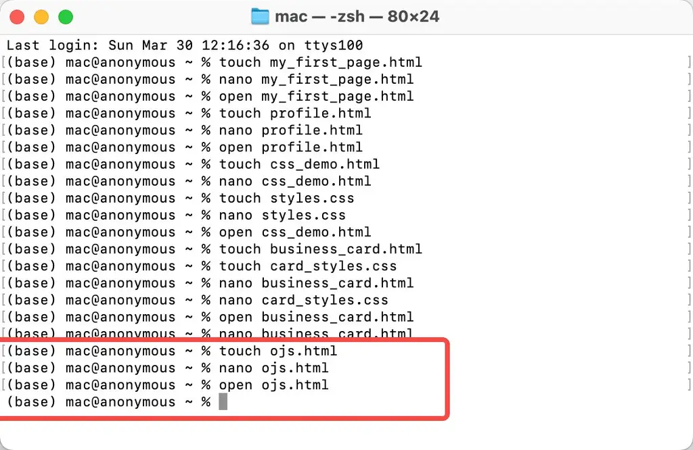

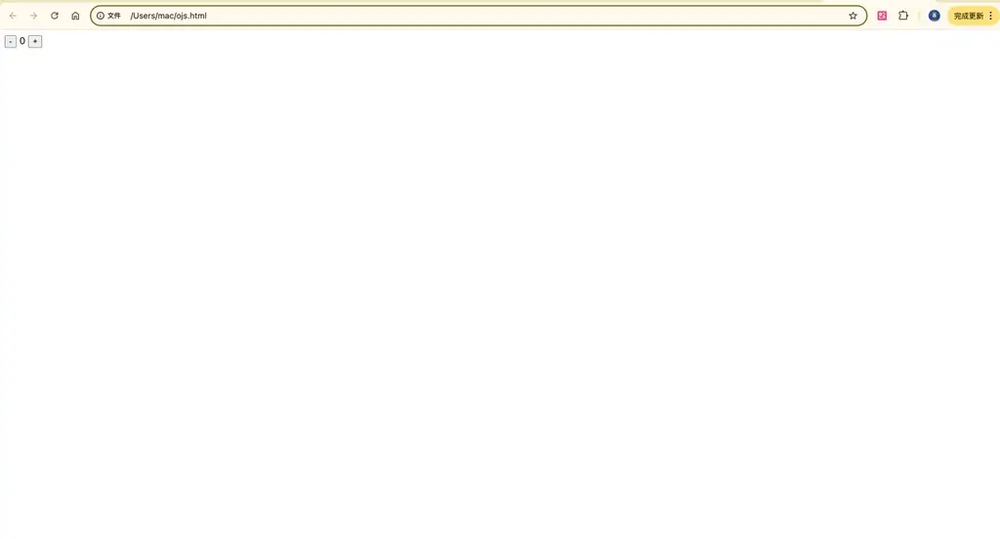

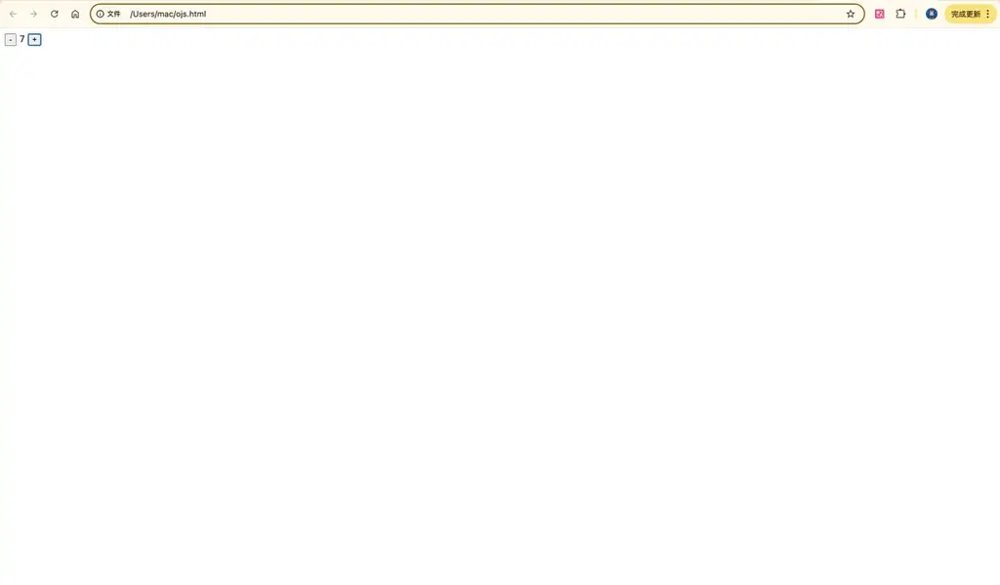

尝试按需进行代码更改

点击加号，数值 +1 变更为 +6

＜!DOCTYPE HTML＞ ＜HTML lang="en"＞ ＜head＞ ＜meta charset="UTF-8"＞ ＜meta name="viewport" content="width=device-width, initial-scale=1.0"＞ ＜title＞Counter＜/title＞ ＜script src="https://cdn.tailwindcss.com"＞＜/script＞ ＜link href="https://cdnJS.cloudflare.com/ajax/libs/font-awesome/6.7.2/css/all.min.css" rel="stylesheet"＞ ＜/head＞ ＜body class="flex justify-center items-center h-screen bg-gray-100"＞ ＜div class="bg-white p-8 rounded shadow-md"＞ ＜button id="btn-minus" class="px-4 py-2 bg-red-500 text-white rounded hover:bg-red-600"＞-＜/button＞ ＜span id="display" class="px-4 py-2 text-xl font-bold"＞0＜/span＞ ＜button id="btn-plus" class="px-4 py-2 bg-green-500 text-white rounded hover:bg-green-600"＞+＜/button＞ ＜/div＞ ＜script＞ // 1. 准备变量（记忆当前数值） let count = 0; // 2. 获取页面元素（找到操作对象） const display = document.getElementById("display"); const plusBtn = document.getElementById("btn-plus"); const minusBtn = document.getElementById("btn-minus"); // 3. 给加号按钮添加"耳朵" plusBtn.addEventListener("click", () =＞ { count += 6; // 数值加 6 display.textContent = count; // 更新显示 }); // 4. 给减号按钮添加"耳朵" minusBtn.addEventListener("click", () =＞ { count--; // 数值减 1 display.textContent = count; // 更新显示 }); ＜/script＞ ＜/body＞ ＜/HTML＞

实际效果

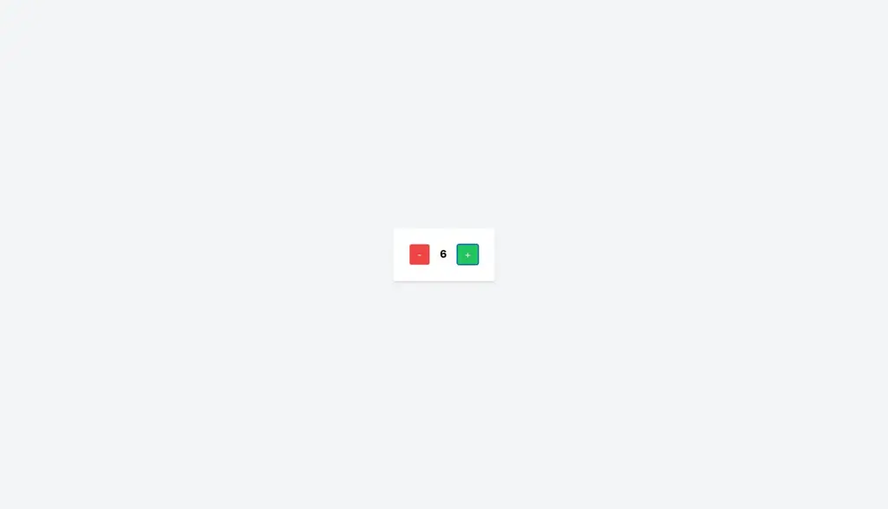

点击减号，数值 -1 变更为 -7

＜!DOCTYPE HTML＞ ＜HTML lang="en"＞ ＜head＞ ＜meta charset="UTF-8"＞ ＜meta name="viewport" content="width=device-width, initial-scale=1.0"＞ ＜title＞Counter＜/title＞ ＜script src="https://cdn.tailwindcss.com"＞＜/script＞ ＜link href="https://cdnJS.cloudflare.com/ajax/libs/font-awesome/6.7.2/css/all.min.css" rel="stylesheet"＞ ＜/head＞ ＜body class="flex justify-center items-center h-screen bg-gray-100"＞ ＜div class="bg-white p-8 rounded shadow-md"＞ ＜button id="btn-minus" class="px-4 py-2 bg-red-500 text-white rounded hover:bg-red-600"＞-＜/button＞ ＜span id="display" class="px-4 py-2 text-xl font-bold"＞0＜/span＞ ＜button id="btn-plus" class="px-4 py-2 bg-green-500 text-white rounded hover:bg-green-600"＞+＜/button＞ ＜/div＞ ＜script＞ // 1. 准备变量（记忆当前数值） let count = 0; // 2. 获取页面元素（找到操作对象） const display = document.getElementById("display"); const plusBtn = document.getElementById("btn-plus"); const minusBtn = document.getElementById("btn-minus"); // 3. 给加号按钮添加"耳朵" plusBtn.addEventListener("click", () =＞ { count ++; // 数值加 1 display.textContent = count; // 更新显示 }); // 4. 给减号按钮添加"耳朵" minusBtn.addEventListener("click", () =＞ { count -= 6; // 数值减 6 display.textContent = count; // 更新显示 }); ＜/script＞ ＜/body＞ ＜/HTML＞

实际效果

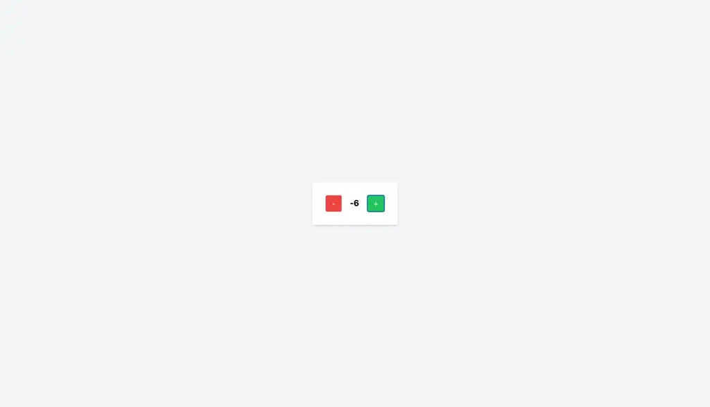

学员果果补充：

后来试了下豆包，它甚至有专门的 coding 页面帮助学习

https://www.doubao.com/chat/coding

我把代码复制进去让它逐行讲解并针对每一个可变的量都举一反三。效果很好。

**5.2.2 项目升级：待办事项清单**

**功能演示**

输入文字 + 点击添加 → 新增待办项

点击项目 → 切换完成状态（划线效果）

实时显示未完成数量

**阅读代码，复制到 HTML 文件中**

可复制版本：可复制版本

＜!DOCTYPE HTML＞ ＜HTML lang="zh-CN"＞ ＜head＞ ＜meta charset="UTF-8"＞ ＜meta name="viewport" content="width=device-width, initial-scale=1.0"＞ ＜title＞我的待办事项＜/title＞ ＜style＞ body { font-family: Arial, sans-serif; max-width: 500px; margin: 0 auto; padding: 20px; } \#todo-input { width: 70%; padding: 8px; margin-right: 5px; } button { padding: 8px 15px; } \#todo-list { list-style: none; padding: 0; } \#todo-list li { padding: 8px; margin: 5px 0; background: \#f5f5f5; Cursor: pointer; display: flex; justify-content: space-between; align-items: center; } \#todo-list li.done { text-decoration: line-through; color: \#888; } \#counter { margin-top: 10px; color: \#666; } .delete-btn { background: \#ff4444; color: white; border: none; padding: 4px 8px; border-radius: 4px; Cursor: pointer; } ＜/style＞ ＜/head＞ ＜body＞ ＜h1＞待办事项清单＜/h1＞

＜div＞ ＜input type="text" id="todo-input" placeholder="输入待办事项"＞ ＜button onclick="addTodo()"＞添加＜/button＞ ＜/div＞ ＜ul id="todo-list"＞＜/ul＞ ＜div id="counter"＞剩余：0项＜/div＞ ＜script＞ // 初始化数据 let todos = \[\]; // 存放所有待办项 let nextId = 1; // 自动生成ID用 // 添加新项目 function **addTodo**() { const input = document.getElementById("todo-input"); const text = input.value.trim(); if (text === "") { alert("请输入内容"); return; } const newTodo = { id: nextId++, text: text, done: false }; todos.push(newTodo); input.value = ""; updateList(); } // 更新界面 function **updateList**() { const listElement = document.getElementById("todo-list"); const counterElement = document.getElementById("counter"); // 生成列表HTML listElement.innerHTML = todos.map(todo =＞ \` ＜li class="${todo.done ? 'done' : ''}" onclick="toggleTodo(${todo.id})"＞ ＜span＞${todo.text}＜/span＞ ＜button class="delete-btn" onclick="event.stopPropagation(); deleteTodo(${todo.id})"＞删除＜/button＞ ＜/li＞ \`).join(""); // 更新计数器 const activeCount = todos.filter(t =＞ !t.done).length; counterElement.textContent = \`剩余：${activeCount}项\`; } // 切换完成状态 function **toggleTodo**(id) { const todo = todos.find(t =＞ t.id === id); if (todo) { todo.done = !todo.done; updateList(); } } // 删除待办项 function **deleteTodo**(id) { todos = todos.filter(t =＞ t.id !== id); updateList(); } // 添加回车键支持 document.getElementById("todo-input").addEventListener("keypress", function(event) { if (event.key === "Enter") { addTodo(); } }); // 初始化显示 updateList(); ＜/script＞ ＜/body＞ ＜/HTML＞

**代码讲解**

**HTML 部分**

＜!DOCTYPE HTML＞ ＜HTML lang="zh-CN"＞ ＜head＞ ＜meta charset="UTF-8"＞ ＜meta name="viewport" content="width=device-width, initial-scale=1.0"＞ ＜title＞我的待办事项＜/title＞ ＜style＞ body { font-family: Arial, sans-serif; max-width: 500px; margin: 0 auto; padding: 20px; } \#todo-input { width: 70%; padding: 8px; margin-right: 5px; } button { padding: 8px 15px; } \#todo-list { list-style: none; padding: 0; } \#todo-list li { padding: 8px; margin: 5px 0; background: \#f5f5f5; Cursor: pointer; display: flex; justify-content: space-between; align-items: center; } \#todo-list li.done { text-decoration: line-through; color: \#888; } \#counter { margin-top: 10px; color: \#666; } .delete-btn { background: \#ff4444; color: white; border: none; padding: 4px 8px; border-radius: 4px; Cursor: pointer; } ＜/style＞ ＜/head＞ ＜body＞ ＜h1＞待办事项清单＜/h1＞ ＜div＞ ＜input type="text" id="todo-input" placeholder="输入待办事项"＞ ＜button onclick="addTodo()"＞添加＜/button＞ ＜/div＞ ＜ul id="todo-list"＞＜/ul＞ ＜div id="counter"＞剩余：0项＜/div＞ ＜script＞ // 初始化数据

let todos = \[\]; // 存放所有待办项 let nextId = 1; // 自动生成ID用 // 添加新项目 function addTodo() { const input = document.getElementById("todo-input"); const text = input.value.trim(); if (text === "") { alert("请输入内容"); return; } const newTodo = { id: nextId++, text: text, done: false }; todos.push(newTodo); input.value = ""; updateList(); } // 更新界面 function updateList() { const listElement = document.getElementById("todo-list"); const counterElement = document.getElementById("counter"); // 生成列表HTML listElement.innerHTML = todos.map(todo =＞ \` ＜li class="${todo.done ? 'done' : ''}" onclick="toggleTodo(${todo.id})"＞ ＜span＞${todo.text}＜/span＞ ＜button class="delete-btn" onclick="event.stopPropagation(); deleteTodo(${todo.id})"＞删除＜/button＞ ＜/li＞ \`).join(""); // 更新计数器 const activeCount = todos.filter(t =＞ !t.done).length; counterElement.textContent = \`剩余：${activeCount}项\`; } // 切换完成状态 function toggleTodo(id) { const todo = todos.find(t =＞ t.id === id); if (todo) { todo.done = !todo.done; updateList(); } } // 删除待办项 function deleteTodo(id) { todos = todos.filter(t =＞ t.id !== id); updateList(); } // 添加回车键支持 document.getElementById("todo-input").addEventListener("keypress", function(event) { if (event.key === "Enter") { addTodo(); } }); // 初始化显示 updateList(); ＜/script＞ ＜/body＞ ＜/HTML＞

1\.

文档声明与字符编码：

＜!DOCTYPE HTML＞ ＜HTML lang="zh-CN"＞ ＜head＞ ＜meta charset="UTF-8"＞ ＜meta name="viewport" content="width=device-width, initial-scale=1.0"＞ ＜title＞我的待办事项＜/title＞

＜!DOCTYPE HTML＞：声明文档类型为 HTML5。

＜HTML lang="zh-CN"＞：设置文档语言为中文。

＜meta charset="UTF-8"＞：指定字符编码为 UTF - 8。

＜meta name="viewport" content="width=device-width, initial-scale=1.0"＞：确保页面在不同设备上正确显示。

＜title＞我的待办事项＜/title＞：设置网页标题。

2\.

CSS 样式部分：

body { font-family: Arial, sans-serif; max-width: 500px; margin: 0 auto; padding: 20px; }

\- body：设置页面主体的字体、最大宽度、居中显示和内边距。

\#todo-input { width: 70%; padding: 8px; margin-right: 5px; }

\- \#todo-input：设置输入框的宽度、内边距和右边距。

button { padding: 8px 15px; }

\- button：设置按钮的内边距。

\#todo-list { list-style: none; padding: 0; }

\- \#todo-list：去除列表的默认样式和内边距。

\#todo-list li { padding: 8px; margin: 5px 0; background: \#f5f5f5; Cursor: pointer; display: flex; justify-content: space-between; align-items: center; }

\- \#todo-list li：设置列表项的内边距、外边距、背景颜色、鼠标指针样式，并使用 Flexbox 布局。

\#todo-list li.done { text-decoration: line-through; color: \#888; }

\- \#todo-list li.done：设置已完成事项的样式，添加删除线和灰色文字。

\#counter { margin-top: 10px; color: \#666; }

\- \#counter：设置计数器的上边距和文字颜色。

.delete-btn { background: \#ff4444; color: white; border: none; padding: 4px 8px; border-radius: 4px; Cursor: pointer; }

\- .delete-btn：设置删除按钮的背景颜色、文字颜色、无边框、内边距、圆角和鼠标指针样式。

3\.

HTML 结构部分：

＜body＞ ＜h1＞待办事项清单＜/h1＞ ＜div＞ ＜input type="text" id="todo-input" placeholder="输入待办事项"＞ ＜button onclick="addTodo()"＞添加＜/button＞ ＜/div＞ ＜ul id="todo-list"＞＜/ul＞ ＜div id="counter"＞剩余：0项＜/div＞

＜h1＞待办事项清单＜/h1＞：显示页面标题。

＜input type="text" id="todo-input" placeholder="输入待办事项"＞：输入待办事项的文本框。

＜button onclick="addTodo()"＞添加＜/button＞：点击按钮调用 addTodo 函数添加待办事项。

＜ul id="todo-list"＞＜/ul＞：用于显示待办事项列表。

＜div id="counter"＞剩余：0项＜/div＞：显示剩余未完成事项的数量。

**JavaScript 部分**

// 初始化数据 let todos = \[\]; // 存放所有待办项 let nextId = 1; // 自动生成ID用

todos：一个数组，用于存储所有待办事项。

nextId：用于为每个待办事项生成唯一的 ID。

// 添加新项目 function addTodo() { const input = document.getElementById("todo-input"); const text = input.value.trim(); if (text === "") { alert("请输入内容"); return; } const newTodo = { id: nextId++, text: text, done: false };

todos.push(newTodo); input.value = ""; updateList(); }

addTodo 函数：

a\.

获取输入框的值并去除首尾空格。

b\.

如果输入为空，弹出提示框并返回。

c\.

创建一个新的待办事项对象，包含 id、text 和 done 属性。

d\.

将新的待办事项添加到 todos 数组中。

e\.

清空输入框。

f\.

调用 updateList 函数更新界面。

// 更新界面 function updateList() { const listElement = document.getElementById("todo-list"); const counterElement = document.getElementById("counter"); // 生成列表HTML listElement.innerHTML = todos.map(todo =＞ \` ＜li class="${todo.done ? 'done' : ''}" onclick="toggleTodo(${todo.id})"＞ ＜span＞${todo.text}＜/span＞ ＜button class="delete-btn" onclick="event.stopPropagation(); deleteTodo(${todo.id})"＞删除＜/button＞ ＜/li＞ \`).join(""); // 更新计数器 const activeCount = todos.filter(t =＞ !t.done).length; counterElement.textContent = \`剩余：${activeCount}项\`; }

updateList 函数：

a\.

获取待办事项列表和计数器元素。

b\.

使用 map 方法将 todos 数组中的每个待办事项转换为 HTML 列表项，并使用 join 方法将它们连接成一个字符串。

c\.

将生成的 HTML 字符串赋值给待办事项列表的 innerHTML 属性。

d\.

过滤出未完成的待办事项，计算其数量并更新计数器的文本内容。

// 切换完成状态 function toggleTodo(id) { const todo = todos.find(t =＞ t.id === id); if (todo) { todo.done = !todo.done; updateList(); } }

toggleTodo 函数：

a\.

根据 id 查找待办事项。

b\.

如果找到，切换其 done 属性的值。

c\.

调用 updateList 函数更新界面。

// 删除待办项 function deleteTodo(id) { todos = todos.filter(t =＞ t.id !== id); updateList(); }

deleteTodo 函数：

a\.

使用 filter 方法过滤掉指定 id 的待办事项。

b\.

调用 updateList 函数更新界面。

// 添加回车键支持 document.getElementById("todo-input").addEventListener("keypress", function(event) { if (event.key === "Enter") { addTodo(); } });

为输入框添加 keypress 事件监听器，当按下回车键时，调用 addTodo 函数。

// 初始化显示 updateList();

页面加载时调用 updateList 函数，初始化待办事项列表和计数器。

综上所述，这段代码通过 HTML 构建页面结构，CSS 设置样式，JavaScript 实现待办事项的添加、标记完成、删除和计数功能。

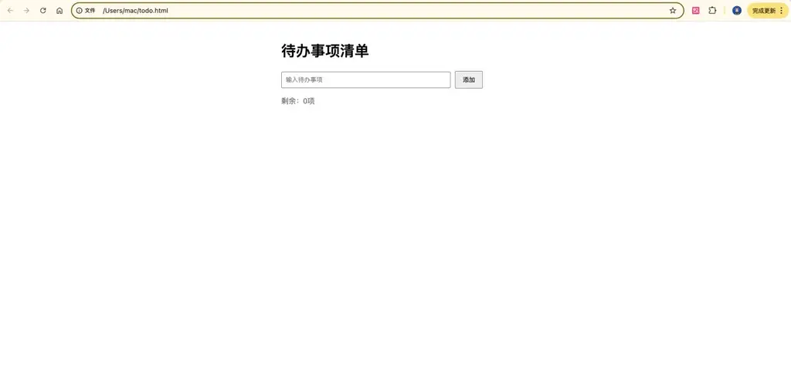

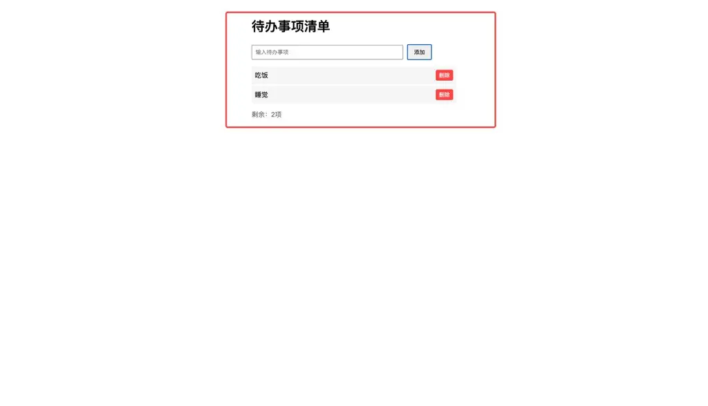

**5.3 常见疑问**

问题

答案

**JavaScript 和 TypeScript 该先学哪个？**

**建议路线**：

a\.

先学 JavaScript 基础（2-3 周）

b\.

再过渡到 TypeScript 类型系统

**原因**：TS 需要 JS 基础，但早期引入类型概念能减少错误

**为什么我的事件监听不工作？**

**检查清单**：

✅ 确保 script 标签放在 body 末尾或使用DOMContentLoaded

✅ 检查选择器是否写错（getElementById要完全匹配 ID）

✅ 用console.log测试元素是否成功获取

**TypeScript 类型报错看不懂怎么办？**

**调试步骤**：

a\.

把鼠标悬停在报错变量上（VSCode 会显示类型信息）

b\.

检查接口定义和实际数据的结构是否一致

c\.

临时用any类型绕过（不推荐长期使用）

**如何看到代码运行效果？**

**浏览器调试技巧**：

a\.

右键 → "检查" 打开开发者工具

b\.

切换到"Console"标签查看console.log输出

c\.

在"Sources"标签设置断点逐步执行

**数组的 map/filter 有什么区别？**

**生活比喻**：

map：流水线加工（1 个进去 1 个出来，数量不变）

const prices = \[10, 20, 30\]; const discounts = prices.map(price =＞ price \* 0.9); // \[9,18,27\]

filter：筛子过滤（只保留符合条件的）

const numbers = \[1, 5, 10, 15\]; const bigNumbers = numbers.filter(n =＞ n ＞ 8); // \[10,15\]

期待你的提问，可在此直接评论

