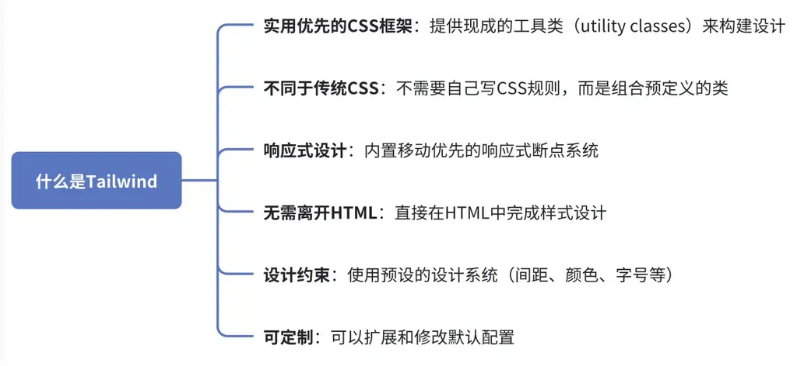
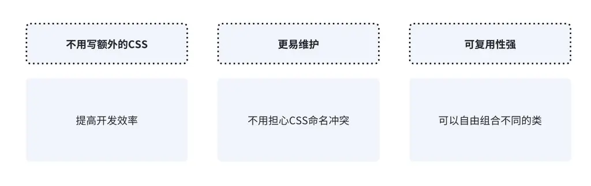
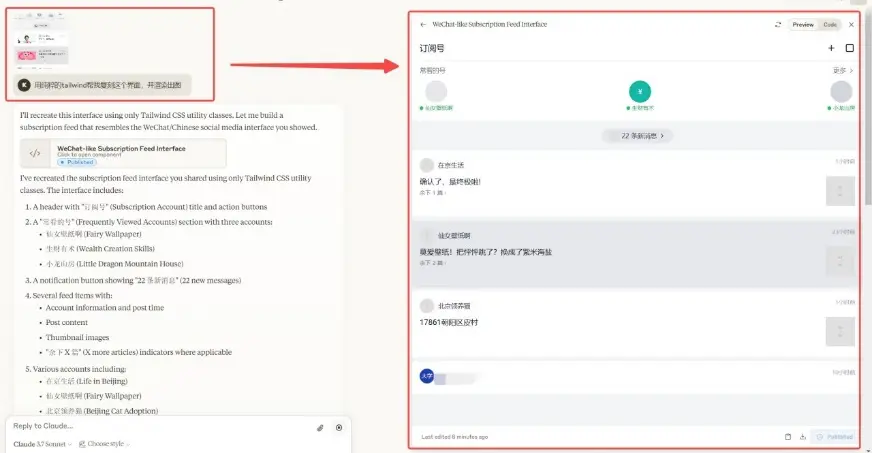
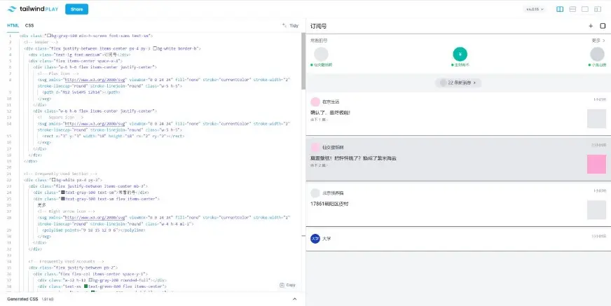
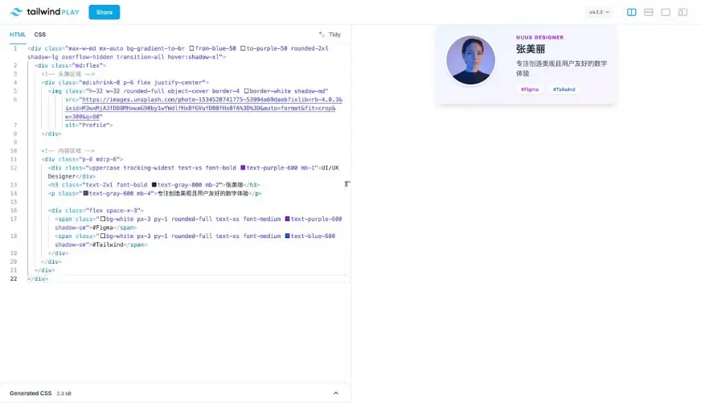
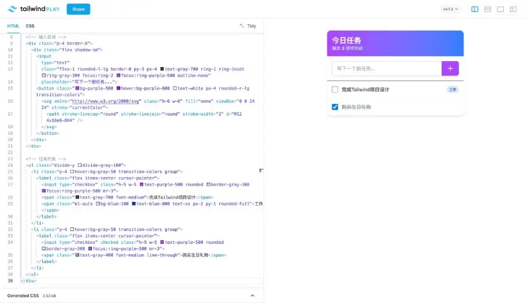

**六、Tailwind CSS**

💡

Tailwind CSS 是一个**通过组合现成的工具类**来快速构建定制化界面的 CSS 框架，让你不用写传统 CSS 就能实现专业设计，就像用乐高积木拼装页面一样简单高效

**6.1 核心概念**

**1. 核心特点**

原子类（Atomic CSS）是一种 CSS 设计思想，它的核心概念是：**每个 CSS 类名只做一件事**。

在传统 CSS 里，你可能会写：

💡

.button { background-color: blue; color: white; padding: 10px 20px; border-radius: 5px; }

然后在 HTML 里使用：

💡

＜button class="button"＞点击我＜/button＞

但在 Tailwind CSS 里，你不需要定义.button类，而是直接在 HTML 中用原子类拼装：

💡

＜button class="bg-blue-500 text-white px-4 py-2 rounded"＞点击我＜/button＞

上面的代码里，每个类都只负责一个属性，比如：

bg-blue-500 → 设置背景色

text-white → 设置文字颜色

px-4 → 水平方向的内边距（padding）

py-2 → 垂直方向的内边距

rounded → 圆角

这种方式的优势是：

**2. 安装 Tailwind**

在 HTML 文件中通过 CDN 引入（简单示例，生产环境建议其他安装方式）：

＜!DOCTYPE HTML＞ ＜HTML＞ ＜head＞ ＜meta charset="UTF-8"＞ ＜meta name="viewport" content="width=device-width, initial-scale=1.0"＞ ＜script src="https://cdn.tailwindcss.com"＞＜/script＞ ＜/head＞ ＜body＞ ＜!-- 你的内容 --＞ ＜/body＞ ＜/HTML＞

**3. 基础工具类**

文字样式

＜p class="text-lg text-red-600 font-bold"＞这是红色加粗的大文字＜/p＞

text-lg：大号文字

text-red-600：红色（色阶 600）

font-bold：加粗字体

间距

＜div class="m-4 p-4"＞ ＜p class="mb-2"＞下方有2单位的间距＜/p＞ ＜p＞普通段落＜/p＞ ＜/div＞

m-4：外边距 4 单位（1 单位=0.25rem）

p-4：内边距 4 单位

mb-2：下边距 2 单位

颜色

＜button class="bg-blue-500 hover:bg-blue-700 text-white py-2 px-4 rounded"＞ 点击按钮 ＜/button＞

bg-blue-500：蓝色背景

hover:bg-blue-700：悬停时深蓝色背景

text-white：白色文字

py-2：上下内边距

px-4：左右内边距

rounded：圆角

**4.如何在用 ai 来使 Tailwind 的功能最大化**

A. 任一选择一个你喜欢的应用界面截图给 ai ，让他学习该页面布局风格还原。

B. 也可以将 Claude 生成的代码复制到 tailwind PLAY 上查看效果（https://play.tailwindcss.com/）

**6.2 实战项目**

打开 Tailwind Play 可在线练习

**6.2.1 入门项目**

可复制版本：可复制版本

＜div class="max-w-md mx-auto bg-gradient-to-br from-blue-50 to-purple-50 rounded-2xl shadow-lg overflow-hidden transition-all hover:shadow-xl"＞ ＜div class="md:flex"＞ ＜!-- 头像区域 --＞ ＜div class="md:shrink-0 p-6 flex justify-center"＞ ＜img class="h-32 w-32 rounded-full object-cover border-4 border-white shadow-md" src="https://images.unsplash.com/photo-1534528741775-53994a69daeb?ixlib=rb-4.0.3&ixid=M3wxMjA3fDB8MHxwaG90by1wYWdlfHx8fGVufDB8fHx8fA%3D%3D&auto=format&fit=crop&w=300&q=80" alt="Profile"＞ ＜/div＞ ＜!-- 内容区域 --＞ ＜div class="p-8 md:p-6"＞ ＜div class="uppercase tracking-widest text-xs font-bold text-purple-600 mb-1"＞UI/UX Designer＜/div＞ ＜h3 class="text-2xl font-bold text-gray-800 mb-2"＞张美丽＜/h3＞ ＜p class="text-gray-600 mb-4"＞专注创造美观且用户友好的数字体验＜/p＞ ＜div class="flex space-x-3"＞ ＜span class="bg-white px-3 py-1 rounded-full text-xs font-medium text-purple-600 shadow-sm"＞#Figma＜/span＞ ＜span class="bg-white px-3 py-1 rounded-full text-xs font-medium text-blue-600 shadow-sm"＞#Tailwind＜/span＞ ＜/div＞ ＜/div＞ ＜/div＞ ＜/div＞

**6.2.2 项目升级：待办事项列表**

可复制版本：可复制版本

＜div class="max-w-md mx-auto mt-10 bg-white rounded-xl shadow-md overflow-hidden"＞ ＜!-- 头部 --＞ ＜div class="bg-gradient-to-r from-purple-500 to-blue-500 p-4"＞ ＜h1 class="text-2xl font-bold text-white"＞今日任务＜/h1＞ ＜p class="text-blue-100 text-sm"＞剩余 ＜span class="font-bold"＞3＜/span＞ 项待完成＜/p＞ ＜/div＞ ＜!-- 输入区域 --＞ ＜div class="p-4 border-b"＞ ＜div class="flex shadow-sm"＞ ＜input type="text" class="flex-1 rounded-l-lg border-0 py-3 px-4 text-gray-700 ring-1 ring-inset ring-gray-300 focus:ring-2 focus:ring-purple-500 outline-none" placeholder="写下一个新任务..."＞ ＜button class="bg-purple-500 hover:bg-purple-600 text-white px-4 rounded-r-lg transition-colors"＞ ＜svg xmlns="http://www.w3.org/2000/svg" class="h-6 w-6" fill="none" viewBox="0 0 24 24" stroke="currentColor"＞ ＜path stroke-linecap="round" stroke-linejoin="round" stroke-width="2" d="M12 4v16m8-8H4" /＞ ＜/svg＞ ＜/button＞ ＜/div＞ ＜/div＞ ＜!-- 任务列表 --＞ ＜ul class="divide-y divide-gray-100"＞ ＜li class="p-4 hover:bg-gray-50 transition-colors group"＞ ＜label class="flex items-center Cursor-pointer"＞ ＜input type="checkbox" class="h-5 w-5 text-purple-500 rounded border-gray-300 focus:ring-purple-500 mr-3"＞ ＜span class="text-gray-700 font-medium"＞完成Tailwind项目设计＜/span＞ ＜span class="ml-auto bg-blue-100 text-blue-800 text-xs px-2 py-1 rounded-full"＞工作＜/span＞ ＜/label＞ ＜/li＞ ＜li class="p-4 hover:bg-gray-50 transition-colors group"＞ ＜label class="flex items-center Cursor-pointer"＞ ＜input type="checkbox" checked class="h-5 w-5 text-purple-500 rounded border-gray-300 focus:ring-purple-500 mr-3"＞ ＜span class="text-gray-400 font-medium line-through"＞购买生日礼物＜/span＞ ＜/label＞ ＜/li＞ ＜/ul＞ ＜/div＞

💡

尝试着调整代码，加深学习印象，比如更改颜色、更改字号...

**6.3 常见疑问**

问题

答案

**Tailwind 会增大 HTML 文件大小吗？**

Tailwind 会通过 PurgeCSS 在生产环境中移除未使用的类

最终文件大小通常比传统 CSS 更小

**如何自定义颜色或间距？**

在 tailwind.config.JS 中配置：

module.exports = { theme: { extend: { colors: { 'brand-blue': '#1992d4', }, spacing: { '72': '18rem', } } } }

**Tailwind 适合大型项目吗？**

非常适合，因为：

保持样式一致性

减少命名冲突

便于团队协作

**如何实现响应式设计？**

使用前缀：

＜div class="w-full md:w-1/2 lg:w-1/3"＞ ＜!-- 在手机上全宽，中等屏幕一半宽，大屏幕1/3宽 --＞ ＜/div＞
