**shadcn/ui** 不是传统意义上的 NPM 组件库，而是一套“把源码复制进你项目”的 **Open Code 组件模板集合**

**8.1 核心概念**

在 React 生态里，我们常见的组件库（MUI、Ant Design 等）把组件代码封装在包里，你只能通过 props 做有限定制。

而 Shadcn UI 把组件源码直接复制进你的项目，你对每个 className、每个 JSX 结构都拥有 100 % 的掌控权。

这种“开放源码-即拿即改”的模式被作者称为 **Open Code**。

更改样式或逻辑时，你只是在维护自己的代码，不存在“升级冲突”或“魔改难合并”的尴尬。

**它不是一个组件库**

**shadcn/ui 是一组可复用的组件集合**

传统组件库如 Material UI, Ant Design, Chakra UI 等，你通常通过 npm install a-component-library 来安装，然后在你的代码里 import { Button } from 'a-component-library'

传统组件的代码通常在 node_modules 里，你无法直接修改它们（除非 fork）

它的工作方式是：你通过一个 CLI (命令行工具) 将组件的源代码直接复制到你的项目中。这些组件文件 (比如 button.tsx, dialog.tsx) 会真实地存在于你的项目目录中 (通常在 components/ui/ 下)

你拥有这些代码，可以随意修改、定制，就像你自己写的一样

shadcn/ui 有三个底层依赖

Tailwind CSS：用原子类快速定制 UI。我们在前面的课程已经介绍过了。

Radix Primitives：保证可访问性（ARIA、键盘交互）

Lucide-react：一致风格的 SVG 图标。

**8.1.1 初始化**

你可以新建一个NextJS项目

npx create-next-app@latest shadcn-demo --typescript --app cd shadcn-demo

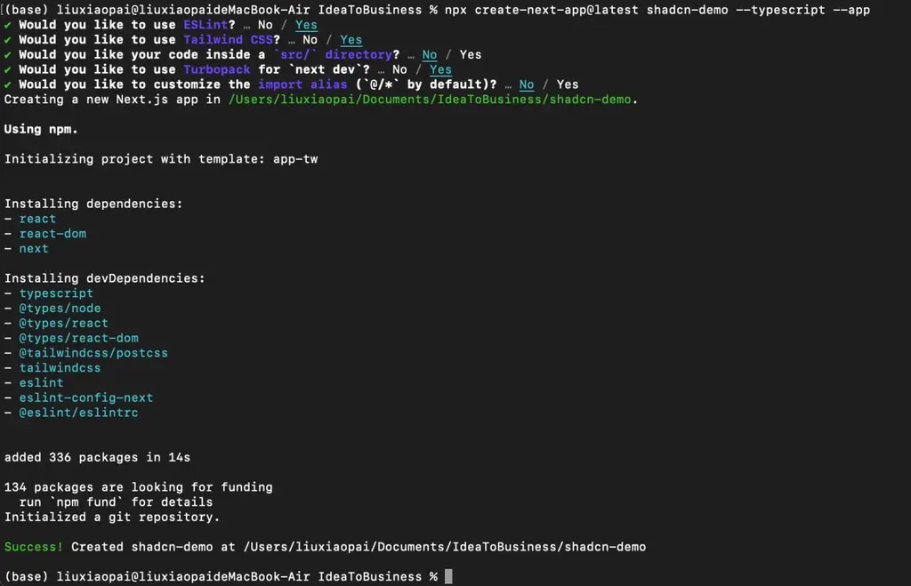

为了方便查看和学习，我们可以用Cursor打开刚刚新建的项目。可以看到这是一个标准的NextJS项目。

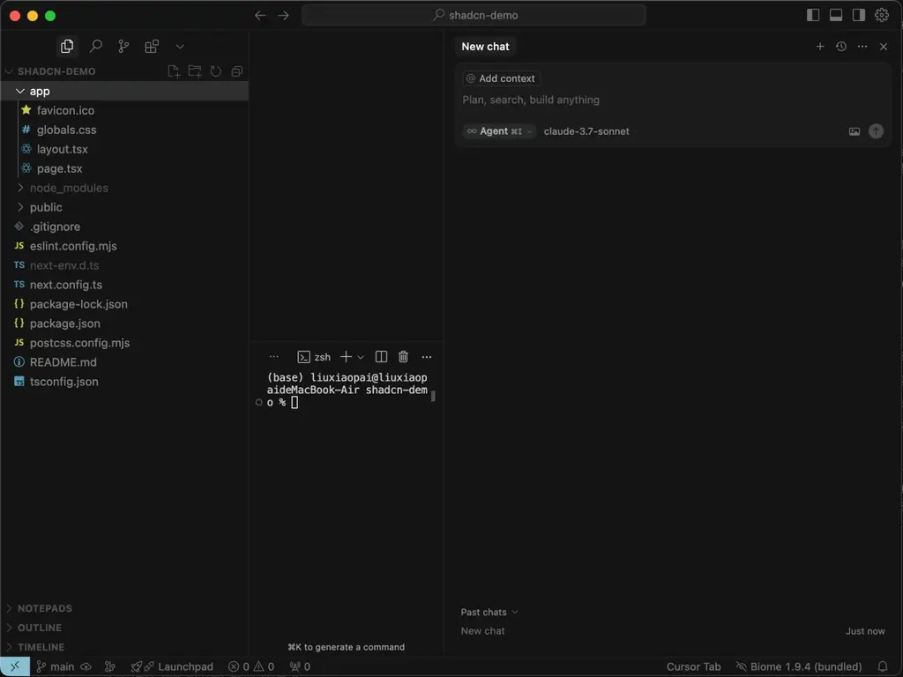

然后进入到项目工作目录中，执行以下指令，初始化shadcn/ui

过程中，会提示一些个性化话的选择。如果不想选，可以全部点击回车。

npx shadcn@latest init

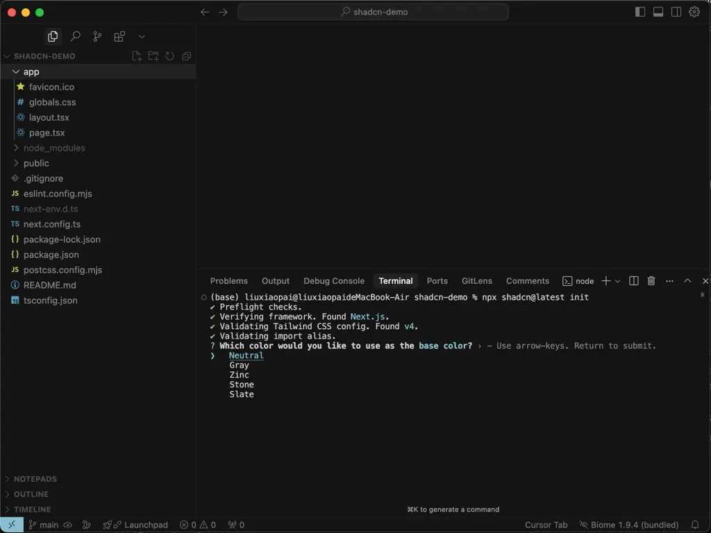

执行初始化命令后，项目目录中会自动生成生成一些文件。如下图所示，包括utils.ts、components.json 等等。

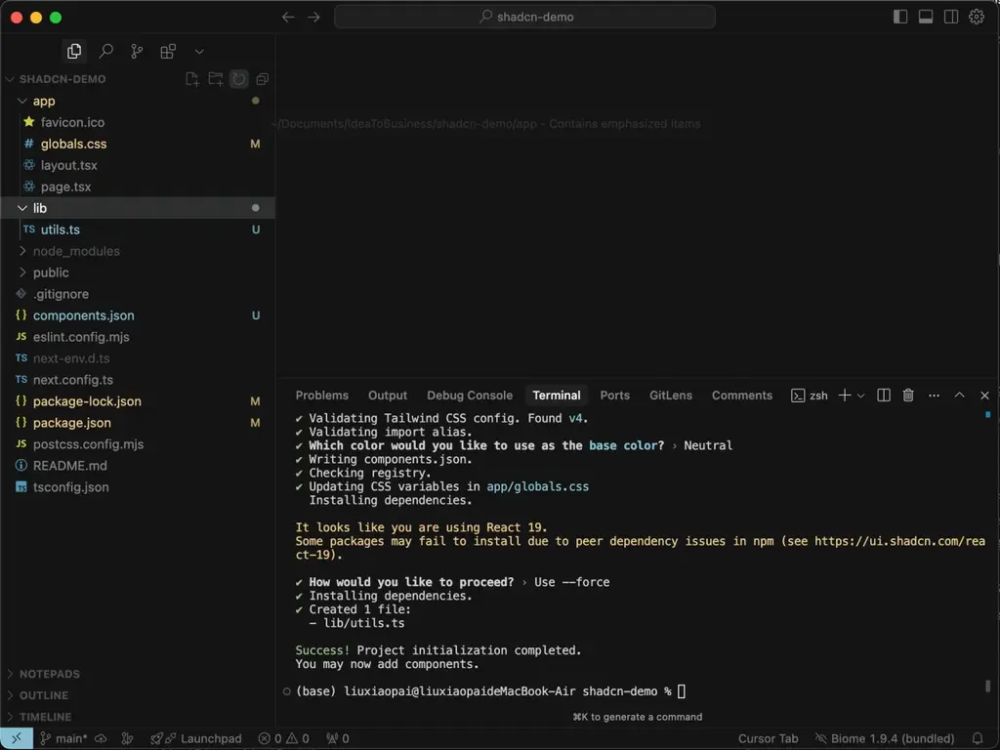

然后回到NextJS项目，执行

npm run dev

你可以尝试打其中的globals.css，把 background 颜色改成 \#007aff。 在浏览器访问 http://localhost:3000 ，应该网页背景会马上热更新为蓝色。

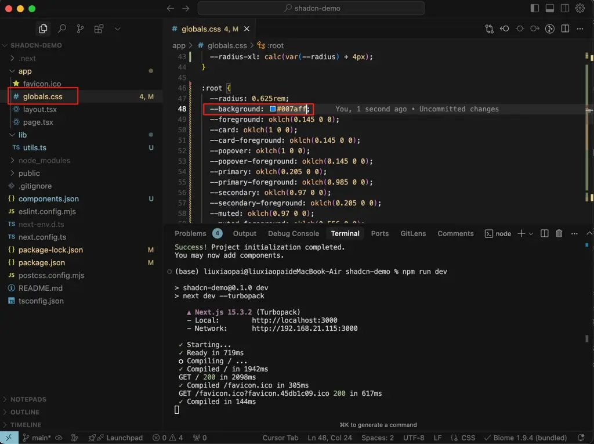

**8.1.2 添加组件**

在初始化 shadcn/ui 后，我们就可以在项目中，添加 shadcn/ui 的组件了！

我们可以到 这里 进行挑选，选自己需要的组件！

https://ui.shadcn.com/docs/components/accordion

红框部分都是组件的名字

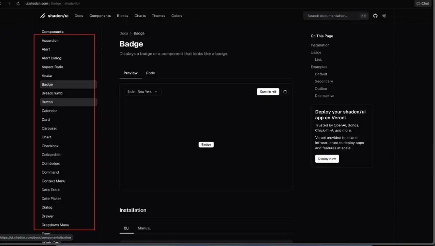

假如我们选好的是下图所示的“card”

https://ui.shadcn.com/docs/components/card

我们只需要在命令行中，执行安装命令（图中红框标识），就可以了

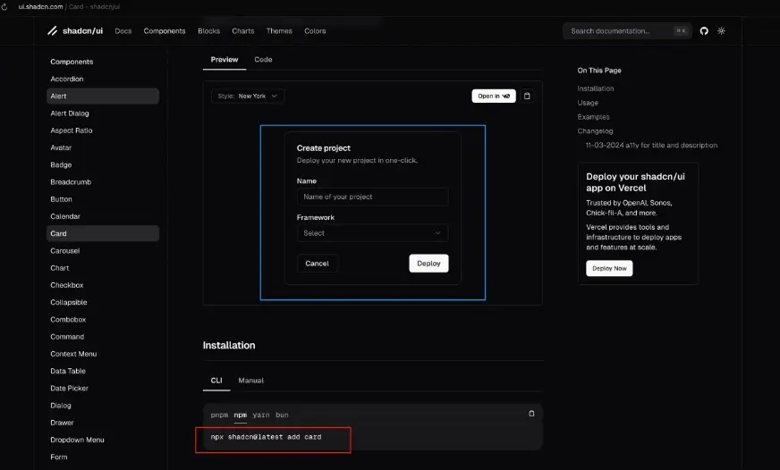

当我执行完命令后，注意我的项目结构：已经在 components/ui 下增加了 card.tsx

这就是我们刚刚安装的 shadcn/ui 组件

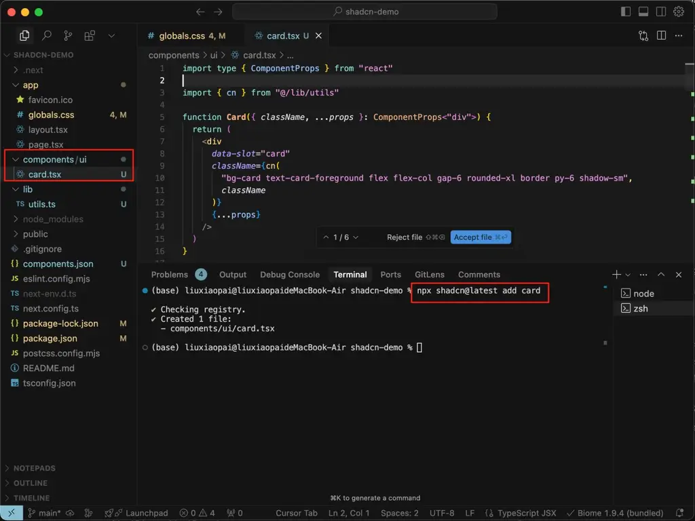

我们可以在任何页面（比如主页），引用它。

引用方法，你可以查看文档里的Example Code 。

哪个文档？就是刚才，你找到的控件的那个文档。一般来说，控件文档，都会写上Example Code。https://ui.shadcn.com/docs/components/card

我们直接复制到页面中就可以。 如果遇到ES Linter报错，可以让Cursor直接修改报错。

如下图所示

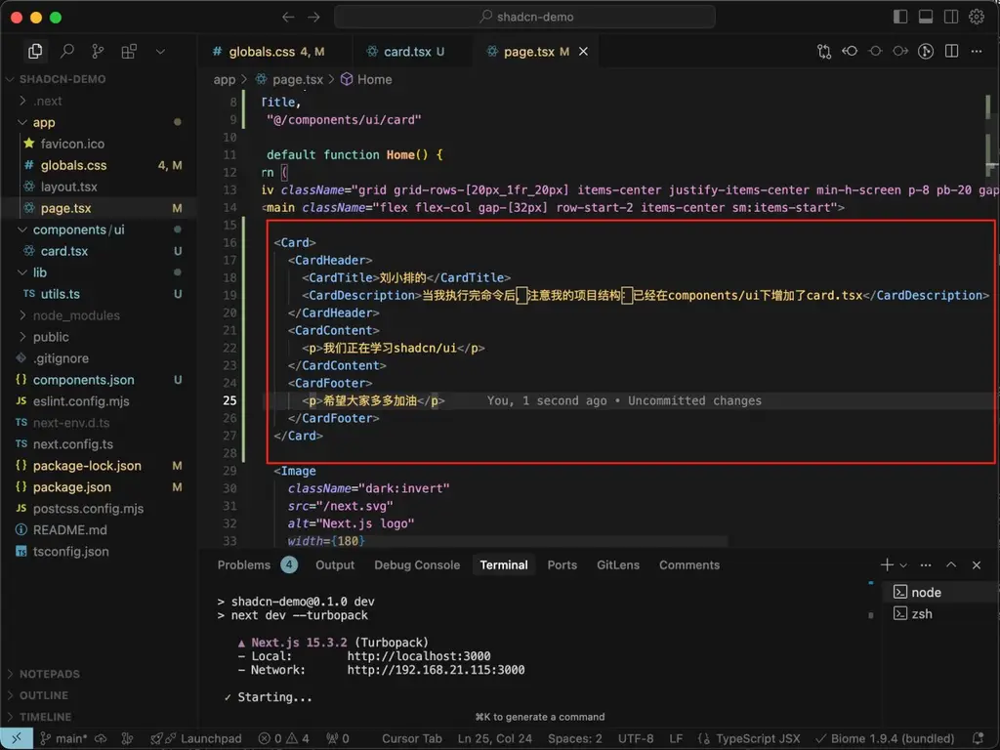

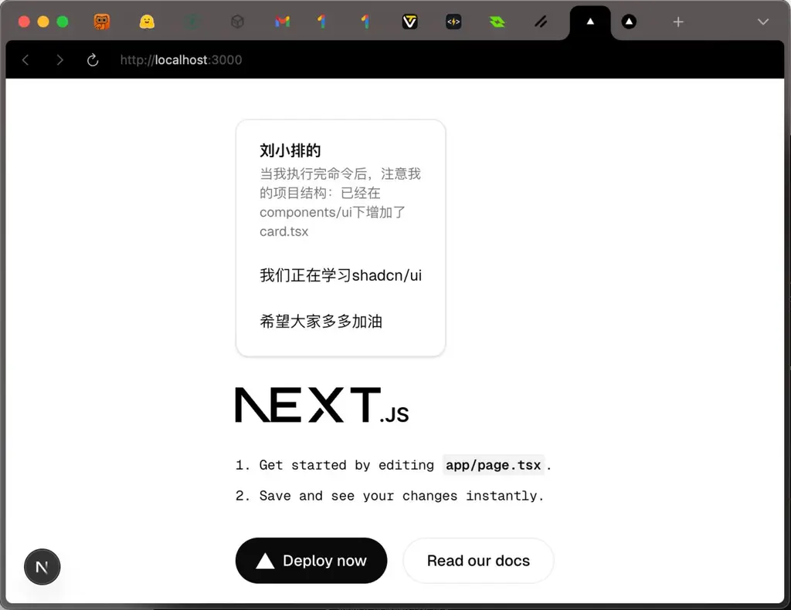

**8.1.3 日间模式、夜间模式**

💡

这一个过程对于新手来说，流程稍多。

你可以先看完下面的指引，有一个初步的理解。然后，**直接让Curosr帮你添加夜间模式功能**。（实测是可以的）

完成后，你再本着学习的态度，依次去理解Cursor帮你写的代码。

首先，我们需要安装next-thems

还是在刚才的项目中，执行下面的命令

npm install next-themes

我们需要创建theme-provider

components/theme-provider.tsx

"use client" import \* as React from "react" import { ThemeProvider as NextThemesProvider } from "next-themes" export function ThemeProvider({ children, ...props }: React.ComponentProps＜typeof NextThemesProvider＞) { return ＜NextThemesProvider {...props}＞{children}＜/NextThemesProvider＞ }

第三步

在app/layout.tsx中，把ThemeProvider用于包裹其他的所有组件

import { ThemeProvider } from "@/components/theme-provider" export default function RootLayout({ children }: RootLayoutProps) { return ( ＜＞ ＜html lang="en" suppressHydrationWarning＞ ＜head /＞ ＜body＞ ＜ThemeProvider attribute="class" defaultTheme="system" enableSystem disableTransitionOnChange ＞ {children} ＜/ThemeProvider＞ ＜/body＞ ＜/html＞ ＜/＞ ) }

最后，找一个地方，添加模式切换的按钮。

这是我们的components/ThemeToggle.tsx

"use client"; import { useTheme } from "./ThemeProvider"; import { Sun, Moon, Computer } from "lucide-react"; export function **ThemeToggle**() { const { theme, **setTheme** } = useTheme(); return ( ＜div className="flex bg-secondary rounded-lg p-1"＞ ＜button type="button" onClick={() =＞ setTheme("light")} className={\`flex items-center justify-center w-8 h-8 rounded-md transition-colors ${ theme === "light" ? "bg-primary text-primary-foreground" : "text-secondary-foreground hover:bg-secondary/80" }\`} aria-label="浅色模式" ＞ ＜Sun size={18} /＞ ＜/button＞ ＜button type="button" onClick={() =＞ setTheme("dark")} className={\`flex items-center justify-center w-8 h-8 rounded-md transition-colors ${ theme === "dark" ? "bg-primary text-primary-foreground" : "text-secondary-foreground hover:bg-secondary/80" }\`} aria-label="深色模式" ＞ ＜Moon size={18} /＞ ＜/button＞ ＜button type="button" onClick={() =＞ setTheme("system")} className={\`flex items-center justify-center w-8 h-8 rounded-md transition-colors ${ theme === "system" ? "bg-primary text-primary-foreground" : "text-secondary-foreground hover:bg-secondary/80" }\`} aria-label="跟随系统" ＞ ＜Computer size={18} /＞ ＜/button＞ ＜/div＞ ); }

就可以得到这个效果哦。

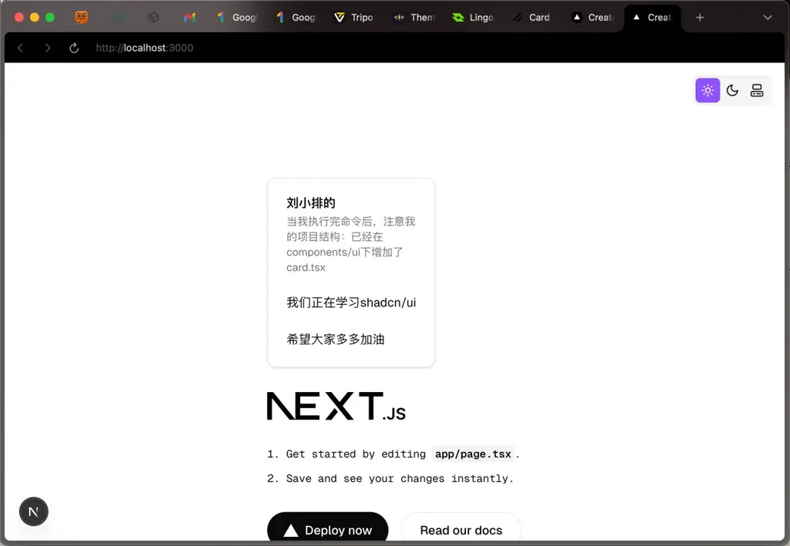

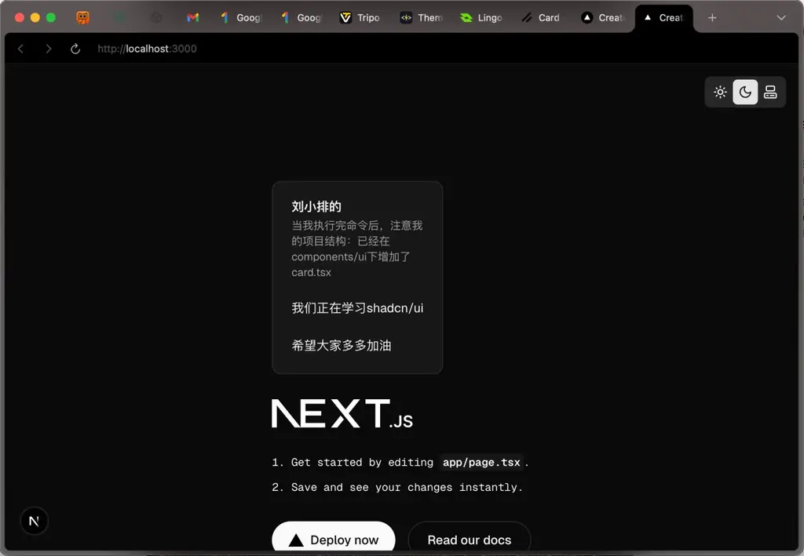

PS：如果你想用Cursor，简单描述就可以了。

但是，请一定要亲自去学习Cursor帮你写的代码哦！

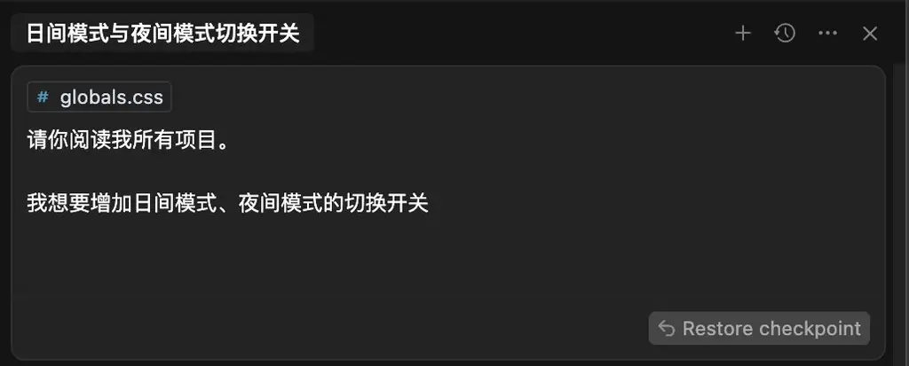

**8.1.4 切换主题**

shadcn/ui有很强的主题生态。

关于shadcn/ui的主题详细说明，你可以到这里官方说明查看，此处不再赘述

https://ui.shadcn.com/docs/theming

当你根据官方文档添加主题功能后，我们可以关注换主题功能。

你可以到 https://tweakcn.com/editor/theme 或者 https://ui.shadcn.com/themes

选择你喜欢的主题，然后复制代码，去修改替换globals.css 中对应的位置。

这个过程，我们在基础篇-第七课里，已经讲过了，这里稍微复习一遍。

不知道怎么替换？也可以借助Cursor。

例如，我们选择了这个红色主题。

（这里需要注意， 你最初安装NextJS的时候，用的是Tailwind v4还是v3版？格式是不一样的。 在我这个示例项目中，我用的是v3）

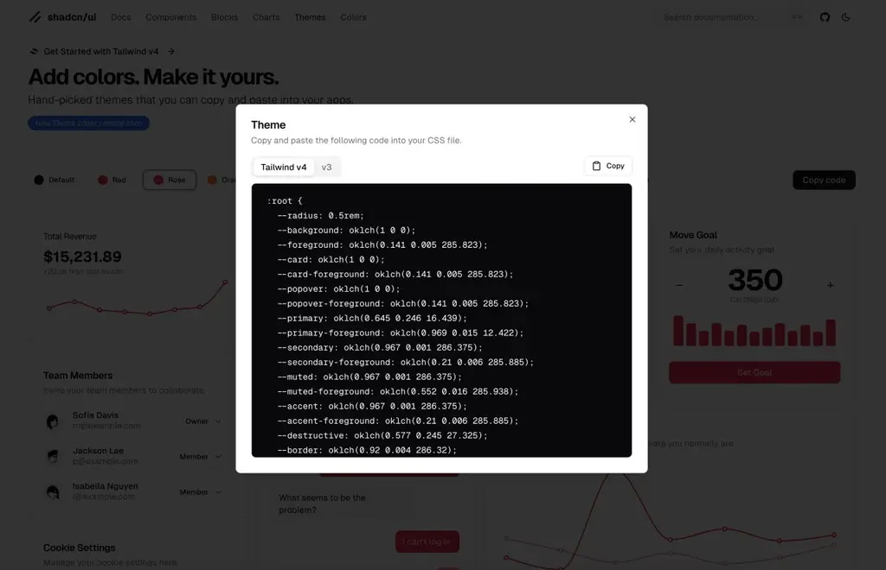

**8.2 入门项目**

请你为任意一个 Next.JS 项目，添加日间/夜间模式切换功能。

