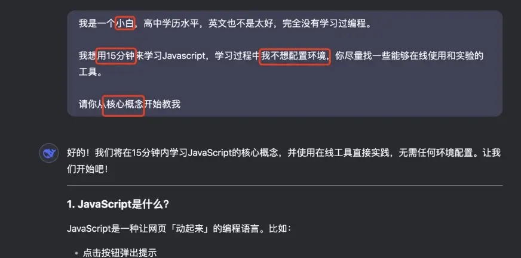
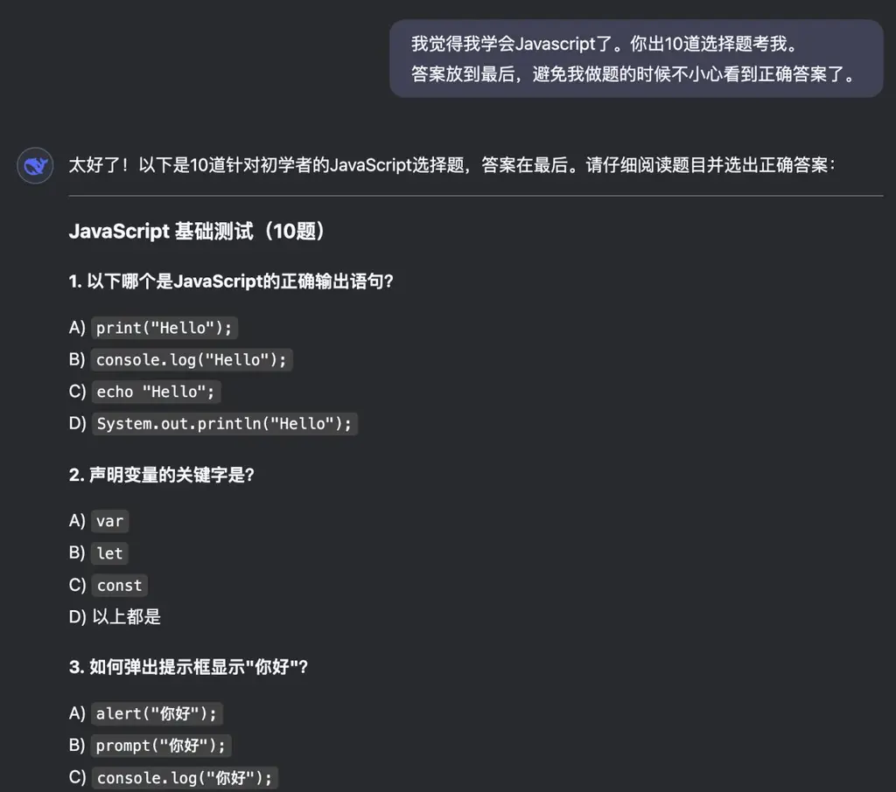

建议学习时长：120 小时

**切记： 慢就是快。**

入门越快的人，后面遇到的问题越多；入门越慢的人，后面遇到的问题越少。

内功篇涉及编程的部分，**学习目标是：能够完全看懂AI写的代码**。

能够完全看懂就可以，因为我们不需要亲自写代码。随着AI技术的发展，以后需要亲手写代码的场景会越来越少。

在辅导学员的过程中，我们发现，大部分学员遇到的卡点，都是由于无法看懂AI写的代码，从而难以和AI达成深度协作关系。

💡

内功篇最高效的学习方式：**借助 AI**

整个「内功篇」的内容，是网站编程领域的基础知识， 你可以借助 AI 来完成学习，效率更高。

使用 AI 学习本课内容的技巧：

1\.

使用 DeepSeek 官方网页版本，选择 DeepSeek V3 模型 （不打开深度思考、不打开联网搜索）

https://chat.deepseek.com/

2\.

忘记“提示词工程”！把 AI 当成人，直接说你的述求就行。

在沟通中，你可以强调以下关键词，达到更好的沟通效果

示例：

当你想要学习 TypeScript 时，可尝试这样的沟通方式

我挺笨的。我只有1小时。我想要借助 https://www.typescriptlang.org/ 学习和练习TypeScript，请不要让我在本机安装环境，因为我听说只靠这个工具就能做实验。请帮我设计课程和练习题。详细一点

当你想要学习 TailwindCSS 时，可尝试这样的沟通方式

我是一个高中的智商80的高中辍学笨蛋。请你借助 https://play.tailwindcss.com/ 工具，用15分钟教会我Tailwind

当你想要学习 NextJS 时，可尝试这样的沟通方式

我是文科生，差生，逻辑能力不行，数学也不行，英语也不行。

你帮我设计一个1小时左右的教程，让我弄明白NextJS的核心概念，使用Typescript、App Router、Shadcn。你的教程最好能够避免让我安装环境，我听说一些在线工具，可以让我直接上手。耐心点，对我要温柔。

打开 DeepSeek 试试看吧！

3\.

可以让 DeepSeek 出选择题，你自测是否已经掌握

4\.

遇到不懂的内容，直接复制，反复问 AI。AI 比你有耐心。
