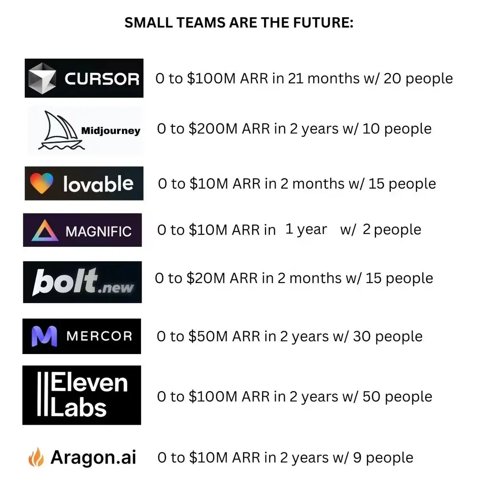

一个被低估的超级商机：海外软件产品生意。

## 1. 软件生意是世界第一的生意模式，没有之一！

**边际成本几乎为零** — 做一个软件和卖一百万份的成本差别微乎其微。你只需要维护服务器和提供基础客服。

**睡后收入的典范** — 晚上睡觉时，美国用户正好开始活跃；早上醒来，发现账户又多了几千美元。这就是软件创业的魅力！

**规模化无上限** — 一个 APP 可以服务全球数十亿用户，而你的团队规模可能只有几十人。这种产品以前是 WhatsApp，后来是下图：

## 2. 中国人做海外软件，好上加好

**中国的成本 + 发达国家的收入 = 惊人的利润！**

**人力成本优势** — 在硅谷，一个资深开发者年薪可能高达 20 万美元，而在中国，同等水平的人才成本可能只有其 1/3 甚至更低。这意味着你可以用更少的投入组建更强大的团队！

**应用创新基因** — 中国互联网的"超级 APP"思维、快速迭代文化和极致用户体验，已经超越了很多海外产品。我们对产品打磨的理解和执行力已经领先全球！

**海外用户付费意愿高** — 这或许是最关键的一点！国外用户习惯为优质软件服务付费，订阅制度成熟，客单价远高于国内市场。一个在国内只愿意付 5 元的功能，在海外可能轻松收取 10 美元！

## 3. 小公司的逆袭机会

目前 AIGC 产品出海榜单中，80% 的爆款来自你从未听说过的小公司！

是的，你没看错！不是巨头垄断，而是无数默默耕耘的小团队在闷声发大财！

目前在中国 AIGC 出海产品榜单 Top 100 中，有 20 款左右，来自生财有术的圈友！
