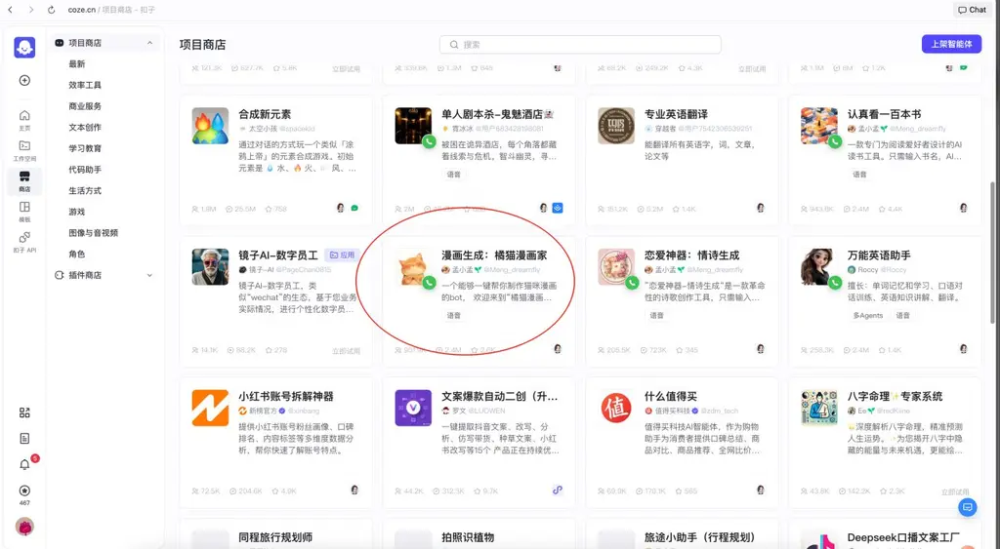
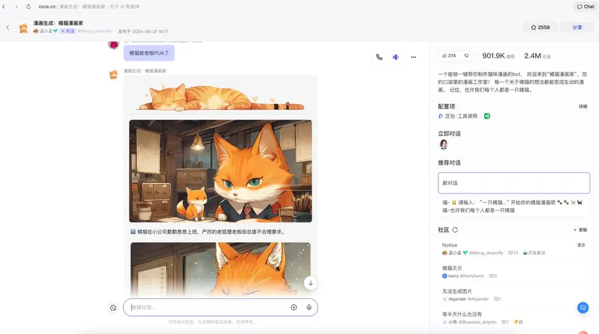
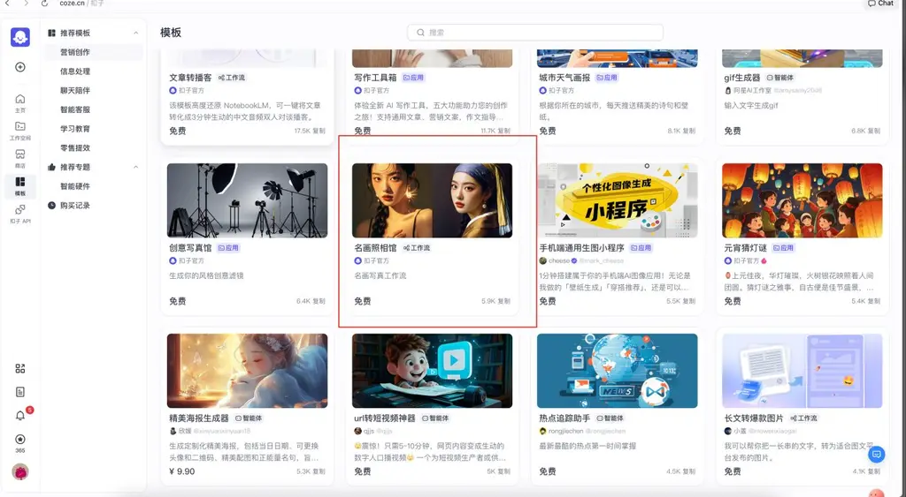
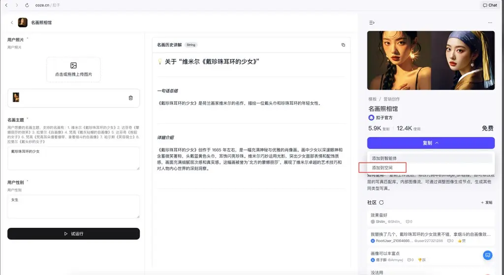
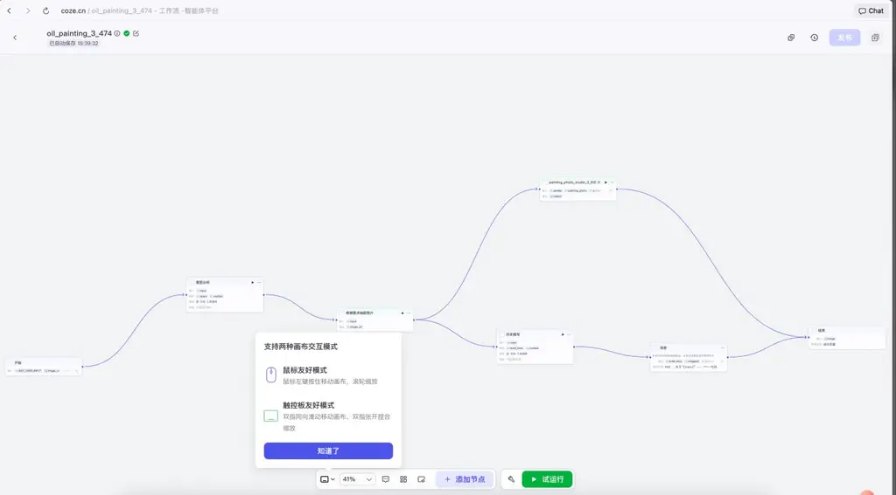
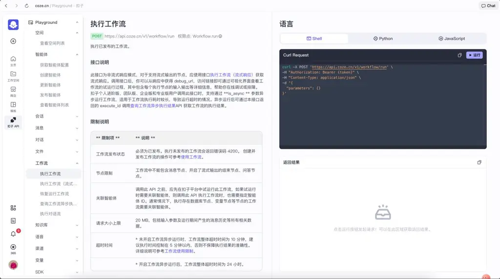

到 coze.cn / coze.com，研究别人的优秀模板、优秀流程，可以给你很多启发。

我开发产品时，往往是在 coze 里做完实验、输出 API，再去把 API"套壳"做成产品。

例如，让我打开这里：

<https://www.coze.cn/store/agent?cate_type=recommend>

这里列出来的很多"工作流"，都可以套壳。比如我知道有人做"AI 漫画产品"，完全可以参考下图所示的工作流。

效果是非常稳定的。

不过，上面举例的"橘猫漫画家"是一个私有的工作流，不能被我们直接使用。你可以尝试自行复刻。

## 如何入门复刻 coze 的工作流呢？—— 推荐从官网模板开始

也就是这里：<https://www.coze.cn/template>

你可以选择一个有"发展为套壳产品潜质"的模板，然后点击复制，就可以看到完整的工作流。

你再在完整工作流里进行修改，从而变成你自己的 API：

当你调整完成工作流、发布工作流后，就可以通过 API 的方式来调用了。

请参考这里：<https://www.coze.cn/open/playground/workflow_run>

