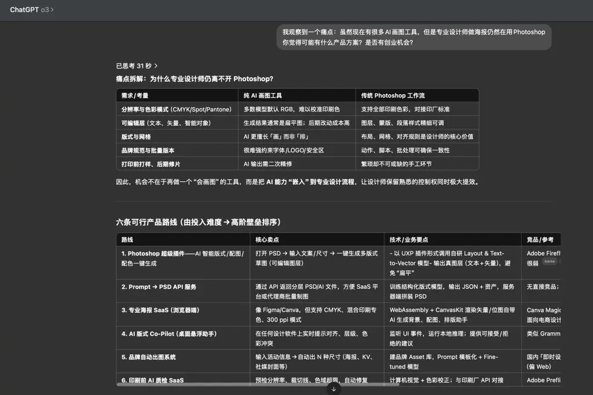

经过上述课程的铺垫，总结起来是以下 4 个阶段。

## 阶段 1：洞察需求

通过关注各类高价值产品榜单、通过日常生活、通过熟知的某个场景等信息，找到一个痛点。

对痛点的深度求索，就是洞察需求的过程。

让 AI 当你的"诸葛亮"，批量生产出一批批的产品机会点。

上个月，我在生财有术杭州总部看到设计师小花竟然仍然在用 Photoshop 做海报，要花很多精力。这就是一个痛点。为什么有那么多 AI 工具，她仍然用 Photoshop 手工去做呢？

对这样的痛点进行挖掘，就能找到产品机会。

请看下图：

## 阶段 2：将你洞察到的需求，变成产品方案

我们反复强调，所谓产品，就是"一个具体问题的解决方案"。

你可以利用 PUA AI 的形式，做出一份优秀的产品设计文档。

可以让 AI 给你生成页面，来帮助你更清晰地构建商业模型。

其中，MVP 的产品方案，用咱们课程「基础篇」的内容已经足够。

## 阶段 3：将产品方案落地为产品

利用 AI 写代码 + 你的代码内功，来实现一套套用户可使用的产品方案。

实现用户：

- 可走通产品全流程
- 可登录
- 可收款

学习「进阶篇」的内容，可以快速完成该阶段。

## 阶段 4：将成功的 MVP 产品收益扩大

- 翻石头原则，将成功的那个产品，功能迭代。
- 通过找开源项目、找 API，丰满你的产品解决方案。
- 让 AI 持续地帮助你总结垂直领域的外部信息，助你的产品能更加满足用户的需求。

更完整的细节和每个阶段的动作，可以看课程进阶篇的「Idea to Business 的完整流程」一课。

## 助教补充

我自身经验总结和观察他人的一些成功方法：【本质是保持在场，等风来，做 FIRST ONE】

零基础，先用 AI 上十个网站，类型随意，目标是熟悉上站流程、Cloudflare / Vercel / 域名注册商的操作界面。

- **阶段一**：做新词新站，通读生财精华帖所有与网站出海有关的文章，重点推荐刘小排 / 哥飞 / 子木的系列文章。
- **阶段二**：当你网站陆续有流量了，继续优化与放大，有了正反馈才好长期坚持，开始准备基础工作：收款 / 模板 / 需求 / 榜单 / 外链。
- **阶段三**：当你取得一定成绩，比如有零星收款 / 赞赏 / 广告费时，要给自己做商业画布。出海网站的类型有很多种，最感兴趣最适合最想持续做的是哪一个？（游戏 / 导航 / 图片 / 视频 / 音乐 / 资料 / SaaS）

其次是我梳理的从小排老师的方法论：总原则：一切都交给 AI，懂不懂代码，都向 AI 请教，把 AI 当作最佳导师，从学习到实践。

- **第一步**，先摸索需求，这里面有非常多的用户自发提交的个人需求：<https://theresanaiforthat.com/requests/>
- **第二步**，再学习榜样，我每天都通过 AI 来帮我分析这些榜单产品：<https://www.toolify.ai/Best-AI-Tools-revenue>
- **第三步**，找到你认为非常有价值的需求，通过包含必备功能的 MVP 验证需求，跟用户建立联系，完善 BUG 和确定真伪：<https://readmake.com/>

只要你找得到用户，完成了产品，那么你就可以开始收费，获取反馈，月入万刀就是优化产品体验功能的事情了。

但是目前我看到的新手，包括程序员和产品经理，主要还是做供需不平衡的短期红利，老手才开始挑战高 KD 的老词。<https://scys.com/articleDetail/xq_topic/8852585812152582>
