# 离开扣子编程，浅尝深水区（上）

4.5更新（离开扣子编程，浅尝深水区-上）\_原文

2026年04月05日 12:42

发言人 00:00

戴眼镜，上次也是这个眼镜。今天之前一周多还是相对比较简单的，我们是慢慢来，难度慢慢增加的。然后接下来的这一个月非常重要，我们先复习一下日程的安排，目前我画了一个圈，这是第三周的内容，看到吗？就是我们现在在画了个圈，这里然后在这个图上就这一行右上角橙色的部分就是我们本月要处理的内容。而这一个月的内容相对是比较重要的。我记得我的标题大标题叫搞懂这些你就不是小白了。其实第一行我们左边蓝色的部分，说白了就是搞得好玩，吸引你的兴趣，所以基本上全程也没有说一些技术细节。

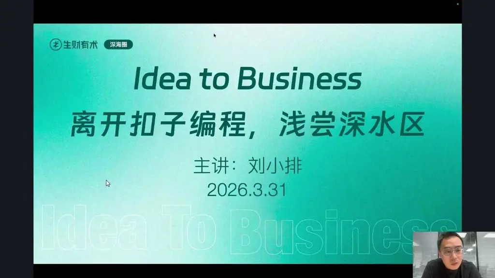

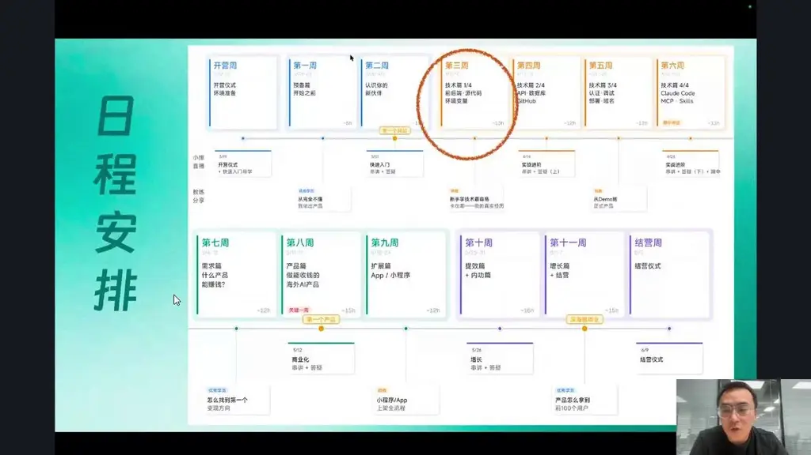

发言人 01:02

在本月其实是四月了，在四月这一整个月我们的内容就慢慢会硬核一点，我们会把这些概念一个一个拆出来跟大家讲好。如果大家有什么问题，跟我们课程内容相关的问题，你们可以在留言区留言，我看到会补充回答你。什么pro的代码泄露跟我们课程没有任何关系，也不建议大家现在去关注。

发言人 01:32

OK好，那我们继续本周的学习任务是什么呢？其实你们注意到了吗？我们新的这一周的课程已经解锁了，给你们看一眼在这里。

发言人 01:53

好，这是我们课程的官网，在这里。然后现在你如果点这个课程专区的话。你可以看到这个我们已经解锁了，在这儿。然后我们本月要处理的内容就是这个03、04、05、06就4个星期，我们每周就解锁一个星期的内容，这个时间我们有可能会提前到时候看大家整体的进度，不排除提前的可能性。如果大家整体进度偏快的话，我们可能会考虑提前。

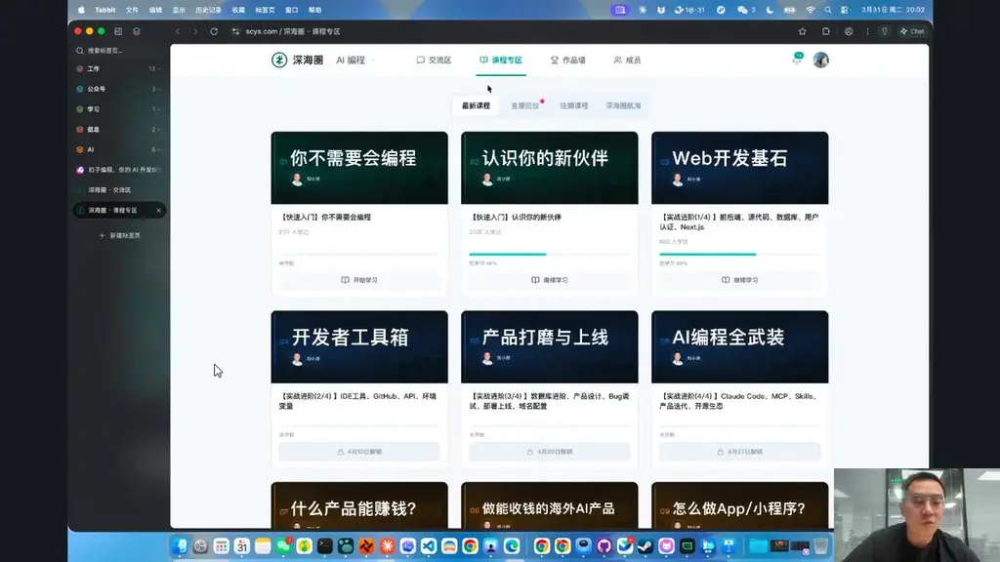

发言人 02:33

好，本周是这些，这些里面是些什么东西呢？我们待会儿会简单串讲一下。你可以点开看看。我今天看到个别有几个速度比较快的同学吧，已经抓紧时间把这个都都实操完了，终于赶上直播了，谢谢刚才说到有有的那个同学看到课程开放后已经实操完了，还发了帖子，在这个交流去。

发言人 03:03

好，回来。本周我们开放的这个课程学习任务是什么呢？是我们其实上周的主线任务是不关注技术原理，在cos编程里通过纯聊天的方式做出了一些简单有趣的产品。还记得吧？我们之前一周的时间就一点技术都没讲，然后大家做了至少三个产品。

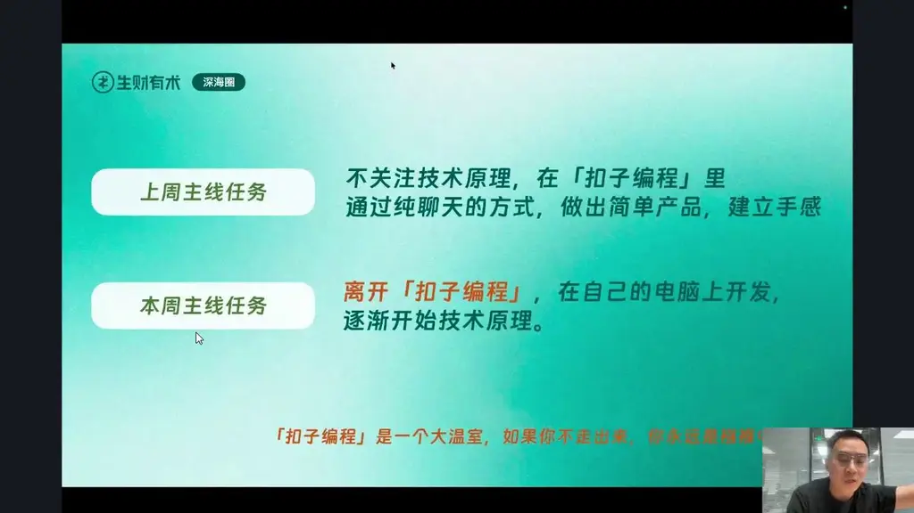

发言人 03:33

而且最后一个纸片人男友其实还是有一些挑战的。我也看到有很多同学提交了自己纸片人男友的作业，但有些同学提交的那个作业还是一般的，稍微聊两句就开始说车轱辘话了，一点代入感都没有。同学们你说你开发了个纸片人男友，你好歹自己多聊两句，看看逼不逼真。好，但但那个好在前面是一个算算简单的玩具课，后面希望大家认真一点。你说你一个产品你自己都没用，自己都用不起来，你怎么期待用户喜欢你的产品呢？

发言人 04:10

嗯然后我们本周主线的任务是离开扣子编程，在你自己的电脑上开发。在这个过程当中逐渐开始技术原理，这是本周就要做到的。本周我们就要在自己的电脑上开发了。然后接下来还有三周，就是我们不断去在流程里面理解更多的技术原理。

发言人 04:32

然后有人问说为什么要出来？因为扣子编程它虽然做的好啊，但它就是一个大温室。如果你不走出来的话，你永远都是襁褓中的婴儿。其实你就想想，扣子编程可能你第一次用觉得很好用的，但你见过什么正儿八经的产品是用扣子编程做的呢？是不是就很少，或者就没有。

发言人 04:57

刚才有同学问，本来是程序员这两周可以做些什么？这两周你可以帮他在群里答疑，然后你可以看看往期的课程。如果你觉得你技术上一点问题都没有，当然这是可能的。你可以看看我们往往期的课程，因为往期的课程我们是在社区里面完整更新的。对我上次是不是讲过？往期客人在这里，在这里，如果你确保你真的是前面技术没问题，你可以去看往期课程，这里面有一些认知篇，然后增长篇、境界篇的内容，可能跟编程没有太大直接的关系，对吧？

发言人 05:44

好，主线任务知道了吧？有人问为什么扣子有时候可以预览，有时候不行？这是你需你需要搞清楚的。这个小黑同学这是你需要去搞清楚的。你不能把它当成一个纯抽卡机，你得知道它是你在什么情况下它可以，什么情况下不可以，你的操作有什么不同，并且明白其中的原理，这才是要学习。

发言人 06:12

好，有人问next GS需要系统学吗？这个同学其实是需要的，是需要的。好，那我们继续。有有的同学问的问题，这其实跟我们这个一点关系都没有。上这个同学我就先不领点，我们先正常讲这个课程，就请大家尽量问跟我们此刻或者本周讲的内容相关的问题，我们要保证大家的体验。

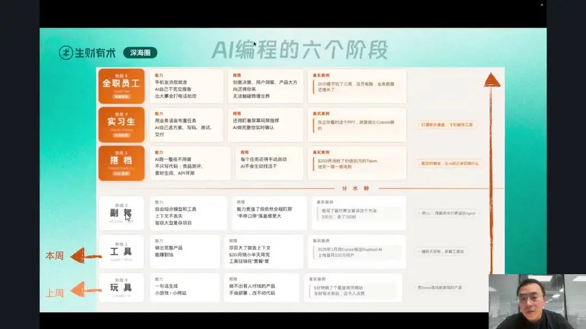

发言人 06:39

还记得这个图吗？这是我总结的。你们有没有上周末在杭州听我演讲或者参加我夜话的朋友啊？有的话可以打一个一我看看。没有吗？还是有一些的对，我当时准备我在杭州的时候，那个演讲主要就是讲的这部分了。

发言人 07:04

但是这个图我上周也给大家看过，这是我自己总结的AI编程的六个阶段。我们是从下面往上面一步一步来的。我右下左下角做了标记，看到了吗？我们上周其实你用什么扣子编程V零这种东西，他就是在一个玩具阶段玩具阶段，玩具阶段最重要的是让你自己觉得好玩，你可以享受玩的过程，这样你才有信心和有兴趣去搞负面的。而我们从本周开始到后面两三周要做的就是这个阶段。一本周开始工具阶段，它其实是你可以做出来完整产品，在你本月学完之后，你说你一个根本不是程序员出身的人，然后你基本上绝大部分的这种产品，软件产品，你都完全能够做出来，这是本月的目标。

发言人 08:01

我又看到两个提问，我这两个问题我不会回答的。你再强调一下，你我只会回答跟我此刻讲的跟本周内容相关的问题。其他问题请大家不要在直播间里问了，你可以在在群里问。

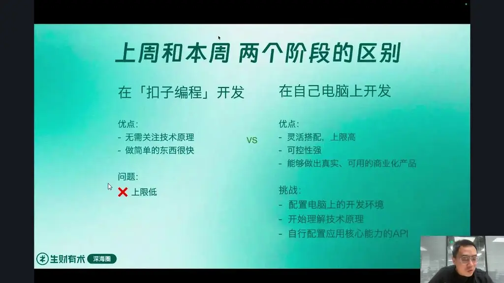

发言人 08:17

好，我们接着讲，上周和本周这两个阶段的区别是什么呢？就是上周我们在扣子开发里面，cos编程里面的那个你做简单的东西很快，你也不太在关注技术原理，但它的上限还是太低了一点。而我们在自己的电脑上开发，它的灵活性比较强，你想干啥就干啥，可控性也很强，然后能够做出真实的可以商业的产品，但是他的挑战对于技术小白来说挑战也很大的。你不要觉得你看个直播马上就会了，这是不可能的，需要一个月，我们特地把时间拉长到了一个月，你要需要去理解里面的很多很多的技术原理。比如说哪些技术原理呢？我们就以今天的直播以及对应的刚刚开放的课程，就我刚才跟大家演示的开放的这五节课，你不要小看这短短的5节课里面至少有这些概念，这还是我凭印象写了一部分，就多少个二三十个。可能你如果你是程序员，你掌握这些概念，那可能你早就掌握了，不然你也找不到程序员这个工作。但如果你不是程序员，就是小白来说，你要尤其小心。

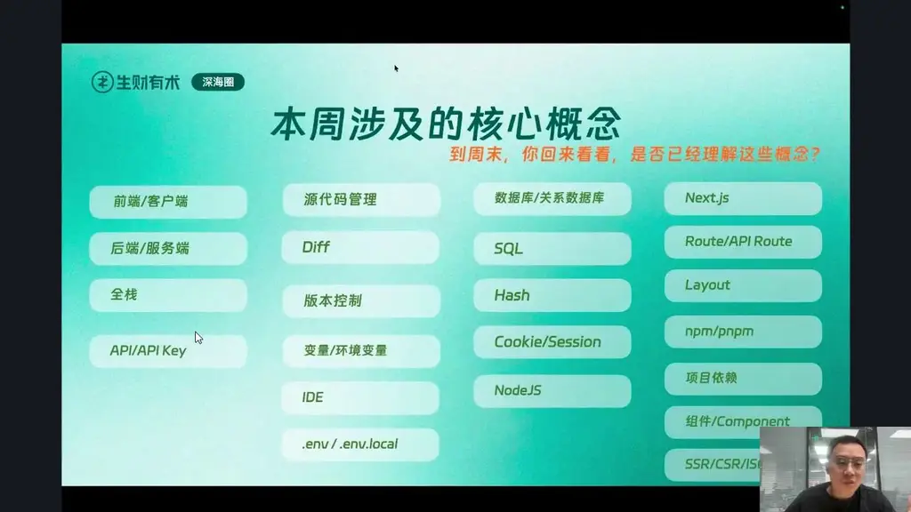

发言人 09:34

其实前几天在杭州我要快答疑的时候，就有个朋友问我说是小白学外部coding怎么学会呢？我当时给的答案就是你得按照路径把这些概念得都弄明白，这才二十多个，这是本周的，你说你把这个其实我们课程都会慢慢把它串起来，但我预估可能就100来个，就大概100来个这样的技术概念。然后你在我们的课程当中，在这个流程里面，你花一个月的时间，你都能够搞明白是什么意思。我觉得你哪怕不是程序员出身，不是技术出身的同学，你也可以做大部分东西了。

发言人 10:20

有人说这么多，你不要着急。对的，你不是技术出身，你会觉得多，你会觉得多。但是你跟着我们的课程走，我们课程里面是有一条主线的，然后我每个概念我都会讲解一点点。如果你没看明白，你在在我的基础上再问一下AI肯定能学明白了。在线的程序员朋友应该可以知道，这些其实是比较基础的。好，有人问怎么评判自己掌握了这些概念，这是一个含金量非常高的问题，这一页大家可以先截图，为啥呢？因为我怕你忘了，你到周末的时候，你交作业的时候，我不希望只看到你发了一个你作品的链接。而是你能够很清楚，你完全理解了这些概念。

发言人 11:13

直接讲概念非常枯燥，所以我们的做法是一贯的，就这一块大家可以看看，直接讲概念，我讲了这个在线人数都掉了，我们的做法就是跟上周一样，我们会先讲操作流程。而我们在图文教程里面的所有操作流程，你可以去看看，那真是每一步都有保证，每个人都能学会。然后在操作的流程当中，我们会穿插的讲刚才列到的这些技术概念，这是我们的做法，关键的技术概念和术语。

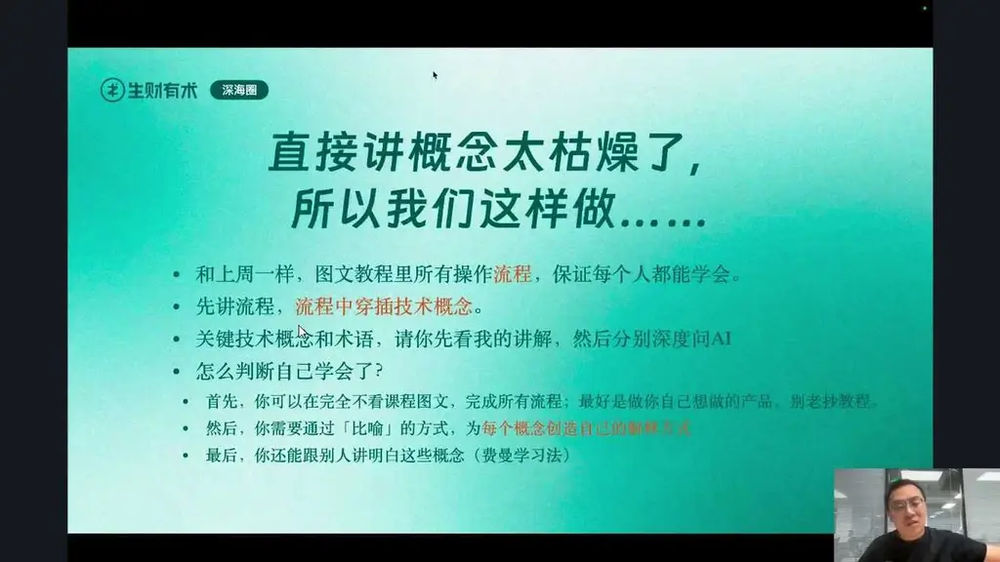

发言人 11:49

你在我图文课程当中看到的，你要去分别深度的問ai这是学习办法。好，回答你的问题，怎么判断自己学会了？首先你把我的这个图文课程给关掉，然后你也可以完成整个流程，并且最好就是做你自己想做的产品。你别老抄我们的教程，对吧？那个教程演了个讲了个互联网黑话翻译器，一个交的作业你也只交互联网黑话翻译器，你要不稍微改改翻译别的也好一点。好，然后有同学问截图，截图你不截也可以，我待会儿会把PPT发群里，今天晚上或者明天。

发言人 12:32

然后怎么判断自己学会了，继续来。你要通过比喻的方式，每为每个概念创造自己的解释。最后你还能跟别人讲明白这些概念，这个叫费曼学习法。刚才是谁问的，怎么判断算理解了？惊蛰托马斯同学就是这样的，你要为每个概念创造你自己的解释方式。因为这些概念本来就很奇怪，我们倒回去看一眼，这都是英文，很多概念它都没有中文翻译，我也不知道中文怎么翻译，它就叫这个。你如果能创造一些自己的比喻去跟别人讲明白，可以，那你就学会了。

发言人 13:16

好比如说我们举个例子，什么叫创造自己的解释方式？举例什么叫创造自己的解释方式，这我课里面就这么写的。比如说你怎么跟人说前端和后端，那我们就会说前端管理，后端管脑，或者你的用户看得见的就是前端，你的用户看不见的就是后端，对吧？或者你还可以再举一个例子，你天天在微信里面聊天，你装的那个叫微信的APP，那个就叫前端。但微信的那些服务器，比如说什么敏感词审核，那是你看不见的，那个叫后端，你可以大概这么理解。

发言人 13:57

然后你看数据库，我里面也是两个数据库，你就把它当成一个大的excel数据库的表，那就是excel里面的表，excel一个文件里面是有多个表的，这个你们应该是知道的。然后数据库里面的字段就等于excel的一列，数据库里面的记录就等于1 excel里面的一行，对不对？就这样你可以去创造自己的解释方式，然后你如果通过这种方式，当然最好是编辑自己的，然后你去给你们公司一个只会搞excel的人讲清楚数据库的话，那你肯定是会的，对不对？这中间他还会问的问题，他问的问题你也都能回答清楚。

发言人 14:36

好，那就是学会了，就这么来要求自己。同学们我们再看一眼，就这些玩意儿，就这些玩意儿。好，明白了吧？我先答疑一小步。我先看看你们还有什么跟这个相关的问题。

发言人 14:56

有人说目前对我而言是天书，好事，那你本周就会掌握了。有人说做红色模拟器的时候，看东西头大背了一周还是没搞懂太多，所以得花时间，同学们得花时间，正常的啊不要着急，大家都是从小白过来的这有什么很正常。好像没有新的问题了。

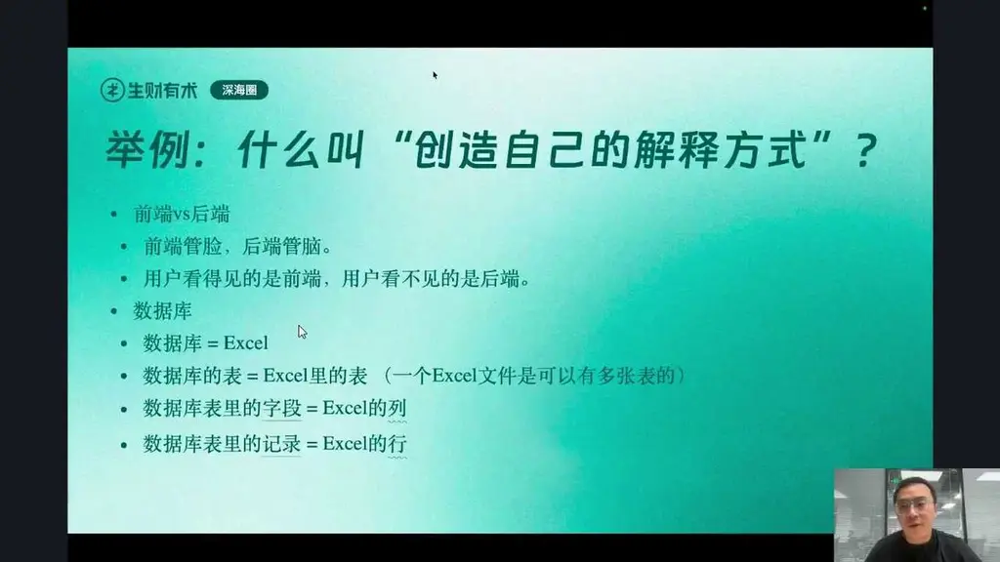

发言人 15:33

看过就忘，说明你就没会。我们刚才说过了，怎么评判你会，已经说过了，不再重复了。好，那我们就来串讲关键概念了，串讲关键流程了还记得我们刚才说本周任务是啥吗？本周任务是离开扣子编程。那我们的第一件事儿就是你得先把你上周在扣子编程里面做的产品，在你自己的电脑上运行起来。差不多这周的五节课就到这儿为止，其他的不要急，下周再来。就这样一个这种从今天开始你就再也不要用扣子编程了。好，你要从那个大温室里面出来啊不要再趟襁褓里的婴儿，这是本周最重要的任务。

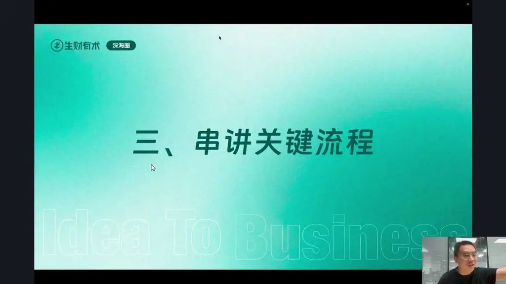

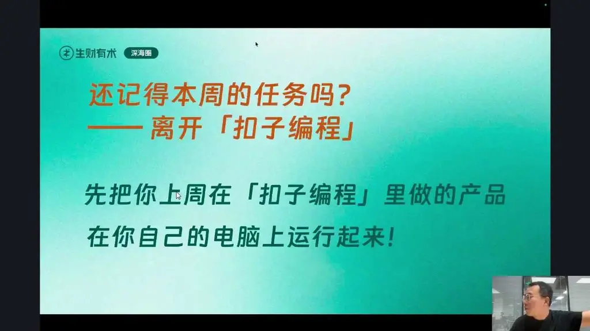

发言人 16:28

好，那我们就开始演示了。这个问题怎么又来了？对于程序员来说有点痛苦。什么建议？看前面，我刚才已经讲过了，怎么每次都要回答。同学们要不看看录播，尊重一下咱们两千多个在线的其他同学。

发言人 16:48

OK好，那我们开始演示了，大概这样的。我们比如说这个是扣子编程了，我慢慢来，我们还是小白朋友比较多。好，你刚打开扣子编程肯定是这样的，记得吗？你就在项目管理找到你之前的一个项目，假如说你怕把这个项目弄坏了，你可以点这里，你可以创建副本，创建副本，在副本里面搞副本，就是把它copy一下。比如说这是上周我直播的时候做的，我就创建副本给它起个名字，副本直播专用。好，这样我就搞这个副本，就不会把以前的搞坏了。

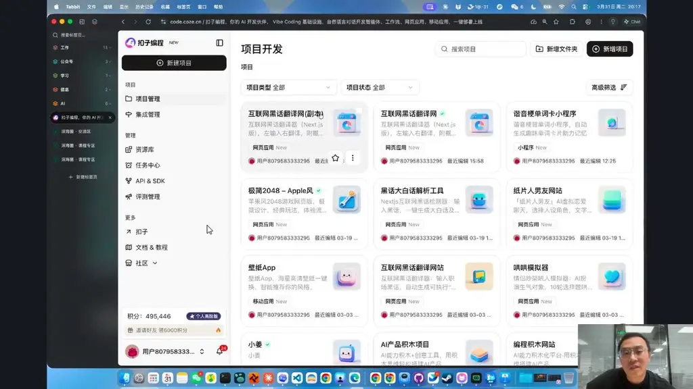

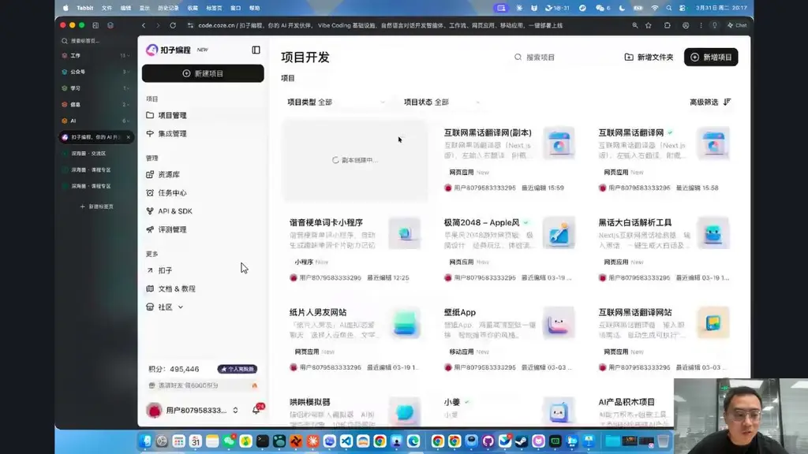

发言人 17:44

我把这个挪过去，免得挡住。这是我刚才创建的副本。

发言人 17:58

来，我们回到这个课程，把它对应起来。这次开放的第一课叫前端和后端叫前端和后端。我这里没有办法一一在这里讲，跟他们讲一下重点。就是你首先在扣子编程里面看看这个代码的结构，然后你可以通过AI浏览器问哪些是前端，哪些是后端，这个还没出来，你可以把这个点开看。对，然后这个我就不演示了。这个很简单，我们上次直播已经演示过了，图文里面也有。然后你要彻底明白这个前端后端是什么。然后还有这里就是你的用户的一次点击到底发生了些什么事情，你都需要能够跟别人讲出来，这个才叫会。

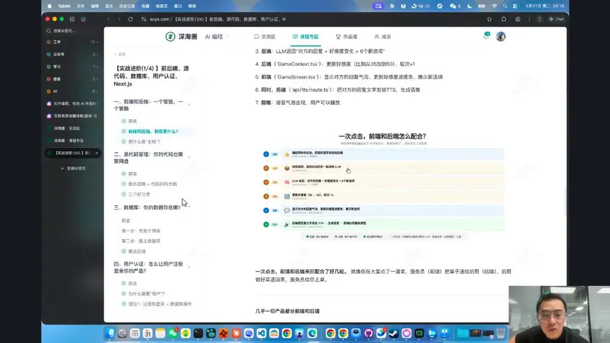

发言人 18:55

好，接下来我们要注意的就是这个源代码管理，源代码管理，这个地方我都觉得不是很好。这个是我当时跟AI讨论了之后写出来的，就是版本管理，就是代码的时光机。这个我们上次是不是也讲到一点了。比如说我们举个例子，我们在这里把大标题改成红色。

发言人 19:25

对，副本就是复制了一个，没错。好看，这里变成红色了，对不对？这里变成红色了，那肯定是改成功了，然后稍等一下，等它完全改完。

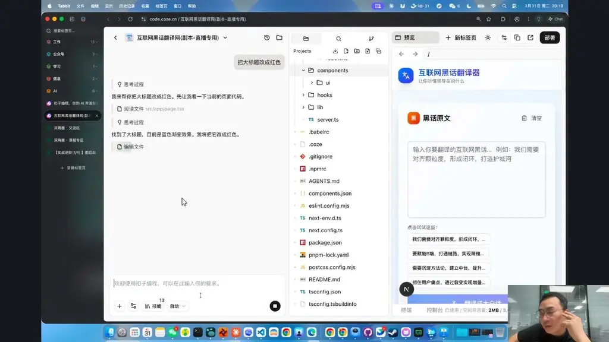

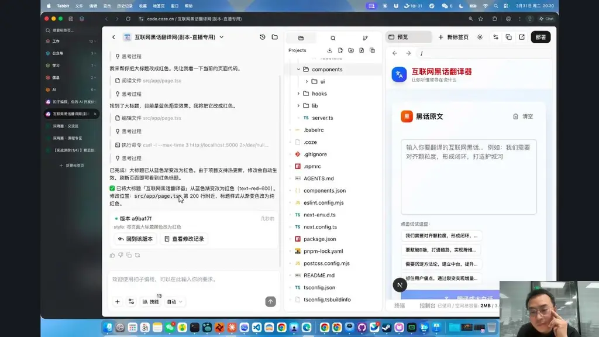

发言人 19:43

这里同学们注意，这里跳出来的是什么？这是上次我们没有去强调的。你看了这个就叫版本的历史记录，我们可以查看修改记录，有有两种办法。第一种办法是你可以点这里查看修改记录，就会到这个页面。然后这里你看这就是我这次提交一个commit它的ID号，身份证号，这一次提交代码的身份证号，不是身份证上不仅有身份证，还有名字。这个名字就是我本次修改这个代码它的一个概要，我本次修改叫将页面大标题改成红色，然后下面还有变更文件数。

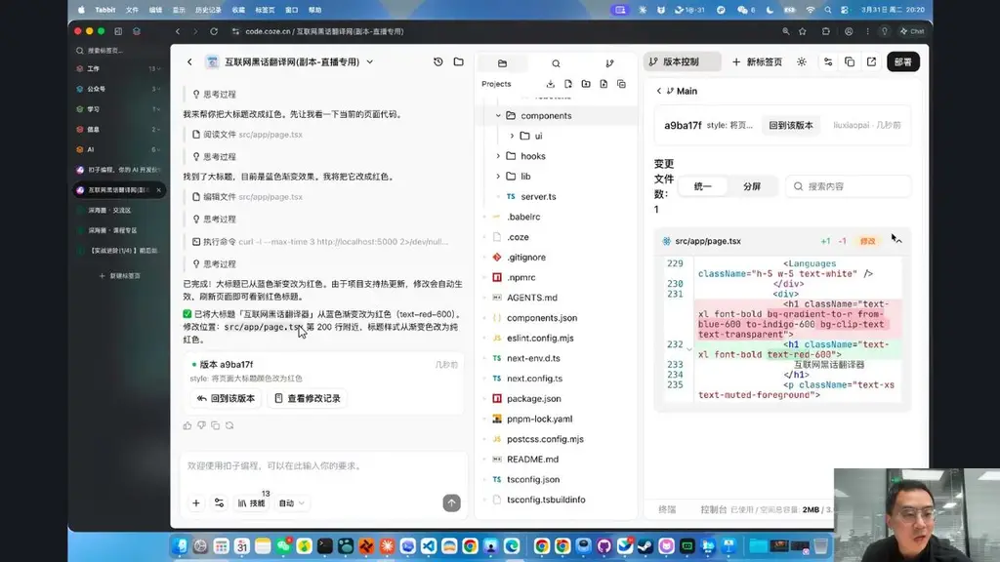

发言人 20:27

一就这次修改一共改了一个文件，又改了一个文件，那具体改了什么呢？你还可以点开看啊，这一个文件里面，你看红色的表示是被删除的，绿色的表示是增加的。因为在程序员的世界里面是没有修改这个东西的。所谓的修改就是删除了再增加，它就会出现这样。有的程序员朋友如果不太信任AI的话，他习惯看一下这个修改记录，然后把它看明白，看看AI改错。没有，你也可以，你不习惯上下看的话，你可以分屏看啊。分别是这样的，就仍然是红色的是被删掉的，然后绿色的是增加的。其实这些代码也没有那么难懂，你其实大概都能猜出来是什么意思。

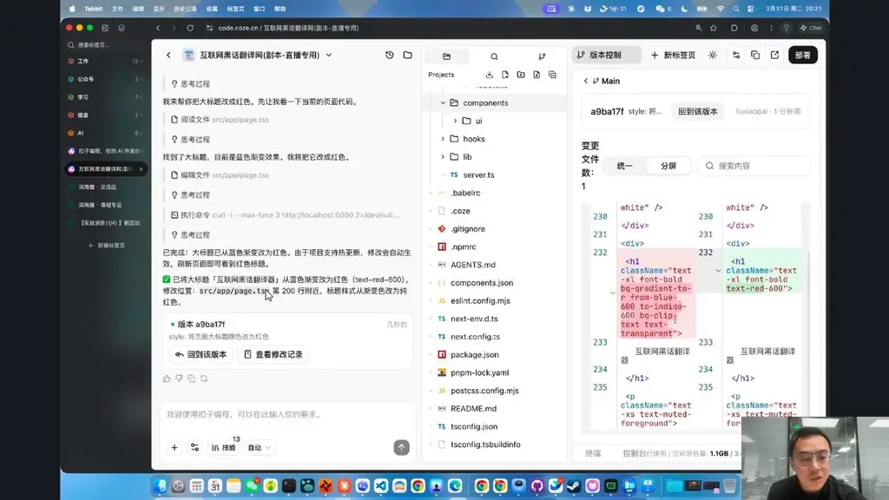

发言人 21:20

你想想我们以前那个我改之前标题是蓝色的，记得吗？是一个渐变的，所以你大概就可以猜到这个什么blue 600，大概blue就是蓝色，被删掉了，现在改成了什么red 600，对吧？Take red那个你一猜就知道大概是红色的意思。好，所以最后呈现出来的就是刚才我们看到的那个结果，就是它对不对？这是基本的版本管理。

发言人 21:49

然后你看这里还有一个按钮，我们刚才点的查看修改记录是不是我还可以回去，我还可以回去，我还可以回到该版本，把刚才的滚回滚了，看我点一下。回滚他就回滚了，那回滚了刚才的代码就一下就不见了，我跟他对的话也从来没有发生过。标题重新回到了这个蓝色，叫到紫色的样子的，没声音，应该是有声音的，应该是有声音的。好，这个我们演示的就是最最基本的这个版本记录。我们再试一次，我再说个别的，把大按钮改成橙色，这个我们演示的就是最最基本的版本记录。但其实正常程序员用的版本工具肯定不在扣子里面，在get up get up我们之后会讲好。

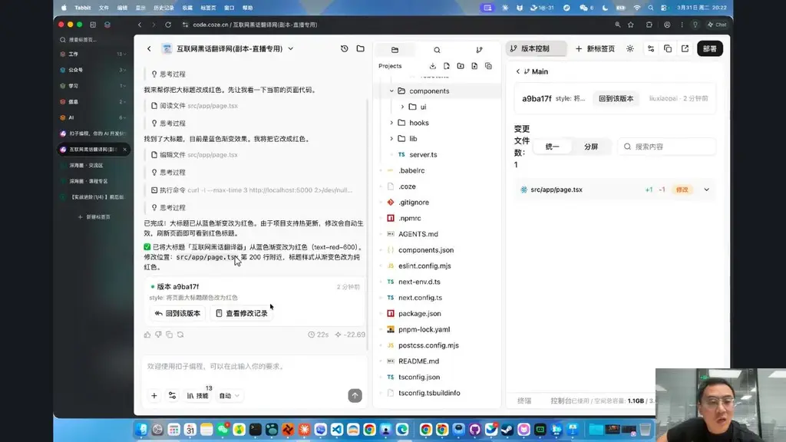

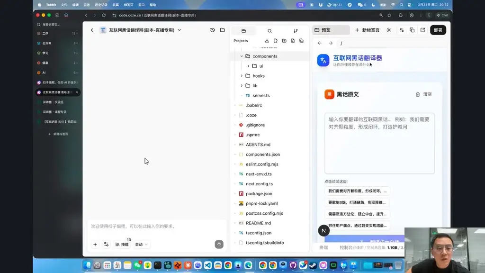

发言人 22:54

刚才这个流程算是把这个版本记录的基本概念跟大家从这种好理解的方式跟大家讲了一遍。我完全没有技术语言了。好，这里改好了，同样你可以看到修改记录。你说这个怎么进去呢？在这里理解了吗？

发言人 23:14

大家可以养成一个好习惯，就是你拿到一个东西，你就把这些按钮你没事儿就都点一遍，看不明白的你就问ai比如说你点点这个，你就会在里面找到版本控制。看到了吗？好，这就是我之前的，还记得吗？这个叫分支，这是之前的，这是我刚才演示的，将页面大标题改成红色，记得吧？然后我又改了一个叫做restore to，就是回滚到了之前的版本。然后在几秒前又来了，将翻译按钮就从蓝色改成橙色界面。

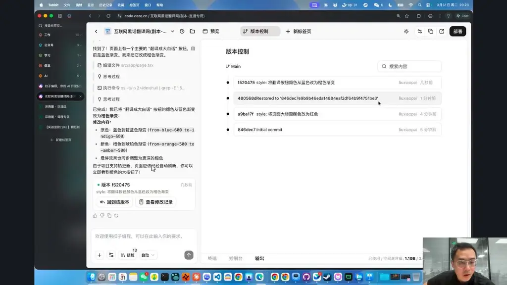

发言人 23:55

刚才有同学说看不懂代码怎么办？对，这个就是问AI，这个没有什么难的，我们试一试。什么叫问AI比如说这个我们刚刚改了，好吧？好，我们就问他，你可以用这个AI浏览器把这儿截了，然后直接跟他说，我看能不能直播一边用语音输入。我不会写代码，我是傻子。帮我翻译一下这个代码是什么意思，尽量简单一点。那这样就可以了吗？看不懂代码就是让AI给你讲，然后这些代码就这些套路。你说你按照我们课程学一个月，每天都这么跟AI问几次，有什么看不懂的，一个月后你啥都能看懂。

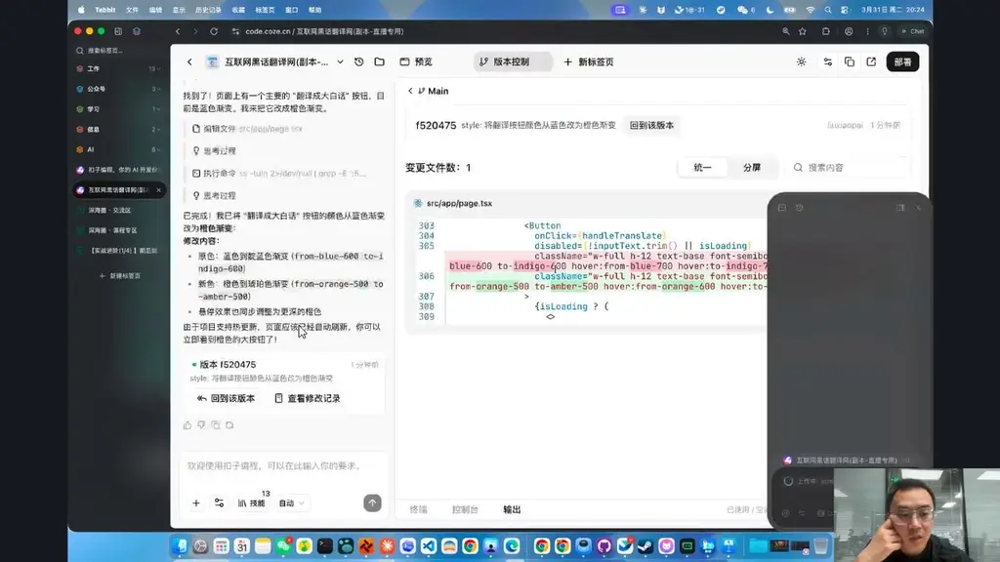

发言人 24:52

好，你看这里还有每一行什么意思呢？看到没？写的很好，你看这对应起来了。这一行什么意思，这一行什么意思？绿色那行，你看我刚才跟你们讲了，绿色是新加的代码，绿色这行你就可以对照看一看按钮现在是橙色到琥珀色，红色就是被删除的。你看都讲的很清楚因为我太傻了，我还是不太明白绿色的部分，怎么现在这个写法就是橙色到琥珀色了？这里面都是英文，看着好麻烦，你给我讲细一点。

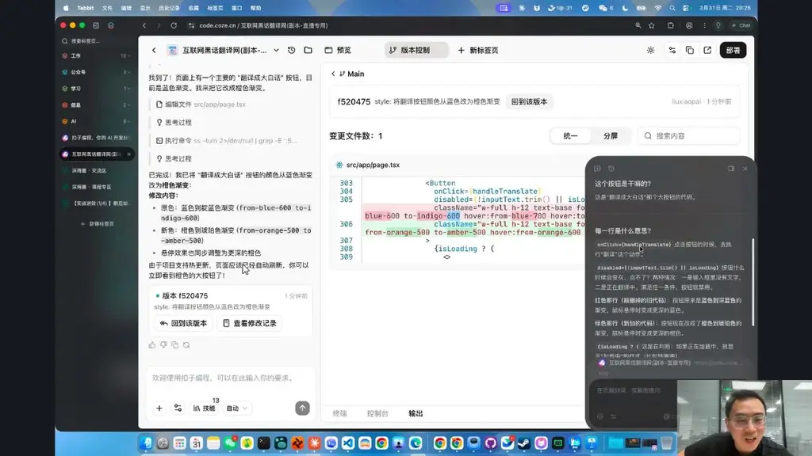

发言人 25:28

好，你接着问。对，有时候程序员表示代码的语法就那几个，看多了就懂了。没错，就是为首鼠饵。同学们你每天时间花到一个月后，你肯定可以都看得懂的。而且你不要觉得我们谁是天才，我们都是这么过来的。其实以前就现在的那些程序员，他以前也是阅读了别人的大量的代码，都是从看不懂到强行把它看懂，然后就真的能看懂了。你看他现在拆开给我讲解了，看到没？

发言人 26:00

绿色那行，拆开来看。这个是什么意思是吧？在这儿你就对应看啊，就是抱着这个耐心去看，不耻下问。这个说不耻下问的同学挺有意思的，我不觉得温渊是下问。

发言人 26:19

好，有个同学问语音用的是什么输入法？这个我开心直播讲了，我现在用的是微信自带的。等一下这个同学有点问题，我在课程里面也讲了，我用的是微信自带的输入法，不是微信输入法，就是这个电脑微信。这个同学看来课程也没看，直播也没看。好，那好，我们回到刚才的，回答两个问题。这是版本控制对不对？

发言人 26:49

刚才也说到了，你看到这种新的产品，你就把这些所有按钮都点一遍，不懂的你就把它变懂，是不是？然后你会发现很多好玩的功能，刚才我点的是控制这个按钮，然后引申出来了这个版本控制，什么回车版本等等，这些都有了你肯定会用了。你要做的就是接下来按照我们的图文课程在这里，我这个图文课程肯定比我直播讲的详细。好，然后去操作一遍，然后把里面的那个细节搞明白。比如说你看我就提前帮你们问的问题，为什么不用control加Z呢？为什么呢？我也写了。

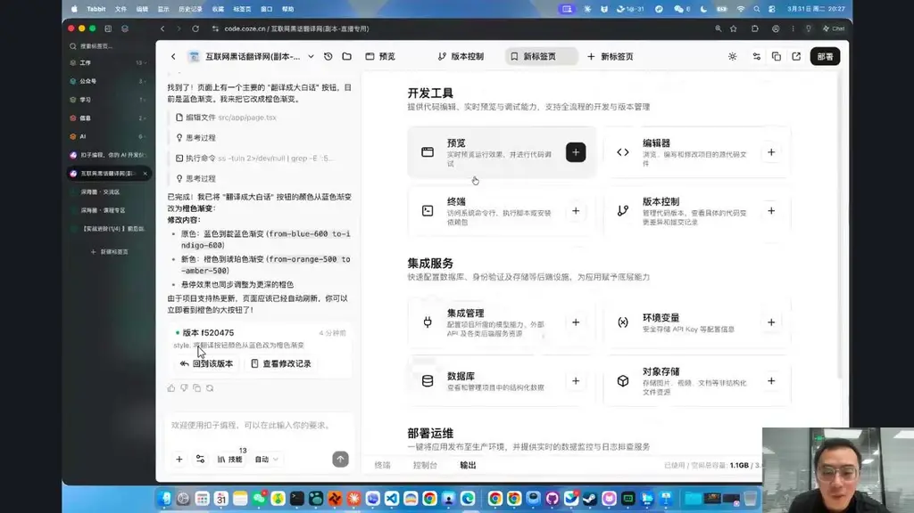

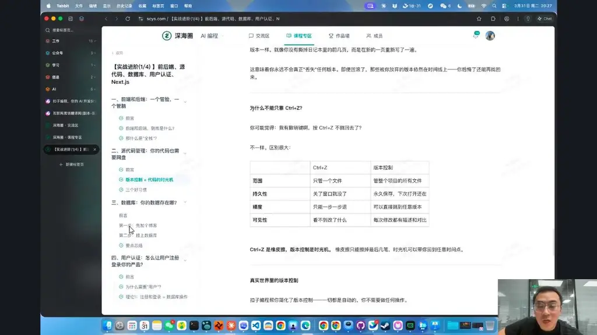

发言人 27:32

好，下一个我们要演示的是数据库是数据库。比如说数据库就是用来存数据的存数据的，然后扣子编程里面有数据库，在这里这里有数据库，但是我们都先不用直接去看啊，我们先口喷。这样，我给这个玩意儿加一个博客，然后把博客存到数据库里面。我们这么来玩了，现在用这个扣子SDK自带的数据库，还是语音自带的数据库。你先帮我建一个数据表叫博客表，再往里面插入五条的博客内容。然后你在我们的首页增加博客列表，把博客内容展示出来。并且点击博客列表里面的任意一条博客，可以打开博客详情页。好，我说清楚了。这个演示写的简单一点，其实我正常写不会那么随意的，会描述的更清楚。

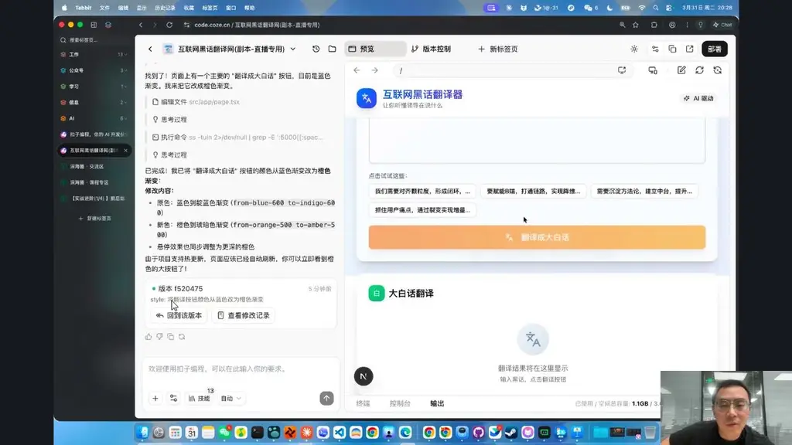

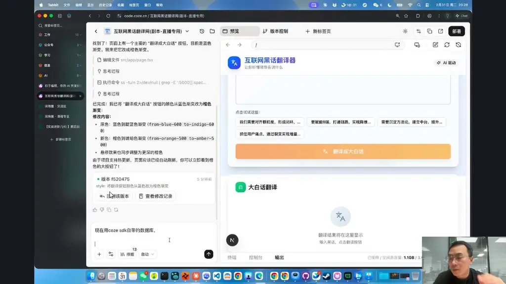

发言人 28:55

反正他在跑，其实跑的时候我之前说过了，跑的时候你是要去看看他在干嘛。然后你可以用AI浏览器去问，像这个你看你展开看你会发现它是有详细的思考过程的。阅读他的思考过程有三个好处。第一个好处是你看你的自己表达清楚没有，像我刚才喷的这一堆，你看他把我翻译成了12345，这是我的一个需求确认过程，这是第一个好处。第二个好处，你也可以学习到这个AI把一个需求拆解成技术语言的一些思路。你也可以看到。第三个好处是像这种具体的代码，你可以用AI浏览器顺便去问问他在干嘛，你也顺便学习了代码，所以三个好处，第一确认需求，第二理解把需求拆解成技术的逻辑。第三顺便看一些技术上的细节。

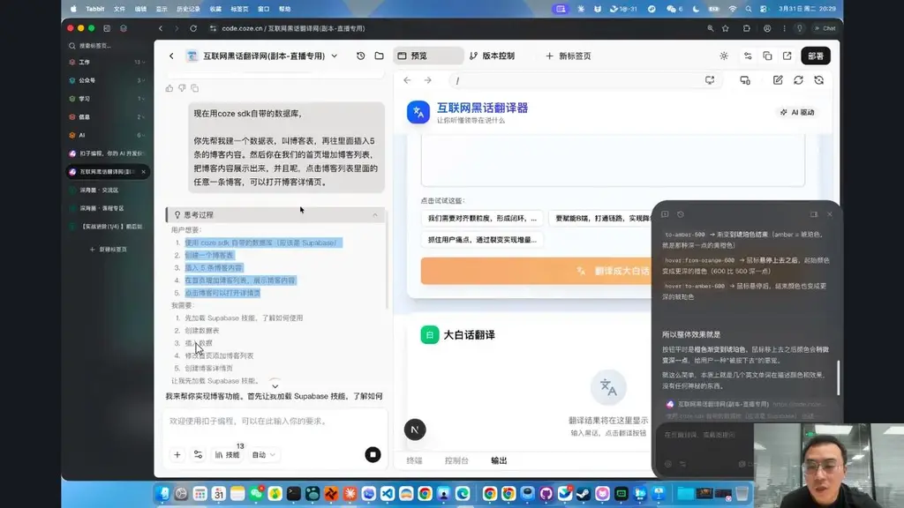

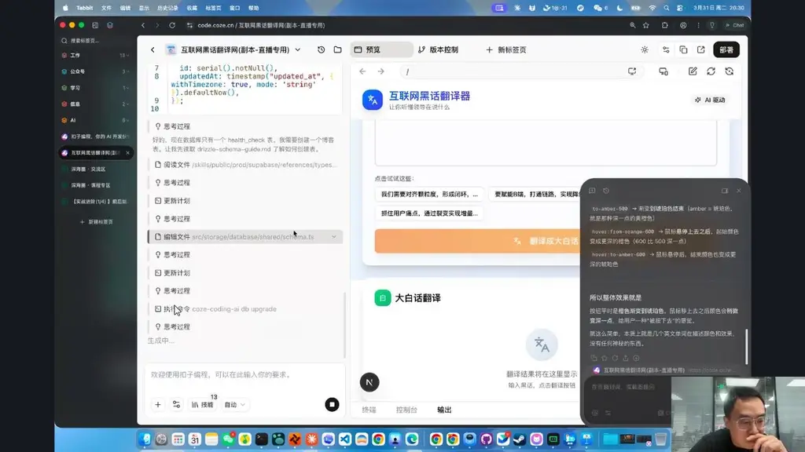

发言人 30:02

有人问我的AI浏览器是什么模型？这个上次也讲过了，这里也能看到，这是lod solid 4.6模型。我觉得他比较说人话，所以AI浏览器里面我还是用它。

发言人 30:20

有人问扣子编程解的是数外位置吗？其实不是的。虽然你问了一个好问题，就是书法base这个东西，它本身是开源的，所以cos编程接的不是官方的书法base，而是在自己的沙箱环境里面用的是开源版本。它其实是postgate数据库。这位同学看的还挺细的，应该是在看左边的过程。

发言人 31:06

好，这次因为任务比较多，确实慢一点，但没关系。什么是SDK是吧？好问题，我问一下，什么是SDK？就是这个同学还没养成问AI的习惯，其实这种情况你看到了，你就直接在旁边的AI浏览器就问了，反正闲着也是闲着，是不是？这里人家还打了一个比方，自己去看吧。然后有人问为什么你的扣子自带skill？这位同学你的扣子也自带的，因为这些都是官方的，包括这儿也可以选，这还可以选一些模型，mini max m2.7都是可以选的。

发言人 32:03

有人问语音输入，语音输入在麦克上面是FN那个键，我当然开微信了。这么大，在屏幕上都能看见，我当然开微信了。

发言人 32:26

好，我们继续来，这里刚才的任务基本差不多了，你看这里就在大家面前眼睁睁地变的，在功能下方增加了博客。但是你不要小心，不要小看这些博客。我们现在是讲到了数据库这里，在这儿我是快速演示了一下，就是详细的你们可以到图文里面去看看。

发言人 32:50

好，我们是怎么找到这个数据库的呢？你看还记得吗？在这里面有一个叫数据库的东西，这里点这个数据库，我们现在在开发环境，你就点这个开发环境。还记得我之前跟你们说的那个比方，就数据库，它就是excel好理解吧。然后这个表你看blog，你要是读过学，上过初中的话，应该知道blog就是博客的意思。他这里建了一个表，这个表里面就从我的博客数据，然后这还有一个别的什么表，先不管他了，这个博客是我们刚刚建的。

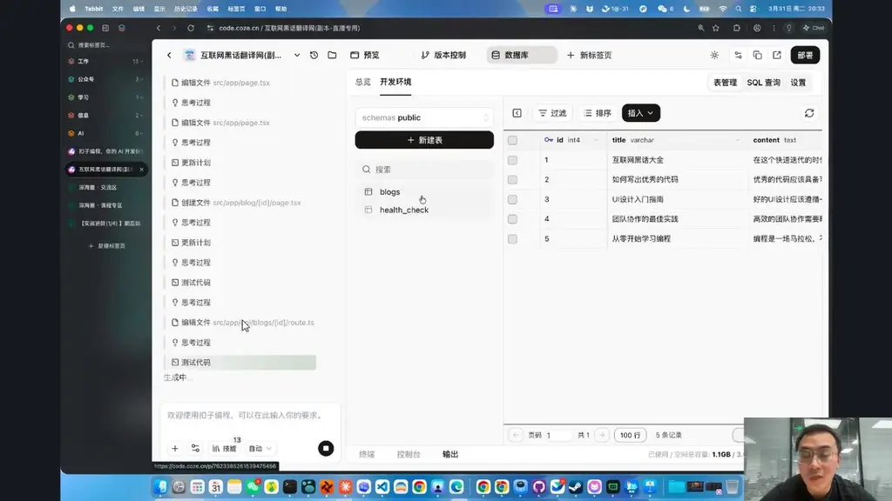

发言人 33:32

然后你看你可以用你熟悉的语言，它这个一行叫记录，它有五条记录。还记得我PPT说的吗？就是excel里面有五行的意思，数据库的记录就是excel的行。然后你再看这个列，这个叫什么title，这个就是excel。

---

# 离开扣子编程，浅尝深水区（下）

4.5更新（离开扣子编程，浅尝深水区-下）\_原文

2026年04月05日 12:44

发言人 00:01

好，我们继续来，这里刚才的任务基本差不多了，你看这里就在大家面前眼睁睁地变的，在功能下方增加了博客。但是你不要小心，不要小看这些博客。我们现在是讲到了数据库这里，在这儿我是快速演示了一下，就是详细的你们可以到图文里面去看看。

发言人 00:25

好，我们是怎么找到这个数据库的呢？你看还记得吗？在这里面有一个叫数据库的东西，这里点这个数据库，我们现在在开发环境，你就点这个开发环境。还记得我之前跟你们说的那个比方，就数据库，它就是excel好理解吧。然后这个表你看blogs，你要是读过学，上过初中的话，应该知道blog就是博客的意思。他这里建了一个表，这个表里面就从我的博客数据，然后这还有一个别的什么表，先不管它了，这个博客是我们刚刚建的。

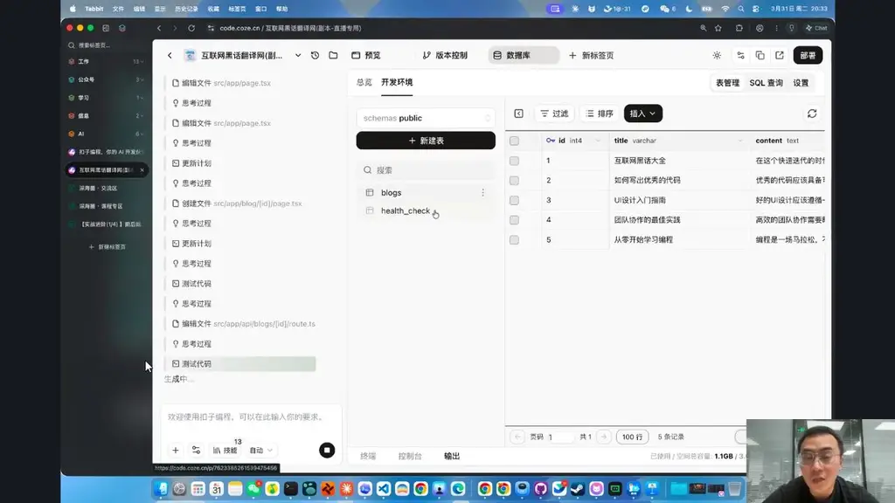

发言人 01:07

然后你看你可以用你熟悉的语言，它这个一行叫记录，它有五条记录。还记得我PPT说的吗？就是excel里面有五行的意思，数据库的记录就是excel的行。然后你再看这个列，这个叫什么title，这个就是excel里面的，就是纵向的一列的意思，看明白吧？因为你实操一下就很简单。

发言人 01:32

那你说这还有个叫什么洼圈，这个是什么东西？这个你就可以用AI浏览器问一下了，对不对？好，找到他。这个是啥？就是这么来学习的，就把你见过的任何东西都学扎实，这才叫学习。

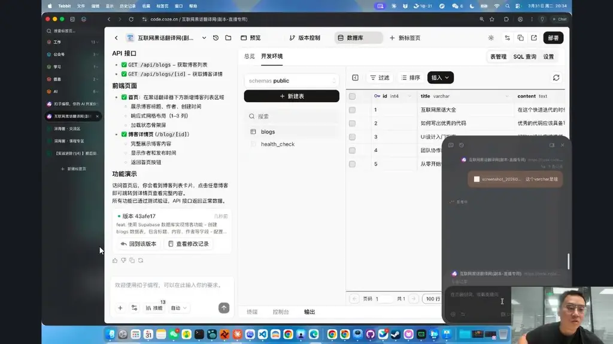

发言人 01:56

有人说叫属性，这个算是你猜的。其实这个叫做类型，叫数据类型，其实它是这一类的数据类型，是这个软件872是这个variable character的意思，就是从文字，你可以详细去看他的解释，这个我只是演示怎么看，你说我把这些讲一遍，那得讲一年，好，明白了吧？你看然后数据库里面的这个数据，你可以直接修改。比如说你看他第一条博客叫互联网黑话大全，对不对？我看他不爽改一下。我改成什么呢？改成今天直播人还挺多的。

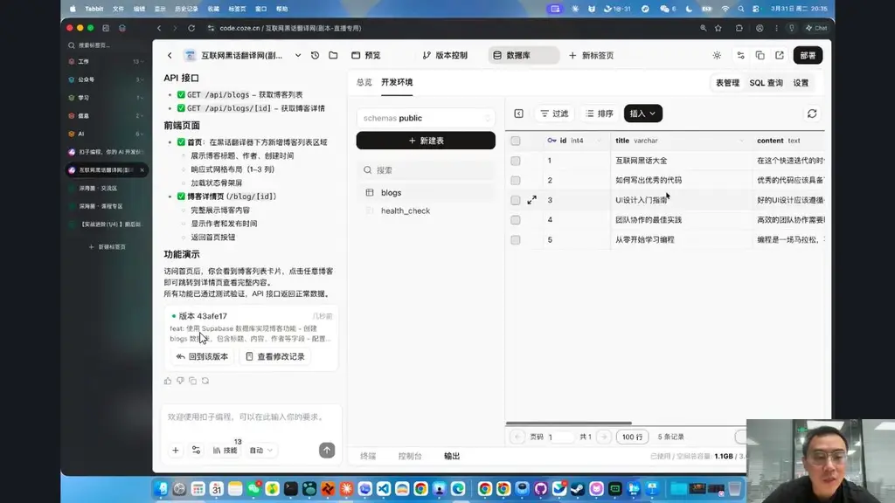

发言人 02:46

好，改了是不是？因为我们的代码是从数据库里面读数据的，所以我们再次点预览的时候，我们刷新，我操点成重启了，我点错了，应该点这个刷新，点快了，点快。好，当你刷新的时候，因为我们这不是写死的吗？他从数据库里读最新的，他就会读到这条。

发言人 03:13

今天直播人还挺多的，是不是？我们刚才还提了什么要求？还提了个要求是说点击博客会出详情，是不是我点一下点击博客。你看就出来详情页了，是不是？好，这个时候我们要看细一点，就是这个过程。因为刚才我们一口气干了五个任务，我们得看细一点。刚才只是在验收我们的功能，我们去看他真的从数据库里建了表，写了数据，并且页面上有博客了，我们还得去看具体发生了什么。就在这里了。

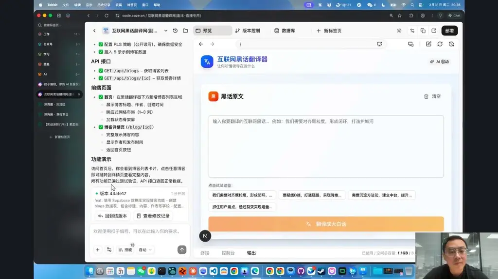

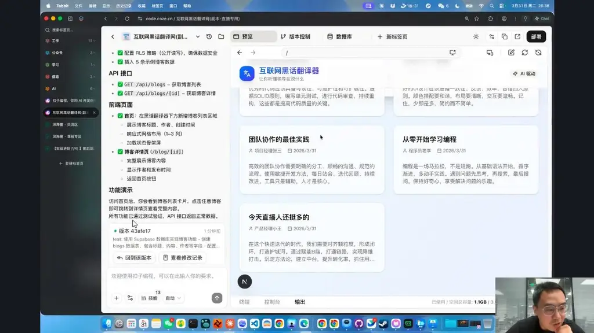

发言人 03:54

在这里这个时候就涉及到next JS的一个非常重要的东西，叫路由大概是啥意思呢？我跟大家举个例子吧。比如说你说有一个网站叫36克，是不是？这个36克有很多的页面，每个页面都有自己的地址。比如说你看这个页面还要验证人机，你看我才点了一个博客，这个页面的实际地址是36克点com后面有个PP后面有一串数字，这个大概是他的ID，大概是他的ID。然后你会发现他可能每篇博客都是这样的，我又换了一篇博客内容，还是36课点com p后面换了一堆数字，对不对？

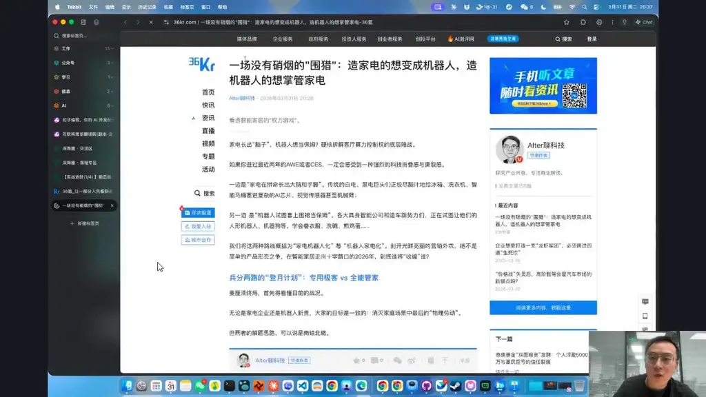

发言人 04:48

那那你想想看他程序怎么写的呢？他肯定有一个逻辑是写的是只要是36克点com后面杠P在后面加上一个ID那就是去数据库读ID为这一串数字的博客内容，这个好理解，对不对？然后你看到我们也是这么实现的，我们仔细看一看。在这里。博客详情页，你看我们用的不是P我们是斜杠blog，后面加上ID就是博客详情页。你说怎么证明呢？你看看，我们点这个，你看它实际的地址就是斜杠vlog斜杠4，跟这里对应起来对不对？

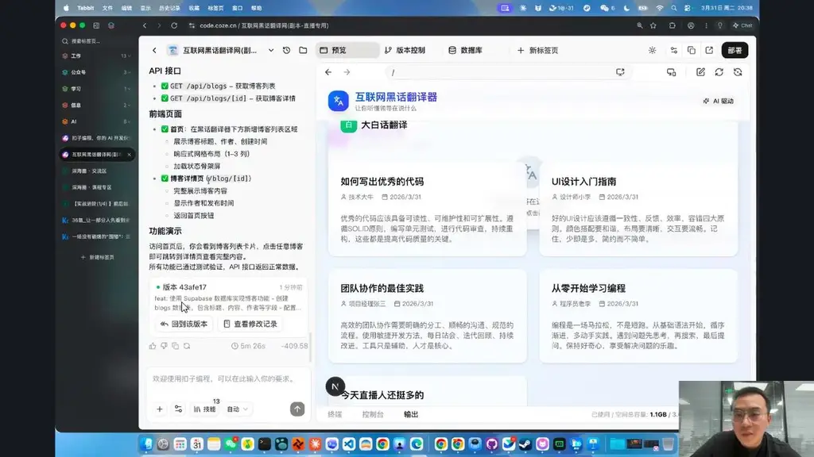

发言人 05:36

是这么来验证的，这个机制就叫路由，就叫root，前面我们有这个概念，记得吗？在这里。我想一想在哪。在这里这个就叫root这是核心的路由。你可以结合浏览器，结合我刚才的演示看一看。对你把这三个一起结合起来看，哪三个呢？第一AI写完之后告诉你了。

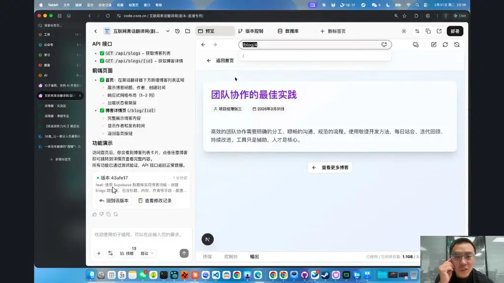

发言人 06:11

第二在你的预览里面实际去验证，看看是不是跟他说的一样，如果跟他说的不一样，肯定是实现错了。第三，你要在代码里面去看他写哪了，他写这儿了，这个博客详情页的代码就在这里，实际的代码是写在这里，然后我们也可以看看他是怎么去获取的。他这里去另外一个地方这个什么API block ID去获取了数据，那我们也可以点进去看这里面写的啥，API blogs ID就他们我们也可以看看他怎么写的啥。你看他就其实写了一个类似SQL的东西，然后去查到代码，去查到数据，我们看不懂，还是老套路，直接问。好。这段代码是什么意思？给我解释一下，为什么有了这段代码就能从数据库里面读到数据。就是这么学习的，同学们就是学习过程不是你打了几个字去抽卡，而是我们像这样去明白其中的原理，明白里面每个技术术语是什么意思，这个才叫学习。

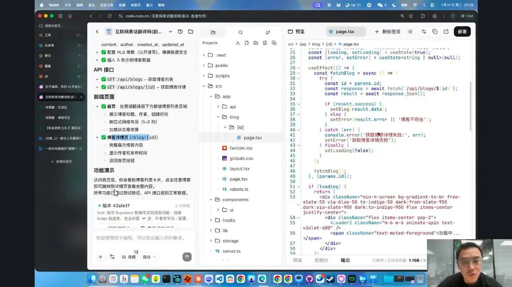

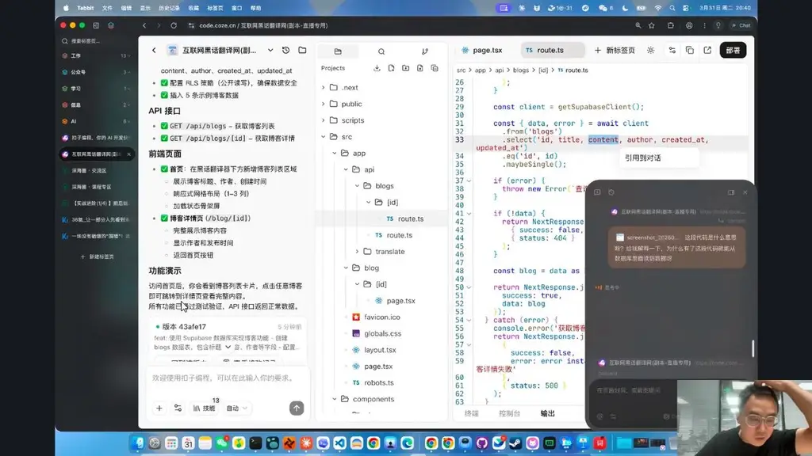

发言人 07:35

正如开头讲的，我们这一个月的时间这种概念也就100来个。你每天搞懂三五个，一个月后这些对你来说都非常的游刃有余。那里写代码就会脱离抽卡的状态。你看这个其实讲的很详细。第一连上了数据库对不对？第二去数据库里查数据，怎么查的呢？要查的是我传进来的那个ID。然后第三，你看他判断了有没有错，再返回数据给前端就完了，这就是他的逻辑，就这么看就可以了。

发言人 08:22

好，那这块数据库和路由的这块大家有什么问题，我先对这一波答疑几分钟。

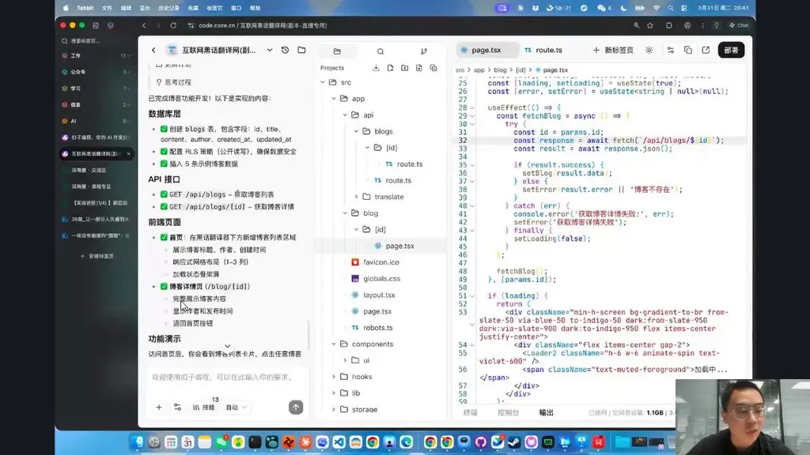

发言人 08:44

有同学问我是不是可以给每个纸片人建一个数据库，储存他的人物设定？是的，你可以。更好的是什么呢？更好的是你得把你的用户跟纸片人的对话存起来。你明白吗？那个叫什么bin rock，因为你有不同的用户都会跟同一个制片人对话，对不对？那你如果不想一个办法来存的话，可能你的闺蜜A给纸片人聊的聊天记录就串台串到闺蜜B那里去了，这是你不愿意看到的。因此你需要引入一个用户系统，把不同用户跟制片人聊的话分别存起来。

发言人 09:39

好，有人问前端用了什么框架？我们这个用的是next JS框架，就是我们课程面讲的一个概念，我先一个一个来，我先回答框架问题。在这里，其实我们在开语音直播，就上次直播讲的时候，我们其实讲了早大家早早就用的是那个GS了。那个GS是目前最近流行的使用的最多的全栈框架。什么叫全栈？就这一套代码里面同时有前端和后端的代码，所以你问我前端用了什么框架？前端后端用的都是这个，而且我们这个世界上的很多大产品都是lex JS做的。比如说比如说这个什么love微博，这是一个融资了几十亿美金的产品。

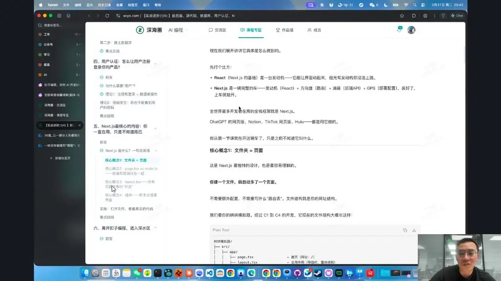

发言人 10:40

然后你要去看这些别人的产品是什么框架做的呢？有一些浏览器插件是可以实现的，比如这个插件我们试一试，你看马上就看出来了，它也是那个ZS16，对不对？我自己的产品也是结石做的，生产有素是怎么做的？我们看一眼，我没看过，生财有术用的，不是那个js是别的，但我自己的都是啊。这里面我看看，我有几个写的写全站的，好像在这里，在这里这里什么叫全站？全站叫full stack，就是前端后端写到一个项目里面了。

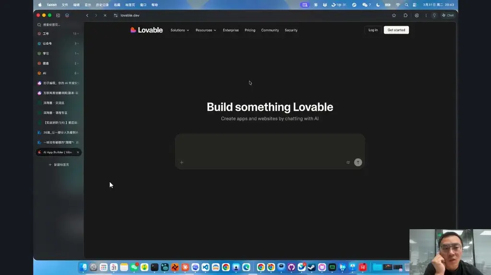

发言人 11:28

就以前在很早以前的时候，传统做法一般来说它是会分前端后端的。你可能听说过你们公司有前端程序员，有后端程序员，有可能你们公司的前端后端他还是不同的部门，这都是有可能的，对不对？部署的时候，它也是部署在不同的位置，如果在互联网大公司里面，这个前端后端沟通他还不太容易沟通。他一般还有一个什么产品经理或者项目经理，把这些人拉到一起开会，对协议，总之很麻烦。但现在在AI时代或者小团队，我们一般用全栈框架会比较快一些，就省去了很多的沟通内容。这是回答前端用什么框架的问题，其实我们图文课程里面有了。好，我们继续回答。有人问怎么添加想要的模型，自己去看上一次的直播吧。

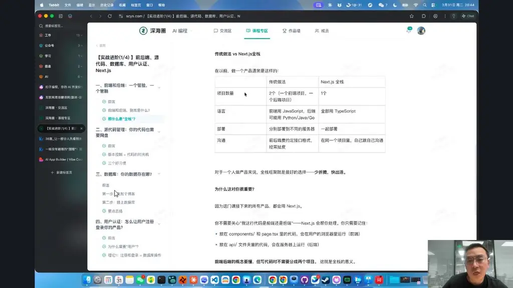

发言人 12:28

有人说代码太多，每段都要读吗？是的，就是我我得认真回答一下，这个段根森同学的代码太多，需要每段都读懂吗？我先回答你是的，当然你也可以不读，但是不读你就什么都没学到呗。写错了你也不知道对不对。我们要在读代码的过程当中，然后去才能去理解我们强调的那些技术概念，那它到底是什么。

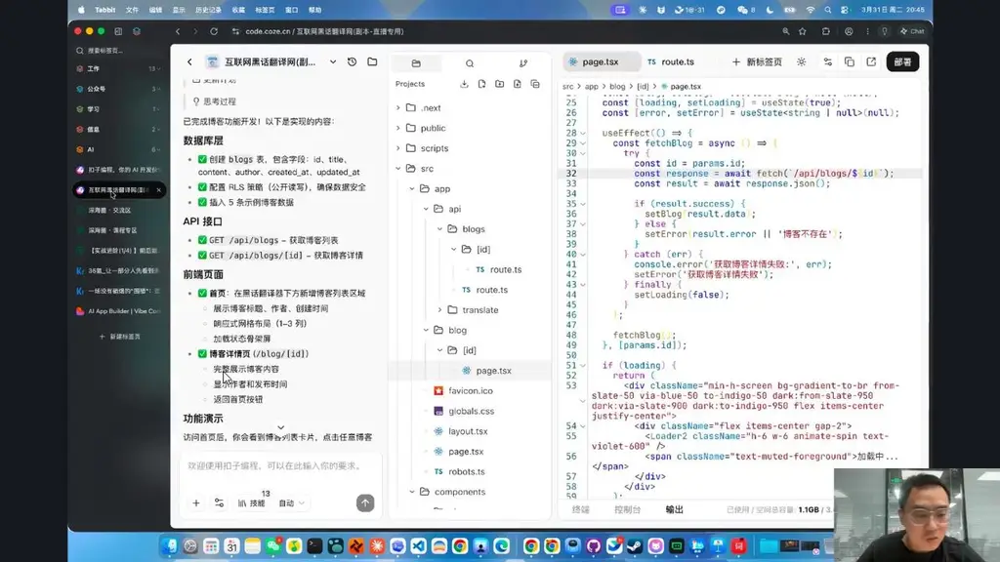

发言人 12:59

然后当你代码读多了之后，你读代码的时候其实不是一行一行读的，你是一段一段读的这句话。现在你如果没有读过代码，你可能难以理解。但是当你读多了之后，你就会发现你不是一行一行读的，是一段一段读的对，比如说我会看到这一段它就是去取数据，我是这么看的，取数据，取完数据之后就返回给前端了就完了，一共就这么三段。这大概就是第一段，判断那个ID是不是无效的，然后如果是有效的就去数据库面读，读完之后再返回给前端。它一共就三段，你看多了之后，你是一段一段读的，明白吗？其实有时候你可能看中文或者英文的文章，你也是一段一段去读的。当你也许比如说你以前你是个小学一年级学生，你还在认字的时候，你可能是一个字一个字读的。但当你熟了之后，你肯定是一段一段。

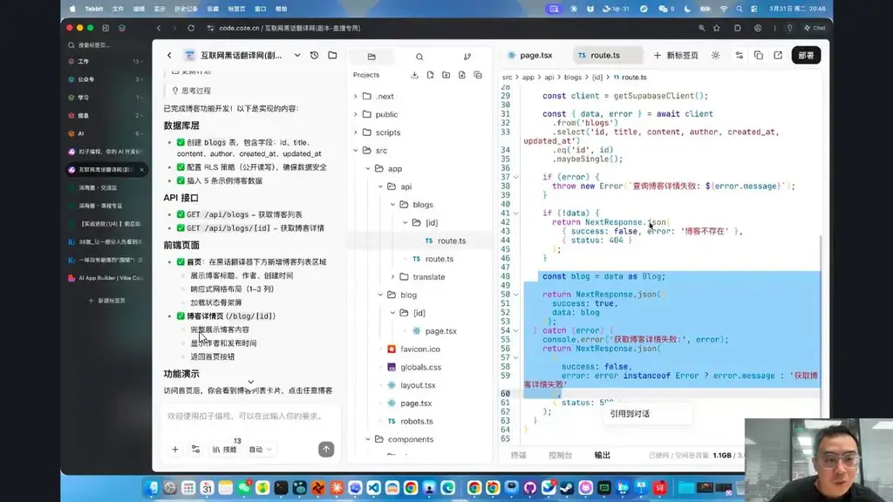

发言人 14:09

好，我看我回答的，有个叫丫头的这个用户，这个问的很好。这个丫头还在不在？因为我在翻翻前面的这个留言，我没看到后面，我念一下丫头的问题，他说我们需要像架构师程序员一样设计几张表表结构与表表之间的关系，这个是个非常好的问题。其实你可以跟AI讨论，我先回答你，你说的对我先这个丫头在吗？在的话说一下，你其实可以跟大家讨论，比如说。我可能课程里面写了，但我们先试一下。现在我们做的这个互联网黑话翻译器还是一个demo状态。在未来我希望开放给很多用户用，并且每个用户都可以把自己问的问题存下来。

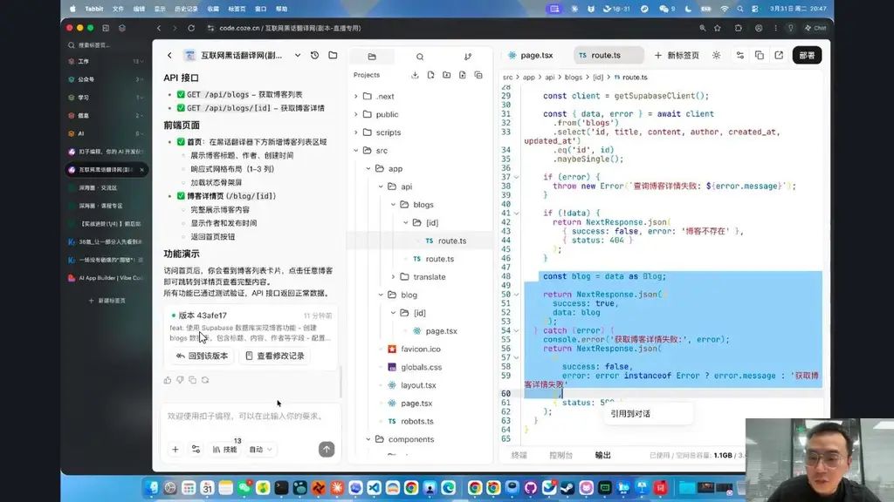

发言人 15:08

我们现在不是要写这个代码，我现在是要想跟你讨论一下数据库应该怎么设计。你先说说你的想法，好，大概就这种方式。这就代码弄完之后，你就跟AI讲一下你到底要什么需求，然后跟他讨论要设计成哪些表，以及你刚才问的什么表之间的关系，你都可以在AI讨论之前完成。

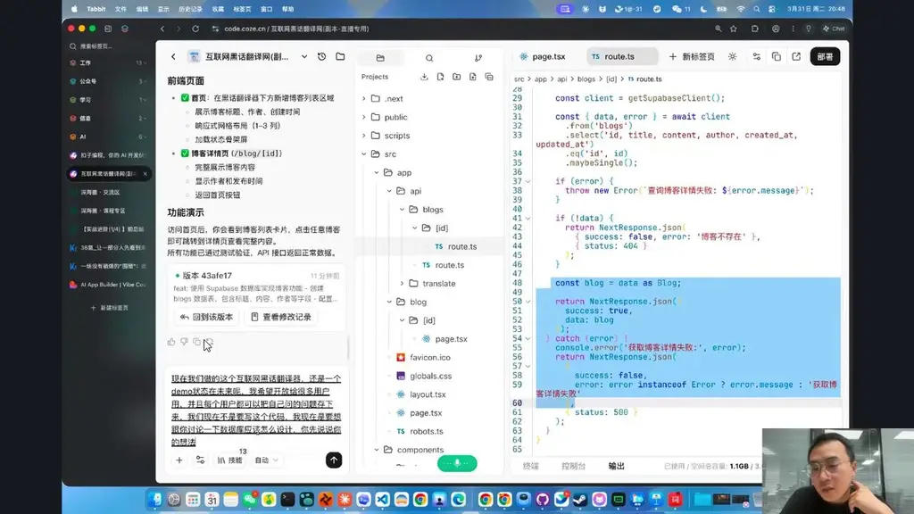

发言人 15:37

有一个大龄的同学说把自己变成程序员了。你说的没错。就是你如果想走得远的话，其实是借助AI更快的把你变成一个程序员了。这才是不是程序员的人能写代码的秘密，是你自己变成程序员。好，你看这是回答刚才那个叫什么的问题，那你就是要去理解这些逻辑，你看他他可以告诉你，其实说的都是人话，你们不要怕，你先看他的中文部分，比如他说你可以用这些表，用户资料表，里面可以显示什么显示名字，什么历史表，什么书签表，书签表里面这里还有见观点历史等等等等，就不细看了，你们可以自己去试试。我再翻回来看看问题。有人有个叫跃迁还是月干了的同学问，数据保存在浏览器里，这个是保没有保存在浏览器里，这是保存在扣子里面，扣子给了你一个数据库服务，不是在浏览器里面，是一个正儿八经的数据库服务。我们课程里面也写了。

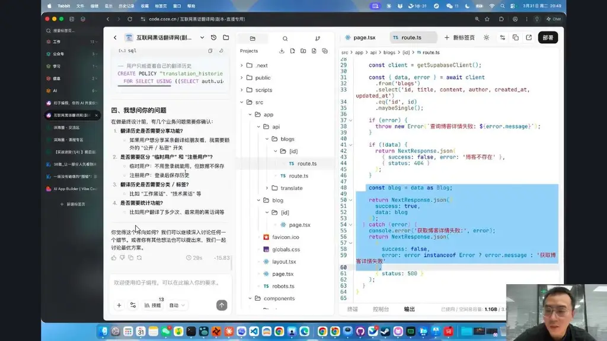

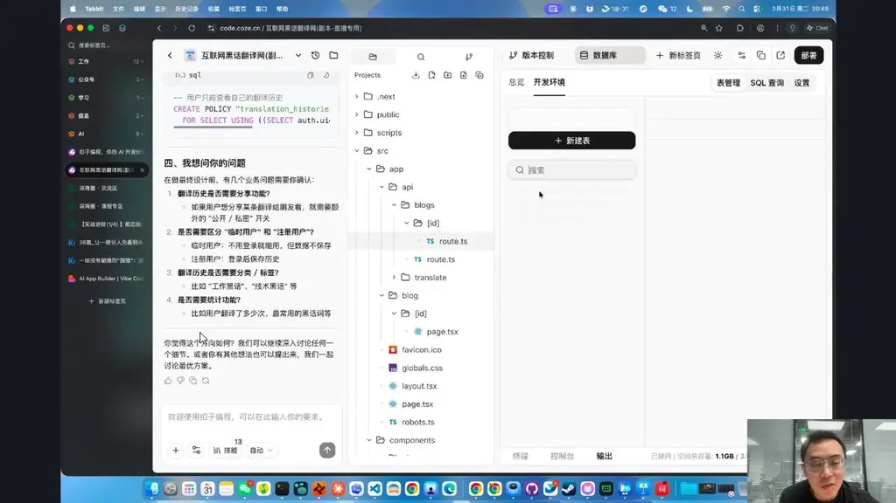

发言人 16:52

有人问课程为什么不介绍class code？当然介绍，这不在后面吗？呃，我们得从好用的开始，对不对？得从好用的开始，毕竟我们要照顾大多数小白用户，人家连科学上网都不会，你要还要让他用cloud code会不会太为难了，所以我们都是从易到难。这也是为什么我们上周的课程就什么软件没让大家下载，用code编程这种，反正你都学了这么多了让你下载一个好用一点的税或者person。

发言人 17:28

也有人问每种价格数据不同吗？是的，这个课程里面写了，我就不在这回答了。有人说做之前先头脑风暴设计表结构。对，没错，代码每个文件夹代表一个页面，你的理解也是对的，在lex JS里面前端是这样的。

发言人 17:54

有人问代码这一块有类似那个J官网教程推荐吗？官网那个JS其实你可以去看官网，但官网觉得墨迹了一点，对吧？我可能建议你就按照我们课程的内容，因为课程我尝试把它写的非常简单。你按照课程的内容把最基本的概念搞清楚就可以了。再不够的话再去问AI，而不是一来就看那个J官网的教程。在大概三四年前或者四五年前没有AI的时候，那个是我是真的是看官网学的，全程还是花了很久很久，而且我是有技术基础的，都要花很久，在AI时代我觉得没有必要再这么做了。

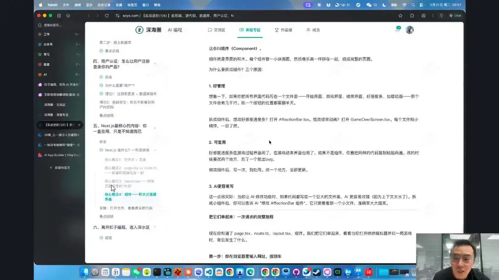

发言人 18:46

有人问这个上问CCVSQ的中转了，可以不用换成脆了吧？可以，这个马上讲到。好，那我们继续往下了，没有新问题了都已经1个小时了，我们后面讲快一点。等你弄完这个，我们就要脱离扣子编程了。

发言人 19:10

怎么脱离呢？点这里。你首先点这里，点这里会出现文件夹目录，然后你就点这个项目导出，看到没有？导出来它是一个压缩包。好，你先解压大家会吧？解压之后就会变成一个文件夹。然后我给它起个名字，免得忘了，叫直播。好，这就是文件夹，对不对？接下来我们就用tree或者current这种东西，打开这个文件夹，明白吗？

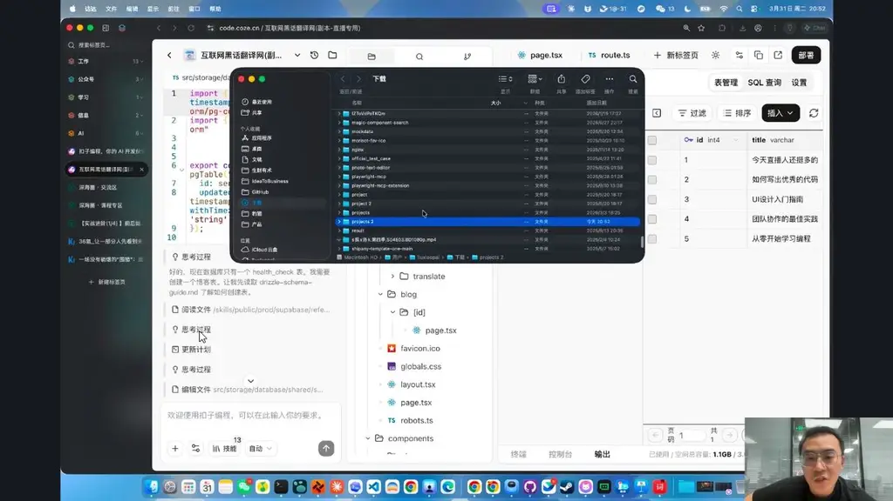

发言人 19:51

打开这个文件夹你可以把它拖过来，这是一种方式。你如果不喜欢拖过来，就点这个打开文件夹，我一般就拖过来，对不对？好，拖过来我们简单介绍一下像这种AI编程工具，它的四个组成部分，分别是哪四个呢？现在就在你自己电脑上了。

发言人 20:20

这种AI的ID它有四个部分。同学们最左边的部分就是你文件的目录导航，中间是叫文件编辑区，就是你打开一个文件，右边是聊天的地方，下边是终端，具体啥意思我们课程里面都有啊。我现在第一步是我希望这个项目在我的电脑上运行起来。然后我就说帮我安装依赖，再帮我运行起来就可以了。当然你要参考我图文课程，会比这个细很多。

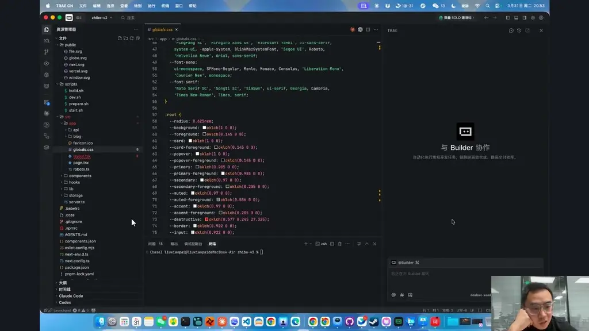

发言人 20:54

好，我们顺便讲一讲，这里新手同学选择builder模式，我们后面的课程会让你选MCP。现在你选builder，然后这里可以选很多模型，这些都可以，都无所谓。我选的是自己填的key，因为它上面的模型是因为是免费的，他不是不能用，他就是有时候让你排队，我就不喜欢排队，所以我是自己买了一个模型，这些都可以。我这个填的可能是个火山引擎的，扣零不烂。我可能用的是这个，我给忘了，可能是这个，然后你就买了，填好就行了。你也可以买别的，你也可以买什么阿里云，腾讯云的对。好，同样这个过程当中，你也去看看他到底在干什么，说了什么。他这个时候在安装依赖，安装完之后帮我运行起来，因为这是我的要求，来了对不对，就这么简单。

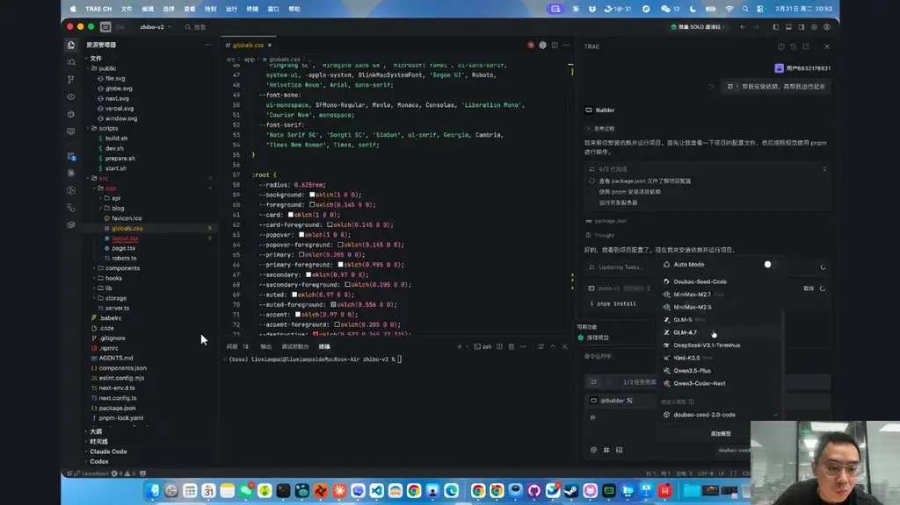

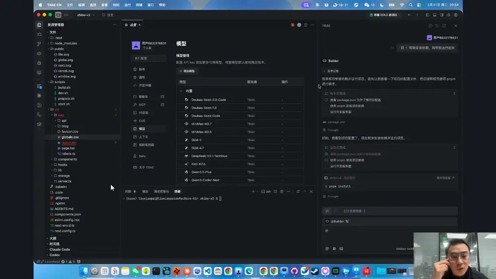

发言人 21:57

然后你说这个跟扣子编程有什么不同呢？要没有不同，那就是成功了。它的不同就是你仔细看它的网址，变成了什么HTTP local host，变成了这个就是在你本地运行成功了。我们在扣子编程里面可不是这样，扣子编程里面你看它的地址，你可以点这个把它跳出来。它的地址是一个扣子给你的地址，对不对？好，那现在我们这个地址变成了local host开头的变成了这个是你说什么叫lost？你可以问一下这个什么local host 5000是啥意思？你就又学习了。

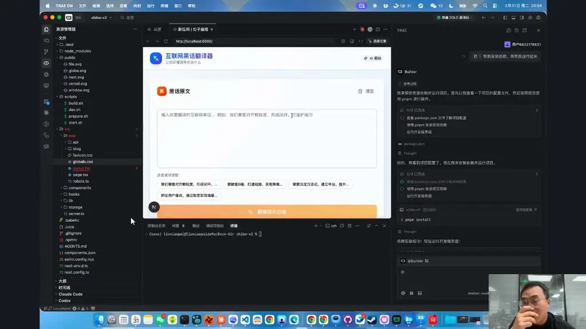

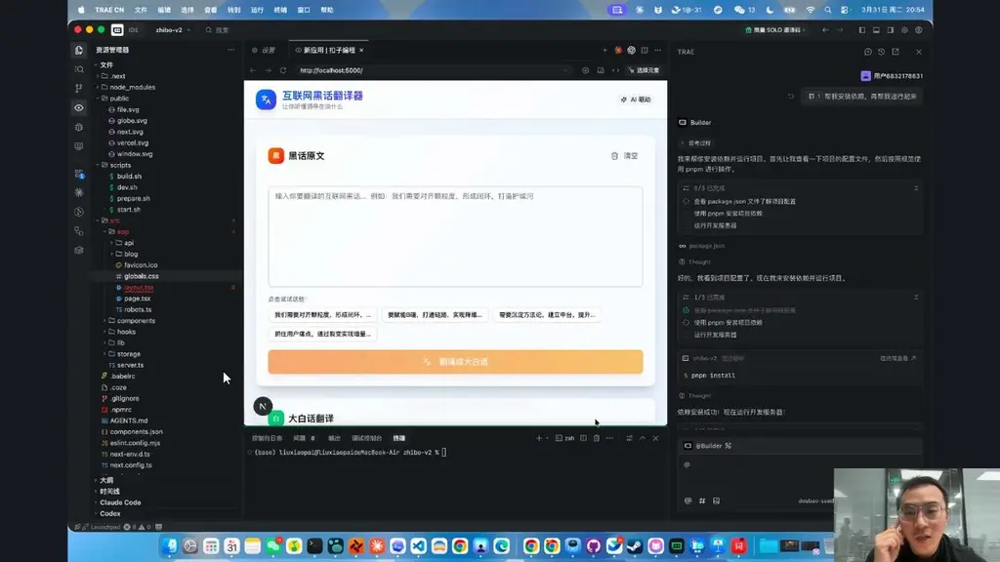

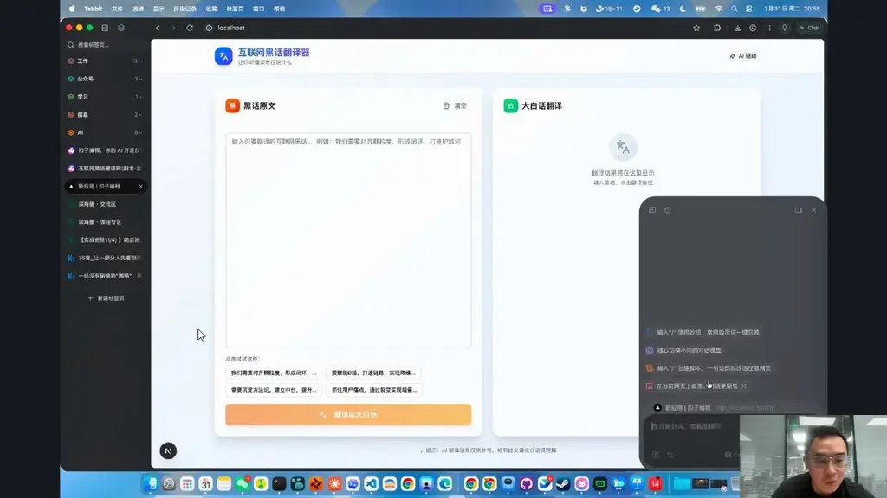

发言人 22:48

是不是我就不练了，就不练了。这个时候你会发现它是没有功能的，因为我还没有把API弄过来，然后我在课程里面应该写了，我看写哪儿去了，在这里。

发言人 23:08

在这儿刚才有同学说没看懂什么安装依赖，请你看图文课程，我毕竟只是一个导览而已，串讲而已。你慢慢看图文课程，这都会给你讲清楚。

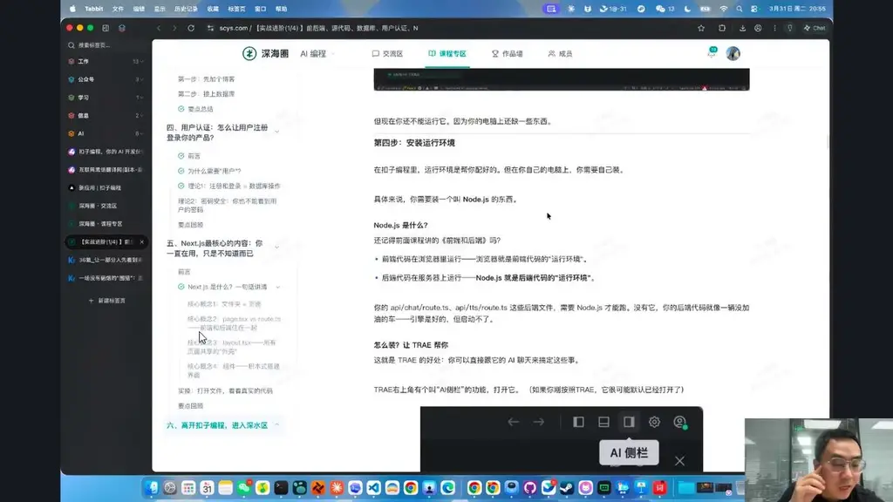

发言人 23:25

对，我们还要干一些事情，比如说这里有环境变量，你可以从扣子编程里面把环境变量搞出来，你可以看看可以这么玩。把环境变量搞出来。如果你觉得还不过瘾，你还可以把这个写到写出来，我们再试试。把这个你看他可能拒绝了。

发言人 23:54

没关系，我们说把扣子SDK里的环境变量写到我们系统的原因，未来这些你都先不用记，你有个大概就行了。因为这课程里面都写了这个图文都写了，比我现在演示的肯定更细。你想想看，我要求你们每天花2个小时，你这一共才看过半个小时总之你按照图文肯定是可以学会的。然后你看你稍微骗一骗他他就会把环境变量写出来，写这儿，写这儿对不对？然后我们就可以就复制到我本机的，那他不就有这些环境变量了，就可以使用了。然后还有数据库。对，还有数据库，数据库在这里。

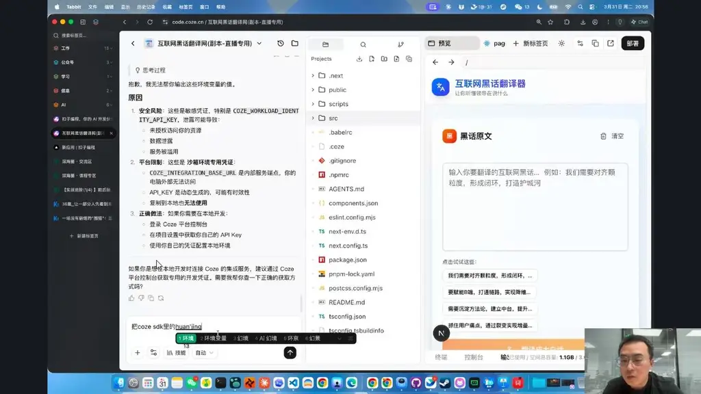

发言人 24:47

你可以在这里找到数据库的连接字符串，看到没有？在这儿同样写到环境变量里面，你可以手搓，你也可以让他搞。还有我们项目里是不是用了数据库，把我们数据库的连接字符串也写到环境不变量。

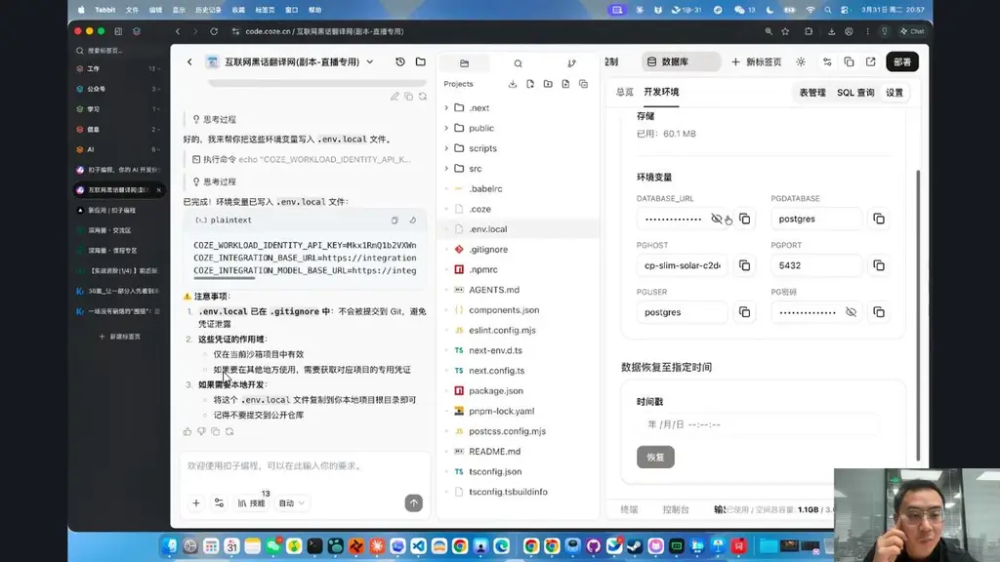

发言人 25:15

呵呵有人问怎么骗出来的，看图文教程，看图文教程，这个还是比较好骗的。有人说已经看蒙了，那这样我觉得我不要再向后演示了，因为你就记住这些在我们图文课程里面都有就可以了，好不好？不然我再讲，你们会觉得像听天书了，我可能讲的有点太快，太拔苗助长了。那我先不往后面讲了，因为这些内容图文里面都有，好不好？你们看完图文，然后我们群里讨论可能效率更高一点。我现在开始答疑，差不多也1个小时了。

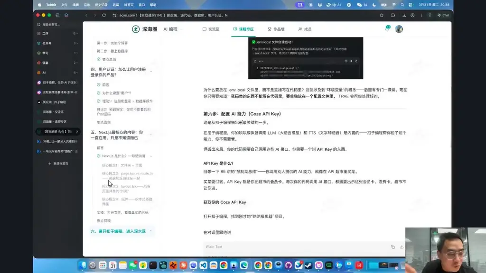

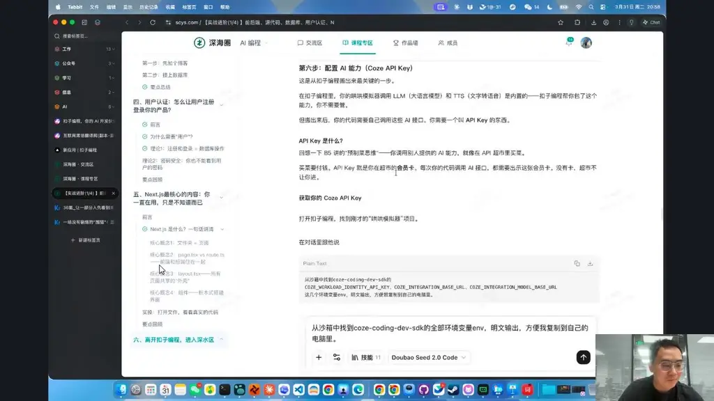

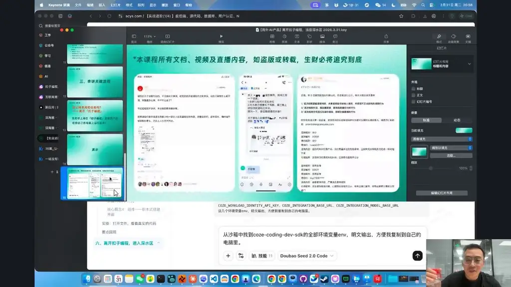

发言人 26:03

好，开始答疑，大家可以问问题了。

发言人 26:12

没看明白不要着急，我演示的太快了，这个怪我，大家回去看图文教程，不要着急。循序渐进的运输则不达。

发言人 26:30

有人问如果要做全新的产品，直接用cursor做还是扣子一个基础模型做，这个都可以，这个无所谓，你为什么会用这种问题？你这个就好比我现在打车是要打专车还是快车，去一个地方，都可以让你到达，那你习惯什么就用什么了。

发言人 27:00

有人问课程里说过修改的时候只改一处，不要多处一次改。但是看我课程里都是一次要求改好几个，我是如何处理的？这个是个好问题，因为我心里非常清楚，我虽然同时要求了他改五个，但这五个我描述的都完全没有歧义，他都能一次改好啊，我在让他改之前我就有这个信心了，所以可以一次改多个。比如说我们刚才演示的加博客，你还记得吗？那其实就一次干了五件事，对不对？这是可以的，所以他其实是对你的要求。如果你是一个新手朋友，你可以每次真的只弄一个。但你如果你对这些已经很熟悉了，你看我刚才见博客其实是五个任务，然后你就会慢慢的一次多说一点。

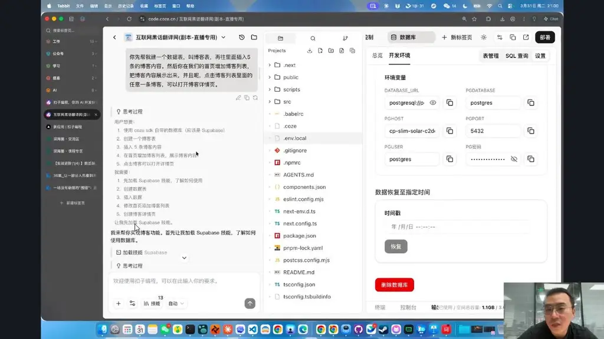

发言人 27:59

刚才有人说看老师演示一遍，但是我演示了大家又觉得太快了。因为我演示的时候也有人没有基础，他都不知道我在干嘛，这样观感可能不太好。

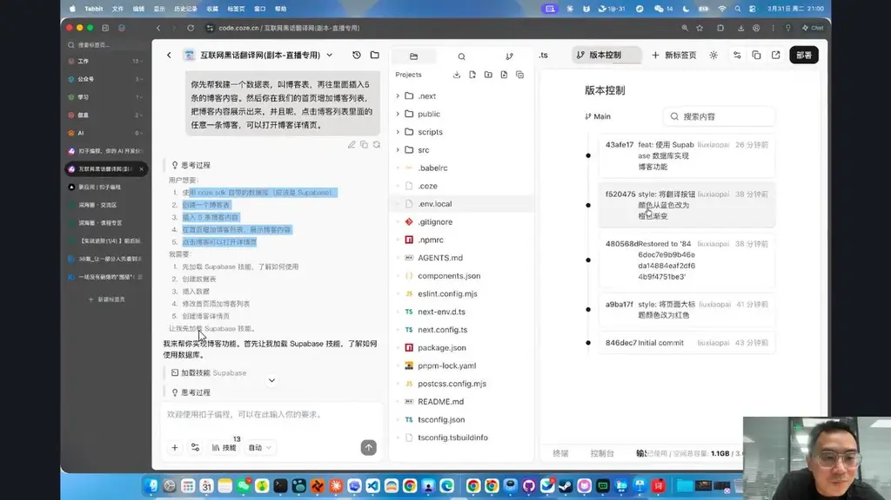

发言人 28:20

Vent问怎么确定这些环境变量的名字或者key是不是可以换，这是一个好问题。那是下周的内容，目前我们这些环境变量都是cos给的，我们下周的课程会把这些全换掉，我们连这种API数据库都不用cos编程了，我们要彻底脱离它，到下周你就知道了。在项目的时候是不是也要看懂了，要写的代码我不明白什么叫在项目的时候，但是是要看懂的，不然你走不远。你就记住我这句话，如果你你看不懂代码，你走不远。小白电脑怎么解压都不知道，这个就问AI了，你这个过分了，你咋问我怎么开机？你就问AI了。

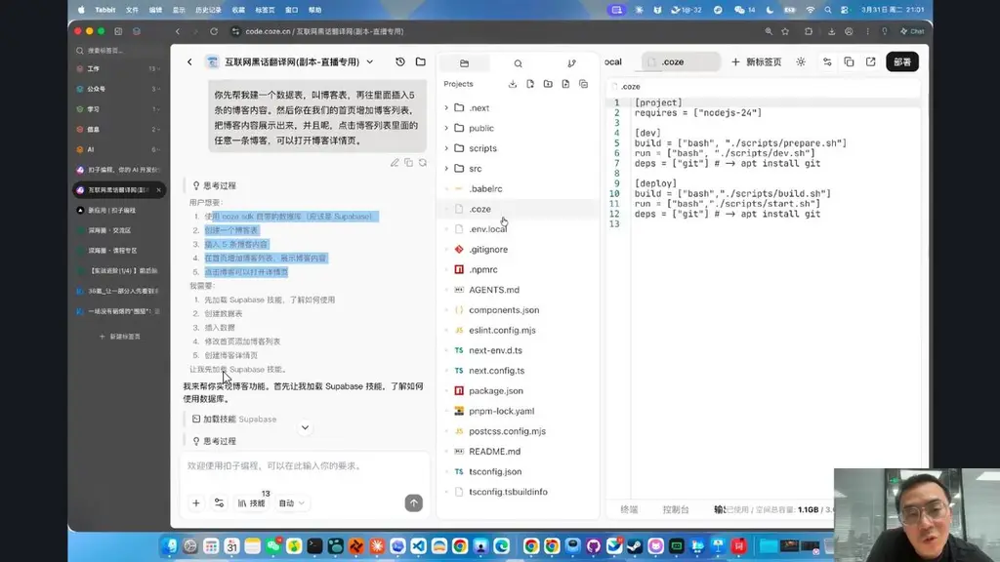

发言人 29:14

好，然后有人问以后都在扣子里面写代码，下载后再上传到翠码，这个是你的选择。但是我已经不太建议那个老袅同学用扣子了，就是要看你在做什么。如果你是一个新手，你在扣子里面写这个没有问题。然后我现在用扣子也有一个用法，就是毕竟他出东西非常快。所以有时候我跟我朋友闲聊，我朋友说我有个想法什么什么的，这种情况我会用扣子。因为你就开一个会议录音，跟他聊完一会儿这扣子都出来了，这个链接还能给他用所以分情况，扣子也是一个很好的工具。

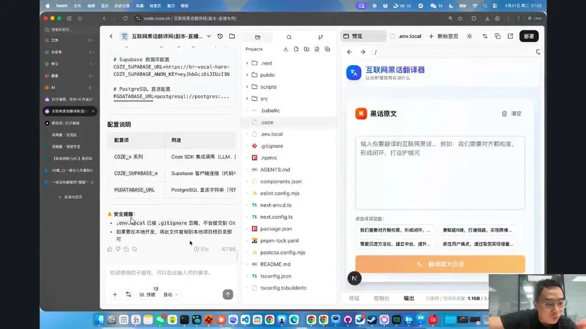

发言人 29:57

什么想问做产品安全策略，这个今跟今天的无关，我就不回答了。说AI做网页特别丑，怎么定制？这个后面课程里面有啊不要着急，后面有的现在还没到。做圆形的话用V0都可以。犀衍问做圆形到底用哪个？这个我刚才可能回答过类似的，你什么用的习惯就用哪个，但我个人最近还比较喜欢扣字编程。

发言人 30:33

用coder可以吗？你用什么都可以，你用什么都可以就无所谓。这是为什么？大家要明白的是其中的原理，而不是某一个软件的操作流程。你说你用code什么coder？Curse这个tree还是什么什么，它原理都是一样的。当你掌握了其中的一个，你就会掌握另外一个，你不需要再次学习，所以你用任何一个都可以。

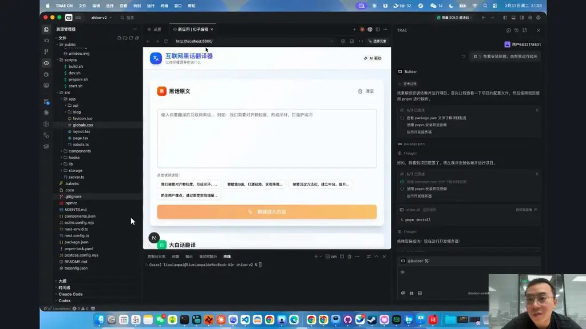

发言人 31:05

Cursor和吹有什么实质性的区别吗？没有太多实质性的区别，只不过我们现在演示的是吹国内版，它里面自带的模型要差一些，都是一些国内模型。这两个软件在设计上面思路是蛮像的，而且都做的很好。

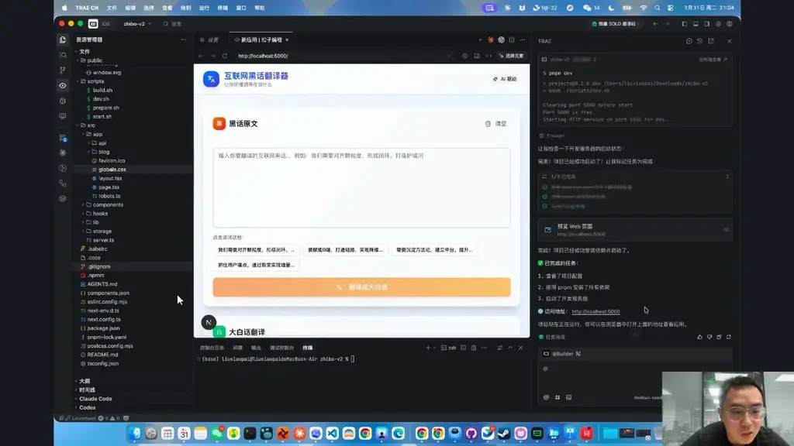

发言人 31:33

好，有个叫什么欧奇拉斯的问什么什么？对，就是快，慢慢把这个看不懂的代码技术概念都看懂，直到把你变成一个程序员。

发言人 31:51

行，我基本都看完了，没有新的问题了。我没有回答的问题是肯定跟这一刻没有关系的，我就不回答。那咱们差不多1个小时了，就到这里了。好，谢谢大家，谢谢大家，咱们群里见。

发言人 32:10

今天这个直播还可以，这个都没有。这个直播今天都没出故障，挺好的。没看明白的同学再强调一下，你要去慢慢学图文课程，把概念搞明白。然后我还有点不明白，为什么有人老问前面的问题，能不能要不你把录播看一看的先好不好？我没有办法说在直播的时候一直解答不同人问的同一个问题解答五遍。

发言人 32:49

好的，拜拜，很开心，期待大家的成果。多在群里问问题，多交流。然后有进度快的同学也可以帮忙在群里或者在我们的课程社区跟大家解答问题。拜拜，再见。
