Idea to Business
深海圈
主讲：刘小排 
2026.4.16
核心术语密集输入
Idea To Business
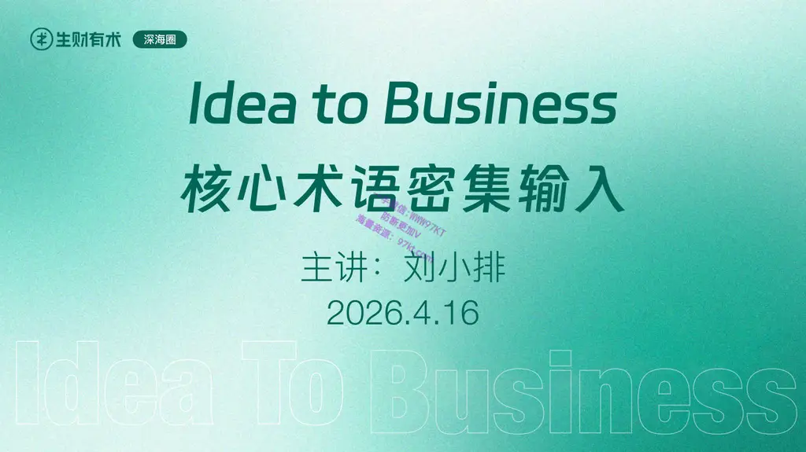

深海圈
Idea To Business
欢迎大家👏
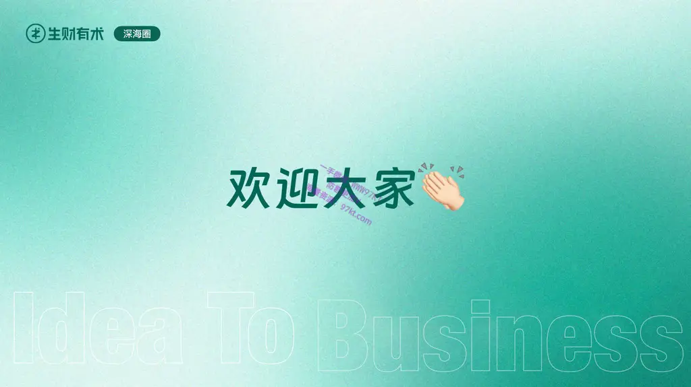

日 
程 
安 
排
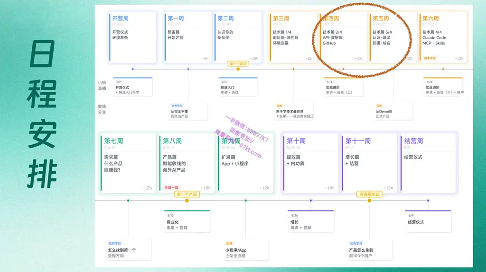

深海圈
Idea To Business
一、本周学习任务
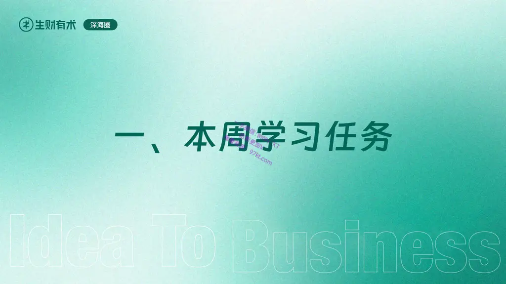

深海圈
离开「扣子编程」，在自己的电脑上开发， 
逐渐开始接触技术原理。
前两周主线任务
未来两周主线任务
深度掌握核心技术原理
为什么要理解技术原理？
- 互联网公司的「技术总监」，可以不参与写代码，但是他一定要懂原理 
否则无法指挥手下各个年薪百万的优秀程序员干活 
- 现在，你就是这个「技术总监」，你手下已经有世界上最优秀的程序员了 
深度掌握核心技术原理，是你和AI程序员沟通的桥梁。
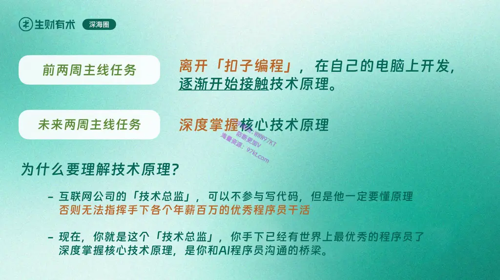

深海圈
AI编程的六个阶段
本周
上周
上月
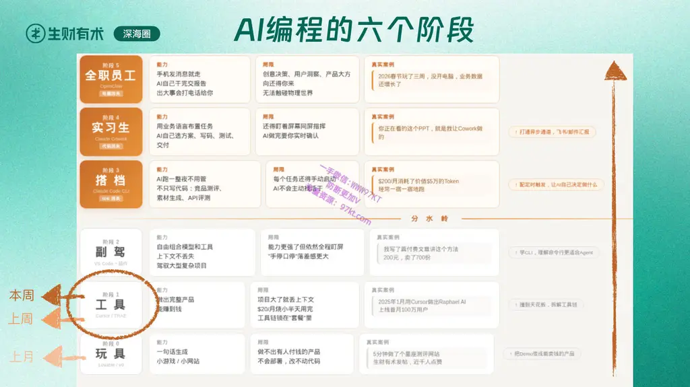

深海圈
Idea To Business
二、本周核心技术概念
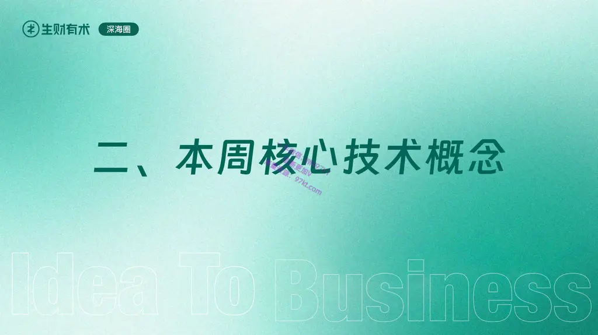

深海圈
前端/客户端
源代码管理
IDE
版本控制
后端/服务端
数据库/关系数据库
Hash
Next.js
变量/环境变量
Cookie/Session
NodeJS
Route/API Route
Layout
.env / .env.local
全栈
Diff
npm/pnpm 
SQL
项目依赖
API/API Key
组件/Component
SSR/CSR/ISG/SSG
上次 - 涉及的核心概念
两周过去了，再看看这个列表，你都明白了吗？
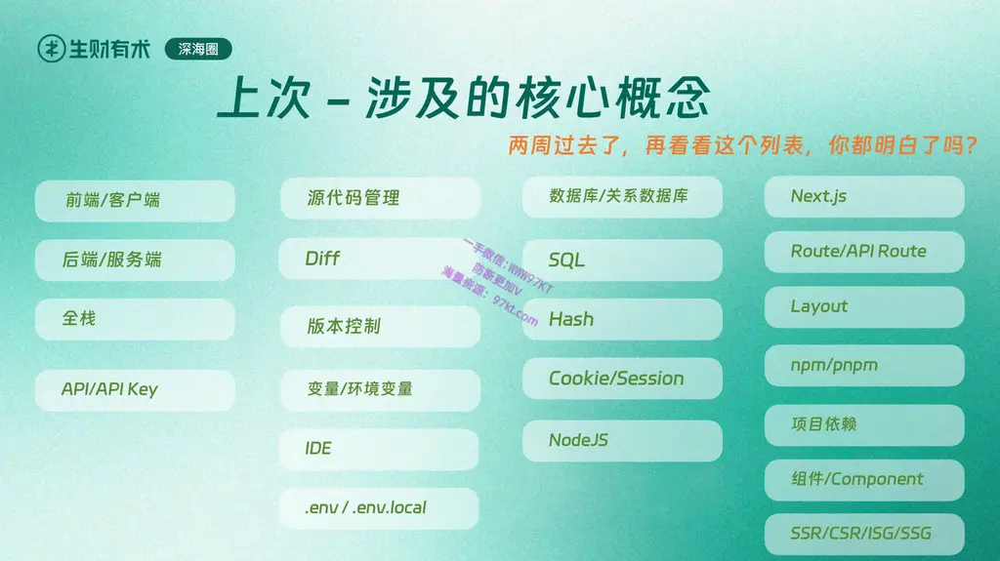

深海圈
API
API平台
Vercel
Captcha 人机验证
Email API/Resend
云存储 S3/R2
CDN
Cron Jobs
Live Chat Widget
API四要素
DrizzleORM
域名
Database Migrations
Curl
Bear token
HTTP GET/POST
Postman
HTTP Request
HTTP Response
ELO Rank
本周涉及的核心概念
DNS Server
WebSocket API
Steaming API
REST API
Git/GitHub
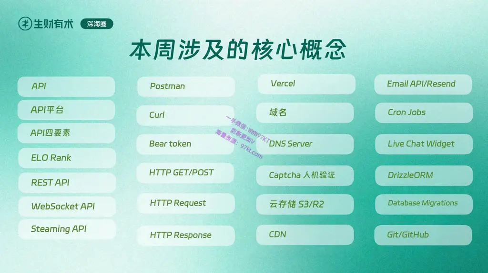

深海圈
API
API平台
Vercel
Captcha 人机验证
Email API/Resend
云存储 S3/R2
CDN
Cron Jobs
Live Chat Widget
API四要素
DrizzleORM
域名
Database Migrations
Curl
Bear token
HTTP GET/POST
Postman
HTTP Request
HTTP Response
ELO Rank
本周涉及的核心概念
DNS Server
把「API」概念翻个底儿朝天，外行和熟手的分水岭
一切有关“稳定提供服务”，demo和正式产品的分水岭
WebSocket API
Steaming API
REST API
Git/GitHub
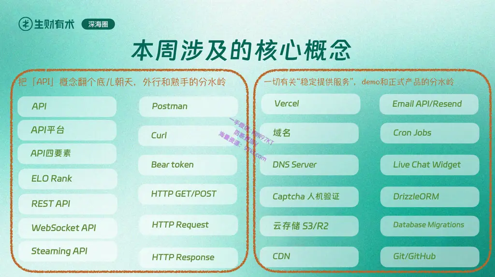

深海圈
Idea To Business
三、深入 API
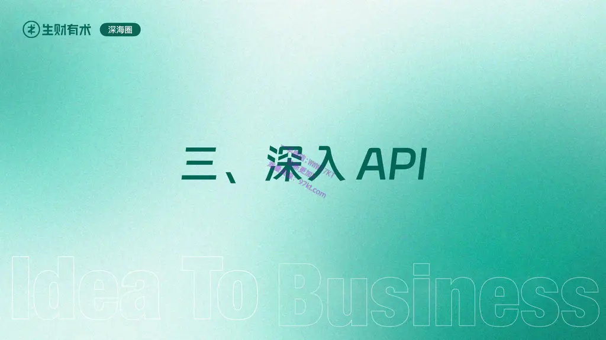

深海圈
演示

深海圈
Idea To Business
四、核心概念导读
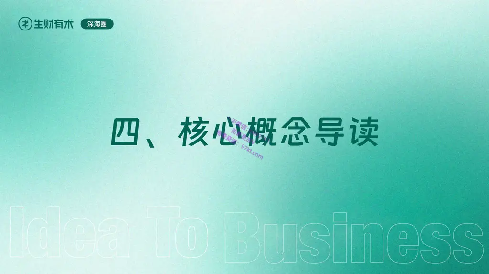

深海圈
演示
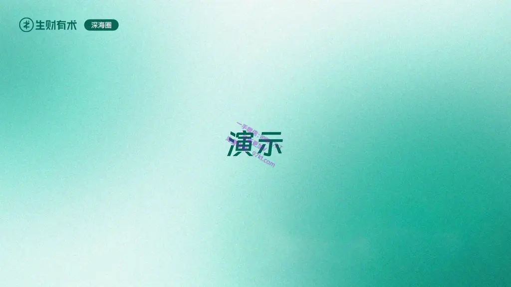

*本课程所有文档、视频及直播内容，如盗版或转载，生财必将追究到底
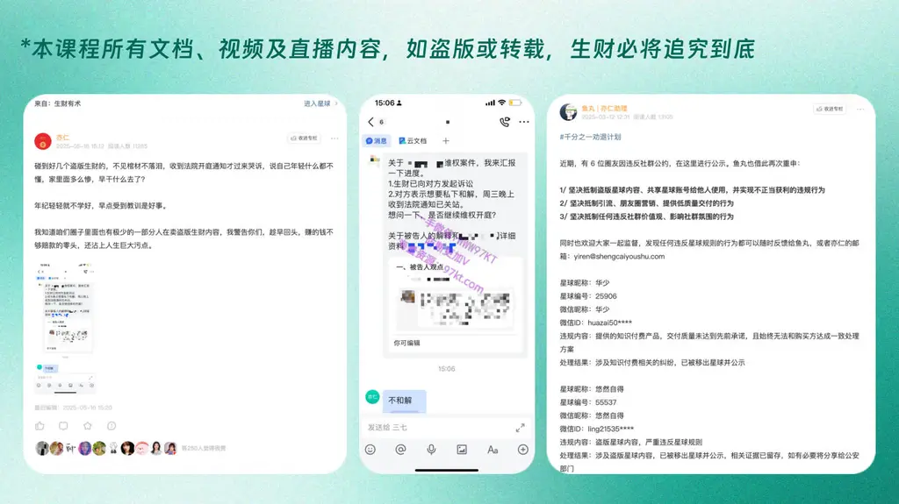
