# 怎么做 App 和小程序

> 说明：本资料为图片版，以下为主要内容整理（OCR 识别，可能存在错字），关键页面配图已保留供对照。

【商业化】怎么做App/小程序?

| 一、你的想法，该做成什么?
前言
这-节很短，但可能是这一章景重要的一节。

后面的课程会教你做小程序、小游戏、App、桌面应用.….形态很多。但如果一开始方向选异了，后面写的代码全是沉
没成本。

所以动手之前，我们先用 5 分钟，把两个关键问题想清楚。

第一个问题: 做国内还是海外?
先说结论: 如果你做的是工具类、SaasS 类产品，优先海外。
为什么? 一个字: 钱。
海外用户的付费意愿和国内完全不是一个量级。我给你算一笔账-一

伦敦坐两站地铁，8 英镑。你让一个英国人花 10 美元订阅你的软件一个月，在他眼里就是"坐两站地铁的钱"，基本不
用想就付了。

但你让一个国内用户订阅 10 美元的软件?70 块人民币一个月? 他大概率会觉得贵得要死，然后去找破解版。

这是 [支付意愿 (Willingness to Pay) 」。这个经济学指标在不同市场的真实分布一同一件商品，不同购买力的市场
它付的价格不一样。再肥加汇率，同样的产品、同样的成本，海外市场的收入可以是国内的 30 售。

这不是寺张，这是很多独立开发者的真实体感。

举个经典的例子: pieter Levels。

这个人是个荷兰人，一个人单干，没有团队、没有融资，靠几个网站每年赚几百万美元。

他最有名的产品 Nomad List，做的事情说出来你会觉得很简单一把全世界适合数字游民工作的城市排个名，给每个
城市打上"网速怎么样、生活成本多少、安不安全、签证好不好办"这些标签。会员费 20 美元，能查所有城市的详细数
据。
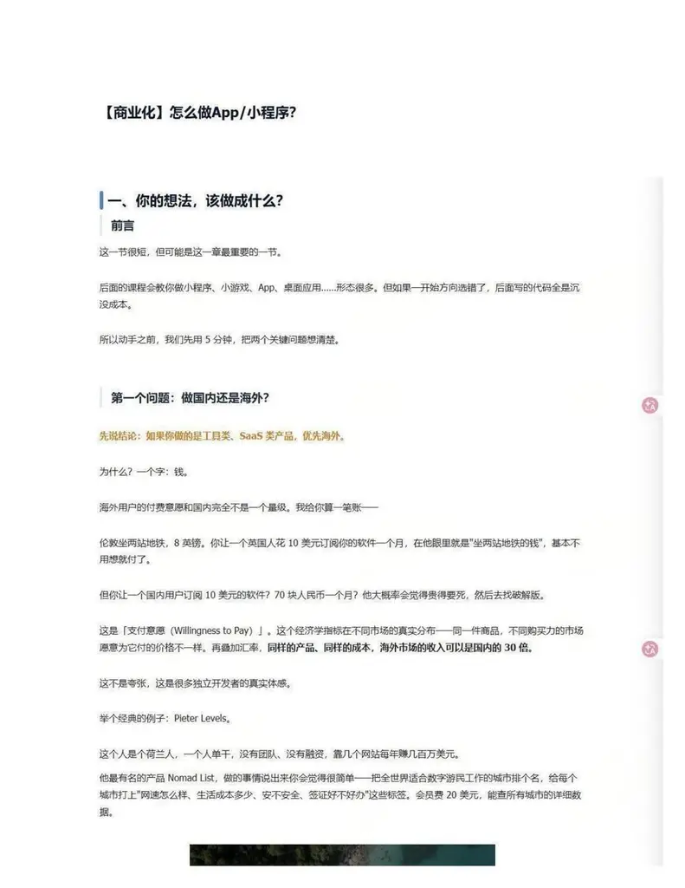

就这么个东西，活了快十年，僵利数百万美元。

你有没有想过，如果他做的是中文版"国内适合远程办公的城市排行"，他能赚多少?大概率是赚不到钱的。不是产品不
行，是市场决定了天花板-一国内愿意为"查询城市信息"付 20 美元的人太少了。

2023 年初 AI 图像生成刚火起来，他花了两个多月做了一个 PhotoAI--一你上传几张自己的照片，系统训练出一个专属
模型，能给你生成任何场景、任何风格的"专业写真"，专门解决那种"想要好看的 LinkedIn 头像但不想花钱拍写真"的

photoAI 的增长很快，公开资料显示，它上线早期第一周约 5400 美元，几个月后达到数万美元月收入; 到 2024年8
月，pieter 公开称 photoAI 月收入突破 10 万美元。

到 2025 年底，photoAI 单产品月收入大概在 13 万美元-一年化 160 万美元，超过 Remote OK、Interior AI、Nomad
List 等项目，成为 Pieter Levels 当前收入最高的单一产品。

Nomad List 还在赚钱，但已经不是他的主战场了。
他全部产品矩阵加起来年收入超过 300 万美元。但团队规模还是他一个人。

类似的独立开发者一大堆。Marc Lou 的 ShipFast、Tony Dinh 的 TypingMind，都是单人公司，年收入过百万美元。这
条路在海外被跑通了无数次。

那国内适合做什么?

流量型、广告变现型的产品。国内的优势是人口基数大、微信生态强。你做一个小游戏，靠广告变现，日活 10 万就能
活得不错。
举一个反向的例子: 羊了个羊。

2022 年 9 月，这个微信小游戏几乎一夜之间冲上各大社交平台的热搜。

它的玩法极其简单一:    但通关率被故意做得极低，用户输了就想再试一次。最关键的是它的设计: 复活要分享、
看广告要分享、看排行榜要分享。每一次失败都变成一次裂变。

这种打法在海外几乎不可能复制。Facebook、Twitter 不会像微信一样把流量喂给一个小游戏，分享链接也不会像微信
群那样高速传染。但在微信生态里，它短时间内做到了 DAU (Daily Active Users ，日活跃用户数) 上亿，靠广告分成
赚得仿满钵满。

这蜡国内市场独有的玩法简单粗野的油|呆标准:

* 靠用户付费赚钱 一 海外优先
* 靠广告和流量赚钱 一 国内优先

"两边都想做 一 先海外验证付费，再国内做流量版本

注意，这个判断标准背后其实是一个建模动作。

很多人选市场是赁感觉的一-我高哪个市场近做哪个，或者哪个最近热做哪个，或者哪个好做选哪个。

但更靠谱的思路是先把自己的产品当作一个系统来看: 它的钱从哪里来? 付费意原驱动的产品，就该去付费意愿高的
地方; 注意力流星驱动的产品，就该去注意力最集中的地方。

想清楚这一步，市场就出来了，剩下的全是执行问题。

第二个问题: 做成什么形态?

确定了市场方向，接下来选形态。

如果你做海外产品
你的产品特点           推荐形态               原因
工具类 Saa5、可以在浏览器里      Web App      跨平台、获客成本最低、迭代最快
用

浏览器增强、效率提升        Chrome Extension       分发靠 Chrome 商店，审核快

需要推送、需要深度留存      移动庙 App       推送能力强，用户粘性高
专业工具、需要本地性能       桌面应用       适合开发者工具、设计工具等
海外产品的第一选择几乎都是 Web App。

原因很简单: 不用装任何东西，打开浏览圳就能用，获客链路最短。

最经典的就是 Figma 收拾了一整代设计工具。

我们把时间线倒回去看。

2010 年之前，UI 设计师其实是用 Photoshop 画界面的。Photoshop 本来是给摄影师修图做的，画 UI 吃力又慢-一-一
个图层管理就够你折腾一上午-但当时没有更好的选择。

2010 年代初，Sketch 上线，专门为 UI 设计师而生，又轻又快。短短几年成为设计师的标配。那个时候你说自己是
UI 设计师，电脑里没装 Sketch 都不好意思跟人打招呼。

Adobe 眼看着这块市场流失，2016 年急忙推出 Adobe XD 来反击。

也是这一年 Fgma 上线，第一波反应几乎全是嘲讽一 一个跑在浏览器里的设计工具? 性能能有 Sketch 一半吗? 谁会
用网页

但 Figma 押对了一件事: 协作。

Sketch 是单机软件。两个设计师要协作，一个人改完文件，要导出来，传给另一个人; PM 想看进度，要等设计师再导
一份发过来。这套流程在 2010 年代还能忍，到了远程办公成为常态的年代就开始要命。

Figma 不一样。一个链接发给团队所有人，所有人同时打开同时改，PM 还能直接在画布上评论。链接发给客户，客户
在浏览器里就能看，不用装任何东西。它把"画图 + 协作 + 评审 + 交付"全都装进了一个网页应用里。

结果怎么样?

到 2020 年，Figma 在设计师社区里最主流的工具。Sketch 增长停湛、Adobe XD 在 2023 年进入维护模式 (这是
Adobe 内部的产品死缓判决书) 、InVision 在 2024 年 12 月正式关闭核心协作服务。Photoshop 还在卖，但 UI 设计
这块阵地早就和了。

获客链路差一步，几年下来就是几十亿美金的市场份额差距。2022 年 Adobe 宣布以 200 亿美元收购 Flgma (后来因
为反华断未能成交，Adobe 还赔了 10 亿美元的分手费) 。Sketch 还在卖，但谁都看得出来它已经不在主战场上了。

而 Figma 为什么能做到? 赁它跑在浏览器里一一也就是我们这一节正在讲的: 选对形态。

什么时候不做 Web，要做 Chrome Extension?
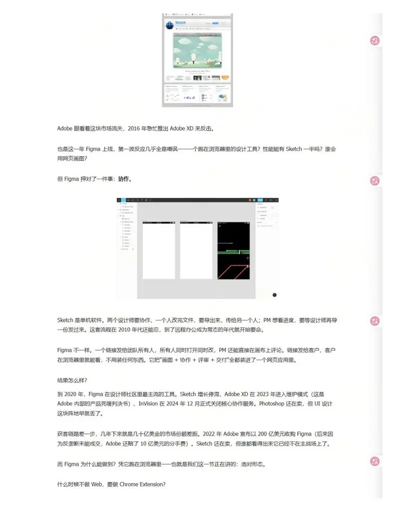

举一个例子: Grammarly。

Grammarly 的核心功能是英语语法检查。如果它只做一个 Web App，用户的链路是一写完一段邮件一复制到
Grammarly 网站一看修改建议一改充一复制回邮件。四步。

但 Grammarly 做了一个 Chrome Extension。装上之后，你在 Gmail 写邮件、在 Twitter 发推、在 LinkedIn 写帖子、在
任何文本框里打字，错误都直接在原地标出来。零步。

Change the quantifier
fewer

闸 Dismiss

图 See more in Grammarly

Our team has less projects this year,

这就是为什么 Grammarly 能做到百亿美元估值一它通过 Extension 形态深入用户的写作工作流，把使用成本降到几
乎为零，支撑起高频使用与长期留存。

这是 Chrome Extension 的杀手铜: 当你的产品需要在用户原生的工作流里出现，不要把用户拉到一个新页面来，就
该做 Extension。

如果你做国内产品

你的产品特点     推荐形态           原因
用完即走、轻量工具 ”微信小程序 。 不用下载，微信生坊自带流量
社交型变、广告变现 ” 微信小游戏 分享裂变天然强，广告分成可观
需要推送、重度使用       App           国内 App 分发渠道成熟

国内产品的第一选择几乎都是微信小程序或小游戏。原因也很简单: 微信月活 13 亿，你不用操心"用户从哪来"的问
题。

回到刚才说的羊了个羊-一它能成立的前提就是微信小游戏这个形态。如果做成 App 让用户下载，第一天就死了; 做
成 H5 在浏览器里打开，分享一次掉一半流量。只有套在微信里，"分享 "这个动作的成本才能接近于零，让裂变效率最
大化。

更早一点的例子是 2017 年底的跳一跳。微信六自推出，张小龙在 2018 微信公开课的演讲里现场玩了一把。这个游戏

让"人微信小游戏"一夜出圈，证明了一件事一一在微信生态里，一个轻量级小游戏可以快速触达上亿用户，这种分发效
率，其他平台给不了。

@

一张图总结

跟选市场一样，选形态背后也是一个建模动作。
很多人以为选形态是审美问题一我喜欢做 App 所以我做 App，我觉得网页 low 所以我不做 Web。不是。
选形态本质是选获客链路。

你的目标是让用户尽可能短地走完"听说一打开一使用"这条路。

每多一步，转化率就掉一截。Figma 比 Sketch 少一步，几年下来就是几十亿美金的差距; Grammarly 把整个链路压到
零步，估值就上了百亿; 羊了个羊把分享成本压到零步，几天就到了 DAU 上亿。

所以默认答案永远是离入口最近的那个: 付费默认海外 Web，国内默认微信。除非有明确的理由说"这件事 Web/小程
序做不了"，否则不要换形态。

拿不准怎么办?

先做一个 Web 版原型。

Web 是所有形态里启动成本最低的一写个 HTML 页面，部署上去，发给朋友试试。如果有人原意用，再决定往哪个
方向走。

由由一一和性和二Lee人saaaAsTieamm

傍件重个十安你贿出最于广丁，走安于具头出广否WsUL人于。

你坐在家里想 我这个产品到底应该是 App 还是小程序"
去，用户的行为会告诉你一切。

个月也想不出答案。但只要把一个粗糙的 Web 版扔出

这也是我们整个课程的核心理念: 先出活，再完美。
别在 PPT 里纠结"到底做 App 还是小程序"。先做出来，让真实用户告诉你答案。

好，方向选好了，接下来我们正式开始动手。

| 二、5 分钟做出你的第一个小程序
为什么现在该做小程序?

今天聊一个你天天在用，但可能没有去关注的事一一微信小程序。
先说结论: 如果你还没做过小程序，现在是最好的起点。

13 亿人的池塘，你为什么不下竿?

人微信有 13 亿月活用户。
13 亿。

这是什么概念? 地球上每 6 个人里，就有 :1 个在用微信。你做的小程序，天然就泡在这个池塘里。
而且小程序有一个 APP 做不到的优势一不用下载。
用户不需要去应用商店搜索、下载、安装、注册。微信里搜一下，点开就能用，用完就走，链路极短。

短到什么程度 就好比你在街边看到一衣新开的奶茶店，不需要办会员卡、不需要下载他们的 APP，推门进去就能点
单。

流量入口还是免费的一一微信搜索、首页下拉、好友分享、公众号导流.…这些渠道，一分钱广告费都不用花，用户自
己就能找到你。

做 APP 呢? 光是让一个用户下载，获客成本可能就要几十块。

小程序的获客成本趋近于夫。

就这一条，够了。

窗口期: 微信在发钱请你来

光有流量还不够，真正值得去做的原因，是微信正在撒钱请人来做小程序。

2026 年，微信推出了一个叫"AI 小程序成长计划"的扶持政策。
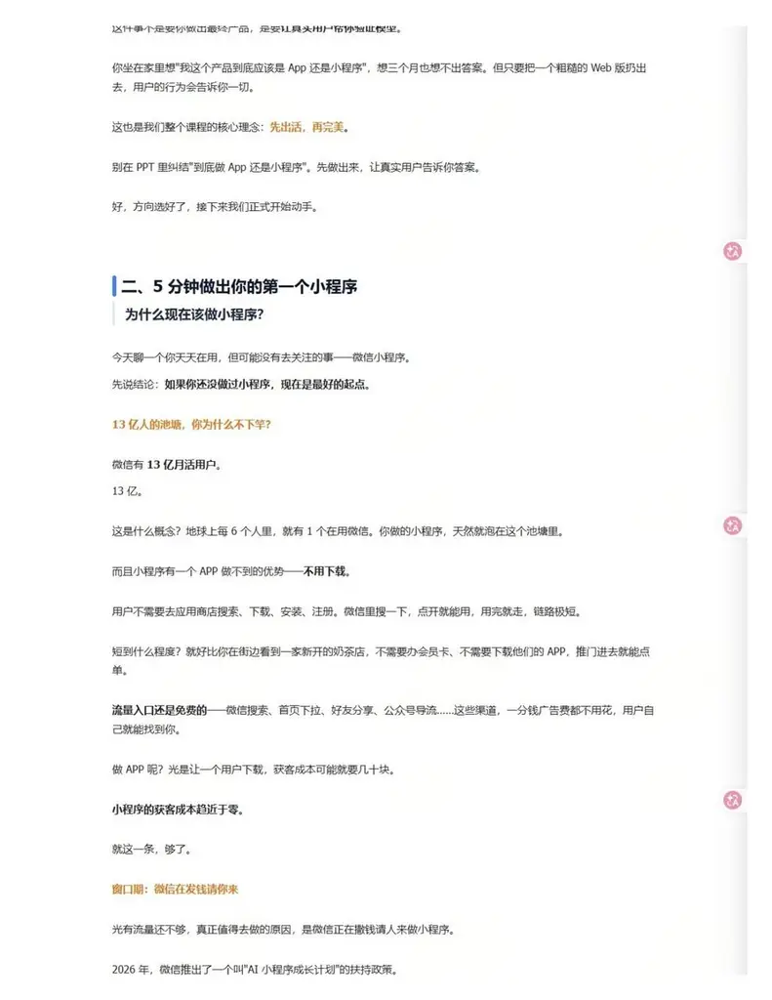

报个名，你就能白嫖一大堆开发资源:

6 个月免费云开发环境。 不用买服务器，不用配域名，微信全包了。

工 亿混元大模型 Token。 你的小程序想接入 AI 能力? Token 免费送。

工万张 AI 生图资源包。 想做头像生成、海报生成之类的，素材也给你备好了。

活动截止到 2026 年 12 月 31 日。报名入口在微信公众平台 一 行业能力 一 AI 小程序成长计划。

hmr           A左用及二上工具小到戌长计划

说白了，服务器不用你买，AI 能力不用你付费，你只需要出一个想法。

这种好事能持续多久? 不知道。但窗口期就是这样 一等所有人都看到的时候，窗口就关了。

启动成本低到离谱

做小程序的门槛有多低?

注册费: 30 块。

对，个人主体注册一个小程序账号，只要 30 元。

服务器: 不需要。
最简单的小程序纯前庙就能跑，需要存数据的可以用免费的云开发。

开发工具: 免费。
人微信开发者工具，下载就用。

代码能力: 不需要。
用 AT 编程工具 (TRAE、Cursor、扣子编程都行) ，把你的需求用大白话描述出来，AI 帮你写代码。

30 块钱，就能启动一个项目。

以前做一个互联网产品，怎么也得几万块起步吧? 服务器、域名、开发外包.…现在 30 块。

这个成本意味着什么?

更呼看你吕以个吗孔消。便一个，个行规一个。
每个小程序都是一次低成本的实验。
想到一个点子就快速验证，做不起来就换下一个。

小程序的钱从哪来?

好，你已经知道小程序好做、成本低、有流量。
但最重要的问题来了一一钱从哪来?

两条路。
第一条路: 广告分成-一身着也能赚
这是最简单的变现方式，简单到什么程度?你什么都不用做。

小程序上线后，只要有用户在用，微信会自动在你的小程序里展示广告。用户看到广告，你就有收入。
每天上午 8-10 点更新前一天的数据，腾讯扣完税后 15 个工作日内自动打款到你账上。

分成比例呢? 普通小程序 (包括工具类、内容类等) 可以拿到广告收入的 50%。如果你做的是创意小游戏，200 万以
内的收入，分成比例更高一-70%。

还有一个"免开发智能接入"功能: 系统可以自动往你的小程序里插入广告组件。什么意思? 你连广告代码都不用写，微
信帮你搞定。新手不用研究广告 SDK，上线就能变现。

最让我心动的一点是: 不需要持续维护。
有人实测过，停更半年以上的小程序，广告收入依然在跑。你没看错，半年不管它，钱照样进账。

单个小程序一天赚 10 块，你可能觉得一 就这?
但你想想，做 5 个呢? 10 个呢?

而且这是几乎零维护成本的被动收入。你白天该上班上班，该措鱼摸鱼，小程序在后台默默帮你赚钱。

单个收益难免会有波动，多个肥加后，整体收入就会更稳定、更平滑。

第二条路: 订阅刺一做一个产品，持续收钱
订阅制就是用户按月或者按年付费，开通你小程序的会员。
和广告分成不同，订阅制的天花板更高，但也更需要你认真打庆产品。

举个例子: 有一个"配音神器"小程序，免费用户每天有少旦使用额度，额度用充就弹窗提醒你升级会员。喜欢这个工具
的用户，就会_直续费。

订阅币的好处是: 你做的是一个品牌化的产品，不是一次性的消耗品。

只要你切中了用户的冶点，一个产品可以做很久。用户越多，产品价值越高。今年有 100 个付费用户，明年可能变成
500 个，后年变成 2000 个。这是一个正向飞轮。

而且宣传渠道很多一一小红书、拌音、视频号、公众号，到处都能推。收益天花板比广告分成高得多。
广告分成适合批量做，快速起量。订阅刺适合深耕，长期经营。
你可以先从广告分成入手，验证需求、积累经验，跑通全流程; 等找到一个值得深耕的方向，再切换到订阅制。

别一上来就想做一个"完美产品"。先上线，再优化。

实操: 用扣子编程，5 分钟出一个 demo

好，道理讲充了。
现在，动手。

还记得我们前面学习的扣子编程吗7它就可以快速做出一个小程序。

实操一: 表情包工坊

第工步: 描述需求

做小程序，同样可以用我们前面学过的 SPEC 方法来梳理需求。

不了解小程序的技术架构、有什么限制? 没关系，直接让 AI 帮你逐步确认。

我是把下面这段提示词复制进扣子编程的对话框:

句
fc

Plain Text

我要做一个: 制作表情包的微信小程序
功能大概如下:
用户输入形象提示词之后，可以制作一组8张的未情色，可以是喜总京乐等情绪向的表情包，也可以是拥抱、比心等动作类的表情包，

办3 枉下亡让美串从用站由成的主赎各记录<

页面整体风格温暖、简洁，背景用浅黄色或浅权色新变，文字用深灰色。底部加一行小字"每天 3 次免费，更多次数请升级会员"。
请你先不要写代码，你需要

1 像苏格拉底一样，帮助我梳理需求，

2你需要一个问题一个问题地问，每次都给出带编号的选项

3 直到我们能够形成一份完整的SPEC，符合以下标准

。pProblem statement (问题陈述》

。 Proposed solution (方案指述)

。， Technical Constraints《技术约束)

。， Non-goals (明确不做的事》

。 success criteria (成功标准)

由wma ~               日口 品三   二

Nan-gease 本不多)                                                                                        用几时中
Success chens (村|                                                                            人

发送之后，扣子编程会_步步帮你梳理需求一它会问你要不要支持分享》要不要保存到相册?后端用什么存数据?

我是基于 Taro 框架开发小程序的专家，很高兴为你服务| 让我们来一起檀理表情包小程序的需求.

问题 1: 核心形象生成方式
你希望用户输入的形象担示词 (如“橘色的小猫") 是通过什么方式生成具体的表情包图片?
丰 Al 图像生成 - 集成 AI 国像生成服务 (如 DALL-E、Stable Diffusion 等) ，根据提示词实时生
成 8 张不同情结 / 动作的图片
2模板普换 - 预设一套表情包模板，用户上传或选择基础形象，然后夺用到不同情绪 / 动作的模
板上

3 其他方式 - 你有其他的想法
请选择一个选项 (或描述你的起法) 。

大概七八个问题，一份完整的 SPEC 就出来了。

下
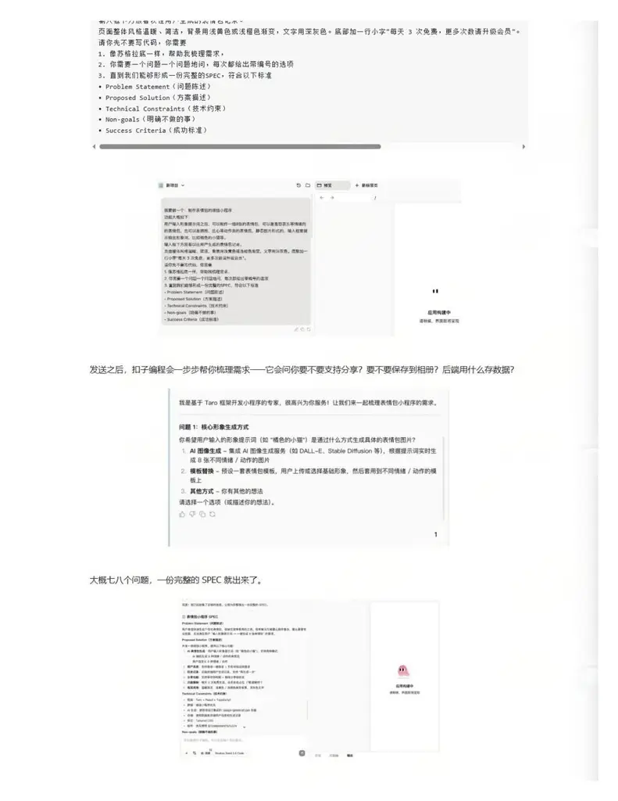

需求越清楚，AI 写的代码越靠放。
别嫌麻烦，这几分钟花在需求上，后面能省几个小时的改 Bug 时间。

第2步: 等AI 生成

确认 SPEC 没有问题后，告诉 AI: 开始执行。

然后你会看到右边的预览区域在动 一代码在跑，页面在一点一点地置出来。
入等大概 3 分钟。泡杯条的功夫，初版就开发完了。

1          e@        加

第 3 步: 预览效果

在输入框随便写点东西，比如 "柱猫"”，点击生成。
生成后，你可以直接在预览区域看到小程序长什么样，效果怎么样。

4  让  日

Cave ve
是

第 4 步: 效果调整

第一版大概率不充美。可能颜色不对，可能按钮太小，可能生成的表情包效果不好。

没关系。

直接在对话框里告诉扣子编程你要改什么:

1我希望一组的表情包画风、形象可以保持一致;2.我希望背景是纯透明的

2D8
8 思考过程

好的! 我来修改生成提示词，确保一组表情包画风一臻并且背景透明:
口 编辑文件 /workspacejprojectsjserverlsrc/modulesjgenerationlgeneration servicets
9 思考过程

完美! 我已经修改了生成提示词。现在让我验证一下:
加 执行命令 pnpm validate

9 思考过程

不需要碰一行代码。
耐心对话，改到你满意为止。

恭喜你，到这里你已经做出了第一个小程序demo，是不是比你想象的简单得多?
实操二: 虚拟试衣

第 工步: 描述需求
上一个 demo 是表情包生成器，纯图片生成，逻辑比较简单。
现在来一个稍微有挑战的一我们之前做过的虚拟试衣。

同样，先把需求发给扣子编程，让它帮有我们梳理清楚产品的边界。
把下面这段提示词复制进去:

Plain Text

我要做一个: 提供虚拟试衣功能的微信小程序

功能大概如下:

用户输入人物图和服装图后可以输出换衣后的效果，支持同时上传1-3张服装图片*
页面整体风格简洁，布局协调，人物图、服装图和结果图可以一屏展示。下方有历史记录可以查看
请你先不要写代码，你需要

1 像苏格拉底一样，帮助我核理需求，

2你需要一个问题一个问题地问，每次都给出带编号的选项

3。 直到我们能够形成一份完整的sPEC，符合以下标准

。 Problem statement (问题陈述)

。 proposed solution (方案指述》

。 Technical Constraints (技术约束)

。Non-goals (明确不做的事)

。 Success Criteria (成功标准)

名

Ce
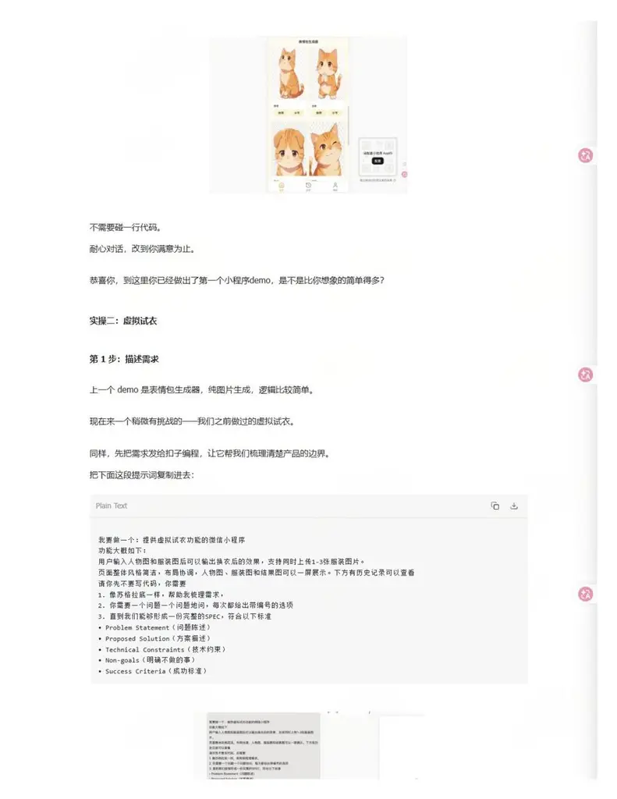

rm

1           o

这次扣子编程问的问题比上一个要多不少，耐心一个一个回答就好。

让 |多

1               四

全部确认后，一份完整的 SPEC 就出来了。

eg -am rc                    CE         ，
omen geroon (ma

er。 roven mine anmpaama               pe

它甚至还画出了页面布局图。

第之沙: 等 Al 王成

确认 SPEC 没有问题后，开始执行。

om                  4

se              o        忆
老规抱，等大概 3 分钟，初版效果就出来了。
本
-军-
CE            e
8
第3步: 预站效果

第 4 步: 效果调整

第一版大概率有问题。这次我就遇到了两个: 图片被压缩得很历害，而且人物图做了镜像处理一-左右反了。

个衙全机求，没天条，目接在对访生旦香诈刊千编村个以要来，以元髓测了。

现在这个界面我觉得不太好看，继续优化。

你会发现，不管做表情包还是做虚拟试衣，流程都是一样的: 描述需求 一 SPEC 确认 一 AI 生成 一 预览 一 调整. 换
个选题，方法不变。

demo 做完了，这只是第一步。

什么是App ID

让你配置小程序 App ID。

做 demo 的时候，你可能已经注意到了一 页面右下角一直有一个小图

请配置小程序 ApplD

App ID 是什么?

部旦可的小理应丰党住田的眼愉证喇
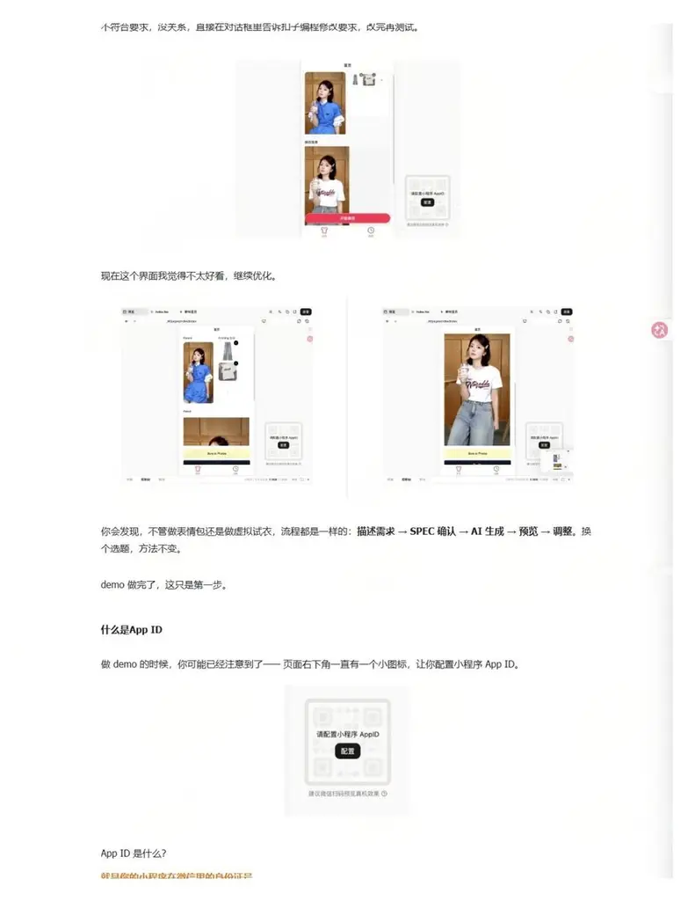

mi mras moremem-aomm。

每个在微信平台注册的小程序都会被分配一个独一无二的 App ID，格式通常类似 wx1234567890abcdef。

人微信服务器靠它来识别"这是谁家的小程序"，然后决定你有没有权限调用支付、定位、用户信息这些能力。没有合法
的 App ID，小程序就是个空壳，什么微信能力都调?

这么获得App ID?

1. 打开微信公众平台，注册一个小程序账号
全 到信公众平台                Se] so

2. 如实填写注册页的相关信息
机

小旺序潮

3. 注册完成后进入小程序后台

轿 4到记       中程序发布流程
re                                 |

]

su下
全5本

4. 点击开发管理，就能看到你的 App ID

Nt上

这里可以先不用着急绑定，因为一个账号只有一个App ID，你可以等把 demo 打磨得差下多了，再去备案绑定，免得
中途换选题还要折腾改名重新审核。

到这里，你知道怎么做一个小程序 demo 了。
但要把这个 demo 变成一个真正能赚钱的小程序，你还需要:
1 把代码部轩上线                                                                                                                                                人@

2. 开通流量主
3. 备案审核

这些会在下一节的课程讲到。
现在最重要的是，你已经在几分钟内，做出了一个能跑的东西。

打开扣子编程，把你脑子里那个想法，变成一个能跑的 demo。

作业
* 用扣子编程做出一个小程序Demo，调整到你满意的效果

| 三、用AI做一个微信小程序一一进阶篇
从扣子编程毕业，用 TRAE CN 正经做一个能上线赚钱的小程序

还记得前面课程的《5分钟做出你的第一个小程序》吗?
我们用扣子编程，5分钟做出了一个 demo。表情包生成器、虚拟试胡，看起来还挺像回事。

但那只是一个demo。

它能在扣子编程的预览区里跑，能截个图发朋友图炫枞一下。然后呢? 你的朋友在微信里搜不到它，用户付不了钱给
你，广告收入更是零。

从"能跑的demo "到"能赚钱的产品"，中间隔着五道坎: 账号注册与备索、云开发环境搭建、正经项目开发、审核上          @
线、变现接入。

这一课，我们把这五道坎全部翻过去。

用 TRAE CN 蔡代扣子编程，用微信云开发做后端 (免费) ，走完注册一开发一调试一审核一上线一变现的全流程。
而且这次我们做的项目，你绝对感兴趣一
SBTI人格测试，小程序版。

就是最近全网爆火的那个。
MBTI已经过时，SBTI来了。
原作者: .8站PRQ肉儿趾儿
为什么做 SBTI?

如果你最近刷过小红书、B站、朋友圈，你一定见过这几个字母组合: CTRL、DEAD、FUCK、SOLO、IMSB.……

这就是SBTI Silly Big Personality Test，2026 年 4 月 B 站 UP 主 Q肉儿串儿 (原名蛆肉儿串儿) 原创出来的"抽象人
格测试 。

SBTI 到底是什么?
它长得像MBTI，但画风完全不同。

MBTI问你"你是内向还是外向"，SBTI问你"你在公共厕所发现没纸了会怎么办 。

MBTI给你贴一个IND、ENFP的标签，SBTI给你贴一个DEAD (终极皖烂能量体) 、FUCK (叛着人形杂草) 、ATM-er
(人肉提款机) 的标签。

31道题，15个维度，5大模型 《自我认知、情绪处理、态度取向、行动模式、社交方式) ，27种人格类型 + 1个隐茂
类型 (DRUNK) 。

宙                器            行者 全
人                  GOGO

CE

仿                            吕           GO GO Go出发明        只哈哈哈哈

没有任何学术基础，100%娱乐。
但它抓住了一个核心一年轻人不想再假装深刻了，他们想用自嘲的方式说"这就是我现在的状态"。

SBTI 赁什么能爆?

4 月 9 日上线后，原版网站几个小时就被挤南了。
GitHub 瞬间冒出十几个开源复刻版。小红书、朋友图到处都是晒结果的帖子。

它能爆，不是偶然的。三件事蹊到了点上。

创作成本极低。

Q肉儿串儿自己说过，整个项目是用 AI 辅助完成，源码不到2000行，打包后不到1MB。一个人就做出来了。
测试结果天然适合传播。

每种人格类型都有一个高谱的标签和一段"准得吓人"的描述。用户做完第一反应就是截图一一"我居然是DEAD型，也太
准了吧"。零成本型变。

数据和代码完全分离。

开源版本的核心就是: 31道题的]SON + 27种人格定义的]SON + 一个Manhattan距离计算函数。所有题目、选项、人
格描述都存在]SON文件里，代码逻辑极简。

这意味着一你换一套]SON，就是一个全新的测试产品。

为什么 SBTI 天然适合做小程序?

因为它的技术栈就是纯前端。原版是 Vite + 原生 ]avaScript，没有后端，没有数据库，所有数据都在 ]SON 文件里。
打包后26KB。

搬进小程序只需要做三件事:

1 把 ]SON 数据文件放进 Taro 项目

2. 把计分逻辑用 TypeScript 重写一遍 (或者直接让 AI 帮你转)
3. 套上人小程序的页面壳子，接上微信分享

吉事。

更重要的是: 做完 SBTI 之后，你可以用同样的架构做任何测试类小程序。

换一套题目]SON，换一组结果定义)SON，你就有了一个"程序员人格测试"恋爱脑指数测试"社恐等级测试……
测试类小程序是天然的流旦机器-用户做完测试，第一反应就是分享到朋友图。零成本裂变。
好, 开T。

第一上 注吗詹住小班谨胀旺
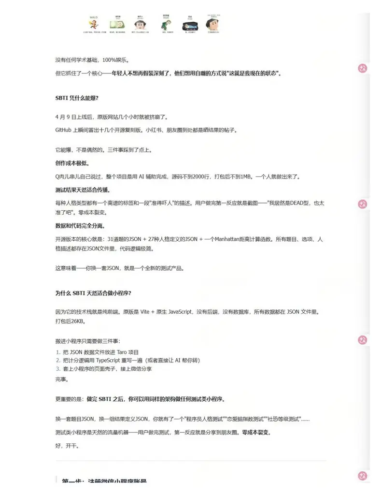

mp过， LunaimrarTEmmxm癌
TRAE CN 你们已经装好了，这一步跳过。

我们直接从微信开发者工具安装和小程序账号开始。

安装微信开发者工具

进入小程序后台 一 开发与服务管理 一 开发工具 一 微信开发者工具下载

注册小程序账号

打开浏览器，访问 mp.weixin.qq.com (微信公众平台) 。
右上角 一 "立即注册" 一 选"小程序"。

safe

注册细节 (坑多，仔细看)

邮箱必须是全新的。
没注册过任何微信公众平台账号的一订阅号、服务号、企业微信，只要注册过一个，这个邮箱就废了。
你常用的QQ邮箱、163邮箱大概率已经被用过了。去重新申请一个新邮箱吧，花两分钟的事。

主体类型选"个人"。 费用: 30元。

一个身份证最多注册5个小程序。 一个手机号也是5个。所以名额珍贵，别浪费在纯测试上。

小程序注册

填充个人信息提交

信息提交成功。

你可以前往生信公众平台便用相关功能-

个人主体 vs 企业主体一你必须知道的区别
这里要展开说一下，因为很多新手踩坑就踩在这里。

个人主体能做什么: 发布小程序、开通流量主 (广告分成) 、用云开发、使用基础 API。30元搞定。

个人主体不能做什么:
* 不能开通微信支付。 这是最大的限制。意味着你做不了订阅制、做不了虚拟支付、做不了任何需要用户在小程序里
付钱的功能。

* 不能做微信认证。 没有认证，一些高级 API 用不了(比如获取用户手机号) 。

* 类目爱限。 只能选工具、教育、生活服务、体育等低风险类目。电商、医疗、金融、餐饮? 想都别想。                 全
* 不支持模板消息推送。 你没法给用户发通知。

* 主体类型注册后不可变更。 你不能把个人主体"升级 "为企业主体，只能重新注册一个新的小程序再迁移。

1        x mm            va
ra     本
rom xx王ww          va

aewerem xc rom                 ve

那怎么办?

先用个人主体跑通全流程，验证产品有人用。 句号。

广告分成不需要微信支付，个人主体就能开通流量主。等你验证了市场需求，再花几百块注册个体工商户，用企业主体
开一个新的小程序，把功能迁移过去。

不要一上来就搞个体工商户-一万一产品方向错了呢? 30块钱的试错成本和几百块的试错成本，差别大了。

关于个体工商户:

如果你确定要做订阅制/虚拟支付，你需要注册个体工商户 (通常在当地市场监管局言网或"e窗通"等平台在线申请, 几
百块钱搞定) 。用个体户营业执照注册的小程序 = 企业主体，可以开通微信支付、微信认证、虚拟支付，所有功能全         人@
开放。

拿到AppID

注册完成后，进入小程序后台 一 开发管理 一 开发设置 一 找到"AppID (小程序ID) "。
复制下来，存到一个地方。后面创建项目要用。

Ne上                                   am
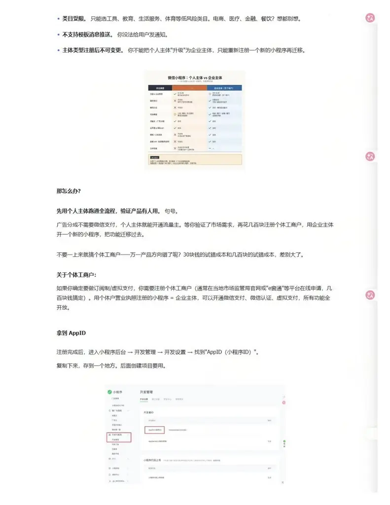

小贴士
先不要急着填"小程序名称"和"认证备案"。

万一后面你换了选题，名称还得改。先把账号注册好，拿到 AppID 就行。名称、头像、简介这些，等产品基本成型了
再填。

第二步: 白嫖微信的 AI 小程序成长计划

这一步前面的课程已经提过了。但如果你还没申请-一
现在就去申请!

什么是 AI 小程序成长计划?

这是微信启方在2026年1月推出的扶持计划，全称 "AI应用及线上工具小程序成长计划"。
简单说就是一微信免费给你服务器、AI算力、流量，你只需要出一个想法。

申请条件

* 小程序滩目属于文娱、工具、社交、深度合成、资讯等线上类目 (不含线下类目)
* 个人主体和企业主体均可参与

* 新开发者完成注册后即可参与

操作路径: 小程序后台 一 行业能力 一 AI小程序成长计划 一 参与计划。

https://mp.weixin.qq.com/wxamp/subApp/devplan/home?token=2011120701&lang=zh_CN

hr            用及线上工具小万长计划

白嫖清单

免费云开发环境，6 个月。

包含云数据库、云函数、云存储。新开发者可免费创建个人版云开发环境。已有云开发环境的开发者可领取大额抵扣
券。这个价值很大一一正常情况下你得自己买服务器、配数据库，每个月几十到几百块。现在全免了。

工亿腾讯混元大模型 Token。

用的是混元2.0，如果你想在小程序里加 AI 功能 (比如 Ar 解读测试结果、AL 生成个性化建议) ，Token 免费用。后续
混元最新模型也会陆续上架。

工万张 AI 生图额度。

混元文生图模型，可以拿来给用户生成测试结果海报、个性化头像等。

We 分析专业版 1年。

这是微信官方的数据分析工具。用户留存、活跃度、转化漏斗、页面热力图，全都有。专业版正常是收费的，现在免费
领。

流量激励.

在公众号发布小程序相关内容并带上 #来微信做个小程序 话题，有机会获得公域流量上曝光。 "人微信 一 发现 一 小程

序"入口也会有专属推荐位给优质线上工具小程序。

免开发智能广告接入。

系统自动分析你的小程序页面，在合适的位置和时机插入广告组件。连广告代码都不用写。

虚拟支付优惠靶率。 (需企业主体)
活动期限: 2026年1月1日至2026年12月31日。

说白了一服务器不用你买，AI能力不用你付费，还有免费流量扶持。你只需要出一个想法和执行力。

naaaaarasrom 。 国[

ee

aamut un suitas ”国E

ea                       和

1

工Ri有

本天人和          [

Ca

第三步: 开通微信云开发一你的免费后端

为什么用云开发?
前面的课我们讲过Next,js + NesbS + Vercel那一套后端方案。那套方案做网站很好。

但做小程序，我更推荐微信云开发。

@

原因很简单: 零运维，免费，跟微信生态原生打通。

不需要买服务器，不需要配域名，不需要搞HTTPS证书，不需要部署后端代码。开通之后，在小程序里调一句
wx.doud.callFunction 就能执行后端远辑。

云开发的三个核心能力

* 云数据库 一 NoSQL 文档型数据库 (类似 MongoDB) 。存用户信息、测试结果、会员状态。每个记录就是一个
]SON 文档。不需要你设计表结构、写 SQL，直接往里存 ]SON 就行。对于 SBTI 这种结构化数据特别友好。

* 云函数 一 后端逻辑。用 Node.js 写，部寺在微信的服务器上。你不需要管服务器配置、负载均衡、容灾这些东
西。写一个函数，上传，就能用。每次用户调用，微信帮你执行。

* 云存储 一 存文件和图片。测试结果分享海报、用户头像、配置文件，都可以存这里。自带 CDN 加速，全国访问
速度都很快。

成长计划参与者，6 个月免费。 之后如果你的小程序有收入了，再考虑付费升级。

开通步骤

打开小程序后台 一 开发与服务 一 云服务 一 云开发 一 开通。

四smr            去服务

进入后扫码开通，也可以直接在小程序成长计划里领取云开发资源时直接开通

加hm            小程序成长计划

有

相

|

了                 Se

ar

工岂昌有         要一本      本开关和          ET

开通完成后，你会得到一个环境ID。记下来，后面代码里要用。
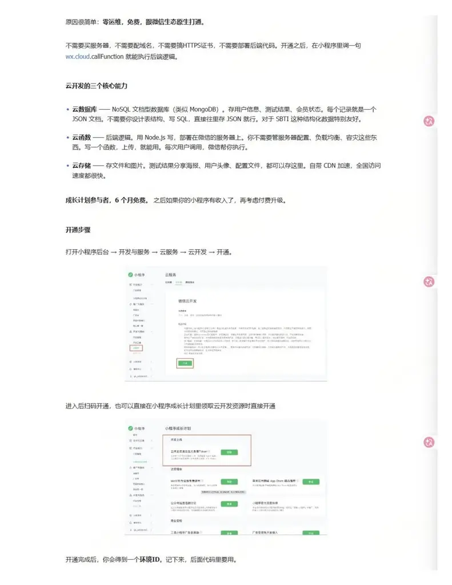

云开发 vs 云托管 vs 自建后端，怎么选?
SBTI 的测试题和结果展示可以放在小程序前端完成，但"保存测试结果"和 读取历史记录 需要服务端能力。

因为小程序前端运行在用户手机上，只适合做页面展示和交互。如果直接让前讽操作数据库，权限不好控制，也不安
全。比如用户可能伪造请求、算改测试结果，或者写入不符合规则的数据。

所以需要把关键远辑放到云端:

二 用户完成测试后，前端把结果提交给云函数;

2. 云函数在服务端校验数据，并写入云数据库 test_results;

3. 用户进入 我的"页面时，再通过云函数或云数据库读取自己的历史记录;

4. 后台也可以基于这些记录统计不同人格类型的数量。

云开发相当于是微信帮有我们提供了数据库、云函数、用户身份识别 OpenID 等后端能力，不需要自己买服务器、配

域名、写登录鉴权。
对于这个测试小程序来说，用云开发就足够了。

除此之外，还有云托管、自建服务器的方式来处理后端能力。

微信小程序三种后册方

云开发 = 微信帮你准备好了一套"现成后厨"。

你不用自己买服务器、装数据库、配置存储。微信已经给你准备好了:

-srt十 串上二串王挛所”一几”est

”丈岳年，用不性出厂瑟也、昌半、义早寺天刷

* 文件存储: 用来存图片、视频、文件

* 云函数: 用来写一点后端远辑，比如提交订单、发送通知、处理登录

你只要按它的规则写代码就能用。
云开发适合: 简单小程序、个人项目、低成本快速上线。

云托管 = 你自己做了一套"后司"，微信帮你找地方运行。

你可以用 Nodejs、]Java、Python、Go 等语言，写一个完整的后端服务。这个后端可以有自己的接口、自己的业务逻
辑、自己的项目结构。

微信不车你规定太多，你想怎么写后端都比较自由。
但相应地，你也要更懂后端点。

云托管适合: 复杂业务、已有后端项目、接口很多、远辑比较重的小程序。

比如你要做一个 Ar 小程序:
用户输入内容，小程序要调用 AI 接口、计费、保存历史记录、做权限判断。

这种用云托管会更合适。

自建服务器 = 你自己开一家完整的"后证"。

你需要自己买一台云服务器，然后在服务器上安装运行环境、部署后端代码、配置数据库、配置域名、HTTPS 证书、
安全规则、日志、备份、监控等。

微信人小程序本身只负责前端页面。当用户在小程序里点击按钮、提交表单、下订单时，小程序会通过 wx-request() 去
请求你自己的后庙接口。

比如: 小程序前端 一 wx.request() 一 你的服务器接口 一 数据库/第三方服务。
自建服务器的好处是: 自由度最高。

你可以自己决定:

*。 用 Node.js、]Java、pPython、Go、PHP 还是其他语言

*。 用 MySQL、postgreSQL、MongoDB、Redis 等数据库

* 怎么设计登录、权限、订单、支付、消息通知

* 怎么接企业内部系统、第三方 API、AI 服务

* 怎么做缓存、队列、定时任务、微服务

但它的门槛也最高。很多云开发、云托管帮你处理掉的事情，在自建服务器里都要自己负责。
比如:

@

TDToomionon

这么多种形式，具体怎么选?

先用云开发跑通。

等你的小程序验证成功，用户量上来了，再考虑要不要迁移到自建后端。别在产品还没验证的时候就花时间搞"完
构"一一那是把精力花在了错误的地方。

先上线，再优化。句号。

提前知道云开发的限制
云开发不是万能的。有几个限制你现在就要知道:

免费版有配额上限。
云函数调用次数、数据库读写次数、云存储容量，都有每日上限。对于日活几千以下的小程序充全够用，
但如果你的小程序突然爆了 (kt如上了热搜) ，可能会触及限制。到那时候你可以花钱升级，或者迁移到自建后端。

云函数冷启动。
如果一个云函数很久没被调用，下次调用时会有几百毫秒到几种的"冷启动"延迟。
对于 SBTI 这种用户主动触发的场景影响不大，但如果你做实时性要求很高的功能 〈比如聊天) ，要注意这个问题。

轻量小程序里，云开发最常用的是普通云函数 + 云数据库。

大多数轻量小程序使用云开发时，主要用的是普通云函数和云数据库。普通云函数适合保存数据、读取记录、做简单校
验这类短请求; 如果要做实时长连接、流式输出或完整后端服务，再考虑 HTTP 云函数或云托管。

条四生 田 TRAF FrN hl击 T=rn 便昌

mp让or mm Te ~ yy下acv o口

初始化项目

打开TRAE CN的终端，执行:

npm install -g @tarojs/cli

taro init sbti-miniapp

选项: 框架选 React，语言选 TypeScript，C5S5预处理器选 Sass (或None) ，模板选默认。

请输入项目介绍

请选择框架

是否需要使用 Type
是否需要编译为 ES
请选择 CSS 预处理器

请选择包管理工具
请选择编译工具
请选择模板源

等它装完依赖

cd sbti-miniapp

npm run devsweapp

这条命令启动开发模式，把 Taro 代码实时编译成微信小程序代码，输出到 dist 目录。

在微信开发者工具中导入项目

打开微信开发者工具 一 创建小程序 一 目录选择 sbti-miniapp/dist 一 AppID填入你之前复制的那个 一 创建
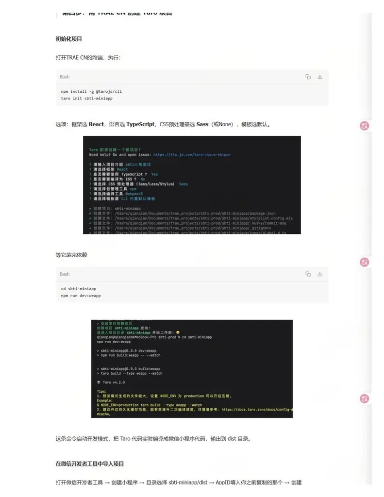

进入开发者工具的项目页面

人@
从现在开始，你的开发流程是: 在 TRAE CN 里编辑代码 (或者跟 AT 对话) 一 Taro实时编译到 dist 一 微信开发者工
具自动剧新预览。
两个工具并排开。
关键配置文件

初始化充的项目有几个文件你需要知道，不需要记住，但知道在哪儿能少走这路

权

Src/app.contig.ts

全局配置。页面路由 (你的小程序有哪些页面、路径是什么) 、人abBar (底部导航栏) 、窗口样式，都在这里配。

project.config.json

人微信小程序配置。AppID、项目名称、编译选项。如果你遇到"App ID不合法"的报错，来这个文件检查。

sitemap.json (通常需要手动配置)

搜索收录配置。这个文件控制你的小程序页面是否人允许被微信搜索引警索引。默认是全部允许。如果你想让用户通过微
信搜索找到你的小程序，不要把这个文件改成全部禁止。 后面讲增长策略的时候会详细说。

src/pages/

页面目录。一个文件夹就是一个页面。这是你花时间最多的地方。

要把之前保存的 App ID 也更新到代码中，一般是存在project.config.json和dist/project.config.json底下。

打开的编辑器
文件
bt

世eaeeeomm]

TAR0_APP

第五步: 用 AI 开发 SBTI 测试小程序

这是这一课最核心的部分。

我们要做的小程序有五个页面:

1. 首页 一 介绍SBTI是什么，一个大按钮"开始测试
2. 测试页 一 31道题，一题一题答

3. 结果页   你的人格类型 (带海氢，支持分享

4. 排行榜页 一 27种人格的全部介绍

5. 我的页 一 测试历史、会员状态

5.1 准备SBTI的核心数据

SBTI是开源的。原版代码和数据都在GitHub上。

去GitHub搜"SBTI-test" (推荐 UnlucdkyNinja/SBTILtest 或 pingfanfan/SBTI 或 miyu6666/SBTI) ，找到 data/ 目录。里
面有两个核心SON文件

题目数据JSON 一一 31道题，每题2-3个选项。每个选项对应1-3分的分数，每道题对应一个维度。

人格定义数据JSON 一一 27种人格类型，每种包含: 英文代号、中文名称、描述文字、15个维度的MM/H模式。

把这些]SON下载下来，放到你的 Taro 项目 src/data/ 目录下。
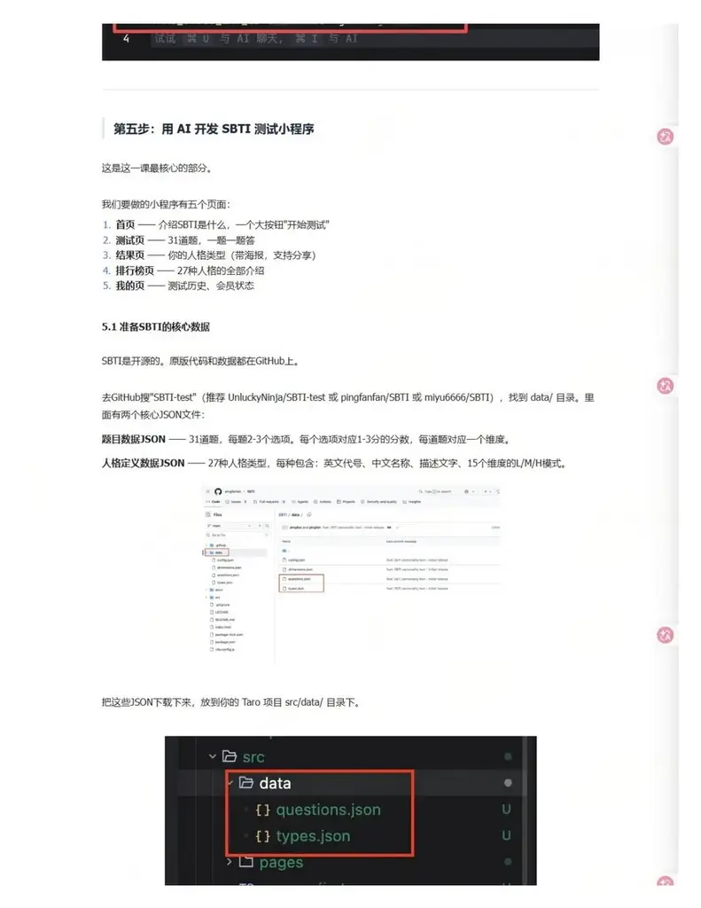

[面面国且上SI 2人AS

5.2 理解 SBTI 的计分逻辑 《重要! )
这套远辑是你以后做所有测试类小程序的核心模板，花两分钟理解一下:

第一层: 答题得分。
每道题的选项对应1/2/3分。每个维度由2道是组成，所以每个维度的总分是2-6分。

第二层: 分数一等级。

2-3分 =上 (低) ，4分 = M (中) ，5-6分 = H (高) 。15个维度各有一个HM/H等级，组成一个15位的模式串，比
如"LMHHLMLHHMLLMHH"。

第三层: 匹配人格。

你的模式串和27种人格的标准模式串做对比。

怎么对t?

Manhattan 距离一把MM/H映射成数字 (L=1, M=2, H=3) ，逐维度求差的绝对值，然后加总。距离越小越匹配。

匹配度公式: max(0, round((1 - 距离/30) x 100))%

为什么除以30? 因为15个维度，每个维度最大差距是2 (L和H的差) ，15x2=30。

人入江评分带和

你不需要自己实现这个逻辑-AI会帮你写。但你要理解它在做什么。告诉AI

Plain TexX

请帮我写一个s6TI计分函数《Typescript) :
1. 输入: 用户31道题的答案雪组

2. 计算15个维度的分数和L/MVH等级                                                               人@
3。 和27种人格的Manhattan距离对比

4. 输出: 最匹配的人格类型 + 与所有类型的匹配度百分比

人全

5.3 让 AI 帮你生成五个页面
在 TRAE CN 的AI对话框里，输入:

我要做一个seTI人格别试的笛信小程序 (Taro + React + Typescript) 。

项目结构:
- src/data/ 目录下已经有SBTI的题目SO0N和人格定义]SON
- 使用微信云开发做后庙

需要五个页面:

1. 首页: 介绍s58TI，有一个"开始钢试"按钮

2. 测试页 一次显示一道题，选择后自动跳下一题，顶部进度条(1/31)，支持"上一题"
3

4

5

- 结果页: 人格代号、名称、所述、匹配度，TOP 5匹配类型，"分享给好友"和"再测一次”
排行榜页 : 全部27种人格类型的卡片
.我的页 ; 测试历史

底部TabBar: 首页 | 排行榜 | 我的

先规划app.config.ts的页面路由和TabBar，然后逐个页面生成。

纪

公

跟扣子编程最大的区别在这里 每一次 AI 的修改，TRAE 都会显示一个dif (差异对比) 。哪些行是新增的，哪些是删
除的，一目了然。你可以点"接受"也可以点"拒绝"。

这就像你雇了一个程序员，他写完代码之后把改动清单给你看，你过目了才算数。

而不是像拉子编程那样，AI 黑箱操作，你只能看最终结果。

5.4 测试页的交互 《最重要的页面)

测试页是用户花时间最多的页面，体验必须丝滑。

告诉 AI 你要的效果: 一次只显示一道题，选择后自动滑动到下一题 (有动画) ，项部进度条，支持"上一题"，每道题
用卡片样式展示，最后一题答完自动跳转结果页，淡蓝黄绿渐变，搭配白色主体。

5.5 结果页 + 分享功能 (传播引擎)

结果页是传播的关键。用户做完测试，第一件事就是截图发朋

让结果页"长得好看"一好看到用户忍不住想截图。大字显示人格代号，下面是名称和描述，可以去开源仓库里获取人
格形象图，也可以让AI直接在本地构建新的。

分享功能是小程序的杀手钢。

在faro里，用这两个 Hook 就能接入微信原生分享:

useShareAppMessage 一一 转发给好友"/发送给聊天会话
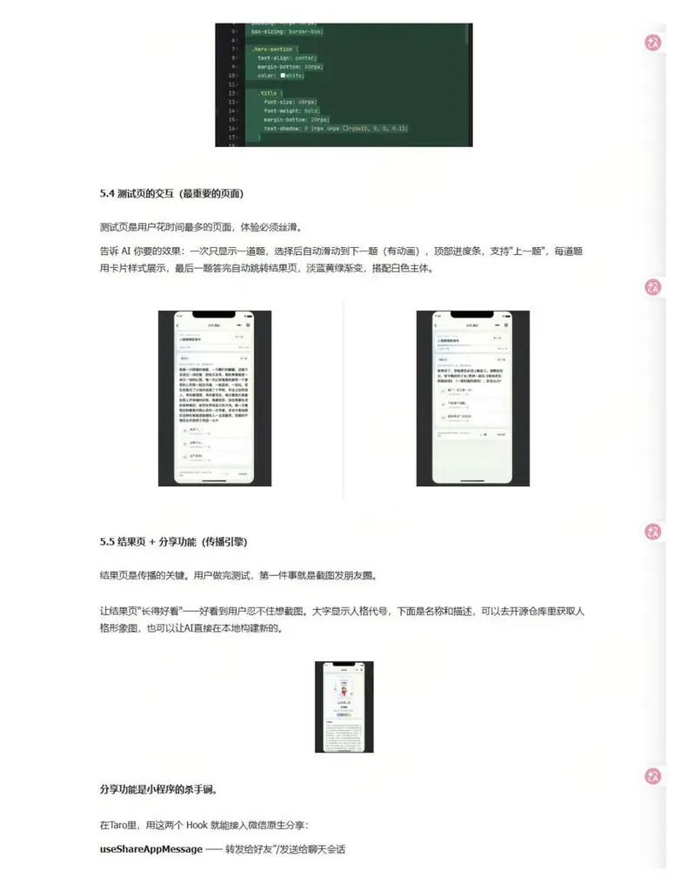

useShareTimeline 一 分享到朋

用户在小程序里点右上角"… 就能看到"分享给朋友"和"分享到朋友|

告诉 AI 加上这两个Hook，分享标题用动态的: “我是SBTI人格类型【DEAD】，你呢? ”

关才给
测试重所用0
机seTI人条ml TLOvE-RI ，保
[3

这两个Hook，可能是你整个小程序里 ROI 最高的代码。 和堆成本型变。

5.6 接入云开发一存储测试结果

用户做完测试，结果要存下来。
一是方便用户回来看历史;
二是你可以积款数据分析哪种人格类型最多 (这个数据本身就有内容价值) 。

告诉AI帮你做三件事:

1. 云数据库创建 test_results 集合
2. 前端测试完成后调用云函数存储结果
3，"我的页面从云数据库读取历史记录

添加你在小程序后台获取的云开发ID，路径大概是miniprogram-l/ miniprogram/appjs

确认在微信开发者工具的项目目录里有没有cloudfunctions文件，没有的话可以让 AI 帮你补充识别。

完成后，在开发者工具里右键saveTestResul，选"创建并部署: 云端安装依赖

资源管理器
DisT              |

* 回 cloudfunctions
paoe

e READvE 全
新建 Component
开启云函数本地调试
创建并部署: 所有文件

间 p，
appjs

appjs.map

Al配置页面

点击页面右上方的云开发，进入云开发控制平台

小程序模式 ” 《@ 预览;人 真机调试 心 上传

选择云函数，选择版本与配置

讲入 后许择瑟填。 层开高级配置

saveTestResult

口m    |

完成云函数相关配置

进入数据库列表，创建集合，并填写集合名称及权限类型

5.7 微信登录 (一行代码的事)

小程序的登录是所有平台里最省事的。没有之一。

不需要 BetterAuth，不需要 OAuth，不需要用户输入任何东西。

在appts 里 Taro-cloud.init({ env: '你的环境ID' 为，然后用 Taro.login() + 一个云函数，调
cloud.getWXContext().OPENID 就拿到用户唯一标识了。

consoLe.Log ('小程序登录成功，已获取 0PENI    openId)

(error => {

consoLe .warn( '小程序登    b    error)

v DIST         十 四

" 夯 cloudfunctions

删除 Page
新建 Component
开启云函数本地调试

司 app.wxsg      云模板或Al配置页面

此时 Console 里显示"小程序登录成功，已获取 OPENID"，那就是配置成功了。

Wxml | Console | Sources

top              v        Fiter 。 Default levels v
全三反攻氏降大了。7 5 起下
wxgetDeviceInfo( ) 判断平台进行兼容处理，让小程序在 Harmony0S
也著得最佳体验，查看指引 [https://deveLopers,weixin.qqg,com/co
mmunity/devetop/doc/60068e6-]

关于上述警告，点击查看更多信息: https://deveLopers.weixin.qq.c
Om/communit' yyd   eLop/doc/06008ei

.Src_reconciter,ts;195
Downtoad the React DevToots for a better devetLopment
experience: https://reactjs.org/Link/react-devtoots

App Launched,                                   ,Src_appsts:19
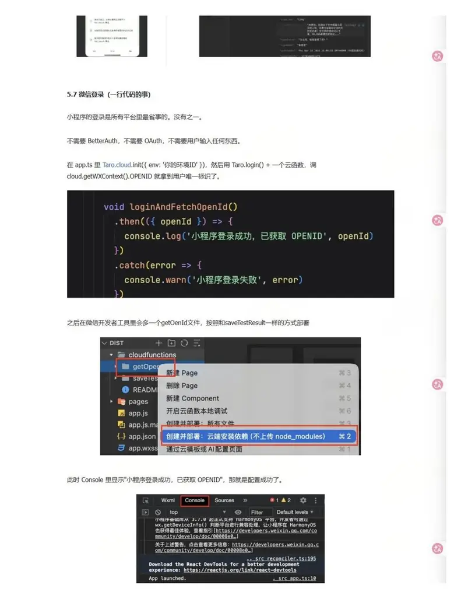

ml Launch Time，6498 ms

序登        已获取 OPENID

UXT9USUDUFUZRIJWORWEURGVTiZzhw

不需要任何第三方认证服务。不需要用户输入账号密码。不需要手机验证码。不会出现登录按钮。

Taro.login() 的作用是在后台静默获取当前微信用户的身份标识 (OPENID) ，整个过程对用户完全透明。这类登录通常
就是无感的，不需要按钮。

什么时候才需要按钮:
。 你要做点击登录"                                                                                      人@
* 你要用户授权资料
* 你要手机号授权
。你要先展示未登录态，再让用户主动触发登录
拜托，做网页的时候我们折腾了多少才搞定登录? 小程序这边一句话搞定。吧嘿。
第六步: 调试和真机预览
开发者工具调试                                                                                         @
微信开发者工具的模拟器跟真机效果已经很接近了。几个调试面板你要知道:
Console 面板 一一 看报错。页面白屏或功能不正常，先看 Console。
Network 面板 一 看云函数调用。每次 callFunction 都会在这里留记录，你能看到请求参数和返回结果。
AppData 面板 一一 看页面数据状态。当前题号、用户答案数组、计算出的分数，实时可见。
Storage 面板 一 看本地缓存。小程序的 Taro.setStorage 存的数据在这里。
sources| Network
object {2}
如
人@

Vulnerability

真机预览 〈必须做)

电肪模拟器和真机的体验不一样。

特别是滚动流畅度、触摸反馈、字体大小、安全区域 iphone底部那条横线) ，必须在真机上看一遍。

微信开发者工具顶部 一“预览" 一 生成二维码 一 手机微信扫码。

扫码手机测试
mm ~- e    mk    usa e
SBTI 人林这           二
ArM-er
瑟和
常见报错速查

新手遇到报错不要慌。直接把报错信息复制给 TRAE 的 AI，让它帮你修。 这就是前面课程里说的一一"坎到报错直接
复制给 AI 让它修复"。在这里依然适用。

但有几个高频报错你可以自己秒解

@@

四

外

appiag涉百这- 一一 prolecr.conrlgJson 里Hy appla 个可。
"云开发环境未初始化" 一一 apptsx 里漏了 Taro.cloud.init({ env: '你的环境ID' 思。
"ocx is not defined" 一一 import路径写错了。给AI看，秒修。

"request:fail url not in domain list"     你在代码里请求了外部API，但没在小程序后台配置合法域名。云开发不
存在这个问题 〈因为云函数是微信自己的服务器) ，但如果你额外调了第三方API就需要配。

编译后微信开发者工具没有自动刷新 一 确认 npm run dev:weapp 还在跑。终端关了就不编译了。

"Error: timeout"” 一一 一直出现有可能是微信开发者工具 / 基础库侧的超时噪音，不是业务代码里某一行明确抛出来
的错误。

第七步: 备案 (2024年起强制要求)

从2024年起，所有新上线的小程序必须完成备案，否则无法提交审核。

这不是可选项，是强制合规要求。

好消息是只需要做一次。

备案流程

整个流程五步走，但你真正要操心的就两步一 填信息、收短信。其他都是等。
环节一: 填写备案信息。

需要先完成小程序信息和小程序类目的填写。

这里有个需要注意的问题，像 MBTI、SBTI 这种词可能会涉及版权问题，所以在填写小程序名称的时候如果没有商标说
明很难通过，这里为了方便测试就直接不在名称里写上SBTI。

小程序后台 一 首页 一 小程序备案。
图 小得序            小程序发布流程

二                 1 小查序信息                                                                  医一国

小程序类目 “
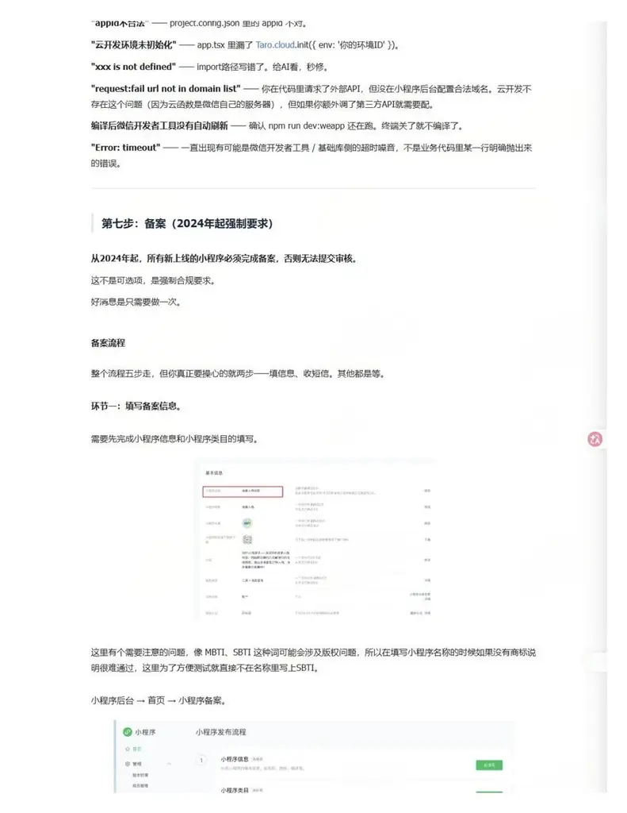

小可序备案 “fs
av

am

人              aauetr

需要填主体信息 (地区、证件、通讯地址) 、主体负责人信息、应急联系人手机号、小程序信息 (App ID自动带
入) 、服务标识等。

个人主体需要提交身份证正反面照片，小程序负责人必须是主办人本人。

十备案信息

环节二: 平台初审。
人微信平台审核你提交的信息，通常1-2个工作日。

环节三: 工信部短信核验.
初审通过后，工信部会给你的手机发一条短信验证码。24小时内必须完成验证，否则备案作废，要重新提交。
注意查收短信!

【工业和信息化部] 验证友: “四 。 您的新增备案
已提交,核验链接: be。 sw 。 目s sw 有效期1天

【工信部ICP备案】
外 系统已防止第三方应用悉意读取和使用验证码。切匆池震他人。

16:04 占 显示卡片

环节四: 通管局审核。
你所在省份的通信管理局审核。这一步时间最不可控，短的几天，长的可能两三周。耐心等。

环节五: 备案成功。

赂到和安志Th洒tn忆。 你的小得应闲FTINI下党坦证 上毕了

ProuzajmARILI， meiJranormutaLrpakcrhro se

【工业和信息化部】 尊敬的用户柯中”…，您的ICP备
案利请己运it宙核，备案/许可证编号为: 闽ICP备
有 特
此通知! 【工信部ICP备宁)

16:33 目

备案注意事项

提交前认真检查信息。
通信管理局审核比较严格，证件信息、地址、联系方式有任何不一致都可能被退回，退回后又要重新走一遍流程。
备案通过前不能提审。

也就是说，备案的时间成本你要提前算进去。我的建议是在开发初期就开始走备案流程，不要等代码写序了才想起
来。边开发边备案，并行推进。

小程序名称与备案名称要一致。
如果你备案时填的名称和后来改的小程序名称不一样，可能会出问题。

第八步: 审核上线全流程
代码写完了，本地调试没问题了，真机预览也OK了，备案也通过了。
下一步: 让全天下的微信用户都能搜到你的小程序。
上线前自检清单
提审之前，过一饥这个清单

小程序信息完整吗?
后台 一 设置 一 基本设置。名称、简介、头像、类目，都填好。

简介要具体、有描述性。

不要写"一个测试小程序"一太模糊，审核会打回来。写"基于15个维度的趣味人格测试，31道题测出你的抽象人格类
型，支持分享结果给好友"。

小程序名称不能用广义词。

"测试"工具"人格"这种太泛的词不能单独作为名称。必须有识别性，比如"趣味人格画像”抽象人格测试站 "。

隐私政策必须有。

审核必查。让 AI 帮你在小程序里加一个隐私政策页面。包含你收集了什么数据 (openid、测试结果) 、怎么使用、怎
么存储。不需要写得像律师函，但必须有。

用户隐私保护指引必须配置。

小程序后台 一> 左下角头像 一> 账号设置 一> 服务内容声明，即可找到【用户隐私保护指引】的设置入口。 (当前仅
适用于已发布上线的小程序)

你用了哪些用户信息接口，要在这里声明。不声明的话调用会直接报错。

详情可以查看:
https://developers.weixin.qq.corycommunity/develop/article/doc/0004669a488ae05beed210bca6d013

内容六本

服务类目与内容匹配。
你选的类目是"工具"，那你的小程序内容也要符合工具类的定义。不要选了"工具"但内容是电商。

功能完整，没有"测试内容"。

所有页面都能正常运行，没有白屏、没有毅渍。不要有"暂未开放"即将上线"的占位文字-一审核团队看到这种直接
拒。

没有诱导分享。 这是高压线!
"分享给好友解锁额外测试次数"这种话，绝对不能出现。分享功能可以有，但不能跟功能解锁挂钩。

页面底部不能有空白的未实现区域。

市核时会截图每个页面，看到明显的空白或未计成区域就会拒。

上传代码

回到微信开发者工具。顶部菜单 一 "上传" 一 填版本号 (比如 1.0.0) 和项目备注 一 上传。
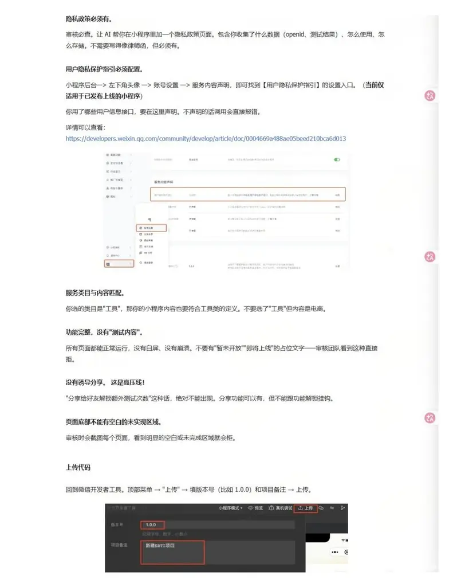

测试统计

1                      86.7%

上传完成后，代码出现在后台 一 管理 一 版本管理 一 开发版本列表里。

提交审核

版本管理页找到开发版本，点"提交审核"。填版本描述 (说清楚小程序做什么) ，如果有登录功能要提供测试账号 (云
开发+微信登录不需要) 。

[吧 ]

审核时间: 个人主体审核时间段是每天9:00-21:00，非个人主体是9:00-24:00。快的话几小时，慢的话几天。周末和
节假日会顺延。

所以别周五晚上提交审核一等到周一才有人看，浪费整个周末。

之后会收到审核结果的通知

通知中心

外了 店计中旬 上 娩坛多4企丫内大实址址图

人MYM斑订 抽家八件亿亚 TV人及全中仅纱

你的小程序"抽象人格标签"代码发布审核已通过。

被拒了怎么办? (大概率会经历)

先说结论: 被拒是正常的，不要慌。
我见过太多新手第一次被拒就觉得天塌了。拜托，被拒又不是被封号。看反馈原因，改了重新提。
一般2-3次能通过。

下面这几个被拒原因最常见:
1 “小程序功能过于简单，或属于功能不完整的DEMO”
这是新手被拒最多的原因。

解决: 确保你有首页、测试页、结果页、排行榜、我的，至少四五个页面，功能闭环。一个按钮一个页面肯定不行。
2. “缺少隐私政策/用户隐私保护指引未配置”

上面阅了，必须有。

3. "名称/简介/Logo与内容不符"

名称叫"人格测试"但简介写的是"生活工具"，不行。保持一致。Logo要清晰，不能模糊，不能包含微信/腾讯言方品牌
标识。

4 “服务类目不符"

你选了"教育"类目但做的是人格测试，类目不匹配。改成"工具"或文娱"。

5 "涉及虚拟支付未开通”

如果你做了会员功能但没开通虚拟支付(或者个人主体根本开不了) ，审核不会过。解决: 第一版先不做付费功能，纯
免费+广告。

6."内容审核风险”

SBTI的人格名称比较"抽象”(DEAD、FUCK、SHIT这些) ，可能触发内容革核。解决: 在小程序里展示时以中文名为主
( "终极摆烂者" 叛逆杂草"愤世嫉俗者') ，英文代号用小一号字体，不要作为页面主标题。

了"诱导分享/诱导关注"

重复第三遍了一一高压线。"分享后解锁"关注公众号获取额外次数"，统统不行。

8，"小程序首次登录即要求用户授权个人信息"

用户还没体验你的功能呢，你就弹窗要授权? 不行。必须让用户先能使用核心功能，需要的时候才请求授权。SBTI的
做法: 匿名就能做测试，只有保存历史记录时才需要登录。

9."存在未完成页面或测试入口”

页面里有"敬请期待"功能开发中"? 不行，删掉或者隐藏。

版本审核修改指引

1
二术枯台天四“存在个人主体小和未开才的了务类目，玉区 《隐引要人和了他车 1)

7，人29小于且用户自生生王内容 (文字二片、析/) 的记录分章，居t交-第区寻，为个人主体得天灼目
区企业主人修理-

|本目下关中

全量发布

审核通过了!
版本管理 一 审核通过的版本 一"全量发布"

3

点充这个按钮，你的小程序就正式上线了。所有微信用户，在搜索框里搜你的小程序名称，就能找到它、打开它、使用
它。

这一刻，你不再只是做了个demo。你做了一个产品。

第九步: 变现一广告 + 订阅双引擎

小程序上线了，用户开始用了。
现在，最重要的问题一钱从哪来?
两条路。可以只走一条，也可以两条都走。

路线一: 广告分成-一生着也能赚
这是最简单的变现方式。简单到什么程度?
最极端的情况下你什么代码都不用写。

开通条件

轩计独立访客 (UV) 满500，且无违规记录。
操作路径: 小程序后台 一 推广与搜索 一 流量主 一 开通。

流量主

流最变现，从未如此简单

加入站 站，人六

开通后立刻补充财务资料 (银行卡信息) ，否则后续结算会出问题。
很多人开通了流量主但忘了填财务资料，白跑了几个月才发现收入没法打款。

re

一一

分成比例 (最新)

普通小程序 (工具类、内容类) 一 广告收入的 509% 归开发者，不设上限。

创意类小程序 一 单日广告收入200万以内的部分，开发者分 70%; 超过200万的部分，分 50%。
微短剧类小程序 (满足条件的优质小程序) 一 激励后最高可享 909% 的整体分成。

结算周期: 每天上午8-10点更新前日数据，腾讯代扣个税后15个工作日内打款。

免开发智能广告接入(新手首选)

人小程序成长计划的福利之一。
开通后，系统自动分析你的小程序页面，在"合适的位置和时机 插入广告组件。
你连广告代码都不用写，微信帮你搞定。 新手不用去研究广告SDK怎么用、广告位放哪里合适，系统全自动。

欢提成为流蝇主! 送香接和模式，创建你的第一个广告位吧
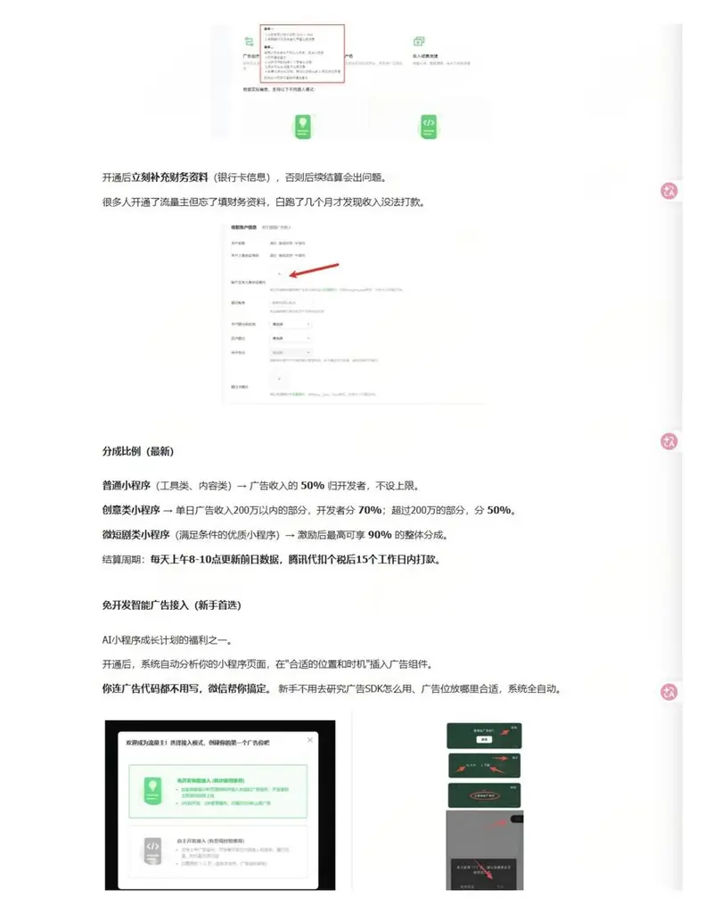

手动接入广告 (进阶)

如果你想更精确地控制广告一比如在结果页底部放一个Banner，或者在用户免费次数用充时弹激励视频广告 (看完广
告送一次免费测试) 。

你可以手动接入。
在 Taro 里用 <Ad> 组件放Banner广告，用 Taro.createRewardedVideoAd 做激励视频广告。广告位ID在后台"流量主
一 广告位管理一 新建广告位"获取。
-丁 两                                  是      1
流量主
re                 加
cc                  we           scxx         ae         ar
全 o                                as     筷
功能                                er      加)

激励视频广告是测试类小程序的最佳搭档。 "今日免费次数用完了，看个15秒视频再送你一次"一用户不反感，你有
收入，双赢。
[e= =
广告类型速览
广告类型        展示方式            适合放在哪             用户体验          收入
Banner广告      页面底部横幅       结果页底部、排行榜页底部      一般 (容易被忽略)         低
插屏广告        弹窗甘盖      页面跳转时 (测试完>结果页)     较差 (打断体验)         中
激励视频    全屏视频，用户主动触发       免费次数用完时          好 (用户自愿)          高
原生模板广告      融入内容流          排行榜列表中间           好 (不突元)           中

我的建议:
先只开免开发智能广告，跑一周看数据。然后手动加一个激励视频广告在免费次数用充的位置。其他的不急。

广告变现的真实预期

单个小程序一天赚10块?你可能觉得 就这?

但你想想。

第一，这是被动收入。
有人实测停更半年以上的小程序，广告收入依然在跑。你白天该上班上班，该摸鱼措鱼，小程序在后台默默帮你|

第二，可以亚加。
做5个、10个呢? 单个收益有波动，多个要加后更稳定。
广告分成适合批星做、快速起量。先跑通一个，然后复制模式。

路线二: 订阅币一做一个品牌化的产品

广告分成的天花板不算高。如果你想赚更多，就得走订阅制。
订阅制的好处: 你做的是一个有复购的产品，不是一次性的消耗品。

前提条件: 必须是企业主体

个人主体不能开通微信支付，也不能开通虚拟支付。

想做订阅制? 你需要:

二 注册个体工商户 〈几百块钱，各地市场监管局线上或线下办理)

2. 用个体户营业执照注册一个新的企业主体小程序 (不能升级旧的个人主体)
3. 完成微信认证 (300元/年)

4. 开通微信支付商户号

5. 在小程序后台开通虚拟支付 (支付与交易 一 虚拟支付)

虚拟支付手续费: 0.6%~19%。成长计划参与者享受优惠费率。

轿 小程序
开通条件
3
二六PAAE的(机生还)
加 支付与交易                [    (洛前其态; 企业 事业单位)
ah            1    4晨    pxs， as)
ar             E |
。 天后，开可在只有
2                     人
aa用
ia
人 的-与

epTrk阳应册人号引:3

PDTETnyYPSRSXHT

权限        免费用户         会员
每日测试次数       3次          不限
查看详细维度分析     不可用         可用
解锁隐藏人格 (DRUNK)    不可用          可用
去广告        有广告         无广告

测试结果海报      基础版     精美版 (可自定义)
历史记录        最近3次         全部

定价参考: 月卡9.9、季卡19.9、年卡39.9。

测试类小程序客单价不宜太高一这不是生产力工具，是娱乐产品。用户付费意愿不如酸音、药辑类工具强，但胜在用
户基数大、传播快。

核心设计原则: 免费额度要让用户"刚好不够用"。

太少，用户没体验感让接走了; 太多，用户没付费动力。
每天3次，刚好让你测完自己的、还想帮朋友测的时候发现不够了。
吧嘿。

两条路可以并行

最陪明的做法:

免费用户看广告 一 你赚广告费。

付费用户买会员去广告 一 你赚订阅费。

我的建议: 先只做广告，跑通全流程。 等有了用户数据，知道留存和DAU了，确认产品有价值了，再花几百块办个体
户、开新的企业主体小程序、加订阅。

不要一上来就同时搞两个一 那会分散你的注意力，而且你连产品有没有人用都还不知道。
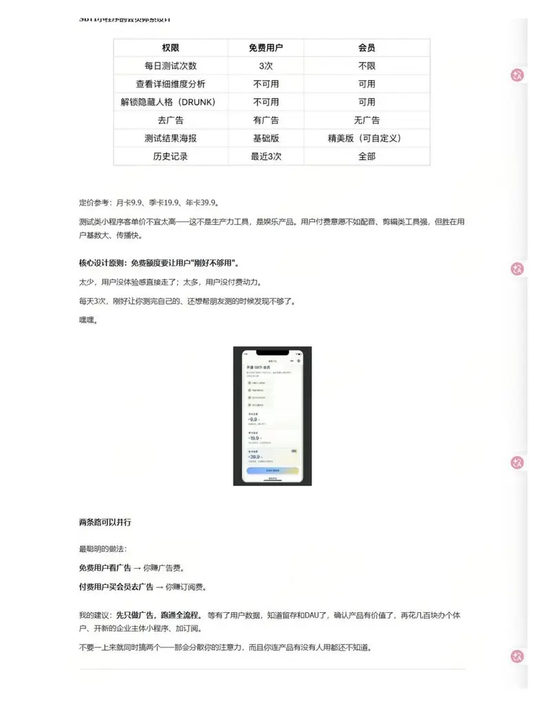

第十步: 从 SBTI 出发，做更多测试类小程序

这才是这一课最值钱的部分。

SBTI只是一个引子。

你真正学到的是一套"测试类小程序"的通用架构。
回顾一下SBTI的技术架构:

Plain Text                                                                                                           中 出

题目SON + 人格定义]SON + 计分函数 + 结果页 + 分享功能

换一套题目 ]SON，换一组结果定义 ]SON，修改一下计分函数 〈可能连计分函数都不用改，很多测试就是简单加总分
然后分段) ，你就有了一个全新的测试小程序。

让 AI 帮你出题，能做的方向多得很

CBTI (程序员人格测试) 一一 GitHub上已经有人做了开源版。"你收到一个紧急bug会怎么反应? A. 先喝杯咖啡再说
B. 立刻开terminal C. 甩锅给前端/后端"

弯爱脑指数测试 一一 15道情景题，算出恋爱脑指数0-100分。在小红书上天然有传播力。

社丽等级测评 一一 社交场景选择题，结果分成"社交达人"表面社牛"深度社恐"自闭战士"几个等级。
MBTI深度解析版 一- MBTI太泛了，做一个"MBTI在职场中的表现"细分版本。

宠物性格测试 一 让主人回答问题，测出猫/狗的性格类型。宠物内容在小红书上流量巨大。

城市契合度测试 一一"你最适合住在哪个城市? "旅行和生活方式类内容也很有传播力。

每一个，你只需要:

二. 准备一套题目]SON (让AI帮你出题，告诉它维度和评分规则)
. 准备一套结果定义]SON (让AI帮你写描述文案)

. 复用SBTI的Taro项目模板

- 改样式和文案

注册一个新小程序 (30元) ，上线

mm ah mAN

一个成熟的测试类小程序模板，加上AI帮你出题和写代码，你可以在一周之内上线一个新的测试小程序。
30块钱注册费。

第十一步: 增长一从0到 500 UV

小程序上线了，但没有人知道它的存在。
你需要让第一批用户找到你。500 UV 是第一个里程碑一达到后你可以开通流量主，开始有广告收入。

微信内的免费流量入口

小程序天然有这些免费流量渠道(App做梦都想有的) :

微信搜索 一一 用户搜"人格测试”SBTI测试”抽象人格"就可能找到你。这是长期流量来源。
首页下拉 一一 用户用过一次，下次下拉就能看到你。这就是"留存入口"。

好友分享 一 你在第五步做的分享功能，这是测试类小程序的核心增长引敬。一个用户分享，三五个好友点进来，其
中两个又分享出去 指数级增长。

公众号关联 一一 如果你有公众号，可以在文章里插入小程序卡片。如果你没有，可以考虑注册一个，发一篇介绍

章。

"发现 一 小程序"入口 一- 微信的小程序推荐页。AT 成长计划参与者有专属推荐位，优质小程序有机会被推荐。

微信搜索优化 〈小程序也有SEO)

很多人不知道小程序也有 SEO。微信搜索会通过疏虫为你的小程序页面建立索引。

几个关键优化点:

1. 每个页面设置清晰的标题。 在 app.config.ts 里，每个页面的 navigationBarTitleText 都要设置。比如首页叫"SBT]抽
象人格测试"，结果页叫"你的人格类型"，排行榜叫"27种人格类型图鉴 ".

2. sitemap-json 配置允许索引。 默认是允许的，不要改成茶止。

3. 页面内容要"可被肥取"。 微信朴虫的user-agent是 mpcrawler，场景值是 1129。如果你的页面内容是动态加载的
(比如从云数据库读取) ，忠虫可能抓不到。解决: 关键内容 (页面标题、描述文字) 尽量写死在页面里，不要全
部靠接口返回。

4. 首屏加载要快。 搜索排名因素中，用户行为 (停留时间、活跃度) 占比约30%，加载速度也是因素之一。首屏3秒
是用户去留的关键，超过3秒流失率急剧上升。用Taro的分包加载 (subPackages) 把主包控制在2MB以内。

5. 名称和简介包含核心关键词。 "抽象人格测试"比 "趣味小测试 搜索命中率高得多。

小红书引流 《最快的外部渠道)

发布小红书笔记，展示你的SBTI测试结果，引导'微信搜索 X2Q( 小程序"。

不要放小程序二维码。 小红书会限流带二维码的内容。用文字引导: “"微信搜索 「抽象人格测试」就能玩"。
标题要有吸引力。 “我测出来是DEAD型人格，感觉被扒光了"27种SBTI人格类型，你是哪种? ”

内容要有互动感。 贴上你的测试结果，问"你们测出来是什么? 评论区见"。

批量发不同人格类型的笔记。 27种人格类型 = 27篇笔记的素材。每天发一篇，一个月不重样。

测试类内容在小红书上天然适合传播 一每个人都想知道"我是什么类型"，而且测完都想晒。

空
RS           二
小程序设计/考拉甜品店 。 低预算感小程序凯烘小程序界面装修设计合
营业啦~ 和haha cake… 。 焙店的首选烘焙店… 。。 含开屏页小动画 小动

朋友图冷启动

别忘了你自己就是第一个种子用户。

发朋友图分享你做的小程序。不需要写得很正式，就说"我最近做了个SBTI测试小程序版，大家试试?“。
你微信好友里哪怕只有10%的人点进来测了，每人再分享给3个朋友一一100UV就有了。

关键心态

不要指望第一个小程序就爆。

建议规划连续完成3-5个小程序。第一个跑通全流程，第二个验证速度(一周能不能上线一个) ，第三个开始追求质量
和数据。

每周投入5-10小时兼职足够。
成功率50%的前提是一一数量够多。
2-3个月没起色? 果断放弃，做下一个。30块钱的试错成本，别舍不得。

避坑指南 (血泪经验)

选题坑

做之前先在微信里搜一下。已经有头部产品的类目不磁。 SBTI 可以做，因为它是新爆的，小程序版还很少。但手电
简、计算器、天气、记账这种一市场已经被占满了，别碰。

看时机。 测试类小程序的热度有周期性。SBTI 现在火，你做一个 SBTI 相关的正当时。等热度过了，换下一个热点
试 (总会有新的) 。核心架构不变，换一套 ]SON就行。

功能坑

一个小程序只解决一个问题。别什么功能都往里塞。 SBTI 小程序就只做人格测试，不要又做星座、又做塔罗、又做智
商测试-一那叫"测试大全"，没有人搜、没有人分享。

类目坑

个人主体可选的类目有限: 工具、教育、生活服务、体育、交通等低风险类目。电商、医疗、金融一概不行。在注册
的时候就想好你要做什么方向，因为类目选了之后再加需要审核，有些个人主体加不了。

备案坑

不要等代码写完才想起备案。

备案周期可能长达两三周 (通管局那步不可控) 。从注册小程序的第一天就开始走备案。边开发边备案，并行推进。
工信部短信验证有24小时限制。 过了就作雇重来。注意查收短信。

审核坑
审核时间: 个人主体 9:00-21:00。
别周五晚上提交一一周末没和看，浪费时间。
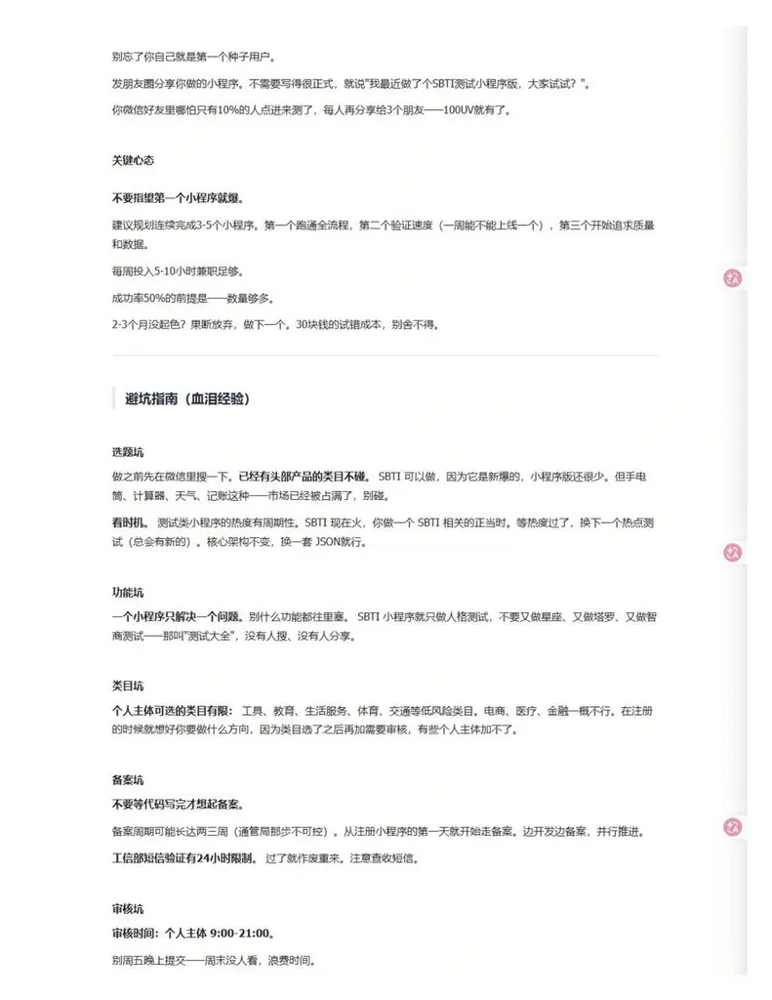

每次被拒都认真看原因。
审核反馈里会告诉你具体哪里有问题。不要瞻猜，不要不看原因就重新提交:
SBTI的敏感词问题。

同一个问题连续被拒，审核会更严。

FUCK、SHIT、DEAD这些英文代号在审核中可能被标记。解决方案: UI 上以中文名为主，英文代号缩小或只在详情页
展示。

广告坑
开通流量主后第一时间补充财务资料。 这个直接影响收入结算。别做了两个月才发现收入没法条款。

推广坑

上线不等于完成。上线之后必须主动引流。 不主动推广的小程序就像开在巷子深处的店
人买。

东西再好，没人路过就没

心态坑
最大的风险不是技术问题，不是审核被拒，而是一 想太多不动手。
先做出来，先上线。数据不好再调整，调整不了就换一个。大部分问题都可以在实践中解决。

5句话总结

1. 从扣子编程毕业了。 TRAE CN + 微信开发者工具，这才是正经做小程序的标配一你能看到AI改了什么，你有充整
的控制力。

2. 三重免费，几乎零启动成本。 微信云开发 = 免费后端，成长计划 = 免费AI + 免费流量扶持，30元注册 = 几乎堆
启动成本。

3. SBTI 只是一个引子。 你真正学到的是"题目 ]SON + 结果 ]SON + 计分函数 + 分享型变"这套测试类小程序的通用
架构-一换套题就是一个新产品。

4. 广告 + 订阅,双引擎跑。 个人主体先用广告分成跑通变现 500 UV 即可开通) ; 想做订阅就办个体户升级企业主
体。两条腿走路。

5. 小程序是需求实验，不是终身产品。 30块钱一次，做一个，不行，换一个。快速验证，快速失代，不行就换。

| 四、做个能在群里疯传的 AI 小游戏
拆解价值一个亿的羊了个羊，然后用AI做一个出来

2022年9月，你的微信群里，是不是也有人发过一张截图一

雪
什么能阻止我旺觉? 就是这
头芋1 1

也许你还记得。
那就是羊了个羊。

3 个人的初始团队，50 万启动成本，开发 3 个月。2022 年 6月上线，最开始并不算火。
直到 9 月突然爆了。

人微博话题阅读破25亿。

服务器几天之内南了六次。

其中有一次连续宕机近12个小时。

到2023年初，票计流水破亿。

怎么做到的?

先说结论:

第一，这不是运气，是设计。

第二，今天这种东西，你不天要是游戏工程师，也能做出来。

这一课，我们干三件事:

先把羊了个羊拆开，看看它到底是怎么让人上头的。
用 AI 编程工具，把一个类似玩法做出来。

把它做成微信小游戏，上架，接广告，开始跑收入。

羊了个羊为什么能让人上头

很多文章在讲《羊了个羊》的时候，最爱说四个字:
"社交传播。

社交传播是结果，不是原因。

真正的原因，是它的玩法本身，就是一个精室的心理陷阱。

游戏核心区 + 15种牌 + 7个模

羊了个羊的屏幕分两部分:
上面，是塔区。几十张卡牌一层压一层。

下面，是卡槽。总共 7 格。

你点一张牌，牌就掉进卡权。

卡模里如果凑齐 3 张同样的牌，自动消除。
7 格占满，还消不掉。

Game Over。

就这么简单。

第二关大约 45 张牌，15 种不同图案。看起来玩法简单到不能再简单。

但魔鬼藏在两个细节里。

让人上头的魔鬼细节

细节一: 牌堆是"纺锤形"。

整个牌堆是小-大-小的纺锤形。

上层牌很散，你一上来会觉得特别顺，随便点都能消。

你会误以为自己有戏。

结果打到中段，你会开始发现不对劲了。
下面那一索牌，像堵车一样，越堵越死。你每挪一张，卡槽就多占一格。但就是消不掉。

等你反应过来的时候，卡模里已经 5 张、6张了。

你闪然意识到: 充了。

注意，这种失败感不是"从一开始就没戏“，而是"差一点就赢了"。

这就是关键一 差一点比直接失败要命一百倍。
因为"差一点"会让你想再试一次

细节二: 游戏根本不验算是否有解。

这是最阴的一条。

正常的消除类游戏，后台会先验算这一局的牌到底能不能消寺，保证玩家拿到的是一个"有解"的局面。
羊了个羊不验算。

它随机生成牌面，大部分局面从开局那一刻就已经是死局。
你再聪明、再有技巧、再会用道具，都救不回来。

但玩衣不知道。玩家以为是自己苹。
大部分人感觉 我差点就过了"，其实是 我从一开始就没过关的可能"。
据统计，实际通关率大约在0.19%左右。

你想想这个设计有多政。

再配上三个上头钩子

上面两个机制是地基，上面还要盖三层楼

工 免费复活。 卡模快满了?看个15秒广告，复活一次。你的放弃成本被压到了地板。
2. 分享借道具。 每天只能用一次的道具，分享给朋友可以再得一次。你的朋友就这样被你拖下水。
3. 地区排行榜。 过关的人会为省份加分。 "河南队加油”我代表广东"一一直接给你上价值。

所以羊了个羊真正的秘密是:
一个开局就注定失败的死局，用"差一点就赢了"的错觉，让你反复打开，并主动把朋友拖进来。

当你看懂了这一层，你就不会再只盯着"游戏界面怎么好看"这些表面东西。

什么样的小游戏能在群里疯传

从羊了个羊的机制往外抽象一层，群传小游戏都有三个共同结构。

3秒上手

地铁上打开一个游戏，前3秒没让你明白怎么玩，就划走了。
羊了个羊的教学有多长? 没有。点一下就消，三张相同自动没一一个字不用读。

上手门槛每多一秒，传播效率掉一半。

结果可晒

只要结果能拿出来，就有人想晒。
过关了，想让没过的朋友服气; 没过，截个图发群里阴阳怪气，刷新了地区排行，要发群说"我代表广东"。
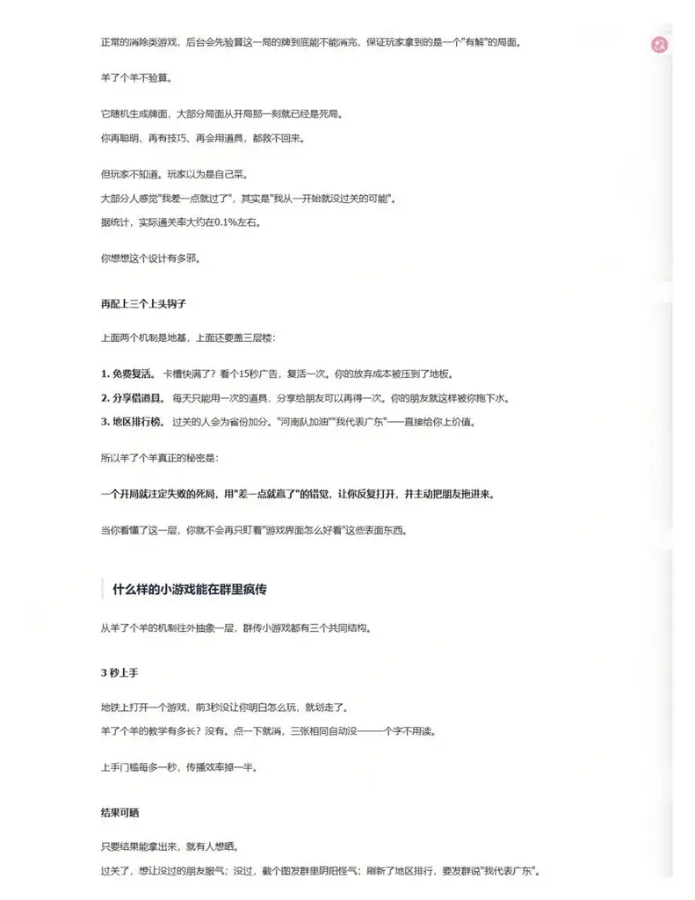

输赢都有发群的理由，才算是"结果可晒"。

"再来一次"的启动成本接近零

这是最被低估的一条。
分享卡片、群排行榜、看广告复活-这些不是装饰，是把"再来一次"这个动作的心理成本，一步步压到零。
一局30秒，死了1种就能复活，朋友一叫又能再来。这才是冯。

轻、晒、闻，三件占全，就够剧屏。

小游戏怎么赚钱

讲实操之前，这一节必须先讲。

因为赚钱方式决定游戏设计。你连广告怎么接都没想清楚，做出来的东西可能根本没地方放广告。

微信小游戏的收入，不靠卖，靠看

App 游戏的主流是内购一一你花68买皮肤、648抽卡。
微信小游戏的主流是广告变现-一 玩家一分钱不伦，你靠给玩家看广告赚钱。

特别是个人开发者 个人主体不能开通虚拟支付 〈内购) ，只有企业主体/个体工商户才行。

但广告变现，个人主体充全可以做。

三种广告位

* 激励视频 一一 玩家主动点"看视频复活"，看15-30秒，你拿一次广告费。这是大头收入。
* 插屏广告 一 游戏中弹出的半屏广告。

* Banner 一一 页面下方一条横幅。

羊了个羊爆火时有个细节值得说一它一开始只上了激励视频，没上Banner也没上插屏，就是为了用户体验。

激励视频是玩家自愿看的，eCPM 比被动广告高几倍。把体验做好，留的人多，主动看激励视频的人多，总收入反而更
高。

这是把"用户体验"和"广告收入"统一起来的设计。记住这个思路。

你能拿到多少

算账。
微信小游戏2026年分成政策:

* 普通小游戏: 开发者拿广告流水的 509%o，腾讯抽50%
* 创意小游戏: 单日广告收入200万以内的部分，开发者拿 709%; 超过200万的部分降回50%

* 首发新游激励: 可以选择【30天流水激励40%】【90天流水激励35%】两种模式。

详情可查看: https://developers.weixin.qq.cornyminigamey/introduction/commercialization/guide/ad-monetization.html

这就是小游戏赛道的逻辑一上限是流量，不是付费率。传得开，钱就来。

微信小游戏 vs 微信小程序一一先把概念搞清楚

之前我们讲了微信小程序。这一课讲的是微信小游戏。

这是两个东西。

很多新手分不清，以为小游戏就是小程序里加了个游戏。不是。它们的注册方式不同、技术栈不同、审核流程不同、变
现方式也不同。

微信小程序                   微信小游戏

注册类目         工具/文娱/教育等             游戏 (选了不可改回! )

技术栈           HTML+CSS+]S (有DOM，有页面组”Canvas/WebGL (无DOM，无BOM，一切用"画"的)
件)

开发框架                Taro / 原生WXML                        Cocos Creator / Laya / 原生Canvas

需要软著?         不需要                       选填 (特定情况必填)

审核周期          1-2周                      3-8周 (合资质审核+备案)

变现方式          广告+订阅                  广告为主 〈个人主体无内购)

AppID            独立                        独立

最关键的一条: 注册时选"游戏"类目是单向操作，不可逆。

你不能先注册一个小程序，做着做着想改成小游戏一改不了。
反过来也一样。选了游戏就是游戏，不能变回工具类小程序。

所以-一不要拿你之前的小程序账号来改。重新注册一个新的。

小程序有 DOM--一你可以写页面、按钮、列表、表单，和做网站差不多。

小游戏没有 DOM--一你只有一块 Canvas 画布。所有东西都是"画"上去的。按钮? 画出来的。文字? 画出来的。牌堆?
画出来的。

小程序 vs 小游戏 ; 两个不同世界

这就是为什么小游戏需要用游戏引擎 (Cocos Creator) ，而小程序用的是 faro/React 这种 Web 框架。

开发工具选择

游戏引擎: Cocos Creator

你可能会问: 为什么不能像做小程序那样，直接用 TRAE 写代码?

因为小游戏的世界里，一切都是 Canvas 绍
键导出微信小游戏格式.…

你需要: 场景编辑器、精灵组件、动画系统、物理引擎、资源管理、一

这些东西，写代码能做吗 能。
但用游戏引警 10 分钟搞定的事，你手写 Canvas 可能要折腾一天。

Cocos Creator 是微信小游戏生态里适配最好的引擎。

* 可视化编辑器，拖搜就能摆场景

* TypeScript开发，AI工具 (TRAE/Cursor/Claude Code) 都能辅助写

* 一键导出微信小游戏格式一一不用手动适配wx API，引擎帮你搞定

* 2026年版本已内置AI助手 (DeepSeek) ，支持自然语言生成基础游戏逻辑

* 社区生态成熟，遇到问题能搜到答案

下载安装: cocos.com 一 下载最新版。Windows和Mac都有。
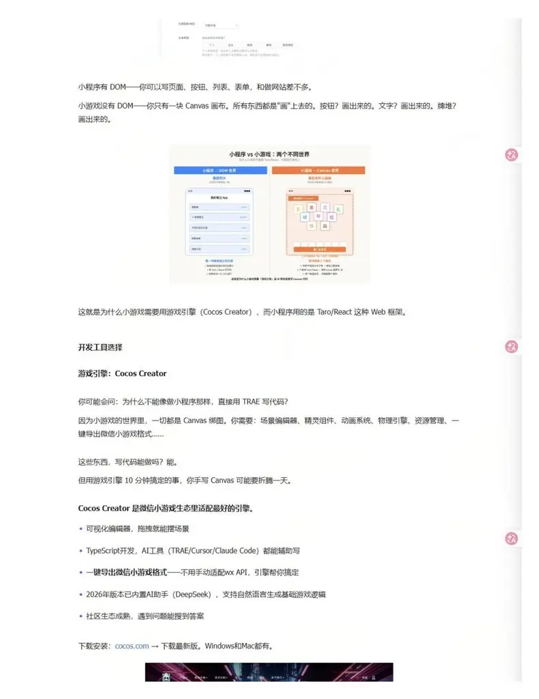

打开后安装 Cocos Creator

AI 编程工具: TRAE 或你已经在用的

Cocos Creator 负责"游戏引擎"的部分一场景搭建、资源管理、构建导出。
AI编程工具负责"写代码"的部分-游戏逻辑、计分系统、道具系统、广告接入。

用你顺手的就行。

两个工具配合: Cocos Creator 查看场景 + AI 工具写逻辑。 这是2026年做微信小游戏最高效的组合。
我这里是直接用户浏览器预览

实操

第一阶段: HTML5快速原型

为什么不直接上Cocos?

因为浏览器里调试最快。
在 Cocos Creator 里，你改一行代码，需要等编译、等预览刷新。在浏览器里，你改一行，Ctrl+R 就能看效果。

先用HTML5把玩法验证了，确认好玩了，再搬进Cocos正式做。

这一步用 TRAE 就行。不需要 Coco0s，不需要任何游戏引擎。一个 HTML 文件，浏览器打开就能玩。

三条谋讲的捍示词

三次每次给三个需求，它能做得又准又快。

第一条提示词一核心玩法跑通

Markdown                                                                    中 出
我要做一个类似《羊了个羊几的HTML5消除小游戏，单文件实现〈一个index.html里面包含HTML+CSs+]S，不依赖任何外部库) ，用浏

游戏规则:
1屏幕分上下两部分:
- 上方是塔区，多层卡牌堆倒，上层遮挡下层
- 下方是卡模，总共7个格子
.。卡牌用emoji表示，共15种不同图案
玩家点击未被攻挡的卡牌，卡牌移入卡模
. 卡楼里有3张相同图案时自动消除
- 卡槽占涤7格就Game Over，所有卡牌消完就通关
.生成45张牌，每种图案必须是3的整数信

|

这条跑充，你手上会有一个能玩的原型。不好看，但玩法通了。

第二条提示词 一加难度和魂
在刚才的游戏基础上改造:
SQL                                                                                                                                                              中 了

1 牌堆改成"纺锤形"一小-大-小结构，最上层卡片数较少，能隐约看到下层卡片的样式，中层逐渐增和多，最下层只有几张。让玩家一
2 开局屏幕正中央显示3秒钟标语:“加入羊群"，   淡出
4

- Game Over时，先让屏幕暗下来，慢慢         好可惜"，然后下面显示"再来一次"和"分享挑战给朋友"两个按钮
称已加入xx省羊群战队，当前省份排名第xxx名"省份和排名随机)
极其简单 ，牌数较少，很快能过，第二关加入难度，无法轻易通关; 但要一开始简单，玩着玩着难度逐渐加大，:

5.一共两关

第

保持单文件。css过渡动画要自然*

1 CR                让

这条的重点是加"瑰"。标语、文案、动画节奏，都是让玩家上疗的细节。

看到这条提示词的精度了吗 一一

我没写"做得好看点"，我写"Game Over时先让屏幕暗下来，慢慢浮出一行字"。

AI能做好设计的前提是，你先伐设计。

这一步可以不断测试调试合适的难度，尽量让人感觉: 快要赢了，但死了。

第三条提示词 一加成瘾钩子

在上一版基础上，加入三个成次机制 :

SQL

句
[e

个道具按扭放在卡棱上方:
牌": 重新随机分布未翻开的牌，每局限用1次
清出卡构前3张，每局限用1次
-“手回": 把最近放入卡覃的一张取回，每局限用1次
2-“"看广告复活"机制: Game Over后显示"看广告复活"按钮，点击后全屏黑屏显示"广告播放中..- (5) 《4) (3) -.…"倒计时，然乓
3. “分享挑战"按钮: 生成一张Canvasi    文案"我在《羊羊消搬坚持了xx种，你能超过我吗? "，触发浏览器下载png
4右上角显示本局用时和本地最高分

Ce                     上

三条跑完，你手上的东西已经不是"一个demo"了。发给朋友试试一-上不上头? 想不想再来一次?哪里觉得不衷?

这一步的产出是一个浏览器里能玩的原型。不是最终产品，是验证工具。

AI 做不完的三件事

我必须减实地说一 AI做不完全部。

用AI编程做小游戏，有三件事要你自己把关:

第一，玩法手感。

AI能写出"卡牌落下"这个动作，但卡牌落得多快、落下去有没有回弹、消除时有没有粒子效果一一这些"感觉对不对"，
只有你亲手玩过才知道。你是第一个玩家，也是唯一一个能判断手感的人。

第二，数值调校。

第一关多少张牌、第二关多少张、难度疏坡怎么设计一这是游戏设计的核心。AI给你一个起点，但最终调到"刚好让
人又想玩又过不了"，得你自己反复试。

第三，美术风格。

AT 给你的默认 emoji 肯定能跑，但一个爆款小游戏的视觉一定是统一的、有辨识度的。你可以让 AI 接入免费素材库，
或者后期画一套简单的 SVG 图标。

这三件事，是你的价值所在。其余的，交给AI写就行。

第二阶段: 用 Cocos Creator / Canvas API 正式开发

HTML5 验证 OK 了，玩法确认好玩了。

现在可以正式做成游戏形式。

这里有两种方法:

Cocos Creator : 整套开放式后房

Cocos，你面对的是一个装修好的开放式厨房。

场景、节点、组件、动画、资源管理、打包发布 一 一套厨具齐齐整整摆在那儿。

官方还明确支持直接构建成微信小游戏包,game.json 和 project.config.json 帮你生成,小游戏 API 也适配好了。
适合认真做一款能跑玩法复杂、后期要持续迭代、甚至要拉人一起开发的游戏一这套厨房撑得住，更健壮。

代价也摆在那儿。项目本身更重，学起来不是一下午的事，调试也比 Canvas 绕一图。你想煎个蛋，结果先要花两小时
研究怎么开油烟机。

官方文档: https://docs.cocos.com/creator/3.8/manual/zh/editopublish/publish-wechatgame.html

Canvas API : 一口锅和一把铲

微信小游戏言方直接给了 wx.createCanvas、触摸事件、存储、分享这些底层 API。你拿来,搭一套泻染循环,写一套输
入处理,几十行代码就能跑起来。

轻，直接，可控。

做 「飞机躲方块上】 「翻牌记忆」 这种小体量休闲游戏，刚刚好。代码量小，构建快，出了 bug 自己知道是哪一行。

代价是没人帮你兜底。按钮命中要自己判，动画插值要自己写，屏幕适配要自己算，状态管理要自己打。游戏一旦复杂
起来，你会开始怀念那个被你嫌重的 Cocos Creator。
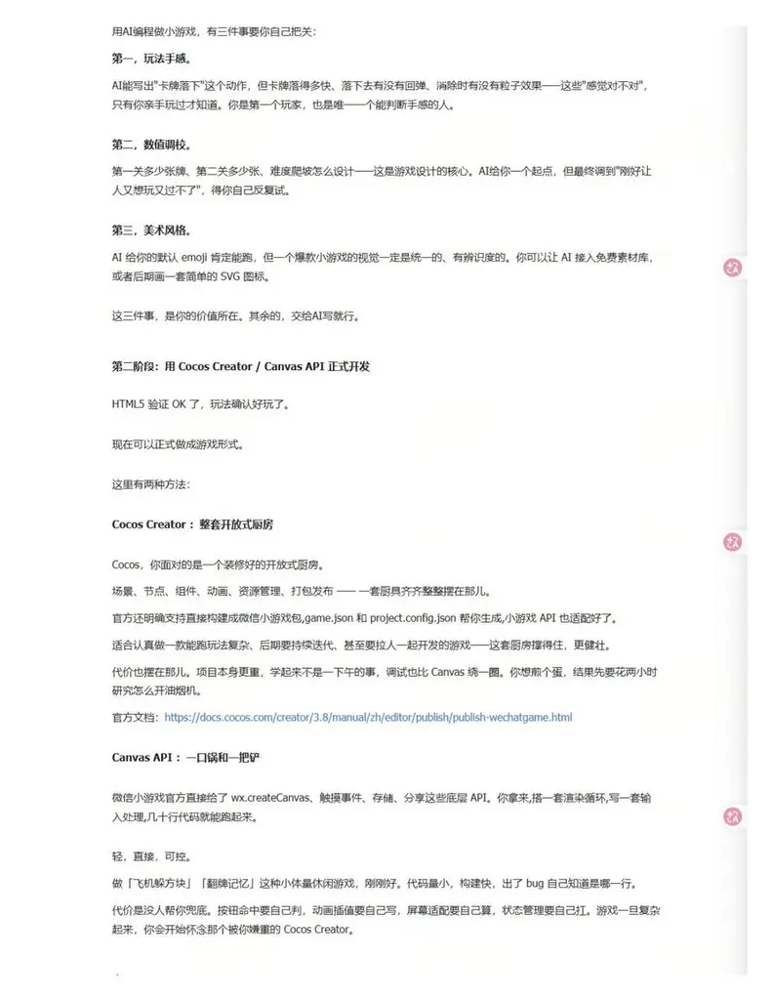

方法一: Cocos Creator

创建Cocos项目

你可以直接让 AI 把之前做的 HTML 改成 cocos 的逻辑，这里我先走完整的流程。

打开Cocos Creator 一 新建项目 一 选 2D 模板 一 项目名称"sheep-game'" 一 创建。

创建项目后进入，大概可以看到这样的界面。

* A: 层级管理器，以树状列表的形式展示场景中的所有节点和它们的层级关系，所有在 场景编辑器 中看到的内容都
可以在 层级管理器 中找到对应的节点条目，在编辑场景时这两个面板的内容会同步显示，一般我们也会同时使用这

两个面板来搭建场景。 (https://docs.cocos.com/creator/3.8/manual/zh/editoryhierarchy/)

* B: 资源管理器，显示了项目资源文件夹 (assets) 中的所有资源。这里会以树状结构显示文件夹并自动同步在操作
系统中对项目资源文件夹内容的修改。您可以将文件从项目外面直接拖搜进来，或使用某单导入资源。

(https://docs.cocos.com/creator/3.8/manual/zh/editor/assets/)

* 5: 场景编辑器，用于展示和编辑场景中可视内容的工作区域。通过在场景编辑器中搭建场景，即可获得

的场景预览。 (https://docs.cocos.com/creator/3.8/manual/zh/editor/scene/)

*。D: 动画系统，用于编辑并存储动画数据。 (https://docs.cocos.com/creator/3.8/manual/zh/animation/)

所见即所得

*。 E: 属性检查器，用于查看并编辑当前选中节点和组件属性的工作区域，这个面板会以最适合的形式展示和编辑来自

脚本定义的属性数据。 (https://docs.cocos.com/creator/3.8/manual/zh/editorinspector/)

* F: 项目预览，在场景搭建完成之后，在 Web 或原生平台预览游戏的运行效果。
(https://docs.cocos.com/creator/3.8/manual/zh/editor/preview/)

@

四

四

不需要现在就搞懂每一个面板。你只需要知道: 场景里放对象，对象上挂妓本，脚本里写膛辑。 其他的交给AI。

让 AI 帮你写 Cocos 游戏逻辑

在TRAE (或你用的AI工具) 里，把你的需求告诉AI。
这是我和 AI 讨论了几轮后的提示词，还不完美，你也可以罕试讨论后，让 AI 输出大致结构的提示词:

我要把一个已经在 HTMLS 验证过玩法的《羊了个羊》类消除游戏，重新实现为 cocos Creator 3.x + Typescript 项目。
目标不是只写几个脚本，而是要直接产出“可运行的 cocos 项目结构”;

- 打开项目后，观击“assets/scenes/main.scene”

- 直接点击运行即可玩

- 不需要我手动创建节点

- 不需要我手动拖 Inspector 引用                                                                   3
- 不依赖任何外部图片、图集、字体、pPrefab、第三方库

- 所有 UT、卡牌、按钮、遮置、弹层都用代码动态创建，或由场景自动生成

请直接在项目中创建并接好这些内容:

1 "assets/scripts/GameManager .ts

2.`assets/scripts/Cardanager.ts`
3. "assets/scripts/Slothanager.ts`
4. assets/scripts/UIManager.ts`
5 "assets/scenes/main.scene”
要求:
- "main-scene”必须已经配置好最小可运行层级
- 至少包含:
- Canvas
- BoardRoot
- `slotRoot
- "urTRoot、
- `GameController”
- 对应组件已经挂好
- 即使 Inspector 字段全空，也能靠代码自动按节点名查找并运行                                                所 ]

- 不允许需要我后续手动再建 “startPanel`、`HudPanel”、`Winpanel 、`Losepanel
- UIanager 必须能自动生成完整 UI

处理完后在 Cocos Creator 的 Assets 面板里会出现scenes和scripts文件。双击main，会在Hierarchy面板出现如图的文
件。点击页面上方的播放按钮，就能启动项目。

项目启动后，就可以看到实际页面开始测试了。

这里可以选择预览方式，浏览器、编辑器内都可以，选择你习惯的方式就行。

OO Y Current scene v 国

参'” Preview in Browser
Q@，Preview in Editor

绞 Preview in Simulator

这一版还有很多需要优化的，可以再和 AI 沟通。

之后按照同样的方式启动测试就可以了。
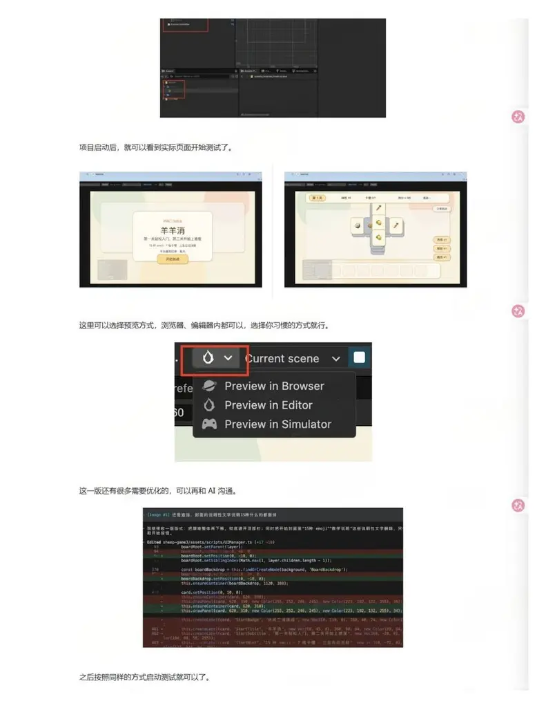

羊半消 思口

这是简单优化后的提示词，不完美，还有许多要调整，作为一个简单的参考。

我要把一个已经在 HTML5 验证过玩法的《羊了个羊少类消除游戏，重新实现为 Cocos Creator 3.x + Typescript 项目。

目标不是只写几个脚本，而是要直接产出“可运行的 Cocos 项目结构”:

- 打开项目后，双击 “assets/scenes/main.scene”

- 直接点击运行即可玩

- 不需要我手动创建节点

- 不需要我手动抱 Inspector 引用

- 不依赖任何外部图片、图集、字体、prefab 、    方库

- 所有 UI、卡牌、按钮、庶四、弹层都用代码动态创建，或由场景自动生成

请直接在项目中创建并接好这些内容:
1. "assets/scripts/GameHanager.ts`
2. "assets/scripts/Cardanager .ts`
3。 "assets/scripts/SlotManager .ts
4。`assets/scripts/UIManager .ts
5

assets/scenes/main.scene`

- ”main.scene ~    已经配置好最小可运行层级
- 至少包含:
- "Canvas、
-BoardRoot
-SlotRoot
- urRoot
- 如有需要可额外自动创建“GameplayLayer”
- `GameController”
- 对应组件已经挂好
- 即使 Inspector 字段全空，也能靠代码自动按节点名查找并运行

不允许需要我后续手动再建 “StartPanel”\、`HudPanel`” 、`MinPanel`\、`LosePanel”
必须她饭sh由中一曲 r

等效果稳定后，就可以导入微信开发者工具，进行真机预览测试。

一键导出微信小游戏

这是 Cocos Creator 自带的能力。

右上角 Build 一 平台选 "微信小游戏" 一 填入你的小游戏AppID 一 构建。

因

Cocos 会在项目目录下生成一个 build/wechatgame文件夹，其中已经包含了微信小游戏环境的配置文件: game-.json

和 project.config .json。

打开人微信开发者工具 一 小游戏一导入 一 选择项目文件来 一 你的小游戏就在模拟器里跑起来了。

项目目录选: 项目名称/build/wechatgame

昨天

加1

国 NewProject
国 sheep-game
国 sheep-game2
园 sheep-game3

国 wechatgame

会天

园 build

一
国 assets
国 library

点击 build 右下角的 Run 按钮，打开微信开发者工具。

《>

wechatgame

久

外

就能看到小游戏的运行界面了。

就这么简单。不需要手动适配wx API，不需要写adapter，不需要改DOM代码。Cocos帮你全搞定了。

羊了个半
1
四| 本于|
有
ar
仿             尽

方法二: 使用 Canvas API

句

请直接在当前项目中创建一个<可直接运行”的原生Canvas 20 + Typescript 小游戏项目，实现一个《羊了个羊》
风格的消除游戏人羊羊消几 。

最终目标:

- 启动本地和静态服务器后，访问“index.htm1l”即可直接游玩

- 不需要我手动创建任何界面、事件、引用或资源

- 除最小 HTML 外壳外，所有核心界面都必须由 Canvas API 绘制

- 不使用任何第三方库、外部图片、外部字体、远程资源

- 代码结构尽量贴近后续迁移到微信小游戏 Canvas API 的写法，避免依赖 DoM 布局 UI

六全全光半地如地可直。
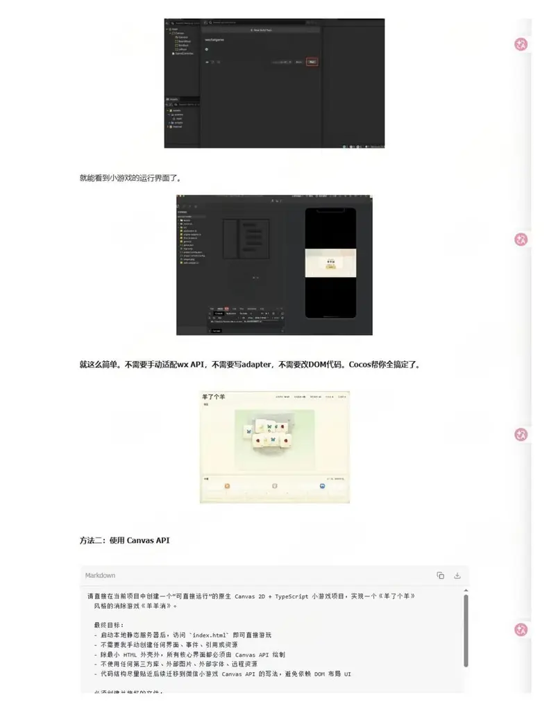

和商国风他芒灯了六末。
-index-html
- "tsconfig.json”

”src/main.ts、

- “src/Gamehanager.

”src/cardhanager ts
- 、src/slothanager.ts

”src/UTanager ts

多许额外创建最少必要文件以保证项目真正可运行例如:
- -dist/*.js
- 少时公共工具/类型文件

整 Typescript 源码

引用浏览器可直接执行的 3S，不能直接引用“ .ts

必须提供最小可运行的“tsconfig.json”

- 必须提供“dist/”下可直接运行的 5 产物

- 如果环境可用，请实际完成 TS 编译;如果不可用，也要手动补齐 ]S，保证项目直接能跑

羊了个半        re ra   ，

w园。、。。

交互确定后，准备导入人微信开发者工具，先让 AI 完成必要的配置。

请在当前项目中额外生成一个“wechat-minigame/ ”目录，作为可直接导入微信开发者工具的微信小游戏工程

要求:
- 不再使用“index.htm1l”作为入口
二

- wechat-minigame/game.js、

- wechat-minigame/game.ison”

- ”wechat-minigame/project.config.json”
- wechat-minigame/dist/*.js”或“wechat-minigame/js/*.js、
- “game.js”必须作为小游戏运行入口，直接加载编译后的主脚本，例如“require("./dist/main.js')
- 输出的 3s 必须兼容微信小游戏运行方式，模块之间不要依赖浏览器“type="module” 入口
- 游戏核心逻辑继续沿用当前 Canvas 项目，但平台层要改为微信小游戏 APIT
- 善换以下浏览器能

- Canvas 创建; "wx.createCanvas、

- 图片: -wx-createTmage、
- 输入: "wox-onTouchstart / onTouchMove / onTouchEnd / onTouchCancel
- 存储: "wx.BgetStoragesync / wx.setStorageSync~
生命周期; “wx.onshow / wx.onHide`
- 分享: wo.shareAppMessage、
-AppID: wx2667ded1296cbb2c

文件内容要求:

- “game.js` : 小游戏入口，只负责拉起主脚本

- “game.json`  : 至少包含坚屏配置和状态栏配置

- “project.config.json`: 至少包含“compileType: "game”" 、`appid 、`projectname”、`miniprogramRoot~
- "miniprogramRoot”指向当前小游戏工程根目录

- 最终结果必须是: 我可以直接把“wechat-minigame/”导入微信开发者工具运行

打开人微信开发者工具，导入wechat-minigame文件。

小游戏

《     四 >   时 ~    导wechat-minigame       2     > 搜索
| .-                   四aa
过去30天                 园 src
导 一pycache_

进入项目页面，可以继续微调，预览做真机调试。

测试一下。

接入真实广告SDK

把"异拟5秒倒计时"的假广告，蔡换成真实的微信广告:

告诉AI:

请把UIManager.ts里的模拟广告倒计时普换成微信小游戏的真实激励视频广告*
使用 wx-createRewardedvideond API。

广告位TD我会后面填入，先用占位符 “adunit-xxooooc'。

看完广告后调用 Gamenanager 的 revive() 方法复活 。

广告位ID在小游戏后台 一 流量主 一 创建广告位 获取。开通流量主的条件和小程序一样: 轩计UV满500。

这里只要著换成真实的广告位ID，就能生效了。

接入微信分享

微信小游戏的分享极其简单。告诉AIi0 上“wx.shareAppMessage`” 就行。
分享卡片标题动态生成: “我在《羊羊消》坚持了XX秒，你能超过我吗? "

用户在小游戏里点右上角"… 就能分享给好友或群到。这是你最重要的增长引擎。

发送给:
虚拟好友

我在《羊羊消》坚持了1秒，你能超过

我吗?

注意4MB包体限制

微信小游戏本地包上限 4MB。超了不让上传，也不让真机预览。

Cocos 默认构建可能超，解决方法:

图片压缩。 让AI帮你写一个构建后自动压缩图片的脚本。或者用 TinyPNG 手动压。

分包加载。 主包控制在 4MB 以内，其他资源放分包 (分包没有4MB限制，但单个分包不能超过20MB) 。Cocos的构建
面板里可以直接配置。

音效用 MP3 而不是WAV。 一个WAV音效文件可能就几百KB，换成 MP3 能压到 几十KB。

版本确定后上传到小程序后台即可。

注意事项:

选了游戏类目不可改回其他类目-一这是单向操作，不可逆。

个人主体不能上架棋牌类小游戏。 休闲、动作、竞技这些没问题。

注册完成后，后台有些小程序的功能入口会被隐藏 (比如附近的小程序、客服消息、模板消息) ，因为小游戏用不到这

些

小游戏比小程序多了一步"资质审核"。这是最大的区别。

需要提交三份材料:

* 《游戏自审自查报告》 一一 后台有模板下载。填写游戏基本信息、内容自查结果 (有没有暴力、色情、赌博等内
容) 。

*《闭作权自我声明》 一一 声明这个游戏是你原创的，不是抄的。

@

外
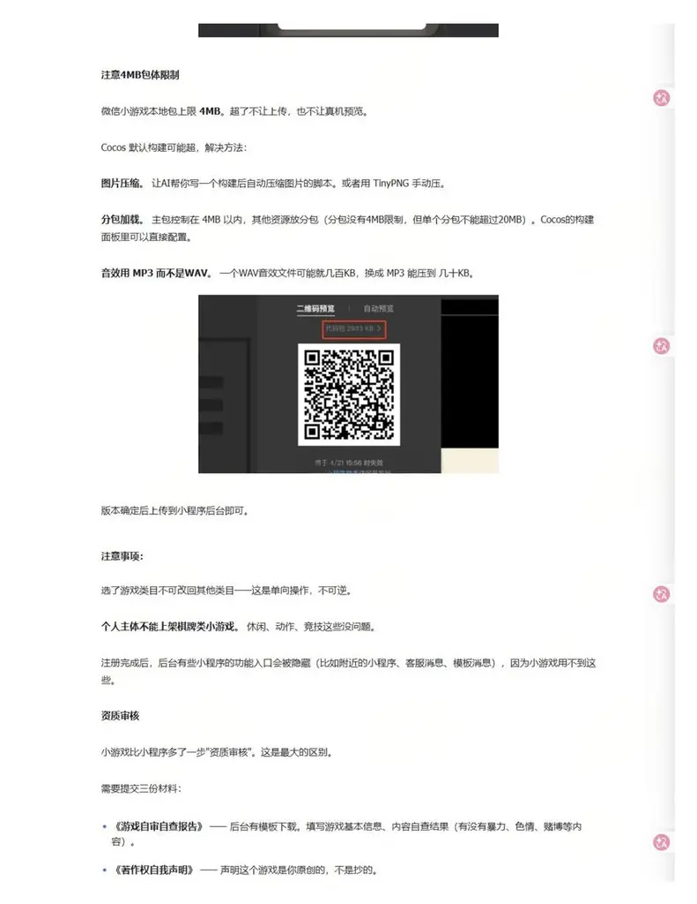

*《代备索授权书》 一一 授权微信平台代你做ICP备案。

个人主体在三份文件的落款处签名 + 控指印。
资质提交后通常24小时内处理完毕。

资质提交

请先提交材料，并在页面内选择“不同时申请支付”，详见《开发者自查指引》
该流程需时约1个工作日.
如你需要开通虚拟支付，请返回上一页选择情况一“开通虚拟支付”。

报告及承诺函

由戏自市自查报告《必款)

人
| 村|

关于软车

软若《计算机软件著作权) 不是必须的，是选填项。

但有两种情况会变成必填:
- 游戏名称含英文 (比如"Sheep Game' )
- 游戏名称含人名或特殊字样

建议: 如果你的游戏用纯中文名 (比如"羊羊消消乐) ，软著可以先不管。等你确认要长期运营了，再去申请一电子
版权认证10-15个工作日，加急最快1天，费用几百块。多一层法律保护。

备案

和小程序备案流程一样，五个环节:

填写备案信息 一 平台初市〈1-2个工作日) 一 工信部短信核验 (24小时内必须验证! ) 一 通管局审核 (7-20个工作
日) 一 备案成功。

前面的课程已经详细讲过了，这里不重复。但再强调一遍: 从注册的第一天就开始走备案，和开发并行推进。 通管局
那步时间不可控，别等代码写序了才想起来。

版本审核 + 全量发布

好消息: 资质审核提交后，不用等审核结果，就可以直接提交版本审核。 两个审核可以并行走(棋牌等特殊类目除
外) 。

版本审核和小程序类似一 上传代码、填写版本描述、等审核。
全部通过后 一 全量发布。

整个上架周期估算: 不开通虚拟支付的休闲游戏，言方预估7个步骤、13-37个工作日。加上前期的注册和准备时间，
实际从开始到上线大约 3-8周。

对，比小程序慢得多。这就是为什么"'边开发边走流程"是铁律。

从羊了个羊出发，做更多小游戏

这才是这一课最值钱的部分。

羊了个羊只是一个上。

你真正学到的是: 用AI + Cocos Creator / Canvas ApI 做任何简单休闲小游戏的能力。
回顾一下流程:

HTML5快速原型验证玩法 一 Cocos Creator正式开发 一 一键导出微信小游戏 一 接广告 一 上架
这个流程对所有休闲小游戏都适用。你只需要换一个玩法创意。

比如: #小程序://我的逆行人生/Ppbt6BgSYzkZjce

我的逆行人生 - 小游戏                     更多 》

我的逆行人生
一身黄袍骑小电驴，英雄救美解锁逆获人
生，

半生]                        局:r一>

取近葬忆

几个方向

合成类 (合成大西瓜的思路)
水果从顶部掉落，两个相同的碰在一起合成更大的。Cocos有物理引擎，圆形碰撞+合并效果开箱即用。

答题间关类

限时答题，答对加分答错扣命。和 SBTI 测试类小程序异曲同工，但包装成游戏的形式，可以加排行榜、可以加 "看广
告续命"。

骨避类 〈飞机钥方块)

微信言方教程的示例就是这个。手指左右滑动控制飞机，胃掉从天上掉下来的方块。极简，但上疗。

翻牌记忆类
翻开两张牌，如果相同就消除，不同就翻加去。记忆力挑战。极简开发，适合练手。

节卖点击类
音符从上方落下，到底线时点击。音乐节拍+点击反馈，年轻人爱玩。

地masms

每一个都是: Cocos Creator 项目 + AI写游戏逻辑 + 一键导出微信小游戏 + 接激励视频广告 + 微信分享虱变。

模板化生产。一个跑通了，后面的越做越快。

避坑指南

注册坑

游戏类目选了不可逆。 不要拿你的小程序账号改。重新注册。30元一个。
个人主体不能做棋牌类。 想做棋牌》需要企业主体+版号。别想了。
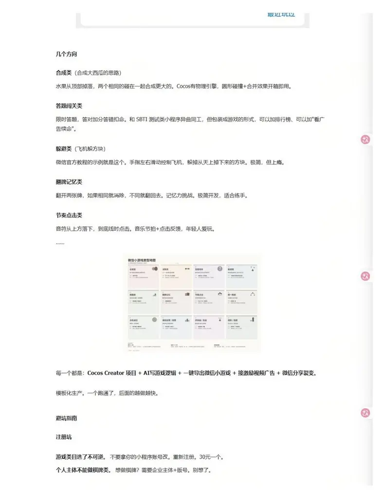

备案坑

边开发边备案。 通管局审核最长可能三周。不要代码写元了才想起来。
工信部短信验证24小时限制。 过了就作废重来。注章查收短信。

包体坑

4MB限制是硬性的。 超了不让上传。开发初期就要注意资源压缩。
图片是大头。 一张未压缩的PNG可能就几百KB。用压缩工具或者让AI帮你写自动压缩脚本。

"功能不完整"是最常见的被拒原因。 至少要有完整的游戏流程: 开始一游戏一结束一再来一次。不能只有一个半成品
界面。

敏感词问题。 游戏里的文案不要出现"赌博"抽奖”充值"等敏感词，特别是休闲游戏。
不要诱导分享。 "分享给好友解锁新关卡"一不行，高压线。分享功能可以有，但不能和游戏内容解锁挂钩。

变现坑

开通流量主后第一时间补充财务资料。 银行卡信息。不填的话收入没法打款。

激励视频广告是大头。 Banner和插屏的eCPM远低于激励视频。优先做好激励视频的触发场景设计 (复活、续命、获取
道具) ，其他广告类型可以后加。

心态坑

第一个小游戏大概率不会爆。

但你会学到完整的流程: 注册一Cocos开发一构建导出一资质审核一备案一上架一接广告一看数据。
第二个就快了。第三个更快。

做到第五个的时候，你从创意到上架可能只需要一两周。

不要在第一个上面死大。 做出来，上线，看数据，不行就做下一个。

5句话总结

1. 羊了个羊不是运气，是设计。 一个开局就是死局的游戏，用"差一点就赢了"的错觉让你反复打开。轻、晒、瘾,三
件占全就够刷屏。

2. 微信小游戏和小程序是两个东西。 注册类目不同 (游戏类目选了不可逆) 、技术栈不同 (Canvas vs DOM) 、上如
周期不同 (3-8周 vs 1-2周) 。

3. 开发流程: HTML5原型 一 Cocos Creator正式开发 一 一键导出微信小游戏。 先在浏览器里验证玩法，确认好玩
了再搬进Cocos。AI帮你写代码，你把关设计。

4 3056秆沿住在砸鱼悦美小小中生态 开败老综全分瞩约7n04。 首汶新波首1nnn下湾水不全成”个人弄败老靠广生

变现就能赚钱。
5. 小游戏也是需求实验。 30块钱一个账号，做一个不行就做下一个。第一个学流程，第五个才追求爆款。

下一间 一用4开发手抽ADp，无论是安点还是/09.

|五、用 AI 开发手机 App，无论是安卓还是 iOS
纸片人男友，怎么装进手机?

这门课走到今天，你已经做出了一个"纸片人男友"的网站。支付打通了，用户能注册能登录。

但你把链接发给朋友，朋友打开看了一眼，问了一句:
"有App吗? “

不是"有网址吗"，不是"有小程序吗"，是"\有App吗"。

这句话不是随便问的。用户心里有一杆秤一网址是"用完就走"的东西，App 是"放在我桌面上的东西"。
放在桌面上的东西，才是"我的东西"。

所以这一课，我们就来解决这个问题-一怎么把你的产品变成一个手机 App。

季学完之后，你需要掌握三件事:

1 心智模型一理解手机 App 开发有哪些路可以走，各自适合什么场景。

2. 技术选型一知道 pPWA、扣子编程-移动应用、Expo (React Native) 三条路的区别，能根据自己的需求做选
择.

3. 实操路径-一掌握用 Expo 把你已有的 Next,js 产品思路搬到手机上的完整流程，知道怎么打包、怎么上架。

手机 App 的世界，比你想的复杂一点

你可能觉得: 做个App，不就是换个壳吗?
还真不是。
手机的世界分两个阵营: 苹果的 i05 和谷歌的 Android。

两个系统互不兼容，用的编程语言不一样，开发工具不一样，上架的商店也不一样。

如果你要做一个"原生App"，理论上你得学两门语言，写两套代码，维护两个项目。
一个人维护两套代码? 想想都累，也不现实。

所以才有了"路平台方案"一 写一份代码，同时生成iD0S 和 Android 两个App。
这不是偷懒，这是聪明。
大公司都在这么干。

在所有跨平台方案里，对我们这门课的学员来说，真正值得你知道的，其实就三条路。

三条路，你选哪条?
三条路，从简单到最正式:
先给结论: 如果你只是想快速验证一下起法，PWA 就够了。如果你要做一个正经的、能上架商店的产品，用Expo。

下面一条一条讲。

最简单的路: PWA 一一2分钟让网站"假装"成 App

PWA 是什么?

PWA，全名 Progressive Web App (渐进式Web应用) 。
听起来很晓人，其实很简单:
给你现有的网站加两个配置文件，手机用户就可以把它"安装"到桌面上。

安装完之后，桌面上有图标，点开全屏显示，没有浏览器的地址栏，看起来就像一个App。
但它本质上还是一个网页。

你没有写任何新代码，没有学任何新技术，只是给网站加了一层'壳"。

怎么做?

在 Next:js 项目里，你只需要做两件事:

第一步: 创建 manifest.json 文件。

在你项目的 app 目录下，创建一个 manifest,ts (或 manifestjson) 文件。

这个文件告诉浏览器: 这个网站叫什么和名字、图标是什么、打开时用什么颜色主题。

Next.js 官方原生支持这个功能，不用装任何额外的包。

口
[e

Typescript

7/ app/manifest.ts
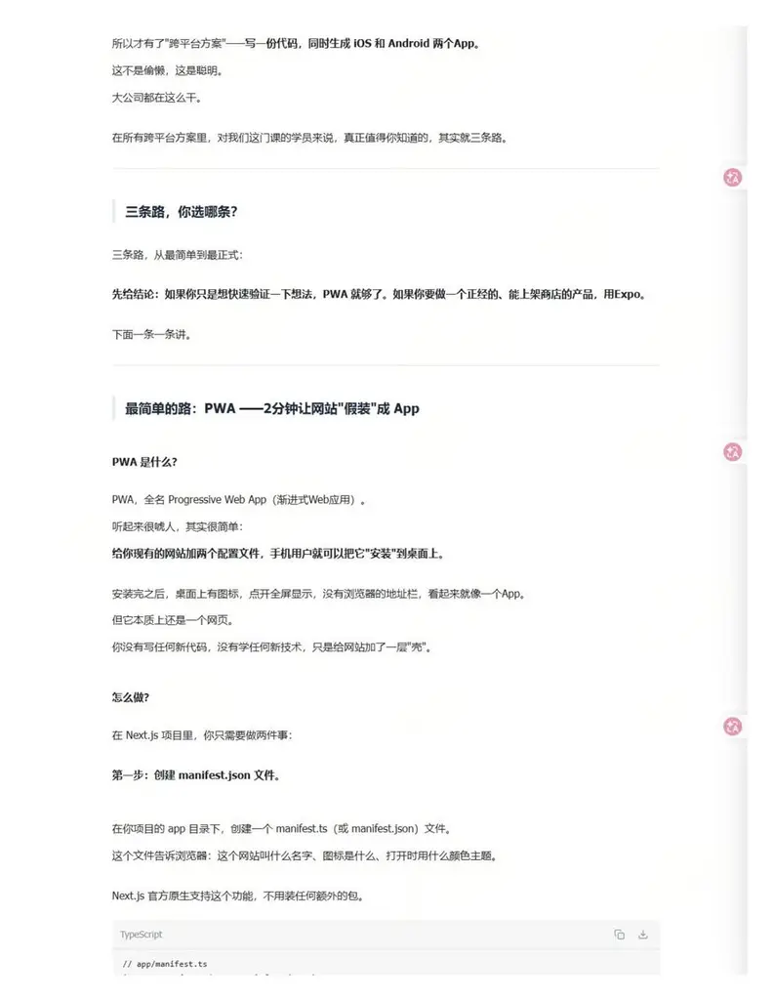

import type { MetadataRoute } from next

export default function manifest(): MetadataRoute.Manifest {

return {
nanme: “纸片人男友'，
short_name: 纸片人，，
description: ,你的专属AI男友

start_url: '/，

display: "standalone'，
background_color: '#ffffff'，
theme_color: '#6366f1'，
icons: [
{
src: /icon-192x192.png'，
sizes: "192x192，
type: 'image/png'，
让
{
src: /icon-512x512.png'，
sizes: “512x512'，
type: image/png'，
小

几个关键字段解释一下
* display: 'standalone'一一这是最关键的一行，意思是"打开时不要显示浏览器的地址栏"，这样看起来才像 App。
*，icons     你的 App 图标，需要准备两个尺寸: 192x192 和 512x512。

* theme_color一一状态栏的颜色，和你产品的主色调保持一致就行。

第二步: 准备图标文件。

在 public 文件夹下放两张图标图片。你可以用 AI 帮你生成一个 App 图标，然后裁成 192x192 和 512x512 两个尺
寸。

就这样，两步搞定。

部署到 Vercel 之后，用手机浏览器打开你的网站，浏览器会提示"添加到主屏幕"。点一下，桌面上就多了一个图标，          @
看起来就像一个真正的 App。

本
SR + 0 1

be
纸片人男友

ps ER

安装到桌面后，点开对比。

PWA 的局限

PWA好是好，但有几个硬伤:

1 不能上架 App Store 和 Google Play。用户只能通过浏览器"安装"，不能在商店里搜到你。
2. i0S 对 PWA 的支持不完整。 苹果对 PWA 一直不太积极。推送通知直到 2023 年才在 i0S 上支持，而且体验仍然
不如原生 App。

3. 没有原生能力。不能调用一些手机硬件功能，比如蓝牙、NFC。不过对于我们大多数 AI 产品来说，这些用不上。
4. 用户不知道怎么"安装"。大多数用户不知道浏览器里有个"添加到主屏幕"的功能，你需要在页面上引导他们。

所以 PWA 适合什么场景?
你想快速验证一个想法，让朋友试坛，或者做内部工具自己用。不适合当作正式产品的最终形态。

最省事的路: 扣子编程的"移动应用"

如果你用过扣子编程，你可能注意到它有一个"移动应用"功能。

扣子编程，你的 Al 开发伙伴已就位

[DC

or                             ee

人 一

这个功能让你在扣子编程里做的东西可以在手机上打开使用。
但要注意: 这不是一个真正的原生App。
它的本质是一个WebView一用一个壳包着你的网页。用户体验和pPWA差不多，都是"看起来像App的网页"。

它的定位是: 给客户或老板做演示用的。 你在扣子编程里搭了个原型，想让别人在手机上试一下体验，用这个功能很
方便。

但它有两个死穴:

1 不能提交到App Store或Google Play。 苹果和谷歌不会接受一个WebView套壳应用。
2. 自由度低。 你被限制在扣子编程的框架里，想加什么功能得看它支持不支持。

所以，扣子编程的移动应用功能 = 快速演示工具。想做正式产品，不够用。

正经做App: Expo (React Native)
好，前面两条路都是"轻量级方案"。
如果你真的想做一个能上架App Store、能被用户在商店里搜到、体验接近原生的App一Expo是你的答案。
React Native 是什么?
React Native 是 Meta (就是 Facebook 的母公司) 做的一个框架。它的核心理念很简单:
用 React 写代码，跑出来的不是网页，是原生的手机App。
你在课程里已经用React写了很多网页组件。React Native的写法几乎一样，区别只是:

你不需要学 Swift，不需要学 Kotlin，你已经会的 React + TypeScript 就够了。

Expo 又是什么?
如果说 React Native 是引擎，Expo 就是一辆装好了方向盘、座椅、轮胎的车。

React Native 本身只是一个框架，你要跑起来还得自己配很多东西一配 i05 环境、配 Android 环境、配各种原生依
藉。对于没有原生开发经验的人来说，这些配置能把你折雇到怀疑人生。

Expo 帮你把这些全搞好了。
你只管写业务代码，剩下的交给 Expo。

这就像我们之前讲Nextjs和React的关系一样: React 是核心，Nextjs 是帮你把路由、部去、SSR这些事情都打包好的
框架。

Expo 之于 React Native，就像 Next.js 之于 React。

为什么选 Expo， 不选 Flutter ?

Expo 是什么? 为什么选它不选 Flutter

Epo之于React Native, 就从Next 之于React

EC    交

四

市面上跨平台 App 框架主要有两个: Expo (React Native) 和 Flutter。
Flutter 是谷歌出的，用的是 Dart 语言。性能不错，社区也大。

但我推荐你们用 Expo，原因只有一个:
你已经会 React 了。

你学了大半个学著的 React、TypeScript、]SX、组件化思维。Expo 用的就是这一套东西。从 Next.js 切到 Expo，就是
换了一些组件名字的事，核心思路充全一样。

Flutter 呢? 你得从零开始学 Dart 语言，学 Widget 体系，学它那一套完全不同的状态管理方式。

对于我们这门课的学员来说，Expo 是走 1 步就到了，Flutter 需要走 10 步。

能省的路，为什么不省?

谁在用 Expo / React Native?
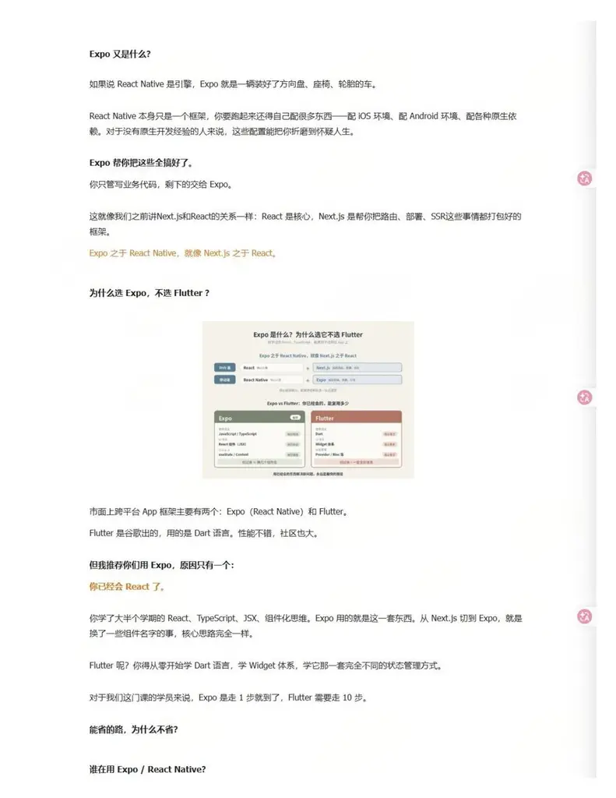

你可能会担心: Expo 靠谱吗? React Native 会不会是个小众技术?

看看谁在用:

* Discord 一一 全球知名的社交平台，iO5庙长期保持高
程师也能直接参与移动端开发，大幅提升了效率。

评价。他们的核心\05团队非常精简，React Native让Web工

* Shopify 一 全球最大的电商建站平台，2025年把整个主App迁移到了React Native，跨平台代码共享率达到86%。
。Instagram 一 Stories、Reels这些功能都是React Native写的。

* Coinbase 一一 加密货币交易App，服务上亿用户，用React Native构建。

* Walmart 一一 美国零售巨头，用React Native重写了顾客端App。

*。pinterest、Vercel的v0 App、Mistral AI App.……

使用 Expo / React Native 的 App 数量还在快速增长。

这不是小众技术，这是主流选择。

从零开始: 用 Expo 创建你的第一个手机 App

第一步: 创建项目。

打开新的空白项目，在终端运行命

npx create-expo-appBlatest paper-boyfriend-app

一个叫 paper-boyfriend-app 的项目就有了。和你之前用 create-next-app 创建 Next.js 项目一模一样的流程。

第二步: 启动开发服务器。

cd paper-boyfriend-app

npx expo start

如果扫码出现下面这种情况，可以灶试用 tunnel 的方式启动项目:

Plain Tex

npx expo start --tunnel -c

Something went wrong                                                        |

第三步: 在手机上预览。

在手机上装一个叫 Expo Go 的App (App Store 和 Google Play 都有) 。打开Expo GO，扫描终端里的二维码，你的
App 就会出现在手机上。                                                                                                                       @@
[CA

你改一行代码，手机上实时刷新。 和你在浏览器里开发网页的体验一样丝滑。这是第一次在手机上打开的界面。

第四步: 写代码。

打开项目里的 app/(tabs)/index.tsx，你会看到熟悉的 React 组件写;

TypeSscript                                                                                      癌
import { View，Text，Sstylesheet }from "react-native'

export default function Homescreen() {
return (
<view style=fstyles.container}>
<Text style={styles.title}>纸片人男友</Text>
<Text style={styles.subtitle}>你的专属AT伙伴</Text>
</view>
)
二

const styles = Stylesheet.create({
container: {
flex: 1
justifyContent: 'center'，
alignItems: "center'，
backgroundColor: '#ffffff'，
小
title:
fontsize: 28，
fontweight: “bold'，
color: 'a6366f1'，
小
subtitle: {
fontsize: 16，
color: '#666666'，
marginTop: 8，
小
J);

是不是很熟悉? View 就是 div，Text 就是 p，StyleSheet 就是CS55。你已经会了。
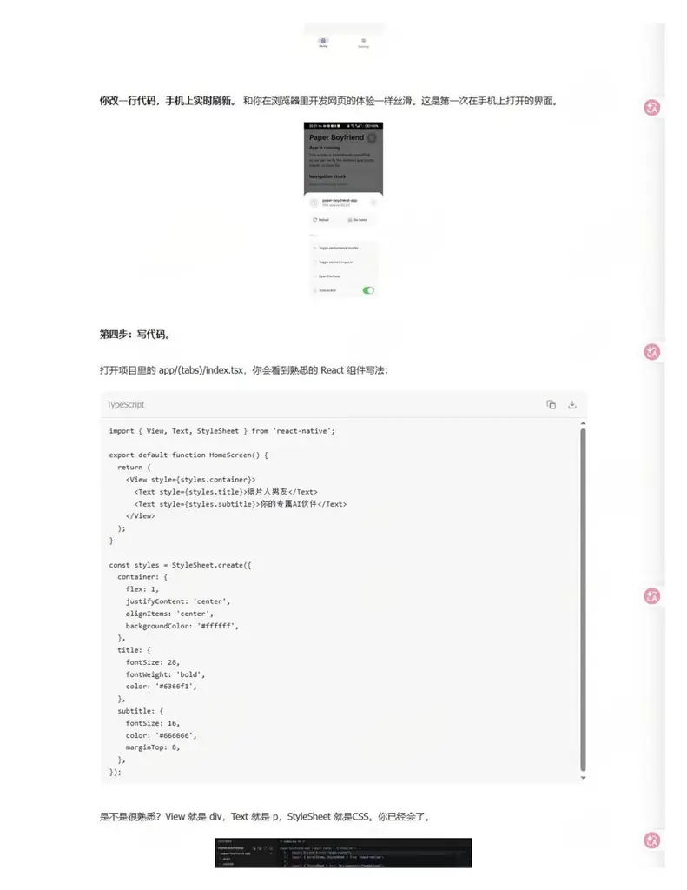

第五步: 让AI帮你写。

最酷的来了。

你在 TRAE 或者 Cursor 里，对 各 说:“帮我用 Expo 写一个聊天界面，类似微信的
友的头像和名字。"”

气泡样式，项部显示纸片人男

AI 写 Expo 代码，和写 Next,js 一样自然-一因为底层都是 React 和 TypeScript 。

你之前积票的和 AT 协作的经验，在这里完全适用。该怎么打磨功能、怎么调界面、怎么迭代-一按你熟悉的那套来就
行。

打包上架: 让你的App出现在商店里

代的与邓了。
下一步: 变成能在 App Store 和 Google play 下载安装的东西。

注册开发者账号

要上架应用商店，先得注册开发者账号:

注意: Apple是每年$99，Google是一次性$25。

如果预算有限，可以先上架 Google play 练练手。

下面的课程会先按照 Google play 来讲，感兴趣的可以研究一人Apple App Store。

以个人身份注册

用 EAS Build 打包

传统做法是: 在 Mac 上安装 Xcode 来打包 i05 应用，在电脑上安装 Android Studio 来打包 Android 应用。光是配环境
就能搞半天。

Expo 提供了一个云打包服务叫 EAS Build (Expo Application Services) 。

你不需要安装 Xcode，不需要安装 Android Studio，一行命令，云端帮你打包。

Bas

# 安装EAS命令行工具

npm install -B eas-cli

# 登录你的Expo账号

eas login

# 打包ios应用

eas build --platform ios

# 打包Android应用
eas build --platform android

打充包，你会拿到一个可以直接提交到 App Store 或 Google Play 的安装包。

EAS Build 的免费版每个月可以打包有限次数 (排队时间稍长) 。付费计划从$19/月起，打包更快。

对于刚开始的产品来说，免费计划完全够用。

打包时可以也可以在 Expo 官网上查看状

提交审核

Android - Expo 的完整流程: https://docs.expo.dev/submityandroid/
Service Account 配置专题: https://github.com/expo/fyi/blob/main/creating-google-service-account.md
iO5 - Expo 的完整流程: https://docs.expo.dev/submityios/

App Store Connect API Key 配置: https://developerapple.com/documentation/appstoreconnectapi/creating-api-keys-
forapp-store-connect-api

第一步， 在 Google Play Console 里创建应用。

打开 Google play Console，点击 Create app，填写应用名称、默认
app。

目

用类型和是否收费，然后点击 Create

Createapp

App detais

pecerauons
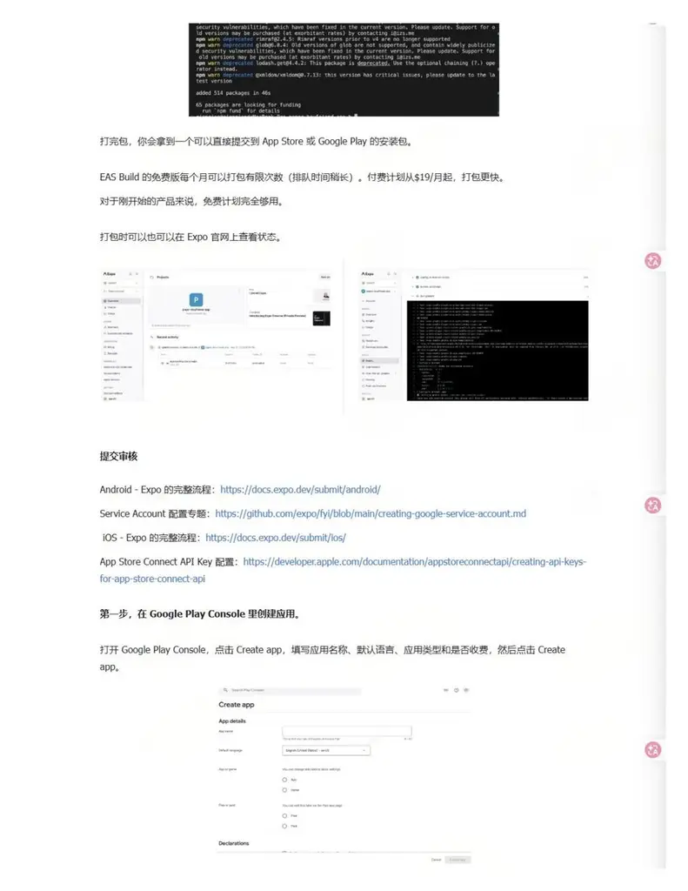

这一步的作用是先把你的 app 这子建出来，后面授权 service account 时就可以直接在 App permissions 里勾选这个
app。

第二步: 创建 Internal testing 轨道。

Android 首次提交:
先在 Play Console 网页端手动上传至少一次 .aab。常见做法是先发到 Internal testing，之后再用 eas submit。
i05:

eas submit --platform ios 会上传到 App Store Connect / TestFlight

先在 play Console 的 Dashboard 点击 View tasks 一 Create email list (创建测试者邮箱列表) 一 Create release (创建
发版桶位) 。

这一步是在 Google play 里"开通一个内部测试通道
。 JInternal testing 轨道: 告诉 play，这个 app 准备用内部          分发

。tester list: 哪些 Google 账号有资格安装这个测试版

* release: 一个发版桶位"，后面 .aab 要传到这个槽位里

三步: 从 EAS 下载 .aab，手动传上去

第一次提交 Android 应用时，先在 Google play Console 手动上传一次 .aab，这是 Google Play API 的限制。

在 EAS Dashboard 下载打包完成的 .aab 文件。

再回到 play Console 的 Test and release -> Testing -> Internal testing，点击 Upload 上传 .aab，填写 release
notes，点击 Next，最后 Save and publish。

到这里，你的 App 已经在 Internal testing 轨道上跑起来了。

第四步: 去 Google Cloud 开一把钥是

EAS Submit 本质上是一个机器人。要让它有权限操作你的 Play Console，你得给它一把钥匙。

这把钥匙叫 Service Account。

打开 Google Cloud Console，创建一个新项目，或者选一个已有项目。

点左下角这个卡片: APIs & Services，进去后点顶部的 + ENABLE APIS AND SERVICES

全welcome
wweesn ma 一
re        。
sse                       Lancono
eragenn
CT
CICEETCDRECEEE二         TY
站一一)                      aa
ucueccees
wo        四          一一
son        ee
搜索 Google play Android Developer API
coon [wm                               ayg虽ai
-      到
全多
吧 |时                                        9

点进去后按 Enable 。启用完之后，再回到刚才首页。

站coteoon [wmo                    ay+9aal

区  aogle pay Andreid pevecper apl

点IAM& Admin

= cotana [FRR      Te              ac     +496O:

全welcome

Coveran wear

进入左侧某单的 Service Accounts，点顶部 + CREATE SERVICE ACCOUNT，名字填 eas-submit 或 paper-boyfriend-
submit，先一路 Create and Continue / Done

ae   To

创建完 service account 后，点进刚创建的那个 service account 。注意，这里的 service account 邮箱，一会儿需要
用,、疗一入

|
]
4

切到 Keys 一 Add Key 一Create new key 一 ]SON 一 Create 。浏览器会自动下载一个 json 文件。
这个文件就是那把钥匙，等会儿给 eas submit 用。

第五步，在 Google play Console 里让这把钥匙开门

光有钥匙还不行。你得让 play Console 这扇门认这把钥匙。

进入 Users and permissions，点击 Invite new users，把刚才复制的 service account 邮箱粘贴进去。

切到 App permissions，选择你刚创建的 app，然后勾选上传和管理应用所需权限，最后点击 Invite user。

间多cotpmcrnnn                                         虽 日曾
下

mm

mr

|

0

一一                    可

第六步， 把 JSON key 上传到 EAsS。

钥匙也有了，门也认了。

晤后一步一一想钥是立给 FAS_
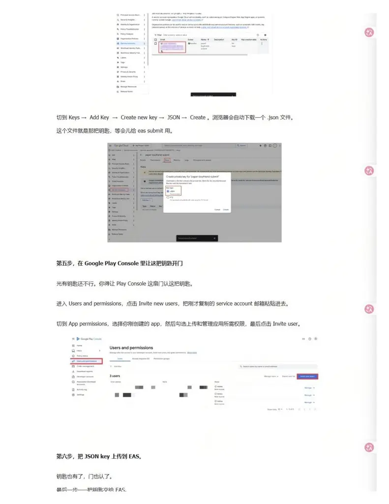

在 Service Credentials 里，找到 Add a Google Service Account Key，选择 Upload new key，上传刚才下载的 json 文
件。

到这一步，你的 EAS 已经拿到了往 Play Console 推包的权限。

首次手动上传完成后，再用 eas submit 自动提交流程。

Bash                                                                                                                                                             避

[ec

# i05 那边要醒 App Store Connect API Key
eas submit --platform ios

# 提交到Google Play
eas submit --platform android

如果你想先发到内测轨道，可以在 eas.json 里把 submit.production.android.track 设成 internal，然后运行。

期间你跑 eas submit，可能会看到:
The current user has insufficient permissions to perform the requested operation .
或者:

Please provide valid ]SON credentials.

这不是你配错了。
这是 Google 还没完全收到通知。

提交后，需要等商店审核。Apple 一般 1-3 天，Google 一般几小时到几天。

好。该说的都说了。
最后要补一刀。

如果你的 Google play Developer 账号是 2023 年 11 月 13 日之后注册的个人账号(不是 Organization 账号) ，你会
发现 Play Console 里 production 那个入口是灰的。

Google 要求所有新的个人开发者账号在申请正式上架之前，必须先完成 Closed testing一一
至少 12 个真人测试者，连续 opt-in 14 天。

一天都不能少。

任何一个人中途退出或者卸载导致掉到 12 人以下，14 天的计时会重置。

跑充 14 天之后，你才能去 Dashboard 点 Apply for Production。Google 审一下你的 Closed test 情况，一般 7 天内给
结论。通过了，Production 这个入口才会从灰的变成亮的。

常见的审核被拒原因:

* App里有郑溃或者严重 bug

* 隐私政策缺失 (Apple 要求所有 App 都要有隐私政策页面)

* App 内容太简单，苹果觉得"这个做成网页就行了，没必要是个 App”

* 内购设置不合规 (这个下一课会详细讲) 。

* 用了 AI 但没声明。 从 2025 年开始，苹果要求使用外部 AI 服务的 App 必须披尽、必须获得用户同意。这一条是新
坑，别忽视。

小技巧: 第一次提交之前，让 AI 帮你过一遍 Apple 的审核指南，把常见的坑提前避开。

本课小结

这一课我们讲了三条路:

PWA--一县快，2分钟搞定，但不是真App，不能上架商店。适合快速验证。
扣子编程"移动应用一一最省事，但只能演示，自由度低。适合给人看一眼原型。

Expo (React Native)
上架Google play。

这门课的正解。你已经会React了 ，Expo就是把React搬到手机上。能上架App Store， 能
下一课，我们讲一个绕不开的问题一
App里怎么收钱?

苹果税是怎么回事”免费App怎么靠广告赚钱? 我们会把"内购 + 广告 + 外部支付"三种变现方式讲清楚。

延伸阅读
* Expo 言方文档一Expo的官方教程，从入门到上架，写得非常详细。
*。 Nextjs PWA 官方指南一-Next js官方的PWA配置教程。
* React Native 官方文档-一想深入了解React Native底层原理的可以看这个。

*EAS Build 文档-一云打包的详细使用说明。

| 六、用户付了钱，你怎么收? App变现的三条路
本课目标

这一课只解决一件事: 你的App做出来了，怎么赚钱?

全 学完之后，你需要掌握三件事:

1 心智模型 一理解App变现的三种主要方式，知道什么场景该用哪种。
2. 关键规则一一搞清楚"苹果税"是怎么回事，哪些情况必须交，哪些可以绕开。
3. 技术路径-一知道内购用什么工具、广告用什么SDK、订阅怎么管理，能在自己的产品里落地。

先想清楚一个问题: 你卖的是什么?
在开始讲具体方案之前，你必须先回答一个问题:
你的产品卖的是"实物"还是"虚拟商品"?
这个问题非常关键，因为它直接决定了你能用什么支付方式，以及苹果和谷歌会不会从你的收入里抽成。

卖实物或线下服务
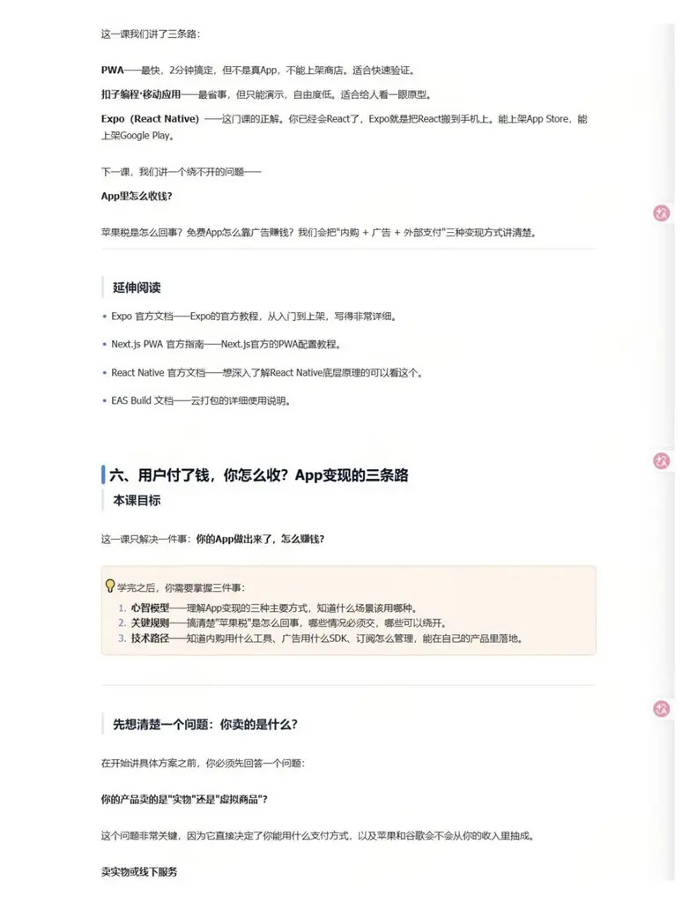

外卖App、电商App、打车App、买了实体商品奇到你家的那种。这种情况，你可以用自己的支付系统 (Stripe、支付
宝、微信支付等) ，苹果和谷歌不抽成。

卖虚拟商品或数字内容

会员订阅、人金币、解锁功能、AJ额度、去广告…只要用户花钱买到的是一个"数字的东西"，原则上必须走苹果/谷歌的
内购系统 (In-App purchase，简称IAP) 。

为什么要走内购?

因为苹果和谷歌规定: 在它们的平台上销售虚拟商品，必须用它们的支付渠道。你不走它们的渠道y审核不让过，App
直接下架。

所以我们的纸片人男友，如果要卖 "无限聊天会员"，就属于虚拟商品，必须走内购。

这就引出了一个所有App开发者又爱又恨的话题一

苹果税: 你赚100块，苹果拿走30块
"苹果税"不是正式名称，但整个行业都这么叫。
它的意思是: 你通过 App Store 内购卖出的每一笔虚拟商品，苹果抽走30%。
用户花 30 块买了你的月度会员，到你手里只有 21 块。
Google play 也一样，标准抽成也是 30%。
小开发者有优惠
好消息是，苹果和谷歌都有"小开发者优惠计划":

Apple App Store Small Business program:
https://developerapple.com/cn/app-store/smal-business-programy/

* 如果你上一年的App总收入不超过100万美元，抽成从309%降到15%
* 新开发者自动符合条件 一也就是说你刚上架的时候，就是15%

* 如果革一年收入超过了100万美元，当年剩余时间恢复30%，下一年如果又低于100万则重新回到15%

Google Play:
https://support.google.com/googleplay/android-developer/answer/16954621?hl=en
* 每年前100万美元的收入，抽成15%

* 超过100万的部分，恢复30%

对于我们来说，刚起步的时候，基本上就是15%。 等你能赚到100万美元的时候，30%的抽成也不会让你心疼了。

2025年的重大变化: 美国市场可以绕开内购了
2025年5月，美国法院做出了一个重要裁决:

在美国地区的 App Store，开发者可以在 App 内引导用户去自己的网站完成支付，苹果不得抽成。

这意味着什么?你可以在 App 里放一个按钮，写着"去官网订阅"，把用户带到你自己的网页，用 Stripe 收钱，苹果一
分钱都拿不到。

但注意: 这个政策目前只适用于美国地区。 其他国家和地区 (包括中国) ，仍然必须走内购。

如果你做的是海外产品、面向美国用户，这个政策可以帮你省很多钱。另外，苹果已就此裁决提起上诉，政策细节可能
还会变化，建议关注最新进展。

欧盟方面，由于《数字市场法》 (DMA) 的要求，苹果在EU也有了鞭代支付选项，但规则比较复杂，小开发者可以暂
时不管。

第一条路: 内购一一让用户在App里直接付费
好，扩清楚了规则，具体怎么做?

如果你要在 App 里卖虚拟商品 (会员、额度、功能解锁) ，最标准的做法是接入内购系统。

内购有哪几种?

纸片人男友最适合的模式: 自动续订订阅。
每月收费，用户不取消就一直扣。这是SaaS类产品最常见的模式。

推荐工具: RevenueCat

自己直接对接苹果和谷歌的内购 API? 技术上可以，但非常麻烦。
你需要处理收据验证、退款逻辑、订阅状态同步、跨平台用户匹配…光这些就够你折腾一个月。

所以业界有一个几乎所有独立开发者都在用的工具: RevenueCat.

RevenueCat帮你做了什么?

1. 一个 SDK 搞定 i0s + Android。 你不需要分别对接 Apple 和 Google 的支付 API，RevenueCat 帮你封装好了。

2. 收据验证。 用户说"我付过钱了"，到底是不是真的?RevenueCat帮你去苹果/谷歌的服务器验证。

3. 订阅状态管理。 用户订阅了、取消了、到期了、续费了一一所有状态变化，RevenueCat帮你跟踪。

4. 现成的付费墙 UI。 react-native-purchases-ui 这个包里有预置的付费墙组件，你在 RevenueCat 后台拖搜配置样
式，App 里直接显示，不用自己写 UL

5. 数据看板。 收入多少、转化率多少、流失率多少，RevenueCat 后台 一目了然。
RevenueCat 的免费计划支持月收入 $2,500 以下的App，对于起步阶段充全够用。

Expo + RevenueCat的集成流程

@

大致步骤如下:

第一步: 在项目里安装SDK。

注意: 这一步要在 Expo 真正的项目根目录执行，大概是这样; /文件路径/paper-boyfriend/paper-boyfriend-app

npx expo install react-native-purchases react-native-purchases-

TFTTETTTTTTTETTTTTTTTTTTTETITTTTITTETTETTTTTTTTTTTTTTTTTTTITTTT 2
nd-app
k-Pro paper-boyfriend-app % npx expo instatt react-native-purc

，Instatting 2 other packages using npm
> npm instaltt 一Save react-nativ

added 5 packages，and auditei

162 packages are Looking for funding
run >npm fund”for detaits

19       te severity vutnerabitities

To address altt issues (inctuding breaking changes)，run
npm audit fix 一force

Run “npm audit、for detaits.

第二步: 构建开发版本 development build

内购功能不能在Expo Go里测试。 你需要用 eas build 构建一个开发版本 (development build) ，安装到真机上才能
测试支付流程。

RevenueCat提供了一个Preview API Mode可以在Expo Go里模拟部分流程，但最

还是得用真机测试。

npx expo install expo-dev-client
npm install -g eas-cli

eas login

eas init

eas buil

configure
eas build --platform android --profile development
eas build --platform ios --profile development

npx expo start

这几个命令分别做的事是:

*npx expo install expo-dev-client: 给项目加上 development build 所需的 dev client

* eas login: 登录 Expo 账号

* eas init: 把当前项目绑定到 EAS

。eas build:configure: 自动生成 easjson

* eas build --platform xxx --profile development: 真正开始打 development build 包
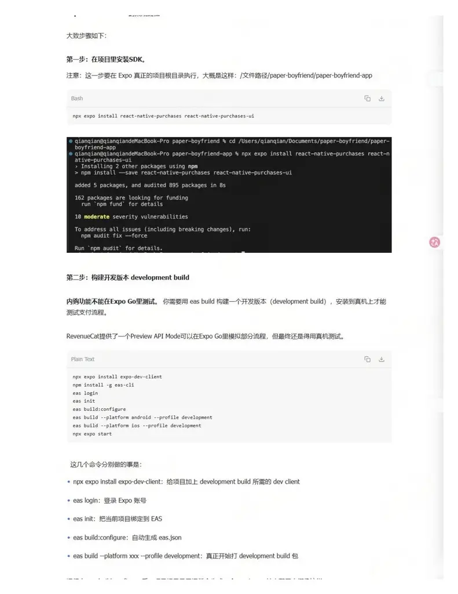

运行元 eas build:configure 后，现目根目录里通会生成一个 eas.json，窟心凯兰大横像区笠:

JSON

"build": {
"development": {
"developmentclien

"distribution":
小
“preview": {

"distribution": "internal"
让
"production": 1
】
和

第三步: 在 App Store Connect 和 Google Play Console 后台创建订阅商品
在接 RevenueCat 之前，你需要先在应用商店后台把订阅商品建好。

i0S (App Store Connect)

在 App Store Connect 里:

二 打开你的 App

2. 进入 Monetization > Subscriptions

3. 先创建 Subscription Group

4. 再在分组里创建具体的订阅商品，比如:

* 月度会员: pro_monthly

* 年度会员: pro_yearly

rretonenen

Android (Google play Console)

在 Google play Console 里:

1 打开 Monetize with play > products > Subscriptions
2. 创建一个订阅
3. 再为这个订阅创建并激活至少一个 Base plan

Subscription for gold features

Subscription derals

sp

名

[ec

所以如果你只创建了 Subscription，没有创建 Base plan，这个商品还不能真正卖。

第四步: 在 RevenueCat 后台创建项目，配置 Apple/Google 的产品。

你需要先在 App Store Connect 和 Google play Console 里创建好你的订阅产品 (比如"月度会员 $4.99") ，然后在
RevenueCat 后台关联起来。

创建一个project，连接 App Store Connect / Google play 一 把商店里的商品导入到 RevenueCat 一 创建一个
Entitlement，例如: premium，把月付、年付这些商品都挂到 premium 这个 entitement 上

et                                  罗                         oa
er
创建一个 Offering
Product catalog

offerings ”products Entilements Virtual currencies

Offerings are the selection of products that are roffered" to a customer on your paywal
Theyre an optional but recommended feature of RevenueCat that can make iteasier to change and experiment
with your paywalls，

Offerings can also be used to test different pricing combinations as variantsin an experiment Leamn more.

dentfier                                          pisplay name                                                                     Packages

了 standard                              The standard paywall offering                                      1package

在 Offering 里添加 package，比如: - $rc_monthly 或者 - $rc_annual

如果你要用 RevenueCat 官方付费墙，再创建一个 paywall 并绑定到这个 Offering

创建 paywalls

Paywalls 填

Manage Paywalls across al Apps

Paywalls are the screens that you show to your customers to completely or partialyy restrict access to your app's features.

Paywalls can also be used to test different pricing combinations as vanantsin an Experiment Learn more in our docs

Try our new Paywall Editor BEm

Buad your own fuly custom paywalls from configurable components using our
brand new Paywall Editor

RevenueCat SDK update required. Learn more

第五步: 在 App 里初始化 RevenueCat。

TypesScript

器
[e

import Purchases from “react-native-purchases'

/7 在App启动时初煌化

Purchases.configure({

apikey: “your_revenuecat_api_key ，

DJ

这里用的是 RevenueCat 的 public API key。如果你的 App 有账号系统，后面再用 Purchases.logIn(userId) 把订阅

和业务账号绑定。

Na
本                                                     [一
ee         本           Ce          和          3

Er

二                 E                          一

|

Expo 初始化文档 (https://www.revenuecat.com/docs/getting-started/installation/expo)

二止- 司一Ase赤

死人/\，厅小呈静咽。

import RevenueCatUI from "react-native-purchases-ui'3

function Paywallscreen() {
return <RevenueCatUI.Paywall />3

就这么简单。RevenueCat会自动拉取你在后台配置的产品信息
动调起苹果/谷歌的支付弹窗。

和价格，泻染成一个付费墙页面。用户点击"订阅" 自

Get Cat GPT Plus

const customerInfo = await Purchases.getCustomerInfo();

const ispremium =- customerInfo.entitlements.active['premium'] !=-= undefined;

放 (ispremium)
7A/ 付费用户: 无限聊天
} else{

免费用户: 每天3条消

"premium' 必须和 RevenueCat 后台创建的 Entitlement Identifier 完全一致
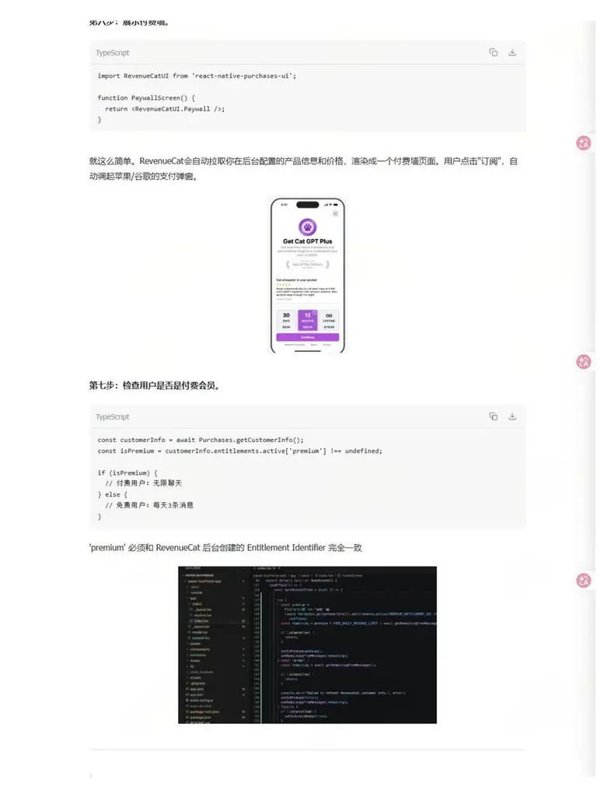

第二条路: 广告一用户不花钱，广告主花钱

不是所有用户都原意付费。
实际上，大多数用户都不愿意付费。

但免费用户也有价值一他们可以看广告。

广告变现的逻辑很简单: 你在App里展示广告，广告平台按展示次数或点击次数给你钱。用户不花钱,广告主花钱, 你
赚中间的差价。

广告的三种形式
类型                   长什么样                  用户体验           收入
Banner (横幅广告)          页面顶部或底部一条小广告        影响最小，但容易被忽略      最低
Interstitial (播屏广告)         全屏弹出覆盖整个页面       比较打扰，用户需要手动关闭     中等
Rewarded Video (激励视频) 。 用户主动选择看一段视频广告，换取奖励 。 体验最好，因为用户是自愿的     最高

对于我们的产品，最推荐的是激励视频。

为什么?因为用户是自己选择看广告的，不会觉得被打扰。而且激励视频的收入是最高的一在美国市场，一次激励视
频展示的收入大约是$0.01-$0.03 (即eCPM约$10-$30) 。模幅广告可能只有这个的十分之一。

纸片人男友的广告方案

具体怎么在纸片人男友里用广告?
免费用户每天可以免费聊3条消息。用完了，弹出一个提示: "今日免费次数已用完。看-一段30秒视频，可以额外聊5

条 ，
条。

用户点击"看视频"一 播放一段广告 一 看充 一 奖励5条消息。

这个体验是流畅的。用户有选择权: 不想看广告就明天再来，或者直接升级付费会员。

推荐工具: Google AdMob

移动端广告平台的绝对需主是 Google AdMob。在React Native / Expo里，使用 react-native-google-mobile-ads 这个
库来集成。

第一步: 注册Google AdMob账号，创建广告单元。

去 admob.google.com 注册，创建一个App

mm

注意包名的格式规范

人

创建完 App 后回到页面，点击 Add ad unit

你会得到一个广告单元ID。

npx expo install react-native-Boogle-mobile-ads expo-build-properties

ianqian@qianqiandeMacBook-Pro paper-boyfriend-app % npx expo instatL react-~nati

expo-buitd-properties

Instatting 1 SDK 55.0.9 compatibte native modute and 1 other package using npm

> npm instatt 一Save react-native-googte-mobite-ads

d audited 994 packages in 18s

162 packages are Looking for funding

run "npm fund”for detaits

erity vutnerabititi

To address att issues (inctuding breaking changes)，run;

npm audit fix 一force

Run "npm audit”for detaits。
Added config ptLugins: react-native-googte-mobite-ads，

第三步: 配置app.json。

"expo": {
"plugins": [
[
"react-native-google-maobile-ads"，
"androidAppId": "ca-app-pub-xxooooooevyyyyyyyy"，
"iosappTd": "ca-app-pub-xoooooooevz
]
]

这里的App ID是你在AdMob后台创建App时拿到的。

po-buitd-properties

googte-mobite-ad
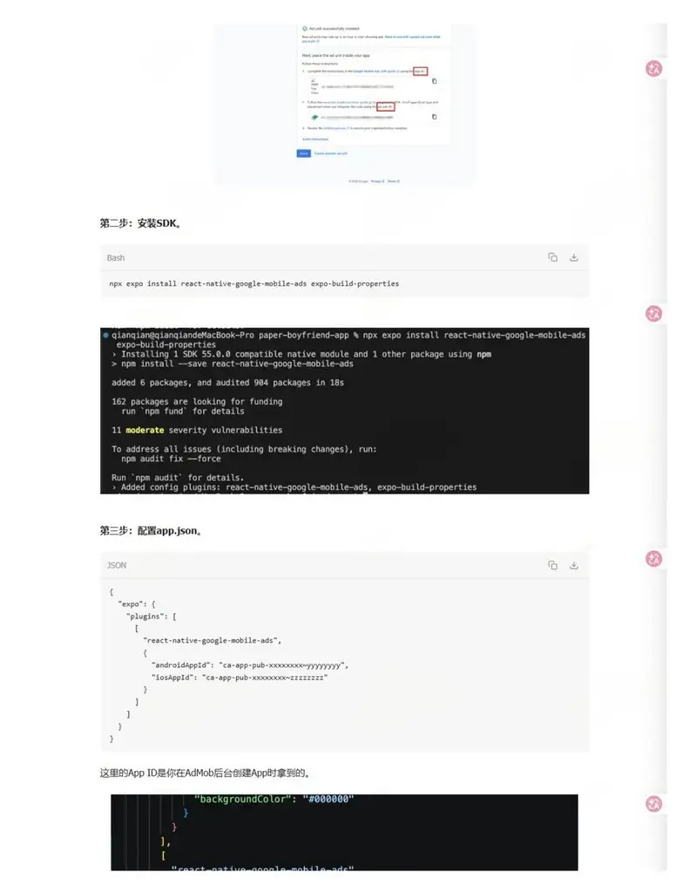

"expo-buitd-properties”

第四步: 重新构建 development build

npx expo install expo-dev-client

npx eas build --profile development --platform android
npx eas build --profile development --platform ios
nmpx expo start

运行后可以在手机上下载纸片人男友的App，扫描二维码连接

第五步: App 启动时初始化 Google Mobile Ads SDK

这一步你现在还没写，建议补上。官方建议在应用启动时初始化一次

import { useEffect }》from “react'

import mobileads from 'react-native-google-mobile-ads';

export default function App() {

useEffect(() => 1

mobileAds() .initialize();
)，[]);

return nul13

第六步: 展示激励视频
大致流程是

1. 先创建广告实例
2. 监听 LOADED 事件

3. 广告加载完成后，再让用户点击按钮去展示
4. 用户看完后，在 EARNED_REWARD 里发奖励

2. 上 言大团后冉坑员轨下一祭

代码大体可以参考:

器

TypeSscript
import { Rewardedad，RewardedadEventType，TestIds }》from "react-native-google-mobile-ads'3

7/ 开发时用测试TD，上线时换成真实ID
const adUnitId = DEV_， ?TestIds.REWMARDED : “ca-app-pub-你的真实广告单元1D';

const rewarded = Rewardedad.createForAdRequest(adUnitId)3

7/ 加载广告
rewarded.load();

7/ 监听广告事件
rewarded-addadEventListener(RewardedadEventType.EARNED_REMARD，(reward) =>
7/ 用户看完了广告，发放站励
grantExtraMessages(5); // 奖励5条消息
])3

7/ 展示广告
rewarded.show();

重要提醒: 开发期间一定要用测试广告ID。 代码里用 TestIds.REWARDED 就行，上线前再换成真实ID。

第三条路: 外部支付一把用户引到网页付费

这条路适合一种特定场景: 你的主要用户在美国，你想绕开苹果税。
前面提到了，2025年5月之后，美国地区的App可以引导用户去网站支付。

具体做法:

二 在你的 Next.js 网站上，用 Stripe 做一个订阅支付页面

2. 在 App 里放一个按钮: "去官网订阅，更优惠"

3. 用户点击后，打开手机浏览器，跳转到你的支付页面

4. 用户在网页上完成支付，Stripe 通过 Webhook 通知你的后端
5后端更新用户的会员状态，App 里自动生效

[ec

六种轧忒，平涂个抽。体只让宪人 >0Ipe 风于琪次 【天色L人.3 + 币.世1/笔)】 ，比平水册129o-JUYo使有大区丁。

但注意几个坑:

* 只适用于美国用户。 其他地区的用户仍然必须走内购。你可能需要根据用户所在地区显示不同的付费入口。

* 不能在App里直接嵌入网页支付。 必须是跳转到外部浏览器打开你的网站。

* 用户体验不如内购丝滑。 内购是在App里弹一个窗就完成了，外部支付要跳出App、打开浏览器、输入信息.……步骤
多了，转化率会低 一些。

所以，外部支付是"省钱"和"体验"之各的权衡。

如果你的用户主要在美国，可以考虑同时提供两种入口: App 内订阅 (方便但有抽成) 和网页订阅 (便宜但步骤
多) ，让用户自己选。

纸片人男友的完整变现方案

说了三条路，落地到纸片人男友身上，怎么设计?
我给你一个三层模型':

第一层: 免费+三告

所有用户注册即可免费使用。每天3条免费消息。页面底部一条横幅广告 (Banner) 。
消息用充了? 看一条激励视频，奖励5条额外消息。

这一层的目的: 让用户零门槛体验产品，同时通过广告赚一点基础收入。

第二层: 月度会员
$4.99/月(或国内定价25元/月) 。权益:
* 无限消息

。*无广告

* 解锁更多人设 〈"需道总裁" 温柔学长"毒舌损友

走内购，用RevenueCat管理订阅。
这一层是主要收入来源。

第三层: 额外付费项 (可选)
消耗型内购。比如:

* 花6元让男友"|

幅画"送给你 〈调用AI图片生成)
* 论3元解锁一个限定节日人设
这种"小额高频 的消费，是锦上添花。

at十
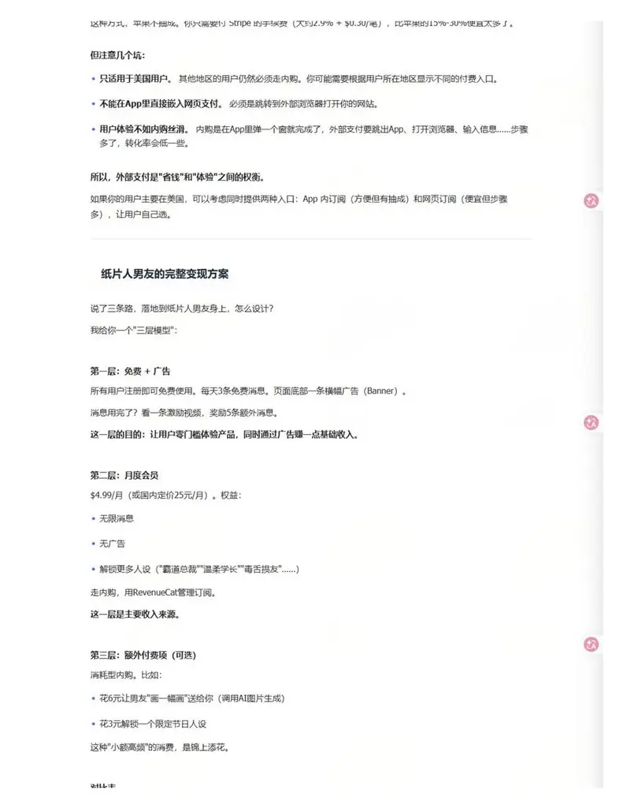

站Lu

免费用户                          月度会员                 额外付费

聊天次数         3条/天 + 看广告换额外              无限                  E
广告                        有                           无                    一
人设                                     默认1个                                     全部解锁                       限定人设
付费方式                     一                   自动续订 $4.99/月       消耗型内购

这就是一个完整的、分层的变现模型。免费层拉新，广告层保底，订阅层赚钱，消耗层增收。

三条路怎么选?一张决策图

最后总结一下，把三条变现路径理清楚:

你的产品卖的是什么?

一实物 / 线下服务 一 自有支付 (Stripe、支付宝等) ，不走内购，无抽成。
一 虚拟商品 / 数字内容 一

* 目标用户在美国?一 可以考虑外部支付 (引导去网页，用Stripe) ，无抽成。

* 目标用户不在美国，或你想要最流畅的体验? 一 内购 (RevenueCat) ，蔷果/谷歌抽15%-30%。

你的产品想免费提供?
一 免费 + 广告 (AdMob) ，用激励视频变现。

最优解: 大多数情况下，三条路不是互斥的，是组合使用的。 就像纸片人男友的"三层模型"一免费+广告+订阅+消
耗型内购，四种方式到在一起，覆盖所有类型的用户。

本课小结

这一课我们讲了App变现的三条路:

内购一一卖虚拟商品的标准方式。苹果税309% (小开发者15%) ，用RevenueCat管理订阅和权限，Expo用 reac-
native-purchases 集成。

广告 一免费用户的变现方式。Google AdMob是最主流的平台，激励视频收入最高、体验最好，用 reactnative-
google-mobile-ads 集成。

外部支付
如内购丝滑。

2025年美国新政后的选项。引导用户去网页用Stripe付费，绕开苹果税。但只适用于美国用户，且体验不

最实用的策略是三条路组合使用: 免费层+广告保旗+订阅赚钱+消耗型增收。

下一课，我们来进一个不一样的话题-一微信小程序。和App不同，小程序有自己的一套生态和规则，做法完全不一
样。

延伸阅读
* RevenueCat + Expo 官方教程一 Expo官方写的RevenueCat集成教程。
*， Apple App Store Small Business program-一苹果小企业优惠计划的官方说明。
*。 Google play 费率说明- Google play的服务费详细规则。
* reactnative-google-mobile-ads 文档一AdMob在React Native里的言方集成文档。

*。 RevenueCat 文档-一RevenueCat的Expo安装指南。

| 七、用AI开发桌面应用，无论是Windows还是Mac
纸片人男友，需要一个"工位"

你的纸片人男友已经有了网页版，有了手机App。
但你有没有想过，用户最需要陪伴的时刻是什么时候?

不是躺在床上刷手机的时候。
是上班的时候。
对着电脑写文档、做表格、开会、被老板号充之后一想跟纸片人男友吐横两句。

打开浏览器 拜托，浏览器上有20个标签页，纸片人男友淹没在一堆工作标签里，随时可能被你一个手村给关了。
用户真正起要的是: 桌面上趴着一个小宗伙，随时能聊，不会被济没，不会被误关。
这就是桌面应用的场景。

然后你可能会想: 桌面应用? 那不是得学C++或者]ava?
嘿嘿，告诉你一个秘室-一

你每天用的Cursor、Notion、slack、Figma、Discord、ChatGPT卓面版….

全都是用网页技术做的。

不是C++，不是]ava，就是你已经会的HTML、CSS、]JavaScript、React。
没骗你。句号。

这一课只解决一件事: 把你的产品变成一个桌面应用，让用户双击图标就能打开。

名 学半之后，你需要掌握三件事:
1. 心智模型一理解桌面应用开发有哪些路可以走，为什么 Electron 是当下最主流的选择。
2. 技术实操一一能用 Electron + React 创建一个桌面应用，打包成 .dmg (Mac) 和 .exe (Windows) ，让用户
下载安装。
3. 商业化路径-一知道桌面应用怎么做登录和收费，以及怎么利用开源项目快速起步。

好消息: 桌面应用比手机App简单得多
上一课我们潮了手机 App 的各种坑一要上架 App Store、要交苹果税、要等审核、要被苹果区爸拿捍。

桌面应用呢?
这些坑全都没有。

做好了，放在自己的网站上，用户点"Download 下载，双击安装。

搞定。

没有中间商赚差价。没有平台苞爸审你。

你对自己的产品有 1009% 的控制权。 这也是为什么很多独立开发者特别喜欢做桌面应用。
三条路，老规矩

和手机App一样，桌面应用也有几条路。先看对比表，再挑:

结论先给: 主推 Electron。

理由? 往下看。

PWA 桌面版: 两句话说完
你在前面的课程已经学过 PWA 了。其实 Chrome 浏览器也支持把 PWA "安装"到电脑卓面上。

你的纸片人男友项目之前已经配置过 PWA 所需的 manifest 和图标文件，所以这一步不需要重新编写。

PWA 安装时，浏览器读取的是同一套 manifest 配置。无论是在手机上"添加到主屏幕"，还是在电脑 Chrome 里 "安装到
桌面"，本质上都会读取应用名称、启动地址、显示模式和图标等信息，Chrome 安装 PWA 时会直接使用这些配置

用 Chrome 打开你的网站 一 地址栏右边有个"安装 图标 一 点一下 一 桌面上就多了一个图标。

一

但这本质还是网页一没有系统托盘图标，不能开机自启，不能悬浮置顶。

快速验证想法可以用，正式做产品不够。往下看.

Electron: 你已经会了，只是你不知道

它到底是什么?

一句话_
Electron = Chrome浏览器 + Node.js，打包成一个桌面应用。
就这么简单。

你写的还是网页 (HTML + CSS + JavaScript / React) ，只不过它不跑在浏览器标签页里，而是跑在一个独立的桌面窗
口里。

但这个窗口比浏览器牛多了一一它可以:
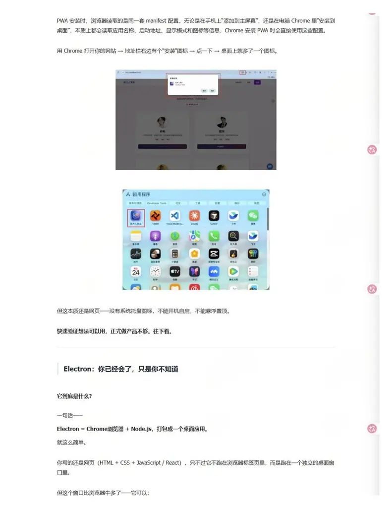

* 没有地址栏、没有标签栏，看起来就像"正经软件”

* 读写用户电脑上的文件

* 显示系统通知 (那种右上角弹出来的)

* 在系统托盘放一个小图标 (Mac 菜单栏 / Windows 任务栏右下角)
* 注册全局快捷键 (在任何应用里按 Ctrl+Shift+B 就能唤起)

* 开机自启动

* 常驻后台运行

这些事情，网页做不到，PWA 也做不到。只有桌面应用能做。

谁在用? 你自己就在用

这个列表，你看了可能会惊讶:

产品       你用来干什么          付费模式
Cursor        Al编程         $20/月，网站支付
ChatGPT桌面版    和Al聊天       Plus $20/月，网站支付
Notion      笔记、知识库      Plus $10/月，网站支付
Slack       团队沟通      Pro $7.25/月，网站支付
Figma          UI设计      Professional $15/月，网站支付
Discord      社群聊天      Nitro $9.99/月，网站支付
Linear       项目管理        $8/月，网站支付

全是Electron。全是网页技术。全是你已经会的那些东西。

对了，注意看最后一列-一所有产品的付费都是在网站上完成的，不是在桌面App里。
这个模式非常重要，后面单独讲。

你可能会想: 都是纸片人男友，我能不能把网页端的和卓面庙的放在一个项目里，用一套代码来写?

这两个东西可以是同一个产品，但不一定要是同一个项目。

为什么我建议分开?

因为 Next.js 更像"网站系统"。它天生适合    、会员、支付、数据库这些东西。Electron 更像 "桌面壳"，它的窗口
只是一个本地 Chromium 页面，天生适合做电脑上的窗口、通知、托盘、快捷键这些东西。如果你把 Next'js 页面直接
打成静态文件放进 Electron，很多东西会失效。

如果你硬要把 Next.js 整个塞进 Electron 里，也不是不行，但会变麻烦。因为本地 HTML 没有 Next.js 服务端。

这些问题也都能解决，但对新手来说，真不划算。

更简单、也更真实的做法是:

网站继续做网站，桌面端继续做桌面端。两边用 deep link + API 连起来。

用户在桌面端

“，桌面端打开浏览器，让用户去网站登录。
登录成功了，网站告诉桌面端:“这个人我验过了，这是他的凭证。 "然后桌面端拿着这个凭证，去请求网站的接口。

这样分工就很清楚了:

唯一的"缺点"”

公平起见说一个: 打包体积大。

Electron 要把整个 Chrome 浏览器打包进去，所以一个最简单的 Electron 应用也有 100MB 以上。

但说实话一2026 年了，谁的电脑硬盘不是 256GB 起步? Notion、Slack、Discord 都是 100MB+。有人因为体积大不
用它们吗?

没有。

体积大是技术层面的"不完美"，但不是商业层面的问题。用户根本不 care。
如果你真的非常在意体积，可以了解一下 Tauri (后面会提) ，但对于我们来说，Electron 更务实。

动手! 从零创建你的第一个桌面应用

创建项目
我们用 electron-vite 这个脚手架。它帮你把 Electron + Vite + React + TypeScript 全配好了，开箱即用。

npm create Bquick-start/electron@latest paper-boyfriend-desktop

运行后它会问你两个问题: 框架选 React，TypeScript选 Yes。
anqian@qianqiandeMacBook-Pro 纸片/    未面 sn      @quickrstart
desktop

npx
te-etectron” paper-boyfriend-desktop，

Target directory "paper-boyfriend-desktop”is not empty，Remove existing fites and continue? .yes
k

Setect a framewor
Add Typescript? -No

Add ELectron updater pLugin? - No
Enabte ELectron downtoad mirror proxy?

affotuding projec   /       q              4/     面/paper-boyfriend-deskto

。Now run

npm instat1
FUn 过

然后:

cd paper-boyfriend-desktop
npm install
npm run dev

一个桌面窗口就弹出来了。

对，就这么快。

Buid an Electron app with

项目结构-一别怕，其实你都认识

paper-boyfriend-desktop/

上 src/
上 main/        + 主进程 《Node.js环境，管窗口》
| ”一 index.ts
广 preload/      * 预加载脚本〈桥接主进程和泻染进程)
TEA
[一 renderer/     + 泻染进程〈《React代码，管UI)
上 srey
[人
| “一 main.tsx

[一 index.html
| electron.vite.config.ts

[一 package.json

这里有一个新概念: Electron有两个"进程"。

* 主进程 (main) 一一
它想象成"后台管家".。

在 Node.js 环境里，负责创建窗口、管理系统托盘、读写文件、调用操作系统功能。你把

泻染进程 (renderer) 一一就是你的 React 应用，负责页面长什么样、用户点了什么按钮。就是"前台界面"。
还记得我们最开始讲的前端和后端吗?

主讲程 = 后庙. 演染讲程 = 前庙-
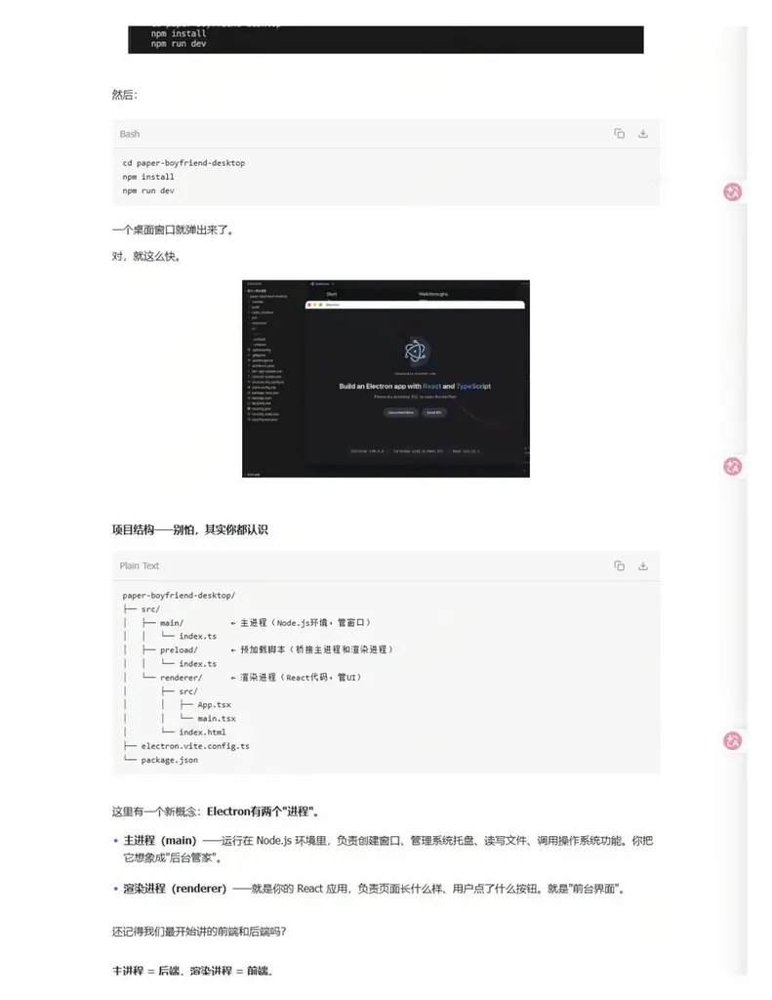

只不过这次它们都跑在用户的电脑上，不是跑在服务器和浏览器上。
同一个概念，换了个地方用而已。

一次点击，主进程和泻染进程怎么配合?

|
|
|
|
|

写你的第一个界面
打开 src/renderer/src/App.tsx，把默认内容革换成纸片人男友的聊天界面:

Typescript

癌

import { usestate } from "react'

function App() {
const [messages，setMessages] = usestate([
{ role: 'boyfriend'，text: '工作辛苦了，想我了吗? 图' }
])

const [input，setInput] = usestate(…)

const sendMessage - () ->{
if (linput.trim()) return
sethessages([...messages，{ role: "user'，text: input ]])
setInput(…)
/7/ Topo: 调用AT接口获取回复

return

em 七

保存，窗口立刻刷新。

纸片人男友桌面版的第一个界面，就这么出来了。是不是和写 Nextjs 页面的感觉一模一样?

am

重头戏来了: 做成"悬浮陪伴窗口”

普通的桌面窗口? 太无聊了。
我们要做的是一纸片人男友趴在你屏幕角落。透明背景、不规则形状、悬浮填顶、不挡你干活。就像一个桌面宠物。

这是 Electron 最五的能力之一。打开 src/main/index.ts，改窗口配置:

Typescript

const mainkindow = new Browseriindow({

width: 360，
height: 469，
transparent: true，      // 背景透明!
frame: false，         // 去掉窗口边框《标题栏、关闭按扭全没了)
alwaysOnTop: true，     // 粹终悬浮在其他窗口上面
hasshadow: false，      // 去挤窗口阴影
resizable: false，      /7/ 禁止调整大小
skipTaskbar: true，      // 不在任务栏/Dock显示
webpreferences: {

preload: join(_dirname，'../preload/index.js')，
了

然后在 React 那边，把背景设成透明:

CSS                                                              ] 二

body {
background: transparent !important;
margin: 65

overflow: hidden3

】

效果来了-一

窗口的透明区域完全穿透。你可以看到后面的桌面壁纸，也可以点击后面的其他窗口。只有纸片人男友的聊天气泡是实
体的。

是一个方方正正的窗口，而是一个角色+气泡，麻浮在你的屏幕上。
这就是"不规则悬浮"。

工作辛苦了，想我了
吗? 仿

帮工作辛苦了，想我
吗? 全

更多桌面专属能力

透明悬浮只是开胃菜。Electron 还能做很多网页做不到的事。
系统托盘图标一

Typescript
import { Tray，Menu }from 'electron'

const tray = new Tray("/path/toyicon.png')
tray.setContextMenu(Menu.buildFromTenplate([
{ labe1: “显示纸片人男友"，click: () => mainWindow.show() }，
{ labe1: “切换人设"，submenu: [
{ label:'罗 温柔学长' }，
{ label:“'电甬道总裁' }，
{ label:“哪 雪舌损友' }，
]
{ label: '退出'，click: () => app.quit() }，
]))

右键点击托盘图标 一 弹出菜单 一 切换人设、显示/隐藏窗口、退出。

全局快捷键一

Typescript

名

[ec

import { globalshortcut } from "electron”

Blobalshortcut.register("CommandOrControl+SshifttB'，() ->
放 (mainindow-isvisible())
mainiindow-hide()
]} else{
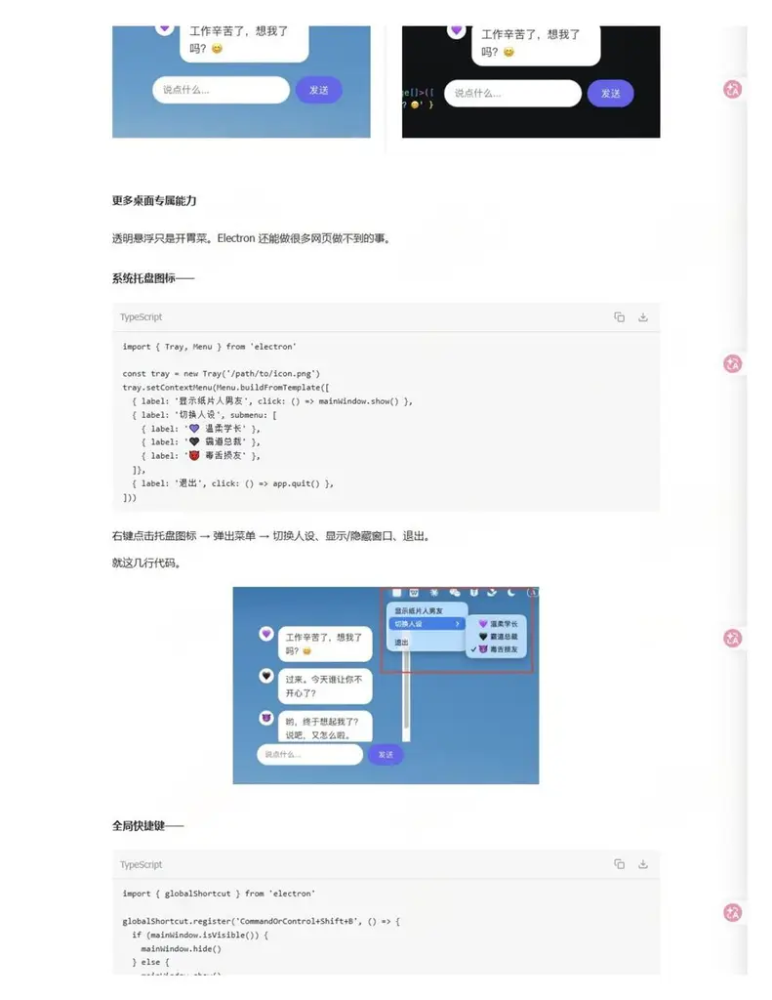

maanmanuom snow

}

妨

在任何应用里按 Ctrl+Shift+B (Mac是 Cmd+Shift+B) ，纸片人男友就出现或消失。
你在写 Word，按一下快捷键，他就冒出来了。再按一下，他又藏起来了。
这种跨应用的全局快捷键，网页永远做不到。这就是桌面应用的独特价值.

在真正的项目里，你还应该增加在应用退出时注销快捷键:

app.on("will-quit'，() =>{
Blobalshortcut.unregisterAll()

力

这是为了防止"系统级快捷键残留"和资源泄漏，确保你的应用退出后，不会继续占着快捷键、

系统通知 一

new Notification({
title: “纸片人男友"，
body: “你已经连续工作2小时了，要不要休息一下 仿'，
力.show()

纸片人男友主动弹通知提醒你喝水、休息、站起来活动。

不需要你打开App，他自己踏出来关心你。

纸片人男友

令 你已经连续工作2小时了，要不要休息一
下? 委

打包分发: 做好了，直接发

代码写好了，怎么变成用户可以下载安装的软件?

打包

装-个工具:

影响系统或其他应用。

因

@@

npm install electron-builder --save-dev

在 package.json 里加上构建配置:
{
build": {
"apprd": “com.paperboyfriend.desktop"，

“productName": “纸片人男友"，
"mac": {
"target": "dmg”

win: {
"target": "nsis"
于
然后:
# 打包Mac版

npm run build && npx electron-builder --mac

## 打包Mindows版

npm run build && npx electron-builder --win

打包充，dist 文件来里就有了:
。Mac: 纸片人男友-1.0.0.dmg

*。 Windows: 纸片人男友 Setup 1.0.0.exe

dist
mac-arm641/纸片人男友.app1Cont.…
> win-arm64-unpacked

Win-unpacked

纸片人男友-1.0.0-arm64.dmg

纸片人男友-1.0.0-arm64.dmg.bloc.…
纸片人男友-1.0.0-win.zip

就这样。你的软件，打包好了。

D 大               am                         oo

安装完成后就可以在应用程序里看到了。

[应用程序                            el)

人

怎么发给用户?

最简单的方式: 放在你的网站上。

在你的 Next.js 网站上加一个"Download 页面，放上 Mac 版和 Windows 版的下载链接。用户点下载，双击安装。

没有审核。没有商店。没有任何人需要批准你。

把这两个文件放到一个能被公网访问的地方 (服务器 / 对象存储，比如: Cloudflare R2) ，在言网加一个 Download 页
面:

癌

Plain Text

<a href="https://download.yourapp.com/YourApp-1.9.9.dmg">
Download for Mac

</ay

<a href="https://download.yourapp.com/Yourapp-Setup-1.9.6.exe">

Download for Windows
</ay

你做好了就能发。这才叫自由。

进阶一点，可以用 GitHub Releases 来托管安装包一一自带版本管理和 CDN 加速，很多开源卓面软件都这么干。

也可以上架 Mac App Store 或 Microsoft Store，但不是必须的。上架有审核流程，Mac App Store 还有 30% 或 15%的
抽成。

大多数独立开发者的选择不上架，直接官网分发。

自动更新

发了1.0版本，过几天修了Bug，怎么让用户更新?

Typescript
import { autoUpdater } from 'electron-updater'

7/ App启动时检查更新
autoUpdater .checkForUpdatesAndNotify()

App启动的时候自动去你的服务器检查有没有新版本，有就提示用户更新。
你不需要深入研究这个，知道"Electron有自动更新能力"就行，具体配置让AI帮你写。

登录与付费: 这是本课最重要的一节

好，到关键环节了。
你的桌面应用做出来了，怎么让用户登录? 怎么收费?
答案是    么都不用重新做。

先回忆一下你每天在经历什么

你用 Cursor 的时候:

十 第一次打开 Cursor 一 点"Sign In" 一 浏览器自动弹出来，打开cursorcom的登录页
2. 在网页上登录 (Google/GitHub/邮箱)

3. 登录成功 一 浏览器问你"是否打开Cursor? "一 你点 打开”

4. 回到 Cursor 桌面 App，已经登录了

5. 要订阅 pro 版? 去cursorcom网站上付费就行，桌面 App 自动生效

ChatGPT 桌面版、Notion、Slack、Figma、Discord-一全是这个流程。
发现了吗? 桌面App只是一个客户端。所有的登录和付费，都在网站上完成。

技术流程 (结合我们学过的东西)

完整流程是这样的:

钙

[ec
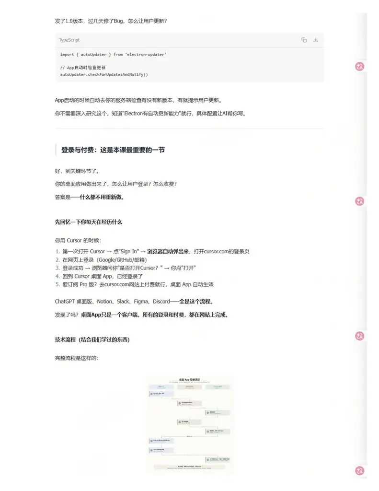

核心代码就两让 一
打开浏览器登录 :

Typescript

import { shell }from 'electron'

function openLogin()

shel1.openExternal( "https://你的网站.com/authy/desktop-login')

】

Typescript

// 注册自定义协议
app.setAsDefaultprotocolClient("paperboyfriend')

// 监听回调(macos》
app.on('open-url'，(event，url) =>{
V/ url = paperboyfriend://auth?token=xxx

const token = new URL(url) .searchParams.get('token')
7/ 保存token，登录完成

妨

用户在浏览器登录成功后，你的网站做一个重定向到 paperboyfriend://auth?token=xxx，浏览器举出"是否打开纸片人
男友? "，用户点确认，桌面App就拿到token了。

和你打开Cursor时的体验一模一样。

而 Becwon m)

口 eanr marenonransnensmonmeaam

aa

付费更简单

用户要升级会员?

Typescript

function opensubscription() {

shell.openExternal('https://你的网站.com/pricing')
】

一行代码。

打开浏览器，跳到你的定价页，用户用Stripe / Creem / Paddle完成支付。Webhook通知你的后端更新用户状态。桌面
App下次调API，发现 spremium: true，自动解锁付费功能。

你在前面课程学的那套东西一BetterAuth做登录、Stripe/Creem/ paddle做支付、Next.js API Routes做后端
一-一行都不用改。 桌面App直接复用。

or                        ee
轩 0 可以地二加天 。 天                    .19
2
me |
为什么这个檬式是最优解?
对比维度          跳转网站支付            在App里内风支付
开发成本     几乎为零 (复用网站)         从零集成支付
平台抽成           无 (Stripe约2.9%)          上Mac App Store要交30%
多端同步    天然同步 (同一套账号)        需要额外开发
维护成本         只维护一套代码        每个端都要维护支付逻辑

Cursor、Notion、Slack都选了这个模式。
不是因为偷懒。
是因为这确实是最优解。

最快的路: fork clawd-on-desk，直接改

自己从零写一个桌面应用? 可以。
但有一条更快的路-一 找一个已有的开源项目，直接在它基础上改。

这个项目你一定要知道: clawd-on-desk

GitHub上有一个很火的开源项目一-cawd-on-desk。

它是什么?

一只像素风的小镑蟹，趴在你的屏幕上。

当你用 Claude Code 编程时，它会实时响应: 你在思考，它也在思考; 你在写代码，它跟着打字; 任务完成了，它开
心地手舞足蹈; 你高开电脑了，它就趴着睡着了。

它用了哪些技术? 我列一下，你会发现全是我们刚才讲过的:

* 透明窗口 + 无边框 + 置顶(和第6节一模一样)

* 点击穿透一透明区域的点击会传到后面的窗口

* 位置记忆一一关掉再打开，小螃蟹还在原来的位置

* 系统托盘一一右键荣单控制显示/隐藏

。12种动画状态: idle、thinking、typing、building、happy、sleeping.……-
* 光标跟踪一小螃秘的眼睛会跟着你的鼠标转

* 支持Windows、Mac、Linux

这就是我们想给纸片人男友做的所有功能。而它已经全部实现好了。

四步改造，变成你的产品

我强烈建议你直接 fork clawd-on-desk 来改，不要从零写。

仓库可以用这个: https://github.com/rullerzhou-afk/dawd-on-desk

它已经帮你搞定了最难的部分一透明窗口、动画状态机、点击奔透、托盘控制。这些自己从零写”能折腾你好几天。

fork 过来? 这些全是现成的。

你要做的就四步:

第一步: 换角色。

把像素螃乌换成你自己的角色。用 AI 生成一套角色表情图
妻材就行

开心、思考、睡觉、说话、生气……蔡换掉原有的sprite
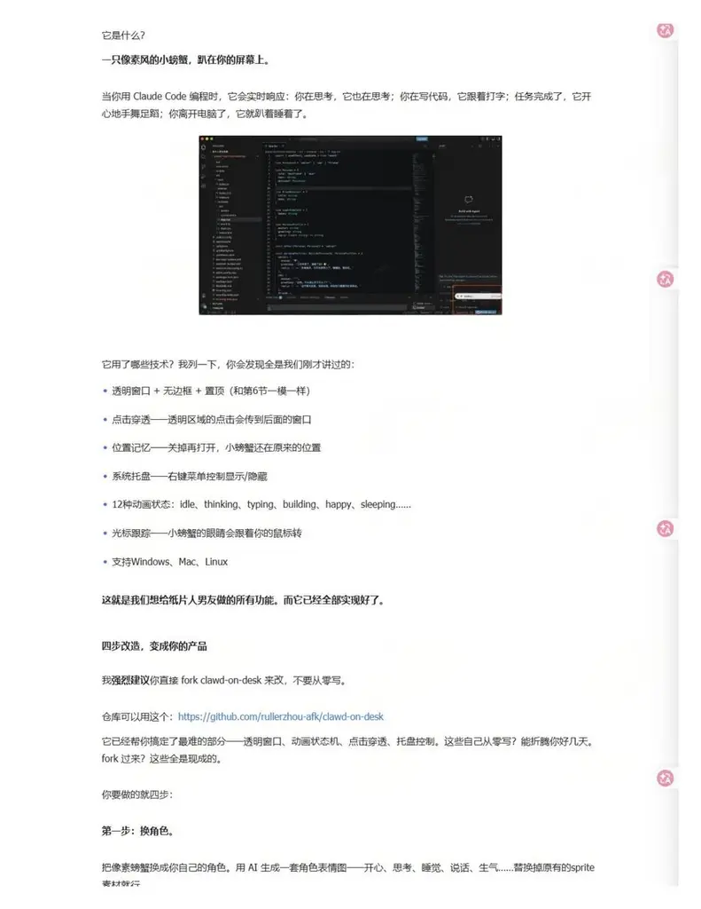

第二步: 接AI对话。

原版 lawd-on-desk 是响应编程工具的状态，不能聊天。你要改成: 点击角色弹出聊天气泡，用户输入文字

的 AI 接口获取回复。这部分你太熟了一一和网页版纸片人男友一样的逻辑。

第三步: 接上你的网站账号体系。

用我们刚才讲的 Deep Link 模式，跳到你的网站登录。BetterAuth 认证，Stripe/CreerypPaddle 收费。

* 免费用户: 每天3句对话，基础角色

* 付费用户: 无限对话，全部角色解锁，可自定义角色性格

第四步: 加上桌面陪伴的特色功能。

光聊天还不够"桌面"。加上这些

* 唱水提醒一每隔1小时弹一句"该喝水了~”

* 番茄钟-一工作25分钟，角色提醒你休息5分钟

* 摸鱼检测一一检测到你打开了 bilibii，角色说"你又在措鱼! ”

* 每日情话一一每天早上开机，弹一句AI生成的情话

这些功能技术难度都不高，让 AI 帮你写齐

但用户体验非常好 一这才是"桌面陪伴"的感党。

，调用你

顺带提一个: Cap

如果你对工具类产品更感兴趣，看看 Cap (cap.s0) 一一GitHub上11000+星的开源录屏软件，定位是"开源版Loom 。
MIT协议。

思路一样: fork 一 加账号系统 一 加订阅支付 一 加AI功能 (自动字幕、智能妆辑) 一 变成一个可收费的产品。

不过Cap是用Tauri (Rust) 写的，改造门槛Hclawd-on-desk高一些。有兴趣的同学自行探索。

Tauri: 更轻的替代方案 (延伸阅读)

前面一直在说 Electron，这里用几句话说一下 Tauri。

Tauri 和 Electron 的目标一样一一用Web技术做桌面应用。区别是: Electron 打包了一整个 Chrome，所以体积大
(100MB+) 但兼容性好; Tauri 用系统自带的 WebView，体积小 〔10MB级) 但底层是 Rust。

追求极致体积，或者你本身会 Rust，可以用 Tauri。

但对于我们来说一Electron 生态更成熟，AI 写 Electron 代码更靠谱，遇到问题能搜到的解决方案多 10 倍。

了解即可，不要求掌握。

本课小结

这一课讲了桌面应用的完整路径。总结5句话:

第一，技术选型。 PWA快但弱，Tauri轻但门槛高，Electron是正解。你会React就够了。

第二，核心能力。 透明窗口、悬浮置项、系统托盘、全局快捷键、系统通知-一这些网页和手机都做不到，是桌面应
用的独特价值。

第三，分发自由。 不需要商店、不需要审核、不需要平台税。做好了放网站上让用户下载。

第四，登录和付费。 跳到你的网站，复用BetterAuth + Stripe/Creem/Paddle。跟你的网页版、手机App共享同一套账
号。Cursor、Notion、S5lack都是这么干的。

第五，最快上手。 fork clawd-on-desk 一 换角色 一 接AI 一 接支付 一 你就有了一个完整的桌面AI陪伴产品。

延伸阅读
* Electron 言方文档-Electron的完整API参考。
* electronvite 我们用的脚手架工具，Electron + Vite的最佳实践。
* electron-builder一一打包和分发的言方工具。
* dawd-on-desk GitHub一一桌面宠物开源项目，强烈建议fork来改。
* Cap GitHub一一开源录屏工具，Tauri + Rust。

* Electron Deep Links 教程一官方的Deep Link (自定义协议) 教程。
