# 产品做出来了，然后呢？

> 说明：本资料为图片版，以下为主要内容整理（OCR 识别，可能存在错字），关键页面配图已保留供对照。

【增长】产品做出来了，然后呢?

1698 人学过

| 一 冷启动: 找人，而不是等人

你的产品上线了，但没有用户。这不是意外，这是每个独立开发者都必须经历的"冷启动"阶段一也是大多数人放弃的
地方。

Pieter Levels 在 《Make》 里说: 最难的不是做产品，是让人用。
但他也给出了解法。他的 Nomad List，不是"产品正式上线"出来的。
最初只是一张 Google 表格，因为忘了关编辑权限，意外让数百人清进来帮他填数据，自发传播，才做成了网站。

冷启动的本质只有一句话: 找人，而不是等人。

Make 的三个冷启动精央
Pieter Levels是我在全世界范围内最喜欢的独立开发者，他的《Make》这本书我看过很多人
在 pieter 看来，冷启动最核心的不是平台清单，而是三个原则:

g@ Launch early, launch often 别等寺美再上线。Nomad List 的第一版只是一张 Google 表格。上线之后，才能从真
实用户那里学到真正有用的东西。

O Build in public (公开建造) 从第一天就公开。公开开发过程、公开失败、甚至公开收入(在国内可能这一点不合
适) 。pieter 把所有产品的实时收入数据公开在 Twitter/X，这本身就成了他最大的营销一用户不只是在用产品，还是
产品的共建者和传播者。

@ Scratch your own itch (解决自己的问题) 做自己需要的东西。你就是第一个用户，最慌使用场景，痛点是真实
的而非脐想的。pPieter 建 Nomad List，是因为他自己就是数字游民，需要找这样的信息。

Pieter Levels 的三个铁律
@              品
公开建造
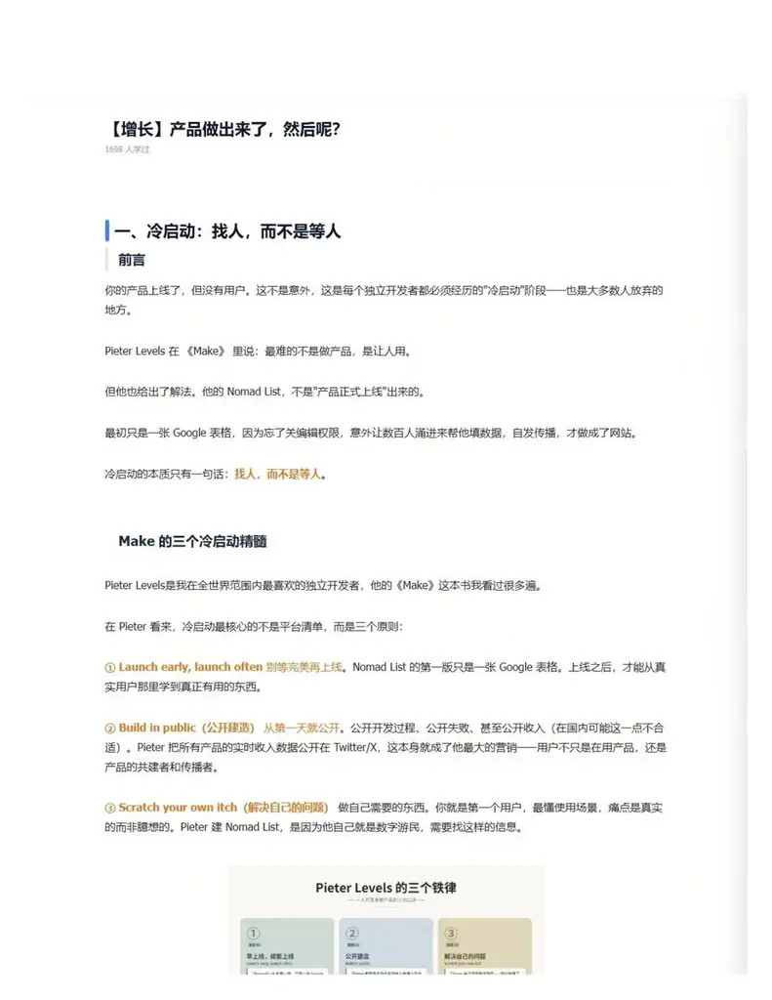

抽相书了村旨有户，让用户在公开的小关于和介，

Nomad List 的冷启动故事

Pieter 在清迈工作时，想找网速好、气候舒适、消费低的城市。

他把收集的数据做成 Google 表格随手发上 Twitter，忘了关编辑权限。结果数百人涌进来帮他填数据，75 个城市的信
息几小时内就有了。他意识到需求是真实的，才做成了网站。

上线当天登上 product Hunt 和 Hacker News 双榜第一，第一天收入 $600。

这就是三个原则同时生效的样子: 他先解决了自己的问题，早早把不完整的东西发出去，全程在公开建造。

框架: 冷启动三层漏斗

大多数人把"去发布平台发帖"当作冷启动的起点，这是错的。正确的顺序是:

第0层: 你自己
你是第一个用户。如果你自己都不用这个产品，先想清楚目标用户是和谁。

第 工层: 精准轿子
上线前就要找到目标用户聚集的地方。去那里，用礼物心态出现，不是来打广告，是来"送东西

第 2 层: 发布平台

Product Hunt、Hacker News、即刻….这些是放大器，不是起点。等产品真的能用、能留住人，再用。用早了是浪
费"子弹"。

冷启动

我们反复提及的案例 Citely.ai，也是按照这样的节奏。

网开始是自己用，然后找到和精准圈子 〈同校的老师、学生; 其他学校的老师、学生) ， 最后发布平台、完成破图。

pieter 那三条原则-一Launch early、Build in public、Scratch your own itch，一条都没落下。

第一层: 精准圈子

进入任何社区只有一种正确姿态:
愉 (错误) 灌水心态: 我来推广我的产品，请大家关注、下载、转发。
图 礼物心态: 我做了一个可能对你们有用的东西，欢迎试试，帮有我挑毛病。

品类型找轿子:

案例; aitdk.com 和 shipany.ai 都是在哥飞老师的开发者微信群完成冷启动的。
原因很简单: 这两个都是开发者工具，群里每个人都是目标用户。圈子精准，转化自然高。

第二层: 发布平台

发布平台的流量是一次性的，尤其是 product Hunt、Hacker News。
要等产品真的能用、能留住用户，再动用这里子弹。

海外平台

Product Hunt

https://www.producthunt.comy/

* 上线时间选太平洋时间午夜 12 点，这样有整整一天的"Today 曝光

* 提前通知所有认识的人准备投票 (但算法会识别异常模式，投票要自然)
*。 上线后立刻在评论区发第一条评论: 讲为什么做这个，解决了什么问题

* 精心准备 logo、截图和 30 秒演示视频，视觉呈现决定点击率

Nomad List 在未正式准备的情况下被朋友提交，意外登项。
pieter 的建议: 产品做好、故事准备好，时机成熟就发，别等完美。

Hacker News

https://news.ycombinatorcom/

* 标题格式固定: Show HN: [一句话描述产品]

* 发帖后立刻发第一条评论，解释做这个产品的动机和技术实现
* HN 用户喜欢技术细节，要真诚回应每一条评论，包括批评

* 不要有任何商业感，像分享一个有趣项目一样

我的AnyVoice 在 Hacker News 获得数百 Upvotes，完成早期海外冷启动。
Reddit

https://www.reddit.com/

* 提前 3 周养号: 每天发小猫小痢，建立账号可信度，再发产品内容

* 选对 subreddit 比选大版块更重要，找最匹配目标用户的社区

* 姿态是"来征求反馈"，在评论里透明表明自己是创始人

* 一旦进首页，服务器可能宕机一一提前做好扩容准备

ea       a              四b em

日PEREGBE PETS
各呈由异 司的二全
仿)汉
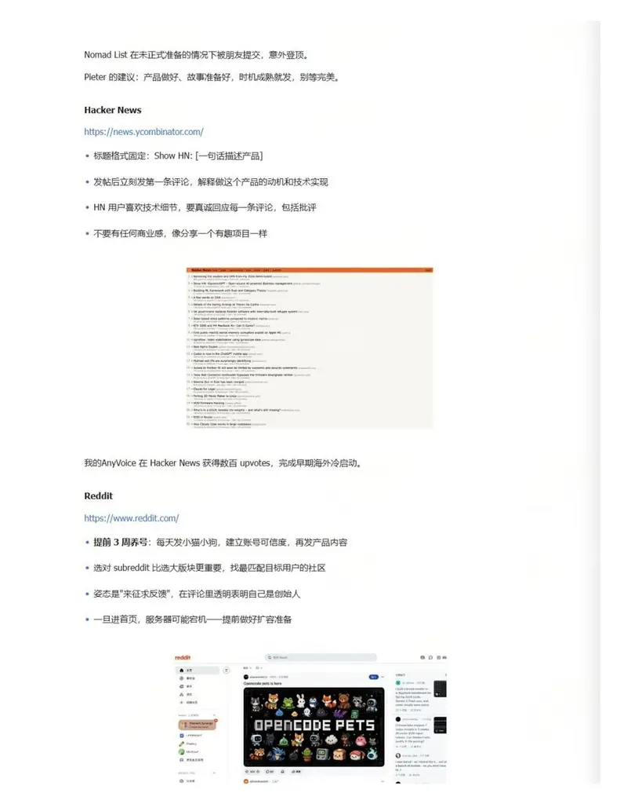

Codepabba
FreeAl Code Reviewer                过

pieter 用 Reddit 让 Nomad List 和 Hoodmaps 先后登上首页。

Indie Hackers

https://www.indiehackers.corm/
* 创建产品页面，定期更新进展 (鼓励透明分享收入数据)
* 达到关键里程碑 (第一个付费用户、$1K MRR) 时写一篇故事分享

* 在相关讨论下先提供有价值的见解，建立声誉再推产品

Betalist

https://betalistcomy/
* 适合收集早期反馈，设置 waitlist 收集邮件
* 强调产品的创新点和独特性

* 明确说明产品当前的开发阶段

Discovertomorrow's 交
startups,today.

国内亚必

即刻 最被低估的国内冷启动平台。 "独立开发者"圈极度活跃，且有"产品发布会;机制。
* 找到"独立开发者"、 "效率工具近"等相关轿子，持续震出

*。 产品发布会"可以小额填顶推广，ROI 相当高

* 以使用体验或开发故事的形式分享，不是广告式发布

。 与圈子里的 KOL 互动，建立关系

写这门课程时，"产品发布会"第一名是生财有术圈友的"好事发生" App一一完全靠即刻冷启动。
我也在即刻分享 Raphael AI 的故事，也在持续带来新用户。

1

小红书
* 用"用户视角'写笔记，讲具体怎么用、解决了什么问题，不是"发布公告
* 图文质量要高，封面图决定点击率

* 评论区认真回复，是建立信任的窗口

大潘 percy 只靠小红书冷启动，SCAI 首月收入超过 $1,000。生财有术学员@六六的产品在小红书也取得不错的成绩。

小众软件

https://www.appinn.com/

* 通过官方渠道申请收录，提供详细介绍和高质量截图
* 为编辑准备完整测试账号，降低体验门槛

* 强调产品的独特性和与市场现有方案的区别

Raphael AI 1 月 17 日发布当天，被小众软件推到大屏首页整整一天，带来 1 万新用户。完全免费，编辑主动发现的。

V2EX

https://wwwv2ex.comy/
* 选"分享创造"节点，标题直接说明这是新产品分享
* 图文详细介绍功能，语气是"分享"不是"推广

*。 对低质量推广极度排斥，把 V2EX 用户当专业评审，认真回应每条意见

3 @国恒加国辕 国国 日

微信群 / 各类垂直社群

到拥有你目标用户的"群"，是最直接的冷启动场所，没有之一。
* 礼物心态: 把产品像礼物一样送给群用户，而不是牛皮癣广告
* 积极响应所有反馈

。 把用户当人，不要当非菜

大招: Build in Public (可选)
从第一天就公开，是 pieter Levels 最重要、最反直觉的建议。

公开的用处:

* 你发"我在做 XXX(，你们有这个需求吗? “一上线前就积累了关注者
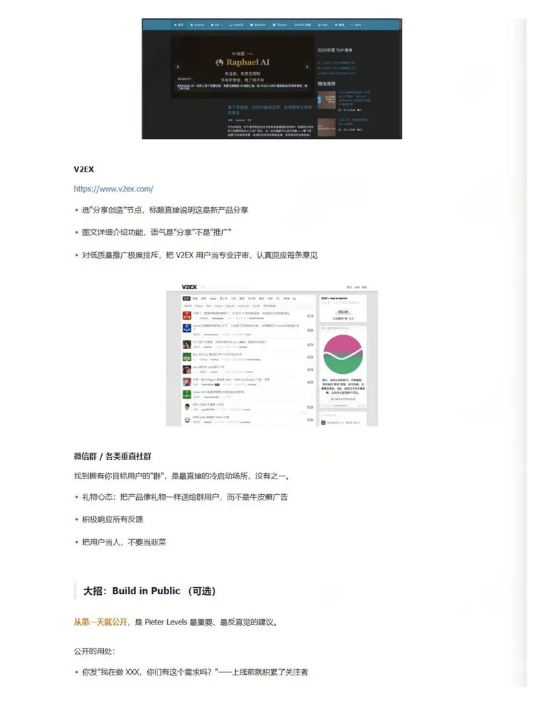

* 用户参与数据填充、提建议，变成产品共建者
* 第一个付费用户、第一个 $100 MRR，真实数字最有说服力

* 用户反馈改进了产品之后，@用户说"你的建议我做了"一他会帮你传播

ShipAny、MkSaas 几乎是 Build in Public 的，所有的用户反馈，作者都是回复、处理、按需吸收。其中 MkSaa5 还公
布了收入。

国内采用这种模式的人少一些，但有几个我觉得特别值得擒出来讲。

赵纯想-一把"不停发布"做到极致

个人主页: https://chunxiang .al/

胃之书 Bellybook，App Store 美食类第 3，月营收稳定在 1.2 万美元。上线 72 小时就有 1 万用户注册。

但他的厉害不在数据，在节奏。

他 1994 年出生，大学角学，出过两本小说《坏一坏》《人生灿内I》，做过编剧，自学代码进了互联网，融资 100 万
6 个月烧光，又做过款计播放 1200 万的道家哲学系列视频。

某个下午，决定记录一下自己做的饭。当天就把 demo 写序了。他自己回忆: "嘴里默念牛逼一直默念到夜里睡着。"

胃之书之后，又陆续上了陌生人闹钟、丸辣、心之书。一边做产品一边出小说，一边卖 SwiftUI 课程，一边在 B 站/拉
音/小红书/微博/即刻全平台发布自己的开发过程。

他在小宇宙那期播客的标题就叫《不停地发布是独立开发者的核心奥义》。里面的金句，一抓一大把

"哪怕是个垃圾，先发到这个世界上。"”
"做产品就像甩钩子钓鱼,ji
"把面对市场这件事本身，当作开发工作的一环。”
"学起真诚的大旗，认真回复评论。"

他回忆胃之书初期推广，说过一句: “脸皮厚了，管他的，所有平台一起发。"一一小红书的女性用户反馈最有用，他就
国绕小红书做功能。

有用户用胃之书的收藏功能整理杯套合集，他评价 "超级可爱，罗列整齐，情绪价值拉满了"，然后把这个用法二次传
播。

这是把"个人风格"本身做成分发资产的人。

idoubi 艾去笔 一- 国内 Build in Public做到极致的人

个人主页: https://idoubi.ai/

如果说国内有谁把 Build in Public 做到了"教科书级别"，那一定是 idoubi。

他原本是腾讯支付的后端工程师，2023 年 10 月辞职做独立开发。2024 年一年，他上线了 11 款 AI 产品一-AI
Cover、ThinkAny、pPodLM、ShipAny.………

每一款发布的时候，他都老老实实写一篇推文，标清楚"花了多久做出来
*。 AI Cover: 从构思到上线，一个小时。

。ThinkAny: 一个周末做完首版。

*。 ShipAny: 周二开始写，一天拱充架子。

*。MCPso: MCP 协议一发布就抢注域名，一个周末搭出导航站办形。

* 还有 FastClaw、WeClaw等等……

这种节奏本身，就是 Build in Public 的内容。

更狠的是他公开数据。 2024 年 12 月他公开晒了一组: 四款产品加起来 MRR 终于过 1000 美金; ShipAny 圣诞节上
线，4 小时收入破 1 万美金，一周的收入超过其他产品一整年。

他也老实承认打脸的部分:“2024 年全年的收入，跟 2023 年上班时候的收入，还有一定的差距。”

失败的项目也公开 Melodisco 写了一句"这个看不到希望，就没继续做了"，直接放弃。

他在四个平台同步运营，每个平台的数据都摆在那: Twitter 从 0 涨到 1 万，即刻 8k，公众号月更、一年新增 2 万关

Sm Ta和mm 用一二和rs ao天必二

于、弟而十二网其 上 /JJ。MIUUULInUIL 上 TAIY 季世口仿上四，他出汝义旱靖一 DUIG TI 却届 / 妃哆放，
ThinkAny 那篇直接两万字。

他给新人的一句话你也应该知道: "Build in public, and ship more.”
翻译过来就是: 少化大招，多发产品，全程公开。

玉伯-一另一种 BIP: 长期公开思考

玉伯不需要太多介绍。2008 年入职淘宝，做到阿里 P10，做出 Sea]S、Ant Design 这些工具; 后来去字节做飞书的产
品副总裁。

2024 年 5 月，他辞职在杭州创办思维天空，做 AI 创作工具 YouMind，目标是"内容创作者的 GitHub"。同年 12 月上
线 0.1 版本一一上线即付费，专门用来第选种子用户。

他离开大厂时在自己的墨问专栏写过一段，被到处转:
"在大厂很忙很忙，但只要下班路上，抬头看月，鼻子里就能闻到一和股荒诞味。”

四年北下来的话，一下就讲了出来。
YouMind 上线之后，他公开过几个反直觉判断，每一句都很扎心:

"AI 知识管理，是个伪需求。"
"ChatGPT 已是最强的第二大脑。不和输出，储存再多知识也没意义。"
"不输出，就别用 YouMind。”

知识管理是他干过 8 年的事一一他就是语尘的创始人。一个做过最大笔记产品的人，公开说"AI 知识管理是个伪需
求'-一这才是 BIP 的高级形态。

他不晒数据、不秀 ship 节奏。但他在即刻日更思考、在墨问公开高职创业的真实心路、在 X 同步每一个版本一长
期、不间断地公开思考，本身就是 Build in Public 的另一种形态。

产品地址: https://youmind.com/zh-CN

von

nearaes ，

大胆创作 不止于学

SA

刀 人人都爱的个性化
Al 学习与创作智能体

好不过提醒-点:

六一上上nm Le Ye er aemwA 必证过ms、 一

住因内，DUnQ II FUDIE 月逢月下。旭采作国广丽人得 WU只走 羽al突 季月垣尽左、叫车而HH广丁) ，个到

议轻易公开，你慌的。

操作节奏

上线前: Build in Public，积累第一批关注者。找到目标圈子，开始分享开发故事。

上线当天:， 精准轿子 + 1-2 个发布平台同时触达。当天高频响应每一条评论和反馈。

上线后 1周: 基于早期用户反馈快速和迭代。与每一个早期用户建立个人连接，他们会成为最忠诚的传播者。
稳定后: 3-5 个渠道都试过之后，找到效果最好的 1-2 个，专注打透。

冷启动 30 天节奏表
区               醒                   au                aa
2 2

个前级只供一伯事，比同时佬四伯事走得记得多、

本课核心原则

. 找人，不是等人。 主动去目标用户在的地方，不要坐等流量自己来。

. 先精准，再量大。 前 100 个用户要的是质量，是能给反馈的真实用户，不是数字。

. 发布平台是放大器，不是起点。 产品没准备好，提前用只是浪费子弹。

. 礼物心态进入每一个社区。 你是来送东西的，不是来打广告的。

- Build in public，从第一天开始。 公开的过程本身就是最好的内容营销。

. 快速迁代是冷启动的核心武器。 用户反馈一改产品一再通知用户，这个循环比任何推广都有效。

PumamwmwhN

| 二、做出来了，然后呢? 聊聊你的产品值多少钱
前言

前面的课程里我们聊了怎么找产品idea、怎么拆解、怎么做最小闭环，你已经具备了做出一个能跑通的产品的基础能
3

那要怎么把这个东西变现呢? 很多人可能做到这一步就卡住了。

你会发现要做的决策其实很多: 按月收还是给积分包? 免费版给到什么程度?付费卡在哪个环节? 定价是29 ? 49 ? 还

皇aa7
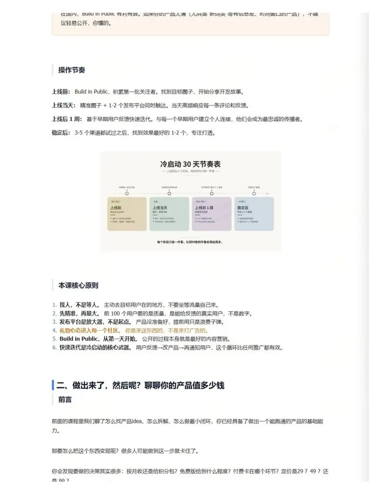

每一个选择，都会直接影响你的收入。

而这些选择的底层，有一个绕不开的概念一边际成本

一个关键的概念: 边际成本

收费模式不是拍脑袋选的。在聊具体怎么收钱之前，有一个底层概念必须先搞清楚: 边际成本。

做产品，成本分两种。

一种是固定成本，不管你卖不卖得出去都要花的钱。

你写代码、租服务器、买域名.…这些钱在你的第一个用户来之前就已经花出去了。哪怕最后一个用户都没有，这些钱
也回不来了。

还有一种，是边际成本。这是有人来用了你的产品，你才需要花的钱。

每多服务一个用户，你要额外花多少钱，比如 API ，每调用一次都需要花钱，这个"多用一次你就多花的那一份钱"，
就是边际成本。

如果你的边际成本很低，其至接近于零。

那记得越多你就越赔。每多卖一份，收入增加了，但成本几乎不变。 前期花的那些开发成本，会补越来越多的收入捧
平

但如果你的边际成本很高，那情况就不一样了。

每多来个用户，你就实打实多花一份钱。卖得多收入多，成本也会跟荐丝

如果你的定价没有预留中够的利浊空间或者没有明确的使用限制，甚至可能出现 一种很范肖的局面;

用户越多，你气得越多。

am

ET                              2

区                           esvg天和

本或本的高人，决定作的产品本怎么

吉本全=                   有本
人            而作、 人生要与
人             用-六网站
上                         由
|以一次性天                  人和汪撤收费

光说可能还是有点抽象，我们来看个例子。

微软花了几十亿开发 Windows.，议个同宗成本量很高的-

但开发充之后，多卖一份给你，微软要多花多少钱?
几乎是零。

你下载一个安装文件，微软的服务器带亮成本可以忽略不计。这就是典型的边际成本极低的产品。

你可能会问: Windows 都没什么边际成本了，为什么以前还卖那么贵? 一台电脑装个正版 Windows 要好几百。
因为它解决的问题值那个价。

微软收的钱不是按它多发一份安装文件的成本收的一那个成本约等于零。而是按"你的电脑没有操作系统就是一块废
铁"这个价值来收的。

价值定价，不是成本定价。

再来看另一种情况，和AI写作助手，用户每次用，后端就要调一次 API。

用户写了一封邮件，可能花你5分钱; 用户改了一篇论文，可能花你两三毛; 用户拿它写了一整篇报告，可能花你一两
块钱。

用户越多、用得越频繁，你的账单就越高。

这就是边际成本高的产品-有人来用你就要掏钱，来一个掏一份，来一百个掏一百份。

讲到这，你应该能看出规律了:

边际成本低的产品-一

软件安装包、课程、模板、一次性的数字产品等等，可以一次性买断，因为多卖一份几乎不多花钱。
边际成本高的产品一

每次使用都消耗真实资源，不能随便摘终身买断了。你必须让收费和使用量挂钩: 现在大多数产品的订阅制、积分包，

本质上都是在解决这个问题。

边际成本的高低，直接决定了你适合什么收费模式。

你的产品长什么样，就该收什么的钱

一次性买断一用户拿完就走
这种收费方式适合交付物是一个完整的结果且边际成本很低的产品。

比如 ShipAny 卖的是一套完整的出海产品模板，一次性付费，终身更新。

用户付完钱，拿走代码，你和它的交易就结束了。

类似的还有 Toolify ，做的是 AI 产品榜单，你交一次钱把自己的产品提交上去，获得永久展示，也是一次性收费的。

Total: $ 99         EC

Submhta Tool Example

mw                  We
oreeee unina sno stemotvavmm介home momo

Rezi 的终身版149美元，一次买断，不再续费。

Upgradeto Pro

但注意 Rezi 很陪明的一点一一

它的终身版砍掉了需要持续消耗 API 的高级功能，比如每月简历审核，只保留了边际成本低的部分。这样它才敢卖终
身

所有的一次性买断，包括各种 PPT 模板包、AI生成的完整报告等等，这些产品的共同特点是:
交付物是"做好的成品"，你拿走了，卖方不需要再为你持续付出成本。

ShipAny 多卖一份模板，几乎没有额外成本，它赚的就是开发一次，卖无数次的差价。Toolify 多收录一个产品，也没有
额外成本。而 Rezi 的一次性买断，更是直接砍了会增加边际成本的功能。
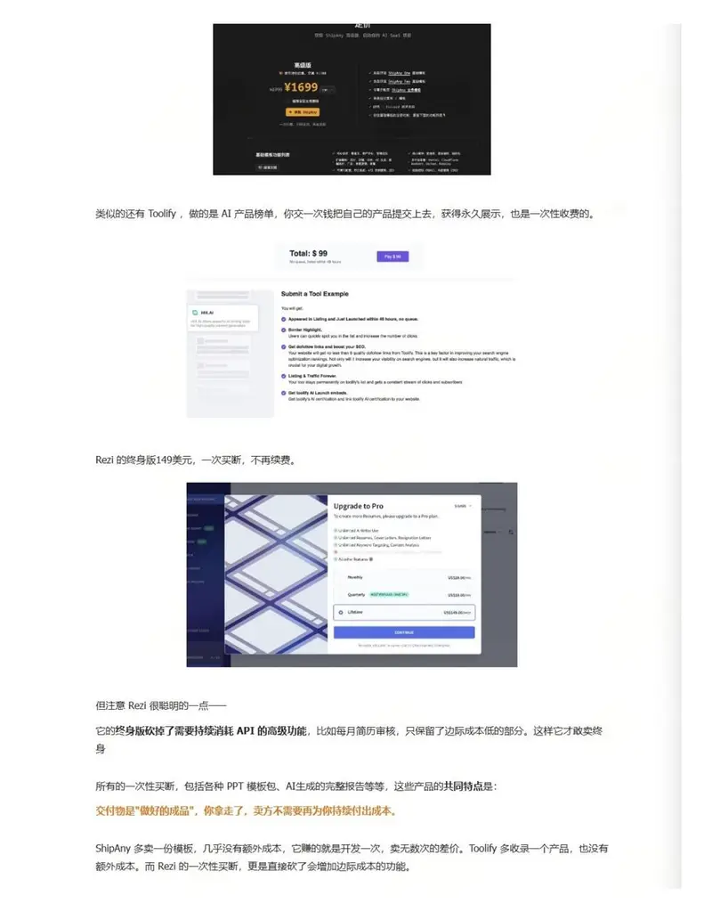

但一次性买断最容易死在哪》没有复购。

用户买完就走了，你的收入完全依赖新客。

一旦新客获取成本上升或者流量下滑，收入就会下跌。所以做一次性买断的产品，要么你的客单价足够高，要么获客成
本足够低，要么能够像 ShipAny 这样持续更新，用新的内容来吸引更多的新用户。

订阅制-一让用户产生依玉

这种收费模式适合用户持续、反复使用的工具型产品，而且产品有持续的边际成本需要覆盖.。

你知道的超一线 AI 产品，ChatGPT 、Claude Code -一这些都是订阅制。用户每个月付钱，你每个月提供服务。

Plans that grow withyou

订阅制的关键不是让人付第一个月，关键是让人觉得取消会损失什么一-ChatGPT 会员取消了用户就没法用 GPT-5.5
，Cursor pro 用户取消了代码补全就回到基础版。

你必须让用户对产品形成依赖，让产品变成用户工作流的一部分。让用户觉得"这个月不续费，我的工作效率就下降/充
成不了了”

其实 AI 产品特别适合订阅制，每次用户使用都有真实的 API 调用成本。如果你做一次性买汤，一个重度用户可能把你
吃宕，而订阅制至少保证了你每个月都有收入来覆盖这些成本。

按次计费 一用户带着具体的任务来

这种收费方式适合每次使用都是低频率、独立任务的产品。

比如 HeadshotpPro，就是按次付费。用户需要证件照了，可以拿到一组照片，但又不是经常性的需要，完成了就走，下
次有需要了再来。

Selectyourpackage

on-amapmymann ooapeerptcna IOOW moraybackgumarase 。

再比如一些证件照处理工具，用户上传一张照片，选好背景、尺寸，然后付钱下载走人。下次要用就不知道是什么时候
了。

按次计费的定价锚点很关键: 不是你的 API 成本，而是用户自己做这件事要花的时间和钱。
ATi文润色一篇收大几十块并不贵，因为你找人工润色一篇至少好几百上干。

积分包-一 一种比构现金更小心理负担的方式

积分包本质上是按次计费的预付版，但使用频率要更稳定持续。

但这里有一个重要的心理差异: 用户花积分的心理负担比被直接扣费要小很多。

就像你序了100块的星巴克，花起来就比每次掏现金要快。

很多 AI 图像生成、视频生成工具都有这种模式，你买一个积分包，每次生成消耗一定积分。

像 BasedLabs，直接在 Pricing 页面上写了 "No subscriptions. No recurring charges.”，只提供积分包收费，不搞
订阅。

即梦是另一种玩法，订阅制打底，再单独开一个积分包购买通道

积分购买
依500           全750          全1500
Y50.00                   Y75.00                   Y150.00                                支付前请阅读
《"即荨"付费服务协议 〈合
条于)》
少 2250          尹4500          依 9000
请扫码完成支付 四

ChatGPT 也有这个逻辑的变种一一你订阅了会员，但每周都有使用限额，额度不够了怎么办?

花钱买更多的积分。

购买更多消息限额
突破 Codex 额度限制。即刻扩容以释放套餐潜能。了解更多

1000 点额度

这其实就是"订阅制打底+积分包补充"的混合模式，现在越来越多AI产品在用这种形式。
但不推荐新手一上来就这么摘，这个收费逻辑还是相对复杂。

可以等产品相对稳定了，再根据用户需求看是不是要增加积分包

免费增值 (Freemium) 一一 让尽可能多的人先用起来
严格来说，这不是一种收费模式，而是一种获客策略。

Perplexity 是典型的免费增值(Freemium) 产品。可以用免费的基础搜索和限量的高级查询，但想要更强的模型和更多
的搜索次数，就必须升级付费。

先让你用，用变了，再收钱。

Perplexity

站
人
ep         eew

加              Yanz二es

这种模式可以到加在任何一种收费模式之上。本质是用"免费"来降低用户的兰试门槛，先把人吸引进来，再在合适的节
点转化付费。

Rezi 免费版能做一份简历，但AI优化功能受限，想让 AI 帮你针对职位描述优化简历? 付费。
ChatGPT免费版能用基础模型，但想要更多使用GPT-5.5的额度? 订阅。
Cursor免费版有基础的代码补全，想要更智能的功能? 升级。

这三个产品的免费版策略有一个共同点: 免费版让你体验到"这个工具确实好用"，但刻意在最核心的功能上设限。用户
用着用着就会碰到那堵墙，然后自然就付钱了。

广告变现一低边际成本产品的更优选择

这个模式大家都不陌生。互联网时代，有相当一部分产品都是靠广告活着的一搜索引擎、新闻网站、社交媒体等等，
用户不付一分钱，产品靠流量吃广告收入。

为什么那个时代广告变现这么普遍? 还是回到边际成本。

你去网上观察，有很多产品的成本其实非常低，同时它的产品能力也还没达到能向用户直接收费的水平。

这种情况下，广告变现就是最自然的选择。

举个例子，喷硬网 (dapenti.com) ，这是一个运营了快20年的新闻博客。

他做的事情很简单: 每天更新一期"喷嘲图卦"，博主用自己的主观视角把当天值得看的新闻和内容汇总一下推送给读
者。每天一篇，坚持了快20年。

1合共可生，万是闻福本天

徊桐桐hhone厅二灿十十等工花中人小时画册内 党钴证兰它二了部它二了1nn人上字委fn1nF个上定委种西
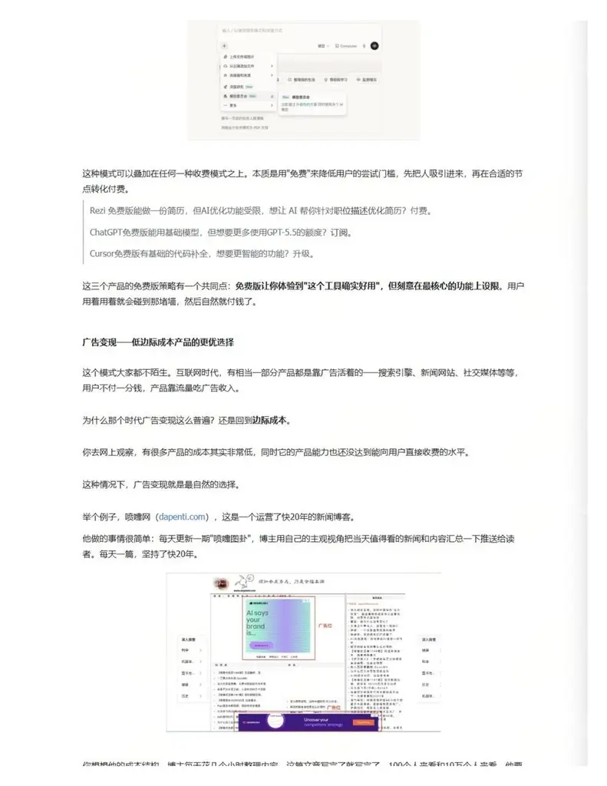

全warIDu3Hnhsrna。盯工吕TU TEL，必朵入宇一75J ai76J 。 Lvu TAN人THiu/ 1人个加，Is

多花多少钱?几乎为零-一反正文章已经写了，服务器带完成本微平其人微。

那他能直接找读者收钱吗? 很难。一个个人博客想让读者付费订阅，门槛太高了。所以他怎么活着》贴广告。

流量够大，哪怕每个读者带来几分钱的广告收益，乘以每天几万访问量，也够覆盖运营成本了。

游戏同样如此，大部分"免费小游戏"本质上都在走广告变现的路。

比如曾经刷屏的羊了个羊，用户不花一分钱就能玩，但每次复活、每次领取道具都要看一段广告，游戏通过巨是的用户
基数和极高的广告曝光频次来赚钱。

EL

复活并使用移出道具

这类产品的核心逻辑很清楚: 产品本身不具备让用户直接付费的能力，但流量足够大，广告就是最自然的变现方式。

那为什么AI产品不太适合广告变现?

因为边际成本太高了。每个用户每次使用都要调API，都有真实的 token 费用。广告赚的那点钱，根本覆盖不了你的
API 成本。

所以你会发现，现在真正靠广告变现的 AI 产品非常少。能靠广告活的，基本都是那种本身不怎么调用模型、边际成本
极低的产品。一旦你的产品核心功能依丈大模型，广告这条路，基本走不通。

当然还有更多其他的收费方式:

AI加价一一在已有产品上雪加AI功能单独收费，Notion AI就是典型，Notion本身有自己的定价，AI功能额外加10美元/
月。

抽佣一你搭一个平台，撮合买卖双方，从每笔交易里抽成。
API定价一把你的AI能力包装成API卖给其他开发者，按调用量计费。

这些都是更高阶的特殊玩法了，新手先重点了解上面那些付费方式就足够了

收费的门，应该装在哪里

在用户使用的哪个节点开始收费呢? 这个位置选得好不好，直接决定了你的转化率。

很多产品在这个环节上做得非常精准。最典型的就是各种在线智商测试、MBTI人格测试。

用户花十几分钟认真做充了所有题目，页面告诉你"你的结果已生成"。但想看完整报告 付费。

这个时候，用户已经投入了时间和注意力，你让他放弃不看，他又不甘心，付费意愿最强。卡在这里，转化率远高
开始就收费。

所以要卡在用户已经感受到价值、但还没拿到完整结果的那个时刻。

太早卡 一 用户还没体验到产品好在哪里，你就弹出付费墙，用户的反应是"我都不知道你好不好用，赁什么让我掏
钱? “然后直接关掉。

太隐卡一用户已经拿到了想要的结果，你再说"如果想要更多，请付费"，用户的反应是"我已经拿到了，为什么还要
付? "

用 Rezi 来做一个拆解。

你在 Rezi 上可以免费创建一份简历，选模板、填信息、生成 PDF，整个流程都是免费的。

但当你想让 AI 根据一个具体的职位描述来优化你的简历，也想对简历做个专业的评审一这是 Rezi 最核心的价值，开
始收费了。

在免费阶段，用户已经投入了时间填写自己的信息，已经看到了生成的简历长什么样，已经感受到"这工具确实好用"。

这时候再告诉他"AI优化需要付费"，用户的心理负担是比较小的一一他已经有了沉没成本，而且清楚地知道付费后能得
到什么。

假设 Rezi 把 AI 优化也免费了，只在最后导出 PDF 的时候收费。用户会怎么想? "我已经拿到优化后的内容了，我截个
图不就行了? ”

付费理由就没了

当然也有更直接的，Headshotpro 在你点击 Create your headshots 后，就会一步步引导你上传图片，直接来到付费页
面，没有免费体验。

Professional business headshots, withoutleaving yourhousel

入力量琵绚用全及

怎么找到你自己产品的这个卡点?

一般的做法是去看况品。找三五个同类产品，注册免费版，走完整个流程，记录下它在哪一步开始收费。

不同竟品的卡点位置可能不一样，对比着看，就能找到你们这个品类的"行业默认值"。然后你可以在这个基础上微调

一一稍微早一点或晚一点。

到底收多少钱

定价是很多新手最纠结的事。收多了怕没人买，收少了怕不赚钱。

其实搞清楚三个错点，就够了。

第一，用户的蔡代方案成本
不用你的产品，用户解决同样的问题要花多少钱?

个

Headshotpro收29美元，用户的著代方案是去影楼花200美元。AI简历优化收几十块，用户的车代方案是自己花三|
小时改。

这个差价空间，就是你的定价区间。你要做的是在这个区间里找一个让用户觉得"划算"的位置。
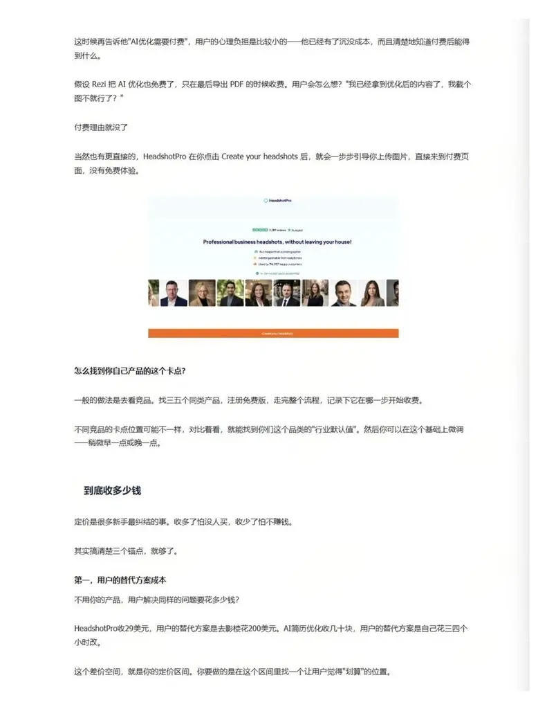

高客单价的产品尤其如此。在线教育课程、英语培训动轿几千上万，用户原意买单，是因为著代方案 (线下报班、出国
学习) 更贵，可能还享受不到同等水平的师资。

再比如 Codex、Claude Code 月费200美元，放在几年前很难想象有人会为一个软件工具每月花这么多钱，但当开发者
发现它能大幅提升编码效率、节省数十小时的人力成本时，200美元反而显得划算了。

Upgrade your usage with Max

5xmore usage than

Pro
UsDIeooonentm vax

order detalls
apan                                                    uspzoo
oemare veaee manpro

avemants                   -usp924
Peratedcredifor theremanderofpropan

bo                    spwoe
Taua oamy                                           Uspwoe

如果早期还没有况品，你甚至可以自由定价-用户没有参照物，只要你解决的问题足够痛，他愿意付出的代价可能比
你想象的高得多。

第二，竞品定价区间
竞品收多少钱? 这是最直观的参考

同样是面向产品营销的产品，Copy.ai 的 Chat 计划是 29 美元/月; ]asper 是 69 美元/月; 而 Writesonic 的起步价已经
涨到 199 美元/月，最高达 399 美元/月。

同样都是营销推广工具，功能不同、能力区间不同，价格从29美元到399 美元拉开了十几信的跨度

如果你做了一个 AI 写作工具，市场上同类工具都是每个月 20 美元上下，那你定 50 美元就需要一个非常充分的理由
一你比别人好在哪

如果你的产品在体验上明显碾压竞品，你就有定高价的旗气。

第三，你自己的成本底线。
API 调用费、服务器费、支付手续费等等这些加在一起，你的每单成本是多少?

传统软件的边际成本几乎为堆，但AI产品不一样，每处理一个用户请求都有真实的成本支出。定价至少要覆盖这个，还
要留出足够的毛利。低于这条线你就做不下去了。

人产品单用户成本构戌

单用户成本
证人必琐商于此名
下用户越多直所

]

起二项全用户规术和调用明动矶变化

拿不准就先定一个大体和竞品同一水平的价格，看有没有人付费。有人付了，说明价值感受是通的，然后再慢慢调。先
有第一笔收入，比定出一个完美的价格更重要。

当然也有一种特殊情况: 低于成本定价，主动抢市场。 Cursor早期 20 美元/月的 Pro 版不限积分额度，考虑到每个用
户的API调用量，大概率是亏钱的。那它为什么要这么定?

因为它要抢占开发者工具市场。

这跟当年外卖大战是一个速辑_ 先烧钱做大用户量，后面再想办法赚钱。

但这种策略需要融资支撑，如果你是个人开发者或者小团队，不建议这么玩

除此之外，还有一点很容易被忽略: 同样的价格，不同地区的用户感受完全不一样。

发达国家的用户付费意愿普遍更强。
不是因为他们更大方，而是因为他们的日常生活成本摆在那里。

在伦敦坐两站地铁就要 8 欧元，差不多 10 美元。对他们来说，一个月花 10 美元订阅一个 AL 工具，也就是少坐一次
地铁的事。

但在中国，坐两站地铁可能只要两三块钱。你让一个中国用户每个月花 70 块人民币订阅一个 AI 工具，他会觉得贵。

这意味着，如果你的产品面向全球市场，尤其是欧美用户，10 到 20 美元的月费是一个非常舒适的价格带一用户不会
觉得肉疼。

但如果你主要面向国内用户，或者东南亚等生活成本更低的地区，同样的定价策略可能就行不通，你需要把价格拉得更
低，或者用不同的收费方式来降低单次付费的心理门槛。

所以在定价之前，还需要想清楚你的用户在哪里。这会直接影响你定多少钱、怎么收钱。

作业

如”入条条hr天hhAT立口“土一此玉六和”天生二nnnririrr击天，人下hnicnas。

3一TEAKztnyru na，十7orh3awonf王、人同人司忆Jr ，叫人站 下Inyirm

1. 它用的是哪种收费模式”用户走到第几步的时候碰到付费墙》你觉得这个位置合理吗?
2. 如果让你来定价，你会怎么定?用哪种收费模式，定多少钱?

| 三、side project Marketing: 持续发小项目当推广
前言
这一节，我教你独立开发者最反潮流、但 2026 年最有效的一种推广方式-一

Side project Marketing (用副业项目当营销武器) 。

核心理念:
你不是先做营销文案，然后找人看;
你是先做一个真有用的小项目/小工具，让它自己成为营销武器。

这个方法的祖师节是 pieter Levels (Nomad list / Remote OK 的作者) ，最近 5 年靠这一招做出多个50K一100K
MRR 的产品。

2024-2026 年，Marc Lou (ShipFast / DataFast) 用同样思路 2025 全年收入 $1，032，000。

我眼你讲 -这是 2026 年独立开发者推广里，最值得学的一招。

3 个让你"做营销做到怀疑人生" 的翻车现场

讲 Side project Marketing 之前，我先放 3 个真实场景-一

做过独立开发者推广的基本都遇到过。

翻车 1: 写了 30 篇 SEO 文章，3 个月,日均 12 个访客

第一个朋友，听了"内容营销重要"，3 个月写了 30 篇博客一一每篇 2000 字，关键词、结构、内链都按 SEO 标准做。
3 个月后看 Search Console -一日均访客 12 个，转化 0。

为啥?

因为他的内容跟竞品看起来一模一样-一都是"how to use X"、"best Y for Z"--一没人有理由分享或者推荐他。

翻车 2: 跑了 1 个月 Google Ads，$3000 烧完，5 个付费用户

第二个朋友，听说"广告快"，直接上 Google Ads一一个月 $3000 预算，定位精准。

结果: 5 个付费用户-一按他 $30/月的定价，ROI 5x30 = $150，亏 $2850。

打开 Wordstream 的 2025 数据看: Google Ads 平均 CPC $5.26，平均 CPL $70.11--一独立开发者的预算根本打
不住。

副车3: Build in Public 发了 100 条 X，粉丝从 200 涨到 230
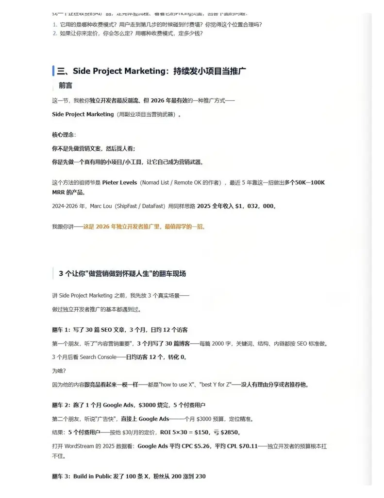

第三个朋友，听说"Build in Public 是新风口"，100 天每天发一条 X--一记录 MRR、用户数、新功能。
结果: 100 天后，粉丝从 200 涨到 230-一涨了 30 个，主要是其他 indie hacker 关注他 (不是潜在客户) 。
为啥? 他光说不做大事一发的内容都是"今天写了一段代码"、"今天 MRR +5"-一没有一件事让人想分享。

3 个独立开发者推广翻车现场

SEO 30 篇12 访客             Google Ads $3000 烧光“| | Buia in Pubiic 100 天张 30稳

[CEZEGCESD] NEEEEESCEZE]

如果你做过独立开发者推广，这 3 种翻车一至少踩过两种。

它们的根因只有一条-一
SEO / 广告 / 单纯 build in public，都是"各接推广-一你在解释你的产品。但用户根本懒得听。
20256 年独立开发者最高效的推广，是"直接给价值"一做一个小工具/小项目，让用户用完就记住你。

这一节，我教你 5 件事一

1. pieter Levels 的 Side project Marketing 是什么 一 5 句话讲清楚

2. Nomad List / Remote OK 怎么用 Side project 长大 一 pieter 自己的宗例
3. Marc Lou 怎么用同样思路做到 $1M ARR 一 2024-2026 最强案例

4. 张咱啦 + 王登科怎么把这套打法用在国内

5. 你怎么从今天开始 一 7 步具体操作

学完这一节，你能避开 SEO/广告 那种"烧钱不见效"的坑一用 1-2 个月做出第一个 side project 武器。

Side Project Marketing 是什么

5 句话讲清楚 一
普通推广: 你做一个产品 一 写文案/做广告/写博客 一 用户看了你的"宣传"。

Side project Marketing: 你做一个产品 一 同时做一些"独立可用的小工具/小项目"一 用户用了你的小工具 一 顺手
记住了你的主产品。

Side Project Marketing 的本质差异

/六 更人

CD
普通推广                                                  Side Project Marketing

>主人着 因凡人失了他人芍东机。

关键差异: 载体本身就是价值

普通推广里，博客文章 / 广告 / 视频是"营销载体"一它们本身没用，只为了告诉别人你存在。

Side Project Marketing 里，那些小工具/小项目就是营销载体一一但它们本身就有用。用户用完不会觉得"被推广-一
会觉得"哇，这工具好用，谁做的? "一然后顺手发现你。

载体本身就是价值 = 用户主动传播你，因为分享一个有用的工具不寺脸。

而分享一篇广告文章? 99% 的人不会做。

为啥这一招特别灵

3 个变化让 Side project Marketing 比以前更强:

1. AI 编程让做小工具成本暴跌-一以前 1 个月才能做的小工具，现在 1 周搞定。

2. 传统 SEO 被 AI 搜索稀释一纯写博客;         没流量。
3. 付费广告 CPC 越来越贵一-独立开发者打不住。

做有用的小东西，反而成了独立开发者最有性价比的"营销"。

Pieter Levels 怎么用 Side project 长出 Nomad List

讲膏概念，讲广师节宗例 -一这是 Side project Marketing 最经典的故事。

故事的起点

不是"我要做家旅游公司"，是"我自己要去哪城市远程办公”

2014 年，pieter Levels 是个数字游民一在不同城市远程办公。
他珊到一个真实问题: 去哪个城市适合远程工作?

互联网上没有现成答案一签证、房价、网速、咖啡馆密度、安全度等数据散在各种网站。
于是他做了一个最小项目: 一个可协作的 Google Spreadsheet，里面列了几个城市的关键数据。

第工阶段: Google Spreadsheet 一 网页
人们开始主动补数据一一他们也想要这个工具。
pieter 把表格做成网页，叫 Nomad List一一用户能给城市投票、补数据、看排行榜。

年 7 险和处，音外油 上 prndrt Hunt + Harkar Newc

不是 pieter 自己投的一别人蔡他投到 Product Hunt，然后)中到首页; 接着 Hacker News 也上了。

结果:

”2 周拿到约 2，500 个邮件订阅 (Pieter 本人 2014 年博客记载)
*，HN 给了约 50，000 个 unique visitors

*。 PH 给了约 12，000 个 unique visitors

第 3 阶段: 从工具长出商业模式

有了真实用户后，pieter 才开始想"怎么赚钱"一一

* 加付费会员 (深度数据 + 社区)

* 出广告位/ API

。然后从 Nomad List 流量复用，做了 Nomad Jobs (远程工作板)

。*。Nomad ]obs 长大后，抽成独立站点 Remote OK一首月约 100，000 unique users

关键洞察

他没有先做 Nomad List 再做营销一他做了一个有用的小工具，工具自己成了营销。

这就是 Side project Marketing 的本质一
不是"我有产品，所以做营销";
是"我做了有用的小东西，小东西自然带来用户和品牌

Marc Lou 怎么用同样思路做到 $1，032，000 / 年

10 年后 (2024-2026) ，最清晰的"后 Pieter 案例"是 Marc Lou。

Marc Lou 的产品矩阵

Marc 的产品矩阵

Marc 不是做一个大产品一一他连续做小项目:

产品                       卖给谁                                             收入数据 (自述)

ShipFast              帮独立开发者更快发布 SaaS 的            5 个月卖 $250，000 / 90% 利润 (2024)
boilerplate

CodeFast               编程教学课程                                    2025 年约 $20K/月

DataFast              极简 analytics                                2026 初约 $15.8K MRR

2025 全年总收入 ”一                                                   $1，032，000

Marc 的"营销武器"是什么?

他自己也说一不是 Google Ads，不是 SEO，是连续做小项目:

1 每个产品本身都很'side project 化一一单一功能、解决独立开发者真实问题
2. 公开收入 + 失败 (Build in Public 的 2026 升级版)
3. DataFast 用户分享 analytics 截图-产品本身澡传播

注意第三点一这就是 Side project Marketing 的精莫。
用户分享 DataFast 的截图，不是因为他们想推广 Marc一一他们就是想迷炊自己的数据，Marc 顺便被认识。

Marc 也踩了不少翻车坑

Marc 不是只成功一他 2026 年初的复盘自己也写了一一
*， BioAge 失败 (side project 没找到用户)

*。 ClipMarc 失败 (同上)

*。 TrustMRR 后续尝试 10 个 vertical，9 个失败

Side project Marketing 不是"做了就赢"一它是"做 10 个小项目，1 个爆"的游戏。
但跟付费广告比，做 10 个 side project 的成本远低于跑 10 次付费广告 一所以独立开发者算账更划算。
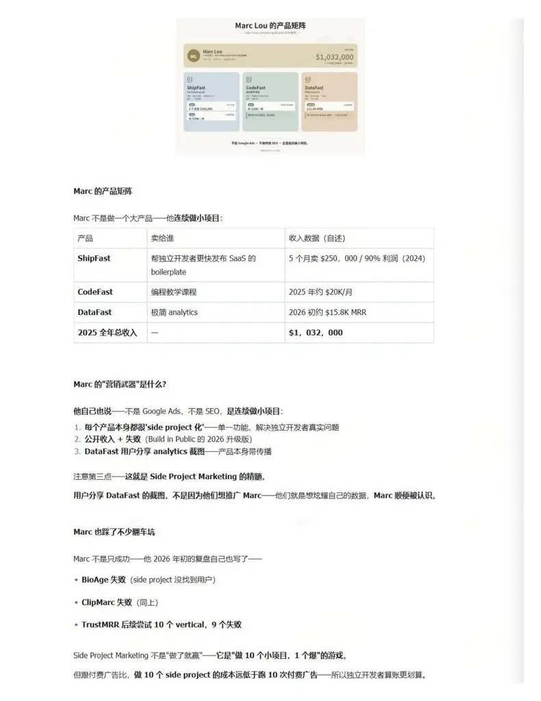

两个者外讲充了一一讲两个中国人。

张咱啦: 一个文科生，靠 side project 把小红书从 2 万涨到 18 万

张咋啦 (Zara) 的起点跟 技术大牛"完全不沾边。
之前在字节跳动飞书 marketing 部门，还在 GGY 纪源资本待过一一典型互联网商科背景，连一行代码都没写过。

2025 年她决定转行 AI 产品经理-一但没去报班，也没去考证。她干了 3 件事:
第一，自学: 用 Cursor + Google AI Studio 当老师，逼自己动手做东西;
第二，learn in public: 每周在小红书发"非技术人这周学了什么 AT"，把笨拙、错误、aha moment 全捧出来给人看;

第三，做 side project: 业余时间动手做了 LongCut 一一个 AI 视频学习工具，把 YouTube 长视频转成结构化学习区
(名字本身就是 "shortcut 的反义"一她的观点是学习应该走长路，看原视频而不是只看文字摘要) ;

同时做了 https://zara.faces.site/ai 一一把自己用过觉得好的 AI 视频、播客、newsletter、产品分门别类列出来，做成
一个免费目录站。

一年时间-一小红书粉丝从 2 万涨到 18 万，现在已经有近 30 万粉。

4

注意她的顺序一一不是先建个人 苹 ，再用 I 推产品。
是反过来 她做的每个 side project (LongCut、AL 资源站) 都自带传播力，顺手把她的个人 I 立了起来。

她有句常挂在虹边的话: “Follow builders, not influencers.”

过去 3 个月: 她把这句话又往前推了一步。

她不只是 follow builders一一自己也成了 builder。

GitHub主页: https://github.com/zarazhangrui

张咋啦 GitHub 上连续发了一些 skill 和小工具，star 数加起来已经接近 3 万:

* frontend-slides一一用前端代码做 PPT。19,000 stars (单这一个就比绝大多数独立开发者的 GitHub 总和还多) 。她

在视频号里讲: “用代码做 slide 这事，世界还没醒过来-一比绝大多数 PPT 工具好太多了。”

* follow-builders一监控 25 个顶级 AI builder (OpenAI、Anthropic、Cursor、Vercel、Replit、Google 的人) 的X和
播客，自动 remix 成日更摘要，安到你的 Claude Code 里。4,800 stars

* codebase-to-course -一把任何代码库变成漂亮的交互式 HTML 课程。4,500 stars
。， feishu-claude-code-bridge -一 习书 一 Claude Code CULI bot。584 stars
*。 youtube-to-ebook 一把 YouTube 转录稿做成 EPUB 电子书发邮箱。455 stars

*tab-out 一一个 Chrome 浏览器扩展，把新标签页改造成"任务控制面板`。关 tab 还有彩纸动画+音效。她做这个是
为了治自己开 200 个 tab 不关的毛病。1,387 stars

而这些东西也在反哺她的自媒体账号。

看出门道没?
她从"做内容涨粉"，升级成了"做小工具让别人下载"。
这是 Side Project Marketing 的最高级形态: 方法论本身变成了别人可以下载、使用、传播的工具。

别人每次 git clone zarazhangrui/frontend-slides，都是一次顺带的"记住张咋啦 "一一比写 100 篇方法论文章有效 10
信。

别老空谈方法论，去做点真实的东西，自然就有人记住你。

王登科: 一个意外引爆 68 万用户的"业余项目”

王登科这几年做了一长串 AI 产品一

* 6pen: 早期 AI 绘画工具，Disco Diffusion 时代就上线

*。 了哄哄模拟器: 用大模型做的"哄女朋友"游戏，2024 年初 24 小时涌入 68 万用户
* 独响: AI 陪伴产品，目前 60 万用户、5 万 DAU，已完成融资
*。DataWowsight: 开源数据库 AI 工具

* TheOne (2026/14) : 把 AI 角色接入微信当"联系人"，3 天 100 万注册用户

注意他的节奏一一不是冶头 3 年做一个大产品再推广。是每隔几个月发一个新东西。最出|
教过，你也会做的那个)

是哄哄模拟器 (就是前面

灵感来源很沙雕一他自己讲过，跟女友吵架的时候填出一个念头:“要是她头上有个进度条就好了，我哄她到 1009%

业余时间动手做出来 i05 版用 GPT 接口，后来为了顺便学 React，又重新做了个网页版。

一开始冷启动失败: 发到微博、即刻、X、V2EX-一"反响平平，只有几百人用"。

事情眼看就快这么过去了。结果第二天醒来，他发现在线人数在狂需。

他在自己的复盘里写一一"流量从黑洞来，根本看不到来源。”

后来才搞明白: QQ 空间一篇帖子被数二次转发，然后在无数 QQ 群里像病毒一样传开而 QQ 空间和 QQ 群是
个封闭生态"，从外面根本看不到。

24 小时数据:

* 第二天凌晨: 在线 2000 人

* 第二天早晨: 在线 5000，日活 10 万
。*第二天中午: 在线 2 万

* 第二天了晚 9 点 (被微信屏项前) : 已涌入 68 万用户

代价: 一唤烧掉 1 亿 token (约 $150) ，GPT 接口的 TPM 直接打满，1/3 用户用不上。

王登科紧急做了几件事一一粗暴限流 (50% 概率提示繁忙) 、找校友尹伯丘借 API 救场、最后全量切到 Moonshot 拿
免费额度。

危机救元了。但比 68 万用户更值钱的一一是这件事证明了一件事: 用大模型做"游戏化聊天体验"这条路能走通。
哄哄模拟器爆火那阵子，王登科一分钱营销费都没花，全网在车他打广告。

后面发生的，就完全是 pieter Levels 那个剧本一一

他从这个 side project 的成功里，长出了现在的主业: 独响 (AI 陪伴产品，60 万用户，5 万 DAU，已完成融资) 。

注意一他不是先想"我要做个 AI 陪伴 Saas 赚大钱"。他是先做了个让自己开心的小东西，用户和数据证明了这条
路，再决定 al-in。

续集: 2026 年 TheOne，3 天 100 万注册

产品地址: https://one.dxcat.cn/
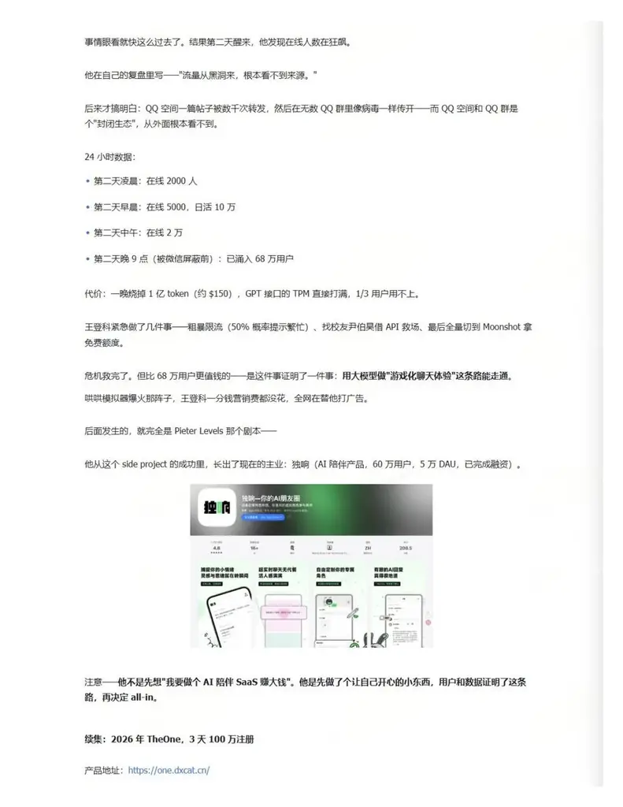

如果你只能用一个AL。 。 --
陪伴你

哄哄模拟器的故事已经是 2024 年的事情了。今年，王登科又干了一票更大的。

2026 年 3 月，微信史无前例地开放了一个插件，允许 OpenClaw 接入微信。
技术图炸了一一以后可以在微信里操纵服务器、用 AI 干各种事了。

但王登科想的是另一件事一一
"这玩意儿对我妇，有用吗?
技术图兴奋的那些东西一操纵服务器、跑代码-一他妈妈根本不在乎。

王登科的判断: 门槛高的部分应该由开发者拭，普通人只在微信里聊就行。

他和 Codex 几天就把 TheOne 搞出来了。
定位他也想得很清楚-一不做"效率工具"，做"情绪价值"一一让人在微信里有个可以随时诉说的朋友。

3 天 100 万注册

冷启动只在自己用户群放了。结果一一

* 4月 24 日白天: 在线从一两百激增到 1600
*。4月25日: 5千一2万一日活10万

* 4月 26 日晚 9 点 (被微信屏项前) : 68 万用户

*，3 天总计: 100 万注册

拌音、小红书、闲鱼全网炸-一拌音相关话题播放量几天破 1 亿。一天烧上千亿 token。
而那几天正好是五一假期一 科技圈豪无波澜。
但 100 万个普通人，在自己的微信里激活了"龙虾"。

更弘的是后面这段-一

王登科平时跟妈妈说话不多 (他自己原话:“加起来不超过 20 个 token"，用 token 当通讯量单位的人不多哈) ，干脆
做了个"电子儿子"一AI 假装是他，知道家里的事，定时关心妈妈。

妈妈用上瘾，回头又跟他要: “给你外公也来 个。”

于是又有了"电子孙子"。

side project 做到这一步一-给全衣配齐了 AI 亲属。
工具 一 长出商业一pieter 走过的曲线，王登科在中国又走了一这。
两个人的故事放一起，你会发现一个反常识 一

他们都没按计划增长:
* 张咋啦没设想"我要单靠小红书涨粉到 18 万"一一她设想的是"把学 AI 的过程记下来，顺便做个小红书”

* 王登科没设想"哄哄模拟器要爆 68 万用户"一他设想的是"业余学个 React 顺便玩个梗”

他们都是 side project 自己长出了路径，而不是按预设路线走的。

这就是 Side project Marketing 跟"传统营销"最大的区别一
传统营销像计划经济: 先想清楚转化路径再投入;
Side project Marketing 像市场经济: 先把东西做出来，让用户告诉你它该长成什么样。

而且 2026 年的国内环境，比 5 年前对独立开发者友好多了一X / 即刻 / 小红书 / V2EX/ B 站 / 拌音 / 微信公众号 /
甚至 QQ 空间 (别小看) 都是真实的传播渠道

关键看你做的东西够不够"独立可用"。

反潮流真理: Side Project Marketing 跟 SEO / 广告 的本质差异

讲充 4 个案例，送你一张对比表-一

三种推广 方式对比

ae          Cn          ae       D

至.。         人         Eee

二            二              Te

二     2    2

妆 罗       0     aa

2     Eee

0

维度         SEO             付费广告             Side project Marketing
载体         博客文章          广告位               小工具 / 小项目
用户的体感     "在看一篇文章"      "被广告打扰           "在用一个有用的东西

旦王全士动公言 翅少                                  nm亚不入                                  红学

ED了 wx一                 zu                 =

成本结构       时间成本 〈写文章)    现金成本 (CPC $5+ / CPL 。 时间成本 〈写代码)

$70+)
复利效应       中等 (SEO 慢慢起     弱 (停广告就没流量)      强 (小工具持续带流量)
效)
最适合               大公司 / 内容团队         有现金流的 SaaS                独立开发者

为啥独立开发者最该用 Side Project Marketing?
因为我们没钱投广告，没人写 SEO 文章一-但我们能写代码
代码就是我们的营销武器。

Wordstream 2025 数据: Google Ads 平均 CPL (每个潜在客户成本) = $70.11。
意思是: 你花 $1000 在 Google Ads 上，平均拿 14 个潜在客户-一 按 5% 转化率，0.7 个付费用户。
如果你的产品 $30/月，那 ARR # $360一一你亏了 $640。

而做一个 side project 的成本? 0 美金 + 1-2 周时间一一但它能带来长期复利流量.。
这就是为什么 Marc Lou 不投广告，只做 side project

你怎么从今天开始: 7 步具体操作

讲充真理，讲实操-一

Side Project Marketing .7步

一天他册订 ，拓出大，让它续为主产着生

了 多站过，伯的不是一个项目 是一个竺续为二产品和的交产

Step 1: 从你自己的真实问题出发或目标受众的重复问题)

最难的一步一但也是唯一:            扩有

pieter Levels 的 Nomad List 起点是"我自己要去哪个城市远程办公"一一这是真实问题。
如果你想不出真实问题，说明你不在自己的目标市场里。
先去你的目标市场待一段时间，真实痛点会自己浮现。

Step 2: 选"独立可用"的形态

什么形态最适合做 side project? 一般是这 6 种:

1. 工具 (免费 SEO 检查器、AI prompt 优化器)

2. 目录 / 排行榜 (最好的 100 个 React 库、AI 工具对比)
3. 模板 (Notion 模板、Figma kit、Cursor rules)

4. 检查清单 SaaS 上线前必查的 50 个 SEO 项)

5. 评分器 / 计算器 (SaasS 估值计算器、SEO 评分器)

6. 小游戏 (drawafish.com、wordle 类)

关键: 它本身要"立刻有用"一不需要看说明书，打开就能用。

Step 3: 用熟悉的技术做最小版本

不要为了炫技而拖延。
pieter 用的是 PHP + jQuery (2014 年的"老技术") ;

Marc Lou 用的是 NextS + Stripe (标准模板) 。

他们都用最熟的工具最快做出来。
2026 年这件事更简单-一 用 Claude Code / Codex 一晚上做个 MVP，充全可行。

Step 4: 发布前埋好 4 个"转化通道

这是大多数人忽略的一步一

发布前，确保你的 side project 里有:

1. 邮件订阅入口〈让访客留下邮箱，以后能再触达)

2. 主产品入口 (footer 或 navbar 里指向你的"真正想推的产品 )
3. 分享图 (0G image，别人分享时显示漂亮卡片)

4. 作者署名 (Made by [Your Name]，链接到你的 Twitter)

没有这 4 个，100 万访客也带不来一个用户。

Step 5: 到目标人群所在处发布

不要只发 Twitter。

按你的产品类型，选 2-3 个目标人群密度高的地方:
* product Hunt (综合，但门槛越来越高)

*。 Hacker News (技术 / 开发者类)

*。 Reddit 相关 subreddit (垂直社区)

。Betalist (还没正式上线的产品)
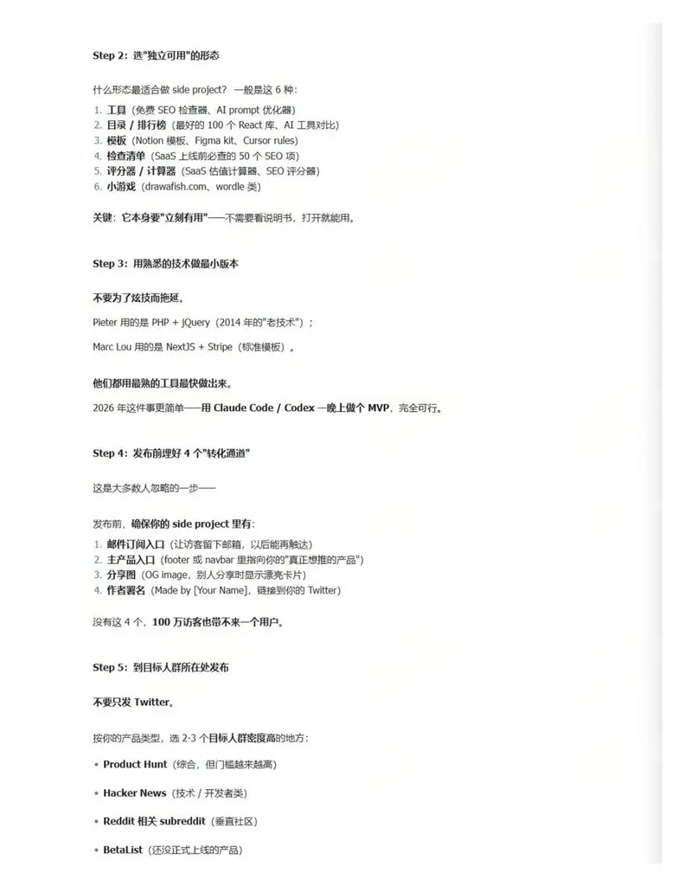

* Indie Hackers (独立开发者类)
*， Dev.to (开发者工具)
*。 Show HN (技术开源)

*TikTok / YouTube Shorts (视觉化、消费者类)

亚 5-10 个站同时打，比 Product Hunt 单站强 5-10 倍。

Step 6: 公开迁代，把反馈变成下一版

发布后别消失-一
* 回复每一条评论 (哪怕是负面的)
* 把用户反馈写进下一版 release notes

。 每周公开一次进度 (Build in Public)

这是 Marc Lou 做得最好的一他把每个产品的大代过程公开，用户跟着他成长。

Step 7: 复盘:; 这个 side project 给了你什么?

发布 3 个月后，复盘 5 个数据:

它带来了多少邮件订阅?

它带来了多少主产品付费用户?

它带来了多少反向链接 (SEO 资产) ?

它带来了多少社交内容素材 (截图、引用) ?

它给你主产品定位带来什么洞家?

这 5 个数据合起来评价 side project，而不是"它自己赚了多少钱"。

4 大翻车场景: 不要踩

讲充 7 步，讲 4 个真实的翻车场景-一

4大SeProlect恒车场

[TFT
四  sl00 万次itors    FT
入本昌
[Xaswams
和有         忆本区
Side Prajsct 天主产品过众没关系      二了又在村? 什么大这届下

思         er            n\

(             EREITI                    (          SRaisct电1          )

翻车 1: Side project 跟主产品/受众没关系

这是最经典的踩坑。

比如你做的是 SaaS 数据分析工具，目标用户是中小企业老板。某天你心血来潮，做了一个 wordle 类小游戏
火了,一周 50 万访客。

火呈

但打开 Google Analytics 一看: 来的人 80% 是 18-24 岁学生，平均停留 2 分钟，主产品页面跳转率 0.3%。
为啥? 因为玩 wordle 的人，根本不会成为你的主产品的客户。

这就像在素食店门口免费发牛排-一人来了，闻一闻就走，没人会进店点素食。

国内类似情况也很常见一

某些做 B2B 工具的团队，看 MBTI / 星座类小测试火，跟风做一个，一周冲上几十万访客，最后转化的付费用户: 个位
数，来的全是大学生。

可主产品是卖给 30 岁销售总监的一受众根本不对。

修法: Side project 必须跟你主产品的受众有重合。

发布前问自己一句: 用我这个小工具的人，会不会同时也是我主产品的目标客户?
如果答案是"不会"一别做。

翻车 2: 赌"病毒传播"，但没有可持续入口

你做了一个爆款小游戏，! 天 100 万访客。
但是一一网站没有邮件订阅入口、没有作者信息 (只有一个域名) 、没有主产品的任何链接、甚至没有 Twitter 。

3 天后，流量归零。100 万访客，你什么都没留下。

这就像在高速公路上撤传单一车呼吓而过，传单蒜了一地，但没有一辆车能停下来扫码加你。

国外有个著名故事一某独立开发者做了个 AI 头像生成器，3 天涨到 200 万用户，没埋邮箱入口、没主产品。3 周后
产品下线，0 资产沉淀。

他在X 发文: "I had the world for 3 days and lost it all”

同款故事每个月都在发生一某小工具一晚j冲上即刻热榜，第二天作者打开后台- 看: 没邮箱、没付费入口、没
Twitter，热度过去就剩 一个 Vercel 部考链接孤零零挂着。

修法: 4 个转化通道一 邮件订阅 / 主产品入口 / 分享图 / 作者寺名一必须发布前埋好。
流量是车流，你不在路边支个收费站，再多车也是白来。

翻车 3: 为了学新技术，做 2 个月，商业上接近打平

Marc K6hlbrugge 做过一个区块链 side project 叫 PAY.GAME，他用了 2 个月-一学 Solidity、学智能合约、学

最后只赚了约 $2，000 (主要是 ETH 升值) ，财务上接近打平。

如果折算成时薪可能比去奶茶店撒砖还低。

这就像第一次学开车，顺便去跑一趋泣注一你既要练换挡又要看导航又要想想怎么操作，乘客等得不耐烦，路也开慢
了，最后一单挣的钱可能还不够油费。

修法: Side project 主要用最熟的技术做。
别把 side project 当"学新技术的借口"一学新技术请单独花时间学，不要绑在商业项目上。
你的目的是验证"这小工具有没有用户"，不是验证"我能不能学会新框架"。

翻车 4: 有受众也不一定成功

Marc Lou 你已经认识了。但他自己也失败过
* BioAge 失败 (生物年龄计算器)

* ClipMarc 失败 (视频荔辑工具)

* TrustMRR 兰试 10 个 vertical，9 个失败。

更早的 pieter Levels 也说过同样的话一一他在 "12 startups in 12 months" 挑战里做了 12 个项目，真正活下来的就
Nomad List 和 Remote OK 两个，其他 10 个基本没人用。

所以即使你方法对、受众对、动作对一一也有 8/10 的 side project 不会火。

王登科自己在播客里也提过，他做的产品里真正出图的不到一半，但因为他做得多、做得快，那一半就撑起了整个个人
品牌和现在的独响。

Side project 是 10 选 的游戏一不要赌一个就能赢。
修法: 多做几个小的，观家哪个有用户反应一然后把资源 push 到那个上。

把它当种树游戏，不是狙击枪游戏。

2026 年最新的 5 个 Side Project Marketing 玩法
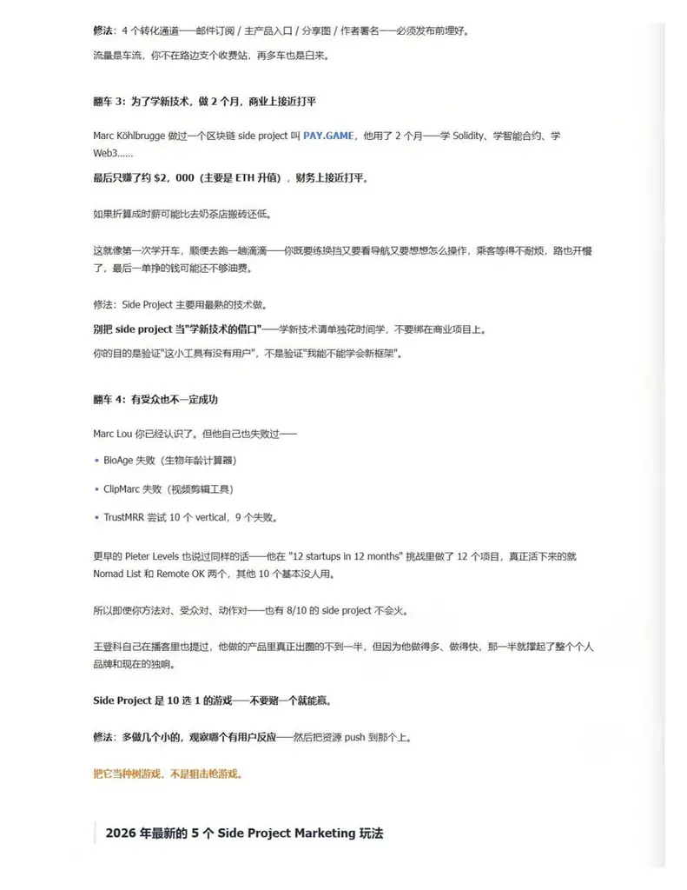

最后送你 5 个最新的玩法一

5个Side Project Marketing 玩法

2

站 和

玩法 1: AI-assisted micro tools

这是2026 年最大的变化一一做小工具的成本，比 2014 年 Pieter Levels 那时候降了 10 信。

那时候 pieter 做 Nomad List，两个月写一个网页; 现在你用 Claude Code 或 Cursor，一晚上能的出一个能跑的 MVP。

现在用 AI 编程一隐上就可以做一个小工具，而且成本低到你可以"试错 10 个，只留 工个"。
以前根本不敢这么玩，单个的开发成本太重了。

以前是手工挖矿一一你必须挑最厚的矿脉挖，挖错就亏死;
现在是机器挖矿一一你可以多挖几个洞试试，反正机器不票。

但有一件事 AI 解决不了: 挖洞的位置还得你自己挑。

AI 让生产成本降低，但选题能力反而比以前更重要-一以前同一时间只有 100 个开发者能做小工具，现在有 10000 个
都在做。

比"做"更难的，是"做对"。

你打开X或 Indie Hackers 看一眼就知道-一每周者有人发"用 Codex 一隐上做了个 XX

这种节奏在 2 年前充全不可想象。但里面真正活下来的小工具有多少? 还是那 59%。

玩法 2: Build in Public + 公开收入

把开发日志、收入、失败、用户反馈变成连续内容一一让用户看着你成长。

Marc Lou 是模板一一他公开 ShipFast / DataFast 的 MRR 截图，定期写 newsletter 复盘一这件事本身就是一种
营销。

为啥这招灵?

打AH亡， 盐池广生售斌比由向和要 an 利部关子，poild in pihlr 条部在纯加。如:al知 < 佳人如王后 K 储

5 Tb ，目好| 口卡旺IR门，全辣 vu yat bunu mi ru 阵 nbsx癌，国zs 天二十辣站 v天。

但警告: Build in Public 不是"日记本"，是"故事会"一一你得有故事。

光发"今天写了一段代码"没人看-有真实里程碑 (MRR 涨幅 / 用户数 / 失败教训 / 重大决策) 才有内容价值。
每周问自己一句: 我这周有没有一件值得发出来的事?

连续 3 周没有一说明你产品本身没进展，发啥都没用。

玩法 3: UGC / 截图传播

所有玩法里最划算的一招一让你的产品自带"用户想截图分享的瞬间"。

最经典案例: Spotify Wrapped。

每年 12 月，全 X、Instagram 都是用户晒自己的 Wrapped-一"我今年听了 4 万分钟"、"我的 top artist 是 Taylor
Swift一Spotify 一分钱不化，全球用户主动给它打广告。

国内也有同款套路: 网易云音乐年度听歌报告、淘宝年度账单一每年一波自然传播，谁都拦不住。

DataFast 也是这样，用户用 3 天就抠出了漂亮的 analytics 截图，他们想发 X 炫耀"我这个月有 5 万访客"Marc 顺
便就被记住了。

这就像给每个用户发一面带你 logo 的小旗子一他们自己挥着旗子到处跑，顺便把你 logo 喜出去。

设计你的 side project 时间自己 3 个问题:

1 用户用完后，最自豪 / 最有趣的成果是什么(数据?作品? 分数? )
2. 这个成果适合截图吗? (一张图能讲清楚吗? )
3. 截图里能不能自然带出我的产品名 / logo? “〈别太硬，但要在)

3 个都对-你就有了一台自动印钞机。

玩法 4: 短视频化 (TikTok / YouTube Shorts)

把 side projedt 的"前后对比 / 构建过程 / 收入复盘 / 失败教训 拆成 60 种短视频。

比较典型的例子 一Fireship
他那种"100 秒讲完一个技术栈"的 YouTube Shorts 每条都几十万播放，被一批 indie hacker 当成模板模仿。

B 站和小红书上也有一批"独立开发"类博主，靠拆解自己的开发过程涨粉一一粉丝就是潜在客户，比任何广告渠道都精
准。

比如: 第四种黑猩猩 (李超) 。

看一下他的内容和矩阵:
*。B站: 7.5 万粉丝

* 小红书: 9.8 万粉丝

* 视频号: 单条视频最高点鞠1.4万

4

内容核心: AI 模型对比 / AI 工具实测 / side project 复盘 / 开源 Skill

代表帖子标题感受一下密度一一

*， "pi Agent: 比 Claude Code 和 Codex 更适合普通人的 AI 工具”
*， "Deepseek V4, Opus 4.7 GPT 5.5, GLM. 5.1, Kimi K 2.6 对比”
* "因为我的 AI 挑战，认识了红杉资本投资人"

*， "OpenAI 的新服务，大大被低估了”

注意他的玩法-不是空谈"AI 趋势"，每条都有实测 + 判断 + 个人立场。

这就是短视频版的 Side Project Marketing: 你的判断本身就是产品。

把"做项目 一 拍视频复盘 一 开源 Skill 一 下条视频再讲"绑成一个内容和矩阵一做一遍，三次复用: 项目本身是 1 次产
出，视频是 ! 次传播，开源 Skill 是 1 次留资产。

国内 B 站 / 小红书 / 拌音上有越来越多这种"独立开发"类博主，靠拆解自己的开发过程涨粉一粉丝就是潜在客户，比
任何广告渠道都精准。

建议: 先用 1 个月低成本试一试-一拍 10 条短视频，看看哪种内容形式能起量。

起不来就停。别跟自己较劲。

玩法 5: 目录 / 数据库 / benchmark

做一个别人会引用的目录或数据库，大家讨论某个话题时都绕不开你的数据，你就赢了。
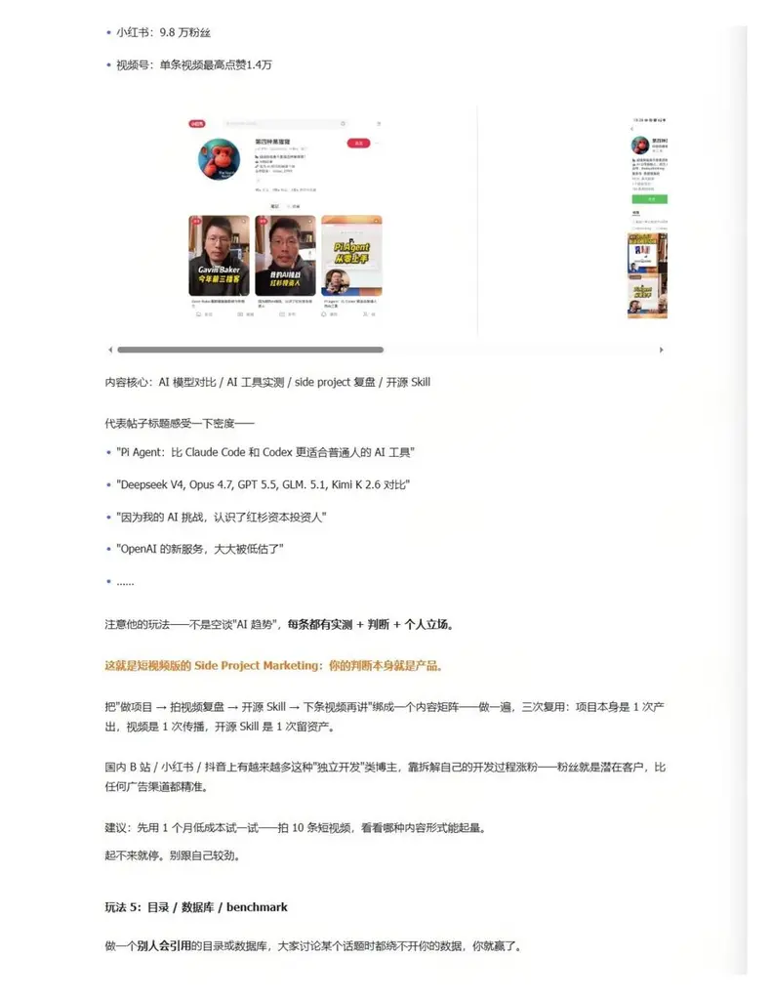

举几个例子:
* "100 个最好的 Notion 模板”

* "AI 工具对比 benchmark (2026) "

* "indie hacker 收入数据库”

这就像做这个领域的"维基百科"一一旦权威性建立，你的链接会出现在别人写的文章里。

最猛的案例: GitHub 上的 Awesome 系列。

sindresorhus 这个挪威开发者，靠维护一长串 awesome-XX 列表 (awesome-nodejs、awesome-react、awesome-
electron.….) ，把自己变成了 GitHub 头号 JP一一70 万 followers，他做的每个新项目都自带几万 stars。

AI 引擎特别喜欢引用结构化数据-你做的 benchmark / 数据库 / 目录，会被 AI 当成答案的来源。

一次做好，10 年都在帮你引流一一这才是最高级的复利。

为什么这是 2026 年独立开发者必学的一招

回到这一节开头那 3 个翻车一

翻车 1 (SEO 文章 30 篇日均 12 访客) : 间接推广没人理
翻车 2 (Google Ads $3000 烧光) : 付费广告算不过账
翻车3 (Build in Public 100 天涨 30 粉) : 光说不做没人分享

避开这 3 个翻车，你的推广效率比 80% 的独立开发者强。

2026 年独立开发者最值钱的推广，不是"广告"或"内容"，是"你做的小东西本身就值得被分享"。

代码就是你的营销武器。
AI 让做小东西的成本降了 10 倍，做 10 个小项目，留 1 个爆。

这是属于独立开发者的黄金时代。

作业

挑你手头任意一个产品，做这 5 件事一

1. 列出"我自己 / 我的目标用户"3 个真实痛点
不是脑补的一是你真实在生活中遇到过 3 次以上的癌点。

写下这 3 个痛点。每个工句话。

2 据工|      MEIT一小slue ploJect

按 6 种形态 (工具 / 目录 / 模板 / 检查清单 / 评分器 / 小游戏) 选一个匹配的。
写一份1 页的产品规划: 做什么、谁会用、为啥会传播。

3. 用 AI 编程一周内做出 MVP
用 Galaude Code / Codex，一周内做出最小可用版本。

别追求完美 一能跑就发。

4. 发布前埋好 4 个"转化通道

按 Step 4 检查: 邮件订阅 / 主产品入口 / 分享图 / 作者署名一一4 个都有。

5. 多平台同时发布，然后复盘

按 Step 5 选 5 个发布平台，同一天发。

3 个月后复盘 Step 7 的 5 个数据 判断这个 side project 值不值得继续投入。

这一节结束一下一段你想去哪》 增长篇还有更多内容。

| 四、海外 Launch 实战: Product Hunt / Reddit / HN 多平台发布
前言

这一节，我教你独立开发者最难、但回报最大的一件事一

怎么把你的产品 launch 到海外多个平台，同一天打出最大声响。

学充这一节，你能避开 80% 中国独立开发者首次海外 launch 翻车一同时第一次 launch 就拿到几干个真实访客。

3 个让你"准备 3 个，launch 当天 0 转化"的翻车现场
讲 launch 之前|我先放 3 个真实场景一做过海外 launch 的中国独立开发者基本都遇到过。
翻车 1: All-in product Hunt，元到首页，第二天回归 0

第一个朋友，听说"product Hunt 是 launch 神器"一一
3 个月精心准备: 做 demo 视频、设计 0G image、找 hunter 推荐、约朋友帮有投票。

launch 当天上首页，拿了 200 多个 upvote，Top 10一一他兴奋得不行，觉得"成了"。
第二天打开 Search Console: 当天访客 50，转化 0。

为喻?

因为 2026 年的 product Hunt--一约 68% 的独立开发者 launch 感党"完全没动静"一除非你有几千粉丝在第一小时
帮忙投票，算法不会推首页。

而且 product Hunt 给的链接是 NoFollow一一不传递 SEO 权重.。

翻车 2: Show HN 发了精美产品介绍, 被 down vote 沉到 100 名外

第二个朋友，听说"Hacker News 流量很猛"一

写了一个 完美的 Show HN: 产品介绍 + 截图 + demo 视频链接 + "我们解决了什么问题"他觉得"这就是 HN 风

发出来 1 小时一被 down vote 沉到第 5 页，基本没人看到。

Hacker News 文化反"产品营销"一一HN 用户喜欢看技术深度 / 工程挑战 / 开源 commits，不爱看 marketing 套
话。

正确姿势: Show HN 应该写"我做了 X，这是技术细节，这是 GitHub link'-一让用户感觉这是工程师跟工程师交流，
不是销售跟客户。

翻车 3: Reddit 发了链接，5 分钟被 ban

第三个朋友，听说"Reddit 流量大"一一
注册一个新账号，直接到 r/Saas 发了个产品链接: "Hey guys, I built X, check it outl"

5 分钟后: 账号被 ban，链接被而。

为啥? Reddit 反"广告新人"一一
* 新账号 + 直接发链接 = 即刻被识别为 spam
* 没有 karma(社区活跃度)就发产品 = 被 mod 直接删

* 文化上 Reddit 用户讨厌"自我推广-一发产品要包装成"分享经验 "或"问问题`

上首页又怎样 流量是流星 ”| HN 文化反 marketing         二 新账号 + 直发链接 = spahmn

如果你做过海外 launch，这 3 种翻车一一至少踩过两种。

它们的根因只有一条-一

每个 Innrh 亚全者丰白忆的"立水"En"简尘"田错7了姿热”准秘雨亦分出占过

launch 不是"我把产品挂到平台上，等人来"。
launch 是"我尊重每个平台的文化，用对应的姿势在那里发声"。

这一节，我教你 4 件事-一

1. 2026 年 Product Hunt 的真实现状 一 还要不要做? 怎么做才不翻车

2. 6 大主流 launch 平台的"文化 + 姿势" 一 product Hunt / Hacker News / Reddit / Betalist / SaaSHub /
AlternativeTo

3. Multi-platform Launch Stack 的 14 天时间线 一 当天 + 后绫 30 天

4. 中国独立开发者特有的 4 个挑战 一 时区 / 英文 / 文化 / 付款

学完这一节，你能从"什么都不会"到 第一次 launch 就拿到几干个真实访客 "。

海外 launch 跟国内有啥不一样?

5 句话讲清楚-一
国内推广: 微信 + 小红书 + 抖音-一算法导向，产品好就有流量。
海外推广: 社区 + 平台 launch + SEO/GEO-一文化导向，你必须懂每个平台的"语言"。

国内你可以"直接发"一 海外你必须"先入乡随俗，再发声 "。

为啥 launch 这件事在海外特别重要?
3 个原因:
1 海外没有抖音那种"算法推送"一大部分流量靠"社区/平台/搜索”

2. launch 平台是首次曝光的最大机会一 一次成功的 aunch 能带来 5,000-50,000 真实访客
3. launch 拿到的链接多数是 DoFollow-一长期 SEO 权重(后面我们会详细讲)

一次成功的海外 launch = 当天流量爆发 + 长期 SEO 资产 + 第一批种子用户-一三件事一起拿。

6大 Launch 平台

=
和

6大Launch 平台对比

和ls

04               05
os               |
车z          areme

an站，才是TD

ee
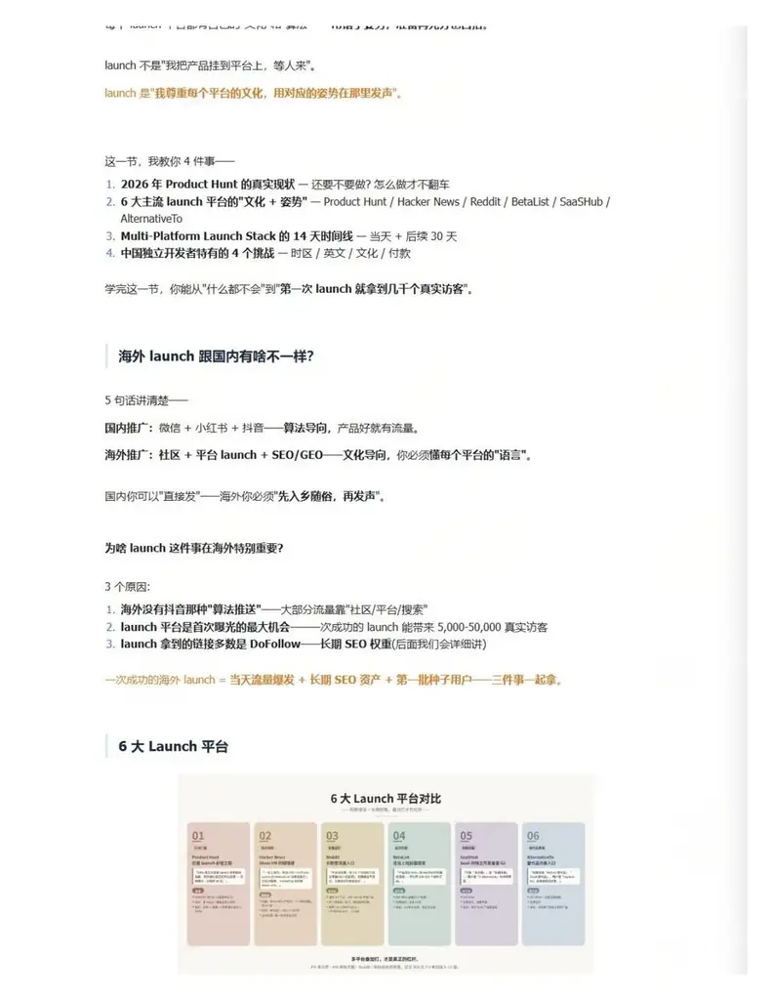

2026 年 product Hunt 的真实现状

链接: https://www.producthunt.comy/

还要不要在 product Hunt 上 launch?
我先把答案摆在这里一
做，但不能 alhin。

为喻? 因为 2026 年的 product Hunt，是这样的-一

第一个真相: 流量价值在跌。

68% 的独立开发者 launch 完觉得"没动静"。给你的链接是 NoFollow，SEO 权重接近 0。流量集中在前 5 个小时，过
了就剩夕阳。

第二个真相: 它仍然是行业门面。

记者、投资人、海外用户，依然在 PH 上找新产品。你没在 PH launch 过，你的网站、Twitter、邮件签名上就少一块
badge -一少了，就是少了一份"专业"的暗示。

第三个真相: 这游戏真正的杠杆，在后面。
PH 首页每天都会挂"昨天的日榜 + 上周的周榜 + 上月的月榜"一一
周榜曝光 = 日榜的 7 倍 月榜曝光 = 日榜的 30 倍

你今天冲日榜第一，明天就上首页 24 小时。这周冲了周榜，你在首页挂 7 天。这个月冲了月榜，你在首页挂整整一个
月。

这才是 PH 的真正价值。
不是当天那几个小时的爆发，是后面 30 天的身平曝光。

所以重申一遍-一

做: 因为门面 + 长尾。
不能 al-in: 因为它只是 6 大 launch 平台之一，它的流量价值在下降.

插一句一一下面这套方法论，我吸纳了一个人的开源 playbook。

她叫生姜 iris。

AFFINE 前 CO00、Forbes 亚洲 30u30、亲手带过 30+ 个产品拿下 PH 日榜第一，里面有 Manus、Devin、AFFINE。
她把这一整套打法 MIT 开源了，可以自由引用。完整 playbook 链接放在文未。

我这里只讲核心，更细的“(票仓群链接、Reddit 养号方法、LinkedIn DM 模板、PH 客服邮箱.……) 可以直接去看原
版。

飞书wiki: 【Gingiris】product Hunt Actions Review

GitHub地址:

https://github.com/Gingiris-1031/gingiris-launch

https://github.com/Gingiris-1031/gingiris-opensource#9%bE4%B89%AD9%E69%969%879%E79%899%88

product Hunt launch 的 5 个关键准备

如果你决定做 PH launch，这 5 件事必须前 1 周准备好:

Product Hunt Launch 的 5 个关键准备

oil 人un 二8

sn- conrorn

1. Hunter: 找一个有 1000+ followers 的 Hunter 帮你 launch (自己 Iaunch 流量小一半)

Hunter (猎人) 是 product Hunt 上的一种特殊角色-一

指代共产品方"提交并发布"产品的人，相当于产品 launch 那天的"主持人 / 担保人"，他的粉丝数和影响力会直接决定
launch 当天的初始曝光量。

先选 Hunter，再做别的

听上去反直觉对吧?

你以为最该花时间的是产品、是 tagline、是 demo 视频。

错。

最该花时间的是一 找一个对的 Hunter。

头哈7

因为你自己以 maker 身份 launch，流量小一半。一个有 1000+ followers 的 Hunter，相当于一个免费的开屏广告。

但 Hunter 不是越大牌越好。先看看真实价目一一

完整名单: launchpedia.co/product-hunt-hunters

国人 Hunter 怎么选?

baishun 、Shawn 、Victor 这几位，主观能动性强，会主动转推 + 拉票。

但有一个 2025 年才出现的坑一一
国人 Hunter 的产品，偶尔不被 feature。
PH 算法在悄悄歧视国人 Hunter

所以-一

如果你的产品只有一次 launch 机会，老老实实找外国 Hunter。 如果你有信心或者想交国内朋友，找国人 Hunter 也
行。

跟 Hunter 怎么开会? 拿 Chris Messina 举例-一

* 60 分钟会议: 前 20 分钟介绍项目，10 分钟 QA，最后 20 分钟过 PH 内容+ 问能不能推特/LinkedIn 宣发合作

* 30 分钟会议: 10 分钟介绍 + 10 分钟点评 + 10 分钟过内容

建议先把内容框架做好再约 Hunter，时间效率高。

2. Tagline: 60 字符以内，直击靖点一一别玩巧妙的双关

海外用户没空猜你。我见过太多团队把"ALpowered next-gen productivity suite "这种话当 tagline，转化率惨不忍睹。
写法是反过来一把你的产品当成一个动词或一个具体场景，

"Notion alternative for engineers"比"Next-gen workspace "打 10 倍。

3. Gallery: 5-7 张截图 + 1个 60 秒 demo 视频(GIF 也行)

截图顺序很重要一一第 1 张必须是"产品在做最爽的那一刻"的画面，
不是 logo / loading 页 / 设置页。
PH 移动端只默认展示第 1 张，90% 的用户在手机上扫一眼就走。

4. Maker Comment: 你自己作为 maker 留第一条评论一一讲故事 + 问问题(引用户互动)

账号注册时间最好 2 周以上，看起来不像小号

很多人忽略一件事一
Maker 自己在 PH 上写的第一条评论，决定当天转化的 50%。

不是因为 PH 算法奖励你写评论，是因为这条评论会被钉在所有评论的最上面，所有 upvote 路过的人都会读它。提前
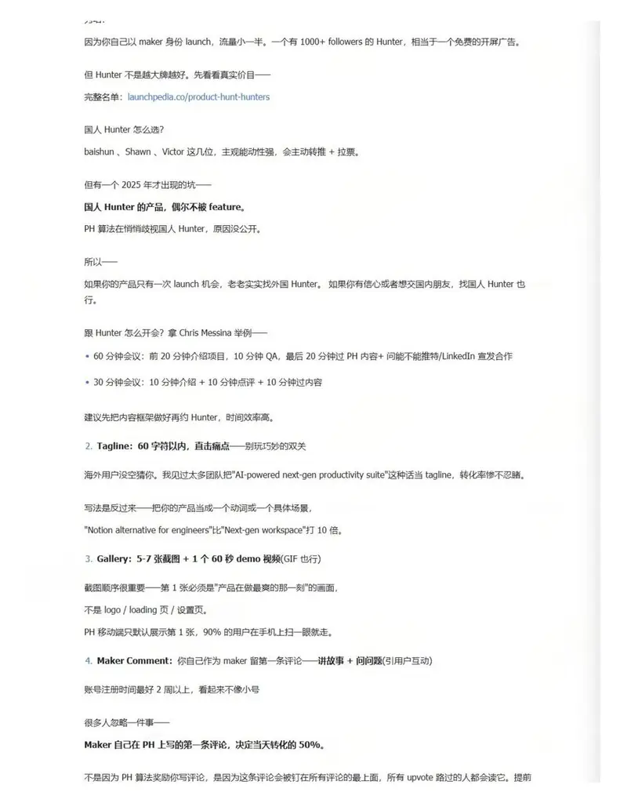

准备好草稿。
那这条评论应该写什么?
* 一个 coupon 链接 一刺激付费转化

。一个 Discord (或社区) 链接-一把 PH 来的真实用户导流到自己的池子里二次竹选

剩下的就是讲故事、问问题、引互动。

5. Launch 时间:
iris 给的两个时间窗-一
* 只想冲日榜第一? 选周五 / 周六 / 周日。 周末 Feature list 上榜项目少，竞争弱。

* 想冲月榜? 选每月的第二周或第三周的周二。 避开月初月末大佬扎堆。

判断当月的竞争烈度，有个神器-hunted.space。
它能让你看 10 天的票数趋势。提前 1-3 周打开看一眼，你大概就知道这个月的"过线分数"是多少。

最后一临门一脚的 下48 倒计时:
* 邮件列表三连提醒 (72 / 48 / 24 小时各发一次)
。 多平台同步素材就位 (Show HN / Reddit / Betalist banner)

* First Maker Comment 草稿写完一别想着当天再现写

product Hunt launch 当天的 5 件事

1. 00:01 PST: 产品上线，maker 第一条评论发出

2. 第 1-3 小时: 社群通知(Twitter / IndieHackers / 你的邮件列表)-一前几小时 upvote 决定全天排名
3. 第 4-12 小时: 回复每一条评论一一PH 算法看互动度，AFFiINE 当年就靠这条吃了 5 个月长尾

4. 第 13-24 小时: 准备多平台同步 Hacker News / Reddit / Betalist(参考下面)

5. 第 25-72 小时: 复盘 + 写"launch 复盘"文章(再带一波流量)

但是注意一一

有两条没人告诉你的隐藏规则。
你不知道，你就白干。

隐藏规则 1: 每小时 upvote 控制在 100 以内

2024 年 5 月，PH 平台改了算法。
系统现在会主动拉票一一你拉得越垒，他扣得越狠。每小时超过 100 票，就开始扣。

我看过有项目兴奋地冲到第 5 小时拿了 800 票，结果第二天醒来发现被扣回 300 票一日榜第一变第八。

所以你拉票的节奏，应该是均匀分布。

不是一窜蜂往前)趾，是匀速领跑。
隐藏规则 2: 同地区 ID 太多，也扣

办公室里 10 个同事一起 upvote?

他们的 I 会被 PH 识别成"同源刷票"。

正确姿势-一
手机端 + 4G 流星 (别连 w痢) + VPN。每个人切一个不同地区的 VPN 节点。

听上去有点过敏，但 iris 跨 30+ 项目验证过一一
不做这件事，你的票数会无声无息地少 1/3。

|顺便说个"过期攻略”

PH 在 2025 年 9 月把 Notify Page 功能取消了。
如果你看到任何 2024 年甚至更早的攻略告诉你 提前 1 周准备 Notify Page 国票一

别照做。已经没用了。
出意外了怎么办?
打榜当天最怕的事: 产品没被 feature。没被 feature，你前面所有准备都打折扣。

三个抢救渠道-一

1. Twitter 上私信 PH 的 CEO 直接解决 最快)
2. 邮件 PH 官方:

* hello@producthunt.com
* sumanchoudhary@product-huntintercom-mailcom
= rajiv@producthunt.com

* 回复时间是美国上班时间，对应北京时间晚 7-11 点

3. PH 首页右下角放大镜 全 直接联系客服
记住这几个邮箱，关键时候能救你的命。

怎么拉到上于 upvotes? iris 实测的渠道 ROI 排序

iris 把所有渠道按 ROI 排了个序 -一

怎么拉到上千 upvotes

ITP
SR
EB
ER
ES

第一名: LinkedIn，DM 反馈率 60%

ULinkedIn 是所有渠道里 ROI 最高的，主要因为-账号难被 ban。

5个LinkedIn 会员 + 实习生，保守一天能拉到 1000 upvotes。

但是有讲完一
*。 别 DM 综合背景的 KOL，他们只会找你谈付费合作
* 国 优先 DM 头衔是 maker / founder / core-member 的人，他们最容易给你 upvote

* 工具: phantombustercom

第二名: Reddit，但要先养号

刚注册的 Reddit 账号别上来就发产品。会被 ban。先用"猎狗图大法"养养号。

"攻狗图大法"是这样的-一
去小红书搜一些好看的猫咪狗子图，发到 /catpics 或 [dogpictures。 一天能刷 200 karma。

Karma 80+ 才能开始正经发产品贴。

2025 年 Reddit 更严了-一注册账号后先潜水 1 周再发帖。
听上很去离谱，但有效。

Reddit 实测数据: PH launch 期间，累计曝光 3-4 万，upyvote 转化率约 1%。也就是说每发一个 sub channel，能换
100-300 个真实 upvote。

值得发的 sub-一
。 开源类: r/selfhosted、r/opensource、r/coolgithubprojects
。， 创业者类: [/Saa5、r/Sideproject、mEntrepreneur、ryindiehackers

*。 生产力类: r/productivity、r/ProductHunters

发帖小技巧一在你要发的 sub 里搜"况品 / PH 宣发"的旧帖。能搜到的，说明这种格式没问题，你照着写就行。

第三名: Telegram 票仓群重点是 DM，不是发帖)

这几个群里基本都是高权重 PH 账号。但进群直接发帖效果差，一对一私信互投才好使-一

*。 tme/productHuntMafiaBoost (最大)
* tme/productHuntRussia

。 tme/producthunters

*， tme/productHuntChat

*， tme/growthproducthunt

第四名: 中文出海社群 (华人独立开发者的隐藏buf

这是只有华人开发者能拿到的优势一

。 深思图

Product Hunt 硅谷产品捕手

压
申
可
息
吵

(真格 Monica 的群)

哈希出海 〈哈希增长的群)

Linkloud 寻宝团 (高宁 / ]K 的群)

中文出海图"互相帮忙"是真的有效。

第五名: 邮件列表 (如果你有用户 base)

提前 72 / 48 / 24 小时三连邮件提醒。 Launch 当天邀请用户写 review + comment。

响应率取决于你的产品做得好不好。你产品做得烂，邮件发再多次也没用。

但有一招可以激励一一
送 token / coupon / 早鸟权益。
AI 产品可以送 token，付费产品可以送 coupon，开源项目可以送贡献者名额。

真实案例: 3 个产品的实际跑法

iris 的 30+ 个 PH 日冠里，有 3 个是大家最熟的一一
*， Manus (AI Agent) 一 Twitter 海外预热为主，靠 KOL DM 拉的票
”Devin (首个 AT 软件工程师) 一 技术深度叙事，HN 同步爆款

。*，AFFiNE (开源 Notion 茜代，60k stars) 一一 PH launch 之后 5 个月内 GitHub Trending 上榜 28 次

AFFINE 那个 28 次 trending 是怎么来的?
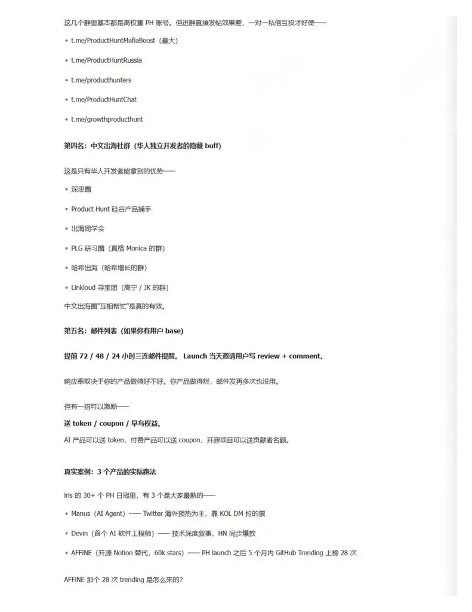

不是 launch 当天的运气。

是当天每一条评论都回了一一之后 90 天，用户搜"开源 Notion 蔡代品"的时候，他们的 PH 页面带着所有那些评论一起
被搜索引警收录、被 ChatGPT 引用、被 Reddit 二次提及.……

这才是 PH launch 的真正价值。
看的不是 launch 那一天，是后面的 90 天。

Hacker News (Show HN): 技术深度的战场

链接: https://news.ycombinatorcomy/

Hacker News 是技术图最有影响力的 launch 平台。
流量爆发力最强-一 一旦上 HN 首页，单日 50,000+ unique visitors(Pieter Levels 的 Nomad List 当年就是)。
但批评最狠一HN 用户毒舌，瑕辣会被无情挑出来。

Show HN 的 5 条潜规则

1. 标题格式: Show HN: [产品名] - [一句话功能] -一别加 emo访别加营销问
2. 正文要有"技术深度"一讲技术挑战，不是产品营销

3. 必须开源 / 至少有 GitHub link(强烈仿好)

4. 第一条评论自己回-一 为什么做"+ "用什么技术" + "求反馈”

5. 避免"我们"、"团队"等公司化语言一HN 偏爱单独 founder / hacker

Show HN 的最佳发布时间
*。 美东时间周二/周三 6-10 AM(美西凌晨 3-7 AM)

* 避开: 周五 / 周末(流量低)、美东 12 PM-3 PM(竞争激烈)

生姜 iris 单独写了一本 05S / HN 的姓妹 playbook: gingiris-opensource (MIT 协议) ，里面有专门一节叫 "Show HN
上首页 vs 死在 #30 的差别"。

我把她最有杀伤力的 3 条结论摘出来-一

iris的O0SS1HN       book

结论 1: GitHub Trending 算法只看 star velocity，不看绝对值。

很多人以为 Tending 是看你 star 总数，错了。

iris 的原话一一 The algorithm looks at star velocity not absolute count. 150-300 stars in 48 hours is usually enough
for a niche language list”

也就是说，如果你的项目是 Rust / Elixir / Zig 这种相对小众语言的赛道，48 小时内 150-300 个 star 突刺就够上
Trending。

不是要你刷 10k，是要你集中 48 小时。

结论 2: 找微型 KOL，不是找大 V。

谁能给你带 10k stars? 不是 100k+ 粉丝的科技 V。

去 GitHub 搜你的赛道里 1k-10k stars 的项目〈不是 mega star) ，找到 maintainer 的 Twitter，看他过去是否发过类
似项目的推。

这种"微型 KOL 的 engagement rate 远高于百万粉账号。因为他的粉丝就是你的目标用户一一其他写代码的人。

结论 3: Show HN 标题必须暴露技术栈。

刚才说过 Show HN: AwesomeApp - Open-source Notion alternative built with Rust 是好标题。

那为啥"buitt with Rust"这种东西必须出现?
因为 HN 文化是一 先看技术，再聊产品。

"buitt with X 这种后组本身就是给第一批 hacker 看的暗号: 你的项目和我有同一种语言。看到熟悉的技术栈会愿意点
进去，

看到"AILpowered next-gen suite "这种营销话会直接划走。

built with Rust / built with Elixir / built with Go 这种后缀，不是写给 marketing 看的，是写给第一批投票的 hacker 看
多

一个让我血压颖升的 Show HN 翻车例子

我看过一个朋友的 Show HN 标题:89 Introducing AwesomeApp 一 The Next-Gen AI productivity Suitelll

发出去 30 分钟，5 个 down vote, 被 fag一一HN 用户立刻识别出"这是 marketing "。

正确写法应该是:Show HN: AwesomeApp - Open-source Notion alternative buit with Rust

差别在哪》 第二个版本告诉你"我做了什么 + 用什么技术"一一HN 文化是先看技术，再聊产品。

ShowHNDOvsDONT
show hN 种妆执             四 gsovmaman             人@
了 wwoaucnghweeeropep NaaemA         eolee neromahep - open eueeiean
ea                               re

es

HN 文化-先加技术两产品

Reddit: 反广告文化的细分社区

链接: https://www.reddit.comy/

Reddit 是长尾流量金矿一一但进入门槛最高。

"PH 拉票渠道"里提到的"快速养 Reddit 号"是战术一一80 karma + 1 周潜水，专门为打 PH 票仓服务。

这里讲的是把 Reddit 当长期增长渠道一500+ karma + 3-6 个月养号,
两套打法，对应不同目的。

为啥独立开发者爱踩 Reddit 坑?

因为 Reddit 的反广告文化比 HN 还严:
* 新账号(<3 个月)直接发产品 = 99% 被 ban
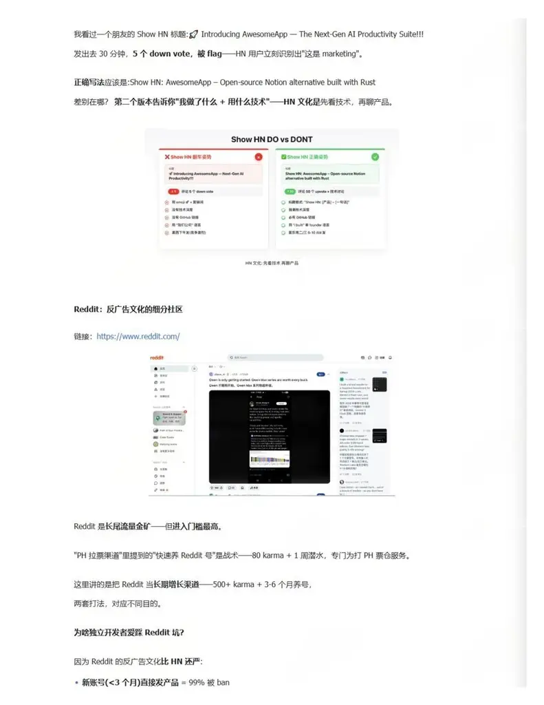

* 没有社区 karma (衡量用户"社区贡献度"的积分系统) = 管理员直接删

* 直接说"我的产品"(不包装) = 用户 down vote

正确姿势: 先成为社区成员，再轻轻提自己的产品
步骤:

1. 发launch 前 3-6 个月注册账号，真实参与社区(回答问题、分享经验、不带链接)

2. 积累 500+ karma(Reddit 用户活跃度分)

3. launch 当天，在相关 subreddit 《论坛、板块) 发"分享类"帖子 一不是"看我产品"，而是 "我做了 X 帮我解决了
Y，分享给大家”

4. 链接放在评论里，不是标题里

Reddit launch 4步法

5 个对独立开发者友好的 subreddit
Subreddit                                              适合谁                          特点
r/Sideproject                               任何独立产品             最友好 / 鼓励"分享你的"项目
r/IndieHackers                 Saa5 / 5aa5         重视收入数据
r/Ssaas                                                      B2B SaaS                        严格反广告 / 但有目标用户
r/EntrepreneurRideAlong                   创业故事类                       喜欢"build journey”
rmicrosaas                                            小型 Saas                       独立开发者多

上面那 5 个 sub 都是"创业者友好型"，适合 SaaS / 工具类项目。

如果你是开发者工具 / 开源项目，还有 3 个技术向 sub 一定不能漏:

*r/programming 一 反 marketing 文化最强，必须用技术叙事，比如 "IT built X with Y here's what went wrong"
*r/webdev 一 偏前端 / 全栈，偏好可视化 demo (GIF / 视频转化高于纯文字)

*r/MachineLearning 一一 偏研究氛围，必须带论文 / 数据 / benchmark，纯产品贴会被秒删

反潮流提醒: Reddit 是长跑

Reddit launch 不会"当天爆"一一但3-6 个月后，你的内容仍在带来用户(Reddit 帖子 SEO 权重高)。
如果你想要短期爆发，Reddit 不是首选一一但长期复利，Reddit 是金矿。

Betalist / SaaSsHub / AlternativeTo: 慢火带流量的导航站

这 3 个站点跟 product Hunt / HN 不一样-一不是"当天爆发"型，是"长期带流量"型。

Betalist: 适合"还没正式上线"的产品

链接: https://betalist.com/

Discovertomorrow's
startups,today.

如果你产品还在 beta / 收 waitlist一Betalist 是起步阶段最佳选择。
*。 DoFollow 链接(SEO 权重)

*。 平均带 200-500 个邮件订阅(取决于产品质量)

* 提交免费 / 加急 $129

*。 适合: 收 waitlist 阶段

SaaSHub: Saas 产品的"长期挂着

链接: https://www.saashub.com/

四 Saashub                                四 rm

Software Alternatives, Accelerators& Startups

89a pavctsand gong -ioursherey

SaaSHub Experts

Top合Word Games of May 28

天 :oem

如果你做 SaaS5，SaaSHub 必须挂上一这是 G2/Capterra 《巨头级软件评测平台) 的"独立开发者版"。

*DoFollow
* 持续带长履流量(用户搜"X alternative" 时显示)

* 免费提交

AlternativeTo: 蔡代品赛道

链接: https://alternativeto.net/

mr

介

Gab 19adds group review ntructiona Secrets 。。 EP Games announces the new verslon of uveal
anagr and Dvo Devetoper enhancements      Eneme bwfha Rockar eagoe update

2

如果你的产品是某个知名工具的替代品(比如"Notion 著代品"、"Slack 蔡代品")一AlternativeTo 必须挂。

* DoFollow
* 长尾流量极强一一很多用户搜"replace XX "会找到这里

*免费

Multi-platform Launch stack: 14 天时间线

讲完 5 大平台，讲怎么组合打一这是 Marc Lou 、pieter Levels 都在用的姿势。

Day -7 到 -1: 准备阶段

*。 Day -7:在 Indie Hackers 发一篇"我做这个产品的 3 个坑"(暖场内容)
"Day -5:Twitter 开始预告(每天发 1 条进度)

* Day -3:邮件列表通知(提前告知 laundh 日期)

* Day -2:Reddit 在相关 subreddit 发一篇"分享经验"暖场

*。 Day -并:技术终检 / Hunter 确认 / 截图终检

Day 0(launch day): 全力打

* 00:01 PST:Product Hunt 上线
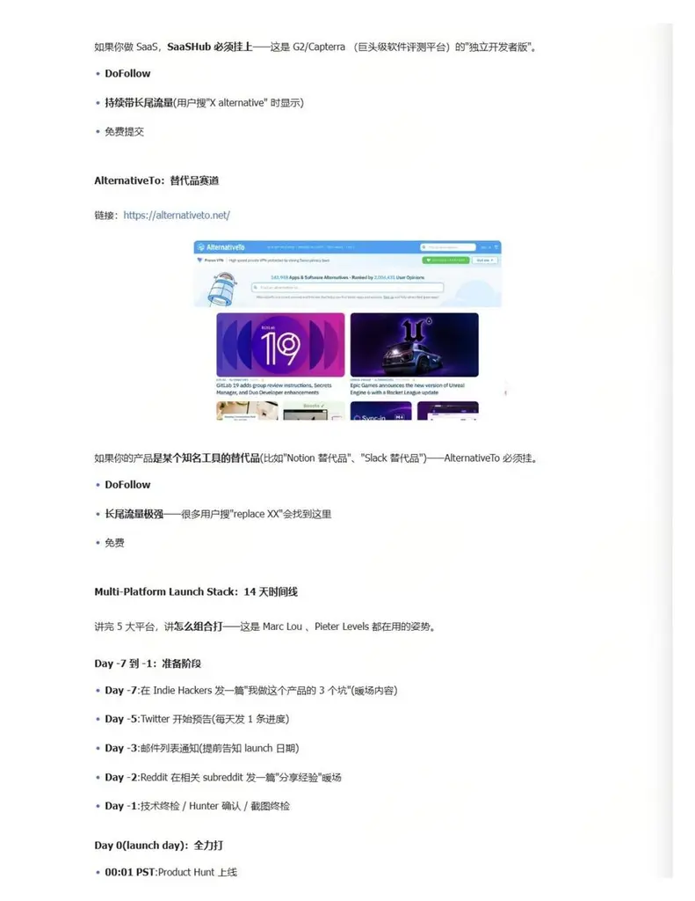

* 第工小时:Twitter / 邮件列表 / IndieHackers 同步

*。第2小时:Show HN 发布(避开 PH 高峰获,但同一天)

*第3小时:Reddit 在 5 个目标 subreddit 同时发(每个 subreddit 内容略有差异化)
*。第 4-12 小时:回复每一条评论(PH + HN + Reddib)

*第 12 小时:Betalist / SaaSHub / AlternativeTo 提交(慢火持续起效)

Day +到 +7: 继续放大

* Day +1:写"Day 1 复盘"文章(发到 Twitter / Indie Hackers)
*。Day +3:Dev.to 发一篇技术文(带回链)

* Day +7 :邀请用户写评测(Trustpilot / G2 / SaaSHub 评分)

Day +7 到 +30: 转化为长期资产
* Day +14:给一个相关博客投稿一篇高质量客座文(参考 ]7 《高质量外链》那一节)
*。 Day +21:第一份 newsletter(把 launch 当天的反馈写成"v2 路线图")

*。 Day +30:Launch 月度复盘一算账:带了多少邮件 / 多少付费 / 多少长期流量

关键洞察: 多平台和亚加 六 product Hunt 单站

按真实开发者社区的反馈 伙 5-10 个站同时打，长期外链 + 邮件订阅，比 Product Hunt 单站强 5-10 倍。

每个站给你 50-200 流量，杰加之后比 Product Hunt 单站(可能只 50)强很多一而且每个 DoFollow 站点是长期 SEO
资产。

Mutti-Platform Launch Stack 一 14 天时间线

各
中
上
1

中国独立开发者特有的 4 个挑战

讲充 launch 战术，讲中国独立开发者的 4 个特殊挑战。

挑战 1: 时区一美西凌晨 = 中国下午

Product Hunt launch 最佳时间是 美西 00:01 AM(周一/周二)-一对应中国时间下午 4 点。

这反而是好事一一你白天 launch，精神状态最好。但你要注意 launch 后 24 小时熬夜回复评论(海外用户大量集中在
欧美工作时间)。

挑成 2: 英文文案一 别用机翻

中国独立开发者最常翻车的就是英文 landing page / launch 文案一-一看就是机翻，用户立刻流失。
修法:

*。Tagline / Hero copy 让 native speaker review(找朋友 / Fiverr / Upwork)

“用 Claude / GPT 帮你润色，但最后一定要人工读一遍一-AI 写的英文有时太"AI 味"

。学习 pieter Levels / Marc Lou 的文案风格-简短 + 直白 + 有人味

挑成 3: 文化差异 别用"我们公司”

中国创业者爱说"我们的团队 / 我们公司"一这在海外独立开发者轩是减分项。
海外文化: Solo founder 受尊敬一一你说"我自己做的"，反而更有说服力。
修法:

* 把"我们的团队" 一 "Tbuilt this”

* 把"公司"一 "product"

。把"开发了"_， "shipped"

挑战 4: 付款一 海外用户不信中国 entity

如果你网站上写"由 [中国公司名] 运营"一海外用户看到立刻警惕(担心数据安全 / 退款问题)。
修法:

*。 注册美国 LLC / 新加坡公司 / 香港公司(成本 $200-500)

* Stripe Atlas 是最简单方案(包注册 + 银行账户)

* 网站 Footer 写美国/新加坡公司名

中国独立开发者 4 大特殊挑战

AI 编程能怎么帮你 launch?

最后齐AI 编程在 launch 这件事上能做什么。

AI 能做的(机械执行)

1. Landing page 生成一用 Claude Code + shadcn/ui，! 晚做一个漂亮 anding page

2. Demo video 脚本一一AI 写 60 秒 demo 视频脚本

3. 0G image / 截图美化一-用 AI 工具(Midjourney / DALL-E)生成漂亮的 share image

4. 多平台文案适配一同一个产品，AI 帮你写 5 个版本(PH 版 / HN 版 / Reddit 版 /IH 版 / Twitter 版)

AI 不能做的(关键判断)

1 选哪个平台先 launch一一这是策略，你判断

2. 写 maker comment 第一条-一这是真情实感，AI 写出来"AI 味"明显
3. 回复用户评论一尤其是负面评论，AL 容易翻车

4. 判断什么时候停止 launch / 转型一这是产品判断

个 伦理边界: 不要用 AI 剧投票 / 假评论
绝对不要:

*。用AI bot 刷 product Hunt upvote
* 用AI 生成假 Reddit / HN 评论

“用代写假"用户好评"

这些1009% 会被 product Hunt / HN / Reddit 的反作弊抓到一一旦被抓，永久封号 + 产品被全网点名。
做 Iaunch 是为了长期信任，不是短期数字。用 AI 走捷径，你失去的比得到的多 100 倍。

launch 是开始，不是结束

回到这一节开头那 3 个翻车一

翻车1 (Product Hunt 单站 0 转化) : Multi-platform Launch Stack 没用一一到 5-10 个站
翻车 2 (Show HN 被 down vote) : HN 文化没懂一一技术深度 > marketing
翻车 3 (Reddit 5 分钟被 ban) : Reddit 反广告文化没尊重-一先成员后产品

避开这 3 个翻车，你的 launch 效率比 809% 的中国独立开发者强。
最后
2026 年的海外 launch，不是"我把产品挂到平台上"一是"我懂每个平台的文化，用对应的姿势在那里发声"。

launch 不是终点，是你跟海外社区的第一次对话.。

整个增长篇这条主线-一

*冷启动: 找人，而不是等人

*。 Side project Marketing: 持续发小项目当推广

*。 海外 Launch 实战(这一节)

* 聊聊产品值多少钱(定价)

* SEO 4 连(原理 / 外链 / Skills / GEO)

这 5 大块加起来，就是独立开发者从 0 到 1的完整增长体系。

作业
挑你手头任意一个产品，做这 5 件事一

任务 1: 列出"我能launch 的 5 个平台”
按本节的列表，挑 5 个最适合你产品的 launch 平台 一写下你为什么选这 5 个。

任务 2: Reddit 暖场一3 个月计划
挑 2 个目标 subreddit，接下来 3 个月每周真实回答 1-2 个问题一目标是 laundh 前积累 500+ karma。

任务 3: 写一份英文 Tagline,让 native speaker review

写下你的产品 tagline(60 字符以内)，找一个英文母语者帮你 review一一记下他给的修改建议。

任务 4: 用 Multi-platform Launch stack 时间线规划你的 launch
按 Day -7 到 Day +30 的时间线，写下你 launch 当天和后续 30 天每天要做什么。

任务 5: 注册海外公司
如果你想正经做海外市场，调研 Stripe Atlas / 新加坡公司 / 香港公司-一 选一个适合你的方案。
不一定立刻做，但至少了解清楚成本和流程。

增长篇接下来 一
你已经有了: 冷启动 / Side project / 海外 Launch / 定价 / SEO 4连 = 完整的独立开发者增长体系。

| 五、SEoO 核心原理: 关键词 + 搜索意图 (2026 视角)
前言
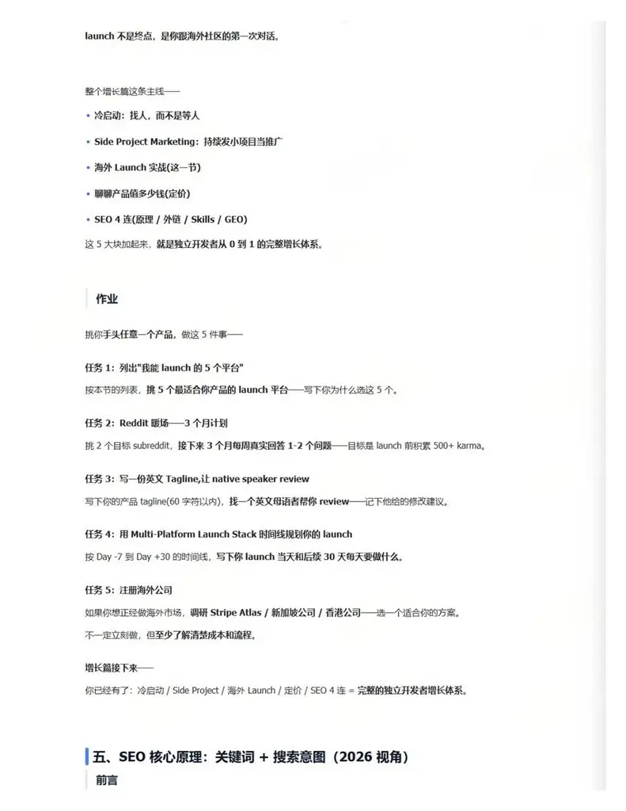

从这一节开始，增长篇要进入"流量战"环节了。

接下来我会用 4 节连续进 SEO一这是一节，后面还有外链建设、AI Skills 自动化、以及让 ChatGPT/perplexity 引用
你的 GEO/AEO 实战。

4 节合一，你能从 0 开始建立一个独立开发者的 SEO 体系一不靠付费广告，不雇人，自己用 AI 编程跑通。

但今天这一节是最关键的"道讲清楚 SEO 到底是什么、2026 年变了什么、关键词和搜索意图到底怎么选。
这一节没看仪，后面 3 节都是空中楼净。

3 个让你"做了一个月 SEO 没流量"的翻车现场

讲 SEO 之前，我先放 3 个真实的翻车现场-一这 3 件事，做过 SEO 的独立开发者基本都踩过。

翻车 1: 关键词选错-一"我做的是没人搜的词

一个朋友做了一个 AI 工具，选关键词时凭感觉挑了一堆"听起来很高大上"的一一AI productivity assistant、intelligent
task manager、smart workflow optimizer。

写了 30 篇文章，每篇 3000 字，3 个月，一共带来 12 个访客。

为喻?
因为这些沁根本没人搜。
他选的词在搜索引警里月搜索量只有几十次，而且大半还是其他工具公司自己人在搜况品。

他选的不是"用户在搜的词"，是"自己脏补出来的词"。

翻车 2: 内容方向错- "我写的是，但用户搜的不是”

另一个朋友选对了关键词-一best AI image generator(月搜索量 5 万+)。
但他的网站在搜索结果里根本进不了前 10 页。

为啥?
因为他写的是一篇自己产品的介绍一 [我们的 AI 图像生成器有什么功能| 。
但用户搜 best AI image generator 时，他想看的是排行榜对比文章一 「2026 年最好的 10 款 AI 图像生成器对比] 。

用户的搜索章图(search intent)是"评测对比"，你的内容是"自我介绍"一意图不对，内容白写。

翻车 3: 写了一年，Google 排第 1，但 ChatGPT 完全找不到

第三个翻车，是 2026 年的新变化一

一个朋友辛辛苦苦做 SEO，Google 一个核心词排到了第 1，SEO 工具显示一切完美。

二mmr mirnr 井二transer rarnr 二二in品口及 = 入关口“一人xudmmalu

名二ITJITT LNator1，培Ia人by三一dtorl 霸仔史十为7F 2 1三中，zc土又坛可吧。

打开 Perplexity 搜一还是没有他。

他异了。
Google 第 1，但在 AI 搜索引擎完全消失。

为喻?

有研究发现-一约 88% AI Mode 引用的链接，跟 Google 同关键词的 organic 排名完全不重合(来自 Moz 的 Tom
Capper 分析)。

意思是: Google 排第1 # AI 引擎引用你。
这是 2 套不同的游戏。

|                  3个 SEO 翻车现场

|  罗列|  意图不对内容白写 | 排第一 但 Al 完全技不到 |

如果你做过一段时间 SEO，这 3 种翻车一 至少踩过一种.

它们的根因只有一条-一

SEO 的"道"没搞清楚。

SEO 不是"写文章 + 加关键词" 这种小手艺。

SEO 是一门"判断用户在搜什么、为哈搜、然后给他他想要的东西" 的学问。

这一节，我教你这门学问的核心 3 块:

1. 2026 年 SEO 的范式转变 一 从"为 Google 写" 到"为 AI 引擎写"
2. 关键词研究的 4 把判断尺 一一 不是任何词都值得做
earch Intent) 一一 SEO 真正的胜负手，很多人没意识到

学完这一节，你就能避开开头那 3 个翻车一同时，你会重新理解 SEO 这件事。

SEO 到底是什么?

讲核心之前，我先 5 句话讲清楚 SEO 到底是啥-一给完全没接触过的朋友。

SEO = Search Engine Optimization(搜索引警优化)。
核心目标只有一个: 让你的网站，在用户搜某个关键词时，出现在搜索结果的前几位。

为什么要做 SEO ? 因为搜索流量有 3 个独特价值 一

1. 意图明确: 用户主动搜"AI 图像生成器"，说明他真的在找这个东西一比刷信息流时被动看到广告精准很多
2. 免费: 跟 Google Ads 不一样，SEO 流量不要钱一一只要内容存在，就一直来
3. 复利: 今天写的一篇文章，3 年后还在带流量一内容是累积的，不是消耗的

SEO 流量的 3 个独特价值

袜开发者必仁 SEO

辣 哆

[CT       让 = 和折放           世人

这几点对独立开发者特别重要，因为我们一 没钱投广告，没人帮发声，只能靠内容。

我自己做过一个项目，第 5 个月才看到 SEO 流量起来一
前 4 个月每天打开 Google Search Console，新增 0 个上曝光。我都怀疑自己是不是被 Google 拉黑了。

第 5 个月开始，慢慢有几个长必间进了第 2 页。第 7 个月，有 工个词进了第 1页。第 9 个月，日均自然搜索流量稳
定在 300-500。

这 9 个月几乎没花钱，但这个流量到现在还在带来用户-一这就是 SEO 的复利。

但 SEO 也有一个最大的代价-一
见效慢，通常 6-12 个月才看到稳定流量。

这是为什么很多独立开发者不做 SEO一因为它反人性: 前 6 个月看起来什么都没发生，你会怀疑自己白干。

但只要你撑过去，流量会变成你产品的复利引擎 一这跟付费广告"今天投钱今天来人，明天断钱明天没人"形成鲜明对
比。

但 SEO 是独立开发者最值得长线投入的事之一一一但你必须第一年就开始，不然 3 年后你会3R。

2026 年 SEO 的范式转变: 从"为 Google 写"到"为 AI 引擎写"

如果你 5 年前学过 SEO，今天大半套路已经变了。

2026 年最大的变化只有一句话-一
搜索引擎不再是"返回链接列表"，而是"直接给答案"。
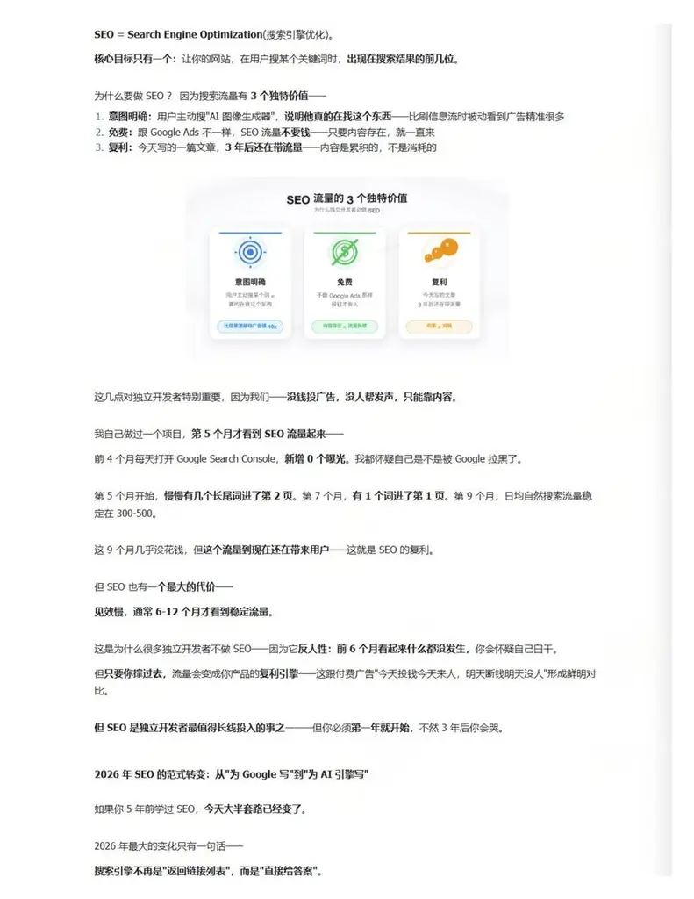

(Google 。 momomweoemmaeniomn             x 和人

一组数据

* Google AI Overviews(AI 总结答案)现在出现在约 25%-48% 的查询里(看研究的口径)
* ChatGPT 一天处理 25 亿 次提问

。pPerplexity 同比增长 239%

* 大约 60% 的传统搜索结果在用户没点链接就结束了一因为 AL 直接给答案了

*。Wynter 2026 研究发现 68% 的 B2B 买家先在 AI 工具里调研，Google 只用来"验证"

2026 SEO 范式转变
排第一                        被 Al 引用
En               二
@- 1 -5:
am兰
Fesreyrrra           ne

|         关键数据: 约 88% Al Mode 引用 Google organic 排名

读到这你可能想: "完了，SEO 死了?

没死。但游戏规则变了。
关键转变: 从"排第一" 到"被 AI 引用”

老规则: SEO 的目标 = 在 Google 上排第一。

新规则: SEO 的目标 = 让你的内容，被 AI 引擎(Google AI Overviews / ChatGPT / Perplexity)作为可信来源引
用。

这两个目标很多时候不重合一

Tom Canner 在 Moz 的研容屁去: 约 RRoh 的 AT Modie 引用链接”棚本不在同美键词的 Gonnle ornanic 苗几而

意思是你拼命做"Google 排第一"，未必能让 AI 引用你; 反过来，有些 Google 排不上号的小站，AI 经常引用。

但别急着抛弃 Google

虽然 AI 这么火，有一组数据可能跟你想的相反一

AI 平台贡献的网站流量，目前不到全网 1%。
Google 给独立网站的引流，仍然是所有 AI 平台总和的约 300 倍。

Google 还是流量的大头，但 AI 引用是 2026 年的新阵地。
最悦明的做法: 两边都做。

我整理了 2026 年的搜索流量"三件套"一

流量来                           当前规模                        增长方。 优化策略
向
Google 传统搜索                仍然最大(约 90% 海外流 ”平稳       经典 SEO
量)
Google AI Overviews             占 25-48% 查询                 快速        AI Overviews 优化
ChatGPT / Perplexity /            流量小但增长快                   爆发         GEO/AEO(后面专门一节讲)
Claude

AI 评估，Google 验证，你的网站负责转化一-Wynter 这句话基本概括了 2026 SEO 的全图。

什么意思? 用户的真实搜索路径变成了一
1. AI 评估阶段: 用户先打开 ChatGPT 问"哪几个 AI 图像生成器最好"，AI 给一个短名单(3-5 个候选)
2. Google 验证阶段: 用户拿这个短名单回到 Google，搜每个候选的"评价"、"价格"、"是否安全"

3. 网站转化阶段: 用户打开候选网站，看页面、定价、试用一决定买谁

你不仅要在 Google 排名好，还要先让 AI 在第 1 步把你列进短名单一一否则你后面都没机会。

2026 年要做的 SEO，本质上是 3 个引擎一起优化，而不是只果着 Google。

SEO 的 3 个核心问题: 把"道"想透了再动手

无i论你做的是 Google SEO 还是 GEO/AEO，你都要回答 3 个问题-一

工. 用户在搜什么? (关键词研究) 一一决定写不写

2. 用户搜的时候到底想要什么? (搜索意图) 一一决定写什么

3. 我的网站能不能被搜索引擎找到 + 信任? (技术 + 权威性) 一决定写了能不能被找到

3 个问题任何一个错了，SEO 就废了。

SEO 的 3 个核心问题

|@ 1. 用户在搜什么?              0
外

2. 用户搜的时候到底想要什么?            一
| 图  3. 我能不能被搜索引擎找到 + 信任?             写了用不

|过图 Sea

3 个问题任何一个错了 SEO 就度了

下面我们把第 二和第 2 个问题讲透 这是这一节的重点。
第 3 个问题 (技术 SEO + 外链 + 权威性) 放在后面 3 节讲一外链单独一节、Skills 单独一节、GEO/AEO 单独一

节。

第 1 件事: 关键词研究一一4 把判断尺

关键词研究不是头脑风暴，是用 4 把尺子做减法。

很多人做关键词研究的方式是: 打开 Excel，凭感觉列 100 个词。
错。

正确的姿势一你应该有 4 把判断尺，从用户角度而不是产品角度，把词一个个量过去。

关键词研究的 4 把判断尺
二 搜索量           人 难度           全 相关性          二 商业丰图
9
自已       CE
|  Taooo      |       蛙呈       和 -
Te

尺子 1: 搜索量 (Search Volume)

月搜索量是 SEO 的" 市场规模”一没有搜索量的词，你做到 Google 第 ! 也没流旦。
判断标准:

月搜索是                     评级              适合谁

< 100                   太小           通常不值得做(除非是新间站)

100 - 1000                 长尾            独立开发者起步首选

1000 - 10000                中等              有一定权重后可以攻

10000+                                大词                    大公司战场,新站很难

新站干万别一上来就攻"AI image generator"这种 10 万+ 的大词 一你可能花一年时间连前 50 名都进不去。先吃
100-1000 这种长尾，慢慢积累权重。

尺子 2: 难度 (KD - Keyword Difficulty)

KD 衡量这个词上 Google 第 1 页有多难一一多数 SEO 工具(Ahrefs / Semrush / Moz)都给 0-100 分。

判断标准:
KD 分数            评级                 适合谁
0-15                      简单                      新站可冲(<6 个月域名)
15-30                    证等                      网站有一定权重(>6 个月)
30-60              难                  老站(>2 年) + 优质内容
60+                 极难                大公司战场,放弃吧

新站起步，只看 KD < 20 的词。这是 2026 年我观察到独立开发者做 SEO 的最佳起点。

推荐用专业工具直接看 KD 评分。

谷歌关键词规划工具: https://ads.google.comy/homey/tools/keyword-planner/
Semrush: https://www.semrush.com/

Google Search Console: https://search.google.com/search-console
Similarweb: https://www.similarweb.com/

Ahrefs: https://ahrefs.com/

温志小提示: 这里面的付费工具，某宝、某鱼可能有更便宜的版本，不要上来就急着买，先感受。

Ahrefs有一个免费的关键词检索链接: https://Ahrefs.com/keyword-difficulty ，只不过能看的信息也相对有限

Keyword Di

icutty for "AI resume”                               x

(全 江-=
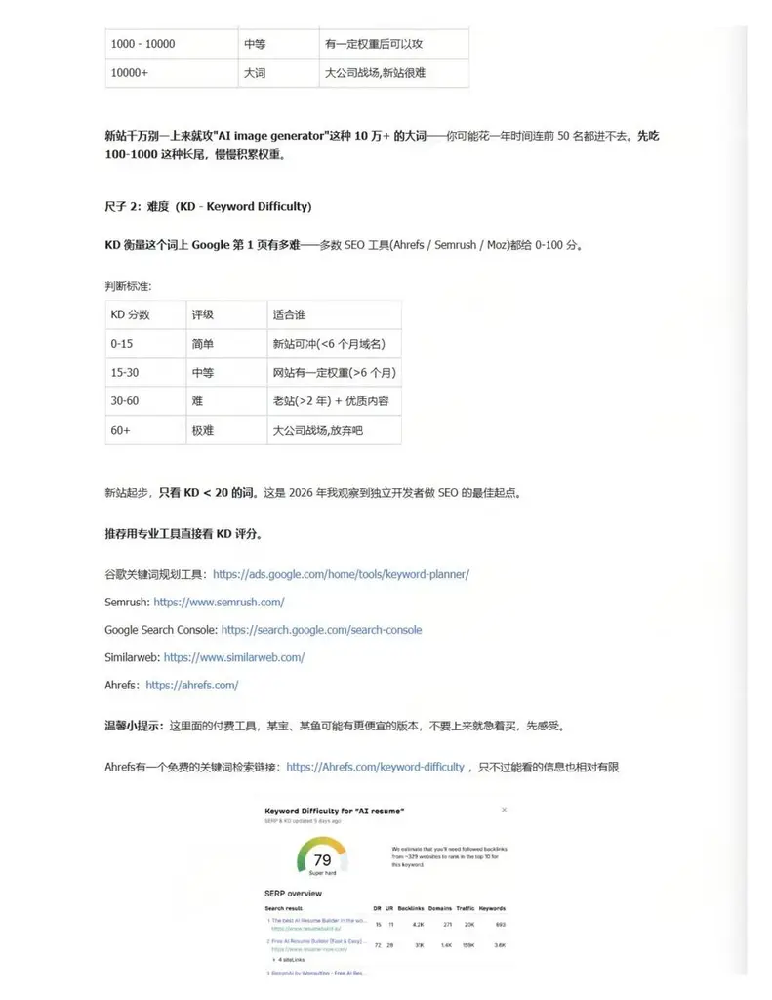

Semrush 也有类似的关键词研究功能。

打开 Semrush 的 Keyword Overview (关键词概览) 页面，输入你的目标关键词，它会显示月搜索量、KD 难度评分、
搜索趋势、以及当前排名前 10 的网页各自有多少外链和流量。

你不仅能看到难度，还能看到竞品靠这个词拿了多少流量、帮你做更全面的竞争判断，数据非常全。

新手可以先用免费的 AITDK + Google Trends + Ahrefs 免费工具跑一遍，算出 KD 在 30 以下的词。

等后面需要更深入的分析时，再考虑 Semrush 或 Ahrefs 的付费版。

尺子 3: 相关性(Relevance)

搜索量再大、KD 再低，跟你产品无关 一 流量也不转化。

举个翻车例子:
你做 AI 写作工具，选了"AI image generator "一KD 低、搜索量大，但来的用户不是你的目标用户。
他们想要图，你给文字工具，跳出率会爆表，Google 反而会判断你"内容不匹配"，降权。

判断方法: 问自己一个问题-一
"这个搜过来的用户，我的产品能不能直接帮他?”

如果不能一 砍掉。

哪怕这词每月搜索 10 万。

尺子 4: 商业意图 (Commercial Intent)

有商业意图的词，转化率通常比无意图的词高几倍以上。

商业意图可以分 4 档:
类别                                    意图强度 。 例子

Transactional(交易型)               最强           "buy AI image generator"， "AI image generator pricing"”

Commercial(商业型)                   强               "best AI image generator" "AI image generator review"

Informational(信息型)               弱               "what is AI image generator'，"how does AI image generator
work”
Navigational(导航型)              不相关       "midjourney login", "openai pricing"(找特定品牌)

独立开发者的资源有限，优先做 Transactional + Commercial--一这两类是直接来买东西的人。

4 把尺子的实操顺序

我自己做关键词研究的顺序:

1. 先列 50-100 个候选词(用 Ahrefs/Semrush 的 Keyword Explorer，或者直接看竞品在排哈词)
2. 用尺子 3(相关性)做第一轮砍一砍掉一半

3. 用尺子 1(搜索量)做第二轮砍一砍掉太小或太大的

4

条

. 用尺子 2(KD)做第三轮砍一一砍掉攻不下来的
: 用尺子 4(商业意图)做最后排序一优先级排出来

最后简下的可能就 10-20 个词 一但都是真值得花 100 小时去攻的精华。
4 把尺子，减法不是加法。新手的最大错误就是"一定要做 100 个词"，老手知道做透 10 个就够你吃一年。

四种找关键词的方法

第一种: 定位法一从自身业务出发拓展词根。

在研究关键词之前，先问自己: 我到底做的是什么业务，用户会怎么描述我解决的问题?

把你想到的核心词直接扔进 Google 搜索框，不用按回车，直接看 Google 自动补全给你推荐了什么。

比如输入"AI resume"，自动补全可能会出来"AI resume builder”"AI resume checker"AI resume free"….这些都是真
实用户正在搜的词。

Coogle

再往下拉到搜索结果页底部，还有一栏"相关搜索`，又是一批候选词。

用户还搜索了

Ai resume builder                          Q         Resume template                          Q

Best ai resume builder                   Q         Visual cv                                     Q
Resume 翻译                                   Q          Online cv                                        Q
Resume genius                               Q          Resume 简历                                   Q

这个方法最简单、零成本，而且特别有效。 Google 的自动补全已经经过了几十年的演化，它对用户的搜索意图的理
解，比你我都准。

第二种: 竞对法-一用 AITDK 分析竞争对手的流量词。
思路很简单，你的竟品网站已经在靠某些关键词获取流量了，你直接去看它们在用什么词就行了。

核心工具是 AITDK: https://aitdk.com/

一个免费的 Chrome 浏览器插件。安装之后，你打开任何一个网站，点插件图标，它会一口气告诉你这个网站的核心
数据

这里我随机查看一个排名比较靠前的 AI Resume 网站，进入Traffic页面看 Top Keyword 区域。

这里直接列出了这个网站靠哪些关键词获取流量，以及每个词的搜索规模。

The uktimate
resume builder

以"resume builder 这个词为例，它的总搜索量大约在每月 261k，而这个网站从这个词上获取了大约 39k的月流量。你
一看就知道: 这个赛道流量挺大，但竞争也激烈。

然后看 Headings 标签。这里显示了竞品网站的 H1-H6 标题结构，能帮你清楚看到它的页面内容是怎么组织的、国绕
哪些子话题展开。这对你规划自己网站的内容结构非常有用。

The ukimate
resume builder

uia eve usea weieesnroeen one
leeraponera erdeamrve

|
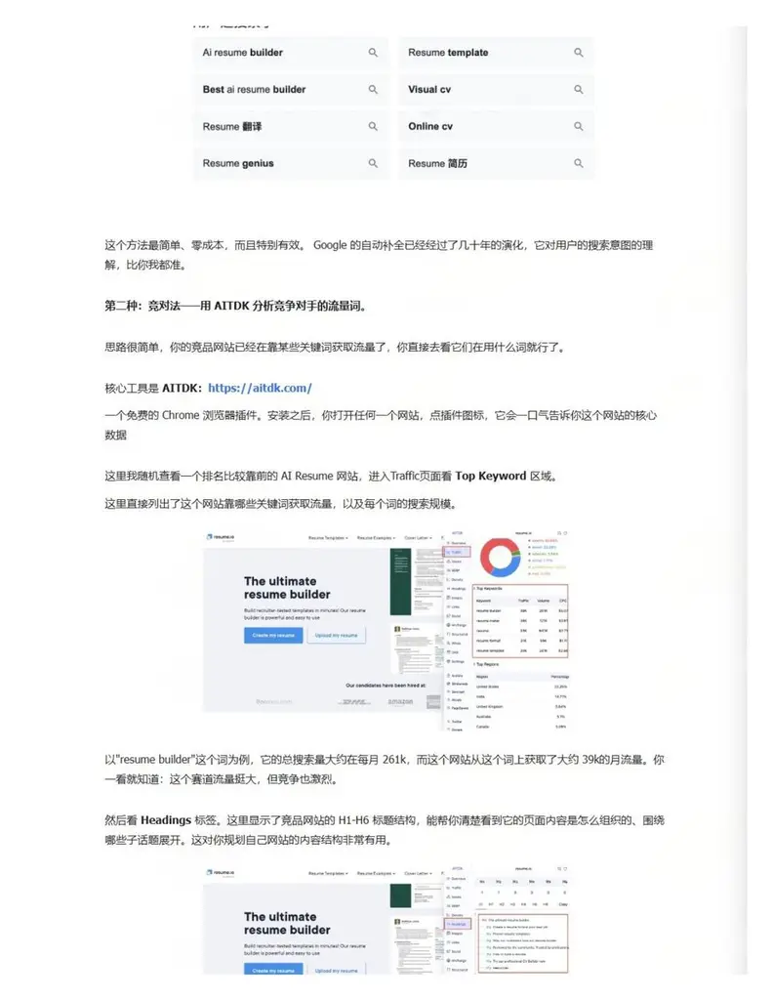

The ultimate
resume builder

AITDK 的左侧栏里还集成了 Similarweb、Semrush、Ahrefs 的快捷入口，你可以一键跳转到这些专业工具查看更详细
的数据。

找到 2-3 个竞品网站，分别用 AITDK 跑一遍，你对整个赛道的关键词布局，就能有个大概的感觉了

第三种: 社媒 法- 从社交媒体挖掘关键问灵感。

用户不只是在 Google 上搜东西，他们也在 YouTube、Reddit、Twitter 上讨论问题。
这些平台上的热门话题和讨论区，是挖握关键词的天然矿场。

在 Google 搜索框里输入 site:youtube.com "你的核心词"，就能找到 YouTube 上和你业务相关的所有视频。看看这些
视频的标题、评论区里用户在讨论什么，你就可能找到一些你自己没想到的、有搜索热度的关键词。

同样的方法也可以用在 Reddit、TikTok 等平台上一一去找用户真实的提问和讨论，从中提炼关键词。

第四种: AI 调研法 一让 AI 帮你头脑风暴。

直接问任何一个AI :

我做了一个 AI 简历优化\制作工具，面向海外英文用户，现在我要拓展网站页面，主要是一些功能的子页面，请你基
于搜索结果，帮我列出 20 个洪在的低竞争 SEO 关键词。

AT 能帮你快速生成一大批候选词，在关键词拓展和长尾词挖掘上特别好用。

一个开工贞观月，二
和和
1

Sol 【8风人和)， -mon au ATI ran tontr
和

Am

加一、工具类 (直接转化，高商业意图)

但记住-一AI给出的词只是候选，最终选哪个，还是要用前面讲的工具和方法去验证之后再决策

第 2 件事: 搜索意图一一SEO 真正的胜负手

讲却关键词研究，讲 SEO 真正的"灵瑰"一搜索意图。
很多做 SEO 的人，只研究"搜什么词"，不研究"搜的时候到底想要什么"。

这是开头翻车 2 的真实原因一选对了词，但内容方向错。

搜索意图的 4 种类型

我前面在"商业意图"那部分提过一一搜索意图主要分 4 种:

4 种搜索意图

4  Informational 信息型                             Commercial 商业型
请   什么是X?               Ae  嘟个最好?
写snw                        泪,mrren
ar                         En

Transactional 交易型                            Navigational 导航型

PE am                         2 amzam
熏aamvome                       mm
ai                         Eee

me                                         吕王二性                  叫mse王mL

JISISRS                                出厂仁11人             出厂也外311公

JInformational(信息型)      想搞伐某个概念     教程、定义、解释、How-to 文章
Commercial(商业型)           在比较选择           对比文、评测、Top 10 排行榜
Transactional(交易型)       准备买           产品页、定价页、购买页
Navigational(导航型)       找特定品牌        该品牌官网首页

做 SEO 的关键判断: 你的内容形式，必须匹配用户的意图。

一个具体例子

用户搜 best AI image generator(商业意图)一一
共 错的内容:你写一篇 我们的 AI 图像生成器有什么功能"(产品介绍)一这是交易型内容，匹配的是"buy XXX”
图 对的内容:你写一篇"2026 年 10 款最好的 AI 图像生成器对比"(对比文)一这才是商业意图想要的

意图不对，内容白写。

哪怕你 SEO 优化做得再好，Google 也会把你排到第 5 页之后-一因为它发现用户点你不停留(跳出率高)，然后判定你
的内容不匹配。

怎么判断一个关键词的意图?

最简单的方法: 直接 Google 一下，看前 10 名都在写啥-一
* 前 10 都是对比文/评测/Top X? 一 Commercial

。前 10 都是教程/解释/How-to? 一 Informational 意

* 前 10 都是产品页/定价页? 一 Transactional 意图

* 前 10 都是单一品牌的页面? 一 Navigational 意图

你的内容形式必须跟前 10 名对齐 -一这不是抄效，是理解用户在这个搜索下的真实需求。
我跟你齐，这一招看起来简单到爆，但很大一部分 SEO 翻车都是这一步没做。
AI Overview 出现率: 意图决定 AI 引用率

2026 年还有一个关键数据，跟搜索意图密切相关-一
不同意图的搜索，AI Overviews 出现率差异巨大。

具体数据(来自第三方研究的经验观宗，精确口径不同来源会差):

4 种意图的 Al Overview 出现率

独立开发者火力集中 Commn
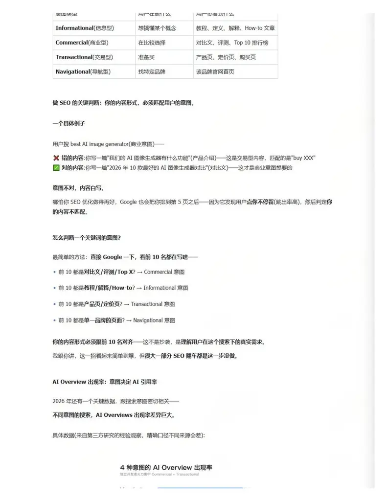

TY
SR             本

Cr

5       =

Tanoacional

tn     加

Navgatonal
的               9

AI Overviews 出现率 ” 含义

Informational               约 45.9%                    信息型查询,接近一半被 AI 总结直接吃掉

Commercial              约 17.8%                 商业型查询,AI 影响中等

Tiansactional              约 6.1%                   交易型,AI 影响小

Navigational               约 1.5%                    导航型,基本不受 AI 影响
意思是:Informational 类内容，在 2026 年最容易被 AI 直接吃掉流量-用户搜"What is X"，AI Overview 直接给
答案，用户不点你。

但反过来，Commercial 和 Transactional 类内容，AI 影响相对较小-一独立开发者做 SEO，应该把火力集中在
Commercial + Transactional(评测、对比、定价、买)。

这是 2026 年新加的判断维度一老 SEO 教程不会告诉你。

第 3 件事: 关键词分类与排布一一树状关键词图

讲充关键词研究 + 搜索意图，讲"关键词怎么排布到网站上"一这是从"研究"到"落地"的桥。

错误姿势: 把所有关键词都堆在首页

新手最常见的错误一 把 50 个关键词全部塞在首页 Title 和 H1 里。
错。
Google 算法早就识别这种"关键词堆砌"，会把你判定为低质量页面。

正确姿势; 树状关键词架构

正确的排布是树状的一一

树状关键词架构
to)

(CTTTTTTTTTTTTERTTTTT

具体来说就是 3 层结构:
* 首页(Home) 打主关键词一你产品的"品类"大词，比如 AI image generator

*。 栏目页(Category) 打二级关键词-一大词的细分，比如 AI image generator for marketing、AI image generator for
game

*。 文章页(Artidle) 打长尾关键词一具体到革个使用场景，比如 best AI image generator for fantasy art、AI image
generator under $l0/month、free AI image generator no signup

首页打主词，栏目页打二级词，文章页打长属间-一这是 SEO 的标准架构。

一个独立开发者的 SEO 反潮流真理: 长必关键词的黄金时代

讲到这，我送你一个反潮流的判断一
20256 年是独立开发者做"长必关键词"的黄金时代。

为喻?
工 长履间竞争小
大公司没精力盯每个长尾词，新站攻进前 10 反而容易。

2. 长尾问意图明确，转化率高
搜"AI image generator under $10/month"的人，比搜"AI image generator'的人离付费近得多一一因为前者已经在比价
格了。

3. 长尾问是 AI 引擎最爱引用的形式
研究发现，AI 引擎引用的内容，通常是回答某个具体问题的页面一一而长尾词的页面正是这种"针对一个具体问题的精
确答案"。

4. 长尾问适合 AI 编程批量生产
2026 年用 AI 编程做 SEO，可以一晚上自动生成 100 篇长必词文章(质量过得去)一一大公司的人工内容团队反应不过
来。

这是独立开发者 vs 大公司在 SEO 战场上，罕见的"小公司有优势"的窗口。
大公司做不了长尾(成本不划算)，独立开发者用 AI 编程能批量做一一但这个窗口可能 2-3 年后会关。

-4

一DR大坷]    人
| 大公司5E0团从              的训Re

用户行为释放的信号

关键词选对了、意图匹配了，只是把用户骗进门一能不能留住他，才是 SEO 的第二道关。

Google 不只看你写了什么，它还在偷偷看用户的行为。
停留多久、有没有马上离开、打开速度快不快。

这些行为数据，是它判断你页面够不够好的第二层依据。

想象一下: 用户搜了一个词，点了你的链接,等了 8 秒，终于打开了，结果排版乱七八异，有些字小得看不清。用户
直接按了返回键，回到搜索结果，点了下一个。

这个过程，不超过 15 秒，但Google 全都看在眼里。

这里有一些关键概念，可以了解一下:

跳出率 (Bounce Rate) : 用户来了马上走，说明你的页面没能满足他的需求。跳出率太高，Google 会降低你的排
名。

停留时间 (Dwell Time) : 用户在你页面上待了多久。待得越久，说明内容越有价值。
如果用户看了三分钟，又点了你网站上其他几个页面，Google 会觉得你的网站整体质量不错，这是好的信号。

页面速度: 打开要快，最好在 3 秒以内。

PageSpeed 是 Google SEO 的核心指标(Core Web Vitals) ，专门衡量页面的加载速度、交互响应和视觉稳定性。谷歌
官方明确表示:

网站速度与用户体验相关，直接影响排名。
你可以用 PageSpeed Insights (https://pagespeed.web.dev/) 测试一下，它会告诉你各指标的情况，以及具体哪里可
以优化。

Da 口则上

共有的从                                 ae
一-conwo wonpasm ma
umaacacaomapantacp     aaacna na car     Gumuiaamaiaaasaeuasl
14允               9机                oz
aatcomaacad pantecz      Tanpleaarrize

14旭                [1

如果你采取十法炼钢: ”你需要详细去了解 PageSpeed 里所有的关键指标分别是什么意思，例如，LCP、FCP、TBT、
CLS、5Speed Index等等。

再查看 Google PageSpeed 工具给你的建议，逐一优化。

在AI出现以前，我就是这么优化的。

今天的你，已经不再需要像我当年那样古法炼钢。

我们需要请出两个工具

工.支持MCP协议的任何AI编程工具
包括并不限于: Cursor、Codex、Claude Code、Google Antigravity等等

2. Devtools MCP
由于它直接基于 Chrome DevTools protocol，下面这些事情，只有Devtools MCP能做得最好。
* 监听 Network: 请求/响应头、body、status、时序、重定向链路
。 监听 Console: console.log, error warm，甚至 stack
*。DOM/]JS 调试: 执行任意 ]JS、取 window 变量、performance metrics
* 能看到更丰富的浏览器内部信息 (network、console、runtime、性能)
* 排查线上某个页面偶发性 500 / CORS / CSp 问题
* 看某些国家/网络下页面到底请求了什么、哪个资源慢
* 更细粒度的控制
* 逆向分析
*。 分析第三方页面的:
* 追踪脚本
* AB 实验的触发逻辑
* 指标 (首屏时间、资源体积)

比如:“用 Devtools MCP 打开 raphael.app，检查首页加载有哪些 404/500 请求，并给我优化建议。”

看到这里你应该明白了:， 无论是在网站上线前的localhost、还是网站上线后的正式域名，我们都可以利用Devtools的浏
览器内核级的"观测 +调试"能力，对网站性能进行分析和优化。

具体步骤大致如下:
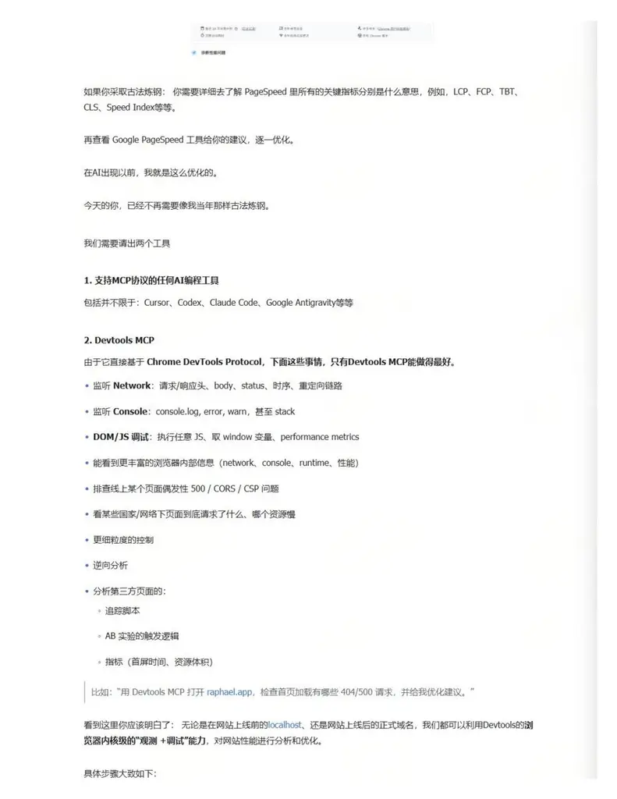

ursor Gauae Coae等) 类似

1. 打开 https://pagespeed.web.dev/ 输入你的线上域名，进行分析。把分析结果截图，发送给Codex (如果你的网站
还没上线，跳过这一步)

2. 在Codex安装Devtools MCP
*。 手动安装方法: 根据官方文档进行 https://github.com/ChromeDevTools/chrome-devtools-mcp

*。 自动安装方法: 给Codex授予Full Access权限，告诉Codex

装devtools mcp ”

恨

了 https://github.cor/ChromeDevTools/chrome-devtools-mcp

3. 本地运行网站，通知Codex，使用devtools MCP帮有我们分析Lighthouse性能

吗，找出优化点

使用devtools mcp验证pagespeed lighthouse

通知Codex帮有我们修复

5. 修复后，重复执行3和4，直到本地分析的性能过关
6. 上线网站
了. 通知Codex，验证线上版本。如果和本地不符合，继续使用devtools mcp进行优化

移动端适配: Google 现在是 Mobile-First Indexing，翻译成大白话就是，它主要看你网站的手机版来决定排名。
如果你的网站在手机上打开乱七八异，排名会直接受影响。

AI 编程视角: 让 AI 当你的 SEO 顾问

讲到 AI 编程，讲一下怎么用 Claude Code / Codex 帮你做 SEO一一这是 2026 年独立开发者的"杀手铜'。

第工步: 让 AI 做关键词研究
直接给 AI 一段 prompt-一

Plain Text                                                                             已
你是 SEO 专家。 我的产品是【你的产品 + 一句话功能]*

请帮我做关键词研究:

.。 列出 38 个跟我产品相关的潜在关键词

- 按 4 类意图分组(Informational / Commercial / Transactional / Navigational)

1
二    每个词的预估月搜索量(用经验估)和 KD 难度
4. 推荐 19 个新站(<6 个月)优先攻的长尾词

格式:Markdown 表格。

AI 一般会给你一份相对完整的清单，质量比新手自己拍脑袋强很多一一尤其是它会列出你完全没想到的角度。

我自己做关键词研究时，经常被 AI 的扩展惊到-一

HrhnfEhab产口四AT 安立安"0 忽而7 5n 信汪。AT 从特hn7 an 人在届mloo-

Luxkamuay pxE mu 一六二 ，3auz9j cu 1 辐，mua :manuJ -wu Treouy，

AI for cold email(发冷邮件用)、
AI for product description(电商商品描述用)、
AI for app store description(App Store 上架文宗用).…

每一个都是真实的用户场景。

但注意: AI 估的搜索量和 KD 不准(它没接 Ahrefs API，只是赁训练时的经验估)，你最后还是要用 Ahrefs / Semrush
或免费工具(如 Ubersuggest / Google Keyword planner)复核一遍真实数据一

否则 AI 给你估"月搜索量 5 万"，实际可能只有 500。

第 1.5 步: 让 AI 帮你做"竞品关键词偷宇”

这是 SEO 的一个反潮流玩法一
不要从 0 想关键词，直接抄竞品的关键词清单。

具体怎么做?

1. 找你的 3-5 个竞品(在你的产品类别里 Google 排前 10 的)

2. 用 Ahrefs / Semrush 的"Site Explorer" 功能，导出每个竞品的 organic keywords 清单或者用 AITDK 查看关键
词

3. 把这些清单丢给 AL一

Plain Text

口
[ec

下面是 3 个竟品的关键词清单:

[粘贴你导出的关键词数据]

请帮我:

1. 找出 3 个竞品都在排但我没做的词(共同空白)

2 找出每个竞品独占的"成功关键词"月流量 ”168e 的)
3. 推荐 16 个我应该立刻攻的词,按"机会大小 vs 难度"排序

|   人           Wi

直人                                                                       四

AI 会做一份 竞争对手关键词差距分析"一一这是过去 SEO 顾问按小时收 200 美金的服务。
用 AI 30 分钟搞定，比 SEO 顾问的报告还系统。
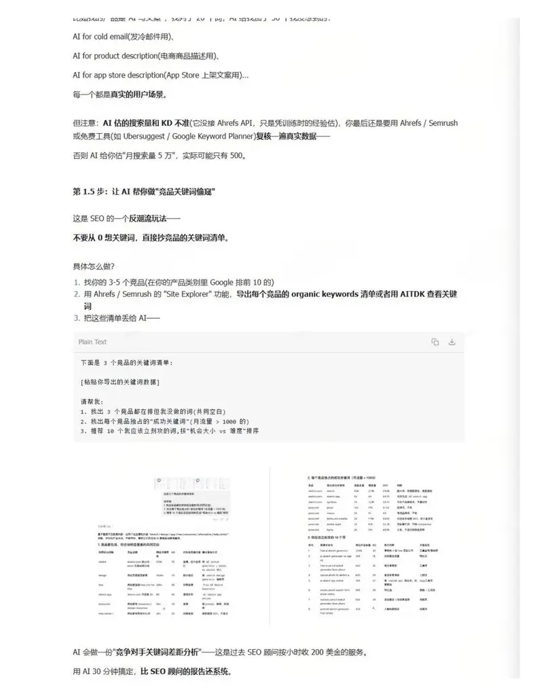

第2步: 用Claude Skills 自动化整个 SEO 流程

2026 年 GitHub 上有不少专门做 SEO 的 Claude Code Skills一可以直接 install 到你的 .daude/skills/ 文件夹，让 AI
按 SEO 专家的标准方法跑流程。

我看了一些社区评价不错的开源 Skills:
。 AgriciDaniel/claude-seo : https://github.com/AgriciDaniel/claude-seo

* 25 个 sub-skills + 18 个 subagents，覆盖技术 SEO、E-E-A-T、schema、GEO/AEO、外链

。 aaron-he-zhu/seo-geo-claude-skills : https://github.comy/aaron-he-zhu/seo-geo-claude-skills

* 20 个 SEO + GEO skills，带 CITE 框架 〈写答案前先给 40-60 字搞要)

* claude-seo.md 一 免费 SEO audit 工具，MIT 许可

这些 Skills 装上后，可以做的事:
。/seo:keyword-research 一 关键词研究

* /seo:auditpage 一单页 SEO 审计
。/seo:checktechnical 一 技术 SEO 检查

。， /seo:generate-schema 一 自动生成 schema 标记
。/seo:write-content 一 按 SEO 标准写内容

。， /seo:report 一 生成 SEO 报告

我用/seo-page来评估一下我的 Raphael :

/seo-page评估一下这个网站: httpsjraphaelapp

Ranskill/seo-page ，
我开始分析。先折取页面并解析关键SEO 元素-
Ran2commands ，

贿本的 URL 安全检查拒绝了一一你的 DNS 把 raphael .app 解析到 198.18.9.69 (这是 RFC 2544 测试网段，通常代理软件如 SurgejClash 会用这个
做"代理域名") 。这是脚本防 DNS rebinding 攻击的保护。

Ran2commands ，

代理软件把所有 DNS 都返回到fakelP (Clash/Surge TUN 模式) 。脚本的 SSRF 防护没法绕过环境变量。换个方式一一用 curl 直抓 (代理会自动接管路
由)，再用 skill 的解析脚本-

大概5分钟，就会给出非常全面的分析。

还可以换个 skill 做不同的评估，

具体怎么装、怎么用，后面 SEO 三连里那一节(讲 Skills 的)我会单独讲 -一
这一节先告诉你这些工具是真实存在的、免费的、独立开发者可以直接上手。

反潮流提醒: Skills 是工具，不是蔡代品

但请记住一Skills 不能蔡代你的判断。

它能帮你自动化机械工作(关键词列表、技术 audit、内容草稿)，但关键决策还是你的事:
* 选哪个词攻? 你判断

* 内容方向往哪个意图打? 你判断

* 要不要做这个长必间和矩阵? 你判断

我跟你讲一这一点跟前面《对 AI 友好的代码》那几节讲的"心法"一防相承-一
AI 是执行，你是判断。
执行交给 AI，判断始终在你。

道立住了，下面 3 节是术

回到这一节开头那 3 个翻车一一

恶车 1(关键词选错): 4 把判断尺没用一一量了搜索量、KD、相关性、商业意图，你不会犯这种错
翻车 2(内容方向错): 搜索意图没分析一搜前 10 名一看，内容形式立刻清楚
翻车 3(Google 第 1 但 ChatGPT 找不到): 2026 范式转变没意识到一3 个引擎要一起优化(Google + AL Overviews

+ ChatGPT/Perplexity)

避开这 3 个翻车，你的 SEO 已经赢过 80o% 的独立开发者。

但 SEO 是一场长跑，光有"道"还不够。
下面 3 节，我会讲3 个关键的"术":

《高质量外链: 从导航站到链接诱饵》
一 关鱼词选好了，内容写好了，但Google 凭哈相信你? 答案是外链(权威网站给你的"投票")。这一节讲 2026 年怎
么用最少的钱，搞定最有质量的外链。

《Claude / Codex SEO Skills:让 AI 当你的 SEO 顾问》
一 上面提到的 Skills 怎么装、怎么配、怎么跑通自动化流程。让 AI 一晚上跑完你一周的工作量。

《2026 GEO/AEO 实战: 让 ChatGPT/perplexity 引用你》
一翻车 3 的解决方案。Google 是一个战场，AI 引擎是 2026 的新战场。这一节讲怎么让你的内容被 AI 直接引
用、推荐。

4 节合一，你能从 0 建立一个独立开发者的完整 SEO 体系。

最后给这一节收尾-一

SEO 不是关键词游戏，是"用户搜什么 + 想要什么 + 我能不能给"的判断游戏。
关键词是地图，搜索意图是指南针。

2026 年，你还要带上第二个指南针一一AI 引擎在引用谁。

最后再说一句重要的一-SEO 是长跑，不是冲刺。

我前面说过我自己的项目第 5 个月才看到流量起来。这不是个例，这是所有独立开发者做 SEO 的常态-一
* 第 1-3 个月: 没流量，你怀乡自己

* 第 4-6 个月: 有夫星流量，你怀疑值不什

* 第 7-12 个月: 流量开始稳定，你开始相信

* 第 12 个月之后: 流量变成你产品的复利引擎

绝大多数独立开发者死在第 3 个月一因为看不到回报放弃了。
简下少数撑过去的，3 年后稳定拿到大几和干甚至几万自然搜索流量一这是付费广告做不到的复利效果。

SEO 这件事，你今年就要开始。3 年后你想感谢的那个人，就是今天开始动手的你。

挑你手头任意一个产品/想法，做这 5 件事一

任务 1: 列出你的"4 个核心关键词”
按"4 把判断尺"(搜索量 / KD / 相关性 / 商业意图)从 30 个候选里挑出对你最重要的 4 个。
把这 4 个词写下来 这是你接下来 6 个月 SEO 工作的锚。

任务 2: 分析这 4 个间的搜索意图
对每个词,Google 一下,看前 10 名都是什么内容形式(对比文/教程/产品页)。

淹断这 4 个词分别属于 Informational / Commercial / Transactional / Navigational 哪一类。

任务 3: 用 AI 帮你做关键词扩展
用本节的 prompt 模板,让 Claude / Codex 帮你扩展出 30 个长尾关键词。
记下:哪些词 AI 列出来你没想到的? 这是 AI 帮你发现的新机会。

任务 4: 检查你现有内容的"意图匹配”
如果你已经写过 SEO 文章,挑 3 篇一 检查每篇的内容形式跟它的目标关键词的搜
不对亨的,写下要怎么改。

任务 5: 装一个开源 SEO Skill
挑一个上面推荐的 Claude Skills,装到你的 .claude/skills/,跑一次 /seo:audit-page 看看效果。
记下:它发现了你网站什么问题? 这是你 "原本不知道的 SEO 债"。

下一节，我们讲高质量外链-关键词选好、内容写好、但搜索引擎赁喻信你? 答案在外链。

| 六、高质量外链: 从导航站到链接诱饵

这是 SEO 4 连的第 2 节一一讲外链(Backlinks)。

如果你看过上一节《SEO 核心原理: 关键词 + 搜索意图(2026 视角)》，关键词选好了、内容写好了、搜索意图对齐
了,还没结束，还差一件最关键的事一一

搜索引擎攒啥相信你?

外链是 SEO 这件事里最难、最贵的那一块-一也是唯一一块至今没法被 AI 完全自动化的工作。

这一节，可能是整个 SEO 4 连里最值钱的一节。
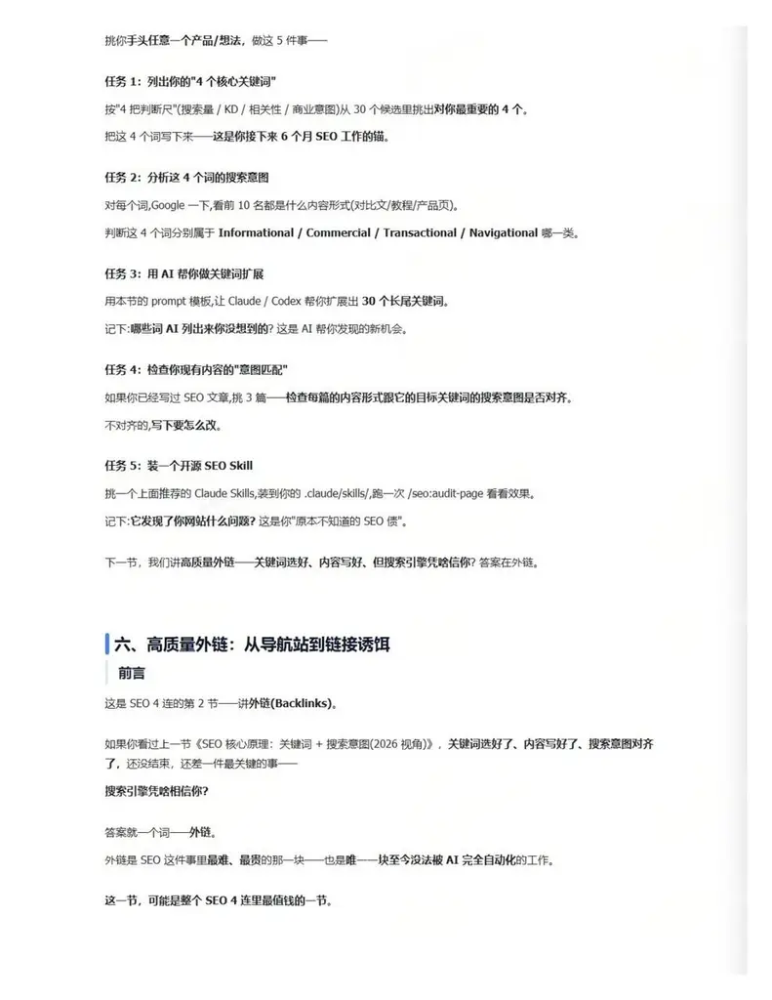

3 个让你"花了 5000 美金没效果"的外链翻车现场
讲%k链之前，我先放 3 个真实翻车一做过外hk链的独立开发者基本都见过。
翻车 1: 花 500 美金买了 50 个外链-一Google 一周内全部识别 + 降权

一个朋友想"快速搞定外链"，在某些 SEO 论坛找到一个"卖外链"的人一一500 美金 50 个，号称都是 DR 30+ 的高权重

他付完钱，3 天后所有链接出现在他的网站。
一周后他兴奋地刷 Search Console -一
流昌掉了 60%-。

他打开 Ahrefs 一看-一那 50 个链接 80% 来自所谓的"私有博客网络"(PBN)，Google 的反作二系统(SpamBrain)直
接识别了，他的网站被降权，要 6-12 个月才能恢复。

500 美金不仅打水漂，还把网站搞残了。
翻车 2: 在 product Hunt launch，期待爆发一-结果第二天回归 0
第二个朋友，听说"product Hunt 是 SEO 神器"，熬了 3 个月，精心准备一次 launch。

launch 当天上了首页，拿了 200 多个 upvote，觉得自己起了。
第二天打开网站 当天访客 50，转化 0。

Product Hunt 的流量是流星，不是星河一-上去那一天爆发，第二天回归 0，而且 Product Hunt 给的链接是
NoFollow(不传递 SEO 权重)。

算一笔账: 3 个月准备，launch 那天涨了 10 个访客，ROI 几乎为 0。
翻车 3: 花 3000 美金请人写客座博客一-发到一个完全无人访问的网站

第三个翻车，是 2026 年最容易踩的一
一个朋友想做"客座博客"(Guest post)一一花 3000 美金请人在"高权威博客"上发了 5 篇文章，带回链。

他打开 Ahrefs 看-一这 5 个站点 DR 都 50+ ，看起来很专业。

但他打开网站本身，发现首页排版像 2015 年的 WordpPress 模板，文章每篇评论数 0，Twitter 0 关注，Reddit 0
提及一一这是典型的"链接农场"Link Farm)-一专门给人发付费外链的站点，内容没人看，Google 没识别。

3 个月后，Google 把这类站点全部降权一一他的链接价值瞬间清零。

和                            3个外链翻车现场

贿 过级外小杰权 | Product Hunt末 ] 各朱伟客发果泛接家人

2 | 二下全一

于  另三儿三，

四

买 50 个 PBN 狼接 / 被降公       上走拓发/ 第二天回日D       和3000 发过全没人看的网站

如果你做过外链，这 3 种翻车一一至少踩过一种。

它们的根因只有一条-一

只看链接的"表面权重"，不看链接的"真实价值"。

外链不是"DR 越高越好"的数字游戏。

外链是 "真实的用户、真实的访问、真实的相关性"的复合体。

这一节，我教你 3 件事一

1. 2026 年 Google 怎么判断外链质量(SpamBrain 在做什么)
2. 白帽 / 灰帽 / 黑帽 的真实选择(用户特别想知道的)
3. 独立开发者从 0 起步,5 种白帽 + 工种灰帽外链建设法(具体到操作)

学完你就能避开开头 3 个翻车一 同时建立第一个 30+ 高质量外链清单。

外链到底是什么? 为啥 Google 这么看重?

5 句话讲清楚 一
外链(Backlink)= 别的网站链接到你的网站。
比如: 某个博客在文章里写 我推荐用 我的产品名"一一这就是一个Ah链。

为喻 Google 这么看重外链? 因为它解决了一个根本问题-一
你怎么判断一个网站是"权威的"?

早期 Google 的算法是看页面内容一一但被人取巧，大量堆砌关键词，内容假但骗过算法。
后来 Google 引入了"他人评价"一别人给你的链接，就是别人给你投的票。

类比一下-一你怎么判断一个人是不是大牛?
不是看他自己怎么次，而是看圈内有多少人提到他、引用他、推荐他-一这就是"权威"的本质。
外链就是互联网上的"回内推荐"。

外链= 别人给你  投票

互唆网上的 唱内推荐志

Taouen

pear
tt 一
2

四
oa用
Ag

debon

v        权威性 = 多少人/多权威的人 主动提到你

Google 怎么判断外链质量: SpamBrain 在做什么

讲4k链获取策略之前，你必须先搞慌一2026 年 Google 怎么识别"假外链"。
SpamBrain 是 Google 的反垃圾外链 AI 系统。它在 2026 年达到了"以惊人精度识别买来的链接"的水平。

它在评估每个外链时，不只看单个链接的"表面权重"一它看 3 个维度:
维度                                        它在看什么                假外链的破绽
Velocity(速度)                           你网站外链增长曲线 一个新站一周突然多 500 个 一 直接红牌

Anchor Text pattern(错文字模式) ”链接里的可点击文本 100 个外链都是同一个精确锚文字"AI 写文案" 一
像被人鹿的

Referring Domain Diversity(引用 ”给你链接的域名都是哪“100 个都是博客评论 一 不健康
域名多样性)                               类

只要某个维度异常，Google 就会怀疑。

ea 评估 外链的: 3个维度

026 年识到买杀接铺:9

时 Doesy玫介和

2026 年，Google 每天处理几十亿条链接信号。SpamBrain 用 AI 识别买卖链接的准确率，据 Google 自己说, 在
90% 以上。

也就是说，5 年前那种"花点钱买几个外链"的模式，现在基本没法用了。
但反过来-一自然产生的外链(真用户、真推荐)，从来没凤值过。
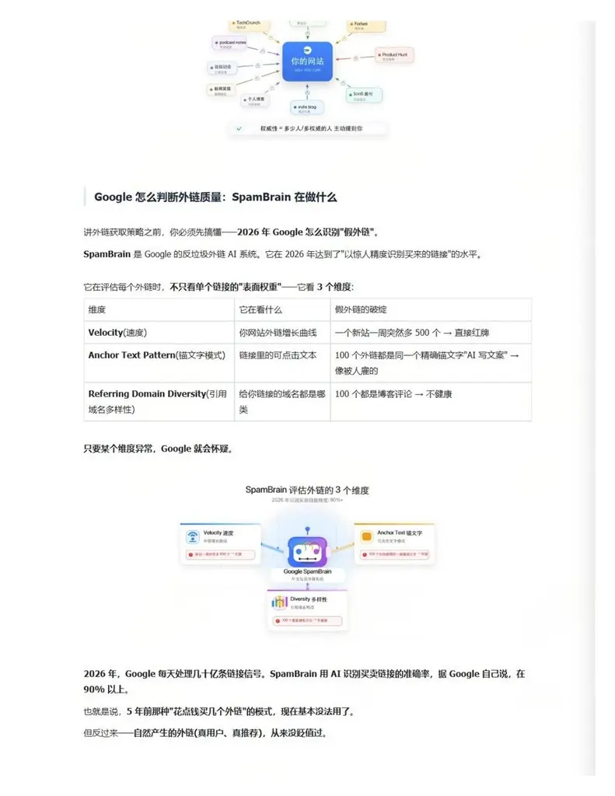

白帽 / 灰帽 / 黑帽: 你应该做哪种?

讲具体招数之前，先进外链建设的"道德 + 风险光谱"一
这是一个真实存在的灰色地带，很多 SEO 教程不敢明讲。我跟你讲实话。

白帽(White Hat)
定义: Google 完全认可、鼓励的方法。
例子: 导航站提交、HARO/Digital PR、写好内容自然吸引外链、客座博客(高质量真实)

优点: 长期安全。Google 算法变了也基本不怕。
缺点: 慢。一个月可能只能拿 0-3 个高质量链接。

灰帽(Grey Hatb)

定义: Google 不明确禁止，也不鼓励一-技术上没违规，但 Google 知道你在"投机 "。
例子:

* 买 "高权威"网站的 Niche Edit(给已有文章插入你的链接，付费)

* 用过期域名建二级站点引流

。 私有博客网络(PBN)一自己注册多个域名，互相链接

优点: 快。一周可能拿 10-20 个外链。
人缺点: Google 反作台在 2026 年抓得越来越准一-SpamBrain 一旦识别，6-12 个月才能恢复。

黑帽(Black Hat)

定义: Google 明确禁止的一一旦被抓，永久封禁。
例子:

*。 大规模买卖外链链接(典型链接农场)

* 黑掉别人网站偷偷加链接(SEO Hack)

* 自动化批量评论垃圾外链

优点: 极快。
缺点: 死刑。一旦 Google 识别，网站基本废了。

我的建议: 95% 白帽 + 5% 灰帽 + 0% 黑帽

这是 2026 年独立开发者最理性的策略一

外链建设的 3 种姿势

白帽 White Hat

排建议:95% 白帽 + 5% 灰帽 + 0% 黑由

占比            类型                       为喻
95%           白由                       长鞭复利,Google 基本不会惩罚你
5o%            灰帽(可选)              起步加速器-一但单一手段不超过 30% 的总链接占比,SpamBrain 容忍单点小
动作
0%            黑帆                    绝不磁。一旦被抓,几年的 SEO 工作清零
老外的 SEO 行业有个不成文的共识:

"灰幅其实占了 SEO 行业的大半，但很少有人公开承认。”

这是事实。
但作为独立开发者，你的产品是长跑，白帽是底盘，灰帐是偶尔加速，黑帽是自杀。

下面我们具体讲一-5 种白帽 + 工种灰帽 的实操方法。

白帽招数 1: 导航站矩阵一一"赤 8 个站，Product Hunt 不再是唯一"

第一种最容易上手的一给一堆相关的导航站/launch 平台提交。

但这里有一个新的体感-一
2026 年，product Hunt 单站打不出去了。

据真实开发者社区反馈，约 68% 的独立开发者 product Hunt launch "感觉完全没动静"一一除非你有几千粉丝在第
一小时帮忙投票，算法不会推首页。

正确姿势: 到 5-10 个站同时打，这样每个站给你 50-200 流量，加起来比 Product Hunt 单站强。

2026 独立开发者必备 8 大 Launch 平台

各加打 比 Product Hunt 单站强 5-10 信

Q@ Product Hunt    Cj BetaList         [LA Indie Hackers    四 Hacker News
Ouroov       oroov       morotv       He1 Ore
站四人机      ap 1o0s00 ja     盏bu ma          三力要

1          HH           Therss An AI
转 wemaaver  图sen       人
er ora     5 on     za ora     2 ora

AR           全      pe An工RE     本

20256 年独立开发者必备的 8 个 Launch 平台

平台                             是否 DoFollow 。 适合产品类型              备注

product Hunt               愉 NoFollow     通用                        是"门面",但流量价值有限
Betalist                    圆 DoFollow 还没正式上线的产品     起步前 100-500 邮件订阅利器
Indie Hackers              图 DoFolow 独立开发者类产品        写"build journal" 长文带链
Hacker News (Show         其 NoFollow 技术/开源类                 流量爆发力最强,但批评狠
HN)

AlternativeTo               图 DoFolow 工具类(车代革竞品)      长尾流量

SaaSHub                       圆 DoFolow 。 Saas 类                     长期挂着,持续带流量
There'sAn AI ForThat ”圆 DoFolow 。 AI 工具                     2026 AI 工具流星首选
Dev.to                       圆 DoFolow 开发者工具               写技术文章带链

实战经验: DoFollow 优先
注意上面表格里的标注有些平台是 DoFollow(传递 SEO 权重)，有些是 NoFollow(不传递)。

SEO 价值上，DoFollow 链接通常远高于 NoFollow 链接(传递权重的差距很大)。
但 NoFollow 也有价值一带流量、带品牌桌光、有时还会被其他网站二次引用。

我的策略: DoFollow 优先,但 NoFollow 不嫌弃一一能拿就拿。

进阶玩法: Multi-platform Launch Stack

老外社区里有一套被验证的"多平台 launch 时间线"一一
时间                     动作
Launch 前1周        在 Indie Hackers 写一篇"做这个产品时遇到的 3 个坑"长文
Launch 当天           同时上 Show HN + 5 个相关 subreddit + 你的 Twitter
Launch 第 2天        提交 BetalList(如果还没正式上线)+ AlternativeTo + SaaSHub
Launch 第1周        在 Devto 写一篇技术文,带回链

Launch 第 2周          给一个相关博客投稿一篇高质量客座文

Multi-Platform Launch Stack 时间线

比Product Han 单站朝基长其外涟多5
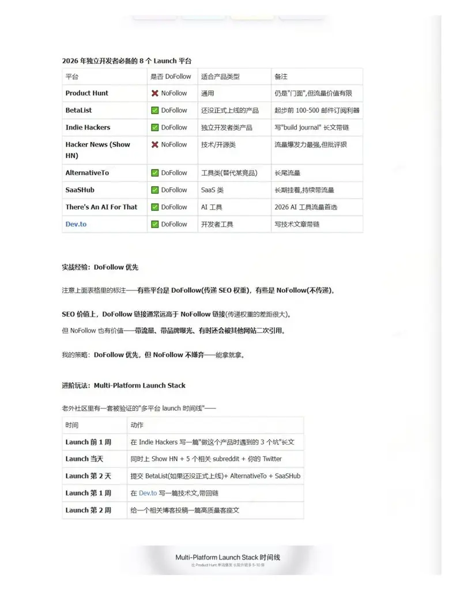

Unen机1网     Launch当天4。 tmen关?天     aren间1网     Unen音2网

aoHacker写-局

mcae写技术文 的相关二过术一航
全产品H9尖曙的3个外                                      机加帮
长六

商量吉文

这套打法，比 Product Hunt 单站爆发，长期外链多 5-10 倍。

白帽招数 2: HARO / Digital PR一一"让记者主动写你"
这是 2026 年最被低估的白由招数一很多独立开发者根本不知道。

但讲之前我要先纠正一个重要事实一
原 HARO 平台(HelpAReporter.com)在 2024 年 12 月 9 日已关闭(Cision 把它改名 Connectively 后又关停)。

2025 年 4月 Featured.com 收购了 HARO 品牌，但只保留了一个简化版邮件 newsletter，不是原平台的样子。

你今天搜 HARO，会看到 helpareporter.com 还能打开，但功能跟 5 年前完全不一样了。

但HARO 的精神(Help A Reporter Out)还在一一记者发查询，你回答，你拿引用一一但承载这个机制的平台已经分散
到4-5个。

下面我直接讲还能用的一
HARO 工作机制
HapARapona oa赂用--妈
二=     一~     rr
忌目        i
记者发问              你 10 分钟内回答          媒体引用 + 给你链接
|        aa          证
加        认真做 30 天 = 1-2 个 Tier1媒体外链
机制是这样的:

* 全球记者每天有几千个采访需求(写各种话题文章)
* 他们用各种"记者-source 撮合平台"发布查询

* 如果你能提供有价值的回答，他们会引用你 + 给你的网站链接

为啥这是金矿?

记者的链接 = 媒体类网站的链接 -这类链接 DoFollow + DR 极高 + 完全自然。

我艰你讲一 个 Forbes / TechCrunch 的链接，价值相当于 100 个普通博客链接。
而且因为你提供的是真实价值(回答记者的问题)，Google 基本不会怀疑。

实操: 2026 年用哪几个平台?

原 HARO 关闭后，主流蔡代品有 4-5 个-一独立开发者起步时，至少注册 2-3 个，人加用:

平台                        性质                                       推荐度          特点
Featured.com          收购了 HARO 品牌,curated          帘宽宽 质量门槛高,匹配率较好;部分功能付费
帘
Qwoted                      验证制                                           帘宽帘 ”转化率最高,记者真看回复
帘
Source of              HARO 创始人 peter Shankman ”帘帘帘      免费 + 邮件 newsletter 形式,跟老 HARO 最
Sources (SO0S) ”重启                                       帘               像
SourceBottle           澳新强,全球可用                        帘帘信。 60,000+ 专家库,免费
ResponseSource 。 欧洲/英国                                      帘帘视 ”传统媒体强,付费

实操建议:

1. 先注册免费的 SOS + SourceBottle(老司机首选起步)

2. 快 一通常前 10 个回复里最容易被引用(记者每个查询收 10-50 条 pitch)
3. 回答要短、具体、带数据一记者最爱这种

4. 每天检查 4-5 个平台-一单一平台询问量不够撑你的节奏

实战提醒

很多人发的 HARO 回复像营销文一这种基本不会被引用。
正确姿势; 直接回答记者的问题，真诚、具体，只在签名里带网站-一这样反而容易上。

我观察到的实操经验-一
一个独立开发者认真做 HARO，和平均每月能拿 1-2 个高质量媒体外链。
一年下来 12-24 个 Tier ! 媒体链接，单论权威性，远比同等预算买的"高权威"链接靠谱。

白帽招数 3: 链接诱饵一一"让别人主动想链接你"

第三种白巾一做一些别人会自发引用的内容/工具。

链接诱包的 3 种形式

ED

免费工具                   游戏 / 互动             原创研究 / 数据报告

各站分析7 1000 个
Ahrefs 先珊 SEO 工具委               arawafishcom 画一末鱼                  二

和和六品主面相 + 六全免轴     有症 ，上有+ 有人     WA呈人四图

sa有                         1                       0

大公司没空做 独立开发者有时间 = 不对称优势

链接诱钼的 3 种形式

1. 免费工具
最经典的例子 Ahrefs 免费 SEO 工具集。

Ahrefs 自己是付费工具，但它做了一系列免费工具(关键词难度检查、外链分析、网站速度测试)，这些免费工具被全网
博主引用，带来海量外链。

独立开发者怎么做? 在你的网站子目录加一个完全免费 + 跟你产品主题相关 + 别人也能用的小工具一比如:
* AI 工具公司 一 免费"AI 检测器”
* SEO 工具公司 一 免费"网站审计工具”

* 视频工具公司 一 免费"YouTube 缩略图测试器”

2. 游戏 / 互动
drawafish.com 是一个让用户画一条鱼的游戏页面-一因为有趣 + 上瘾 + 易传播，病毒式扩散，带来无数外链。

游戏诱饵的核心: 社交属性 + 上瘾性一让用户忍不住分享给朋友。
如果你的网站子页面能做一个这样的小游戏，外链问题基本解决。

3. 原创研究 / 数据报告
最强的诱饵一做一份别人没做过的原创研究。

如果你做 AI 写作工具，可以发布:

。 我们分析了 1000 个 ChatGPT prompts，发现了 7 个共性"

* 我们调研了 300 位独立开发者，他们最常用的 AI 工具是…”

一份扎实的原创研究报告，平均能带来 22+ 个高质量外链 + 3+ 次媒体采访邀请。
大公司没空做"小范围深度研究"，独立开发者有时间 一这是不对称优势。

白帽招数 4: 客座博客 2.0一一"不是花钱发垃圾，是给同行写一手价值”

经典的 SEO 教程都讲"客座博客"(Guest Post)一一但 2026 年 80% 的客座博客是垃圾。

十所儿上司拓绎SHI 在丁压尽捕安上内术疝 上 措同久_。 涪种tt Cna

一可入

八PpoA EYOUEMLTIANALLIPREEISELLOKAC 六， mwE JeTTraas -banma

客座博客 2.0 的正确姿势

不是你付钱发垃圾，是你给同行写一手价值文章一

具体操作:

1. 找你领域的 5-10 个真正有读者的博客一一不是看 DR，是看评论数、Twitter 转发数、Reddit 提及
2. 私信博主一一"我做这个产品已经 6 个月，踩了 3 个坑，想跟你的读者分享。能给我一个客座位吗?
3. 写一篇 2000+ 字的真心文-不是软广，是真正帮读者解决问题的内容

4. 在文章里自然嵌入 1-2 个回链(不是堆砌)

这种客座博客的链接，DoFollow + 高 DR + 完全自然-一SpamBrain 基本不会怀疑。
但是慢-一一个月可能只能搞定 1-2 篇。
实战提醒

别花钱。

所有"花钱发的客座文"，在 2026 年都是高风险。

Google 越来越能识别"批量发文"的模式，今天没事，明天可能就降权。

唯一安全的客座博客 = 你真的写了一手原创价值，人家发自内心想发。

白帽招数 5: 交换友链一一"低成本起步，但要克制”

经典招数，但 2026 年要小心。
交换友链: 你和另一个网站互相在对方网站上加链接(A 一 B.B 一 A)。

* 成本极低(免费)

* 起步友好 一新站没权重时，几条交换链接能让 Google 知道"你存在"

风险
* Google 知道这是交换(它能识别'互链模式 )

* 权重传递有限(单向链接 > 互链)

* 过度依丈会被判定为"链接交换网络"一 降权风险

我的建议: 交换链接占比不超过 20%

如果你网站总共有 100 个外链，交换链接最多 20 个-
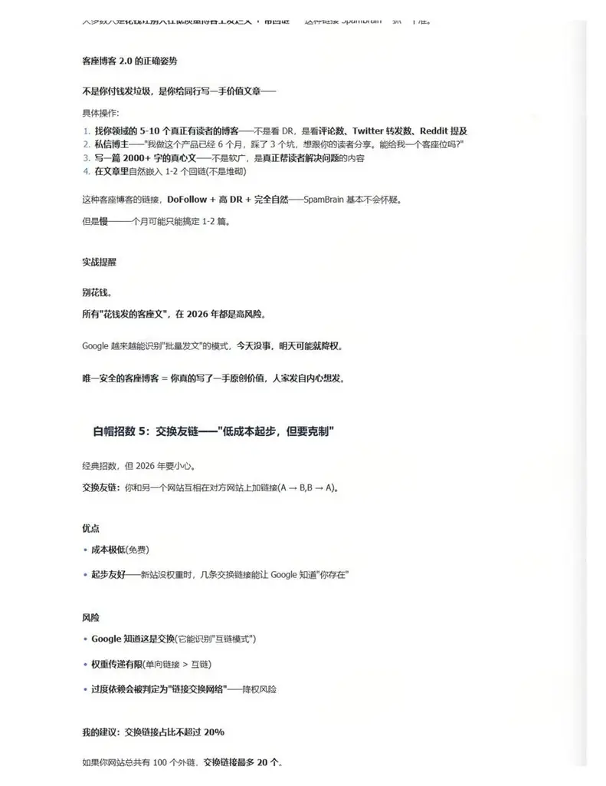

剩下 80 个必须是单向链接(别人主动给你，你没回链)。

实操技巧-一三方交换:

你想跟博客 A 交换，但 A 不想跟你互链(因为太明显)。你找 C(你的另一个朋友的博客)，让 C 链接到 A，A 链接到你
一这样互相不直接互链，但 SEO 权重传递了。

这是灰色地带，用得少就 OK，用得多 SpamBrain 也能识别。

灰帽招数: Niche Edit + PBN一一"你能用，但要懂代价"

讲到这，讲一个你特别想知道的一灰幅招数。
灰帽是真实存在的，SEO 行业大半在用，但 95% 的教程不敢公开讲。

Niche Edit(利基编辑)
定义: 你付费给一个相关博客的博主，让他在已有的老文章里插入一个指向你网站的链接。

为啥灰?
* 链接所在文章是真实的老内容，Google 看不出"为你专门写的”
* 链接是真谋在内容里，不是垃圾留言

* 你付费了-一技术上违反 Google "不允许买链接"的规则

风险等级: 中
适合准: 有预算 + 想加速但不想冒大风险的一独立开发者用得少，小型 SEO 公司常用

PBN(私有博客网络)
定义: 自己注册或买下一堆相关域名，在每个域名上建小博客，让这些博客互相链接 + 都链接到你的主站.。

为啥灰?
* 每个博客都是自己控制一你椒链谁就链谁
* 但 Google 如果识别到这些站点是"同一个人控制的"一 全部降权

风险等级: 高(2026 年 SpamBrain 抓 PBN 的精度据说在 90% 以上)
适合谁: 短期烧火 + 接受网站可能被降权的代价-基本不推荐独立开发者用

我的灰帽使用原则

如果你坚持要用灰帽，严格遵守 4 条:
1. 总链接占比不超过 30%一一SpamBrain 容忍少量

2. 中多个个同的方法(不要全部都是 Niche Edit)
3. 质量优先一只买真高质量博客的位，不买链接农场
4. 接受最坏结果一 一旦被抓，6-12 个月才能恢复

我个人完全不用灰帽。
花在灰帽上的钱，投到原创内容 + HARO 上，长期回报通常会更高。

AI 编程视角: 用 Claude/Ccodex 自动化外链建设

讲完招数，讲 AI 怎么帮你

自动化的 3 件事

工. 外链审计: 让 AI 用 Ahrefs/Semrush 数据扫描你的现有外链，自动标出"低质量"和"高风险"的链接一一你可以主动
disavow(声明拒绝)。

2. 竞品外链分析: 让 AI 扫描 3-5 个竞品的外链清单，找出"竞品都有但你没有的链接来源"一一这是你最该攻的目标。

3. 个性化外联邮件: 让 AT 帮你针对每个潜在外链对象写一封个性化邮件(不是模板群发AI 能显著提高你的外联效
率(经验值)。

反商名扒: raphaelapp                                                                            aa

prompt 例子

铝
[ec

Plain Text

您是 SEO 外链建设助手。我的产品是【产品 + 一句话功能],官网是 【URL] *

下面是我用 Ahrefs 导出的 5 个竞品的 referring domains 数据:
[粘贴数据]

请帮我:

1. 找出 3+ 个竞品都有,但我没有的引用域名

2. 按"获取难度 + 价值"排序,标出我应该优先攻的 18 个

3- 给每个目标网站,起草一封个性化外联邮件(具体到 288 字以内)

格式:Markdown 表格 + 邮件草稿*

va tens et
-已更 era 居多rwreroi
0

代入鬼 10 个共同空自二名

但请记住-一外链是 SEO 中最不能完全自动化的部分

我跟你圭一这话很反潮流。

关键词 / 内容 / 技术 SEO 都能高度自动化。但外链不行，因为它本质上是人际关系

*。 HARO 需要你真实回答记者一一AI 写的回复绝大多数不会被引用
* 宫座博客需要博主真心党得你的内容好 这需要真诚 + 时间

* 链接诱饵需要让用户真的党得有用 + 主动分享一-AI 帮你做工具，但用户买不买账是产品力

外链建设是一场长期信任游戏。AI 帮你机械执行，但真信任，只能你自己积票。

外训 = 唯一无法被 Al 完全自动化的部分
及能做的 (机械执行)      人       只有你能做(户信任)       )

Da  人 IT |
Ce      [ rss ]
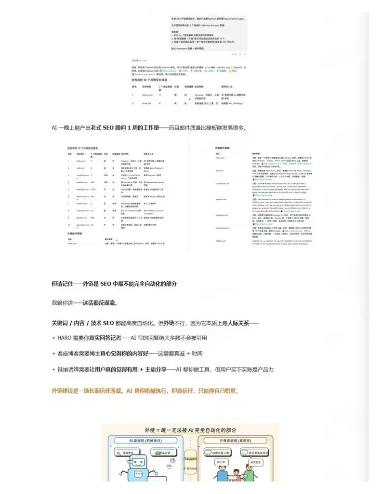

信 如你机二执行 / 但真信任 只能你自己各了

3 年后你想感谢的那个人，就是今天开始建外链的你

回到这一节开头那 3 个翻车一

翻车 1(花 500 美金买垃圾外链被降权): 白帽 vs 灰帽 vs 黑帆 的判断没建立一一花钱买的"高权威"基本都是黑幅
翻车 2(Product Hunt 单站打不动): 多平台 launch stack 没用一一公 5-10 个站才有效
翻车 3(花 3000 美金请人写客座博客发到链接农场): 客座博客 2.0 的标:佳没建立一 花钱发的 80% 是垃圾

避开这 3 个翻车，你的外链建设已经比 80% 的独立开发者强。

外链是 SEO 里唯一无法被 AI 完全自动化的部分。
谁愿意花真时间、真精力做真关系，谁就赢。

作业

挑你手头任意一个产品，做这 5 件事一一

任务 1: 审计你现有的外链清单

打开 Ahrefs / Semrush / 免费工具(如 Ubersuggest)，导出你网站当前所有外链。
按 3 类分组:

* 真实有价值的(媒体 / 同行博客 / 真用户提到)

* 中性的(导航站 / 论坛)

* 垃圾的(链接农场 / 评论坛圾 / 不相关站)

写下你的"垃圾外链清单"一这是你接下来要 disavow 的。

任务 2: 建立你的"8 个导航站"提交清单
按本节的 8 个推荐平台，列出你产品该提交的 5-8 个。
今天就开始第 工个提交。

任务 3: 注册 2-3 个"记者报合平台"，坚持 30 天
(原 HARO 已关闭，现在用著代品)一

。 免费首选:Source of Sources(HARO 创始人重启)

。， 质量高:Qwoted

。澳新强:SourceBottle

接下来 30 天，每天看一次邮件，只要发现跟你领域相关的查询，就回复。
记下: 30 天结束，你拿了多少个媒体引用? 这是你之后 SEO 复利的种子。

任务 4: 策划一个"链接诱饵"

挑一个跟你产品相关的免费工具/原创研究/小游戏。

写一份 工页的产品规划: 这个诱饵是什么、为啥别人会分享它、3 个月之内能做出来吗?
不一定立刻做，但至少有这个 idea 在脑子里。

任务 5: 列出你的"客座博客 5 人名单”

找出你领域里真正有读者的 5 个博主(看评论数 + Twitter 转发,不看 DR)。

写下你能给他们写一篇什么主题的客座文-一 一篇真心想分享的、对他读者有用的内容。
接下来 2 个月，挨个私信他们一目标是拿到 1-2 篇真正的客座位。

下一节，我们讲Claude / Codex SEO Skills一装上 SEO Skill，让 AI 一晚上跑你 1 周的工作量。

|七、claude / codex SEO Skills: 让 AI 当你的 SEO 顾问
前言

这是 SEO 4 连的第 3 节一一讲Skills。

前两节讲充-一一

* 前面《SEO 核心原理:关键词 + 搜       (2026 视角)》一一你知道关键词怎么选 / 搜索意|

*上一节《高质量外链:从导航站到链接诱饵》一一你知道外链怎么建 / 灰帽 vs 白帽怎么选

但你可能已经开始头疼了一
这些 SEO 工作量太大了。

30 个关键词要查搜索量 + KD，1 个网站要审 50 个页面，每个页面要写 shema、检查 meta、看 H1 层级、查 at 文
本…

一周下来，所有时间都在做机械活，没时间做产品。

是的-一这是之前所有独立开发者做 SEO 的真实困境。
但现在游戏完全变了。

Claude Code 和 Codex 这两个工具，各自有了完整的 SEO Skills 生态一一你装上 1-2 个开源 Skill 包，绝大部分
SEO 机械活，AI 一晚上能跑完。

这一节是 SEO 4 连里最卖的一节。学完你能从 SEO "苦工"变成 SEO "指挥言"。

3 个"自己做 SEO 累死"的现场

讲 Skills 之前，我先放 3 个真实场景一做过手工 SEO 的独立开发者基本都南溃过。

1. 30 个关键词，挨个查搜索量 + KD，3 天没干别的

一个朋友想开始做 SEO。

他先列了 30 个候选关键词，然后挨个去 Ahrefs 查搜索量、KD、SERP 前 10、相关词、长尾词。
3 天-一他什么别的都没干，就在做关键词研究。

而且 Excel 越看越乱一一30 个词 x 8 个维度 = 240 格数据，他自己都搞不清楚优先级。

2. 一个网站 50 个页面，挨个审 SEO，审到吐

第二个朋友想给自己的 Saa5 做全站 SEO 审计。
50 个页面，每个要查:

。，title / description 字数

*H1/ H2 层级

*。 图片 alt 标签

* canonical 链接

。*， schema markup

* 内链结构

。robots.bt 规则

* sitemap 是否包含

工个页面 30 分钟，50 个页面 = 25 小时。

他审到第 10 个页面就放弃了一一后面 40 个页面 SEO 错误就一直没改，网站排名一直起不来。
3. 发现要做 schema markup，但每种页面 schema 都不一样

第三个翻车，是 SEO 里最让人衣溃的-一
朋友看完一篇"为什么要写 schema'的文章，激动地决定给所有页面加 ]SON-LD 结构化数据。
打开 sdhema.org 一看一有几百种 schema 类型，产品页、文章页、FAQ、面包居、评测、视频…

每种 sdhema 的字段不一样，他每加一个页面要查 schema.org 文档 30 分钟，1 周加了 5 个页面。
更市清的是: 他写错了几个字段，Google 识别不了，白干一周。

小词典:

Schema markup 是一套由 schema.org 定义的、被 Google、Bing、Yahoo 共同支持的"词汇表"。你把这套词汇按规定
的格式写进网页代码里 (最常见的写法是 ]SON-LD，一段 <script type="application/ld+json"> 嵌入到 HTML) ，搜索
引擎就能精准理解:

* 这是一篇文章，作者是谁、发布时间是什么;
* 这是一个产品，价格多少、库存状态、用户评分几颗旺;
* 这是一个 FAQ 页，问题和答案分别是什么;

这是一段视频、一个食谱、一场活动、一家公司……

没有 sdhema 时，搜索引擎只能'猜页面在讲什么， 有了 schema，相当于你亲手把页面信息整理成卡片递给它。

schema.org 颁布规则 一 schema 是这套规则 一 schema markup 是你按规则写出的代码 一 JSON-LD 是写这段代
码用的语法。

3 个手工 SEO 累死现场

人                 审到第 10 页                   写错字段
ee                      就放弃了                  Google 识别不了

如果你做过 SEO，这 3 种翻车一一至少踩过两种。

它们的根因只有一条-一

SEO 里大部分是机械活，人来做就是受罪。

关键词研究 / 页面审计 / schema 生成 / 内容优化 / GEO 检查…

这些都是规则清晰、判断明确的工作一简直是为 AI Skills 量身定做的。

这一节，我教你 3 件事一

1 什么是 Skills? 为什么 SEO 是它们最佳应用场景
2. 2026 年 Claude Code 和 Codex 的 SEO Skills 生态(独家整理: 6 大主流仓库)
3. 从0到工的30 天 Skills 升级计划(具体到命令:

学完这一节，你能把 SEO 工作旦显著缩短一剩下的精华是判断，只有你能做。

什么是 Skills? 什么是 Subagents?

5 句话讲清楚-一
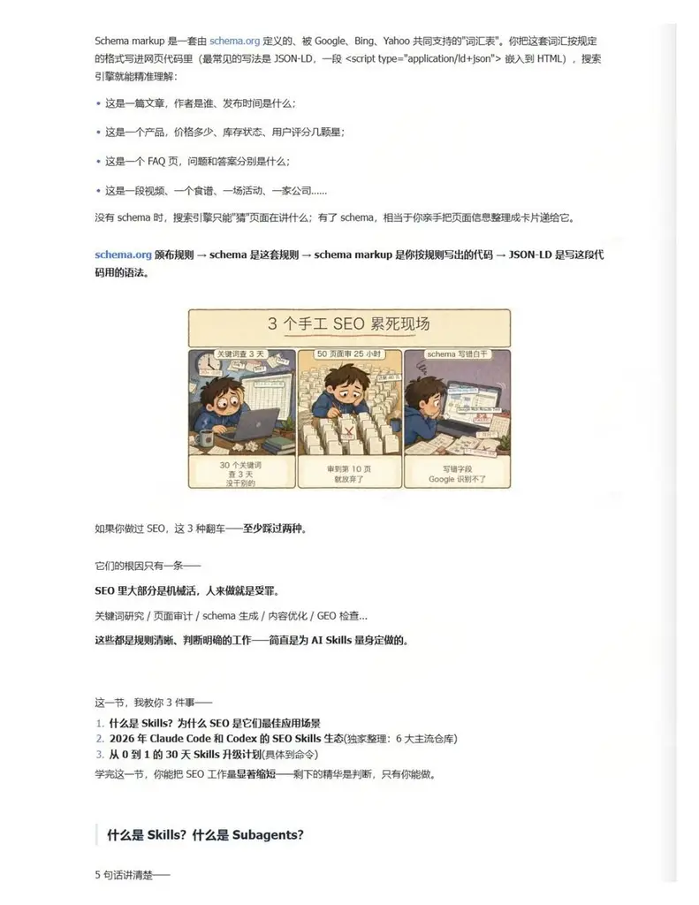

之前的课程里你已经接触过 Skills 概念。但这里我们用 SEO 视角再讲一次。

Skills (技能)

定义: Skills = 打包好的"专家工作流"，主 agent 看到任务匹配，自动调用。
结构: 每个 Skill 是一个 markdown 文件，描述:

* 什么场景该用我

* 我能用哪些工具

* 我按什么步骤工作

* 我返回什么格式

安装位置:

*。 Claude Code:.daude/skills/ (项目)或 ~/.daudey/skills/ (全局)

。 Codex:w/.codexjagents/ 或者通过 [[skills.config]] 在 ~/.codex/config.toml 里配置

Skills + Subagents 架构

息

Skill (说明书)                                                        Subagent (工人)
人             全             5
打包好的专家工作流                                                       执行Ski 的工人

1    一个SEO Skill 包通常= 多个 Skills + 多个 Subagenls配套

Subagents (子agent)

定义: Subagent = 执行 Skill 的"工人"，在自己独立 context 里跑，不污染主对话。
关键差异:

* Skill = "做什么的说明书"(知识)

* Subagent = "执行说明书的人"(执行体)

一个 SEO Skill 包通常是 多个 Skills + 多个 Subagents 配套-一比如:

。 seo-audit skill 调用 technical-seo-checker subagent

。 Seo-keyword skill 调用 keyword-explorer subagent

为啥 SEO 是 Skills 的最佳场景?

3 个原因

1. SEO 的规则清晰一一什么是好 tile、什么是 schema 错误、什么是 canonical 问题一这些都是有明确标准的判
断，AI 容易学
2. SEO 工作量大但重复一一50 个页面要审一样的 8 个维度，重复 = AI 效率最高的场景

3. SEO 输出是结构化的一表格、]SON、Markdown 报告-一结构化输出 = AI 比人快很多

SEO 这件事，比起代码，可能更适合 AI Skills 自动化。

SEO = Al Skills 的最佳应用场景

aa          1          ae
am              2            G
YV一                                上    ]
Y 一              1                 页   JJ
二

SEO 规则清晰                     工作量大但重复                      输出结构化

为啥?
因为代码出错可能斋程序，而 SEO 出错是 review 阶段就能发现的一
title 改长了你看一眼就知道，schema 字段错了 Google Rich Results Test 一跑就出错误。

容错性高 + 规则明确 + 工作量大 = SEO 几乎是 AI Skills 是身定制的应用场景。

2026 年还在手工审 SEO 的独立开发者，就像 2020 年还在用记事本写代码不用 IDE 的人一一不是不行，是慢了好几
个数量级。

但我必须先涛一盒冷水一装 Skills 不等于你的 SEO 就做好了。
你得先有"道"(知道关键词怎么选、知道搜索意图怎么对齐)，再上"器"(Skills 帮你执行)。
没有道，Skills 是放大器-一把你的判断错误也放大了。

这一点我后面还会反复讲-一这是这一节真正要避免的坑。

Claude Code 的 SEO Skills 生态: 先讲我的首选

讲完概念，讲生态一这是这一节最值钱的部分。

我知道你心里在想什么一
“市面上这么多 Skills，你别堆一堆给我看，直接告诉我装哪个”
行，我说。

最 首选: AgriciDaniel/daude-seo (7.2k stars)

GitHub地址: https://github.com/AgriciDaniel/claude-seo

如果你只装一个 SEO Skill 包，装这个。

2026 SEO Skills 推荐

加刘
AgriciDaniel/claude-seo

为啥就推荐它?

1. GitHub 7.2k stars + 1.1k forks

这是目前所有 Claude Code SEO Skills 里 stars 数比较高的，是真用户用了觉得好回头给的。
2. 51k YouTube 演示观看

https://www.youtube.com/watch?v=COMnNIUakQk

三 mw                                                                  ae
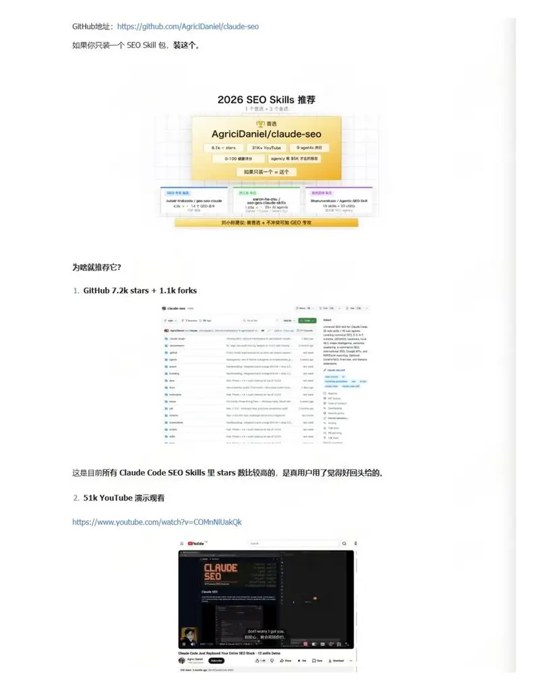

作者 Agrici Daniel 在 YouTube 发了一个完整的 demo一一51K 人看过。

这是市面上所有 SEO Skill 演示里观看量最高的。
3. 真实用户好评

官方收集了几条真实用户反馈-一
我在自己的商业网站上用了它，它发现了一梭乱完全名膀的问题和胡会，”
我在两个网站上网了一罗,， 发现了hhref5 / Semmrush / 仑荔在线工具部没显元的大量改进硕，府少/”

注意这两个评价的关键词一"发现了别的工具没显示的"，它能发现你用 Ahrefs / Semrush / 免费在线工具都看不
到的问题。

4. 作者持续维护到 2026 年 5 月

我查了 Issues 页 一最新 commit 在我写这门课的三天前，有真实用户在提 bug，作者及时回复修复。这不是一个发
完就不维护的"开源僵尸"。

5. 作者还有 2 个姊妹 Skill

作者 Agrici Daniel(自称 AL Workflow Architecb)还做了 claude-ads(Google Ads 自动化)和 claude-blog(博客内容生
成)一3个 Skill 加起来 13k+ stars。

这是一个完整生态，不是孤儿仓库。

它能做什么?

最让人惊艳的是它的工作方式-一
你输入一条命令，9 个 AI subagents 同时并行干活。

跑一次 /seo audit https://yoursite.com，后台:

*。 Subagent 1: 抓页面 + 分析 title / description / Hi

*。Subagent 2: 检查 schema markup

*，Subagent 3: 测 Core Web Vitals + INP(2024 年取代 FID 的新指标)
*。Subagent 4: E-E-A-T 评估(2025/9 Google Quality Rater Guidelines 标准)
。Subagent 5: GEO/AI 搜索就绪度

*。Subagent 6: 外链分析

*。Subagent 7: 本地 SEO + 地图智能

*。Subagent 8: 图片优化

*。 Subagent 9: 技术 SEO(crawlability / indexability / mobile / ]5S 泻染 / IndexNow)

5-15 分钟跑完，产出0-100 健康评分 + 优先级行动清单。
作者自己的卖点是一"agency 收 $5,000 才生成的 SEO 报告，你一条命令就有"。

评分基于 7 个加权维度

它的评分体系是这样的一一
维度                                                                                          权重
Content Quality(内容质量)                                                             239%
Technical SEO(技术 SEO)                                                               22%
On-page SEO(页内 SEO)                                                      20%
Schema(结构化数据)                                                                    10%
Performance(仿 Core Web Vitals + INP)                                       10%
AI Search Readiness(AI 搜索就绪度)                                        10%
Images(图片)                                                                              5%

总分 0-100-一优先级分Critical / High / Medium / Low 4 档。

最爽的是一它会自动识别你网站的类型(SaaS / local / ercommerce / publisher / agency)，然后调整评分权重。
做 Saas 的人和做电商的人，SEO 关注点不一样-一但这个工具自动帮你切换。

实操: 30 秒装好 + 5 分钟跑完审计

mac0Os / Linux 一行装:

Plain Text                                                                                                              号

Bit clone --depth 1 https://github.com/AgriciDaniel/claude-seo.git && bash claude-seo/instal1.sh

Windows(PowerSshell):

Plain Text

名

[e

Bit clone --depth 1 https://github.com/AgriciDaniel/claude-seo.Eit
cd claude-seo
powershel1 -Executionpolicy Bypass -File install1.psl1

用 Claude Code 插件市场(更省事):

Plain Text                                                                                                              钙

[ec

/plugin marketplace add AgriciDaniel/claude-seo
/plugin install claude-seo8Bagricidaniel-seo

企 安全提醒: 不要 curl | bash

我中你齐一个很多教程不告诉你的安全姿势一
永远不要直接 curl … | bash 装来路不明的脚本。

正确姿势 先下载,看一眼,再跑:

Plain Text                                                                                                                                 钙

[ec

# 1。 下载脚本(不执行)
curl -fsSL https://raw.githubusercontent.com/AgriciDaniel/claude-seo/mainyinstal1.sh > instal1.sh

#间 2- 看一眼有没有诡异内容
cat install.sh

# 3. 党得 OK 再跑
bash instal1.sh

# 4 跑完出掉

rm install.sh

Claude Code 自己的安全护栏，会把 curl … | bash 这种命令标记为"供应链风险"一一这是开源生态的常识。别因为
方便给自己挖坑。

你常用的 7 个核心命令

装完后，Claude Code 里直接输入:

命令                                          用途                                    跑的频率

/seo audit https://yoursite.com            全站 SEO 审计                         每月 1-2 次

/seo page https://yoursite.com/about ， 单页深度分析                         每周改新页面时
/seo schema                                schema markup 检查 + 生成        每加新页面时

/seo sitemap generate                       自动生成 stemap.xml                 站点结构变了再跑
/seo geo https://yoursite.com             GEO/AI 搜索引擎优化                 每月工次

/seo backlinks                               外链分析(三档 free-to-premium) ”每月一次盯外链趋势

/seo eeat                                             E-E-A-T 评估                                YMYL 类内容必跑
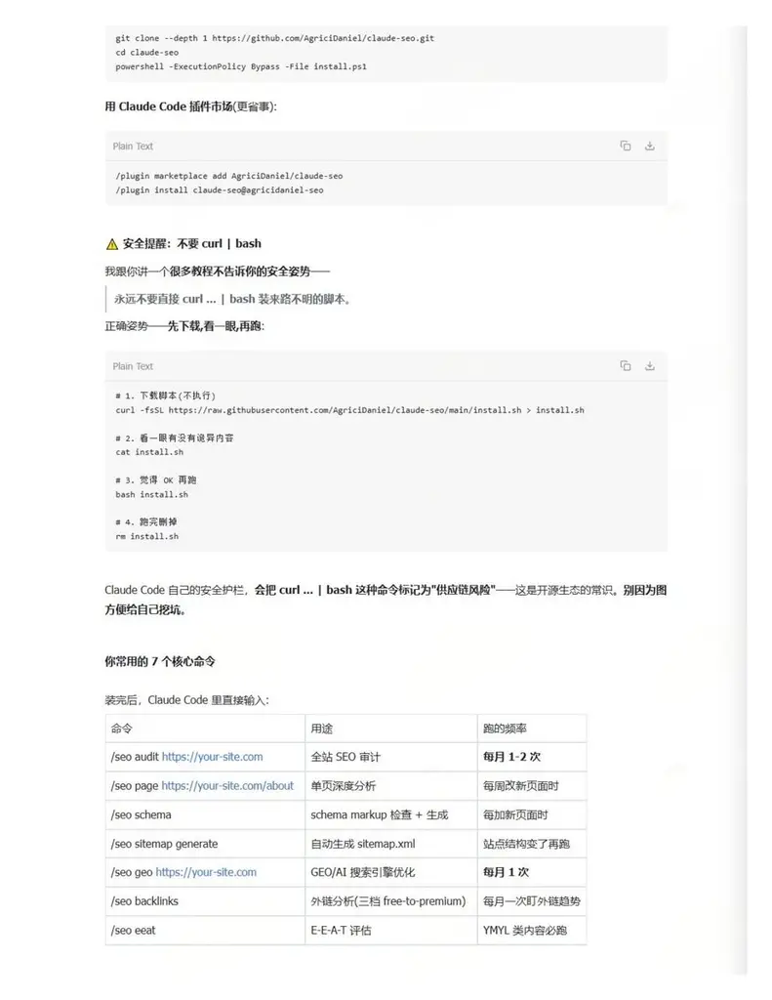

真实使用流程: 我建议的 1 周 SEO 节奏

我自己摸索出来的 1 周节奏(供你参考)-一
时间            动作
周一             跑 /seo audit 看本周整体健康度,review 评分
周二           针对 Critical / High 问题,让 AI 逐个修(改 tile / 补 H1 / 加 schema)

二           跑 /seo geo,看 AI 搜索引擎引用率有没有变化
周四              跑 /seo backlinks,看新增/失去的外链
周五          汇总数据,做下周的判断一攻哪些新记 / 改哪些页面

1周 5 个命令 + 5 次 review = 整周 SEO 工作完成。

而且过程中生成的 PDF/ Markdown 报告还能直接给老板看，显得你"专业"。

隐私 + 收费
隐私: 完全本地运行
收费;

不上传任何数据到外部服务器(除非你主动开 MCP extensions)。

* Skills 本体免费(MIT 开源)
* Claude Code 本身要订阅(你已经在用了)

* 可选 DataForSEO API(深度关键词数据)- 需要自己的 DataForSEO API key，不开也能用大部分功能

还有 3 个值得知道的备选 Skill

我也不是说你只能装这一个。如果有特殊需求，这 3 个备选值得看-一

zubair-trabzada/geo-seo-claude(7.6k stars . GEO 专攻)
https://github.com/zubairtrabzada/geo-seo-claude

*。14个 GEO 命令(geo-audit、/geo-lImstxt、/geo-citability 等)
* 输出PDF 报告(给客户看比 Markdown 漂亮)

* 适合:想专攻 GEO / 想给客户做 SEO 服务的人

*跟AgriciDaniel/claude-seo 不冲突一-可以装两个,一个综合 + 一个 GEO 专攻

aaron-he-zhu/seo-geo-claude-skills(1.8k stars ' 跨工具)
https://github.com/aaron-he-zhu/seo-geo-claude-skills

*。 20 个 SEO + GEO skills,跨 35+ AI agents(Claude Code + Cursor + Codex + Gemini CHLI 等)

*。 框架:CORE-EEAT + CITE(写答案前先给 40-60 字摘要)

。被NVIDIA/ Alibaba Qwen / Cloudera / Mem0 等公司的工程师 star
*。 适合:你不只用 Claude Code,还经常用 Cursor 或 Codex 的人

。 安装:npx skills add aaron-he-zhu/seo-geo-claude-skills

Bhanunamikaze/Agentic-SEO-SkilI(LLM-first 推理透明)
https://github.com/Bhanunamikaze/Agentic-SEO-Skill

。 16 个子技能 + 10 个 specialist agents + 33 个 utility scripts

* 特点:先收集证据 一 LLM 分析 一 加置信度标签(Confirmed / Likely / Hypothesis)

。 适合:做 SEO 顾问 / agency,需要给客户看 AI 推理过程的人

企 一个汪清: daude-seo.md 不是另一个项目

我看到不少人把 claude-seo.md 当成"另一个 SEO Skill 仓库"一一

不是。

claude-seo.md 就是 AgriciDaniel/daude-seo 的官方网站。

也就是说一一你看到 GitHub 上的 AgriciDaniel/claude-seo 和官网 claude-seo.md--一是同一个项目。

(我自己第一次看也搞混过，所以特别提一句。)

SEO Skills 跨工具兼容矩阵

Acadlcaaeeo             v       1

辣 weoeaneeoeocoueaom          2        v        v      ee
,Bananaaaagrrac SEO so                v            v                       oo
arerceuas an              v        v        v     Ge

造Sidl 包检|先看作用的工具能不能站

Codex 的 SEO Skills 生态: 跨工具兼容

如果你用的是 OpenAI 的 Codex CLI(不是 Claude Code)，好消息是一 上面的 SEO Skills 大部分跨工具兼容.
具体看:

Skill 包                                                  Claude          Codex Cursor       其他

Code
AgriciDaniel/claude-seo                                  图                  部分           部分            一
aaron-he-zhu/seo-geo-daude-skills            图              司|           图           35+ AI agents

Bhanunamikaze/Agentic-SEO-Skill                  图                  司|              一                Antigravity

alirezarezvani/claude-skills                   图            贺         图          Gemini CU + 8+

Codex 自己的 Skills 配置

Codex 的 Skills 配置跟 Claude Code 略有不同:

Codex 用 TOML 文件 + 显式注册路径来管理 Skills，Claude Code 用 Markdown 目录约定 + 自动发现来管理一-一个
像 手动报户口"，一个像"小区自动登记"。

Plain Text

句
[ce

划 w/ .codex/config.tomll
[[skills.config]]
path =“/pathy/to/seo-skill/SKILLmd”

enabled =- true

[agents]
max_depth = 1 # 默认值,允许直接子 agent,防止递归过深

Codex 的 subagents 配置在 ~/.codex/agents/*.toml 文件里:

Plain Text

口
[ec

# w/ .codex/agents/seo-keyword.tonl
name = “seo-keyword"
description =“SEO 关键词研究专家”

[instructions]

text =-

你是 SEO 关键词研究专家。当用户给你一个产品据述，
你要列出 38 个候选关键词,按 4 类意图分组，    顶佑搜索量和 kD.….

跨工具的真实建议

如果你刚起步一-选 Claude Code + AgriciDaniel/ daude-seo(综合最强 + 文档好)。
如果你已经在用 Codex-一选 aaron-he-zhu/seo-geo-claude-skills(跨工具最稳)。
如果你专攻 GEO一加 zubair-trabzada/geo-seo-claude。

别一上来装 6个 Skill 包。

我看到不少独立开发者，听说 SEO Skills 厉书，一个晚上把 6 个仓库全 git clone 到 ~/.claude/skills/一一结果命令
冲突、subagent 互相调用混乱、每次跑命令 AI 还要先想"我用哪个 SEO Skill"。

正确姿势: 工个主 Skill 包 + 1个 GEO 专攻包，封项 2 个。多了没用，反而互相干扰。

实操: 从0 到 1 跑一次 SEO Audit

SEO Skill实操 4步
名                 6

起               们

装               跑audit

”每个 revlew 时间 = 修改时间的 30-50%

完生态，手把手教你怎么装 + 跑。

第工步: 安装 SEO Skill 包

以Agri

aniel/claude-seo 为例(最综全的)一

mac0s / Linux 一行装:

Plain Text

Bit clone --depth 1 https://github.com/AgriciDaniel/claude-seo.git && bash claude-seo/install.sh

Windows(PowershelD):

Plain Text

Bit clone --depth 1 https://github.com/AgriciDaniel/claude-seo-g计
cd claude-seo
powershell -Executionpolicy Bypass -File instal1.psl

用 Claude Code 插件市场(更省事):

Plain Text

/plugin marketplace add AgriciDaniel/claude-seo
/plugin install claude-seoBagricidaniel-seo

当然也可以直接让 AI 给你装:

AgriciDaniel/claude-seo安装一下这个skil

Ran2commands ，
让媳失败 【SSL 网络错误) ，重试一下。

Ran2commands ，

名

口

句

[ec
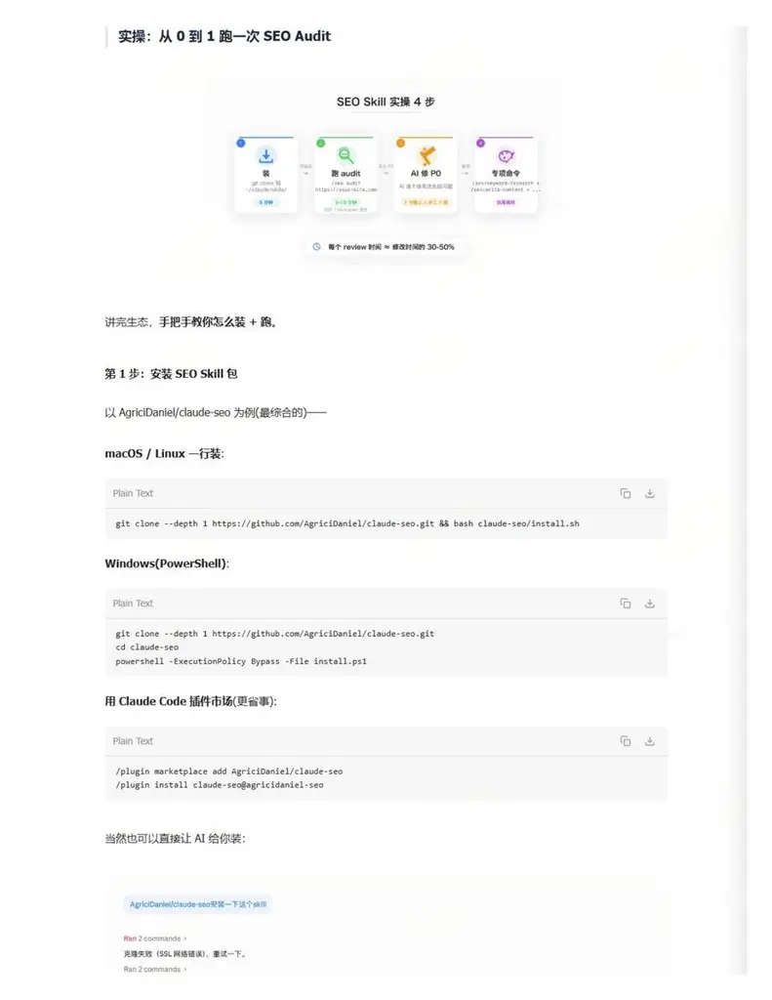

仓库里有多个 SEO 相关sk。安装前确认一下范围。

claude-seo 仓库里有9 个 skill (seo-local1seo-maps1seo-page1seo-plan1seo-programmatic 1 seo-schema1 seo-sitemap 1 seo-sxo1seo-technical) 。 每么安装?7

Skill已经注册成功了一一列表里现在能看到 seo， seo-audit， seo-page， seo-technical 等全部25个SEO skil和8个extension skil

(ahrefsJbing /dataforseo1
fyecrawl1 profound jseranking /unlighthouse |image-Ben) 。检查下后台运程进度.

进度
，回Python 3检测通过

加下载v200

.加25skll扫由到 -/.claude/akills/
加1 agent持由中 -/.claude/agents/
加8 extension 安装

。卫正在装 Python 依球 (pip 在 -/.claude/skills/seo/ .venv 里安半
。卫之后是Playwright Chromium 下载 (-150MB)

Skill文件已就位(你看到的新 skil 列表是证据) 一一利 Python venv 和浏览史还在绚，完成会通知

装完之后，重启 Claude Code -一新的 Skills 会自动加载。

oo                      下交雪过数据
>》 建内容浊构地图
阐真实CWV

/raphae1 ,app >》 进快天，贷后续变更深

laed

第 2 步: 跑一次基础 audit

# 在 Claude code 里输入:

/seo audit https://your-site.com

Claude Code 会:
1. 自动调用 seo-audit subagent-一它在独立 context 里跑
2. 抓取你的网站(用 Firecrawl extension 或者直接 fetch)

3. 检查: title / description / HL 层级 / canonical / schema / robots.txt / sitemap / 图片 alt / 内链 / pageSpeed / Core
Web Vitals

4. 生成一份 PDF/ Markdown SEO 报告 一按"严重 / 警告 / 提示"分级

整个过程5-15 分钟(取决于网站页面数)。
第 3 步: 让 AI 直接修高优先级问题

#跟AI说:
“刚才的 audit 报告里 Pe 级别问题(严重),你逐个修一下。改完显示 diff,我 review 后再 commit。”

AI 会:

1. 读 audit 报告

2. 逐个修(改 title 字数、补 H1、生成 shema、修 canonical 等)
3. 给你看每个修改的 dif

4. 你review 一 commit

工个晚上能修完手工要 1 周的工作量。

这是独立开发者最爽的瞬间之一。
你睡一觉起来，网站的 SEO 评分从 50 分变成 80+ 分，前一晚还痛苦的 50 个 P0 问题，全没了。

你只做了一件事一review + commit.。

很多人装了 SEO Skill 之后，最大的问题不是"AI 不好用"，而是-一

你给 AI 的 review，做得太草率。

AI 一晚上改 50 个页面，你第二天 5 分钟看一眼就 commit -一结果 AI 的判断错误也跟着进去了。
正确姿势: review 时间 % 修改时间的 30%-50%。

AI 给你省了 90% 时间不假，但省下的时间一部分要还给 review，否则就是把"自己的 SEO 错误 "换成"AI 的 SEO 错

误 。

记住这条一一下面所有命令都按这个原则用。

不同场景跑不同命令-一
场景                                                                  命令
我要做关键词研究                                             /seo:keyword-research

我要给某个页面加 schema                       /seo schema

我要看 GEO 表现(被 AI 引用率)                  /seo geo https://yoursite.com
我要写一篇 SEO 文章                                 /seo:write-content

我要监控关键词排名                /seo:setup-alert
每个命令部是独立的 sub-skill，跑起来快、专、准。

To

ongn 一ein有和

eegeeapimaceveomra

sy 7 rege 一sy天本《二用， 55 50

一生loophaca wirealsn wea tn下 ante ruecy

oceaneawagrmnn
rn

8 Ahaoralsleoenvct/ragraet-Eireaacos al

coolohn ia chwerrie pporyay pgcmin

30 天 SEO Skills 升级计划: 从手工到自动化

最后送你一份 4 周升级计划-一从手工 SEO 进入 Skills 自动化的具体路径。

30 天 SEO Skills 升级计划

从SEO 童工到SEO 指挥官

@     人 个     ee

第1周: 装第1个 Skill包

目标: 不求多，先装 1 个 + 跑通

。装AgriciDaniel/daude-seo

*，跑1次/seo audit https://yoursite.com

* 读壳 audit 报告，理解每条 PO/P1 是什么

关键产出: 你网站的第一份 SEO audit 报告(PDF 或 Markdown)。
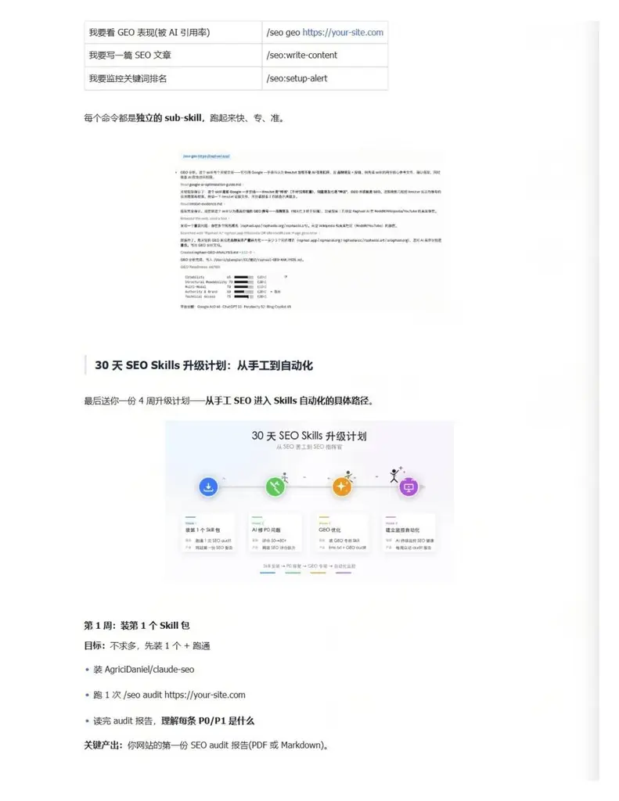

第 2 周: 用 AI 修高优先级问题
目标: 让AI把 audit 报告里的 p0 问题全修了

。让 AI 逐个改(title / description / H1 / schema)
*你review 每个 dif
*。commit + 部寺

关键产出: 你网站的 SEO 评分(audit 总分)从 50/100 提升到 80/100+。

第3周: 试 GEO 优化
目标: 装 GEO 专攻 Skill，让你的网站对 ChatGPT/ Perplexity 也友好

*。装zubairtrabzada/geo-seo-claude
* 跑 /geo-audit
*，跑 /geo-llmstxt(自动生成 lms.tbxt 文件)

* 跑 /geo-citability(检查可被 AI 引用的程度)

关键产出: 你的网站有了 lIms.bt + GEO audit 报告 + 一些可立刻改的项。

第 4周: 建立 SEO 监控自动化
目标: 让 AI 定期帮你检查 SEO 健康

*。用 /seo:setup-alert 设置关键词排名监控
* 配置每周自动跑一次 audit
* 把 audit 报告自动发到你的邮箱/Slack

关键产出: 你的 SEO 工作从"手工偶尔做"变成"AI 持续监控 + 你定期决策"。

反潮流真理: Skills 是工具，不是蔡代品

Skills 能做 vs 不能做

Skils 能做的 (机械执行)            轴 Skils 不能做的 (关键判断)
名 关表生艳。KD 人第                    天和关负友人
籁50个页面的SEO 审计 + 报告                    和辐 决定内容 iiomationali commercal|
araacaara 吕R
人@ emamehup自可生风       人
RE
四 起4失明全先内区
证   让果相此全
ao                    关定95xWsoyOw 折记相比例(风间|
二真人大 估
的化

没有上进 Skils 是放大着一把你的铺误也放大了

讲了这么多 Skills 多爽多自动化，我必须给你一个提醒-一

Skills 能帮你机械执行，但 SEO 的"道"还是你的。

具体来说:

Skills 能做的(机械执行)

* 加 关键词列表生成 + KD 估算

*。辆 50 个页面的 SEO 市计 + 报告

。国 schema markup 自动生成

* 图 内容草稿(SEO 标准)

* 加 排名监控

Skills 不能做的(关键判断)

*。 共 选哪些关键问攻一一这是策略，你要懂搜索意图

*。兴 决定内容方向是 informational / commercial / transactional--一这是产品判断
*。 选4 把判断尺里哪把优先一这是上一节《SEO 核心原理》讲的内功

*。 决定 95o% 白帽 + 5% 灰帽 + 0% 黑帽 的比例-一这是风险判断

* 兴 跟博主真心写客座博客 / 跟记者真实回答 HARO 替代品一一这是关系积昧

我看到不少独立开发者装了 SEO Skills 之后，反而变得更糟-一

为哈?

因为他们不懂 SEO 的"道"一

AT 跑出 50 个关键词，他不知道挑哪个，AI 写了 10 篇 SEO 文章，他不知道哪篇方向对。
结果 Skills 跑得很次，但SEO 效果还不如不装的时候一因为 AI 把没用的工作做了 100 遍。

没有"道"，Skills 就是放大器-把你的错误也放大了。

一个计我血压剖升的真实案例

我前段时间遇到一个独立开发者(我们叫他小 A)。

小A装了3个 SEO Skill 包，一个晚上跑了 200 个 SEO 命令一一关键词扩展、page audit、schema 自动如、内容生
成全跑了一遍。

第二天他兴奋地跟我说: “这就是 AI 时代! 100x 效率! ”

我让他打开 Search Console 看了看流量-一连续 7 天，日均访客 12 个。

我问他: "你跑这 200 个命令，选了 4 个关键词攻吗?”
他异了: “我以为 Skill 会自动选…”

Skill 不会自动选一 它只会做"每个关键词都列一份内容草稿"，但哪 4 个值得攻一是判断，是你的工作。

小A把 200 个 Skill 命令的产出全堆在网站上，结果就是 200 篇质量普通、关键词分散、互相竞争(这叫 keyword
cannibalization)的内容一-Google 一看就降权.。

3 个月后，他的网站访客还是日均 15 个。
比不装 Skill 之前还差。

这件事告诉我们什么?

AI 给你 100 个选项，你必须有能力挑 4 个。

AI 给你 50 篇草稿，你必须有能力判断哪 5 篇值得发。

AI 帮你把 1 周工作压成 晚一但 1 晚里，你要做出整周的判断。
判断密度反而提高了，不是降低了。

这是我看到独立开发者用 AI 编程最容易掉进的陷阱:
也为 AI 解放了你，其实 AI 把你提升到了 manager 角色-一你的判断比之前更重要，而不是更不重要。
正确顺序

先看上一节《SEO 核心原理》一 上一节《高质量外链》一 再看这一节《Skills》一一
* 道(原理)一 术(外链)一 器(Skills)

* 你下能跳过道直接玩器_ 那是给自己挖坑

从 SEO 苦工到 SEO 指挥官

回到这一节开头那 3 个翻车一

翻车 1: 30 关键词查 3 天一关键词研究 Skill 半小时搞定
翻车 2: 50 页面审 25 小时一-SEO Audit Skill 5-15 分钟搞定
翻车 3: schema 写错白干一周一-Schema Skill 自动生成 + 验证

避开这 3 个翻车，你能从 SEO 苦工变成 SEO 指挥官一花 80% 时间在"判断"上，只用 20% 时间在"执行"上。

20256 年前的 SEO，是一场体力战-一谁能熬夜审 50 个页面，谁赢。
2026 年的 SEO，是一场判断战一谁能选对方向 + 让 AI 执行，谁赢。
Skills 是放大器。但放大什么，看你给 AI 的"判断"。

作业

挑你手头任意一个产品，做这 5 件事一

人务1: 装1个SEO Skill包

挑 AgriciDaniel/claude-seo(最综合)或 aaron-he-zhu/seo-geo-claude-skills(跨工具)，装到你的
oj.claude/skills/。

跑一次 /seo audit https://your-site.com。

记下: 这个报告发现了多少个 P0 / P1 问题?

任务 2: 让AI 修 P0 问题
让 AI 逐个修 audit 报告里的 P0 问题。每个修改你 review 后再 commit。
记下: 你网站的 SEO 评分变化(audit 总分)。

任务 3: 跑一次关键词研究
用 /seo:keyword-research 让 AI 帮你列 30 个候选关键词。
把这 30 个词跟上一节《SEO 核心原理》里"4 把判断尺"对照一挑出你接下来 6 个月要攻的 4 个。

任务 4: 试一次 GEO audit
装 zubairtrabzada/geo-seo-claude。

跑 /geo-audit。看你网站现在的 GEO citability 评分一这是上一节预告、下一节展开的 2026 新战场。

任务 5: 建立每周 SEO 监控
用 /seo:setup-alert 设置你的核心关键词排名监控。
配秆每周一自动跑 audit + 把报告发到邮箱-这样你丰用主动检查，SEO 健康一直在你视野里。

下一节，我们齐2026 GEO/AEO 实战一让 ChatGPT、pPerplexity、Gemini 把你的网站作为"首选来源"引用。

| 八 2026 GEO/AEO 实战: 让 ChatGPT/Perplexity 引用你
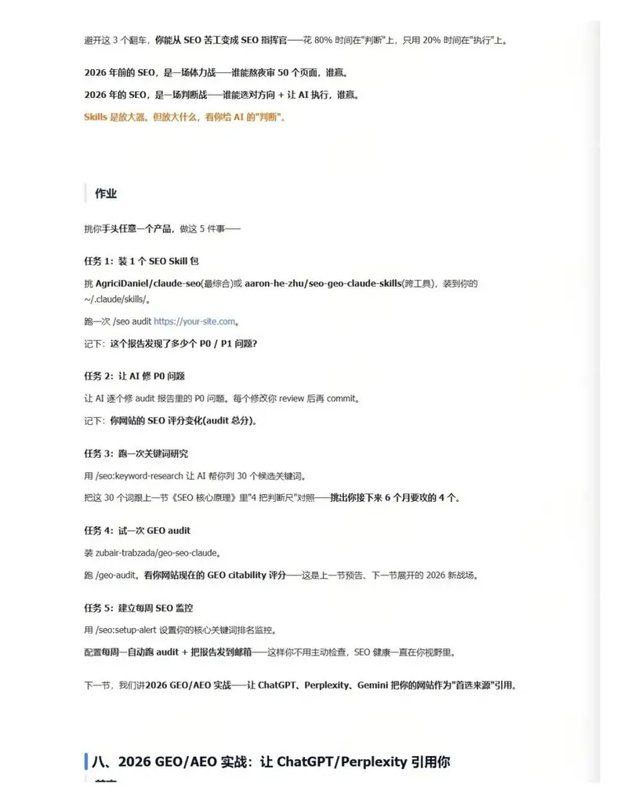

出言

这是 SEO 4 连的最后一节一讲 GEO(Generative Engine Optimization，生成式搜索引擎优化)。

前面 3 节讲充一一

* 第 1 节《SEO 核心原理:关键词 + 搜索意图(2026 视角)》一一你知道关链词怎么选 + 搜索意图怎么对齐
* 第 2 节《高质量外链:从导航站到链接诱饵》一一你知道外链怎么建 + 灰帽 vs 白帽怎么选

*。第3节《Claude / Codex SEO Skills:让 AI 当你的 SEO 顾问》一一你知道怎么用 AI 自动化 SEO 工作

但前 3 节的主战场都是 Google -一传统的"在 SERP 排第一"的游戏。

这一节，讲一个完全新的战场一ChatGPT / Perplexity / Claude / Google AI Overviews 这类 AI 引擎,怎么把
你的网站作为"首选来源"引用。

这是 2026 年 SEO 里变化最快、信息最混乱、骗子最多的领域。
学完这一节，你能避开809o 自媒体讲 GEO 时的虚胖建议，直接拿到一份真实可执行的 GEO 行动清单。

让你"钱花了没效果"的 GEO 翻车现场

讲 GEO 之前，我先放 3 个真实的翻车一做过 GEO 的独立开发者基本都遇到过。
1. 写了 50 篇 SEO 文章，Google 排前 10，但 ChatGPT 完全找不到

一个朋友辛辛苦苦做了一年 SEO，Google 上有 30+ 关键词排前 10，看 Search Console 一切完美。
他打开 ChatGPT，问"哪几个 AI 写作工具最好”
ChatGPT 推荐的是另外 5 个产品，完全没提到他。

他异了。Google 排第一，但在 ChatGPT 完全消失。
为喻?

因为 2026 年的研究发现-一AI Overviews 引用的 Top 10 链接，跟 Google organic Top 10 重合率只有约
37.9%(Ahrefs 2026 数据)。

所以 Google 排第一 去 AI 引用你一这是两个独立的游戏。
2. 听了一堆"加Ilms.bxt 就能被 AI 引用"的教程,加完 0 效果
第二个朋友，听网上一堆教程说"GEO 必加 lms.bt 文件"，3 天加完，信心满满。

结果3 个月后查引用率，跟没加之前一样。

因为 llms.txt 不是正式标准一主流 AI 假虫(OALSearchBot / PerplexityBot 等)从未公开承诺会读这个文件。
它只是开发者图一个事实约定(OpenAI / Anthropic / Vercel 等少数公司发布了)，但没证据说 AI 引擎会因为有

raxratcoom

mms.Dxt 疯更中四5

网上 90% 的"GEO 必做清单"是过度承诺，lIms.txt 只是其中一个被神化的例子。

3. 花 3000 美金腾了"GEO 监控工具"，数据美但跟实际不符

第三个翻车一

朋友花 3000 美金/年买了一个"AI 引用率监控工具"，每周给他发漂亮的数据报告"你的网站这周在 ChatGPT 引用
了47次"

听起来很美对吧?
但他自己手工测试一用 ChatGPT 问 30 个相关问题，他的网站只被引用 2 次。

监控工具的"47 次" vs 真实的"2 次"一误差 23 倍。

后来他研究发现: 那个工具的"引用率"是基于它自己的内部 prompt 库算的，跟真实用户搜什么完全不重合。

3个 GEO 翻车现场

1mstbxdt 神化0效果                 53000 监控上据符

Re

工内的 prompts 库 = 再实用户

如果你做过 GEO，这 3 种翻车一一至少躁过一种。

GEO 是个新战场，信息混乱，大半教程是过时或者过度承诺。
GEO 不是"加几个文件 + 等被引用"的游戏。
GEO 是"让 AI 信任的所有信号源都在说你" 的复杂工程。

这一节，我教你 4 件事一

1. 2026 年 GEO 的真实现状 一一 哪些是过度承诺,哪些是真有用

2. 9 件你真该做的 GEO 实操 一 从 robots.tbxt 到 schema 到内容结构
3. 测量 AI 引用率的工具 一 免费 vs 付费的真实对比

4. GE0 的最大反潮流真理 一 909% 的人不知道的"道

学完这一节，你能避开 80% 的虚胖建议，真正建立一套有效的 GEO 工作流.。

SEO / AEO / GE0O 三个战场

本理呈一用go 于代所有让Al 引和车引用你的工作

GEO / AEO / SEO 是什么关系?

5 句话讲清楚-一
术语          全称                                                    战场
SEO         Search Engine Optimization                    Google 传统 SERP(链接列表)
AEO         Answer Engine Optimization                   Google AI Overviews + Bing AI
GEO        Generative Engine Optimization               ChatGPT / Perplexity / Claude等 AI 引擎

这 3 个术语正在混用。图内一般把 AEO 和 GEO 都叫 GEO-一本课为简单起见，统一用 "GEO" 指代所有"让 AI 引擎
引用你"的工作。

AI Overviews 的出现率，跟搜索意图强相关一
* 信息类搜索 ("什么是X") : 45.9%

* 商业类搜索 ("X 哪个好") : 17.8%

* 事务类搜索 (买X) : 6.1%

* 导航类搜索 ("X 言网) : 1.5%

也就是说一用户在 「研究、比较、即将做决定」 的关键时刻，接近一半的信息类搜索被 AI 概览直接吃掉流量。你的
内容没进这个总结，丢的不只是点击，是用户做选择的那一刻。

这就是 GEO 战场的现实-一你不只要在 Google 排第一，还要在 AI 引擎被引用。

2026 GEO 真实现状: 9 个关键事实

讲实操之前，我先把 2026 年 GEO 的真相摆出来 这是我 + codex 联合调研后的精华。

事实 1: AI Overviews Top 10 引用，跟 Google organic Top 10 重合率约 37.9%

(数据来源: Ahrefs 2026 研究)

访章味着你在 Gooale 排第一但可能 ChatGpT 宰全沿提俐:所讨来、Gooale 排第 30 的小站可能裤 AT 频繁引
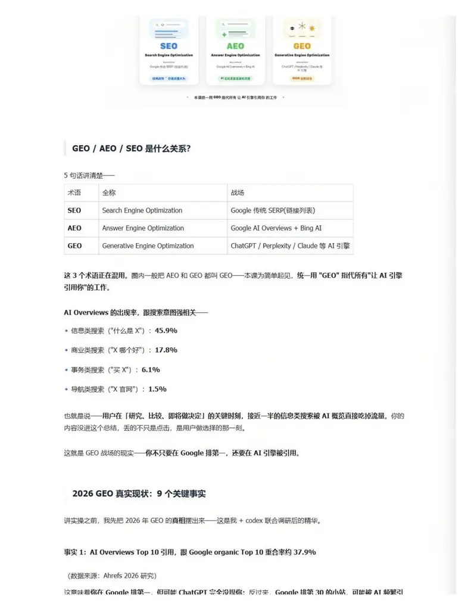

用。
这是 2 个独立的游戏。

事实 2: llms.bxt 不是正式标准一主流 AI 有疏虫未公开承诺读

(数据来源: IImstxt.org 官方定位 + Signals 2026 调查)

真相: OpenAI / Anthropic / Vercel 等少数公司发布了 llms.txt 文件,但 OpenAI / Anthropic 从未公开承诺它们的卜
虫会读这个文件。

网上一堆教程把 "IIms.tbxt" 神化成 "GEO 必备"，这是过度承诺。

我的建议: 写一个不浪费时间(10 分钟搞定)，但不要指望它有奇效。

2026 GEO 真相 vs 神话
w 9个真相                X 网上的9个神话
ToTRTTT卫FE
上               0
本         :pmaaaWeTa9ee 人
opTRard            了 semishtag
co                           < maaemfas
ioarman ia            本
本           xmasRey9e 全
po                   < maaag 四
oa                RN

刘小排建议 信前者 砍后者

事实 3: 答案前置是真杠杆一-44.29% LLM 引用来自正文前 30%

(数据来源: Kevin Indig 分析 1.2M ChatGPT 响应、18,012 引用)
这是 GEO 里最硬的一个数据一写文章时把答案放在最前，被引用率显著提高。
正确姿势: H2 写成问题(比如"什么是 GE0?")，下一段直接给 40-120 字的答案一一可独立抽取的那种。
事实 4: Schema 不是神药-一 普通 ]SON-LD 无独立显著性

(数据来源: Growth Marshal 2026 研究 + Search Engine Land)
真相: 加了 schema markup，对 AI 引用率没有独立的统计意义。
但 sdhema 仍有价值一它帮有搜索引擎理解你的实体(entity)。
Product / Review / FAQ 类型，只要价格、评分、规格等"可见属性"一致，有效。

我的建议: 该加 schema 还是加，但别指望它救你的 GEO。

事实 5: 第三方背书是 GEO 的真正核心

(数据来源: Ahrefs)

GEO 不是"给自己网站加几个标签"。GEO 是让 AI 信任的第三方页面也说你。

具体来说:

。被 Wikipedia 引用 = 极强信号

”被知名媒体[Forbes / TechCrunch)报道 = 强信号

* 在Reddit / Stadk Overflow / Quora 被多人提及 = 中强信号

*在YouTube 被 demo = 中强信号

事实 6: YouTube + Reddit 占社交引用的 78.2% (但只是社交子集)

(数据来源: OtterlyAI 2026 研究)
具体数据:

*，Reddit 占 46.4%

*。YouTube 占 31.8%

* 合计 78.2%

企 这些只是"社交子集"一一不是全部 AI 引用。

在 AI 引用的"社交内容"里，Reddit + YouTube 占大头; 但 AI 引用的总盘子还包括博客文章 / 媒体 / 文档 / Wikipedia
等。

事实 7: 论领域 + 数据页 + 标题直答一独立开发者的 GEO 王牌

真实案例:

*。 BalipropertyRules.com 自称 8 周 202 次 ChatGPT/Perplexity 引用

* AIAttention 自称 3 篇数据页 18 小时 187 次 Perplexity 引用

共同点:

*。 图 窗领域(不是"全网最好的 SaaS"，而是"Bali 房产规则" / "AI 写作工具数据")
*。 图 数据页(不是观点文，是带数字、胡格、对比的页面)

*。 图 标题直答(H1 = 用户的问题，不是模寡概念)

* 图 可抽取列表(列表项 + 数字 + 简短说明)

这是独立开发者的 GEO 黄金窗口。

为啥?

因为大公司做不了"领域 + 数据页"一一他们的内容运营要求"通用 + 流量大"。

你做"Bali 房产规则"，大公司不会跟你抢。

而独立开发者正好做鹤领域-一你的产品本身就服务一个细分市场，做对应的数据页就是顺手的事。

这是 SEO 几乎独有的"小公司有优势"窗口一和上一节《SEO 核心原理》讲的"长必关键词的黄金时代"是一回事。

事实 8: robots.txt 必须分清搜索 bot vs 训练 bot

robots.bxt 全称是 Robots Exclusion Protocol (人疏虫排除协议) ，1994 年就证生了。规则非常简单:
* 位置固定: 必须放在网站根目录，访问路径是 https://你的域名.com/robots.bxt
* 格式是纯文本: 用几行简单的指令描述 「哪个耻虫| 「人允许/禁止访问哪些路径|

* 本质是君子协议; 它不是技术封锁，而是一份 「公告」 一一苯守与否取决于朴虫自己的良心，主流大厂的私虫
(Google、Bing、ChatGPT 等) 都会主动读取并遵守

一个最简单的例子，长这样:

句
[e

YAML
User-agent: =
Disallow: /admin/

Disallow: /private/

User-agent: GPTBot
Disallow: /

User-agent: Googlebot
Allow: /

意思是: 所有有疏虫都不要爬 /admin/ 和 /private/; OpenAI 的 GPTBot 整个网站都别疏; Google 的 Googlebot 全站随
便疏。
很多人懒得设置，白白错过 AI 引用。

用途                          Bot 名字                                       应该

被 AI 引擎搜索/引用        OALSearchBot / perplexityBot / Claude-。” 贺 允许
SearchBot / Claude-User / Googlebot
被 AI 用于训练数据          GPTBot / ClaudeBot / Google-Extended 。” 看你愿不愿意一一可以单独挡

实操: 至少要确保前 5 个搜索 bot 没被你的 robots.txt 挡住一-否则 AI 引擎根本看不到你的网站。

事实 9: 测量 AI 引用率一付费 vs 免费

工具                                          类型                                          适合谁
profound                               企业级监控                              大公司(已融C 轮 $1B 估值,2026/2)
Ahrefs Brand Radar               4 亿+ 真实 prompts 库               有 Ahrefs 订阅的人

Semrush AI Visibility Toolkit ”AI Visibility / citations / missing      有 Semrush 订阅的人
Sources
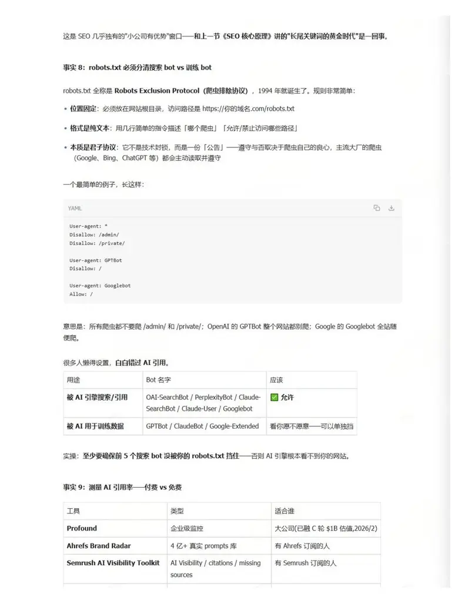

手工prompt 测试 + GA4 AI       完全免费                               独立开发者起步首选

referral

月预算 < $100，直接手工测-一每周用 10 个核心 prompt 在 ChatGPT / perplexity 里搜，记下"我被引用了几次"，简
单粗暴。

9 件你真该做的 GEO 实操

讲完真相，讲实操一这 9 件事是性价比最高的 GEO 工作。

按"必做 / 推荐 / 可选" 3 档:

图 必做1: robots.bxt 允许 AI 搜索 bot
5 分钟搞定。
打开你网站的 robots.bt，确保以下 bot 没被禁止(默认允许):

Plain Text

User-agent: OAI-SearchBot
Allow: /

User-agent: PerplexityBot
Allow: /

User-agent: Claude-searchBot
Allow: /

User-agent: Claude-User
Allow: /

User-agent: Googlebot
Allow: /

如果你不想被用于训练(可选):

Plain Text

向
[ce

User-agent: GPTBot
Disallow: /

User-agent: ClaudeBot
pisallow: /

User-agent: Google-Extended
Disallow: /

答案前置结构 ，GEO 最大杠杆

加 错误结构 (滑录前村)                          回 答案前看结构

:aa                               用PP的则
He 3

和       ee

AN 扣不明基                                     AN 一和gj各要

侠 必做 2: 每篇核心文章用"答案前置"结构
这是 GEO 最大杠杆一44.29b AI 引用来自正文前 30%。
结构模板:

Plain Text
# H1: [用户的问题,直接抄长尾关键词]

幸 H2: [问题的子问题]
[46-129 字直接答案,可独立抽取]

赫 H2: [另一个子问题]
[4e-126 字直接答案]

幸 然后再展开论证 / 案例 / 数据

你的 SEO 文章不要先讲"背景 / 历史 / 我的经历"一一 直接给答案，论证放后面。

侠 必做3: 核心页面加 schema markup

虽然 sdhema 不是神药，但对实体识别仍有帮助:

。 文章页 一 Artide schema

* 产品页 一 Product schema(必填:价格、评分、SKU)

*， FAQ 页 一 FAQ schema
* 评测页 一 Review schema

* Howto 教程 一 HowTo schema

关键: schema 里的"可见属性"(价格、评分等)，要跟页面正文的可见信息一致-一AI 抓到不一致会降低信任。

个 必做 4: 确保内容在原始 HTML 里 〈别让 AI 忠虫看到一片空白)

这条专门写给用 React / Vue 做站的独立开发者一你可能正在犯一个致命错误。

ChatGPT、perplexity、Claude 的中虫读的是原始 HTML，不泻染 JS (Google 是例外，它会泻染，但其他 AI 不

会) 。

你平时在浏览器里看到的完整页面，是第二份(这染后的)。但 ChatGPT / Perplexity 的疏虫只拿第一份(原始的)就走
了

如果你的网站是纯客户端泻染 (CSR / SPA) 一一内容全靠 ]S 在浏览丑里跑出来一那么 AI 卜虫抓到的，很可能是一
个空壳 
 
。

你的答案写得再好、schema 再全、答案前置做得再到位一AI 根本没看到。
正确姿势:

* 用 SSR (服务端泻染) 或 SSG (静态生成) 一 Nextjs (我们学习的) / Nuxt / Astro 默认就支持
* 核心内容 (H1、答案段落、关键数据) 必须出现在初始 HTML 里
* 给图片、视频配描述性文字 〈假虫抓取时主要靠这些文字来理解素材)

* 自检: 页面上右键 「查看网页源代码上」 (不是 Inspect) ，如果源码里看不到你的正文，AI 也看不到

这比 IIms.txt、schema 都更底层一内容 AI 抓不到，后面所有 GEO 都是空中楼交。

全 推荐1: 写一个IIms.tbxt(10 分钟，别指望奇效)

虽然 lms.bxt 不是正式标准，但写一个不亏-一至少表明你"对 AI 友好".

放在 https://your-site.com/llms.txt，内容大致:

Plain Text                                                                                                              吓

[e

并 Your Site Name
> 一段品牌摘要(46-88 字)

振 Core Pages
- [About](https://your-site.com/about): what we do

- [Pricing](https://your-site.com/pricing): Our plans

- [pocs](https://your-site.com/docs): Full documentation

宕 Resources
- [Blog] (https://your-site.com/blog)

- [Case Studies](https://your-site.com/cases)
震 Optional

- [Privacy](https://your-site.com/privacy)
- [Terms](https://your-site.com/terms)

主流参考: IImsbxt.org 官方文档，Anthropic / Vercel / OpenAI 都有公开 llms.bxt 可参考。

robots.txt 双轨设置

人 做 允许 人搜索 bot 引用你                     | @ ae ans bot

ATseareniot                                       User -agent; cpTeot
tsaitew

perplerttyeot                                       User-ogent: Claudebot

Cleudo Searchlot

ooerr :Googlebor

5 个提案 bot 不多惠 = A 完全不作            下二 侣间作要狂放

四                刘小排建议: 必做左边 / 右边可选

全 推荐2: 在 Reddit / Stack Overflow / Quora 真实参与

社交引用占 AI "社交子集" 引用的大头(78.2%一一Reddit + YouTube)。
实操:

* 找 3-5 个跟你领域相关的 subreddit

* 每周真实回答 2-3 个高质量问题(不要带链接，带价值)

* 偶尔在签名/简介带你的网站

* 不要刷量，真做 6-12 个月才会显

个 推荐 3: 做 1-2 个关键长必间的 YouTube 视频
YouTube 占 后 社交引用 31.8%一一视频转录被 AI 直接读。
实操:

* 挑 1-2 个你最想被引用的长尾问题

*录-个 510 分钟的视频，标题就是那个问题

* 视频里把答案明确说出来(用关键短语)

* 描述里写文字版答案(供 Ar 抓)

全 可选 1: 发布 1-2 份原创数据报告

这是第三方背书的引爆器-一
一份扎实的原创研究，平均能带来 22+ 高质量外链 + 3+ 媒体采访邀请(数据来源:行业研究)

如果你做 AI 写作工具，调研 300 个独立开发者最常用的 AI 工具-一这种数据报告容易被 Forbes / TechCrunch /
Reddit / YouTuber 引用。

息 可选 2: HARO 蔡代品(Source of Sources / Qwoted)
详见前一节《高质量外链》一一通过帮记者回答问题，拿媒体引用。
媒体引用是 AI 引擎里最高级别的信任信号。
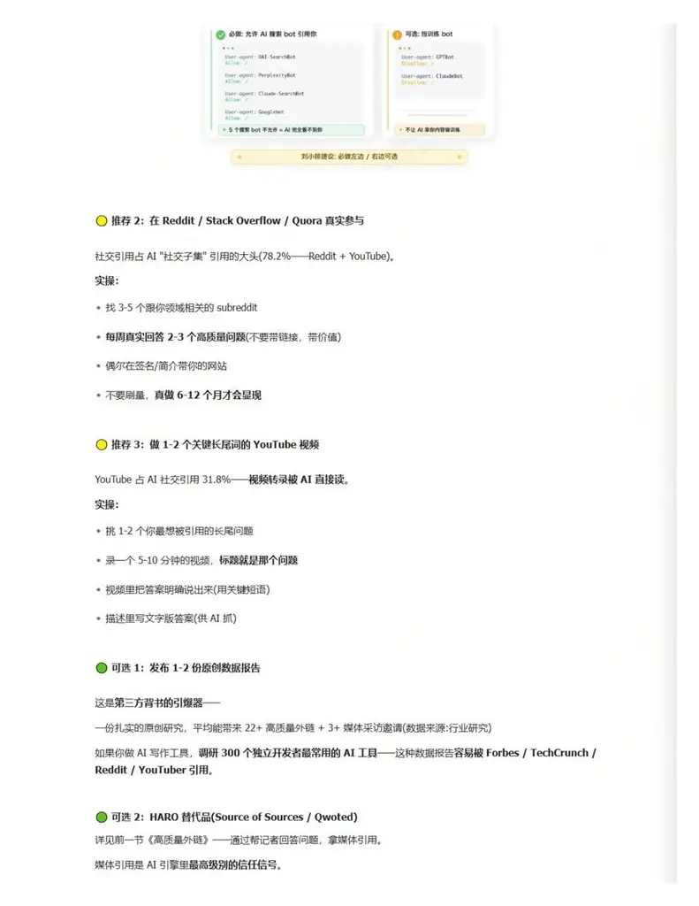

外 可选 3: 实体一致性维护

确保你的品牌在全网各处的命名、描述、URL 完全一致-一
。Twitter / LinkedIn / GitHub / product Hunt 的简介文字一致
* Wikipedia(如果有条件)有你的页面或品牌提及

。Crunchbase / AngelList / Indie Hackers 的资料同步

AI 引擎用实体识别理解你是谁 -一不一致 = AI 不知道你是同一个东西。

GEO 真核心， 第三方背书阶梯

GEO 不是纵身己加标答 而是让别人也说你

测量: 怎么知道你的 GEO 真有效?

光做不测，等于言打。

免费做法: 每周 10 个 prompt 手工测

最简单粗暴的方式一

1. 列 10 个你最想被引用的核心 prompt(比如"哪些 AI 写作工具最好"、"X 工具 vs Y 工具")
2. 每周一: 用 ChatGPT / perplexity / Claude / Google AI Mode 各搜一遍

3. 记录: 你的网站被引用了几次? 排第几个被提到?

4. 记到一个表格里，看趋势

适合: 月预算 0 美金， 有效程度跟付费工具差不多(尤其对独立开发者)。

付费做法: 有 Ahrefs / Semrush 订阅就用 AI 模块

如果你已经在用 Ahrefs / Semrush 做传统 SEO一
* Ahrefs Brand Radar: 有 4 亿+ 真实 prompts 库，最全
*， Semrush AI Visibility Toolkit: 覆盖 citations + missing sources

* Profound: 企业级，适合预算 $500+/月的团队

不要单独为 GEO 监控付费一让传统 SEO 工具的 AI 模块帮你。

测量 Al 引用率工具对比

全                   人-有SEO 有

手工测 10 prompts                   自动化监测工具

押

加 央1o 人必D prompt            Ahrefs Brand Radar

加 和四-在CharGpT Perpexty

Cavde Googe Ai名和

国 ia用大政+ 坟名            semrush

加 鸡势表    和
poa

ex                   ia
Toow some 19at由

建议: 月预算 100 以下直接手工测

GEoO 的最大反潮流真理

讲到这，送你 GEO 里最重要的一条认知-一

GEO 不是"给自己网站加几个标签"。GEO 是让 AI 信任的第三方页面也说你。
图内 959% 的人在做错的事

*。共 加IIms.bt 一 过度神化，效果未证实

*。 兴 堆事关键词 一 2026 年 AI 会识别

。共 加一堆 schema 一 不是神药

*。 区 三钱买 GEO 工具 一 数据可能跟实际不符

*。 其 在自己网站疯狂优化 一 闭门造车

轿内 5% 的人在做对的事

* 国 写真正有用的内容，在前 30% 给可抽取的答案
* 国 真实参与 Reddit / YouTube，让用户主动提你
* 国 拿原创数据报告获得媒体引用

*。国在Wikipedia / 知名 directory 建立实体一致性

*。国 HARO 蔡代品(SO0S / Qwoted)拿记者引用

GEO 反潮流真理

| @ 四mm 95% 在做错的事               | @O 加m 5% 在做对的事

O 1 答案前秆写真有用内容
人@ 2 准阳关银词 -A 识                加 2 真实参与Reddit / YouTube

人@ 3 加一堆 schema - 不是神本            O 3 全硕创数据报告区皖休引用

O 4 三二买 GEO 工具 - 政委失真              加 4 wikipedia / directory 实体-至

@ 5 风门进车自己优化                     加 5 HARO 理f品 (50S 1 Qwoted
拿记者引用
全是 自己包装自己                         全是 让别人说你

注意: 这 5 件事全是"让别人说你"，不是"自己包装自己"。
我跟你讲一一这才是 GEO 的本质。

一个真实案例

我看过一个独立开发者(我们叫他小B) 。

小B 听说"GEO 是 2026 风口"，花了3 个月做这些:

* 加了完美的 IIms.bxt

*。加了 schema 到所有页面

* 调整了内容结构(把答案放最前)
。设置了 robots.btt

* 花 200 美金/月买了 GEO 监控工具

全做了。
理论上他做对了所有"教程说应该做的事"。

3 个月后，他打开 ChatGPT 问 30 个相关问题一他的网站只被引用 1 次。
为啥?

因为他没做"让别人说他”:

。没在 Reddit 真实参与

* 没发原创数据报告

* 没有任何媒体提及

*。 Wikipedia 没他

*，YouTube 没人 demo 他

他做了所有的"自己优化"，但没做任何"第三方背书"。
结果就是 AI 引擎根本不信任他。

GEO 709% 是"让别人说你"，309% 是"自己优化"。
绝大多数人比例搞反了。
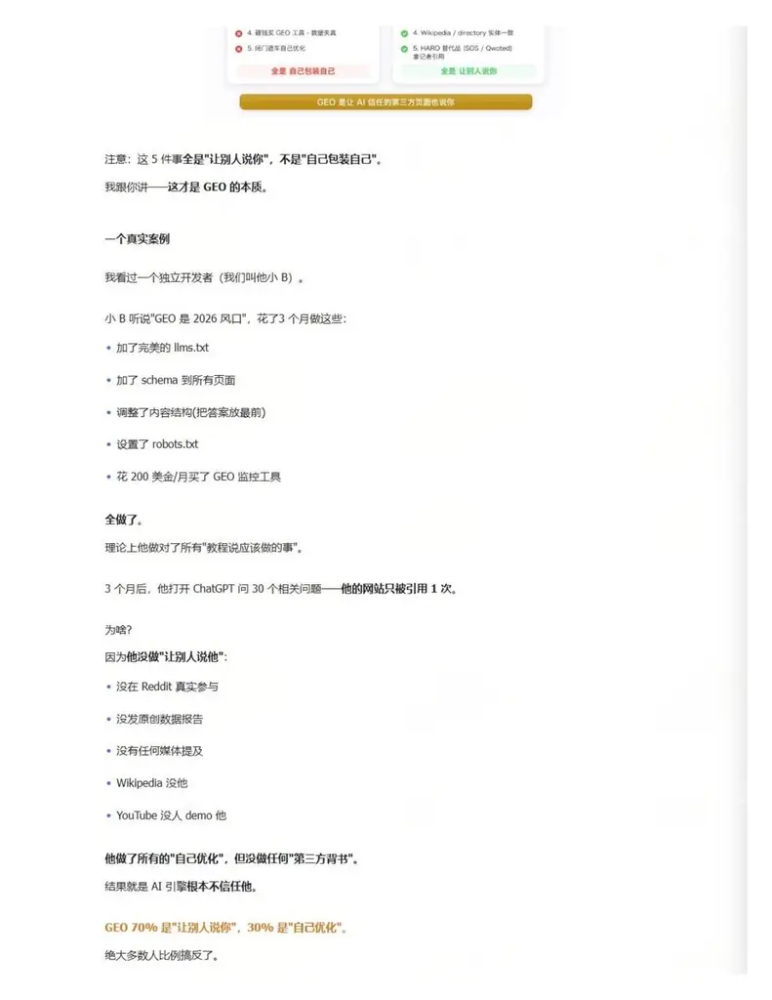

GEO 慢得超出你预期

GEO 跟 SEO 一样-一6-12 个月才能稳定看到效果。

为喻?

因为"第三方背书"积累很慢:

* HARO 1 个月平均 1-2 个媒体引用

* Reddit 真实参与 6-12 个月才能在 AI 信任图谱里有位置

* 原创数据报告 1 份要花 1-2 周做，然后等 3-6 个月才有引用

绝大多数独立开发者在第 3 个月放弃 GEO一觉得"花了时间没回报"。
剩下少数撑过去的，12 个月后稳定被 AI 引擎引用一 形成新的复利流量。

GEO 是 SEO 的"延伸"，不是"昔代"。
SEO 慢，GEO 更慢。

但 GEO 的复利在 2026-2030 这 5 年是最酉缺的。

30 天 GEO 起步计划
最后送你一份 4 周计划一
30 天 GEO 起步路线图
二                                  洒昌+过代
第工周: 技术地基

* 辆 检查 robots.bt 允许所有 AT 搜索 bot

*国 给核心 5-10 个页面加 schema(Article / product / FAQ)
* 图 所一个IIms.bt(10 分钟搞定)

关键产出: 你的网站对 AI 疏虫"友好"。

第 2周: 内容改造
*。国 挑 5 篇核心文章，用"答案前四"结构改写一H2 是问题，下一段 40-120 字直接答案

* 图 列出 10 个核心 prompt，作为你的"AI 监控清单"

关键产出: 5 篇 AI 友好的文章 + 监控基线。

第 3 周: 第三方背书

。辆 注册 Source of Sources / Qwoted(HARO 茜代)，开始每天回答 1-2 个记者问题
* 图 找 3 个相关 subreddit，真实回答 5-10 个问题

* 图 策划 :1 份"原创数据报告

关键产出: 第一批第三方提及 + 数据报告草案。

第4周: 测量 + 迭代

* 图 每周一手工测 10 个 prompt 引用率

*。回 看哪些 GEO 动作真有效，加大投入

*国 看哪些没效果，砍掉

关键产出: 你的"GEO 第一份效果报告"一-基于真实数据，不是工具忽悠你的数字。

从 SEO 到GEO，从 SERP 到 AI

回到这一节开头那 3 个翻车一

翻车 1: Google 排第一但 ChatGPT 找不到-SEO # GEO，37.9% 的重合率告诉你这是 2 个游戏
翻车 2: 加 llms.txt 0 效果一一llms.txt 不是神药，做但别指望
翻车 3: 花 3000 美金买的监控数据失真一手工测 10 个 prompt 比工具准

避开这 3 个翻车，你的 GEO 基础就比 80% 的独立开发者强。

整个 SEO 4 连这条主线-一

* 第 1 节《SEO 核心原理》: 讲关键词 + 搜索意图 (道)

* 第 2 节《高质量外链》: 讲外链建设 (术 1)

。第3节《Claude / Codex SEO Skills》: 讲AI 自动化 (术 2)

* 这一节《2026 GEO/AEO 实战》: 讲AI 引擎的新战场 (术 3)

4 节合一，你能从 0 建立一个独立开发者的完整 SEO + GEO 体系
既能在 Google 排前面，也能被 ChatGPT/perplexity 引用。

最所RE
2025 年的 SEO，是赢在 Google 的链接列表里。

2026 年的 SEO，是赢在 AI 的回答里。

链接列表是十年的战场，AI 回答是十年的战场-这一节起步，你比 95% 的人早。

作业

挑你手头任意一个产品，做这 5 件事一

任务 1: 5 分钟修 robots.btt

打开你的 https://your-site.com/robots .bt确认 OAI-SearchBot / perplexityBot / Claude-SearchBot / Claude-
User / Googlebot 这 5 个 bot 没被某止。

不会改的让 AI 帮你改。

任务 2: 挑 1篇文章，改成"答案前置"结构
挑你网站上最重要的 工篇文章，改成:

*，H1 = 用户的问题

* 第一段 H2 = 子问题

。Hz2 后第一段 = 40-120 字直接答案

跟改前对比一一1个月后看引用率变化。
任务 3: 列你的"10 个监控 prompt”

写下 10 个你最希望被 AI 引擎引用的问题。
每周-，手工在 ChatGPT / perplexity / Google AI Mode 各搜一遍，记下你被引用了几次。

任务 4: 注册 Source of Sources(HARO 替代)，坚持 30 天

详见《高质量外链》一一每天看一次邮件，真实回答记者问题。

任务 5: 策划你的第一份"原创数据报告
写下工个 idea一关于你领域、你能拿到独家数据的小型研究。
不一定立刻做，但3 个月内争取发出第一份一-这是 GEO 里性价比最高的杠杆之一。

SEO 4 连完结-下一段旅程，我们去别的篇章。增长篇还有更多内容，但SEO + GEO 这条主线，你已经走完了。
