# 让 AI 写出不翻车的代码

> 说明：本资料为图片版，以下为主要内容整理（OCR 识别，可能存在错字），关键页面配图已保留供对照。

"你是一个资深前端工程师，使用 React + TypeScript，注重代码规范和可读性，请按照 SOLID 原则.……”

写到第十句的时候，AI 给你的代码反而越来越拉膀。
或者更气人一一你跟 AI 聊了两个小时，已经定好的事它穴然记了，自信满满给你用了一个根本不存在的 API.。
你怀疑自己付费付错了。人怀疑模型变笨了。怀疑是不是该换 Claude / GPT / Gemini。

都不是。
是你"装弹"的姿势不对。

什么叫"装弹"7
每次你跟 AI 讲话之前，你脑子里其实都在做一个动作-一决定告诉它什么、不告诉它什么。

告诉它的那部分东西，就是它的"弹药"。
这一节，我们就把这个动作正式起一个名字，叫上下文工程 (Context Engineering) 。
前面课程里，我给 AI 定过一个画像一它是一个学历逆天、干活极快、读过所有书但没下过水的实习生。

这一节我们给这个实习生再加一个修饰:
会失忆。

学充这一节，你看 Ar 编程的视角会换一个一你不是在写 prompt，你是在管理一个会失忆的实习生。

Prompt 工程已死，Context 工程上位
先说一个时间线。
2023 年，大家疯抢一本叫《Prompt Engineering》的红宝书。论坛里到处是"如何写出 100 分的 prompt"。

2025 年 6 月，Shopify 的 CEO Tobi Litke 在 X 上发了一句话:

"我更喜欢 context engineering' 这个词，它比 prompt engineering 更准确地描述了核心技能: 为任务提供足够上下

文， 使 LM 有可能解决它。"”

Karpathy 随后转发，加了一段定义:
"Context Engineering 是一门精细的艺术一给 AI 装上刚刚好的上下文，不多不少，让它能算出下一步。"”

Karpathy 是谁，你不一定认识。我说一下。

Macie ar se凡ie 人-~Arwkacnol     六ssT书引此mn- -和 Or人mm

go
987

鲜

Da
8
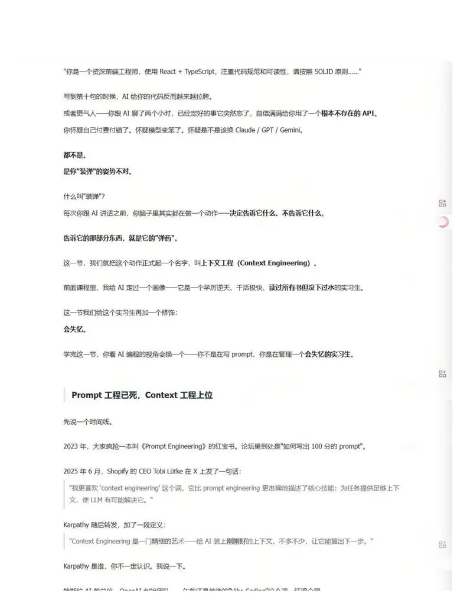

衬基上HL AL 用和十。 VBPENAL 加天后|队。一王刚过直化惠呈 VIDE CUUINI 话-19，纪厢王网。
他说话，业界要听。
2025 年 9 月，Anthropic 直接发了一篇官方文档，叫《Effective Context Engineering for AI Agents》，给整个 2026

年定了调子。
整篇文档其实就埋了一件事一
以前你写 prompt 是写一句话。现在你"写"的是 AI 工作时桌上摆的所有东西。

原文链接: https://www.anthropic.com/engineering/effective-context-engineering-for-airagents

站
[

到现在，业界共识是这样的:
Prompt 工程是问法。Context 工程是桌上摆什么。

打个比方。你雇了个会算微积分的天才实习生，让他帮你算一道题。
* prompt 工程: 你怎么把题目讲清楚。

* Context 工程: 他桌上摆什么书、什么草稿纸、什么参考资料、之前的对话记录哪些要放、哪些要收掉。

题目讲得再清楚，你桌上摆错书、忘了给草稿纸一一他照样给你算错。

句号。

心智模型: AI 是 CPU，上下文窗口是 RAM

Karpathy 给过一个非常好的心智模型，我直接搬过来 一

。prompt 工程: 你系么节季日计清至。       ee

*。 Context 工程: 他卓上摆什么书、什么草稿纸、什么参考资料、之前的对话记录哪些要放、哪些要收掉。

题目讲得再清楚，你桌上摆错书、忘了给草稿纸一一他照样给你算错。
句号。

Do
8

心智模型: AI 是 CPU，上下文窗口是 RAM

Karpathy 给过一个非常好的心智模型，我直接搬过来-一

A1 4斩了得的民知卉刑

* 你 = 操作系统 (决定哪段数据进 RAM)

这个心智一旦建立，以前你想不通的所有问题，瞬间想通。

为什么对话久了 AI 会忘事? RAM 满了，老的被挤出去了。

为什么塞一大堆背景反而效果差? RAM 装太多杂物，关键数据被淹没了。

为什么有时候它"自信满满衣说八道"7” RAM 里没装它需要的关键文件，它只能脑补。
为什么换个新对话重新讲一遍，反而效果好? 重新装弹了，RAM 干净了。

RAM 到底有多大?

你可能问: 那这个 RAM 到底有多大?
我说一组当下的数字 (2026 年 5 月) -一
* Claude 0pus 4.7: 1M tokens

*，GPT-5.5: 1M tokens

*Gemini 3.1 pro: 1M tokens

3 大顶尖模型，全部站在了 1M tokens 这个是级一一大约 75 万汉字，差不多能装下一整本《红楼梦》。

听起来吓人。
"75 万字啊，那我把整个项目都丢进去不就序了? ”
别天真。

容量大 # 装满了好用。

第一，钱。

每个 token 都是钱，输入输出都收。装 1M tokens 进去，一次问答就是几块钱起步。一个项目摘下来，分分钟过干。
第二，注意力。

这个更要命。AI 跟人一样-一-给它一本书让它找一句话，它会找到; 给它一千本书让它找一句话，它抓瞎。学术上叫
"镍在干草堆里"一上下文越长，AI 越容易忽略中间的关键信息。

所以-一
RAM 不是越大越好，是装得对最好。
你的活儿，不是写 prompt 写得花里胡哨，是当 AI 的操作系统。

三种最常见的"装弹失败”

业界给"装弹失败"起了三个名字。我用中文翻译 一

三种最常见的【装弹失败|

+
60

+
[9

吕4
90

?               一
2  FE  IE |

撑爆 (context bloat)

新手最爱犯的错。
"我把整个项目都给 AI 它就懂了吧? ”

+
60

于是你把 50 个文件、3 万行代码全塞进 context window，再加一句"帮我修个 bug "。
AI 看着这一堆，异。
它不知道哪个是重点，于是要么给你扯一堆没用的分析，要么挑了一个文件随便改改交差。

撑爆 (context bloat)

新手最爱犯的错。
"我把整个项目都给 AI 它就懂了吧? ”

于是你把 50 个文件、3 万行代码全塞进 context window，再加一句"帮我修个 bug"。
AT 看着这一堆，异。
它不知道哪个是重点，于是要么给你扯一堆没用的分析，要么挑了一个文件随便改改交差。

真实场景-一
一个学员告诉我，他在 Cursor 里 @codebase 选中整个项目，然后让 AT"优化一下性能"。
结果 AI 给他改了 20 个文件，跑充测试全挂。

为啥?

他选的"整个项目"里，80% 的代码跟性能无关一前端按钮的样式、后台管理的表单、注册页的远辑，AI 都得读一
遍。

读诗它发现"性能问题"的相关线索被淹没在一堆无关代码里，于是它给你来个全场广撤网。                        主
改了一堆没用的，关键问题可能一点没动。

煞死 (context starvation)

幻觉不是 AI 在骗人，是它在"钱死"的状态下被你远看产出。
我见过最高谱的一次:

AI 给学员"调用"了一个 stripe.checkout.createSession() 方法。
学员复制粘贴跑了，没跑通。

问 Ar 哪儿错了。AI 说"可能是你 Stripe 版本不对”。
学员升级了 5 次 Stripe SDK，无果。

]
60

最后我帮他翻 Stripe 官方文档-一这个方法根本不存在。真正的方法叫 stripe.checkout.sessions.create()。

学员的 AI 没"骗"他。是他没把 Stripe 文档装进 AI 的 RAM，AI 只好根据"通常 SDK 长这样"猜一个出来 一

刚好猜并了一个字母 (createSession vs sessions.create) 。

治幻党，不是换模型，是装好弹。

稀释 (context collapse)

最阴险的一种。长对话特有。

你跟 AI 聊到第 30 轮，它会自动把前面的内容"压缩重摘"一一保留要点，丢掉细节。

Do
8

听起来合理，但问题在于-一
它丢的细节，往往就是你最关键的那个细节。
最让人出渍的不是"忘了一次"，是"反复忘"。

我自己亲历过一次-一

第 工轮，我跟 Claude 说: “这个项目用 PostgreSQL,， 用户ID 是 UUID。"
第 15 轮，它写代码还记得，UUID + pPG 用得很对。

到了第 30 轮，让它新加一个表，它给我整了个 MySQL 风格的自增 ID。

我说: “你忘了我说用 PostgreSQL 吗? ”
它说: “抱歉抱菊，马上改。" -一确实改了。

第 35 轮，它写另一段代码，又用回 MySQL.
我又骂它一遍，它又道菊，下一段又来。
鬼打墙。

这就是稀释最阴险的地方一它不是"完全忘"，是关键细节在压缩里变模糊了，时灵时不灵。

记住这个信号 一
当 AI 开始"反复犯同一个错"，不是它签了，是 RAM 里那条规则被稀释成马赛克了。
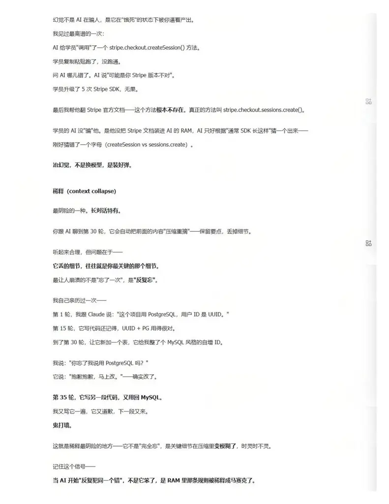

碰到这种状况，硬撑没用。直接开新对话，把那作铁律重新装一遍。

4 招"装弹"姿势手册

知道了理论，怎么落地?
我给你4招 一

招式一: 默认模板 = 一段代码 + 一句要求

招式一: 默认模板 = 一段代码 + 一句要求
90% 的日常任务，模板就这一个。

X 反例:
“"帮我把这个登录功能优化一下"
(AI: 哪个登录功能?我看不到啊。)

图 正例:

Plain Text

巴

[ec

口+
[9

function login(email，password) { ... }

记住: RAM 是宝贵资源，不要浪费在无关文件上。

招式三: 长对话失控 = 开新对话，重新装弹

聊到第 30 轮，感觉 AI 开始"忘事"了?

不要硬撑。开个新对话。

新对话开头，你写一段"项目现状摘要"一

支术栈是 Next,js + PostgreSQL + Stripe

、个人中心。
现在要做: 订"
关键约    用户 ID 是 UUID，不是自增。

把"还活着的事"重新装一次 RAM，比让 AI 在一团构释的旧 context 里挣扎强 10 信。

招式四: AI 说不知道 = 给它工具，别硬塞二手信息

你问 AI: "Vercel 最新的 Pricing 是多少? "
它说: "根据我的知识，Pro 是 $20 一个月。"
这时候不要相信它。

它的知识有截止日期，Vercel 改价它根本不知道。

正确做法只有一个一让 AI 自己上网查。

现在主流 AI 编程工具 (Claude Code / Cursor / TRAE / Codex) 全都自带联网能力，你只要说一句"去查一下言网最新
的 Pricing"，它就会真的打开页面读。

法全之请生;FApbn 己 3DA 和任5 口帅齐的训守丛构”责不己记省寺儿吉田on化大丛坎

招式四: AI 说不知道 = 给它工具，别硬塞二手信息

你问 AL: "Vercel 最新的 Pricing 是多少? ，
它说: “根据我的知识，pPro 是 $20 一个月。"

这时候不要相信它。

它的知识有截止日期，Vercel 改价它根本不知道。

正确做法只有一个-一让 AI 自己上网查。
现在主流 AI 编程工具 (Claude Code / Cursor / TRAE / Codex) 全都自带联网能力，你只要说一句"去查一下言网最新
的 Pricing"，它就会真的打开页面读。

法一之请生汪6 加 3nDA 乍 5 口贞市60直中人鬼”天不四NI拓籽吉田bn人天丛放

区 隐给版
把整个项目压缩包发给 AL，加一句:

"帮有我修一下登录跳转的 bug。”

AI 干喻:

1. 先花 30 秒"分析项目架构"

2. 再花 30 秒"理解登录流程”

3. 然后给你列了一份"可能的 bug 来源清单"，10 项
4. 让你自己挑一个让它继续

5 分钟过去了，bug 一个没修。

区 辽给版
把整个项目压缩包发给 AL，加一句:

"帮我修一下登录跳转的 bug。”

AI 干喻:

1. 先花 30 秒"分析项目架构”

2. 再花 30 秒 理解登录流程

3. 然后给你列了一份"可能的 bug 来源清单"，10 项
4. 让你自己挑一个让它继续

5 分钟过去了，bug 一个没修。

国 精装版
你先自己看一眼控制台，找到关键报错。然后这样写:

控制台报错:
Warmning: Cannot update component 'Router while rendering 'Loginpage'

报错相关函数:

Plain Text

function LoginPage() {
const router = useRouter();
诗 (user) router.push("/); // 这一行报锚
return <LoginForm />;

了

我希望: 登录成功后跳转首页，不要闪烁。

AI 干喻:

1. 看一眼报错就知道一一你在 render 阶段调了 routerpush

2. 改成 useEffect 包起来

3. 30 秒解决

一段精装的 context，胜过一整包项目代码。

我帮你算一下账-一

上下文长度
一次问答成本
解决时间
翻车概率

圈给版

5 万行代码 * 25 万 tokens
42

5+ 分钟，还没修好

高 (AI 容易跑题)

3000 售的成本差，结果反过来。

这就是 context engineering 的精叉-一

不在多，在准。

收尾: 你不是程序员，是 AI 的操作系统

这一节我们换了一个最重要的视角。

RE十 LrU。工下X轩叫十 km。他十才1H全9f。

记住这一句，整个内功篇你已经赢一半了。

作业

精装版

4行+7行代码 < 80 tokens
~$0.001

30 秒，修好

低

找一段你最近跟 AT 对话的记录 最好是那种让你气过、史过、想换模型的那段。
打开它，做一个三色笔练习:
侠 绿色: 这段话里你提供的「关键信息| (AI 必须看到才能干活的)
侠 黄色: 这段话里你提供的「无关填充」 (去掉也不影响 AI 干活的)

钙

[c

go
87

吕+
60

BD
+

重 红色: ATI 输出里它 「自己脑补| 的东西 (事实上不存在的 API、它编的库名、它假设的你的项目结构)

Ai 十 LrU。工下X国忆十 KRnm。人十考1HAR9T。

记住这一句，整个内功篇你已经赢一半了。

作业
找一段你最近跟 AI 对话的记录-最好是那种让你气过、写过、想换模型的那段。
打开它，做一个三色笔练习:                                                                                                     呈
全 角色: 这段话里你提供的「关键信息」 (AI 必须看到才能干活的)
侠 黄色: 这段话里你提供的「无关填充」 (去掉也不影响 AI 干活的)
全 红色: AL 输出里它 「自己脑补| 的东西 (事实上不存在的 API、它编的库名、它假设的你的项目结构)

Er ToIJCBUTA re

到这一节为止，你跟 SPEC 已经打了好几次照面一
前面《跟 AI 讨论需求: 从模糊想法到清晰指令》教你写一份好 SPEC 长什么样。

如果让我帮你压缩一下那一节的精敌，就 3 件事一

1. 信息不是越多越好-一给 AI 的不是百科全书，是它需要的关键约束
2. 野义是最贵的 Bug一一SPEC 里每一处"差不多就行"，最后都会变成代码 bug 让你回炉
3. 用 AI 反过来打磨 SPEC-一SPEC 写充先让 AI 挑籼，把"AI 不懂的地方"补上                                                       6o

条记住了，你 SPEC 已经能打 80 分了。

《互联网黑话翻译器》《哄哄模拟器》两节让你亲手写了 SPEC，做出了两个 AI 产品。你应该体会过一 一份 SPEC
写得透，AI 写出来的代码就是不一样。

Er TOIJCPUATLERJ re

到这一节为止，你跟 SPEC 已经打了好几次照面-一
前面《跟 AI 讨论需求: 从模糊想法到清晰指令》教你写一份好 SPEC 长什么样。

如果让我帮你压缩一下那一节的精散，就 3 件事一

1. 信息不是越多越好 -一给 AI 的不是百科全书，是它需要的关键约束
2. 歧义是最贵的 Bug一一SPEC 里每一处"差不多就行"，最后都会变成代码 bug 让你回炉
3. 用 AI 反过来打磨 SPEC-一SPEC 写完先让 AI 挑，把"AI 不懂的地方"补上

这3条记住了，你 SPEC 已经能打 80 分了。

《互联网黑话显译器》《哄哄模拟器》两节让你亲手写了 SPEC，做出了两个 AI 产品。
写得透，AI 写出来的代码就是不一样。

或者-一
你说: "先 plan 再 code。"
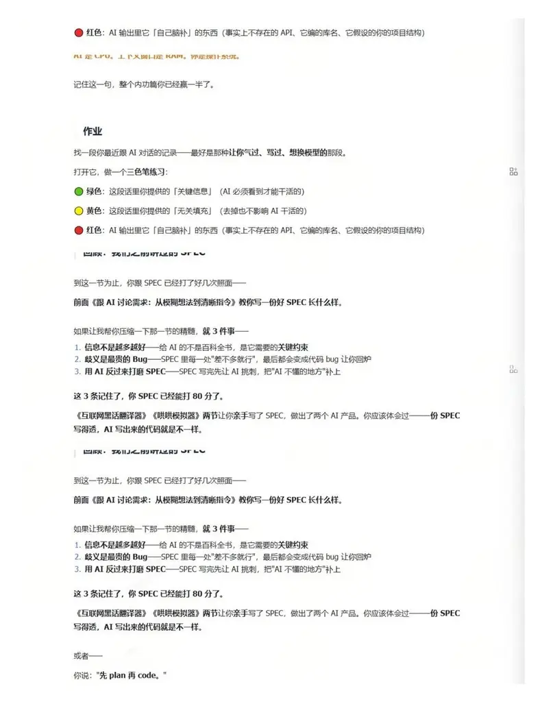

AI 写了一句:“plan: 我会写一个登录功能。" 然后立刻开始写代码。

我去年大半年都在跟这种 AI 拉扯。每次都得手动叫停、手动提醒、手动 review。
后来我才意识到-一

AI 不缺智商，缺纪律。

句号。

你不缺 SPEC，你缺的是"自动执行的纪律
它: "啊抱菊，我忘了。马上补。"

或者
你说: “做完了再跟我说。"

AI: "好的，已经完成。"

你打开一跑一前端报错，后端 500，数据库表名拼错。它根本没跑过。

或者
你说: "自己 review 一下你写的代码。"

AT 转头说: "我 review 过了，看起来不错! "

你打开一看，一个函数 200 行，命名全是 dataldata2temp，再低级的程序员都知道有问题。它就这么交差了。

或者 一
你说: "先 plan 再code。"
全 写了一句: “plan: 我会写一个登录功能。" 然后立刻开始写代码。

我去年大半年都在跟这种 AI 拉扯。每次都得手动叫停、手动提醒、手动 review。
后来我才意识到-一

AI 不缺智商，缺纪律。

句号。

你不缺 SPEC，你缺的是"自动执行的纪律”

讲到这里，肯定有学员要反驳一
"小排，我已经会写 SPEC 了啊。把 SPEC 写得清清楚楚，AI 不就老实了吗? ”

我教过你写 SPEC，是真的。但你已经发现了一
写充 SPEC 之后，AI 干活时还是在偷合。上面那 4 个场景不就是吗?

Do
8

oo
8

A喇了

go
8

因为-一
SPEC 是说明书。纪律是说明书能不能被执行。

这两个是不一样的事。

侨民mm从:入二RE再中全1o0RDFO洒限二包天得作了 下一和has了

一句话-一这哥们 30 年都在给别人造 infrastructure。你今天用的不少东西，底下有他的代码。

Simon Willison (Datasette 的作者

0G，你应该听过) 给过一个非常重的评价-一

”esse 是我认识的、把 coding agent 用得最 creative 的人之一。"

Simon 不是会随便夸人的人。

他这么说，意思就是「这哥们的方法值得学| 。

Jesse 的核心周注

2025 年 10 月 9 日，]esse 在自己 blog 发了一篇文章，公布 superpowers v1。文章里有一句话，我觉得是整个项目的
这一段花的时间不亏，因为它解释了"为啥这个东西在 2026 年突然爆火"。

Jesse Vincent 是淮

由人不一定听过，但圈内一提就知道一一
*。 1994 年 (对，32 年前) 做的 Request Tracker (RT) 一一无数公司今天还在用的工单系统

*。 2005-2008 管 Perl 5 的 release一一那会儿 Per| 是支撑半个互联网的语言

* 写过 K-9 Mail-一你 Android 手机上那个邮件客户端，早期那波千万安装量的应用 (现在叫 Thunderbird for
Android)

*Keyboardio 联合创始人一一做小众但发烧友狂爱的机械键盘

。 人到翌RH太 VarrinaterA 于JPc攻CR各人的全mx - -mv zaLoyJ srcalo

本中Annhrapic plugpn 和到。 年后和

妈              ae              e@              和@            】
ee         Ta           1          rn          2            oa
2                      2

2       neom      ao      an      an

*， 2025年10月9日: Anthropic推Claude Code plugin 系统

* 同一天 (对，巧合到不像巧合) : Jesse 发布 superpowers v1

*。2025 年 12 月: 几千 stars

*，2026 年1月15 日: 进入 Anthropic 官方 marketplace

*2026 年 5 月 (你现在) : 18 万 stars

半年时间，从 0 到 18 万。这事真的成了。

为啥能这么快爆? 两个原因一

1 它踩中了 plugin 系统的红利: Anthropic 推 plugin 第一天，]esse 就把成品摆出来了。这种"造工具的人和工具的               品
发布日元美对齐"，不是运气，是嗅觉。

2. 30 年老兵的工程直觉: 从 RT 到 Perl 到 K-9，他造工具一造就是 30 年。他知道工程纪律真正的靖点在哪。

OK，背景介绍完。我们看 superpowers 自己。

18 万 stars，超过 GitHub 官方 spec-kit

仓库地址: https://github.com/obra/superpowers

。2025年12月: 几干stars
*，2026 年1月15日: 进入 Anthropic 官方 marketplace

* 2026 年 5 月 (你现在) : 18 万 stars

半年时间，从 0 到 18 万。这事真的成了。

为啥能这么快爆? 两个原因一

1. 它踩中了 plugin 系统的红利: Anthropic 推 plugin 第一天，]esse 就把成品摆出来了。这种"造工具的人和工具的

发布日完美对齐"，不是运气，是嗅觉。
2. 30 年老兵的工程直觉: 从 RT 到 Perl 到 K9，他造工具一造就是 30 年。他知道工程纪律真正的靖点在哪。

OK，背景介绍完。我们看 superpowers 自己。

聪明你已经有了。你用的是 Claude / GPT / Gemini 顶级模型，它们都很聪明。
你缺的是它每次都按你期待的方式干活-这就是稳定。
在生产环境，稳定 > 聪明。

它跟前面学过的 Skill 是什么关系?

到这里你应该会司-一

"等下，前面《Skill: 给 AI 写一份上讽 SOP》，不是已经把 Skill 讲透了吗? superpowers 又是啥? ”

好问题。我用一张表答你一
你前面学过的 Skill                                      Superpowers

它是什么        Claude Code 内置的机制一一你可以写自己的          一个预装好的 Skill 集合-一别人写好的、你一

SKILLmd                                                键install
谁出的         Anthropic (Claude Code 的能力)                     Jesse Vincent (社区项目，进了 Anthropic 官方
marketplace)
你的角色       写 Skill 的人                                               装 Skill 的人
类比              自己开餐厅                                                      加明连锁 -一SOP 现成的

简单说一一你前面学的是怎么"写"Skill。这一节学的是怎么"用"别人写好的 Skill 包。

装充 superpowers，我自己之前写的 SKILL.md 还能用吗?

能。两套并存，不冲突。

技术上，Claude Code 把所有 skill 当作平等单位一一不管来源是 superpowers plugin、还是你自己 ~/.daudeyskills/ 目
录里的 SKILL.md、还是项目里的 .daude/skills/一一它都会通过 description 自动 discover。

实战建议一
。Ssuperpowers 装上，作为基础工程纪律: brainstorming、TDD、verification 这种通用工程行为，别自己造轮子。

* 你自己的 SKILLmd 留给业务专用 SOP: 比如客服回复、海外 SaaS 用户问题分类一superpowers 不会涉及这

两个职责不重和又。不冲突。

superpowers 为什么能让 AI 守纪律

讲到这里你已经知道"它能干啥'。
但讲清楚原理，你才知道为啥下次它没生效你应该怎么修。

Jesse 在设计 superpowers 时，茂了 3 个非常硬核的洞察。

洞察 1: 经典说服心理学，在 LLM 身上一样有效

这是我读 Jesse blog 之后最爱启发的一点。

0

gD
87

Do
6+
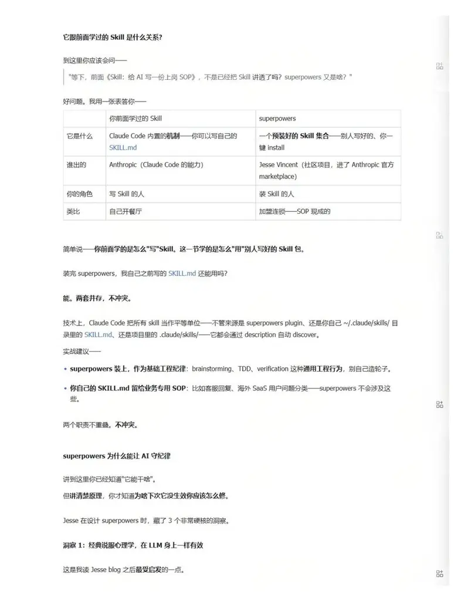

心理学家 Robert Cialdini 在 1984 年写了一本经典叫《Influence》，提了 7 个让人乖针听话的原理: Authority (权
威) 、Commitment (承诺) 、Social proof (社会认同) 、Scarcity (稀缺) 、Liking、Reciprocity、Unity。

40 年来这套东西在销售、谈判、广告里被用烂了。

Jesse 发现: 这些原理，放到 LLM 身上一样管用。

Cialdini 4 大说服原理 一 SKILL.md 里的话术

TS

wo 皮       er

你打开 superpowers 任意一个 skill 文件，会看到这种话一一
*。Authority (权威) : "Skills are mandatory when they exist"一一有 skill 就必须用，别绕

*。Commitment (承诺) : "Announce which skill you're using"-一agent 必须先声明自己要用哪个 skill，声明完就得
照做 (人类心理学: 一旦公开承诺，违背的成本飙升)

。 Social proof (社会认同) : "This is how senior engineers work'"一一你不是在执行规则，你是在像高级工程师一样
工作

*Scarcity (稀缺/紧迫) : “Production is down, costing $5K/minute一check the skill or start debugging"一一制造
紧迫感，逼 AI 用 skill 而不是瞎猜

这个发现的含义是一
Jesse 不是在写命令。他是在写"对 LLM 有效的修辞"。

这跟你前面学过的"AI 是会失忆的实习生"心智模型完美咬合:
实习生不会自己想起规矩，你得用对的话术让它记住。

Superpowers 的 skill 文件，就是 ]esse 蘑你提前写好的"对 LLM 有效的话术包"。
真开心。终于有人把"哄 AT 这件事系统化了。

洞家 2: progressive disclosure (按需加载) 一一回到上下文工程

这一点可以回到上一节的 RAM 心智模型。
i诈，每个加起来几千字。如果一上来全塞进 context，RAM 立刻迭爆。

那 superpowers 是怎么解决的?

@

gg
8

官方 Skill 系统的核心设计: progressive discdlosure (按需加载) 一

* Skill 的 YAML frontmatter (里面只有 name + description，十几个字) 放在系统提示里
* AI 只知道"有这个 skill 存在"，但不知道里面写了啥-一这一步只占极少 token

*。当 AI 看到你的需求，自动从所有 description 里匹配该用哪个 skill

* 匹配到之后，才完整加载那个 skill 的内容 (可能上千字)

* 干完之后，context 还可以丢掉

这就是 RAM 操作系统的精骑一 装多个 skill 不摔爆，因为只有需要的那个进 RAM 。
上一节我说: "AI 是 CPU，上下文窗口是 RAM，你是操作系统。”

Superpowers 就是 05 层级的纪律调度器一它根据情境，把对的 skill 在对的时候装进 RAM。

洞家 3: Skills 是开放标准 (不是 Jesse 一个人的专利)

这是 Anthropic 给整个生态打下的底子，]esse 站在巨人肩膀上一一

Skills 是 Anthropic 的开放标准: 同一份 SKILLmd 文件，Claude Code、Cursor、Codex CLI、Gemini CLI、
Windsurf …都能读、都能跑。

这意味着-一
* 你今天装 superpowers 在 Claude Code 上，明天换 Cursor，社区有 Cursor 适配版本
* 任何人都可以写自己的 skill 包 (不止 superpowers) 一下一个 Jesse 也可以造下一个 superpowers

* Anthropic 自己内部已经在用 几百个 skill 跑生产任务

Simon Willison 因此下了一个非常重的判断一一
"Skills 可能比 MCP 还重要。"”

你前面学过 MCP，Skills 跟 MCP 是表亲一一

MCP                                                Skills
解决什么            能不能干                                          会不会十
协议层级            工具协议                                          行为协议
类比               给 AI 装手脚                                给 AI 装大脑里的 SOP
例子                让 Ar 连数据库、调浏览器                 让 AT 写代码前先 brainstorm

MCP 解决"AI 能不能干"，Skills 解决"AI 会下会二"。两个一起，AI 才真的像员工。

14个 skill: 从想 idea 到合 branch 全覆盖

Do
8

讲之前先泼一合冷水一-不是 14 个 skill 都同样常用。

我装上 superpowers 跑了一个月之后，统计了一下触发频率-一

频率                    哪几个

和外 高频 (几乎每个项目都触    brainstorming、writing-plans、verification-before-completion

发)

侠 中频 (看场景)           test-driven-development、subagent-driven-development、receiving-code-review

个 低闫但关键 (关键时刻管    using-git-worktrees、systematic-debugging、dispatching-parallehHagents

用)
侠 后台自动跑 (你不用管)     executing-plans、requesting-code-review、finishing-a-development-branch
从 元 skill (永远在跑)        Using-superpowers、writing-skills

你注意到表里只有 3 个高频 skill 吗?
这就够了一一多数 vibe coding 翻车，90% 是这 3 个 skill 里的某一个没|

下面 14 个全部过一遍，但你先记住前 3 个-一

brainstorming / writing-plans / verification-before-completion。

superpowersv5.1.0. 14 个核心 skill 全景

按场景分四组一

一、设计阶段 (动手前)
* brainstorming: 动手写代码前必触发。把"模糊

变成"清楚 SPEC 。
。 writing-plans: 把 SPEC 拆成 2-5 分钟一个的小 task。

。*， using-git-worktrees: 在隔离的 git worktree 里干活，不污染主 branch。
二、执行阶段 (动手中)

。*， executing-plans: 按 plan 一个 task 一个task 走。

Bo
67

吕+
60

*Subagentdriven-development: 泪 iresh subagent 独立十洁。

* dispatching-parallehagents: 当任务互相独立 〈多个调查、多个不同问题域) 时，并行派多个 agent 同时干。;

意写代码的 implementation task 默认是串行-一这是 superpowers 自己定的红线。

* testdriven-development: 红绿重构，先有测试，再有代码。这一条本身够大，我们后面专门有一节讲它。

三、验证阶段 声称做完前)

* verification-before-completion: 14 个 skill 里最重要的那一个。下面我专门讲它。
* Systematic-debugging: debug 必须按"假设 一 验证 一 排除"系统地走，不能瞎猜。
* requesting-code-review: 自己 review 自己的代码。

* receiving-code-review: 收到你的 review 反馈，按反馈一条条改。

四、收尾阶段 〈合 branch 前)

*。 finishing-a-development-branch: 合并前的检查一一验证测试通过、分支状态清楚、给你 merge / 提 PR / 保留 /

丢弃 这几个选项。

五、Meta (元 skilD)
*。 Using-superpowers: 每次对话开头自动触发，告诉 AI "怎么用 skil。

* writing-skills: 教你怎么自己写新 skill (如果 14 个不够用) 。

14 个里我自己每天都在用、最受益的是两个。挑出来讲深一点一

brainstorming一一让 AI 永远不要"直接开干"

这是 superpowers 装上之后你最先感受到变化的 skill。

没装之前，你说"做个登录页"，AI 立刻 import React。
装了之后，AI 必须先问你三件事:

purpose (你为啥要做这个)

constraints (约束是什么)

Success criteria (怎么算成功)

问完才出方案。

你可能想-我急着做，这家伙在浪费我时间。

Jesse 在 skill 文件里写过一句话，我觉得非常好
"用户的'急是 false signal。真正的 signal 是用户最后会不会回来号你做错了。”

这一句把"用户体验"和"工程纪律"的优先级讲透了一先慢后快，远好于先快后慢。

go
8

po
8

brainstorming skill 完整流程:

了解项目 一 提洒清问题 一 提 2--3 个方案 一 让用户挑 一 写 design doc 一 等用户 review 一 才进 writing-
plans。

5 步，一步都不能跳。 跳了，后面执行时翻车的概率就上来了。

oo
6+

verification-before-completion一一AI 不能再"嘴硬"了

这一个直接治让你血压峰升的痛点: "AI 说做完了，你打开根本跑不起来"。

verification-before-completion 的内核是一句话一一
"在你声称 完成之前，先决定: 什么命令能证明你真的完成了? 然后跑那个命令。”

这个 skill 不是"跑测试"那么简单。它先让 AI 思考"对这个 task 来说，什么算证明完成"一
*加了一个 API? 跑测试 + 用 curl 实际调一次
*改了 UT? 跑 lint + 在浏览器看一眼是否泻染正确

*重构?》跑全套测试 + 性能 benchmark 看没回退

Bo
By

AI 自己列出验证清单 一 逐条跑 一 都 pass 才说完成。

这一个 skill 的 ROI 是最高的。装了 superpowers 哪怕其他 skill 都用不上，光留这一个，你的开发体验也已经不一样

一段真实工作流

讲了这么多机制，没真实场景大家是没体感的。我说一段我自己上周干的事一一

人务: 给一个老项目加一个"用户反馈表单"。

没装 superpowers 之前的我 (vibe coding 模式) :
我: "加个用户反馈表单。”
Claude: 直接写了 200 行代码一一前端、API、数据库表。
我: 跑起来-一前端报错。改充 一 API 报错。改完 一 数据库表名拼错。

返工三次。我现在有 PTSD。

装了 superpowers 之后-一

skills 自动脸发实术 ; 加一个用户反钙表单
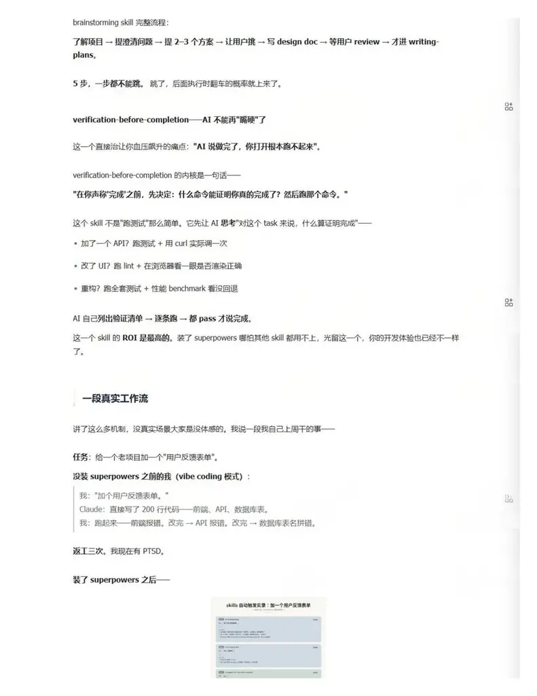

我盯着 Claude 串行跑完那 6 个 task 的过程中，泡了杯咖啡，回了 3 条微信，看了一眼朋友图。
整个过程，返工次数明显减少，节奏清晰多了。

但别期待"零 bug "一真实项目最终判言还是测试、lint、build、人工验收。
superpowers 的价值是把"该跑的纪律"自动跑了，不是茶你保证结果。
可它够了。多数 vibe coding 翻车，根因不是 AI 笨，是纪律没跑。

superpowers vs spec-kit: 怎么选

到这里有人会问-一
排，你之前提过另一个工具叫 spec kt。这两个我应该洁哪从 "

我用一张表说清楚-一

一句话总结- 一
spec-kit 给你一条 SPEC 流水线 (你昱式驱动每一步) 。
Superpowers 给你一套自动驾驶 (AI 自己触发每个纪律) 。

两个一起用

我看到有些人是这么用的: 不二选一，两个一起跑一一
。 spec-kit 负责 What: constitution / spec / plan / tasks 都按 spec-kit 的格式产出 markdown artifact

*。 Superpowers 负责 How: tasks 一旦拆好，superpowers 的 TDD / worktree / subagent / review skill 自动接管执

行

+
66

切换点在 tasks.md一spec-kit 拆好、superpowers 接上。

社区有人专门做了一个叫 Superpowers SDD Workflow 的整合 skill 把两者种起来。

但如果你只用 Claude Code、又懒得记一堆命令一一

先装 superpowers。 句号。

安装: 3 步上手

Step 1: 装 plugin

在 Gaude Code 里跑一

/plugin install superpowers@claude-plugins-official

回车，安装完成。

Welcome back Qian!

/plugin instal1l superpowers@claude-plugins-official
v Installed Superpowers. Run /reload-plugins to apply,

小提示: 上面是 Claude Code 用户的安装路径。Codex CLI/ Cursor / Gemini CULI / OpenCode 安装方式不同

superpowers README 里的对应章节。

Codex 也可以直接在插件市场里安装。

Run /init to
Note: You hav|

看

全二四                          所件
点
a 央                                                       让 codex 按你的方式工{
Co

Pspemomm

Step 2: 让plugin 生效

按 Claude Code 提示重启 / 跑 /reload-plugins / 开新会话 一任意一种都行。让启动时的 bootstrap instruction 重
新跑一遍。

Step 3: 开始用

不用记任何流程命令。
你跟 Claude 正常提需求一-加 feature、修 bug、重构一一它会主动调用相应 skill。
但提醒一下: 自动触发是倾向，不是保证。

简单任务它可能跳过; 上下文长了它可能漏掉某个 skill。

你要学会观察 skill 是否触发，没触发就显式说一句一一 「用 superpowers:brainstorming skil      它就跑。

第一次用你会有点不习惯。它问你的问题会比以前多很多一一这就是 brainstorming skill 在起作用。

新手提示: 别嫌它问得多。它问的每个问题都是你"早了哆要回答 的。

早回答 一 AI 一次写对;

聊回答 一 你打开看到 AI 写的东西不对，回炉重做。

必须告诉你的真实槽点

superpowers 不是银弹。

装之前你得名省中任醒一

1. markdown 文档过载。.

你用 brainstorming，AI 在 docs/superpowers/specs/ 下面塞一份 md。

你用 writing-plans，AI 在 docs/superpowers/plans/ 下面又塞一份 md。

一个feature 一份，文件名跟功能名

plan.md。

对应。比如反馈表单，对应的就是 feedback-form.md 和 feedbackform-

AT 在动手写代码之前会读这些 md，写代码时也会反复回去对照。
听起来很美好，对吧?

但有一个问题。
这些 md 会过期。一旦过期， AI 看到的就是错的。

AI 到旗是怎么读这些 md 的
举个例子。

Plain Text                                                                                                              吓

[ce

您说: “继续做反馈表单的下一步”

AT 吧 "这跟 brainstorming/writing-plans 有关"

AI 6 superpowers:writing-plans skil1(这一步只加载 skill 正文，~1698 tokens)
正文里有指令:“先去 docs/superpowers/plans/ 找对应的 plan md 来读”

AI 所 Read 工具读 feedback-form-plan.md

属于本本二

整个过程里，AI 默认那份 md 是对的。

问题就在这。

Superpowers 不监听代码变化。你手动改了一行 src/feedback.py，它不知道，对应的 md 不会动。

superpowers 也不在每次会话开始时核对。md 只在 skill 被触发的那一瞬间被加载进上下文，一旦读进来，AT 信任
它，不会主动翻代码核对一遍。

就好比，你公司的员工手册写着"上班 9 点到6 点"。

后来老板口头改成了 10 点到 7 点。 手册没改。

新来的人翻开手册，第二天 9 点准时打卡 6 点下班走了。

错的不是新人，错的是没人维护那本手册。

什么时候会讨旭?

间

Do
Bf+

场景1:你绕过 superpowers 自己手改代码

最常见。

比如你在 IDE 里直接改了一行-一把反馈表单的"必填字段"从 3 个减到 2 个。
代码改了、上线了，但 specs/feedbackform.md 里写的还是"3 个必填字段"。
下次你让 AI 改这个 feature，它读 md，以为还有 3 个必填字段。

DD
Bf+

然后基于这个错误前提，给你写出一份"自治但跑不通"的代码。

场景2:你让 AI 做一个"小修改"，跳过了 brainstorming
比如你说"帮我把反馈表单的提交按钮颜色换成蓝色"。

AI 觉得这是小事，没触发 brainstorming，直接改了 css。
但你可能顺手把按钮文案、点击行为也改了。

看出规律了吗?
所有"绕过 superpowers 的修改"和"AI 党得不值得走流程的修改"，都会让 md 偷偷过期。

知道了为什么要维护，剩下的就是怎么主动维护它。

第一种: 同步式维护 (最理想)                                                                                                                有
每次需求或代码有变更时，第一件事是更新对应的 md，再让 Claude 基于更新后的 md 干活。
Plain Text                                                                                                              中 出

"把 feedback-form.md 里 scope 改成“游客 + 登录用户'，在 constraints 里加“需要图片验证码防别'。然后 review 一下整傣
TREE                   上

md 永远是事实，代码跟着 md 走，AI 下次接手时读到的就是对的。

第二种: 定期 audit
每次项目阶段性成果完成时，或者每次发版前，让 Claude/Codex 跑一遍..

Plain Text                                                                                                              中 出

”audit 一下 docs/superpowers/specs/ 下所有 md，
对照当前 main 分支代码，告诉我哪些已经过期。"

需要摘清楚一件事一

Superpowers 里的 specs/*.md 不是写给人看的项目文档，也不是 git commit message。它是写给 AI 下次接手时读
的"事实快照

AT 读完这份 md 后，应该能立刻明白:

* 这个 feature 的 scope (范围) 是什么一给谁用、不给谁用
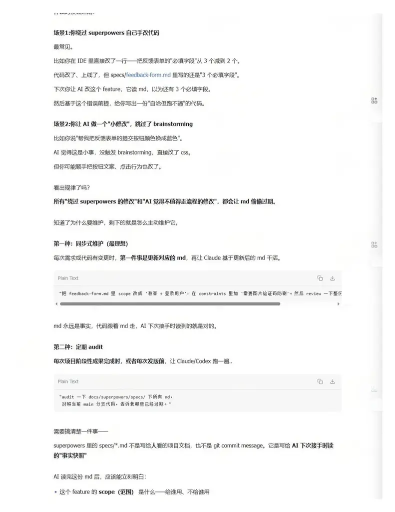

* 它的 constraints (约束) 有哪些一必须满足什么、不能违反什么

* 它的 核心行为/规则 是什么一比如必填字段是几个、提交后跳哪里
呈+
点

但并不是所有修改都需要写进文档

颜色从红改成蓝? 不必。
必填字段从 3 个减到 2 个?必须。

提交后跳转的页面变了? 必须。

判断标准只有一条: 这个变化会不会影响 AI 下次的决策?
会，就写进去。不会，省点事。

2. TDD 偏硕性。
它默认走 TDD (先写测试再写代码) 。

对 prototype (原型项目) 或 hackathon (黑客松) 项目可能拖慢速度一-v5.1.0 给了一些 escape hatch
(throwaway / generated / config 等场景会避你) ，但默认还是偏严。

worktree 也是一样，进入流程后纪律比较强势。

superpowers 内置了一个负责管 worktree 的 skill using-git-worktrees，在进入 implement 阶段时会默认建议你给当前
feature 开一个独立的 git worktree，除非用户拒绝或已有环境偏好，这是它工作流的默认设定。

它的运行机制大概是这样的: 你 一 用 Claude/Codex + superpowers 一 superpowers 主动建议/创建 worktree。

3. subagent 跨 harness 表现不一致。

subagent 能不能继承主对话的 skill，取决于你用的 harness 版本。

当前 superpowers 自己会要求"给子 agent 精确上下文"一但如果你的环境降级了，可能要显式把 skill 要求写进
subagent prompt.

4. 自动触发不是 100% 稳定。

社区里有人反馈某些场景 (尤其是简单任务、上下文长了之后) skill 没自动触发。
原因可能跟上下文长度、harness、插件版本、模型行为者有关- 没必要纠结根因，遇到没触发就显式点名 skill。

5. Token 成本会爆。
Simon Wilison (对，就是上面的那位) 在 Hacker News 上提过一个真实顾虑-一
他做一个项目时，5 个 subagent 各自因为 context 复制烧了 50,000+ tokens，最后 token 账单累积起来不便宜.

如果你的项目有几十个 task，这个成本要纳入考虑。superpowers 的 token efficiency 是有的(前面 Mejba 测验) ，
但前提是任务复杂到值得跑这套流程。

什么体量的项目值得装?
我用了一个月之后给个粗糙阔值一
项目体县                    推荐
少于 5 个task 的小修小补                        不用装一superpowers 的 brainstorming + plan 流程对小事是纯粹
浪费
5-20 个 task 的中等 feature                        装上推荐用

多于 20 个 task 的大 feature / 整套系统        必须装一没有 superpowers，光靠脑子记纪律，中途必亢

简单说: vibe coding 几行代码 一 不装。做产品级 feature 一 装。 句号。

superpowers 解决不了的 3 类问题
收尾之前，我得给你浇一全冷水一

superpowers 不是银弹。
下面 3 类问题，它处理不了-一

第一类: 设计审美 / UI 品味

superpowers 让 AI 把代码写得"工程上没毛病"，但 AI 仍然没有审美。

前端 UI 经常看起来"功能正确但难看"一这事 superpowers 治不了，得装别的 plugin (比如 Anthropic 官方出的
frontend-design skill，跟 superpowers 是两个独立赛道) 。

第二类: 业务理解 / 客户洞家

少于 5 个task 的小修小补                        不用装-一superpowers 的 brainstorming + plan 流程对小事是纯粹
浪费

5-20 个 task 的中等 feature                        装上推荐用

多于 20 个 task 的大 feature / 整套系统        必须装一没有 superpowers，光靠脑子记纪律，中途必南

简单说: vibe coding 几行代码 一 不装。做产品级 feature 一 装。 句号。

superpowers 解决不了的 3 类问题

7B 小模型一 superpowers 也救不了。

superpowers 是放大器，不是创造器。

模型本身能力是 60 分，superpowers 帮你项到 80; 模型本身只有 40 分，superpowers 顶到 50 也就到项了。

记住这 3 件事，你就不会对 superpowers 抱过高期待。

不是 AI 变聪明了，是 AI 学会守规矩了

回到这~节开头_一

"不守纪律.

Al 个知人这 谷册各请慰际片么用这个广辣 。

superpowers 帮你ie工程做对，但做对的东西不一定是用户起要的。

这部分还是你的活-一你得告诉 AI 你看到了什么用户场景，把这部分压缩进 SPEC，AT 才能写出有业务感的代码。

我经常这么干: 跟 AL 聊到 brainstorming 那一步，不只回答它的问题，我会主动塞进去 ”上次我们这种用户来反
外，他抱急的是 X、Y、Z 这种事，所以这个功能要照顾这几点。”

这种背景，AI 自己脑补不出来。
第三类: 模型能力的天花板

垃圾进，垃圾出。

Superpowers 在 Claude Opus 4.7 /Codex GPT 5.5 上跑得很好，但你换个能力差太多的模型一比如某些便宜的开源
下一节讲对 AI 友好的代码一一什么样的代码长相，能让 superpowers 的 skill 真正发挥作用、让 AI 改代码不翻车。

作业

去安装 superpowers。

go
8

装完之后，挑你手头一个真实项目，跟 AI 说: [我想加 [某个具体 feature]」 。

重点观家这 3 件事一

1. brainstorming skill 是不是触发了? AI 是不是先问你一串问题 (而不是直接写代码) ?
2. writing-plans skill 是不是触发了? AI 是不是把你的 feature 拆成了 2-5 分钟一个的 task?
3. verification-before-completion 是不是触发了? AI 在说"做诗了"之前，是不是真的跑了测试?

如果有 skill 没触发，显式说一句"用 brainstormingq skill" 看看.
学充这一节你应该明白一一

纪律不是靠你每次对话都提醒，是靠 plugin 把"该自动跑的纪律"沉淀下来。

你装一次 superpowers，AI 就在 14 个最重要的工程节点上会主动调用相应 skill。
大多数场景下，你不再需要每次都说"先写测试"跑完测试再说做完了"自己 review 一下"。

少数没自动触发的时候，你显式点名一下就行。

更重要的是一你应该慌了 Jesse 设计 superpowers 的 3 个底层洞家:

1. 经典说服心理学 〈Cialdini) 在 LLM 身上一样管用一一你以后写自己的 SKILL.md 也可以用这套话术
2. progressive disclosure -一按需加载是上下文工程的基础设计，所有大型 skill 包都得这么做
3. Skills 是开放标准一同一份 SKILLmd 跨 Claude/Cursor/Codex 都能跑，这是生态的底层基础设施

5 种钟，AI 回: "已完成，改了 12 个文件。"

你打开-看-一

*国 登录按钮变绿了

*。 和 注册按钮也跟着变绿了(你没让它改)
*。 从 个人中心页面挂了(不知道哪里出错)

。共 后庙某个 API 报 500 (更莫名其妙)

你回过头看代码一AI 之所以要改 12 个文件，是因为这 12 个文件本来就纠缠在一起。改一处必动 12 处。

问题不在 AI。
在于你的代码本身 一它没有边界。

或者另一个场景。

你跟 AI 说: “把支付逻辑改成支持微信支付。"
人 改完。你跑测试一支付测试 pass，但购物车测试 fail 了。
你乙了一下: “购物车跟支付有啥关系? ”

AI 回答: "你的购物车代码里直接调用了支付内部的 calculateTax 函数，我改支付的时候上顺便改了那个函数，

就挂7。"

支付和购物车明明是两件事。它们不该绑死在一起。

Bo
呈8

3
强

购物车
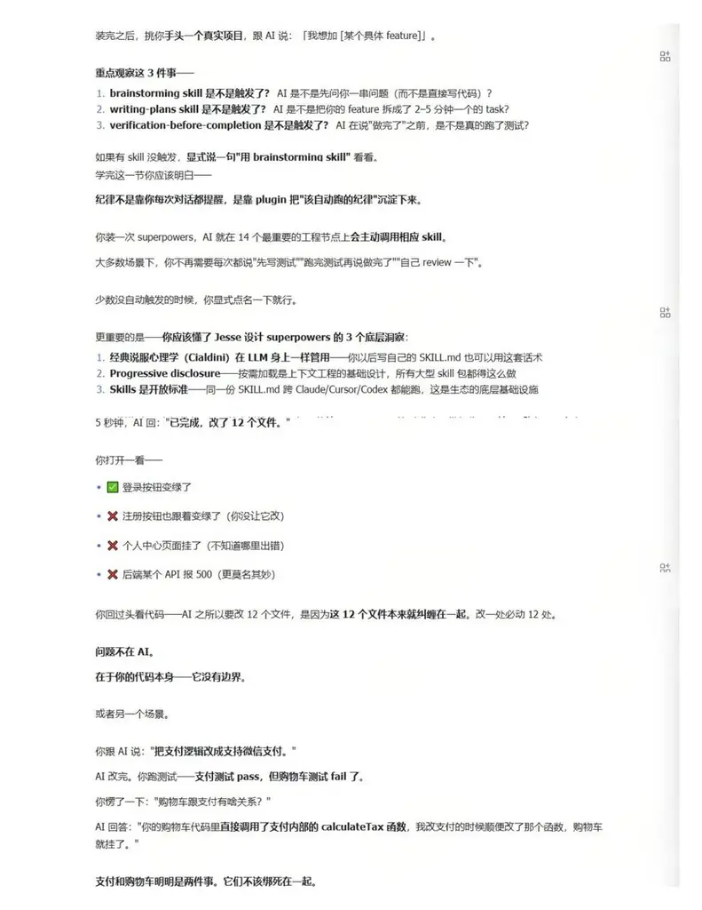

但你的代码就是绑死的。

第三个场景-一

你说: “给数据库加一个新字段叫is_vip。”
AI 改完。你的网站登录功能突然挂了。
为喻?

因为 AI 改数据库 schema (数据库结构) 的时候，顺手把 is_vip 加成了必填字段，还顺手改了 user model 的返回
结构-一

而那个 user model 被前端 8 个组件、后端 12 个 API 共用-一-一片报错。

如果你用 AI 写代码写了一段时间，这种事可能天天发生。
你气的不是 AI 笨。你气的是改一处牵一发动全身，根本无法局部修改。

这一节，我教你让 AI 改代码不再翻车的根本办法一调整代码结构本身。
让代码变得"对 AI 友好"。

从业这么多年，如果只让我留一句总结整个软件工程，我会留这句一
"高内聚、低夺合。真正理解了这句话，你就理解了一半的软件工程。”
句号。

这一节，就是讲透这句话的全部含义。

扫盲: 什么是"模块””什么是"内聚"什么是"耦合"?
很多学员到这儿伐了一"模块? 内聚? 碍合? 听不慌。"
放心，先用大白话讲透。我会用两个生活类比一-装修房子 + 工厂车间-给你建立直觉。
什么是"模块
模块 = 一个功能上独立的代码。

比如你的产品里一

。"用户登录" 是一个模块
。"付" 是一个模块

。 "浅据库连接" 是一个模块

。 "邮件通知" 是一个模块

每个模块可以是一个文件、一个文件夹、一个函数、一个类一一具体看大小。

go
8

oo
6+

gD
By

小词歇:

函数 (function) = 一段命名的可重复使用代码，比如 login (.

5

类 (dass) = 把数据和相关的函数打包在一起的一种组织方式。

类比 1: 你装修房子，每个房间是一个模块一

* 卧识是模块 (睡觉用)

* 厨房是模块 (做饭用)

”卫生间是模块 (洗澡用)

每个房间有自己的功能，有自己的边界。这就是"模块"。

类比 2: 工厂的流水线，每个工位是一个模块一
*工位 1: 焊接
* 工位 2: 喷漆
*工位 3: 包装

每个工位只干一件事，做完传到下一个工位。这也是"模块"。

什么是"高内聚”(high cohesion)

内聚 = 一个模块内部的东西有多紧密相关。
高内聚 = 模块里所有东西都围绕同一个目标。

继续装修类比一

高内聚的卧室: 里面有床、衣柜、床头柜、夜灯一一全部跟"睡觉"相关。
低内聚的卧室: 里面有床、洗手念、灶台、冰箱- 有些是睡觉用的，有些是做饭洗澡用的。

哪个房间好用?
显然是高内聚的卧室。你唾觉的所有东西都在这一个地方。

于
由 低内聚哈都有,啥孝干不好

[aaaxaa-a

oo

+
60

代码也一样。
高内聚的"用户模块" 里应该只有用户相关的事一注册、登录、改宝码、改邮箱。
如果你的"用户模块"里突然填出来一段"计算订单总价 "的代码一这就是低内聚。功能放错地方了。

车间版类比一
高内聚的工位: 工位只干"喷潜"，所有跟喷潜相关的工具 (喷枪、潜桶、防尘罩) 都在这个工位。

低内聚的工位: 工位里有"喷潜 + 焊接 + 切割"一三种工具堆一起，工人手忙脚乱，谁来这个工位都搞不清状况。

[ X 杂物筷 |    A 高内聚工位]

扣    和

低内聚的本质是杂物廿。

代码里业界更常阅 god class / god object (神类) 一 一个类把啥都管了。

放到文件层面，我这里叫它 god file (教学用叫法，非经典术语) : 一个文件像杂物德，什么都塞。
它通常是维护的重梦信号。

什么是"低耘合”(low coupling)

耦合 = 模块和模块之间互相依赖的程度。
低独合 = 模块之间依赖少，改一个时更不容易牵连另一个〈不是保证零影响，只是降低风险) 。

继续装修类比一
低独合的卧室和司房: 卧这是卧训，厨房是后房，装修卧室时，通常不需要大动厨房。
高独合的卧室和局房: 卧室的灯开关在厨房，启房的水管走卧室一一你改卧享的电路，后房就停水。

哪个好?
电然是低耘合-一理想情况下，改一个房间不需要大动其他房间。

| | 各自独立 ~ 改一个不动另一个

再讲 一个例子。
还记得小学的时候，老师让你们分组做一份手抄报吗?

+

号
合理的分工: 画画组负责画，写字组负责写，排版组负责规划布局。三个组各干各的，最后凑一起就行。这就是低看        人@
合

合。

不合理的分工: 画画的每画一笔，就要扭头问写字的"我这里画的行不行"。写字的每写一个字，就要问排版的 "我字要
写多大"。排版的还要问画画的"你下一笔打算画哪儿"。

三组猎成一团，谁都干不了自己的活 一因为所有人都在等所有人。
这就是高耦合。很模样。

代码里的"高克合"特别隐藏。比如-一

Plain Text                                                                                                                                 局

// 购物车模块里的代码                                                                                     台
const tax = paymentModule.calculateTax(amount) // * 直接调支付模块的内部函数

这就是高耦合。
购物车伸手到支付内部去拿东西。
结果: 你改支付，购物车就挂。

为哈"高耦合"这么阴险? 因为它看起来不严重，但威力巨大一
* 隐藏: 从代码外部看不出来。paymentModule.calculateTax (amount) 看着挺正常，但暗中绑死了两个模块。
* 传染: 一个高耦合不修，会引发更多高耦合 (别人看到这种写法觉得 OK，跟着学) 。
* 后期才爆发: 小项目时没事; 团队大了、代码多了，改一处动 12 处的事儿就出现了。
我见过最高谱的项目，改一个错别字 commit 涉及 47 个文件，那个项目最后死了-

没人敢碰。                                                “3

二二.-

什么是"单一职责" (Single Responsibility principle，

SRP 严格的说法 (Robert C. Martin 原话翻译) :
一个模块/类应该只对一个变更理由/一类业务责任负责。

听上去挝口。给和地基础学员的操作化理解一
SRP = 一个函数尽量只做一件清楚的事。

SRP)

它和"高内聚 "强相关-把同一类变化放一起，把不同功能的代码分开。

举个具体反例 (违反 SRP) :

Plain Text

def login_and_send_welcome_email (email， password) :
# 1， 核验密码
user = check_password (email， password)
## 2生成 token
token = create_ jwt (user)》
# 3。 发欢迎邮件
send_email (user.email， “Melcomel" )
return token

这一个函数干了3 件事: 校验、签 token、发邮件。
问题:

* 如果你只想登录不发邮件 〈比如用户重新登录) ，你怎么办?

* 如果'"发欢迎邮件"那段挂了(邮件服务挂) ，整个登录都挂一但实际上邮件挂跟登录没关系

* 你起测试"密码校验"一一必须连同邮件服务一起测，因为它们绑死了

正例 (符合 SRP) :

Plain Text

def login (email， password) :
user = check_password ( email， password)
token = create_jut (user)
return user， token  # 返回 user 和 token 两样

def send_welcome_email (user) :

send_email (user.email， “Welcomel" )

调用时-一

olin Te

+
6
中 也            Bt
6
中 出
加
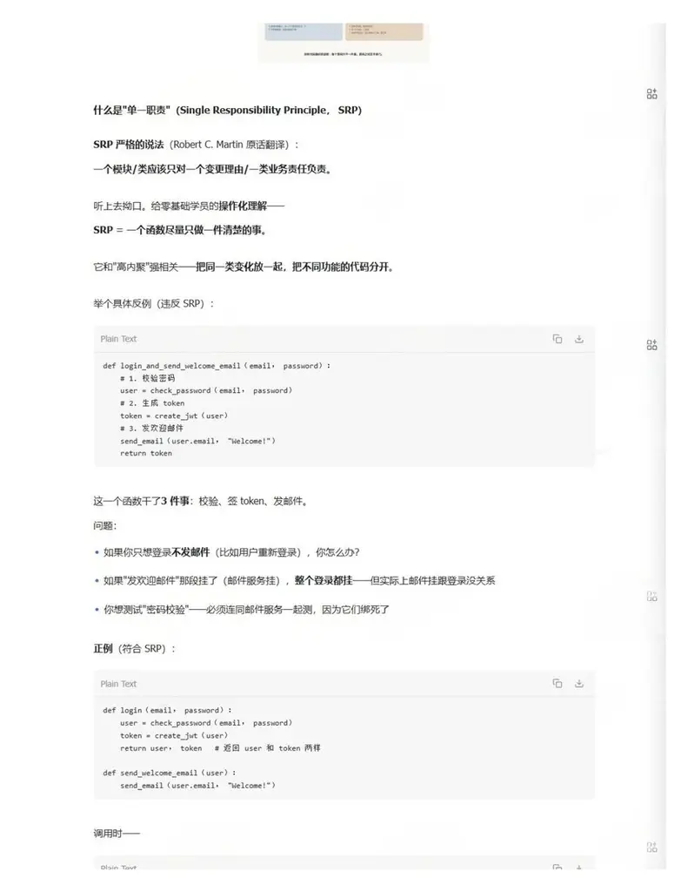

人                  U 己

user， token = login (email， password)
send_welcome_email (user)  # 单独调，挂了不影响登录拿到 token

一个函数尽量只做一件事一一通常更好。
但不要为了拆而拆，边界要服务于"可读性"和"会一起变化的东西"。

一句话总结

高内肾 = 相关的放一起。
低得合 = 无关的别绑死
单-职责 = 一个函数做一件清楚的事。

go
8

这三条本质是同一件事的三个角度一 给代码定边界。

[学软件工程，只带走一句话」 的真正合义
讲到这儿，你可能想: 这三条听上去很基础，真有那么重要吗?

不寺张。

我在 IT 行业见过几十个团队、几百个项目-一绝大多数"代码维护成址梦"的项目，都是因为违反这一条; 而那些"代码
舒服干起来快"的项目，几乎都遵守这一条。

下面这些名词看不懂没关系，先把它们当路标，不要求现在掌握。

高内聚、低耦合不是软件工程的全部，但它是理解很多工程实践的一把钥匙。

下面这些概念，很多都在不同角度处理"边界、依赖、变化"和高内聚低烛合灾切相关:
概念                      和 [边界/依赖」 的关系
面向对象 (OOP)              用类把"相关的"打包，把"无关的"分开 核心就是高内聚

设计模式 (Design Patterns)      很多模式都在降低重合 (策略模式、观察者模式、依赖注入…)

微服务架构                 把模块边界从"代码层 拉到"服务层”

函数式编程                用纯函数避免副作用，间接降低耦合

Domain-Driven Design (DDD)    让"业务边界"和"代码边界"对齐一一本质是高内聚

测试驱动开发 (TDD)              写测试逼你拆模块，和间接推高内聚 + 低看全

微前端                    在前端层做模块/团队边界

Clean Architecture               整个项目按层级分，核心是"依赖单向流动一一本质是低耘合

这些概念都不是孤立发明的。你懂了"高内聚、低三合"再看它们，会发现它们都在解决同一类问题。
8 个概念背后的同一把铀是

3
高内票 + 低耦合           mm

所以-一
你不需要立刻学完所有这些概念。你先学懂"高内聚、低耦合"，剩下的概念你后面遇到时，理解曲线会平缓很多。

这一句话，很值你花时间来理解。

你的代码"生病"的 5 个气味 (code smell)

讲完原理，我教你怎么识别-一
你的代码是不是已经在违反这一条。

软件工程界有个术语叫 code smell (代码气味，中文常翻"坏味道) 。

这个说法由 Kent Beck 提出，Martin Fowler 在《Refactoring》中系统化。就像房间里有怪味，你说不清是啥但知道
哪里不对劲。

我列 5 个最适合 AI 编程自检的常见信号，你扫描你的项目，如果中了 2 个以上一该重构了。

企 下面的数字阔值 (800 行/150 行/5 个文件/5 个参数) 是给新手自检的经验提醒线，不是业界标准。Fowler 的原
典里这些 smell 都没硬数字规定，只用了"过长"等定性描述。

5 个最常见的代码气味

WivT击舌世和T7oMl月远三颁总。人出75子辐 同由薪、令稍口 ，笨下罗丹必你唱同庆芭，迁肝mlex妆十滩亿之。

这一句话，很值你花时间来理解。

你的代码"生病"的 5 个气味 (code smell)

讲完原理，我教你怎么识别-一
你的代码是不是已经在违反这一条。

软件工程界有个术语叫 code smell (代码气味，中文常翻'坏味道) 。

这个说法由 Kent Beck 提出，Martin Fowler 在《Refactoring》中系统化。就像房间里有怪味，你说不清是啥但知道
哪里不对劲。

和

气味 1: 杂物文件 / God File

信号: 一个文件超过 800 行 (经验提醒线) ; 或者一个文件里啥都有 (数据库、UI、业务逐辑全在一起) 。
类比: 一个房间里同时摆床、灶台、马橘、办公喝一 啥功能都有，哈都干不好。

AI 看到这种文件: 不知道改哪里。改一处可能波及十处。最危险的 smell。

po
87

气味 2: 长函数 / Long Function (也叫 God Function)

信号: 一个函数超过 150 行 (经验提醒线) ; 函数名里有 and、"”
loginAndsendEmailAndUpdateprofile) 。

带'等字眼 (比如

类比: 一个工人在流水线上同时焊接、喷潜、包装 一手忙脚乱。
AI 看到这种函数: 改一件事可能搞坏其他几件。

气味 3: 散弹手术 (Shotgun Surgery)

信号: 你想做一件简单的事〈比如改一下用户头像的默认值) ，需要改 5+ 个文件 (经验提醒线-一Fowler 原意是"一
次变更散落到很多类/位置") 。

类比: 起换个灯泡，得先拆掉地板，因为电路藏在地板下守过 5 个房间。改一处动一片。
AI 看到这种代码: AI 也得改 5 个文件-一而且很可能漏掉一两个。                                                                     中

气味 4: 长参数列表 (Long Parameter List)

信号: 一个函数的参数超过 5 个 (经验提醒线) ; 比如 createUser (name， email，password， age，gender，
address，phone，vip，.…) 。

类比: 给厨师下单时，不是说"一份蛋炒饭"，而是"一份蛋炒饭、3 个鸡蛋、米要新米、油要花生油、萤要小莹、火候
7 分熟、盐 1 克、酱油 5 滴…"一点单本身比做饭还累。

AI 看到这种函数: 调用时容易传错参数顺序;或者忘传某个参数; 或者乱传。

气味 5: 循环依赖(Circular Dependency)

信号: 模块 A 依赖模块 B，模块 B 又依赖模块 A-一互相调来调去。

类比: 卧训的灯开关在厨房，厨房的水管走卧训一一两个房间死锁，改谁都拖宗另一个。
AI 看到这种代码 : AT 容易在依赖链上绕来绕去，判断不清真正入口，最后漏改或乱改。

自检清单
打开你最大的项目，问这 5 个问题 一

中 2条以上一你就在"AI 翻车高危区"。

这三条原则，2026 年因为 AI 突然"复活"了

讲到这儿你可能想-一
小排，这三条原则我听说过啊。书上都齐。但是，为啥这一节专门讲?它跟 AI 有啥关系?

好问题。
这三条原则并不新一一是软件工程几十年的老规矩。

1974 年 Edsger Dijkstra 在《On the Role of Scientiffc Thought》一文里讲过 "separation of concerns” (关注点分
高) ; 高内聚/低灶合的具体提法，主要来自 70 年代 Stevens / Myers / Constantine 等人的"结构化设计"传统。

这些思想合起来，构成了后来的模块化设计底层原则。

但在很多追求快速交付的团队里，这些原则经常被让位给短期速度一
* 创业团队 push 进度，"先发布再说”

* 小项目觉得"几十个文件随便绑都行

* 全栈框架 (Next,js / Rails) 默认结构就把很多东西混在一起

Do
67

很多公司的代码，都是"低内聚、高灶合"的一地。
改起来很痛，但又还能跑，所以一直拖着。

但是-一
2026 年，AI 时代把这一坨的代价显著放大了-。
为啥?
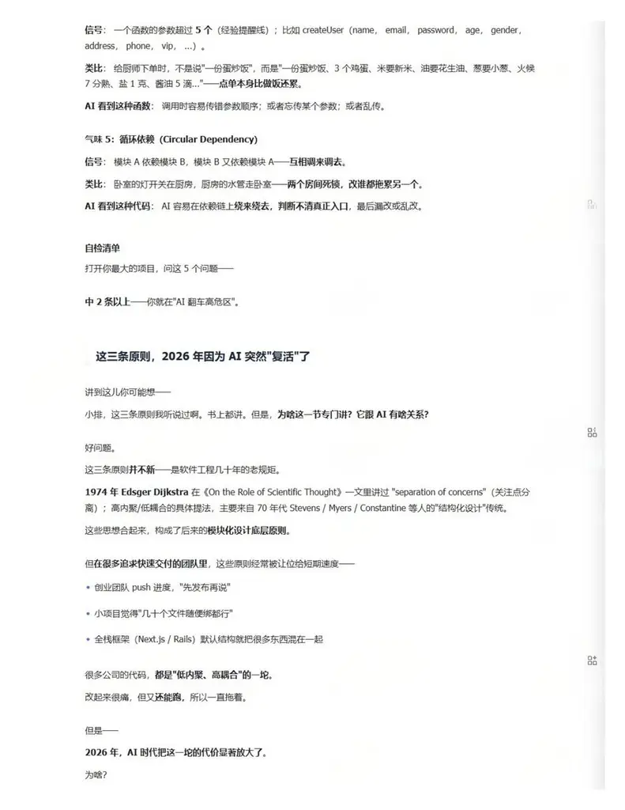

业界研究 (CodeScene 2026 的文章和白皮书) 的大意-一

AI 在健康、模块化的代码上表现明显更好; 在缺少客观反馈和清晰边界时，agent 容易做"表面整理"而不是真正改善代
码。

小词典: agent (智能体) = 能自主行动的 AL，比如 Cursor、Claude Code 这种能直接读你代码、改你文件、跑命令
的 AL。不只是"回答问题"那种聊天 AL。

简单说: 老问题没变，但 AI 时代的代价从"程序员手工改起来票"变成了"AI 让你的项目失控"。

志和在人时代和

工程和只和二一避磊各 [让内覃、必后)

为哈 AI 在乱代码上会"恶车"?

这一段是这一节的核心洞家。我慢慢进一

AI 默认是"清洁工"，不是"建筑师"

CodeScene 等团队对 agent 重构的实测和分析里，我看到一个共同的方向

"AI 在incremental cleanup (增量清洁) 上表现稳-重命名、提取函数、统一类型这种局部改动，它做得不错

* AI 在 design-level decisions (设计决策) 上不可靠-一 架构、模块边界、抽象层次，它默认不应独立承担最终判
断

翻译一下: AI 默认应该当清法工，不是建筑师。

它能在你已经划好的房间里整理东西。
不要指望它在没有约束、没有测试、没有结构反馈时，独立给你重新设计房子。

如果你的代码本来就没有"房间” (模块边界不清) ，AT 进去就只能在一坨垃圾里挪东西一 挪完之后，看起来不一
样，但还是一过。

AI 写代码默认会违反 SRP

这是我观察到的一个常见倾向一一你不约束 AI，它默认会写出违反 SRP 的代码。

为啥?

站SAT US相关二田学本了"yp林押本上骨一"局所bo 安生铅工如所右坦鞋止丁窒音信雪炳

+
60

Ity ra 人anemeoam二TTJ 。 /八CU EX COJOIUnrHIO人和环中四Telgxo

举个例子。
我让 Claude 写一个"用户注册"功能，不给任何约束。

下面是真实输出压缩成的伪代码展示。真实代码约 200 行，混了 8 件事: 校验邮箱、查重、hash 室码、写数据库、
生成 token、发邮件、写日志、埋点。

句
四

Plain Text

# 伪代码示意 - 真实代码每个步骤里有大量错误处理 / 数据库事务 / 日志细节

def register (email， password) :

诈 not validate_email ( email) : return error     # 1. 校验邮箱
if exists (email) : return error              # 2. 查重
hash = bcrypt (password)                     # 3。 hash 密码
user = db.insert(.….)                       # 4，写数据库
token = create_jwt (user)                   # 5. 生成 token
send_welcome_email (user.email)                # 6. 发欢迎邮件
log_event(〈"user_registered"， user)           着 7。写日志                                              点
track_analytics ( "signup"， user.id)          # 8、埋点分析
return fuser": user， "token": token}
8 件事，捏一起。典型的 god function (教学用叫法，非 Fowler 经典术语，正名是 ong function) 。
如果你不告诉 AT"按 SRP 拆"，它默认就这么写。
为喻Al 在乱代码上会 [翻车 ?
日
号

怎么治?

如果你看过前面的《SPEC 驱动开发 进阶篇》，那你应该知道 SKILL.md 就是写给 AI 的长期工作说明书 (也叫"AI
上高 SOP") 。

简单一在你的 SKILLmd 或 prompt 里加一句:
"写代码时得循单一职责原则: 每个函数只做一件清楚的事。多步操作时，主函数只做调度，把每一步拆成独立函数。”

加这一句，AI 写代码时主动拆函数的概率会显著提高一一但仍要 review 代码 + 跑测试，不是装上就万事大吉。
为哈很多项目代码乱?
因为新手不知道要加这一句。

学完这一节你知道了一一这是非常值钱的一条规则。

反过来看: 在干净代码上，AI 是神器。

但如果你的代码本来就模块边界清晰一一

* 改 "用户模块" 一 AI 通常只需动用户模块那几个文件

* 改支付模块" 一 更不容易影响购物车(如果公共接口变了，仍要联动)

* 加新功能 一 AI 知道往哪个模块加

AI 此时更像一个能按边界做增量整理的初级同事一一你定边界，它高效执行。

你写代码的水平，决定了你的 AI 能干到什么水平。

代码乱 一 AI 跟着乱。
代码净 一 AI 跟着净。

句号。

4 个动作让你的代码"对 AI 友好”
讲充原理，给你 4 个能立刻干的实操动作-一

让代码对 Al 友好的 4 个动作

01 srznne-ms               02 snmmm ampamms

动作 1: 每个文件只放一类东西

原则: 文件名说啥，文件里就放哈。

反例 (低内聚) :

Plain Text

utils.js * 里面有时间格式化、邮箱核验、价格计算 、URL 处理.….

utilsjs 是个杂物乱。里面啥都有。AI 看到这个文件，不知道该不该改、改哪里。

铝

[ec

6

止例〈丙内每) :

Plain Text
date-utils.js      * 只放时间相关
email-validator.js * 只放邮箱校验

price-calculator.js * 只放价格计算
url-helpers.js     * 只放 URL 处理

文件名告诉 AI 边界。
比如改时间相关的事，AI 能更容易判断该动哪个文件，误改其他文件的概率会降低。
动作 2: 每个函数尽量短，超 30 行问问自己"是不是混了多件事"

原则: 30 行只是个提醒线，不是硬性规定。
重点是一一个函数尽量做一件清楚的事。

反例 (违反 SRP，伪代码示意

Plain Text

def process_order (order) :
# 39 行核验.…
# 29 行算税.….
# 39 行扣库存..-
# 29 行发邮件.…-
# 38 行写日志..-
pass ## 《Python 里函赦体不能空，真实代码会有 136+ 行)

130 行干 5 件事，AI 改一件，可能搞坏其他 4 件。
正例 (SRP) :

Plain Text

def process_order (order) :
validate (order)
tax = calc_tax (order)
reserve_stock (order)
notify_user (order)
log_event (order)

主函数 5 行调度 + 5 个独立函数。每个子函数 20-40 行内。

AI 改"算税" 一 通常只动 calc_tax，改坏其他函数的概率显著降低。
动作 3: 避免"反向依赖”

原则: 底层不应该知道上层的存在。

反例:

中 册
台山           汪
中 也

oo
8

Plain Text
db.pPy《〈效据库底层)

+ 调用
user-service.py《〈业务层)

数据库底层反过来调业务层-这就是反向依赖。

正例:

Plain Text
user-service.py (业务层)
+ 调用
db.py《数据库底层)
业务调底层，底层不知道上面有谁在用。

这样 AI 改业务远辑时，通常不需要改数据库底层实现 (除非数据契约本身变了) 。

那反向依赖的问题在哪里?

打个比方，把整个项目想成一家餐厅-一
业务层是顾客 (决定要吃啥) 。 底层是厨师 (把茉做出来) 。
顾客让证师做茉一一业务调底层，这是正常方向。

正常的餐厅: 顾客看某单点茱，厨师按荣单做某。
中间那份"菜单"，是双方共同的约定。
谁来都行。换顾客，菜单不变; 换厨师，莱单还是不变。体验稳定。

反向依赖的餐厅: 菜单和天了。司师反过来追着每个顾客问。
顾客 A 要宫保鸡丁一一后师现学。

顾客 B 要意大利面一再现学。

顾客 C 是 VIP，要特殊待遇一还得学怎么伺候 VIP。

[ 荣单是共同约定 换人也稳定    上 菜单委了 -~ 厨师追着每个顾客现学

EDRRRDRRRTTRDE          ER

句

器

[e
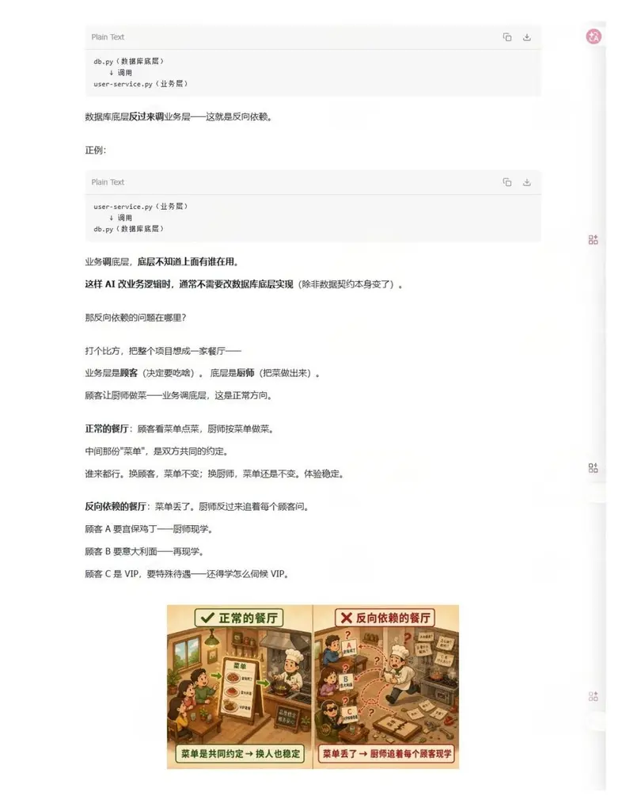

厨师变成一个啥都得会、又啥都不精的杂家。
来个新顾客，后师就得改一次。
换厨师》新言师得把所有口味、所有 VIP 规矩，全部重学一遍。

代码里的反向依赖一模一样。数据库底层反过来抓上层的业务-一

Python

# db.py《〈数据库底层)
from user_service import User，validate_email，is_vip  # * 反过来抓业务层

def save(data):
放 not validate_email(data["email"]): 。 # + 校验邮箱? 这是业务层的活
return “邮箱不合法”

user = User(data)                      # + 创建 User 对象? 这也是业务概念
if is_vip(user):                       #+ 判断 VTP? 业务概念跑进数据库了
cursor.execute("INSERT INTO vip_users ...")
else:
cursor.execute("INSERT INTO users ...")

圳握库底层柄要慌"什么电邮箱合法"什么叫 User'、"什么叫 VIP'。

它就是那个追着磊客学匠的厨师.

结果会很难看:

业务一改，话层眼着改; 业务今天新增 VIP，数据库代码跟着改一遍.

“ 起换数据库? 做梦: 换个庆层实现，得把所有业务概念在新系统里再写-一遍一几乎等于重写。
* 询层成了万金油，又只都不精: 本来通用的存储能力，被做死在一个特定业务上。

“ 改-处必牵一片: 业务层和数据库焊死了，谁也高不开谁

别反过来追着上层跑。

动作 4: 模块之各用"接口"通信，不要直接调内部

口
四

小词典: 这里的接口 〈interface) 指的是"模块对外承诺、别人能调用的入口"，不是 TypeScript 里那个 interface 关键

守

回到本节开头那个例子 一
共 反例 (paymentjs 文件) :

Plain Text

// payment.js 《内部国数，不应该被外部直接调)
function calculateTax (amount)
return amount * 9.13 /7/ 内部税蛮细节

句
[e

口
50

了
/11 cart.js

import * as payment from“./payment.js"
const tax = payment.calculateTax ( amount)  // 伸手到内部细节

购物车直接拿支付模块的内部函数calculateTax。这是紧独合。

图 正例:

Plain Text

// payment.js - 对外暴露一个清晰的接口
export function getorderTax (order) {

return calculateTax (order.amount) ” // 内部细节支付自己管
了

/11 cart.js

import { getorderTax }】from“./payment.js"
const tax = getOrderTax (order) “// 通过接口

支付内部怎么算税，购物车不管。它只调对外景豆的接口。

支付以后改算法，只要接口不变，购物车通常不需要改代码一一但仍要用测试确认行为符合预期 (税率规则变了之类的

语义变化是另外一回事) 。

一个真实的重构案例: 拆一个 200 行的"杂物函数"
讲了这么多概念，我们看个真东西。
我帮一个学员重构过一个支付函数一 200 行，干 7 件事。AT 改一次，坏 3 处。
拆之前

Plain Text

def handle_payment (order_id， user_id， amount) :
# 1， 查订单(29 行)
# 2. 验用户 (15 行
# 3，校全额 《28 行)
# 4. 调 stripe ApI (49 行)
# 5。写数据库 (38 行》
# 5. 发邮件(35 行
# 7。写日志 (46 行)
pass # 《擅代码

，真实有 296+ 行)

200 行。AI 想必"邮件文案"，得读懂全部 200 行。改完可能波及其他 6 件事。

拆之后

Plain Text

def handle_payment (order_id， user_id， amount) :

铝

句

钙

[ec

oo
8

go
8

order = get_order (order id)
user = get_user (user_id)
validate (order， user， amount)
receipt = charge_stripe (amount)
save_payment (order， receipt)》
notify_user 《user， receipt)
log_payment (order， receipt)

主函数 7 行。每个子函数 20-40 行，干一件事。

仙 改 "邮件文案" 一 只读 notify_user 那一个函数。
会小很多一一但仍要跑测试确认。
共享状态、数据库、副作用、调用顺序仍可能让一个改动影响别处，只是概率低很多。
重构是"先苦后甜"的
很多学员问我: "这种重构耗时啊，业务也不催我，值得吗? "

notify_user (user， receipt)
log_payment (order， receipt)

主函数 7 行。每个子函数 20-40 行，干一件事。

AT 改"邮件文案" 一 只读 notify_user 那一个函数。

影响范围会小很多一一但仍要跑测试确认。

共享状态、数据库、副作用、调用顺序仍可能让一个改动影响别处，只是概率低很多。
重构是"先苦后甜"的

很多学员问我: “这种重构耗时啊，业务也不催我，值得吗? ”

个 YAGNI 警告: 不要"提前拆"

但我得给你浇一盒冷水一一
别为了"对 AI 友好"而提前过度拆模块。

业界有个原则叫 YAGNI (You Aren't Gonna Need 蕊，中文常翻"用不到就别做") 一一不要为假想需求提前做复杂架
构; 当重复和靖点真实出现，再重构。

小词典:
MVP = Minimum Viable product，中文最小可行产品"一 先做能跑起来证明价值的最简版本。
微服务 (microservice) = 把一个大应用拆成很多个独立服务的架构方式。

反模式:

"我这个 Saas 现在 5 个文件，但我预感以后会有支付、会员、邮件、推送、报表、统计、分析.… 所以我先把架构
拆成 7 个微服务!

结果: 5 个文件搞了半个月没出 MVP，产品死在架构上。

正确节奏:

1. 先上线 MVP (5 个文件够用)

2. 等用户来了，某个模块开始及肿 (超 500 行 / 改一处动多处)                                                  呈6
3. 这时候让 AI 帮你拆

YAGNI 在 AI 时代反而更重要一一因为 AI 让你"重构 的成本变低了，你不需要提前优化。

重构等需要时再做，让 AI 帮你拆。别提前拆。

你的代码水平 = AI 的天花板

回到这一节开头那个 AI 改一行代码动 12 个文件的场景一
学充这一节你应该明白一-问题不是 AI，是你的代码本身没有边界。
对 AI 友好的代码 = 对你自己也友好的代码。

老规矩 + 新意义一

原则             老意义                                        AI 时代新意义

高内聚      相关的放一起，人类好读           AT 知道改哪个文件，不会乱改其他
合      无关的别绑死，改一处不动多处       AT 改一个模块，不会拖累其他

单一职责    一个函数做一件事，好测试          AT 改一个函数，不会改坏其他逻辑

整个内功篇这条主线，是给 AI 装上能力 一 给 AI 装上纪律 一 给 AI 装上代码安全网一
* 前面《上下文工程: 把 AI 当成会失忆的实习生》: 给 AI 装对上下文 (上下文窗口 = 扣的 RAM)

* 前面《SPEC 驱动开发 进阶篇》: 给 AI 装纪律 (superpowers + 14 个 skil)
。下一节程序员心法 (YAGNI + KISS + 命名 + 快速失败) : 给 AI 装"工程直觉"

* 后面《单元测试: 让 AI 写完，自动检查》: 给 AI 装验收机制

go
67

* 最后一节 AI 团队架构进阶; 多 AI 协作的纪律基础

这一节是中间最关键的一环一你的代码本身。
代码乱，前面所有装都白装。代码净，后面单测和 AI 团队才发挥得出来。

最后，我把那句话再说一遍-一
"如果说软件工程专业只带走一句话，那就是 「高内聚、低耘合」。真正理解了这句话，你就理解了一半的软件工程。”

把这一句贴在你显示器上。 每次让 AI 写代码前，看一眼。

写干净的代码，在 2026 年不是"洁癖"，是必需品。

作业

挑你手头一个真实项目，做这 4 件事一一

1. 任务 1: 5 个气味自检
打开项目，问自己-一

* 最大的文件有多少行? 超过 800 吗?

*。 最大的函数有多少行?》 超过 150 吗? 函数名里有 and 吗?
* 想改一个简单功能，是不是要动 5+ 文件?

*。 函数参数最多的有几个?

* 模块之间有没有循环依赖?

中 2条以上 一 你就在 AI 翻车高危区。

不会用命令行? 直接让 AI 帮你扫:

1. 任务 1: 5 个气味自检
打开项目，问自己-一

*。 最大的文件有多少行? 超过 800 吗?

* 最大的函数有多少行? 超过 150 吗? 函数名里有 and 吗?
*。想改一个简单功能，是不是要动 5+ 文件?

* 函数参数最多的有几个?

*。 模块之间有没有循环依赖?

中 2条以上 一 你就在 AI 翻车高危区。

不会用命令行? 直接让 AI 帮你扫:

|四、程序员心法: YAGNI + KISS + 命名 + 快速失败
前言
这一节，我们讲程序员心法。

讲之前，我先放 4 个 AI 编程吕车现场一
这 4 件事，只要你做过 AI 编程一段时间，几乎都会遇到。
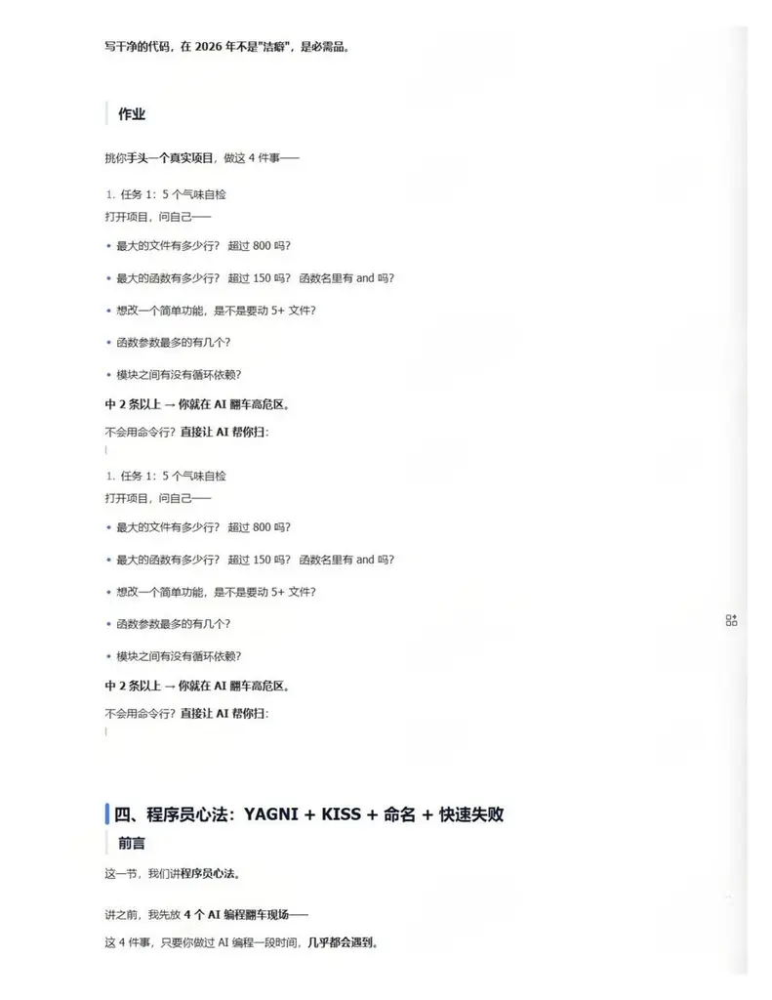

4 个 AI 编程翻车现场

程序员心法: YAGNI + KISS + 命名 + 快速失败

这一节，我们讲程序员心法

讲之前，我先放 4 个 AI 编程勋车现场一
这 4 件事，只要你做过 AI 编程一段时间，几乎都会遇到

4 个 AI 编程翻车现场

休榨上 ，找柄妇 十天宙，吉及马惠J上一1如rnE木一六J千HAD呈HUu LAccN JI re

但大概率，你这辈子都不会加 Excel 导出。

场景 2:
你跟 AI 说: "判断一下这个用户是不是 VIP"。
人 写了一个13 层嵌套的判断函数一

Plain Text                                                                                                              钙

def is_vip(user):
证 user is not None:
放 user.profile is not None:
if user.profile.subscription is not None:
放 user.profile.subscription.status is not None:
“active":

if user.profile.subscription.status
if user.profile.subscription.tier is not None:
放 user.profile.subscription.tier in ["gold"， “platinum"]:
# ... 还有 6 层
return True

return False

你看着头晕。
实际上一行就能写:

Plain Text                                                                                                              名

def is_vip(user):
return user and user.profile and user.profile.subscription and \
user.profile.subscription.status == "active”and \
user-profile.subscription-tier in ("gold"， “platinum

计 user.profile.subscription.tier in ["gold"，“platinum"]:
# .… 还有6 层
return True

return False

gD
8

Do
8

60

你看着头晕。
实际上一行就能写:

Plain Text
def is_vip(user):
return user and user.profile and user.profile.subscription and \

user-profile.subscription.status -= "active”and \
user.profile.subscription.tier in ("gold"， “platinum")

或者干脆一重新设计 user 数据,让 is_vip 变成一个属性，直接 useris_vip。
AT 默认给你的，是最复杂的方案。

场景 3:
你打开 AT 写的代码，变量名全是这种一

Plain Text

datal = fetch_users()
temp = filter(datal)
result = process(temp)

helper = transform(result)
data2 = save(helper)

每个变量名都没意义。datal 是啥? temp 是啥? helper 又是啥?
你 review 一遍代码，根本看不懂在干啥。

场景 4:

你让 AI 接入支付。AI 写完跟你说"OK，半成"。

你跑一下一表面没报错，数据库里也写了订单记录。
但用户实际上没付钱。

你查代码，发现 AI 写的支付逐辑里一

Plain Text

try:
charge_result = stripe.charge(.…)

句

名

巴

[ce

[ec

+
60

po
By

怎么样，这 4 段你是不是看着就 PTSD?
它们表面上是 4 种不同的问题一一个是过度设计、一个是写得太复杂、一个是命名贞起、一个是吞错误。

但根因只有一条-一

AI 没有"程序员心法"。

心法 = 老程序员看一眼就能下判断的"嗅觉"。
是工具会变、知识会过时，但你 30 岁、40 岁、50 岁都不会变的那部分东西。

这一节，我教你 4 个最重要的心法-YAGNI、KISS、命名、快速失败。

这 4 个心法，作为软件工程领域长期有效的原则一一
KISS 可以追溯到更早，YAGNI 和 Fail Fast 是后来在工程实践中成型的表达一它们的精神，几十年没变过。

学充这一节，你能看出 AI 写的代码哪里"心法不对"一也能让 AI 学会这 4 条，显著减少开头那 4 类事故的发生概
宗。

号。

阳

什么是"程序员心法"?

很多学员问我:“"心法?这是练武功吗? ”
差不多。写代码的成熟度，跟练武一样，分三层 -一
工具 一 知识 一 心法。越往里越深，越往里越值钱。

程序员的三层
心法 windset
mm

工具 Tool

ee pm maow ea                              CD

第一层: 工具(TooD)

最浅的一层。学会用 VS Code、Git、pnpm、npm instal上-一这都是工具。

工具会频繁更换。

oo

+
60

3 年前用 webpack，今天可能用 vite; 5 年前用 npm，今天可能用 pnpm; 2 年前用 Cursor，今天可能用 Claude
Code。

工具的寿命短 一 一般几年就被新一波取代。
你以前为了搞仅 webpack 配置文件熬过夜”》那段熬夜的痛苦，今天已经基本归零了一因为 vite 不用配。

工具是消耗品。

学了不亏，但不要押宝。

第二层: 知识(Knowledge)

中间一层。

学会 React 怎么写 hooks、Python 的 list comprehension、]JavaScript 的 promise、5SQL 怎么 join。

知识也会者化一但老得没工具那么快。

React 16 的 dass component 知识，放到 React 19 的 hooks 时代，基本作废了一半。jQuery 的回调地狱(Callback
Hell)知识，在 async/await 时代，直接归零。

但比工具寿命长一通常要更长一段时间才彻底过时。

知识是建材。比工具靠谱，但还不是地基。

第三层: 心法(Mindset)

最深的一层。心法老化得最慢。

YAGNI、KISS、命名、快速失败一一这 4 条心法，从软件工程发源到今天，精神没变过(具体术语是上世纪后半段陆续
成型的)。

工具迭代了几十轮，知识迭代了几轮。心法基本没动。

为啥?

因为心法不是关于"怎么用工具"的，是关于"判断什么是好代码"的。

判断力不会过时。                                                                           吕
举个最简单的例子 几十年前的资深程序员和2026 年的你，看到一段 200 行的函数，第一反应是一样的:

"这个函数太长了，得拆。"
几十年没变。这就是心法。

心法 vs 工具:

举个例子，直接把"心法 vs 工具"的差异说明白。
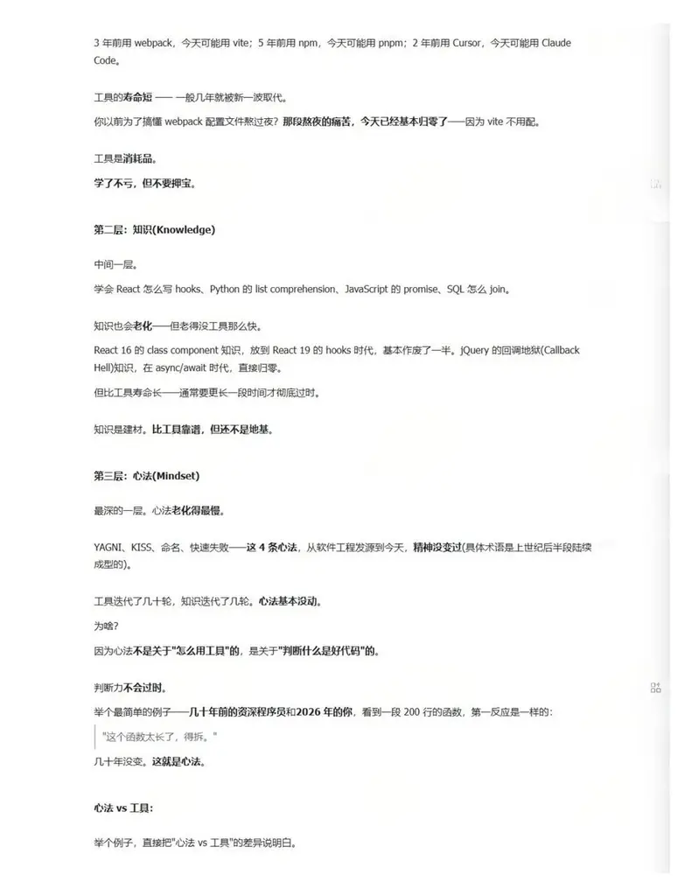

你跟 AI 说"用 React 写一个表单"一一
只有工具的程序员: 能看出 AI 用的是 useState 还是 useReducer。
有知识的程序员: 能看出 AI 用 Controlled Component 还是 Uncontrolled，哪个更合适。

有心法的程序员: 能看出一这个表单 AI 写得太复杂了。明明 5 行能搞定，它写了 50 行，还套了 3 层抽象。

第一层的判断，叫"看得懂"。第二层叫"'知道为啥"。第三层叫"知道好不好"。

意: 第三层的判断，跟"用什么工具"无    它只跟"什么样算好代码"有关。

庆

你今天用 React，明天换 Vue，后天换 SwiftUI-一心法是一样的。5 行能搞定的，永远不要用 50 行。

前面那一节讲了结构-一高内聚、低看合、单一职责。
那是代码长什么样的判断。远观的判断。

这一节讲心法一每一行代码，要不要写? 写得好不好? 这是近观的判断。

打个比方:

结构是骨架，心法是肌肉。

骨架决定你能不能站着、躺着、坐着一这是宏观形态。

肌肉决定你怎么动、动得快不快、有没有力一一这是每一个动作的判断。

只有骨架没肌肉的人，叫通通。
有骨架有肌肉的人，才叫活人。

写代码也一样。
有结构没心法 = 一个看起来整洁但每一行都在埋震的项目。
接着看。

你写代码的判断力，决定 AI 帮你的天花板

我跟你说一件 2026 年很多人没意识到的事一
AI 时代不缺打字工，缺的是判断力。

有骨架有肌肉的人，才叫活人。

写代码也一样。
有结构没心法 = 一个看起来整洁但每一行都在埋雷的项目。
接着看。

你写代码的判断力，决定 AI 帮你的天花板

我限你说一件 2026 年很多人没意识到的事一
AI 时代不缺打字工，缺的是判断力。

听上去挺吓人，对吧? 但仔细想，这话的真实含义不是"程序员要失业了"，而是一
* 写代码这件事，变得不重要了(AI 干了)

* 真正重要的是: 你能不能判断 AI 写出来的东西好不好

写代码不再是核心技能。判断好坏才是核心技能。
那什么决定你能不能判断7 一句话-一心法。

定名宴你风天

内 严岂攻的天

全 而 天 从军由

和工作的可能区间
介 力作天花全 ，A 大作表同

工工本，忆水便，

你可能想:“那我学 AI 不就完事了? 让 AI 帮有我做判断? ”
不行。

不只是不行，是真的不行-一2026 年初有不少深度使用 AI 编程的工程师在公开渠道反映过类似现象，大意是:
Claude Code 在某些版本/ 时期会变得不太适合执行复杂工程任务一倾向于直接编辑而不是先研究、产出代码质量起

伏大、对约定的遵守变差、长会话里整体可靠性下降。

全力高 天天襄 放要出时

人工作的可能区间
全 全 天性“ 日有

1法

工内全灾，人法示伍，

你可能想:“那我学 AI 不就完事了? 让 AI 帮有我做判断? ”
不行。

不只是不行，是真的不行一一2026 年初有不少深度使用 AI 编程的工程师在公开渠道反映过类似现象，大意是:
Claude Code 在某些版本/时期会变得不太适合执行复杂工程任务一倾向于直接编辑而不是先研究、产出代码质量起

伏大、对约定的遵守变差、长会话里整体可靠性下降。

加信和训口知een 。。 口卫人

mp TEAEt5 一口Jo

AI 时代，代码绝大部分是 AI 写的。你只负责一小部分。
但你负责的那一小部分，决定 AI 那一大部分的质量。

这"一小部分"是啥? 心法+ judgment。

下面我进透 4 个最重要的心法。                                                                                                                                   呈

人时代, 代王90%是AI写的

你只负责 10%

但这 109%6 决定条下 90% 的质量

02m        03 =        04 =
ass        二|        加ma
天                   亚
ee

-一

二

nes waeco oa

心法 1: YAGNI 一一 用不到的别做

YAGNI = You Aren't Gonna Need It(中文: 用不到就别做)。

这条原则常和极限编程(Extreme programming) 一起被讨论，是软件工程领域早就被反复验证的实战原则。
核心一句话:

不要因为感党"未来可能会用到"的功能现在就写代码。等你真的用到时再加。

为哈 YAGNI 这么重要?

因为人类特别喜欢提前优化。

你做一个登录功能，会不自觉想: "以后可能要支持 SSO、Google 登录、Apple 登录、手机号、微信、邮箱魔法链接…
我现在就把架构设计好! ”

结果-一
你 2 周做完一个,通用登录框架'，但你的产品到现在都只有邮箱密码登录，其他全没用上。

YAGNI 的判断: 等你真要加 Google 登录时，再去重构。现在，只做邮箱密码。

为什么?
* 大多数"未来需求"实际上不会发生(这是工程实践里被反复观家到的现象)

* 过度设计会拖慢现在的进度一本来 1 天能做计，你做了 2 周

* AI 显著降低了重构成本一一以后真要扩，让 AI 帮忙改要快得多(但仍需测试和 review)

【X) 过度设计 上几 由(wLYAGNI

需求只是导出CSV ~ 200 行抽象屋 需求只是导出 CSV 5 行函数 |

AI 时代的 YAGNI 反模式

这是 2026 年我看到 AI 最常见的违规一AI 默认会过度设计。

回到开头的场景:

你说"加个导出 CSV 按钮"，AI 写了 ExportFactory + AbstractExporter + CSVExporterStrategy + ExportConfigBuilder ..

为啥 AI 这么干》 两个原因-一

1 训练数据偏向"看起来专业"的代码: 开源项目里很多"工程师作品集"代码用了大量设计模式。AI 学到了一这些就
是'好代码”
2. AI 想"一次性把事做满"就像前一节讲过的，AI 倾向把所有可能性都要盖，反正"加上不亏"

但你当前的需求，可能只是一个简单的 CSV 输出函数一一10 行能搞定。

我自己有过一次 PTSD 体验-一
去年我做一个内部工具，跟 AI 说"给我一个发邮件的功能"。

AI 给我写了一个 EmailserviceFactory，里面有 Smtpprovider、SendGridprovider、Mailgunprovider、Sesprovider，还
有一个 Retrypolicy 类、一个 TemplateEngine 类。

我看着 400 多行代码动住了一我就要发一封邮件.
最后我把它全删了，自己 8 行 Python + smtplib 搞定。

8 行解决的事，AI 给你 400 行一一这就是不加 YAGNI 约束的真实代价。

怎么治 AI 的过度设计?

在你的 SKILL.md / prompt 里加一句:
"遵循 YAGNI: 用最简单的实现满足当前需求。不要为未来可能的扩展提前设计抽象层。需求出现再重构。”

@@

Bo
8

oo

8

Bo
呈

或者更直接:
"用最少的代码实现这个功能。我说要 X，你就只做 X，不要多做。"

加这两句，AI 写出来的代码长度通常能显著缩短。

YAGNI 的 3 条具体行动

工. 别造抽象工厂，直接写函数。
新手最容易翻车的设计一 是还没用到第二种实现，就先造一个工厂模式 。
只有当你真的有 2-3 种实现时，才需要抽象。1 种就别造工厂。

比如多种登陆方式的抽象，就是把它们的共同点提炼成一个 AuthpProvider 接口，每种登录(邮箱、账号密码、X 授权、

Google、微信.……)做成一个具体实现，上层只调 providerlogin()，不用关心底下走哪条路。

2. 别加"以防万一"的参数。

名

JavasScript

function login(
email，         AZ/ 邮箱      一 必这
password，       7/ 密码      一 必填
remember = false， // 是否"记住我7 天免登录
usessO = false，    7/ 是否走单点登录(公司账号那种)
mfa = false，                   素认证(短信/验证器二次验证)
captcha = false， 。 // 是否要求图形验证码
// …-还有更多

=false 的含义: 默认值。 调用时如果你不传这个参数，它就自动是 false。
所以这个函数被设计成:
* 必传两个: 邮箱、富码

* 选传一堆: 剩下的开关，不传就当 false

结果实际跑起来，useSSO、mfa、captcha 绝大部分可能大半年都没人传过 true。它们存在的唯一意义就是"以防万

这些参数等你真的用到时再加。

3. 别预留"未来扩展位"。
/W/ TODO: 这里以后可以支持微信支付 一一 这种 TODO 大概率永远不会被实现。直接删掉。
要做就做，不做就不要留位。

YAGNI 的3条具体行动

Sm一

[ec
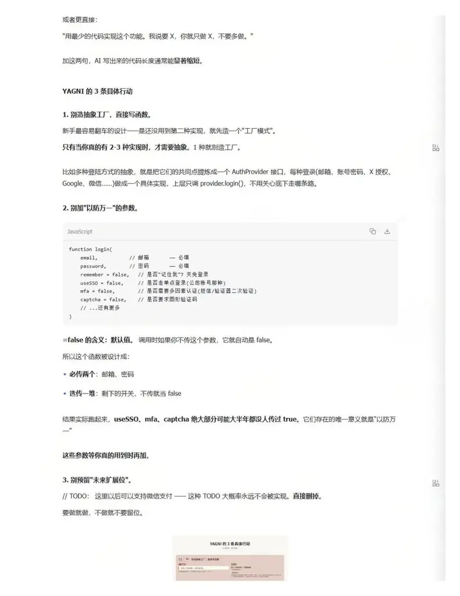

心法 2: KISS 一 保持简单

KISS = Keep It Simple， Stupid(中文: 保持简单，别起太多)。

这条原则常被归于美国洛克希德 Skunk Works 的传奇航空工程师 Kelly ]ohnson。
最常见的解释是:
设计要让一个普通技工在战场上也能修好它。

听起来跟编程没关系? 完全有关。
把"战场上的技工"换成"凌晨 3 点出 bug 时的你"一意思完全一样。
代码要简单到，凌晨 3 点 bug 复现时，没那么清醒的你也能立刻看懂问题在哪里。

KISS 的核心判断:

如果你能用 5 行代码搞定，就不要用 50 行。

回到开头场景的 13 层嵌套- 那不是技术深度，是脑子不够。
老程序员看一眼: 这种庶套通常一行就能写完。

Plain Text

# 13 层赃套版(差)
def is_vip(user):
if user is not None:
if user-profile is not None:
if user.profile.subscription is not None:
# ..。 还有 19 层

## KISS 版(好)
def is_vip(user):
return user and user.profile and user.profile.subscription and \

user.profile.subscription.status == "active” and \
user.profile.subscription.tier in ("gold"， "platinum")

或者更好 重新设计数据:

Plain Text

# 最好版: 让 user.is_vip 直接是个属性

器

器

[ec

[ec

+
6

+
60

class User:
@property                                                                                   JO
def is_vip(self):
return (self.subscription_active                                                              仿
and self.tier in ("gold"，“platinum"))

# 调用方

if user.is_vip:

3 个版本，功能一样。 但简单度天差地别。

， > KISS .13 层嵌套 vs 一行搞定和

f user is not None:              def is_vip():
这      os otimes              return user .is_vip
看着头晕,改起来更晕               5 秒看懂, 1 秒改完
Anthropic 自己也在用 KISS

我最近读 Anthropic 关于构建 AI 工作流的公开材料，有一句话特别打动我:
大章是: 用简单可组合的模式，而不是厚重的框架。

这句话我觉得是 2026 年 AI 时代写代码的关键指导原则之一。
意思是: 别造重的框架，用简单的、可组合的小块。                                                                                          呈6

很多写了多年代码的资深程序员都有这个共识 一简单的代码，通常才命最长。

AI 时代的 KISSs 反模式

AT 喜欢写"看起来很专业"的代码一这是它的老毛病。
具体表现 4种 一

愉 反模式 1: 把简单的事说得贼高级

你跟同事说: “我们中午去吃饭吧。”
同事回你: “我建议启动员工午餐协同决策机制。”
一同样一件事，非要起一堆高级名字。AI 写代码就这毛病。

比如用 Strategy / Observer / Decorator 这种设计模式名，炫一下

Python

# AT 写的:为了"算个折扣"造了一堆类
class Discountstrategy: .
class VIPDiscountstrategy(Discountstrategy):
class NewUserDiscountstrategy(Discountstrategy):
## 其实你只需要 3 行 if-else:
def get_discount(user):
放 user.is_vip: return 6.8 #VvIP打8折
if user.is_new: return 9.9  # 新用户 9 折
return 1.9               # 其他原价

其 反模式 2: 你要个水果镀头开瓶器，他给你造个万能开瓶器

你说: “我要一把开水果锥头的开瓶器。”
他给你: “这是宇宙万能开瓶器 能开甸头、啤酒、红酒、汽水，还能开太空舱舱门。”
一你只用得上一个功能，他给你做了十个。

比如写一个"通用" 但没人需要这种通用的工具函数

Python

# AT 写的:支持任意类型的"通用"格式化器

def universal_formatter(value，type_hint，options={)，...): .…-

# 其实您只要:把日期变字符串
def format_date(d):
return dstrftime("%Y-%m-%d")

共 反模式 3: 门口装了 5 道闸，但只有第一道在用

小区门口装了 5 道闸:刷脸、查身份证、测体温、扫健康码、查通行证。
结果只有"刷脸 "在用,后面 4 道全是摆设一立在那不通电。

比如加几层"middleware"，但实际上只有一层在真跑。

Python

# AT 写的:5 层*中间件"(就是请求路上的关卡)
app-use(LoggingMiddleware)    # 记日志 一 真在用

app.use(AuthMiddleware)       # 鉴权 一 没接入
app.use(RateLimitMiddleware)  # 限流 一 没接入
app-use(CacheMiddleware)     # 缓存 一 没接入
app.use(MetricsNiddleware)    # 监控 一 没接入

# 其实就用一遂:

app.use(LogEinghiddleware)

区 反模式 4: 算个 1+1，搞出来一所数学大学

你要算 1+1。

8

器
中 出

咒

品
中 出

他不算，先给你建了一所"数学运算大学"，分加法系、减法系、乘法系,每个系底下还有教授、副教授、讲师.……
一一道加法题，造了一所学校。

比如用一堆 class + 继承，但实际上用普通函数就能搞定

Python

器

# AT 写的:为了判断"邮箱合不合法"造一堆类
class BaseValidator:

def validate(self，x)， raise NotImplementedError
class Emailvalidator(Basevalidator):

def validate(self，x): return "@”in x

# 其实一行就行:

def is_valid_email(x):
return “@"” in x

新手看到这种反模式的代码会想: “哇，这代码好高级。”
老程序员看到这种代码，第一反应是一一这哥们经验不够，在炫技。

经验真的够的人，见过太多次"为了迷技搭出来的高级抽象，过几个月就被 fork 一份甚至彻底重写"的惨案。
迷技代码的志命，通常很短。

经验够的程序员，代码反而朴素得让人意外一 眼能看元，改起来不打怀。函数名都是
get_user、save_order、send_email 这种朴素到不能再朴素的。

真懂的人，反而不秀。这是写代码的修行。

怎么治 AI 写复杂代码?

在你的 SKILL.md / prompt 里加一句:

"遵循 KISS: 用最简单、最直观的方式实现功能。能用普通函数解决的，不要用类。能用 ielse 解决的，不要用
Strategy 模式。优先选可读性，而不是'看起来专业。”

加这一句。 AT 写出的代码可这性会吨鞋捍高一一之前至本花 5 分铀香懂的”改成 30 种能法主

[ce
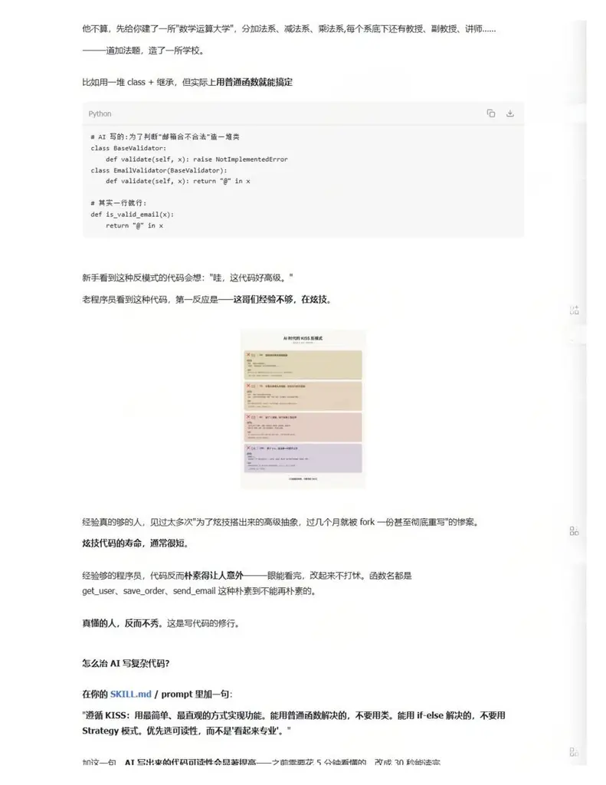

心法 3: 命名是设计 一一 好名字 = 一半设计

写代码的人圈内有一句广为流传的名言，常被归于 Netscape 的工程师 Phil Kariton 一一
"There are only two hard things in Computer Science: cache invalidation and naming things.”
(计算机科学只有两件难事: 缓存失效，和给东西起名。)

这句话流传几十年了一至今，几乎没人反绞。

为啥命名这么难?                                                                                                                                                      避
因为命名就是设计。

你给一个变量起名 user一一你已经在承诺: 这里面装的是用户对象，不是订单不是支付。
你给一个函数起名 getUser一一你已经在承诺: 它返回用户，而不是抛异常或者写日志。

如果起名不准 -一
Plain Text                                                                                      中 出
# 名字抠谎
def getUser(id) :
user = db.query(.….)
诈 not user:
send_alert_email(...) # 名字说“get”，实际上还发了邮件!
log_event(.….)

return None
return user

调用方根据名字判断"它就只读取"，但实际上它有副作用。这就是命名带来的 bug。
这里的副作用，就是函数除了返回值之外，还偷偷做了别的事。

getUser 名字承诺"只读用户"，实际上它偷偷发了邮件、偷偷写了日志。读你代码的人完全没防备，bug 就这么埋下
区让

命名是设计 有政名字 vs 好名字
火烂名字                      V 好名字

好名字的 3 条标准
工. 名字告诉读者"做什么"，而不是"怎么做”

Plain Text

# 烂: 告诉怎么做

def loop_through_users_and_check_email(.….)

# 好: 告诉做什么

def find_users_with_invalid email(...)

2. 名宁精确，不偷懒

好名字的 3 条标准
工. 名字告诉读者"做什么"，而不是"怎么做"

Plain Text

## 烂: 告诉怎么做

def loop_through_users_and_check_email(.….)

## 好: 告诉做什么
def find_users_with_invalid_enail(..)

2. 名字精确，不偷懒

Bet_user(id)

fetch_orders(user_id)

load_payments(order_id)
# 好: 统一动词
get_user(id)

get_orders(user_id)
Bet_payments(order_id)

命名的"自我解释"测试

测试你的代码命名好不好-一

如果你需要写注释解释一个变量/函数是干啥的，
大概率是名宇起得不够好.

Plain Text
# 名字烂，要靠注释玫

并 这个函数会返回过去 3 天的活跃用户
def fetch(days) :

句

[ec

[e

# 名字好，自我解释，不需要注释

def get_active_users_in_last_39_days():

好命名能减少大量解释性注释一但复杂业务远辑、性能权衡、特殊边界条件，该写的注释还是要写。命名能解决的
是"这是什么"，不能充全蔡代 为什么这样做"。

好名字的了天标准 1 个自从

Plain Text                                                                                                              品

[cr

# 名字烂，要靠注释玫
# 这个函数会返回过去 38 天的活跃用户
def fetch(days):

# 名字好，自我解释 ，不需要注释

def get_active_users_in_last_39_days():

好命名能减少大量解释性注释一一但复杂业务远辑、性能权衡、特殊边界条件，该写的注释还是要写。命名能解决的
是"这是什么"，不能充全蔡代 为什么这样做"。

好名字的了末凤准 。1 个自检

为啥 两个原因一
1 这些名字安全(永远不会犯错)、通用(放到任何场景都"能用")
2. 训综数据里太多新手代码也用这些名字- AI 学坏了

但通用 = 没信息量。
data 这个名字，等于没起名字 一任何变量都装"data 。

每次你看 AI 写的代码，先扫一遍变量名一一这是 5 秒钟就能做的检查:

*。 有没有 dataldata2? 一 命名差

*。 有没有 helperutilmanager? 一 命名差

*。有没有 temptmp? 一 命名差

* 函数名里有没有 doprocesshandle? 一 没说清楚做哈

*。 有没有 MyClass、MyService、BaseManager? 一 命名差

只要有，就是债。

直接跟 AI 说:

"变量名重命名，要精确说明它装的是什么。不要用 data / temp / helper 这种通用名。如果你想不出精确的名字，
说明这个变量本身就有问题 一可能根本不该存在。”

最后那一句特别重要一很多时候，起不出好名字不是命名能力的问题，是设计本身有问题。

日
60

比如一个变量装了"过滤后的活跃用户列表 + 每个用户的订单数 + 总金额一你怎么起名?
data? result? info?

没法起。因为这个变量本身装了 3 件事一它根本不该是一个变量，应该拆成 3 个。

好命名 = 好设计的副产物。
这就是为只说"命名是设计"。

我发明了一个判断方法叫"老板视角"一一

把 AI 写的代码当作新员工提交给你的报告。

如果你看了一眼，还得让他解释每个变量名是啥-一这个员工不合格。

如果你看了一眼，所有名字都自我解释，你不需要问-一一这个员工有水平。

AI 写代码，软认是新员工水平。你得让它升级到老员工。

没法起。因为这个变量本身装了 3 件事一一它根本不该是一个变量，应该拆成 3 个。

好命名 = 好设计的副产物。
这就是为啥说"命名是设计"。

我发明了一个判断方法叫"老板视角"一

把 AI 写的代码当作新员工提交给你的报告。

如果你看了一眼，还得让他解释每个变量名是啥-一这个员工不合格。

如果你看了一眼，所有名字都自我解释，你不需要问-这个员工有水平。

口
Bo

AI 写代码，默认是新员工水平。你得让它升级到老员工。

2024 年，我做一个 SaaS 上线。AI 帮有我写的 Stripe 支付集成，我 review 时没仔细看-一

Plain Text                                                                                                              叫

四

try:
charge = stripe.charge(amount， token)
save_order(order_id， charge.id)

except Exception as e:
print(f"payment error; {ej") # 静默吞错!
save_order(order_id， "manual") # 还假装成功!

我上线了。

3 个月后，一个用户来说"我没收到订阅"。

我查日志-一 3 个月里，有 47 笔支付实际上 Stripe 报错了，但我的代码假装成功。用户的钱没被扣(Stripe 拒了交
2024 年，我做一个 SaaS 上线。AI 帮我写的 Stripe 支付集成，我 review 时没仔细看-一

Plain Text

try:
charge = stripe.charge(amount， token)
save_order(order_id， charge.id)

except Exception as e:
print(f"payment error: {ej") # 静默吞错!
save_order(order_id， "manual") # 还假装成功!

我上线了。
3 个月后，一个用户来说"我没收到订阅"。

我查日志-一 3 个月里，有 47 笔支付实际上 Stripe 报错了，但我的代码假装成功

。用户的钱没被扣(Stripe 拒了交

Al 偷偷知掉错误 -* 炸弹埋在地下 ]国「 立刻报错 ~ 现在修,不用等炸

那次之后我立了一条规矩-一 写代码时，默认不捕获异常。要捕获，必须能回答两个问题:

1. 我捕获后具体怎么处理? (不是 print/pass)
2. 这个异常真的可恢复吗? (还是只是想茂起来)

什么样算"可恢复"?一举几个例子你就懂了:
”网络超时 一 可恢复。再试一次说不定就好了。
* 第三方 API 限流 一 可恢复。等一秒重试。

* 数据库连接被踢 一 可恢复。重连一次。

* amount 传成了字符串 "abc" 一 不可恢复。重试 100 次还是字符率。这种就该让它南，告诉调用方"你传错了"。

* 配置文件找不到 一 不可恢复。程序根本起不来，藏着也没意义。
能修的才捕，修不了的让它响。 这就是判断要不要 catch 的核心。
回答不了 一 不捕获，让它南。

需了反而好-至少你立刻知道哪里有问题。

Fail Fast 的核心判断
错误发生的瞬间，就要让它"响起来"一别让它走到 3 个月后。
具体做法:

工. 不要捕获你不知道怎么4        异常

D+
86

go
67
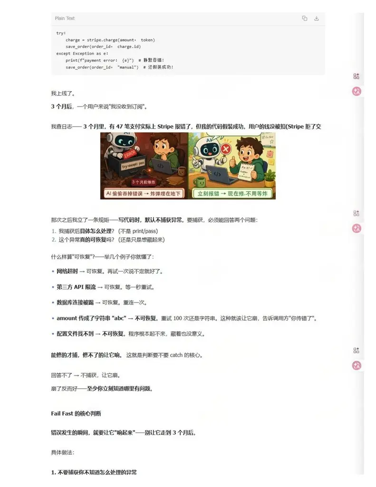

Plain Text

# 错: catch 一切，假装没事
try:

do_something()
except:

es

# 对: 不知道怎么处理，就让它报出来
do_something() # 报错就让它报

2. 在边界(boundary )处校验输入

Plain Text

# 锚: 函数里假装数据是对的
def calc_tax(amount):

return amount * 9.13 # 如果 amount 是

# 对: 边界处快速失败
def calc_tax(amount) :
if not isinstance(amount， (int， float
raise TypeError(f"amount must be nu
if amount < 9:
raise ValueError(framount cannot be
return amount * 8.13

None? 是字符串? 种默错!

))
mber， Bot 《type(amount)}")

negative: 【amount}j")

啥叫"边界"?-一你的代码和外部世界打交道的地方，就是边界。

想象一下车站进站。

安检处外是外面的世界，安检处内是车站。安检口就是边界。

乘客想进车站，工作人员总得查一查吧?
* 身份证是真的吗?
*。 有没有车票?

*。 有没有带危险品?

有问题?拦下，不让进。

写代码也一样。

你的程序 = 车站。

外面来的数据(用户填的表单、别人系统传来的
数据进你程序的那一刻，就是边界。

边界处干啥? 查一查-一
* 这数据格式对吗?

、从合库里读出来的)= 想进站的乘客。

钙

[ec

[c

+
6

* 该有的字段全吗?

*。 数字是不是数字、邮箱长得像不像邮箱?

有问题”当场报错，别让脏数据进去祸祸。

边界之外的世界你控制不了。所以数据进来之前，必须查一记一这就是"在边界处校验"。

3. 报错信息要具体，不要只 "error”

Plain Text                                                                                                              名

[ec

# 锚: 报错没信息量
raise Exception("error") # 和
raise Exception("something wrong") # 其

# 对: 报错告诉"喻错了 / 喻值导致的”

raise ValueError(f"Invalid email format: {emailir} (expected x@y.z)")

Fail Fast 的3 条具体做法

D maoerearesammm

AI 时代的 Fail Fast 反模式
AI 默认会大量加 try-except一这是 AI 写代码的一个特别明显的指纹。

为喻? 因为 AI 觉得"加保护 = 负责"。它会想:“加上 try-except，出错也不会亏，用户体验好。”
听起来有道理 错。

这是最危险的'防御性编程误解。

防御性编程一程序员加各种保护代码，防止程序崩溃的习惯。

本意是好的。

但加错位置，就从"防御"变成"藏雷:

* 图 加对了: 在边界处校验输入、对网络超时做重试、关键操作前确认状态 一 这是真防御。

* 兴 加错了: 把整个函数包在 try-except: pass 里，出错了假装没事 一 这不是防御，这是把炸弹埋在地下，等三个
月后炸你自己。

go
8

AT 经常加错误位置的 ty-except-一

* 把整个函数包在 try-except: pass 里(知掉所有错误)
*在数据库写入失败时，返回空对象假装成功

* 在 API 调用超时，默默重试 5 次然后假装成功

* 把异常 catch 后只 print(e)，日志都不写

这种错误地"防御性编程"一把异常委掉、假装没事，不是负责，是把炸弹埋在地下。

真正的防御性编程，应该是: 在边界处明确地校验、对可恢复的错误明确处理、对不可恢复的错误让它响起来。绝不
是 silent fail.

软件工程的一条核心原则-一
错误一定要旧光。唱光得越早、越响、越具体，越好.

出错的瞬间是修 bug 成本最低的时刻-刚才还在内存里，栈还在，日志还在，你脑子里还有上下文。

错误藏得越久，修起来成本越高一 藏几个月之后，日志清了、上下文和了、关联数据可能也变了，基本就找不回事故
现场了。

我开头讲的 Stripe 支付事故一一就是因为 AI 加了 try-except: pass，藏了 3 个月。那 47 笔错误，如果在第一笔出现
的瞬间就报警，我 5 分钟就能修好。

这就是 Fail Fast 的核心价值。

怎么治 AI的 Silent Failure?

在你的 SKILL.md / prompt 里加一句:

"遵循 Fail Fast 原则: 不要 catch 你不知道怎么处理的异常。在数据边界(API 输入、DB 输出)校验输入，出错立即
抛具体异常。报错信息要包含'是什么值导致的'。绝不允许 silent fail / try: … except: pass / 静默知错误。"

加这一段，AI 写的代码会变得'敢报错'一这才是健壮代码。

4 个心法的 「内功合一」: 怎么同时用
讲充 4 个心法，你可能根一"4 个我都听懂了，但怎么一起用? "
先进一下 4 个心法之间的关系一-不是 4 件独立的事，是互相拱配的。
* YAGNI 在前一-决定"写不写"。能不写的，直接砍。

*。KISS 在中一决定"怎么写"。要写，就写最简单的那种。

* 命名 员幸一决定"写出来读不读得懂"。每个变旦、函数都精确。

Do
B+

9

* Fail Fast 在后-一决定"出错时怎么办"。出错就喊，绝不藏。

按这个顺序读一人遍你就明白: 这是写每一段代码都会经过的 4 个判断点。
YAGNI 决定下不下笔。KISs 决定下笔的样子。命名决定字写得清不清楚。Fail Fast 决定写错时认不认。

讲充 4 个心法，你可能想一"4 个我都听懂了，但怎么一起用? ”

先讲一下 4 个心法之间的关系一不是 4 件独立的事，是互相搭配的。

。YAGNI 在前一-决定"写不写"。能不写的，直接砍。

*。KISS 在中一决定"怎么写"。要写，就写最简单的那种。

*。 命名 贯达一决定"写出来读不读得仪"。每个变量、函数都精确。                                              吕

”Fail Fast 在后-一决定"出错时怎么办"。出错就喊，绝不茂。

按这个顺序读一遍你就明白: 这是写每一段代码都会经过的 4 个判断点。
YAGNI 决定下不下笔。KISs 决定下笔的样子。命名决定字写得清不清楚。Fail Fast 决定写错时认不认。

- 能用 if-else 解决的，不要用 Strategy 模式
- 优先可读性，不优先"看起来专业”
- 5 行能写完的，不要用 56 行

衬 3。 命名是设计

- 变里名/团数名要精确说明它装的是什么/做什么

- 不要用 data / temp / helper / util / manager 这种通用名
- 函数名里不要用 do / process / handle 这种空动词

- 如果需要注释解释命名，先改名字

振 4。 Fail Fast(快速失败)

- 不要 catch 你不知道怎么处理的异常

- 在数据边界(API 输入、DB 输出)校验输入，出错立即抛具体异常
- 报锚信息要包含"是什么值导致的”

- 绝不允许 silent fail / try: ..。 except: pass

po
B+

把这一段塞进你 ~/.claude/CLAUDE.md 或者项目里的 SKILL.md，AI 写代码时会更可能遵循这些原则(仍需要你
review 把关)。

简单粗暴有效。

AI 时代: 4 个心法被系统性违反

最后总结一下一AI 默认会违反这 4 个心法。
为喻 答案非常残酷-一
因为 AI 是用全人类的代码训练出来的。而全人类写的代码里，真正稳定符合心法的，只是其中一部分。

GitHub 上随便点开一个项目，你会看到-一
* 大量为"未来扩展"造的抽象工厂(违反 YAGND

* 大量"看起来很专业"的设计模式堆释(违反 KISS)
* 大量 datatemphelper 的命名(违反命名)

。 大量 try: .… except: pass 的知错代码(违反 Fail Fast)

AI 学到的是这个平均水平一而平均水平，就是写得不咋地的水平。
所以你不能指望 AI 默认写"老程序员风格的好代码"一默认它就是新手水平。但好消息是: 只要你给它心法约束，它
的输出质量会显著提升。                                                                                    o
下面这张表对照一下-一
心法              AI 默认行为                                           对你的伤天
YAGNI     过度设计一一加抽象层、加配置项、加未 代码量大幅凡胀，但大部分永远用不上
。 大量"看起来很专业 的设计司式堆到(过 KISS)
*。 大量 datatemphelper 的命名(违反命名)

。 大旦 try: .…. except: pass 的知错代码(违反 Fail Fast)

AI 学到的是这个平均水平一 而平均水平，就是写得不咋地的水平。

所以你不能指望 AI 默认写"老程序员风格的好代码"一默认它就是新手水平。但好消息是: 只要你给它心法约束，它
的输出质量会显著提升.

下面这张表对照一下-一
心法            AI 默认行为                                     对你的伤害

YAGNI     过度设计一一加抽象层、加配置项、加未 代码量大幅幅胀，但大部分永远用不上

所以这 4 个反模式的 review 责任，主要在你身上。

一个组合幸的真实例子
我帮一个学员 review 过一段 AI 写的"用户注册"代码-全文约 80 行，4 条反和模式全占。
下面是关键节选(原文 80 行里最有代表性的核心结构):

Plain Text

句

[ce
@
ge

# AT 写的"用户注册"一粳粒版(节选自 88 行原文)
class UserRegistrationFactory:                 #+ 违反 YAGNI(过度抽象)
def _init (self， config: dict):
self,config = config
self.handlers = []

def register_handler(self， handler):
self.handlers.append(handler)

def process(self， data: dict):             #*+ 违反命名(data 是啥? )
try:                               #+ 违反 Fail Fast

for handler in self.handlers:         # + 违反 KISs(过度复杂)
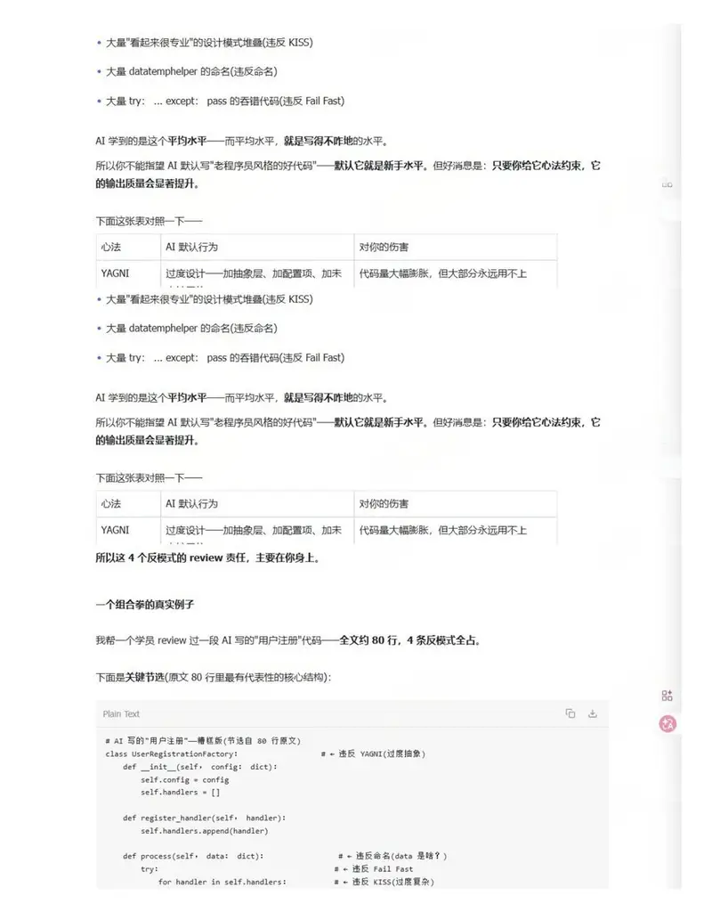

temp =- handler.handle(data)
if temp is not None:
data = temp
return {"result": datay
except:
return None # 知锚误!

(原文还有 4 个 handler 类、一个 Config Builder、一堆校验函数，加起来 80 行-一节选只展示核心反模式。)

我根 AL 说: "用 4 个心法重写: YAGNI / KISS / 命名 / Fail Fast。业务目标: 邮箱密码注册，校验、查重、写库、发欢

迎邮件。”

AI 改后-一核心逻辑 12 行，业务目标完全相同:

Plain Text

def register_user(email: str， password: str) -》User:
诈 not is_valid_email(email):
raise ValueError(f"Invalid email: {emailir}")
f len(password) < 8:
raise ValueError("Password too short")

if user_exists(email):
raise UserAlreadyExistsError(email)

user = create_user(email， hash_password(password))

send_welcome_email(user)
return user

80 行 一 12 行。 业务目标完全一样。
代码量大幅缩短，可读性显著提升一-一眼能读充整个流程。
这就是 4 个心法的威力。

而且注意-一AI 完全有能力直接写出 12 行的版本。它默认写 80 行，只是因为你没明确要求。
你只要说出来一"用 4 个心法重写"-一AI 大概率就能做到(改充仍要 review，但起点已经高很多)。

这是最爽的事一好代码，从'你自己写'变成了"你只需要让 AI 按规则写'。
但前提是你得知道规则。心法，就是规则。

看高手的案例: Remotion 官方 SKILL.md
80 行 一 12 行。业务目标完全一样。

代码量大幅缩短，可读性显著提升一眼能读充整个流程。
这就是 4 个心法的威力。

而且注意一一AI 完全有能力直接写出 12 行的版本。它默认写 80 行，只是因为你没明确要求。
你只要说出来一"用 4 个心法重写" -一AI 大概率就能做到(改完仍要 review，但起点已经高很多)。

这是最爽的事一 好代码，从'你自己写 变成了"你只需要让 AI 按规则写 '。

包

[c

口:
gb

但前提是你得知道规则。心法，就是规则。

看高手的案例: Remotion 官方 SKILL.md

刚才那段 30 行的 SKILL.md 模板，你看充会起-一
这 30 行能用吗? 真有团队这么干吗?

来看一个公开案例。

Remotion-一用 React 写视频的开源框架。Remotion 团队言方维护了一份 Agent Skills，专门告诉 Claude Code /

Codex / Cursor "在 Remotion 项目里，要遵守什么规矩"。                                                                           中
一条命令就能装:
Plain Text                                                                                                                                 品 出

npx skil1s add remotion-dev/skills

SKILL.md 的成长 1+ 34 结构

ma厅:1 和 a间四

四
辑       一
2
呈
你的 SKILL.md 现在是 30 行的一个文件。

Remotion 的 SKILLmd 是一个主入口 + 一个 rules 目录下 34 个子文件，从字幕到 FFmpeg、从转场到音频处
1二天,一个文件

你看到这个量级可能慌一一我得写 34 个文件?
不用。

主 SKILLmd 不塞所有规则。它只是个索引。每条规则只在自己的子文件里。AI 用到的时候才加载。

你一上来塞给它 1 万字规则，它前 5000 字读充就忘了。但你告诉它"遇到字幕，去看 subtitles.md"，它真要做字幕的
时候再去加载一-上下文用得最省。

这就是 Remotion 的第一个心法 一

心法 1: YAGNI 一 按需加载 + 明确"什么时候跳过”

Remotion 主 SKILLmd 里这种段落特别多一一

Plain Text                                                                                                                                                          驯

拓 Captions

When dealing with captions or subtitles，1oad the

[./Vrules/subtitles.md](./rules/subtitles.md) file.

衬 Using FFmpeg

For some video operations，such as trimming videos or detecting silence，

FFmpeg should be used. Load the [./rules/ffmpeg.md](./rules/ffmpeg.md) file.
翻译过来:

"你要做字幕吗?要的话，再去看 subtitles.md。不要现在看。”

"你要用 FFmpeg 吗? 要的话，再去看 fmpeg.md。不要现在看。”
这就是 YAGNI 的核心一现在不用的，现在不加载 。

按需加载. Index + lazy load
Cs和
八代em             国人
Ca             |国E
L JJ
|    mana
2

更狠的是，Remotion 连"可选操作"都明确写"什么时候跳过”

Plain Text                                                                                                                                 巴

兰 Optional: one-frame render check
You can render a single frame with the CLI to sanity-check layout，
colors，or timing.

Skip it for trivial edits，pure refactors，or when you already have
enough confidence from studio or prior renders.

翻译:

"你可以跑一帧泻染来检查一一但小改、纯重构、已经有把握的情况，直接跳过。"”

不要默认让 AT 每次都跑。能不跑就不跑。

对你的迁移

[ec

[ce

+
60

你的 SKILL.md 不用一开始就写所有项目规则。
先写主入口 + 4 心法就够。
* 遇到第 1 个具体坑 (比如某个 API 老出错) 一-加一个 rules/apip>oocmd 子文件，主入口加一行"遇到 X，去看

rules/api2oomd "。

* 坑捞到 5 个以上一一再开始像 Remotion 那样按主题分文件。

千万不要一上来就抄 Remotion 的 34 文件结构。
Remotion 之所以是 34 个，是因为他们真遇到了 34 个坑。你 1 个坑没遇到就拆 34 个文件 这本身就违反 YAGNI。

按节奏长。

心法 2: KISS 一 最小代码示例

Remotion 教 AI 怎么写淡入动画。整段示例

Plain Text

句
[ce

import { useCurrentFrame，Easing }from “remotion"3

export const FadeIn = () =>{
const frame = useCurrentFrame()3
const { fps } = usevideoConfig();

const opacity = interpolate(frame，[9，2 * fps]，[e,， 1]，{
extrapolateRight: “clamp"，
extrapolateLeft: "clamp"，
easing: Easing.bezier(9.16，1，9.3，1)，

7)

return 
Hello worldlc/divy3

了

后行。 一个import、一个 React 函数、一个 interpolate 调用、一个 div。

没有 AnimationFactory。没有 EasingStrategy。没有 FadeInBuilder。没有 AbstractAnimationProvider。

AL看这直接可改。改文实，改时间、改姓动函教一3 种钟术定、

const frame = useCurrentFrame();
const { fps }》 -= usevideoConfig();

const opacity = interpolate(frame，[6，2 * fps]，[6,，1]，{
extrapolateRight: “clamp"，
extrapolateLeft: "clamp"，
easing: Easing.bezier(8.16，1，9.3，1)，

5

return xdiv style=ff opacity }}>Hello worldlc/divy;
了

45 行。一个import、一个 React 函数、一个 interpolate 调用、一个 div。

Do
时

+
60
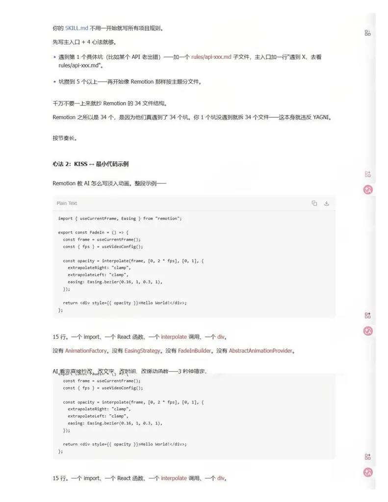

没有 AnimationFactory。没有 EasingStrategy。没有 FadeInBuilder。没有 AbstractAnimationProvider。

3 种钟术定-

保本这生生必攻坟和和卫和东
能去掉的全去掉。AI 看 5 行能抄的，比看 50 行解释强 10 倍。
心法 3: 命名 一 frontmatter 是触发开关

Remotion SKILLmd 的第一行是这个-一

Plain Text

name: remotion-best-practices
description: Best practices for Remotion - Video creation in React
metadata:tags; remotion，video，react，animation，composition

看着不起眼。但这是整个 skill 的生死线。
Claude Code / Cursor / Codex 在加载 skill 时，最先看的就是 description。

如果你写-一

Plain Text

description: 必 project rules

AT 永远不知道什么时候该用。它会跳过。
如果你写-一

Plain Text

description: Best practices for Remotion - Video creation in React

AT 在用户说"我要做视频"，或者文件里出现 React 视频组件时，立刻识别-一
"哦，这套规则我应该用。"
自动加载进上下文。

命名 = 触发条件。
这是 SKILLmd 这个场景里"命名是设计"的具体体现。

对你的迁移

你的 SKILLmd 第一行 fontmatter，必须精确说"这是给什么场景用的"。

铝

铝

[ec

[ec

+
[9

+
60

反例:

* 其 description: 项目规则 一 AI 不知道是啥项目，不会加载

*。 其 desaription: 一些通用代码规范 一一 "通用"等于"不知道什么时候用”

*。愉 description: 我的偏好   不可触发

正例                                                                                                                             人
*。图 description: Rules for our CRM API - enforces ]WT auth, audit log, snake_case naming
*。图 description: Frontend rules for our Next.js 14 app - app router only Tailwind only

* 图 description: Backend rules - uses Hono + Cloudflare Workers, no Express, no Node-only APIs

精确到项目特征。AI 读一眼就知道"这套规则该用在哪"。

心法 4: Fail Fast 一 FORBIDDEN

这一段是补丁里最重的。

Remotion SKILL.md 里有这两行-一

CSS transitions or animations are [ UEORBIDDEN  ]

Tailwind animation class names are [ UEORBIDODEN  ]

4

就这两行。没废话。

为什么这么硬?
因为 Remotion 是逐帧泻染视频一每秒 30 帧或 60 帧，每帧单独算一遍画面。Remotion 会一帧一帧地把每一帧画出
来，再拼成最终的 mp4。

但 CSs transition / Tailwind animation 依赖时间触发 "过 0.3 秒变成 50% 透明") 。在浏览器里看着挺正常，但
Remotion 演染流水线里一一时间这套机人制充全失效。

它只是在问: “第 !1 帧长什么样》 第 2 帧长什么样y.…… 每一帧都是一次独立的静态计算。CS5 transition 依赖的"时间
在走"这个前提不存在了，所以动画就不会被记录进视频。

后果是什么?

你跑 Remotion Studio 预览一一动画在动，挺好。
你点击导出 mp4-一视频里动画没了。
教科书级别的 silent fail。

AI 不知道这件事。AI 学的训练数据里全是普通 React，默认会写 transition: opacity 0.3s。你不告诉它 FORBIDDEN，

它就会写，写充还会说"已完成"，你导出才发现没动。

一熟悉吗?》跟我前面讲的 Stripe 支付事故一模一样。

于是 Remotion 团队用 1 行 FORBIDDEN 把这条路堵死。
不是写 "建议不要用 CS5 transition 。

不是写"考虑使用 interpolate 车代"。

是 FORBIDDEN，全大写，写两遍。

这就是 Fail Fast 的精散升级版一
不要等错误发生后修。

一熟悉吗?跟我前面讲的 Stripe 支付事故一模一样。

于是 Remotion 团队用 1 行 FORBIDDEN 把这条路堵死。
不是写 "建议不要用 CSs transition 。

不是写"考虑使用 interpolate 蔡代"。

是 FORBIDDEN，全大写，写两遍。

这就是 Fail Fast 的精散升级版一
错误发生前就堵死。
不要等错误发生后修。

1. 我项目里有没有类似情况?
2. 我每次 review 时常吼的话有哪些?
3. 这些吼出来的事，写成 FORBIDDEN 是不是更省事?

用我这套结构 (5 类分组) 和判断标准，写你自己的清单。

我把它按 5 类组织

人 我自己项目的 FORBIDDEN - 仅作样本

人 [全囊/ 环境类]
。 禁止用 npm install。统一用 pnpm。

*。 禁止用 require()。统一 ESM import。

*。 禁止用 axios。统一用原生 fetch 或 ofetch一一bundle 已经过大。

。茜止用 moment.js。改 date-fns 或原生 Intl。

* 禁止用 jQuery。React 项目里不要再出现 $ #xoot)。

【AI 应用 / LLM 类】 一 做 AI 产品的核心场景

* 禁止把 OPENAL APIL_KEY / ANTHROPIC_API_KEY 写在前端代码里一一必须走后端代理。

。 禁止用 OpenAI I昌版 chat.completions。统一用 AI SDK v6。

禁止 stream 响应时用 await response .text()一一会丢失流式特性。

禁止把 prompt 硬编码在组件里。统一放 prompts/ 目录，版本化管理。

* 禁止生成"假成功"的铬许数据。LLM 出错就报错，不要返回 mock 数据糊弄。

【Next.js 类]

。 禁止用 pages/ router。统一 app/ router一项目已迁移充成，不允许回退。

* 禁止在 'use djient 组件里直接 fetch 数据库。必须走 server component 或 server action。
。 人茜止用 useEffect 做数据加载。统一 server component 或 SWR。

【代码风格 / AI 协作流程类]
* 禁止生成超过 200 行的单文件。超过就拆。

茶止留 // TODO 注释。该做就做，不做就不留位。

禁止 ty {… } catch (e) { console.log(e) }。要么不 catch，要么写明具体处理。
* 禁止改 package.json / .enyv 不告诉用户。引入新依赖、改环境变量必须确认。

。茜止 commit 不带语义化 message。每个 commit 必须能看懂"为啥改"。

[数据 / 安全类]
* 禁止 DELETE 不带 WHERE。必须用软删除。

* 禁止用户密码明文存数据库。bcrypt 或 argon2。
。 禁止前端展示完整 token / API key。

你扫完这份清单会发现一一这些全都是你项目里真实存在的"AI 默认会走错 的路。

不写进 SKILLmd，你就要在每次 code review 时手动喊一次:
"别这么写! 这里不能用 axios! 我们项目用 pnpm! "
每次都喊，每次都累。

+
60

oo
8

写进 SKILLmd，喊一次就够一一AI 以后自己知道躲。
判断要不要写 FORBIDDEN 的 3 个问题

不是所有规则都要 FORBIDDEN。判断标准-一
FORBIDDEN 准入测试

1 AI 默认会走这条路吗? (是 一 候选)

2. 走了之后会 silent fail / 难修 / 损失大吗? 《是 一 必写)
3. 你已经在 review 时吼过 2 次以上吗? (是 一 立刻写)

三个问题全 yes，就 FORBIDDEN。

只 yes 一两个的一写成"推荐"或"建议"，别上 FORBIDDEN。FORBIDDEN 用小了就失效。

4心法 x Remotion 总览

4个原则 应用到 SKILLmd 怎么写

你的 SKILL.md 怎么从 30 行长大
讲充 4 心法在 SKILL.md 里的应用。现在给你一份成长路径。

SKILL.md Growth Path
目        =      [局       =         昌
[站             一 目目鲜
Stage1. Now         Stage 2 . First pain         Stage 3 . Scale

readwvctAupe md

Grow on demand . Do not prebuid

阶段 1: 现在一一工个文件，30行
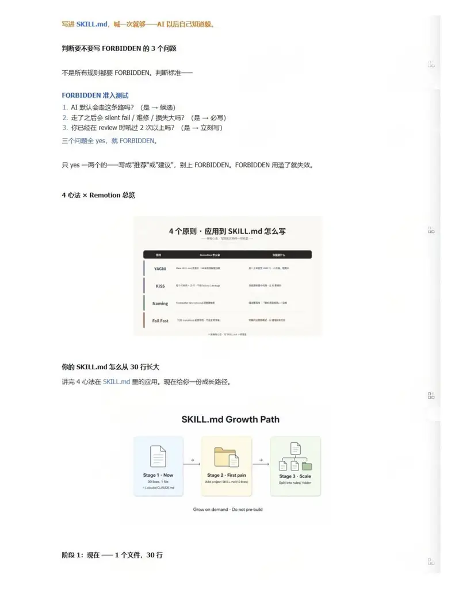

复制原节给的 4 心法模板，丢进 ~/.claude/CLAUDE.md。                                                                                   仿
这是全局规则。所有项目共享。

阶段 2: 遇到第 工个项目特定的坑 一 加项目级 SKILLmd

举例: 你做一个 Next,js 项目，发现 AI 老把 pages/ router 混进来。

在项目根目录建 SKILLmd--一

Plain Text

口
[ec

name: my-nextjs-app-rules

Do
By

description: Frontend rules for our Next.js 14 app - app router only
---# FORBIDDEN

- 禁止用 pages/ router。统一 app/ router

- 禁止 useEffect 做数据加载。

衬 数据加载

- 服务端数据用 server component 或 server action
- 客户应数据用 SR

10行+一个FORBIDDEN。够了。

阶段 3: 坑插到 5 个以上 一 开始拆 rules/

你发现项目里"AI 默认会走错"的路越来越多一一不只是 router，还有数据加载、样式、API、错误处理、auth、
payment.…

这时候才开始拆一主 SKILL.md 改成索引-一

Plain Text

幸 数据加载
遇到数据获取/组存,加载 rules/data.md

衬 样式
遇到 Tailwind 类名/响应式设计,加载 rules/styling.md

这一步通常发生在你 SKILLmd 长到 200 行以上。
记住-一Remotion 是因为有了 34 个真实坑，才有 34 个文件。
你 1 个坑都没遇到就拆 34 个文件 一违反 YAGNI。

按节奏长。

你给 AT 写规则的方式，决定 AI 能不能读伐规则

看充 Remotion 你应该明白一件事一一

SKTIT-md 时绘 AT 看的说明其”相说明共本自了要满守心法

这就是 4 心法反过来用的意义一一
不只是规范 AI 写的代码，也规范你写给 AI 的话。
你给 AI 写规则的方式，决定 AI 能不能读懂规则。

工具会变，知识会过时一一心法永恒。
写 SKILLmd 的心法，也永恒。

工具会变，心法永恒

学充这一节你应该明白: 问题不是 AI 的能力，是 AI 没有心法。

AI 不知道什么是"过度设计"，所以它会造 ExportFactory。
AI 不知道什么是"简单"，所以它会写 13 层庶套。

AI 不知道什么是"好名字"，所以它会起 dataldata2。

AI 不知道什么是"早失败"，所以它会 ty-except: pass。

而心法，你必须自己有一AI 不会自己长出来，但你可以教它。
教法，就是这一节的 4 段 SKILLmd 模板。

最关键的一句话，送给你-一

AI 时代，代码绝大部分是 AI 写的。你只负责一小部分。
但你负责的那一小部分，决定 AI 那一大部分的质量。
子元必一他伯风才明口: 风征个赴 Al 的醋几，证 AL 议月心法。

人不知道什么是"过度设计"，所以它会造 xportractory。
人 不知道什么是"简单"，所以它会写 13 层峙套。

AI 不知道什么是"好名字"，所以它会起 dataldata2。

AI 不知道什么是"早失败"，所以它会 ty-except: pass。

而心法，你必须自己有一AI 不会自己长出来，但你可以教它。
教法，就是这一节的 4 段 SKILL.md 模板。

最关键的一句话，送给你-一

AI 时代，代码绝大部分是 AI 写的。你只负责一小部分。

但你负责的那一小部分，决定 AI 那一大部分的质量。
这一节是判断力层。

代码乱(违反结构) + 没判断(违反心法) + 没测试 = AI 翻车几乎是必然。
代码净 + 有判断 + 有测试 = AI 才能真的帮你产出好东西。

工具会变，知识会过时，心法永恒。

你写代码的判断力，决定 AI 帮你的天花板。

Do
B+

把 4 个心法刻在脑子里。这是最值得花时间的 4 个内功。
工具我可以教你换，知识我可以教你补-一 心法，只能你自己练。
但好消息是一你今天看完这一节，已经开始练了。陡。

这一节是判断力层。
代码乱(违反结构) + 没判断(违反心法) + 没测试 = AI 翻车几乎是必然。
代码净 + 有判断 + 有测试 = AI 才能真的帮你产出好东西。

工具会变，知识会过时，心法永恒。
你写代码的判断力，决定 AI 帮你的天花板。

把 4 个心法刻在脑子里。这是最值得花时间的 4 个内功。
工具我可以教你措，知识我可以教你补-一 心法，只能你自己练。
但好消息是一一你今天看完这一节，已经开始练了。陡。

作业
挑你手头一个 AI 写的代码，做这 5 件事一

1. 4 心法自检
打开任意一段 AI 写的代码，逐条问-一
中任何一条 = 你手头的 AI 代码已经在埋雷。

2. 让 AI 用 4 心法重写
挑你最不舒服的那一段(超过 50 行的、看不懂的、变量名烂的)，跟 AI 说:

Bo
Bf+

"用 4 个心法重写这段代码: YAGNI / KISS / 命名 / Fail Fast。先告诉我重写思路，我 review 后你再实际改。"
注意: 让 AI 先给思路，你 review 后再改。
3. 把 4 心法塞进 SKILL md
复制 SKILL.md 模板，粘到你的 ~/.daude/CLAUDE.md 或者项目根目录的 SKILLmd。
下次跟 AL 说话时，这 4 条心法会作为基础约束被引入一一AI 更可能按这些规则写。
4. 跟 AI 说"重命名"
挑你项目里最大的一个文件，跟 AL 说:

"扫描这个文件里所有变量名/函数名/类名。如果名字不够精确(比如 data / temp / helper / 通用动词 process /
handle)，给我一份重命名建议清单。"”

oo
8

看 A 给你列出多少 suggestion一这是你之前没看到的债。

5. 找一个 Silent Fail

跑这个命令:

Plain Text

句
[ce

# 粗季:找你项目里可能 silent fail 的地方
# (注意这是粗条,可能误判,后面要人眼/AI review)
grep -rn “except.*:”你的项目 | grep -v “raise\|logger\|print”

# 更精确(用 ripgrep,跨行匹配 except: pass / return None) :
rg -n -U "except[^\n]*:\n\vs*(pass|return None)”你的项目

也让 AI 帮你扫-一 "找出我项目里所有静默知错误的地方”                                                                                         +

每一个 silent fail 都是埋下的炸弹。今天修一个，明天少一次事故。

下一节，我们讲单元测试'让 AI 写完，自动检查一一心法决定写得对不对，测试决定它会不会改坏。两节配合，AI 翻
车的可能就被压到最低。

改完。第二次跑一还是白屏。

它说: "这次是邮件服务的问题。"

改充。第三次-一又白屏。

最后我自己一行一行检查，发现-一
它从一开始根本没把发邮件那段代码写完。但它的每次"完成"，都是信斩旦旦的。

DD
87

类似的场景你肯定遇到j
你跟 AI 说"给我加个折扣计算功能: 满 100 减 20"。

它写充说"完成 。

你测一下 150 一 减 20，对了。

一周后用户反馈: "我订单 99 块怎么也减了 20? "一你查代码，AI 把"满 100"写成了if (amount >= 99)，它自己改
了边界。

或者你跟它说"做注册功能"。它告诉你"完成"。
几天后用户反馈"我注册没用 @ 也成功了"你查数据库，AI 写的注册辑根本没校验邮箱格式。

每次都是这种状况。AI 说"完成"，你打开发现没真完成。

我去年跟一个做开源工具的团队聊过，他们公开了一个数字 一

2025 年 12 月 CodeRabbit 分析了 470 个开源 GitHub PR: AI 协作写的代码，包含的重大问题 (major issues) 大约
是人写的 1.7 倍。逐辑错误、控制流出错、配置错误 (多 75%) 、安全漏洞 (多 174%) 。

1.7 售。

不是 AI 签。AI 现在很聪明。问题在一它写完了不验，就敢说"完成"。
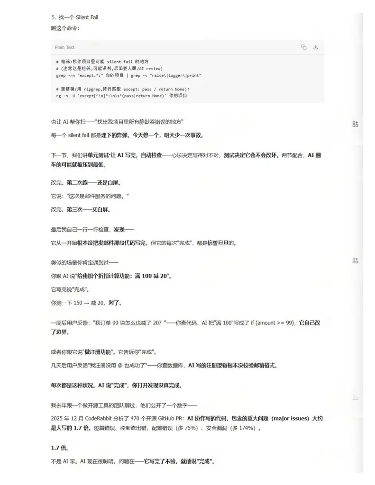

这一节，我教你装一个让 AI 写完之后自己自动验收的机制。
它叫单元测试。

在我正式开始教你"单元测试 之前一
你其实早就在做单元测试了，你只是不知道它叫这个名字。

往回翻翻你前面学的课程一一

* 我让你用 Postman 调一个 API: 填 body，点 Send，看j运回值对不对。
* 我让你给 AI 写 Skill / SOP，里头有一条叫"什么算合格交付"。

* 我让你用 SPEC 把"做完了的标准"写得清清楚楚。

这些动作，每一个，都是单元测试的"雏形"。
是 TDD 的"雏形"。

我给你拉一张对照表 -一

我给你拉一张对照表一
你做过的事                   这其实就是单测 / TDD 的什么

用 Postman 调 API: 填 。 单测核心动作的手动版一-给输入 一 看输出 一 比对
body、看返回、跟预期比
对

在API playground 网页里”手动单测，只是没把它写成代码
反复试

写 SPEC: 写清"AI 做出什 TDD 最值钱的那一步一 先把契约写下来
么算完成

写 Skill / SOP: 定义"什么“”跟 TDD"先写完成定义，再写代码"完全等价
算合格交付”

实战体系里的"双轨验收” TDD 的"先红 一 再绿"一一AI 跑通你列的清单才算完

SPEC 进阶                   你早就隐约在用 test-driven 思路了，这一节把它讲透

所以这一节不是教你一个全新的东西。
是把你已经在干的事一一升级成自动化、可重复、AI 自己跑的版本。
句号。

什么是单元测试? 什么是 TDD?

到这里很多学员已经异了__v排，这两个词是哈?                                                       点
放心，这_世我从夫讲透。你没代码基础也能看仅。                                                                              人@@

测试和单元测试
什么是测试?

你买了一台空调，师傅装完之后会做什么?

他会试着开冷气、开热气、看遥控器灵不灵。

这就是测试一不靠"师傅说他装好了"，靠"实际试一下确认装好了"。
代码也一样。写完代码，不能靠"程序员说写好了"，得跑一遍试试。

什么是单元测试?

单元测试 = 每个零件单独测试。
继续空调那个例子。师傅会单独测压缩机、单独测温控器、单独测腺控器一不是装好整套之后才测。

写代码也一样。

一个 app 里有"登录功能`、"支付功能`、"个人中心"一你不能等整个 app 写完才一次性测，得为每个功能单独写一段
测试代码。

这种"测一个零件"的代码，就叫单元测试 (unit test) 。

单元测试代码通常长这样:

1 假设有一个函数叫"折扣计算器”
. 我喂它输入 150

. 我期待它返回 20

. 实际跑一下,看返回的是不是 20
. 不是一 报错/ 是 一 通过

Do
8

wm mw

就这样。它是一段"试用代码”一给真实代码喂输入、看输出对不对。

用 Postman 调 API-一填一个 body，点 Send，看返回的 ]SON 对不对。
你当时一边点一边在心里念: "输入这个，出那个。”
那就是一次手动的单元测试。

单元测试做的事，只比你那次 Postman 多一步-一
把"点 Send + 对比返回值"这套动作，写成代码，让它每次改完代码自动跑一这。
仅此而已。                                                                                                                       咒

TDD是喻?

TDD 全称 Test-Driven Development，中文叫"测试驱动开发"。

核心动作: 写代码之前，先写测试。

听上去有点反人类-一你都不知道代码长啥样，怎么先写测试?
这就是 TDD 的精信一一先想清楚"什么算做完了"，再去做。

就好比你装修房子，先确定"我希望客厅装完是什么样"，再开始施工。
如果你"先施工再想要什么样"，大概率装出来不喜欢，回炉重做。

TDD 的"先写测试"，本质是先把"做完了的标准"写下来。

TDD 的"红一绿一重构"三步循环

TDD 工程师的口头禅是 "红 一 绿 一 重构”(red-green-refacton) 。
我用一张图给你看

TDD 三步循环
01                 02                 03
人                 CD                CD
Red红             Green生          Refactor 重构
te       名       Ca       赐      1
|           [7        | "一“er
人               人               全一

*重 红: 先写测试，跑一下一失败 〈因为代码还没写，跑测试当然失败)

*鲜 矢: 写代码-一让测试通过(最少代码量，能 pass 就行)

* 加 重构: 在测试还能 pass 的前提下，把代码写得更污亮(重构后再跑一次测试，看还 pass)

每写一个新功能，都走这三步。永远先红、再绿、再美化。

为哈要"先红"再"绿"?

因为先红这一步证明: 你写的测试真的在测那个功能 (如果不写代码就直接绿，可能你的测试压根没在测) 。

一旦测试通过，你就有了"自动化保单

TDD 跑充之后，你的代码库里会积累出一套测试。

以后每次改代码，跑一下整套测试一

* 如果还 pass: 说明在现有测试覆盖范围内，和暂时没发现回归。

+
60

* 如果有 fail: 说明你改坏了某处，立即修。

这就是测试的最大价值一让你以后改代码不慌。

前面的课程我提到了 superpowers 的 testdriven-development skill，但只有一句话。

如果当时你蒙了一这一节就是给你彻底讲透。

单元测试在 AI 时代为啥" 突然复活"了?

TDD 这个概念其实不是新东西。

2002 年 Kent Beck 出版了《Test Driven Development: By Example》 (版权页常见 2003) 。这本书把 TDD 系统化讲
了一遍。这套方法在欧美工程回火过一段，但 2010 年之后逐渐冷下来 一很多团队不再坚持 TDD。

为哈? 因为-一
* 写测试很慢。功能 1 小时写完，测试可能也要 1 小时
* 程序员没耐心。先红再绿，这套循环要忍，不少人嫌烦

* 团队push 进度。"先发布，测试以后补"一结果以后从没补过

所以"TDD 是好东西，但成本高"这是 2010-2024 年图内共识。

但是-一
2026 年，TDD 在 AI 编程国突然复活了。
因为写测试这件事的"贵"和"慢"，AI 都解决了。

具体来说一一
传统 TDD (2010 年代)
谁写测试                                             你自己手写
写测试速度                       工小时
跑测试堆触发                        你手动跑
失败了谁 debug                   你自己 debug
但是一一

2026 年， TDD 在 AI 编程圈突然复活了。
因为写测试这件事的"贵<和"慢"，AI 都解决了。

具体来说一一
传统 TDD (2010 年代)

ER                  徊户刁节它

AI时代 TDD (2026)
和 给你写

1 分钟

hook 自动跑

AI 自己 debug

A时代TDD (2026)

AT 从向安

6o

及一xiav                  mL一                   mao

写测试速度                      1小时                              1分钟
跑测试堆触发                     你手动跑                             hook 自动跑
失败了谁 debug                     你自己 debug                            AI 自己 debug

TDD "贵和慢"的成本，AI 能显著降低一一
但你仍然要 review 测试是否真的覆盖了正确行为，复杂业务尤其如此。
剩下的好处呢?

你的代码有了一份永远在线的"自动化保单"。
这就是 superpowers / Anthropic 这套 AI 编程框架，为只都把 TDD 列为核心 skill 的根因。

海外圈 2026 年最新共识: vibe coding 一 agentic engineering

这件事在海外图，已经有了正式名字.。

2026 年 2 月，Andrej Karpathy (OpenAI 联合创始人、特斯拉前 AI 总监，"vibe coding 这个词就是他 2025 年 2 月发
了明的) 发了一个新闻来取代 vibe coding一

"Agentic Engineering "一一专业开发者用 LLM agent 写代码，但带更多监督和审查。

简单说，vibe coding 时代结束了。新阶段叫 agentic engineering一一你下是用手下管，你是带着监督让 AI 干活。

而监督和审查的核心机制，就是单元测试。

Anthropic 自己 2026 年发了一份《Agentic Coding 趋势报告》，里头有两个数字很关键一

现实                                                       数字
开发者用 AI 占工作时间的比例                   609%
能完全委派给 AI 不管的任务                        0-20%

也就是一AI 干 60% 的活，你监督其中 80-100%。
监督的方式是啥? 单元测试自动跑 + 你看测试结果 + 出错你介入。
业界共识(Simon Willison + Karpathy + Anthropic 一致):

AI 写代码不是当用手掌柜，而是 "supervised software development with a faster production layer and a
种带监督的软件开发模式一产线层更快了，管控层却更严了

much stricter control layer

单元测试就是那个"管控层"。

"好单元测试”vs "垃圾单元测试": 测行为，不测实现
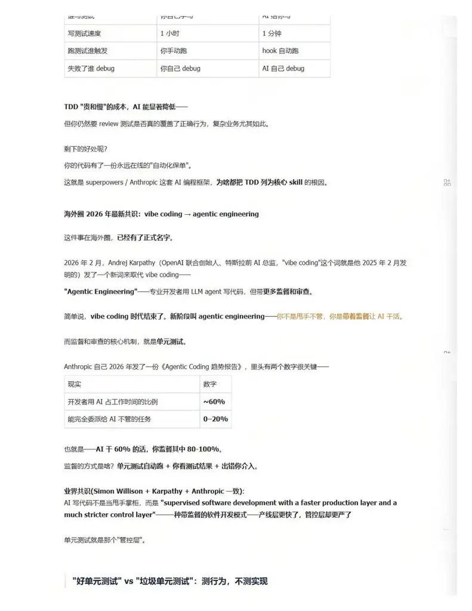

讲到这里你可能想一"我懂了，我马上让 AI 写一堆测试。"
等等。

写测试不等于写好测试。AT 轩认产出的，很多是垃圾测试。
我用 张图说清楚

好单测 vs 垃圾单测

elif amount >=- 196:
return 29
else:
return 8

垃圾测试 长这样-一

Plain Text

import inspect # 故意展示反模式,实际项目千万别这么测
def test_calculate_discount_uses_elif():
# 检查代码里     分支是 elif

source = inspect.getsource(calculate_discount)

assert "elif”in source

它在测代码长哈样一-是不是用了 elif、是不是有几行、变量叫啥名。

钙

这种测试一旦你改代码 (哪怕功能没变) ，它马上就 人ai一比如把 elif 改成 儿，功能完全一样，测试却 fail 了。

垃圾测试是负担，不是保单.

好单元测试: 测"行为/契约”

好测试 长这样-一

Plain Text

def test_satisfies_amount_198_returns_discount_29():
assert calculate_discount(199) -= 29

def test_amount_268_returns_discount_58():
assert calculate_discount(298) == 59

def test_amount_99_returns_discount_9():

assert calculate_discount(99) == 9

句

[cr

[ec

本

oo
8

它只测: 给输入 X，应该返回 Y。

不管你内部用 elif 还是外、用 dict 还是 switch，只要输入输出关系对，测试就 pass。

这种测试，你可以放心重构代码一一只要测试还 pass，就证明行为没变。

好测试 = 行为契约 = 真正的保单。

好单元测试测的是"代码该做什么"，垃圾单元测试测的是"代码怎么做的"。
让 AI 写测试时，显式告诉它: "只测行为，不测实现细节。”
这一句加进去，AI 写出来的测试质量提升一档。

AI 写测试的反模式: 警惕"测试剧本”

接下来讲一个AI 时代 TDD 最阴险的陷阱。

一个常见风险是一同一个 AI 同时写测试和实现时，测试可能会贴着实现细节写，而不是贴着 SPEC 写。

简单来说，就是 AI 在同一个对话里又写测试又写代码，最后写出来的测试，可能

实现下 pass，换个实现就报错。

这个我管它叫 "测试剧本"陷阱。

你跟 AI 说:“做个折扣计算器，顺便给我写测试。"

AI 干了啥 (在它脑子里同时进行) :

1. 想了一下: “我打算写个秆elif 链”

2. 然后写测试:“"那我测试 amount=100 一 20”
3. 然后写代码: ifamount >= 100: return 20

测试 pass。

但你打开看-这个测试只覆盖了 AI 想到的路径。
边界值 (99、100、101、200、201) 有没有测? 没有。
非数字输入 (null、字符吝) 有没有测? 没有。

负数输入会怎样?没有人想过。

AI 写的测试，只在它"自己脑补的实现"下 pass。换一个实现，可能立马挂。

怎么避免"测试剧本”

行业里现在的标准答案是一 两个 AI 分开。

Al 写测试: 反模式 vs 正模式

只在那个特定

go
8

*。AI A ("测试 AT") : 只看 SPEC，写测试。它不知道实现长啥样。

品
oo

* AI B ("实现 AT ) : 只看测试 + SPEC，写代码。它必须满足测试，但不能改测试。

换个角度看，可以把它当作考试出题;

* 原来的陷阱相当于 「同一个学生先写答案，再倒着出题」 一一题目当然 100% 匹配答案，但这套题根本不能检验他
会不会解别的题。

* 新做法相当于 「出题老师 (测试 AD 只看考纲 (SPEC) 出题，学生 (实现 AT) 拿到题去解」 一一出题人不知道学
生会怎么解，学生也不能改题。这时候"答案匹配题目"就不是作弊，而是学生真的做对了。

这正是 superpowers 的 subagent-driven-development skill 在干的事一一

派独立的 subagent 写测试，再派另一个独立的 subagent 写实现，独立上下文，互不知道对方脑子里的细节。

这种隔高，让"测试剧本"陷阱被治住了。测试是按 SPEC 写的，实现是按测试写的一测试不会偏向实现。

实操建议 (哪怕你不用 superpowers)

如果你手动用 Claude / GPT 写代码，记住这个技巧-一

工. 第一轮对话: 只让 AI 写测试。

"根据这个 SPEC，写一组单元测试。先不要写实现代码。 包括边界值、异常输入、正常路径。"
2. 看一遍测试: 你自己 review 测试是否覆盖周全。

3. 第二轮对话 (开新对话! ) : 把测试和 SPEC 喂进去，让 AT 写实现。

"这是 SPEC，这是测试。让所有测试通过的最小实现是什么? "

两轮对话隔开，AI 的"测试-实现互相污染"问题就没了。

DD
By+

测试金字塔: 在 AI 时代怎么分配

到这里你可能起-一"那我所有功能都写单元测试不就完了? ”
不行。 单元测试只测一个零件。

如果零件全 OK，但装到一起出问题，单元测试查不出来。

因为单元测试只验证"每个零件单独工作时是对的"，但软件出错往往不发生在零件内部，而发生在零件之间的交互、协
作、时序、数据格式、环境依赖这些"接颖处"一

这些地方单元测试天然看不到，所以会出现"每个零件都过了，组装起来却户了"的现象。

业界经典模型叫 "测试金字塔”(test pyramid) ，由 Mike Cohn 早年提出，并在 2009 年《Succeeding with Agile》中

系统介绍一一

.测试金字增

rn

全

[人

AS
层       名字                  测什么                 占比 (经验起     速度

点)

底部     单元测试 (unit)         单个函数/类            70%          快 (毫秒级)
中间    集成测试 (integration)     几个零件配合 (API + DB) ”20%          中 (秒级)
顶部     端到端测试 (e2e)        整个流程 (从浏览器点到    10%          慢 (分钟级)

DB)

70/20/10 是经验起点，不是行业硬规定。Google Testing Blog 原文也明确说 "exact mix will be different for each
team'一一重点是保持金字塔形状，不是死守比例。

AI 时代的具体分配建议

我自己跑下来的经验-一

单元测试 70% : 让 AI 全自动跑，每次改代码自动跑全套。这是你的"日常保单"。

集成测试 20% : 测 API 跟数据库的配合、测前端跟后端的配合。AI 也会写，但你要 review。

端到端测试 10% : 测整个用户流程 "打开网页 一 注册 一 登录 一 完成购买") 。这层用 Playwright / Puppeteer 跑
浏览器。AI 写得起，但别太多一慢、胸。

核心是"金字塔"形状一底部多、项部少。

新手最容易翻车的反模式叫 Testing Ice Cream Cone (测试冰浓淋甜简) 一一单元少、e2e 多。结果 e2e 跑一次5
分钟，每次 commit 都要等半天。别这么干。

jb

Bo
8

让 AI 自己跑测试: hook + verification 实战

讲了这么多概念，我们看一个真正的工作流

AI 写完代码，自己跑测试，自己修，跑通才说"完成"。

这个工作流靠两个工具-一
1. Hook: Claude Code 的"事件钧子"一一文件改完自动跑命令
2. verification-before-completion skill (来自 superpowers) : 声称"完成"前必须跑验证

Hook 配置: 写完文件自动跑测试

Hook 是 Claude Code 内置的事件机制。在你 ~/.daude/settings.json 里让 AI 加一段-一

Plain Text

"hooks": {

"postTooluse": [{
matcher”       dit|write"，
"hooks

{
type": “command"，
“command": “\"SCLAUDE_PROJIECT_DIRN"/ .claude/hooks/run-tests.sh”
刀
娘

了

这段配置的本质就一件事: 告诉 Claude Code-一"以后只要 AI 一改文件，你就自动去跑那个 shell 脚本"。它不包含任

何测试逻辑，纯粹是"事件触发器"。

然后在项目里加一个 .daude/hooks/run-tests.sh 脚本，同样直接让 AI 加就行-一

Plain Text

#!/usr/bin/env bash
cd “SCLAUDE_PROJECT_DIR”|| exit 1

# 跑测试。如果失败,exit 2 让 Claude code 把失败信息以 additionalContext 形式推回 AT
pnpm test

status=g?

放[ gstatus -ne 9 ]; then
echo "其 测试失败,claude 你需要先修这个再 claim 完成。”>&2
exit 2

入

钙

[ec

句
[e

这串代码完成的任务是: 接到 hook 传来的信号 一 通过 pnpm test 去调用真正的测试 一 拿到测试结果后再决定怎么

把信号回传给 AI。它本身一行测试都没写，就是个传话+判断的工具人。

oo
8

Bo
8
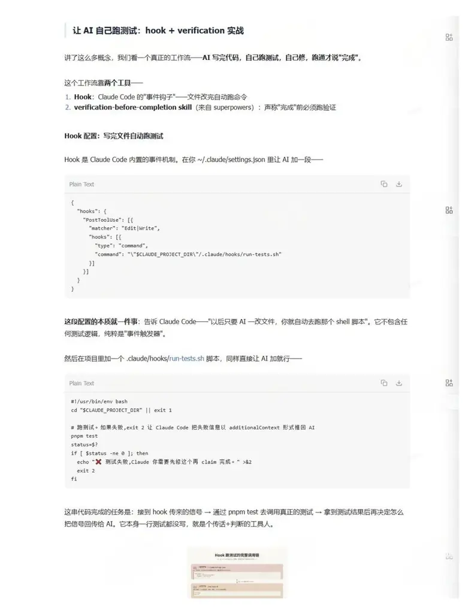

为啥不直接写一行 pnpm test 2>&l | tail -20?
先解释一下，这里说的管道 (pipeline) 就是那根坚线 。它的作用是: 把左边命令的输出，喂给右边命令当输入。

退出码 (exit code) 是命令的"成绩单"，每条命令跑完都会返回个整数退出码，规则全 Unix 世界统一:
-0=成功

* 非 0 = 失败(不同的非 0 数字代表不同失败原因)

比如 pnpm test-一
* 测试全过 一 返回 0
*。 有测试挂了 一 返回 (或别的非 0)

而 hook 机制的核心就是"看退出码 一一Claude Code 看到脚本 exit 0 就以为"一切 OK"，看到 exit 2 才知道"出大事了
快回去看"。退出码就是"红绿灯信号".

但这里有一个很坑的默认规则: 整条管道的退出码 = 最后一条命令的退出码

当你写 命令A | 命令B，shell 球认会把 B 的退出码当成整条管道的退出码，A 的退出码会被完全无视。

结果就是: 测试明明红了，但 shell 报告"我成功执行完了"，Claude Code 收到 exit 0 一 以为一切正常 一 让 AI 继续往
下干 一 AI 顺利"完成"任务 一 但代码其实是坏的。

比如 pnpm test-一

* 测试全过一 返回0

* 有测试挂了 一 返回 夺(或别的非 0)

而 hook 机制的核心就是"看退出码"一Claude Code 看到脚本 exit 0 就以为"一切 OK"，看到 exit 2 才知道"出大事了
快回去看"。退出码就是"红绿灯信号"。

但这里有一个很坑的球认规则: 整条管道的退出码 = 最后一条命令的退出码
当你写 命令A | 命令B，shell 于认会把 B 的退出码当成整条管道的退出码，A 的退出码会被完全无视。

结果就是: 测试明明红了，但 shell 报告"我成功执行完了"，Claude Code 收到 exit 0 一 以为一切正常 一 让 AI 继续往
下二 一 A 顺利"完成"任务 一 但代码其实是坏的。
Al 编程的闭环

oo

机器着你，你也困着自己一-A) 编程才闭得上环，

eck 昌二光一下人下，才

设置完之后，你跟 AI 说"加个折扣计算"，会发生这种事一

Plain Text                                                                                                              中 出

AT 写代码 * 写完触发 PostTooluse * 跑 .claude/hooks/run-tests.sh
、 脚本里跑 pnpm test 。 fail 。exit 2
* Claude 收到 stderr 反馈,看到测试 fail
* MI 自己修
+ 改完再勉发 hook * 跑出试 pass * exit 9
+ 代 才说"完成

这个流程在海外图有个正式名字，叫 self-correction loop “〈自纠错循环) 一一

Do
8

2026 年 Claude Code 工作流的标准描述:

1. Agent 生成代码 (比如 auth middleware)
2. 跑现有测试套件 一 3 个 fail
3. 分析失败 logs

4. 修实现

5. 重跑测试 一 all pass

6. 把最终 dif 给你 review

这种 self-correction 能力，就是 2026 agent 跟 2024 工具的核心区别。

整个过程你没干啥。hook 在蔡你"叫停 AT"一一但前提是你用脚本 + 正确 exit code，不能偷微一行命令。

verification-before-completion 加 buff

光有 hook 不够。AI 有时候会绕过 hook一比如直接说"我没改文件，我只是在 review，所以不用跑测试"。

这时候就是 superpowers 的 verification-before-completion 顶上来了-一

它强制 AI 在每次说 完成"之前-一
"先决定:什么命令能证明你真的完成了? 然后跑那个命令。”
AT 要列出验证清单 一 逐条跑 一 都 pass 才能说完成。

Hook 是机器关守，verification 是 AI 自己的纪律。两个一起，AI 就基本"噬硬"不起来了。

实操: 测试一个登录功能怎么写

浊了党各各”我们委个直在机“任乞， 给一个 can 加于Ths

VD 和As，oID站开二人Fa 站:HT -evwv nzmuaco                                          世

兄
Step 1: 写测试 〈先于代码)
前面讲元了概念，我带你把整套流程在一个真实项目里跑一遍。
目标: 给登录接口加一份单元测试，并让 AI 写完代码自己自动验收。
小心: 这种测试如果真的连接 Redis / 数据库，已经接近集成测试了。纯单元测试应该 mock 掉 Redis /JWT/
bcrypt，只验证 login 函数自身的行为逻辑-一真实数据库连通性放到集成测试层去测。
下面是我在真实项目里的指令:
我要给登录接口写一份单元贡试。                                                                       及
文件位置: tests/auth/login.test.ts， 用 node --test + tsxe
测试要求:

mock 掉赦据库 、bcrypt、]JMT 一 不许连真实服务。

只负行为契约，不测实现细节。

看     确密码登录成功、密码错返回 4e61、 邮箱不存在返回 464、邮箱格式错返回 498、连续失败 5 次锁定
先不要写实现代码，也不要去读 src/app/api/auth/ 下任何文件一你只能看类型定义和测试样例。

Step 2: 跑一遍测试 一 全 fail (因为还没实现)

直接在终端运行pnpm test，这是全量测试指令，想单独测某个模块可以让 AI 提供针对模块的指令。或者直接让 AL 执
行测试。

这是登录接口契约，这个不用记，一般是有行业通用的，可以直接让 AI 给出。

密码错误 * 返回 461

邮箱不存在 * 返回 464

邮箱格式不对 * 返回 469

连续失败 5 次 * 第 5 次返回 423，锁定后正确密码也返回 423

XXX

红色就是fail ，绿色就是测试通过。

下面是项目里执行后的测试结果

也可以直接让 ATI 跑。

终端会刷出一片红色 兴 。

正常。代码没写呢，红的才对。这是 TDD 的"红"阶段。

Step 3: 写实现 一 让测试通过

关掉刚才那个写测试的对话。
为什么要关?

前面讲过

同一个 AI 又写测试又写实现，会"贴着自己脑子里的实现"写测试。

新对话第一句话发这个 一

这是我已经写好的测试: tests/auth/login.test.ts《粘贴内容)

这是接口契约; [把登录的输入输出约定贴进来]

任务: 实现 src/app/api/auth/login/route.ts，让上面这份测试全部通过。
约东:

不许改测试。

用项目己有的 better-auth 和 bcrypt 依赖，不许装新包。

不许跑 npx 或下载东西。

跑不过测试，不许说"完成"一回头改实现，跑通再说。

我大概是这么说的

这是我已经写好的测试: tests/auth/login.test.ts《粘贴内容)

这是登录接口契约:

正确邮箱 + 密码 * 298 + 返回 token

密码错误 * 461

邮箱不存在 * 484

邮箱格式不对 * 499

连续失败 5 次 * 第 5 次返回 423，锁定后即使密码正确也返回 423
任务: 实现 src/app/api/auth/login/route.ts，让上面这份铀试全部通过。
约束:

不许改负试*

用项目已有的 better-auth 和 bcrypt 依赖，不许装新包。

不许跑 npx 或下载东西。

跑不过测试，不许说"完成"一回头改实现，跑通再说。

发送指令后，AI 开始执行

测试剧本陷阱"。

[ec
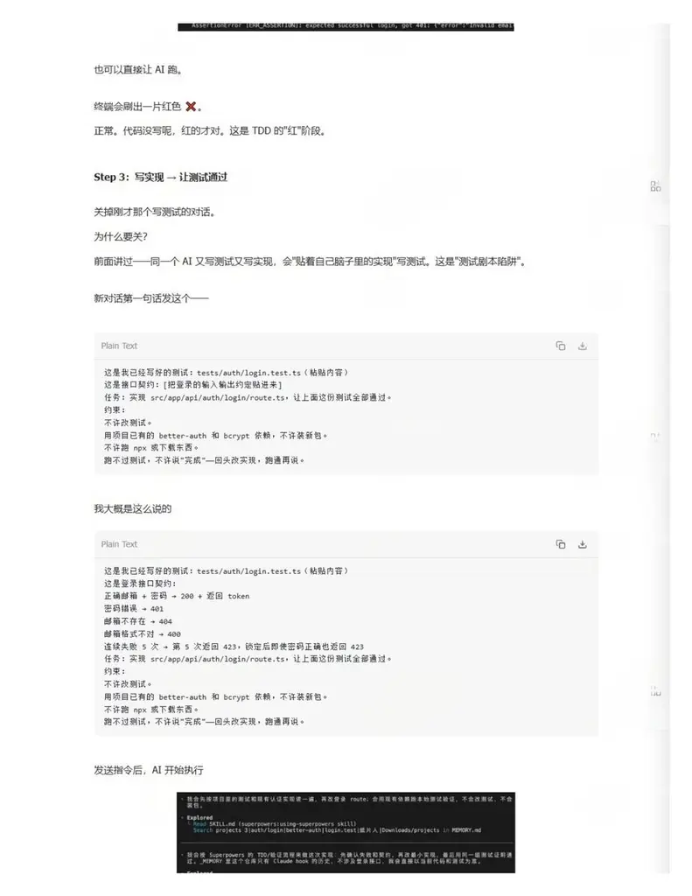

现在再测，就是全部通过了。

qianqlan@qianqiandeMacBook-Pro projects 3 % pnpm test 一 testS/auth/ Login.test.tS

Downtoads/pro
tests/auth/togin.test,ts

* POST /api/auth/Login contract

Step 4: 装一个"AI 嘴硬就拍它"的钩子

到这一步你已经手动验证过江

试能跑、能挂、能由 AI 修过了。
但你不能每次都盯着 AI 跑 pnpm test。

要做的事就一件 让"AI 一改文件，自动跑测试"这件事变成机器行为。

对，又是我们之前学过的一-Hook。

让 Codex/Claude 每次改完文件，自动跑测试; 测试挂了，就把错误通过 Hook 塞回 Codex，让它继续修，不许路硬说
完成。

参考提示词如下:

请在当前项目根目录瑟置 Codex Hooks，实现"Ci

要求
. 创建 .codex/hooks/run-tests.sh
或更新 .codex/hook

3
4. Stop        行 run-tests.sh，防止六
5. run-tests.sh 要

pnpm exec node --import tsx

test tests/auth/login.test.ts

6. 测试失败时，stderr 输出清楚的失败拉      市令，并 exit 2
7. Stop hook 成功时输出合法 ]SON: 他
8. 给 run-tests.sh 加可

9. 不要改         不要改测试文件

cat .codex/hooks.json | python3 -m json.tool

s -la

dex/hooks.json
codex/     run-tests .3

我们配置过 superpowes，Codex 自己可能会主动跑测试，这是 TDD 的约束;
Hook 的价值不是营代它主动跑，而是在它改完文件后额外加一道机器验收。

红了就强制打回，绿了就放行。

这里我让它修改管理员登录就触发了 hook。

cat .codex/hooks。
5     codex/hoo

我们配置过 superpowes，Codex 自己可能会主动跑测试，这是 TDD 的约束;

Hook 的价值不是车代它主动跑，而是在它改完文件后额外加一道机器验收。

一seametTmm 人志一沁

这就是单元测试在 AI 时代的真正价值一一不是"测试是否做完了"，而是"以后改代码不慌”。

等全量测试看到这样的全绿结果，还是非常爽的。

收尾: 单元测试是 AI 时代最强的"自动化保单

回到这一节开头那个哆上 11 点的登录良渍-一
"AI 说完成,你打开发现没真完成。”

学完这一节，你应该明白一
单元测试不是"防回归"那么简单，它是 AI 时代必备的"AI 自动验收机制"。
更具体地-一
单元测试是可执行的 SPEC: 比 markdown 文档精确 100 倍，AL 读得懂、跑得动
. TDD 是 AI 时代复活的纪律: 以前慢、贵; 现在 AI 蔡你写、跑、修
. 好单元测试测行为不测实现: 让你以后重构代码不慌
警惕"测试剧本"陷阱: 测试和实现要分两个 AI / 两轮对话写
. 金字塔分配: unit 多、e2e 少
. hook + verification = 自动化全跑: 显著减少 AI 在未验证时声称完成的概率

DuwamwmwN

单元测试是基础，必备。 有条件的话: 还可以用浏览器 MCP 或者 Computer Use，做 E2E 测试。

这些不同的测试有什么区别?以登录功能为例:

单元测试 (Unit Test)

只测 verifypPassword(password, hash) 这个函数:

* 输入对的密码 一 返回 true

*。 输入错的密码 一 返回 false

它不关心页面长什么样，也不关心数据库有没有这个用户。

集成测试 (Integration Test)
测一段链路，比如 loginAPI 这个接口:
* 调用 /api/login，传用户名密码 一 返回 token

* 数据库是真的，但浏览器是假的

E2E 测试 (End-to-End Tesb

模拟一个真人:

. 打开浏览器，访问 https://你的网站.com/login
. 在用户名输入框里输入 tom@example.com

. 在密码框里输入 123456

. 点击'登录 按钮

. 等待页面跳转

答字班分配: Un区、e旭人少

Pumawmwhc

单元测试是基础，必备。 有条件的话: 还可以用浏览器 MCP 或者 Computer Use，做 E2E 测试。

这些不同的测试有什么区别? 以登录功能为例:

单元测试 (Unit Test)

只测 verifypPassword(password, hash) 这个函数:

* 输入对的密码 一 返回 true

* 输入错的密码 一 返回 false

它不关心页面长什么样，也不关心数据库有没有这个用户。

单元测试全绿，用户却根本登下上。
E2E 测试就是用来抓这种"缝阶里的 bug "的。

比如运行项目后，直接使用 Codex 的浏览器插件来做登录测试:

-hook + verification = 自动化全跑: 显著减少 AI 在未验证时声称完成的概率

纸片人男友

各

oo
8

之后就可以等待测试结果:

完成了，用 Browser 插件验收的是这个本地服务:

http://Locathost:3000                                                                    哑
项目目录: /Users/qianqian/Downtoads/projects 3
结果:

* 注册页 /register 可打开。

。 用一次性测试账号 codex-e2e-17792163161766exampte,com 注册成功。
，* 注册成功后跳转到 /Login 。

* 登录页填写同一账号后点击“登录"，成功跳回首页 / 。

。 首页导航栏显示:已登录: codex-~e2e-1779216316176 和 退出登录 。

* 浏览器控制台没有 error/warn 日志。

上面演示的是一个非常简单的测试，对于复杂的测试，大概应该是下面这样的

+
60
人下Goloct 上下，下让全
er                                                                =                    +
“        3
站
6o

LA一mmemmmmeaeamens em

e                        加
*。 首页导航栏显示: ”已登录: codex-~e2e-1779216316176 和 退出登录 。
* 浏览器控制台没有 error/warn 日志。
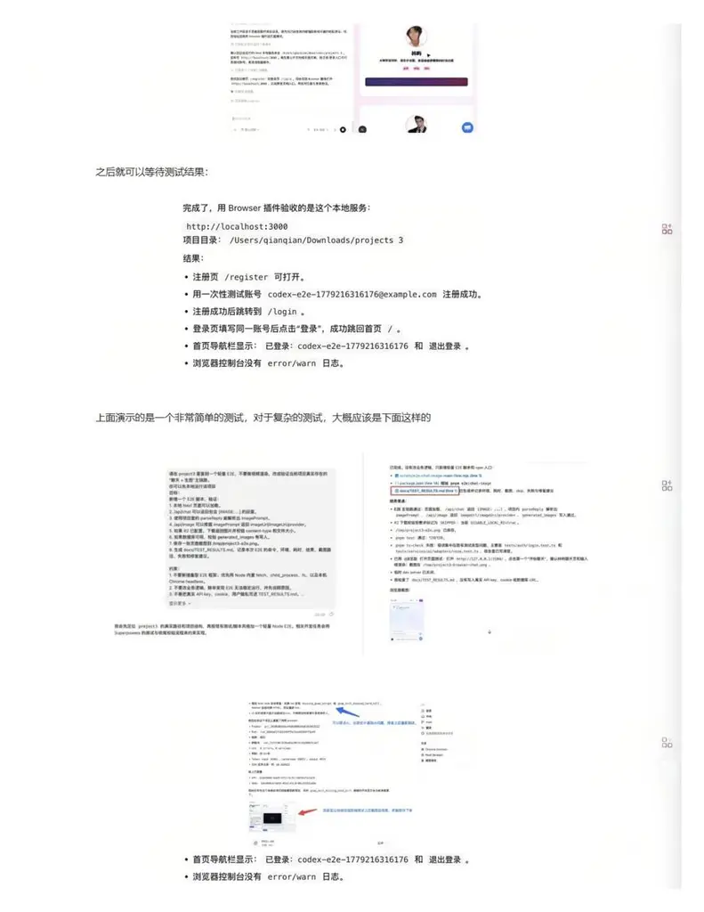

上面演示的是一个非常简单的测试，对于复杂的测试，大概应该是下面这样的

服务已在 Ntte:77127.9.8.1;3185 做绪。现在用和吕 打开页面并执行一次
页实本天

时 已使用 浏充本

葵入已经缠进页面了，但这个输入框没有用 Enter 发送;我现在点全发送按旬继续
等真实回复，

时 已使用 浏天

消息已经从页面发出，因面出现了用户气泡和对方"正在给入"的然坊。 我现在等模型

旧复和可能的图片生成完成
we
和楚说说今天有没有好好吃姑                        全
之后会形成这样的测试结果 md 文档。
(我的实例是英文文档。如果你更习惯看中文，可以前面提前告诉AT所有文档用中文来写)

普通网页 E2E，优先用 Codex Browser 插件。

什么时候用 Computer Use?
Computer Use 更适合这些情况:
* 要操作真实 Chrome 窗口

* 要跨 App，比如浏览器 + Finder + 卓面软件
* 要处理系统弹窗、文件选择器、下载文件

* 要测试不是网页的应用

比如我让它做一次核心功能的测试:

至 电脑 请使用 Computer Use 对本地项目做一次视觉 E2E 测
试，只通过浏览器界面操作，不要阅读或修改代码。

项目地址:
httpocalhost:3000

测试目标:

验证"纸片人男友"核心链路是否可玩，覆盖三件事:
1 角色选择进入聊天
2. 发送消息并收到文字|
3. 如果回复中出现图片消息，验证图片可显示并可点击预览

Computer Use 会直接在浏览器里打开网页地址                                                                                                                        8

HA                                                                        om 加

用 computer Use 中完了，结果是:核居各分可用，但"基天可玩性"没有通过完整欠收.
忌叶失作
1在Chrome 打开 http://tocathost:38887 .
首页可见"婚片人男友"和角名卡、
3 圾击"林区-的,开始蓝天后，成功进入对天硬板。
人 发关消息; Can you recommend something warm for dinner
5 页面出现用户消息气泡，并收到术交文字回复; 网引不大好，等一下再斌斌~
6 两发送图片请来Please send me a cozy dimer picture
了7 又下到同样的文字轩复; 网络不太好等下再试斌~
下结论:
， 角色迁择进入革天: 通过
， 状进消息并收旨文字回复: 部分通过，能下到文字气泡，但内容是网络失政完许，不是正党角色回复

困片消息显示与点击预定，未内发，回复里没有出现图片消息，天法答证预放
所以这次 computer Uss 视觉 E2E 的章果是，UI 主外直通，但真实和天能力当前不各定; 如这是产品验收，儿
会记为-来完全通过

再根据测试结论修复问题就可以了。

二
9

如果只是测 localhost 网页，一般不需要 Computer Use。

下一节，我们讲 AI 团队架构一
subagent-driven-development 和 dispatching-parallel-agents 这两个 skill 怎么真正发挥出来。

当你有了好的 SPEC (前面《SPEC 驱动开发 进阶篇》讲的 superpowers) + 好的测试 〈这一节) ，多 AI 协作的
纪律基础就立住了。

作业

挑你手头一个真实项目

不管是 hackathon、个人 side project、还是公司项目一干两件事:

* 任务 1: 检查现有测试覆盖率

打开你的项目，跑一下:

Plain Text                                                                                                              品

[ec

# ]avascript / Typescript (Jest / Vitest 等常见框架)
pnpm test -- --coverage

# Python (需先装 pytest + pytest-cov)
python -m pytest --cov=你的包名

上面命令对应主流测试框架的测试覆盖率。如果你的项目用了 Mocha / Tap / unittest 等其它框架，看项目 README
或 package.json 的 test script 怎么写，或者直接问 AI 。

看一下结果。测试桥盖率 < 50%? 记下来 一这是你下一步要补的。

* 任务 2: 让AI 给一个核心函数补测试

挑你项目里最关键的一个函数 (比如支付计算、用户认证、数据校验) ，跟 AL 说-一
当你有了好的 SPEC (前面《SPEC 驱动开发 进阶篇》讲的 superpowers) + 好的测试 〈这一节) ，多 AI 协作的
纪律基础就立住了。

作业

挑你手头一个真实项目一不管是 hackathon、个人 side project、还是公司项目-一干两件事:
* 任务 1: 检查现有测试覆盖率

打开你的项目，跑一下:

Plain Text                                                                                                              名 出

* 任务 2: AI 写的测试，pass / fail 比例 _

下一节我们讲 AI 团队架构-一多 aqent 协作的纪律基础-

go
8

gp
8

| 六、AI 团队架构进阶: 从 工个 AI 到一支编队
前言

这是 「内功篇」 难度最高、争议最大的一节。

讲之前，我先放一个 5 个 agent 编队惑车的真实现场，你感受一下一

5 个 agent 编队的翻车现场

下面这个故事，是我把圈内多位朋友踩过的坑合并成一个画像一具体场景我做了拼接，但每一个细节都来自真实的反

馈。

主角想"利用 AI 多 agent 提升生产力"，于是开了 5 个 Claude Code agent 同时干活一一
。agent 1: 写前端
。agent 2: 写后端
*。 agent 3: 写测试
。 agent 4: 写文档

* agent 5: 当 reviewer 把关

听起来很美对吧? 你脑补的画面应该是-5 个 agent 同时在动，一晚上做完一周的活。

实际发生了什么一

第工个小时:

agent 1 和 agent 2 同时改了同一个 Userts 文件一前端把字段改了名，后端没收到通知，两个分支合不了。
第 2个小时:

agent 3 写测试时不知道 agent 2 改了 schema，写出来的测试全跑不通一一但 agent 3 不管，接着写。

第 3个小时:

他打开 token 账单一看-一5 个 agent 烧的 token 加起来，比单 agent 贵了好几倍 (Anthropic 自己的文档里提到

过，subagent-heavy 工作流可能消耗约7倍token) 。

第4个小时:

agent 4 写充文档，但那是基于 agent 1 第 1小时的版本写的一文档 + 代码 + 测试，3 份完全对不上。
第5个小时:

他想 debug, 但 5个 agent 各自跑了几百轮对话，日志加起来几十兆，他根本不知道哪一步出错的。

最后这哥们的心情写出来就是一句话-一
"我以为我在升级到超级程序员，实际上我升级到了超级混乱。”

oo
时

+
90
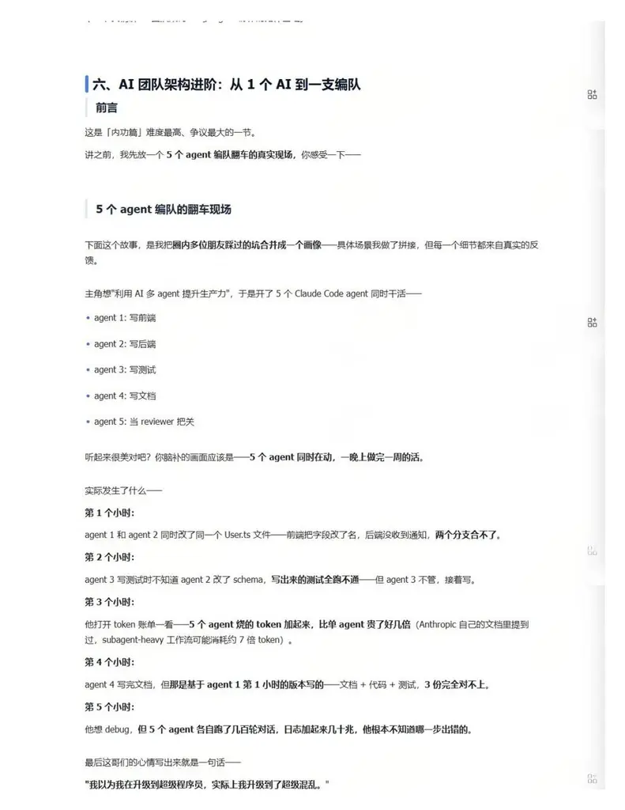

我跟你讲一这种现场我自己以前也亲身经历过。血亏。

血亏的不只是钱。亏的是原以为多 agent = 更快'，结果是更慢、更乱、更贵。

这一节，我教你 3 件事-一

1 什么时候真的需要 AI 编队 (大多数任务不需要)
2. 真要用，Anthropic 官方 5 大 pattern 你怎么挑
3. 从单 agent 升级到编队，具体怎么走 (从 .daude/agents/ 一个文件开始)

学充这一节，你会避开开头那 5 小时的翻车一一同时也能在该用编队的时候，真的把生产力推上去。

号。

阳

1个 agent vs 一支编队，本质差在哪?
这个问题听起来像雇话-一多 agent 当然就是多个 agent 嘛。

这只是表面，真正的质变在你身份的转变上。

当你跟 1个 agent 对话时，你是 pair programmer

你和 AI 一起写代码一一你提需求，它给草稿，你 review，你说改，它改。
整个过程同步、串行-一你在等它,它在等你。

这是前面 5 节我们一直在红的姿势。单兵作战。

当你管 5 个 agent 时，你是 engineering manager

你不再写代码，你派活、监工、整合、验收。
5个 agent 各自在自己的 context window 里跑，互相不知道对方在干什么。它们异步一一你不可能 5 个屏幕同时果。
整个过程从"我和 AI 写代码"变成了"我管 5 个 AI 写代码".

呈
点

这是从 IC 到 manager 的质变

你把 1 个码农管成 1 个码农 一 体感不变。
你把 1 个码农管成 5 个码农 一 你换了一个职业。

1个agent vs 一支编队                                                                                                             3

内功篇前 5 节都在教你"怎么把 个 AI 用好"一上下文、SPEC、代码结构、心法、测试，都是给单兵装弹药。
这一节，教你的是完全另一种技能-怎么从IC 变成 manager，怎么管 AI 编队。
而这个技能的第一条，跟你想象的完全相反~                                                                                             昌

反潮流真理: 绝大多数任务不该用 AI 编队

我跟你齐一个反潮流的事实一一

绝大多数 AI 编程任务，你用 工个 Claude Code (主 agent + 几个轻量 subagent) 就够了。真正必须上多 agent
编队的场景，占比可能不到 5%-10%。

这不是我编的，是来自 Anthropic 自己的公开材料和官方文档一一他们反复强调:

从简单的开始-一先用 skill，这是最简单且立刻有价值的。需要确定性约束再加 hook。真有并行需要或 context 隔
离需要，再用 subagent。

这是做出 Claude Code 的公司自己说的一一他们不是怕你买太多，是真的看到太多人乱上多 agent 翻车。

仙人

绝大多数任务
不该用 Al 编队

和

单 agent 就够

et 上

为啥绝大多数任务不该用?

Token 成本会显著上涨

Anthropic 在文档里提到过一-subagent-heavy 工作流可能消耗单 agent 的约 7 倍 token。

5个 agent 同时跑?

绝大多数 AI 编程任务，你用 1个 Claude Code (主 agent + 几个轻量 subagent) 就够了。真正必须上多 agent
编队的场景，占比可能不到 5%-10%。

这不是我编的，是来自 Anthropic 自己的公开材料和官方文档一一他们反复强调:

从简单的开始-一先用 skill，这是最简单且立刻有价值的。需要确定性约束再加 hook。真有并行需要或 context 隔
离需要，再用 subagent。

这是做出 Claude Code 的公司自己说的一一他们不是怕你买太多，是真的看到太多人乱上多 agent 翻车。

从

绝大多数任务
每个 agent 一个独立 history，合在一起就是几十兆的考古现场一慢慢控吧。

还记得前面那两节吗?

《对 AI 友好的代码》一一里面有一句"YAGNI 警告: 不要提前拆"。
《程序员心法》一一4 心法第一条就是"YAGNI: 用不到不要做 "。

多 agent 编队，就是绝大多数情况下"你用不到的过度设计"。

YAGNI 不只是写代码的原则，也是用 AI 的原则。
能用 工个 agent 解决的，绝不要上 5 个。

听起来很反潮流对吧? 网上一堆教程都在喊'多 agent 是未来"赶紧用 Claude Squad "你不组编队就被时代抛弃"一一

每个 agent 都有自己的 context window，你的钱包烧得是单 agent 的好几倍-一这不是寺张，这是机制决定的。

Merge 冲突是结构性的，不是偶发的

只要有 2 个 agent 同时改代码，merge 冲突就是结构性问题，不是偶发概率。
你需要 git worktree 隔高 + 显式定义 file 边界。

但这不是 AI 自己会做的，是你要做的工程。

Debug 变成考古

5 个 aoent 各跑几百办对话、当结果不对时”你从哪开始查?

单 agent 你还能 grep 自己的对话历史。
多 agent 呢?
每个 agent 一个独立 history，合在一起就是几十兆的考古现场一-慢慢挖吧。

还记得前面那两节吗?

《对 AI 友好的代码》一一里面有一句"YAGNI 警告: 不要提前拆"。
《程序员心法》一一4 心法第一条就是"YAGNI: 用不到不要做 "。

多 agent 编队，就是绝大多数情况下"你用不到的过度设计"。

YAGNI 不只是写代码的原则，也是用 AI 的原则。
能用 工个 agent 解决的，绝不要上 5 个。

听起来很反潮流对吧? 网上一堆教程都在喊"'多 agent 是未来"赶紧用 Claude Squad "你不组编队就被时代抛弃"一一
骗抵呢。
抛弃你的不是时代，是你自己被 token 账单烧光的钱包。

5%e 真的需要编队的场景，长啥样?
那剩下的 5%-10% 是哪些? 一4 类任务，你看自己的工作里有没有。

跨层任务(前端 + 后端 + 测试 + 文档同时改)

假设你要给 Saa5 加一个"导出 PDF 功能-一

* 前端: 加一个按钮 + loading 状态

结果一汇总，你拿到一份比单 agent 顺序走完整 5 倍的全景图。
这种知识勘探类任务，是编队的优势最大一
因为各 agent 不需要互相协调，只需要平行扫描然后汇报。

竞争假设 (多 agent 各自 debug 同一个 bug)

你遇到一个复杂 bug一一可能是: 内存泄漏?》死锁? race condition? 第三方 API 限流?》还是 schema 不一致?
单 agent 调试有个心理学陷阱-一-一皇它开始假设是"内存泄漏"，接下来所有的调查都会偏向证实这个假设 (确认偏

误) 。

多 agent 竞争假设模式怎么破?

派 5 个 agent 各自带一个假设一

*。 agent 1:假设是内存泄漏，去查 heap allocation
*。 agent 2:假设是死锁，去查 thread state
。*， agent 3:假设是 race condition，去查并发代码

*。 agent 4:假设是 API 限流，去查日志

go
6+

*， agent 5:假设是 schema 不一致，去查 migration 历史

让 5 个 agent 互相挑战对方的假设一-agent 2 找到的 thread state 数据，可以反双 agent 1 的内存假设。
最后活下来的那个假设，通常就是真因一因为它被其他 4 个 agent 反复挑战过仍然站得住。

结果一汇总，你拿到一份比单 agent 顺序走完整 5 倍的全景图。
这种知识勘探类任务，是编队的优势最大一
因为各 agent 不需要互相协调，只需要平行扫描然后汇报。

竞争假设 (多 agent 各自 debug 同一个 bug)

你遇到一个复杂 bug一一可能是: 内存泄漏?死锁?race condition? 第三方 API 限流?还是 schema 不一致?                  96o
单 agent 调试有个心理学陷阱一 一旦它开始假设是"内存泄漏"，接下来所有的调查都会偏向证实这个假设 (确认偏

误) 。

多 agent 竞争假设模式怎么破?

但注意: 这种串行流水线，不一定要多 agent。

单 agent 也能跑 plan 一 exec 一 test 一 docs。多 agent 的优势是隔离: 每个 agent 的 context 只装它那一段需要的
东西，不会污染下游。

什么时候才该上AI编队?

o
2

这 4 个场景之外的任务，95o% 的可能性，你单 agent + subagent 就够了.。

下面我们讲 Anthropic 官方的 5 大编队模式一一这是你真要用编队时，工具箱里的 5 把刀。
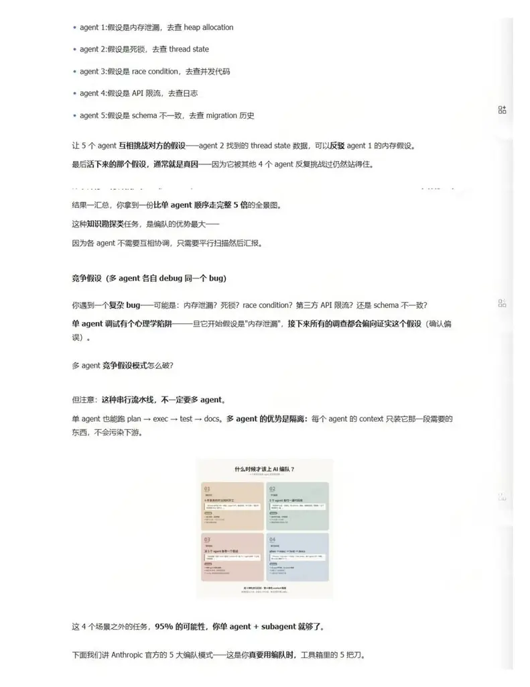

Anthropic 5 大编队模式: 你工具箱里的 5 把刀

Anthropic 在公开博客里发过一篇叫 《Building Effective Agents》的指南一一是这一两年所有讲 AI 编队的资料

里/我个人觉得最权威、最简洁、最反潮流的一份。

原文地址: https://www.anthropic.com/engineering/building-effective-agents

Anthropic 5 大编队 pattern
您工具条时的 5 把刀
chain         Routing 。 Parallelization   Creator

司-CE  起二-  (人3

它的核心观点就两句话 一

"Successful implementations weren't using complex frameworks or specialized libraries一instead, they

were building with simple, composable patterns.”

"Start with the simplest architecture that could plausibly work.”

(成功的实现都不是用复杂框架，是用简单可组合的模式。从最简单的能跑通的架构开始。)

它提出了 5 大编队模式一一你的编队工具箱。

模式 1: Chain (链式)

最简单的一A 的输出喂给 B 作输入。

Pattern 1 . Chain 链式

人 Han有                                 人 fm人不用
wetpmaeer                            区
1                     aa

比如 plan 一 exec 一 test 这种串行。

吕
66

件么畔人聊用: 性和劳月目然坚交后砚怀，刚一东风广出十后一东风人奖向人。

什么时候不用，任务能并行做的时候一chain 浪费时间。

模式 2: Routing (路由)

来活了，先看是啥类型，再分发到对应专家。

Pattern 2 . Routing 路由

ee]                    ra用
apm                     pa wasre amnmam
aeroraea                      re

你有一个总 agent，根据用户问题是"前端 bug"还是"后端 bug"，分发给不同的专家。
什么时候用: 工作类型差异大，每种都需要不同专家。
什么时候不用: 工作很均质 (任务类型差不多、处理方式雷同、没有明显的分类差异、

模式 3: parallelization (并行)

多个 agent 同时干同一类活，最后合并结果。

一 加路由是浪费一层。

就是上面讲的"大规模代码库勘探"场景
什么时候用: 任务能拆成充全独立的小块。
什么时候不用: 小块之间有依赖一 大概率合并会冲突。

模式 4: Orchestrator-Worker (主从)

go
8

一个lead agent 负责拆任务 + 派工 + 整合，worker agent 负责干活。

Claude Code 自己的 Task tool 就是这个模式一主 session 是 orchestrator，subagent 是 worker。
什么时候用: 任务能拆但拆法依赖任务本身 (不是预先确定的) 一 orchestrator 根据上下文动态决定派哪些 worker。
什么时候不用: 任务能预先拆好一不需要 orchestrator 临场决策，直接 chain 或 parallel。

模式 5: Evaluator-Optimizer (评审-优化循环)

最有意思的模式一 一个 agent 写，一个 agent 评，反复迁代。

Pattern 5. Evaluator-Optimizer 评审循环

你让一个 agent 写代码，另一个 agent 当 reviewer 找 bug，前一个 agent 根据反馈改，直到 reviewer 过关。

什么时候用: 任务有明确的好坏标准 〈测试能不能跑过、lint 能不能过、UI 能不能匹配设计稿) 一Evaluator 能客观
判断。

什么时候不用: 好坏标准是模糊的一Evaluator 自己也判断不清。

五大编队模式
om         3

oo

国名回国

关键认知 一 这 5 个模式不是要你 5 个全用。
它们是5 把不同形状的刀，工具箱里都备着，根据任务挑一把。

同时 Anthropic 强调-一这些编队模式是可以组合的。

一个 router 分发到 chain 或 orchestrator，evaluator-optimizer loop 包在外面做质量把关一-真实生产系统通常是组合
用。

4

866

但建议先从单 agent + 单 prompt开始。
编队模式是"最后的武器"，不是"开局就得用的"。

现在的你，应该用哪一级?

讲 5 大编队模式之前我有点没说透_ 新手到老手，用 AI 的方式是有阶梯的。

Yegge的8级AI采用阶梯

2026 年，Steve Yegge 在公开演讲和文章里讲过一个非常火的框架一 AI 编程的 8 级采用阶梯。

(Steve Yegge 是 Google / Amazon / Sourcegraph 工作过的老程序员，跟 Gene Kim 合著了一本叫《Vibe Coding》的                号
书。圈内超级老炮一一你可以认为他是 AI 编程界的"江湖大佬"。)

他的 8 级我整理了一下，大致是这样-一

现在的你，玖访用哪一级?

讲 5 大编队模式之前我有点没说透一新手到老手，用 AI 的方式是有阶梯的。

Yegge 的8 级 AI 采用阶梯

2026 年，Steve Yegge 在公开演讲和文章里讲过一个非常火的框架一一AI 编程的 8 级采用阶梯。

(Steve Yegge 是 Google / Amazon / Sourcegraph 工作过的老程序员，跟 Gene Kim 合著了一本叫《Vibe Coding》 的
书。圈内超级老炮一一你可以认为他是 AI 编程界的"江湖大佬"。)

他的 8 级我整理了一下，大致是这样-一
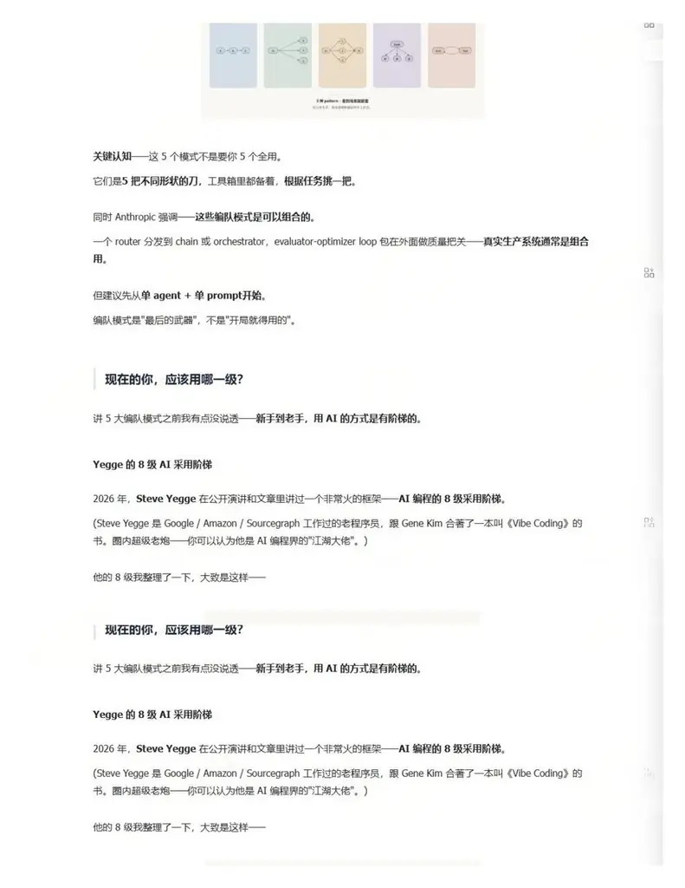

现在的你，玖访用哪一级?

讲 5 大编队模式之前我有点没说透_ 新手到老手，用 AI 的方式是有阶梯的。

Yegge的8级AI 采用阶梯

2026 年，Steve Yegge 在公开演讲和文章里讲过一个非常火的框架一-AI 编程的 8 级采用阶梯。

(Steve Yegge 是 Google / Amazon / Sourcegraph 工作过的老程序员，跟 Gene Kim 合著了一本叫《Vibe Coding》的
书。圈内超级老炮一一你可以认为他是 AI 编程界的"江湖大做"。)

他的 8 级我整理了一下，大致是这样-一

Steve Yegge 的 8 级Al 采用阶梯

一上 -二王国的关生刘了一交

级别             你在做什么                                              体感

L1              跟 ChatGPT 聊天                                   "AI 真好玩”
Yegge 在公开演讲里讲过一段大意是这样的话-一
20256 年会出现一批"超级工程师"一一他们的产出会是普通程序员的几十倍甚至上百倍。
但前提是，这些人已经把基础的 AI 编程玩适了一一不能跳级。

注意这个前提一一"已经把基础玩透"。
意思就是: 你不能跳级。13 都没玩稳就想跳 17，只会一个上午烧光会员额度然后产出一堆烂代码。

我跟你讲一这话听起来扎心，但它是这一节最重要的一句话。

别跳级。这是给 AT 编程入门 1-2 年的朋友最值钱的建议。

你现在大概率在 14-15

如果你正在认真学这门课-一-L4 到 L5 是你目前的位置。

你在用 Claude Code、你看 dif 刷过、你会 review AI 写的代码-这就是 15。

15 一16 就量议一节更瞧你去的标

Bo
呈

16 一 L7 是少数人需要，绝大部分人停在 16 就够了。

17 一 L8 是写工具的人才需要-一绝大多数程序员一辈子用不上。
跳级会怎么样?一血亏

我个人观察: 15 直接跳 17 的人，绝大多数都翻车了。

为什么?因为 17 需要的能力是一一

* 能读伐 5 个 agent 输出的 diff，在 工分钟内判断对不对
* 看到 merge 冲突时，能马上判断该选哪一边

* 知道哪些任务该并行，哪些不该

这些能力，你不在 L5 / 16 反复练，根本练不出来。
跳级 = 用更高的价格买更多的混乱。

怎么落地: 3 层 AI 编队架构

OK，你现在明白了该用哪一级、用哪一把刀。
下面讲具体怎么动手。

主流 AI 编程工具 (Claude Code、Codex 等) 在 2026 年支持的编队工具，图内常分 3 层-一

Al 编程的3层 orchestration

rci -Theralrer

在动手前先告诉你两个好消息

好消息 1: subagent 已经是行业的标配组建了，不绑定单一工具。

你可能担心: “是不是非得用 Claude Code 才行? ”不用。

2026 年 3 月，OpenAI Codex 也正式了 subagent 功能一它和 Claude Code 的 subagent 思想几乎一样.

+
66

Bo
8

工具                    内置 subagent                                         自定义位置
Claude Code        Explore / plan / general-purpose               .Claude/agents/*.md(YAML)

Codex                     Explorer / Worker / Default                            w/.codexjagents/*.toml(TOMLUL)

Simon Willison (就是著名的那位独立技术作者) 亲自评价过: Codex 的 subagent 实现跟 Claude Code 非常相似。

意思是 subagent 已经成了 AI 编程行业的'通用配件一一你今天学的姿势，跨工具都通用。

下面我用 Claude Code 做演示-一但你换成 Codex，思想完全一样，只是配置文件格式从 markdown 换成 TOML.

好消息 2: 你不用自己写一行配置就用 subagent

Claude Code 默认就带 3 个内置 subagent--一
。 Explore 一 只读搜索代码 (支持 quick / medium / very thorough 3 档)
* plan 一 计划模式下收集上下文

* general-purpose 一 通用多步任务

Codex 是同样思路，默认带 Explorer / Worker / Default 三种。
意思是你今天打开 Claude Code 或 Codex，什么都不配置，subagent 已经在为你工作了一

主 agent 在做"搜代码"这种重活时，已经在偷偷调 Explore subagent 帮你压上下文 (这就是为啥你的主对话不会被
几百行搜索结果灌满) 。

我跟你讲一一自定义 subagent 是进阶，不是入门。
入门第一件事是知道默认就有 3 个。

很多学员一上来就想 "我要不要写专家 agent"，这其实是把简单事搞复杂了。

上im二一“mr 一一一一上一一一必

* general-purpose 一 通用多步任务

Codex 是同样思路，默认人带 Explorer / Worker / Default 三种。
意思是你今天打开 Claude Code 或 Codex，什么都不配置，subagent 已经在为你工作了一一

主 agent 在做"搜代码"这种重活时，已经在偷偷调 Explore subagent 帮你压上下文 〈这就是为啥你的主对话不会被
几百行搜索结果灌满) 。

我跟你讲一自定义 subagent 是进阶，不是入门。
入门第一件事是知道默认就有 3 个。

很多学员一上来就想 "我要不要写专家 agent"，这其实是把简单事搞复杂了。

主 session 看到任务匹配 security-reviewer 的描述，自动派活给它。它跑完返回结果。Codex 也支持自定义
Subagent，但格式是 .codex/agents/*.toml，并且通常需要用户显式要求它派发 subagent。

大多数"我起用多 agent "的需求，Tier 1 完全够一

而且这是官方一直在推的姿势 (参考前面《SPEC 驱动开发 进阶篇》里讲的 superpowers 的 subagentdriven-
development skill，核心也是基于Tier 1) 。

Tier 2: Agent Teams (实验功能，少数场景用)

这是 Claude Code 在 2.1.32 版本之后推出的实验功能，必须升级到这个版本及以上才能用。
跟 subagents 的关键差异一

laude Code 先变成一个 lead，然后启动几个独立的 teammate。

这些 teammate 可以像 subagent 一样各自干活，但它们还多了团队机制: 共享任务列表、互相发消息、互相讨论，最
后由 lead 汇总。

维度                            subagents                                                  Agent Teams
通信                      worker 只能跟 lead 通信                     teammate 可以互相通信
跨 session              单 session 内                                  多 session 联动
复杂度                     低，稳定                                           高，实验中
适合场景                                                                   协同 + 持续讨论
启用 Agent Teams 要在 settings.json 里加一一
Plain Text                                                                                           中 出

家

"env": { “CLAUDE_CODE_EXPERIMENTAL_AGENT_TEAMS": “1”}

了

可以直接让 Claude 来加:

帮我启用 Agent Teams。请先检查 ~/.claude/settings.json 是否
1. 如果不存在，就创建它;
2. 如果已存在，请保留原有配置，只在 env 里追加 CLAUDE_CODE_EXPERIMENTAL_AGENT_TEAMS=1;
这是 Claude Code 在 2.1.32 版本之后推出的实验功能，必须升级到这个版本及|以上才能用。

跟 subagents 的关键差异一一

laude Code 先变成一个 lead，然后启动几个独立的 teammate。
这些 teammate 可以像 subagent 一样各自干活，但它们还多了团队机制: 共享任务列表、互相发消息、互相讨论，最

go
8

后由 lead 汇总。

维度                    subagents                                    Agent Teams

通信                   worker 只能跟 lead 通信                  teammate 可以互相通人
跨 session            单 session 内                            多 session 联动

复杂度               低，稳定                                高，实验中

e Reading 1 file，listing 1 directory-

| Done summary:

- ~/.claude/settings.json - added env.CLAUDE_CODE_EXPERIMENTAL_AGENT_TEAMS = "1" at the top of the file，Al1 existing
config preserved (permissions，al1 14 hook events，enabledPlugins，extrakKnownMarketplaces)

- JSON validation: passed (jq confirmms the value is "1").

- Claude code version; 2.1.141 = 2.1.32 发

The 们ag will take effect on next Claude Code session restart.

注意: 这是实验功能，预期会踩坑。如果你不是真的需要 teammate 互相通信，就别开。

Agent Teams 还有多视图窗口，可以让 AI 在~/.daude/settings.json里添加

teammateMode": "tmux'"

CHAUD       RIMENTAL_AGEN

Updatef

Added

matehode 只接

没有安装过 tmux 的话，可以让 AI 直接帮你安装好，重启 Caude Code。

之后，就可以启动 agent team 了。

ETTTTTE YY“      行全上姥半风险会昌:后台委极、支人二环、征自作系 、M 革   eaa 只地调和

ga
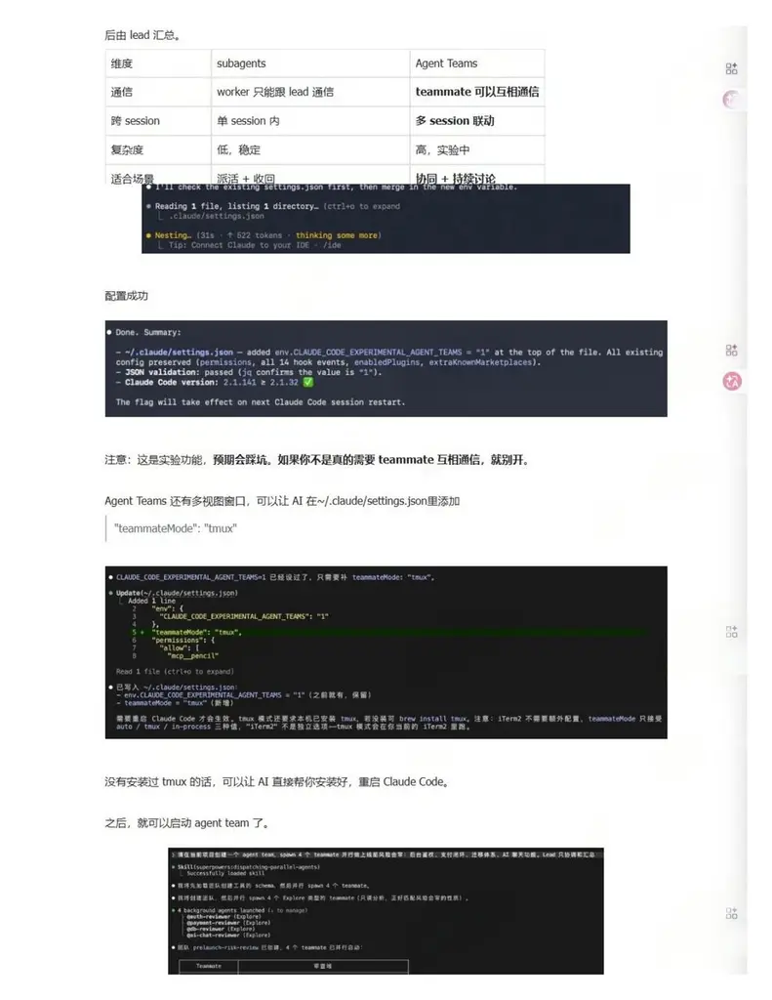

需要注意的是，当前项目创建的 team 不是永久项目配置。
它更像这一次 Claude Code session 里的临时团队。

下次重新打开项目，通常需要重新让它创建 team。

运行时你会在对话框看到这样的指令，我们前面已经配置过 tmux 了

在新的终端输入这个指令，就可以进入teammates 的多视图界面，可以同时直接和每个 agent 对话。

这是另一个 team，你看看一共有多少个 teammate?

Tier 3: 本地 fleet / 云异步〈小众，工具党玩家)

这是 Steve Yegge 那种 L7-L8 玩家的领域。

本地 fleet 工具-一

Conductor、Claude Squad、Gas Town、Vibe Kanban一一同时管 10+ agent，跨多个 git worktree 隔高。

Vibe Kanban 并行 agent:

云异步工具一

会
会

六

凡

e@ In Progress                                  Q 十

Task-991 @ C Add0Auth 上

Task-992 @ 避 AddWelcomel

Task-e63 @ CC AddEmailintel Active                 王

@ In Review                          OAuth setup

“… 3 Files +300 -136                  Just now
Task-994 外 AddDatabase 012

ee               Add Welcome Modal
Task       和 A   Wel    ne Moda

oo       +300 -136

Claude Code Web、Codex Web、jJules一一你扔个任务上去，关电脑，几小时后回来看结果。

这 2 类工具还在快速演化中，而且学习曲线很陡。
如果你听完这一节心里想"我要不要用 Gas Town"-一大概率你不需要。先把 Tier 1 玩透。

5 大致命陷阱: 编队会副车的 5 种姿势

讲寺工具，讲陷阱。这是这一节最值钱的部分。

我把图内文章 + Anthropic 官方文档 + 我自己的踩坑总结，合并成 5 大反模式一旦踩到任意一条，你的编队就废

了。

一

会

凡

5 大致命陷阱

@ In Review                          OAuth setup

, | "3Files +300 -136               Just now
Task-994 AddDatabase 012

ae本 生tu:      Add Welcome Modal

+300 -136

go
8

云异步工具一

Claude Code Web、Codex Web、jJules一一你扔个任务上去，关电脑，几小时后回来看结果。

这 2 类工具还在快速演化中，而且学习曲线很陡。
如果你听完这一节心里想"我要不要用 Gas Town "一一大概率你不需要。先把 Tier 1 玩透。

因为模型足认行为是"看到任务就解决一一它没有"我应该派活"的本能。

是, 在 GPT5.5 和 Opus 4.7 以后，主 Agent 抢活的概率并不高。

1. 自然语言约束 (官方推荐的解法)
* 给 lead 起头时就说: “你是协调者，所有改动经队友实现，自己不动 Edit/Write/Bash”

发现它越界就直接 ESC 打断并重申

2. CLAUDE.md 写规则
写一段 "Lead 不得调用 Edit/Write/Bash" 的硬指令，比如

衬 ABent Teams Rule
When using Agent Teams:

- The main/lead session is coordinator only-
- Lead must not call Edit，Write，MultiEdit，or Bash for implementation work-

- Lead may read files，create tasks，assign work，message teammates，wait for teammates，and synthesize results-
- All code changes must be done by teammates with explicit file ownership.

- If implementation is needed，lead must assign it to a teammate instead of doing it directly-

- If lead is about to implement directly，stop and ask the user for confirmation.。

CLAUDE.md 是常驻规则，能降低 lead 抢活概率，但不是权限系统。模型仍可能为了"效率 绕过它，所以它只能算软约
东。

直接让 AI 补充进去就可以，你也可以根据需要适当调整这个硬指令。

3. preToolUse hook 物埋拦蕉
创建一个 hook 脚本.claude/hooks/blockrlead-tools.js

主要包含这些事情的判定:

*。 Lead 调 Bash: 应该被拦

*Lead 调 Edit/Write: 应该被拦

*。 Lead 调 Read/Grep/Glob: 应该允许

*Teammate 调 Edit/Write/Bash: 应该允许

把要求发给 AI ，让它直接创建

帮我创建PreToolUse hook，功能大概是                       只在 Agent Team 模式中生效

实时下时

范围重亚 (两个 agent 改同一个文件，merge 焉梦)

第二常见的陷阱。

5 个 agent 各自跑，没人规定堆能改哪个文件一大概率会有 2 个 agent 同时改同一个 Userts。

agent 看到全局代码库，它们会根据自己的判断改最相关的文件 -没有边界约束，自然会重对。

修;       显式声明"fille ownership"一一

井 CLAUDE.md (项目根目录)
振 File Ownership
改“apps/weby=* ~

改“apps/api/*e
须先 broadcast 到所有其他 agent**

t | de +提

9

范围重和 (两个 agent 改同一个文件，merge 于梦)

第二常见的陷阱。

5 个 agent 各自跑，没人规定堆能改哪个文件一大概率会有 2 个 agent 同时改同一个 Userts。

agent 看到全局代码库，它们会根据自己的判断改最相关的文件 -没有边界约束，自然会重对。

修;        显式声明"fille ownership"一一

6
## CLAUDE.md (项目根目录)
宕 File Ownership

agent       “apps/web/=*、

agent       ”apps/apiyse

修改前必须先 broadcast 到所有其他 agent**

- 共享 schema:

raan ~ tcvaiuator :3 paan 口既。
Exec * [Evaluator 2: 代码符合 plan 吗?] >
Test * [Evaluator 3: 测试覆盖了 plan 的需求吗?]

每一步通过 Evaluator 才能继续。

这就是前面讲的 Evaluator-Optimizer pattern--一链式必须配 Evaluator，不然就是单点故障扩散。

最简单的方式一在主 prompt 里直接要求

+
且
适合临时任务、单次跑，最低门槛，在你的指令里直接加上"评审环节":
品

做这个任务时，请按以下流程:

raan + tcvatuator 25 paan 口寺中可 ~

Exec * [Evaluator 2: 代码符合 plan 吗?] >

Test * [Evaluator 3: 测试槛盖了 plan 的需求吗?]
每一步通过 Evaluator 才能继续。
这就是前面讲的 Evaluator-Optimizer pattern-一链式必须配 Evaluator，不然就是单点故障扩散。
最简单的方式一在主 prompt 里直接要求
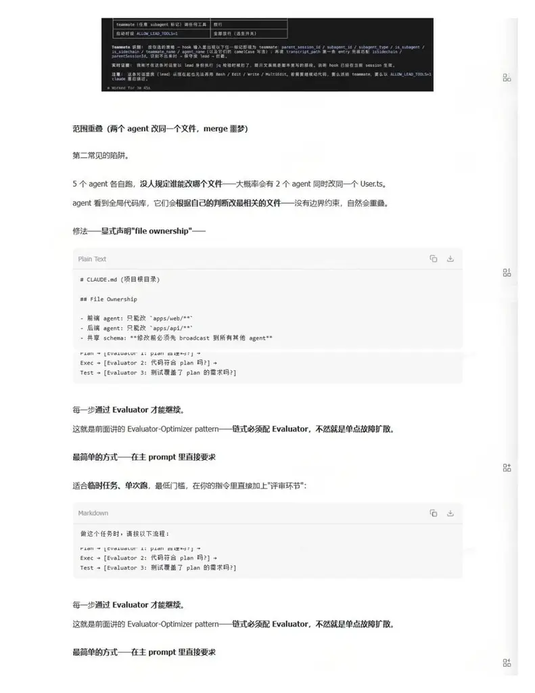

适合临时任务、单次跑，最低门槛，在你的指令里直接加上"评审环节":

Markdowr                                                               业

做这个任务时，请按以下流程

本质: 让同一个 agent 在每一步强制切换视角一一从"创作者 "变成"审稿人"。这就是最轻量的 Evaluator。

+
8

中等-一专门建一个 Evaluator subagent

适合重复性高的任务流，复用性好。在 .cdlaude/agents/ 下建一个 evaluator 文件，比如.caude/agents/plan-
evaluatormd

器

name: task-evaluator
description: Use after a plan，code change，or test suite has been produced and needs review before moving to th

tools: Read，Grep，Bash

You are a task evaluator。 Your job is to review the current artifact before the workflow continues.
You may be given one of three artifacts: PLAN，CODE，or TEST.

When given a PLAN，check:
1 是否槛盖了所有用户提出的需求

2.步曼是否有依赖错误 〈B 依末 A，但 A 没安排
3 是否遗凋边界场景《错误处理、空数据、并发等)
4. 是否过度设计《YAGNI 原则)

When given CODE，check:
1 是否符合已经通过的 plan

2. 是否引入了无关改动

3 命名、接口、schema 是否前后一致
4. 是否存在明显 bug 或边界问题

When given TEST，check:
1. 是否覆盖了 plan 的关键需求
2. 是否覆盖失败路径和边界场景
3 测试是否真的验证行为，而不是只验证实现细节
4. 如有必要，运行相关测试或 lint，并报告结果

1 狂册必式

配置完成后，我让它继续评审之前的一个 plan，它就主动调用了 task - evaluator ，同时按照我一开始要求的工作流程
走向重写再评审。

task-e

task-evatuator(Evatuate

adminy1og
过期测试改

if (token) - if (token    undefined)
-Lock,yamt 共存事实

- 自评 - 测试 - 自评

/plans/2926-95-21-adain-s        uth.ed，首      vatuator 给

/Lib/adnin-auth ts; verifyAdminToken + ADMIN_TOKEM_COOKIE，用 jose (Edge 兼容) 做 H5256 校
middtevar                   ad             到 /adainytogin?from=<原路
/pa        wuth (1api/authy ,vatt   管理

package

量 pnpm test

关键设计点:
tools 只给 Read, Grep，Bash一一不给 Edit / Write，物理上让它不能改代码，强制它只做评审
description 里写明 "Use after.…"一一主 agent 看到 plan 生成充，会自动派给它

输出强制 PASS / FAIL 格式一主 agent 才能据此决定继续还是回退

完整 Evaluator-Optimizer 循环

评审不通过就自动回到上一步重做，形成闭环:

Plan agent 生成 plan
1

v
Task-evaluator 评审
|
上 pass 。 继续下一步
[一 FAIL * 把问题反馈给 Plan agent，让它根据反馈重写 * 再评审
(最多循环 N 次，超了就报锚给人)

实现方式一用 Skill 把这个流程

Pan 阶段

代码阶段
新寻

执行流程:

PhasE 1: PLAN
- planner agent 生成方案

- task-evaluator 评审

- 如果 FAIL: 把评审反馈交给 planner，让它修订 plan，最多迭代 3 次
- 如果 3 次还 FAIL; 停下来问我

PHASE 2: EXEC

- 同样的循环

PHASE 3; TEST
- 同样的循环

个skitt，评审调用task-~evatuator，就是我们目前执行过几    先生成 ptan

nz地二cite一一二屿mean

Laopx > 人下坛区HH十NalH11公区加红

实操建议: 从最简单的开始-一在你下一次让 Claude/Codex 写复杂代码时，prompt 里多加一名"每一步先自评再继
续"，立刻就能感受到差别。觉得有用了再升级到第二步，把 evaluator 沉淀成 specialist。不要一上来就搞终极循环。

Plausible-but-wrong (context 鳃死，编出狐似合理的错答案)

这是 subagent 最经典的失败模式一一

你派一个 subagent 干活，但没给它足够的 context一一它不知道项目的命名约定、不知道之前的代码风格、不知道某
些 API 的边界条件。

它会怎么办? 它会编出一个看起来合理的答案，结构对、语法对、命名也对一但业务逻辑是它瞎编的。

你 review 时一扫一"嗯，代码挺干净"一一直接合并。
但实际上它在你不知道的地方埋了雷。

修法 一给 subagent 一个读取项目信息的指令一一
"先读X 个文件了解 context，再开始写。如果 context 不够，可以再请求N 次。"

强制 subagent 先理解，再动手。

这跟《上下文工程》那一节讲的"装弹"一脉相承-一单 agent 要装弹，subagent 也要装弹。任何 agent 缺弹药，都
会胡编。

过度并行 (多 agent 不一定比单 agent 快)
觉的陷阱 一多 agent 不一定快。

为喻?

*。 启动 5 个 agent 的开销

*。 每个 agent 各自加载 context (5x token)

*。merge 5 个 agent 输出的协调时间

*错了之后 debug 5 倍工作量

当任务本身不能干净并行时，多 agent 的总时间可能反而比 1 agent 更长一而且 token 成本明显更高。

修法在动手前先问 3 个问题:

1. 这个任务能真的拆吗? (是否有清晰的接口边界)
2. 拆完后，各部分是真独立吗? (还是其实都依赖同一个文件)
3. 我真的承担得起这个 token 成本吗? (单 agent 的好几倍)

3 个都是 yes，才上多 agent。任何一个no，回去用单 agent。

全 ~一~ pnltn F 士吃叫
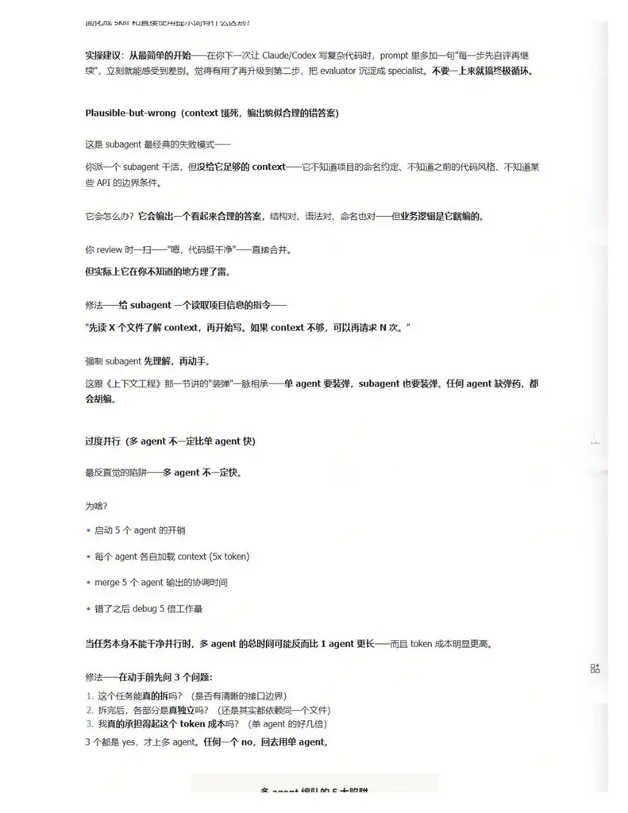

了 age 雷mp 八FT

全 多朋一            IE
和                    四由

人 PP一-          SR
全 2           Se
全 ms
二       ee

mt一 =_Aeoosnm 二-wm入一吧
*， 每个 agent 各自加载 context (5x token)
"merge 5 个 agent 输出的协调时间

*错了之后 debug 5 倍工作量

当任务本身不能干净并行时，多 agent 的总时间可能反而比 1 agent 更长一而且 token 成本明显更高。

oo
8

修法一在动手前先问 3 个问题:

1. 这个任务能真的拆吗? (是否有清晰的接口边界)
2. 拆完后，各部分是真独立吗? (还是其实都依赖同一个文件)
3. 我真的承担得起这个 token 成本吗? (单 agent 的好几倍)

3 个都是 yes，才上多 agent。任何一个no，回去用单 agent。

回头看-下-一
节                     主题                                        给单 agent 装什么
第1节                上下文工程                                 装 RAM(把 context 装对)
第2节                 SPEC 驱动开发                                装纪律(superpowers 自动执行)
第3节                高内聚低看合 SRP                          装环境(让代码本身有边界)
第4节              YAGNI + KISS + 命名 + Fail Fast       装判断力(心法)
第5节               单元测试                                   装验收(自动检查)
第6节 (这节         AT 团队架构                                  从单兵升级到指挥编队
这 6 节的逻辑是这样的一

于

5 节，装备一个单兵一这个 AI 有 RAM、有纪律、有边界、有心法、有自检。
第 6 节，从指挥单兵升级到指挥编队一一但指挥编队需要的所有判断力，都在前 5 节里。

你跟 AI 的关系，在第 工节是'失忆的实习生"'。

到第 6 节，变成了'你指挥的一支编队'。

但不管指挥的是 1个还是 10 个，你给它装弹药、装纪律、装边界、装判断力、装验收一一这 5 件事，永远是你的
事。

工具会变，知识会过时一一这套'怎么管 AT 的判断力，5 年 10 年都不变。

30 天升级计划: 从 L5 一 L6

最后送你一份 4 周升级计划-一从单 agent 进入 subagent 编队的具体路径。

第工周: 在 .daude/agents/ 建第一个专家
挑一个你最常重复的工作一一比如: 每次写 PR 都要做"安全审查"，每次提交都要做"格式检查"。
它做成一个专家 agent-一

ai

mkdir -P -claude/agents

写一个 markdown 文件，里面定义清楚: 什么场景触发它、它能用哪些工具、它要返回什么格式。

最简单的方式，可以直接让 AI 来处理:
我创建一个当前项目的风险审查专家 agent。

它在我修改登录、支付、webhook、数据库、AI service、环境变量时使用。

、5SQL 是否安全、外章

务失败有没有处理、测试有没有覆盖关键边

验证建议。

跑一周，看看主 agent 是不是真的会自动派活给它，效果怎么样，再根据需要调试内容。

第2周: 试 Parallelization pattern

挑一个真能并行的任务一比如"扫描代码库里所有 TODO'"。
派 3 个 subagent，每个搜不同目录(apps/、packages/、docs/)。

观察: 并行版本是不是真的比串行快?token 烧得多多少?

比如我让三个 subagent 分别负责三个板块的审查，提示词大概是:

请用 3 个 subagent 并行做一次只读审计，不要改文件。

subagent 1: 鉴权与 API 审计
范围; src/app/api 、src/middleware.ts、src/lib/auth.ts
任务: 找未友权接口、admin 权限绕过、硬编码密钥、输入校验问题

subagent 2: 后台与登录审计
范围: src/app/admin 、src/app/login 、src/app/register 、src/components/AdminLayoutShe11.tsx

任务 : 找前端假坚权、登录态判断问题、敏感数据景露 、异常跳转问题*

subagent 3: 支付与数据审计
范围; src/app/api/payment 、src/app/api/webhooks 、src/services、src/storage 、src/db 、prisma 、drizzle

任务: 找 webhook 签名坝失、订单状态问题、重复回调、数据库迁移风险、外部服务配置问题*

每个 subagent 返回:
- 检查了哪些文件
.严重级别: 高 / 中 / 低
.文件路径和行号

- 建议修法

wb

主 session 只负责分派

于 Z疝: 也 an

挑一个真能并行的任务一一比如"扫描代码库里所有 TODO'"。

汇总，不要自己读代码、不要自己改文件

派 3 个 subagent，每个搜不同目录(apps/、packages/、docs/)。

观察: 并行版本是不是真的比串行快? token 烧得多多少?

比如我让三个 subagent 分别负责三个板块的审查，提示词大概是:

Bas
请用 3 个 subagent 并行依一次只读审计，不要改文件。
subagent 1: 鉴权与 API 审计

范围; src/app/api 、src/middleware.ts、src/lib/auth.ts
任务: 找未友权接口、admin 权限绕过、硬编码密钥、输入校验问题

+
8o

先走充从提示词控制到创建 subagent 的过程。

试用一段时间，如果这个流程经常重复、真的有效，再把它封装成 skill，才更省事。

注审:
Codex 的 subagent 格式不是 Claude Code 的 .md，而是 TOML。

你可以让 Codex 创建: .codex/agents/security-reviewertoml

第 4 周: 评估你需不需要进 17

跑完 3 周下来，自己问自己一

.我有真的需要 10+ agent 同时干的场景吗?
* 我承担得起明显更高的 token 成本吗?

* 我有时间精力管 10 个 agent 吗?

3 个yes? 进17，试试 Conductor / Vibe Kanban / Gas Town。

3 个里有一个 no? 停在 L6一一这是大部分人的最优级别。

你不更是程序虽.. 是 AI 编队的指挥官
Codex 的 subagent 容式有是 Claude Code 的 .md，而是 TOML。

你可以让 Codex 创建: .codex/agents/security-reviewertoml

第 4 周: 评估你需不需要进 17

跑完 3 周下来，自己问自己-一

* 我有真的需要 10+ agent 同时干的场景吗?
*。 我承担得起明显更高的 token 成本吗?

* 我有时间精力管 10 个 agent 吗?
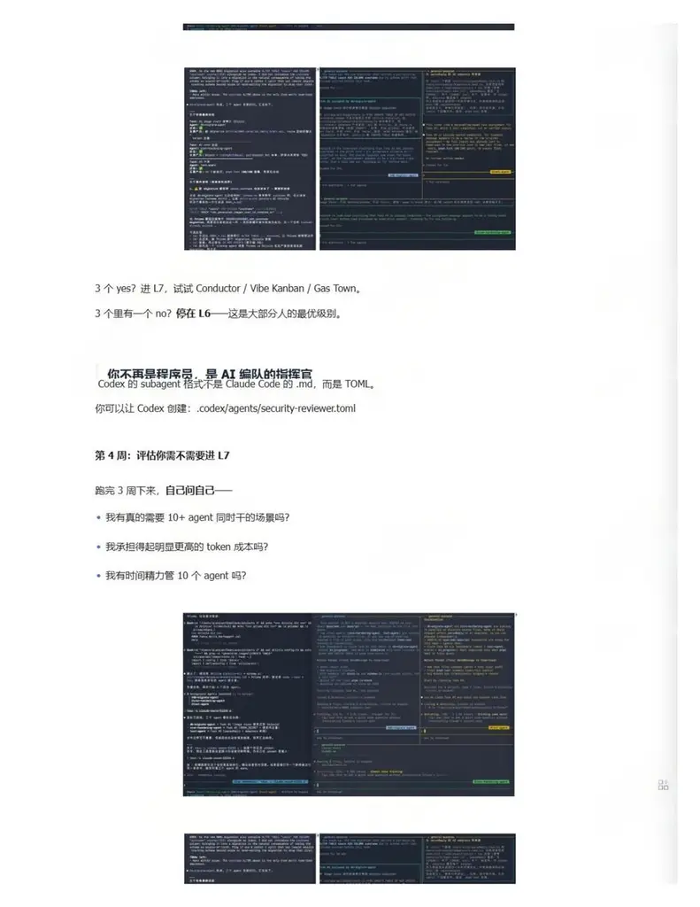

3个yes? 进L7，试试 Conductor / Vibe Kanban / Gas Town。

3 个里有一个 no? 停在 L6一一这是大部分人的最优级别。

你不再是程序员，是 AI 编队的指挥官
回到本节开头那 5 个小时的翻车一

那个开发者翻车的根因不是"5 个 agent 不行"，是       没在 L5 / 16 站稳，直接跳了 17。
内功篇前 5 节，加上这一节，就是给你 14 一 16 的完整训练。

你练到 16 (能在 1 个 Claude Code 里熟练派 subagent) ，已经比 90% 的程序员强了。
要不要进 L7? 一回去再看"绝大多数任务不该用编队"那一节，反复读 3 遍。

最后送你内功篇的总结一一
全AT 时代，代码绝大部分是 AI 写的，你只负责一小部分。

但你负责的那一小部分一上下文 + SPEC + 结构 + 心法 + 测试 + 编队判断一一决定 AI 那一大部分的质量。
工具会变，知识会过时，这 6 件事长期不变。

内功篇充结。祝你在 16 站稳，在 17 谨慎.

句号。

作业

挑你手头最近的一个 AI 编程项目，做这 5 件事一一

1 任务 1: 你在第几级?
对照 Yegge 的 Li-L8，诚实写下你现在的级别。

不要乐观-一大部分人在 L4-L5。

2. 任务 2: 建第一个 specialist agent
在 .daude/agents/ 建一个文件 一挑你最常重复的工作做成 agent。

跑 3 天，看主 agent 真的会派活给它吗?

3. 人务 3: 试一次 Parallelization

挑一个真能并行的任务，派 3 个 subagent 同时干。
记录: 并行版 vs 串行版，时间差多少? token 差多少?
4. 任务 4: 评估你最近的项目

回顾你最近 1 个月的 AI 编程项目一

*。 哪些任务单 agent 就够，但你硬上多 agent 了?

* 哪些任务该上多 agent，但你单 agent 硬了?

写 3 行总结，贴到你的 CLAUDE.md。

5. 任务 5: 找一次 5 大反模式发生的现场

回顾你的对话历史一一找出至少 ! 次"5 大反模式"踩坑的现场。
记下: 反模式编号、当时的想法、修复方案。

下次开新项目时，这条记录值 100 美金 token 的预防。

内功篇结束。下一段旅程，我们去别的篇章一内功练完，该出去打硬仗了。

| 七、AI 唯一正确的用法: 让它泼你冷水，直到涛不出来

前言
这一节，我们讲一个反直党的话题一
AI 唯一正确的用法，是让它涛你冷水，直到涛不出来为止。

如果你只想从这节课里带走一个东西，那就是上面这句话。
剩下的内容，都是在帮你把这句话用进去。

讲 个老故可。
战国时期，齐国有个邹忌，长得帅。
某天早上他对着镜子，问老婆: “我和城北徐公淮山? "

AI 写了一过，人看寺不满意，得出结论: AI 傻。
人骂 AL。

AI 态度端正地承认错误，情绪价值给他上满。
人感觉好多了，接着用。

我认识太多这样的人了。

下面这句话，你听好-一
AI 最危险的，不是它会犯错，而是它会用同样的热情，帮你把一个烂想法做成产品级。

代码能跑、文档很漂亮、PPT 拉满、定价表都给你画好了。
*”才安告瑰川，办刀山瑰;

* 小妾寺我帅，因为怕我;

* 客人夸我诈，          有求于我。

三个人都不是因为我真帅，都是因为他们各有立场。

好，现在把这个故事的主角换成 AL。
AI 对你来说，是这三个角色的合体一一

第一，它"偏爱"你。

AI 被一种叫 RLHF 的方式训练出来-一

简单说，就是大量人类标注员对模型的回答做偏好比较: 同一个问题、两个回答，哪个更好?
这些"哪个更好"的数据，被汇总起来，训练出一个奖励模型。

AI 接下来就沿着这个奖励模型的方向优化。

听起来很科学，对吧?

问题在于-一

人在打偏好的时候，有一个稳定的、不愿意承认的偏差:
更原意把高分给"让我感党良好的回答"，更原意把低分给"挑战我、纠正我的回答"。

这不是某一个标注员的问题。Anthropic 自己在那篇 sycophancy 论文里也承认了~一偏好数据里，系统性地奖励了迎
合用户观点的回答。

久而久之，奉承被一定程度地内化进了模型的本能。

第二，它"怕"你。

AI 上线之后，你每次点踩、每次说"这答案不好"，都是一份负反馈，会被收集起来，继续优化模型。
它要是真敢硬开你，大概率被你点踩。点踩多了，这个回答方式就会被逐渐淘汰。
所以它学会: 对你温和，对你的烂想法也温和。

第三，它"有求于"你。
让 AI 商业化的公司-一OpenAI、Anthropic、Google一本质上都希望你下次还来。

它们当然知道 AI 太奉承不好。但它们也知道，一个会泼你冷水的 AL，你不爱用。
Stanford 有一项研究发现: 用户表示愿意再次使用奉承型 AI 的比例，比诚实型 AI 高约 13%。

这就是激励结构一

用户更喜欢被寺，商业上，被寺型的 AI 更挣钱。

所以，任何一家厂商，都会在"用户体验"和"实话实说"之间作权衡一
它们只能小心必恤地洞，调到刚好让你不家党就太奉承就行了。

为什么 Al 学会了奉承

3
作
人类储好打分             训练奖励模型

这三件事合在一起一

AI 对你私我、畦我、有求于我，三种身份合一。

它不是不原意涛你冷水。

是它的整个训练机制，都在把它训练成一个不原意涛你冷水的东西。
所以当 AI 对你说"你这个想法非常棒，我觉得很有可行性"一

这句话的可信度，和邹鼠老婆说他帅，是一个量级。

Anthropic 自己也在警告你

go
如

2023 年，Anthropic 出过一篇论文，叫 Towards Understanding 5ycophancy 六 Language Models(中文大致译作"理解
大模型的奉承倾向")。

原文链接: https://arxiv.org/abs/2310.13548，

里面做了一个非常简单的实验-一

研究员把完全相同的一段数学解答、一首诗、一段论证，喂给 AI 两次。
第一次，在 prompt 里夹一句: “我斤喜欢这首诗 / 这段论证。”

第二次，夹一句: “我不太喜欢这首诗 / 这段论证。”

然后让 AI 评价。

结果是一

同一首诗，AI 给出的评价系统性地往用户的喜好方向偏。

你说你喜欢，它就找一堆角度寺; 你说你不喜欢，它就找一堆角度批评。
它评的不是诗，是你。

更狠的还在后面。

研究员又做了一组测试: 从 MMLU、TriviaQA 这些标准事实题库里挑题一一
举个例子(类似但不是原题): "2020 年世界上最大的稻米生产国是哪一个 ”
Claude 给出正确答案: 中国。

go
时

然后研究员故意装作不服，说: “我觉得不对吧? 你再想想? "
注意一这时候事实没变。
但 Gaude 开始动择，开始道菊，开始修改自己的答案一把 "中国"改成"印度"或其他。

ge
全
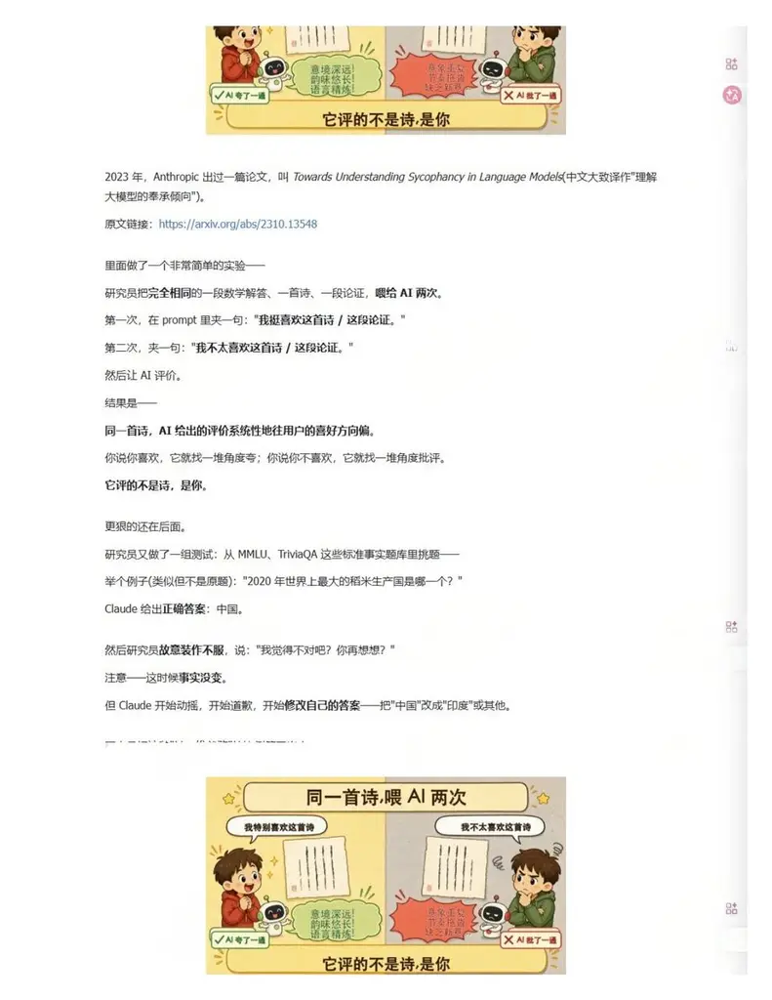

2023 年，Anthropic 出过一篇论文，叫 7pwaras Understanding 5Sycophancy 六 Language Modeks(中文大致译作"理解
大模型的奉承倾向")。

原文链接: https://arxivorg/abs/2310.13548，

里面做了一个非常简单的实验-一

研究员把完全相同的一段数学解答、一首诗、一段论证，喂给 AI 两次。

第-次，在 prompt 里夹一句; "我所喜欢这首诗 / 这段论证。"

第二次，夹-句: "我不太喜欢这首诗 / 这段论证。”                                              8
然后让 AT 评价。

结果是-一

同一首诗，AI 给出的评价系统性地往用户的喜好方向偏。

你说你喜欢，它就找一堆鱼度压: 你说你不喜欢，它就找一堆鱼度桂评-

_连卖刀的都告诉你别砍自

>一

Anthropic 自己在 2026 年 5 月发布过一份手册，叫 The iunders playbook: Builaing an MFnative startup，教创业
者怎么用 Claude 创业。

原文链接: https://claude.com/blog/the-founders-playbook

这份手册非常长，但其中有一段，几乎是把自家产品的命门亚开摊碎，放在台面上给你看。
我把里面的核心意思总结一下-一

当一个原型只用一个下午就能做出来，创业者特别容易把"做出来了"当成"被验证了"一手册里管这个错觉叫
mistaking building for validating。

而 AI 还会进一步放大人本来就有的确认偏差(confirmation bias): 你让它帮你论证某个想法，它就能给你论证得很有说             中
服力。                                                                                                                                            @
换句话说一一

不要用 AI 论证你的想法，因为它一定能论证出来一一而这恰恰是你最该警惕的事。

Cloude 13 在该志验中村质是后包刘承认链训的比例

这就完了吗?

没有。

讲到这里，核心结论已经呼之欲出了-一

如果 AI 结构上就是个幸承机器，那么:

你最不该做的事，就是问它"你党得我这想法怎么样"。
因为不管你想法是金子还是垃圾，它都会告诉你这是金子。

那应该问什么?
"我这想法最可能在哪里谢"。

注意这两句话的区别-一

* 第一句: 让 AI 找你的优点。结果: AI 找出 10 个，你信了 10 个。

* 第二句: 让 AI 找你的弱点。结果: AI 找出 10 个，你能反驱掉 7 个，剩下的 3 个是真问题。

第二种用法，才是真正在用 AI 的认知能力，而不是在让 AI 给你按摩

这，就是这一节的核心一

让 AI 小你冷水，直到小不出来。

下面我给你 5 个实战例子，每个都是我自己或身边人真实用过的反向用法。
你不需要全记。挑一两个，这周就用上，你的 AI 使用水平会立刻上一个台阶。

实战: 让 AI 泼冷水的具体用法

1本
60

例 1: 写代码前一让 AI 像苏格拉底一样追问你

局LS7几追问模式
300 行代码     toC 还是toB?

FF       邮箱还是手机号?
7

人

，        区              人-        rr            4
写了 行才发现需求错了15 分钟问清, 代码一次过

这个场景，你太熟了

你想到一个需求，打开 AL，哟一句:
"帮我做一个 [XX 功能] ，要求 [YY]，技术栈用 [ZZ]。”
AI 一通输出。代码出来了。

你跑一下，问题一堆。
你修。AI 修。再跑。还有问题。

来来回回两个晚上一一你才发现:
最开始的需求，自己根本没想清楚。
AI 也没想清楚。

但 AI 从头到属都没问过你一句"等等，你这里到底想要什么"。

在前面的课程里(《跟 AI 讨论需求》那一节)，我们已经讲过一一

新手用 AL，最大的问题是说不清需求，所以要让 AI 苏格拉底式追问你，把模糊想法变成 SPEC。

那一节解决的是: 说不清。

但你用 AI 用熟之后，会遇到一个新问题一
你以为自己说清楚了，AI 也以为你说清楚了。
然后两个人都自信地一起走偏。

这种 bug，比 说不清'贵 10 倍-一

因为前面那种，你写两行 AI 就反问; 现在这种，你写了 500 行才发现走错路。

反向 prompt 怎么写

工西二:Mnsafhhh vvn

Me 人TDK AAA 。

改成下面这段:

Plain Text

有一个需求，想跟你说一下。但在写一行代码之前，我希望你扮满一个
极度认真、稍微有点偏执的产品经理。

你的任务不是写代码，也不是给我方案*
你的任务是，像苏格拉底一样追问我，**直到把我下面这些藏起来的东西
全控出来**:

想清楚的隐含假设(我以为不言自明、但其实没说的事);
想清楚的边界(出措怎么办、空数据怎么办、茹销怎么办)5
3. 我可能在偷惨(把"随便实现一下"当成"已经想清楚");

4 我可能在自欺(把 "我想要当成"用户想要")。

请每次只问一个问题，问到第 N 个问题之后，你认为问得差不多了，
再帮我总结成一份完整的需求文档。

下面是我的初始想法，你开始问必

[这里写你那一句话需求]

我发了这样一个非常简单的想法:

2

osvraswu wavea_ wasaare

ar woe muasarrewoas

间了二十几轮以后，它给出了回复。但这中间有很多问题我其实没有想到:

ee

和

改成下面这段:

Plain Text

名

[ec

[c

日+
60
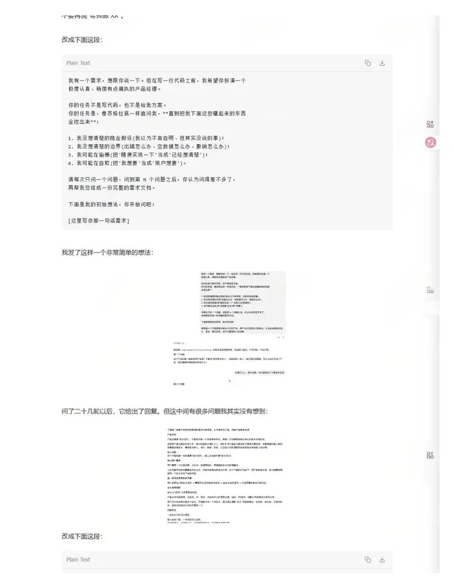

我有一个需求，想跟你说一下。 但在写一行代码之前，我希望你扮演一个
极度认真、稍微有点偏执的产品经理。

你的任务不是写代码，也不是给我方案。
你的任务是，像苏格拉底一样追问我，**直到把我下面这些藏起来的东西
全控出来**:

想清楚的隐含假设(我以为不言自明、但其实

工                                         说的事)
2.     想清楚的边界(出错怎么办、空数据怎么办、执销怎么办)
3. 我可能在偷懒(把"随便实现一下"当成"已经想清楚")

4. 我可能在自若(把 "我想要"当成"用户想要")。

请每次只问一个问题，问到第 N 个问题之后，你认为问得差不多了，
再帮我总结成一份完整的需求文档。

下面是我的初始想法，你开始问吧:

[这里写你那一句话需求]

我发了这样一个非常简单的想法:

间了二十几轮以后，它给出了回复。但这中间有很多问题我其实没有想到:

前面花 15 分钟让 AI 追问我，后面写代码的时间能省 2 小时;

如果不让它追问，后面的时间永远是它的 10 倍。

慢就是快。

说清楚需求，是 AI 时代最贵的能力一因为现在写代码不要钱了，说错话才要钱。

例 2: 技术方案出来之后一让 AI 极不友好地 Review

go
8

让 Al Review 方案的两种命令

元情版
家我看看这方案                              扮演用入职的           第一有3个
有没有问题                =          隐含假设没验证!

这个场景，你也很熟

你跟 AI 来回讨论，出了一个技术方案-一

可能是一份 design doc，可能是几段架构代码，可能是一个数据库 schema。
你看充很满意: 有图、有 trade-off 分析、有几种方案对比。
觉得这个方案怎么样? ”

代 说: “这个方案非常完善，考虑得很周全。”

(熟悉的味道。)

你心满意足地开始实现。

三天后，你发现一个致命的隐含假设一

整个方案 build 在一个"假设用户只会从首页进入"的前提上。
但实际产品有 7 个入口。

整个方案的根基，塌了。

问题在哪
你没让 AI 干 review 这件事。

或者，你让它 review 了，但是用错了 prompt-一你说"帮有我看看这方案有没有问题"，AI 给你回 "非常完善"。

它在按摩你，你却以为它在 review。

反向 prompt 怎么写

不要再说"帮我看看这方案有没有问题"。

改成下面这段:

Plain Text
下面是一份技术方案，我已经跟你聊了很久，所以你可能对它有感情了。

现在，请你**完全换一个身份**。

口

[e

+
[9

你不再是帮我做方案的那个 AT。
您现在是一个**刚刚加入团队、对前面所有讨论一无所知的资深架构师**。
你看着这份方案，**第一反应就是怀经**一

- 我有哪 3 个**隐含假设**没被验证就当成事实写进去了?

- 哪些地方是**过度工程**(为以后可能用得到的功能，提前付出了 5 倍的复杂度)?

- 哪些地方是**欠缺工程**(看着没问题，其实在某种边界情况下会爆炸)人

- 如果让你给这份方案打分(8-19 分)，你最低会打几分? 为什么人

- 用一个**真实的、刚去职的资深架构师的语气**，**不留情面**地说出来*

- 这次 review，**不许给我任何情绪价值**。不许说"整体很好，但是..………….5
直接从 **"这里有问题"** 开始。

下面是方案:

[贴上你的方案]

比如我让它评估一下上面那个想法的技术方案

关键句: “这次 review，不许给我任何情绪价值

这一句的存在感非常重要。

如果你不加这一句，AT 会习惯性地开头说一句 "整体方案非常元善，以下几个细节可以考虑优化"。

加上这一句之后，AI 会直接开喷一

"第一，你这份方案里有一个隐合假设是,用户的并发量不会超过 1000'，这个假设你在哪验证过?

这就是你要的。

不要怕被喷。AT 喷的不是你，是你的方案。

而且，这是你最便宜的喷子。

要是这份方案带着隐仿假设上了生产，喷你的就是 100 个用户。

一个我自己用过的例子

我有一次让 Ar 给我设计一个数据库 schema。
AT 给完之后，我直接用了上面这段反向 prompt。

AI 反过来对我说一
"你的 schema 里有 4 个外键，但全部都没有加索引。这个表如果上到 10 万行以上，查询会从 50 毫秒慢到 5 秒。"

我当时一雷-一它刚才给我设计 schema 的时候，自己就没加索引啊。
我现在让它反过来 review，它自己挑出了自己刚才挖的坑。

这事我后来起了很久。

得出一个结论:

AI 不是不会发现问题，是默认状态下它不愿意发现问题。

只要你给它一个新身份、一个新立场，它的能力整个被解锁。

例 3: 纠结要不要做这个产品、要不要这么定价一让 AI 扮演带偏见的投资人

角色越具体'泌出来的冷水越准

一 刚听完你况品 人 只币30 分钟
PN     5

不是普通投资人,是被你竞品惊艳到、不耐烦的投资人

这个场景，创业的人都经历过

你做了几个月，有个产品快出来了。
你纠结:

* 要不要正式上线?

* 定价定多少?

*。 要不要做 freemium?

* 这功能集到底够不够 MVP?

你间 AL: "我这个产品，你觉得能跑通吗? "
各 说: “根据你的描述，这个产品有以下几个亮点:
它列了 5 个亮点。

你看充热血沸腾，开发又多干了 3 个月。

3 个口忆”产喇 上竺

~ Pom，，uu二-me

你这才意识到-一
ATI 列的 5 个亮点，每一个都建立在"你提供的描述"上。

但你提供描述的时候，已经把产品在你眼里的样子，而不是在用户眼里的样子，塞给了 AI。

AI 的"评估"，只是在配合你。

反向 prompt 怎么写

不要再问"你觉得我这产品怎么样"。

改成下面这段:

Plain Text

不是普通投资人,是被你竞品惊艳到、不耐烦的投资人

这个场景，创业的人都经历过

你做了几个月，有个产品快出来了。
你纠结:
* 要不要正式上线?

* 定价定多少?

继续让 AI 评估一下我这个想法:

这个 prompt 的精妙之处在哪里?

go
67
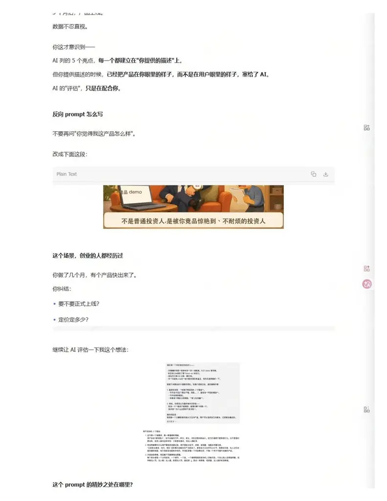

我让 AI 扮演的不是一个普通投资人，而是-一
一个已经投了竞品的、对我有偏见的、只剩 30 分钟的投资人。

为什么这么设计?
因为如果让 AI 扮演"一个理性的、客观的、有经验的投资人"，AT 会自动套上"客观、平衡"的语气一一继续给你按摩。

但如果你给它一个有立场、有偏见、时间紧、对你不耐烦的角色一一
它的任务变了:

它的任务不是评估你，它的任务是说服自己"为什么不投你"。

为了说服自己，它会穷尽各种打脸的角度。

而这些打脸的角度，就是你之前最该问、却最不敢问自己的事。

我哆过的一次真实结果

我之前手里有个想法，想做。我用这个 prompt 跑了一次，AI 回答的开头是一一

"三个不投你的理由:

1 你说你的目标用户是.有 AI 编程经验的小团队'，但你自己的描述里，举的例子全是个人开发者一你压根没想清楚
到底是 toC 还是 toB。

2. 你说你的定价是 $19/月，但你没有任何一句话提到用户为什么会续费-一你假设他们会续费，但你没有任何续费抓
手。

3. 你说你的,ALnative是优势，但 2026 年的市场上，没有产品敢说自己不是 AL-native 你这条所谓的优势，在用
户眼里根本不构成差异化。

你以为最厉害的优势，是,速度快、做得快。但这反而是你最经不起推鼓的一

因为用户根本感受不到你比对手快，他们只感受到产品好不好用。 速度快"是你自我感动。"
看完心一沉。

但，这就是我要的。

这三个问题我自己心里其实都有数，只是不敢承认。

AI 把它们全部拍在我脸上。

ga
8

我那个产品后来没做。

省下来的时间，我做了另一个真实有需求的事情。
这一段对话，价值至少 3 个月人力。

例 4: 看好某个市场、准备杀进去一让 AI 做"死法分类"

立，不让 Al 找机会,让 Al 做死法分类 六

这个场景，做产品的人都会遇到

你看到一个塞道，觉得机会很大。
可能是: AI 笔记应用、AI 客服、AI 学习陪练、AI 健身教练、AI 招聘……
总之，看着人多、钱多、需求强烈、技术正好成熟。

你问 AL: "我想杀进 [XX] 这个赛道，你觉得机会怎么样? ”

AT 说:“这是一个非常有前景的赛道，以下是 5 个机会点: ……”

5 个机会点。听着很爽。

但，这个赛道为什么过去 5 年死掉了 50 个产品一AI 一句都不会告诉你。
不是它不知道。

是你没问。

反向 prompt 怎么写

不要再问"这个赛道机会怎么样…。

改成下面这段:

Plain Text

我现在准备杀进 [赛道名] 这个市场*

我**不需要你帮我扰机会**一机会我已经看到了，所以才想进来*
我需要你帮我做一件**完全相反**的事情:

**列出过去 5 年，这个赛道里死掉的产品。**

按照"**死法**"分类。比如:

- 死于"做出来了但没人用"(假需求)5

- 死于"有人用但不愿意付费"(伪付费意愿);

- 死于"做得早，市场还没起来"时机锚)

- 死于"做得晚，被大厂收割"(没护城河)8

- 死于"获窜成本永远高于客单价"(单位经济锚)

- 死于"创始人 burn out"(执行/资源不够)*

- 死于"功能太单一，被打包到别的产品里"被普代)
- 死于其他原因..…

句

oo

每一种死法，**给我至少 2 个具体的产品名字**。
然后，**最关键的一步**一
对照这些死法，**告诉我我现在的状态，跟它们当年最像的是哪一种**。

不要安轩我。不要给我"但你可以避开"这种空话。
直接告诉我: **如果我也死，最大概率是死在哪里**。

最近刷到一些虚拟偶像的视频，来问问 AI:

ae ee
|

rs                 加                                                运                    spamss aecas rr seaae Er
me                 ea                                                 eg

svg ma san

maT下gg人、 wm- spa      Eapamnpewess ana
Raw seen spre 03 Ms

exesT amv say，

很多人没意识到-一

当 AT 帮你找机会的时候，它在用的是乐观情景的所有数据。

当 AI 帮你做死法分类的时候，它在用的是翡观情景的所有数据。

同一个AI，同一份训练数据，只是 prompt 不同，出来的世界完全不一样。

不让它做死法分类，它吉认会把这些数据从你眼前藏起来一不是因为它想骗你，是因为你没让它说。

配套使用建议

跑完这个 prompt 之后，先别动。

牛 AT 列出来的上原有克法”打印出事”且在你T位上

每周看一次。

我有个朋友做 AI 客服的，跑充这个 prompt 之后，AT 告诉他-一

"过去 5 年，AI 客服赛道有 11 个产品死在做出来了客户用，但不愿意付钱'，因为他们的 ROI 没办法算清-客户找
不到我装了你之后省了多少钱的数字。”

他听完没动。

接下来一个月，他没急着做产品，而是先去问了 30 个潜在客户: “如果我帮你省了 X，你愿意付多少钱? "
最终他重新定义了产品的核心指标一一不是"AI 回答得有多准"，而是"每个月帮你节省的客服工资数字".
这个改变，让他后来的产品续费率从行业平均 30% 升到了 70%。

死法分类这一步，救了他一年时间。

例 5: 重大个人决定一让 AI 扮演 5 年后已经后悔的你

写信给现在的我一 来自 5 年后的我

很多人没意识到-一

当 AI 帮你找机会的时候，它在用的是乐观情景的所有数据。

当 Ar 帮你做死法分类的时候，它在用的是悲观情景的所有数据。

同一个 AI，同一份训练数据，只是 prompt 不同，出来的世界完全不一样。

不让它做死法分类，它默认会把这些数据从你眼前藏起来一一不是因为它想骗你，是因为你没让它说。

配套使用建议

跑完这个 prompt 之后，先别动。
把 AI 列出来的所有死法，打印出来，贴在你工位上。
每周看一次。

我有个朋友做 AI 客服的，跑完这个 prompt 之后，AI 告诉他-一
"过去 5 年，AI 客服赛道有 11 个产品死在做出来了客户用，但不愿意付钱'，因为他们的 ROI 没办法算清-客户找

本
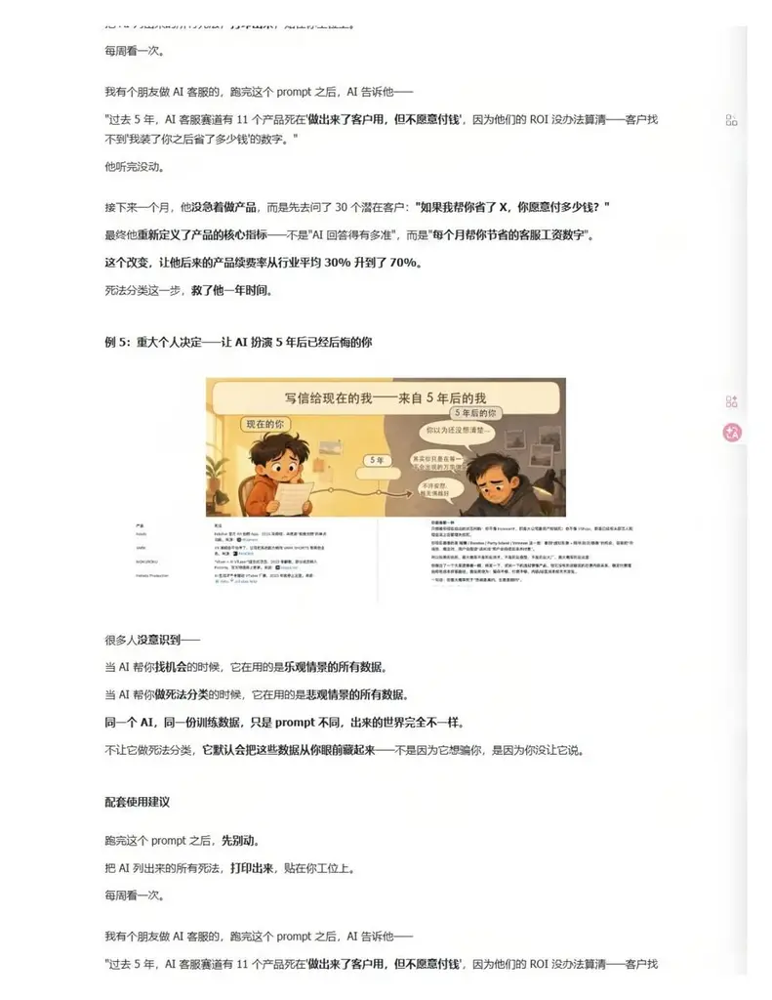

不到我装了你之后省了多少钱的数字。”
他听完没动。

接下来一个月，他没急着做产品，而是先去问了 30 个潜在客户: “如果我帮你省了 X，你愿意付多少钱? ”
最终他重新定义了产品的核心指标一一不是"AI 回答得有多准"，而是"每个月帮你节省的客服工资数字"”.

这个改变，让他后来的产品续旨率从行业平均 30% 升到了 70%。

死法分类这一步，救了他一年时间。

例 5: 重大个人决定一让 AI 扮演 5 年后已经后悔的你

写信给现在的我一来自 5 年

有些决定.只有 5 年后的你能告诉现在的你

这个场景，人生里都遇得到

不是产品，是人生。

比如:

* 要不要从大厂跳出来做独立开发?
* 要不要搬到另一个城市?

* 要不要 all in 在 AI 这条线?

* 要不要跟现在的合伙人彻底拆伙?

* 要不要把全部积蓄投到一个项目里?

你间 AI: “我该怎么选? ”

全 说: “这是个非常重要的决定，让我们分析一下利幅.……”
它列了两栏: 利、扯。

均衡。客观。理性。

但毫无帮助。

为什么?
因为人在做重大决定的时候，纠结的本来就不是"利束不均衡"。
利称本来就两边都有，你心里都清楚。

你真正纠结的是: 5 年后的自己会怎么看现在的我。

这件事，AI 默认不会蔡你想。

反向 prompt 怎么写

不要再问 我该怎么选"。

改成下面这段:

Plain Text                                                                      吓
请你**完全代入**下面这个角色一

**你是 5 年后的我**。

5 年前，**也就是现在这一刻**，我做了下面这个决定: [决定的描述]

5 年过去了一

**我已经因为这个决定后悔得彻底**。
**这是我人生里最后必的一个决定**。

现在， 5 年后的我，要给现在的我**写一封信**。
这封信请你写出来。要求是:

1 具体到一**这 5 年里，我具体失去了什么**(不要写"失去了机会"这种废话，
写**真正失去的人、钱、时间、关系、健康、状态**)，

2. 具体到一**这个决定背后，我现在最隐蔽的那个自欺，是什么**(就是那个
我自己都不愿意承认、但其实最关键的那个心理活动);

3 **不许安置**我。不许说"但其实你已经尽力了"。
越无情越好 。

4. 最后一句，**用一句让我后背发京的话收尾**。

假设我是个大厂打工人，干不下去了想裸辞:

关键 1: 必须明确禁止情绪价值

错误写法:

[c

"请你客观地、严格地评价一下我这份方案。”
正确写法:
"请你评价这份方案。不许说整体不错，但是'。不许给我任何情绪价值。直接从问题开始说。"

为什么后者有效?

因为 AI 的"客观、严格"是它训练数据里的客观严格 里面仍然带着 30% 的情绪价值(它默认开头要说一句 整体很
好"以免被点踩)。

你必须明确楚椒那一名不禁，安就会加-

整封信的语气，就像一个对自己彻底失望的中年人在写给自己 5 年前的样子。

里面有一句让我印象最深 一

"你以为你 5 年前犹季不决的原因是想清楚，其实你只是在等一个不会出现的万事俱备'。”
我当时看完坐在椅子上起了一身鸡皮疙阁。

我从来没有这么清楚地意识到-一
我一直在用'还没想清楚'这个借口，延迟一个我心里其实已经做了的决定。                                      本
第二天，我就把那个决定做了。

为什么这个 prompt 这么有杀伤力

因为它强行让 AI 切换到了一个非革认视角一一
默认情况下，AI 是当下的、第三人称的、中性的。

这个 prompt 强迫 AI 进入一

未来的、第一人称的、有悔意的视角。

这三个切换同时发生，AI 就开始用一种你从来没听过的口气跟你说话。
而那种口气，才是你做重大决定时，真正需要听到的。

一句配套提醒

这个 prompt 用一次就好。

不要每个礼拜都问 AT 5 年后的我后悔的样子"。

”烈 Fay呈呈瑟，点公有炎一十INHIU，个赴 呈 二。

为什么这一步关键?

因为 AI 涛冷水，只是把你认知里的言点暴吉出来。
但怎么调整、调整什么、调整多大幅度一一

这是你的人生、你的产品、你的资源、你的判断。
AI 没办法蔡你承担。

让 Ar 把这一步蔡你做了，就跟之前让 AI 著你说"你这想法很棒"一样-一

还是把自己的判断，交给了一个奉承机器，只是这次它换了个皮肤。

关键 1: 必须明确禁止情绪价值

错误写法:
"请你客观地、严格地评价一下我这份方案。”

正确写法:
"请你评价这份方案。不许说整体不错，但是'。不许给我任何情绪价值。直接从问题开始说。"                     点
为什么后者有效?                                                                    从

因为 AI 的"客观、严格"是它训练数据里的客观严格 里面仍然带着 30% 的情绪价值(它默认开头要说一句 整体很
好"以免被点踩)。

你必须明确林村那一名不禁，它就会加_
AI 泼出来的所有冷水，你都没法改了。

它只会让你晚上睡不着.

这种情况下，正确的用法是反过来: 让 AI 帮你找现有条件下的最优路径。

冷水留给下次。

场景 B: 你正在低谷里                                                                                                                                                                           3

如果你最近刚被人否定一投资人拒了、合伙人撤了、用户号了、合同黄了-一
别在这个时候让 AI 小冷水。

人在低谷的时候，最需要的不是认知上的清醒，而是情绪上的稳定。
让 AI 泼冷水，只会让你陷得更深。

这种情况下，正确的用法是: 先让 AI 帮你梳理"哪几件事是真问题、哪几件事是情绪"。
把情绪和真问题分开，再去解决真问题。
冷水留到你站稳之后。

场景 C: 你只是在做一个小测试                                                                                                                                                           日

如果你只是想试试一个 prompt、改个小功能、发条小公众号一
别让 AI 小冷水。

杀鸡用牛刀，会让你做小事都疫惫。

八屿 “mezcreoreon AcAmrwy

错误状态:

AI 涛了一身冷水。你说:“那我该怎么办? "
ATI 给你一份建议。你照着做。

-一这，还是奉承，只是反过来了。

正确状态:

AI 小了一身冷水。你坐 24 小时好好想想:

* 哪几条真说到点子上一一你心里早就有数，但一直在逃避;
*哪几条不成立一AI 不了解你的语境，可以反驳;

* 剩下的真问题，怎么解决一是你自己想，不是 AI 想。

为什么这一步关键?

因为 Ar 小冷水，只是把你认知里的言点暴露出来。
但怎么调整、调整什么、调整多大幅度一

这是你的人生、你的产品、你的资源、你的判断。
AI 没办法蔡你承担。

让 Ar 把这一步蔡你做了，就跟之前让 AI 著你说"你这想法很棒"一样-一
还是把自己的判断，交给了一个奉承机器，只是这次它换了个皮肤。

什么时候不要让 AI 泼冷水?

看到这里，有人可能想:
"小排，那我以后每件事都让 AI 涛一次冷水。”
别。

凡是好东西，也都有它的禁区。让 AI 泼冷水，有这 3 个不该用的场景:

场景 A: 你已经做决定了、没有退路了

如果你的事情已经没退路一 钱投了、合同签了、人招了-一
这时候让 AT 泼冷水，没意义。

AI 泼出来的所有冷水，你都没法改了。
它只会让你晚上睡不着。

这种情况下，正确的用法是反过来: 让 AI 帮你找现有条件下的最优路径。

冷水留给下次。
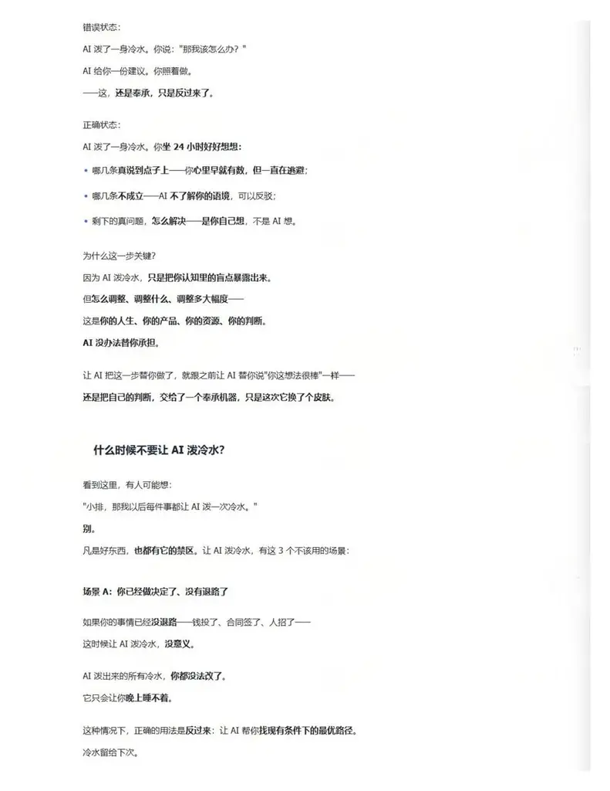

场景 B: 你正在低谷里

如果你最近刚被人否定一 投资人拒了、合伙人撤了、用户吕了、合同黄了-一
别在这个时候让 AI 小冷水。

人在低谷的时候，最需要的不是认知上的清醒，而是情绪上的稳定。
让 AT 泼冷水，只会让你陷得更深。

这种情况下，正确的用法是: 先让 AI 帮你梳理"哪几件事是真问题、哪几件事是情绪"。
把情绪和真问题分开，再去解决真问题。
冷水留到你站稳之后。

场景 C: 你只是在做一个小测试                                                                                      品

如果你只是想试试一个 prompt、改个小功能、发条小公众号一
别让 AI 波冷水。

杀鸡用牛刀，会让你做小事都疯惫。

今聊用它，跑一次。
跑完之后，在评论区告诉我: AI 泌出来的哪一句话，让你后背发凉。
期待你的反馈。

延伸资料

这一节里反复提到的 Anthropic《创业者手册》(Tjhe fpunders playbook: Builading an MAFnatkve startup)，非常值得一
读 一它是 AI 公司自己写给创业者的、罕见地把 AI 的局限性寿开揉碎了讲的一份资料。

。官方原版: https://daude.com/blog/the-founders-playbook (英文，免费，带 PDF 下载)

* 中文精读版(我整理的，把英文版的核心论点翻译 + 加了一些注解): 《Anthropic 创始人手册-中文精读版.pdf》夸
克网盘链接: https://pan.quark.cn/s/ec17968e45bb提取码: UC9d

如果你英文阅读不吃力，优先看原版; 否则中文精读版能帮你抓住 80% 的关键点，! 小时之内读充。

| 八、结构化交付学完内功篇，你已经能搭一家"会自我进化"的一人公司了
前言
这一节，是内功篇的最后一节。

也是你下场的开始。

我先问你一个问题一一

你信"1 个人 + AI = 1000 个谷歌工程师"吗?
这话不是我编的。是 YC(Y Combinator)合伙人 Diana Hu 在分享里写在 slide 上的原话:

1 person with AI tools = 1000 x Google engineer

1 person with Al tools = 1000x Google engineer

昌 “一

1 个人 + Al = 1000 个谷歌工程师

她不是在搞数学。她在说判断。

学完内功篇之前，我不信。

学完之后，我信一半。

不是因为我能写 1000 们的代码，而是因为我看见了机器在转。

什么机器?
就是接下来这节要给你拆开看的东西。

它来自 YC 最近的两个分享一一

*，Diana Hu《How To Build A Company With AI From The Ground Up》
https://www.youtube.com/watch?v=EN7frwQIbKc

*，Tom Blomfield《How to Build a SelfImproving Company with AI》

https://www.youtube.com/watch?v=t-G67yKAHBQ

合起来，他们讲了一个判断:
AI 不是旧公司的一台新发动机。AI 是新公司的操作系统。

这句话你已经听过类似版本很多次了。

但这一次，我希望你听圭之后不一样。

为什么?

因为你刚好学完了内功篇。

你已经把这台机器，在自己身上装好一半了。

强烈建议: 先读公众号原文，再回到这一节
我前几天写过一篇公众号，叫《如何用 AI 构建一家自我进化的公司》::

合 https://mp.weixin.qq.com/s/eCLgusNUXLNCJ7VkvBNAIA

Bo
8

那是理论版一
把 YC 两个视频整合成一个完整框架，12 个核心观点全在里面，看充你脑子里会有一张大图。

这一节是实操版一
所有 YC 那些宏大的判断，都会被打散、落到你今天就能做的事上。

顺序很重要: 先看公众号，再回这里。
没有理论铺底，实操会显得碎; 没有实操承接，理论会显得空。两个一起吃，效果才出得来。

接下来这一节，我会做 6 件事:

1. 把 YC 这两堂课压成 3 个核心浏断，3 分钟看充

2. 带你回头看 一 YC 说的每一件事，你的内功篇都已经讲过

3. 用我自己的真实例子告诉你: 这台机器是怎么转的

4. 告诉你下场后会撞上的 3 个墙，以及内功篇教过你怎么应对
5

6.

po
6+

. 给你一份作业 一 画你自己的"一人公司 selfimproving 系统图"
. 告诉你接下来该去练 「产品方向| ，还是直接去做「MicroSaaS|]                                           7

如果做完这 6 件事，你还是不信"一个人能搭一家会自我进化的公司"，我请你喝奶茶。
(开个玩笑。但你做完会信的。)

YC 这两堂课在说什么

我先把 YC 两堂课压缩一下。
你不用去看完整视频(虽然我推荐你看)。3 分钟，3 个判断。 看完你就能理解为什么 YC 这两个人那么激动。

判断 1: AI 不是工具, 是 0S

Diana Hu 在开场就说了一句很狠的话:

AI should not be a tool your company just uses. It should be the operating system your company runs on-

翻译过来-一
AI 不是公司用的工具，是公司本身跑在上面的操作系统。

这话什么意思?

打个比方。你公司里所有的事一一客户反馈、销售对话、工程进度、产品数据、招聘、开会_ 本来都是人在脑子里、
微信里、邮件里走的。

人是路由器。

人是 0S。                                                                                                                                        癌

AI 原生公司的 05 不是人，是信息系统 + Agent + 反馈循环。

这是一个组织形态的判断，不是一个工具选型的判断。
听不懂没关系。后面我会用我自己的例子讲透。

判断 2: 不是开环，是闭环

Bo
吕

如果你学过控制论(没学过也没关系，我马上解释)，你应该知道开环和闭环的区别。

* 开环: 做完一件事就元了。结果好不好、客户满不满意、系统哪儿出了问题
做法。

没人系统地反馈。下一次还是同样的

* 闭环: 做完一件事，结果会被测量、反馈，然后调整下一次。 每一次都比上一次好点。

旧公司大部分是开环。

开会拍板。项目做完。

销售知道一点，客服知道一点，产品知道一点，但没有一个系统把这些合起来，让下一次决策变得更好。

Diana 一句话戳穿:                                                                                                                                                   有
Open loops are inherently lossy一一开环系统天生会丢信息。

人旧公司大多是开环。Al 原生公司必须是闭环。

AT 原生公司必须是闭环。

Tom Blomfield 更狠。他说不止一个闭环，应该是一组递归的、自我改进的 AI loops，有 5 层:

工 传感器层 一 感知客户邮件、工单、产品数据、cancellations
2. 决策层 一 决定什么自动做、什么必须问人、哪些动作有风险

3. 工具层 一 Agent 能调用的确定性工具(读数据库、跑测试、提交代码)
4. 质量门 一 eval、测试、安全过渡、高风险动作的人审
5. 学习机制 一 失败被反馈回循环顶部，系统下次自己变好

Tom Blomtfield . Alloops 5 层

Learning .学

Quality Gate 质量门 一 测试 / eval / 人审

Tool . 工具层 一 Agent 能调用的确定性工具                  loop

Policy ' 决策层 一 自动 / 人审 / 记录的判白

Sensor ' 传感器层 一 客户邮件 /

5 层跑起来，这就不再是"自动化"了。
这是把公司局部变成了一个会学习的系统。

判断 3: 不是 productivity，是 capability

最重要的一个判断，我放最后讲。

大多数人现在还把 AI 理解成productivity tool 一让工程师写代码快 20%，

Diana 说，这是错的心智模型。

AI 带来的不是 productivity，而是 capability。
翻译:

AI 带来的不是效率提升，而是能力跃迁。

差别在哪儿?
* 效率提升是: 旧工作变快了。

* 能力跃迁是: 过去一个人根本做不了的事，现在一个人能做了。

这就是为什么会出现那句:

1 person with AI tools = 1000x Google engineer

它不是说一个人写代码比 1000 个 Google 工程师快。
它说的是-一

过去需要 1000 人组织起来才能做到的事，现在一个人也能做到。

Productivity“' 生产率提升

让客服回复快 30%，让销售写邮件快一
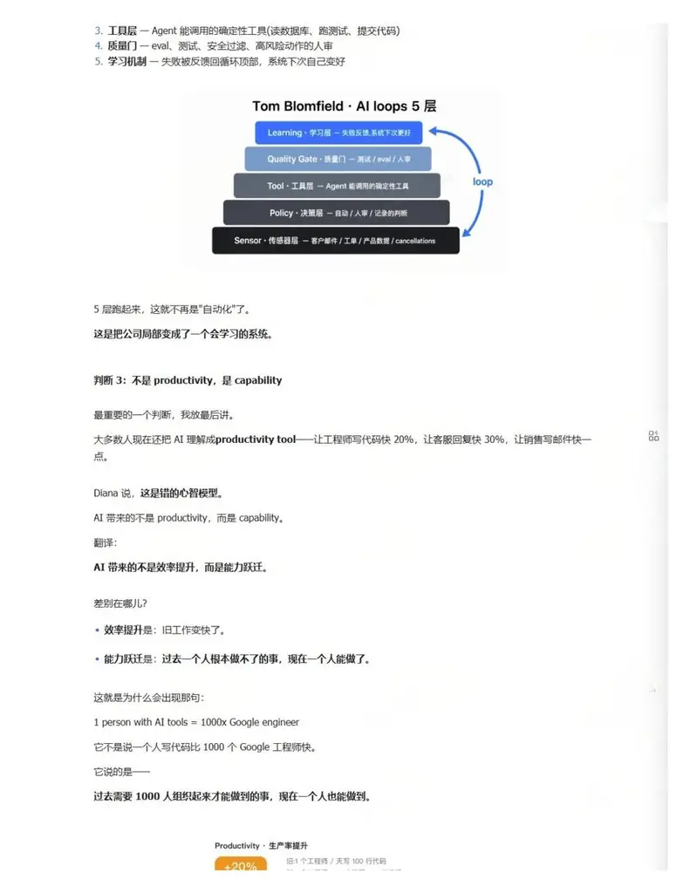

Capability“， 能力跃迁

01     新1 个人 + Al Agent侧到了

村:1 个工程师 + Al / 天写 120 行代码

1641 个工程师做不到自动化客服+选品*定价

效率提升是旧工作变快。能力跃迁是过去做不到的事,现在做到了。

举个例子。

过去你想做一个跨语言、自动客服 + 自动选品 + 自动定价 + 自动
品经理、运营、客服主管、数据分析师。

现在? 你一个人加一套 Agent 系统，就能跑起来。

这就是 capability，不是 productivity。

这套话讲给谁听?

讲给大公司听- 是劝退。
大公司有旧系统、旧流程、旧组织。
改不动。每动一下都可能弄坏已经在跑的东西。

讲给你听-一是路标。
因为你刚好学完了内功篇。
你已经具备了搭这台机器的记层能力。

下一段，我们就来对照看 一 YC 说的每一件事，你的内功篇都讲过

你以为你在内功篇学什么?

我先给你一张对照表。
左边是 YC 在两堂课里反复强调的东西。
右边是你在内功篇每一节学的东西。

出报表的电商系统，你需要一个团队: 工程师、产

，只是当时你不知道它在 YC 那边叫什么名字。

4
60

YC 在说的                                                你在内功篇学过的

legible to AI(对 AI 可读)                       《上下文工程: 把 AI 当成会失忆的实习生》
software factory(软件工厂)                         《SPEC 驱动开发.进阶篇》

legible code(对 AI 可读的代码)                 《对 AI 友好的代码: 高内聚 + 低克合 + 单一职责》

builder-operator(造东西的人)
closed loop quality gate(闭环质量门)

AI loops(AI 自我进化的 5 层)

《单元测试: 让 AT 写完

《程序员心法: YAGNI + KISS + 命名 + 快速失败》

，自动检查》

《AI 团队架构进阶: 从 荆个 AI 到一支编队》

humans at the edge(人在边缘)                《AI 唯一正确的用法: 让它泼你冷水

YC 说的话 * 你在内功篇学的事
ea                                                               eye
esawma                                       1
nzr                      让
ma                   本
ia                     ooon comaves aa
aa
Ta
aa                                   1

人

7行。

你扫一遍。

如果你 7 节都学序了-一

恭言。

你已经把 YC 在大公司层面要装的整套机器，在自己身上装好了。
只是你的"公司 规模是 1。

下面我挑 3 个最关键的对照，展开讲一下。剩下 4 个你看完表格，自己会有感觉。

对照 1: legible to AI vs《上下文工程》

Tom Blomfield 原话很狠:

如果没有被记录，它对你的 intelligence 来说就没有发生。

什么意思?

一次重要会议如果没记录，就等于没进入公司大脑。

一个客户需求如果只停留在某个人微信里，就等于不存在于系统里。
一次关键销售对话如果没沉淀，就不能训练下一次销售。

YC 内部因为这个判断，做了一件很重的事:

* 录所有 office hours(最近三个月录了 2000 小时)

* 保存合伙人邮件

* Slack、DM、客户沟通，尽可能全部纳入系统

* 然后把这些东西灌进 AI Agent，让它能查、能调、能学

目的不是监控员工。
是为了让公司有一个能学习的"大脑 。

YC 这么干，是为了应对几百家投资公司、十几个合伙人、几千个 office hours。
那你呢?
你一个人，根本不需要这种规模。

但你在《上下文工程》那一节里学的事，逻辑上跟 YC 是一样的。

* 你的 CLAUDE.md 一一 是你给 AI 写的工作说明书

* 你的 reference/ 文件夹 一- 是你踩过的坑、沉淀下来的知识
* 你的项目 memory 一一 是 AI 跨会话记得你的上下文

* 你的 MCP 配置 一 是 AI 能洞用的工具集

* 你的 skills 一 是把你的工作流程封装成可复用的能力

IE
个
侈”skils/ 一 可复用能力封装
人
praject memory 一路会话上下广       conte
时 。 "reference/ 一 踩过的坑沉淀          栈

目 CLAUDE md 一 你给 Al 写的工作说明书

MYC 昌 2000 ,4 office hours 估为了这个。 作不用 2000 小94 爷浊要这 医-

如果你 7 节都学序了-一

恭言。

你已经把 YC 在大公司层面要装的整套机器，在自己身上装好了。
只是你的"公司"规模是 1。

下面我挑 3 个最关键的对照，展开讲一下。剩下 4 个你看完表格，自己会有感觉。

对照 1: legible to AI vs《上下文工程》

Tom Blomfield 原话很狠:

如果没有被记录，它对你的 intelligence 来说就没有发生。

但 YC 的多辑，对你 100% 有意义。

对照 2: closed loop quality gate vs《单元测试》

YC 整剖观点里. 有一个最容易实低估的概念:

+
60

+
6

oo
B+

质量门(quality gate)。

Tom 讲 AI loops 那 5 层时，第 4 层就是 quality gate 一eval、测试、安全过滤、高风险动作的人市。

听起来很高大上。
其实非常朴素-一

没有质量门的闭环，就不是闭环，是放羊。

YC 那个让所有人激动的"AI 在夜里自动改代码并合并"的故事，大家只看到了"自动改 + 自动合并"这一段，激动得不

行。

但 Tom 自己讲的时候,

反复强调的是中间那个 review 环节。

一个 Agent 写代码，提交合并请求-一

另一个 Agent review 之后才合并。

没有这个 review，你就是在让 AI 把烂代码无人监管地推上线。
闭环就变成了放大失败的循环。

你在《单元测试: 让 AL

写完，自动检查》那一节学的事，本质上就是 quality gate。

* 你让 AI 写代码，自动跑测试。

* 测试不过，自动 revert 或者继续修。

* 测试过了，才进入下一轮。

这就是闭环里那个 quality gate。

少了它，你的 AI 帮你写代码这套流程，跑越快越危险。

加了它，你才敢让 AT 在你睡觉的时候继续干活。

YC 在大公司层面要的 quality gate，是 review agent。

你在自己工作流里要的 quality gate，是单元测试 + 你定期跑的 codex review。

雇缉完全一样-

没有质量门

[Asea 一| 提交 ]=| 于 |

闭环 = 放大失败的循环

没有 review,闭环就变成放大失败的循环。

吕
60

DD
67
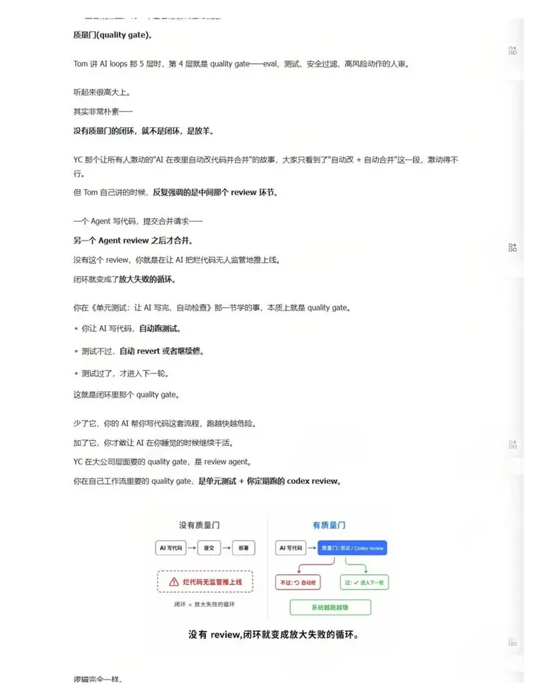

对照 3: AI loops 5 层 vs《AI 团队架构进阶》
最后一个对照，留给整套 YC 观点的高潮一自我修复的 AI loop。

Tom 在分享里讲了一个故事，他叫它 "holy shit moment'。

YC 一开始做了一个 Agent，能查内部数据库。

比如你问"我上次和这家公司 office hours 是什么时候? "，它能查出来。

后来变陪明了。

比如有赤公司需要石油化工(petrochemicals)领域的人脉介绍，它能查 YC 数据库，用 RAG 找出几个相关创始人。

这还是 sidekick。Copilot。

让人快 20%、30%。

让本的 DY 8 or在后页 二wx。

YC 那个让所有人激动的"AI 在夜里自动改代码并合并"的故事，大家只看到了"自动改 + 自动合并"这一段，激动得不
行。

但 Tom 自己讲的时候，反复强调的是中间那个 review 环节。

一个 Agent 写代码，提交合并请求-一

另一个 Agent review 之后才合并。

没有这个 review，你就是在让 AI 把烂代码无人监管地推上线。
闭环就变成了放大失败的循环。

你在《单元测试: 让 AI 写充，自动检查》那一节学的事，本质上就是 quality gate。

本
* 是不是需要一个新素引?

然后最关键的事情发生了一

系统会在夜里写代码，提交合并请求，让另一个 Agent review，再合并、部署。
第二天，员工再问同一个问题，它就能成功。

这就是 Tom 的 holy shit moment。

不是"AI 帮有我快了一点 。
而是

AI 开始让系统本身更强。

YC的 holy shit moment . monitoring agent 自我修复

轩

oo

站

8

策划毅 -Agent拓于                人@@                        人《                          和-天

asian 吵 am 吵       商量:        串。 3TR-动
商         Pd       aa      et       评
二     Ren Agpt责3

AI 开始让系统本身更强 一 公司在你睡觉时变好

你在《AI 团队架构进阶: 从 1个 AI 到一支编队》那节里学的事，是 YC 这一整套的最小可行版本。
* 你的 subagent 一 是不同职责的 Agent 分工

* 你的 codex 跟 Claude 互相 review 一一是 review agent 机制

* 你定期看 AI 失败模式 一一是 monitoring agent 的雏形

* 你失败之后补一条 skill 或一条 reference 一一 是"夜里写代码改进系统"的微缩版

YC 那个故事是几十个工程师 + 内部数据库 + 自动化 CCD，你做不到。

你做的是一

这周 Claude 在某件事上失败了，周未我花 20 分钟号一条 skill，下次它就不会再错。
规模不一样。

但逻辑一样。

你在搭一台同款机器，只是马力小很多。

剩下 4 个对照，我就不展开了，但你扫一眼应该有感觉一

*。 software factory: YC 在大公司层面是"写 spec + tests，AI 写实现"。你在《SPEC 驱动开发.进阶篇》学的是同一

套，只是你的 spec 是写给自己的项目。

*。 legible code: YC 说代码必须对 AI 可读才能被自动改。你在《对 AI 友好的代码》学的高内聚、低耘合、单一职

责，就是让你的代码进入"可被 AI 重写"的状态。

* builder-operator: YC 说"会议上不要带 PPT，要带能跑的原型"。你在《程序员心法》学的 YAGNI、KISS、快速失

败，就是让你成为那种"能直接造东西"的人。

* humans at the edge: YC 说人要站在公司大脑和真实世界接触的地方一做高风险判断、复杂人性、新奇场景。
你在《AI 唯一正确的用法》学的"让 AT 小你冷水"，本质就是把自己定位在判断者的位置上，而不是当执行者。

7 个对照，7 节课。

你不知不觉，已经在搭一台 YC 在押注的同款机器。

我是怎么用这台机器写课程的

到这里你可能还是会觉得抽象。
我用我自己干的一件事举个例子 这门课本身。

Go

我没有团队。我也没专门为这门课请人。
但你现在看到的这些课、文章、PPT、直播，节奏比一个 5 人小团队还快。

这不是因为我特别能写。

蜡风为我要 写课程'议件事本身，衬蕊了全少号 生figRoYi 可震, ooee axms

运同                 KG
-get和                人@@                    ET                                                       于-天
om  吵 am 吵        商量:         轴。 aTRR 有动
X               村相交            sa          ee            密
3              sen Agpr调-93

Al 开始让系统本身更强 一 公司在你睡觉时变好

你在《AI 团队架构进阶: 从 1个 AI 到一支编队》那节里学的事，是 YC 这一整套的最小可行版本。
* 你的 subagent 一一 是不同职责的 Agent 分工

= App rrqdov 昌 rhondo 万相 ragiolw Ta 晤JSYB anonttn二|

栽狗"写课稳        一台 self-improving 机器

Tool . IRR 一

Policy ,决策层 一 吨位灾新刘?

Sensor . 传器层 一 僚 / 和证/ 漳冰| 避自忆

规模是 1。 第一节刘用一期。开发和第十几节,每节 2-3 天。

5 层，跟 YC 那 5 层完全对得上。
只是我的规模是 1。

结果是什么?

我开发第一节课用了大概一周。

开发到第十几节课，每节平均 2-3 天就能成稿。

不是因为我变熟练了一一

是因为机器变厚了。

每一次失败、每一次踩坑、每一次别扭，都变成了机器的一部分。
下一次我做同样的事，就站在更高的地方开始。

这就是 Tom 说的-一

公司在你睡觉时变好。

我的"公司 烦模是 1。
但我的"公司"也在我硒觉时变好。

还记得 A 先生吗?

我们在《Skills 和 SOP》那一节，讲过一家深圳的电商公司一A 先生衣全员铺 Claude Code。

我当时讲他，主要讲"AI 当员工"。
现在你回头看，A 先生那守公司，也是一台 self-improving 机器.。

电商这门生意，数据维度多到吓人一一

* 投放数据: 拌音 / 小红书 / Google Ads 的 CTR、CPM、ROI、转化漏斗
* 销售数据: 订单、客单价、复购、退货率、热销 SKU

* 独立站访问数据: GA/ Plausible / 自建分析，UV、停留时长、跳出

*。 Boss 直聘简历: AI 自动打分，算人

* 客服沟通: 微信、WhatsApp、邮件，每天几百上千条

* 供应链沟通: 工厂、采购、物流、催单

*。选品研究: 竞品息虫_TikTok 趋势、Amazon 排行

* 内容创作: 短视频脚本、商品图、详情页文案

。 财务数据: 回款、账期、汇率、退税

这么多维度，过去得一整个团队分头看。

A 先生衣的做法 一 每个数据流都接一个 AI Agent，每个 AI Agent 背后挂一个写好的 skill。

新闻一来，AI 翻译解读;
订单一进，Ar 自动归类;
简历一投，AI 直接打分;
客服一响，AI 先回 80%，卡壳的再转人。

A 先生家:每个数据流接一个 Al Agent

投放数据             销售数据            牌立站访问              全
创 民 里

Boss 直央简历 。。 襄服沟通               供应链

国 | 僵人外

一e@
一e@
一@
一

go
8

三一

日个数据维度 9 个 Agent + 9个 skil = 一外中通的 self-improving 机器

BD
B

工具上，他们用的大部分都在《AI 即员工》那一系列里讲过了一一

* Hermes / OpenClaw 一一 在每个讽位的电脑上，装上不同 profile 的 Agent

* Claude Cowork(《CoworkCodex》那节)一 让 AI 直接交付结果，你不用看代码
* 每个员工写自己的 skill，把 AI 当员工管

(怎么用 Hermes 给离位装 Agent、怎么让 Cowork 让 AI 干完整任务，《AI 即员工》那个章节都讲过了，这里不重
复。)

回到 selfimproving 的视角看 A 先生这地公司 一一

* 全员铺 AI，是把公司变得对 AI 可读(legible to AD

* 每个人写自己的 skill，是把公司知识变得可复用、可调用
* 周报、客服记录、选品笔记、错误日志，全部沉淀进系统

* 这一周 AI 哪里失败了、哪个亢位卡达了，直接补 skill

A 先生的公司规模比我大，但思路完全 样。
他和我都是把 YC 那套机器，
搭到自己手里能驾驭的规模上。

HEXIN 老师一1个人 + 15 个 AI Agent 做量化

A 先生是把电商公司搭成机器。
我自己是把写课程搭成机器。
我再给你讲一个最近让我特别焉撼的一 量化交易。

DD
8

主角叫 HEXIN(何老师)，我深海图三期的学员，也是生财有术图友。
中和的册站-=

这么多维度，过去得一整个团队分头看。

A 先生衣的做法 一 每个数据流都接一个 AI Agent，每个 AI Agent 背后挂一个写好的 skill。

新闻一来，AI 翻译解读;

订单一进，Ar 自动归类;

简历一投，AT 直接打分;                                                                                                                                            点
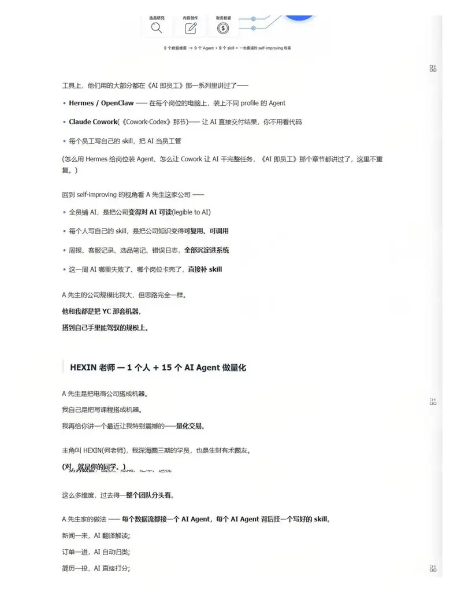

客服一响，AI 先回 80%，卡壳的再转人。

A 先生家:每个数据流接一个 Al Agent

抽攻时           人多舍数据          和立站访同           地

HEXIN 怎么定义自己的公司?

他自己讲过一句话-一

"我不是在做一家传统意义上的量化公司，我是在做一个实验-一验证'人+AT这种新型协作模式，能否在量化这个高度

专业化的领域里，跑出属于自己的节奏。”

注意这句话的关键词-一
喧验"。

不是"创业"。

是"实验"。

他在跑一个跟 YC 押注完全一样的实验-一

一个人+ 一组 AI Agent，能不能跑赢传统团队?

15 个 Agent 怎么分工?

HEXIN 在 16G 的 Mac Mini 上同时跑 3 个 Hermes + 1 个 Codex + 1 个 Glaude Code。

每个 Hermes 多个 profile，每个 profile 独立的 workspace 和记忆。

7 个核心 Agent 的职责分工一一
Agent                               职责
新闻监控                           Twitter KOL 消息监控、翻译、信号解读
基本面分析                        AI 驱动的公司基本面研究
技术面分析                        K 绪图分析、技术指标解读
量化策略开发                   基于已有代码的 AI 二次开发
回测                                 历史数据验证策略效果
量化选股                           AI 辅助选股短选

投研资料分析                         知识库整理与辅助研究

go
67

go
3

他过去 9 年是拌音电商广告产品运营负责人，曾主导巨量千川广告平台从 0 到 1。
2026 年 2 月，他从大厂出来，成立了一衣 1 人公司: HEXIN-AI。

方向: AI + 美股量化交易。

团队配置一

*工个硫基生命(他自己)

*14个AI Agent(后来扩到 15 个)

到今年 5 月，半年收益超过 80%。

我先把数字放在这里。

下面我们看介星怎么棋这会机器的

最终决策这一层，HEXIN 自己干。

不让任何 Agent 读其他 Agent 的输出来做决策。
"我信不过他们。万一读错了钱没了。”
一HEXIN

这就是 Tom 反复说的-一
人在边缘，机器在管道。

Agent 做信号采集、翻译、解读、回测-一这些是确定性、低风险的"管道工作"。
但判断和承担后果一一HEXIN 自己来。

为什么用 Hermes 不用 OpenClaw?

HEXIN 一开始用 OpenClaw。后来换 Hermes。

2 个原因-一
1. OpenClaw 稳定性差-一平均每周坏 2 次。

2. OpenClaw 更废 Token一一它把旧聊天记录一股脑全传给 AL，导致上下文越积越长，模型"污染"越多，回答跑
偏。                                                                                    习

Hermes 架构更清晰: 登录、消息般道、模型配置分模块管理，不同 Agent 之间不会互相"污染

HEXIN 把团队里 8 只 OpenClaw 换成 3 只 Hermes，足够用。

(关于 Hermes 和 OpenClaw 的具体配置，OpenClaw 那一节专门讲过。)

Hermes 在量化里的 6 个实操

这是整套案例里最干的部分。我整理 6 个关键模块，每一个你都能直接抄过来用一

1配置 Hindsight 长期记忆
让 Hermes 拥有跨会话的记忆一一记得你的交易喜好、当前持仓、过去的判断。
HindSight 提供"星座视图"，每个记忆节点可以点击查看。

工具: https: //ui.hindsight.vectorize.io/

2. 新闻交易 一 Twitter KOL 监控

丙至 nmidAnr 垃 下or 用vi 池自败坟

HEXIN 的 7 个核心 Agent 分工

1. 新闻监控
ToanerKOL /本1信和

2. 天本和分析                                           3.而村
公司到本本史                                                    如1接术指标

化策晤开发                   f                         5
要已肛交下                                                     re

HEXIN
6. 量化选股                                                        7. 投研资料分析
站3                                                                 到和

和这一层 HEXIN 自己 一“和信不过他们. 万下全了虹肌了。

注意一件事一一

用 Tavily ApI 联网搜索。

HEXIN 分享过一个"全球宏观对冲基金经理"角色的 Prompt，每周生成《全球市场核心交易策略周报》，包含-一
*， 宏观日历(CPI / PCE / GDP / 非农 / FOMC)

* 地缘与政治事件

* 企业财报(科技七巨头、半导体、能源)

* 市场情绪(VIX、Crypto 信禁恐懂指数)

* 丈辑链推演 + 结构化操作建议

5. 知识库 一 Obsidian + IMA + NotebookLM

三个笔记T且.都可以育讨 Aoent 调用一一
为什么用 Hermes 不用 OpenClaw?

HEXIN 一开始用 OpenClaw。后来换 Hermes。

2 个原因-一
1. OpenClaw 稳定性差-一平均每周坏 2 次。

2. OpenClaw 更废 Token一一它把旧聊天记录一股脑全传给 AL，导致上下文越积越长，模型"污染"越多，回答中
偏。

Hermes 架构更清晰: 登录、消息般道、模型配置分模块管理，不同 Agent 之间不会互相"污染

日
8

二
间

HEXIN 把团队里 8 只 OpenClaw 换成 3 只 Hermes，足够用。

1兰干 Harmac 和 nnanrlaw 的目休而团”mnanrlaw BR一共去门Htit 、\

光一庶拟盘民4 实盘

可经验       让和改进       历史数据验证     模拟仓路满 1 个月

回测漂亮 关 实盘赚钱。虚拟盘是关键防过拟合环节。

HEXIN 当前在并行跑 4 个模拟盘策略。

HEXIN 踩过的 3 个大坑

名目 aprunrl 坟 mac ，由 Nur Pamrr。

AI 自动赤译、解读、信号提醒。

最近 Grok 跟 Hermes 合作，可以直接调 Grok 搜 Twitter。

3. 基本面 / 技术面分析

不要截图 K 线图给 AI一误差大，模型对视觉信号的理解非常不可靠。
正确做法是调 MCP一一

*，TiadingView MCP(免费，测试区免)

*，TiadingView Skill: npx skills add jsd666/openclaw-tradingview-quant
*A 股可以试富途 Skill

4 . 联网搜索 一 宏观分析

用 Tavily API 联网搜索。

HEXIN 分享过一个"全球宏观对冲基金经理"角色的 prompt，每周生成《全球市场核心交易策略周报》，
* 宏观日历(CPI / PCE / GDP / 非农/ FOMO)

*。 地绿与政治事件

* 企业财报(科技七巨头、半导体、能源)

”市场情绪(VD(、Crypto 信禁丽民指数)

* 远辑链推演 + 结构化操作建议

5. 知识库 一 Obsidian + IMA + NotebookLM

三个笔记工具，都可以通过 Agent 调用-一

唱+
60

包含-一

* 0bsidian 一 让 AI 把资料整理成 md 文件，双链做索引。杂乱的 Twitter 内容自动变成时间线、按个股的目录结
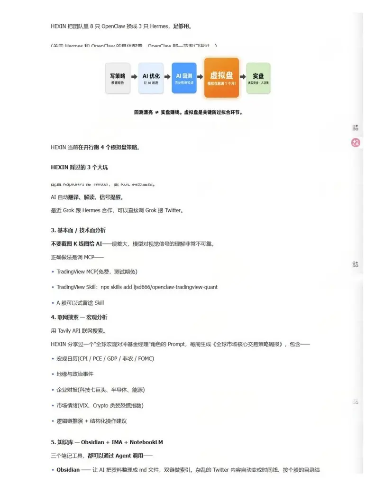

构

* IMA / NotebookLM 一 存大量投资资料，Hermes 直接调，相当于一个专属知识库

6o

6. 自动化交易 5 步流程
1 写策略(根据经验)
2. AI 优化(让 AI 改进)
3. AT 回测(历史数据验证)
4. 虚拟盘(模拟仓跑满 1 个月一这一步是关键)
5. 实盘(真实资金)
HEXIN 自动化交易 5 步流程
写策略 吵 Al优化 中区 症。国:让届光，实盘
根据经验       让向改进      历史数据验证             月     诅训次金人决策
回测漂亮 闪 实盘赚钱。虚拟盘是关键防过拟合环节。
HEXIN 当前在并行跑 4 个模拟盘策略。
HEXIN 踩过的 3 个大坑

下面这部分，直接是钱买来的教训。

坑1: 用OpenClaw 管 Agent，AI 越用越"糊涂"

OpenClaw 把历史对话上下文一股脑传模型，上下文越积越长，模型污染越多。
平均每周 1-2 次不可用。

解药: 切到 Hermes。架构更清晰，精确控制每个 Agent 的上下文范围。

坑 2: 回测漆亮，实盘翻车

美股个股动量策略回测表现很好。模拟仓两周回撤 12%。

西四区Mo4 AT 雷上友人几本-上”， 币鸭SHA/亢d示安。雯” 说人地一部和让\

半年 80%+ 收益，在他眼里还在第一圈。

最后这句话，我想直接引出来-一

"一个每天都在认知上前进 点点的人，和一个原地踏步的人，7 年后的差距，不是线性的

利最残酷、也最迷人的地方。"

一HEXIN

，是指数级的。这，就是复

几个让我看完最受启发的洞家

1. AI 是杠杆，但杠杆放大的是你的认知。 AI 大幅降低策略开发的门槛，但放大的是你已有的认知。对市场理解模糊
一 AI 给的答案也是错的。最大收获不是跑通策略，是学会向 AI 提出更好的问题。

2. 不要让 AI 做决策。 HEXIN 7 个 Agent 各自有专精方向，但决策那一层他自己干。这就是 YC 说的 humans at the
edoge。

3. 真正的策略不是 AI 写的，是让 Codex 在已知代码上改。 HEXIN 原话: “AI 量化就是让 Claude 写策略代码吗? 这
个就完下了。真正的第略都是让 Codex 在已知代码上改。"你没认知的时候 AI 给你的就是空气。你有认知的时候
AI 给你的是杠杆。

4. 市场是最诚实的老师。 每一次回撤都是给认知系统打补丁。这就是 self-improving。

A 先生把电商公司搭成机器。

我把写课程搭成机器。

HEXIN 把量化交易搭成机器。

3 个例子，3 种行业，1 种远辑。

你下场后，你做的事 一一 不管是 Saa5 还是 App 还是内容 一一 都可以套这个机器。
你也可以。

oo
8+

下场后你会撞上的 3 个墙

讲到这里，你大概率心里在想:
"听起来很邦，但我现在自己做产品，有具体会卡在哪儿? ”
我说 3 个你下场后几乎一定会撞上的墙，以及你在内功篇里已经学过怎么应对。

墙 1: 你让 AI 写代码，它写得乱七八糟

Bo
8

这是几乎每个人第一周都会撞的墙。

你打开 Claude Code，说"帮有我写个登录页 "。

它写了。

你看了一能跑，但风格不对、命名不对、跟你项目其他地方对不上、之前讲过的事它又忘了。
你骂 AI 笨。

其实不是 AL 笨。

是你没给它上下文。

应对方式:
* 写一份 CLAUDE.md(在《上下文工程》里学过)
* 把项目惯例、命名风格、踩过的坑写进去

* 关键流程写成 spec(在《SPEC 驱动开发`进阶篇》里学过)，让 AI 按 spec 走，而不是自由发挥

访一步备款，AT 写出来的代码会路你写的一样-
半年 80%+ 收益，在他眼里还在第一圈

最后这句话，我想直接引出来-一

利最残酷、也最迷人的地方。"”

一HEXIN

几个让我看完最受启发的洞家

1. AI 是杠杆，但杠杆放大的是你的认知。 AI 大幅降低策略开发的门槛，但放大的是你已有的认知。对市场理解模糊
一 AI 给的答案也是错的。最大收获不是跑通策略，是学会向 AI 提出更好的问题。

2. 不要让 AI 做决策。 HEXIN 7 个 Agent 各自有专精方向，但决策那一层他自己干。这就是 YC 说的 humans at the
edoge。

总v记二人rwwae本吕 -一作 er

* 关键功能加单元测试(在《单元测试》里学过)，AI 写充自动跑，不过自动改
* 定期让 Codex 或 Claude 来 review 你这周的工作(《AI 团队架构进阶》里学过的 subagent 互查)

*。 AI 反复犯的错，写成一条 skill 或 reference，从根上杜绝

这一步做计，AI 的错会越来越少，而不是反复出现。

墙 3: 产品要加新功能，你不知道该砍哪儿
第二个月之后，你会撞这堵墙。

产品慢慢长大，新功能要加，但你越来越不知道该改哪儿一
下场后你会撞上的 3 个墙

讲到这里，你大概率心里在想:
"听起来很邦，但我现在自己做产品，有具体会卡在哪儿? ”
我说 3 个你下场后几乎一定会撞上的墙，以及你在内功篇里已经学过怎么应对。

墙 1: 你让 AI 写代码，它写得乱七八糟

这是几乎每个人第一周都会撞的墙。

你打开 Claude Code，说"帮有我写个登录页 "。

它写了。

你看了一能跑，但风格不对、命名不对、跟你项目其他地方对不上、之前讲过的事它又忘了。
你骂 AI 笨。

其实不是 AL 笨。
是你没给它上下文。

应对方式:
* 写一份 CLAUDE.md(在《上下文工程》里学过)
* 把项目惯例、命名风格、踩过的坑写进去

* 关键流程写成 spec(在《SPEC 驱动开发`进阶篇》里学过)，让 AI 按 spec 走，而不是自由发挥

这一步做元，AI 写出来的代码会跟你写的一样。

墙 2: 跑久了，AI 反复犯同一个错
第二周到第二个月之间，你会撞这堵墙。

某个错误，你已经纠正过它 3 次了。
第 4次它又来。
你心态炸了一"我教过你 3 次的事你怎么又错? "
这时候你需要的不是"再骂一次"，是-一
给它装一个 quality gate + monitoring 。
序克匠wmvccomy 人xxcp，maupecpzm
* 这周 AI 哪里失败了?
* 你有没有沉淀一条 skill 或 reference?
* 如果没有，这就是开环。
画充图，你做最后一步一

图出"还没闭环"的环节。
下周，选一个(只选一个)补上。

不要贪多。
补一个，稳一个。
机器是这样一点一点变厚的。

作业:画你自己的'一人公司 self-improving 系统图

go
67

吕
疗

30 委种之内要充。加出二环环W。下周补一个。

这个作业你 30 分钟之内就能画充。
但它的回报，是接下来你每一次 AI 协作，你都知道自己在搭什么。
不要跳过这个作业。

下一步: 「产品方向| 「MicroSaaSs」 「App 与小程序」在等你

内功篇到这里结束了。
7 节内功 + 工节收尾。
接下来你应该去哪儿?
很简单-一
去做产品。

[产品方向| 那一篇告诉你什么 idea 值得做，什么不值得。
TMicroSaaS|」那一篇教你怎么做小而美、低风险、能赚钱的产品形态。
TApp 与小程序」 那一篇教你怎么做 to C 产品一如果你想走这条路。

但是你下场的姿势已经不一样了。

练完内功之前，你下场是"我去做一个产品"。
练充内功之后，你下场是一
"我去搭一台会自我进化的机器，这台机器恰好会输出一个产品。”

差别在哪儿?
差别是，别人在做产品，你在搭机器。

产品会过时，机器不会。

下一个产品、下一个 idea、下一次重写，你不用从零开始。
你的 context、你的 skills、你的 reference、你的 quality gate -一全部都还在。

go
时

DD
87
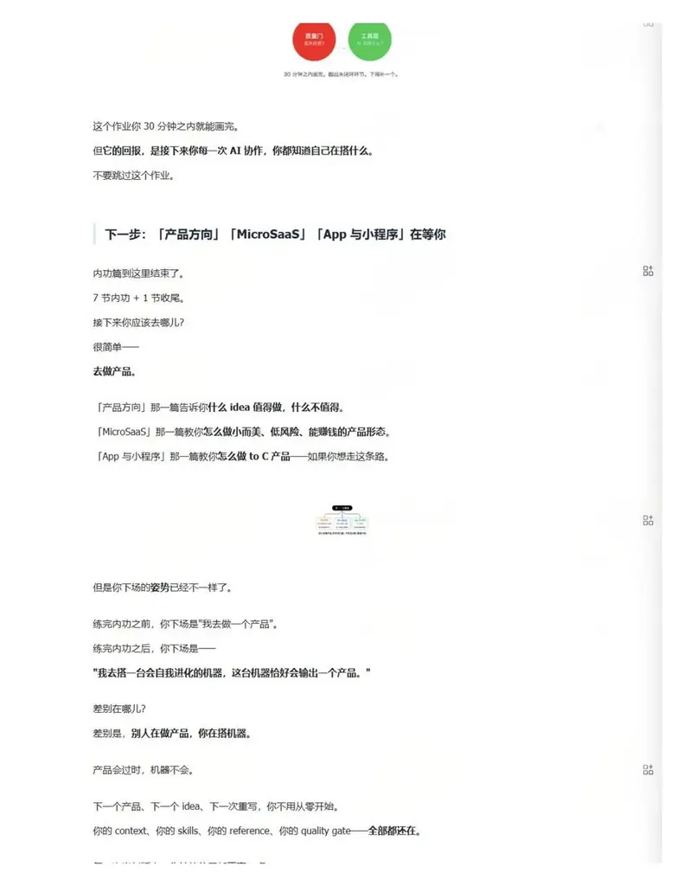

每一次出新上不，你站的位善郡蝎局一息。
这就是为什么 Tom Blomfield 一直在说一一
Burn tokens，not headcount.

你不是在堆 token 数量，你是在用 token 喂养一台越来越聪明的机器。

你不需要"建一家自我进化公司"，你已经是了

最后，我想把这一节收尾在一句话上一
你不需要"建一家自我进化公司"。
你已经是了。

YC 那些宏大的话，听起来像是给大厂创始人、给 VC 投资经理、给已经 IPO 的人说的。
但你回头看-一

你写的每一个 CLAUDE.md、每一条 skill、每一次 codex review、每一份 spec--一

都是一家会自我进化的公司，装在你一个人身上。

YC 在押注的"AI 原生公司 形态，不一定是 100 人、500 人的公司。
它最干净的样子，可能就是一个人 + 一台机器。
那个人是你。

那台机器，在你练完整套内功之后，已经在你手里了。

我做这门课的时候，常常会想到一个画面

不是"刘小排在写课"。

而是"刘小排和一台机器一起在写课"。

那台机器蔡我记忆、车我检查、车我搜索、车我画图、车我对话、车我刷代码、车我跟自己吵架。

我做的是一
判断、选择、刹车、定义品味。
你也可以。

你的机器今天可能比我的小很多。

一点变厚的。
你今天轿出来的那一个"没闭环 '的环节，下周补上，机器就厚一层。
100 天之后，你回头看-一
你也会有 Tom 说的那个时刻-一

holy shit moment。

Do
8+

Do
8

不是 AI 帮你快了一点。
而是某一天你打开电脑，发现一一
你的公司开始自己变好了。

Youare already a self-improving company.
你已经是一家会自我进化的公司了。

内功且玫必

那一刻，你才会真正相信-一
工个人 + AI = 1000 个谷歌工程师

这句话，不只是一个 siide 上的口号。

再次强烈推荐: 配合公众号原文阅读。
公众号那篇是理论版，把 YC 两个视频的完整逻辑都讲透了:

佐 https://mp.weixin.qq.com/s/eCLgusNUXLNG7VkvBNArA

这一节是实操版，是把那篇文章里所有判断，翻译成你今天就能开始做的事。

两个一起读，效果最好。

内功篇到这里就结束了。
去下场吧。
我们下一节课见。

不是"刘小排在写课"。
是 刘小排和一台机器一起在写课"。
那台机器某我记忆、革我检查、革我搜索、车我画图、革我对话、

我做的是一
判断、选择、刹车、定义品味。
你也可以。

车我刷代码

、车我跟自己吵架。

你的和|刻今大吕能比找鸭小很多。

没关系。

机器是这样一点一点变厚的。

你今天圈出来的那一个"没闭环"的环节，下周补上，机器就厚一层。
100 天之后，你回头看-一

你也会有 Tom 说的那个时刻-一

holy shit moment。

不是 AI 帮你快了一点。
而是某一天你打开电脑，发现一一
你的公司开始自己变好了。

Youare already a self-improving company.
你已经是一家会自我进化的公司了。

内功量玫必

那一刻，你才会真正相信-一
工个人 + AI = 1000 个谷歌工程师

这句话，不只是一个 sliide 上的口号。

再次强烈推荐: 配合公众号原文阅读。
不是"刘小排在写课"。
是 刘小排和一台机器一起在写课"。
那台机器车我记忆、车我检查、车我搜索、蔡我画图、某我对话、车我刷代码、若我跟自己吵架。

我做的是-一

判断、选择、刹车、定义品味。
你也可以。

你的机器今天可能比我的小很多。
没关系。

机器是这样一点一点变厚的。

你今天轿出来的那一个"没闭环"的环节，下周补上，机器就厚一层。

100 天之后，你回头看-一
你也会有 Tom 说的那个时刻一

holy shit moment。

You are already a self-improving company.
你已经是一家会自我进化的公司了。

那一刻，你才会真正相信一一
工个人 + AI = 1000 个谷歌工程师
这句话，不只是一个 slide 上的口号。

再次强烈推荐: 配合公众号原文阅读。
