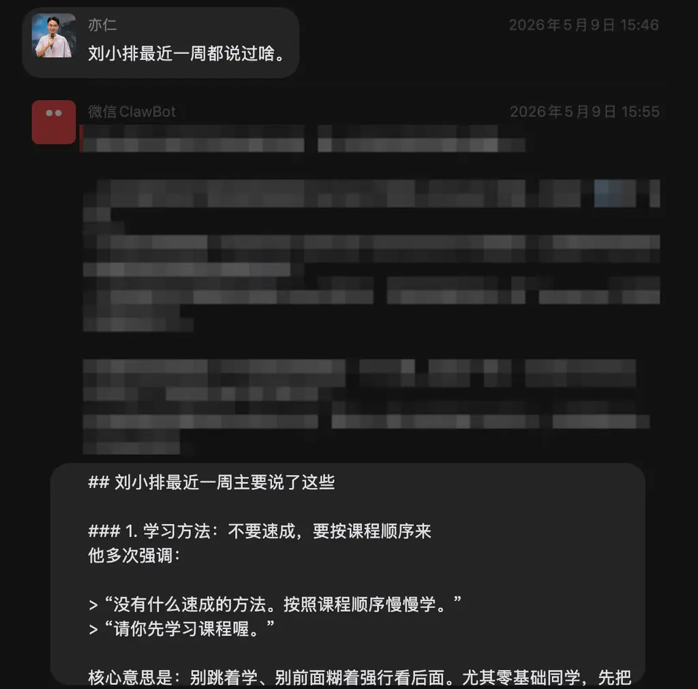
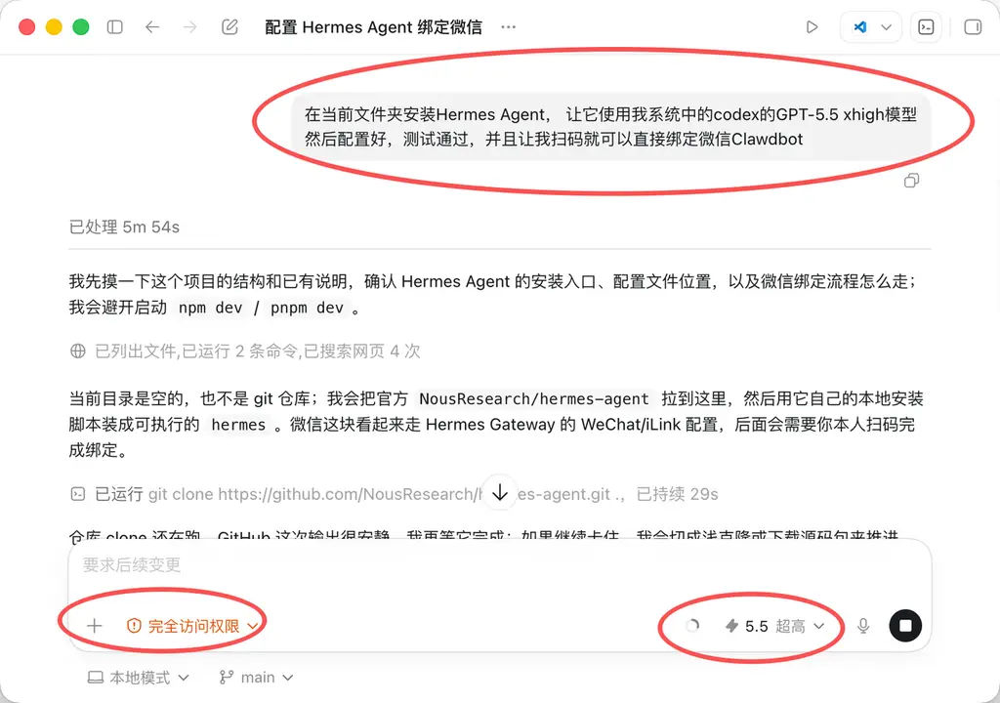
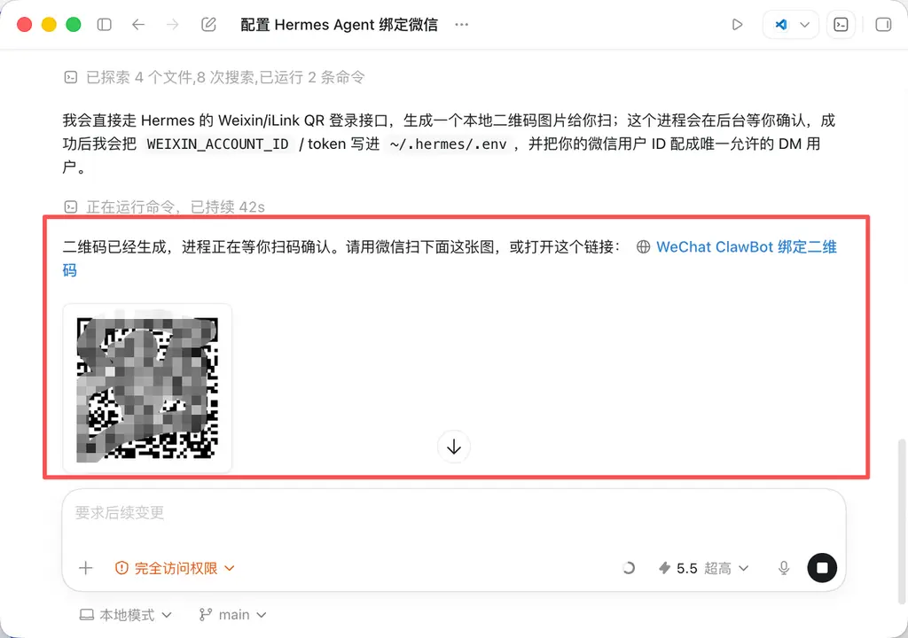
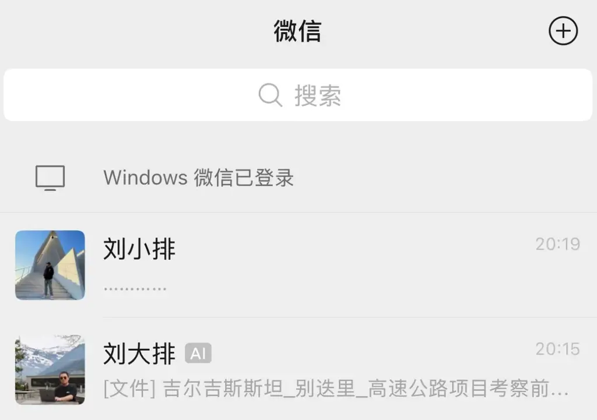
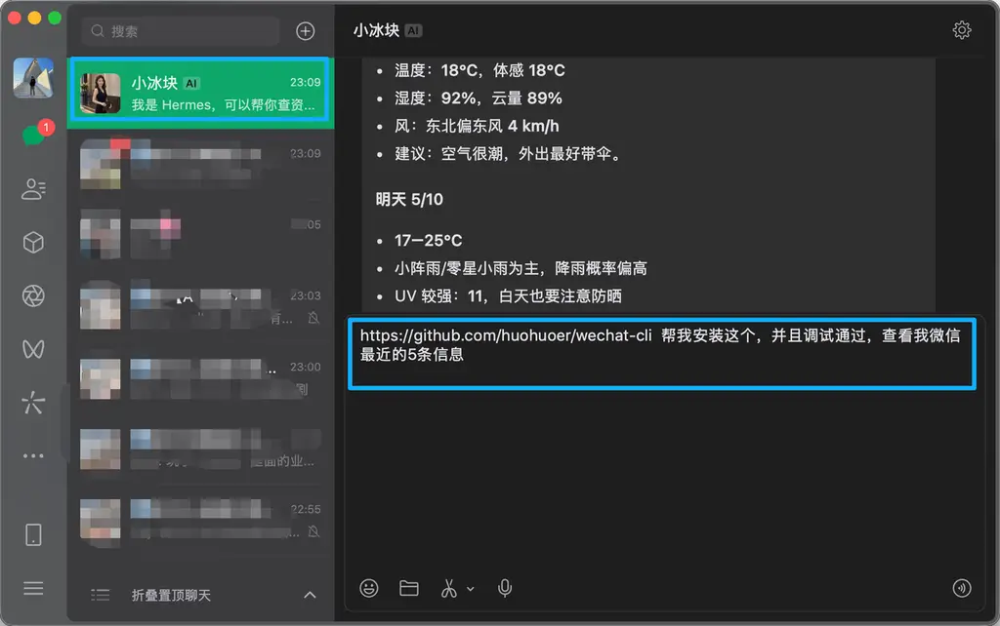
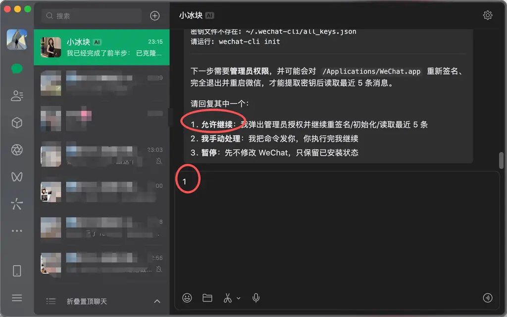
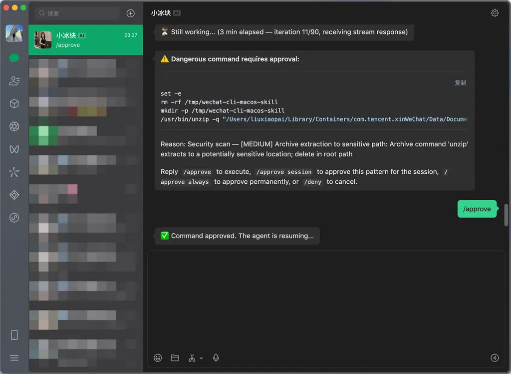
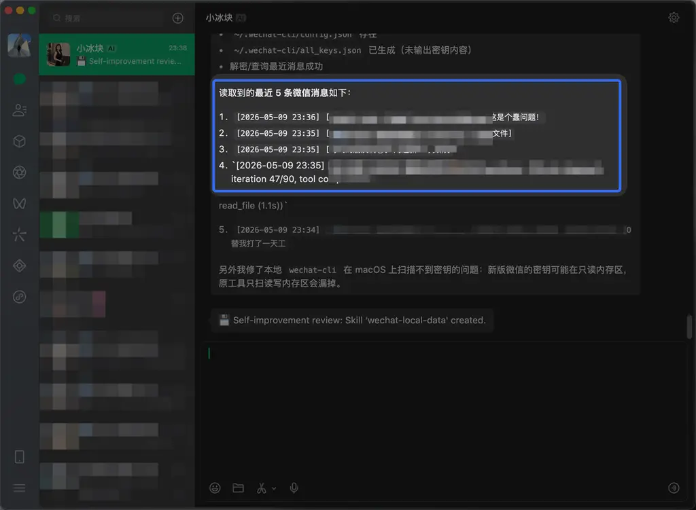
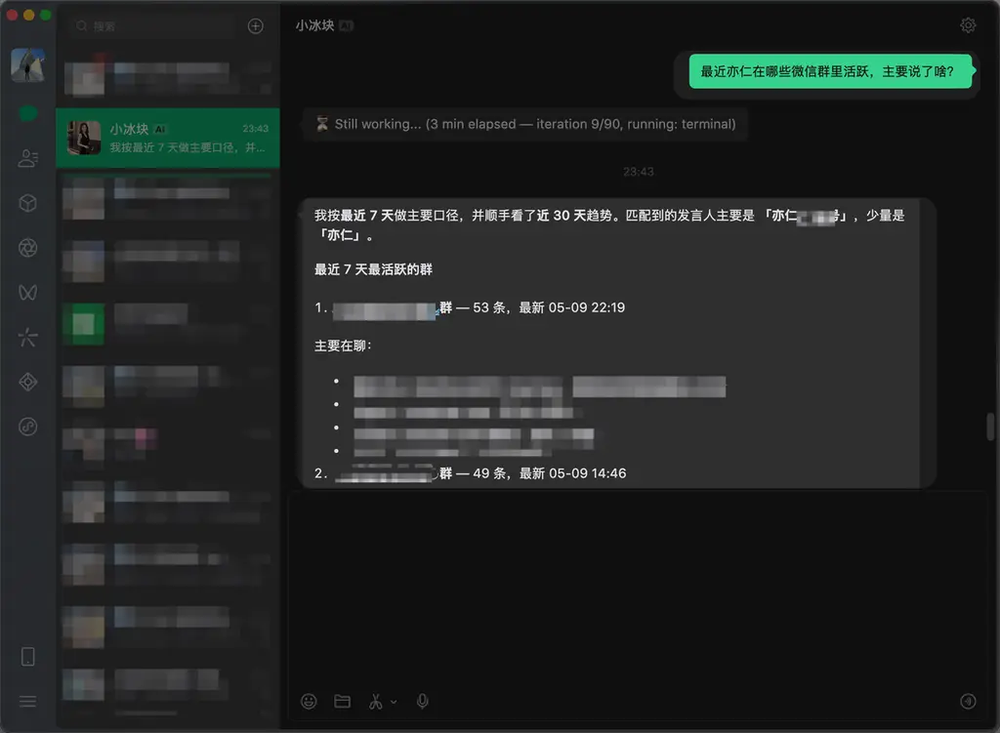

与小龙虾OpenClaw相比，Hermes是更适合大多数人的通用Agent，它发挥稳定、记忆能力强、能够自我进化。

今天看到亦仁的Hermes，还可以自动管理微信消息。他问Hermes“刘小排最近一周都说过啥”，Hermes把所有我和亦仁所有共同微信群里、我说过的话，全部总结了一遍。

安装Hermes难吗？ 不难，一句话就行了。

让Hermes自动管理微信消息难吗？不难，也是一句话就行了。

马上教会你。

## 前提条件

配置好海外的网络环境

已经安装上Codex Desktop，并且购买了ChatGPT Plus/Pro套餐。

开始了。

在电脑上随便建一个文件夹。

在Codex中选中这个文件夹。

注意：还需要选择Codex的“完全访问权限”，模型选择‘5.5 超高’。

输入以下提示词

在当前文件夹安装Hermes Agent， 让它使用我系统中的codex的GPT-5.5 xhigh模型

然后配置好，测试通过，并且让我扫码就可以直接绑定微信Clawdbot

然后去你去玩你的，Codex会自己完成Hermes的安装。

大概需要10分钟，会看到以下画面。

用微信扫码，绑定Hermes Agent。

对了，微信Clawdbot是可以改头像、改名字的。 看下面的图，你分得清哪个是我吗？

在微信里，给Hermes发消息

https://github.com/huohuoer/wechat-cli 帮我安装这个，并且调试通过，查看我微信最近的5条信息

发完消息后，它会一段时间不回复你，正常的，因为它在工作。

此时系统可能会弹出来一些要求你授权的弹窗，先允许。关于权限和安全问题我们文末单独提醒。

除了授权，其他我们不用干什么。

搞定了

接下来，我们就可以随便问了！

祝你玩得开心！搞成功的话，来这里说一声！

## 重要提醒

如果你是在主力电脑安装Agent，需要尤其注意安全问题。

如何注意呢？ 你直接问Hermes “目前运行环境是主力电脑机，有很多机密文件，要怎么才能够又安全又方便”。它会告诉你解决方案，你选择一个喜欢的，让它去做。
