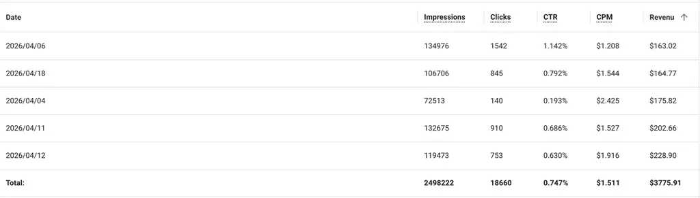

大家好，我是诗意听涛！

回头看这半年，**从完全不懂做站盈利，到现在日均生产 2-3 个游戏站并实现稳定营收**，中间经历了不少弯路。

# **时间线梳理**

## **1）2025 年 4 -7 月：第一次接触 AI，还没找到方向**

去年 4 月，我开始接触 AI 工具。

那时候 ChatGPT 这些已经火了一段时间了，但我之前一直没太当回事。

真正开始认真用，是在 生财有术 报了 小排老师 AI编程课。

但当时并不知道出海工具站怎么找需求，只觉得学到的这些AI工具（ChatGPT、Claude code）挺厉害，能帮我省少时间。

这段时间持续了好几个月，我一直在探索 AI 能做什么，但还没有找到一个具体方向把它变现，只是把它用在每天马工作上。

现在回头看，这段时间虽然"浪费"了不少，**但其实也是在积累对 AI 理解**。

后来能快速上手做站，很大程度是因为我已经比较**熟悉 AI 能力边界**——知道它能干什么、不能干什么、什么场下该用它。

## **2）2025 年 7 - 10中旬：发现哥飞社群和出海网站这门生意**

当时通过AI编程课有人直播分享哥飞，以及后续几个出海朋友陆续加入了哥飞群，因此我也付费加入了。

那段时间，像很多人刚加入群一样，每天就浏览群聊信息，偶尔看看论坛帖子。

进群后我才知道，**出海网站根本不是什么蓝海，而是已存在好多年、有一套成熟系统的商业模式。**

觉得社群最特别的一点是：**新词大赛**。我注意到榜单上很多人都是靠游戏站上榜的。

这让我第一次意识到：**原来游戏站是一个可以做的方向。**

但说实话，当时我对"游戏词"完全没有概念。不知道怎么找游戏新词，什么样的游戏有搜索量，不知道游戏站长什样，更不知道怎么从零开始做一个。

## **3）2025 年 10中旬 - 12 月：尝试做游戏站 + 疯狂踩坑**

一个偶然契机吧，我加入了一个游戏新词分享群（现在已经不运营了），一周会固定发一些游戏新词。

我就是那时候起，开始上班之余摸鱼，一步步开始做网站。

最开始是完全手动的。一个站从**买域名、调研关键词、写文章、搭网站、上线**，整个过程可能要花一整天。

不得不说，每一步对于新手都很困难。所幸我有两个工具。

**其一**

期间遇到任何问题，就直接来哥飞论坛调研、搜索找答案。

论坛文章能覆盖做出一个好网址所有必备信息了，例如下面这些：

- 谷歌趋势、常用 seo 工具
- GA 和 GSC
- 指标：PV、UV、跳出率、用户停留时长
- 首页关键词密度
- 一个关键词一个网页
- 内链和外链
- 多语言....

**其二**

下文总结，我会说一个独门时间管理方法论—— **N日计划**，即如何在有限时间，创造出最大价值。

我也是靠着这套方法论，快速逐步获得正反馈，积累技术和经验的。

这段时间，做了几十个站吧，慢慢把所有建站流程都熟悉了，也有一些词逐渐拿到了流量，做到日入十几刀吧。

## **4）2025 年 12 月 02 日 旧终点 & 新起点**

**这一天是我27岁生日，也是彻底结束大厂牛马生活的日子。**

过够了天天为了工作上毫无意义的事情、忍气吞声的生活。

领导脾气很难伺候，我当时积极主动地提了很多AI提效建议，但都被他否决了，理由是怕影响小组内部人饭碗，也因算有了矛盾。

到最后呢，公司业绩不行，公司为了股价，大裁员还是来了。

我也被丢出去拿了名额，但也获得了一笔不菲的创业启动资金。

**国内大公司发展到最后基本都丢失了创新，需要的只是一匹匹精通人情世故、任劳任怨的牛马。**

但也增强了我之后创业的使命感：**彻底摆脱各种牛马劳动（重复性、无积累）！**

在我看来，如果每天创业还苦逼，天天忙着做重复性劳动，那还不如工作稳定。

从那时候起，我离开呆了3年北京牛马之都，开始了现在和女朋友每隔三月换个地方的旅居生活。

## **5）2025 年 12 月 - 26 年 3 月 自动化探索**

游戏站具有不稳定性，很多游戏趋势虽然好，但受很多因素影响，不能保证 **所有游戏词都有流量。**

因此最好的策略是**多做站、分担风险（这一点学自：良辰美）**。

我之前的想法可能还是招人，拉亲戚或者女朋友一起干。

后面发现，大多数人（包括我自己）终究不是机器，效率低且不稳定，需要人强力管控。

但这就又回到了之前在公司流程化管理的那一套，我不想重蹈覆辙。

**幸好，我们处于AI时代，各种AI工具随风兴起**，如claude code、openclaw、codex。

因此这一阶段，我开始大量研究自动化技术。

并一步步实现了：定时挖新词、买域名、爬虫调研资料、写代码、上站、发外链、网站维护、加广告。

为了这套系统稳定，我写了无数skills，每天都要大量测试代码保障稳定性。

这算是当程序员好处吧，就算很多人说ai时代，写代码有手就行，但我觉得\*\*他们骨子里追求系统成本、效率、用体验的耐心，永远是这个浮躁时代稀缺的的闪光点\*\*。

一直到三月底，这套系统，已经可以并行做3-4个站，每个站大概3-4个小时左右。

只要我想做，现在一天做10+个站也没有问题。

做站已经实现彻底解放双手，只需要输入域名，就可以帮我实现全自动化做站。

# **关于那个爆了的游戏站**

4月份，我参加了哥飞社群的新词大赛，获得了第五名。

说起来有意思，前七名里除了我以外，基本都在做 SBTI 那波性格测试的热点。

获奖那个站，这是我三月底全自动化上线的一个站。

**但我没有想到，使用这套AI自动化流程的第一站，就🔥了。**

刚上线就获得了 每天100+刀 广告费。

高峰时期，达到了 每日200+刀 的广告费。

我4月总收益也达到了**3700+**刀，追上了我当牛马时的税后收入。

这也给我了一剂定心针，做网站真的是可以赚大钱、当主业的。

不用再过每天被人拿着鞭子驱使，受牛马窝囊气的日子。

# **做站心得**

下面把近半年做站的专用经验和通用经验都分享、梳理下。

## **1. 怎么找到有流量的游戏词**

核心方法其实很简单：**词根 + Google 联想词 + ChatGPT 筛选。**具体来说：

-   先确定一个词根，比如 "xxx game" 或 "xxx guide"

-   在 Google 搜索框里输入词根，看 Google 自动补全的联想词

-   把这些联想词全部记下来，扔给 ChatGPT

-   让 ChatGPT 帮你分析：这里面哪些是还没上线或者刚上线的新游戏？哪些游戏的搜索量在快速上升？

-   重点跟进那些有热度但竞品还不多的新游戏

这个方法看起来很原始，但确实有效。Google 联想词本身就是用户搜索意图的最直接反映。

## **2. 游戏站流量的现实**

我要诚实说一点：**不是所有游戏站都能爆。**

我日均3个，4 月使用全自动化做了近百站，流量特别好的可能就那么十几个。

大部分站的流量是中等水平，每天几十到几百 UV。

还有一部分站，上线之后基本没什么流量。

流量好的站有几种情况：

-   赶上了游戏的爆发期，提前铺好了内容

-   游戏本身的搜索量特别大（比如 Steam、Roblox 这种平台型游戏）

-   关键词选得好，竞争不太激烈但搜索量不错

流量不好的站也有共性：

-   游戏本身热度不够

-   进场太晚，竞品已经占满了搜索结果

-   游戏凉了，搜索量自然掉下去了

所以不要指望每个站都能爆。

做游戏站更像是在播种——多撒种子，总会有几个长出来的。

## **3. N日计划**

下面开始讲解我上文提到的独门方法论。

我自己在工作和创业期间，有时候经常被一件事情所困扰：

**每天好像给自己安排了很多事情，列很多todolist。但是一天过完后又看不到明显价值，没获得什么正反馈，没有让自己觉得一天没白过的感觉。**

但我是个擅长反思的人，很快想明白了——**精力被分散了**。

人总是容易自大或者被周围环境影响所焦虑，觉得每天至少给自己安排3-7件事情，才算不虚度。

但相反，**真正厉害的人，反而是花3-7天，集中注意力只做一件事的人。**给大家举个例子：

比如大家都知道**外链很重要**，那你有没有**单独为外链花费3天**，甚至更长去集中攻克。

**第一天：调研和做**

你集中阅读了哥飞论坛或者群聊消息的所有外链信息，将觉得有价值方法论或外链都记录下来。

然后就马上开始do it，不要纸上谈兵。

这个取决于每个人水平，比如你的自动化水平很高，那你就直接开发skills，派发大模型去远程服务器浏览器上自发送。

嗯，第一天差不多就这样了，发完以后可能成功率40%吧。

**第二天：优化**

睡了一觉，你的精力恢复了一些，你对发外链这件事又燃起了斗志。

你开始继续研究昨天发外链这件事，哪些导致了成功率降低？

例如，你发现登录基本都要邮件验证、需要通过claudfare等验证机制等。

你调研了网络资料，开发出谷歌邮箱、通过网页验证码等skills，方便自动化快速通过验证。

并优化了外链skills的各种细节，发完以后，可能最终自动化成功率来到了70%。

**第三天：批量化 + 自动化**

睡了一觉，你的精力恢复了一些，你对发外链这件事又燃起了斗志。

你开始去各平台大量收集各种外链，然后开始大批量让skills发送这些外链，并将所有成功外链（可能大几百条）

沉淀下来。

之后所有站，都可以使用这些已经验证过的外链。

如此，经过3天沉淀，你外链速度和质量，差不多可以超过了60%的0外链竞对。

**最后，最关键的是将外链自动化，嵌入到整个环节里，实现全自动化。**

**----------**

举着个例子目的，不是为了让大家都去卷外链，而是更好地理解这套方法论。

外链是新手到了大后期才需要做的事情，据我观察，很多站基本没有发外链，依然能排在游戏词前几名。

**每个人当前优先级最高（卡点或认为最有价值事情）是不一样的。**

比如你刚开始做网站，那可能需要花3-7天认真研究下如何 挖掘新词。

举这个例子，是想大家明白：

**成功不是一蹴而就，而是用耐心将一件件小事，做到极致。**

**唯一加速方法：不断选择眼前优先级最高（最有价值）事情 聚焦打通，让每一步的正反馈来的更快一点。**

## **4. 后续改进点**

前段时间太忙于自动化技术，而忽视了业务。

一直在想**技术上如何更好实现**，而忽略了**用户体验：什么样的网站是用户最喜欢的**。

但这其实也是正常的，**因为人的另一个特性：就是很沉醉在舒适区。**

最极端例子：例如一个人工作牛马呆太久了，他所有心思也都在各种跳槽、升职加薪上。

最后一干就是30-40年到退休或中年危机，也不会向外看，哪怕一眼。

所以，这也是我为什么在北京只工作3年，就在大家以为最风华正茂的年龄出来创业的原因。

我的下一个**N日计划：大力提升用户体验。**

# **最后说几句**

游戏站这条路，好处是可以持续积累、可以自动化、可以规模化。

对我来说，这是一个更可持续的模式。

与其赌一个爆款，不如把流程打磨到极致，靠量来取胜。

现在每天的节奏基本是固定的：

早上起来看看飞书通知的新词，没问题就发起全自动化上站流程。

整个流程花不了多少时间，剩下时间可以用来研究新方向，做下一个N日计划。

关于未来，我会在今年底做一个全面评估，看看这条路是否还值得全职做下去。

但至少目前来看，方向是对的，营收也是比较稳定的，我对这个模式很有信心。

好的，写到这里，我想说的也就说完了，感谢大家的耐心阅读\~

如果您也在做网站，希望这篇文章能给您一点启发。
