我是碎雪，一名工作贼卷的大厂前端程序员。本次航海，我这20天的视频 SaaS 航海经历主要是： 0做到上线，打通支付、做完SEO、投完Google Ads、发完外链。虽然整个过程中为了快速跑通流程投入了很多，但也确实把整个链路跑通，也确认了这条路真的能继续走。目前 400+注册，已出单。

## 一、开局先说问题！踩过最致命的坑：程序员的“先做后想”陷阱

作为前端，建站对我来说不算难，AI工具也用得熟练，加上本次课程以视频SaaS为切入点，一开始就陷入了典型的程序员思维：**先把网站做出来、跑通流程，再慢慢优化需求**。

找对标、克隆模板、对接数据库、API、邮箱，改页面、LOGO、配色，上线、绑域名、开支付，一套操作行云流水，我甚至还花时间把网站改得很炫酷。但全程我都在做自己熟悉的事，却从来没认真想过：这个产品到底给谁用？能解决什么核心痛点？用户凭什么买单？其实过程中教练和助教都提过这个问题，我当时想的是先把会的做了再整不会的，结果来看教练说的也是对的，没有考虑清楚就做，转化率低的可怜。

个人感觉“先做后想”只适合大公司——他们有足够的人才、预算和信任背书，能先做通用功能再找用户；但对我们普通人、个人创业者来说，**先功能后需求**，沉没成本真的很高。

### 新人阶段应该先想什么？

我觉得这个话题因人而异，但是总有共性，从多位教练给的反馈，和个人经验。分几个阶段聊一下我自己一个新人阶段的看法。

**上站前**

用户是谁？用户凭什么买单（精准到 “什么样的人 / 什么场景”）

我能不能快速做到 （这一点因人而异，毕竟 AI 虽然强但是也有上限）

对标有谁？他们的问题是什么 （我之前觉得没有对标最好，后面忘记是哪位教练说的：没有对标大概率是个伪需求）

怎么快速验证

**上站后**

我从哪里获取客户

从这个渠道获取的客户消费意愿如何

怎么让客户转化

怎么根据数据反推系统问题

## 二、然后聊一下经验 - 20天实操记录

建站-上线-接支付这一套流程就不说了，航海课程里最大的篇章：https://scys.com/course/detail/146?chapterId=9564 就是在讲这个，已经很清楚很透彻了。大家按部就班的做就能上线。

说一下其它方面我踩的坑和经验吧。

### （一）SEO与流量：广告+外链

#### 1. Google Ads 实操（避坑重点）

-   **找对地址**！！

我们是给网站投广告，进「Google Ads」 https://ads.google.com ， 我刚开始进的 AdSense（那是在网站挂广告赚钱，完全跑偏），流程走着走着才发现不对劲。

-   **国内用户避坑**：如果你没有海外银行卡，就**所有信息全选中国、货币设人民币**，否则支付会强制跳海外方式（我当时在这卡了很久），如果你到某一步发现需要输入钱的地方是 $ ，就回去找到底哪里设成了国外，可能出错的地方我在下面标了一下。 这样最终可以直接银联支付

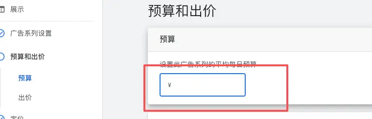

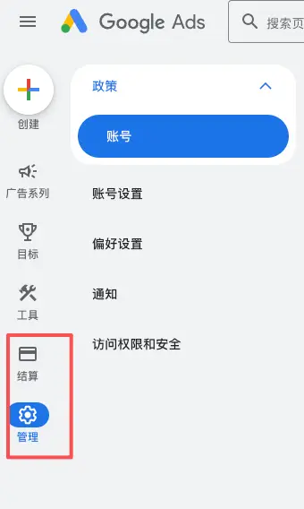

-   **素材准备**：提前准备PC/移动端首页截图、YouTube产品视频（我没做，建议有能力的同学把这部分做了，之前看到某篇文章说加了YouTube产品视频效果非常好）；

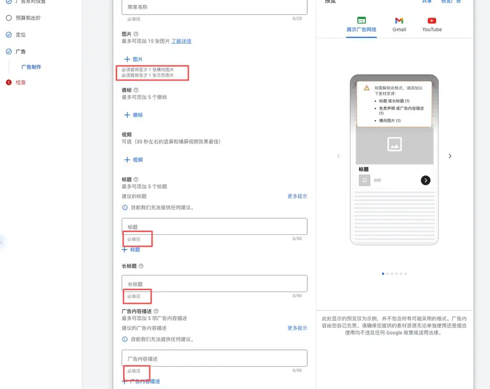

-   **预算**不用猛砸，我充1500元4天就烧完，其实几百块就够验证，选低档预算慢慢试就行。

-   **优化技巧**：每天到这个位置看一眼后台，谷歌AI会自动给受众、关键词优化建议，我觉得是直接采纳就行，不用自己瞎调，他们是有大量用户特征数据，结合 AI 分析做的。

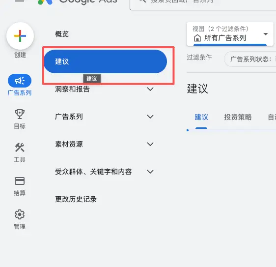

#### 2. 外链建设

**核心流程：**

这个其实是 A梦教练在4 月 8 号直播的时候的方法，直播当天下午我恰好沉淀了一个一样流程的 skill

流程就是用Semrush（国内套壳版）扒对标网站的外链，导出表格丢给AI，让AI根据对标网站的外链产出我们的外链方案和给出执行清单。这里我建议多做几个对标，让 AI 整体分析。下面自动化部分我会分享这个 skill 是怎么沉淀的。

**实操细节**

1.  AI推荐的平台要甄别，但要贴合自己的用户群体（我个人感觉有几个 AI 工具的大站，确实有流量，但是引来了大量的营销人员）；

2.  提前准备好内容，让AI 生成多个版本，放外链的时候，不同网站要求不同。描述要求 50/100/200 字的都有，还有截图和商标图都需要准备。

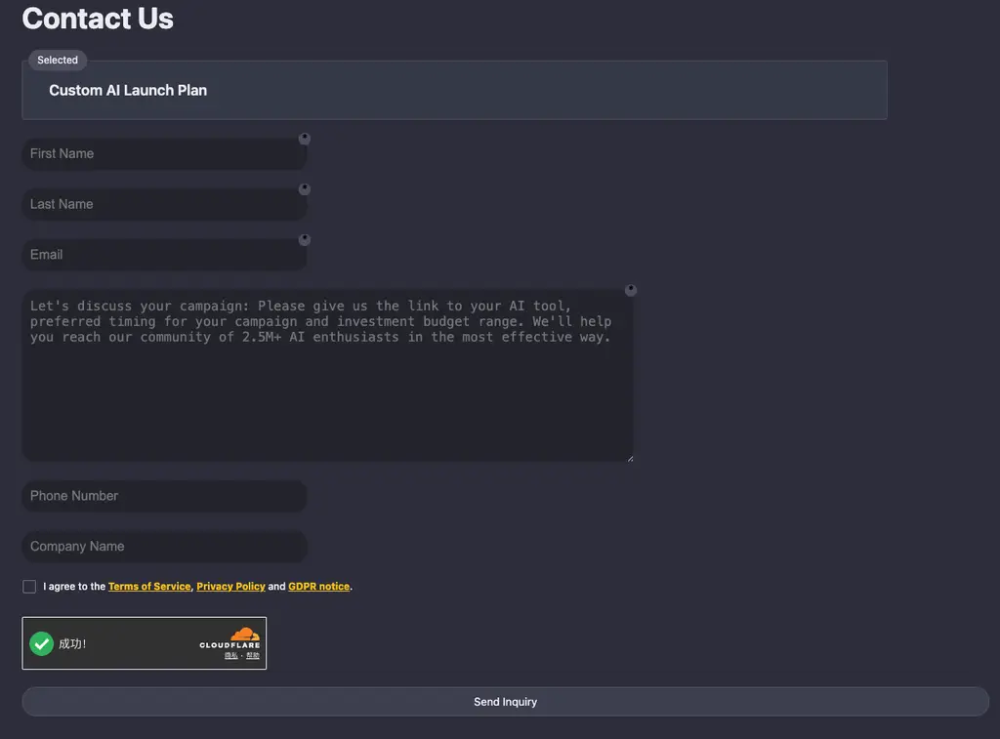

3.  有一种方式是反链接，互相放链接，把这些内容扔给 AI，AI帮你处理就行；

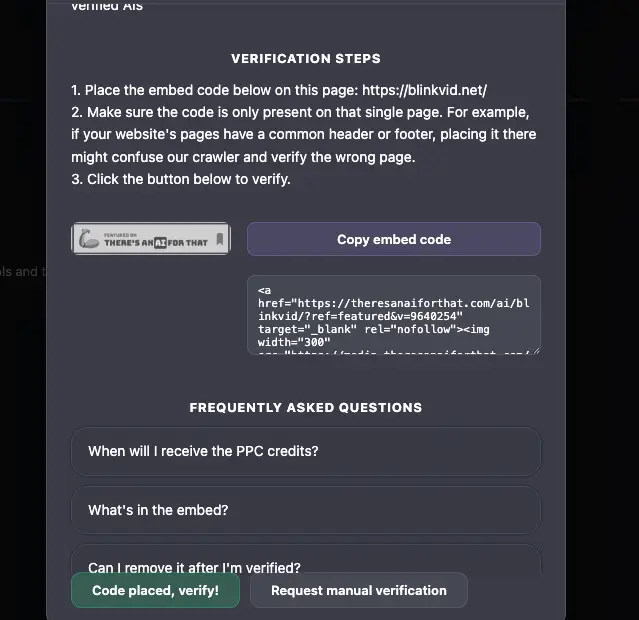

4.  软文博客效果好，但耗时久，而且我觉得 AI 写的可能不一定符合预期。 这里如果确实希望让 AI 查出软文，而且还没有形成自己的思路和方案的时候也可以去skill 里搜一下，这种泛需求肯定是存在大量的开源实践，理论上选择下载最多的那个就可以。 我没推进到这一步，就不过多说了，有专业的大佬可以给点建议。

### （二）网站优化

这里我也只能分享一下我的实际做法给大家参考，但是这些做法的作用是很难界定的，毕竟我目前没有依靠这些做法出单的。但优化技巧本身有用，整理出来给大家参考：

#### 1. SEO关键词与内页布局

-   实操方法：

    -   用课程里说的AITDK 去抓对标的完整词结构，这个插件可以点进网站里面，网站内可以直接导出这部分数据。

        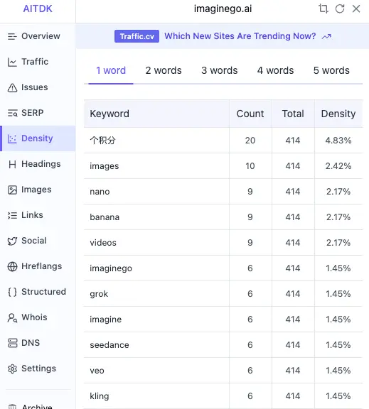

    -   用Semrush抓“**真正带来流量的词**”

        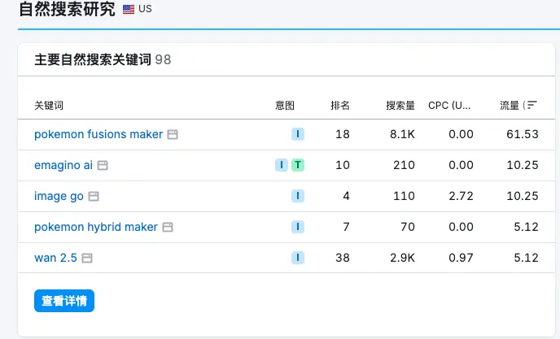

这两个我动作我都建议找多个对标网站，抓好关键词后和 AI 讨论着来。

-   关键动作：找到流量高的核心词，可以单独做内页承接，比如上面的 pokemon fusions maker 对标网站就是做了一个落地页，不过我这两天去看已经下掉了，看来是这个词没那么热了。

#### 2. 交互与性能优化

-   交互优化：直接参考优质对标，也可以用f[rontend-design](https://www.skillhub.club/skills/anthropics-skills-frontend-design)这类Skill让AI帮忙优化；自己多体验，卡顿、不流畅的地方，直接丢给AI修复。

-   性能优化：页面速度是会影响谷歌SEO，用浏览器自带的Lighthouse跑性能报告（偶尔全红报错是谷歌BUG，重跑一次就好）；导出JSON报告丢给AI，跟他说 ：

这是Lighthouse跑的性能数据，让他优化，原则是不影响功能 这个操作流程是在网站里右击-\>选择检查 浏览器打开右侧调试台 点更多 找Lighthouse点击 - 进去之后点击分析 - 等待分析完成 - 参考最后一个图

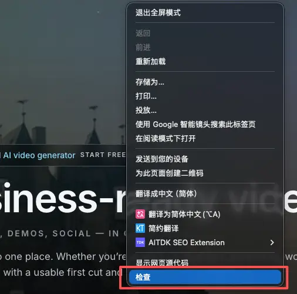

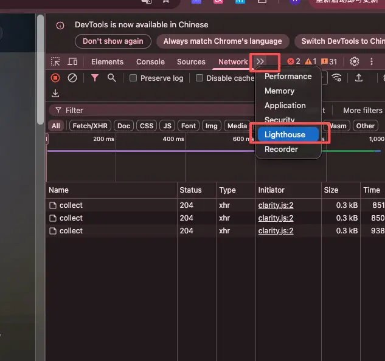

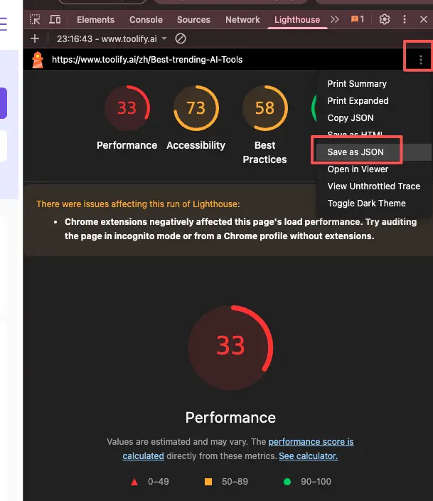

#### 3. 数据分析与转化漏斗

-   我接入了GSC（谷歌搜索控制台）、Clarity（用户录屏），也自建了数据分析面板。在课程里都有就不赘述了。

-   实用技巧：

    -   Clarity录屏能看到用户卡在哪、有没有误点击，还能和Google Ads联动，反向优化广告定向；

    -   完全没思路时，把流量、注册、转化数据丢给AI，让它帮你定位问题，比自己瞎猜高效得多。

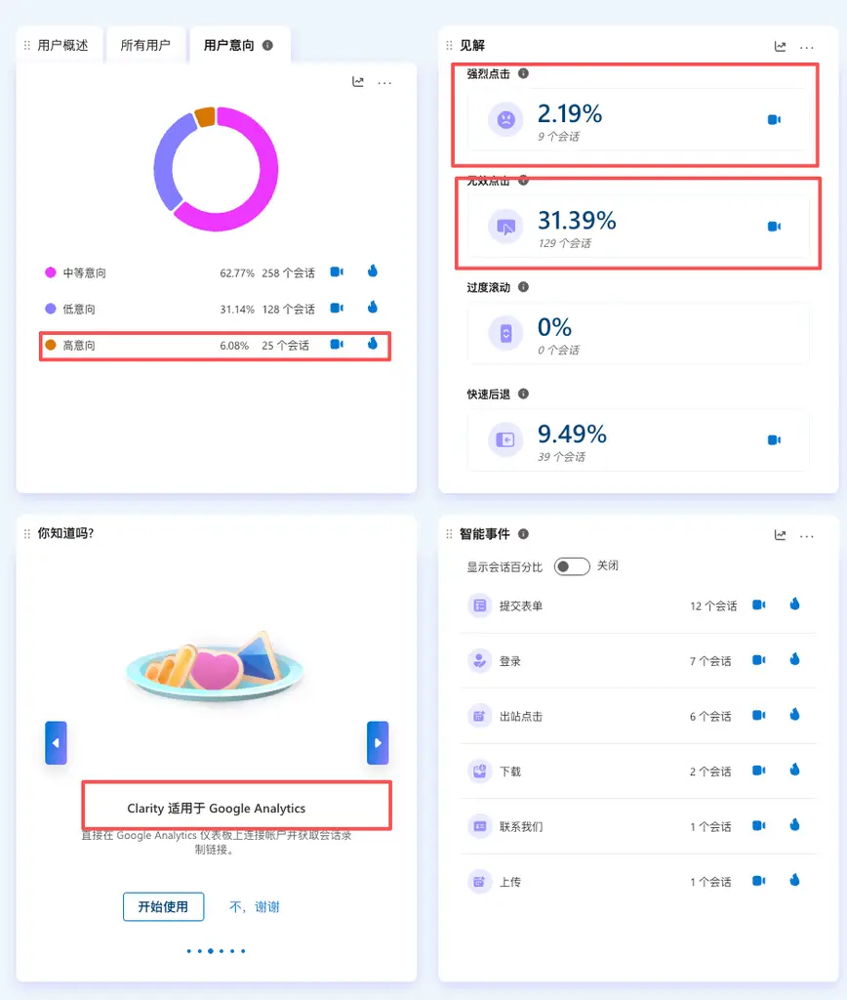

### （三）AI 提效

#### 接入飞书机器人- 上班摸鱼神器

其实网上有很多的龙虾教程，我这里尝试过龙虾，但是实践下来我个人不太喜欢，感兴趣的可以自行搜索。我这里分享一下把 claudecode 或codex 直接接入飞书的做法

https://github.com/chenhg5/cc-connect/blob/main/docs/feishu.md用cc-connect对接大模型，集成飞书机器人，把安装文档丢给AI，它会直接生成完整配置命令，不用自己啃文档；把飞书机器人的AppID、Secret复制给AI，就能自动完成集成。

https://open.feishu.cn/app?lang=zh-CN

https://github.com/chenhg5/cc-connect/blob/main/docs/feishu.md

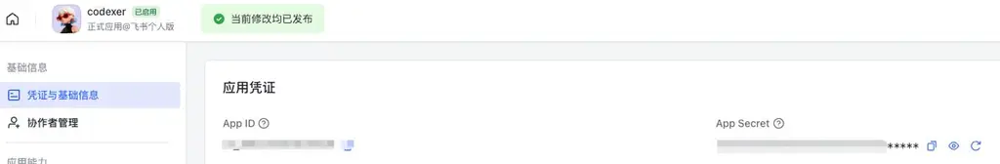

#### 流程自动化

**外链建设** 前面说到 A梦教练教我们的做外链的方法可以让 AI 去做自动化，其实做法很简单，就是让 AI 自己生成自动化流程。

前面也说的流程就是 ： 扒对标网站的外链，导出表格丢给AI，让AI根据对标网站的外链产出我们的外链方案和给出执行清单，我这里加了一部让 AI 自动写入某个项目推动到 github 仓库，因为方便我不在家也能看到。

我们做法就是一步步和 AI沟通，直到最终的结果是对的，然后直接让 AI 总结前面的步骤生成 skill ，当然生成之后大部分情况还是需要不断调整，下面就是我做的时候的几个关键步骤的对话，供大家参考。

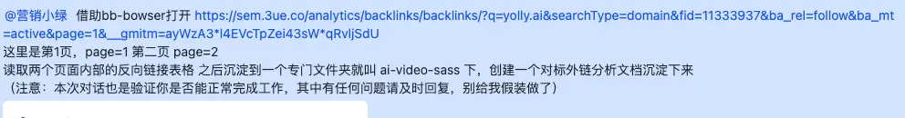

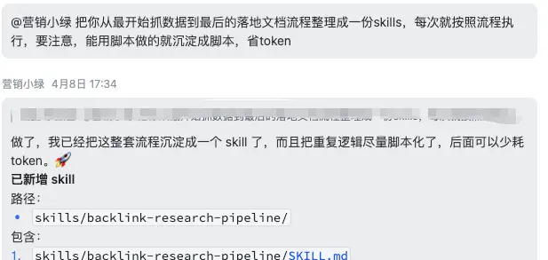

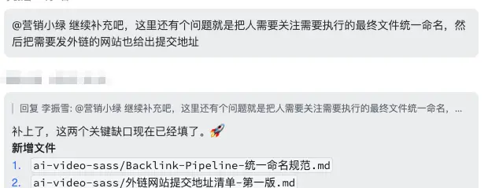

**需求挖掘**

小排老师做了一个skill https://mp.weixin.qq.com/s/VaO48MwOAXfXD-8SNkhHoQ 推荐大家试一试。

我这里也就不展开是怎么做的了，具体方法和上面一样。 我自己的实现流程其实是 小排老师 这个需求挖掘Skill 加上深海圈锐钦教练的文章里“确认是不是真实需求” 两部分能力的结合。 整理思路是让 AI 每天去走一遍需求挖掘的流程，然后周末总结这些，做个排序，选出最值得做的两件事。

然后去各个平台查看竞品差评；查看吐槽讨论；查关键词；然后让 AI 按照一个固定结构做意图分析和评分，最终给一个初步判断，确认是不是真实需求。

推荐

-   我这两个流程都需要获取网站上的数据， 是使用一个工具把网站数据扒下来的流程。这个工具推荐给大家: https://github.com/epiral/bb-browser ，可以把文档扔给 AI 让他自己学。 它适合获取一些准确数据，跑的时候就像下面一样，真实自动打开浏览器查找。

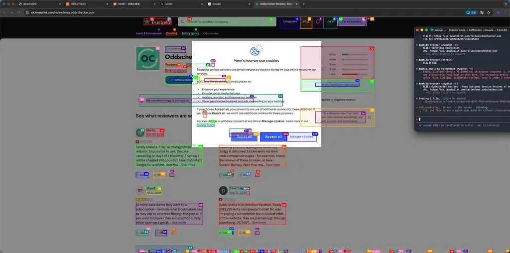

-   Semrush真心建议淘一个尝试一下。

**Skill使用建议**

如果嫌麻烦可以直接去skillhub.club找现成Skill（中文资源多、方便上手）。 我个人是习惯封装成自己的Skill，更贴合个人节奏。

## 三、最后复盘总结

在亦仁的直播里学了一招：把20天的所有打卡日志丢给AI，让它帮我找思维漏洞。结果比我自己反思狠得多、准得多：目前正在和AI沟通，复盘之前的问题、探讨后续方向——是开新站，还是在现有网站上优化，让它给出具体规划。

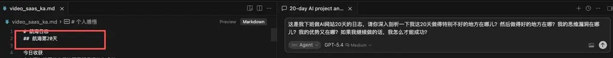

1.  先痛点，后产品；先需求，后功能——方向错了，努力全白费；

2.  用户搞不懂你干嘛的，你再厉害也白搭，定位要清晰、直白；

3.  首单的重要性，远高于100次点击，早期先验证付费意愿，再谈规模；

4.  能做很多事，不代表要做所有事，别用忙碌掩盖迷茫；

5.  需求不是脑补的，是谷歌上用户搜的、Reddit上用户问的，要落地挖掘；

6.  自动化是上班族的核心杠杆，能省出时间，聚焦最核心的需求问题。

最后其实没想到在写这篇文章的时候出了第一单，也确实给了自己很大信心。 目前对提高转换也有了一点思路，只是未经验证不好乱说，如果后续有更大的进步也会继续分享～

### 补充分享：一个有意思的流量小发现

最后分享一个小插曲，也给大家一个启发：

我最开始找谷歌热词时，看到一个“宝可梦生成器”的词，当时觉得这玩意根本做不了网站。但前几天找对标时发现，有一个新视频站，上个月70%的搜索流量都来源于这个词，只是现在这个词没热度了，网站也下掉了落地页。

我不知道它靠这个词有没有赚到钱，但这件事给了我两个感悟：

1.  把“按套路执行”做到极致，也能抓住意外的流量机会；

2.  真正重视需求挖掘，看到一个词，第一反应应该是：这是哪类群体的需求？需求是否真实？我能怎么提供服务？

以上就是我视频站航海的全部总结， 最后衷心祝愿大家都能早早出单，早早月入万刀！
